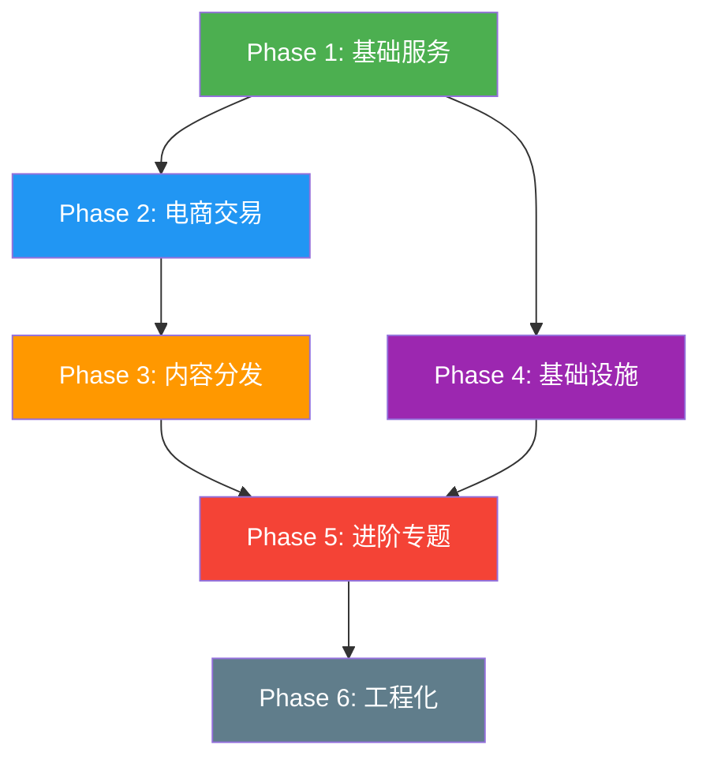

# my-xhs 项目文档中心

> 对标生产环境的小红书 — 社交+电商微服务系统，可上线运行

---

## 一、项目简介

| 维度 | 说明 |
|------|------|
| **项目类型** | 社交+电商微服务（小红书模式：内容驱动消费） |
| **核心链路** | 用户注册/登录 → 浏览笔记(Feed流) → 社交互动(赞/评/关/藏) → 浏览商品 → 加购 → 下单 → 履约 |
| **量级目标** | DAU 100万 / 日订单5万 / 商品SKU 100万 / QPS峰值1万 / 可用性99.95% |
| **项目原则** | 纯后端、不依赖云厂商、全基础设施Docker一键拉起、支付模拟实现 |

---

## 二、技术栈一览

### 应用层

| 类别 | 技术 | 版本 |
|------|------|------|
| JDK | OpenJDK | 17 |
| 核心框架 | Spring Boot | 3.2.x |
| 微服务 | Spring Cloud | 2023.0.x |
| 微服务Alibaba | Spring Cloud Alibaba | 2023.0.1.0 |
| ORM | MyBatis-Plus | 3.5.7 |
| API文档 | SpringDoc | 2.x |
| 认证 | JWT (jjwt) | 0.12.x |
| 构建 | Maven | 3.9.x |

### 中间件

| 技术 | 用途 |
|------|------|
| Nacos | 注册中心 + 配置中心 |
| Spring Cloud Gateway | API网关（鉴权/限流/灰度/染色） |
| Sentinel | 限流熔断 |
| RocketMQ | 异步解耦 / 事务消息 / 延时消息 / 顺序消息 |
| Redis Sentinel | 缓存 / 分布式锁 / 计数 / 排行榜 |
| Elasticsearch 8.x | 全文搜索 / 搜索建议 |
| Canal | MySQL binlog → MQ → ES/缓存 |
| XXL-Job 3.0 | 分布式调度 |
| SkyWalking | 全链路追踪 |
| Prometheus + Grafana | 指标监控 + 告警 |

### 存储

| 技术 | 用途 |
|------|------|
| MySQL 8.0 (1主1从) | 业务数据 + ShardingSphere读写分离 |
| ShardingSphere 5.4.1 | 订单/优惠券分库分表 |
| Redis Sentinel (1主2从3哨兵) | 分布式缓存 |
| 本地磁盘 | 笔记图片存储（可切OSS） |

---

## 三、模块架构

```
my-xhs/
├── my-xhs-common/           # 公共基础（雪花ID、分布式锁、幂等、通用工具）
├── my-xhs-gateway/          # API网关（JWT鉴权、HMAC签名、限流、灰度、流量染色）
├── my-xhs-user/             # 用户服务（注册/登录/JWT双Token/收货地址）
├── my-xhs-content/          # 笔记服务（发布/审核/评论/楼中楼/DFA敏感词）
├── my-xhs-analytics/        # 社交服务（关注/点赞/收藏/推拉结合Feed流）
├── my-xhs-counter/          # 计数服务（赞/藏/评/粉，Buffer-Trigger批量刷盘）
├── my-xhs-home/             # 首页聚合服务（BFF聚合层，推拉混合Feed、并行聚合）
├── my-xhs-product/          # 商品服务（SPU/SKU、多级缓存、HotKey探测）
├── my-xhs-cart/             # 购物车服务（Redis三结构、匿名合并、异步持久化）
├── my-xhs-inventory/        # 库存服务（分桶预扣减、Lua原子扣、三级扣减）
├── my-xhs-coupon/           # 优惠券服务（Lua原子领券、责任链校验、推送引擎）
├── my-xhs-order/            # 订单服务（状态机、事务消息、分库分表、异步编排）
├── my-xhs-payment/          # 支付服务（接口抽象+Mock实现）
├── my-xhs-search/           # 搜索服务（ES双索引、搜索建议、热搜滑动窗口）
├── my-xhs-notification/     # 通知中心（MQ异步分发、SSE推送、Bitmap已读）
└── my-xhs-im/               # 即时通讯（WebSocket私信、会话管理、已读回执）
```

### 服务端口规划

| 服务 | 端口 | 服务 | 端口 |
|------|------|------|------|
| Gateway | 9000 | User | 9001 |
| Content (Note) | 9002 | Analytics (Social) | 9003 |
| Counter | 9004 | Product | 9005 |
| Order | 9006 | Payment | 9007 |
| Inventory | 9008 | Cart | 9009 |
| Coupon | 9010 | Search | 9011 |
| IM | 9014 | Home (BFF) | 9015 |

---

## 四、开发步骤详细规划

> 项目按照 **6个Phase** 递进式开发，每个Phase有明确的目标、交付物和技术重点。

### Phase 1：基础服务（7个功能）

> 🎯 目标：跑通核心社交链路，用户能注册、发笔记、互动

```
01-用户注册登录        →  用户服务：JWT双Token、图形验证码、@RateLimit防刷、BCrypt加密
02-收货地址管理        →  用户服务：地址CRUD、默认地址、上限控制
03-笔记发布与审核      →  笔记服务：发布状态机、图片上传、DFA敏感词过滤
04-评论系统            →  笔记服务：楼中楼评论、评论审核、评论举报
05-关注与社交关系      →  社交服务：ZSet关注列表、共同关注、Lua原子操作
06-点赞收藏            →  社交服务：幂等设计、Redis Set存储、异步落库
07-计数服务            →  计数服务：Buffer-Trigger批量刷盘、对账修复
```

**Phase 1 核心技术点**：
- JWT双Token机制（Access 30min + Refresh 7d）
- DFA敏感词算法（10万词库毫秒级匹配）
- Buffer-Trigger计数批量刷盘
- Redis ZSet替代List存关注关系
- Lua脚本原子操作（关注+计数）

---

### Phase 2：电商交易（6个功能）

> 🎯 目标：跑通电商核心链路，用户能浏览商品、加购、下单、支付

```
08-商品SPU-SKU         →  商品服务：SPU/SKU模型、多级缓存（Caffeine+Redis+MySQL）、HotKey探测
09-购物车              →  购物车服务：Redis三结构（Hash+Set+ZSet）、匿名合并、异步持久化
10-库存扣减            →  库存服务：4版本演进→分桶预扣减、Lua原子扣减、三级扣减（Redis→MQ→DB）
11-优惠券              →  优惠券服务：Lua原子领券、责任链校验、XXL-Job推送引擎
12-订单与支付          →  订单服务：Spring StateMachine、RocketMQ事务消息、分库分表、快照
13-消息推送与通知      →  通知中心：MQ异步分发、SSE实时推送、Bitmap已读状态
```

**Phase 2 核心技术点**：
- 多级缓存架构（Caffeine本地 + Redis分布式 + MySQL）
- 分桶预扣减 + 桶间自动均衡
- RocketMQ事务消息 + 本地消息表兜底
- ShardingSphere分库分表（订单/优惠券）
- Spring StateMachine订单状态流转
- Bitmap存储已读状态（空间节省99%）

---

### Phase 3：内容分发（4个功能）

> 🎯 目标：跑通内容分发链路，用户有个性化Feed流和搜索体验

```
14-Feed流首页          →  首页聚合服务：推拉混合模式、大V优化、CompletableFuture并行聚合
15-搜索与搜索建议      →  搜索服务：ES双索引设计、Completion Suggester、Canal增量同步
16-热搜榜              →  搜索服务：ZSet滑动窗口实时计算、时间衰减算法、防刷策略
17-推荐系统            →  搜索服务：5路召回（协同过滤+内容+热门+关注+地理）、粗排精排
```

**Phase 3 核心技术点**：
- 推拉结合Feed流（大V拉模式、普通用户推模式）
- BFF聚合层（6个服务CompletableFuture并行）
- ES增量同步（Canal + MQ）+ 全量重建（XXL-Job分页断点续传）
- 热搜滑动窗口 + 时间衰减 + 防刷
- 多路召回推荐架构

---

### Phase 4：基础设施（3个功能）

> 🎯 目标：补齐基础设施，系统具备生产级接入和治理能力

```
18-API网关             →  网关服务：JWT鉴权、HMAC签名校验、Sentinel限流、灰度路由、流量染色、API版本路由
19-即时通讯IM          →  IM服务：WebSocket、消息存储、已读回执
20-分布式基础组件      →  公共模块：雪花ID（CosId）、@DistributedLock注解、@Idempotent注解、@RateLimit注解
```

**Phase 4 核心技术点**：
- Gateway GlobalFilter链式处理
- HMAC-SHA256签名验证（防篡改+防重放）
- 灰度路由（Nacos元数据 + Gateway路由）
- 全链路流量染色（Feign + MQ + 异步线程透传）
- 4个自定义注解（幂等/分布式锁/限流/JWT）

---

### Phase 5：进阶专题（8个专题）

> 🎯 目标：解决跨服务的架构难题，系统具备高可用、高性能基础

```
21-缓存一致性方案      →  Cache Aside + 延迟双删 + Canal异步兜底
22-分布式事务          →  RocketMQ事务消息 + 本地消息表 + 死信队列处理
23-全链路流量染色      →  压测隔离、影子表、染色标记透传（Feign+MQ+异步线程）
24-性能优化与压测      →  JMeter压测计划、GoReplay流量录制、调优记录
25-监控告警体系        →  Prometheus + Grafana + SkyWalking + 告警规则
26-分库分表实战        →  ShardingSphere配置、订单/优惠券分片、分片算法
27-Canal数据同步       →  Binlog监听→MQ→ES、增量+全量重建、断点续传
28-优雅停机与服务治理  →  Nacos优雅下线、健康检查、异常分级处理
```

**Phase 5 核心技术点**：
- 缓存一致性三重保障（延迟双删 + Canal + 对账）
- 分布式事务最终一致性方案
- 全链路TraceId透传
- 分库分表实战（ShardingSphere + CosId雪花ID）
- 完整可观测性体系

---

### Phase 6：工程化与生产力（13个专题）

> 🎯 目标：系统具备生产级运维和工程化能力，可安全上线

```
29-混沌工程与故障演练    →  ChaosBlade 7场景、演练报告
30-安全合规体系          →  HMAC签名、BCrypt、XSS过滤、RBAC、审计日志
31-日志体系与可观测性    →  JSON结构化、Promtail→Loki→Grafana、TraceId关联
32-CI/CD与自动化部署     →  Jenkins Pipeline、Docker多阶段构建、K8s灰度发布
33-测试策略与质量保障    →  测试金字塔、Testcontainers、契约测试
34-数据备份与容灾        →  RTO/RPO标准、MySQL+Redis+ES备份策略
35-配置中心与多环境管理  →  Nacos分组、dev/test/pre/prod环境隔离
36-高可用与故障预案      →  P0-P3故障分级、各组件HA方案、灾备切换
37-限流降级方案          →  4算法对比（固定窗口/滑动窗口/令牌桶/漏桶）、分层限流
38-消息可靠性全链路      →  6环节保障（生产/存储/消费/重试/死信/对账）
39-分布式ID方案          →  雪花ID、号段模式、时钟回拨处理
40-生产踩坑速查与防御    →  12组件×42坑、防御速查表
41-全链路压测基线        →  基线定义、容量水位线、压测报告模板
```

**Phase 6 核心技术点**：
- ChaosBlade故障注入与演练
- 完整CI/CD流水线（Jenkins + Docker + K8s）
- 分层限流（网关层 + 服务层 + 接口层）
- 消息可靠性六环节保障
- 生产踩坑42条防御清单

---

## 五、开发顺序与依赖关系



**关键依赖说明**：
- Phase 1 是所有后续Phase的基础，必须最先完成
- Phase 2 依赖 Phase 1（用户/笔记是电商前置条件）
- Phase 3 依赖 Phase 2（推荐系统需要商品/订单数据）
- Phase 4 可与 Phase 2/3 并行，但网关建议在 Phase 1 后尽快搭建
- Phase 5 依赖 Phase 1-4（跨服务专题需要多个服务就绪）
- Phase 6 是最终工程化，在功能开发完成后进行

---

## 六、文档体系导航

```
docs/
│
├── 📁 architecture/              # 架构设计（5篇）
│   ├── 00-document-directory-outline.md           # 📋 文档目录大纲（全局索引）
│   ├── 00-technical-specification-outline.md      # 📋 技术规格大纲（全表结构+功能清单）
│   ├── 07-architecture-knowledge-tracing.md       # 📚 架构知识溯源（35本书映射）
│   ├── 08-architecture-decision-critical-analysis.md  # 🔍 架构决策批判分析
│   └── 10-service-dependency-graph.md             # 🔗 服务间调用依赖图
│
├── 📁 business/                  # 业务模块设计（4篇）
│   ├── 01-project-overview.md                     # 📖 项目总览（定位/技术栈/架构/对比）
│   ├── 02-module-detailed-design.md               # 📖 模块详细设计（16个模块设计决策）
│   ├── 12-content-audit-system-design.md          # 🔍 内容审核系统设计（三层审核）
│   └── 16-note-topic-and-tag-system-design.md     # 🏷️ 笔记标签/话题系统设计
│
├── 📁 distributed/               # 分布式解决方案（3篇）
│   ├── 03-distributed-solutions.md                # 🔧 分布式解决方案（11个方案详解）
│   ├── 17-seller-order-query-solution.md          # 🔧 卖家维度订单查询方案
│   └── 19-incremental-data-reconciliation.md      # 🔧 数据增量对账方案
│
├── 📁 infrastructure/            # 基础设施与运维（4篇）
│   ├── 04-infrastructure-and-deployment.md        # 🚀 基础设施与部署
│   ├── 14-capacity-and-infra-consistency-analysis.md  # 📊 量级与基础设施自洽性分析
│   ├── 15-database-migration-management.md        # 🗄️ 数据库变更管理（Flyway）
│   └── 18-full-chain-stress-test-baseline.md      # 📈 全链路压测基线
│
├── 📁 bff/                       # API聚合层（1篇）
│   └── 11-bff-aggregation-layer-design.md         # 🏗️ BFF聚合层详细设计
│
├── 📁 production/                # 生产决策与运维手册（3篇）
│   ├── 06-production-decision-and-expression-handbook.md  # 📕 生产决策与表达手册
│   ├── 09-technical-pitfall-guide.md              # 🐛 技术踩坑指南
│   └── 13-service-degradation-playbook.md         # 🚨 服务降级预案手册
│
├── 📁 verification/              # 验证与对比（2篇）
│   ├── 05-feature-coverage-comparison.md          # ✅ 功能覆盖比对
│   └── 99-coverage-verification-report.md         # 📋 覆盖验证报告
│
├── 📁 dev/                       # 开发日志（6个Phase × 41个功能）
│   ├── README.md                                  # 📝 开发文档规范
│   ├── _template.md                               # 📄 功能文档模板
│   ├── Phase-1-basic-services/                    # 7个功能
│   ├── Phase-2-e-commerce-transactions/           # 6个功能
│   ├── Phase-3-content-distribution/              # 4个功能
│   ├── Phase-4-infrastructure/                    # 3个功能
│   ├── Phase-5-advanced-topics/                   # 8个专题
│   └── Phase-6-engineering-and-productivity/      # 13个专题
│
└── 📁 references/                # 参考资料（3篇）
    ├── README.md                                  # 📚 参考资料索引
    ├── huazai-ecshop-reference-notes.md           # 📚 华仔ecshop参考笔记
    ├── technology-selection-comparison.md          # 📚 技术选型对比
    └── xhs_hz-reference-notes.md                  # 📚 小红书/华仔参考笔记
```

---

## 七、快速开始

### 环境准备

```bash
# 1. JDK 17
java -version  # 确认 17+

# 2. Maven 3.9+
mvn -version

# 3. Docker & Docker Compose（启动中间件）
docker --version
docker compose version
```

### 启动中间件

```bash
# Docker Compose 一键启动 MySQL/Redis/RocketMQ/ES/Nacos/XXL-Job 等
# （deploy/ 目录下提供 docker-compose.yml）
cd deploy/
docker compose up -d
```

### 编译 & 启动服务

```bash
# 1. 全量编译
mvn clean install -DskipTests

# 2. 按顺序启动服务
# 先启动基础设施
mvn spring-boot:run -pl my-xhs-gateway
# 再启动业务服务
mvn spring-boot:run -pl my-xhs-user
mvn spring-boot:run -pl my-xhs-content
# ... 依次启动
```

### 验证

```bash
# 健康检查
curl http://localhost:9001/actuator/health   # User服务
curl http://localhost:9000/actuator/health    # Gateway

# API文档（SpringDoc）
# http://localhost:9001/swagger-ui.html
```

---

## 八、与 huazai-ecshop 的核心差异

| 维度 | huazai-ecshop | my-xhs |
|------|--------------|--------|
| Spring Boot | 2.6.13（已EOL） | **3.2.x** |
| JWT | jjwt 0.7.0（有漏洞） | **jjwt 0.12.x** |
| 搜索 | 耦合在product | **独立搜索服务** |
| 计数 | 耦合在social | **独立计数服务（Buffer-Trigger）** |
| 通知 | 无 | **通知中心（MQ+SSE+Bitmap）** |
| 推荐系统 | 无 | **5路召回+粗排精排** |
| 灰度发布 | 无 | **Gateway+Nacos元数据** |
| 流量染色 | 无 | **全链路标记透传** |
| 注解式能力 | 0 | **4个（@Idempotent/@DistributedLock/@RateLimit/JWT）** |
| Redis | 单机 | **Sentinel哨兵模式** |
| MySQL | 单机 | **1主1从+ShardingSphere读写分离** |
| 消息可靠性 | 发出去就行 | **幂等消费+死信队列+本地消息表** |
| 测试覆盖 | 0% | **核心链路有测试** |

---

## 九、SLA承诺

| 指标 | 承诺 | 实现手段 |
|------|------|----------|
| 可用性 | 99.95% | 多实例 + Sentinel熔断 + 优雅停机 |
| 下单RT | P99 < 500ms | 异步编排 + 缓存 + MQ |
| 搜索RT | P99 < 200ms | ES + 缓存 |
| 消息可靠性 | 不丢失、不重复 | 本地消息表 + 幂等消费 + 死信队列 |
| 数据一致性 | 最终一致，延迟<1分钟 | Canal + 延迟双删 + 对账修复 |
| 故障恢复 | RTO < 5min, RPO < 1min | K8s自动重启 + MySQL主从 + Redis Sentinel |
