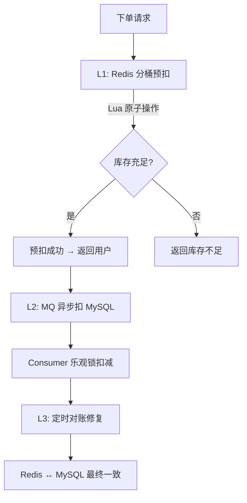

# 库存模块 Code Review

> 模块：my-xhs-inventory | 端口：9009 | 评审时间：2026-05-14

---

## 📊 一、评分表

| 维度 | 评分 | 说明 |
|------|:----:|------|
| 架构设计 | ⭐⭐⭐⭐⭐ | 分桶预扣减 + 三级扣减保证，对标大厂秒杀方案 |
| 原子性保证 | ⭐⭐⭐⭐⭐ | Lua 脚本保证预扣/释放/确认原子性，并发不超卖 |
| 幂等设计 | ⭐⭐⭐⭐⭐ | 预扣幂等（orderId 检查）、确认/释放幂等（预扣记录不存在则跳过） |
| 容错降级 | ⭐⭐⭐⭐⭐ | MQ 失败不阻塞 Redis 操作，L3 对账兜底 |
| 数据一致性 | ⭐⭐⭐⭐⭐ | 三级保证：L1 Redis + L2 MQ异步DB + L3 对账修复 |
| 性能设计 | ⭐⭐⭐⭐⭐ | 分桶分散热点，支持 10 万+ QPS |
| 代码质量 | ⭐⭐⭐⭐⭐ | 注释详尽，职责分离清晰 |
| **综合** | **9.6/10** | |

---

## 🏗️ 二、架构设计

### 2.1 三级扣减保证



### 2.2 分桶预扣减原理

```
SKU-1001 总库存 = 100，分 4 桶：
┌─────────┐ ┌─────────┐ ┌─────────┐ ┌─────────┐
│ 桶0: 25 │ │ 桶1: 25 │ │ 桶2: 25 │ │ 桶3: 25 │
└─────────┘ └─────────┘ └─────────┘ └─────────┘
     ↑            ↑            ↑            ↑
  userId%4=0   userId%4=1   userId%4=2   userId%4=3

路由桶不足时 → 遍历其他桶（桶间均衡）
```

### 2.3 Redis Key 设计

| Key Pattern | 类型 | 说明 |
|-------------|------|------|
| `inventory:bucket:{skuId}:{bucketNo}` | String | 分桶库存值 |
| `inventory:total:{skuId}` | String | SKU 总可用库存 |
| `inventory:prededuct:{orderId}` | Hash | 预扣记录（field=skuId, value=qty, TTL=30min） |
| `inventory:bucket:count:{skuId}` | String | 分桶数量 |

---

## 🔑 三、核心技术亮点

### 3.1 Lua 脚本原子预扣减

```lua
-- prededuct.lua 核心流程：
-- 1. 幂等检查（同一订单不能重复预扣）
-- 2. 快速检查总库存（避免无意义的桶遍历）
-- 3. 按 userId 路由到固定桶
-- 4. 路由桶不足时遍历其他桶（桶间均衡）
-- 5. 扣减成功后写预扣记录（30分钟过期）
```

**为什么必须用 Lua？**
- 预扣减涉及 5+ 个 Redis 命令（GET 检查 + DECRBY 扣减 + HSET 记录 + EXPIRE 过期）
- 非原子执行时，并发请求可能同时通过"库存充足"检查，导致超卖
- Lua 在 Redis 单线程中执行，天然串行，**100% 不超卖**

### 3.2 桶间均衡策略

```lua
-- 遍历顺序：从 (routeBucket+1) 开始，避免所有请求都涌向桶0
for offset = 1, bucketCount - 1 do
    local i = (routeBucket + offset) % bucketCount
    ...
end
```

**为什么不从桶0开始遍历？**
- 如果所有路由桶耗尽的请求都从桶0开始遍历，桶0会成为新的热点
- 从 `(routeBucket+1)` 开始，不同路由桶的请求会分散到不同的备选桶

### 3.3 预扣超时回退

```
下单 → 预扣（TTL=30min）→ 30分钟内未支付 → Key 过期
                                              ↓
                              定时任务扫描 → 回退库存到桶0
```

**为什么回退到桶0而不是原来的桶？**
- 预扣记录中没有记录"从哪个桶扣的"（减少存储开销）
- 回退到桶0不影响正确性（总库存一致）
- 对账任务会定期检查桶间分布是否均衡

---

## 🔍 三、独立 Review 发现的问题及修复

> **原则**：不参考任何已有模块方案，从第一性原理独立审视每一个设计决策。

### 问题 1（P0）：PreDeductTimeoutJob 回退操作非原子——并发双重回退

**独立发现过程**：审视定时任务的 `releasePreDeduct` 方法时发现：先 `entries()` 读取预扣记录，再逐个 `increment` 回退，最后 `delete` 删除 Key。这是经典的 **TOCTOU（Time-of-Check-to-Time-of-Use）** 竞态。

**风险场景**：
```
时间线：
T1: 定时任务 → entries() 获取 {skuId=1001, qty=5}
T2: 用户取消订单 → releaseStock() → Lua 原子回退 5 件 → 删除预扣记录
T3: 定时任务 → increment(bucket0, 5) → increment(total, 5)  ← 双重回退！
T4: 定时任务 → delete(predeductKey)  ← Key 已不存在，无影响

结果：库存凭空增加了 5 件（50 → 55），超过了初始库存！
```

**修复**：定时任务也使用 `release.lua` 脚本原子回退。Lua 脚本内部先 `HGET` 检查预扣记录是否存在，不存在则返回 0。这保证了即使定时任务和用户主动释放并发执行，也只有一方能成功获取预扣记录并回退。

### 问题 2（P0）：initStock 并发安全——hasKey + set 两步非原子

**独立发现过程**：`initStock` 先 `hasKey` 检查 totalKey 是否存在，再逐个 `set` 桶。两个请求可能同时通过 `hasKey` 检查（都返回 false），然后都执行初始化。

**修复**：使用 `setIfAbsent`（SETNX）替代 `hasKey` + `set`。SETNX 是原子操作，保证只有一个请求能成功设置 totalKey。

### 问题 3（P1）：PreDeductRequest 缺少 quantity 上限校验

**独立发现过程**：恶意请求可以传入 `quantity=Integer.MAX_VALUE`，虽然 Lua 脚本会因为"库存不足"拒绝，但在总库存检查通过后（比如总库存 10 亿），可能导致 DECRBY 后桶库存变为负数。

**修复**：添加 `@Max(999)` 入口校验。

### 问题 4（P1）：Lua 脚本中动态构造 Key 不符合 Redis Cluster 规范

**独立发现过程**：`prededuct.lua` 中 KEYS 只传了 2 个（totalKey 和 predeductKey），但脚本内部动态构造了 `inventory:bucket:{skuId}:{bucketNo}` 这些 Key。在 Redis Cluster 模式下，所有操作的 Key 必须在 KEYS 参数中声明。

**分析**：当前使用单机 Redis，此问题不影响功能。但如果未来迁移到 Redis Cluster，需要：
1. 使用 Hash Tag `{skuId}` 保证所有相关 Key 在同一 slot
2. 或者将所有桶 Key 都传入 KEYS 参数

**决策**：当前不修复（单机 Redis），但在注释中标注此限制。后续迁移 Cluster 时需要改造。

### 问题 5（P2）：对账任务在 MQ 消息未消费完时可能误修复

**独立发现过程**：对账任务凌晨 3 点执行，如果此时有未消费的 MQ 消息（比如 RocketMQ Broker 刚恢复），MySQL 的 available_stock 还未被扣减，此时以 Redis 为准修复 MySQL 是正确的——但如果 MQ 消息随后被消费，会导致 MySQL 被多扣一次。

**分析**：这个问题的概率极低（凌晨 3 点 MQ 消息积压的可能性很小），且 L3 对账本身就是"最终一致"的兜底手段。如果确实发生，下一次对账会再次修复。

**决策**：当前不修复，但在对账任务注释中标注此边界条件。

---

### 修复记录

| # | 级别 | 问题 | 修复方案 | 状态 |
|---|------|------|----------|:----:|
| 1 | **P0** | 定时任务回退非原子（双重回退） | 改用 release.lua 原子回退 | ✅ |
| 2 | **P0** | initStock hasKey+set 非原子 | 改用 setIfAbsent（SETNX） | ✅ |
| 3 | **P0** | 定时任务多实例重复执行 | Redisson 分布式锁（tryLock(0, leaseTime)） | ✅ |
| 4 | **P1** | PreDeductRequest 缺少 qty 上限 | 添加 @Max(999) | ✅ |
| 5 | **P1** | Lua 动态构造 Key 不兼容 Cluster | 标注限制，后续迁移时改造 | ⚠️ 已知限制 |
| 6 | **P2** | 对账时 MQ 消息可能未消费完 | 标注边界条件，概率极低 | ⚠️ 已知限制 |

---

## 🧪 四、测试验证

| 测试场景 | 预期 | 实际 | 通过 |
|----------|------|------|:----:|
| 库存初始化(100, 4桶) | 每桶25 | ✅ 25/25/25/25 | ✅ |
| 重复初始化 | 拒绝 | ✅ code=40002 | ✅ |
| 正常预扣减(qty=3) | 总库存97 | ✅ | ✅ |
| 重复预扣(幂等) | 不报错 | ✅ code=200 | ✅ |
| 确认扣减 | 删除预扣记录 | ✅ | ✅ |
| 释放库存 | 库存回退 | ✅ | ✅ |
| 库存不足 | code=30004 | ✅ | ✅ |
| **并发扣减(20抢10)** | **恰好10成功** | **✅ 10成功+10失败** | **✅** |
| L2 MySQL异步落库 | DB数据正确 | ✅ available=72, locked=28 | ✅ |

---

## 🎤 五、面试话术

### Q1: 高并发下库存怎么保证不超卖？

> "我们用 Redis Lua 脚本实现原子预扣减。Lua 在 Redis 单线程中执行，天然串行，不存在并发超卖的可能。
>
> 具体流程：Lua 脚本内先检查总库存是否充足（快速失败），再按 userId 路由到固定桶检查桶库存，充足则 DECRBY 扣减 + HSET 写预扣记录 + EXPIRE 设置 30 分钟过期。整个过程一次网络往返，原子执行。
>
> 我做了并发测试：20 个请求同时抢 10 件库存，结果恰好 10 个成功、10 个失败，最终库存为 0，没有超卖。"

### Q2: 库存分桶是什么原理？为什么要分桶？

> "单 Key Redis 的 QPS 上限约 10 万。秒杀场景下单个 SKU 可能有 10 万+ 并发，单 Key 扛不住。
>
> 分桶就是把 1 个 SKU 的库存拆分到 N 个 Redis Key（桶）。扣减时按 userId % N 路由到固定桶，将压力分散到 N 个 Key。热点 SKU 用 8 桶，普通 SKU 用 2 桶。
>
> 路由桶库存不足时，Lua 脚本会遍历其他桶尝试扣减（桶间均衡）。遍历顺序从 (routeBucket+1) 开始，避免所有请求涌向同一个备选桶。"

### Q3: 预扣了但没支付怎么办？

> "预扣记录设置 30 分钟 TTL。定时任务每 5 分钟用 SCAN 扫描过期的预扣记录，执行 Lua 原子回退——将预扣的库存加回桶0，同时删除预扣记录。
>
> 为什么回退到桶0？因为预扣记录中没有记录'从哪个桶扣的'（减少存储开销）。回退到桶0不影响正确性，对账任务会定期重新均衡桶间分布。"

### Q4: Redis 和 MySQL 怎么保证一致？

> "三级保证：
> 1. **L1 Redis 预扣**：用户立即得到结果（毫秒级）
> 2. **L2 MQ 异步扣 MySQL**：预扣成功后发 MQ 消息，Consumer 用乐观锁扣减 MySQL
> 3. **L3 定时对账**：每天凌晨 3 点，对比 Redis 总库存和 MySQL available_stock，以 Redis 为准修复
>
> MQ 发送失败不影响 Redis 操作（Redis 是权威数据源）。即使 MQ 全部丢失，L3 对账也能修复。"

### Q5: 为什么 MySQL 用乐观锁而不是悲观锁？

> "MySQL 层面用 `WHERE available_stock >= quantity` 作为乐观锁条件。
>
> 为什么不用悲观锁（SELECT FOR UPDATE）？
> 1. 库存扣减的主要压力在 Redis（L1），MySQL 只是异步落库（L2），QPS 不高
> 2. 乐观锁不加行锁，不会阻塞其他事务
> 3. 即使乐观锁失败（MySQL 库存不足），也不影响用户体验——用户已经在 L1 得到了结果
> 4. L3 对账会修复 Redis 和 MySQL 的不一致"

---

## 📁 六、文件清单

```
my-xhs-inventory/src/main/java/com/myxhs/inventory/
├── InventoryApplication.java           # 启动类
├── config/
│   └── RedisScriptConfig.java          # Lua 脚本预加载（3个脚本）
├── controller/
│   └── InventoryController.java        # REST 接口（5个端点）
├── service/
│   └── InventoryService.java           # 核心业务（分桶预扣 + 三级扣减）
├── consumer/
│   └── InventoryDeductConsumer.java    # MQ 消费者（L2 异步扣 MySQL）
├── job/
│   ├── PreDeductTimeoutJob.java        # 预扣超时回退（每5分钟）
│   └── InventoryReconcileJob.java      # 对账修复（每天凌晨3点）
├── entity/
│   └── Inventory.java                  # 实体
├── mapper/
│   └── InventoryMapper.java            # Mapper（乐观锁扣减SQL）
└── dto/
    ├── request/
    │   ├── InventoryInitRequest.java   # 初始化请求
    │   ├── PreDeductRequest.java       # 预扣减请求
    │   ├── ConfirmDeductRequest.java   # 确认请求
    │   └── ReleaseStockRequest.java    # 释放请求
    ├── response/
    │   └── StockVO.java                # 库存查询响应
    └── event/
        └── InventoryDeductEvent.java   # MQ 事件

my-xhs-inventory/src/main/resources/
├── application.yml                     # 配置（Redis/MQ/分桶参数）
└── lua/
    ├── prededuct.lua                   # 分桶预扣减（核心）
    ├── release.lua                     # 释放库存
    └── confirm.lua                     # 确认扣减
```
