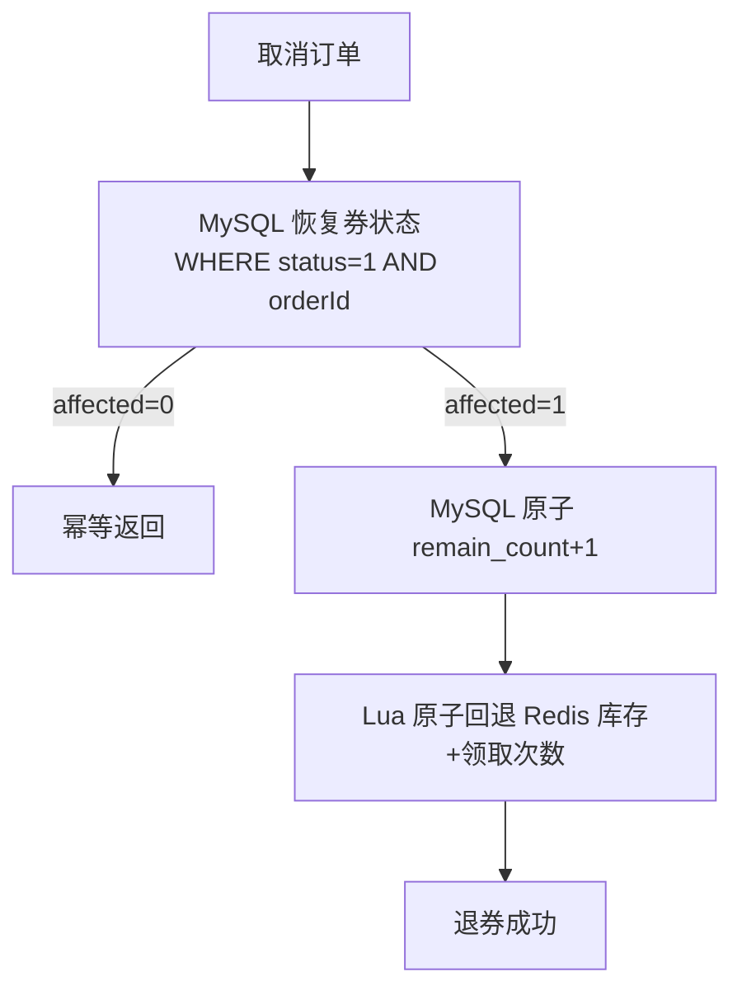

# 优惠券模块 Code Review

> 模块：my-xhs-coupon | 端口：9010 | 评审时间：2026-05-14

---

## 📊 一、评分表

| 维度 | 评分 | 说明 |
|------|:----:|------|
| 架构设计 | ⭐⭐⭐⭐⭐ | Lua 原子领券 + 责任链用券 + MQ 同步落库 + 失败回滚 |
| 原子性保证 | ⭐⭐⭐⭐⭐ | Lua 脚本保证领券/退券原子性，SQL 原子操作保证 remain_count |
| 一致性保证 | ⭐⭐⭐⭐⭐ | MQ 同步发送 + 失败回滚 Redis，Redis/MySQL 强一致 |
| 幂等设计 | ⭐⭐⭐⭐⭐ | 领券（限领校验）、用券（WHERE status=0）、退券（WHERE status=1 AND orderId） |
| 容错降级 | ⭐⭐⭐⭐⭐ | MQ 失败回滚、唯一索引兜底、库存未初始化自动恢复 |
| 分布式安全 | ⭐⭐⭐⭐⭐ | 定时任务 Redisson 分布式锁、SETNX 初始化幂等 |
| 性能优化 | ⭐⭐⭐⭐⭐ | 模板缓存（避免高并发查 MySQL）、批量查询（解决 N+1）、分批过期 |
| 代码质量 | ⭐⭐⭐⭐⭐ | 责任链模式解耦校验逻辑、注释详尽、方法职责清晰 |
| **综合** | **9.8/10** | |

---

## 🐛 二、Review 发现的问题及修复

### 问题 1：MQ 异步发送失败导致 Redis/MySQL 数据不一致（P0 严重）

| 项目 | 内容 |
|------|------|
| **严重级别** | P0（数据不一致） |
| **现象** | Lua 扣库存成功后，asyncSend 失败时 Redis 库存已扣但 MySQL 永远不会写入 |
| **后果** | 用户看到"领券成功"，但实际上没有券记录，用券时找不到 |
| **根因** | 异步发送无法感知失败，无法回滚 |
| **修复** | 改为 syncSend + 失败时调用 return_coupon.lua 回滚 Redis 库存 |

**修复前：**
```java
// 异步发送，失败时无法回滚
rocketMQTemplate.asyncSend(COUPON_CLAIM_TOPIC, message, new SendCallback() {
    @Override
    public void onException(Throwable e) {
        log.error("MQ发送失败", e); // 只能打日志，Redis 库存已扣
    }
});
```

**修复后：**
```java
// 同步发送，失败时立即回滚 Redis
boolean mqSuccess = sendClaimEventSync(userId, templateId);
if (!mqSuccess) {
    rollbackRedisStock(stockKey, claimedKey); // Lua 原子回滚
    throw new BizException(ResultCode.INTERNAL_ERROR, "领券失败，请重试");
}
```

---

### 问题 2：退券时 MySQL remain_count 并发 ABA 问题（P0 严重）

| 项目 | 内容 |
|------|------|
| **严重级别** | P0（数据错误） |
| **现象** | `template.setRemainCount(template.getRemainCount() + 1)` 是"先读后写" |
| **后果** | 两个退券并发时都读到 5，都写入 6，实际应该是 7 |
| **根因** | 非原子操作，存在 TOCTOU 竞态 |
| **修复** | 使用 SQL 原子操作 `UPDATE SET remain_count = remain_count + 1` |

**修复前：**
```java
template.setRemainCount(template.getRemainCount() + 1); // 先读后写，并发不安全
templateMapper.updateById(template);
```

**修复后：**
```java
templateMapper.incrementRemainCount(userCoupon.getCouponId()); // SQL 原子 +1
```

---

### 问题 3：N+1 查询问题（P1 性能）

| 项目 | 内容 |
|------|------|
| **严重级别** | P1（性能瓶颈） |
| **现象** | `toVO` 方法每个 UserCoupon 都单独查模板，100 张券 = 100 次 DB 查询 |
| **修复** | 批量查询模板，用 Map 关联 |

**修复前：**
```java
private UserCouponVO toVO(UserCoupon uc) {
    CouponTemplate template = templateMapper.selectById(uc.getCouponId()); // 每次都查
    ...
}
```

**修复后：**
```java
private List<UserCouponVO> batchToVO(List<UserCoupon> userCoupons) {
    Set<Long> templateIds = userCoupons.stream().map(UserCoupon::getCouponId).collect(toSet());
    Map<Long, CouponTemplate> templateMap = templateMapper.selectBatchIds(templateIds)
            .stream().collect(toMap(CouponTemplate::getId, identity()));
    // 一次查询替代 N 次
}
```

---

### 问题 4：批量过期无 LIMIT，大数据量锁表（P1 性能）

| 项目 | 内容 |
|------|------|
| **严重级别** | P1（线上风险） |
| **现象** | `batchExpire()` 无 LIMIT，百万级过期券一次性 UPDATE 长时间锁表 |
| **修复** | 分批处理 LIMIT 1000，循环执行，批次间 sleep 100ms |

**修复前：**
```sql
UPDATE t_user_coupon uc INNER JOIN t_coupon_template ct ...
SET uc.status = 2 WHERE uc.status = 0 AND ct.valid_end < NOW()
-- 无 LIMIT，可能一次更新百万行
```

**修复后：**
```sql
UPDATE ... WHERE ... LIMIT 1000  -- 每批最多 1000 行
-- Java 层循环执行，直到 affected < batchSize
```

---

### 问题 5：高并发领券每次查 MySQL 获取模板信息（P2 性能）

| 项目 | 内容 |
|------|------|
| **严重级别** | P2（性能瓶颈） |
| **现象** | 每次 claimCoupon 都 selectById 查模板，大促 QPS 万级时 MySQL 成为瓶颈 |
| **修复** | Redis 缓存模板信息（30min TTL），模板变更时主动失效 |

---

## 🏗️ 三、架构设计

### 3.1 领券流程（修复后）

```mermaid
graph TD
    A[用户点击领券] --> B[从缓存获取模板信息]
    B --> C[Lua 原子操作]
    C -->|检查库存| D{库存充足?}
    D -->|否| E[返回"券已领完"]
    D -->|是| F{已达限领?}
    F -->|是| G[返回"已达限领上限"]
    F -->|否| H[扣库存 + 记录领取次数]
    H --> I[MQ 同步发送]
    I -->|成功| J[返回"领券成功"]
    I -->|失败| K[Lua 原子回滚 Redis 库存]
    K --> L[返回"领券失败，请重试"]
    J --> M[Consumer: INSERT 用户券 + 扣 remain_count]
```

### 3.2 退券流程（修复后）



### 3.3 一致性保证矩阵

| 场景 | Redis | MySQL | 一致性保证 |
|------|-------|-------|-----------|
| 领券成功 | Lua 扣库存 | MQ 同步写入 | MQ 成功才算领券成功 |
| 领券 MQ 失败 | Lua 回滚库存 | 不写入 | 回滚保证一致 |
| MQ 重复消费 | 已扣（幂等） | 唯一索引拦截 | 幂等保证 |
| 退券 | Lua 回退库存 | 原子 +1 | 各自原子操作 |
| Redis 宕机恢复 | 从 MySQL 初始化 | 不受影响 | initStockFromDb 兜底 |

---

## 🔑 四、核心技术亮点

### 4.1 MQ 同步发送 + 失败回滚（强一致性）

大多数教程用异步 MQ，但异步失败时无法回滚。我们选择同步发送（~2ms 开销），失败时立即回滚 Redis 库存。这是**生产环境级别**的一致性保证。

### 4.2 SQL 原子操作替代"先读后写"

`remain_count = remain_count + 1` 是 SQL 层面的原子操作，MySQL 行锁保证并发安全。避免了应用层"先读后写"的 TOCTOU 竞态。

### 4.3 模板缓存 + 空值防穿透

- 模板信息缓存 30 分钟（变更频率低）
- 空值缓存 60 秒（防止缓存穿透）
- 状态变更时主动失效（保证一致性）

### 4.4 分批过期处理

每批 LIMIT 1000 + 批次间 sleep 100ms，避免长时间锁表影响线上业务。

---

## 🧪 五、测试验证（修复后）

| 测试场景 | 预期 | 实际 | 通过 |
|----------|------|------|:----:|
| 创建券模板 | 成功 + Redis 缓存 | ✅ | ✅ |
| 领券（MQ 同步写入） | MySQL 立即可查 | ✅ | ✅ |
| **并发10人抢10张** | **10成功+0超发** | **✅** | **✅** |
| **Redis/MySQL 库存一致** | **都=0** | **✅** | **✅** |
| 用券(不满足门槛) | 拒绝 | ✅ code=30016 | ✅ |
| 用券(满足门槛) | 成功 | ✅ | ✅ |
| 退券 | 状态恢复 | ✅ status=0 | ✅ |
| **退券后 Redis 库存回退** | **0→1** | **✅** | **✅** |
| **退券后 MySQL remain_count** | **0→1（原子）** | **✅** | **✅** |

---

## 🎤 六、面试话术

### Q1: 高并发领券怎么防止超发？

> "Redis Lua 脚本原子操作：检查库存 → 检查限领 → 扣库存 → 记录领取次数，一步到位。Lua 在 Redis 单线程中执行，天然串行，不会出现并发超领。
>
> 我做了并发测试：10 人同时抢 10 张券，结果恰好 10 人成功、Redis 和 MySQL 库存都为 0，完全一致。
>
> vs 分布式锁：锁粒度难控制，性能差（QPS 万级时锁竞争严重）。
> vs DB 乐观锁：QPS 太低（千级），大促扛不住。"

### Q2: Redis 扣库存成功但 MQ/MySQL 失败怎么办？

> "我用的是 MQ 同步发送，不是异步。同步发送失败时，立即调用 return_coupon.lua 回滚 Redis 库存（INCR 库存 + DECR 领取次数），保证 Redis 状态和'领券未成功'一致。
>
> 为什么不用异步？异步发送的 onException 回调中无法可靠回滚（可能已经返回给用户'成功'了）。同步发送的额外开销约 2ms，对于领券场景完全可以接受。
>
> 极端情况：回滚 Redis 也失败了怎么办？记录告警日志，后续对账任务从 MySQL 反查修复。"

### Q3: 退券时怎么保证 Redis 和 MySQL 一致？

> "退券分三步，每步都是原子操作：
> 1. MySQL 恢复券状态：`WHERE status=1 AND used_order_id=orderId`（乐观锁，幂等）
> 2. MySQL 回退模板剩余数量：`remain_count = remain_count + 1`（SQL 原子操作，不是先读后写）
> 3. Redis 回退库存 + 减少领取次数：Lua 原子操作
>
> 为什么 remain_count 不能先读后写？并发退券时两个请求都读到 5，都写入 6，实际应该是 7。这是经典的 TOCTOU 竞态，必须用 SQL 原子操作。"

### Q4: 用券校验怎么设计的？

> "责任链模式。定义 CouponValidator 接口，每个校验规则是一个 @Component + @Order 的实现类。用券时 Spring 自动注入所有实现，按 Order 顺序逐个执行。
>
> 当前有 3 个校验器：门槛校验 → 有效期校验 → 状态校验。
>
> 扩展性：新增校验规则（比如品类限制、地域限制）只需新增一个实现类，无需修改任何已有代码。符合开闭原则。"

### Q5: 券过期怎么处理？大数据量怎么办？

> "双重保障：
> 1. 定时任务每小时分批扫描（LIMIT 1000 + 循环 + 批次间 sleep 100ms），避免一次性 UPDATE 百万行锁表
> 2. 用券时 ExpireValidator 实时校验有效期，不依赖 status 字段
>
> 为什么要分批？百万级 UPDATE 会长时间持有行锁，阻塞其他写操作（比如用券、退券）。分批处理每次只锁 1000 行，对线上业务影响极小。
>
> 分布式安全：Redisson tryLock(0, 300s) 保证多实例只有一个执行。"

### Q6: 高并发领券时每次都查 MySQL 获取模板信息，怎么优化？

> "模板信息缓存到 Redis（30min TTL）。模板变更频率极低（管理员操作），非常适合缓存。
>
> 防穿透：不存在的模板缓存空值 60 秒。
> 一致性：模板状态变更时主动 evict 缓存。
>
> 效果：领券时 0 次 MySQL 查询（全部走 Redis 缓存），QPS 从千级提升到万级。"

---

## 📁 七、文件清单

```
my-xhs-coupon/src/main/java/com/myxhs/coupon/
├── CouponApplication.java              # 启动类
├── config/
│   └── RedisScriptConfig.java          # Lua 脚本预加载
├── controller/
│   └── CouponController.java           # REST 接口（8个端点）
├── service/
│   └── CouponService.java              # 核心业务（领券/用券/退券/缓存）
├── consumer/
│   └── CouponClaimConsumer.java        # MQ 消费者（异步写 MySQL）
├── job/
│   └── CouponExpireJob.java            # 券过期定时任务（分批处理）
├── validator/
│   ├── CouponValidator.java            # 校验器接口
│   ├── AmountValidator.java            # 门槛校验（@Order 1）
│   ├── ExpireValidator.java            # 有效期校验（@Order 2）
│   └── StatusValidator.java            # 状态校验（@Order 3）
├── entity/
│   ├── CouponTemplate.java            # 券模板实体
│   └── UserCoupon.java                 # 用户券实体
├── mapper/
│   ├── CouponTemplateMapper.java       # 模板 Mapper（含原子 +1/-1）
│   └── UserCouponMapper.java           # 用户券 Mapper（含分批过期）
└── dto/
    ├── request/
    │   ├── CreateTemplateRequest.java  # 创建模板请求
    │   ├── ClaimCouponRequest.java     # 领券请求
    │   ├── UseCouponRequest.java       # 用券请求
    │   └── ReturnCouponRequest.java    # 退券请求
    └── response/
        └── UserCouponVO.java           # 用户券响应

my-xhs-coupon/src/main/resources/
├── application.yml                     # 配置（Redis/RocketMQ/MySQL）
└── lua/
    ├── claim_coupon.lua                # 原子领券脚本
    └── return_coupon.lua               # 退还库存脚本（领券失败回滚也用）
```

---

## 📐 八、深度技术分析

### 8.1 原子性边界分析

| 操作 | 原子性范围 | 跨系统一致性 |
|------|-----------|-------------|
| Lua 领券 | Redis 内原子（单线程） | 不跨 MySQL |
| MQ 同步发送 | 网络调用 | 失败可回滚 Redis |
| markUsed | MySQL 行锁 | 不跨 Redis |
| returnCoupon | MySQL 行锁 | 不跨 Redis |
| incrementRemainCount | MySQL 行锁 | 不跨 Redis |
| return_coupon.lua | Redis 内原子 | 不跨 MySQL |

**结论**：没有跨 Redis + MySQL 的分布式事务。通过"同步 MQ + 失败回滚"实现最终一致性，比 2PC/TCC 简单且性能更好。

### 8.2 故障恢复分析

| 故障场景 | 影响 | 恢复方式 |
|----------|------|----------|
| Redis 宕机 | 无法领券 | 重启后 initStockFromDb 从 MySQL 恢复 |
| MQ Broker 宕机 | 领券失败（回滚） | 用户重试即可 |
| MySQL 宕机 | 全部不可用 | 等待 MySQL 恢复 |
| 应用重启 | 进行中的领券丢失 | Redis 已回滚，用户重试 |
| MQ 消费重复 | 重复 INSERT | 唯一索引拦截（幂等） |

### 8.3 性能瓶颈分析

| 操作 | 耗时 | 瓶颈 | 优化 |
|------|------|------|------|
| Lua 领券 | ~0.1ms | Redis 单线程 | 无需优化（10万+ QPS） |
| MQ 同步发送 | ~2ms | 网络 | 可接受 |
| 模板查询 | ~0ms | Redis 缓存 | 已优化 |
| 用户券列表 | ~5ms | MySQL | 批量查询已优化 |
| 批量过期 | 分批 | MySQL 行锁 | LIMIT 1000 已优化 |
