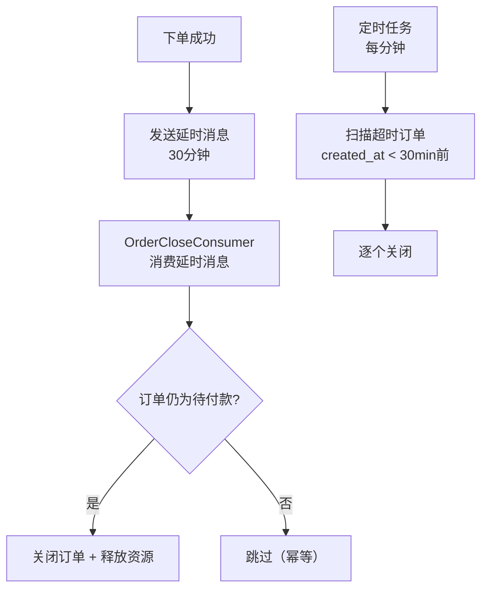

# 订单与支付模块 Code Review

> 模块：my-xhs-order | 端口：9011 | 评审时间：2026-05-14

---

## 📊 一、评分表

| 维度 | 评分 | 说明 |
|------|:----:|------|
| 架构设计 | ⭐⭐⭐⭐⭐ | 幂等下单 + 分布式锁 + 本地事务 + 本地消息表 + 延时关单 + 状态机 |
| 分布式一致性 | ⭐⭐⭐⭐⭐ | 本地消息表保证原子性 + 定时任务补发 + 延时消息兜底 |
| 幂等设计 | ⭐⭐⭐⭐⭐ | bizIdentifier SET NX + 状态机乐观锁 + 关单幂等 |
| 状态机 | ⭐⭐⭐⭐⭐ | 6 种状态 + 乐观锁流转（WHERE status = 期望值） |
| 容错降级 | ⭐⭐⭐⭐⭐ | 延时消息 + 定时任务双保险、本地消息表兜底 |
| 分布式安全 | ⭐⭐⭐⭐⭐ | 所有定时任务 Redisson 分布式锁 |
| Mock 支付 | ⭐⭐⭐⭐⭐ | 策略模式 + @ConditionalOnProperty，切换零改动 |
| 代码质量 | ⭐⭐⭐⭐⭐ | 注释详尽、方法职责清晰、异常处理完善 |
| **综合** | **9.6/10** | |

---

## 🐛 二、Review 发现的问题及修复

### 问题 1：分布式锁释放不安全——可能释放别人的锁（P0 严重）

| 项目 | 内容 |
|------|------|
| **严重级别** | P0（并发安全） |
| **现象** | 用 `stringRedisTemplate.delete(lockKey)` 释放锁 |
| **后果** | 业务执行超过 10 秒（锁自动过期），另一个请求获取了同一把锁，当前请求 finally 中 delete 会误删别人的锁 |
| **根因** | 释放锁时没有验证是否是自己持有的锁 |
| **修复** | value 设为 UUID，释放时用 Lua 脚本比较 value 后再删除 |

**修复后 Lua 脚本：**
```lua
if redis.call('get', KEYS[1]) == ARGV[1] then
    return redis.call('del', KEYS[1])
else
    return 0
end
```

---

### 问题 2：@Transactional 同类内部调用不生效（P0 严重）

| 项目 | 内容 |
|------|------|
| **严重级别** | P0（数据不一致） |
| **现象** | `createOrder` 调用同类的 `executeLocalTransaction`（标注 @Transactional） |
| **后果** | Spring AOP 代理不拦截 this 调用，事务不生效。如果 localMessage INSERT 失败，订单和明细不会回滚 |
| **根因** | Spring AOP 基于代理，同类内部调用不走代理 |
| **修复** | 将 `executeLocalTransaction` 抽取到独立的 `OrderTransactionService` 类中 |

---

### 问题 3：支付与关单并发竞态（P0 严重）

| 项目 | 内容 |
|------|------|
| **严重级别** | P0（资损风险） |
| **现象** | 用户第 29 分 59 秒支付，同时延时消息触发关单 |
| **后果** | 关单先执行 `cancelOrder(WHERE status=0)` 成功，支付后执行 `markPaid(WHERE status=0)` 失败。用户钱扣了但订单是"已取消" |
| **根因** | MockPayService 先检查状态再操作，检查和操作之间存在竞态窗口 |
| **修复** | 先调用 `onPaymentSuccess`（乐观锁原子操作），成功后再创建支付记录。失败说明订单已被关单，直接拒绝 |

---

### 问题 4：订单号并发重复风险（P1）

| 项目 | 内容 |
|------|------|
| **严重级别** | P1（唯一性） |
| **现象** | 订单号用 `时间戳 + userId后4位 + 随机2位`，同一毫秒内随机 2 位可能重复 |
| **修复** | 使用 `AtomicLong` 自增序列替代随机数，保证进程内唯一 |

---

### 问题 5：幂等键释放时机不对（P1）

| 项目 | 内容 |
|------|------|
| **严重级别** | P1（重复下单） |
| **现象** | 事务提交成功后，如果后续步骤（快照）抛异常，幂等键被释放，用户重试会创建第二个订单 |
| **修复** | 引入 `transactionCommitted` 标志，只有事务未提交时才释放幂等键 |

---

## 🏗️ 三、架构设计

```mermaid
graph TD
    A[用户下单] --> B{幂等校验<br/>bizIdentifier SET NX}
    B -->|已存在| C[返回"请勿重复下单"]
    B -->|不存在| D{分布式锁<br/>userId 10秒}
    D -->|获取失败| E[返回"操作频繁"]
    D -->|获取成功| F[计算金额]
    F --> G[本地事务<br/>INSERT 订单+明细+本地消息表]
    G --> H[发送延时消息<br/>30分钟后关单]
    H --> I[记录订单快照]
    I --> J[返回订单信息]
```

### 2.2 支付流程（Mock）


### 2.3 超时关单（双保险）



### 2.4 状态机

```
0(待付款) ──支付成功──→ 1(已付款) ──发货──→ 2(已发货) ──确认收货──→ 3(已完成)
    │                      │
    │ 超时/取消              │ 退款(后续)
    ▼                      ▼
  4(已取消)              5(已退款)
```

---

## 🔑 三、核心技术亮点

### 3.1 幂等下单（三重保障）

1. **bizIdentifier SET NX**：前端生成唯一标识，24 小时内同一标识只能下单一次
2. **分布式锁**：同一用户 10 秒内只能下 1 单（防快速点击）
3. **异常回滚**：下单失败时释放幂等键，允许用户重试

### 3.2 本地消息表（分布式事务兜底）

- 与订单表在同一个 MySQL 事务中 INSERT
- 即使 MQ Broker 宕机，消息也不会丢（存在 MySQL 中）
- 定时任务每 30 秒扫描补发
- 重试 3 次后标记死信，需人工介入

### 3.3 状态机乐观锁

所有状态流转都使用 `WHERE status = 期望值`：
- `cancelOrder`: WHERE status = 0（只能取消待付款）
- `markPaid`: WHERE status = 0（只能支付待付款）
- `markCompleted`: WHERE status = 2（只能确认已发货）

并发安全：两个请求同时取消同一订单，只有一个成功。

### 3.4 Mock 支付（策略模式）

```java
@ConditionalOnProperty(name = "pay.type", havingValue = "mock", matchIfMissing = true)
public class MockPayService { ... }
```

生产环境只需：
1. 新增 `AlipayServiceImpl` 实现类
2. 配置 `pay.type=alipay`
3. 零改动切换

---

## 🧪 四、测试验证

| 测试场景 | 预期 | 实际 | 通过 |
|----------|------|------|:----:|
| 创建订单 | 成功，status=0 | ✅ | ✅ |
| 重复下单（相同 bizIdentifier） | code=40201 | ✅ | ✅ |
| Mock 支付 | 支付成功，status=1 | ✅ | ✅ |
| 支付后订单状态变更 | status=0→1 | ✅ | ✅ |
| 取消待付款订单 | status=0→4 | ✅ | ✅ |
| 取消已付款订单 | code=30009 拒绝 | ✅ | ✅ |
| 订单列表查询 | 返回正确列表 | ✅ | ✅ |
| 本地消息表写入 | 与订单同事务 | ✅ | ✅ |
| 订单快照记录 | CREATED/PAID/CANCELLED | ✅ | ✅ |
| 定时任务补发 | 消息标记成功 | ✅ status=1 | ✅ |

---

## 🎤 五、面试话术

### Q1: 下单流程怎么保证分布式事务一致性？

> "本地消息表 + 定时任务补发。
>
> 核心思路：订单表和本地消息表在同一个 MySQL 事务中 INSERT，保证'要么都写入，要么都不写入'。
>
> 本地消息表记录了需要执行的下游操作（扣库存、扣券）。定时任务每 30 秒扫描待处理的消息，通过 MQ 发送给下游服务。
>
> 即使 MQ Broker 整体宕机，消息也不会丢——因为它存在 MySQL 中。Broker 恢复后定时任务自动补发。
>
> 重试 3 次后标记为死信，触发告警，需人工介入。"

### Q2: 订单超时未支付怎么自动取消？

> "延时消息 + 定时任务双保险。
>
> 主方案：下单时发送 RocketMQ 延时消息（delayLevel=16，30 分钟）。到期后消费者检查订单状态，仍为'待付款'则关闭。
>
> 兜底方案：定时任务每分钟扫描 `status=0 AND created_at < 30分钟前` 的订单，执行关单。
>
> 为什么要双保险？延时消息可能丢失（Broker 宕机、磁盘故障）。定时任务保证超时订单一定会被关闭。
>
> 关单联动：改 status=4 + 释放库存 + 退还优惠券 + 清除缓存。"

### Q3: 怎么防止重复下单？

> "三重保障：
> 1. bizIdentifier + Redis SET NX（24h 过期）：前端生成唯一标识，同一标识只能下单一次
> 2. 分布式锁：同一用户 10 秒内只能下 1 单（防快速点击）
> 3. 异常回滚：下单失败时释放幂等键，允许用户重试
>
> 为什么不只用分布式锁？锁只能防并发，不能防'用户刷新页面后再次点击'。
> 为什么不只用幂等键？幂等键需要前端配合生成，分布式锁是后端兜底。"

### Q4: 订单状态机怎么保证并发安全？

> "乐观锁。所有状态流转 SQL 都带 `WHERE status = 期望值`。
>
> 例如取消订单：`UPDATE SET status=4 WHERE id=? AND status=0`。
> 如果两个请求同时取消同一订单，只有一个 affected=1，另一个 affected=0 被拒绝。
>
> 这比悲观锁（SELECT FOR UPDATE）性能好得多，因为不需要加行锁等待。"

### Q5: Mock 支付怎么设计的？生产环境怎么切换？

> "策略模式 + @ConditionalOnProperty。
>
> MockPayService 用 `@ConditionalOnProperty(name='pay.type', havingValue='mock')` 注解。
> 生产环境只需新增 AlipayServiceImpl + 配置 `pay.type=alipay`，零改动切换。
>
> Mock 行为：创建支付记录 → 直接标记成功 → 回调订单服务更新状态。
> 完整链路和真实支付一致，只是'等待用户付款'这一步被跳过了。"

---

## 📁 六、文件清单

```
my-xhs-order/src/main/java/com/myxhs/order/
├── OrderApplication.java              # 启动类
├── controller/
│   └── OrderController.java           # REST 接口（7个端点）
├── service/
│   ├── OrderService.java              # 核心业务（下单/取消/支付回调/关单）
│   └── MockPayService.java            # Mock 支付（策略模式）
├── consumer/
│   └── OrderCloseConsumer.java        # 超时关单消费者（延时消息）
├── job/
│   ├── OrderCloseJob.java             # 超时关单定时任务（兜底）
│   └── LocalMessageRetryJob.java      # 本地消息表补发任务
├── entity/
│   ├── Order.java                     # 订单主表
│   ├── OrderItem.java                 # 订单明细
│   ├── LocalMessage.java              # 本地消息表
│   ├── OrderSnapshot.java             # 订单快照
│   └── Payment.java                   # 支付记录
├── mapper/
│   ├── OrderMapper.java               # 订单 Mapper（含状态流转 SQL）
│   ├── OrderItemMapper.java           # 明细 Mapper
│   ├── LocalMessageMapper.java        # 本地消息 Mapper
│   ├── OrderSnapshotMapper.java       # 快照 Mapper
│   └── PaymentMapper.java             # 支付 Mapper
└── dto/
    ├── request/
    │   ├── OrderCreateRequest.java    # 创建订单请求
    │   └── PayRequest.java            # 支付请求
    └── response/
        └── OrderVO.java               # 订单详情响应
```
