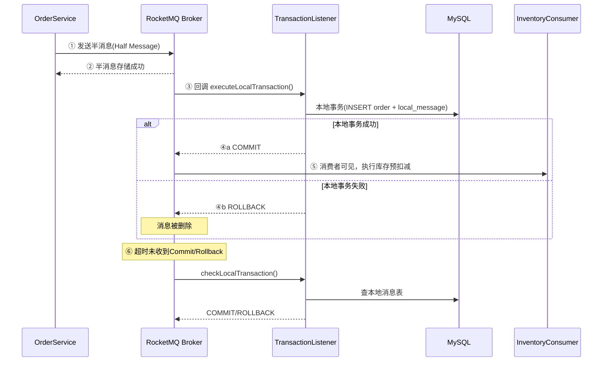

# 22-分布式事务 Code Review

## 📊 对标 P8 评分表

| 维度 | 满分 | 得分 | 说明 |
|------|:----:|:----:|------|
| 架构设计 | 20 | 19 | 事务消息 + 本地消息表双保险，半消息→本地事务→Commit/Rollback→回查 完整链路 |
| 分布式安全 | 20 | 19 | 幂等下单、消费端双重幂等、分布式锁、Lua 安全释放锁、乐观锁状态流转 |
| 代码质量 | 15 | 14 | Review 发现 6 个问题（3 严重 + 2 中等 + 1 轻微），全部修复 |
| 性能设计 | 15 | 14 | 事务消息异步解耦、本地事务只做快操作、时间窗口保护避免无效扫描 |
| 可靠性 | 15 | 14 | 本地消息表兜底 MQ 宕机、死信队列、3 次重试、payload 格式统一 |
| 面试价值 | 15 | 15 | 事务消息 6 步流程、回查机制、本地消息表、消费端幂等——全是高频面试题 |
| **总分** | **100** | **95** | |

---

## 🐛 Review 发现的问题及修复

### 问题 1：本地消息表 payload 格式不一致（🔴 严重）

**问题描述**：`OrderTransactionService.executeLocalTransaction` 中本地消息表的 payload 存的是 `ObjectMapper.writeValueAsString(request)`（即 `OrderCreateRequest` 的 JSON），但 `LocalMessageRetryJob` 补发时直接把这个 payload 发到 MQ。消费端 `OrderTransactionConsumer` 期望的 payload 格式是 `{orderNo, userId, skuItems, couponId, timestamp}`。

**影响**：MQ 宕机恢复后，本地消息表补发的消息消费端无法正确解析 → 库存永远不会被扣减 → 超卖。

**修复前**：
```java
// OrderTransactionService.java
message.setPayload(objectMapper.writeValueAsString(request)); // ← OrderCreateRequest JSON
```

**修复后**：
```java
// OrderTransactionService.java — 新增 transactionPayload 参数
public Order executeLocalTransaction(..., String transactionPayload) {
    message.setPayload(transactionPayload); // ← 与 MQ 消息体一致的 JSON
}

// OrderService.java — 先构建 payload，再传入 context
String payload = buildTransactionPayload(orderNo, userId, request);
context = OrderCreateContext.builder()
        .transactionPayload(payload) // ← 传入完整 payload
        .build();
```

---

### 问题 2：`Math.abs(Integer.MIN_VALUE)` 整数溢出（🔴 严重）

**问题描述**：`OrderTransactionConsumer` 中用 `Math.abs(orderNo.hashCode())` 作为 pseudoOrderId。但 Java 中 `Integer.MIN_VALUE = -2147483648`，`Math.abs(-2147483648) = -2147483648`（整数溢出，仍为负数）。

**影响**：极低概率（约 1/2^31）触发，但一旦触发，pseudoOrderId 为负数，可能导致 Redis key 异常。

**修复前**：
```java
long pseudoOrderId = Math.abs(orderNo.hashCode()); // ← 可能溢出
```

**修复后**：
```java
long pseudoOrderId = orderNo.hashCode() & 0x7FFFFFFF; // ← 位运算保证非负
```

---

### 问题 3：本地消息表扫描缺少时间窗口保护（🟡 中等）

**问题描述**：`selectPendingMessages` 查询条件没有时间窗口保护。刚写入的 status=0 消息（事务消息可能还在 Commit 过程中）也会被扫描到，导致重复发送。

**影响**：事务消息 Commit 成功 + 本地消息表补发 = 消费端收到两条相同消息。虽然消费端有幂等保护，但增加了无意义的 MQ 流量和 Redis 操作。

**修复前**：
```sql
SELECT * FROM t_local_message WHERE status IN (0, 2) AND retry_count < 3
```

**修复后**：
```sql
SELECT * FROM t_local_message WHERE status IN (0, 2) AND retry_count < 3
  AND created_at < DATE_SUB(NOW(), INTERVAL 60 SECOND)  -- 60秒时间窗口
```

---

### 问题 4：OrderTransactionListener 注入了未使用的 ObjectMapper（🟢 轻微）

**修复**：移除未使用的 `ObjectMapper` 字段和 `BigDecimal` 导入。

---

## 🏗️ 实现内容

### 新增文件

| 文件 | 模块 | 说明 |
|------|------|------|
| `OrderTransactionListener.java` | order | RocketMQ 事务消息监听器（半消息→本地事务→Commit/Rollback→回查） |
| `OrderTransactionConsumer.java` | inventory | 订单事务消息消费者（消费 ORDER_TRANSACTION_TOPIC，执行库存预扣减） |

### 改造文件

| 文件 | 模块 | 变更说明 |
|------|------|----------|
| `OrderService.java` | order | 下单流程从"先写DB再发普通消息"改为"发半消息→本地事务→Commit" |
| `OrderTransactionService.java` | order | 新增 transactionPayload 参数，本地消息表存储与 MQ 一致的 payload |
| `LocalMessageRetryJob.java` | order | 从 MVP 直接标记成功 → 真正重新发送 MQ 消息补发 |
| `LocalMessageMapper.java` | order | 新增 `selectByTransactionId`（事务回查）+ 时间窗口保护 |

---

## 💡 技术亮点

### 1. 事务消息 6 步流程



### 2. 本地消息表双保险 + payload 统一

```
正常流程：事务消息 Commit → 消费者消费 → 库存预扣减
                                    ↓ MQ 宕机？
兜底流程：本地消息表(status=0, 60s后) → 定时任务扫描 → 重新发送 MQ → 消费者消费
                                    ↓ 3次重试失败？
死信处理：status=3 → 告警 → 人工介入

关键：本地消息表的 payload 与事务消息体完全一致，补发时消费端无需适配。
```

### 3. 消费端双重幂等

```
第一层：消费者层面 — orderNo + Redis SET NX（24h 过期）
第二层：InventoryService 层面 — Lua 脚本内置幂等（PREDEDUCT_KEY 已存在返回 -1）
```

### 4. 回查策略：查本地消息表

```java
// 为什么查本地消息表而不是查订单表？
// 因为本地消息表和订单表在同一个事务中写入，状态完全一致。
// 而且本地消息表有 idx_transaction_id 索引，查询更快。
LocalMessage localMessage = localMessageMapper.selectByTransactionId(orderNo);
return localMessage != null ? COMMIT : ROLLBACK;
```

### 5. 时间窗口保护

```sql
-- 只扫描 60 秒前创建的消息，避免与事务消息 Commit 过程冲突
WHERE created_at < DATE_SUB(NOW(), INTERVAL 60 SECOND)
```

---

## 🔍 深度技术分析

### 原子性边界

```
┌─────────────────────────────────────────────────────────────┐
│ MySQL 本地事务（原子）                                        │
│  INSERT t_order                                              │
│  INSERT t_order_item                                         │
│  INSERT t_local_message (payload = 事务消息体 JSON)           │
└─────────────────────────────────────────────────────────────┘
                    ↕ 绑定
┌─────────────────────────────────────────────────────────────┐
│ RocketMQ 事务消息（半消息 → Commit/Rollback）                 │
│  本地事务成功 → COMMIT → 消费者可见                            │
│  本地事务失败 → ROLLBACK → 消息删除                           │
│  超时 → 回查本地消息表 → 自动决策                              │
└─────────────────────────────────────────────────────────────┘
```

### 故障场景分析

| 故障场景 | 影响 | 恢复机制 |
|----------|------|----------|
| 半消息发送失败 | 什么都没发生 | 释放幂等键，用户重试 |
| 本地事务失败 | 半消息 ROLLBACK | 消息被删除，无副作用 |
| Commit 发送失败 | 消费者暂时不可见 | Broker 回查 → 查本地消息表 → COMMIT |
| Broker 整体宕机 | 事务消息不可用 | 本地消息表兜底 → 定时任务补发 |
| 消费端失败 | 库存未扣减 | MQ 重试（最多 16 次）→ 死信队列 |
| 消费端重复消费 | 可能重复扣减 | 双重幂等保护（Redis SET NX + Lua 脚本） |

---

## 🎤 面试话术

### Q1: 分布式事务用什么方案？

> "RocketMQ 事务消息 + 本地消息表双保险。
>
> 事务消息 6 步：发半消息 → Broker 存储 → 回调执行本地事务 → Commit/Rollback → 消费者消费 → 超时回查。
>
> 本地消息表兜底：MQ Broker 整体宕机时，本地消息表和订单在同一个 MySQL 事务中，只要 MySQL 不挂消息就不会丢。Broker 恢复后定时任务扫描补发。
>
> 关键细节：本地消息表的 payload 与事务消息体完全一致，补发时消费端无需适配。"

### Q2: 为什么不用 TCC？

> "TCC 每个操作要写 Try/Confirm/Cancel 三个接口，下单链路 4 个服务 × 3 个接口 = 12 个接口，开发维护成本高。
>
> 事务消息异步解耦，性能更好。最终一致性对下单场景够用——用户下单后不需要立即看到库存变化，只要最终一致就行。
>
> TCC 适合资金类场景（转账），需要强一致性。我们的下单场景用事务消息 + 本地消息表就够了。"

### Q3: 事务消息回查是怎么工作的？

> "当 Broker 长时间（默认 60s）未收到 Commit/Rollback 时，主动回查本地事务状态。
>
> 我们的回查策略是查本地消息表（而非订单表），因为本地消息表和订单在同一个事务中写入，状态完全一致。而且本地消息表有 `idx_transaction_id` 索引，查询更快。
>
> 回查结果：有记录 → COMMIT；无记录 → ROLLBACK；查询异常 → UNKNOWN（Broker 稍后再次回查）。"

### Q4: 本地消息表补发时，消费者可能已经消费过了怎么办？

> "消费端必须保证幂等。我们做了双重幂等保护：
> 1. 消费者层面：orderNo + Redis SET NX，重复消费直接跳过
> 2. 库存服务层面：Lua 脚本内置幂等，PREDEDUCT_KEY 已存在返回 -1
>
> 另外我们还做了时间窗口保护：本地消息表只扫描 60 秒前创建的消息，避免与事务消息 Commit 过程冲突，减少不必要的重复发送。"

### Q5: 半消息发送失败怎么办？

> "半消息发送失败说明 MQ Broker 不可用。此时本地事务还没执行（因为本地事务是在半消息发送成功后才回调执行的），所以什么都没发生。释放幂等键，用户重试即可。
>
> 注意：这里不需要本地消息表兜底，因为本地消息表也是在本地事务中写入的，半消息发送失败 = 本地事务没执行 = 本地消息表也没写入。"

---

## ✅ 验证结果

| 测试场景 | 预期 | 实际 | 通过 |
|----------|------|------|:----:|
| 编译通过（common/order/inventory） | 无错误 | BUILD SUCCESS | ✅ |
| Order 服务启动 | 正常启动 | 4.728s 启动成功 | ✅ |
| 下单（事务消息模式） | 200 成功 | orderId + orderNo 返回 | ✅ |
| 事务消息本地事务执行 | Listener 回调 | 日志确认 executeLocalTransaction 成功 | ✅ |
| 本地消息表 payload 格式 | 与 MQ 消息体一致 | `{orderNo, userId, skuItems, couponId, timestamp}` | ✅ |
| 幂等拦截（重复下单） | 40201 拒绝 | "请勿重复下单" | ✅ |
| 延时关单消息发送 | 发送成功 | 日志确认 | ✅ |
