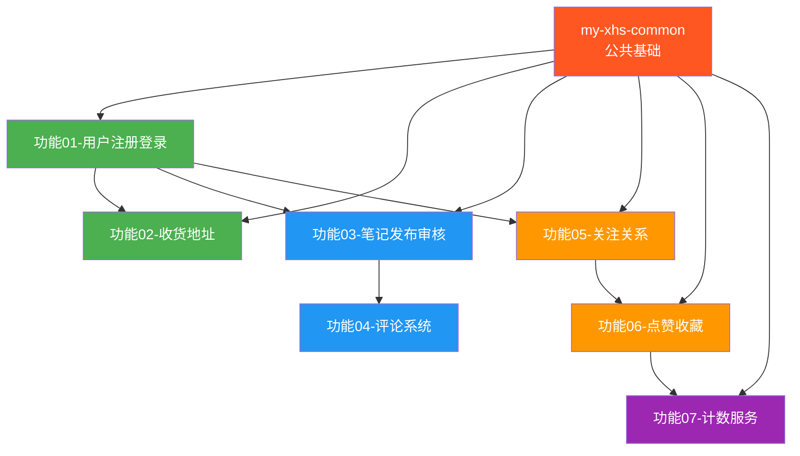

# Phase 1：基础服务 — 详细梳理

> 🎯 目标：跑通核心社交链路，用户能注册、发笔记、互动

---

## 一、Phase 1 概览

Phase 1 是整个 my-xhs 项目的地基，需要完成 7 个核心功能，涉及 4 个微服务 + 1 个公共模块。本阶段的核心命题是：**一个用户从注册到发笔记到互动的完整社交闭环**。

```
用户注册 → 登录(双Token) → 发布笔记(审核) → 被评论(楼中楼) → 被关注/赞/藏 → 计数更新
    ↓           ↓               ↓                ↓                ↓              ↓
  User服务    User服务      Content服务       Content服务     Analytics服务   Counter服务
```

---

## 二、涉及的模块与端口

| 模块 | 实际目录 | 端口 | 数据库 | Phase 1 职责 |
|------|---------|------|--------|-------------|
| my-xhs-common | my-xhs-common | — | — | 公共基础（统一响应、注解、缓存、异常、ID生成） |
| my-xhs-user | my-xhs-user | 9001 | my_xhs_user | 用户注册登录、收货地址 |
| my-xhs-content | my-xhs-content | 9002 | my_xhs_note | 笔记发布审核、评论系统 |
| my-xhs-analytics | my-xhs-analytics | 9003 | my_xhs_social | 关注关系、点赞收藏 |
| my-xhs-counter | my-xhs-counter | 9004 | my_xhs_counter | 计数服务 |

> ✅ **命名不一致问题已修复**：pom.xml 中的模块名已统一为实际目录名。my-xhs-counter 模块已新建。

---

## 三、功能详细梳理

### 功能 01：用户注册登录

#### 3.1.1 功能描述

用户通过手机号/邮箱+密码注册，登录后获取 JWT 双 Token（Access + Refresh），支持图形验证码防刷。

#### 3.1.2 涉及服务

`my-xhs-user`（端口 9001，数据库 `my_xhs_user`）

#### 3.1.3 API 接口清单

| 方法 | 路径 | 说明 | 鉴权 |
|------|------|------|------|
| POST | `/api/user/register` | 用户注册 | ❌ |
| POST | `/api/user/login` | 用户登录 | ❌ |
| POST | `/api/user/refresh-token` | 刷新 Access Token | ❌(需Refresh Token) |
| POST | `/api/user/logout` | 退出登录 | ✅ |
| GET | `/api/user/captcha` | 获取图形验证码 | ❌ |
| GET | `/api/user/profile` | 获取当前用户信息 | ✅ |
| PUT | `/api/user/profile` | 更新用户信息 | ✅ |

#### 3.1.4 数据库表

**t_user**（预估 1000 万）

| 字段 | 类型 | 说明 |
|------|------|------|
| id | BIGINT PK | 用户ID（号段模式，8~10位） |
| username | VARCHAR(32) UK | 用户名 |
| password | VARCHAR(128) | 密码（BCrypt） |
| phone | VARCHAR(20) UK | 手机号 |
| email | VARCHAR(64) UK | 邮箱 |
| nickname | VARCHAR(32) | 昵称 |
| avatar | VARCHAR(256) | 头像URL |
| gender | TINYINT | 性别:0未知1男2女 |
| points | INT | 积分 |
| balance | DECIMAL(16,2) | 虚拟余额（不涉及真实支付） |
| vip | TINYINT | 是否VIP |
| status | TINYINT | 状态:0禁用1正常 |
| last_login_time | DATETIME | 最后登录时间 |
| created_at | DATETIME | 创建时间 |
| updated_at | DATETIME | 更新时间 |

#### 3.1.5 Redis Key 清单

| Key | 数据结构 | TTL | 说明 |
|-----|---------|-----|------|
| `user:info:{userId}` | Hash | 30min | 用户基本信息缓存 |
| `user:token:access:{userId}` | String | 30min | Access Token |
| `user:token:refresh:{userId}` | String | 7d | Refresh Token |
| `user:token:blacklist:{tokenId}` | String | 与Token剩余TTL一致 | Token黑名单（注销用） |
| `user:captcha:{key}` | String | 5min | 图形验证码 |
| `user:register:lock:{phone}` | String | 10s | 注册分布式锁 |

#### 3.1.6 Java 文件清单

**controller/**
```
UserController.java          — 用户注册/登录/刷新Token/注销/个人信息
CaptchaController.java       — 图形验证码获取
```

**service/**
```
UserService.java             — 用户业务接口
UserServiceImpl.java         — 用户业务实现
CaptchaService.java          — 验证码服务
TokenService.java            — Token生成/刷新/校验/黑名单
```

**mapper/**
```
UserMapper.java              — MyBatis-Plus Mapper
```

**entity/**
```
User.java                    — 用户实体（对应t_user）
```

**dto/**
```
UserRegisterRequest.java     — 注册请求
UserLoginRequest.java        — 登录请求
UserLoginResponse.java       — 登录响应（含双Token）
TokenRefreshRequest.java     — Token刷新请求
TokenRefreshResponse.java    — Token刷新响应
UserVO.java                  — 用户信息VO
```

**config/**
```
SecurityConfig.java          — 安全配置（密码编码器等）
```

#### 3.1.7 核心技术点

| 技术点 | 方案 | 关键实现 |
|--------|------|----------|
| 密码加密 | BCrypt（慢哈希） | `PasswordEncoder` → `BCryptPasswordEncoder` |
| JWT双Token | Access 30min + Refresh 7d | jjwt 0.12.x 生成/解析；Refresh换Access静默续期 |
| Token注销 | Redis黑名单 | 退出时Token加入黑名单，校验时先查黑名单 |
| 验证码 | Kaptcha生成 + Redis 5min | UUID作为key，验证后立即删除（防重用） |
| 注册防刷 | @RateLimit + 分布式锁 | 同IP 1小时5次；同手机号分布式锁防并发注册 |
| 登录防刷 | @RateLimit | 同账号5分钟失败5次后锁定15分钟 |
| 用户缓存 | Cache Aside + 延迟双删 | 读缓存→DB→写缓存；更新时先更新DB→删缓存→延迟再删 |

#### 3.1.8 依赖的公共组件（my-xhs-common）

| 组件 | 用途 |
|------|------|
| `R<T>` | 统一响应体 |
| `BizErrorCode` | 业务错误码枚举 |
| `@RateLimit` | 接口限频注解 |
| `@DistributedLock` | 分布式锁注解（注册防并发） |
| `RedisOperator<T>` | Redis操作封装 |
| `CacheHelper` | Cache Aside封装 |
| `BizException` | 业务异常 |
| `GlobalExceptionHandler` | 全局异常处理 |
| `UserContext` | ThreadLocal用户上下文 |
| 雪花ID/号段ID | 用户ID生成 |

---

### 功能 02：收货地址管理

#### 3.2.1 功能描述

用户管理收货地址，支持 CRUD、设置默认地址、地址数量上限控制。

#### 3.2.2 涉及服务

`my-xhs-user`（端口 9001，数据库 `my_xhs_user`）

#### 3.2.3 API 接口清单

| 方法 | 路径 | 说明 | 鉴权 |
|------|------|------|------|
| GET | `/api/user/address/list` | 获取地址列表 | ✅ |
| GET | `/api/user/address/{id}` | 获取地址详情 | ✅ |
| POST | `/api/user/address` | 新增地址 | ✅ |
| PUT | `/api/user/address/{id}` | 更新地址 | ✅ |
| DELETE | `/api/user/address/{id}` | 删除地址 | ✅ |
| PUT | `/api/user/address/{id}/default` | 设置默认地址 | ✅ |

#### 3.2.4 数据库表

**t_user_address**（预估 5000 万）

| 字段 | 类型 | 说明 |
|------|------|------|
| id | BIGINT PK | 地址ID |
| user_id | BIGINT | 用户ID |
| receiver_name | VARCHAR(32) | 收货人 |
| receiver_phone | VARCHAR(20) | 手机号 |
| province | VARCHAR(32) | 省 |
| city | VARCHAR(32) | 市 |
| district | VARCHAR(32) | 区 |
| detail_address | VARCHAR(256) | 详细地址 |
| is_default | TINYINT | 是否默认:0否1是 |
| created_at | DATETIME | 创建时间 |
| updated_at | DATETIME | 更新时间 |

#### 3.2.5 Redis Key 清单

| Key | 数据结构 | TTL | 说明 |
|-----|---------|-----|------|
| `user:address:default:{userId}` | String | 30min | 默认地址ID缓存 |

#### 3.2.6 Java 文件清单

**controller/**
```
UserAddressController.java   — 收货地址CRUD
```

**service/**
```
UserAddressService.java      — 地址业务接口
UserAddressServiceImpl.java  — 地址业务实现
```

**mapper/**
```
UserAddressMapper.java       — MyBatis-Plus Mapper
```

**entity/**
```
UserAddress.java             — 地址实体（对应t_user_address）
```

**dto/**
```
AddressCreateRequest.java    — 新增地址请求
AddressUpdateRequest.java    — 更新地址请求
AddressVO.java               — 地址VO（手机号脱敏）
```

#### 3.2.7 核心技术点

| 技术点 | 方案 | 关键实现 |
|--------|------|------|
| 地址数量限制 | 每用户最多20条 | 新增前COUNT检查 |
| 默认地址 | 唯一默认 + Redis缓存默认地址ID | 设新默认时先取消旧默认（事务保证） |
| 手机号脱敏 | 返回VO中间4位打码 | `138****1234` |
| 缓存 | 默认地址ID缓存Redis | 下单时频繁查默认地址，缓存减少DB查询 |

---

### 功能 03：笔记发布与审核

#### 3.3.1 功能描述

用户发布图文笔记，经过 DFA 敏感词审核后上架。支持草稿→待审核→已发布/驳回状态流转。

#### 3.3.2 涉及服务

`my-xhs-content`（端口 9002，数据库 `my_xhs_note`）

#### 3.3.3 API 接口清单

| 方法 | 路径 | 说明 | 鉴权 |
|------|------|------|------|
| POST | `/api/note/publish` | 发布笔记 | ✅ |
| POST | `/api/note/draft` | 保存草稿 | ✅ |
| PUT | `/api/note/{id}` | 编辑笔记 | ✅ |
| DELETE | `/api/note/{id}` | 删除笔记 | ✅ |
| GET | `/api/note/{id}` | 获取笔记详情 | ❌(公开) |
| GET | `/api/note/user/{userId}` | 获取用户笔记列表 | ❌(公开) |
| POST | `/api/note/upload/image` | 上传笔记图片 | ✅ |

#### 3.3.4 数据库表

**t_note**（预估 5000 万）

| 字段 | 类型 | 说明 |
|------|------|------|
| id | BIGINT PK | 笔记ID |
| user_id | BIGINT | 作者ID |
| title | VARCHAR(100) | 标题 |
| content | TEXT | 正文 |
| cover_image | VARCHAR(256) | 封面图 |
| note_type | TINYINT | 类型:1图文2视频 |
| status | TINYINT | 状态:0待审核1已发布2已下架3草稿4审核驳回 |
| like_count | INT | 点赞数（冗余，权威在counter） |
| collect_count | INT | 收藏数 |
| comment_count | INT | 评论数 |
| view_count | INT | 浏览数 |
| created_at | DATETIME | 创建时间 |
| updated_at | DATETIME | 更新时间 |

**t_note_image**（预估 2 亿）

| 字段 | 类型 | 说明 |
|------|------|------|
| id | BIGINT PK | 图片ID |
| note_id | BIGINT | 笔记ID |
| image_url | VARCHAR(256) | 图片URL |
| sort_order | INT | 排序 |

#### 3.3.5 Redis Key 清单

| Key | 数据结构 | TTL | 说明 |
|-----|---------|-----|------|
| `note:info:{noteId}` | Hash | 30min | 笔记详情缓存 |
| `note:list:user:{userId}` | ZSet | 30min | 用户笔记列表（score=发布时间） |

#### 3.3.6 Java 文件清单

**controller/**
```
NoteController.java          — 笔记发布/编辑/删除/详情/列表
NoteImageController.java     — 图片上传
```

**service/**
```
NoteService.java             — 笔记业务接口
NoteServiceImpl.java         — 笔记业务实现
NoteImageService.java        — 笔记图片服务
```

**mapper/**
```
NoteMapper.java              — 笔记Mapper
NoteImageMapper.java         — 笔记图片Mapper
```

**entity/**
```
Note.java                    — 笔记实体
NoteImage.java               — 笔记图片实体
```

**dto/**
```
NotePublishRequest.java      — 发布请求
NoteUpdateRequest.java       — 编辑请求
NoteVO.java                  — 笔记VO
```

**enums/**
```
NoteStatus.java              — 笔记状态枚举(DRAFT/PENDING/PUBLISHED/REJECTED/DELETED)
```

**sensitive/**
```
DFAFilter.java               — DFA敏感词过滤器（Trie树构建+匹配）
SensitiveWordContext.java    — 敏感词上下文（词库加载/热更新）
```

**storage/**
```
FileStorageService.java      — 文件存储接口（抽象，可切OSS）
LocalFileStorageService.java — 本地磁盘实现
```

#### 3.3.7 核心技术点

| 技术点 | 方案 | 关键实现 |
|--------|------|------|
| 笔记状态机 | 草稿→待审核→已发布/驳回 | 状态枚举+校验，防非法状态流转 |
| DFA敏感词 | Trie树，10万词库毫秒匹配 | `Map<Character, Object>` 嵌套构建Trie；遍历文本O(n)匹配 |
| 敏感词热更新 | Redis Pub/Sub 通知刷新 | 运营新增敏感词→发布通知→各节点刷新Trie树 |
| 图片上传 | 本地磁盘 + 接口抽象 | `FileStorageService`接口，生产切OSS零改动 |
| 笔记缓存 | Cache Aside + 逻辑过期 | 热点笔记逻辑过期，异步更新不阻塞请求 |
| 发布限频 | @RateLimit | 同一用户 1分钟内最多发布5篇 |

---

### 功能 04：评论系统

#### 3.4.1 功能描述

支持楼中楼评论、评论敏感词过滤、评论举报。评论按时间序/热度序双排序。

#### 3.4.2 涉及服务

`my-xhs-content`（端口 9002，数据库 `my_xhs_note`）

#### 3.4.3 API 接口清单

| 方法 | 路径 | 说明 | 鉴权 |
|------|------|------|------|
| POST | `/api/comment/publish` | 发表评论 | ✅ |
| DELETE | `/api/comment/{id}` | 删除评论 | ✅ |
| GET | `/api/comment/list` | 评论列表（时间序） | ❌ |
| GET | `/api/comment/hot` | 评论列表（热度序） | ❌ |
| POST | `/api/comment/{id}/report` | 举报评论 | ✅ |

#### 3.4.4 数据库表

**t_comment**（预估 5 亿）

| 字段 | 类型 | 说明 |
|------|------|------|
| id | BIGINT PK | 评论ID |
| note_id | BIGINT | 笔记ID |
| user_id | BIGINT | 评论者ID |
| parent_id | BIGINT | 父评论ID(0=一级) |
| root_id | BIGINT | 根评论ID |
| reply_user_id | BIGINT | 被回复用户ID |
| content | VARCHAR(500) | 评论内容 |
| like_count | INT | 点赞数 |
| status | TINYINT | 状态:0待审核1正常2删除 |
| created_at | DATETIME | 创建时间 |

**t_comment_report**（预估 1000 万）

| 字段 | 类型 | 说明 |
|------|------|------|
| id | BIGINT PK | 举报ID |
| comment_id | BIGINT | 评论ID |
| reporter_id | BIGINT | 举报人ID |
| report_type | TINYINT | 举报类型(1~9) |
| report_reason | VARCHAR(500) | 举报原因 |
| status | TINYINT | 处理状态:0待处理1已处理2已驳回 |
| handle_result | VARCHAR(256) | 处理结果 |
| satisfy | TINYINT | 满意度:0未反馈1满意2不满意 |

#### 3.4.5 Redis Key 清单

| Key | 数据结构 | TTL | 说明 |
|-----|---------|-----|------|
| `note:comment:time:{noteId}` | ZSet | 30min | 评论时间序（score=timestamp） |
| `note:comment:hot:{noteId}` | ZSet | 30min | 评论热度序（score=likeCount） |

#### 3.4.6 Java 文件清单

**controller/**
```
CommentController.java       — 评论发表/删除/列表/举报
```

**service/**
```
CommentService.java          — 评论业务接口
CommentServiceImpl.java      — 评论业务实现（复用SensitiveWordService）
CommentReportService.java    — 评论举报服务
```

**mapper/**
```
CommentMapper.java           — 评论Mapper
CommentReportMapper.java     — 举报Mapper
```

**entity/**
```
Comment.java                 — 评论实体
CommentReport.java           — 评论举报实体
```

**dto/**
```
CommentPublishRequest.java   — 评论请求
CommentVO.java               — 评论VO（含子评论）
CommentReportRequest.java    — 举报请求
```

**enums/**
```
CommentStatus.java           — 评论状态枚举
ReportType.java              — 举报类型枚举(9种) |
```

#### 3.4.7 核心技术点

| 技术点 | 方案 | 关键实现 |
|--------|------|----------|
| 楼中楼 | parent_id + root_id | 一级评论parent=0；回复评论parent=被回复ID，root=根评论ID |
| 评论排序 | 双ZSet（时间序+热度序） | `ZRANGEBYSCORE` 分页查询，按需切换 |
| 评论敏感词 | DFA复用 | 与笔记发布共用 `SensitiveWordService` |
| 评论顺序消息 | RocketMQ 顺序消息 | 同一笔记的评论进入同一Queue，保证顺序 |
| 评论计数 | MQ异步通知Counter服务 | 评论数更新不阻塞评论接口 |

---

### 功能 05：关注与社交关系

#### 3.5.1 功能描述

用户关注/取关，查看关注列表/粉丝列表/共同关注。Lua 脚本保证关注+计数原子性。

#### 3.5.2 涉及服务

`my-xhs-analytics`（端口 9003，数据库 `my_xhs_social`）

#### 3.5.3 API 接口清单

| 方法 | 路径 | 说明 | 鉴权 |
|------|------|------|------|
| POST | `/api/social/follow/{userId}` | 关注用户 | ✅ |
| DELETE | `/api/social/follow/{userId}` | 取关用户 | ✅ |
| GET | `/api/social/following/{userId}` | 关注列表 | ❌(公开) |
| GET | `/api/social/follower/{userId}` | 粉丝列表 | ❌(公开) |
| GET | `/api/social/common/{userId}` | 共同关注 | ✅ |
| GET | `/api/social/relation/{userId}` | 查询是否关注 | ✅ |

#### 3.5.4 数据库表

**t_follow**（预估 10 亿）

| 字段 | 类型 | 说明 |
|------|------|------|
| id | BIGINT PK | 记录ID |
| user_id | BIGINT | 用户ID |
| follow_user_id | BIGINT | 被关注用户ID |
| created_at | DATETIME | 关注时间 |

> UNIQUE KEY `uk_user_follow` (user_id, follow_user_id)

#### 3.5.5 Redis Key 清单

| Key | 数据结构 | TTL | 说明 |
|-----|---------|-----|------|
| `social:following:{userId}` | ZSet | 永久 | 关注列表（score=关注时间） |
| `social:follower:{userId}` | ZSet | 永久 | 粉丝列表（score=关注时间） |
| `social:relation:{userId}:{targetUserId}` | String | 永久 | 关注关系（O(1)判断） |

#### 3.5.6 Java 文件清单

**controller/**
```
FollowController.java        — 关注/取关/列表/共同关注
```

**service/**
```
FollowService.java           — 关注业务接口
FollowServiceImpl.java       — 关注业务实现
```

**mapper/**
```
FollowMapper.java            — 关注关系Mapper
```

**entity/**
```
Follow.java                  — 关注关系实体
```

**dto/**
```
FollowVO.java                — 关注关系VO
CommonFollowVO.java          — 共同关注VO
```

**lua/**
```
follow_and_count.lua         — Lua脚本：关注+计数原子操作
unfollow_and_count.lua       — Lua脚本：取关+计数原子操作
```

#### 3.5.7 核心技术点

| 技术点 | 方案 | 关键实现 |
|--------|------|----------|
| 关注列表 | Redis ZSet（score=关注时间） | 天然排序+分页，`ZRANGEBYSCORE` |
| 粉丝列表 | Redis ZSet | 同上 |
| 共同关注 | Redis Set 交集运算 | `SINTER` 求两个关注列表交集 |
| 关注原子性 | Lua脚本 | 关注+粉丝数+关注数一步完成，不丢数据 |
| 异步落库 | MQ异步写MySQL | Redis实时返回，MQ异步持久化 |
| 防重复关注 | ZSet天然去重 + DB唯一索引 | 双重保障 |

#### 3.5.8 Lua 脚本设计

```lua
-- follow_and_count.lua
-- 关注用户+更新计数（原子操作）
local userId = KEYS[1]           -- 当前用户
local targetUserId = KEYS[2]     -- 目标用户
local currentTime = ARGV[1]      -- 关注时间戳

-- 1. 添加关注关系
redis.call('ZADD', 'social:following:' .. userId, currentTime, targetUserId)
-- 2. 添加粉丝关系
redis.call('ZADD', 'social:follower:' .. targetUserId, currentTime, userId)
-- 3. 更新关注数
redis.call('INCR', 'counter:user_following:' .. userId)
-- 4. 更新粉丝数
redis.call('INCR', 'counter:user_follower:' .. targetUserId)

return 1
```

---

### 功能 06：点赞收藏

#### 3.6.1 功能描述

用户对笔记/评论点赞，对笔记收藏。幂等设计防止重复操作，Redis Set 存储点赞用户集合，MQ 异步落库。

#### 3.6.2 涉及服务

`my-xhs-analytics`（端口 9003，数据库 `my_xhs_social`）

#### 3.6.3 API 接口清单

| 方法 | 路径 | 说明 | 鉴权 |
|------|------|------|------|
| POST | `/api/social/like` | 点赞（笔记/评论） | ✅ |
| DELETE | `/api/social/like` | 取消点赞 | ✅ |
| GET | `/api/social/like/status` | 查询点赞状态 | ✅ |
| POST | `/api/social/favorite` | 收藏笔记 | ✅ |
| DELETE | `/api/social/favorite` | 取消收藏 | ✅ |
| GET | `/api/social/favorite/list` | 收藏列表 | ✅ |
| GET | `/api/social/favorite/status` | 查询收藏状态 | ✅ |

#### 3.6.4 数据库表

**t_like**（预估 50 亿）

| 字段 | 类型 | 说明 |
|------|------|------|
| id | BIGINT PK | 记录ID |
| user_id | BIGINT | 用户ID |
| biz_type | TINYINT | 业务类型:1笔记2评论 |
| biz_id | BIGINT | 业务ID |
| created_at | DATETIME | 创建时间 |

> UNIQUE KEY `uk_user_biz` (user_id, biz_type, biz_id)

**t_favorite**（预估 10 亿）

| 字段 | 类型 | 说明 |
|------|------|------|
| id | BIGINT PK | 记录ID |
| user_id | BIGINT | 用户ID |
| note_id | BIGINT | 笔记ID |
| created_at | DATETIME | 创建时间 |

> UNIQUE KEY `uk_user_note` (user_id, note_id)

#### 3.6.5 Redis Key 清单

| Key | 数据结构 | TTL | 说明 |
|-----|---------|-----|------|
| `social:like:note:{noteId}` | Set | 永久 | 笔记点赞用户集合 |
| `social:like:user:{userId}:note` | Set | 永久 | 用户点赞的笔记集合 |
| `social:like:comment:{commentId}` | Set | 永久 | 评论点赞用户集合 |
| `social:favorite:{userId}` | ZSet | 永久 | 用户收藏列表（score=收藏时间） |

#### 3.6.6 Java 文件清单

**controller/**
```
LikeController.java          — 点赞/取消/状态
FavoriteController.java      — 收藏/取消/列表/状态
```

**service/**
```
LikeService.java             — 点赞业务接口
LikeServiceImpl.java         — 点赞业务实现
FavoriteService.java         — 收藏业务接口
FavoriteServiceImpl.java     — 收藏业务实现
```

**mapper/**
```
LikeMapper.java              — 点赞Mapper
FavoriteMapper.java          — 收藏Mapper
```

**entity/**
```
Like.java                    — 点赞实体
Favorite.java                — 收藏实体
```

**dto/**
```
LikeRequest.java             — 点赞请求（bizType + bizId）
LikeStatusVO.java            — 点赞状态VO
FavoriteVO.java              — 收藏VO
```

**enums/**
```
BizType.java                 — 业务类型枚举(NOTE=1, COMMENT=2) |
```

#### 3.6.7 核心技术点

| 技术点 | 方案 | 关键实现 |
|--------|------|----------|
| 幂等设计 | Redis Set + @Idempotent | `SADD` 返回0=已点赞；`@Idempotent`防重复请求 |
| 点赞状态查询 | Redis Set SISMEMBER | O(1)判断用户是否点赞，不查DB |
| 批量点赞状态 | Redis Pipeline SMISMEMBER | 笔记列表页批量查询当前用户点赞状态 |
| 异步落库 | MQ → MySQL | 点赞/收藏先写Redis返回，MQ异步写MySQL |
| 计数联动 | MQ → Counter服务 | 点赞/收藏事件通知Counter更新计数 |

---

### 功能 07：计数服务

#### 3.7.1 功能描述

统一管理点赞数、收藏数、评论数、粉丝数、浏览数等计数。Buffer-Trigger 批量刷盘，对账修复保证最终一致。

#### 3.7.2 涉及服务

`my-xhs-counter`（端口 9004，数据库 `my_xhs_counter`）

#### 3.7.3 API 接口清单

| 方法 | 路径 | 说明 | 鉴权 |
|------|------|------|------|
| POST | `/api/counter/increment` | 计数+1 | 内部调用 |
| POST | `/api/counter/decrement` | 计数-1 | 内部调用 |
| GET | `/api/counter/get` | 查询计数 | ❌(公开) |
| POST | `/api/counter/batch-get` | 批量查询计数 | ❌(公开) |

#### 3.7.4 数据库表

**t_counter**（预估 10 亿）

| 字段 | 类型 | 说明 |
|------|------|------|
| id | BIGINT PK | 记录ID |
| biz_type | VARCHAR(32) | 业务类型:note_like/note_collect/user_follower等 |
| biz_id | BIGINT | 业务ID |
| count_value | BIGINT | 计数值 |
| updated_at | DATETIME | 更新时间 |

> UNIQUE KEY `uk_biz` (biz_type, biz_id)

#### 3.7.5 Redis Key 清单

| Key | 数据结构 | TTL | 说明 |
|-----|---------|-----|------|
| `counter:{bizType}:{bizId}` | String | 永久 | 计数值 |

#### 3.7.6 Java 文件清单

**controller/**
```
CounterController.java       — 计数增减/查询/批量查询
```

**service/**
```
CounterService.java          — 计数业务接口
CounterServiceImpl.java      — 计数业务实现
```

**mapper/**
```
CounterMapper.java           — 计数Mapper
```

**entity/**
```
Counter.java                 — 计数实体
```

**dto/**
```
CounterRequest.java          — 计数请求(bizType + bizId + delta)
CounterVO.java               — 计数VO
CounterBatchRequest.java     — 批量查询请求
CounterBatchVO.java          — 批量查询结果
```

**buffer/**
```
BufferTrigger.java           — Buffer-Trigger核心（攒批+合并+定时刷盘）
CounterBuffer.java           — 计数缓冲区实现
```

**enums/**
```
CounterBizType.java          — 计数业务类型枚举 |
```

**job/**（Phase 4 引入 XXL-Job 后实现）
```
CounterFlushJob.java         — XXL-Job: 缓冲区刷DB（每10秒）
CounterReconcileJob.java     — XXL-Job: Redis↔DB对账修复（每天凌晨3点）
```

#### 3.7.7 核心技术点

| 技术点 | 方案 | 关键实现 |
|--------|------|----------|
| 计数存储 | Redis String INCR/DECR | 实时计数，毫秒级读写 |
| Buffer-Trigger | 内存Buffer攒批+合并+定时刷盘 | 满100条或超5秒→合并同Key增减→批量写DB |
| 合并策略 | 同Key增减合并 | +1, +1, -1, +1 → +2，4次写变1次 |
| 批量写入SQL | INSERT ON DUPLICATE KEY UPDATE | 首次点赞计数记录不存在，INSERT保证写入 |
| 对账修复 | Spring @Scheduled 每天凌晨对比（Phase 4 切 XXL-Job） | Redis值 vs DB值，差异>阈值自动修复 |
| 本地缓存 | Caffeine | 热点计数本地缓存（1分钟），减少Redis查询 |

#### 3.7.8 Buffer-Trigger 流程详解

```
点赞事件 → Redis INCR(实时扣减, 用户立即可见)
         → 写入本地Buffer(内存)
              ↓
         Buffer满100条 或 超时5秒
              ↓
         合并同Key增减(+1,+1,-1 → +1)
              ↓
         批量SQL: INSERT INTO t_counter ... ON DUPLICATE KEY UPDATE count=count+VALUES(count)
              ↓
         写入失败 → 重试3次 → 仍失败记录日志(对账修复)
```

---

## 四、my-xhs-common 公共模块梳理

> Phase 1 所有服务都依赖 common 模块，必须最先搭建。

### 4.1 需要实现的组件

| 分组 | 组件 | Java 文件 | Phase 1 使用方 |
|------|------|----------|--------------|
| **统一响应** | R\<T\> | `R.java` | 所有服务 |
| | IErrorCode | `IErrorCode.java` | 所有服务 |
| | BizErrorCode | `BizErrorCode.java` | 所有服务 |
| | SysErrorCode | `SysErrorCode.java` | 所有服务 |
| **异常体系** | BizException | `BizException.java` | 所有服务 |
| | SysException | `SysException.java` | 所有服务 |
| | GlobalExceptionHandler | `GlobalExceptionHandler.java` | 所有服务 |
| **注解式能力** | @RateLimit | `RateLimit.java` + `RateLimitAspect.java` | User(Content/Analytics) |
| | @DistributedLock | `DistributedLock.java` + `DistributedLockAspect.java` | User(注册防并发) |
| | @Idempotent | `Idempotent.java` + `IdempotentAspect.java` | Analytics(点赞幂等) |
| **缓存封装** | RedisOperator\<T\> | `RedisOperator.java` | 所有服务 |
| | CacheHelper | `CacheHelper.java` | User/Content |
| **请求上下文** | UserContext | `UserContext.java` | 所有服务 |
| | UserContextHolder | `UserContextHolder.java` | 所有服务 |
| | TraceIdFilter | `TraceIdFilter.java` | 所有服务 |
| **ID 生成** | SnowflakeIdGenerator | `SnowflakeIdGenerator.java` | 所有服务 |
| | SegmentIdGenerator | `SegmentIdGenerator.java` | User(用户ID) |
| **消息封装** | BaseMQConsumer | `BaseMQConsumer.java` | Content/Analytics/Counter |
| **DTO 基类** | BaseRequest | `BaseRequest.java` | 所有服务 |
| | BaseEntity | `BaseEntity.java` | 所有服务 |

### 4.2 Maven 依赖

```xml
<!-- my-xhs-common 已引入的依赖 -->
<dependency>spring-boot-starter-web (optional)</dependency>        <!-- Web基础（optional：Gateway基于WebFlux不引入） -->
<dependency>spring-boot-starter-aop</dependency>                  <!-- AOP注解 -->
<dependency>spring-boot-starter-validation</dependency>           <!-- 参数校验 -->
<dependency>spring-boot-starter-data-redis</dependency>           <!-- Redis操作 -->
<dependency>redisson</dependency>                                 <!-- 分布式锁 -->
<dependency>mybatis-plus-spring-boot3-starter</dependency>        <!-- ORM基类(Boot3) -->
<dependency>jjwt-api + jjwt-impl + jjwt-jackson</dependency>      <!-- JWT -->
<dependency>rocketmq-spring-boot-starter</dependency>             <!-- MQ封装 -->
<dependency>caffeine</dependency>                                 <!-- 本地缓存 -->
<dependency>lombok</dependency>                                   <!-- 简化代码 -->
<dependency>hutool-all</dependency>                               <!-- 工具库 -->
<dependency>fastjson2</dependency>                                <!-- JSON -->
<dependency>guava</dependency>                                    <!-- Google工具 -->
<dependency>commons-lang3</dependency>                            <!-- Apache工具 -->
<dependency>commons-codec</dependency>                            <!-- 编解码 -->
<dependency>mapstruct</dependency>                                <!-- 对象映射 -->
```

---

## 五、中间件需求

Phase 1 需要的中间件（最精简集合）：

| 中间件 | 版本 | 用途 | Phase 1 是否必须 |
|--------|------|------|-----------------|
| MySQL | 8.0 | 业务数据存储 | ✅ 必须 |
| Redis | 7.x | 缓存/分布式锁/计数/Token | ✅ 必须 |
| Nacos | 2.3.x | 注册中心+配置中心 | ✅ 必须（服务注册发现） |
| RocketMQ | 5.1.x | 异步消息（评论/关注/点赞/计数） | ✅ 必须 |
| XXL-Job | 3.0 | 定时任务（计数刷盘/对账） | ❌ Phase 4 引入（Phase 1 用 Spring @Scheduled 替代） |

> Phase 1 **不需要**的中间件：ES（Phase 3）、Canal（Phase 3）、Sentinel（Phase 4）、SkyWalking（Phase 5）、ShardingSphere（Phase 5）

---

## 六、MQ Topic 清单（Phase 1）

| Topic | Tag | 生产者 | 消费者 | 消息类型 | 说明 |
|-------|-----|-------|--------|---------|------|
| SOCIAL_TOPIC | FOLLOW | Analytics | Counter | 普通 | 关注事件 |
| SOCIAL_TOPIC | UNFOLLOW | Analytics | Counter | 普通 | 取关事件 |
| SOCIAL_TOPIC | LIKE | Analytics | Counter | 普通 | 点赞事件 |
| SOCIAL_TOPIC | UNLIKE | Analytics | Counter | 普通 | 取消点赞 |
| SOCIAL_TOPIC | FAVORITE | Analytics | Counter | 普通 | 收藏事件 |
| SOCIAL_TOPIC | UNFAVORITE | Analytics | Counter | 普通 | 取消收藏 |
| NOTE_TOPIC | COMMENT | Content | Counter | 顺序 | 评论事件 |
| NOTE_TOPIC | PUBLISH | Content | (Phase 3: Search/Feed) | 普通 | 笔记发布 |

---

## 七、开发顺序与依赖关系



### 推荐开发顺序

| 步骤 | 开发内容 | 依赖 | 预计工作量 |
|------|---------|------|-----------|
| **Step 0** | 修复项目骨架问题 | 无 | 0.5天 |
| | — 统一 pom.xml 模块名与实际目录 | | |
| | — 统一 Java 版本为 17 | | |
| | — 补充 my-xhs-common 依赖 | | |
| | — 新建 my-xhs-counter 模块 | | |
| **Step 1** | my-xhs-common 公共模块 | 无 | 2天 |
| | — R\<T\>、BizErrorCode、SysErrorCode | | |
| | — BizException、SysException、GlobalExceptionHandler | | |
| | — @RateLimit + Aspect（Redis Lua 滑动窗口） | | |
| | — @DistributedLock + Aspect（Redisson） | | |
| | — @Idempotent + Aspect（Redis SET NX） | | |
| | — RedisOperator\<T\>、CacheHelper | | |
| | — UserContext、UserContextHolder | | |
| | — SnowflakeIdGenerator、SegmentIdGenerator | | |
| | — BaseEntity、BaseRequest | | |
| **Step 2** | 功能01-用户注册登录 | Step 1 | 2天 |
| | — User 实体 + Mapper + CRUD | | |
| | — JWT双Token（TokenService） | | |
| | — 图形验证码（Kaptcha + Redis） | | |
| | — 注册（@DistributedLock防并发 + BCrypt） | | |
| | — 登录（双Token返回） | | |
| | — Token刷新/注销（黑名单） | | |
| | — 用户缓存（Cache Aside + 延迟双删） | | |
| **Step 3** | 功能02-收货地址 | Step 2 | 0.5天 |
| | — UserAddress 实体 + Mapper + CRUD | | |
| | — 默认地址（事务+Redis缓存） | | |
| | — 地址数量限制（20条上限） | | |
| **Step 4** | 功能03-笔记发布审核 | Step 1 | 2天 |
| | — Note + NoteImage 实体 + Mapper | | |
| | — 笔记状态机（草稿→审核→发布/驳回） | | |
| | — DFA敏感词过滤器（Trie树 + 10万词库） | | |
| | — 图片上传（FileStorageService + 本地磁盘） | | |
| | — 笔记缓存 | | |
| **Step 5** | 功能04-评论系统 | Step 4 | 1.5天 |
| | — Comment + CommentReport 实体 + Mapper | | |
| | — 楼中楼评论（parentId + rootId） | | |
| | — 评论双排序（时间序/热度序 Redis ZSet） | | |
| | — 评论敏感词（复用DFA） | | |
| | — 评论顺序消息（RocketMQ） | | |
| | — 评论举报 | | |
| **Step 6** | 功能05-关注关系 | Step 1 | 1.5天 |
| | — Follow 实体 + Mapper | | |
| | — Redis ZSet 关注列表/粉丝列表 | | |
| | — Lua脚本原子操作（关注+计数） | | |
| | — 共同关注（Set交集） | | |
| | — MQ异步落库 | | |
| **Step 7** | 功能06-点赞收藏 | Step 6 | 1.5天 |
| | — Like + Favorite 实体 + Mapper | | |
| | — Redis Set 点赞集合 + ZSet 收藏列表 | | |
| | — @Idempotent 幂等防重 | | |
| | — MQ异步落库 + 通知Counter | | |
| **Step 8** | 功能07-计数服务 | Step 7 | 2天 |
| | — Counter 实体 + Mapper | | |
| | — Redis INCR/DECR 计数 | | |
| | — Buffer-Trigger 批量刷盘 | | |
| | — 合并策略（同Key增减合并） | | |
| | — Spring @Scheduled 对账修复（Phase 4 切 XXL-Job） | | |
| | — 消费各服务MQ消息更新计数 | | |

**总计预估：约 12 天**

---

## 八、服务间调用关系（Phase 1）

```
┌─────────────────────────────────────────────────────────┐
│                     Phase 1 调用关系                      │
├─────────────────────────────────────────────────────────┤
│                                                         │
│  用户请求 → User服务 ←→ Redis(Token/缓存/锁)              │
│          → Content服务 ←→ Redis(笔记缓存/评论ZSet)        │
│                    ↗ MQ(COMMENT)                         │
│          → Analytics服务 ←→ Redis(关注ZSet/点赞Set)       │
│                      ↘ MQ(FOLLOW/LIKE/FAVORITE)         │
│                         → Counter服务 ←→ Redis(计数)     │
│                                    ↘ Buffer-Trigger→DB  │
│                                                         │
│  服务间通信：                                             │
│  - 同步：OpenFeign（预留，Phase 1 暂不跨服务同步调用）      │
│  - 异步：RocketMQ（评论/关注/点赞/计数事件）               │
│  - 注册：Nacos（服务注册发现）                             │
│                                                         │
└─────────────────────────────────────────────────────────┘
```

> Phase 1 暂不需要 OpenFeign 跨服务同步调用（各服务独立），服务间交互通过 MQ 异步。Phase 2 下单时才需要 Feign 同步调用（Order→Inventory/Coupon/User）。

---

## 九、数据库初始化 SQL 清单

### 9.1 my_xhs_user 数据库

```sql
CREATE DATABASE IF NOT EXISTS my_xhs_user DEFAULT CHARACTER SET utf8mb4;
USE my_xhs_user;

-- 用户表
CREATE TABLE t_user (...);        -- 详见功能01

-- 收货地址表
CREATE TABLE t_user_address (...); -- 详见功能02
```

### 9.2 my_xhs_note 数据库

```sql
CREATE DATABASE IF NOT EXISTS my_xhs_note DEFAULT CHARACTER SET utf8mb4;
USE my_xhs_note;

-- 笔记表
CREATE TABLE t_note (...);         -- 详见功能03

-- 笔记图片表
CREATE TABLE t_note_image (...);   -- 详见功能03

-- 评论表
CREATE TABLE t_comment (...);      -- 详见功能04

-- 评论举报表
CREATE TABLE t_comment_report (...); -- 详见功能04
```

### 9.3 my_xhs_social 数据库

```sql
CREATE DATABASE IF NOT EXISTS my_xhs_social DEFAULT CHARACTER SET utf8mb4;
USE my_xhs_social;

-- 关注关系表
CREATE TABLE t_follow (...);       -- 详见功能05

-- 点赞表
CREATE TABLE t_like (...);         -- 详见功能06

-- 收藏表
CREATE TABLE t_favorite (...);     -- 详见功能06
```

### 9.4 my_xhs_counter 数据库

```sql
CREATE DATABASE IF NOT EXISTS my_xhs_counter DEFAULT CHARACTER SET utf8mb4;
USE my_xhs_counter;

-- 计数表
CREATE TABLE t_counter (...);      -- 详见功能07
```

---

## 十、配置文件清单

每个服务需要以下配置文件：

| 文件 | 说明 |
|------|------|
| `application.yml` | 公共配置（端口/服务名/公共开关） |
| `application-dev.yml` | 开发环境（本地MySQL/Redis/MQ） |
| `bootstrap.yml` | Nacos配置中心连接 |

### 关键配置项

**每个服务必须配置：**
- `server.port` — 服务端口
- `spring.application.name` — 服务名（Nacos注册用）
- `spring.datasource` — MySQL连接
- `spring.data.redis` — Redis连接
- `spring.cloud.nacos` — Nacos地址
- `rocketmq.name-server` — RocketMQ地址
- `mybatis-plus` — MP配置
- `logging.pattern.console` — JSON格式日志（含TraceId）

---

## 十一、骨架问题修复记录（✅ 全部已解决）

| # | 问题 | 修复方案 | 状态 |
|---|------|---------|------|
| 1 | pom.xml 模块名与实际目录不一致 | 以实际目录名统一，修改 pom.xml modules | ✅ 已修复 |
| 2 | 子模块 Java 版本冲突（根pom=17，子pom=1.8） | 删除所有子模块 `<java.version>1.8</java.version>` 覆盖，统一继承 Java 17 | ✅ 已修复 |
| 3 | my-xhs-counter 模块不存在 | 新建完整模块（pom.xml + 启动类 + application.yml），端口 9004 | ✅ 已修复 |
| 4 | my-xhs-common 缺少关键依赖 | 添加 AOP/Validation/Redis/Redisson/MyBatis-Plus/JWT/RocketMQ/Caffeine | ✅ 已修复 |
| 5 | MyBatis Plus 不兼容 Spring Boot 3 | 全部替换为 `mybatis-plus-spring-boot3-starter` | ✅ 已修复 |
| 6 | ES/Sentinel 依赖缺失版本号 | 移除暂不需要的 ES High Level Client 和 Sentinel（Phase 3/4 再引入） | ✅ 已修复 |
| 7 | 端口规划混乱 | 统一为 9000(gateway) 9001~9004(Phase 1) 9005~9013(其他) | ✅ 已修复 |
| 8 | user 模块依赖硬编码版本号 | kaptcha/aliyun-oss 改为根 pom 管理 | ✅ 已修复 |
| 9 | Gateway 路由不完整 | 补充 content/analytics/counter 路由规则 | ✅ 已修复 |
| 10 | common 引入 spring-boot-starter-web 导致 Gateway WebFlux 冲突 | common 的 web 依赖设为 `<optional>true</optional>`，各业务模块自行引入 | ✅ 已修复 |
| 11 | Gateway 依赖 my-xhs-common（含 WebMVC 组件，与 WebFlux 不兼容） | 移除 common 依赖，Gateway 自行引入 JWT + Redis | ✅ 已修复 |
| 12 | Gateway 残留 sentinel-datasource-nacos（无 sentinel-core 框架，数据源无用） | 注释掉，Phase 4 引入完整 Sentinel | ✅ 已修复 |
| 13 | 功能03 service/ 与 sensitive/storage 包文件清单重复 | 移除 service/ 中重复的 SensitiveWordService 和 FileStorageService | ✅ 已修复 |
| 14 | 功能07 counter 标注"需新建模块"但已创建 | 移除"需新建模块"标记 | ✅ 已修复 |
| 15 | 功能07 XXL-Job 缺少 pom 依赖 | 标注为 Phase 4 引入，当前用 Spring @Scheduled 替代 | ✅ 已修复 |

> 📌 **编译验证**：16 个模块全部 `mvn compile -DskipTests` BUILD SUCCESS

---

## 十二、文档索引

每个功能的配套文档按以下规范归档到 `docs/phase/phase-1/` 目录：

| 文档类型 | 命名格式 | 说明 |
|----------|----------|------|
| a-前置知识 | `a-前置知识-xxx.md` | Java/JVM/网络知识 + 可运行Demo |
| b-问题驱动实现 | `b-问题驱动实现-xxx.md` | 从0开始以问题驱动推导设计和实现 |
| c-现状梳理 | `c-现状梳理-xxx.md` | 所有文件/类/字段/方法详解 |

### 文档编写顺序

| 优先级 | 文档 | 对应功能 |
|--------|------|---------|
| P0 | b-问题驱动实现-JWT双Token.md | 功能01 |
| P0 | b-问题驱动实现-DFA敏感词.md | 功能03 |
| P0 | b-问题驱动实现-Buffer-Trigger.md | 功能07 |
| P0 | b-问题驱动实现-Lua原子操作.md | 功能05 |
| P1 | a-前置知识-JWT与Token机制.md | 功能01 |
| P1 | a-前置知识-Redis数据结构与实战.md | 功能05/06/07 |
| P1 | a-前置知识-RocketMQ顺序消息.md | 功能04 |
| P2 | c-现状梳理-用户服务.md | 功能01/02 |
| P2 | c-现状梳理-笔记服务.md | 功能03/04 |
| P2 | c-现状梳理-社交服务.md | 功能05/06 |
| P2 | c-现状梳理-计数服务.md | 功能07 |

> 📌 文档编写要求：必须参考本地真实框架源码（如Nacos/Dubbo），不能凭空设计。"问题驱动实现"是最重要的文档。

---

## 十三、完整 DDL SQL（写代码时直接复制执行）

### 13.1 my_xhs_user

```sql
CREATE DATABASE IF NOT EXISTS my_xhs_user DEFAULT CHARACTER SET utf8mb4 COLLATE utf8mb4_unicode_ci;
USE my_xhs_user;

-- 用户表
CREATE TABLE `t_user` (
  `id` BIGINT NOT NULL COMMENT '用户ID（号段模式）',
  `username` VARCHAR(32) NOT NULL COMMENT '用户名',
  `password` VARCHAR(128) NOT NULL COMMENT '密码（BCrypt）',
  `phone` VARCHAR(20) DEFAULT NULL COMMENT '手机号',
  `email` VARCHAR(64) DEFAULT NULL COMMENT '邮箱',
  `nickname` VARCHAR(32) DEFAULT NULL COMMENT '昵称',
  `avatar` VARCHAR(256) DEFAULT NULL COMMENT '头像URL',
  `gender` TINYINT DEFAULT 0 COMMENT '性别:0未知1男2女',
  `points` INT DEFAULT 0 COMMENT '积分',
  `balance` DECIMAL(16,2) DEFAULT 0.00 COMMENT '虚拟余额',
  `vip` TINYINT DEFAULT 0 COMMENT '是否VIP:0否1是',
  `status` TINYINT DEFAULT 1 COMMENT '状态:0禁用1正常',
  `last_login_time` DATETIME DEFAULT NULL COMMENT '最后登录时间',
  `created_at` DATETIME NOT NULL DEFAULT CURRENT_TIMESTAMP COMMENT '创建时间',
  `updated_at` DATETIME NOT NULL DEFAULT CURRENT_TIMESTAMP ON UPDATE CURRENT_TIMESTAMP COMMENT '更新时间',
  PRIMARY KEY (`id`),
  UNIQUE KEY `uk_username` (`username`),
  UNIQUE KEY `uk_phone` (`phone`),
  UNIQUE KEY `uk_email` (`email`)
) ENGINE=InnoDB DEFAULT CHARSET=utf8mb4 COLLATE=utf8mb4_unicode_ci COMMENT='用户表';

-- 收货地址表
CREATE TABLE `t_user_address` (
  `id` BIGINT NOT NULL COMMENT '地址ID',
  `user_id` BIGINT NOT NULL COMMENT '用户ID',
  `receiver_name` VARCHAR(32) NOT NULL COMMENT '收货人',
  `receiver_phone` VARCHAR(20) NOT NULL COMMENT '手机号',
  `province` VARCHAR(32) NOT NULL COMMENT '省',
  `city` VARCHAR(32) NOT NULL COMMENT '市',
  `district` VARCHAR(32) NOT NULL COMMENT '区',
  `detail_address` VARCHAR(256) NOT NULL COMMENT '详细地址',
  `is_default` TINYINT DEFAULT 0 COMMENT '是否默认:0否1是',
  `created_at` DATETIME NOT NULL DEFAULT CURRENT_TIMESTAMP COMMENT '创建时间',
  `updated_at` DATETIME NOT NULL DEFAULT CURRENT_TIMESTAMP ON UPDATE CURRENT_TIMESTAMP COMMENT '更新时间',
  PRIMARY KEY (`id`),
  KEY `idx_user_id` (`user_id`)
) ENGINE=InnoDB DEFAULT CHARSET=utf8mb4 COLLATE=utf8mb4_unicode_ci COMMENT='收货地址表';
```

### 13.2 my_xhs_note

```sql
CREATE DATABASE IF NOT EXISTS my_xhs_note DEFAULT CHARACTER SET utf8mb4 COLLATE utf8mb4_unicode_ci;
USE my_xhs_note;

-- 笔记表
CREATE TABLE `t_note` (
  `id` BIGINT NOT NULL COMMENT '笔记ID',
  `user_id` BIGINT NOT NULL COMMENT '作者ID',
  `title` VARCHAR(100) NOT NULL COMMENT '标题',
  `content` TEXT COMMENT '正文',
  `cover_image` VARCHAR(256) DEFAULT NULL COMMENT '封面图URL',
  `note_type` TINYINT DEFAULT 1 COMMENT '类型:1图文2视频',
  `status` TINYINT DEFAULT 0 COMMENT '状态:0待审核1已发布2已下架3草稿4审核驳回',
  `like_count` INT DEFAULT 0 COMMENT '点赞数（冗余，权威在counter）',
  `collect_count` INT DEFAULT 0 COMMENT '收藏数',
  `comment_count` INT DEFAULT 0 COMMENT '评论数',
  `view_count` INT DEFAULT 0 COMMENT '浏览数',
  `reject_reason` VARCHAR(256) DEFAULT NULL COMMENT '驳回原因',
  `created_at` DATETIME NOT NULL DEFAULT CURRENT_TIMESTAMP COMMENT '创建时间',
  `updated_at` DATETIME NOT NULL DEFAULT CURRENT_TIMESTAMP ON UPDATE CURRENT_TIMESTAMP COMMENT '更新时间',
  PRIMARY KEY (`id`),
  KEY `idx_user_id` (`user_id`),
  KEY `idx_status_created` (`status`, `created_at` DESC)
) ENGINE=InnoDB DEFAULT CHARSET=utf8mb4 COLLATE=utf8mb4_unicode_ci COMMENT='笔记表';

-- 笔记图片表
CREATE TABLE `t_note_image` (
  `id` BIGINT NOT NULL COMMENT '图片ID',
  `note_id` BIGINT NOT NULL COMMENT '笔记ID',
  `image_url` VARCHAR(256) NOT NULL COMMENT '图片URL',
  `sort_order` INT DEFAULT 0 COMMENT '排序',
  `created_at` DATETIME NOT NULL DEFAULT CURRENT_TIMESTAMP COMMENT '创建时间',
  PRIMARY KEY (`id`),
  KEY `idx_note_id` (`note_id`)
) ENGINE=InnoDB DEFAULT CHARSET=utf8mb4 COLLATE=utf8mb4_unicode_ci COMMENT='笔记图片表';

-- 评论表
CREATE TABLE `t_comment` (
  `id` BIGINT NOT NULL COMMENT '评论ID',
  `note_id` BIGINT NOT NULL COMMENT '笔记ID',
  `user_id` BIGINT NOT NULL COMMENT '评论者ID',
  `parent_id` BIGINT DEFAULT 0 COMMENT '父评论ID(0=一级)',
  `root_id` BIGINT DEFAULT 0 COMMENT '根评论ID(0=一级)',
  `reply_user_id` BIGINT DEFAULT NULL COMMENT '被回复用户ID',
  `content` VARCHAR(500) NOT NULL COMMENT '评论内容',
  `like_count` INT DEFAULT 0 COMMENT '点赞数',
  `status` TINYINT DEFAULT 1 COMMENT '状态:0待审核1正常2删除',
  `created_at` DATETIME NOT NULL DEFAULT CURRENT_TIMESTAMP COMMENT '创建时间',
  `updated_at` DATETIME NOT NULL DEFAULT CURRENT_TIMESTAMP ON UPDATE CURRENT_TIMESTAMP COMMENT '更新时间',
  PRIMARY KEY (`id`),
  KEY `idx_note_id_created` (`note_id`, `created_at`),
  KEY `idx_root_id` (`root_id`),
  KEY `idx_user_id` (`user_id`)
) ENGINE=InnoDB DEFAULT CHARSET=utf8mb4 COLLATE=utf8mb4_unicode_ci COMMENT='评论表';

-- 评论举报表
CREATE TABLE `t_comment_report` (
  `id` BIGINT NOT NULL COMMENT '举报ID',
  `comment_id` BIGINT NOT NULL COMMENT '评论ID',
  `reporter_id` BIGINT NOT NULL COMMENT '举报人ID',
  `report_type` TINYINT NOT NULL COMMENT '举报类型(1色情2广告3辱骂4政治5隐私6谣言7诈骗8其他9抄袭)',
  `report_reason` VARCHAR(500) DEFAULT NULL COMMENT '举报原因',
  `status` TINYINT DEFAULT 0 COMMENT '处理状态:0待处理1已处理2已驳回',
  `handle_result` VARCHAR(256) DEFAULT NULL COMMENT '处理结果',
  `satisfy` TINYINT DEFAULT 0 COMMENT '满意度:0未反馈1满意2不满意',
  `created_at` DATETIME NOT NULL DEFAULT CURRENT_TIMESTAMP COMMENT '创建时间',
  `updated_at` DATETIME NOT NULL DEFAULT CURRENT_TIMESTAMP ON UPDATE CURRENT_TIMESTAMP COMMENT '更新时间',
  PRIMARY KEY (`id`),
  KEY `idx_comment_id` (`comment_id`),
  KEY `idx_status` (`status`)
) ENGINE=InnoDB DEFAULT CHARSET=utf8mb4 COLLATE=utf8mb4_unicode_ci COMMENT='评论举报表';
```

### 13.3 my_xhs_social

```sql
CREATE DATABASE IF NOT EXISTS my_xhs_social DEFAULT CHARACTER SET utf8mb4 COLLATE utf8mb4_unicode_ci;
USE my_xhs_social;

-- 关注关系表
CREATE TABLE `t_follow` (
  `id` BIGINT NOT NULL COMMENT '记录ID',
  `user_id` BIGINT NOT NULL COMMENT '用户ID',
  `follow_user_id` BIGINT NOT NULL COMMENT '被关注用户ID',
  `created_at` DATETIME NOT NULL DEFAULT CURRENT_TIMESTAMP COMMENT '关注时间',
  PRIMARY KEY (`id`),
  UNIQUE KEY `uk_user_follow` (`user_id`, `follow_user_id`),
  KEY `idx_follow_user_id` (`follow_user_id`)
) ENGINE=InnoDB DEFAULT CHARSET=utf8mb4 COLLATE=utf8mb4_unicode_ci COMMENT='关注关系表';

-- 点赞表
CREATE TABLE `t_like` (
  `id` BIGINT NOT NULL COMMENT '记录ID',
  `user_id` BIGINT NOT NULL COMMENT '用户ID',
  `biz_type` TINYINT NOT NULL COMMENT '业务类型:1笔记2评论',
  `biz_id` BIGINT NOT NULL COMMENT '业务ID',
  `created_at` DATETIME NOT NULL DEFAULT CURRENT_TIMESTAMP COMMENT '创建时间',
  PRIMARY KEY (`id`),
  UNIQUE KEY `uk_user_biz` (`user_id`, `biz_type`, `biz_id`),
  KEY `idx_biz` (`biz_type`, `biz_id`)
) ENGINE=InnoDB DEFAULT CHARSET=utf8mb4 COLLATE=utf8mb4_unicode_ci COMMENT='点赞表';

-- 收藏表
CREATE TABLE `t_favorite` (
  `id` BIGINT NOT NULL COMMENT '记录ID',
  `user_id` BIGINT NOT NULL COMMENT '用户ID',
  `note_id` BIGINT NOT NULL COMMENT '笔记ID',
  `created_at` DATETIME NOT NULL DEFAULT CURRENT_TIMESTAMP COMMENT '创建时间',
  PRIMARY KEY (`id`),
  UNIQUE KEY `uk_user_note` (`user_id`, `note_id`),
  KEY `idx_note_id` (`note_id`)
) ENGINE=InnoDB DEFAULT CHARSET=utf8mb4 COLLATE=utf8mb4_unicode_ci COMMENT='收藏表';
```

### 13.4 my_xhs_counter

```sql
CREATE DATABASE IF NOT EXISTS my_xhs_counter DEFAULT CHARACTER SET utf8mb4 COLLATE utf8mb4_unicode_ci;
USE my_xhs_counter;

-- 计数表
CREATE TABLE `t_counter` (
  `id` BIGINT NOT NULL AUTO_INCREMENT COMMENT '自增ID',
  `biz_type` VARCHAR(32) NOT NULL COMMENT '业务类型:note_like/note_collect/note_comment/note_view/user_following/user_follower',
  `biz_id` BIGINT NOT NULL COMMENT '业务ID',
  `count_value` BIGINT DEFAULT 0 COMMENT '计数值',
  `created_at` DATETIME NOT NULL DEFAULT CURRENT_TIMESTAMP COMMENT '创建时间',
  `updated_at` DATETIME NOT NULL DEFAULT CURRENT_TIMESTAMP ON UPDATE CURRENT_TIMESTAMP COMMENT '更新时间',
  PRIMARY KEY (`id`),
  UNIQUE KEY `uk_biz` (`biz_type`, `biz_id`)
) ENGINE=InnoDB DEFAULT CHARSET=utf8mb4 COLLATE=utf8mb4_unicode_ci COMMENT='计数表';
```

---

## 十四、错误码枚举定义（写代码时直接对照）

### 14.1 系统错误码（SysErrorCode — 5位，1xxxx）

| 错误码 | 枚举名 | HTTP Status | 说明 |
|--------|--------|-------------|------|
| 10000 | SYSTEM_ERROR | 500 | 系统内部错误 |
| 10001 | PARAM_ERROR | 400 | 参数校验失败 |
| 10002 | UNAUTHORIZED | 401 | 未认证 |
| 10003 | FORBIDDEN | 403 | 无权限 |
| 10004 | NOT_FOUND | 404 | 资源不存在 |
| 10005 | METHOD_NOT_ALLOWED | 405 | 请求方法不允许 |
| 10006 | TOO_MANY_REQUESTS | 429 | 请求过于频繁 |
| 10007 | SERVICE_UNAVAILABLE | 503 | 服务暂不可用 |
| 10008 | MQ_SEND_FAIL | 500 | 消息发送失败 |

### 14.2 业务错误码（BizErrorCode — 5位，服务区分）

**User 服务（2xxxx）**

| 错误码 | 枚举名 | 说明 |
|--------|--------|------|
| 20001 | USER_NOT_FOUND | 用户不存在 |
| 20002 | USERNAME_EXISTS | 用户名已存在 |
| 20003 | PHONE_EXISTS | 手机号已注册 |
| 20004 | EMAIL_EXISTS | 邮箱已注册 |
| 20005 | PASSWORD_ERROR | 密码错误 |
| 20006 | TOKEN_EXPIRED | Token已过期 |
| 20007 | TOKEN_INVALID | Token无效 |
| 20008 | REFRESH_TOKEN_EXPIRED | Refresh Token已过期 |
| 20009 | CAPTCHA_ERROR | 验证码错误 |
| 20010 | CAPTCHA_EXPIRED | 验证码已过期 |
| 20011 | USER_DISABLED | 用户已被禁用 |
| 20012 | LOGIN_LOCKED | 登录被锁定 |
| 20013 | ADDRESS_LIMIT_EXCEEDED | 地址数量超限(>20) |

**Content 服务（3xxxx）**

| 错误码 | 枚举名 | 说明 |
|--------|--------|------|
| 30001 | NOTE_NOT_FOUND | 笔记不存在 |
| 30002 | NOTE_NOT_OWNER | 非笔记作者 |
| 30003 | NOTE_STATUS_INVALID | 笔记状态不合法 |
| 30004 | SENSITIVE_WORD_DETECTED | 包含敏感词 |
| 30005 | IMAGE_UPLOAD_FAIL | 图片上传失败 |
| 30006 | NOTE_PUBLISH_LIMIT | 发布频率超限 |
| 30007 | COMMENT_NOT_FOUND | 评论不存在 |
| 30008 | COMMENT_SENSITIVE_WORD | 评论包含敏感词 |

**Analytics 服务（4xxxx）**

| 错误码 | 枚举名 | 说明 |
|--------|--------|------|
| 40001 | ALREADY_FOLLOWED | 已关注 |
| 40002 | NOT_FOLLOWED | 未关注 |
| 40003 | CANNOT_FOLLOW_SELF | 不能关注自己 |
| 40004 | ALREADY_LIKED | 已点赞 |
| 40005 | NOT_LIKED | 未点赞 |
| 40006 | ALREADY_FAVORITED | 已收藏 |
| 40007 | NOT_FAVORITED | 未收藏 |
| 40008 | FAVORITE_NOT_FOUND | 收藏不存在 |

**Counter 服务（5xxxx）**

| 错误码 | 枚举名 | 说明 |
|--------|--------|------|
| 50001 | COUNTER_NOT_FOUND | 计数不存在 |
| 50002 | COUNTER_BIZ_TYPE_INVALID | 无效的业务类型 |

---

## 十五、MQ 消息体格式定义

### 15.1 通用消息信封

```json
{
  "msgId": "唯一消息ID（雪花算法）",
  "bizType": "FOLLOW/UNFOLLOW/LIKE/UNLIKE/FAVORITE/UNFAVORITE/COMMENT/PUBLISH",
  "fromUserId": 1234567890,
  "toUserId": 9876543210,
  "bizId": 111222333,
  "timestamp": 1715409600000,
  "extra": {}
}
```

### 15.2 各场景消息体

**关注事件（FOLLOW / UNFOLLOW）**
```json
{
  "msgId": "1001",
  "bizType": "FOLLOW",
  "fromUserId": 123,
  "toUserId": 456,
  "bizId": 456,
  "timestamp": 1715409600000,
  "extra": {}
}
```

**点赞事件（LIKE / UNLIKE）**
```json
{
  "msgId": "1002",
  "bizType": "LIKE",
  "fromUserId": 123,
  "toUserId": 456,
  "bizId": 789,
  "timestamp": 1715409600000,
  "extra": {
    "likeBizType": 1
  }
}
```

**收藏事件（FAVORITE / UNFAVORITE）**
```json
{
  "msgId": "1003",
  "bizType": "FAVORITE",
  "fromUserId": 123,
  "toUserId": 456,
  "bizId": 789,
  "timestamp": 1715409600000,
  "extra": {}
}
```

**评论事件（COMMENT）**
```json
{
  "msgId": "1004",
  "bizType": "COMMENT",
  "fromUserId": 123,
  "toUserId": 456,
  "bizId": 789,
  "timestamp": 1715409600000,
  "extra": {
    "noteId": 789,
    "commentId": 999
  }
}
```

---

## 十六、包结构规范

所有模块统一遵循以下包结构：

```
com.myxhs.{module}/
├── config/                    # 配置类
│   ├── MybatisPlusConfig.java     — MP分页插件、自动填充
│   ├── RedisConfig.java           — Redis序列化、Redisson客户端
│   └── WebMvcConfig.java          — CORS、拦截器注册
├── controller/                # 控制器
│   └── XxxController.java
├── service/                   # 业务接口
│   ├── XxxService.java
│   └── impl/
│       └── XxxServiceImpl.java
├── mapper/                    # MyBatis-Plus Mapper
│   └── XxxMapper.java
├── entity/                    # 数据库实体（对应表）
│   └── Xxx.java
├── dto/                       # 数据传输对象
│   ├── request/                   — 请求DTO
│   │   └── XxxRequest.java
│   └── response/                  — 响应DTO/VO
│       └── XxxVO.java
├── enums/                     # 枚举
│   └── XxxEnum.java
├── mq/                        # MQ消费者
│   └── XxxConsumer.java
├── lua/                       # Lua脚本（Redis）
│   └── xxx.lua
├── util/                      # 工具类
│   └── XxxUtil.java
├── sensitive/                 # 敏感词过滤（仅 content 模块）
│   ├── DFAFilter.java             — DFA敏感词过滤器（Trie树构建+匹配）
│   └── SensitiveWordContext.java  — 敏感词上下文（词库加载/热更新）
├── storage/                   # 文件存储（仅 content 模块）
│   ├── FileStorageService.java    — 文件存储接口（抽象，可切OSS）
│   └── LocalFileStorageService.java — 本地磁盘实现
├── buffer/                    # Buffer-Trigger（仅 counter 模块）
│   ├── BufferTrigger.java         — Buffer-Trigger核心（攒批+合并+定时刷盘）
│   └── CounterBuffer.java         — 计数缓冲区实现
└── job/                       # 定时任务（仅 counter 模块，Phase 4 引入 XXL-Job）
    ├── CounterFlushJob.java       — 缓冲区刷DB（每10秒）
    └── CounterReconcileJob.java   — Redis↔DB对账修复（每天凌晨3点）
```

---

## 十七、my-xhs-common 核心组件方法签名

### 17.1 R\<T\> — 统一响应体

```java
public class R<T> {
    private int code;        // 错误码
    private String message;  // 提示信息
    private T data;          // 业务数据

    public static <T> R<T> ok();
    public static <T> R<T> ok(T data);
    public static <T> R<T> fail(IErrorCode errorCode);
    public static <T> R<T> fail(int code, String message);
}
```

### 17.2 IErrorCode / BizErrorCode / SysErrorCode

```java
public interface IErrorCode {
    int getCode();
    String getMessage();
}

// 各服务实现此接口
public enum UserErrorCode implements IErrorCode {
    USER_NOT_FOUND(20001, "用户不存在"),
    USERNAME_EXISTS(20002, "用户名已存在"),
    // ...
    ;

    private final int code;
    private final String message;
}

// SysErrorCode — 系统级错误码
public enum SysErrorCode implements IErrorCode {
    SYSTEM_ERROR(10000, "系统内部错误"),
    PARAM_ERROR(10001, "参数校验失败"),
    // ...
    ;
}
```

### 17.3 BizException

```java
public class BizException extends RuntimeException {
    private final int code;
    private final String message;

    public BizException(IErrorCode errorCode);
    public BizException(int code, String message);
}
```

### 17.4 GlobalExceptionHandler

```java
@RestControllerAdvice
public class GlobalExceptionHandler {
    // BizException → R.fail(code, message)
    // MethodArgumentNotValidException → R.fail(PARAM_ERROR, 字段级错误信息)
    // ConstraintViolationException → R.fail(PARAM_ERROR, 参数级错误信息)
    // HttpRequestMethodNotSupportedException → R.fail(METHOD_NOT_ALLOWED)
    // Exception → R.fail(SYSTEM_ERROR) + 记录ERROR日志
}
```

### 17.5 @RateLimit — 接口限频

```java
@Target(ElementType.METHOD)
@Retention(RetentionPolicy.RUNTIME)
public @interface RateLimit {
    int permits() default 5;          // 允许次数
    int seconds() default 60;         // 时间窗口（秒）
    RateLimitType type() default RateLimitType.IP;  // 限流维度: IP / USER / GLOBAL
    String message() default "请求过于频繁";
}

public enum RateLimitType {
    IP, USER, GLOBAL
}

// RateLimitAspect — Redis Lua 滑动窗口实现
// key = rate_limit:{type}:{identifier}
// Lua脚本: ZREMRANGEBYSCORE + ZADD + ZCARD 判断
```

### 17.6 @DistributedLock — 分布式锁

```java
@Target(ElementType.METHOD)
@Retention(RetentionPolicy.RUNTIME)
public @interface DistributedLock {
    String key();                     // 锁key（支持SpEL: #request.phone）
    long waitTime() default 0;        // 等待时间（秒）
    long leaseTime() default 10;      // 持有时间（秒）
    TimeUnit timeUnit() default TimeUnit.SECONDS;
}

// DistributedLockAspect — Redisson RLock 实现
```

### 17.7 @Idempotent — 幂等防重

```java
@Target(ElementType.METHOD)
@Retention(RetentionPolicy.RUNTIME)
public @interface Idempotent {
    String key();                     // 幂等key（支持SpEL）
    long expire() default 5;          // 过期时间（秒）
    TimeUnit timeUnit() default TimeUnit.SECONDS;
    String message() default "请勿重复操作";
}

// IdempotentAspect — Redis SET NX EX 实现
```

### 17.8 RedisOperator\<T\> — Redis操作封装

```java
@Component
public class RedisOperator<T> {
    // String操作
    public void set(String key, T value, long timeout, TimeUnit unit);
    public T get(String key);
    public Boolean delete(String key);
    public Boolean expire(String key, long timeout, TimeUnit unit);

    // Hash操作
    public void hSet(String key, String field, T value);
    public T hGet(String key, String field);
    public Map<String, T> hGetAll(String key);

    // Set操作
    public Long sAdd(String key, T... values);
    public Boolean sIsMember(String key, Object value);
    public Set<T> sMembers(String key);
    public Long sRemove(String key, Object... values);

    // ZSet操作
    public Boolean zAdd(String key, T value, double score);
    public Set<T> zRangeByScore(String key, double min, double max, long offset, long count);

    // Lua脚本
    public <R> R execute(RedisScript<R> script, List<String> keys, Object... args);
}
```

### 17.9 CacheHelper — Cache Aside 封装

```java
@Component
public class CacheHelper {
    // Cache Aside 读取
    public <T> T getOrLoad(String key, Class<T> type, Supplier<T> dbLoader, long timeout, TimeUnit unit);

    // 延迟双删
    public void doubleDelete(String key, long delayMillis);

    // 逻辑过期（热点数据）
    public <T> T getWithLogicalExpire(String key, Class<T> type, Supplier<T> dbLoader, long timeout, TimeUnit unit);
}
```

### 17.10 UserContext / UserContextHolder

```java
@Data
public class UserContext {
    private Long userId;
    private String username;
    private String traceId;
}

public class UserContextHolder {
    private static final ThreadLocal<UserContext> CONTEXT = new ThreadLocal<>();

    public static void set(UserContext context);
    public static UserContext get();
    public static void clear();
    public static Long getUserId();
}
```

### 17.11 SnowflakeIdGenerator

```java
@Component
public class SnowflakeIdGenerator {
    public SnowflakeIdGenerator(long workerId, long datacenterId);
    public synchronized long nextId();
}
```

### 17.12 BaseEntity

```java
@Data
public abstract class BaseEntity {
    @TableId(type = IdType.ASSIGN_ID)
    private Long id;

    @TableField(fill = FieldFill.INSERT)
    private LocalDateTime createdAt;

    @TableField(fill = FieldFill.INSERT_UPDATE)
    private LocalDateTime updatedAt;
}
```

---

## 十八、Gateway 鉴权过滤器流程

> **架构说明**：Gateway 基于 WebFlux（非 WebMVC），**不依赖 my-xhs-common 模块**（common 引入了 spring-boot-starter-web，与 WebFlux 冲突）。Gateway 自行引入 JWT + Redis 依赖，鉴权过滤器使用 `GlobalFilter`（WebFlux 接口），而非 `HandlerInterceptor`（WebMVC 接口）。

```
客户端请求
  │
  ▼
Gateway (9000)
  │
  ├── 白名单路径？ ──是──→ 放行
  │   (/api/user/register, /api/user/login, /api/user/captcha,
  │    /api/user/refresh-token, /api/note/{id}, /api/note/user/*,
  │    /api/comment/list, /api/comment/hot, /api/counter/get,
  │    /api/counter/batch-get)
  │
  ├── 否 → 提取 Authorization Header
  │         │
  │         ├── Header 为空？ ──是──→ 401 Unauthorized
  │         │
  │         ├── 解析 JWT（HMAC-SHA256）
  │         │         │
  │         │         ├── 解析失败 ──→ 401 Unauthorized
  │         │         ├── Token 过期 ──→ 401 Unauthorized
  │         │         └── 解析成功 → 提取 userId
  │         │
  │         ├── 查询 Token 黑名单（Redis: user:token:blacklist:{tokenId}）
  │         │         └── 在黑名单中 ──→ 401 Unauthorized
  │         │
  │         └── 验证通过 → 设置请求头
  │             X-User-Id: {userId}
  │             X-Trace-Id: {UUID}
  │             ──→ 转发到下游服务
  │
  ▼
下游服务（通过拦截器/Filter读取Header设置UserContextHolder）
```

**Gateway 过滤器代码位置**：`my-xhs-gateway/src/main/java/com/myxhs/gateway/filter/AuthGlobalFilter.java`（WebFlux 的 `GlobalFilter`，非 WebMVC 的 `HandlerInterceptor`）

**下游服务拦截器**：`my-xhs-common` 中的 `UserContextInterceptor.java`（读取 `X-User-Id` 和 `X-Trace-Id` 设置 `UserContextHolder`，仅业务模块引入，Gateway 不引入 common）

---

## 十九、每个 Step 的验收 Checklist

### Step 1: my-xhs-common 公共模块

- [ ] `R<T>` 统一响应体：ok()/fail() 方法正常工作
- [ ] `BizException` + `GlobalExceptionHandler`：抛出异常返回标准JSON
- [ ] `@RateLimit`：Lua 滑动窗口限流，超过阈值返回 429
- [ ] `@DistributedLock`：Redisson 分布式锁，并发请求串行执行
- [ ] `@Idempotent`：Redis SET NX 防重复提交
- [ ] `RedisOperator<T>`：String/Hash/Set/ZSet/Lua 五类操作正常
- [ ] `CacheHelper`：Cache Aside 读取 + 延迟双删正常
- [ ] `UserContextHolder`：ThreadLocal 存取用户上下文
- [ ] `SnowflakeIdGenerator`：生成唯一递增ID
- [ ] `BaseEntity`：MP 自动填充 createdAt/updatedAt
- [ ] `spring-boot-starter-web` 设为 optional：`mvn dependency:tree -pl my-xhs-gateway` 无 spring-webmvc

### Step 2: 功能01-用户注册登录

- [ ] 注册：手机号+密码注册成功，BCrypt加密存储
- [ ] 注册防并发：同手机号并发注册只成功一次（@DistributedLock）
- [ ] 注册防刷：同IP 1小时超过5次注册被限流（@RateLimit）
- [ ] 验证码：获取图形验证码，5分钟过期，验证后删除
- [ ] 登录：双Token返回（Access 30min + Refresh 7d）
- [ ] 登录防刷：5分钟失败5次后锁定15分钟
- [ ] Token刷新：Refresh Token 换新 Access Token
- [ ] Token注销：加入黑名单，再次使用返回401
- [ ] 用户缓存：首次查询走DB，后续走Redis；更新后延迟双删
- [ ] `mvn install -pl my-xhs-common -am -DskipTests` 后能正常启动

### Step 3: 功能02-收货地址

- [ ] CRUD：新增/查询/更新/删除地址
- [ ] 数量限制：每用户最多20条地址
- [ ] 默认地址：设置默认地址时取消旧默认（事务保证）
- [ ] 手机号脱敏：返回VO中 `138****1234`
- [ ] Redis缓存默认地址ID

### Step 4: 功能03-笔记发布审核

- [ ] 发布笔记：标题+内容+图片，状态流转 DRAFT→PENDING
- [ ] DFA敏感词：10万词库毫秒匹配，检测到返回 SENSITIVE_WORD_DETECTED
- [ ] 笔记状态机：只能从合法状态流转，非法操作返回 NOTE_STATUS_INVALID
- [ ] 图片上传：本地磁盘存储，URL返回可访问
- [ ] 笔记缓存：Cache Aside + 逻辑过期（热点笔记）
- [ ] 发布限频：@RateLimit 1分钟5篇

### Step 5: 功能04-评论系统

- [ ] 一级评论：parentId=0
- [ ] 楼中楼回复：parentId=被回复评论ID，rootId=根评论ID
- [ ] 时间序：Redis ZSet score=timestamp 分页查询
- [ ] 热度序：Redis ZSet score=likeCount 分页查询
- [ ] 评论敏感词：复用DFA过滤器
- [ ] 评论顺序消息：同一noteId进入同一Queue
- [ ] 评论计数：MQ通知Counter服务
- [ ] 评论举报：9种举报类型

### Step 6: 功能05-关注关系

- [ ] 关注：Redis ZSet写入 + Lua原子操作（关注+计数）
- [ ] 取关：Redis ZSet移除 + Lua原子操作（取关+计数）
- [ ] 关注列表：ZSet分页查询
- [ ] 粉丝列表：ZSet分页查询
- [ ] 共同关注：SINTER交集运算
- [ ] 不能关注自己
- [ ] 防重复关注：ZSet天然去重
- [ ] MQ异步落库MySQL

### Step 7: 功能06-点赞收藏

- [ ] 点赞：Redis SADD + 返回是否首次点赞（幂等）
- [ ] 取消点赞：Redis SREM
- [ ] 点赞状态：SISMEMBER O(1)查询
- [ ] 批量点赞状态：Pipeline SMISMEMBER
- [ ] 收藏：Redis ZSet + MQ异步落库
- [ ] 收藏列表：ZSet分页查询
- [ ] @Idempotent 防重复操作
- [ ] MQ通知Counter更新计数

### Step 8: 功能07-计数服务

- [ ] 计数增减：Redis INCR/DECR 实时计数
- [ ] Buffer-Trigger：满100条或5秒触发刷盘
- [ ] 合并策略：同Key增减合并（+1,+1,-1→+1）
- [ ] 批量写入SQL：INSERT ON DUPLICATE KEY UPDATE
- [ ] 批量查询：Pipeline一次获取多个计数
- [ ] 本地缓存：Caffeine 1分钟缓存热点计数
- [ ] MQ消费者：消费FOLLOW/LIKE/FAVORITE/COMMENT消息
- [ ] 对账修复：Redis vs DB 差异自动修复（Spring @Scheduled，Phase 4 切 XXL-Job）

---

## 二十、端口分配总表

| 服务 | 端口 | 数据库 | Phase |
|------|------|--------|-------|
| my-xhs-gateway | 9000 | — | 1 |
| my-xhs-user | 9001 | my_xhs_user | 1 |
| my-xhs-content | 9002 | my_xhs_note | 1 |
| my-xhs-analytics | 9003 | my_xhs_social | 1 |
| my-xhs-counter | 9004 | my_xhs_counter | 1 |
| my-xhs-product | 9005 | my_xhs_product | 2 |
| my-xhs-order | 9006 | my_xhs_order | 2 |
| my-xhs-payment | 9007 | my_xhs_payment | 2 |
| my-xhs-inventory | 9008 | my_xhs_inventory | 2 |
| my-xhs-cart | 9009 | my_xhs_cart | 2 |
| my-xhs-coupon | 9010 | my_xhs_coupon | 2 |
| my-xhs-search | 9011 | my_xhs_search | 3 |
| my-xhs-notification | 9012 | my_xhs_notification | 3 |
| my-xhs-admin | 9013 | my_xhs_admin | 4 |