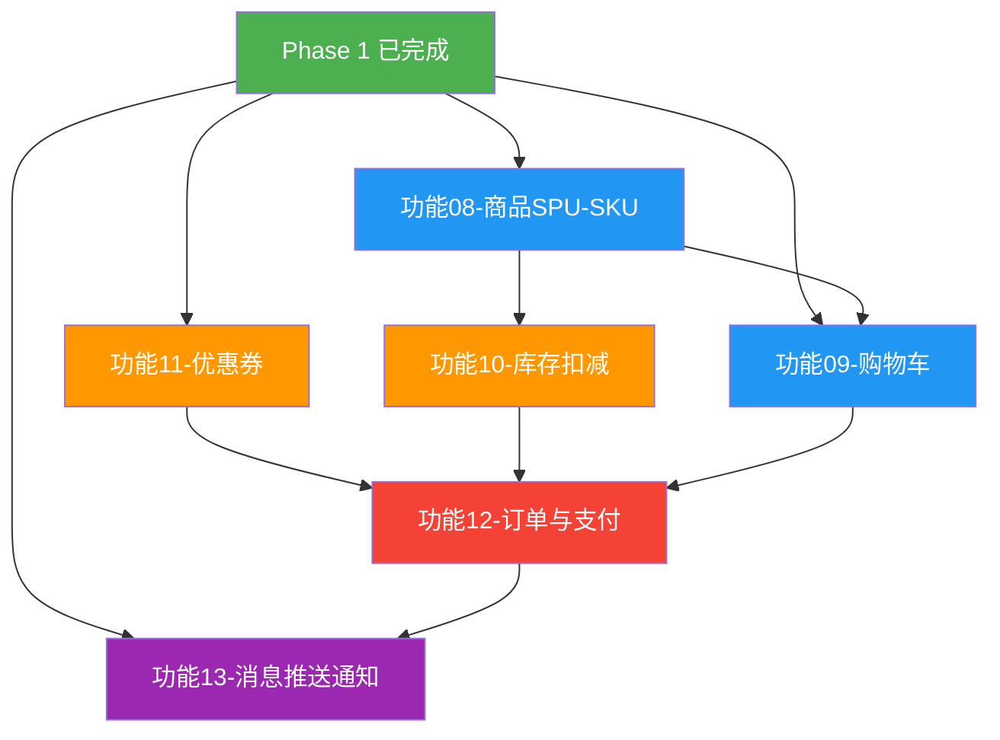
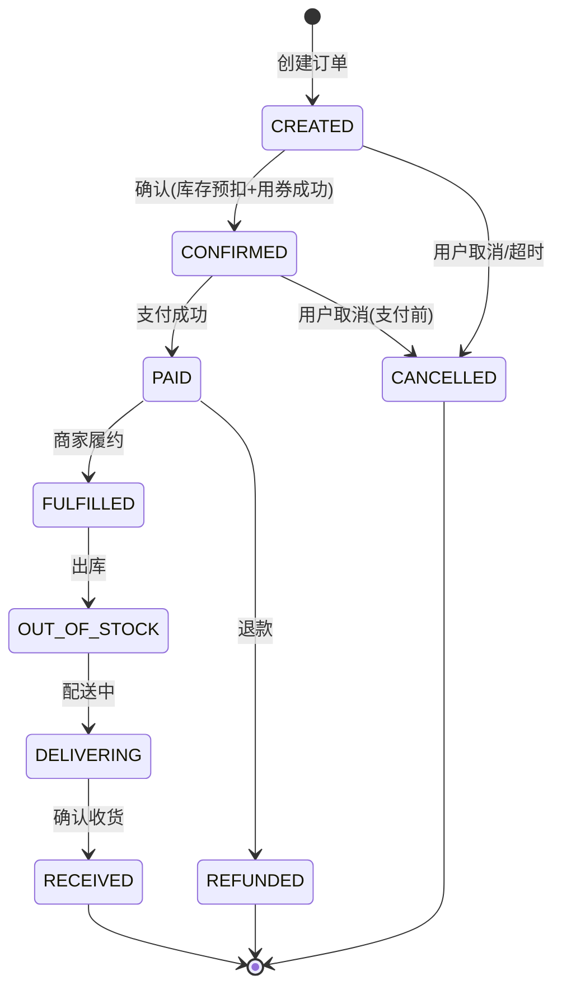

# Phase 2：电商交易 — 详细梳理

> 🎯 目标：跑通电商核心链路，用户能浏览商品、加购、下单、支付
>
> ⚠️ **前置条件**：Phase 1 全部功能开发完成并验收通过（common组件、用户服务、笔记服务、社交服务、计数服务）

---

## 一、Phase 2 概览

| 序号 | 功能 | 涉及服务 | 核心技术 |
|------|------|----------|----------|
| 08 | 商品SPU-SKU | 商品服务 | SPU/SKU模型、多级缓存（Caffeine+Redis+MySQL）、逻辑过期+布隆过滤器 |
| 09 | 购物车 | 购物车服务 | Redis三结构（Hash+Set+ZSet）、匿名合并、异步持久化 |
| 10 | 库存扣减 | 库存服务 | 分桶预扣减、Lua原子扣减、三级扣减（Redis→MQ→DB） |
| 11 | 优惠券 | 优惠券服务 | Lua原子领券、责任链校验、ShardingSphere分库分表 |
| 12 | 订单与支付 | 订单服务 + 支付服务 | Spring StateMachine、RocketMQ事务消息、本地消息表兜底、分库分表 |
| 13 | 消息推送与通知 | 通知服务 | MQ异步分发、SSE实时推送、Bitmap已读状态、时间窗口聚合 |

---

## 二、涉及的模块与端口

| 服务 | 端口 | 数据库 | 本阶段新增 | 说明 |
|------|------|--------|-----------|------|
| my-xhs-product | 9005 | my_xhs_product | ✅ | 商品服务（SPU/SKU/分类） |
| my-xhs-order | 9006 | my_xhs_order (分库) | ✅ | 订单服务 |
| my-xhs-payment | 9007 | my_xhs_payment | ✅ | 支付服务（Mock实现） |
| my-xhs-inventory | 9008 | my_xhs_inventory | ✅ | 库存服务 |
| my-xhs-cart | 9009 | my_xhs_cart | ✅ | 购物车服务 |
| my-xhs-coupon | 9010 | my_xhs_coupon (分库) | ✅ | 优惠券服务 |
| my-xhs-notification | 9012 | my_xhs_notification | ✅ | 通知服务（SSE推送） |

> **Phase 1 已有服务**（本阶段仅新增调用关系，不改动代码）：my-xhs-gateway(9000)、my-xhs-user(9001)、my-xhs-content(9002)、my-xhs-analytics(9003)、my-xhs-counter(9004)

---

## 三、功能详细梳理

### 功能 08：商品SPU-SKU

#### 3.8.1 功能描述

商品是电商链路的起点。采用 SPU（标准产品单元）+ SKU（库存量单元）二级模型：SPU 描述商品的共有属性（名称、品牌、详情），SKU 描述规格变体（颜色+尺码组合）。三级分类树提供导航。多级缓存（Caffeine → Redis → MySQL）扛住详情页高 QPS，逻辑过期解决热点 Key 缓存击穿，布隆过滤器防止缓存穿透。

#### 3.8.2 涉及服务

`my-xhs-product`（端口 9005，数据库 `my_xhs_product`）

#### 3.8.3 API 接口清单

| 方法 | 路径 | 说明 | 鉴权 |
|------|------|------|------|
| POST | `/api/product/spu` | 创建SPU | ✅ |
| PUT | `/api/product/spu` | 更新SPU | ✅ |
| GET | `/api/product/spu/{spuId}` | SPU详情 | ❌ |
| GET | `/api/product/spu/list` | SPU列表（分页） | ❌ |
| PUT | `/api/product/spu/{spuId}/status` | SPU上架/下架 | ✅ |
| POST | `/api/product/sku` | 创建SKU | ✅ |
| PUT | `/api/product/sku` | 更新SKU | ✅ |
| GET | `/api/product/sku/{skuId}` | SKU详情 | ❌ |
| GET | `/api/product/spu/{spuId}/skus` | 查询SPU下所有SKU | ❌ |
| GET | `/api/product/category/tree` | 三级分类树 | ❌ |
| GET | `/api/product/category/{categoryId}/spus` | 按分类查SPU | ❌ |

#### 3.8.4 数据库表

**t_category**（预估 1000）

| 字段 | 类型 | 说明 |
|------|------|------|
| id | BIGINT PK | 分类ID |
| parent_id | BIGINT | 父分类ID（0=顶级） |
| name | VARCHAR(64) | 分类名称 |
| level | TINYINT | 层级:1/2/3 |
| sort_order | INT | 排序 |
| icon | VARCHAR(256) | 图标URL |
| status | TINYINT | 状态:0禁用1启用 |

**t_spu**（预估 100万）

| 字段 | 类型 | 说明 |
|------|------|------|
| id | BIGINT PK | SPU ID |
| category_id | BIGINT | 分类ID |
| brand_id | BIGINT | 品牌ID |
| name | VARCHAR(128) | 商品名称 |
| sub_title | VARCHAR(256) | 副标题 |
| main_image | VARCHAR(256) | 主图URL |
| images | TEXT | 图片列表JSON |
| detail | TEXT | 详情（富文本） |
| status | TINYINT | 状态:0下架1上架 |
| created_at | DATETIME | 创建时间 |
| updated_at | DATETIME | 更新时间 |

> KEY `idx_category_id` (category_id)

**t_sku**（预估 1000万）

| 字段 | 类型 | 说明 |
|------|------|------|
| id | BIGINT PK | SKU ID |
| spu_id | BIGINT | SPU ID |
| sku_code | VARCHAR(64) | SKU编码 |
| name | VARCHAR(256) | SKU名称 |
| price | DECIMAL(10,2) | 价格 |
| original_price | DECIMAL(10,2) | 原价 |
| stock | INT | 库存（冗余，权威在inventory服务） |
| image | VARCHAR(256) | SKU图片 |
| specs | VARCHAR(512) | 规格JSON（如{"颜色":"红","尺码":"L"}） |
| status | TINYINT | 状态:0禁用1启用 |

> KEY `idx_spu_id` (spu_id)

#### 3.8.5 Redis Key 清单

| Key | 数据结构 | TTL | 说明 |
|-----|---------|-----|------|
| `product:spu:{spuId}` | Hash | 30min | SPU详情缓存 |
| `product:sku:{skuId}` | Hash | 30min | SKU详情缓存 |
| `product:category:tree` | String(JSON) | 1h | 分类树缓存 |
| `product:hot:{skuId}` | String | 5min | 热点商品标记 |
| `product:bloom:spu` | Bloom Filter | 永久 | SPU存在性布隆过滤器 |
| `product:bloom:sku` | Bloom Filter | 永久 | SKU存在性布隆过滤器 |

#### 3.8.6 Java 文件清单

**controller/**
```
SpuController.java           — SPU CRUD + 上下架
SkuController.java           — SKU CRUD
CategoryController.java      — 分类树
```

**service/**
```
SpuService.java              — SPU业务接口
SpuServiceImpl.java          — SPU业务实现
SkuService.java              — SKU业务接口
SkuServiceImpl.java          — SKU业务实现
CategoryService.java         — 分类业务接口
CategoryServiceImpl.java     — 分类业务实现
```

**mapper/**
```
SpuMapper.java               — SPU Mapper
SkuMapper.java               — SKU Mapper
CategoryMapper.java          — 分类 Mapper
```

**entity/**
```
Spu.java                     — SPU实体
Sku.java                     — SKU实体
Category.java                — 分类实体
```

**dto/**
```
SpuCreateRequest.java        — SPU创建请求
SpuUpdateRequest.java        — SPU更新请求
SpuVO.java                   — SPU响应VO
SkuCreateRequest.java        — SKU创建请求
SkuVO.java                   — SKU响应VO
CategoryTreeVO.java          — 分类树VO（递归结构）
```

**enums/**
```
ProductStatus.java           — 商品状态枚举(OFF_SHELF=0, ON_SHELF=1)
```

**cache/**
```
SpuCacheLoader.java          — SPU逻辑过期缓存加载器
SkuCacheLoader.java          — SKU逻辑过期缓存加载器
BloomFilterHelper.java       — 布隆过滤器初始化+判断
```

#### 3.8.7 核心技术点

| 技术点 | 方案 | 关键实现 |
|--------|------|----------|
| 多级缓存 | Caffeine(L1) → Redis(L2) → MySQL(L3) | 本地缓存扛热点，Redis扛高QPS，DB兜底 |
| 缓存击穿 | 逻辑过期 + 后台异步更新 | 热点Key永不过期，发现逻辑过期后异步刷新，期间返回旧数据 |
| 缓存穿透 | 布隆过滤器 + 空值缓存 | 布隆过滤器判断SPU/SKU是否存在；不存在的Key缓存空值60s |
| 分类树缓存 | Redis String + 1h过期 | 分类变化少，长缓存；变更时手动删缓存 |
| SPU/SKU关联 | 查SPU时聚合SKU列表 | SPU缓存中不含SKU列表，SKU独立缓存，查询时聚合 |

---

### 功能 09：购物车

#### 3.9.1 功能描述

购物车采用 Redis + MySQL 双写方案：Redis 承载高频读写（加购/删减/勾选），MySQL 异步落库做持久化兜底。Redis 使用三结构协同（Hash存商品+数量、Set存选中状态、ZSet存加购时间排序）。支持匿名购物车（设备ID为Key），登录后合并到用户购物车。商品失效（下架/无库存）实时标记。

#### 3.9.2 涉及服务

`my-xhs-cart`（端口 9009，数据库 `my_xhs_cart`）

> **注意**：cart 服务 pom 中没有 MyBatis Plus 和 MySQL 依赖（纯 Redis 驱动），MySQL 持久化需补充。

#### 3.9.3 API 接口清单

| 方法 | 路径 | 说明 | 鉴权 |
|------|------|------|------|
| POST | `/api/cart/add` | 加购商品 | ✅ |
| PUT | `/api/cart/quantity` | 修改商品数量 | ✅ |
| DELETE | `/api/cart/remove` | 删除购物车商品 | ✅ |
| GET | `/api/cart/list` | 购物车列表（含商品详情+失效标记） | ✅ |
| PUT | `/api/cart/check` | 勾选/取消勾选 | ✅ |
| PUT | `/api/cart/checkAll` | 全选/全不选 | ✅ |
| GET | `/api/cart/count` | 购物车商品数量 | ✅ |
| POST | `/api/cart/merge` | 匿名购物车合并（登录时） | ✅ |

#### 3.9.4 数据库表

**t_cart_item**（预估 5000万）

| 字段 | 类型 | 说明 |
|------|------|------|
| id | BIGINT PK | 记录ID |
| user_id | BIGINT | 用户ID |
| sku_id | BIGINT | SKU ID |
| spu_id | BIGINT | SPU ID |
| quantity | INT | 数量 |
| checked | TINYINT | 是否选中:0否1是 |
| add_time | DATETIME | 加购时间 |
| update_time | DATETIME | 更新时间 |

> UNIQUE KEY `uk_user_sku` (user_id, sku_id)

**t_cart_snapshot**（预估 1000万）

| 字段 | 类型 | 说明 |
|------|------|------|
| id | BIGINT PK | 记录ID |
| user_id | BIGINT | 用户ID |
| snapshot_data | JSON | 购物车快照数据 |
| create_time | DATETIME | 快照时间 |

> UNIQUE KEY `uk_user_id` (user_id)

#### 3.9.5 Redis Key 清单

| Key | 数据结构 | TTL | 说明 |
|-----|---------|-----|------|
| `cart:items:{userId}` | Hash | 30d | 购物车商品 field=skuId value=JSON(数量+加购时间) |
| `cart:checked:{userId}` | Set | 30d | 选中的SKU ID集合 |
| `cart:sort:{userId}` | ZSet | 30d | 加购时间排序 score=timestamp |
| `cart:anonymous:{deviceId}` | Hash | 7d | 匿名购物车（未登录用户） |

#### 3.9.6 Java 文件清单

**controller/**
```
CartController.java          — 购物车CRUD + 合并 + 勾选
```

**service/**
```
CartService.java             — 购物车业务接口
CartServiceImpl.java         — 购物车业务实现
```

**mapper/**
```
CartItemMapper.java          — 购物车明细Mapper
CartSnapshotMapper.java      — 购物车快照Mapper
```

**entity/**
```
CartItem.java                — 购物车明细实体
CartSnapshot.java            — 购物车快照实体
```

**dto/**
```
CartAddRequest.java          — 加购请求(skuId + quantity)
CartQuantityRequest.java     — 修改数量请求
CartCheckRequest.java        — 勾选请求(skuId + checked)
CartMergeRequest.java        — 合并请求(deviceId)
CartItemVO.java              — 购物车项VO（含商品详情+失效标记）
CartListVO.java              — 购物车列表VO
```

**mq/**
```
CartSyncConsumer.java        — 异步同步购物车到MySQL
```

#### 3.9.7 核心技术点

| 技术点 | 方案 | 关键实现 |
|--------|------|----------|
| Redis三结构 | Hash(商品) + Set(选中) + ZSet(排序) | Hash存核心数据，Set独立管理勾选，ZSet保序 |
| 防重复加购 | Hash HINCRBY | 同一SKU累加数量，不覆盖 |
| 匿名购物车 | 设备ID为Key + 登录合并 | 未登录用cart:anonymous:{deviceId}，登录后合并到用户购物车 |
| 商品失效 | 查询时Feign调product校验 | 批量查SKU状态，下架/无库存标记为失效 |
| 异步持久化 | MQ → MySQL | Redis写成功即返回，MQ异步写MySQL兜底 |
| 快照恢复 | 定时全量快照 | Spring @Scheduled 每小时将Redis购物车全量写入snapshot表 |

---

### 功能 10：库存扣减

#### 3.10.1 功能描述

库存是电商交易的核心难点。采用分桶预扣减方案：将SKU库存拆分到N个桶（热点SKU 8桶，普通SKU 2桶），扣减时按 userId 路由到具体桶，避免单 Key 热点。Lua 脚本保证原子扣减。三级扣减保证可靠性：L1 Redis 预扣 → L2 MQ 异步扣 DB → L3 对账修复。预扣 30 分钟未支付自动回退。

#### 3.10.2 涉及服务

`my-xhs-inventory`（端口 9008，数据库 `my_xhs_inventory`）

#### 3.10.3 API 接口清单

| 方法 | 路径 | 说明 | 鉴权 |
|------|------|------|------|
| POST | `/api/inventory/init` | 库存初始化（入Redis分桶） | ✅ |
| POST | `/api/inventory/preDeduct` | 预扣减（下单） | ✅ |
| POST | `/api/inventory/confirm` | 确认扣减（支付成功） | ✅ |
| POST | `/api/inventory/release` | 释放库存（取消/超时） | ✅ |
| GET | `/api/inventory/stock/{skuId}` | 查询可用库存 | ❌ |
| GET | `/api/inventory/bucket/{skuId}` | 查询分桶详情 | ✅ |

#### 3.10.4 数据库表

**t_inventory**（预估 1000万）

| 字段 | 类型 | 说明 |
|------|------|------|
| id | BIGINT PK | 记录ID |
| sku_id | BIGINT | SKU ID |
| total_stock | INT | 总库存 |
| locked_stock | INT | 锁定库存 |
| available_stock | INT | 可用库存 |
| bucket_count | INT | 分桶数量（默认8） |
| updated_at | DATETIME | 更新时间 |

> UNIQUE KEY `uk_sku_id` (sku_id)

**t_inventory_bucket**（预估 5000万）

| 字段 | 类型 | 说明 |
|------|------|------|
| id | BIGINT PK | 记录ID |
| sku_id | BIGINT | SKU ID |
| bucket_no | INT | 桶编号 |
| available_stock | INT | 桶可用库存 |

> UNIQUE KEY `uk_sku_bucket` (sku_id, bucket_no)

**t_inventory_log**（预估 10亿）

| 字段 | 类型 | 说明 |
|------|------|------|
| id | BIGINT PK | 记录ID |
| sku_id | BIGINT | SKU ID |
| order_id | BIGINT | 订单ID |
| change_type | TINYINT | 变更类型:1扣减2回退3初始化 |
| change_quantity | INT | 变更数量 |
| before_stock | INT | 变更前库存 |
| after_stock | INT | 变更后库存 |
| created_at | DATETIME | 创建时间 |

> KEY `idx_sku_id` (sku_id), KEY `idx_order_id` (order_id)

#### 3.10.5 Redis Key 清单

| Key | 数据结构 | TTL | 说明 |
|-----|---------|-----|------|
| `inventory:bucket:{skuId}:{bucketNo}` | String(int) | 永久 | 分桶库存值 |
| `inventory:prededuct:{orderId}` | Hash | 30min | 预扣记录 field=skuId value=quantity |
| `inventory:total:{skuId}` | String(int) | 永久 | SKU总可用库存（聚合值） |
| `inventory:buckets:{skuId}` | String(JSON) | 永久 | 分桶配置（桶数+路由信息） |

#### 3.10.6 Java 文件清单

**controller/**
```
InventoryController.java     — 库存初始化/预扣/确认/释放/查询
```

**service/**
```
InventoryService.java        — 库存业务接口
InventoryServiceImpl.java    — 库存业务实现
BucketService.java           — 分桶管理接口
BucketServiceImpl.java       — 分桶管理实现
```

**mapper/**
```
InventoryMapper.java         — 库存Mapper
InventoryBucketMapper.java   — 分桶Mapper
InventoryLogMapper.java      — 库存流水Mapper
```

**entity/**
```
Inventory.java               — 库存实体
InventoryBucket.java         — 分桶实体
InventoryLog.java            — 库存流水实体
```

**dto/**
```
InventoryInitRequest.java    — 库存初始化请求(skuId + totalStock + bucketCount)
PreDeductRequest.java        — 预扣请求(orderId + List<SkuQuantity>)
PreDeductResult.java         — 预扣结果（成功/部分成功/全部失败）
StockVO.java                 — 库存VO
BucketVO.java                — 分桶详情VO
```

**enums/**
```
InventoryChangeType.java     — 变更类型枚举(DEDUCT=1, RELEASE=2, INIT=3)
```

**lua/**
```
prededuct.lua                — 预扣减Lua脚本（分桶路由+原子扣减+预扣记录）
release.lua                  — 释放库存Lua脚本（回退分桶+删预扣记录）
confirm.lua                  — 确认扣减Lua脚本（删预扣记录）
```

**mq/**
```
InventoryConfirmConsumer.java — 消费订单支付成功→确认扣减DB
InventoryReleaseConsumer.java — 消费订单取消→释放库存
```

**job/**（Phase 4 引入 XXL-Job 后迁移）
```
InventoryRecoverJob.java     — Spring @Scheduled: 预扣超时回退（每5分钟）
InventoryReconcileJob.java   — Spring @Scheduled: Redis↔DB对账（每天凌晨4点）
```

#### 3.10.7 核心技术点

| 技术点 | 方案 | 关键实现 |
|--------|------|----------|
| 分桶策略 | 按SKU分N桶，userId % bucketNo 路由 | 热点SKU 8桶，普通SKU 2桶；分散单Key压力 |
| 原子扣减 | Lua脚本原子操作 | 检查库存 → 扣减分桶 → 写预扣记录，一气呵成 |
| 桶间均衡 | 扣减失败→尝试其他桶 | 路由桶库存不足时，遍历其他桶尝试扣减 |
| 三级扣减 | L1 Redis预扣→L2 MQ扣DB→L3 对账 | Redis快速预扣返回，MQ异步扣DB，对账修复差异 |
| 预扣超时 | 30分钟未支付→自动回退 | @Scheduled扫描过期预扣记录，Lua回退 |
| 预扣记录 | Redis Hash存储 | 预扣成功写prededuct:{orderId}，支付成功/取消时删除 |

#### 3.10.8 分桶预扣减 Lua 脚本流程

```
prededuct.lua 核心逻辑：

1. 输入：orderId, skuId, quantity, bucketCount, userId
2. 计算路由桶号：bucketNo = userId % bucketCount
3. 检查路由桶库存：GET inventory:bucket:{skuId}:{bucketNo}
4. if 库存充足 → 扣减: DECRBY {skuId}:{bucketNo} quantity
5. if 库存不足 → 遍历其他桶尝试扣减（桶间均衡）
6. 全部桶都不足 → 返回失败
7. 扣减成功 → 写预扣记录: HSET inventory:prededuct:{orderId} {skuId} {quantity}
8. 更新总库存: DECRBY inventory:total:{skuId} quantity
9. 返回成功
```

---

### 功能 11：优惠券

#### 3.11.1 功能描述

优惠券服务包含券模板管理和用户领券/用券。券模板支持满减、折扣、无门槛三种类型。领券使用 Lua 原子操作（扣库存+记录领取+限领校验一步到位），防止超领。责任链模式校验用券条件（门槛/品类/有效期）。用户券表使用 ShardingSphere 按 buyer_id 分4库，支撑10亿级数据。批量发券通过 MQ 分片发送。

#### 3.11.2 涉及服务

`my-xhs-coupon`（端口 9010，数据库 `my_xhs_coupon` 分库）

#### 3.11.3 API 接口清单

| 方法 | 路径 | 说明 | 鉴权 |
|------|------|------|------|
| POST | `/api/coupon/template` | 创建券模板 | ✅(管理端) |
| PUT | `/api/coupon/template` | 修改券模板 | ✅(管理端) |
| PUT | `/api/coupon/template/{templateId}/status` | 上线/下线券模板 | ✅(管理端) |
| GET | `/api/coupon/template/{templateId}` | 券模板详情 | ❌ |
| GET | `/api/coupon/template/list` | 券模板列表 | ❌ |
| POST | `/api/coupon/claim` | 领取优惠券 | ✅ |
| GET | `/api/coupon/user/list` | 我的优惠券列表 | ✅ |
| GET | `/api/coupon/user/available` | 可用优惠券（下单时） | ✅ |
| POST | `/api/coupon/use` | 使用优惠券 | ✅(Order服务Feign调用) |
| POST | `/api/coupon/return` | 退回优惠券（取消订单） | ✅(Order服务Feign调用) |

#### 3.11.4 数据库表

**t_coupon_template**（预估 1万，不分片）

| 字段 | 类型 | 说明 |
|------|------|------|
| id | BIGINT PK | 模板ID |
| name | VARCHAR(64) | 券名称 |
| type | TINYINT | 类型:1满减2折扣3无门槛 |
| discount_amount | DECIMAL(10,2) | 减免金额（满减/无门槛） |
| discount_rate | DECIMAL(3,2) | 折扣率（折扣类型，如0.85=八五折） |
| min_amount | DECIMAL(10,2) | 使用门槛金额（满减必填） |
| max_discount | DECIMAL(10,2) | 最大优惠金额（折扣类型封顶） |
| total_count | INT | 发放总量 |
| claimed_count | INT | 已领取数量 |
| per_limit | INT | 每人限领（默认1） |
| valid_type | TINYINT | 有效期类型:1固定日期2领取后N天 |
| valid_start_time | DATETIME | 生效开始时间（固定日期类型） |
| valid_end_time | DATETIME | 生效结束时间（固定日期类型） |
| valid_days | INT | 领取后有效天数（动态类型） |
| status | TINYINT | 状态:0未开始1进行中2已结束 |
| created_at | DATETIME | 创建时间 |

> UNIQUE KEY `uk_type_name` (type, name)

**t_coupon_template_log**（预估 10万，分16表）

| 字段 | 类型 | 说明 |
|------|------|------|
| id | BIGINT PK | 日志ID |
| template_id | BIGINT | 模板ID |
| operation_type | TINYINT | 操作类型:1创建2修改3上线4下线 |
| operator_id | BIGINT | 操作人ID |
| operator_name | VARCHAR(32) | 操作人姓名 |
| remark | VARCHAR(256) | 备注 |
| created_at | DATETIME | 创建时间 |

**t_coupon_to_sku**（预估 100万，不分片）

| 字段 | 类型 | 说明 |
|------|------|------|
| id | BIGINT PK | 记录ID |
| template_id | BIGINT | 券模板ID |
| sku_id | BIGINT | SKU ID |
| created_at | DATETIME | 创建时间 |

> UNIQUE KEY `uk_template_sku` (template_id, sku_id)

**t_user_coupon**（预估 10亿，buyer_id % 4 分库）

| 字段 | 类型 | 说明 |
|------|------|------|
| id | BIGINT PK | 记录ID |
| user_id | BIGINT | 用户ID |
| buyer_id | BIGINT | 买家ID（分片键，值同user_id） |
| template_id | BIGINT | 模板ID |
| coupon_code | VARCHAR(32) | 券码 |
| status | TINYINT | 状态:0未使用1已使用2已过期 |
| order_id | BIGINT | 使用的订单ID |
| valid_start_time | DATETIME | 生效时间 |
| valid_end_time | DATETIME | 失效时间 |
| used_time | DATETIME | 使用时间 |
| created_at | DATETIME | 创建时间 |

> KEY `idx_user_id` (user_id), KEY `idx_template_id` (template_id), KEY `idx_buyer_id` (buyer_id)

#### 3.11.5 Redis Key 清单

| Key | 数据结构 | TTL | 说明 |
|-----|---------|-----|------|
| `coupon:template:{templateId}` | Hash | 30min | 券模板缓存 |
| `coupon:stock:{templateId}` | String(int) | 永久 | 券库存（Lua原子扣减） |
| `coupon:claimed:{templateId}:{userId}` | String | 永久 | 用户领取记录（防重复领取） |
| `coupon:user:available:{userId}` | List(JSON) | 5min | 用户可用券缓存 |

#### 3.11.6 Java 文件清单

**controller/**
```
CouponTemplateController.java — 券模板CRUD + 上下线
CouponController.java        — 领券/用券/退券/列表
```

**service/**
```
CouponTemplateService.java   — 券模板业务接口
CouponTemplateServiceImpl.java — 券模板业务实现
CouponService.java           — 优惠券业务接口
CouponServiceImpl.java       — 优惠券业务实现
```

**service/chain/**（责任链校验用券条件）
```
CouponUseChain.java          — 责任链接口
AmountLimitHandler.java      — 门槛校验
CategoryLimitHandler.java    — 品类校验
ValidDateHandler.java        — 有效期校验
CouponUseChainBuilder.java   — 责任链构建器
```

**mapper/**
```
CouponTemplateMapper.java    — 券模板Mapper
CouponTemplateLogMapper.java — 券模板操作日志Mapper
CouponToSkuMapper.java       — 券商品关联Mapper
UserCouponMapper.java        — 用户券Mapper
```

**entity/**
```
CouponTemplate.java          — 券模板实体
CouponTemplateLog.java       — 券模板操作日志实体
CouponToSku.java             — 券商品关联实体
UserCoupon.java              — 用户券实体
```

**dto/**
```
CouponTemplateCreateRequest.java — 券模板创建请求
CouponTemplateVO.java       — 券模板VO
CouponClaimRequest.java     — 领券请求(templateId)
CouponUseRequest.java       — 用券请求(couponId + orderId + skuIds)
CouponReturnRequest.java    — 退券请求(couponId + orderId)
UserCouponVO.java           — 用户券VO
AvailableCouponVO.java      — 可用券VO（含折扣计算结果）
```

**enums/**
```
CouponType.java              — 券类型枚举(FULL_REDUCTION=1, DISCOUNT=2, NO_THRESHOLD=3)
CouponStatus.java            — 券状态枚举(UNUSED=0, USED=1, EXPIRED=2)
ValidType.java               — 有效期类型枚举(FIXED_DATE=1, DYNAMIC_DAYS=2)
```

**lua/**
```
claim.lua                    — 领券Lua脚本（扣库存+记录领取+限领校验）
```

**mq/**
```
CouponClaimConsumer.java     — 消费领券事件→异步写DB
CouponPushConsumer.java      — 消费券推送任务→批量发券
```

**job/**（Phase 4 引入 XXL-Job 后迁移）
```
CouponExpireJob.java         — Spring @Scheduled: 过期券状态更新（每天0点）
```

#### 3.11.7 核心技术点

| 技术点 | 方案 | 关键实现 |
|--------|------|----------|
| 原子领券 | Lua脚本：扣库存+记录领取+限领校验 | 三步合一，防超领+防重复 |
| 责任链校验 | Chain of Responsibility | 用券条件解耦：门槛→品类→有效期，可扩展 |
| 分库分表 | ShardingSphere buyer_id % 4 | 用户券10亿数据分4库，分片键冗余buyer_id |
| 券库存 | Redis String DECR | Lua中原子扣减，claimed_count同步Redis |
| 批量发券 | MQ分片 + 消息合并 | 券推送任务分N片并行发送，每100条合并一次 |
| 过期清理 | @Scheduled每天扫描 | 查过期的t_user_coupon更新status=2，删Redis缓存 |

---

### 功能 12：订单与支付

#### 3.12.1 功能描述

订单是电商交易链路的终点，串联商品、库存、优惠券、支付四大子系统。创建订单使用 RocketMQ 事务消息 + 本地消息表兜底，确保订单创建与库存预扣/优惠券使用的分布式一致性。订单状态流转使用 Spring StateMachine 配置化管理（9种状态流转）。超时关单使用 RocketMQ 延时消息（30分钟）+ @Scheduled 兜底。支付使用 MockPayService 模拟实现，生产环境只需替换1个实现类。订单数据按 buyer_id 分4库。

#### 3.12.2 涉及服务

- `my-xhs-order`（端口 9006，数据库 `my_xhs_order` 分库）— 订单核心
- `my-xhs-payment`（端口 9007，数据库 `my_xhs_payment`）— 支付服务（Mock实现）

#### 3.12.3 API 接口清单

**订单服务**

| 方法 | 路径 | 说明 | 鉴权 |
|------|------|------|------|
| POST | `/api/order/create` | 创建订单 | ✅ |
| GET | `/api/order/{orderId}` | 订单详情 | ✅ |
| GET | `/api/order/list` | 我的订单列表 | ✅ |
| POST | `/api/order/cancel` | 取消订单 | ✅ |
| POST | `/api/order/confirm` | 确认收货 | ✅ |
| GET | `/api/order/status/{orderId}` | 查询订单状态 | ✅ |

**支付服务**

| 方法 | 路径 | 说明 | 鉴权 |
|------|------|------|------|
| POST | `/api/pay/create` | 创建支付单 | ✅ |
| POST | `/api/pay/callback` | 支付回调（Mock） | ❌(内部) |
| GET | `/api/pay/status/{orderId}` | 查询支付状态 | ✅ |
| POST | `/api/pay/refund` | 退款 | ✅ |

#### 3.12.4 数据库表

**t_order**（预估 10亿，buyer_id % 4 分库）

| 字段 | 类型 | 说明 |
|------|------|------|
| id | BIGINT PK | 订单ID |
| order_no | VARCHAR(32) | 订单号 |
| biz_identifier | VARCHAR(128) | 幂等号 |
| user_id | BIGINT | 用户ID |
| total_amount | DECIMAL(10,2) | 订单总金额 |
| pay_amount | DECIMAL(10,2) | 实付金额 |
| freight_amount | DECIMAL(10,2) | 运费 |
| discount_amount | DECIMAL(10,2) | 优惠金额 |
| coupon_id | BIGINT | 优惠券ID |
| coupon_name | VARCHAR(64) | 优惠券名称 |
| status | TINYINT | 状态:1已创建2已确认3已支付4已履约5出库中6配送中7已签收8已取消9已退款 |
| close_type | TINYINT | 关单类型:1超时关单2用户取消 |
| receiver_name | VARCHAR(32) | 收货人 |
| receiver_phone | VARCHAR(20) | 收货电话 |
| receiver_address | VARCHAR(256) | 收货地址 |
| pay_type | TINYINT | 支付方式:0模拟1支付宝2微信 |
| pay_time | DATETIME | 支付时间 |
| pay_trade_no | VARCHAR(128) | 支付流水号 |
| deliver_time | DATETIME | 发货时间 |
| receive_time | DATETIME | 收货时间 |
| finish_time | DATETIME | 完成时间 |
| cancel_time | DATETIME | 取消时间 |
| remark | VARCHAR(256) | 订单备注 |
| lock_version | INT | 乐观锁版本号 |
| snapshot_version | INT | 快照版本号 |
| created_at | DATETIME | 创建时间 |
| updated_at | DATETIME | 更新时间 |

> UNIQUE KEY `uk_order_no` (order_no), UNIQUE KEY `uk_biz_identifier` (biz_identifier), KEY `idx_user_id` (user_id), KEY `idx_status` (status)

**t_order_item**（预估 30亿，buyer_id % 4 分库，与主表同分片键）

| 字段 | 类型 | 说明 |
|------|------|------|
| id | BIGINT PK | 明细ID |
| order_id | BIGINT | 订单ID |
| order_no | VARCHAR(32) | 订单号 |
| user_id | BIGINT | 用户ID（分片键冗余） |
| spu_id | BIGINT | SPU ID |
| sku_id | BIGINT | SKU ID |
| sku_name | VARCHAR(256) | SKU名称 |
| sku_image | VARCHAR(256) | SKU图片 |
| sku_specs | VARCHAR(256) | SKU规格 |
| price | DECIMAL(10,2) | 单价 |
| quantity | INT | 数量 |
| total_amount | DECIMAL(10,2) | 小计 |

> KEY `idx_order_id` (order_id), KEY `idx_user_id` (user_id)

**t_order_snapshot**（预估 20亿，order_id % 4 分库）

| 字段 | 类型 | 说明 |
|------|------|------|
| id | BIGINT PK | 快照ID |
| order_id | BIGINT | 订单ID |
| snapshot_identifier | VARCHAR(128) | 快照幂等号 |
| snapshot_type | TINYINT | 快照类型（对应订单状态） |
| snapshot_json | LONGTEXT | 订单快照内容JSON |
| snapshot_version | INT | 快照版本号 |
| created_at | DATETIME | 创建时间 |

> UNIQUE KEY `uk_order_snapshot` (order_id, snapshot_identifier, snapshot_type)

**t_local_message**（预估 1亿，不分片）

| 字段 | 类型 | 说明 |
|------|------|------|
| id | BIGINT PK | 消息ID |
| message_id | VARCHAR(64) | 消息唯一ID |
| topic | VARCHAR(64) | MQ Topic |
| tag | VARCHAR(64) | MQ Tag |
| message_body | TEXT | 消息体JSON |
| status | TINYINT | 状态:0待发送1已发送2发送失败 |
| retry_count | INT | 重试次数 |
| next_retry_time | DATETIME | 下次重试时间 |
| created_at | DATETIME | 创建时间 |
| updated_at | DATETIME | 更新时间 |

> UNIQUE KEY `uk_message_id` (message_id), KEY `idx_status_retry` (status, next_retry_time)

**t_payment**（支付服务，预估 5亿）

| 字段 | 类型 | 说明 |
|------|------|------|
| id | BIGINT PK | 支付ID |
| order_id | BIGINT | 订单ID |
| pay_no | VARCHAR(64) | 支付单号 |
| pay_type | TINYINT | 支付方式:0模拟1支付宝2微信 |
| amount | DECIMAL(10,2) | 支付金额 |
| status | TINYINT | 状态:0待支付1已支付2已退款3已关闭 |
| pay_time | DATETIME | 支付时间 |
| trade_no | VARCHAR(128) | 外部支付流水号 |
| callback_time | DATETIME | 回调时间 |
| created_at | DATETIME | 创建时间 |
| updated_at | DATETIME | 更新时间 |

> UNIQUE KEY `uk_order_id` (order_id), UNIQUE KEY `uk_pay_no` (pay_no)

#### 3.12.5 Redis Key 清单

| Key | 数据结构 | TTL | 说明 |
|-----|---------|-----|------|
| `order:info:{orderId}` | Hash | 30min | 订单详情缓存 |
| `order:create:lock:{userId}` | String | 10s | 下单分布式锁（防重复下单） |
| `order:status:{orderId}` | String | 30min | 订单状态缓存 |
| `order:close:delay:{orderId}` | String | 30min | 超时关单标记 |

#### 3.12.6 Java 文件清单

**my-xhs-order**

**controller/**
```
OrderController.java         — 创建/取消/确认/查询订单
```

**service/**
```
OrderService.java            — 订单业务接口
OrderServiceImpl.java        — 订单业务实现
OrderCreateService.java      — 订单创建（事务消息+本地消息表）
```

**statemachine/**（Spring StateMachine 订单状态流转）
```
OrderStatus.java             — 订单状态枚举
OrderEvent.java              — 订单事件枚举
OrderStateMachineConfig.java — 状态机配置
OrderStateMachineListener.java — 状态机监听器（记录快照）
```

**mapper/**
```
OrderMapper.java             — 订单主表Mapper
OrderItemMapper.java         — 订单明细Mapper
OrderSnapshotMapper.java     — 订单快照Mapper
LocalMessageMapper.java      — 本地消息表Mapper
```

**entity/**
```
Order.java                   — 订单实体
OrderItem.java               — 订单明细实体
OrderSnapshot.java           — 订单快照实体
LocalMessage.java            — 本地消息实体
```

**dto/**
```
OrderCreateRequest.java      — 创建订单请求(skuItems + couponId + addressId + bizIdentifier)
OrderVO.java                 — 订单VO（含明细列表）
OrderItemVO.java             — 订单明细VO
OrderListVO.java             — 订单列表VO
```

**mq/**
```
OrderCreateTransactionProducer.java — 事务消息生产者
OrderCreateTransactionListener.java — 事务消息监听器（执行本地事务）
OrderCancelConsumer.java     — 消费订单取消事件
OrderCloseDelayConsumer.java — 消费延时消息→超时关单
LocalMessageRetryConsumer.java — 本地消息表重试消费
```

**feign/**
```
InventoryFeignClient.java    — Feign调用库存服务
CouponFeignClient.java       — Feign调用优惠券服务
UserFeignClient.java         — Feign调用用户服务（查地址）
ProductFeignClient.java      — Feign调用商品服务（查SKU信息）
PaymentFeignClient.java      — Feign调用支付服务
```

**snapshot/**（订单快照）
```
OrderSnapshotService.java    — 快照业务接口
OrderSnapshotServiceImpl.java — 快照业务实现（每次状态变更记录快照）
```

**job/**（Phase 4 引入 XXL-Job 后迁移）
```
OrderCloseJob.java           — Spring @Scheduled: 超时关单兜底（每分钟）
LocalMessageRetryJob.java    — Spring @Scheduled: 本地消息重试（每30秒）
```

**my-xhs-payment**

**controller/**
```
PaymentController.java       — 创建支付/回调/查询/退款
```

**service/**
```
PaymentService.java          — 支付业务接口
PaymentServiceImpl.java      — 支付业务实现
MockPayService.java          — 模拟支付实现（生产环境替换为真实实现）
```

**mapper/**
```
PaymentMapper.java           — 支付记录Mapper
```

**entity/**
```
Payment.java                 — 支付记录实体
```

**dto/**
```
PayCreateRequest.java        — 创建支付请求(orderId + payType)
PayCallbackRequest.java      — 支付回调请求(Mock)
PayRefundRequest.java        — 退款请求
PayStatusVO.java             — 支付状态VO
```

**mq/**
```
PaymentCallbackProducer.java — 支付成功后发送MQ通知Order服务
```

#### 3.12.7 核心技术点

| 技术点 | 方案 | 关键实现 |
|--------|------|----------|
| 事务消息 | RocketMQ事务消息 + 本地消息表兜底 | 创建订单半消息→执行本地事务→提交/回滚；本地消息表保证最终发送 |
| 状态机 | Spring StateMachine | 9种状态+事件配置化，状态变更自动记录快照 |
| 超时关单 | 延时消息(30min) + @Scheduled兜底 | 延时消息主力关单，定时任务兜底扫描 |
| 幂等创建 | bizIdentifier + Redis分布式锁 | 相同bizIdentifier不重复创建订单 |
| 分库分表 | ShardingSphere buyer_id % 4 | order + order_item 同分片键，避免跨库JOIN |
| 订单快照 | 每次状态变更记录JSON快照 | 完整记录订单变更历史，支持审计和回溯 |
| Mock支付 | MockPayService + 策略模式 | 模拟支付成功，流水号以MOCK_开头；生产环境替换1个实现类 |
| Feign同步调用 | Order→Inventory/Coupon/User/Product | 下单时同步预扣库存、校验优惠券、查地址、查SKU |

#### 3.12.8 创建订单事务消息流程

```
1. 前端 → OrderController.createOrder()
2. 生成 bizIdentifier（幂等号），SET NX 分布式锁
3. 发送半消息(Half Message)到 ORDER_TOPIC:CREATE
4. Broker存储半消息 → 返回确认
5. 执行本地事务：
   a. 校验地址(Feign→User)
   b. 查询SKU信息(Feign→Product)
   c. 计算金额（总金额-优惠券折扣）
   d. 写入 t_order + t_order_item
   e. 写入 t_local_message（状态=待发送）
5a. 本地事务成功 → 提交半消息(Commit)
5b. 本地事务失败 → 回滚半消息(Rollback)
6. 消费者（Inventory/Coupon）消费消息：
   a. Inventory: 预扣减
   b. Coupon: 使用优惠券
7. 消费失败 → 重试 → 死信队列 → 告警
8. 本地消息表 @Scheduled 兜底：
   a. 扫描 status=0 且 next_retry_time < now 的消息
   b. 重新发送到MQ
   c. 超过最大重试次数 → 告警人工处理
```

---

### 功能 13：消息推送与通知

#### 3.13.1 功能描述

通知中心是整个系统的消息中枢，接收各业务模块的 MQ 事件（点赞/评论/关注/订单/优惠券），聚合后推送给用户。核心特点：(1) MQ 异步分发，不阻塞主流程；(2) 5分钟时间窗口聚合（"张三等10人赞了你"）；(3) SSE 实时推送（通知中心单向推送用SSE更轻量）；(4) Bitmap 存储已读状态（1亿通知仅需12MB）；(5) Redis 维护未读计数。

#### 3.13.2 涉及服务

`my-xhs-notification`（端口 9012，数据库 `my_xhs_notification`）

> **注意**：notification 服务 pom 中没有 MyBatis Plus 和 MySQL 依赖，需补充。

#### 3.13.3 API 接口清单

| 方法 | 路径 | 说明 | 鉴权 |
|------|------|------|------|
| GET | `/api/notification/list` | 通知列表（分页） | ✅ |
| GET | `/api/notification/unread/count` | 未读通知数 | ✅ |
| PUT | `/api/notification/read/{id}` | 标记单条已读 | ✅ |
| PUT | `/api/notification/read/all` | 全部标记已读 | ✅ |
| GET | `/api/notification/sse` | SSE实时推送连接 | ✅ |

#### 3.13.4 数据库表

**t_push_template**（预估 100）

| 字段 | 类型 | 说明 |
|------|------|------|
| id | BIGINT PK | 模板ID |
| type | VARCHAR(32) | 类型:like/comment/follow/system/coupon/order |
| title_template | VARCHAR(128) | 标题模板（如"{userName}赞了你的笔记"） |
| content_template | VARCHAR(512) | 内容模板 |
| status | TINYINT | 状态:0禁用1启用 |

> UNIQUE KEY `uk_type` (type)

**t_push_message**（预估 100亿，按user_id分表）

| 字段 | 类型 | 说明 |
|------|------|------|
| id | BIGINT PK | 消息ID |
| user_id | BIGINT | 接收用户ID |
| type | VARCHAR(32) | 推送类型 |
| sender_id | BIGINT | 发送者ID |
| biz_type | VARCHAR(32) | 业务类型 |
| biz_id | BIGINT | 业务ID |
| title | VARCHAR(128) | 标题 |
| content | VARCHAR(512) | 内容 |
| is_read | TINYINT | 是否已读:0否1是 |
| created_at | DATETIME | 创建时间 |

> KEY `idx_user_id` (user_id), KEY `idx_created_at` (created_at)

**t_push_task**（预估 1000万）

| 字段 | 类型 | 说明 |
|------|------|------|
| id | BIGINT PK | 任务ID |
| task_name | VARCHAR(64) | 任务名称 |
| task_type | TINYINT | 任务类型:1券推送2系统通知 |
| biz_id | BIGINT | 业务ID |
| target_count | INT | 目标用户数 |
| success_count | INT | 成功数 |
| fail_count | INT | 失败数 |
| status | TINYINT | 状态:0待执行1执行中2已完成3已取消 |
| execute_time | DATETIME | 执行时间 |
| created_at | DATETIME | 创建时间 |

**t_push_task_fail**（预估 100万）

| 字段 | 类型 | 说明 |
|------|------|------|
| id | BIGINT PK | 记录ID |
| task_id | BIGINT | 任务ID |
| user_id | BIGINT | 用户ID |
| fail_reason | VARCHAR(256) | 失败原因 |
| retry_count | INT | 重试次数 |
| created_at | DATETIME | 创建时间 |

> KEY `idx_task_id` (task_id)

#### 3.13.5 Redis Key 清单

| Key | 数据结构 | TTL | 说明 |
|-----|---------|-----|------|
| `notify:unread:{userId}` | String(int) | 永久 | 未读通知数（INCR/DECR） |
| `notify:read:bitmap:{userId}:{yyyyMM}` | Bitmap | 90d | 已读状态位图 |
| `notify:aggregate:{userId}:{type}` | Hash | 5min | 聚合窗口（5分钟内同类型通知合并） |
| `notify:sse:heartbeat:{userId}` | String | 30s | SSE连接心跳 |

#### 3.13.6 Java 文件清单

**controller/**
```
NotificationController.java   — 通知列表/已读/未读数
SseController.java           — SSE连接建立
```

**service/**
```
NotificationService.java     — 通知业务接口
NotificationServiceImpl.java — 通知业务实现
SseService.java              — SSE推送管理接口
SseServiceImpl.java          — SSE推送管理实现
AggregateService.java        — 通知聚合接口
AggregateServiceImpl.java    — 通知聚合实现
```

**mapper/**
```
PushTemplateMapper.java      — 推送模板Mapper
PushMessageMapper.java       — 推送消息Mapper
PushTaskMapper.java          — 推送任务Mapper
PushTaskFailMapper.java      — 推送失败Mapper
```

**entity/**
```
PushTemplate.java            — 推送模板实体
PushMessage.java             — 推送消息实体
PushTask.java                — 推送任务实体
PushTaskFail.java            — 推送失败实体
```

**dto/**
```
NotificationVO.java          — 通知VO
UnreadCountVO.java           — 未读数VO
```

**enums/**
```
NotifyType.java              — 通知类型枚举(LIKE/COMMENT/FOLLOW/SYSTEM/COUPON/ORDER)
```

**sse/**
```
SseEmitterManager.java       — SSE连接管理器（userId→SseEmitter映射）
```

**mq/**
```
LikeNotifyConsumer.java      — 消费点赞事件→生成通知
CommentNotifyConsumer.java   — 消费评论事件→生成通知
FollowNotifyConsumer.java    — 消费关注事件→生成通知
OrderNotifyConsumer.java     — 消费订单事件→生成通知
CouponNotifyConsumer.java    — 消费优惠券事件→生成通知
```

**aggregate/**
```
NotifyAggregator.java        — 通知聚合器（5分钟窗口合并）
```

#### 3.13.7 核心技术点

| 技术点 | 方案 | 关键实现 |
|--------|------|----------|
| MQ异步分发 | 各业务服务发送MQ→通知服务消费 | 不阻塞主流程，解耦 |
| 通知聚合 | 5分钟时间窗口 | 同类型通知5分钟内合并："张三等10人赞了你" |
| SSE实时推送 | Spring SseEmitter | 通知是单向推送，SSE比WebSocket更轻量 |
| 未读计数 | Redis String INCR/DECR | 原子操作，O(1)读写 |
| 已读状态 | Redis Bitmap | 1亿通知仅需12MB，SETBIT/GETBIT O(1) |
| 连接管理 | SseEmitterManager | userId→SseEmitter映射，心跳保活，超时清理 |

---

## 四、Phase 2 新增公共组件

Phase 2 需要在 my-xhs-common 中新增以下组件（Phase 1 未涉及的）：

| 组件 | 用途 | 使用服务 |
|------|------|----------|
| StateMachineConfig | 订单状态机基础配置 | Order |
| FeignConfig | Feign拦截器（透传UserContext） | Order, Inventory, Coupon, Cart |
| BloomFilterHelper | 布隆过滤器封装 | Product |

> **说明**：StateMachine、FeignConfig 等组件放在各自服务本地，不需要放到 common。common 中只放真正跨服务复用的组件。

---

## 五、中间件需求（Phase 2 新增）

| 中间件 | 版本 | 用途 | 状态 | 说明 |
|--------|------|------|------|------|
| ShardingSphere | 5.4.1 | 分库分表 | ✅ 必须 | 订单/优惠券分库 |
| CosId | 最新 | 分布式ID生成 | ✅ 必须 | 订单号生成（已有依赖） |

> **Phase 1 已有中间件**：MySQL 8.0、Redis 7.x、RocketMQ 5.1.x、Nacos 2.3.x 继续使用

---

## 六、MQ Topic 清单（Phase 2 新增）

| Topic | Tag | 生产者 | 消费者 | 消息类型 | 说明 |
|-------|-----|-------|--------|---------|------|
| ORDER_TOPIC | CREATE | Order | Inventory, Coupon | 事务 | 订单创建（预扣库存+用券） |
| ORDER_TOPIC | CANCEL | Order | Inventory, Coupon | 普通 | 订单取消（释放库存+退券） |
| ORDER_TOPIC | CLOSE | Order | Inventory, Coupon | 延时(30min) | 订单超时关闭 |
| ORDER_TOPIC | PAID | Payment | Notification | 普通 | 支付成功通知 |
| CART_TOPIC | SYNC | Cart | Cart | 普通 | 购物车异步同步MySQL |
| PRODUCT_TOPIC | CHANGE | Canal | Notification | 普通 | 商品变更事件 |
| COUPON_TOPIC | CLAIM | Coupon | Notification | 普通 | 领券事件 |
| COUPON_TOPIC | PUSH | Coupon | Coupon | 普通 | 批量发券任务 |

---

## 七、开发顺序与依赖关系



### 推荐开发顺序

| 步骤 | 开发内容 | 依赖 | 预计工作量 |
|------|---------|------|-----------|
| **Step 1** | 功能08-商品SPU-SKU | Phase 1 | 3天 |
| | — Category 实体 + Mapper + 三级分类树 | | |
| | — SPU + SKU 实体 + Mapper + CRUD | | |
| | — 多级缓存（Caffeine→Redis→MySQL） | | |
| | — 逻辑过期缓存（SpuCacheLoader） | | |
| | — 布隆过滤器防穿透 | | |
| **Step 2** | 功能09-购物车 | Step 1 | 2天 |
| | — Redis三结构（Hash+Set+ZSet） | | |
| | — 加购/删减/勾选/全选 | | |
| | — 匿名购物车 + 登录合并 | | |
| | — Feign调Product查商品详情+失效标记 | | |
| | — MQ异步持久化到MySQL | | |
| **Step 3** | 功能10-库存扣减 | Step 1 | 3天 |
| | — Inventory + Bucket 实体 + Mapper | | |
| | — 库存初始化（DB→Redis分桶） | | |
| | — Lua脚本：分桶预扣减/释放/确认 | | |
| | — 桶间均衡策略 | | |
| | — 三级扣减（Redis→MQ→DB） | | |
| | — @Scheduled预扣超时回退 | | |
| **Step 4** | 功能11-优惠券 | Phase 1 | 2.5天 |
| | — CouponTemplate + UserCoupon 实体 + Mapper | | |
| | — ShardingSphere分库分表配置 | | |
| | — Lua原子领券脚本 | | |
| | — 责任链校验（门槛→品类→有效期） | | |
| | — 用券/退券（Feign给Order调用） | | |
| | — @Scheduled过期券清理 | | |
| **Step 5** | 功能12-订单与支付 | Step 2 + Step 3 + Step 4 | 5天 |
| | — Order + OrderItem + OrderSnapshot 实体 + Mapper | | |
| | — ShardingSphere分库分表配置 | | |
| | — Spring StateMachine 9种状态流转 | | |
| | — RocketMQ事务消息 + 本地消息表 | | |
| | — Feign同步调用（Inventory/Coupon/User/Product） | | |
| | — 创建订单（事务消息流程） | | |
| | — 取消订单（释放库存+退券） | | |
| | — 延时消息超时关单 + @Scheduled兜底 | | |
| | — Payment服务 MockPayService | | |
| | — 支付成功→MQ通知Order→更新状态 | | |
| **Step 6** | 功能13-消息推送与通知 | Step 5 | 2.5天 |
| | — PushTemplate + PushMessage 实体 + Mapper | | |
| | — MQ消费各业务事件 | | |
| | — 5分钟时间窗口聚合 | | |
| | — SSE实时推送 + SseEmitterManager | | |
| | — 未读计数（Redis INCR） | | |
| | — Bitmap已读状态 | | |

**总计预估：约 18 天**

---

## 八、服务间调用关系（Phase 2）

```
┌──────────────────────────────────────────────────────────────────────┐
│                        Phase 2 调用关系                               │
├──────────────────────────────────────────────────────────────────────┤
│                                                                      │
│  用户请求 → Product服务 ←→ Redis(SPU/SKU缓存/分类树/布隆过滤器)        │
│                                                                      │
│          → Cart服务 ←→ Redis(Hash+Set+ZSet购物车)                    │
│              ↗ Feign → Product服务（查SKU信息/失效标记）               │
│              ↘ MQ(CART_SYNC) → MySQL持久化                           │
│                                                                      │
│          → Order服务 ←→ Redis(订单缓存/分布式锁)                      │
│              ↗ Feign → Inventory服务（预扣减/确认/释放）              │
│              ↗ Feign → Coupon服务（用券/退券）                        │
│              ↗ Feign → User服务（查收货地址）                         │
│              ↗ Feign → Product服务（查SKU信息）                       │
│              ↗ Feign → Payment服务（创建支付/查状态）                 │
│              ↘ MQ(ORDER_CREATE/CANCEL/CLOSE) → Inventory + Coupon    │
│              ↘ MQ(ORDER_PAID) → Notification                         │
│                                                                      │
│          → Payment服务 ←→ MySQL(支付记录)                             │
│              ↘ MQ(PAY_CALLBACK) → Order服务                          │
│                                                                      │
│          → Inventory服务 ←→ Redis(分桶库存/预扣记录)                  │
│              ↘ MQ(INVENTORY_DEDUCT/RELEASE) → MySQL                  │
│                                                                      │
│          → Coupon服务 ←→ Redis(券库存/领取记录)                      │
│              ↘ ShardingSphere → MySQL(分库)                          │
│                                                                      │
│          → Notification服务 ←→ Redis(未读数/Bitmap/聚合窗口)         │
│              ↗ MQ ← 各业务事件                                       │
│              ↘ SSE → 用户浏览器                                       │
│                                                                      │
│  服务间通信：                                                         │
│  - 同步：OpenFeign（Order→Inventory/Coupon/User/Product/Payment）     │
│  - 异步：RocketMQ（订单事件/购物车同步/通知事件）                     │
│  - 注册：Nacos（服务注册发现）                                        │
│                                                                      │
└──────────────────────────────────────────────────────────────────────┘
```

> **关键变化**：Phase 2 正式引入 OpenFeign 同步调用（下单链路），不再是纯 MQ 异步。

---

## 九、数据库初始化 SQL 清单

### 9.1 my_xhs_product 数据库

```sql
CREATE DATABASE IF NOT EXISTS my_xhs_product DEFAULT CHARACTER SET utf8mb4;
USE my_xhs_product;

-- 分类表
CREATE TABLE t_category (...);     -- 详见功能08

-- SPU表
CREATE TABLE t_spu (...);          -- 详见功能08

-- SKU表
CREATE TABLE t_sku (...);          -- 详见功能08
```

### 9.2 my_xhs_cart 数据库

```sql
CREATE DATABASE IF NOT EXISTS my_xhs_cart DEFAULT CHARACTER SET utf8mb4;
USE my_xhs_cart;

-- 购物车明细表
CREATE TABLE t_cart_item (...);    -- 详见功能09

-- 购物车快照表
CREATE TABLE t_cart_snapshot (...); -- 详见功能09
```

### 9.3 my_xhs_inventory 数据库

```sql
CREATE DATABASE IF NOT EXISTS my_xhs_inventory DEFAULT CHARACTER SET utf8mb4;
USE my_xhs_inventory;

-- 库存表
CREATE TABLE t_inventory (...);    -- 详见功能10

-- 库存分桶表
CREATE TABLE t_inventory_bucket (...); -- 详见功能10

-- 库存流水表
CREATE TABLE t_inventory_log (...); -- 详见功能10
```

### 9.4 my_xhs_coupon 数据库（分库）

```sql
-- ShardingSphere 分4库: my_xhs_coupon_0 ~ my_xhs_coupon_3
-- 逻辑库: my_xhs_coupon

-- 券模板表（不分片，在 coupon_0 中）
CREATE TABLE t_coupon_template (...);     -- 详见功能11

-- 券模板操作日志表（分16表）
CREATE TABLE t_coupon_template_log_0 ~ t_coupon_template_log_15 (...); -- 详见功能11

-- 券商品关联表（不分片，在 coupon_0 中）
CREATE TABLE t_coupon_to_sku (...);       -- 详见功能11

-- 券推送任务表（不分片，在 coupon_0 中）
CREATE TABLE t_coupon_push_task (...);    -- 详见功能11

-- 券推送失败记录表（不分片，在 coupon_0 中）
CREATE TABLE t_coupon_push_task_fail (...); -- 详见功能11

-- 用户券表（buyer_id % 4 分库）
CREATE TABLE t_user_coupon (...);         -- 详见功能11
```

### 9.5 my_xhs_order 数据库（分库）

```sql
-- ShardingSphere 分4库: my_xhs_order_0 ~ my_xhs_order_3
-- 逻辑库: my_xhs_order

-- 订单主表（buyer_id % 4 分库）
CREATE TABLE t_order (...);               -- 详见功能12

-- 订单明细表（buyer_id % 4 分库，与主表同分片键）
CREATE TABLE t_order_item (...);          -- 详见功能12

-- 订单快照流水表（order_id % 4 分库）
CREATE TABLE t_order_snapshot (...);      -- 详见功能12

-- 本地消息表（不分片，在 order_0 中）
CREATE TABLE t_local_message (...);       -- 详见功能12
```

### 9.6 my_xhs_payment 数据库

```sql
CREATE DATABASE IF NOT EXISTS my_xhs_payment DEFAULT CHARACTER SET utf8mb4;
USE my_xhs_payment;

-- 支付记录表
CREATE TABLE t_payment (...);             -- 详见功能12
```

### 9.7 my_xhs_notification 数据库

```sql
CREATE DATABASE IF NOT EXISTS my_xhs_notification DEFAULT CHARACTER SET utf8mb4;
USE my_xhs_notification;

-- 推送模板表
CREATE TABLE t_push_template (...);       -- 详见功能13

-- 推送消息表（按user_id分表）
CREATE TABLE t_push_message (...);        -- 详见功能13

-- 推送任务表
CREATE TABLE t_push_task (...);           -- 详见功能13

-- 推送失败记录表
CREATE TABLE t_push_task_fail (...);      -- 详见功能13
```

---

## 十、配置文件清单

Phase 2 各服务需补充以下配置：

| 服务 | 补充配置 | 说明 |
|------|----------|------|
| my-xhs-product | Caffeine本地缓存配置 | 最大容量、过期策略 |
| my-xhs-cart | MySQL数据源配置 | 当前pom缺少MyBatis Plus + MySQL依赖 |
| my-xhs-coupon | ShardingSphere分库分表配置 | 4库分片规则 |
| my-xhs-order | ShardingSphere分库分表配置 | 4库分片规则 |
| my-xhs-order | RocketMQ事务消息生产者组 | 事务消息需要独立生产者组 |
| my-xhs-order | Spring StateMachine配置 | 启用状态机 |
| my-xhs-notification | MySQL数据源配置 | 当前pom缺少MyBatis Plus + MySQL依赖 |
| 所有Phase 2服务 | OpenFeign配置 | 超时、重试、拦截器 |
| Gateway | Phase 2 路由规则 | 新增7个服务的路由 |

---

## 十一、骨架问题清单（Phase 2 待解决）

| # | 问题 | 修复方案 | 状态 |
|---|------|---------|------|
| 1 | cart 服务缺少 MyBatis Plus + MySQL 依赖 | pom.xml 补充依赖 | ✅ 已修复 |
| 2 | notification 服务缺少 MyBatis Plus + MySQL 依赖 | pom.xml 补充依赖 | ✅ 已修复 |
| 3 | cart 服务 application.yml 缺少 MySQL 数据源配置 | 补充 datasource 配置 | ✅ 已修复 |
| 4 | notification 服务 application.yml 缺少 MySQL 数据源配置 | 补充 datasource + Redis 配置 | ✅ 已修复 |
| 5 | cart 服务 pom 缺少 MyBatis Plus 依赖但需要 MySQL | 补充 mybatis-plus + mysql-connector | ✅ 已修复 |
| 6 | 端口与技术规格大纲不一致（product:9005 vs 大纲9006） | 以实际 application.yml 为准 | ⚠️ 确认 |

> **端口对照**：技术规格大纲中的端口与实际 application.yml 有差异，Phase 2 以实际 application.yml 为准。

---

## 十二、文档索引

### 文档编写顺序

| 顺序 | 文档 | 功能 | 说明 |
|------|------|------|------|
| 1 | a-前置知识-商品SPU-SKU.md | 08-商品 | 缓存架构（逻辑过期/布隆过滤器/多级缓存） |
| 2 | b-问题驱动实现-商品SPU-SKU.md | 08-商品 | 从0推导SPU/SKU模型设计+缓存方案 |
| 3 | a-前置知识-购物车.md | 09-购物车 | Redis多数据结构协同 |
| 4 | b-问题驱动实现-购物车.md | 09-购物车 | 从0推导购物车三结构设计 |
| 5 | a-前置知识-库存扣减.md | 10-库存 | 分桶预扣减4版本演进 |
| 6 | b-问题驱动实现-库存扣减.md | 10-库存 | 从0推导库存扣减方案 |
| 7 | a-前置知识-优惠券.md | 11-优惠券 | Lua原子操作+责任链+分库分表 |
| 8 | b-问题驱动实现-优惠券.md | 11-优惠券 | 从0推导领券原子性方案 |
| 9 | a-前置知识-订单与支付.md | 12-订单 | 事务消息+状态机+分库分表 |
| 10 | b-问题驱动实现-订单与支付.md | 12-订单 | 从0推导分布式事务方案 |
| 11 | a-前置知识-消息推送通知.md | 13-通知 | SSE+Bitmap+聚合 |
| 12 | b-问题驱动实现-消息推送通知.md | 13-通知 | 从0推导通知聚合方案 |

---

## 十三、完整 DDL SQL（写代码时直接复制执行）

### 13.1 my_xhs_product

```sql
CREATE DATABASE IF NOT EXISTS my_xhs_product DEFAULT CHARACTER SET utf8mb4;
USE my_xhs_product;

-- 分类表
CREATE TABLE t_category (
    id BIGINT PRIMARY KEY,
    parent_id BIGINT DEFAULT 0 COMMENT '父分类ID',
    name VARCHAR(64) NOT NULL COMMENT '分类名称',
    level TINYINT DEFAULT 1 COMMENT '层级:1/2/3',
    sort_order INT DEFAULT 0 COMMENT '排序',
    icon VARCHAR(256) COMMENT '图标URL',
    status TINYINT DEFAULT 1 COMMENT '状态:0禁用1启用',
    KEY idx_parent_id (parent_id)
) ENGINE=InnoDB COMMENT='分类表';

-- SPU表
CREATE TABLE t_spu (
    id BIGINT PRIMARY KEY,
    category_id BIGINT NOT NULL COMMENT '分类ID',
    brand_id BIGINT COMMENT '品牌ID',
    name VARCHAR(128) NOT NULL COMMENT '商品名称',
    sub_title VARCHAR(256) COMMENT '副标题',
    main_image VARCHAR(256) COMMENT '主图URL',
    images TEXT COMMENT '图片列表JSON',
    detail TEXT COMMENT '详情(富文本)',
    status TINYINT DEFAULT 0 COMMENT '状态:0下架1上架',
    created_at DATETIME DEFAULT CURRENT_TIMESTAMP,
    updated_at DATETIME DEFAULT CURRENT_TIMESTAMP ON UPDATE CURRENT_TIMESTAMP,
    KEY idx_category_id (category_id)
) ENGINE=InnoDB COMMENT='SPU表';

-- SKU表
CREATE TABLE t_sku (
    id BIGINT PRIMARY KEY,
    spu_id BIGINT NOT NULL COMMENT 'SPU ID',
    sku_code VARCHAR(64) COMMENT 'SKU编码',
    name VARCHAR(256) COMMENT 'SKU名称',
    price DECIMAL(10,2) NOT NULL COMMENT '价格',
    original_price DECIMAL(10,2) COMMENT '原价',
    stock INT DEFAULT 0 COMMENT '库存(冗余)',
    image VARCHAR(256) COMMENT 'SKU图片',
    specs VARCHAR(512) COMMENT '规格JSON',
    status TINYINT DEFAULT 1 COMMENT '状态:0禁用1启用',
    KEY idx_spu_id (spu_id)
) ENGINE=InnoDB COMMENT='SKU表';
```

### 13.2 my_xhs_cart

```sql
CREATE DATABASE IF NOT EXISTS my_xhs_cart DEFAULT CHARACTER SET utf8mb4;
USE my_xhs_cart;

-- 购物车明细表
CREATE TABLE t_cart_item (
    id BIGINT PRIMARY KEY,
    user_id BIGINT NOT NULL COMMENT '用户ID',
    sku_id BIGINT NOT NULL COMMENT 'SKU ID',
    spu_id BIGINT COMMENT 'SPU ID',
    quantity INT NOT NULL DEFAULT 1 COMMENT '数量',
    checked TINYINT NOT NULL DEFAULT 1 COMMENT '是否选中:0否1是',
    add_time DATETIME NOT NULL COMMENT '加购时间',
    update_time DATETIME NOT NULL COMMENT '更新时间',
    UNIQUE KEY uk_user_sku (user_id, sku_id),
    KEY idx_user_id (user_id)
) ENGINE=InnoDB COMMENT='购物车明细表';

-- 购物车快照表
CREATE TABLE t_cart_snapshot (
    id BIGINT PRIMARY KEY,
    user_id BIGINT NOT NULL COMMENT '用户ID',
    snapshot_data JSON NOT NULL COMMENT '购物车快照数据',
    create_time DATETIME NOT NULL COMMENT '快照时间',
    UNIQUE KEY uk_user_id (user_id)
) ENGINE=InnoDB COMMENT='购物车快照表';
```

### 13.3 my_xhs_inventory

```sql
CREATE DATABASE IF NOT EXISTS my_xhs_inventory DEFAULT CHARACTER SET utf8mb4;
USE my_xhs_inventory;

-- 库存表
CREATE TABLE t_inventory (
    id BIGINT PRIMARY KEY,
    sku_id BIGINT NOT NULL COMMENT 'SKU ID',
    total_stock INT NOT NULL DEFAULT 0 COMMENT '总库存',
    locked_stock INT NOT NULL DEFAULT 0 COMMENT '锁定库存',
    available_stock INT NOT NULL DEFAULT 0 COMMENT '可用库存',
    bucket_count INT DEFAULT 8 COMMENT '分桶数量',
    updated_at DATETIME DEFAULT CURRENT_TIMESTAMP ON UPDATE CURRENT_TIMESTAMP,
    UNIQUE KEY uk_sku_id (sku_id)
) ENGINE=InnoDB COMMENT='库存表';

-- 库存分桶表
CREATE TABLE t_inventory_bucket (
    id BIGINT PRIMARY KEY,
    sku_id BIGINT NOT NULL COMMENT 'SKU ID',
    bucket_no INT NOT NULL COMMENT '桶编号',
    available_stock INT NOT NULL DEFAULT 0 COMMENT '桶可用库存',
    UNIQUE KEY uk_sku_bucket (sku_id, bucket_no)
) ENGINE=InnoDB COMMENT='库存分桶表';

-- 库存流水表
CREATE TABLE t_inventory_log (
    id BIGINT PRIMARY KEY,
    sku_id BIGINT NOT NULL COMMENT 'SKU ID',
    order_id BIGINT COMMENT '订单ID',
    change_type TINYINT NOT NULL COMMENT '变更类型:1扣减2回退3初始化',
    change_quantity INT NOT NULL COMMENT '变更数量',
    before_stock INT COMMENT '变更前库存',
    after_stock INT COMMENT '变更后库存',
    created_at DATETIME DEFAULT CURRENT_TIMESTAMP,
    KEY idx_sku_id (sku_id),
    KEY idx_order_id (order_id)
) ENGINE=InnoDB COMMENT='库存流水表';
```

### 13.4 my_xhs_coupon（分库）

```sql
-- 分4库: my_xhs_coupon_0 ~ my_xhs_coupon_3
-- 以下SQL在 my_xhs_coupon_0 中执行（其他库结构相同，仅包含分片表）

-- 券模板表（不分片，仅存于 coupon_0）
CREATE TABLE t_coupon_template (
    id BIGINT PRIMARY KEY,
    name VARCHAR(64) NOT NULL COMMENT '券名称',
    type TINYINT NOT NULL COMMENT '类型:1满减2折扣3无门槛',
    discount_amount DECIMAL(10,2) COMMENT '减免金额',
    discount_rate DECIMAL(3,2) COMMENT '折扣率',
    min_amount DECIMAL(10,2) DEFAULT 0 COMMENT '使用门槛',
    max_discount DECIMAL(10,2) COMMENT '最大优惠金额',
    total_count INT NOT NULL COMMENT '发放总量',
    claimed_count INT DEFAULT 0 COMMENT '已领取数量',
    per_limit INT DEFAULT 1 COMMENT '每人限领',
    valid_type TINYINT DEFAULT 1 COMMENT '有效期类型:1固定日期2领取后N天',
    valid_start_time DATETIME COMMENT '生效开始时间',
    valid_end_time DATETIME COMMENT '生效结束时间',
    valid_days INT COMMENT '领取后有效天数',
    status TINYINT DEFAULT 0 COMMENT '状态:0未开始1进行中2已结束',
    created_at DATETIME DEFAULT CURRENT_TIMESTAMP,
    UNIQUE KEY uk_type_name (type, name)
) ENGINE=InnoDB COMMENT='券模板表';

-- 券模板操作日志表（分16表，在coupon_0中创建）
CREATE TABLE t_coupon_template_log (
    id BIGINT PRIMARY KEY,
    template_id BIGINT NOT NULL COMMENT '模板ID',
    operation_type TINYINT NOT NULL COMMENT '操作类型:1创建2修改3上线4下线',
    operator_id BIGINT COMMENT '操作人ID',
    operator_name VARCHAR(32) COMMENT '操作人姓名',
    remark VARCHAR(256) COMMENT '备注',
    created_at DATETIME DEFAULT CURRENT_TIMESTAMP,
    KEY idx_template_id (template_id)
) ENGINE=InnoDB COMMENT='券模板操作日志表';

-- 券商品关联表
CREATE TABLE t_coupon_to_sku (
    id BIGINT PRIMARY KEY,
    template_id BIGINT NOT NULL COMMENT '券模板ID',
    sku_id BIGINT NOT NULL COMMENT 'SKU ID',
    created_at DATETIME DEFAULT CURRENT_TIMESTAMP,
    UNIQUE KEY uk_template_sku (template_id, sku_id),
    KEY idx_sku_id (sku_id)
) ENGINE=InnoDB COMMENT='券商品关联表';

-- 券推送任务表
CREATE TABLE t_coupon_push_task (
    id BIGINT PRIMARY KEY,
    template_id BIGINT NOT NULL COMMENT '券模板ID',
    task_name VARCHAR(64) NOT NULL COMMENT '任务名称',
    target_type TINYINT NOT NULL COMMENT '目标类型:1全部用户2指定用户3条件筛选',
    target_condition TEXT COMMENT '筛选条件JSON',
    target_count INT NOT NULL COMMENT '目标用户数',
    success_count INT DEFAULT 0 COMMENT '成功数',
    fail_count INT DEFAULT 0 COMMENT '失败数',
    status TINYINT DEFAULT 0 COMMENT '状态:0待执行1执行中2已完成3已取消',
    execute_time DATETIME COMMENT '计划执行时间',
    start_time DATETIME COMMENT '实际开始时间',
    end_time DATETIME COMMENT '实际结束时间',
    created_at DATETIME DEFAULT CURRENT_TIMESTAMP,
    KEY idx_template_id (template_id),
    KEY idx_status (status)
) ENGINE=InnoDB COMMENT='券推送任务表';

-- 券推送失败记录表
CREATE TABLE t_coupon_push_task_fail (
    id BIGINT PRIMARY KEY,
    task_id BIGINT NOT NULL COMMENT '任务ID',
    user_id BIGINT NOT NULL COMMENT '用户ID',
    fail_reason VARCHAR(256) COMMENT '失败原因',
    retry_count INT DEFAULT 0 COMMENT '重试次数',
    created_at DATETIME DEFAULT CURRENT_TIMESTAMP,
    KEY idx_task_id (task_id)
) ENGINE=InnoDB COMMENT='券推送失败记录表';

-- 用户券表（buyer_id % 4 分库，每库一份）
CREATE TABLE t_user_coupon (
    id BIGINT PRIMARY KEY,
    user_id BIGINT NOT NULL COMMENT '用户ID',
    buyer_id BIGINT NOT NULL COMMENT '买家ID(分片键,值同user_id)',
    template_id BIGINT NOT NULL COMMENT '模板ID',
    coupon_code VARCHAR(32) COMMENT '券码',
    status TINYINT DEFAULT 0 COMMENT '状态:0未使用1已使用2已过期',
    order_id BIGINT COMMENT '使用的订单ID',
    valid_start_time DATETIME COMMENT '生效时间',
    valid_end_time DATETIME COMMENT '失效时间',
    used_time DATETIME COMMENT '使用时间',
    created_at DATETIME DEFAULT CURRENT_TIMESTAMP,
    KEY idx_user_id (user_id),
    KEY idx_template_id (template_id),
    KEY idx_buyer_id (buyer_id)
) ENGINE=InnoDB COMMENT='用户券表';
```

### 13.5 my_xhs_order（分库）

```sql
-- 分4库: my_xhs_order_0 ~ my_xhs_order_3
-- 以下SQL在每个库中执行（结构相同）

-- 订单主表
CREATE TABLE t_order (
    id BIGINT PRIMARY KEY,
    order_no VARCHAR(32) NOT NULL COMMENT '订单号',
    biz_identifier VARCHAR(128) NOT NULL COMMENT '幂等号',
    user_id BIGINT NOT NULL COMMENT '用户ID',
    total_amount DECIMAL(10,2) NOT NULL COMMENT '订单总金额',
    pay_amount DECIMAL(10,2) NOT NULL COMMENT '实付金额',
    freight_amount DECIMAL(10,2) DEFAULT 0 COMMENT '运费',
    discount_amount DECIMAL(10,2) DEFAULT 0 COMMENT '优惠金额',
    coupon_id BIGINT COMMENT '优惠券ID',
    coupon_name VARCHAR(64) COMMENT '优惠券名称',
    status TINYINT NOT NULL COMMENT '状态:1已创建2已确认3已支付4已履约5出库中6配送中7已签收8已取消9已退款',
    close_type TINYINT COMMENT '关单类型:1超时关单2用户取消',
    receiver_name VARCHAR(32) COMMENT '收货人',
    receiver_phone VARCHAR(20) COMMENT '收货电话',
    receiver_address VARCHAR(256) COMMENT '收货地址',
    pay_type TINYINT COMMENT '支付方式:0模拟1支付宝2微信',
    pay_time DATETIME COMMENT '支付时间',
    pay_trade_no VARCHAR(128) COMMENT '支付流水号(模拟支付以MOCK_开头)',
    deliver_time DATETIME COMMENT '发货时间',
    receive_time DATETIME COMMENT '收货时间',
    finish_time DATETIME COMMENT '完成时间',
    cancel_time DATETIME COMMENT '取消时间',
    remark VARCHAR(256) COMMENT '订单备注',
    lock_version INT DEFAULT 0 COMMENT '乐观锁版本号',
    snapshot_version INT DEFAULT 0 COMMENT '快照版本号',
    created_at DATETIME DEFAULT CURRENT_TIMESTAMP,
    updated_at DATETIME DEFAULT CURRENT_TIMESTAMP ON UPDATE CURRENT_TIMESTAMP,
    UNIQUE KEY uk_order_no (order_no),
    UNIQUE KEY uk_biz_identifier (biz_identifier),
    KEY idx_user_id (user_id),
    KEY idx_status (status),
    KEY idx_created_at (created_at)
) ENGINE=InnoDB COMMENT='订单主表';

-- 订单明细表
CREATE TABLE t_order_item (
    id BIGINT PRIMARY KEY,
    order_id BIGINT NOT NULL COMMENT '订单ID',
    order_no VARCHAR(32) NOT NULL COMMENT '订单号',
    user_id BIGINT NOT NULL COMMENT '用户ID(分片键冗余)',
    spu_id BIGINT NOT NULL COMMENT 'SPU ID',
    sku_id BIGINT NOT NULL COMMENT 'SKU ID',
    sku_name VARCHAR(256) COMMENT 'SKU名称',
    sku_image VARCHAR(256) COMMENT 'SKU图片',
    sku_specs VARCHAR(256) COMMENT 'SKU规格',
    price DECIMAL(10,2) NOT NULL COMMENT '单价',
    quantity INT NOT NULL COMMENT '数量',
    total_amount DECIMAL(10,2) NOT NULL COMMENT '小计',
    KEY idx_order_id (order_id),
    KEY idx_user_id (user_id)
) ENGINE=InnoDB COMMENT='订单明细表';

-- 订单快照流水表
CREATE TABLE t_order_snapshot (
    id BIGINT PRIMARY KEY,
    order_id BIGINT NOT NULL COMMENT '订单ID',
    snapshot_identifier VARCHAR(128) NOT NULL COMMENT '快照幂等号',
    snapshot_type TINYINT NOT NULL COMMENT '快照类型(对应订单状态)',
    snapshot_json LONGTEXT NOT NULL COMMENT '订单快照内容JSON',
    snapshot_version INT NOT NULL COMMENT '快照版本号',
    created_at DATETIME DEFAULT CURRENT_TIMESTAMP,
    UNIQUE KEY uk_order_snapshot (order_id, snapshot_identifier, snapshot_type)
) ENGINE=InnoDB COMMENT='订单快照流水表';

-- 本地消息表（不分片，仅存于 order_0）
CREATE TABLE t_local_message (
    id BIGINT PRIMARY KEY,
    message_id VARCHAR(64) NOT NULL COMMENT '消息ID',
    topic VARCHAR(64) NOT NULL COMMENT 'MQ Topic',
    tag VARCHAR(64) COMMENT 'MQ Tag',
    message_body TEXT NOT NULL COMMENT '消息体JSON',
    status TINYINT DEFAULT 0 COMMENT '状态:0待发送1已发送2发送失败',
    retry_count INT DEFAULT 0 COMMENT '重试次数',
    next_retry_time DATETIME COMMENT '下次重试时间',
    created_at DATETIME DEFAULT CURRENT_TIMESTAMP,
    updated_at DATETIME DEFAULT CURRENT_TIMESTAMP ON UPDATE CURRENT_TIMESTAMP,
    UNIQUE KEY uk_message_id (message_id),
    KEY idx_status_retry (status, next_retry_time)
) ENGINE=InnoDB COMMENT='本地消息表';
```

### 13.6 my_xhs_payment

```sql
CREATE DATABASE IF NOT EXISTS my_xhs_payment DEFAULT CHARACTER SET utf8mb4;
USE my_xhs_payment;

-- 支付记录表
CREATE TABLE t_payment (
    id BIGINT PRIMARY KEY,
    order_id BIGINT NOT NULL COMMENT '订单ID',
    pay_no VARCHAR(64) NOT NULL COMMENT '支付单号',
    pay_type TINYINT NOT NULL COMMENT '支付方式:0模拟1支付宝2微信',
    amount DECIMAL(10,2) NOT NULL COMMENT '支付金额',
    status TINYINT DEFAULT 0 COMMENT '状态:0待支付1已支付2已退款3已关闭',
    pay_time DATETIME COMMENT '支付时间',
    trade_no VARCHAR(128) COMMENT '外部支付流水号',
    callback_time DATETIME COMMENT '回调时间',
    created_at DATETIME DEFAULT CURRENT_TIMESTAMP,
    updated_at DATETIME DEFAULT CURRENT_TIMESTAMP ON UPDATE CURRENT_TIMESTAMP,
    UNIQUE KEY uk_order_id (order_id),
    UNIQUE KEY uk_pay_no (pay_no)
) ENGINE=InnoDB COMMENT='支付记录表';
```

### 13.7 my_xhs_notification

```sql
CREATE DATABASE IF NOT EXISTS my_xhs_notification DEFAULT CHARACTER SET utf8mb4;
USE my_xhs_notification;

-- 推送模板表
CREATE TABLE t_push_template (
    id BIGINT PRIMARY KEY,
    type VARCHAR(32) NOT NULL COMMENT '类型:like/comment/follow/system/coupon/order',
    title_template VARCHAR(128) COMMENT '标题模板',
    content_template VARCHAR(512) COMMENT '内容模板',
    status TINYINT DEFAULT 1 COMMENT '状态:0禁用1启用',
    UNIQUE KEY uk_type (type)
) ENGINE=InnoDB COMMENT='推送模板表';

-- 推送消息表（按user_id分表）
CREATE TABLE t_push_message (
    id BIGINT PRIMARY KEY,
    user_id BIGINT NOT NULL COMMENT '接收用户ID',
    type VARCHAR(32) NOT NULL COMMENT '推送类型',
    sender_id BIGINT COMMENT '发送者ID',
    biz_type VARCHAR(32) COMMENT '业务类型',
    biz_id BIGINT COMMENT '业务ID',
    title VARCHAR(128) COMMENT '标题',
    content VARCHAR(512) COMMENT '内容',
    is_read TINYINT DEFAULT 0 COMMENT '是否已读:0否1是',
    created_at DATETIME DEFAULT CURRENT_TIMESTAMP,
    KEY idx_user_id (user_id),
    KEY idx_created_at (created_at)
) ENGINE=InnoDB COMMENT='推送消息表';

-- 推送任务表
CREATE TABLE t_push_task (
    id BIGINT PRIMARY KEY,
    task_name VARCHAR(64) NOT NULL COMMENT '任务名称',
    task_type TINYINT NOT NULL COMMENT '任务类型:1券推送2系统通知',
    biz_id BIGINT COMMENT '业务ID(如券模板ID)',
    target_count INT NOT NULL COMMENT '目标用户数',
    success_count INT DEFAULT 0 COMMENT '成功数',
    fail_count INT DEFAULT 0 COMMENT '失败数',
    status TINYINT DEFAULT 0 COMMENT '状态:0待执行1执行中2已完成3已取消',
    execute_time DATETIME COMMENT '执行时间',
    created_at DATETIME DEFAULT CURRENT_TIMESTAMP,
    KEY idx_status (status)
) ENGINE=InnoDB COMMENT='推送任务表';

-- 推送失败记录表
CREATE TABLE t_push_task_fail (
    id BIGINT PRIMARY KEY,
    task_id BIGINT NOT NULL COMMENT '任务ID',
    user_id BIGINT NOT NULL COMMENT '用户ID',
    fail_reason VARCHAR(256) COMMENT '失败原因',
    retry_count INT DEFAULT 0 COMMENT '重试次数',
    created_at DATETIME DEFAULT CURRENT_TIMESTAMP,
    KEY idx_task_id (task_id)
) ENGINE=InnoDB COMMENT='推送失败记录表';
```

---

## 十四、错误码枚举定义（Phase 2 新增，写代码时直接对照）

> **继承 Phase 1 的系统错误码(1xxxx)和业务错误码(User:2xxxx, Content:3xxxx, Analytics:4xxxx, Counter:5xxxx)**

### 14.1 Product 服务（6xxxx）

| 错误码 | 枚举名 | 说明 |
|--------|--------|------|
| 60001 | SPU_NOT_FOUND | SPU不存在 |
| 60002 | SKU_NOT_FOUND | SKU不存在 |
| 60003 | SPU_ALREADY_ON_SHELF | SPU已上架 |
| 60004 | SPU_ALREADY_OFF_SHELF | SPU已下架 |
| 60005 | CATEGORY_NOT_FOUND | 分类不存在 |
| 60006 | CATEGORY_HAS_CHILDREN | 分类下有子分类，无法删除 |
| 60007 | PRODUCT_STOCK_INSUFFICIENT | 商品库存不足 |

### 14.2 Cart 服务（7xxxx）

| 错误码 | 枚举名 | 说明 |
|--------|--------|------|
| 70001 | CART_ITEM_NOT_FOUND | 购物车商品不存在 |
| 70002 | CART_QUANTITY_INVALID | 商品数量不合法(<=0或>99) |
| 70003 | CART_ITEM_LIMIT_EXCEEDED | 购物车商品数量超限(>50) |
| 70004 | CART_MERGE_CONFLICT | 匿名购物车合并冲突 |

### 14.3 Inventory 服务（8xxxx）

| 错误码 | 枚举名 | 说明 |
|--------|--------|------|
| 80001 | STOCK_INSUFFICIENT | 库存不足 |
| 80002 | PRE_DEDUCT_NOT_FOUND | 预扣记录不存在 |
| 80003 | PRE_DEDUCT_EXPIRED | 预扣已过期 |
| 80004 | INVENTORY_NOT_INITIALIZED | 库存未初始化 |
| 80005 | BUCKET_STOCK_INSUFFICIENT | 分桶库存不足 |
| 80006 | INVENTORY_ALREADY_INITIALIZED | 库存已初始化 |

### 14.4 Coupon 服务（9xxxx）

| 错误码 | 枚举名 | 说明 |
|--------|--------|------|
| 90001 | COUPON_TEMPLATE_NOT_FOUND | 券模板不存在 |
| 90002 | COUPON_STOCK_EMPTY | 券已领完 |
| 90003 | COUPON_CLAIM_LIMIT_EXCEEDED | 超过限领数量 |
| 90004 | COUPON_ALREADY_CLAIMED | 已领取过该券 |
| 90005 | COUPON_NOT_USABLE | 优惠券不可用（不满足条件） |
| 90006 | COUPON_EXPIRED | 优惠券已过期 |
| 90007 | COUPON_ALREADY_USED | 优惠券已使用 |
| 90008 | COUPON_NOT_FOUND | 用户券不存在 |
| 90009 | COUPON_AMOUNT_NOT_REACHED | 未达到使用门槛 |
| 90010 | COUPON_CATEGORY_NOT_MATCH | 商品品类不匹配 |

### 14.5 Order 服务（10xxxx）

| 错误码 | 枚举名 | 说明 |
|--------|--------|------|
| 100001 | ORDER_NOT_FOUND | 订单不存在 |
| 100002 | ORDER_STATUS_INVALID | 订单状态不合法 |
| 100003 | ORDER_ALREADY_CANCELLED | 订单已取消 |
| 100004 | ORDER_CANNOT_CANCEL | 订单无法取消（已支付/已签收） |
| 100005 | ORDER_DUPLICATE_CREATE | 重复创建订单 |
| 100006 | ORDER_CREATE_FAIL | 订单创建失败 |
| 100007 | ORDER_PAY_TIMEOUT | 订单支付超时 |
| 100008 | ORDER_CONFIRM_FAIL | 确认收货失败 |

### 14.6 Payment 服务（11xxxx）

| 错误码 | 枚举名 | 说明 |
|--------|--------|------|
| 110001 | PAYMENT_NOT_FOUND | 支付记录不存在 |
| 110002 | PAYMENT_ALREADY_PAID | 已支付，不可重复支付 |
| 110003 | PAYMENT_AMOUNT_MISMATCH | 支付金额不匹配 |
| 110004 | PAYMENT_REFUND_FAIL | 退款失败 |

### 14.7 Notification 服务（12xxxx）

| 错误码 | 枚举名 | 说明 |
|--------|--------|------|
| 120001 | NOTIFICATION_NOT_FOUND | 通知不存在 |
| 120002 | NOTIFICATION_ALREADY_READ | 通知已读 |
| 120003 | SSE_CONNECTION_FAILED | SSE连接失败 |

---

## 十五、MQ 消息体格式定义（Phase 2 新增）

### 15.1 通用消息信封（复用 Phase 1 格式）

```json
{
  "msgId": "唯一消息ID（雪花算法）",
  "bizType": "ORDER_CREATE/ORDER_CANCEL/ORDER_CLOSE/ORDER_PAID/CART_SYNC/COUPON_CLAIM/PRODUCT_CHANGE",
  "fromUserId": 1234567890,
  "toUserId": 9876543210,
  "bizId": 111222333,
  "timestamp": 1715409600000,
  "extra": {}
}
```

### 15.2 各场景消息体

**订单创建事件（ORDER_CREATE）**
```json
{
  "msgId": "2001",
  "bizType": "ORDER_CREATE",
  "fromUserId": 123,
  "toUserId": 0,
  "bizId": 100001,
  "timestamp": 1715409600000,
  "extra": {
    "orderId": 100001,
    "orderNo": "ORD20240511001",
    "items": [
      {"skuId": 1001, "quantity": 2},
      {"skuId": 1002, "quantity": 1}
    ],
    "couponId": 5001
  }
}
```

**订单取消事件（ORDER_CANCEL）**
```json
{
  "msgId": "2002",
  "bizType": "ORDER_CANCEL",
  "fromUserId": 123,
  "toUserId": 0,
  "bizId": 100001,
  "timestamp": 1715409600000,
  "extra": {
    "orderId": 100001,
    "items": [
      {"skuId": 1001, "quantity": 2},
      {"skuId": 1002, "quantity": 1}
    ],
    "couponId": 5001
  }
}
```

**订单超时关闭事件（ORDER_CLOSE）**
```json
{
  "msgId": "2003",
  "bizType": "ORDER_CLOSE",
  "fromUserId": 123,
  "toUserId": 0,
  "bizId": 100001,
  "timestamp": 1715409600000,
  "extra": {
    "orderId": 100001,
    "closeType": 1,
    "items": [
      {"skuId": 1001, "quantity": 2}
    ],
    "couponId": 5001
  }
}
```

**订单支付成功事件（ORDER_PAID）**
```json
{
  "msgId": "2004",
  "bizType": "ORDER_PAID",
  "fromUserId": 123,
  "toUserId": 0,
  "bizId": 100001,
  "timestamp": 1715409600000,
  "extra": {
    "orderId": 100001,
    "orderNo": "ORD20240511001",
    "payAmount": 199.00,
    "payType": 0
  }
}
```

**购物车同步事件（CART_SYNC）**
```json
{
  "msgId": "3001",
  "bizType": "CART_SYNC",
  "fromUserId": 123,
  "toUserId": 0,
  "bizId": 0,
  "timestamp": 1715409600000,
  "extra": {
    "userId": 123,
    "operation": "ADD",
    "skuId": 1001,
    "quantity": 2
  }
}
```

**领券事件（COUPON_CLAIM）**
```json
{
  "msgId": "4001",
  "bizType": "COUPON_CLAIM",
  "fromUserId": 123,
  "toUserId": 0,
  "bizId": 5001,
  "timestamp": 1715409600000,
  "extra": {
    "templateId": 5001,
    "couponCode": "CPN20240511001"
  }
}
```

---

## 十六、包结构规范（Phase 2 补充）

Phase 2 新增服务的包结构遵循 Phase 1 规范，补充以下特殊包：

```
com.myxhs.product/
├── cache/                     — 缓存加载器（仅 product 模块）
│   ├── SpuCacheLoader.java        — SPU逻辑过期缓存加载器
│   ├── SkuCacheLoader.java        — SKU逻辑过期缓存加载器
│   └── BloomFilterHelper.java     — 布隆过滤器初始化+判断

com.myxhs.order/
├── statemachine/              — 状态机（仅 order 模块）
│   ├── OrderStatus.java           — 订单状态枚举
│   ├── OrderEvent.java            — 订单事件枚举
│   ├── OrderStateMachineConfig.java — 状态机配置
│   └── OrderStateMachineListener.java — 状态机监听器
├── feign/                     — Feign客户端（仅 order 模块）
│   ├── InventoryFeignClient.java  — 库存服务Feign
│   ├── CouponFeignClient.java     — 优惠券服务Feign
│   ├── UserFeignClient.java       — 用户服务Feign
│   ├── ProductFeignClient.java    — 商品服务Feign
│   └── PaymentFeignClient.java    — 支付服务Feign
├── snapshot/                  — 订单快照（仅 order 模块）
│   ├── OrderSnapshotService.java  — 快照业务接口
│   └── OrderSnapshotServiceImpl.java — 快照业务实现

com.myxhs.coupon/
├── chain/                     — 责任链（仅 coupon 模块）
│   ├── CouponUseChain.java        — 责任链接口
│   ├── AmountLimitHandler.java    — 门槛校验
│   ├── CategoryLimitHandler.java  — 品类校验
│   ├── ValidDateHandler.java      — 有效期校验
│   └── CouponUseChainBuilder.java — 责任链构建器

com.myxhs.inventory/
├── lua/                       — Lua脚本（仅 inventory 模块）
│   ├── prededuct.lua              — 预扣减脚本
│   ├── release.lua                — 释放库存脚本
│   └── confirm.lua                — 确认扣减脚本

com.myxhs.notification/
├── sse/                       — SSE推送管理（仅 notification 模块）
│   └── SseEmitterManager.java     — SSE连接管理器
├── aggregate/                 — 通知聚合（仅 notification 模块）
│   └── NotifyAggregator.java      — 5分钟窗口聚合器
```

---

## 十七、Feign 调用规范（Phase 2 新增）

### 17.1 Feign 拦截器（透传 UserContext）

Order 服务通过 Feign 同步调用其他服务时，需要透传当前用户上下文：

```java
@Component
public class FeignUserContextInterceptor implements RequestInterceptor {
    @Override
    public void apply(RequestTemplate template) {
        UserContext ctx = UserContextHolder.get();
        if (ctx != null) {
            template.header("X-User-Id", String.valueOf(ctx.getUserId()));
            template.header("X-Trace-Id", ctx.getTraceId());
        }
    }
}
```

### 17.2 Feign 调用关系表

| 调用方 | 被调用方 | 方法 | 说明 |
|--------|---------|------|------|
| Order | Inventory | `preDeduct(orderId, List<SkuQuantity>)` | 下单时预扣减 |
| Order | Inventory | `confirm(orderId)` | 支付成功确认扣减 |
| Order | Inventory | `release(orderId)` | 取消/超时释放库存 |
| Order | Coupon | `use(couponId, orderId, skuIds)` | 使用优惠券 |
| Order | Coupon | `return(couponId, orderId)` | 退回优惠券 |
| Order | User | `getAddress(addressId)` | 查收货地址 |
| Order | Product | `getSkuInfo(skuIds)` | 查SKU信息（名称/图片/价格） |
| Order | Payment | `createPay(orderId, amount)` | 创建支付单 |
| Cart | Product | `batchGetSkuInfo(skuIds)` | 批量查SKU信息（失效标记） |

---

## 十八、订单状态机流转图



### 状态枚举对照

| 状态值 | 枚举名 | 说明 | 可流转到 |
|--------|--------|------|---------|
| 1 | CREATED | 已创建 | CONFIRMED(2), CANCELLED(8) |
| 2 | CONFIRMED | 已确认（库存预扣+用券） | PAID(3), CANCELLED(8) |
| 3 | PAID | 已支付 | FULFILLED(4), REFUNDED(9) |
| 4 | FULFILLED | 已履约 | OUT_OF_STOCK(5) |
| 5 | OUT_OF_STOCK | 出库中 | DELIVERING(6) |
| 6 | DELIVERING | 配送中 | RECEIVED(7) |
| 7 | RECEIVED | 已签收 | — (终态) |
| 8 | CANCELLED | 已取消 | — (终态) |
| 9 | REFUNDED | 已退款 | — (终态) |

---

## 十九、每个 Step 的验收 Checklist

### Step 1: 功能08-商品SPU-SKU

- [ ] SPU CRUD：创建/更新/上架/下架/查询
- [ ] SKU CRUD：创建/更新/查询/按SPU查询
- [ ] 三级分类树：返回递归结构JSON
- [ ] 多级缓存：Caffeine(本地)→Redis→MySQL
- [ ] 逻辑过期：热点Key不过期，发现逻辑过期异步刷新
- [ ] 布隆过滤器：查询不存在的SPU/SKU返回空值缓存
- [ ] SPU上架/下架状态管理
- [ ] Gateway 路由到 product 服务

### Step 2: 功能09-购物车

- [ ] 加购：同一SKU累加数量
- [ ] 删减：删除购物车商品
- [ ] 勾选/全选：Redis Set管理选中状态
- [ ] 购物车列表：含商品详情+失效标记
- [ ] 匿名购物车：未登录加购，登录后合并
- [ ] 商品失效标记：Feign调Product查状态
- [ ] 异步持久化：MQ写入MySQL
- [ ] Redis三结构协同：Hash+Set+ZSet

### Step 3: 功能10-库存扣减

- [ ] 库存初始化：DB→Redis分桶
- [ ] 分桶预扣减：Lua脚本原子操作
- [ ] 桶间均衡：路由桶不足时尝试其他桶
- [ ] 确认扣减：支付成功后确认
- [ ] 释放库存：取消/超时后回退
- [ ] 三级扣减：Redis→MQ→DB
- [ ] 预扣超时回退：@Scheduled每5分钟扫描
- [ ] 库存流水记录：每次变更记录before/after

### Step 4: 功能11-优惠券

- [ ] 券模板CRUD：创建/修改/上线/下线
- [ ] Lua原子领券：扣库存+记录+限领校验
- [ ] 责任链校验：门槛→品类→有效期
- [ ] 用券：Order Feign调用
- [ ] 退券：取消订单时退回
- [ ] ShardingSphere分库分表：buyer_id % 4
- [ ] 过期券清理：@Scheduled每天更新
- [ ] 用户可用券查询：下单时返回最优券

### Step 5: 功能12-订单与支付

- [ ] 创建订单：事务消息 + 本地消息表兜底
- [ ] Spring StateMachine：9种状态正确流转
- [ ] Feign同步调用：Inventory/Coupon/User/Product/Payment
- [ ] 幂等创建：bizIdentifier防重复
- [ ] 取消订单：释放库存+退券
- [ ] 延时消息超时关单：30分钟
- [ ] @Scheduled关单兜底：每分钟扫描
- [ ] 订单快照：每次状态变更记录
- [ ] Mock支付：模拟支付成功，流水号MOCK_开头
- [ ] ShardingSphere分库分表：buyer_id % 4
- [ ] 本地消息表重试：@Scheduled每30秒

### Step 6: 功能13-消息推送与通知

- [ ] MQ消费各业务事件：点赞/评论/关注/订单/优惠券
- [ ] 5分钟时间窗口聚合："张三等10人赞了你"
- [ ] SSE实时推送：SseEmitter管理
- [ ] 未读计数：Redis INCR/DECR
- [ ] Bitmap已读状态：SETBIT/GETBIT
- [ ] 通知列表分页查询
- [ ] 全部标记已读

---

## 二十、端口分配总表（含 Phase 1 + Phase 2）

| 服务 | 端口 | 数据库 | Phase |
|------|------|--------|-------|
| my-xhs-gateway | 9000 | — | 1 |
| my-xhs-user | 9001 | my_xhs_user | 1 |
| my-xhs-content | 9002 | my_xhs_note | 1 |
| my-xhs-analytics | 9003 | my_xhs_social | 1 |
| my-xhs-counter | 9004 | my_xhs_counter | 1 |
| my-xhs-product | 9005 | my_xhs_product | 2 |
| my-xhs-order | 9006 | my_xhs_order (分库) | 2 |
| my-xhs-payment | 9007 | my_xhs_payment | 2 |
| my-xhs-inventory | 9008 | my_xhs_inventory | 2 |
| my-xhs-cart | 9009 | my_xhs_cart | 2 |
| my-xhs-coupon | 9010 | my_xhs_coupon (分库) | 2 |
| my-xhs-search | 9011 | — (ES) | 3 |
| my-xhs-notification | 9012 | my_xhs_notification | 2 |
| my-xhs-im | 9014 | my_xhs_im | 4 |
