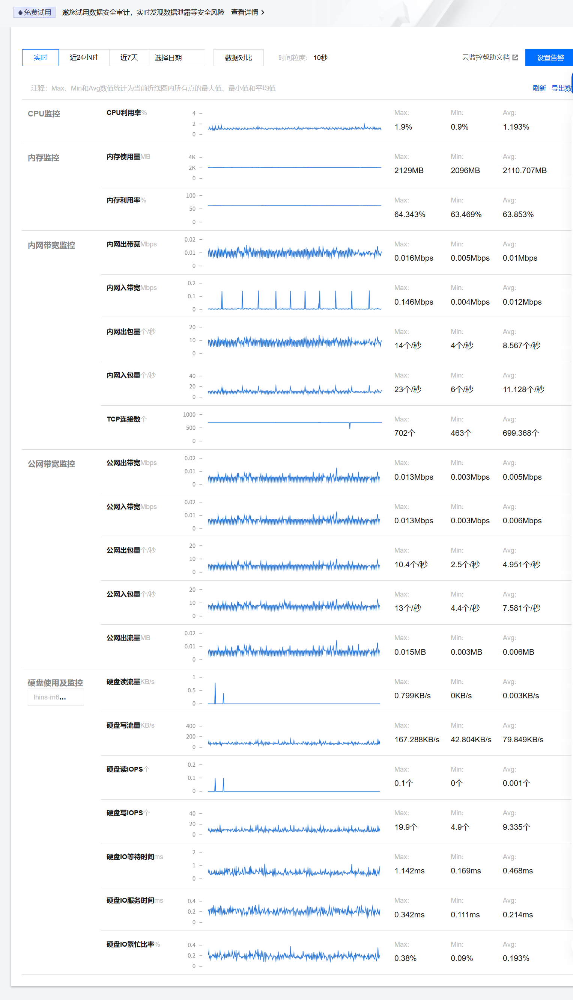
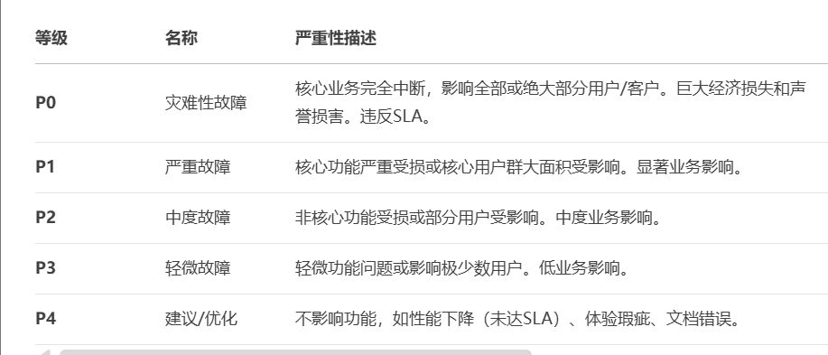
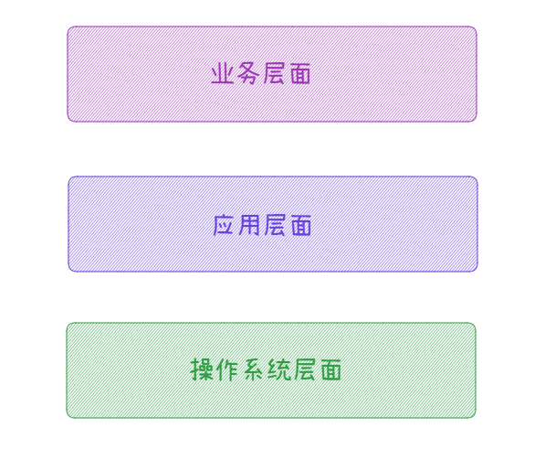
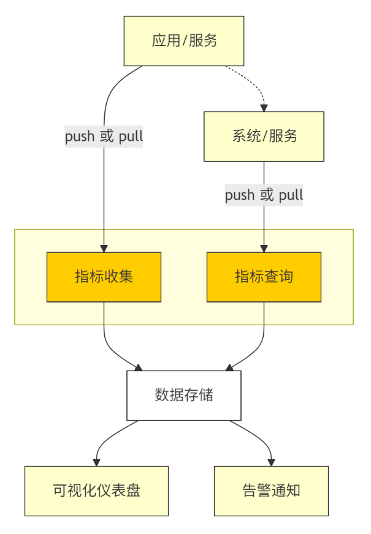
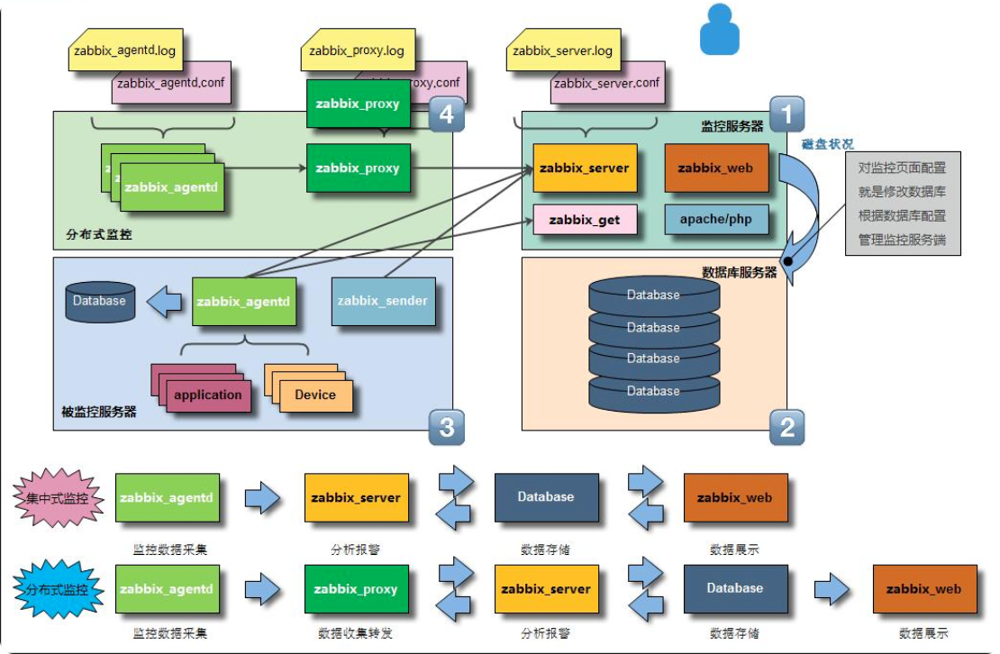
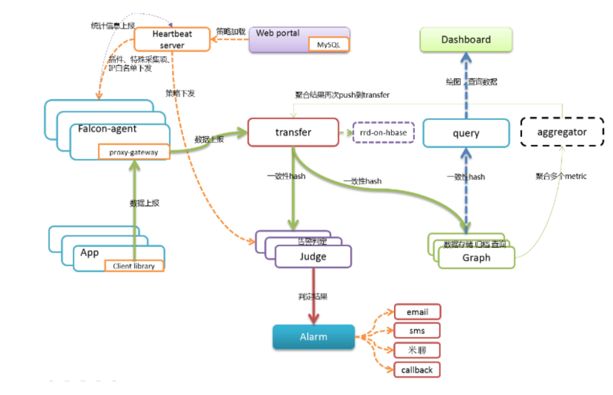
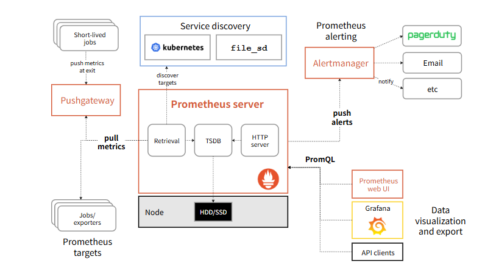

从今天之后的一段时间内，华仔会带着大家一起从零开始搭建并研发一套高并发的电商实战项目，这里会涉及到很多互联网大厂开发过程中所使用的核心技术和架构设计模式，希望大家学完之后可以用到自己的简历中。

之前一期还剩几个架构师必备的模块没有更新，接下来会更新「**大厂监控体系**」、「**全链路压测改造**」 这两个模块。

这是第一百零一篇，本篇我们就从整体上了解下「**大厂监控体系**」全貌。

文章汇总位置：[https://wx.zsxq.com/dweb2/index/columns/51122554151214](https://wx.zsxq.com/dweb2/index/columns/51122554151214)

源码授权与获取地址：[https://articles.zsxq.com/id\_1s85grnaae4p.html](https://articles.zsxq.com/id_1s85grnaae4p.html)

本篇主要是理论知识和架构模式分析，所以就不贴 git 代码分支了。

## **01 前言**

前面 100 篇针对整个「**小红书社交+电商项目**」 的架构设计、功能开发和运维部署，从今天开始，我们就从整体上了解下「**大厂监控体系**」全貌。

##   
**02 架构师必备的大厂监控体系**

接下来会从几个方面来讲解和梳理架构师必备的大厂监控体系。

## **2.1 为什么互联网公司必备监控**

互联网公司的产品通常是通过软件、网站、APP 等方式来提供服务的，这类产品在使用过程中可能会面临一系列风险和挑战。

比如：

1.  网络故障或者稳定性问题：由于网络故障、硬件故障或者其他配置错误等原因可能会导致线上服务访问不稳定或者宕机，进而影响用户的体验。
2.  性能瓶颈和延迟问题：当双十一/618大促来临时，用户访问量激增可能会对服务器产生超负荷的压力，导致系统响应速度变慢，影响用户的体验和满意度。
3.  数据安全性问题：黑客通过攻击防火墙、病毒、恶意软件等途径获取数据/进行恶意操作，在一定程度上破坏了系统的安全性。

所以互联网公司需要在开发、测试、发布、运维等不同阶段对产品进行全方位的监控，以便及时发现问题并采取相应的措施。

比如下图是服务器操作系统方面的监控，当然业务服务方面的监控后续篇章单独介绍和实操。

## **2.2 系统可用性指标**

系统可用性指标，简称：SLA，它是衡量一个系统可用性有多高，目标系统 7\*24 小时不间断服务，云厂商通常宣传自己产品 SLA 是多少？

### **2.2.1 时间维度可用性指标**

从时间维度来说：系统可以正常使用时间与总时间之比(全年为例子) = 365天 = 8760小时。

1.  99.9=8760\*0.1%=8760\*0.001=8.76小时。
2.  99.99=8760-0.0001=0.876小时=0.876\*60=52分钟。
3.  99999=8760\*0.00001=0.0876小时=0.0876\*60=5.26分钟。
4.  ....

### **2.2.2 请求次数维度可用性指标**

请求次数维度: 请求总次数和失败的占比 (1000次求为例子，相对简单)

1.  系统可用性99%: 表示 1000 个请求中允许 10\*(1-99%) = 10 个请求出错。
2.  系统可用性99.9%: 表示 1000 个请求中分仵 1000\*(1-99.9%) = 1 个请求出错。
3.  ....

9 越多代表全年服务可用时间越长服务更可停机时间越短，但往往存在网络/机房问题，应用更新发版导致服务不可用，一般大厂的多数业务都是以 4 个 9 是刚需， 5 个 9 是目标，6 个 9 是理想。

### **2.2.3 小结**

业界用多少个 9 来衡量系统的可用性

1.  基本可用: 2 个 9，一年中大概停机时间小于 88 小时。
2.  较高可用: 3 个 9，一年中大概停机时间小于 9 小时。
3.  高可用: 4 个 9 即 99.99%，一年中大概停机时间小于 53 分钟。
4.  极高可用: 5 个 9，一年中大概停机时间小于 5 分钟。

## **2.3 如何保障团队业务稳定运行**

作为技术 Leader，肯定需要保证团队所负责的业务稳定运行的。

那么如何保障呢？大概需要从下面三个方面入手，分别来看下。

### **2.3.1 给团队灌输思想**

要经常给团队灌输思想：稳定性是技术人员的生死线，是最重要的技术 kpi。

### **2.3.2 如何进行落地**

这里又分三个步骤：

###   
**2.3.2.1 事前预防**

1.  90% 的事故都是从发布引起的。
2.  变更三板斧: 可监控、可灰度、可回滚，不允许 "三无发布"。
3.  面向失败编程、定期 CodeReview。

### **2.3.2.2 事中应急响应**

1.  故障发现和分类：是从技术指标监控排查还是从业务指标监控排查。
2.  故障排查：安排直接负责人、链路负责人进行排查；通过看日志直接定位、排除法。
3.  故障恢复：发现故障要以最快方式恢复正常运行，禁止不思考直接重启回滚，防止二次故障引入。

###   
**2.3.2.3 事后定级和复盘**

1.  事故级别和责任人。
2.  发生事故的原因: 测试没发现、发布不规范、不熟悉配置、流量评估没做好、限流降级没做好?
3.  改进措施、避免下次再犯。

###   
**2.3.2.4 组织文化建设**

最后进行组织文化建设：

1.  安全生产月报周报通报/批评。
2.  事故纳入 KPI 考核、奖金、晋升机制。
3.  分享和沉淀稳定性建设的例子，帮助团队积累故障排查恢复经验。

## **2.4 故障等级定义与案例分析**

一个完整的故障等级定义一般由业务场景的「**功能模块**」\+ 「**影响面积**」\+ 「**对应等级**」三方面组成的。

我们分别来看下。

### **2.4.1 功能模块**

从功能受损后对用户实际受影响的程度可以简单将模块分为「**核心功能**」、「**次核心功能**」和「**非核心功能**」等模块。

1.  核心功能模块主要是直接影响用户使用服务的，比如：商品、订单、库存、支付。
2.  非核心模块影响到用户体验，但是对主路径功能没有重大影响的，比如：管理后台数据等查询类。

### **2.4.2 影响面积**

它是描述某个功能模块受损后的现象和结果，最常使用的指标是「**成功量**」、「**成功率**」、「**请求耗时**」、「**影响用户数**」、「**失败量**」、「**影响时长**」等指标根据业务层面对影响面积的判断，对不同级别的影响面匹配不同的故障等级。

### **2.4.3 对应等级**

通常公司都会有对应等级，分为（P0-P4）：

### **2.4.3.1 P0 最高级别**

一般代表了公司业务的核心系统出现了严重问题，导致公司「**业务受阻**」、「**用户流失**」、「**财务损失**」等严重后果，对公司声誉和市场地位造成重大打击。

P0 通常定义为：

1.  影响范围极广： 核心服务完全不可用，影响大部分甚至全部用户。
2.  持续时间较长： 中断时间远超 SLA 承诺（通常数小时以上）。
3.  业务损失巨大： 造成巨额直接或间接经济损失。
4.  严重违反 SLA： 对客户承诺的服务水平协议彻底失效。
5.  紧急程度最高： 需要全公司资源立即响应，最高管理层介入。

### 经典 P0 案例剖析

1.  阿里云香港Region可用区C宕机 (2022年12月18日)：[https://mp.weixin.qq.com/s/rUT\_eTXDSfOErFEAVLfHrA](https://mp.weixin.qq.com/s/rUT_eTXDSfOErFEAVLfHrA)
2.  故障描述： 阿里云位于香港的某数据中心因制冷系统故障导致机房温度异常升高，触发服务器安全保护机制而关机。影响香港Region多个可用区（主要是C区），导致托管在该区域的大量服务（包括澳门健康码、金融交易系统、加密货币交易所等）长时间中断（约12小时以上）。
3.  根本原因： 官方通报为制冷系统故障。深入分析通常涉及：
4.  基础设施冗余失效： 制冷系统的 N+1 冗余未能有效应对实际故障。
5.  监控与告警延迟： 对关键基础设施（如制冷）的监控可能不够实时或告警阈值设置不合理，错过了早期干预时机。
6.  应急响应与切换机制不足： 跨可用区/Region的故障转移（Failover）机制未能按预期快速、自动恢复服务。
7.  影响范围评估困难： 在复杂分布式系统中，快速准确评估故障影响范围极具挑战。
8.  教训：
9.  基础设施韧性至关重要： 对电力、制冷等关键基础设施的冗余设计、定期测试和维护需投入重兵。
10.  混沌工程价值凸显： 需主动注入故障，验证跨可用区/Region容灾能力。
11.  监控需覆盖全栈： 从底层硬件、基础设施到上层应用，建立端到端、细粒度的监控。
12.  故障演练常态化： 定期进行真实场景的容灾演练，验证预案有效性。
13.  客户沟通透明及时： 重大故障期间，清晰、频繁的沟通能最大程度减少客户恐慌和不满。
14.  Fastly全球CDN中断 (2021年6月8日)：[https://mp.weixin.qq.com/s/jOwwja2WXhxR63eXtW4BKg](https://mp.weixin.qq.com/s/jOwwja2WXhxR63eXtW4BKg)
15.  故障描述： 全球领先CDN服务商Fastly因一个软件配置错误（Bug）被触发，导致其全球边缘节点大部分在短时间内崩溃，引发大规模互联网瘫痪。依赖Fastly的众多知名网站（如Amazon, Reddit, GitHub, Gov.uk, 纽约时报等）在全球范围内无法访问，持续时间约1小时。
16.  根本原因： Fastly在部署新功能时引入了一个软件缺陷（Bug）。一个特定的、有效的客户配置变更意外激活了这个Bug，导致其边缘服务器上的服务进程崩溃。其“快速传播变更”机制加速了故障在全球边缘节点的蔓延。
17.  教训：
18.  变更管理是生命线： 任何配置、代码变更都必须经过严格的评审、测试（尤其是生产环境仿真测试）和灰度发布流程。
19.  “快速传播”的双刃剑： 高效的配置分发机制在故障时可能成为“放大镜”，需设计熔断/回滚机制。
20.  防御性编程与弹性设计： 代码需具备更强的鲁棒性，单点故障或错误配置触发不应导致系统级雪崩。
21.  服务隔离与爆炸半径控制： 设计上应限制单个组件故障的影响范围。
22.  监控与回滚速度： 需要极快的异常检测和自动化/半自动化回滚能力。
23.  Facebook全球性宕机 (2021年10月4日)：[https://mp.weixin.qq.com/s/BzI9jeqDMa3VueMmNg\_\_IQ](https://mp.weixin.qq.com/s/BzI9jeqDMa3VueMmNg__IQ)
24.  故障描述： Facebook及其旗下全家桶（WhatsApp, Instagram, Oculus VR, 内部系统）全球服务中断近6小时。用户无法访问应用，内部员工甚至无法进入办公室和访问内部系统。
25.  根本原因： Facebook骨干网上的边界网关协议路由器的配置变更出错。这个变更切断了Facebook数据中心与互联网的连接，同时也破坏了其内部网络，导致DNS服务不可用，加剧了故障影响和恢复难度（工程师远程访问和修复能力受限）。
26.  教训：
27.  网络配置变更风险极高： BGP等核心网络协议的变更必须极其谨慎，需有完备的前置检查、模拟测试和回滚计划。
28.  基础设施依赖管理： 关键服务（如DNS）的可用性不能依赖于同一基础设施（如内部网络）。
29.  高权限操作需多重保障： 执行高危操作（如全网核心路由变更）需多人协作、二次确认，并在低峰期进行。
30.  灾难恢复计划需覆盖极端场景： 恢复能力应考虑到内部系统（包括访问权限系统）同时瘫痪的情况（如物理访问、带外管理）。
31.  单一供应商风险： 对自身基础设施的绝对控制也可能带来集中性风险。
32.  谷歌全球性服务中断 (2020年12月14日)
33.  故障描述： 谷歌旗下几乎所有主要服务（Gmail, YouTube, Google Drive, Google Docs, Google Search, GCP服务等）全球范围内大规模中断约1小时。
34.  根本原因： 谷歌内部身份验证系统（Authentication System）的存储配额管理系统存在Bug。系统配额意外耗尽，导致新用户无法登录，现有用户的身份验证凭证无法刷新（逐渐失效），最终表现为用户被登出且无法登录所有依赖谷歌账户的服务。
35.  教训：
36.  关键基础服务是单点： 身份认证、配置管理、服务发现等基础服务是全局性单点，其可用性要求必须最高。
37.  配额管理与监控： 对关键系统资源的配额（存储、内存、连接数等）监控和告警必须非常敏感，并设置安全缓冲。
38.  依赖管理： 所有服务都依赖的核心组件，其设计、冗余度和故障隔离必须做到极致。
39.  容量规划： 需考虑极端情况下的资源消耗，并留有足够缓冲。
40.  Bug影响深远性： 即使是一个看似局部的Bug（配额管理），在核心系统中也可能引发链式反应导致全局瘫痪。
41.  腾讯微信大面积故障 (2023年3月29日)：[https://mp.weixin.qq.com/s/KdZfSe9dv3ewmeCQ3YLL3g](https://mp.weixin.qq.com/s/KdZfSe9dv3ewmeCQ3YLL3g)
42.  故障描述： 微信及微信支付发生全国范围内的大面积故障，持续时间约半小时至1小时。用户反映问题包括：微信登录异常、消息发送/接收延迟或失败、微信支付无法使用（线上、线下扫码均受影响）、小程序打不开、朋友圈无法刷新等。基本涉及微信核心功能。
43.  根本原因（官方通报简述）： 腾讯官方公告称，是由于机房配套服务（如电力、网络）故障导致的。具体细节未完全公开，但业内分析推测可能涉及：
44.  核心IDC故障： 承载微信核心服务的某个或某几个关键数据中心基础设施（如网络设备、电力系统）出现问题。
45.  网络路由或DNS问题： 骨干网络路由异常或核心DNS解析故障，导致用户请求无法到达正确服务器。
46.  服务依赖失效： 微信核心服务依赖的底层基础服务（如认证、消息路由、支付通道）出现不可用。
47.  教训：
48.  超级App的脆弱性： 微信作为拥有十亿级日活用户的“国民级应用”，其基础设施和架构的容错能力面临极致挑战，任何核心环节的单点或区域故障都可能被无限放大。
49.  IDC基础设施冗余与异地容灾： 对核心数据中心的基础设施（电力、制冷、网络）冗余设计、维护和演练要求达到最高标准。异地多活架构的建设和常态化切换演练至关重要。
50.  依赖治理： 需要深入梳理并加固所有关键路径上的依赖服务，确保其高可用性。
51.  快速影响评估与用户沟通： 在如此大规模故障下，快速定位影响范围并通过官方渠道（如微博、App内通知）进行透明沟通，对缓解用户焦虑非常重要。
52.  阿里云多Region管控API访问异常 (2023年11月12日)：[https://mp.weixin.qq.com/s/l6WViDXAWb53VYWF01bGBA](https://mp.weixin.qq.com/s/l6WViDXAWb53VYWF01bGBA)
53.  故障描述： 阿里云位于华北2（北京）、华东1（杭州）、华东2（上海）、华南1（深圳）、中国（香港）等多个地域的管控API（包括ECS控制台、OpenAPI）出现访问异常，影响用户对云服务器的管理操作（如创建、重启、登录）。故障持续约1小时左右。虽然用户业务本身（如运行中的ECS实例）可能未中断，但云服务的管理能力瘫痪，对依赖API自动化运维的用户影响巨大。
54.  根本原因（官方通报）： 阿里云发布故障报告称，根本原因是管控系统底层依赖的某个服务组件存在缺陷（Bug），在特定操作下触发，导致管控服务不可用。具体细节指向内部一个核心中间件服务的异常。
55.  教训：
56.  云厂商“神经中枢”的脆弱性： 云服务的控制平面（管控API、控制台）是用户管理资源的入口，其高可用性设计必须独立于且高于数据平面（用户业务）。本次故障暴露了控制平面自身存在的单点风险。
57.  中间件/基础服务的全局性风险： 被众多上层服务依赖的核心底层中间件或基础服务，其Bug可能引发连锁反应，影响范围远超预期。
58.  变更管理与防御性设计： 对核心底层组件的变更需要更严格的测试和灰度。组件本身需要更强的鲁棒性和熔断机制，防止局部问题扩散。
59.  API访问的优雅降级： 在控制平面不可用时，是否能为用户提供有限度的、紧急的管理能力（如通过特定API或CLI）值得思考。
60.  滴滴出行全系瘫痪 (2021年2月25日 & 2022年9月22日 & 2023年11月27日)：[https://mp.weixin.qq.com/s/izZzHUWvi2K07N38KN81tw](https://mp.weixin.qq.com/s/izZzHUWvi2K07N38KN81tw)
61.  故障描述： 滴滴在近年发生了多次全平台大规模故障。以2023年11月27日为例，故障持续超过12小时！影响包括：App无法正常使用（地图加载失败、无法打车）、司机端接单异常、青桔单车无法扫码解锁、客服系统挤爆。用户、司机两端同时瘫痪，影响范围波及全国。
62.  根本原因 (2023年11月事件官方通报简述)： 滴滴发布公告称，是由于底层系统软件发生故障。根据技术社区分析推测，深层原因可能非常复杂，可能涉及：
63.  核心服务依赖故障： 如订单中心、派单系统、地图服务、认证服务等关键环节出现连锁失效。
64.  基础设施问题： 网络、存储或计算资源出现大规模异常。
65.  配置错误或发布事故： 重大变更导致服务不可用，且回滚失败或耗时过长。
66.  容量问题： 突发流量或内部错误导致关键服务过载。
67.  教训 (多次故障反映的共性问题)：
68.  端到端架构韧性不足： 从用户App、司机端到后台核心调度、支付、风控系统，整个链条的容错和快速恢复能力存在明显短板。
69.  故障定位与恢复效率低下： 长达10小时以上的恢复时间，表明故障根因定位困难、预案执行效果不佳或缺乏有效预案、恢复流程复杂。
70.  依赖治理与隔离失效： 关键服务之间的依赖关系复杂，故障容易蔓延，缺乏有效的熔断和降级措施。
71.  基础设施健壮性： 多次长时间故障让人对其底层基础设施（IDC、网络、云服务）的稳定性和冗余设计产生疑问。
72.  灾备体系有效性： 异地多活或灾备切换机制在极端情况下是否真正可用需要验证。多次长时间P0故障对品牌声誉和用户信任造成巨大打击。

### **2.4.3.2 其他等级**

其他故障等级定义（具体划分各公司可能略有不同）：

1.  P1案例：拼多多优惠券系统漏洞 (2019年1月20日)
2.  描述： 拼多多平台出现重大漏洞，用户可无限领取100元无门槛优惠券。大量羊毛党涌入，短时间内造成平台巨额资金损失（传闻数千万至数亿元）。核心的营销和风控系统失效。
3.  原因： 普遍认为是后端风控规则失效或前端逻辑绕过，可能源于变更错误、安全漏洞或内部恶意操作。
4.  教训： 资金安全是生命线！ 对涉及资金、优惠券等高价值操作的系统，需要多层风控、实时监控、额度限制、定期审计和严格变更管控。线上交易系统的安全测试和渗透测试必须常态化。
5.  P1案例：B站（哔哩哔哩）崩溃 (2021年7月13日)
6.  描述： B站主站、App以及旗下漫画、直播等多款服务发生大规模宕机，持续数小时。用户无法访问、观看视频、使用App核心功能。影响范围广，持续时间较长，达到P1级别。
7.  原因（官方通报）： B站公告称是部分服务器机房发生故障。业内推测可能是核心IDC的电力、网络或火灾等基础设施问题。
8.  教训： 再次凸显核心IDC基础设施冗余和容灾能力的极端重要性。对于内容平台，内容分发网络的多级缓存和回源策略也需要优化，以减轻源站压力。
9.  P2案例：微博热搜榜异常 (多次发生)
10.  描述： 微博热搜榜出现异常，如榜单停止更新、显示错误数据、或出现明显不合规/异常词条。虽然微博基础功能（发博、评论）可能正常，但核心的“广场”功能受损，影响用户体验和平台公信力。
11.  原因： 可能涉及热搜算法计算服务故障、数据源异常、存储问题、人工干预失误或外部攻击。
12.  教训： 对于高度依赖算法和实时数据的核心功能，需要确保计算服务的高可用、数据管道的可靠性、监控的实时性以及操作的审计与复核机制。
13.  P3案例：网易云音乐特定歌曲无法播放 (区域性/偶发性)
14.  描述： 部分用户反映某些歌曲无法播放，提示版权或加载错误，但其他歌曲和功能正常。
15.  原因： 可能涉及版权信息更新延迟/错误、CDN节点该歌曲缓存失效或异常、特定区域网络问题、客户端缓存Bug。
16.  教训： 加强版权元数据管理系统的健壮性和同步机制；优化CDN内容分发和刷新策略；完善按资源细粒度的监控（如单曲播放失败率）；客户端做好错误处理与重试。
17.  P4案例：某电商网站商品详情页的CSS样式在某个浏览器下轻微错位
18.  描述： 使用某个相对小众的浏览器（或特定版本）访问网站时，商品图片和描述文字出现轻微重叠或间距异常，不影响购买功能。
19.  原因： CSS样式对该浏览器的兼容性处理不够完善。
20.  教训： 加强多浏览器兼容性测试（尤其新版本发布），建立用户体验监控（如通过合成监控捕获UI异常截图）。

## **2.5 互联网公司常见监控分层和指标**

互联网公司监控和指标很多，按照顺序分层归类如下：

我们分别来看下：

### **2.5.1 系统和网络层**

主要关注底层基础设施的状态和事件，以确保服务器、网络、CPU和存储设备等运行正常，提供稳定的资源支持。

操作系统常见指标：

1.  CPU 利用率: 服务器上 CPU 主要的核心使用率情况。
2.  实时负载: 系统上所有进程的数目，计算干活的进程数，以及等待队列的进程数，也就是当前的机器的实时压力情况。
3.  内存使用率: 服务器内存使用情况，包括已使用、空闲等情况。
4.  网络带宽利用率: 服务器网络使用度，包括网卡、负载均衡、网络连接等的带宽使用情况。
5.  硬盘 I/O 读写速度: 磁盘读写速率。
6.  硬盘容量: 服务器硬盘容量使用情况，包括已使用、空闲等情况。
7.  进程使用率: 检查系统进程情况，包括进程执行状态、占用集群资源等情况。
8.  端口连接状态: 检查系统端口连接的状态。错误日志记录:记录系统产生的错误日志，包括错误类型、时间、处理结果等情况。
9.  响应时间: 服务器响应请求的时间。

网络常见指标：

1.  带宽利用率: 网络带宽利用率评估，包括上传和下载比率
2.  包丢失率: 测量包在传输中丢失的数量和百分比。
3.  延迟时间: 从发送请求到得到响应且完成处理信息所需的时间。
4.  网络流量: 流经网络的实时数据量和数据流量。
5.  网络错误率: 网络传输中发生的错误数量和百分比。
6.  连接数: 网络连接总数。
7.  网络响应时间: 网络请求响应时间。
8.  网络拥塞状态: 系统可用资源数量和使用率。
9.  传输速度: 网络传输速率，包括平均速率和实时速率。

### **2.5.2 业务/中间件应用层**

关注整体服务的状态和运行质量，能够及时预测系统运行瓶颈，保证产品的高效和用户体验。

常见指标如下：

1.  请求响应时间: 从请求到获得响应的整个时间。
2.  错误率: 应用程序产生错误的请求占总数的百分比。
3.  CPU使用率: 应用程序当前使用的处理器资源百分比。
4.  线程实例数: 当前在应用程序中运行的线程实例数量。
5.  平均程序执行时间: 应用程序各模块的平均执行时间。
6.  堆内存使用率: 应用程序中 Java 虚拟机(JVM)分配的内存占用的百分比。
7.  平均延迟时间: 从请求到响应开始的时间差。
8.  垃圾回收时间: 在 JVM 中收集不再使用的内存对象所需的时间。
9.  响应代码: HTTP 请求成功或失败代码。

### **2.5.3 业务层**

重点关注业务运营的分析和结果，通过监控平台运营情况和各种配置，获取更多业务数据。及时发现行业发展趋势，指引业务方向，实现全方位监控、预测和干预。

常见指标如下：

1.  GMV销售额: 项目特定时间内总的销售额。
2.  日活、月活: 日活跃用户数、月活跃用户数。
3.  客单价: 平均每个订单的金额。
4.  支付成功率: 成功支付订单和总订单的比率。
5.  订单量: 每次交易中的订单数量。
6.  购物车转化率: 加入购物车商品与实际付款之间的比率。
7.  转化率: 网站访客转化为潜在客户(注册、订阅、购买等)的百分比。
8.  用户留存率:每月活跃用户数量与上月活跃用户数量的比率。
9.  退款率: 以退货所得的金额与总交易金额之间的比率。
10.  每次交易的平均时间: 从访问网站到交易结束的总时间。
11.  每个访问的平均时间: 用户在网站上花费的总时间除以有效付款数量。
12.  启动错误率: 应用程序在第一次启动时无法正确启动的次数。
13.  平均执行时间: 任务执行所需的平均时间。
14.  异常数量: 系统产生的错误、崩溃、死锁等数量。
15.  页面加载时间和速度: 网页从请求到加载的时间和速度。
16.  点击率：网站广告点击率。

### **2.5.3 总结**

虽然业务指标不是技术人员重点关注的，但是相对技术指标来说，业务指标更重要，它是老板、产品经理、运营人员关心的。

如果业务指标不达标，技术指标再完美也是白搭，所以对于技术人员来说，业务指标也要重点去关注。现在大环境不好，各种大厂、中小厂都在裁员，不是因为你的技术不达标，而是你不关注业务，你的技术再牛逼，业务做的很烂，被裁就是理所当然的事情了。

作为一个高级/资深工程师/架构师来说，一定要关注「**技术**」和 「**业务**」指标。脱离业务，技术再牛逼也是白搭；但是业务很牛逼，技术不咋样依旧能存活。

之前我们通常在周报、KPI 考核中进行体现：

1.  技术指标：比如 QPS 从每秒 1000 提升到 2000，接口响应时间从 100ms 降低到 10ms。
2.  业务指标：你所负责的业务当技术指标有所提升后，你的业务指标是怎么样的，比如日活从50万涨到100万，支付成功率从95%提升到98%。

这东西一说，老板就觉得你除了关注技术之外还会关注业务，通过技术来提升业务指标就是你的能力体现，你在绩效上一定不会差（排除公司各种繁杂的嫡系之外），或者去面试其他公司的时候，跟面试官可以聊技术也可以聊业务，你的产品日活多少/月活多少，订单量多少。这就是你的加分项，所以在面试大厂/更高层级职位的话，不要只局限一些技术八股文，更多的是关注业务层面、解决方案层面。

## **2.6 常见监控架构模式浅析**

监控系统的架构模式一般分为两种：Pull 模式和 Push 模式，架构图如下：

  

###   
**2.6.1 Pull 模式**

### **优点**

1.  可以根据需要定时获取数据，避免数据的多余传输，节约网络带宽和存储空间。
2.  可以根据需要通过请求的方式，选定性地获取部分数据。
3.  适用于对被监控对象的稳定性要求不高的场景。
4.  PuII 模式核心消耗在监控系统侧，应用侧的代价比较低。

###   
**缺点**

1.  由于需要定时发送请求获取数据，对于需要实时响应的业务，Pull 模式的数据传输速度难以达到。
2.  Pull 模式需要能够处理推送事件的应用程序，因此需要有较高的成本和复杂性。

### **2.6.2 Push 模式**

### **优点**

1.  被监控对象可以主动推送数据，监控客户端不需要发送请求，因此避免了网络负载。
2.  对于需要实时响应数据的业务，Push 模式具有更高的传输效率和更佳的实时性。
3.  Push 模式适用于稳定的网络环境，可以实现实时数据的快速传输。

### **缺点**

1.  Push 模式核心消耗在推送和 Push Agent 端，监控系统侧的消耗相比 PuIl 要小。
2.  被监控对象需要主动发送数据，因此不适用于对被监控对象要求较高的场景，如需要严格控制被监控对象的数据流量。

##   
**2.7 主流监控告警框架对比**

### **2.7.1 Zabbix (Pull 模式和 Push 模式)**

它是基于 C 语言开发，是一种基于服务器->客户端体系结构开发企业级监控软件。允许监控各种网络服务，服务器资源和硬件，支持 Pull 模式和 Push 模式。

其擅长设备、网络、中间件的监控，因为前几年使用的监控系统主要就是用来监控设备和中间件的，所以 Zabbix 在国内应用非常广泛。

Zabbix 核心由两部分构成，Zabbix Server 与可选组件 Zabbix Agent。Zabbix Server 可以通过 SNMP、Zabbix Agent、JMX、IPMI 等多种方式采集数据，它可以运行在 Linux、Solaris、HP-UX、AIX、Free BSD、Open BSD、OS X 等平台上。

Zabbix 还有一些配套组件，Zabbix Proxy、Zabbix Java Gateway、Zabbix Get、Zabbix WEB 等，共同组成了 Zabbix 整体架构。

关于其入门实战可以参考：[https://blog.csdn.net/vic\_qxz/article/details/80769964](https://blog.csdn.net/vic_qxz/article/details/80769964)

### **优点**

1.  用户友好，易于部署和设置，Agentd 不但可以在 Windows、Linux 上运行，也可以在 Aix 上运行。
2.  具有插件式框架，可以灵活地满足不同的监控需求。
3.  提供了丰富的图形化监控数据。
4.  具有高扩展性，用户可以轻松添加自定义功能。

### **缺点**

1.  功能虽强大，但使用比较笨重，Zabbix 的安装和部署需要更多的时间和资源。
2.  对于复杂的 IT 架构，Zabbix 的配置难度较大。
3.  响应时间不够实时，对于实时性要求较高的应用场景可能不够理想。
4.  使用数据库做存储，无法水平扩展，容量有限。如果采集频率较高，比如 10 秒采集一次，上限大约可以监控 600 台设备，还需要把数据库部署在一个很高配的机器上，比如 SSD 或者 NVMe 的盘才可以。
5.  面向资产的管理逻辑，监控指标的数据结构较为固化，没有灵活的标签设计，面对云原生架构下动态多变的环境，显得力不从心。

### **2.7.2 Open-Falcon（Push 模式）**

Open-Falcon 出现在 Zabbix 之后，开发的初衷就是想要解决 Zabbix 的容量问题。OpenFalcon 最初来自小米，14 年开源，当时小米有 3 套 Zabbix，1 套业务性能监控系统 perfcounter。

Open-Falcon 的初衷是想做一套大一统的方案，来解决这个乱局。它是一种分布式、高性能的监控解决方案，它被用于大型的高可用性系统和广泛的云计算环境，只支持 Push 模式。

Open-Falcon 基于 RRDtool 做了一个分布式时序存储组件 Graph。这种做法可以把多台机器组成一个集群，大幅提升海量数据的处理能力。前面负责转发的组件是 Transfer，Transfer 对监控数据求取一个唯一 ID，再对 ID 做哈希，就可以生成监控数据和 Graph 实例的对应关系，这就是 Open-Falcon 架构中最核心的分片逻辑。

结合上面架构图来看，告警部分是使用 Judge 模块来做的，发送告警事件的是 Alarm 模块，采集数据的是 Agent，负责心跳的模块是 HBS，负责聚合监控数据的模块是 Aggregator，负责处理数据缺失的模块是 Nodata。当然，还有用于和用户交互的 Portal/Dashboard 模块。

Open-Falcon 把组件拆得比较散，组件比较多，部署起来相对比较麻烦。不过每个组件的职能单一，二次开发会比较容易，很多互联网公司都是基于 Open-Falcon 做了二次开发，比如美团、快网、360、金山云、新浪微博、爱奇艺、京东、SEA 等。

关于其入门实战可以参考：[https://blog.csdn.net/qq\_37067752/article/details/107809522](https://blog.csdn.net/qq_37067752/article/details/107809522)

### **优点**

1.  轻量级，可以部署在物理机和虚拟机上，部署和配置足够简单。
2.  支持查询优化，支持多种数据源输入。
3.  具有简单和易于使用的图形化界面。
4.  可以处理大规模监控场景，比 Zabbix 的容量要大得多，不仅可以处理设备、中间件层面的监控，也可以处理应用层面的监控。
5.  组件拆分得比较散，大都是用 Go 语言开发的，Web 部分是用 Python，方便二次开发。

### **缺点**

1.  生态不够庞大，是小米公司在主导，很多公司做了二次开发，但是都没有回馈社区，有一些贡献者，但数量相对较少。
2.  开源软件的治理架构不够优秀，小米公司的核心开发人员离职，项目就停滞不前了，小米公司后续也没有大的治理投入，相比托管在基金会的项目，缺少了生命力。
3.  对于某些复杂的IT架构，Open-Falcon 在准备和安装方面可能存在困难。

### **2.7.3 Prometheus（Pull 模式）**

Prometheus 的设计思路来自 Google 的 Borgmon，师出名门，就像 Borgmon 是为 Borg 而生的，而 Prometheus 就是为 Kubernetes 而生的。它针对 Kubernetes 做了直接的支持，提供了多种服务发现机制，大幅简化了 Kubernetes 的监控。

在 Kubernetes 环境下，Pod 创建和销毁非常频繁，监控指标生命周期大幅缩短，这导致类似 Zabbix 这种面向资产的监控系统力不从心，而且云原生环境下大都是微服务设计，服务数量变多，指标量也呈爆炸态势，这就对时序数据存储提出了非常高的要求。

它是 go 语言开发的、可扩展的开源监控系统，用于收集存储多维度的时间序列数据。支持 PromQL 查询语言和提供的图形化展示工具，可视化和告警这些功能交由 Grafana 和 Alertmanager 等第三方产品来实现，拓展性强。

其功能上的简洁，作为一个轻量级的后起之秀，在性能和展示方面优势比较明显，对容器监控支持的非常好。Prometheus 1.0 的版本设计较差，但从 2.0 开始，它重新设计了时序库，性能、可靠性都有大幅提升，另外社区涌现了越来越多的 Exporter 采集器，非常繁荣。

下面是 Prometheus 的架构图：

### **优点**

1.  对 Kubernetes 支持得很好，目前来看，Prometheus 就是 Kubernetes 监控的标配。
2.  生态庞大，有各种各样的 Exporter，支持各种各样的时序库作为后端的 Backend 存储，也有很好的支持多种不同语言的 SDK，供业务代码嵌入埋点。
3.  可扩展性强，支持水平扩展，满足大规模监控需求。
4.  支持灵活的查询和查询语言，提供了丰富的查询函数和操作符。
5.  可以从不同的数据源收集数据，支持多维度数据聚合。
6.  可以轻松集成 Alertmanager 实现告警。

### **缺点**

1.  存储机制不够灵活，大规模数据的存储和处理存在压力。
2.  对运维工程师的技术水平要求较高。
3.  易用性差一些，比如告警策略需要修改配置文件，协同起来比较麻烦。
4.  Exporter 参差不齐，通常是一个监控目标一个 Exporter，管理起来成本比较高。
5.  容量问题，Prometheus 默认只提供单机时序库，集群方案需要依赖其他的时序库。

接下来我们重点实战 Prometheus + Grafana + Alertmanager 监控告警平台的搭建和运维。