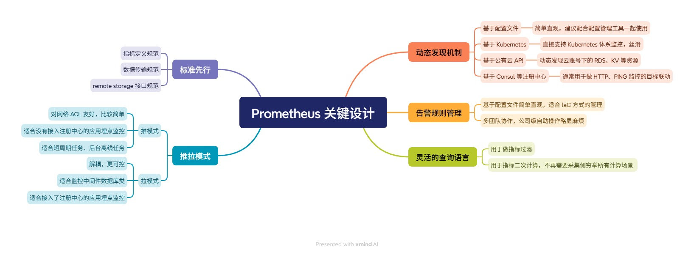
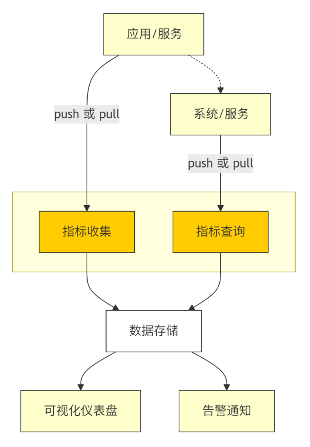
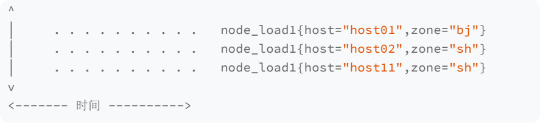
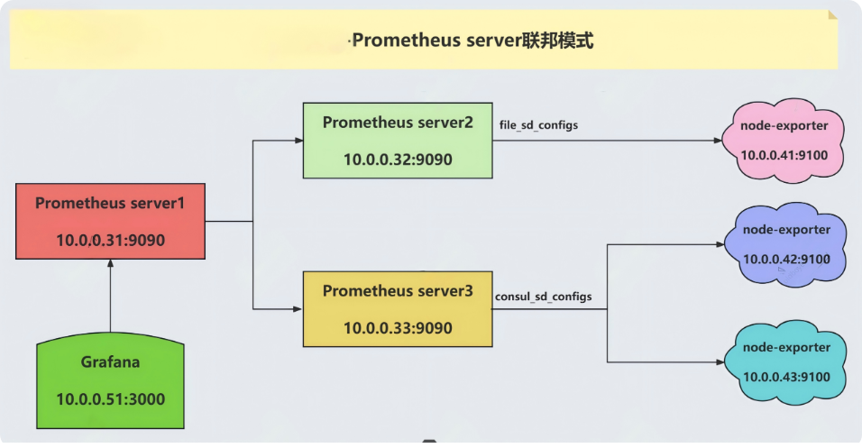
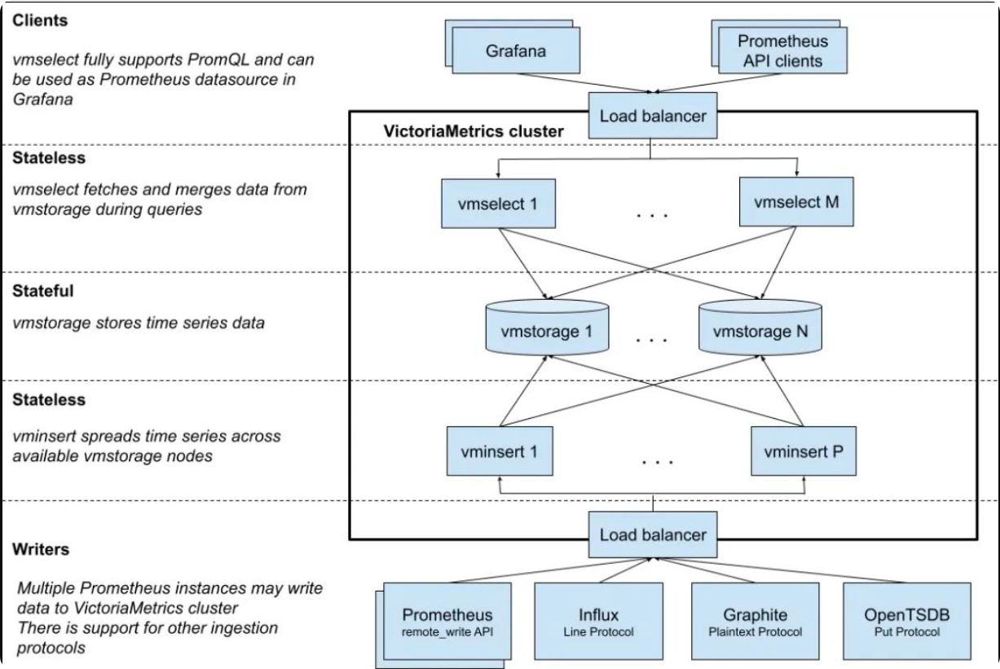
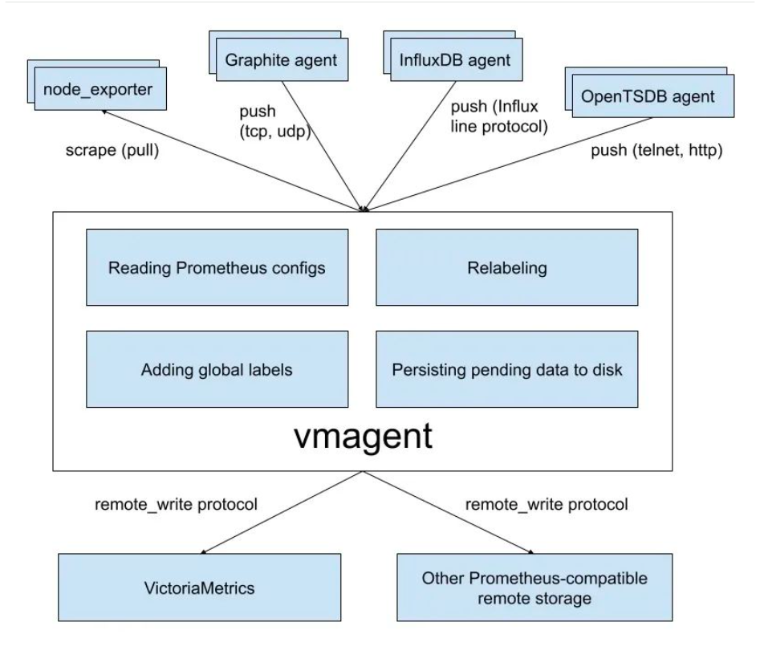
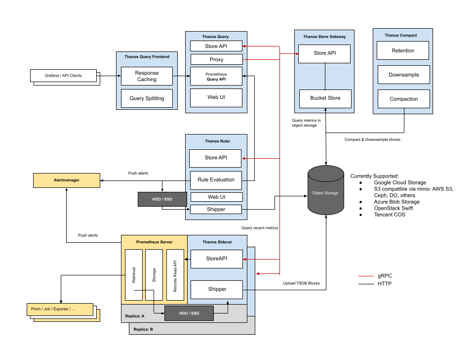
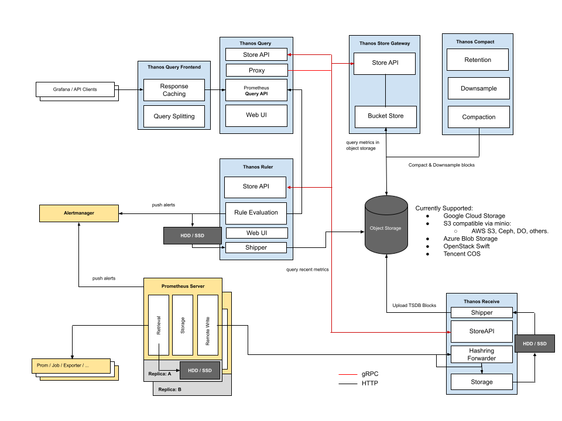

从今天之后的一段时间内，华仔会带着大家一起从零开始搭建并研发一套高并发的电商实战项目，这里会涉及到很多互联网大厂开发过程中所使用的核心技术和架构设计模式，希望大家学完之后可以用到自己的简历中。

之前一期还剩几个架构师必备的模块没有更新，接下来会更新「**大厂监控体系**」、「**全链路压测改造**」 这两个模块。

这是第一百零二篇，本篇我们就从整体上了解下监控软件「**Prometheus 架构设计**」。

文章汇总位置：[https://wx.zsxq.com/dweb2/index/columns/51122554151214](https://wx.zsxq.com/dweb2/index/columns/51122554151214)

源码授权与获取地址：[https://articles.zsxq.com/id\_1s85grnaae4p.html](https://articles.zsxq.com/id_1s85grnaae4p.html)

本篇主要是理论知识和架构模式分析，所以就不贴 git 代码分支了。

## **01 前言**

上篇带大家从整体上了解下「**大厂监控体系**」全貌： [【电商实战项目第一百零一篇】华仔电商实战项目之架构师必备的大厂监控体系](https://articles.zsxq.com/id_g5teathfcodb.html)， 今天我们来了解下监控软件「**Prometheus 架构设计**」。

##   
**02 Prometheus 架构设计**

Prometheus 的设计思路来自 Google 的 Borgmon，师出名门，就像 Borgmon 是为 Borg 而生的，而 Prometheus 就是为 Kubernetes 而生的。它针对 Kubernetes 做了直接的支持，提供了多种服务发现机制，大幅简化了 Kubernetes 的监控。

在 Kubernetes 环境下，Pod 创建和销毁非常频繁，监控指标生命周期大幅缩短，这导致类似 Zabbix 这种面向资产的监控系统力不从心，而且云原生环境下大都是微服务设计，服务数量变多，指标量也呈爆炸态势，这就对时序数据存储提出了非常高的要求。

它是 go 语言开发的、可扩展的开源监控系统，用于收集存储多维度的时间序列数据。支持 PromQL 查询语言和提供的图形化展示工具，可视化和告警这些功能交由 Grafana 和 Alertmanager 等第三方产品来实现，拓展性强。

其功能上的简洁，作为一个轻量级的后起之秀，在性能和展示方面优势比较明显，对容器监控支持的非常好。Prometheus 1.0 的版本设计较差，但从 2.0 开始，它重新设计了时序库，性能、可靠性都有大幅提升，另外社区涌现了越来越多的 Exporter 采集器，非常繁荣。

官网：[https://prometheus.io/docs/introduction/overview/](https://prometheus.io/docs/introduction/overview/)

## **2.1 Prometheus 用途**

1.  Kubernetes集群监控
2.  使用Prometheus可以收集和监控Kubernetes集群的指标数据，例如CPU、内存、网络等。
3.  使用Prometheus Operator部署Prometheus，然后通过Grafana可视化工具展示监控指标的仪表板。
4.  网络监控
5.  Prometheus可以监控网络的状态和性能，例如TCP连接数、网络延迟和带宽利用率等。
6.  使用Prometheus的Blackbox Exporter插件来执行网络探测，检查网络服务是否可用。
7.  应用程序性能监控
8.  通过Prometheus的客户端库可以在应用程序中嵌入指标收集代码，并收集应用程序的性能指标数据。
9.  例如请求数、响应时间、错误率等，帮助开发人员监控应用程序的性能，并进行调试和优化。
10.  数据库监控
11.  可以使用Prometheus的Exporter插件监控各种类型的数据库，例如MySQL、PostgreSQL、Redis和MongoDB。
12.  Exporter可以将数据库的指标数据转换为Prometheus可以处理的格式，并将其发送到Prometheus进行监控和警报。
13.  服务器监控
14.  使用Prometheus可以监控服务器的CPU、内存、磁盘和网络使用情况等指标，服务器上运行的各种服务的状态和性能。
15.  能够实时地存储和查询系统和服务的各种指标，如性能、CPU利用率、内存使用和请求计数等。

## **2.2 Prometheus 架构设计**

下面是 Prometheus 的架构图：

核心组成部分：

1.  Prometheus server：
2.  核心组件，负责抓取、存储和查询指标数据，提供API以供访问。
3.  Prometheus Server 本身就是一个时序数据库，将采集到的监控数据按照时间序列的方式存储在本地磁盘当中。
4.  内置的UI界面，通过这个UI可以直接通过PromQL实现数据的查询以及可视化。
5.  Exporter：
6.  Prometheus 插件或独立组件，负责抓取指定服务或系统的性能指标数据
7.  Prometheus 原理是通过 HTTP 协议周期性抓取被监控组件的状态，输出这些被监控的组件的 Http 接口为 Exporter。
8.  Exporler 将监控数据采集的端点通过 HTTP 服务的形式暴露给 Promelheus Server，将其公开为 HTTP 端点或指定的格式。
9.  Prometheus server 通过轮询或指定的抓取器从 Exporter 提供的 Endpoint 端点中提取数据。
10.  Alertmanager：
11.  在 Prametheus Server 中支持基于 PramQL 创建告警规则，如果满足 PromQL定 义的规则，就会产生一条告警。
12.  Prometheus 告警管理器组件，负责管理告警规则、通知和报警贫略的设置，提供第一类和第二类警报的分类管理服务。
13.  PushGateway：
14.  Prometheus 数据采集基于 Pull 模型进行设计，在网络环境必须要让 Prometheus Server 能够直接与Exporter 进行通信。
15.  当这种网络需求无法直接满足时，就可以利用 PushGateway 来进行中转。
16.  通过 PushGateway 将内部网络的监控数据主动 Push 到 Gateway 当中。
17.  Prometheus Server 则可以采用同样 Pull 的方式从 PushGateway 中获取到监控数据。
18.  Serice Discovery：
19.  服务发现功能，动态发现待监控的 Target，完成监控配置的重要组件。

总结：

1.  Prometheus 服务直接通过目标拉取数据，或者间接地通过中间网关拉取数据。
2.  并通过一定规则进行清理和整理数据，把得到的结果存储到新的时间序列中。
3.  利用 PromQL 和其他 API 可视化地展示收集的数据。

##   
**2.3 Prometheus 关键设计**

### **2.3.1 标准先行**

Prometheus 最重要的规范就是指标命名方式，数据格式简单易读，它用标签集来标识指标。有些监控系统会把一些特殊的字段单独提出来，最典型的比如 hostname 字段，这种做法在一些特定场景会显得更有效。但是统一的标签集表达方式是最通用、最灵活的。

虽然标签集很灵活，但是在实际落地时强烈建议在公司推行一个标签定义规范，标签 Key 不能随便起名，该有的标签也不能缺失，这样既减少了理解成本也保证了数据的规整完备，便于后续做数据分析。

应用层的监控，必要的标签 :

1.  指标名 (metric) : Prometheus 内置建立的规范就是叫 metric（即 \_\_name\_\_）。 如果是 Counter 类型，单调递增的值，指标名称以 \_total 结尾。
2.  服务名 (service) : 全局唯一，如 : n9e-webapi，p8s-alertmanager，一般是系统名称 + 模块名称 = 服务名称。如果公司比较大，就需要一个全局的服务目录做参考，否则不同的团队可能会起相同的名称，我们可以考虑使用 Git 里的 GroupName + RepoName。系统名称最好也单独做成一个标签，比如 system=n9e system=p8s。
3.  实例名称 (instance) : 一个服务一般会部署多个实例，用 ip + 端口标识，比如如 : 实例 1 : 192.168.31.11:3306，实例2 : 192.168.31.12:3307
4.  服务类型 (job) : 建议区分服务 , 比如 : MySQL 的监控数据统一标签 job=mysql ，Redis 的监控数据统一标签 job=redis。
5.  地域可用区 (zone) : 把地域信息放到标签里，有个巨大的好处，比如某个 zone 出问题了，就比较容易看出来，带有某个特定的 zone 的指标数据异常，快速执行切流止损即可。有了 zone 的信息，region 就可有可无了，zone 的前缀一般就是 region。
6.  集群名称 (cluster) : 有的时候一个可用区会部署多个集群，特别是一些中间件比如 ElasticSearch，给每个重要的业务单独部署一个集群，一个大公司可能有几百套 ElasticSearch 集群。
7.  环境类型 (env) : 标识 : 环境类型 env 用来标识是生产环境还是测试环境。当然了如果监控系统不复用，生产用生产的监控系统，测试用测试的监控系统，就无需这个标签了。

指标的数据格式和传输协议制定好之后，各种 Exporter、各种支持 Remote Read/Write 的后端存储就可以接入进来了，而这些 Exporter、存储的丰富和繁荣，又反向推动了 Prometheus 的流行，形成正向循环。

### **2.3.2 推拉模式**

Prometheus 主要使用「**拉模式**」获取指标，辅以「**推模式**」即 Pushgateway 的职能。很多监控系统都是推模式，比如 Datadog、Open-Falcon、Telegraf+InfluxDB 组合。推拉两种方式，在监控领域讨论也比较多，它们各有优缺点和适用场景。

在上篇中，我们简单剖析过：

「**拉模式**」有个最重要的优势就是「**解耦**」。这里举例说明，让你更快理解这个解耦到底解在哪里。

对于各类中间件，特别是非常基础的那些很大概率是在「**监控系统**」之前进行部署的。如果是「**拉模式**」，部署好监控系统之后，再来调用中间件的接口获取数据即可。如果是「**推模式**」，就需要在中间件里重新配置监控数据上报地址，然后重启中间件，这个代价就太高了。

但是「**拉模式**」需要有很好的「**服务发现机制**」，如果只有少量的几个目标要采集怎么搞都可以，但是当有几百上千个采集指标的时候，手工配置就比较麻烦了。所以 Prometheus 支持各种服务发现机制，尤其是基于 Kubernetes 体系的「**服务发现机制**」是最常见的，毕竟它就是为云原生环境而生的。

1.  如果服务没有部署在 Kubernetes 中，而是部署在传统物理机或虚拟机上，这个时候就需要使用 Consul 等服务发现机制。
2.  如果在监控体系建设之前，服务没有接入「**注册中心**」，为了满足监控需求而接入「**注册中心**」，用户会觉得成本太高。

此时「**推模式**」就有了用武之地，这就是很多公司的自研服务都使用「**推模式**」发送监控数据的原因。简单总结就是：中间件类使用「**拉模式**」，自研的服务使用「**推模式**」，自研的服务如果都接入了「**注册中心**」也可以使用「**拉模式**」。

当然，推拉模式选择还有一个比较关键的点就是「**网络通路问题**」，特别是网络 ACL 限制比较严格的环境，很多都是可出不可进，比如典型的 NAT 出网，这种情况下「**推模式**」的适配性更好，对 ACL 更友好一些。另一个关键点是短周期任务或批处理任务，通常不太可能监听 HTTP 端口，这种大概率也是「**推模式**」。

当然还有一些其他影响因素，比如「**推模式**」服务端通常比较容易处理，数据接收是无状态的。但是「**拉模式**」在数据量大的时候要「**考虑分片**」的问题，再就是「**失联告警问题**」，「**拉模式**」下很容易感知到目标失联，但「**推模式**」就比较复杂了需要对数据缺失做告警，比如 [Prometheus#absent](http://prometheus/#absent) 函数，absent 函数需要把指标的每个标签都写全，才能达到预期效果。而指标数量何止千万，几乎不可能完成。

最后就是「**可控性**」问题：

1.  拉模式：监控系统是主动的一方，可以控制频率。
2.  推模式：客户端是主动的一方，如果代码写的烂了，就会给监控系统造成很大压力。

综上 Prometheus 采取是「**拉模式**」，因此它对监控目标「**动态发现机制**」的苛求度很高。

### **2.3.3 动态发现机制**

监控目标动态发现机制，这个问题其实很早就有，对于老一些的监控系统，比如 Zabbix，是资产管理方式，要监控的目标都需要在服务端注册、配置。

这种方式在监控目标偏静态的场景还是比较好用的，但是云原生之后，基础设施动态化，监控目标的创建、销毁都比较频繁，就需要有一个更自动化的机制来获取监控目标列表。

在 Prometheus 中内置了多种服务发现机制，最常见的有四种：

1.  基于配置文件的发现机制：这种方式看起来很低端，其实非常常用，因为可以配合配置管理工具一起使用，非常方便。使用配置管理工具批量更新配置，然后让监控系统重新加载一下就可以了，比较丝滑。
2.  基于 Kubernetes 的发现机制：Kubernetes 中有很多元信息，通过调用 kube-apiserver，可以轻易拿到 Pod、Node、Endpoint 等列表，Prometheus 内置支持了 Kubernetes 的服务发现机制，让这个过程变得更简单，Prometheus 基本成为了 Kubernetes 监控的标配。
3.  基于公有云 API 的发现机制：比如要监控公有云上所有的 RDS 服务，一条一条配置比较麻烦，这个时候就可以基于公有云的 OpenAPI 做一个服务发现机制，自动拉取相关账号下所有 RDS 实例列表，大幅降低管理成本。
4.  基于注册中心的发现机制：社区里最为常用的是 Consul，典型场景是 PING 监控和 HTTP 监控，把所有目标注册到 Consul 中，然后读取 Consul 生成监控对象列表即可。

### **2.3.4 告警规则管理**

Prometheus 的告警规则管理、记录规则管理、抓取配置管理与发送策略管理，全部是基于「**配置文件**」完成的，虽然不是关键设计，但确实是非常有特色的设计，简单聊一下。

这个方式有两个好处：

1.  简单：简单到令人发指，很多监控系统都是使用数据库来存储各类配置的，Prometheus 则直接使用 Yaml 文件，非常直观。
2.  便于自动化：配合配置管理工具、Git、Kubernetes 等，与 Infrastructure as Code 的管理风潮非常契合。

当然，这样管理也有问题就是不便于「**公司级协作**」，比如公司有 10 条业务线，数百个服务，上千个研发，大家都来管理一套配置，会非常混乱。所以很多公司的做法是由一个专职运维团队来管理这套配置，其他业务线研发有需求了就给这个运维团队提工单，这种做法也凑合能用，只是苦了运维团队，团队成员比较容易产生焦躁情绪。

另外，Prometheus 默认是「**单机时序存储**」容量有上限，基于配置管理的问题和容量问题，个人非常建议那些推行 DevOps 的团队来使用，而且是每个团队自己有一套单独的 Prometheus，互不干扰。但是这样也会带来其他问题，最典型的是「**数据孤岛问题**」，不过我们可以把各个 Prometheus 中的「**核心关键指标**」抽取到统一的地方来呈现，比如使用 Prometheus 联邦机制，只共享核心指标，其余指标不需要抽取到中心，自己团队消化就好。

### **2.3.5 灵活的查询语言**

PromQL（Prometheus Query Language）是 Prometheus 的查询语言，非常灵活。很多老一代监控系统都只能对数据做简单过滤判断阈值，没有 QL 的支持。当我们想要某个数据却发现没有的时候，就天然倾向于在采集侧处理，但是采集侧是无法穷举所有计算场景的，采集侧应该采集原始数据，后续的二次计算还是应该放到中心来搞定。

比如机器的内存指标，我们可以从 [cat /proc/meminfo](http://%20cat%20/proc/meminfo) 中看到很多内存相关的监控指标，采集器可以轻易拿到 MemAvailable 和 MemTotal 这样的字段，但是操作系统不会直接暴露内存可用率，此时就需要使用 [PromQL：MemAvailable / MemTotal \* 100](http://PromQL%EF%BC%9AMemAvailable%20/%20MemTotal%20*%20100%20) 做二次计算了。

这个场景很常见，有的采集器就直接自动做了计算并输出 [mem\_available\_percent](http://mem_available_percent/) 这样的指标，但是还有很多场景是不好穷举的，比如下面的例子：

有一些监控数据的采集，是完全由用户配置出来的，比如 SNMP 数据采集，采集哪些 OID 是用户配置的；JMX 数据采集，采集哪些 MBean、哪些 Pattern 也是用户配置的。监控采集器压根就不知道这些数据的具体语义，只有配置采集规则的人知道，这种情况更不可能自动计算，采集器只能采集原始数据，如果有二次计算的需求，最好是设计到服务端，让服务端来做。

PromQL 为二次计算提供了能力支持，多个指标的关联计算、多条件联合告警，都可以用 PromQL 来实现，作为现代监控系统，Query Language 已经是必备要求了。

所以这是 Prometheus 的一个特色关键设计。

## **2.4 PromQL 典型使用场景**

上一小节得知 Prometheus 中使用 PromQL 作为查询语言，使用起来非常灵活方便，但很多人不知道如何更好地利用它，发挥不出它的优势。这里就来梳理一下 PromQL 的典型应用场景。

PromQL 主要用于时序数据的查询和二次计算场景，先来看下什么是时序数据。

### **2.4.1 时序数据**

我们可以把时序数据理解成一个以时间为轴的矩阵，比如下面的例子中有三个时间序列，在时间轴上分别对应不同的值。

每一个点称为一个样本（sample），由三部分组成：

1.  指标（metric）：metric name 和描述当前样本特征的 labelsets。
2.  时间戳（timestamp）：一个精确到毫秒的时间戳。
3.  值（value）：表示该时间样本的值。

PromQL 就是对这样一批样本数据做查询和计算操作的，是不是很有意思。

### **2.4.2 PromQL 典型应用场景**

PromQL 典型的应用场景就是时序数据的查询和二次计算，这也是 PromQL 的两个核心价值，其中查询操作靠的就是查询选择器。

### **2.4.2.1 查询选择器**

随便一个公司，时序数据至少都有成千上万条，而每个监控图表的渲染或者每条告警规则的处理，都只是针对有限的几条数据， PromQL 第一个需求就是过滤。

假设我有两个需求：

1.  查询北京所有机器 1 分钟的负载。
2.  查询所有以 host0 为前缀的机器 1 分钟的负载。

那么 PromQL 如何写呢？

\# 通过 = 来做 zone 的匹配过滤

node\_load1{zone="bj"}

\# 通过 =~ 来做 host 的正则过滤

node\_load1{host=~"host0.\*"}

大括号里写过滤条件，主要是针对「**标签进行过滤**」，操作符除了等于号和正则匹配之外，还有不等于 != 和正则非 !~。需要注意的是，metric name 也是一个非常重要的过滤条件，可以写到大括号里，比如我想同时查看北京机器的 load1、load5、load15 三个指标，可以对 \_\_name\_\_，也就是 metric 名字做正则过滤。

{\_\_name\_\_=~"node\_load.\*", zone="bj"}

上面的例子中给出的 3 条 PromQL 都叫做即时查询（Instant Query），返回的内容叫做即时向量（ Instant Vector）。

即时查询返回的是当前的最新值，比如 10 点整发起的查询，返回的就是 10 点整这一时刻对应的数据。但是监控数据是周期性上报的，并非每时每刻都有数据上报，10 点整的时候可能恰恰没有数据进来，此时 Prometheus 就会往前看，看看 9 点 59、9 点 58、9 点 57 等时间点有没有上报数据。

那么最多往前看多久呢？这由 Prometheus 的启动参数 [\--query.lookback-delta](http://--query.lookback-delta/) 控制，其默认是 5 分钟。从监控的角度来看，建议你调短一些，比如改成 1 分钟 [\--query.lookbackdelta=1m](http://--query.lookbackdelta=1m/)，为什么呢？

举例说明一下，比如客户使用 Telegraf 做 HTTP 探测，配置告警规则说 [response\_code](http://response_code%20/) 连续 3 分钟都不等于 200 才告警。实际上只有一个数据点的 response\_code 不等于 200，但过了 3 分钟还是报警了。他感觉非常困惑，就问为什么。

实际上，主要有两个原因：

Telegraf 的 HTTP 探测会默认把 status code 放到标签里，会导致标签非稳态结构（这个行为不太好，最好是把这类标签直接丢弃掉，或者使用 categraf、blackbox\_exporter 做采集器），平时 code=200，出问题的时候code=500,在 Prometheus 生态里，标签变了就是新的时间序列了。

跟 [query.lookback-delta](http://query.lookback-delta/) 有关了，虽然只有一个点异常，也就是说code=500 的这个时间序列只有一个点，但是告警规则每次执行查询的时候，都是查到这个异常点，连续 5 分钟都是如此。所以就满足了规则里连续 3 分钟才告警的这个条件触发了告警。这就是建议你把 --query.lookback-delta 调短的原因。

除了即时查询，PromQL 中还有一种查询，叫做范围查询（Range Query），返回的内容叫做 Range Vector，比如下面的 PromQL。

{\_\_name\_\_=~"node\_load.\*", zone="bj"}\[1m\]

相比即时查询，范围查询就是多加了一个时间范围 1 分钟。即时查询每个指标返回一个点，范围查询会返回多个点。假设数据 10 秒钟采集一次，1 分钟有 6 个点都会返回。

上面说的就是 PromQL 第一个核心价值——筛选。接下来我们看 PromQL 的另一个核心价值 ——计算。计算部分内容比较多，有算术、比较、逻辑、聚合运算符等，下面我来分别看下。

### **2.4.2.2 算术运算符**

算术运算符比较简单，就是我们常用的加减乘除、取模之类的符号，可以结合这两个例子来了解它的应用场景。

\# 计算内存可用率，就是内存可用量除以内存总量，又希望按照百分比呈现，所以最后乘以100

mem\_available{app="clickhouse"} / mem\_total{app="clickhouse"} \* 100

\# 计算北京区网口出向的速率，原始数据的单位是byte，网络流量单位一般用bit，所以乘以8

irate(net\_sent\_bytes\_total{zone="bj"}\[1m\]) \* 8

### **2.4.2.3 比较运算符**

比较运算符就是大于、小于、等于、不等于之类的，理解起来也比较简单，但是意义重大，告警规则的逻辑就是靠比较运算符来支撑的。

这里也举两个例子，结合例子来理解会更容易：

mem\_available{app="clickhouse"} / mem\_total{app="clickhouse"} \* 100 < 20

irate(net\_sent\_bytes\_total{zone="bj"}\[1m\]) \* 8 / 1024 / 1024 > 700

带有比较运算符的 PromQL 就是告警规则的核心，比如内存可用率的告警，在 Prometheus 中可以这样配置。

groups:

\- name: host

rules:

\- alert: MemUtil

expr: mem\_available{app="clickhouse"} / mem\_total{app="clickhouse"} \* 100 < 20

for: 1m

labels:

severity: warn

annotations:

summary: Mem available less than 20%, host:{{ $labels.ident }}

例子中的 expr 指定了查询用的 PromQL，告警引擎会根据用户的配置周期性地执行查询。如果查不到就说明一切正常，没有机器的内存可用率低于 20%。如果查到了就说明触发了告警，查到几条就触发几条告警。

当然，偶尔一次低于 20% 不是什么大事，只有连续 1 分钟每次查询都低于 20% 才会告警，这就是 for: 1m 存在的意义。

### **2.4.2.4 逻辑运算符**

逻辑运算符有 3 个，and、or 和 unless，用于 instant-vector 之间的运算。and 是求交集，or 是求并集，unless 是求差集。

我们来看一个 and 的使用场景。关于磁盘的使用率问题，有的分区很大，比如 16T，有的分区很小，比如 50G，像这种情况如果只是用磁盘的使用率做告警就不太合理，比如 [disk\_used\_percent{app="clickhouse"} > 70](http://disk_used_percent%7Bapp=%22clickhouse%22%7D%20>%2070) 表示磁盘使用率大于 70% 就告警。对于小盘，这个策略是合理的，但对于大盘，70% 的使用率表示还有非常多的空间，就不太合理。

这时希望给这个策略加一个限制，只有小于 200G 的硬盘在使用率超过 70% 的时候才需要告警，这时就可以使用 and 运算符，来看下最终 PromQL：

disk\_used\_percent{app="clickhouse"} > 70 and disk\_total{app="clickhouse"}/1024/1024/1024 < 200

同理，or 和 unless 这两个逻辑运算符也是这样，你可以自己试一试。算术、比较、逻辑运算符，基本的使用方式比较简单，但如果运算符两侧的向量标签不统一，就会面临一些更复杂的处理逻辑，需要在 PromQL 中给出向量匹配规则。

###   
**2.4.2.5 向量匹配**

向量之间的操作是想要在右侧的向量中，为左侧向量的每个条目找到一个匹配的元素，匹配行为分为：one-to-one、many-to-one、one-to-many。刚才介绍的磁盘使用率的例子，就是典型的 one-to-one 类型，左右两侧的指标，除了指标名，其余标签都是一样的，非常容易找到对应关系。但是有时候希望用 and 求交集，但是两侧向量标签不同，怎么办呢？

此时可以使用关键字 on 和 ignoring 来限制用于做匹配的标签集。

mysql\_slave\_status\_slave\_sql\_running == 0

and ON (instance)

mysql\_slave\_status\_master\_server\_id > 0

这个 PromQL 想表达的意思是如果这个 MySQL 实例是个 slave（master\_server\_id>0），就检查其 slave\_sql\_running 的值，如果 slave\_sql\_running==0，就表示 slave sql 线程没有在运行。但 mysql\_slave\_status\_slave\_sql\_running 和 mysql\_slave\_status\_master\_server\_id 这两个 metric 的标签，可能并非完全一致。

不过好在二者都有个 instance 标签，且相同的 instance 标签的数据从语义上来看就表示一个实例的多个指标数据，那我们就可以用关键字 on 来指定只使用 instance 标签做匹配，忽略其他标签。与 on 相反的是关键字 ignoring，顾名思义，ignoring 是忽略掉某些标签，用剩下的标签来做匹配。

### **2.4.2.6 聚合运算**

除了前面说的查询需求外，针对单个指标的多个 series，还会有一些聚合需求。比如说，想查看 100 台机器的平均内存可用率或者想要排个序取数值最小的 10 台。

这种需求可以使用 PromQL 内置的聚合函数来实现：

\# 求取 clickhouse 的机器的平均内存可用率

avg(mem\_available\_percent{app="clickhouse"})

\# 把 clickhouse 的机器的内存可用率排个序，取最小的两条记录

bottomk(2, mem\_available\_percent{app="clickhouse"})

另外，我们有时会有分组统计的需求，比如我想分别统计 clickhouse 和 canal 的机器内存可用率，可以使用关键字 by 指定分组统计的维度（与 by 相反的是 without）。

avg(mem\_available\_percent{app=~"clickhouse|canal"}) by (app)

## **2.5 Promethues 存储容量问题如何解决**

除了上面这些优秀的关键设计之外，Prometheus 也存在一些不足之处，其中一个广受诟病的问题就是单机存储不好扩展。

大部分场景其实不需要扩展，一般的数据量压根达不到 Prometheus 的容量上限，很多中小型公司使用单机版本的 Prometheus 就足够了，这个时候不要想着去扩展，容易过度设计，引入架构上的复杂度问题。

Prometheus 单机容量上限是多少？根据之前的生产经验，每秒接收 80 万个数据点，算是一个比较健康的上限，一开始也无需用一台配置特别高的机器，随着数据量的增长，可以再升级硬件的配置。当然如果想要硬件方便升配，就需要借助虚拟机或容器，同时需要使用分布式块存储。

那么每秒接收 80 万个数据点是个什么概念呢？

每台机器每个周期大概采集 200 个系统级指标，比如 CPU、内存、磁盘等相关的指标。假设采集频率是 10 秒，平均每秒上报 20 个数据点，可以支持同时监控的机器量是 4 万台：800000 ÷ 20 = 40000。可以看出，每秒接收 80 万数据点其实是一个很大的容量了。

不过只计算了机器监控数据，如果要用这个 Prometheus 监控各类中间件，那就得再做预估计算了。有些中间件会吐出比较多的指标，有些指标其实用处不大可以丢掉，这里暂不展开。

如果单个 Prometheus 实在是扛不住，也可以拆成多个 Prometheus，根据业务或者地域来拆都是可以的，这就是下面要介绍的 Prometheus 联邦机制。

### **2.5.1 Promethues 联邦机制**

联邦机制可以理解为是 Prometheus 内置支持的一种集群方式，核心就是 Prometheus 数据的级联抓取。比如某公司有 10 套 Kubernetes，每套 Kubernetes 集群都部署了一个 Prometheus，这 10 个 Prometheus 就形成了 10 个数据孤岛，没法在一个地方看到 10 个 Prometheus 的数据。

当然，我们用 Grafana 或 Nightingale，把这 10 个 Prometheus 作为数据源接入，然后就可以在一个 Web 上通过切换数据源的方式查看不同的数据了，但本质还是分别查看，没法做多个 Prometheus 数据的联合运算。

而联邦机制，一定程度上就可以解决这个问题，把不同的 Prometheus 数据聚拢到一个中心的 Prometheus 中，如下：

原本一个 Prometheus 解决不了的问题，拆成了多个，然后又把多个 Prometheus 的数据聚拢到中心的 Prometheus 中。但是中心的 Prometheus 仍然是个瓶颈。

所以在联邦机制中，中心端的 Prometheus 去抓取边缘 Prometheus 数据时，不应该把所有数据都抓取到中心，而是应该只抓取那些需要做聚合计算或其他团队也关注的指标，大部分数据还是应该下沉在各个边缘 Prometheus 内部消化掉。

怎么做到只抓取特定的指标到中心端呢？可以通过 match\[\] 参数指定过滤条件就可以实现，下面是中心 Prometheus 的抓取规则。

scrape\_configs:

\- job\_name: 'federate'

scrape\_interval: 30s

honor\_labels: true

metrics\_path: '/federate'

params:

'match\[\]':

\- '{\_\_name\_\_=~"aggr:.\*"}'

static\_configs:

\- targets:

\- '10.0.0.32:9090'

\- '10.0.0.33:9090'

边缘 Prometheus 会在 /federate 接口暴露监控数据，所以设置了 metrics\_path，honor\_labels 设置为 true，意思是在标签重复时，以源数据的标签为准。过滤条件中通过正则匹配过滤出所有 aggr: 打头的指标，这类指标都是通过 Recoding Rules 聚合出来的关键指标。

联邦这种机制，可以落地的核心要求是，边缘 Prometheus 基本消化了绝大部分指标数据，比如告警、看图等，都在边缘的 Prometheus 上搞定了。只有少量数据，比如需要做聚合计算或其他团队也关注的指标，被拉到中心，这样就不会触达中心端 Prometheus 的容量上限。这就要求公司在使用 Prometheus 之前先做好规划，建立规范。说实话可能实施起来会有点儿难，来看下推荐的远程存储方案。

### **2.5.2 Promethues 远程存储方案**

默认情况下，Prometheus 收集到监控数据之后是存储在本地，在本地查询计算。由于单机容量有限，对于海量数据场景，需要有其他解决方案。最直观的想法就是：既然本地搞不定，那就在远端做一个集群，分治处理。

Prometheus 本身不提供集群存储能力，可以复用其他时序库方案。时序库挺多的，如果挨个去对接比较费劲，于是 Prometheus 建立了统一的 Remote Read、Remote Write 接口协议，只要满足这个接口协议的时序库都可以对接进来，作为 Prometheus remote storage 使用。

目前国内使用最广泛的远程存储主要是 VictoriaMetrics 和 Thanos，简单介绍一下：

### **2.5.2.1 VictoriaMetrics**

VM 虽然可以作为 Prometheus 的远程存储，但它志不在此。VM 是希望成为一个更好的 Prometheus，所以它不只是时序库，它还有抓取器、告警等各个组件，体系非常完备，不过现在国内基本上还只是把它当做时序库在用。

VM 作为时序库，核心组件只有 3 个，vmstorage、vminsert 和 vmselect。其中 vmstorage 用于存储时序数据，vminsert 用于接收时序数据并写入到后端的 vmstorage，Prometheus 使用 Remote Write 对接的就是 vminsert 的地址，vmselect 用于查询时序数据，它没有实现 Remote Read 接口，反倒实现了 Prometheus 的 Querier 接口。这是为什么呢？

因为 VM 觉得 Remote Read 设计太烂了，性能不好，还不如直接实现 Querier 接口。这样设计的话，Grafana 这类前端应用直接可以和 vmselect 对接，而不用在中间加一层 Prometheus 。

VM 分为单节点和集群两个方案，根据业务需求选择即可。单节点版直接运行一个二进制文件既，官方建议采集数据点(data points)低于 100w/s，推荐 VM 单节点版，简单好维护，但不支持告警。集群版支持数据水平拆分。下图是 VictoriaMetrics 集群版官方的架构图。

主要包含以下几个组件：

1.  vmstorage：数据存储以及查询结果返回，默认端口为 8482。
2.  vminsert：数据录入，可实现类似分片、副本功能，默认端口 8480。
3.  vmselect：数据查询，汇总和数据去重，默认端口 8481。
4.  vmagent：数据指标抓取，支持多种后端存储，会占用本地磁盘缓存，默认端口 8429。
5.  vmalert：报警相关组件，不如果不需要告警功能可以不使用该组件，默认端口为 8880。

集群方案把功能拆分为 vmstorage、 vminsert、vmselect 组件，如果要替换 Prometheus，还需要使用vmagent、vmalert。从上图也可以看出 vminsert 以及 vmselect 都是无状态的，所以扩展很简单，只有 vmstorage 是有状态的。

vmagent 的主要目的是用来收集指标数据然后存储到 VM 以及 Prometheus 兼容的存储系统中（支持 remote\_write 协议即可）。

下图是 vmagent 的一个简单架构图，可以看出该组件也实现了 metrics 的 push 功能，此外还有很多其他特性：

1.  替换 prometheus 的 scraping target。
2.  支持基于 prometheus relabeling 的模式添加、移除、修改 labels，可以方便在数据发送到远端存储之前进行数据的过滤。
3.  支持多种数据协议，influx line 协议，graphite 文本协议，opentsdb 协议，prometheus remote write 协议，json lines 协议，csv 数据。
4.  支持收集数据的同时，并复制到多种远端存储系统。
5.  支持不可靠远端存储（通过本地存储 -remoteWrite.tmpDataPath )，同时支持最大磁盘占用
6.  相比 prometheus 使用较少的内存、cpu、磁盘 io 以及网络带宽。

具体实操请点击：[https://cloud.tencent.com/developer/article/2008318](https://cloud.tencent.com/developer/article/2008318)

### **2.5.2.2 Thanos**

Thanos 的做法和 VM 不同，Thanos 完全拥抱 Prometheus，对 Prometheus 做了一个增强，核心特点是使用对象存储做海量时序存储。你看下它的架构图。

Thanos 由多个组件组成，每个组件都有特定的功能，以下是 Thanos 的主要组件：

1.  Sidecar：Sidecar 是一个与 Prometheus 实例一起运行的容器，负责将 Prometheus 的数据上传到对象存储（如 S3、GCS 等），并处理查询请求。
2.  Store Gateway：Store Gateway 负责从对象存储中读取数据，并将其提供给查询层。它允许你查询历史数据，即使这些数据已经不在 Prometheus 的本地存储中。
3.  Query：Query 组件（也称为 Thanos Query）提供了一个统一的查询接口，允许你从多个 Prometheus 实例和 Store Gateway 中聚合数据。
4.  Compactor：Compactor 负责对存储在对象存储中的数据进行压缩和降采样，以减少存储空间并提高查询性能。
5.  Ruler：Ruler 组件允许你在全局范围内执行 Prometheus 的告警规则，即使这些规则分布在多个 Prometheus 实例中。
6.  Receiver：Receiver 是一个可选组件，用于接收来自 Prometheus 的远程写入数据，并将其存储在对象存储中。

Thanos 的工作原理可以概括为以下几个步骤：

1.  数据收集：每个 Prometheus 实例通过 Sidecar 将数据上传到对象存储中。Sidecar 还负责处理查询请求，并将这些请求转发给 Prometheus。
2.  数据存储：上传到对象存储的数据可以被 Store Gateway 读取。Store Gateway 将这些数据提供给 Query 组件，以便进行全局查询。
3.  数据查询：Query 组件从多个 Prometheus 实例和 Store Gateway 中聚合数据，并提供一个统一的查询接口。用户可以通过这个接口查询整个系统的监控数据。
4.  数据压缩：Compactor 定期对存储在对象存储中的数据进行压缩和降采样，以减少存储空间并提高查询性能。
5.  告警管理：Ruler 组件允许你在全局范围内执行 Prometheus 的告警规则，即使这些规则分布在多个 Prometheus 实例中。

这个架构图初看起来比较复杂，黄色部分是 Prometheus 自身，蓝色部分是 Thanos，黑色部分是存储。这里边有几个核心点：

1.  每个 Prometheus 都要伴生一个 Thanos Sidecar 组件，这个组件有两个作用，一是响应 Thanos Query 的查询请求，二是把 Prometheus 产生的块数据上传到对象存储。
2.  Thanos Sidecar 调用 Prometheus 的接口查询数据，暴露为 StoreAPI，Thanos Store Gateway 调用对象存储的接口查询数据，也暴露为 StoreAPI。Thanos Query 就可以从这两个地方查询数据了，相当于近期数据从 Prometheus 获取，比较久远的数据从对象存储获取。

虽然对象存储比较廉价，但这个架构看起来还是过于复杂了，没有 VM 看起来干净。另外这个架构是和 Prometheus 强绑定的，没法用作单独的时序存储，比较遗憾。

不过好在 Thanos 还有另一种方案，不用 Sidecar，使用 Receive 模块，来接收 Remote Write 协议的数据，写入本地，同时上传对象存储，看一下这个架构。

从存储角度来看，这个架构和 Prometheus 就没有那么强的绑定关系了，可以单独用作时序库。关键点还是对象存储，虽然对象存储是海量、廉价的，但是延迟较高，而且一个请求拆成两部分，一部分查本地，一部分查对象存储，也没有那么可靠。

相比日志之类的数据，指标数据的体量较小，一般存储 3 个月就够了，所以对象存储的优势就显得没那么大了。

如果是我来选型，VictoriaMetrics 和 Thanos 之间，我会选择前者。所谓的远程存储方案，核心就是 Remote Read/Write，其实 Prometheus 自身也可以被别的 Prometheus 当做 Remote storage，只要开启 [\--enable-feature=remote-write-receiver](http://--enable-feature=remote-write-receiver%20/) 这个参数即可。

了解完 Prometheus 的架构设计及细节实现后，接下来的篇章就会开始真正的实战了。