从今天之后的一段时间内，华仔会带着大家一起从零开始搭建并研发一套高并发的电商实战项目，这里会涉及到很多互联网大厂开发过程中所使用的核心技术和架构设计模式，希望大家学完之后可以用到自己的简历中。

之前一期还剩几个架构师必备的模块没有更新，接下来会更新「**大厂监控体系**」、「**全链路压测改造**」 这两个模块。

这是第一百零四篇，本篇我们就对监控软件「**Prometheus 整合 springboot 微服务监控实战**」。

文章汇总位置：[https://wx.zsxq.com/dweb2/index/columns/51122554151214](https://wx.zsxq.com/dweb2/index/columns/51122554151214)

源码授权与获取地址：[https://articles.zsxq.com/id\_1s85grnaae4p.html](https://articles.zsxq.com/id_1s85grnaae4p.html)

## **01 前言**

上篇带大家「**Prometheus 进行部署业务中间件 exporter 组件实战**」：[【电商实战项目第一百零三篇】华仔电商实战项目监控软件 Prometheus 部署与业务中间件 exporter 组件实战](https://articles.zsxq.com/id_ri23nx5okuhj.html)， 今天我们就对「**Prometheus 整合 springboot 微服务监控实战**」。

本章源码地址：[https://gitcode.com/huazaiteam/huazai-ecshop/tree/ecshop-chapter-101](https://gitcode.com/huazaiteam/huazai-ecshop/tree/ecshop-chapter-101)

## **02 Springboot 监控 actuator 实战**

上篇带大家把业务中间件进行了整合和监控，今天我们来看下业务微服务如何被监控。

##   
**2.1 Springboot actuator 介绍**

Actuator 是 SpringBoot 项目中一个非常强大一个功能，有助于对应用程序进行监视和管理，通过 restful api 请求来监管、审计、收集应用的运行情况。

Actuator 的核心是端点 Endpoint，它用来监视应用程序及交互，spring-boot-actuator 中已经内置了非常多的 Endpoint（health、info、beans、metrics、httptrace、shutdown等等），同时也允许我们自己扩展自己的 Endpoints。每个 Endpoint 都可以启用和禁用。要远程访问 Endpoint，还必须通过 JMX 或 HTTP 进行暴露，大部分应用选择HTTP，Endpoint 的ID默认映射到一个带 [/actuator](http://actuator/) 前缀的URL。例如，health 端点默认映射到 [/actuator/health](http://actuator/health)。

## **2.2 Springboot actuator 实战**

我们以「**用户服务**」为例来实战，其他的微服务一样的操作。

### **2.2.1 添加 actuator 依赖**

启用 Actuator 最简单方式是添加 spring-boot-starter-actuator 依赖。当我们将 Spring Actuator Dependencies 添加到我们的 Spring 启动项目时，它会自动启用执行器端点。

将以下依赖项添加到 common 包以启用 Spring 启动执行器端点，点击 maven 刷新加载依赖。

<!-- 引入 actuator 监控依赖-->

<dependency>

<groupId>org.springframework.boot</groupId>

<artifactId>spring-boot-starter-actuator</artifactId>

</dependency>

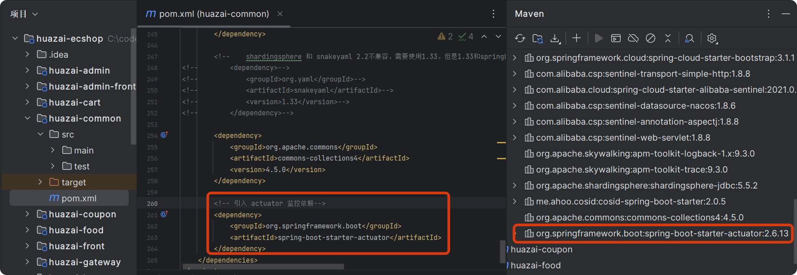

然后启动用户服务，查看启动日志：

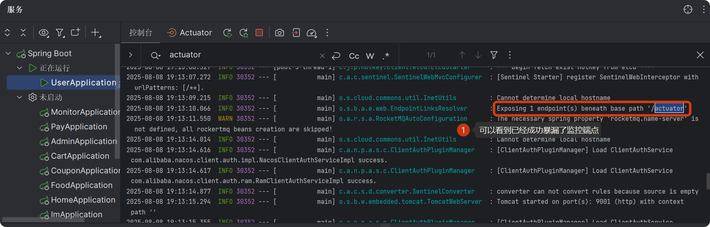

打开浏览器，输入用户服务端口暴漏的监控端点：[http://localhost:9001/actuator](http://localhost:9001/actuator)

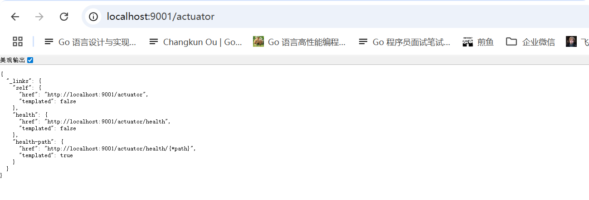

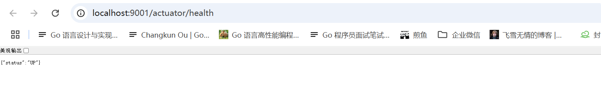

可以看到这里默认只暴漏了 health 端点，我们来配置让其暴漏更多的端点，直接修改 Nacos 的配置重启服务：

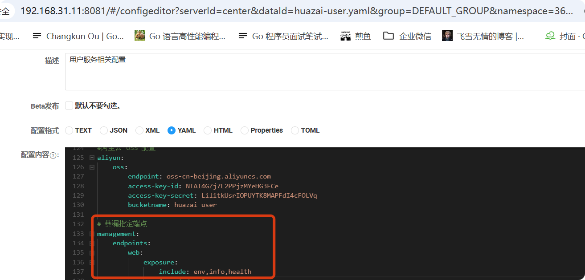

\# 暴漏指定端点

management:

endpoints:

web:

exposure:

include: env,info,health

查看最新的端点：

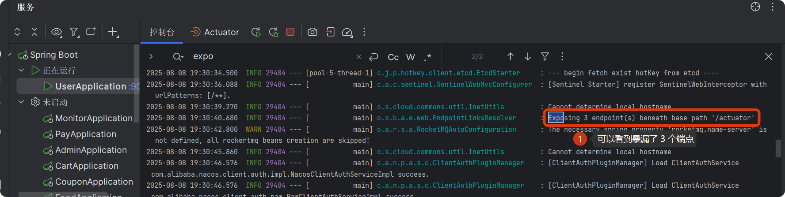

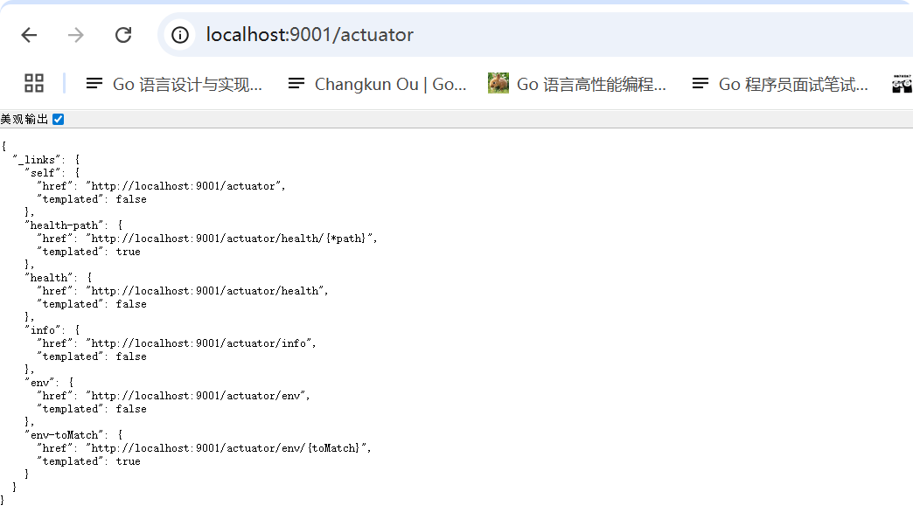

如果要暴漏全部的端点，可以将上面的配置项改为 \*：

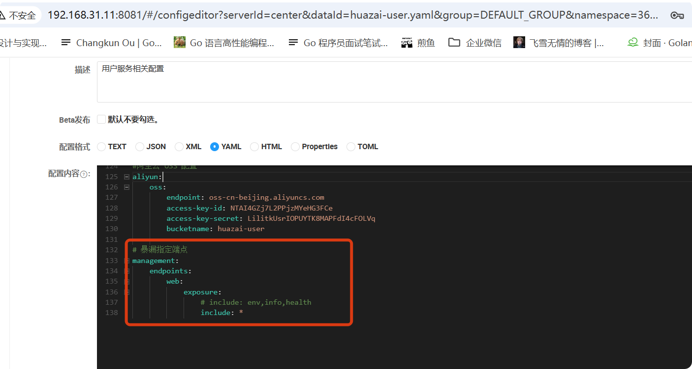

\# 暴漏指定端点

management:

endpoints:

web:

exposure:

include: "\*"

再次重启服务，查看最新的端点：

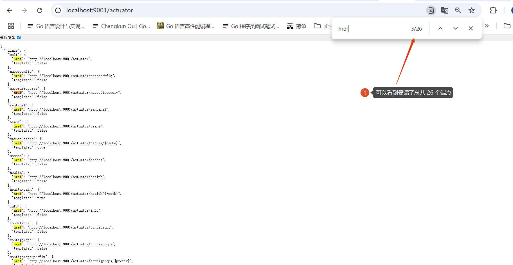

### **2.2.2 应用监控重点指标**

### **2.2.2.1 metrics**

它用来获取应用程序中所有可用的指标：[http://localhost:9001/actuator/metrics](http://localhost:9001/actuator/metrics)

{

"names": \[

"application.ready.time",

"application.started.time",

"disk.free",

"disk.total",

"executor.active",

"executor.completed",

"executor.pool.core",

"executor.pool.max",

"executor.pool.size",

"executor.queue.remaining",

"executor.queued",

"hikaricp.connections",

"hikaricp.connections.acquire",

"hikaricp.connections.active",

"hikaricp.connections.creation",

"hikaricp.connections.idle",

"hikaricp.connections.max",

"hikaricp.connections.min",

"hikaricp.connections.pending",

"hikaricp.connections.timeout",

"hikaricp.connections.usage",

"http.server.requests",

"jdbc.connections.max",

"jdbc.connections.min",

"jvm.buffer.count",

"jvm.buffer.memory.used",

"jvm.buffer.total.capacity",

"jvm.classes.loaded",

"jvm.classes.unloaded",

"jvm.gc.live.data.size",

"jvm.gc.max.data.size",

"jvm.gc.memory.allocated",

"jvm.gc.memory.promoted",

"jvm.gc.overhead",

"jvm.gc.pause",

"jvm.memory.committed",

"jvm.memory.max",

"jvm.memory.usage.after.gc",

"jvm.memory.used",

"jvm.threads.daemon",

"jvm.threads.live",

"jvm.threads.peak",

"jvm.threads.states",

"logback.events",

"process.cpu.usage",

"process.start.time",

"process.uptime",

"system.cpu.count",

"system.cpu.usage",

"tomcat.sessions.active.current",

"tomcat.sessions.active.max",

"tomcat.sessions.alive.max",

"tomcat.sessions.created",

"tomcat.sessions.expired",

"tomcat.sessions.rejected"

\]

}

我们查看下其中某个指标：

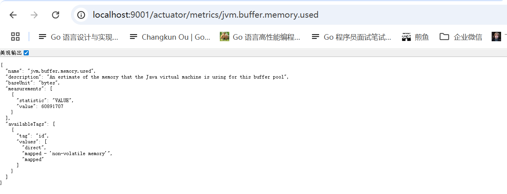

### **2.2.2.2 health**

它用来查询应用程序的整体健康状态信息：[http://localhost:9001/actuator/health](http://localhost:9001/actuator/health)

health 端点中常见的状态值及其定义：

1.  UP：应用程序健康状态良好，所有依赖都处于可用状态。
2.  DOWN：应用程序健康状态不佳，至少有一个依赖处于不可用状态。
3.  OUT\_OF\_SERVICE：应用程序无法提供服务，所有依赖项都处于不可用状态。
4.  UNKNOWN：应用程序健康状态未知，无法确定依赖项的状态。

很简单，可以看到这里是 UP 表示存活，但是不知道它内部是如何统计存活的，比如我这个服务要连接 MySQL

、Redis，它怎么知道服务是存活的，此时就可以增加健康检查统计明细：

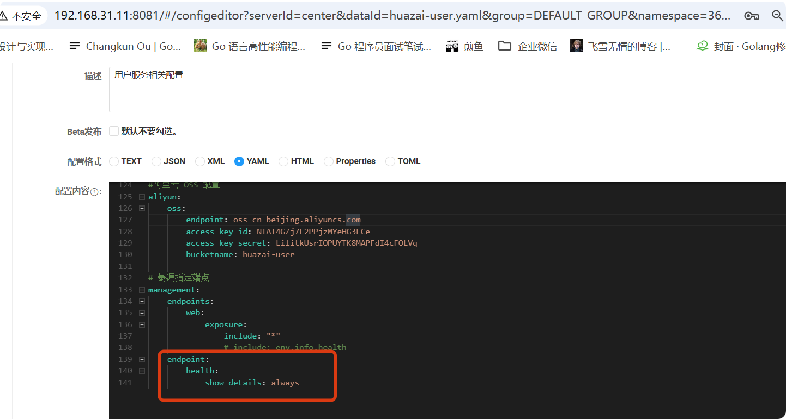

\# 暴漏指定端点

management:

endpoints:

web:

exposure:

include: "\*"

endpoint:

health:

show-details: always

重启服务后，再次查看 health 这个端点，发现详情信息已经给出了很多：

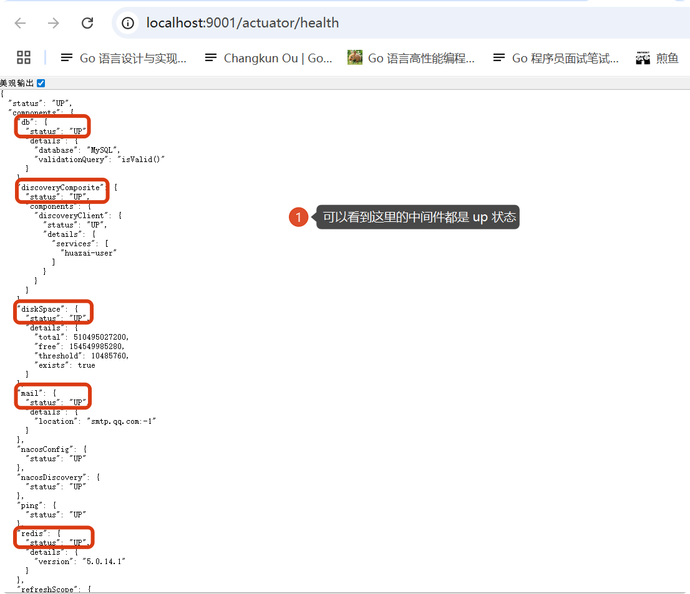

看到这里，大家是不是很好奇，它到底是怎么检测的呢？

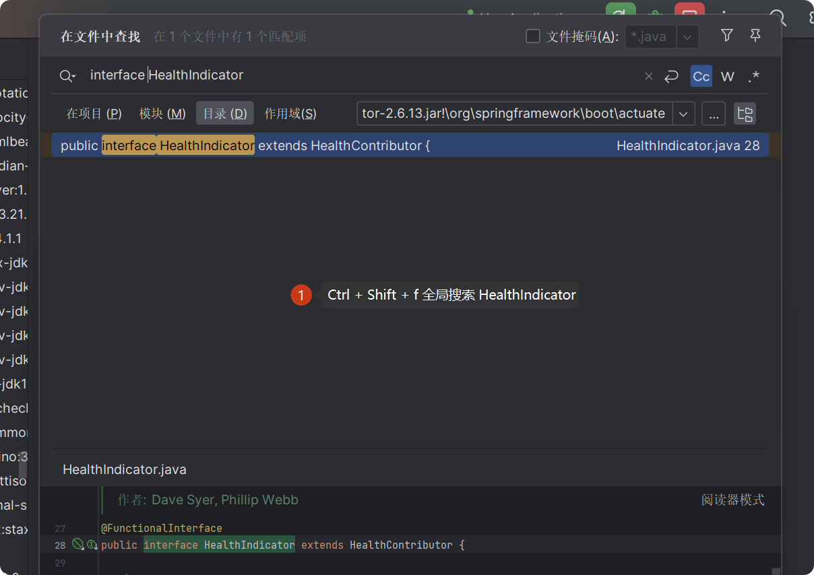

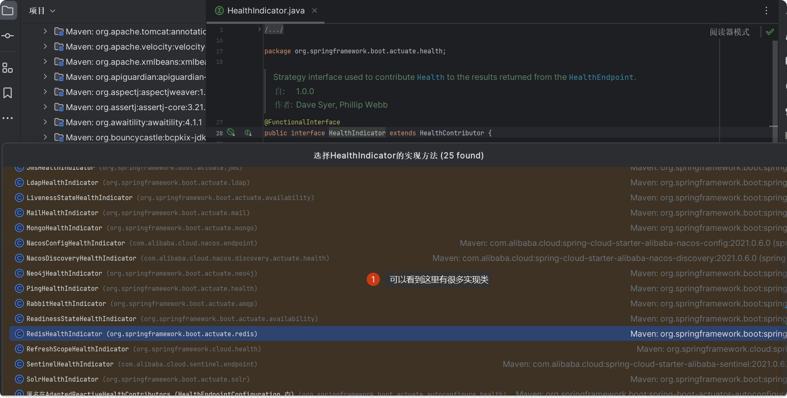

拿 Redis 为例：

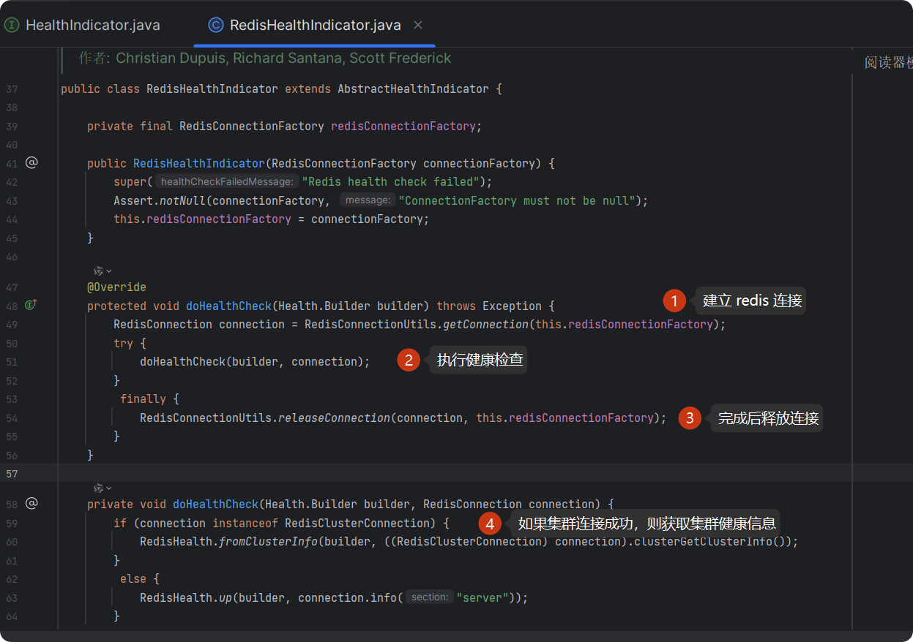

## **03 Prometheus 整合 Springboot 应用监控**

前面已经接入了 actuator 健康检查了，接下来我们需要接入 Prometheus 让其进行定时抓取健康检查指标数据。

## **3.1 Springboot prometheus 实战**

我们以「**用户服务**」为例来实战，其他的微服务一样的操作。

###   
**3.1.1 添加 Prometheus 依赖**

将以下依赖项添加到 common 包，点击 maven 刷新加载依赖。

<!-- 引入 prometheus 监控依赖-->

<dependency>

<groupId>io.micrometer</groupId>

<artifactId>micrometer-registry-prometheus</artifactId>

</dependency>

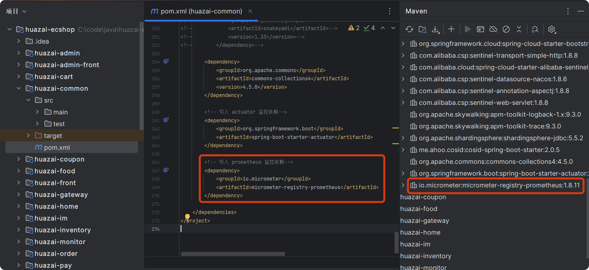

启动「**用户服务**」，查看 Prometheus 端点：[http://localhost:9001/actuator](http://localhost:9001/actuator)

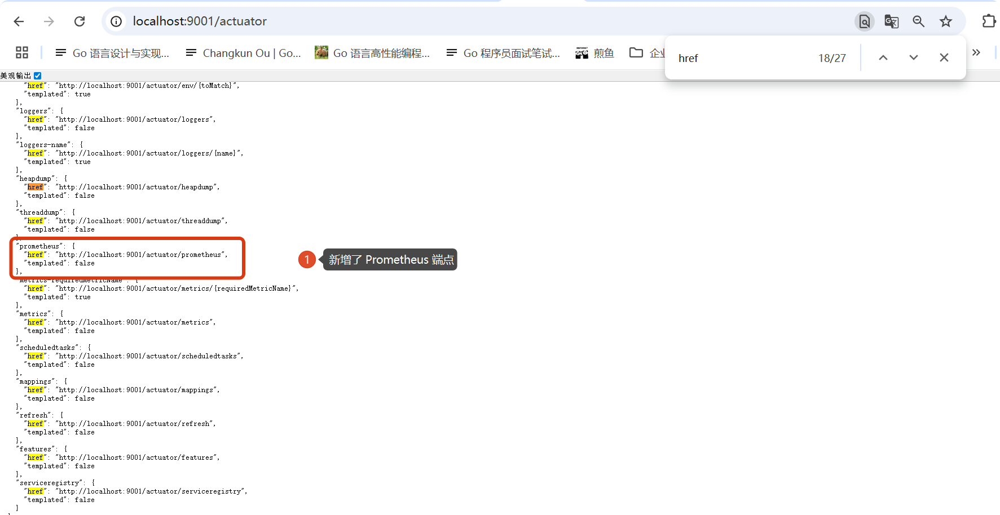

查看 Prometheus 端点详情：[http://localhost:9001/actuator/prometheus](http://localhost:9001/actuator/prometheus)

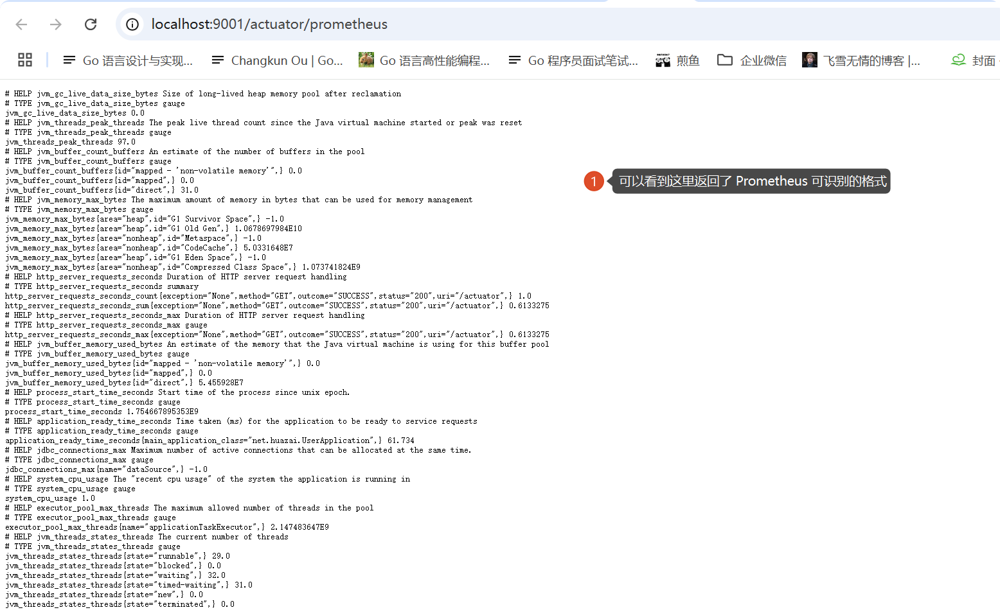

格式解读：

1.  HELP：解释具体指标含义。
2.  TYPE：解释具体指标类型。
3.  具体指标格式组成：指标名称{指标的 label 标签} 值。

###   
**3.1.2 添加 Prometheus Job 任务**

很简单，只需要在 Prometheus 服务器中添加被监控机器的配置即可，我们需要编辑 prometheus/prometheus.yml 文件，直接复制 prometheus 自带的 job 并修改如下：

  
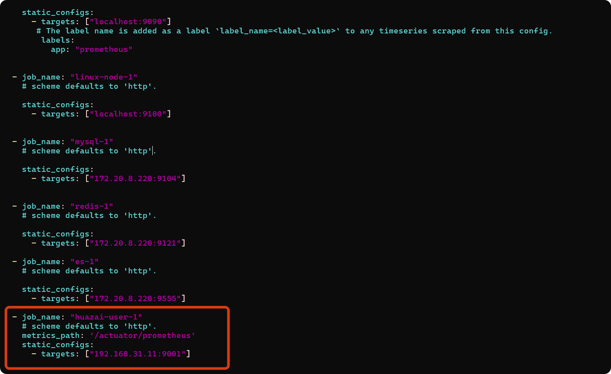

检测端点是否可以访问：

\# 这里改成自己的 ip

curl http://192.168.31.11:9001/actuator

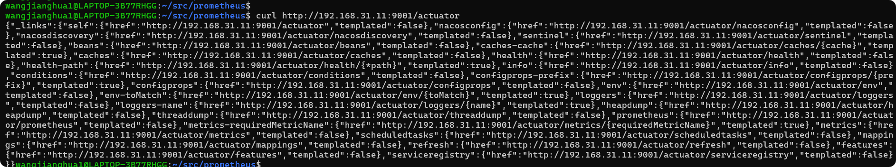

如何生效呢？在上篇 **Promethues 使用技巧** 已经讲过了：

\# 动态更新

curl -X POST http://localhost:9090/-/reload

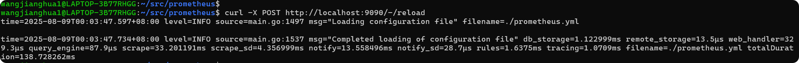

刷新访问 Web UI 界面的 target 和 configuration 是否有对应的配置信息，从下图可以看出此时就已经加载了最新的配置信息：

  
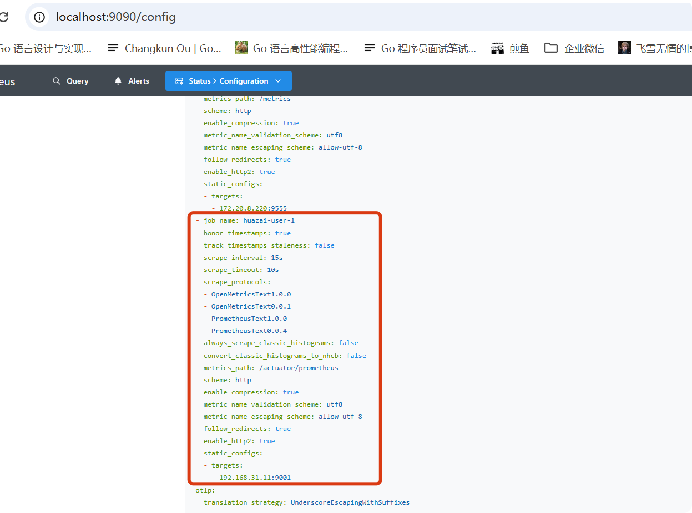

再来看下 target 界面：

  
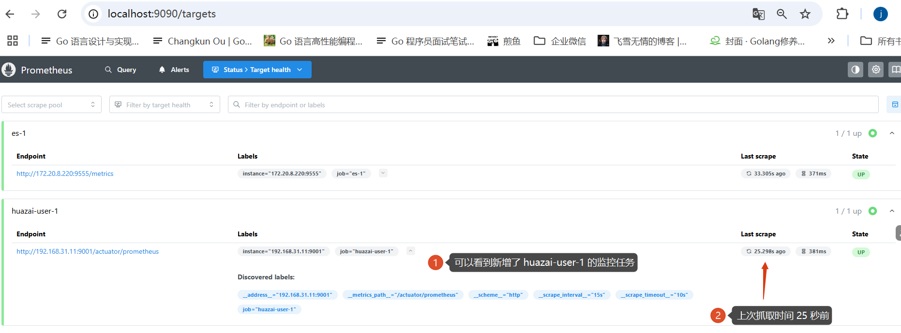

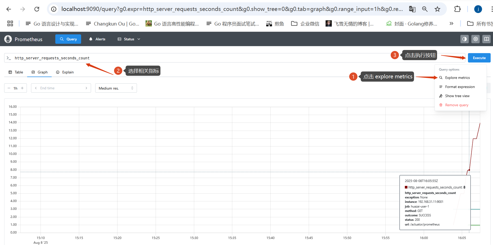

大家感兴趣可以查询其他的指标，这里就不展示了，至此就已经将业务应用微服务接入了 Prometheus，后续就可以基于 Grafana + Alertmanager 进行监控展示和告警了。