从今天之后的一段时间内，华仔会带着大家一起从零开始搭建并研发一套高并发的电商实战项目，这里会涉及到很多互联网大厂开发过程中所使用的核心技术和架构设计模式，希望大家学完之后可以用到自己的简历中。

这是第七十一篇，本篇我们来介绍整个电商实战项目中最重要的模块之一：「**库存服务之库存初始化及库存柔性式缓存分桶功能实现**」。

文章汇总位置：[https://wx.zsxq.com/dweb2/index/columns/51122554151214](https://wx.zsxq.com/dweb2/index/columns/51122554151214)

源码授权与获取地址：[https://articles.zsxq.com/id\_1s85grnaae4p.html](https://articles.zsxq.com/id_1s85grnaae4p.html)

本章源码地址：[https://gitcode.net/u011359591/huazai-ecshop/-/tree/ecshop-chapter-71](https://gitcode.net/u011359591/huazai-ecshop/-/tree/ecshop-chapter-71)

## **01 前言**

上篇 [【电商实战项目第七十篇】华仔电商实战库存服务业务场景介绍与架构设计](https://articles.zsxq.com/id_atv7dupfg0fl.html)，我们深度拆解了「**库存服务**」的业务场景以及其架构设计，今天我们就来开发一下「**库存服务之库存初始化及库存柔性式缓存分桶**」的功能。

##   
**02 库存服务模块搭建**

这里我们单独拆分出一个模块来做我们整个电商项目的 「**库存服务**」，后续可能会将跟「**库存**」相关的功能都迁移到这个服务中来实现。

在上篇中我们知道，「**库存服务**」并没有单独建立数据库，而是直接在 「**商品库**」中建的「**库存变更记录及明细记录表**」。

## **2.1 添加库存服务工程**

同之前一样，这里我们新增一个库存服务工程，如下：

  
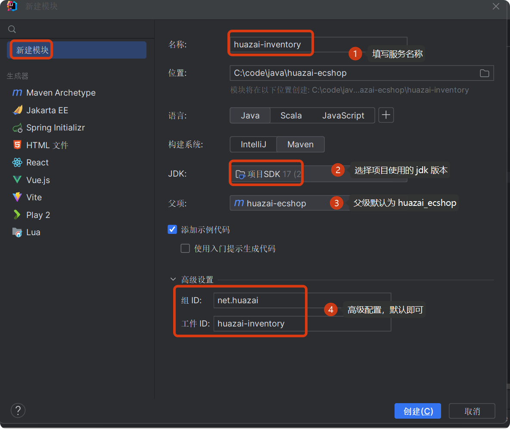

创建完就会聚合工程中自动添加 [huazai-inventory](http://huazai-inventory/) 的一个 module。

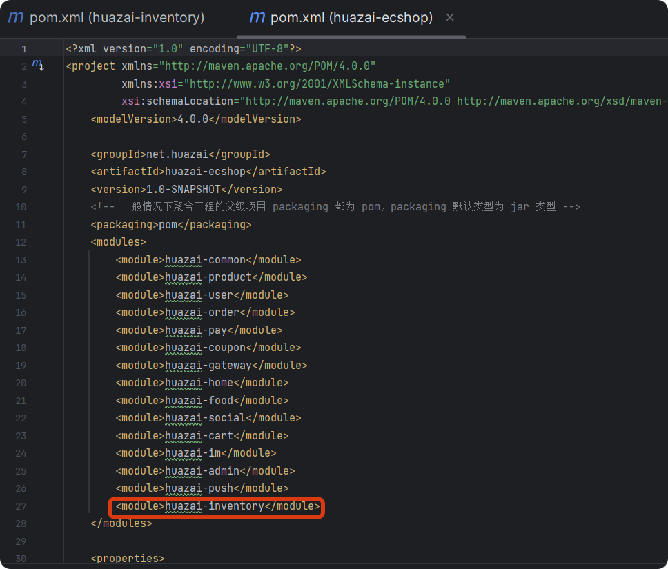

引入 common 包及相关依赖，如下：

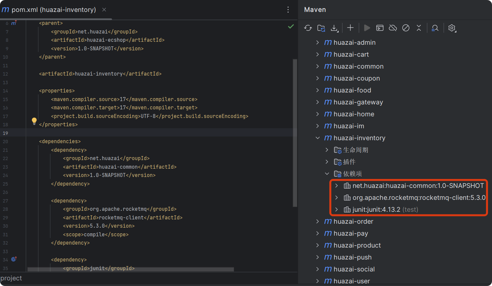

## **2.2 添加库存服务框架**

由于这里需要依赖 「**商品库**」，所以这里直接从「**商品服务**」拷贝部分代码结构过来，也可以通过 test 重新对应的模块框架，然后修改一下即可启动 「**库存服务**」了。

这里我们通过 test 生成新增的表 mapper，其他的直接从「**商品服务**」拷贝部分，然后修改一下。

###   
**2.2.1 添加启动类注解**

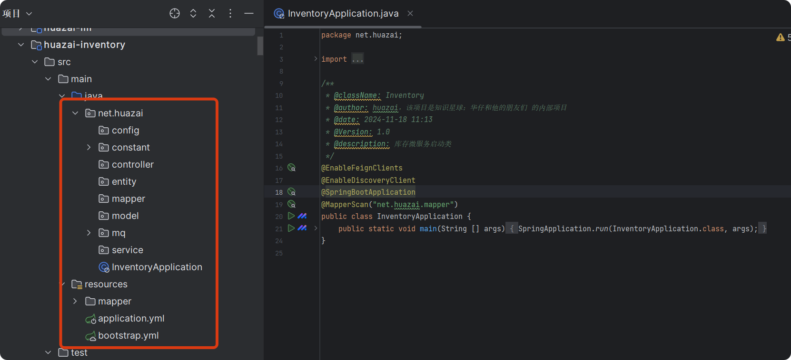

等这些基础步骤搞完后，就可以开发我们库存服务相关功能了。

## **03 库存初始化实现**

在后管商品服务中，添加/编辑商品时可以设置对应的 「**总库存**」、「**可售库存**」，如图：

  
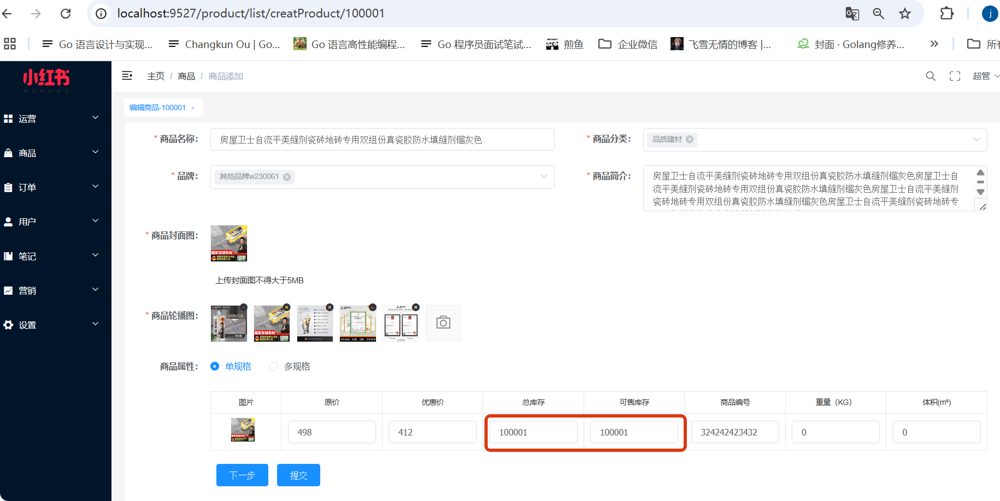

提交时会保存「**库存数据**」到 「**商品 sku 表**」中，在此我们进行改造，让其异步进行「**库存初始化**」。

在上篇中，我们已经展示「**库存数据**」是如何入库及如何分配「**缓存分桶**」的，如下图分两步操作。

  
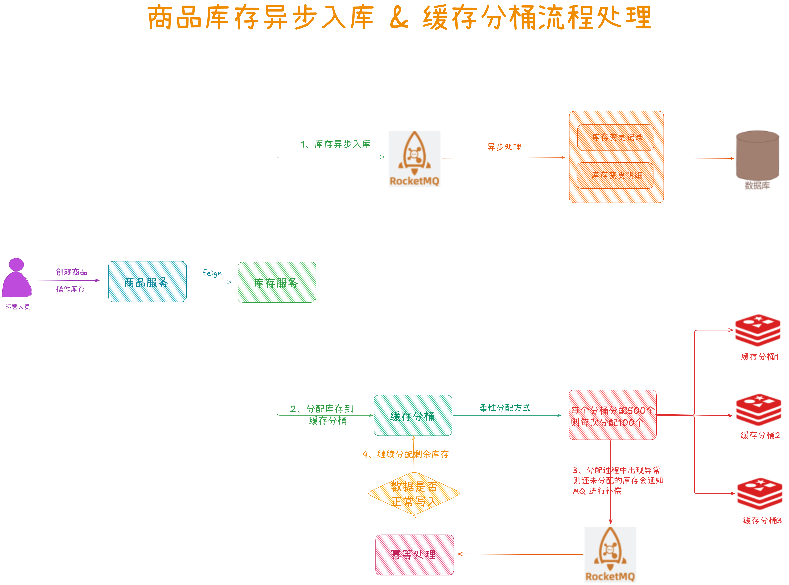

##   
**3.1 库存初始化**

这一小节，主要做第一步工作：库存通过 MQ 异步初始化入库。

首先在「**后管商品服务**」中「**添加/编辑**」商品提交时会进行「**初始化库存数据**」，如下：

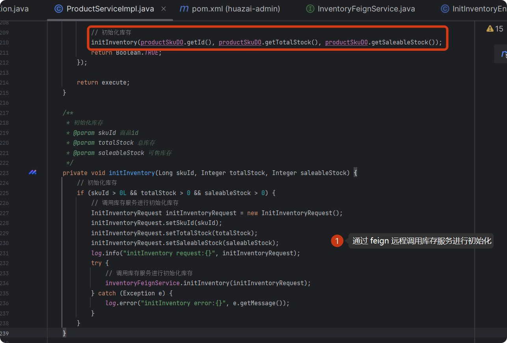

在「**库存服务**」中，会通过 MQ 进行异步处理。

  
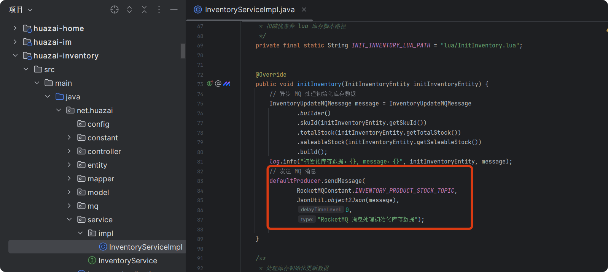

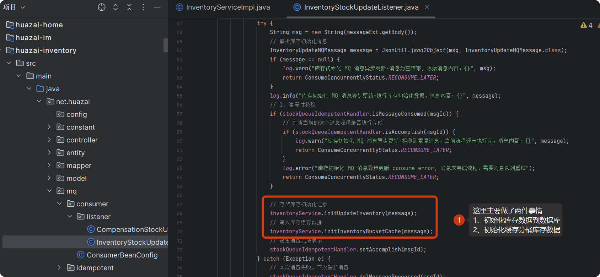

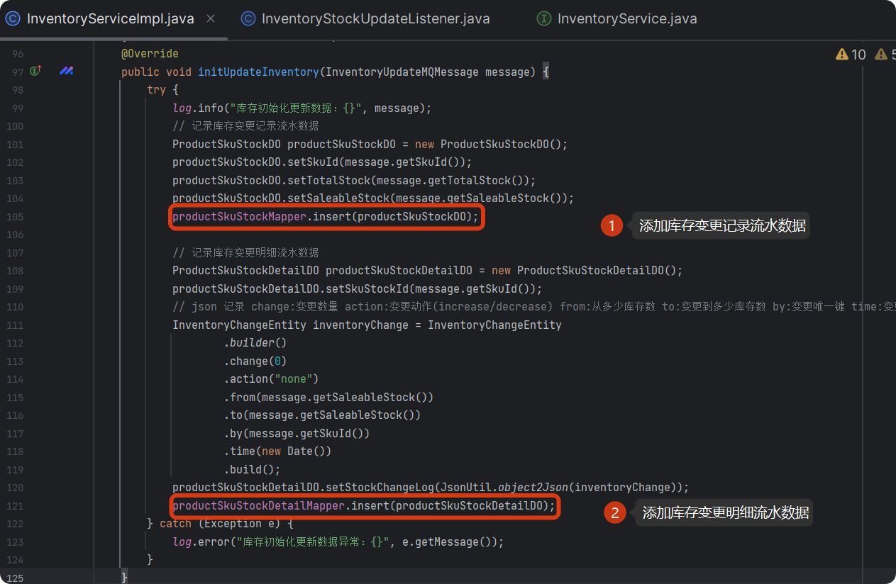

## **04 库存柔性缓存分桶方案实现**

整个柔性分配缓存分桶方案如下图所示：

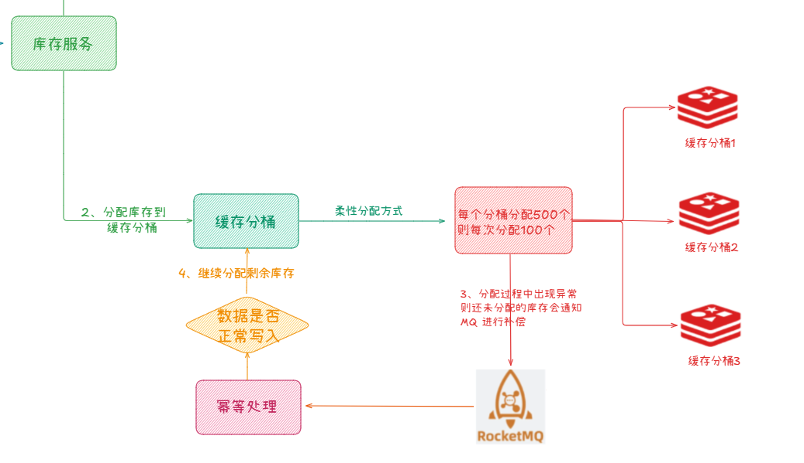

整个代码实现也不难，核心代码如下：

/\*\*

\* 初始化库存缓存

\* @Author huazai

\* @Description

\* @Date 18:24 2025-03-16

\* @Param message

\* @return void

\*\*/

public void initInventoryBucketCache(InventoryUpdateMQMessage message) {

Long skuId \= message.getSkuId();

// 判断商品是否存在

ProductSkuDO skuDO \= productSkuMapper.selectById(skuId);

if (skuDO == null) {

log.error("初始化库存数据 商品不存在：{}", skuId);

throw new RuntimeException("初始化库存数据 商品不存在：" + skuId);

}

// 获取总库存

int totalStock \= message.getTotalStock();

// 获取可售库存

int saleableStock \= message.getSaleableStock();

// 获取 redis 节点数量（分桶数）

int redisCount \= redisNodeManager.getActiveNodeCount();

// 缓存分桶库存键前缀 inventory:product\_stock:skuId:分桶id

String productStockKeyPrefix \= RedisKeyConstant.INVENTORY\_PRODUCT\_STOCK\_PREFIX + skuId + ":";

// 计算分桶配额

int\[\] bucketQuotas = calculateBucketQuotas(saleableStock, redisCount);

long startTime \= System.currentTimeMillis();

int totalAllocated \= 0;

// 动态计算分配批次大小

int batchSize \= calculateDynamicBatchSize(saleableStock, redisCount);

log.info("动态计算分配批次大小 sku:{} batchSize:{}", skuId, batchSize);

try {

for (int bucketId \= 0; bucketId < redisCount; bucketId++) {

// 缓存分桶库存键 inventory:product\_stock:skuId:分桶id

String bucketKey \= productStockKeyPrefix + bucketId;

// 获取分桶配额

int bucketQuota \= bucketQuotas\[bucketId\];

// 分桶已分配库存数量

int allocatedInBucket \= 0;

// 如果分桶已分配库存数量小于分桶配额会一直循环分配

while (allocatedInBucket < bucketQuota) {

int remainingQuota \= bucketQuota - allocatedInBucket;

int allocateNow \= Math.min(remainingQuota, batchSize);

log.info("库存分配 lua sku:{} remainingQuota:{} allocateNow:{} bucketQuota:{} allocatedInBucket:{}", skuId, remainingQuota, allocateNow, bucketQuota, allocatedInBucket);

// 3、这里采用一种全新的 lua 脚本加载方式，使用 Hutool 的单例管理容器进行保存，下次直接获取不需要加载

DefaultRedisScript<Long> luaScript = Singleton.get(INIT\_INVENTORY\_LUA\_PATH, () -> {

DefaultRedisScript<Long> redisScript = new DefaultRedisScript<>();

redisScript.setScriptSource(new ResourceScriptSource(new ClassPathResource(INIT\_INVENTORY\_LUA\_PATH)));

redisScript.setResultType(Long.class);

return redisScript;

});

List<String> keys = Arrays.asList(bucketKey);

Long added \= redisCache.executeDefault(luaScript, keys, String.valueOf(allocateNow), String.valueOf(bucketQuota));

log.info("库存分配结果，sku:{} keys:{} allocateNow:{} bucketQuota:{} added:{}", skuId, keys, allocateNow, bucketQuota, added);

if (added != null && added > 0) {

allocatedInBucket += added;

totalAllocated += added;

log.info("库存分配计算结果，sku:{} allocatedInBucket:{} totalAllocated:{}", skuId, allocatedInBucket, totalAllocated);

} else {

// 这里表示已经分配满额了，跳出循环

log.warn("库存模块-库存分配已完结，sku:{} bucket:{} saleableStock:{} totalAllocated:{}", skuId, bucketId, saleableStock, totalAllocated);

break;

}

}

}

log.info("库存分配完成，sku:{} 总量:{} 耗时:{}ms",

skuId, totalAllocated, System.currentTimeMillis()-startTime);

} catch (Exception e) {

e.printStackTrace();

// 同步过程中发生异常，去掉已被同步的缓存库存，补偿未成功分配的部分

int remaining \= saleableStock - totalAllocated;

if (remaining > 0) {

if (remaining != saleableStock) {

message.setSaleableStock(remaining);

sendCompensationMessage(message);

log.error("库存分配异常，sku:{} 已分配:{} 剩余待补偿:{}",

skuId, totalAllocated, remaining, e);

} else {

log.info("库存分配已完结，sku:{} 已分配:{} 剩余待补偿:{}",

skuId, saleableStock, totalAllocated, e);

}

}

}

}

/\*\*

\* 计算分桶配额（包含余数分配）

\* @param total 总库存

\* @param bucketCount 分桶数量

\* @return 每个分桶的配额数组

\*/

private int\[\] calculateBucketQuotas(int total, int bucketCount) {

int baseQuota \= total / bucketCount;

int remainder \= total % bucketCount;

int\[\] quotas = new int\[bucketCount\];

Arrays.fill(quotas, baseQuota);

for (int i \= 0; i < remainder; i++) {

quotas\[i\]++;

}

return quotas;

}

/\*\*

\* 动态计算分配批次大小（生产环境建议配置化）

\*/

private int calculateDynamicBatchSize(int totalInventory, int bucketCount) {

int avgPerBucket \= totalInventory / bucketCount;

if (avgPerBucket <= 100) { // 小库存直接单次分配

return avgPerBucket;

} else if (avgPerBucket <= 5000) { // 中等库存分10次

return Math.max(3, avgPerBucket / 10);

} else { // 大库存分50次且不超过500

return Math.min(500, avgPerBucket / 50);

}

}

/\*\*

\* 补偿消息发送（保证至少一次送达）

\* @param message

\*/

private void sendCompensationMessage(InventoryUpdateMQMessage message) {

// 发送消息到 MQ

log.info("库存初始化缓存分桶消息发送到MQ, topic: {}, InventoryRequest: {}", RocketMQConstant.COMPENSATION\_PRODUCT\_STOCK\_TOPIC, JsonUtil.object2Json(message));

defaultProducer.sendMessage(

RocketMQConstant.COMPENSATION\_PRODUCT\_STOCK\_TOPIC,

JsonUtil.object2Json(message),

0,

"库存初始化缓存分桶补偿消息");

}

这里需要一个获取 Redis 节点数的需求，这里我们自己实现了一个自动识别节点数方法。

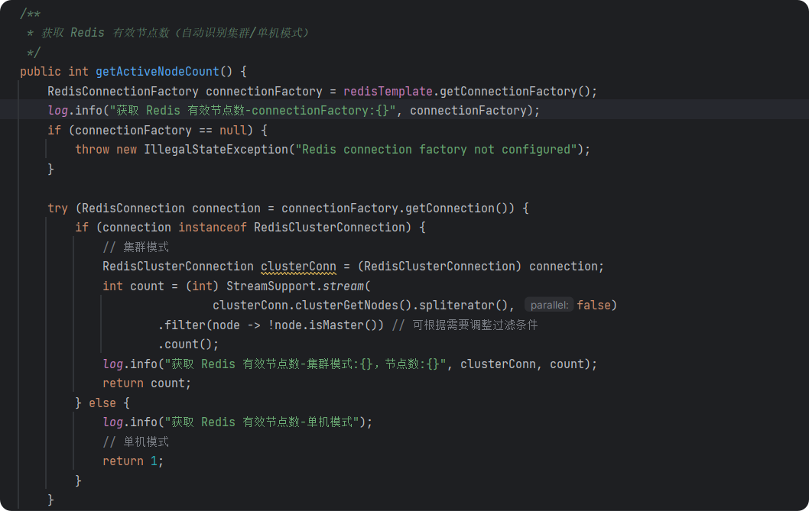

Lua 脚本如下： 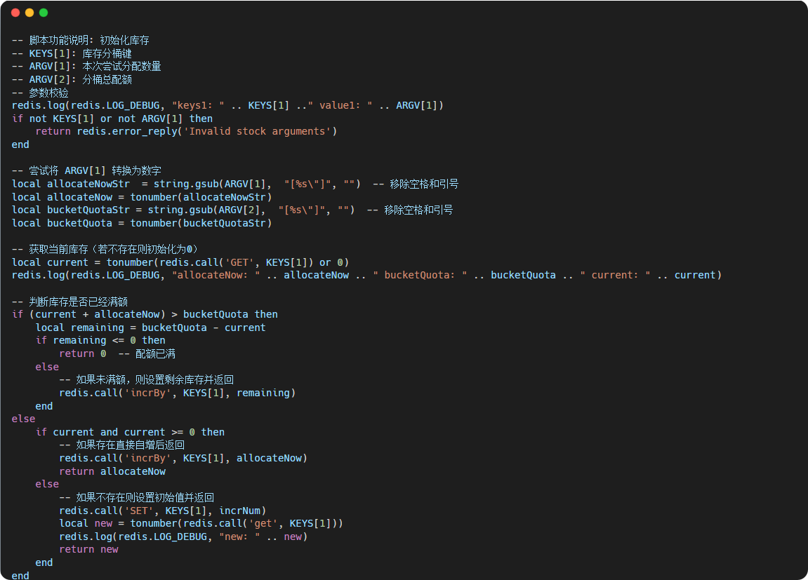

我本地目前是单 Redis 节点，后续部署时会搞一个 3 节点的 Redis Cluster 集群。

测试日志：

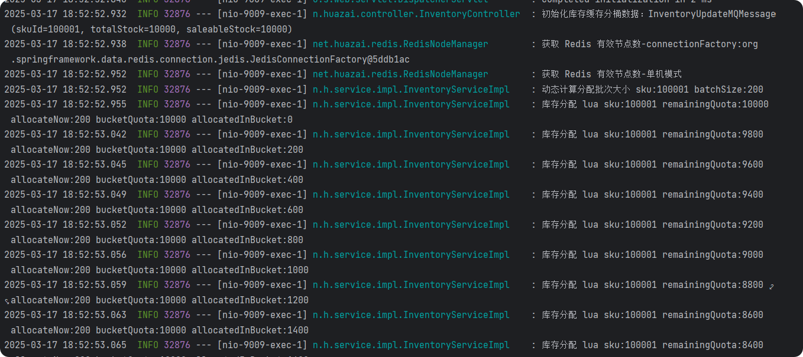

2025-03-17 18:52:52.932 INFO 32876 --- \[nio-9009-exec-1\] n.huazai.controller.InventoryController : 初始化库存缓存分桶数据：InventoryUpdateMQMessage(skuId=100001, totalStock=10000, saleableStock=10000)

2025-03-17 18:52:52.938 INFO 32876 --- \[nio-9009-exec-1\] net.huazai.redis.RedisNodeManager : 获取 Redis 有效节点数-connectionFactory:org.springframework.data.redis.connection.jedis.JedisConnectionFactory@5ddb1ac

2025-03-17 18:52:52.952 INFO 32876 --- \[nio-9009-exec-1\] net.huazai.redis.RedisNodeManager : 获取 Redis 有效节点数-单机模式

2025-03-17 18:52:52.952 INFO 32876 --- \[nio-9009-exec-1\] n.h.service.impl.InventoryServiceImpl : 动态计算分配批次大小 sku:100001 batchSize:200

2025-03-17 18:52:52.955 INFO 32876 --- \[nio-9009-exec-1\] n.h.service.impl.InventoryServiceImpl : 库存分配 lua sku:100001 remainingQuota:10000 allocateNow:200 bucketQuota:10000 allocatedInBucket:0

2025-03-17 18:52:53.042 INFO 32876 --- \[nio-9009-exec-1\] n.h.service.impl.InventoryServiceImpl : 库存分配 lua sku:100001 remainingQuota:9800 allocateNow:200 bucketQuota:10000 allocatedInBucket:200

2025-03-17 18:52:53.045 INFO 32876 --- \[nio-9009-exec-1\] n.h.service.impl.InventoryServiceImpl : 库存分配 lua sku:100001 remainingQuota:9600 allocateNow:200 bucketQuota:10000 allocatedInBucket:400

2025-03-17 18:52:53.049 INFO 32876 --- \[nio-9009-exec-1\] n.h.service.impl.InventoryServiceImpl : 库存分配 lua sku:100001 remainingQuota:9400 allocateNow:200 bucketQuota:10000 allocatedInBucket:600

2025-03-17 18:52:53.052 INFO 32876 --- \[nio-9009-exec-1\] n.h.service.impl.InventoryServiceImpl : 库存分配 lua sku:100001 remainingQuota:9200 allocateNow:200 bucketQuota:10000 allocatedInBucket:800

2025-03-17 18:52:53.056 INFO 32876 --- \[nio-9009-exec-1\] n.h.service.impl.InventoryServiceImpl : 库存分配 lua sku:100001 remainingQuota:9000 allocateNow:200 bucketQuota:10000 allocatedInBucket:1000

2025-03-17 18:52:53.059 INFO 32876 --- \[nio-9009-exec-1\] n.h.service.impl.InventoryServiceImpl : 库存分配 lua sku:100001 remainingQuota:8800 allocateNow:200 bucketQuota:10000 allocatedInBucket:1200

2025-03-17 18:52:53.063 INFO 32876 --- \[nio-9009-exec-1\] n.h.service.impl.InventoryServiceImpl : 库存分配 lua sku:100001 remainingQuota:8600 allocateNow:200 bucketQuota:10000 allocatedInBucket:1400

2025-03-17 18:52:53.065 INFO 32876 --- \[nio-9009-exec-1\] n.h.service.impl.InventoryServiceImpl : 库存分配 lua sku:100001 remainingQuota:8400 allocateNow:200 bucketQuota:10000 allocatedInBucket:1600

2025-03-17 18:52:53.068 INFO 32876 --- \[nio-9009-exec-1\] n.h.service.impl.InventoryServiceImpl : 库存分配 lua sku:100001 remainingQuota:8200 allocateNow:200 bucketQuota:10000 allocatedInBucket:1800

2025-03-17 18:52:53.070 INFO 32876 --- \[nio-9009-exec-1\] n.h.service.impl.InventoryServiceImpl : 库存分配 lua sku:100001 remainingQuota:8000 allocateNow:200 bucketQuota:10000 allocatedInBucket:2000

2025-03-17 18:52:53.073 INFO 32876 --- \[nio-9009-exec-1\] n.h.service.impl.InventoryServiceImpl : 库存分配 lua sku:100001 remainingQuota:7800 allocateNow:200 bucketQuota:10000 allocatedInBucket:2200

2025-03-17 18:52:53.076 INFO 32876 --- \[nio-9009-exec-1\] n.h.service.impl.InventoryServiceImpl : 库存分配 lua sku:100001 remainingQuota:7600 allocateNow:200 bucketQuota:10000 allocatedInBucket:2400

2025-03-17 18:52:53.080 INFO 32876 --- \[nio-9009-exec-1\] n.h.service.impl.InventoryServiceImpl : 库存分配 lua sku:100001 remainingQuota:7400 allocateNow:200 bucketQuota:10000 allocatedInBucket:2600

2025-03-17 18:52:53.109 INFO 32876 --- \[nio-9009-exec-1\] n.h.service.impl.InventoryServiceImpl : 库存分配 lua sku:100001 remainingQuota:7200 allocateNow:200 bucketQuota:10000 allocatedInBucket:2800

2025-03-17 18:52:53.112 INFO 32876 --- \[nio-9009-exec-1\] n.h.service.impl.InventoryServiceImpl : 库存分配 lua sku:100001 remainingQuota:7000 allocateNow:200 bucketQuota:10000 allocatedInBucket:3000

2025-03-17 18:52:53.116 INFO 32876 --- \[nio-9009-exec-1\] n.h.service.impl.InventoryServiceImpl : 库存分配 lua sku:100001 remainingQuota:6800 allocateNow:200 bucketQuota:10000 allocatedInBucket:3200

2025-03-17 18:52:53.120 INFO 32876 --- \[nio-9009-exec-1\] n.h.service.impl.InventoryServiceImpl : 库存分配 lua sku:100001 remainingQuota:6600 allocateNow:200 bucketQuota:10000 allocatedInBucket:3400

2025-03-17 18:52:53.122 INFO 32876 --- \[nio-9009-exec-1\] n.h.service.impl.InventoryServiceImpl : 库存分配 lua sku:100001 remainingQuota:6400 allocateNow:200 bucketQuota:10000 allocatedInBucket:3600

2025-03-17 18:52:53.125 INFO 32876 --- \[nio-9009-exec-1\] n.h.service.impl.InventoryServiceImpl : 库存分配 lua sku:100001 remainingQuota:6200 allocateNow:200 bucketQuota:10000 allocatedInBucket:3800

2025-03-17 18:52:53.128 INFO 32876 --- \[nio-9009-exec-1\] n.h.service.impl.InventoryServiceImpl : 库存分配 lua sku:100001 remainingQuota:6000 allocateNow:200 bucketQuota:10000 allocatedInBucket:4000

2025-03-17 18:52:53.130 INFO 32876 --- \[nio-9009-exec-1\] n.h.service.impl.InventoryServiceImpl : 库存分配 lua sku:100001 remainingQuota:5800 allocateNow:200 bucketQuota:10000 allocatedInBucket:4200

2025-03-17 18:52:53.132 INFO 32876 --- \[nio-9009-exec-1\] n.h.service.impl.InventoryServiceImpl : 库存分配 lua sku:100001 remainingQuota:5600 allocateNow:200 bucketQuota:10000 allocatedInBucket:4400

2025-03-17 18:52:53.135 INFO 32876 --- \[nio-9009-exec-1\] n.h.service.impl.InventoryServiceImpl : 库存分配 lua sku:100001 remainingQuota:5400 allocateNow:200 bucketQuota:10000 allocatedInBucket:4600

2025-03-17 18:52:53.136 INFO 32876 --- \[nio-9009-exec-1\] n.h.service.impl.InventoryServiceImpl : 库存分配 lua sku:100001 remainingQuota:5200 allocateNow:200 bucketQuota:10000 allocatedInBucket:4800

2025-03-17 18:52:53.139 INFO 32876 --- \[nio-9009-exec-1\] n.h.service.impl.InventoryServiceImpl : 库存分配 lua sku:100001 remainingQuota:5000 allocateNow:200 bucketQuota:10000 allocatedInBucket:5000

2025-03-17 18:52:53.141 INFO 32876 --- \[nio-9009-exec-1\] n.h.service.impl.InventoryServiceImpl : 库存分配 lua sku:100001 remainingQuota:4800 allocateNow:200 bucketQuota:10000 allocatedInBucket:5200

2025-03-17 18:52:53.144 INFO 32876 --- \[nio-9009-exec-1\] n.h.service.impl.InventoryServiceImpl : 库存分配 lua sku:100001 remainingQuota:4600 allocateNow:200 bucketQuota:10000 allocatedInBucket:5400

2025-03-17 18:52:53.146 INFO 32876 --- \[nio-9009-exec-1\] n.h.service.impl.InventoryServiceImpl : 库存分配 lua sku:100001 remainingQuota:4400 allocateNow:200 bucketQuota:10000 allocatedInBucket:5600

2025-03-17 18:52:53.149 INFO 32876 --- \[nio-9009-exec-1\] n.h.service.impl.InventoryServiceImpl : 库存分配 lua sku:100001 remainingQuota:4200 allocateNow:200 bucketQuota:10000 allocatedInBucket:5800

2025-03-17 18:52:53.151 INFO 32876 --- \[nio-9009-exec-1\] n.h.service.impl.InventoryServiceImpl : 库存分配 lua sku:100001 remainingQuota:4000 allocateNow:200 bucketQuota:10000 allocatedInBucket:6000

2025-03-17 18:52:53.152 INFO 32876 --- \[nio-9009-exec-1\] n.h.service.impl.InventoryServiceImpl : 库存分配 lua sku:100001 remainingQuota:3800 allocateNow:200 bucketQuota:10000 allocatedInBucket:6200

2025-03-17 18:52:53.155 INFO 32876 --- \[nio-9009-exec-1\] n.h.service.impl.InventoryServiceImpl : 库存分配 lua sku:100001 remainingQuota:3600 allocateNow:200 bucketQuota:10000 allocatedInBucket:6400

2025-03-17 18:52:53.156 INFO 32876 --- \[nio-9009-exec-1\] n.h.service.impl.InventoryServiceImpl : 库存分配 lua sku:100001 remainingQuota:3400 allocateNow:200 bucketQuota:10000 allocatedInBucket:6600

2025-03-17 18:52:53.160 INFO 32876 --- \[nio-9009-exec-1\] n.h.service.impl.InventoryServiceImpl : 库存分配 lua sku:100001 remainingQuota:3200 allocateNow:200 bucketQuota:10000 allocatedInBucket:6800

2025-03-17 18:52:53.162 INFO 32876 --- \[nio-9009-exec-1\] n.h.service.impl.InventoryServiceImpl : 库存分配 lua sku:100001 remainingQuota:3000 allocateNow:200 bucketQuota:10000 allocatedInBucket:7000

2025-03-17 18:52:53.163 INFO 32876 --- \[nio-9009-exec-1\] n.h.service.impl.InventoryServiceImpl : 库存分配 lua sku:100001 remainingQuota:2800 allocateNow:200 bucketQuota:10000 allocatedInBucket:7200

2025-03-17 18:52:53.166 INFO 32876 --- \[nio-9009-exec-1\] n.h.service.impl.InventoryServiceImpl : 库存分配 lua sku:100001 remainingQuota:2600 allocateNow:200 bucketQuota:10000 allocatedInBucket:7400

2025-03-17 18:52:53.168 INFO 32876 --- \[nio-9009-exec-1\] n.h.service.impl.InventoryServiceImpl : 库存分配 lua sku:100001 remainingQuota:2400 allocateNow:200 bucketQuota:10000 allocatedInBucket:7600

2025-03-17 18:52:53.171 INFO 32876 --- \[nio-9009-exec-1\] n.h.service.impl.InventoryServiceImpl : 库存分配 lua sku:100001 remainingQuota:2200 allocateNow:200 bucketQuota:10000 allocatedInBucket:7800

2025-03-17 18:52:53.172 INFO 32876 --- \[nio-9009-exec-1\] n.h.service.impl.InventoryServiceImpl : 库存分配 lua sku:100001 remainingQuota:2000 allocateNow:200 bucketQuota:10000 allocatedInBucket:8000

2025-03-17 18:52:53.174 INFO 32876 --- \[nio-9009-exec-1\] n.h.service.impl.InventoryServiceImpl : 库存分配 lua sku:100001 remainingQuota:1800 allocateNow:200 bucketQuota:10000 allocatedInBucket:8200

2025-03-17 18:52:53.175 INFO 32876 --- \[nio-9009-exec-1\] n.h.service.impl.InventoryServiceImpl : 库存分配 lua sku:100001 remainingQuota:1600 allocateNow:200 bucketQuota:10000 allocatedInBucket:8400

2025-03-17 18:52:53.178 INFO 32876 --- \[nio-9009-exec-1\] n.h.service.impl.InventoryServiceImpl : 库存分配 lua sku:100001 remainingQuota:1400 allocateNow:200 bucketQuota:10000 allocatedInBucket:8600

2025-03-17 18:52:53.179 INFO 32876 --- \[nio-9009-exec-1\] n.h.service.impl.InventoryServiceImpl : 库存分配 lua sku:100001 remainingQuota:1200 allocateNow:200 bucketQuota:10000 allocatedInBucket:8800

2025-03-17 18:52:53.182 INFO 32876 --- \[nio-9009-exec-1\] n.h.service.impl.InventoryServiceImpl : 库存分配 lua sku:100001 remainingQuota:1000 allocateNow:200 bucketQuota:10000 allocatedInBucket:9000

2025-03-17 18:52:53.184 INFO 32876 --- \[nio-9009-exec-1\] n.h.service.impl.InventoryServiceImpl : 库存分配 lua sku:100001 remainingQuota:800 allocateNow:200 bucketQuota:10000 allocatedInBucket:9200

2025-03-17 18:52:53.185 INFO 32876 --- \[nio-9009-exec-1\] n.h.service.impl.InventoryServiceImpl : 库存分配 lua sku:100001 remainingQuota:600 allocateNow:200 bucketQuota:10000 allocatedInBucket:9400

2025-03-17 18:52:53.187 INFO 32876 --- \[nio-9009-exec-1\] n.h.service.impl.InventoryServiceImpl : 库存分配 lua sku:100001 remainingQuota:400 allocateNow:200 bucketQuota:10000 allocatedInBucket:9600

2025-03-17 18:52:53.189 INFO 32876 --- \[nio-9009-exec-1\] n.h.service.impl.InventoryServiceImpl : 库存分配 lua sku:100001 remainingQuota:200 allocateNow:200 bucketQuota:10000 allocatedInBucket:9800

2025-03-17 18:52:53.190 INFO 32876 --- \[nio-9009-exec-1\] n.h.service.impl.InventoryServiceImpl : 库存分配完成，sku:100001 总量:10000 耗时:238ms

Redis 结果：

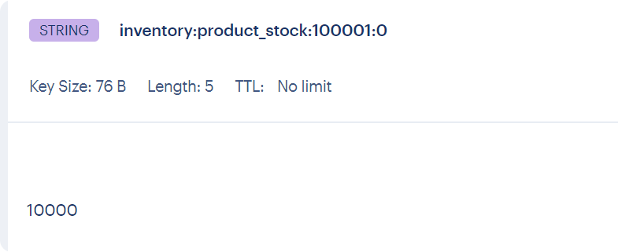

## **3.3 查询当前剩余可售库存**

这里使用 pipeline 技术来批量获取：

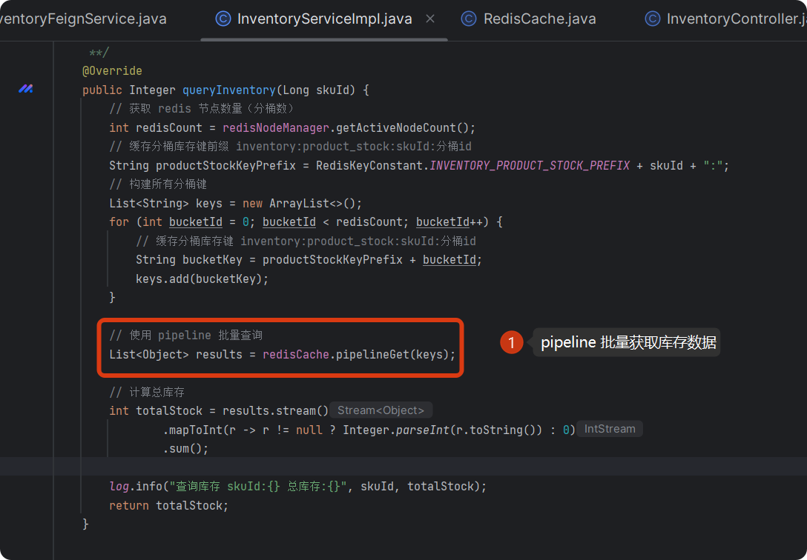

查询日志如下：

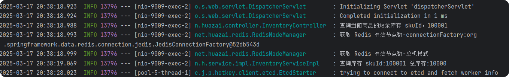