从今天之后的一段时间内，华仔会带着大家一起从零开始搭建并研发一套高并发的电商实战项目，这里会涉及到很多互联网大厂开发过程中所使用的核心技术和架构设计模式，希望大家学完之后可以用到自己的简历中。

这是第七十七篇，本篇我们来介绍整个电商实战项目中最重要的模块之一：「**订单服务核心链路取消订单流程**」的设计与功能实现。

文章汇总位置：[https://wx.zsxq.com/dweb2/index/columns/51122554151214](https://wx.zsxq.com/dweb2/index/columns/51122554151214)

源码授权与获取地址：[https://articles.zsxq.com/id\_1s85grnaae4p.html](https://articles.zsxq.com/id_1s85grnaae4p.html)

本章源码地址：[https://gitcode.net/u011359591/huazai-ecshop/-/tree/ecshop-chapter-77](https://gitcode.net/u011359591/huazai-ecshop/-/tree/ecshop-chapter-77)

## **01 前言**

通过前面 [【电商实战项目第七十三篇】华仔电商实战订单服务业务场景介绍与架构设计](https://articles.zsxq.com/id_7n1znf4mnd0b.html)，[【电商实战项目第七十五篇】华仔电商实战订单服务核心链路面临的技术挑战与解决方案](https://articles.zsxq.com/id_vn41o1wlhmgs.html)，我们把「**订单服务**」相关业务场景、技术架构、技术挑战、解决方案都介绍了一遍，在 [【电商实战项目第七十六篇】华仔电商实战订单服务核心链路生单流程基于 RocketMQ 事务消息架构设计与功能实现](https://articles.zsxq.com/id_euh6q0p89qu9.html) 上篇我们来重点梳理下整个电商实战项目中「**订单服务核心链路生单流程**」的设计与功能实现，今天我们来重点梳理下整个电商实战项目中「**订单服务核心链路取消订单流程**」的设计与功能实现。

##   
**02 取消订单流程设计与功能实现**

## **2.1 取消订单流程设计**

先来看下整个「**订单服务核心链路取消订单流程**」处理的时序图，如下：

  

  
在这个过程中，会涉及到「**多个核心服务链路交互**」，「**释放优惠券**」是本次要做的功能，「**库存预扣减还原**」已经在上篇「**生单流程事务回滚**」中剖析过了，这里还会继续剖析。

整个链路相对「**生单流程**」要简单些，为了保证「**订单取消**」和「**库存回退/优惠券释放**」的数据一致性，我们采用 RocketMQ 事务消息来整个链路交互，当订单取消后，订单状态会变成「**CLOSED**」。closeType 为「**CANCEL**」。

## **2.2 RocketMQ 事务消息介绍**

关于事务消息原理和源码实现，可以查看：[【原理分析系列第十四篇】图解 RocketMQ 事务消息架构设计](https://articles.zsxq.com/id_rt6sfotg7xsl.html)、[【Broker端源码分析系列第二十九篇】图解 RocketMQ 源码之 Broker 端事务消息架构设计剖析](https://articles.zsxq.com/id_kotf3fj9vw42.html)

### **2.2.1 事务消息最终一致性**

普通消息方案中，「**普通消息**」\+ 「**订单事务**」无法保证一致的原因，本质上是由于「**普通消息**」无法像单机数据库事务一样，具备提交、回滚和统一协调的能力。

而基于 RocketMQ 「**事务消息**」功能，在「**普通消息**」基础上，支持二阶段的提交能力。将二阶段提交和本地事务绑定，实现全局提交结果的一致性。

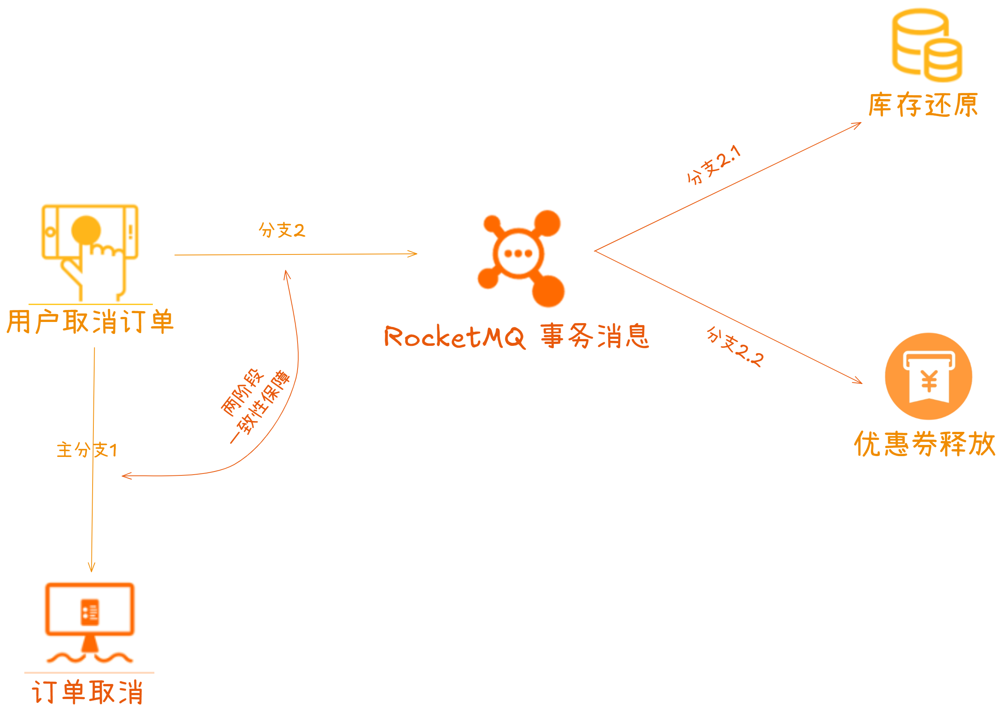

### **2.2.2 事务消息实现原理**

事务消息交互流程如下图所示：

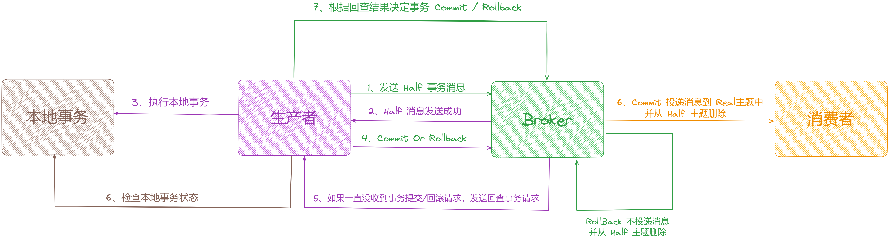

1.  生产者将消息发送至消息队列 RocketMQ Broker 服务端。
2.  消息队列 RocketMQ Broker 服务端将消息持久化成功之后，向生产者返回 Ack 确认消息已经发送成功，此时消息被标记为“暂不能投递”，这种状态下的消息即为半事务消息。
3.  生产者开始执行本地事务逻辑。
4.  生产者根据本地事务执行结果向 Broker 服务端提交二次确认结果（Commit 或是 Rollback）， Broker 服务端收到确认结果后处理逻辑如下：
5.  二次确认结果为 Commit： Broker 服务端将半事务消息标记为可投递，并投递给消费者。
6.  二次确认结果为 Rollback： Broker 服务端将回滚事务，不会将半事务消息投递给消费者。
7.  在断网或者是生产者应用重启的特殊情况下，如果 Broker 服务端未收到发送者提交的二次确认结果，或 Broker 服务端收到的二次确认结果为 Unknown 未知状态，经过固定时间后， Broker 服务端将对消息生产者即生产者集群中任一生产者实例发起消息回查。
8.  生产者收到消息回查后，需要检查对应消息的本地事务执行的最终结果。
9.  生产者根据检查到的本地事务的最终状态再次提交二次确认， Broker 服务端仍按照步骤 4 对半事务消息进行处理。

### **2.2.3 事务消息客户端**

在 [【电商实战项目第七十六篇】华仔电商实战订单服务核心链路生单流程基于 RocketMQ 事务消息架构设计与功能实现](https://articles.zsxq.com/id_euh6q0p89qu9.html) 上篇中, 我们已经详细的剖析过了，不了解的可以点击链接查看 **2.5.2.7 节内容**。

## **2.3 取消订单功能实现**

在发送「**事务消息**」之前，需要先创建 「**事务消息**」Topic，否则发送的消息不是 「**事务消息**」。

### **2.3.1 创建事务消息 Topic**

这里需要在 RocketMQ 控制台创建「**事务消息**」 Topic，如果是代码自动创建的会是一个「**未指定类型消息**」Topic，默认就是「**普通消息**」。

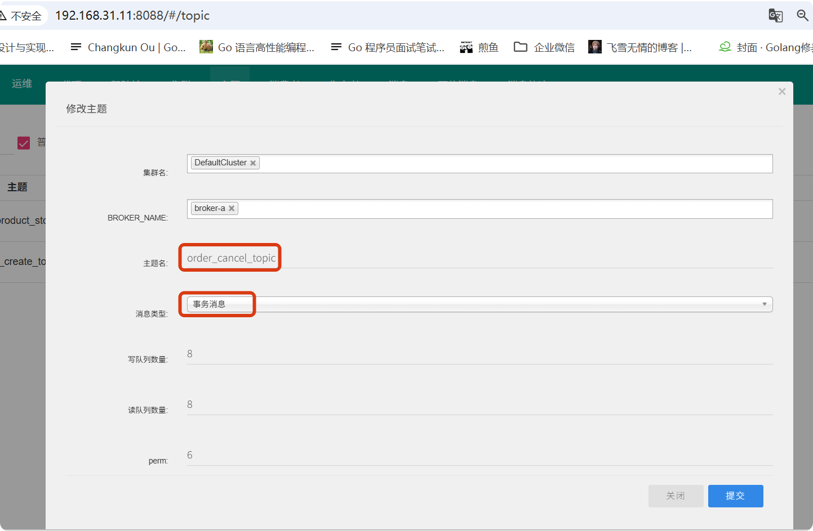

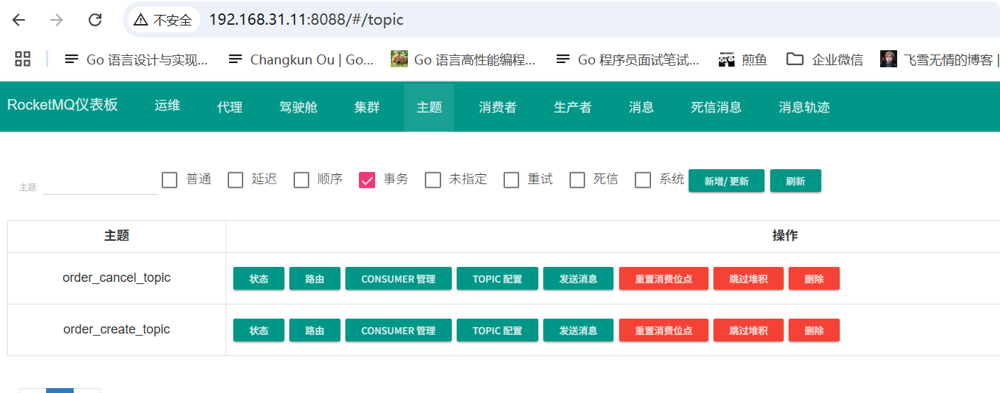

### **2.3.2 发送取消订单消息**

发送「**取消订单事务消息**」之前，先来看下「**取消订单**」请求结构，这里为了方便后续「**订单支付**」、「**超时关单**」、「**订单完成**」统一管理，进行了抽象。

  
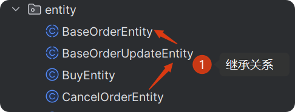

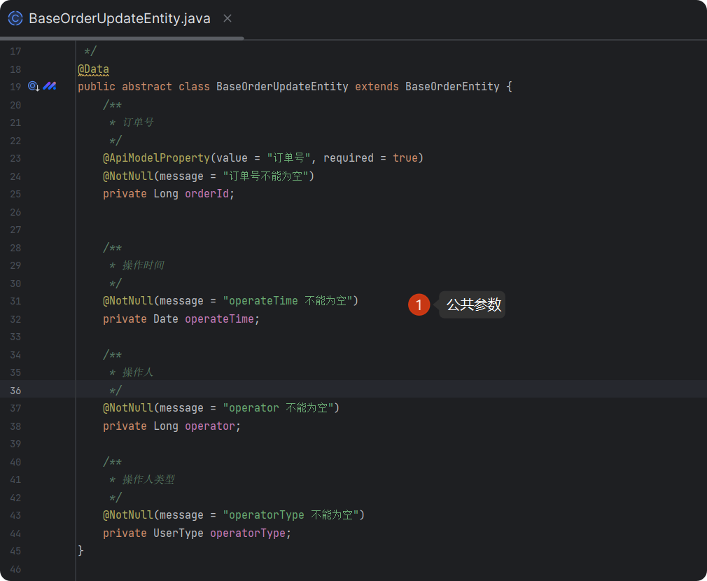

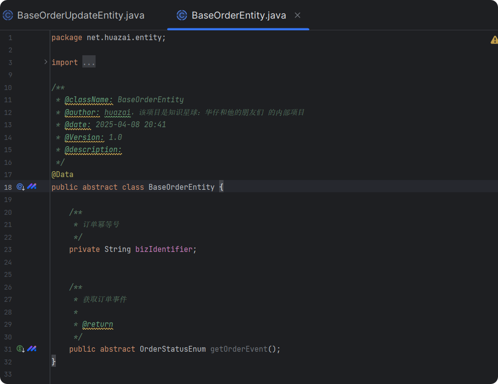

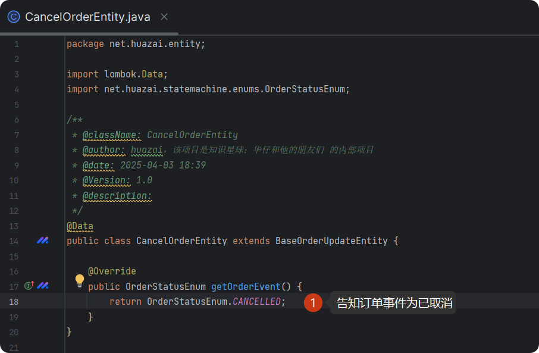

了解完「**取消订单请求结构体**」后，就可以正常处理发送「**取消订单事务半消息**」了。

/\*\*

\* 取消订单

\* @param cancelOrderEntity

\* @return

\*/

@Override

public Boolean cancelOrder(CancelOrderEntity cancelOrderEntity) {

log.info("订单模块-取消订单开始，订单信息：{}", cancelOrderEntity);

/\*\*

\* 获取当前登录用户作为买家id

\*/

// TODO 后续使用 Redis 分布式缓存替代

LoginUser loginUser \= LoginInterceptor.threadLocal.get();

// 订单号是唯一的，取消订单这里将订单号作为订单幂等号

cancelOrderEntity.setBizIdentifier(cancelOrderEntity.getOrderId().toString());

cancelOrderEntity.setOperateTime(new Date());

cancelOrderEntity.setOperator(loginUser.getId());

// 这里是用户自己取消的，所以用户类型是用户

cancelOrderEntity.setOperatorType(UserType.CUSTOMER);

/\*\*

\* 发送订单取消事务消息到 MQ，通过 MQ 异步处理订单取消、释放优惠券、还原库存等逻辑

\*/

sendCancelOrderMessage(cancelOrderEntity);

return true;

}

/\*\*

\* 发送订单取消事务消息到 MQ，通过 MQ 异步处理订单取消、释放优惠券、还原库存等逻辑

\* @param cancelOrderEntity

\*/

private void sendCancelOrderMessage(CancelOrderEntity cancelOrderEntity) {

// 异步 MQ 事务消息

CancelOrderUpdateMQMessage message \= CancelOrderUpdateMQMessage

.builder()

.orderId(cancelOrderEntity.getOrderId())

.bizIdentifier(cancelOrderEntity.getBizIdentifier())

.operateTime(cancelOrderEntity.getOperateTime())

.operator(cancelOrderEntity.getOperator())

.operatorType(cancelOrderEntity.getOperatorType())

.closeType(OrderStatusEnum.CANCELLED.getCode())

.skuId(tradeOrderDO.getSkuId())

.skuNum(-tradeOrderDO.getSkuCount()) // 这里是取消订单，所以是负数

.couponId(tradeOrderDO.getCouponId())

.userId(tradeOrderDO.getBuyerId())

.build();

log.info("订单模块-订单取消事务消息：{}, message：{}", cancelOrderEntity, message);

// 发送 MQ 消息

defaultTransactionProducer.sendMessage(

RocketMQConstant.ORDER\_CANCEL\_TOPIC,

JsonUtil.object2Json(message),

cancelOrderEntity);

}

### **2.3.3 事务消息客户端改造适配多种监听器**

在上篇中，我们已经实现了一版事务消息客户端，但是存在一个问题，RocketMQ 事务消息客户端只能支持一个监听器，无法「**动态切换**」或者「**匹配不同**」的监听器。

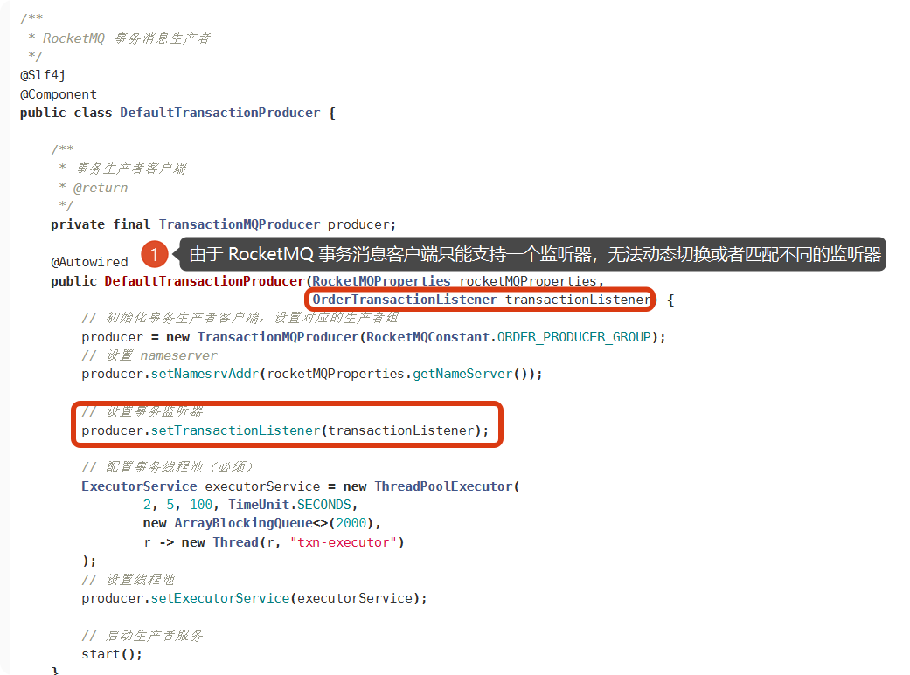

为了解决这个问题，我们通过「**动态路由机制**」+ 「**监听器注册中心**」的模式实现动态分发，主要做法如下：

1.  「**创建路由监听器**」：统一接收所有事务消息，根据消息特征（如 Topic、Tag、业务 Key）路由到具体业务监听器。
2.  「**注册中心管理监听器**」：通过 ConcurrentHashMap 维护不同业务类型与监听器的映射关系，保证监听器注册与查询的线程安全。
3.  「**发送消息携带路由标识**」：在消息的 properties 或 Tag 中设置业务类型标识供路由分发。

整个目录结构如下：

  
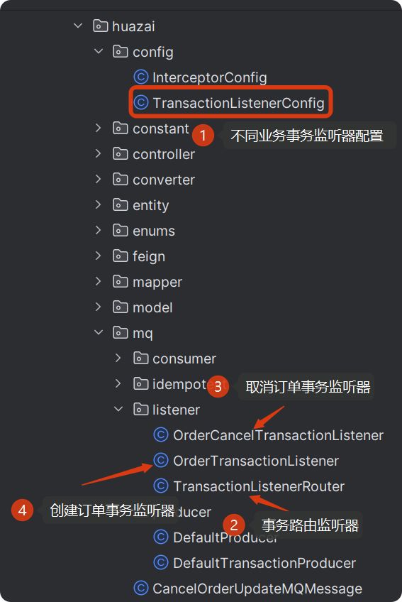

###   
**2.3.3.1 定义路由监听器**

package net.huazai.mq.listener;

import lombok.extern.slf4j.Slf4j;

import org.apache.rocketmq.client.producer.LocalTransactionState;

import org.apache.rocketmq.client.producer.TransactionListener;

import org.apache.rocketmq.common.message.Message;

import org.apache.rocketmq.common.message.MessageExt;

import org.springframework.stereotype.Component;

import java.util.Map;

import java.util.concurrent.ConcurrentHashMap;

/\*\*

\* 路由分发事务监听器

\* @className: TransactionListenerRouter

\* @author: huazai，该项目是知识星球：华仔和他的朋友们 的内部项目

\* @date: 2025-04-15 0:24

\* @Version: 1.0

\* @description:

\*/

@Component

@Slf4j

public class TransactionListenerRouter implements TransactionListener {

/\*\*

\* 存储业务类型与监听器的映射

\* 业务类型：订单、支付、退款等

\* 监听器：订单监听器、支付监听器、退款监听器等

\* 示例：

\* 订单监听器：OrderTransactionListener

\* 支付监听器：PayTransactionListener

\* 退款监听器：RefundTransactionListener

\* 示例：

\* listenerMap.put("order", new OrderTransactionListener());

\* listenerMap.put("pay", new PayTransactionListener());

\*/

private final Map<String, TransactionListener> listenerMap = new ConcurrentHashMap<>();

/\*\*

\* 注册业务监听器

\* @param businessKey 业务标识（如订单创建: order\_create）

\* @param listener 具体事务监听器

\*/

public void registerListener(String businessKey, TransactionListener listener) {

listenerMap.put(businessKey, listener);

}

/\*\*

\* 路由分发事务执行

\* @param msg Half(prepare) message

\* @param arg Custom business parameter

\* @return

\*/

@Override

public LocalTransactionState executeLocalTransaction(Message msg, Object arg) {

// 从消息中提取业务标识（例如通过 properties 或 Tag）

String businessKey \= msg.getProperty("businessType");

TransactionListener listener \= listenerMap.get(businessKey);

if (listener != null) {

return listener.executeLocalTransaction(msg, arg);

}

// 未找到监听器时回滚消息

return LocalTransactionState.ROLLBACK\_MESSAGE;

}

/\*\*

\* 路由分发事务回查

\* @param msg Check message

\* @return

\*/

@Override

public LocalTransactionState checkLocalTransaction(MessageExt msg) {

String businessKey \= msg.getProperty("businessType");

TransactionListener listener \= listenerMap.get(businessKey);

if (listener != null) {

return listener.checkLocalTransaction(msg);

}

return LocalTransactionState.ROLLBACK\_MESSAGE;

}

}

### **2.3.3.2 注册不同业务事务监听器**

在应用启动时，将各个业务监听器注册到路由中：

package net.huazai.config;

import net.huazai.mq.listener.OrderCancelTransactionListener;

import net.huazai.mq.listener.OrderTransactionListener;

import net.huazai.mq.listener.TransactionListenerRouter;

import org.springframework.beans.factory.annotation.Autowired;

import org.springframework.context.annotation.Configuration;

/\*\*

\* @className: TransactionListenerConfig

\* @author: huazai，该项目是知识星球：华仔和他的朋友们 的内部项目

\* @date: 2025-04-15 0:28

\* @Version: 1.0

\* @description:

\*/

@Configuration

public class TransactionListenerConfig {

/\*\*

\* 注册监听器

\* 1. 注册订单创建监听器

\* 2. 注册订单取消监听器

\* 3. 其他业务监听器...

\* 注意：

\* 1. 监听器的注册顺序很重要，需要根据业务场景进行调整

\* 2. 监听器的注册顺序与监听器的执行顺序一致，需要保证监听器的注册顺序与监听器的执行顺序一致

\* @param router

\* @param orderCreateListener

\* @param orderCancelListener

\*/

@Autowired

public void registerListeners(TransactionListenerRouter router,

OrderTransactionListener orderCreateListener,

OrderCancelTransactionListener orderCancelListener) {

// 注册订单创建监听器

router.registerListener("order\_create", orderCreateListener);

// 注册订单取消监听器

router.registerListener("order\_cancel", orderCancelListener);

// 其他业务监听器...

}

}

### **2.3.3.3 修改事务消息客户端**

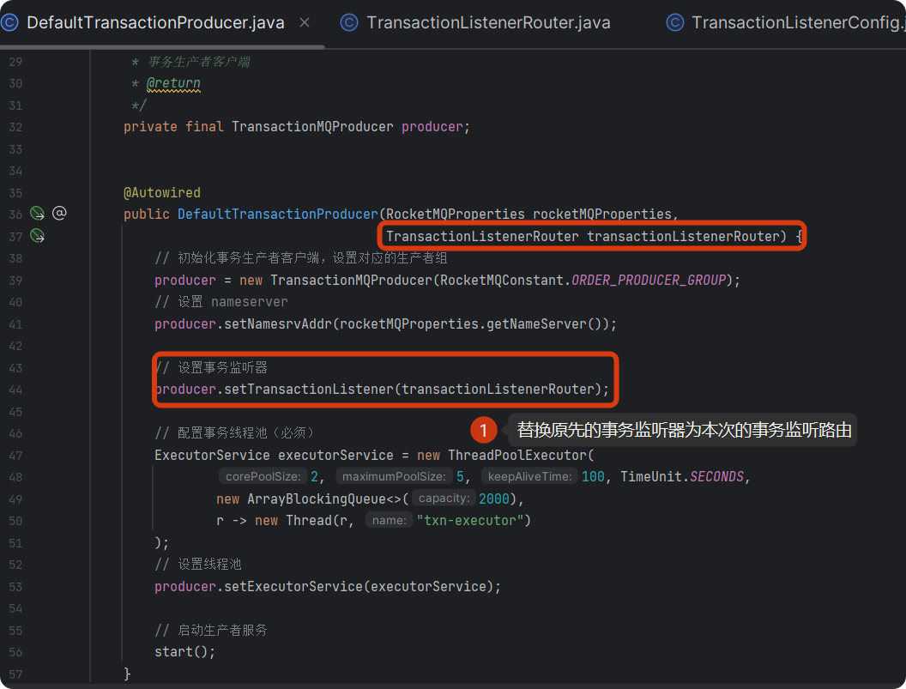

### **2.3.3.4 发送事务消息指定业务标识**

在发送事务消息时，通过 properties 携带业务类型：

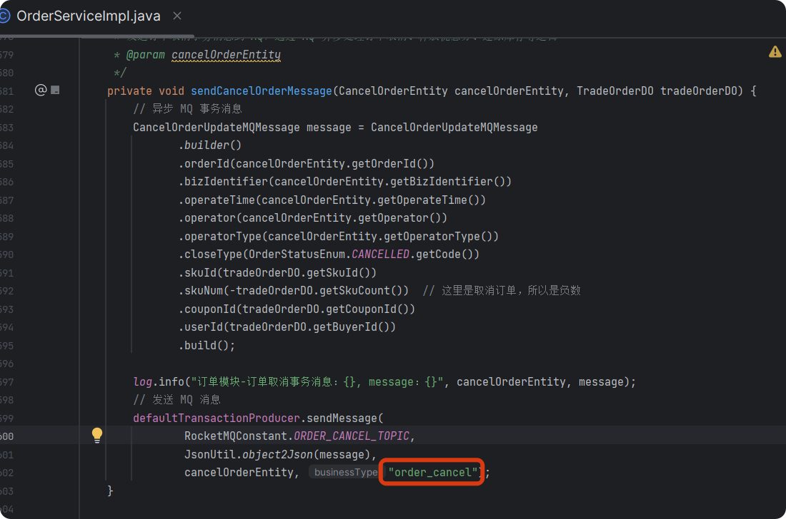

这样重构完，就可以支持多种不同的「**事务监听器**」，从而支撑多种「**业务场景**」需求。

### **2.3.4 基于模板方法实现本地事务处理**

当发送「**取消订单事务半消息**」后，为保证事务一致性，在构建事务消息生产者时，必须设置自定义的「**事务监听器**」来做「**执行取消订单本地事务**」和「**取消订单事务状态回查**」。

@Component

@Slf4j

public class OrderCancelTransactionListener implements TransactionListener {

/\*\*

\* 注入订单服务

\*/

@Lazy // 添加延迟加载注解 防止循环引用

@Autowired

private OrderService orderService;

/\*\*

\* 执行本地事务

\*/

@Override

public LocalTransactionState executeLocalTransaction(Message msg, Object arg) {

try {

// 从消息中获取业务标识（如 bizIdentifier）

CancelOrderUpdateMQMessage message \= parseMessage(msg);

/\*\*

\* 1、解析消息体（arg 为发送消息时传入的 CancelOrderEntity）

\*/

CancelOrderEntity cancelOrderEntity \= (CancelOrderEntity) arg;

log.info("订单取消事务监听器，订单取消请求：{}", cancelOrderEntity);

int closeType \= message.getCloseType();

CreateOrderVO createOrderVO \= null;

if (OrderStatusEnum.CANCELLED.getCode().equals(closeType)) {

log.info("订单取消，订单ID：{}", cancelOrderEntity.getOrderId());

/\*\*

\* 2、调用订单服务的取消订单及创建取消订单流水

\*/

createOrderVO = orderService.doCancelOrder(cancelOrderEntity);

}

/\*\*

\* 3、返回本地事务状态

\* 本地事务状态：

\* COMMIT\_MESSAGE：提交事务

\* ROLLBACK\_MESSAGE：回滚事务

\* UNKNOW：未知状态，稍后通过回查确认状态

\*/

if (createOrderVO == null) {

log.error("订单取消失败，订单请求：{}", cancelOrderEntity);

return LocalTransactionState.ROLLBACK\_MESSAGE;

} else {

log.info("订单取消成功，订单ID：{}", createOrderVO.getOrderId());

return LocalTransactionState.COMMIT\_MESSAGE;

}

// 如果业务成功，提交事务

// return LocalTransactionState.COMMIT\_MESSAGE;

// 如果业务失败，回滚事务

// return LocalTransactionState.ROLLBACK\_MESSAGE;

// 如果状态未知，稍后通过回查确认状态

// return LocalTransactionState.UNKNOW;

} catch (Exception e) {

log.error("本地事务执行失败", e);

return LocalTransactionState.ROLLBACK\_MESSAGE;

}

}

/\*\*

\* 事务回查

\*/

@Override

public LocalTransactionState checkLocalTransaction(MessageExt msg) {

// 检查本地事务状态并返回结果

// 从消息中获取业务标识（如 bizIdentifier）

CancelOrderUpdateMQMessage message \= parseMessage(msg);

int closeType \= message.getCloseType();

BaseOrderUpdateEntity baseOrderUpdateEntity \= null;

if (OrderStatusEnum.CANCELLED.getCode().equals(closeType)) {

log.info("订单取消回查，订单ID：{}", message.getOrderId());

baseOrderUpdateEntity = JSON.parseObject(JSON.parseObject(new String(msg.getBody())).getString("body"), CancelOrderEntity.class);

}

if (baseOrderUpdateEntity == null) {

log.error("订单取消回查失败，订单ID：{}", message.getOrderId());

return LocalTransactionState.ROLLBACK\_MESSAGE;

}

// 检查订单是否存在

TradeOrderDO tradeOrderDO \= orderService.getOrder(baseOrderUpdateEntity.getOrderId());

if (tradeOrderDO.getOrderStatus().equals(OrderStatusEnum.CANCELLED.getCode())) {

log.info("订单已取消，订单ID：{}", message.getOrderId());

return LocalTransactionState.COMMIT\_MESSAGE;

}

return LocalTransactionState.ROLLBACK\_MESSAGE;

}

/\*\*

\* 从消息中解析业务标识（如 bizIdentifier）

\*/

private CancelOrderUpdateMQMessage parseMessage(MessageExt msg) {

String jsonBody \= new String(msg.getBody(), StandardCharsets.UTF\_8);

return JsonUtil.json2Object(jsonBody, CancelOrderUpdateMQMessage.class);

}

/\*\*

\* 从消息中解析业务标识（如 bizIdentifier）

\*/

private CancelOrderUpdateMQMessage parseMessage(Message msg) {

String jsonBody \= new String(msg.getBody(), StandardCharsets.UTF\_8);

return JsonUtil.json2Object(jsonBody, CancelOrderUpdateMQMessage.class);

}

}

取消订单操作如下， 这里基于「**模板方法**」抽象来进行复用：

/\*\*

\* 执行取消订单

\* @param cancelOrderEntity

\* @return

\*/

@Override

public CreateOrderVO doCancelOrder(CancelOrderEntity cancelOrderEntity) {

// 执行具体逻辑

return doExecute(cancelOrderEntity, tradeOrder -> tradeOrder.close(cancelOrderEntity));

}

/\*\*

\* 通用模板方法处理订单更新逻辑

\*

\* @param orderUpdateEntity

\* @param consumer

\* @return

\*/

protected CreateOrderVO doExecute(BaseOrderUpdateEntity orderUpdateEntity, Consumer<TradeOrderDO> consumer) {

CreateOrderVO response \= new CreateOrderVO();

log.info("订单模块-执行订单开始，订单请求：{}", orderUpdateEntity);

/\*\*

\* 处理执行器

\*/

return handleExecute(orderUpdateEntity, response, "doExecute", request -> {

/\*\*

\* 1、根据订单ID查询订单信息 判断是否存在

\*/

TradeOrderDO existOrder \= tradeOrderMapper.selectByOrderId(request.getOrderId());

if (existOrder == null) {

log.error("订单模块-执行订单失败，订单不存在：{}", orderUpdateEntity);

throw new BizException(BizCodes.ORDER\_NOT\_EXIST);

}

/\*\*

\* 2、检查是否有权限

\*/

if (!hasPermission(existOrder, orderUpdateEntity.getOrderEvent(), orderUpdateEntity.getOperator(), orderUpdateEntity.getOperatorType())) {

throw new BizException(BizCodes.ORDER\_PERMISSION\_DENIED);

}

/\*\*

\* 3、检查订单流水是否存在

\*/

TradeOrderSnapshotDO existOrderSnapshot \= tradeOrderSnapshotMapper.selectByBizIdentifierAndOrderId(orderUpdateEntity.getBizIdentifier(),

orderUpdateEntity.getOrderEvent().getCode(), orderUpdateEntity.getOrderId());

if (existOrderSnapshot != null) {

log.error("订单模块-执行订单失败，订单流水已存在：{}", orderUpdateEntity);

throw new BizException(BizCodes.ORDER\_NOT\_EXIST);

}

/\*\*

\* 4、核心逻辑执行

\*/

consumer.accept(existOrder);

//开启事务

return transactionTemplate.execute(transactionStatus -> {

/\*\*

\* 4、更新订单状态

\*/

boolean result \= tradeOrderMapper.updateByOrderId(existOrder) == 1;

log.info("订单模块-执行订单修改订单状态信息：{}, result：{}", existOrder, result);

Assert.isTrue(result, () -> new BizException(BizCodes.ORDER\_UPDATE\_FAILED));

/\*\*

\* 5、创建订单流水

\*/

TradeOrderSnapshotDO tradeOrderSnapshotDO \= new TradeOrderSnapshotDO();

tradeOrderSnapshotDO.setOrderId(existOrder.getOrderId());

tradeOrderSnapshotDO.setSnapshotIdentifier(existOrder.getBizIdentifier());

tradeOrderSnapshotDO.setSnapshotType(existOrder.getOrderStatus());

tradeOrderSnapshotDO.setSnapshotJson(JsonUtil.object2Json(existOrder));

tradeOrderSnapshotDO.setSnapshotVersion(2);

tradeOrderSnapshotDO.setCreateTime(new Date());

result = tradeOrderSnapshotMapper.insert(tradeOrderSnapshotDO) == 1;

log.info("订单模块-执行订单创建订单流水信息：{}, result：{}", tradeOrderSnapshotDO, result);

Assert.isTrue(result, () -> new BizException(BizCodes.ORDER\_SNAPSHOT\_CREATE\_FAIL));

response.setOrderId(existOrder.getOrderId());

response.setOrderStatus(existOrder.getOrderStatus());

return response;

});

});

}

### **2.3.5 异步处理优惠券释放**

优惠券释放比较简单，领券状态从「**已领取**」切换为 「**已撤销/释放**」代码如下：

/\*\*

\* 订单取消优惠券释放

\*/

@Slf4j

@Component

public class CancelOrderUnLockUserConponUpdateListener implements MessageListenerConcurrently {

/\*\*

\* 注入幂等处理器

\*/

@Autowired

private UserCouponQueueIdempotentHandler userCouponQueueIdempotentHandler;

/\*\*

\* 注入优惠券服务

\*/

@Autowired

private CouponService couponService;

/\*\*

\* 并发消费

\* @param msgList

\* @param context

\* @return

\*/

@Override

public ConsumeConcurrentlyStatus consumeMessage(List<MessageExt> msgList, ConsumeConcurrentlyContext context) {

for (MessageExt messageExt : msgList) {

String msgId \= messageExt.getMsgId();

try {

String msg \= new String(messageExt.getBody());

// 解析订单取消库存还原化消息

CancelOrderUpdateMQMessage message \= JsonUtil.json2Object(msg, CancelOrderUpdateMQMessage.class);

if (message == null) {

log.warn("订单取消优惠券释放 MQ 消息异步更新-消息为空结束，原始消息内容：{}", msg);

return ConsumeConcurrentlyStatus.RECONSUME\_LATER;

}

log.info("订单取消优惠券释放 MQ 消息异步更新-执行库存初始化数据，消息内容：{}", message);

// 1. 幂等性校验

if (userCouponQueueIdempotentHandler.isMessageConsumed(RedisKeyConstant.UNLOCK\_USER\_COUPON\_IDEMPOTENT\_PREFIX, msgId)) {

// 判断当前的这个消息流程是否执行完成

if (userCouponQueueIdempotentHandler.isAccomplish(RedisKeyConstant.UNLOCK\_USER\_COUPON\_IDEMPOTENT\_PREFIX, msgId)) {

log.warn("订单取消优惠券释放 MQ 消息异步更新-检测到重复消息，当前流程还未执行完，消息内容：{}", message);

return ConsumeConcurrentlyStatus.RECONSUME\_LATER;

}

log.error("订单取消优惠券释放 MQ 消息异步更新 consume error, 消息未完成流程，需要消息队列重试");

return ConsumeConcurrentlyStatus.RECONSUME\_LATER;

}

// 释放库存数据库操作

Boolean unLockResult \= couponService.unLockCoupon(message);

if (!unLockResult) {

log.error("订单取消优惠券释放 MQ 消息异步更新 consume error, 执行优惠券释放数据消费失败");

return ConsumeConcurrentlyStatus.RECONSUME\_LATER;

}

// 设置消费完成表示

userCouponQueueIdempotentHandler.setAccomplish(RedisKeyConstant.UNLOCK\_USER\_COUPON\_IDEMPOTENT\_PREFIX, msgId);

} catch (Exception e) {

// 本次消费失败，下次重新消费

userCouponQueueIdempotentHandler.delMessageProcessed(RedisKeyConstant.UNLOCK\_USER\_COUPON\_IDEMPOTENT\_PREFIX, msgId);

log.error("订单取消优惠券释放 MQ 消息异步更新 consume error, 执行优惠券释放数据消费失败", e);

return ConsumeConcurrentlyStatus.RECONSUME\_LATER;

}

}

log.info("订单取消优惠券释放 MQ 消息异步更新-执行优惠券释放数据消费成功, result: {}", ConsumeConcurrentlyStatus.CONSUME\_SUCCESS);

return ConsumeConcurrentlyStatus.CONSUME\_SUCCESS;

}

}

/\*\*

\* 释放优惠券

\* 1、验证用户是否有领券的优惠券【按道理这里不会有问题，在订单创建前已经验证过】

\* 2、进行更新状态为已释放

\* @param message

\* @return

\*/

@Transactional(rollbackFor = Exception.class)

@Override

public Boolean unLockCoupon(CancelOrderUpdateMQMessage message) {

// 1、验证用户是否有领券的优惠券

QueryWrapper<UserCouponDO> userCouponQueryWrapper = new QueryWrapper<>();

userCouponQueryWrapper.eq("user\_id", message.getUserId());

userCouponQueryWrapper.eq("coupon\_template\_id", message.getCouponId());

userCouponQueryWrapper.eq("coupon\_status", 2); // 已使用

UserCouponDO userCoupon \= userCouponMapper.selectOne(userCouponQueryWrapper);

if (userCoupon == null) {

log.warn("优惠券模块-用户没有已使用的优惠券，userCouponQueryWrapper：{}", userCouponQueryWrapper);

return false;

}

// 2、进行更新状态为已释放

UserCouponDO updateUserCoupon \= new UserCouponDO();

updateUserCoupon.setId(userCoupon.getId());

updateUserCoupon.setCouponStatus(4); // 已释放

updateUserCoupon.setBizIdentifier(message.getBizIdentifier()); // 订单幂等号 方便对账

int updateRows \= userCouponMapper.updateById(updateUserCoupon);

if (updateRows <= 0) {

log.warn("优惠券模块-更新用户优惠券释放状态失败，userCoupon：{}", userCoupon);

return false;

}

return true;

}

### **2.3.6 异步处理库存还原**

这个相对比较简单， 「**Redis 库存还原**」直接调用上篇完成的功能，「**数据库库存还原**」是本次要完成的，核心代码如下：

/\*\*

\* 订单取消商品 sku 库存还原

\*/

@Slf4j

@Component

public class CancelOrderInventoryStockUpdateListener implements MessageListenerConcurrently {

/\*\*

\* 注入幂等处理器

\*/

@Autowired

private UnLockStockQueueIdempotentHandler unLockStockQueueIdempotentHandler;

/\*\*

\* 注入库存服务

\*/

@Autowired

private InventoryService inventoryService;

/\*\*

\* 并发消费

\* @param msgList

\* @param context

\* @return

\*/

@Override

public ConsumeConcurrentlyStatus consumeMessage(List<MessageExt> msgList, ConsumeConcurrentlyContext context) {

for (MessageExt messageExt : msgList) {

String msgId \= messageExt.getMsgId();

try {

String msg \= new String(messageExt.getBody());

// 解析订单取消库存还原化消息

CancelOrderUpdateMQMessage message \= JsonUtil.json2Object(msg, CancelOrderUpdateMQMessage.class);

if (message == null) {

log.warn("订单取消库存还原 MQ 消息异步更新-消息为空结束，原始消息内容：{}", msg);

return ConsumeConcurrentlyStatus.RECONSUME\_LATER;

}

log.info("订单取消库存还原 MQ 消息异步更新-执行库存初始化数据，消息内容：{}", message);

// 1. 幂等性校验

if (unLockStockQueueIdempotentHandler.isMessageConsumed(msgId)) {

// 判断当前的这个消息流程是否执行完成

if (unLockStockQueueIdempotentHandler.isAccomplish(msgId)) {

log.warn("订单取消库存还原 MQ 消息异步更新-检测到重复消息，当前流程还未执行完，消息内容：{}", message);

return ConsumeConcurrentlyStatus.RECONSUME\_LATER;

}

log.error("订单取消库存还原 MQ 消息异步更新 consume error, 消息未完成流程，需要消息队列重试");

return ConsumeConcurrentlyStatus.RECONSUME\_LATER;

}

DecrInventoryEntity decrInventoryEntity \= new DecrInventoryEntity();

decrInventoryEntity.setSkuId(message.getSkuId());

decrInventoryEntity.setStockNum(message.getSkuNum()); // 这里是负数

decrInventoryEntity.setIdentifier(message.getBizIdentifier());

// 释放库存数据库操作

Boolean cancelResult \= inventoryService.incrementInventoryDB(message);

if (!cancelResult) {

log.error("订单取消库存还原 MQ 消息异步更新 consume error, 执行库存还原数据消费失败");

return ConsumeConcurrentlyStatus.RECONSUME\_LATER;

}

// 释放库存

inventoryService.incrementInventory(decrInventoryEntity);

// 设置消费完成表示

unLockStockQueueIdempotentHandler.setAccomplish(msgId);

} catch (Exception e) {

// 本次消费失败，下次重新消费

unLockStockQueueIdempotentHandler.delMessageProcessed(msgId);

log.error("订单取消库存还原 MQ 消息异步更新 consume error, 执行库存还原数据消费失败", e);

return ConsumeConcurrentlyStatus.RECONSUME\_LATER;

}

}

log.info("订单取消库存还原 MQ 消息异步更新-执行库存还原数据消费成功, result: {}", ConsumeConcurrentlyStatus.CONSUME\_SUCCESS);

return ConsumeConcurrentlyStatus.CONSUME\_SUCCESS;

}

}

「**数据库库存还原**」操作，首先判断库存详情是否存在，如果不存在直接抛异常，如果存在直接插入库存流水记录及还原库存

/\*\*

\* 还原库存

\* @param message

\* @return

\*/

@Override

public Boolean incrementInventoryDB(CancelOrderUpdateMQMessage message) {

// 1、库存详情校验

ProductSkuStockDO productSkuStockDO \= productSkuStockMapper.selectBySkuId(message.getSkuId());

if (productSkuStockDO == null) {

log.error("库存模块-还原库存 商品库存不存在：{}", message.getSkuId());

throw new RuntimeException("还原库存 商品库存不存在：" + message.getSkuId());

}

// 2、插入库存流水

ProductSkuStockDetailDO productSkuStockDetailDO \= new ProductSkuStockDetailDO();

productSkuStockDetailDO.setSkuStockId(productSkuStockDO.getId());

productSkuStockDetailDO.setStockIdentifier(message.getBizIdentifier());

// json 记录 change:变更数量 action:变更动作(increase/decrease) from:从多少库存数 to:变更到多少库存数 by:变更唯一键 time:变更时间

InventoryChangeEntity inventoryChange \= InventoryChangeEntity

.builder()

.change(Math.abs(message.getSkuNum()))

.action("increase")

.from(productSkuStockDO.getSaleableStock())

.to(productSkuStockDO.getSaleableStock() + Math.abs(message.getSkuNum()))

.by(message.getSkuId())

.time(new Date())

.build();

productSkuStockDetailDO.setStockChangeLog(JsonUtil.object2Json(inventoryChange));

int rows \= productSkuStockDetailMapper.insert(productSkuStockDetailDO);

Assert.isTrue(rows > 0, () -> new BizException(BizCodes.INVENTORY\_STOCK\_DETAIL\_CREATE\_FAIL));

// 3、更新库存回退

rows = productSkuStockMapper.updateStock(productSkuStockDO.getId(), Math.abs(message.getSkuNum()));

Assert.isTrue(rows > 0, () -> new BizException(BizCodes.INVENTORY\_STOCK\_UPDATE\_FAIL));

return true;

}

数据库库存回退：

<!-- 库存退还 /\*+ COMMIT\_ON\_SUCCESS ROLLBACK\_ON\_FAIL TARGET\_AFFECT\_ROW 1 \*/-->

<update id\="updateStock"\>

UPDATE product\_sku\_stock

SET saleable\_stock \= saleable\_stock + #{lockStock}, lock\_version \= lock\_version + 1, update\_time \= NOW()

WHERE id \= #{id} AND <!\[CDATA\[saleable\_inventory + #{quantity} <= quantity\]\]\>

</update>

## **2.4 整体功能测试**

### **2.4.1 测试参数**

测试参数，拿之前的订单id 进行测试：

{

"bizIdentifier": "cb5bf3c134ca4f77a64b70754dd747e4",

"operateTime": "2025-04-14T23:36:43.185Z",

"operator": 2,

"operatorType": "CUSTOMER",

"orderId": 82070269239539

}

### **2.4.2 订单取消测试效果**

发送订单取消事务消息如下：

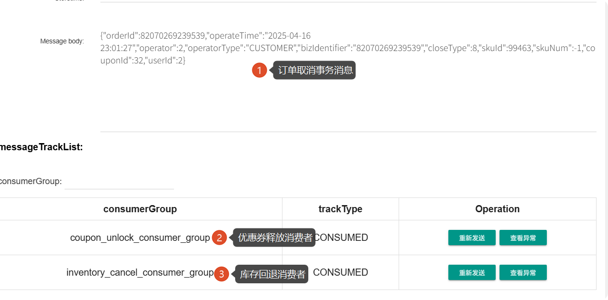

订单取消测试效果日志如下：

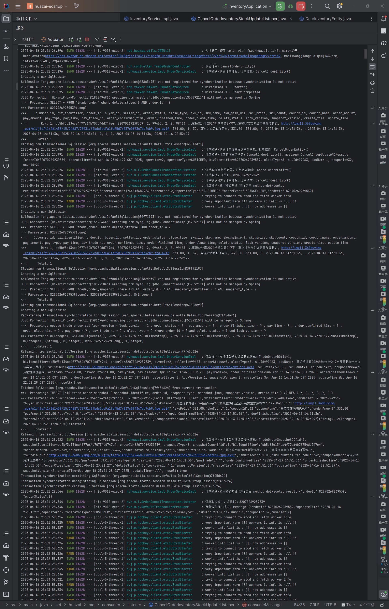

2025-04-16 23:01:27.161 INFO 11628 --- \[nio-9010-exec-2\] n.h.controller.TradeOrderController : 取消订单：CancelOrderEntity()

2025-04-16 23:01:27.196 INFO 11628 --- \[nio-9010-exec-2\] n.huazai.service.impl.OrderServiceImpl : 订单模块-取消订单开始，订单信息：CancelOrderEntity()

Creating a new SqlSession

SqlSession \[org.apache.ibatis.session.defaults.DefaultSqlSession@638a3d75\] was not registered for synchronization because synchronization is not active

2025-04-16 23:01:27.299 INFO 11628 --- \[nio-9010-exec-2\] com.zaxxer.hikari.HikariDataSource : HikariPool-1 - Starting...

2025-04-16 23:01:27.675 INFO 11628 --- \[nio-9010-exec-2\] com.zaxxer.hikari.HikariDataSource : HikariPool-1 - Start completed.

JDBC Connection \[HikariProxyConnection@1808494963 wrapping com.mysql.cj.jdbc.ConnectionImpl@57092154\] will not be managed by Spring

\==> Preparing: SELECT \* FROM \`trade\_order\` where delete\_status=0 AND order\_id = ?

\==> Parameters: 82070269239539(Long)

<== Columns: id, biz\_identifier, order\_id, buyer\_id, seller\_id, order\_status, close\_type, sku\_id, sku\_name, sku\_main\_url, sku\_price, sku\_count, coupon\_id, coupon\_name, order\_amount, pay\_amount, pay\_type, pay\_time, pay\_trade\_no, order\_confirmed\_time, order\_finished\_time, order\_close\_time, delete\_status, lock\_version, snapshot\_version, create\_time, update\_time

<== Row: 1, cb5bf3c134ca4f77a64b70754dd747e4, 82070269239539, 2, 99463, 2, 0, 99463, 儿童短款外套2024新款冬装2-7岁儿童棉袄宝宝冬装男童加厚棉衣, http://img11.360buyimg.com/n1/jfs/t1/261458/15/24687/70931/67bdc5ceFa1faf5d7/037c0ff3c7ed7cb9.jpg.avif, 361.00, 1, 32, 童装店铺满减优惠券, 331.00, 331.00, 0, 2025-04-13 14:51:36, , 2025-04-13 14:51:36, 2025-04-13 14:51:36, 2025-04-16 22:43:01, 0, 1, 0, 2025-04-13 14:51:36, 2025-04-16 22:52:29

<== Total: 1

Closing non transactional SqlSession \[org.apache.ibatis.session.defaults.DefaultSqlSession@638a3d75\]

2025-04-16 23:01:27.986 INFO 11628 --- \[nio-9010-exec-2\] n.huazai.service.impl.OrderServiceImpl : 订单模块-取消订单准备发送事务消息，订单信息：CancelOrderEntity()

2025-04-16 23:01:27.991 INFO 11628 --- \[nio-9010-exec-2\] n.huazai.service.impl.OrderServiceImpl : 订单模块-订单取消事务消息：CancelOrderEntity(), message：CancelOrderUpdateMQMessage(orderId=82070269239539, operateTime=Wed Apr 16 23:01:27 CST 2025, operator=2, operatorType=CUSTOMER, bizIdentifier=82070269239539, closeType=8, skuId=99463, skuNum=-1, couponId=32, userId=2)

2025-04-16 23:01:28.276 INFO 11628 --- \[nio-9010-exec-2\] n.h.m.l.OrderCancelTransactionListener : 订单取消事务监听器，订单取消请求：CancelOrderEntity()

2025-04-16 23:01:28.276 INFO 11628 --- \[nio-9010-exec-2\] n.h.m.l.OrderCancelTransactionListener : 订单取消，订单ID：82070269239539

2025-04-16 23:01:28.279 INFO 11628 --- \[nio-9010-exec-2\] n.huazai.service.impl.OrderServiceImpl : 订单模块-执行订单开始，订单请求：CancelOrderEntity()

2025-04-16 23:01:28.296 INFO 11628 --- \[nio-9010-exec-2\] n.huazai.service.impl.OrderServiceImpl : 订单模块-通用模板方法 执行之前 method=doExecute, request={"bizIdentifier":"82070269239539","operateTime":1744815687986,"operator":2,"operatorType":"CUSTOMER","orderEvent":"CANCELLED","orderId":82070269239539}

2025-04-16 23:01:28.314 INFO 11628 --- \[pool-5-thread-1\] c.j.p.hotkey.client.etcd.EtcdStarter : trying to connect to etcd and fetch worker info

2025-04-16 23:01:28.326 WARN 11628 --- \[pool-5-thread-1\] c.j.p.hotkey.client.etcd.EtcdStarter : very important warn !!! workers ip info is null!!!

2025-04-16 23:01:28.326 INFO 11628 --- \[pool-5-thread-1\] c.j.p.hotkey.client.etcd.EtcdStarter : worker info list is : \[\], now addresses is \[\]

Creating a new SqlSession

SqlSession \[org.apache.ibatis.session.defaults.DefaultSqlSession@39f71193\] was not registered for synchronization because synchronization is not active

JDBC Connection \[HikariProxyConnection@1532644458 wrapping com.mysql.cj.jdbc.ConnectionImpl@57092154\] will not be managed by Spring

\==> Preparing: SELECT \* FROM \`trade\_order\` where delete\_status=0 AND order\_id = ?

\==> Parameters: 82070269239539(Long)

<== Columns: id, biz\_identifier, order\_id, buyer\_id, seller\_id, order\_status, close\_type, sku\_id, sku\_name, sku\_main\_url, sku\_price, sku\_count, coupon\_id, coupon\_name, order\_amount, pay\_amount, pay\_type, pay\_time, pay\_trade\_no, order\_confirmed\_time, order\_finished\_time, order\_close\_time, delete\_status, lock\_version, snapshot\_version, create\_time, update\_time

<== Row: 1, cb5bf3c134ca4f77a64b70754dd747e4, 82070269239539, 2, 99463, 2, 0, 99463, 儿童短款外套2024新款冬装2-7岁儿童棉袄宝宝冬装男童加厚棉衣, http://img11.360buyimg.com/n1/jfs/t1/261458/15/24687/70931/67bdc5ceFa1faf5d7/037c0ff3c7ed7cb9.jpg.avif, 361.00, 1, 32, 童装店铺满减优惠券, 331.00, 331.00, 0, 2025-04-13 14:51:36, , 2025-04-13 14:51:36, 2025-04-13 14:51:36, 2025-04-16 22:43:01, 0, 1, 0, 2025-04-13 14:51:36, 2025-04-16 22:52:29

<== Total: 1

Closing non transactional SqlSession \[org.apache.ibatis.session.defaults.DefaultSqlSession@39f71193\]

Creating a new SqlSession

SqlSession \[org.apache.ibatis.session.defaults.DefaultSqlSession@6782def9\] was not registered for synchronization because synchronization is not active

JDBC Connection \[HikariProxyConnection@1857218431 wrapping com.mysql.cj.jdbc.ConnectionImpl@57092154\] will not be managed by Spring

\==> Preparing: SELECT \* FROM \`trade\_order\_snapshot\` where 1=1 AND order\_id = ? AND snapshot\_identifier = ? AND snapshot\_type = ?

\==> Parameters: 82070269239539(Long), 82070269239539(String), 8(Integer)

<== Total: 0

Closing non transactional SqlSession \[org.apache.ibatis.session.defaults.DefaultSqlSession@6782def9\]

Creating a new SqlSession

Registering transaction synchronization for SqlSession \[org.apache.ibatis.session.defaults.DefaultSqlSession@7f45d624\]

JDBC Connection \[HikariProxyConnection@381674645 wrapping com.mysql.cj.jdbc.ConnectionImpl@57092154\] will be managed by Spring

\==> Preparing: update trade\_order set lock\_version = lock\_version + 1 , order\_status = ? , pay\_amount = ? , order\_finished\_time = ? , pay\_time = ? , order\_confirmed\_time = ? , order\_close\_time = ? , pay\_type = ? , pay\_trade\_no = ? , close\_type = ? where order\_id = ? and delete\_status = 0 and lock\_version = ?

\==> Parameters: 8(Integer), 331.00(BigDecimal), 2025-04-13 14:51:36.0(Timestamp), 2025-04-13 14:51:36.0(Timestamp), 2025-04-13 14:51:36.0(Timestamp), 2025-04-16 23:01:27.986(Timestamp), 0(Integer), (String), 8(Integer), 82070269239539(Long), 1(Integer)

<== Updates: 1

Releasing transactional SqlSession \[org.apache.ibatis.session.defaults.DefaultSqlSession@7f45d624\]

2025-04-16 23:01:28.468 INFO 11628 --- \[nio-9010-exec-2\] n.huazai.service.impl.OrderServiceImpl : 订单模块-执行订单修改订单状态信息：TradeOrderDO(id\=1, bizIdentifier=cb5bf3c134ca4f77a64b70754dd747e4, orderId=82070269239539, buyerId=2, sellerId=99463, orderStatus=8, closeType=8, skuId=99463, skuName=儿童短款外套2024新款冬装2-7岁儿童棉袄宝宝冬装男童加厚棉衣, skuMainUrl=http://img11.360buyimg.com/n1/jfs/t1/261458/15/24687/70931/67bdc5ceFa1faf5d7/037c0ff3c7ed7cb9.jpg.avif, skuPrice=361.00, skuCount=1, couponId=32, couponName=童装店铺满减优惠券, orderAmount=331.00, payAmount=331.00, payType=0, payTime=Sun Apr 13 14:51:36 CST 2025, payTradeNo=, orderConfirmedTime=Sun Apr 13 14:51:36 CST 2025, orderFinishedTime=Sun Apr 13 14:51:36 CST 2025, orderCloseTime=Wed Apr 16 23:01:27 CST 2025, deleteStatus=0, lockVersion=1, snapshotVersion=0, createTime=Sun Apr 13 14:51:36 CST 2025, updateTime=Wed Apr 16 22:52:29 CST 2025), result：true

Fetched SqlSession \[org.apache.ibatis.session.defaults.DefaultSqlSession@7f45d624\] from current transaction

\==> Preparing: INSERT INTO trade\_order\_snapshot ( snapshot\_identifier, order\_id, snapshot\_type, snapshot\_json, snapshot\_version, create\_time ) VALUES ( ?, ?, ?, ?, ?, ? )

\==> Parameters: cb5bf3c134ca4f77a64b70754dd747e4(String), 82070269239539(Long), 8(Integer), {"id":1,"bizIdentifier":"cb5bf3c134ca4f77a64b70754dd747e4","orderId":82070269239539,"buyerId":2,"sellerId":99463,"orderStatus":8,"closeType":8,"skuId":99463,"skuName":"儿童短款外套2024新款冬装2-7岁儿童棉袄宝宝冬装男童加厚棉衣","skuMainUrl":"http://img11.360buyimg.com/n1/jfs/t1/261458/15/24687/70931/67bdc5ceFa1faf5d7/037c0ff3c7ed7cb9.jpg.avif","skuPrice":361.00,"skuCount":1,"couponId":32,"couponName":"童装店铺满减优惠券","orderAmount":331.00,"payAmount":331.00,"payType":0,"payTime":"2025-04-13 14:51:36","payTradeNo":"","orderConfirmedTime":"2025-04-13 14:51:36","orderFinishedTime":"2025-04-13 14:51:36","orderCloseTime":"2025-04-16 23:01:27","deleteStatus":0,"lockVersion":1,"snapshotVersion":0,"createTime":"2025-04-13 14:51:36","updateTime":"2025-04-16 22:52:29"}(String), 2(Integer), 2025-04-16 23:01:28.505(Timestamp)

<== Updates: 1

Releasing transactional SqlSession \[org.apache.ibatis.session.defaults.DefaultSqlSession@7f45d624\]

2025-04-16 23:01:28.522 INFO 11628 --- \[nio-9010-exec-2\] n.huazai.service.impl.OrderServiceImpl : 订单模块-执行订单创建订单流水信息：TradeOrderSnapshotDO(id\=5, snapshotIdentifier=cb5bf3c134ca4f77a64b70754dd747e4, orderId=82070269239539, snapshotType=8, snapshotJson={"id":1,"bizIdentifier":"cb5bf3c134ca4f77a64b70754dd747e4","orderId":82070269239539,"buyerId":2,"sellerId":99463,"orderStatus":8,"closeType":8,"skuId":99463,"skuName":"儿童短款外套2024新款冬装2-7岁儿童棉袄宝宝冬装男童加厚棉衣","skuMainUrl":"http://img11.360buyimg.com/n1/jfs/t1/261458/15/24687/70931/67bdc5ceFa1faf5d7/037c0ff3c7ed7cb9.jpg.avif","skuPrice":361.00,"skuCount":1,"couponId":32,"couponName":"童装店铺满减优惠券","orderAmount":331.00,"payAmount":331.00,"payType":0,"payTime":"2025-04-13 14:51:36","payTradeNo":"","orderConfirmedTime":"2025-04-13 14:51:36","orderFinishedTime":"2025-04-13 14:51:36","orderCloseTime":"2025-04-16 23:01:27","deleteStatus":0,"lockVersion":1,"snapshotVersion":0,"createTime":"2025-04-13 14:51:36","updateTime":"2025-04-16 22:52:29"}, snapshotVersion=2, createTime=Wed Apr 16 23:01:28 CST 2025, updateTime=null), result：true

Transaction synchronization committing SqlSession \[org.apache.ibatis.session.defaults.DefaultSqlSession@7f45d624\]

Transaction synchronization deregistering SqlSession \[org.apache.ibatis.session.defaults.DefaultSqlSession@7f45d624\]

Transaction synchronization closing SqlSession \[org.apache.ibatis.session.defaults.DefaultSqlSession@7f45d624\]

2025-04-16 23:01:28.544 INFO 11628 --- \[nio-9010-exec-2\] n.huazai.service.impl.OrderServiceImpl : 订单模块-通用模板方法 执行之后 method=doExecute, result={"orderId":82070269239539,"orderStatus":8}

2025-04-16 23:01:28.544 INFO 11628 --- \[nio-9010-exec-2\] n.h.m.l.OrderCancelTransactionListener : 订单取消成功，订单ID：82070269239539

2025-04-16 23:01:28.546 INFO 11628 --- \[nio-9010-exec-2\] n.h.m.p.DefaultTransactionProducer : 事务消息提交成功, message:{"orderId":82070269239539,"operateTime":"2025-04-16 23:01:27","operator":2,"operatorType":"CUSTOMER","bizIdentifier":"82070269239539","closeType":8,"skuId":99463,"skuNum":-1,"couponId":32,"userId":2}

数据库变更：

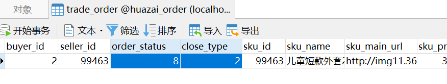

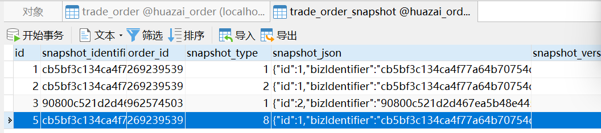

### **2.4.3 优惠券释放测试效果**

优惠券释放测试效果日志如下：

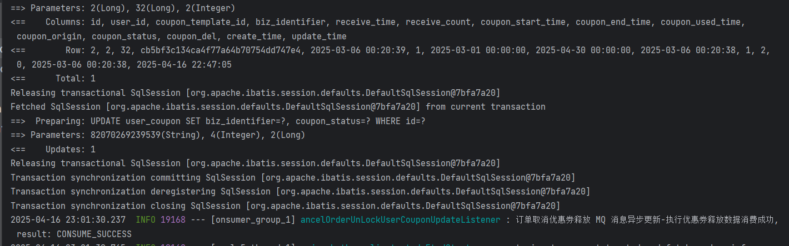

数据库变更：

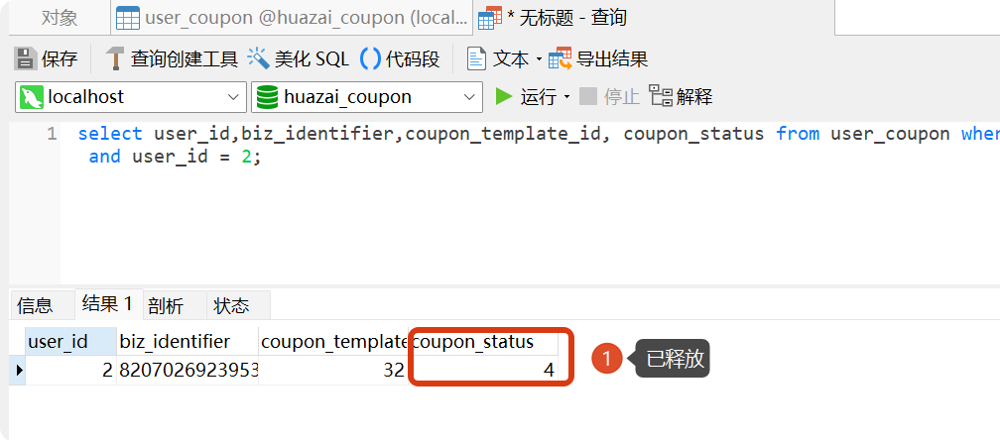

### **2.4.4 库存回退测试效果**

当前库存：

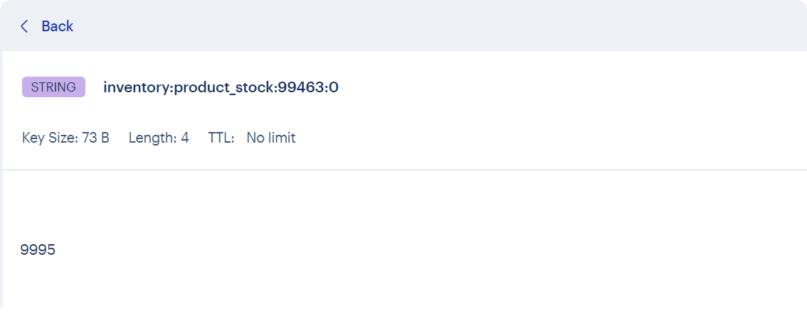

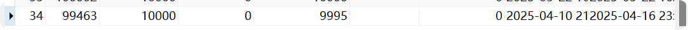

执行完还原后：

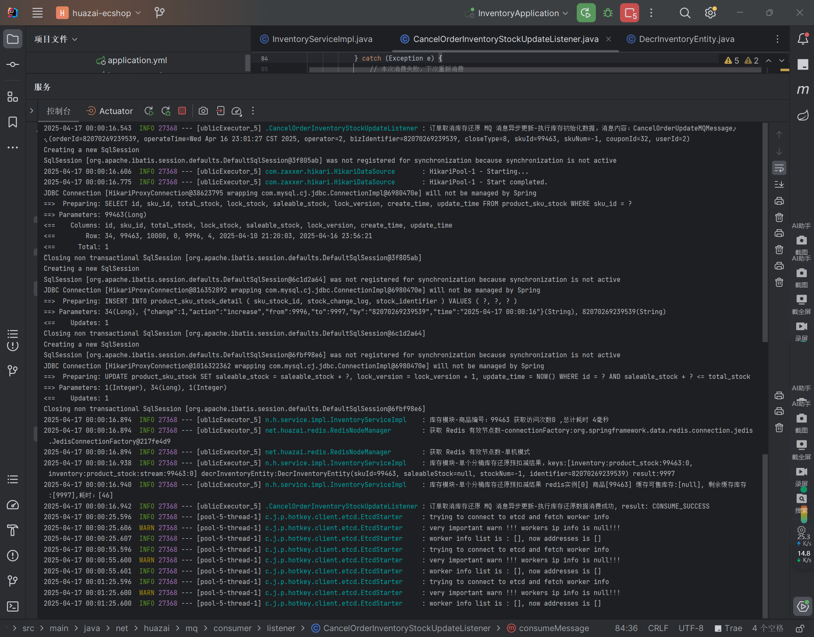

数据库库存还原变更：

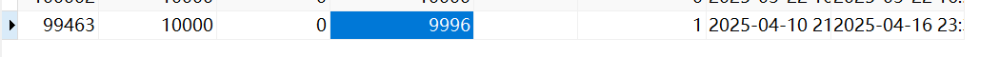

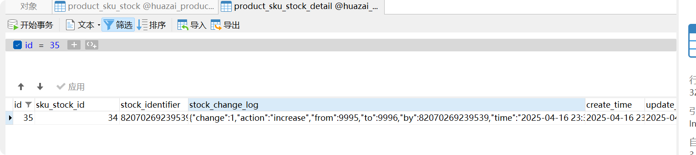

缓存库存还原变更：

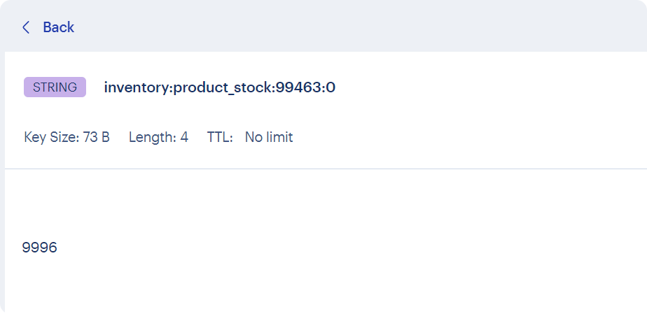

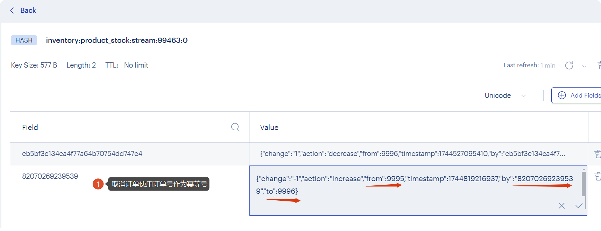