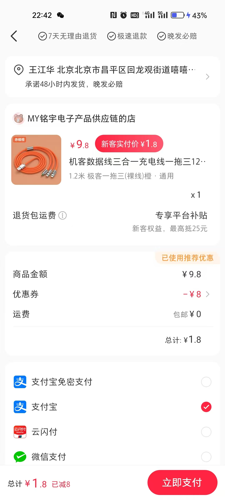
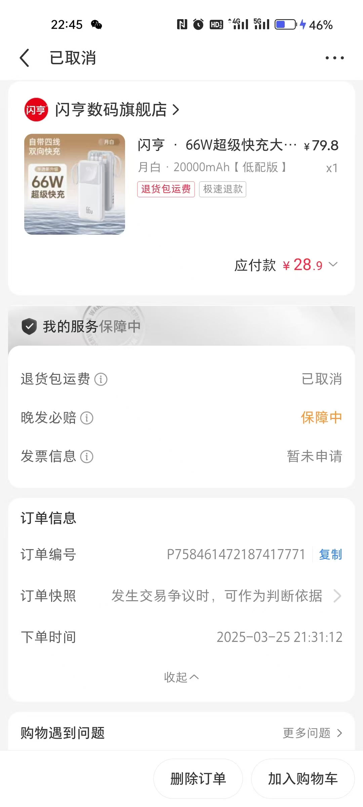
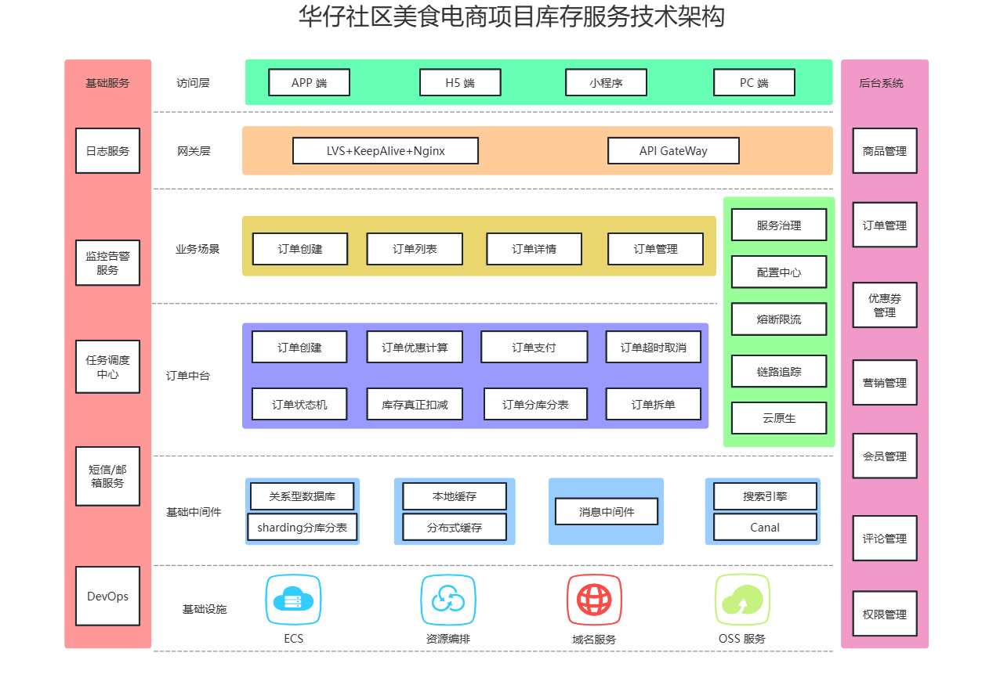
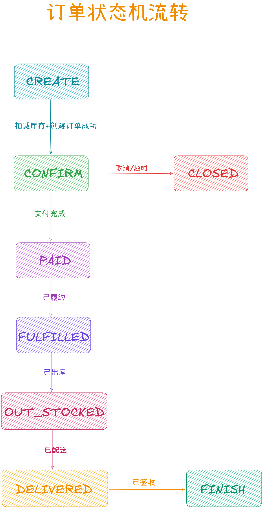
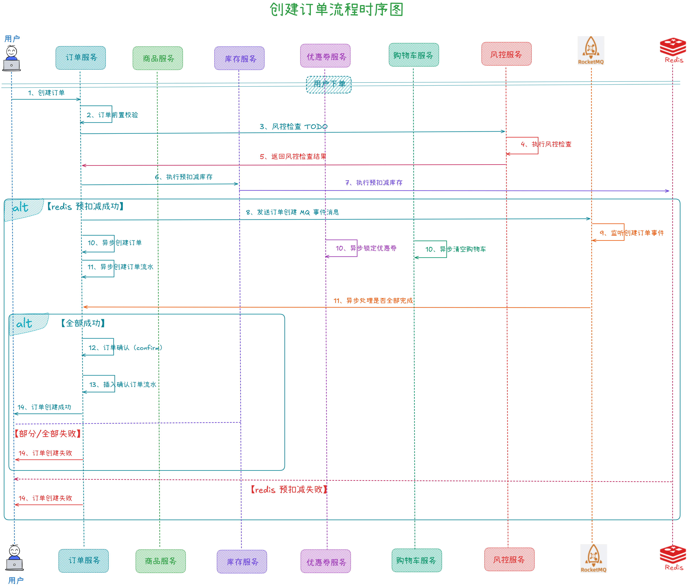
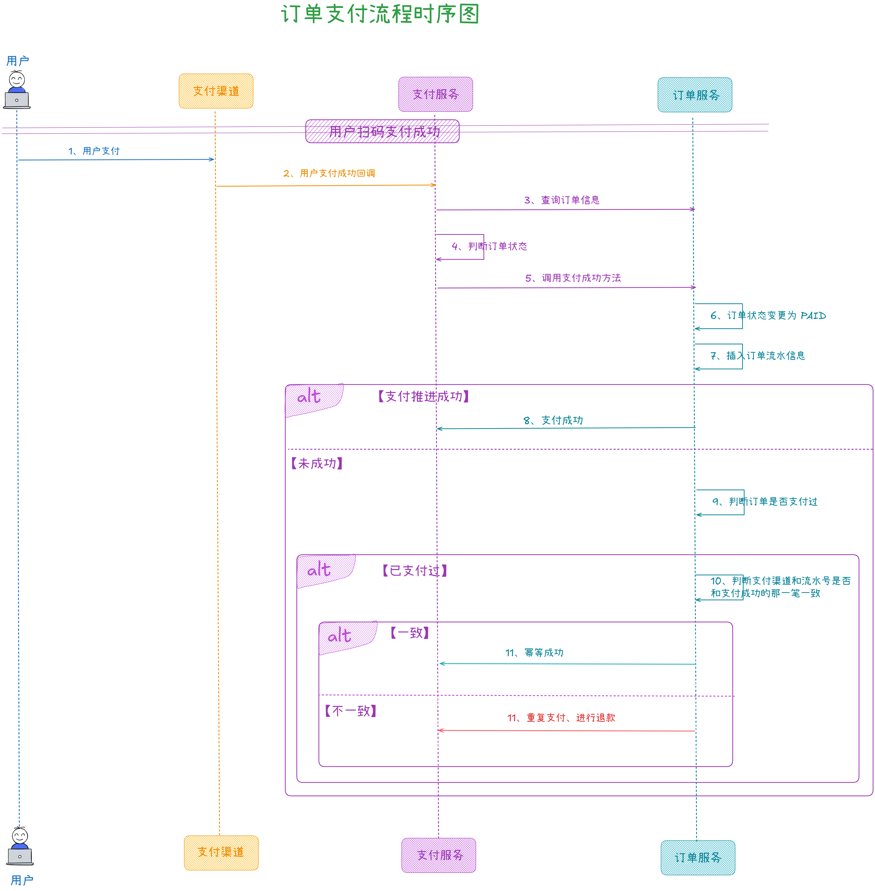
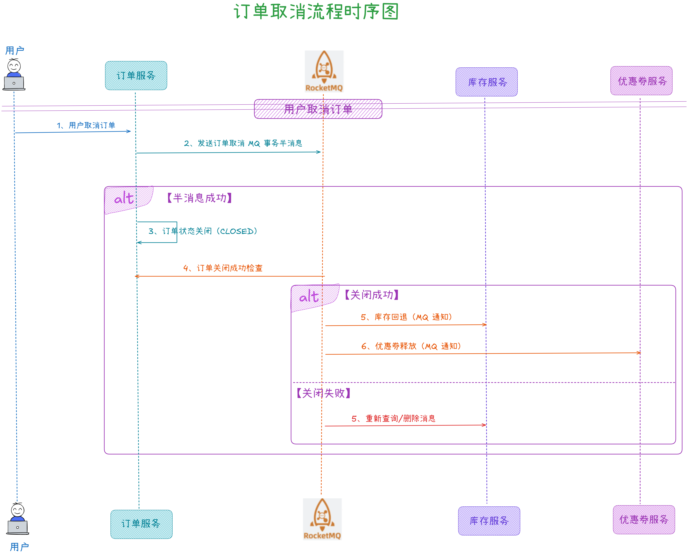
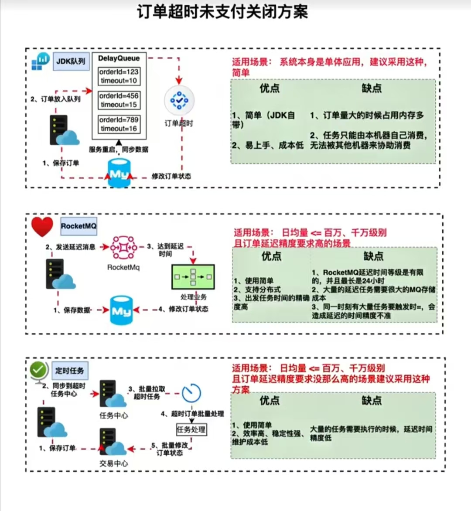

从今天之后的一段时间内，华仔会带着大家一起从零开始搭建并研发一套高并发的电商实战项目，这里会涉及到很多互联网大厂开发过程中所使用的核心技术和架构设计模式，希望大家学完之后可以用到自己的简历中。

这是第七十三篇，本篇我们来介绍整个电商实战项目中最重要的模块之一：「**订单服务**」的业务场景介绍和架构设计。

文章汇总位置：[https://wx.zsxq.com/dweb2/index/columns/51122554151214](https://wx.zsxq.com/dweb2/index/columns/51122554151214)

源码授权与获取地址：[https://articles.zsxq.com/id\_1s85grnaae4p.html](https://articles.zsxq.com/id_1s85grnaae4p.html)

本章源码地址：[https://gitcode.net/u011359591/huazai-ecshop/-/tree/ecshop-chapter-73](https://gitcode.net/u011359591/huazai-ecshop/-/tree/ecshop-chapter-73)

## **01 前言**

通过前面三篇，我们把「**库存服务**」相关业务场景、技术架构、功能实现都搞了一遍，后续关于库存的「**真正扣减**」会在下单时进行操作。

今天我们来重点梳理下整个电商实战项目中「**订单服务**」的业务场景介绍和架构设计。

##   
**01 订单业务场景介绍**

对于电商平台来说，订单也是不可或缺的，「**订单服务**」是电商核心系统。

这里我们主要还是以「**小红书**」为例，来看看其「**订单服务**」的使用场景，如下：

  

## **02 订单架构设计**

通过对「**订单场景**」的剖析，我梳理了如下「**订单服务**」的整个业务架构，以及要实现的相关功能，基本上包含了市面上各类电商平台「**订单服务**」的功能。

## **2.1 订单状态机**

### **2.1.1 状态机概念**

状态机是一种用来进行对象行为建模的工具，描述对象在生命周期内所经历的状态变化。

有限状态机是一种用来进行对象行为建模的工具，其作用主要是描述对象在它的生命周期内所经历的状态序列，以及如何响应来自外界的各种事件。

### **2.1.2 状态机适用场景**

状态机适用于有一个「**明确生命周期的对象**」，并且对象在生命周期的状态变迁中，存在不同的触发条件以及达到某个状态需要执行的某个动作。

状态机会将所有的「**状态**」、「**事件**」、「**动作**」都抽离出来，对复杂的「**状态迁移逻辑**」进行统一管理，来取代冗长的 if else 判断。通过状态机，可以实现「**明确的状态条件**」、「**原子的响应动作**」、「**事件驱动迁移目标状态**」，可以使系统更加易于维护和管理。

在电商平台中的「**订单**」、「**物流**」、「**售后**」等场景都会大量使用「**状态机**」。

### **2.1.3 状态机要素**

状态机可归纳为 4 个要素，也就是「**现态**」、「**条件**」、「**动作**」、「**次态**」。现态和条件是因，动作和次态是果。

1.  现态指当前所处的状态。
2.  条件又称为事件：当一个条件被满足，将会触发一个动作，或者执行一次状态的迁移。
3.  动作指条件满足后执行的动作：动作执行完毕后，可以迁移到新的状态，也可以仍旧保持原状态。动作不是必需的，当条件满足后，可不执行任何动作，直接迁移到新状态。
4.  次态指条件满足后要迁往的新状态："次态"是相对于"现态"而言的，"次态"一旦被激活，就转变成新的"现态"。

###   
**2.1.4 状态机动作类型**

1.  进入动作：在进入状态时进行。
2.  退出动作：在退出状态时进行。
3.  输入动作：依赖于当前状态和输入条件进行。
4.  转移动作：在进行特定转移时进行。

###   
**2.1.5 状态机选型**

这里提供两种选型方案，通过对比最终会选其中一个作为我们订单状态机的最终方案。

### **1、Spring 官方提供的状态机**

spring-statemachine 是 Spring 官方提供的状态机。

开源地址如下：[https://github.com/spring-projects/spring-statemachine](https://github.com/spring-projects/spring-statemachine)。

官方文档如下：[https://projects.spring.io/spring-statemachine](https://projects.spring.io/spring-statemachine)。

其优缺点如下：

1.  优点：轻量级、可以快速接入 (已经接入 Spring 框架的应用)、内置 Redis 等持久化手段、可以通过对接 ZooKpeer 实现分布式状态管理模型、支持较为复杂的多层状态模型配置、支持使用注解、使用方便、支持基于 Spring AOP 上的扩展、由Spring 推出并进行持续迭代。
2.  缺点：对于一些没有接入 Spring 框架的应用，接入 Spring 的状态机会比较困难。相关使用文档等较少，模型较为复杂，接入学习成本相对较高。Spring 状态机的监听器、AOP 等组件模块都使用了 Spring 框架中的模块，在上面做改造较难。另外其状态创建比较重，生产上一般用工厂模式来创建状态机，这样每个请求都会创建一个 StateMachine 对象。于是在高并发场景下，会创建N个 StateMachine 对象，对内存压力就大了。比如测试 2 分钟内 60w 个并发请求，内存消耗大几百兆。

### **2、Squirrel 状态机**

Squirrel 是一个开源的轻量级的状态机实现。

开源地址如下：[https://github.com/hekailiang/squirrel](https://github.com/hekailiang/squirrel)。

官方文档如下：[http://hekailiang.github.io/squirrel](http://hekailiang.github.io/squirrel)。

其优缺点如下：

1.  优点：Squirrel 的实现更为轻量，设计思路也比较清晰，文档以及测试用例也很丰富。Squirrel 关注的人也比较多，贡献采坑问题和问题场景也比较丰富。不依赖于 Spring，没有接入 Spring 框架的应用也可以接入使用。支持使用注解，支持自定义切点，内部实现不依赖于 Spring，可以在在上面扩展改造。
2.  缺点：切点粒度比较粗，要使用细粒度的切点。需要自己实现模型，相比较 Spring 状态机较为简单，实现复杂的多层状态模型需要在此基础上开发实现。

###   
**3、状态机方案选择**

这里我们会使用 Squirrel 来作为我们订单的状态机，如果大家有更好的方案 也可以评论区留言，后续同步更新。

Squirrel 状态机是一种用来进行「**对象行为建模**」的工具，主要描述对象在其生命周期内所经历的状态，以及如何响应各种事件。比如一个订单会经历「**创建**」、「**库存扣减**」、「**支付/取消支付**」、「**发货**」、「**收货**」、「**售后**」等状态，状态间的转换、触发事件的监听，都可用其实现清晰的管理。

使用「**状态机来管理对象生命周期**」的好处是让代码更具「**维护性**」 +「**可测试性**」。「**明确的状态条件**」 + 「**原子的响应动作**」 + 「**事件驱动迁移目标状态**」，对于流程复杂易变的业务场景能大大减轻维护和测试的难度。

### **2.1.6 订单状态机**

整个订单的状态机流转如下，这里后续履约相关的状态流转暂时不更新，后续有时间再做。

## **2.2 订单业务流程架构设计**

### **2.2.1 订单创建流程时序图**

创建订单业务比较复杂，整个处理流程时序图如下：

这里关于「**库存预扣减**」部分已经在「**库存服务**」剖析过了，忘记的可以点击：[【电商实战项目第七十二篇】华仔电商实战库存服务之库存缓存分桶预扣减方案功能实现](https://articles.zsxq.com/id_9sr5xwzox4px.html)。

当「**库存预扣减**」完成后，会进行「**创建订单**」+ 「**锁定优惠券**」+ 「**清空购物车**」，在订单扣减的时候，通过 RocketMQ 事务消息来进行「**创建订单**」+ 「**锁定优惠券**」+ 「**清空购物车**」。当这部分成功之后，订单状态会变成 「**CONFIRM**」，此时订单就可以支付了，当支付完成后进行「**库存真正扣减**」。

### **2.2.2 订单支付流程时序图**

接下来，看下订单支付的处理流程，如下：

这里除了要做「**订单状态推进**」，还要做 「**单笔订单幂等性处理**」，即单笔订单只能支付成功一次，避免用户出现多付，如果出现多付，则需要进行退款。

当支付成功后，订单状态会变成「**PAID**」。

### **2.2.3 订单取消流程时序图**

接下来，来看下订单取消的处理流程，如下：

这里为了保证「**订单取消**」和「**库存回退/优惠券释放**」的数据一致性，使用 RocketMQ 事务消息来处理。

当订单取消后，订单状态会变成「**CLOSED**」。closeType 为「**CANCEL**」。

### **2.2.4 订单超时关单方案选型**

除了用户主动取消订单之外，还会有「**超时关单**」的情况。「**超时关单**」的逻辑和「**用户主动取消订单**」的逻辑其实是一样的，只不过入口不一样。

这里会有几种实现：

1.  被动关单：当用户访问订单详情/用户支付时会进行被动关单。
2.  MQ 延迟消息：这里会使用 RocketMQ 延迟消息来进行超时关单。
3.  定时任务：实现方案有这么几种：XXL-Job、时间轮、Redis Zset、Redisson 延迟队列、DelayQueue。
4.  这里我们会使用 XXL-Job 分片任务来进行分库分表后的扫表，从采用 ForkJoinPool 线程池进行并发处理来实现超时关单。

## **03 订单数据库设计**

订单目前设计了两张表，一张订单基础信息表，另外一张是订单快照表。

\# 这里为了方便查询，会冗余一些字段，就不用 join 查询了

/\*

Navicat Premium Data Transfer

Source Server : localhost

Source Server Type : MySQL

Source Server Version : 80039

Source Host : localhost:3306

Source Schema : huazai\_order

Target Server Type : MySQL

Target Server Version : 80039

File Encoding : 65001

Date: 14/04/2025 11:24:33

\*/

SET NAMES utf8mb4;

SET FOREIGN\_KEY\_CHECKS = 0;

\-- ----------------------------

\-- Table structure for trade\_order

\-- ----------------------------

DROP TABLE IF EXISTS \`trade\_order\`;

CREATE TABLE \`trade\_order\` (

\`id\` bigint(0) NOT NULL AUTO\_INCREMENT COMMENT '主键id',

\`biz\_identifier\` varchar(128) CHARACTER SET utf8mb4 COLLATE utf8mb4\_general\_ci NOT NULL DEFAULT '' COMMENT '幂等号',

\`order\_id\` bigint(0) UNSIGNED NOT NULL DEFAULT 0 COMMENT '订单号',

\`buyer\_id\` bigint(0) UNSIGNED NOT NULL DEFAULT 0 COMMENT '买家id',

\`seller\_id\` bigint(0) UNSIGNED NOT NULL DEFAULT 0 COMMENT '卖家id',

\`order\_status\` tinyint(0) UNSIGNED NOT NULL DEFAULT 1 COMMENT '订单状态 1:已创建, 2:已确认, 3:已支付 4:已履约 5:出库中, 6:配送中, 7:已签收, 8:已取消, 9:已拒收, 127:无效订单',

\`close\_type\` tinyint(0) UNSIGNED NOT NULL DEFAULT 0 COMMENT '关单类型 1:超时关单 2:用户主动关闭/取消 ',

\`sku\_id\` bigint(0) UNSIGNED NOT NULL DEFAULT 0 COMMENT '商品id',

\`sku\_name\` varchar(128) CHARACTER SET utf8mb4 COLLATE utf8mb4\_general\_ci NULL DEFAULT '' COMMENT '商品标题',

\`sku\_main\_url\` varchar(128) CHARACTER SET utf8mb4 COLLATE utf8mb4\_general\_ci NULL DEFAULT '' COMMENT '商品封面图',

\`sku\_price\` decimal(16, 2) NOT NULL COMMENT '商品单价',

\`sku\_count\` smallint(0) UNSIGNED NOT NULL DEFAULT 0 COMMENT '商品数量',

\`coupon\_id\` bigint(0) UNSIGNED NOT NULL DEFAULT 0 COMMENT '优惠券id',

\`coupon\_name\` varchar(255) CHARACTER SET utf8mb4 COLLATE utf8mb4\_general\_ci NOT NULL DEFAULT '' COMMENT '优惠券名称',

\`order\_amount\` decimal(16, 2) NOT NULL COMMENT '订单金额',

\`pay\_amount\` decimal(16, 2) NOT NULL COMMENT '交易支付金额',

\`pay\_type\` tinyint(0) UNSIGNED NOT NULL DEFAULT 0 COMMENT '支付方式 1:微信支付 2:支付宝支付',

\`pay\_time\` datetime(0) NULL DEFAULT CURRENT\_TIMESTAMP(0) COMMENT '支付时间',

\`pay\_trade\_no\` varchar(128) CHARACTER SET utf8mb4 COLLATE utf8mb4\_general\_ci NOT NULL DEFAULT '' COMMENT '支付流水号',

\`order\_confirmed\_time\` datetime(0) NULL DEFAULT CURRENT\_TIMESTAMP(0) COMMENT '订单确认时间',

\`order\_finished\_time\` datetime(0) NULL DEFAULT CURRENT\_TIMESTAMP(0) COMMENT '订单完结时间',

\`order\_close\_time\` datetime(0) NULL DEFAULT CURRENT\_TIMESTAMP(0) COMMENT '关单时间',

\`delete\_status\` tinyint(0) UNSIGNED NOT NULL DEFAULT 0 COMMENT '删除状态 0:未删除 1:已删除',

\`lock\_version\` int(0) UNSIGNED NOT NULL DEFAULT 0 COMMENT '乐观锁版本号',

\`snapshot\_version\` int(0) UNSIGNED NOT NULL DEFAULT 0 COMMENT '快照版本号',

\`create\_time\` datetime(0) NULL DEFAULT CURRENT\_TIMESTAMP(0) COMMENT '订单创建时间',

\`update\_time\` datetime(0) NULL DEFAULT CURRENT\_TIMESTAMP(0) ON UPDATE CURRENT\_TIMESTAMP(0) COMMENT '订单更新时间',

PRIMARY KEY (\`id\`) USING BTREE,

UNIQUE INDEX \`idx\_order\_id\`(\`order\_id\`, \`biz\_identifier\`) USING BTREE,

INDEX \`idx\_identifier\_buyer\`(\`biz\_identifier\`, \`buyer\_id\`) USING BTREE

) ENGINE \= InnoDB AUTO\_INCREMENT \= 1 CHARACTER SET \= utf8mb4 COLLATE \= utf8mb4\_general\_ci COMMENT \= '订单表' ROW\_FORMAT \= Dynamic;

\-- ----------------------------

\-- Table structure for trade\_order\_snapshot

\-- ----------------------------

DROP TABLE IF EXISTS \`trade\_order\_snapshot\`;

CREATE TABLE \`trade\_order\_snapshot\` (

\`id\` bigint(0) NOT NULL AUTO\_INCREMENT COMMENT '主键id',

\`snapshot\_identifier\` varchar(128) CHARACTER SET utf8mb4 COLLATE utf8mb4\_general\_ci NOT NULL DEFAULT '' COMMENT '快照幂等号',

\`order\_id\` bigint(0) UNSIGNED NOT NULL DEFAULT 0 COMMENT '订单号',

\`snapshot\_type\` tinyint(0) UNSIGNED NOT NULL COMMENT '订单快照类型',

\`snapshot\_json\` longtext CHARACTER SET utf8mb4 COLLATE utf8mb4\_general\_ci NOT NULL COMMENT '订单快照内容',

\`snapshot\_version\` int(0) UNSIGNED NOT NULL DEFAULT 0 COMMENT '订单快照版本号',

\`create\_time\` datetime(0) NULL DEFAULT CURRENT\_TIMESTAMP(0) COMMENT '订单创建时间',

\`update\_time\` datetime(0) NULL DEFAULT CURRENT\_TIMESTAMP(0) ON UPDATE CURRENT\_TIMESTAMP(0) COMMENT '订单更新时间',

PRIMARY KEY (\`id\`) USING BTREE,

UNIQUE INDEX \`idx\_identifier\`(\`order\_id\`, \`snapshot\_identifier\`, \`snapshot\_type\`) USING BTREE

) ENGINE \= InnoDB AUTO\_INCREMENT \= 1 CHARACTER SET \= utf8mb4 COLLATE \= utf8mb4\_general\_ci COMMENT \= '订单快照流水表' ROW\_FORMAT \= Dynamic;

SET FOREIGN\_KEY\_CHECKS = 1;