从今天之后的一段时间内，华仔会带着大家一起从零开始搭建并研发一套高并发的电商实战项目，这里会涉及到很多互联网大厂开发过程中所使用的核心技术和架构设计模式，希望大家学完之后可以用到自己的简历中。

这是第七十二篇，本篇我们继续来介绍整个电商实战项目中最重要的模块之一：「**库存服务之库存缓存分桶预扣减功能实现**」。

文章汇总位置：[https://wx.zsxq.com/dweb2/index/columns/51122554151214](https://wx.zsxq.com/dweb2/index/columns/51122554151214)

源码授权与获取地址：[https://articles.zsxq.com/id\_1s85grnaae4p.html](https://articles.zsxq.com/id_1s85grnaae4p.html)

本章源码地址：[https://gitcode.net/u011359591/huazai-ecshop/-/tree/ecshop-chapter-72](https://gitcode.net/u011359591/huazai-ecshop/-/tree/ecshop-chapter-72)

## **01 前言**

上篇 [【电商实战项目第七十一篇】华仔电商实战库存服务之库存初始化及库存柔性式缓存分桶方案功能实现](https://articles.zsxq.com/id_ccko9bipxqh1.html)，我们深度拆解和开发了「**库存服务之库存初始化及库存柔性式缓存分桶**」的功能。

今天我们再来看下「**库存服务之库存缓存分桶预扣减功能实现**」，这里需结合「**订单服务**」来使用的，当下单时会进行「**库存预扣减**」，等支付成功后会「**进行库存真正扣减**」。

  
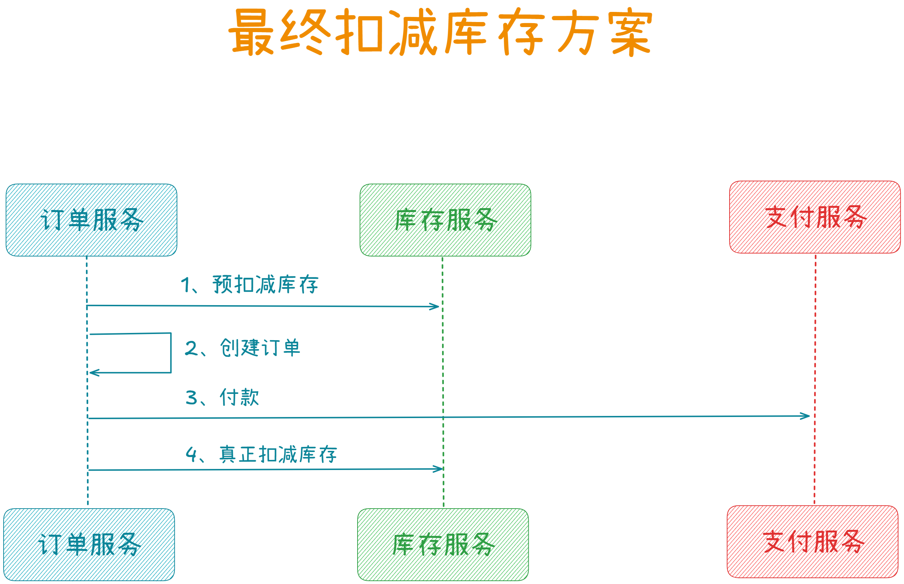

## **02 库存缓存分桶预扣减**

这部分的架构设计，我们在前面已经拆解过了，这里我们再来看下。

假设一个商品SKU有 10000 个库存，拆分为 5 个「**库存分桶**」，每个分桶 2000，这 5 个「**库存分桶**」会分散在多个 Redis 节点里。

那么当用户下单需要「**预扣减库存**」时，需要考虑 3 个问题，分别来看下。

### **2.3.4.1 如何选择 Redis 节点**

这里有两种选择 Redis 节点的方案：

1.  通过「**随机方式**」选出一个 Redis 节点来进行「**扣减库存**」。
2.  通过「**轮询方式**」选出一个 Redis 节点来进行「**扣减库存**」。
3.  最终会通过「**轮询方式**」来选择 Redis 节点去进行「**扣减库存**」。

### **2.3.4.2 如何轮询选择 Redis 节点**

这里我们会通过下面步骤来轮询选择：

1.  首先会在商品 SKU 中维护一个 Redis key，然后每次「**扣减库存**」时都对这个 Redis key 进行自增操作。
2.  接着根据 Redis key 自增值对「**库存分桶数量**」进行取模，通过取模确定一个「**库存分桶**」。
3.  然后再根据这个「**库存分桶**」，确定该分桶是在哪个 Redis 节点里的。

通过上面这样就可以将「**库存预扣减**」请求发送到那个 Redis 节点里进行处理了。

### **2.3.4.3 如何处理库存分桶不足问题**

如果通过「**轮询方式**」的某个「**库存分桶**」没库存或者库存不够了，比如当前「**库存分桶**」还有 10 个库存，但这次用户请求需要扣减 30 个库存。

显然当前「**库存分桶**」不足以扣减，此时就可以尝试下一个「**库存分桶**」来进行扣减。如果下一个「**库存分桶**」也不足以扣减，那么继续寻找下一个「**库存分桶**」来进行扣减。

如果最后发现每个「**库存分桶**」都无法单独进行扣减，那就「**合并库存**」再进行扣减。「**合并库存**」进行扣减时，会对多个「**库存分桶**」里的库存逐一扣减。

最后通过一张图来展示下整个「**库存预扣减**」过程的流程图，如下：

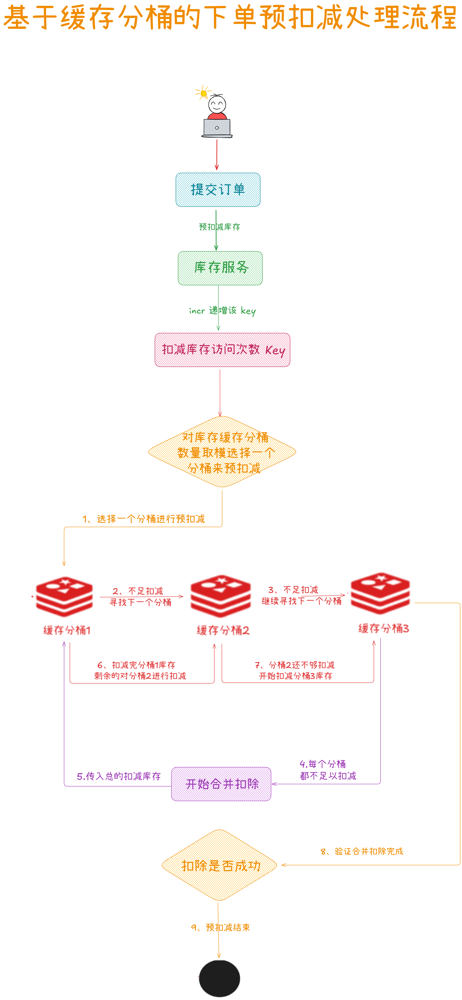

## **03 库存缓存分桶预扣减功能实现**

通过上节的处理流程图我们得知，这里会分两步来实现：

1.  单个分桶先进行预扣减。
2.  如果不够扣减的话，再尝试进行合并分桶进行预扣减。

我们分别来看下具体的实现代码。

## **3.1 缓存单分桶预扣减功能实现**

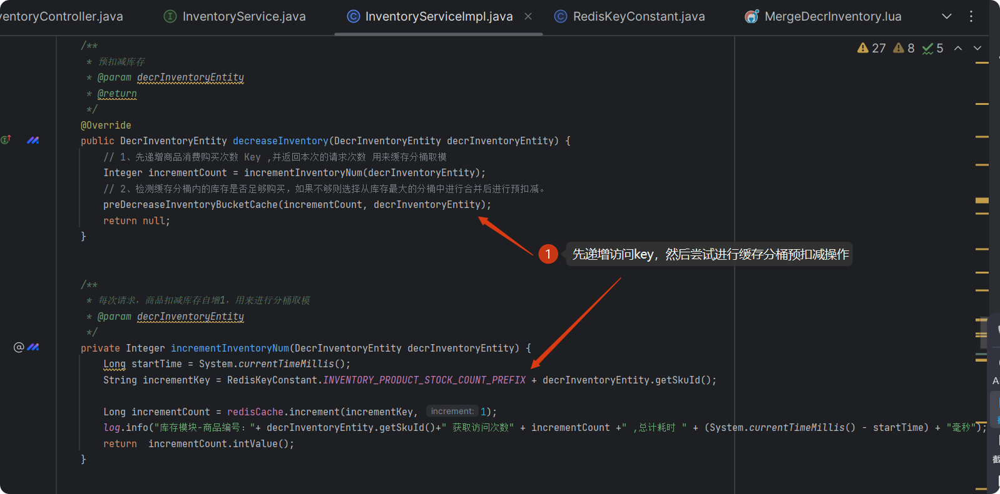

单个缓存分桶预扣减核心代码如下：

/\*\*

\* 对指定的分桶进行库存预扣减

\* @param incrementCount 分桶标识

\* @param decrInventoryEntity 扣减库存请求体

\*/

private void preDecreaseInventoryBucketCache(Integer incrementCount, DecrInventoryEntity decrInventoryEntity) {

// 库存分桶缓存类键前缀 inventory:product\_stock:skuId:分桶id

String productStockKeyPrefix \= RedisKeyConstant.INVENTORY\_PRODUCT\_STOCK\_PREFIX + decrInventoryEntity.getSkuId() + ":";

// 库存流水分桶缓存类键前缀 inventory:product\_stock:stream:skuId:分桶id

String productStockStreamKeyPrefix \= RedisKeyConstant.INVENTORY\_PRODUCT\_STOCK\_STEAM\_PREFIX + decrInventoryEntity.getSkuId() + ":";

// 获取 redis 节点数量（分桶数）

int redisCount \= redisNodeManager.getActiveNodeCount();

// 计算目标分桶（基于自增次数取模）

int targetBucketId \= incrementCount % redisCount;

// 初始化扣减结果标识

Boolean decrease \= false;

Long startTime \= System.currentTimeMillis();

// 这里采用一种全新的 lua 脚本加载方式，使用 Hutool 的单例管理容器进行保存，下次直接获取不需要加载

DefaultRedisScript<Long> luaScript = Singleton.get(PRE\_DECR\_INVENTORY\_LUA\_PATH, () -> {

DefaultRedisScript<Long> redisScript = new DefaultRedisScript<>();

redisScript.setScriptSource(new ResourceScriptSource(new ClassPathResource(PRE\_DECR\_INVENTORY\_LUA\_PATH)));

redisScript.setResultType(Long.class);

return redisScript;

});

try {

// 循环尝试分桶扣减 当一个分桶不足以预扣减，循环至下一个分桶进行预扣减除，直到全部不够后，进行合并处理

for (int bucketId \= 0; bucketId < redisCount; bucketId++) {

int currentBucketId \= (targetBucketId + bucketId) % redisCount; // 按顺序遍历分桶

// 缓存分桶库存键 inventory:product\_stock:skuId:分桶id

String bucketKey \= productStockKeyPrefix + currentBucketId;

String streamBucketKey \= productStockStreamKeyPrefix + currentBucketId;

List<String> keys = Arrays.asList(bucketKey, streamBucketKey);

Long result \= redisCache.executeDefault(luaScript, keys,

String.valueOf(decrInventoryEntity.getStockNum()),

String.valueOf(decrInventoryEntity.getIdentifier()));

log.info("库存模块-单个分桶库存预扣减结果，keys:{} decrInventoryEntity:{} result:{}", keys, decrInventoryEntity, result);

if (Objects.isNull(result)) {

continue;

}

if (Integer.parseInt(result + "") > 0) {

// redis 实例编号

int index \= bucketId % redisCount;

log.info("库存模块-单个分桶库存预扣减结果 redis实例\[{}\] 商品\[{}\] 缓存可售库存:\[{}\], 剩余缓存库存:\[{}\],耗时：\[{}\]", index, decrInventoryEntity.getSkuId(), decrInventoryEntity.getSaleableStock(), result, System.currentTimeMillis() - startTime);

decrease = true;

break;

}

}

} catch (Exception e) {

log.error("库存模块-单个分桶库存预扣减执行异常：{}", e.getMessage());

if (e.getMessage().startsWith(INVENTORY\_NOT\_ENOUGH\_ERROR)) {

log.error("库存模块-单个分桶库存预扣减执行异常 inventory not enough：{}", e.getMessage());

} else if (e.getMessage().startsWith(INVALID\_STOCK\_ARGUMENTS\_ERROR)) {

log.error("库存模块-单个分桶库存预扣减执行异常 invalid stock arguments：{}", e.getMessage());

throw new BizException("库存预扣减参数异常");

} else if (e.getMessage().startsWith(OPERATION\_ALREADY\_EXECUTED\_ERROR)) {

log.error("库存模块-单个分桶库存预扣减执行异常 operation already executed：{}", e.getMessage());

throw new BizException("库存预扣减已操作，请勿多次执行");

}

}

// 如果单个分桶已经无法预扣减库存了则进行合并预扣减

if (!decrease) {

// 获取一下当前的商品总库存，如果总库存也已不足以预扣减则直接失败

Integer totalInventoryNum \= queryInventory(decrInventoryEntity.getSkuId());

log.info("库存模块-准备合并分桶库存预扣减，商品编号：" + decrInventoryEntity.getSkuId() +" 当前缓存分桶总库存：" + totalInventoryNum);

if (totalInventoryNum.compareTo(decrInventoryEntity.getStockNum()) >= 0) {

// 合并库存预扣减

tryMergeDecreaseInventoryBucketCache(productStockKeyPrefix, productStockStreamKeyPrefix,

decrInventoryEntity, redisCount);

}

throw new BizException("合并库存已不足预扣减");

}

}

这里会有几个异常处理，对应的单个缓存分桶预扣减 Lua 脚本如下：

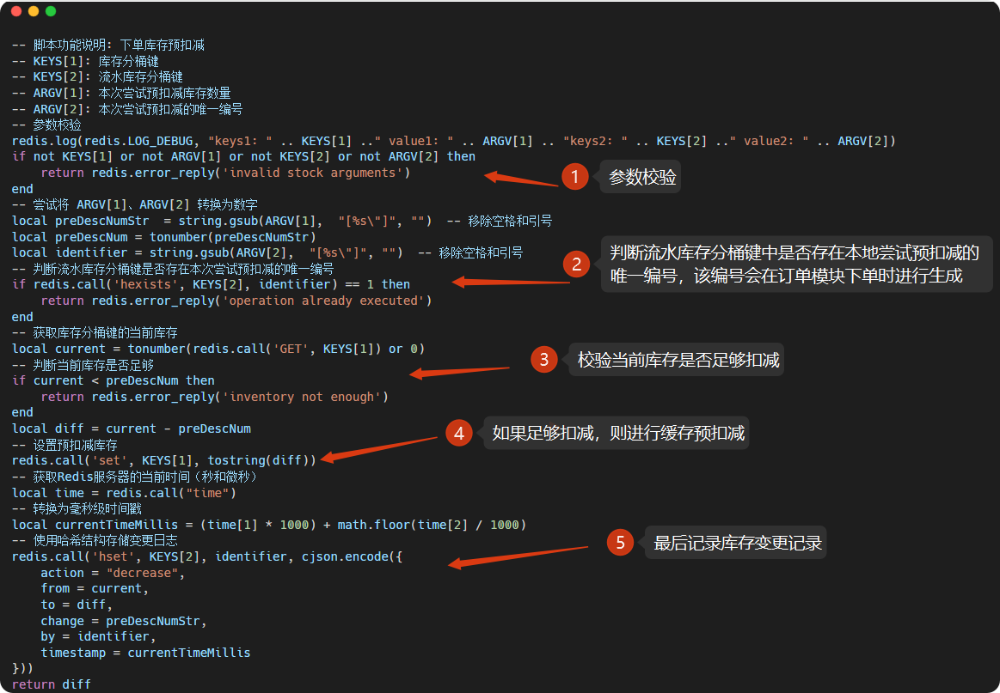

先来看下这一步的测试效果：

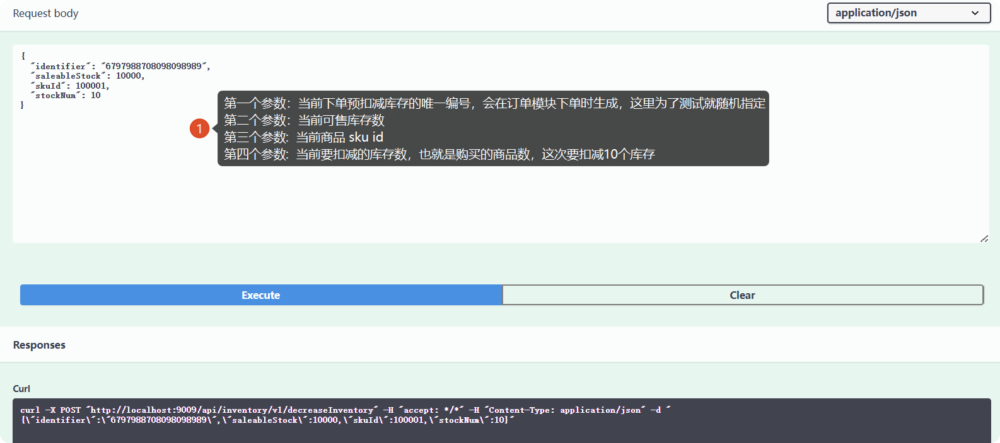

查看 Redis 当前库存如下：

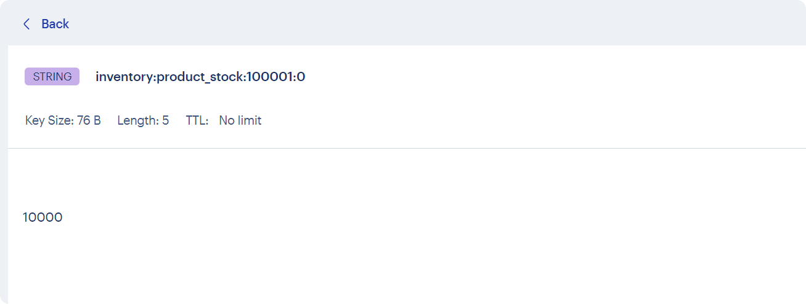

执行日志如下：

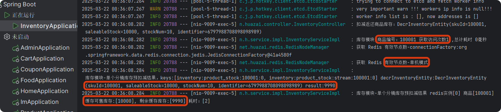

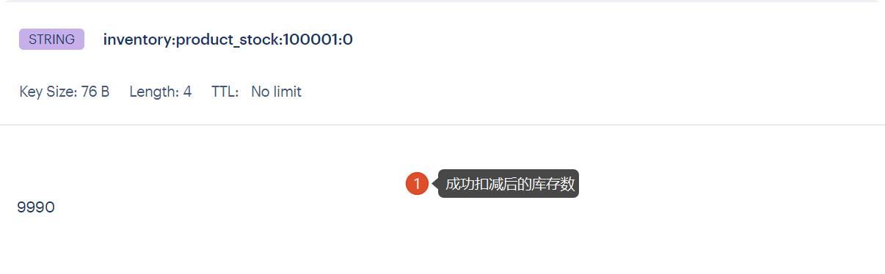

如果再次进行扣减会报异常： 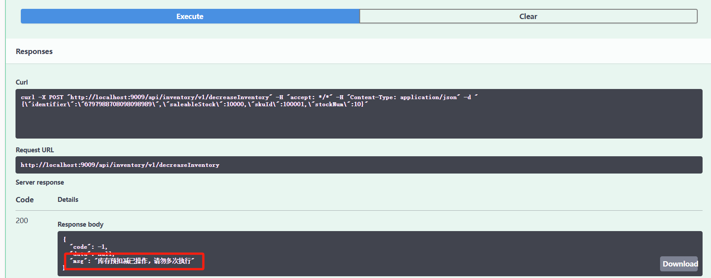

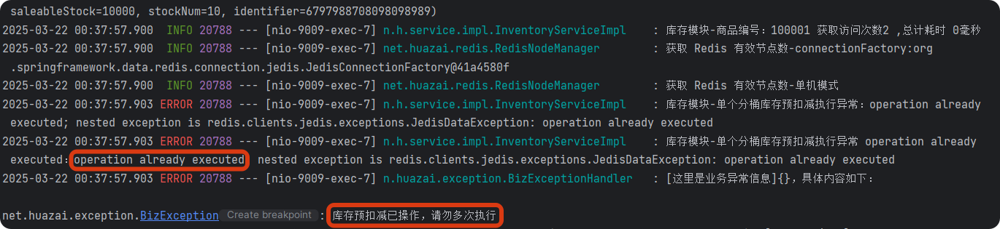

这里模拟下单个缓存分桶不够扣减的情况，这里我们直接改下缓存的数据。

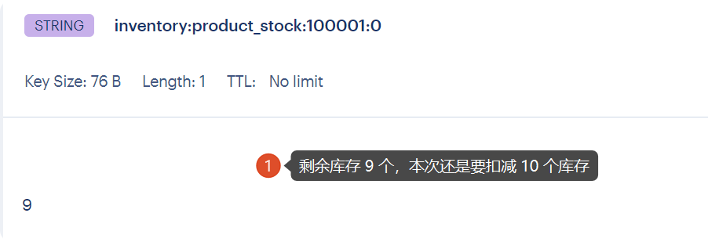

可以看到单个缓存分桶预扣减异常，即：库存不足，满足我们的执行要求。

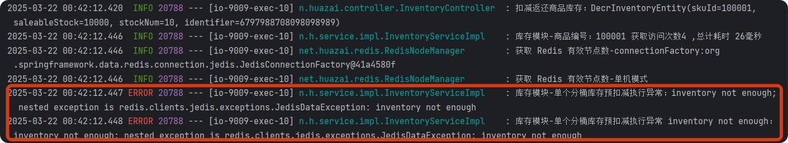

## **3.2 缓存合并分桶预扣减功能实现**

接下来我们来看下合并缓存分桶预扣减的核心代码如下：

/\*\*

\* 合并进行预扣减

\* @param productStockKeyPrefix 库存缓存 Key 前缀

\* @param productStockStreamKeyPrefix 流水缓存 Key 前缀

\* @param decrInventoryEntity 扣减库存请求体

\* @param redisCount 分桶个数

\* @return 合并的缓存 key 集合

\*/

private void tryMergeDecreaseInventoryBucketCache(String productStockKeyPrefix, String productStockStreamKeyPrefix, DecrInventoryEntity decrInventoryEntity, Integer redisCount){

// 1、执行多个分片的扣除扣减，对该商品的库存操作上锁，保证原子性

Map<Long, Integer> fallbackMap = new HashMap<>();

// 2、这里采用一种全新的 lua 脚本加载方式，使用 Hutool 的单例管理容器进行保存，下次直接获取不需要加载

DefaultRedisScript<Long> luaScript = Singleton.get(MERGE\_DECREASE\_INVENTORY\_LUA\_PATH, () -> {

DefaultRedisScript<Long> redisScript = new DefaultRedisScript<>();

redisScript.setScriptSource(new ResourceScriptSource(new ClassPathResource(MERGE\_DECREASE\_INVENTORY\_LUA\_PATH)));

redisScript.setResultType(Long.class);

return redisScript;

});

// 3、这里采用一种全新的 lua 脚本加载方式，使用 Hutool 的单例管理容器进行保存，下次直接获取不需要加载

DefaultRedisScript<Long> luaMergeScript = Singleton.get(PRE\_DECR\_INVENTORY\_LUA\_PATH, () -> {

DefaultRedisScript<Long> redisScript = new DefaultRedisScript<>();

redisScript.setScriptSource(new ResourceScriptSource(new ClassPathResource(PRE\_DECR\_INVENTORY\_LUA\_PATH)));

redisScript.setResultType(Long.class);

return redisScript;

});

// 这里增加分布式锁进行互斥，读写互斥锁，防止高并发场景下数据不一致

String LockKey \= RedisKeyConstant.INVENTORY\_PRODUCT\_STOCK\_LOCK\_PREFIX + decrInventoryEntity.getSkuId();

boolean lock \= false;

try {

// 4、尝试加锁，超时时间为 200 ms，超时后自动释放锁

lock = redisLock.tryLock(LockKey, RedisCache.USER\_UPDATE\_LOCK\_TIMEOUT);

} catch (InterruptedException e) {

// 加锁异常

log.error("库存模块-合并预扣减库存尝试加锁异常，异常信息：{}，异常栈信息：{}", e.getMessage(), e.toString());

throw new BizException("合并预扣减库存 尝试加锁异常");

}

// 加锁失败

if (!lock) {

log.info("库存模块-合并预扣减库存尝试加锁失败，失败信息：{}", decrInventoryEntity);

throw new BizException("合并预扣减库存 尝试加锁失败");

}

try {

// 5、初始化剩余需扣减量

int remaining \= decrInventoryEntity.getStockNum();

// 4、开始循环预扣减库存

for (int bucketId \= 0; bucketId < redisCount && remaining > 0; bucketId++){

// 缓存分桶库存键 inventory:product\_stock:skuId:分桶id

String bucketKey \= productStockKeyPrefix + bucketId;

String bucketStreamKey \= productStockStreamKeyPrefix + bucketId;

List<String> keys = Arrays.asList(bucketKey, bucketStreamKey);

log.info("库存模块-合并分桶库存预扣减请求，keys:{} decrInventoryEntity:{} remaining:{}", keys, decrInventoryEntity, remaining);

Long diffNum \= redisCache.executeDefault(luaMergeScript, keys, String.valueOf(remaining));

log.info("库存模块-合并分桶库存预扣减结果，keys:{} decrInventoryEntity:{}", keys, decrInventoryEntity);

// 当扣减后返回得值大于0的时候，说明还有库存未能被扣减，对下一个分片进行扣减

if (diffNum >= 0){

// 存储每一次扣减的记录，防止最终扣减还是失败进行回滚

fallbackMap.put((long) bucketId, diffNum.intValue()); // (decrInventoryEntity.getStockNum() - Integer.parseInt(diffNum+""))

// 重置抵扣后的库存

remaining -= diffNum.intValue();

}

}

// 完全扣除所有的分片库存后还是未清零，则回退库存返回各自分区

if (remaining > 0){

fallbackMap.forEach((k, v) -> {

// 缓存分桶库存键 inventory:product\_stock:skuId:分桶id

String bucketKey \= productStockKeyPrefix + k;

String bucketStreamKey \= productStockStreamKeyPrefix + k;

List<String> keys = Arrays.asList(bucketKey, bucketStreamKey);

Long diffNum \= redisCache.executeDefault(luaScript, keys, -v + "", decrInventoryEntity.getIdentifier() + "");

log.info("库存模块-合并分桶库存预扣减结果 redis实例\[{}\] 商品\[{}\] 本次库存不足，扣减失败，返还缓存库存:\[{}\], 剩余缓存库存:\[{}\]", k, bucketKey, v, diffNum);

});

throw new BizException("合并预扣减库存不足");

}

} catch (Exception e){

// 开始循环返还库存

fallbackMap.forEach((k, v) -> {

// 缓存分桶库存键 inventory:product\_stock:skuId:分桶id

String bucketKey \= productStockKeyPrefix + k;

String bucketStreamKey \= productStockStreamKeyPrefix + k;

List<String> keys = Arrays.asList(bucketKey, bucketStreamKey);

Long diffNum \= redisCache.executeDefault(luaScript, keys, -v + "", decrInventoryEntity.getIdentifier() + "");

log.info("库存模块-合并分桶库存预扣减异常结果 redis实例\[{}\] 商品\[{}\] 本次库存不足，扣减失败，返还缓存库存:\[{}\], 剩余缓存库存:\[{}\]", k, bucketKey, v, diffNum);

});

throw new BizException("合并预扣减库存过程中发送异常:{}" + e.getMessage());

} finally {

// 释放锁

redisLock.unlock(LockKey);

}

}

对应的合并缓存分桶预扣减 Lua 脚本如下：

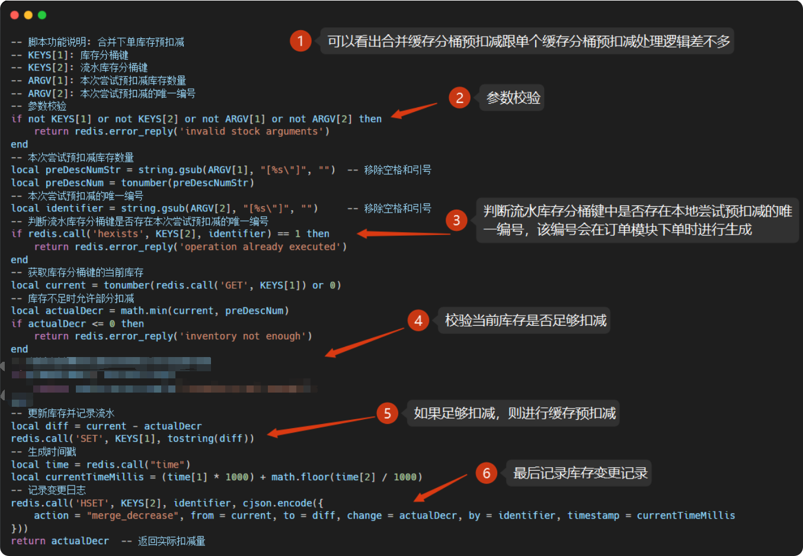

执行效果如下：

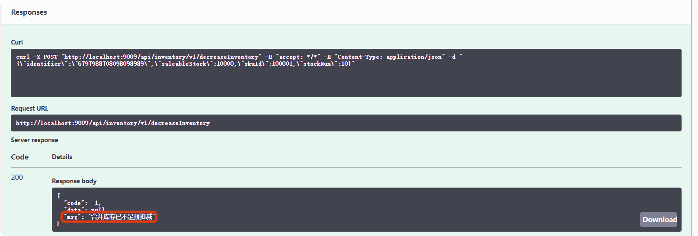

执行日志如下： 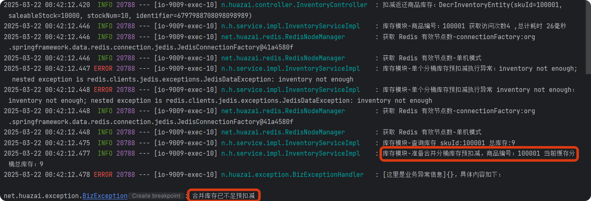

至此，基本的缓存分桶预扣减功能就完成了。

## **04 库存真正扣减功能实现**

根据本篇前言部分的「**最终库存扣减方案**」时序图得知，真正库存扣减这部分会在「**订单服务**」下单完成后进行处理和更新，此时就暂时 TODO 了。