从今天之后的一段时间内，华仔会带着大家一起从零开始搭建并研发一套高并发的电商实战项目，这里会涉及到很多互联网大厂开发过程中所使用的核心技术和架构设计模式，希望大家学完之后可以用到自己的简历中。

这是第七十五篇，本篇我们来介绍整个电商实战项目中最重要的模块之一：「**订单服务核心链路面临的技术挑战与解决方案**」。

文章汇总位置：[https://wx.zsxq.com/dweb2/index/columns/51122554151214](https://wx.zsxq.com/dweb2/index/columns/51122554151214)

源码授权与获取地址：[https://articles.zsxq.com/id\_1s85grnaae4p.html](https://articles.zsxq.com/id_1s85grnaae4p.html)

本章源码地址：[https://gitcode.net/u011359591/huazai-ecshop/-/tree/ecshop-chapter-75](https://gitcode.net/u011359591/huazai-ecshop/-/tree/ecshop-chapter-75)

## **01 前言**

通过上上篇 [【电商实战项目第七十三篇】华仔电商实战订单服务业务场景介绍与架构设计](https://articles.zsxq.com/id_7n1znf4mnd0b.html)，我们把「**订单服务**」相关业务场景、技术架构都介绍了一遍，今天我们来重点梳理下整个电商实战项目中「**订单服务核心链路面临的技术挑战与解决方案**」。

##   
**02 订单服务核心/非核心业务流程**

## **2.1 订单服务核心业务流程**

我们先来梳理下在整个电商场景中，「**订单服务**」的核心业务流程。

  
当用户对购物车中选中的一批商品提交订单时，会先出来「**确认订单界面**」。用户得先确认这个订单中的「**商品**」、「**价格**」、「**运费**」是否无误，然后确认订单的「**快递方式**」、「**收货地址**」是否无误等等。当然，在这个过程中用户可以选择是否需要使用「**优惠券**」等，当用户完成这些信息的确认后就可以提交订单了。

于是订单系统最核心的链路环节就出现了，就是根据 APP / 网页/ 小程序传来的各种信息「**完成订单创建**」。此时需要在数据库中创建对应的订单记录，当用户「**正式确认订单**」后会「**跳转到支付界面**」，让用户选择支付方式并完成订单的支付。比如跳转到支付宝或微信，让用户在支付宝或微信中完成支付。

当用户「**完成支付**」后，支付宝或微信支付系统会「**回调订单系统接口**」，通知订单系统本次「**支付已经成功**」。当订单系统收到支付成功的回调后，需要安排「**配送发货**」、需要给用户「**发放积分/红包**」来鼓励用户继续购物、需要给用户发送「**推送消息**」来通知用户支付成功准备发货。如下：

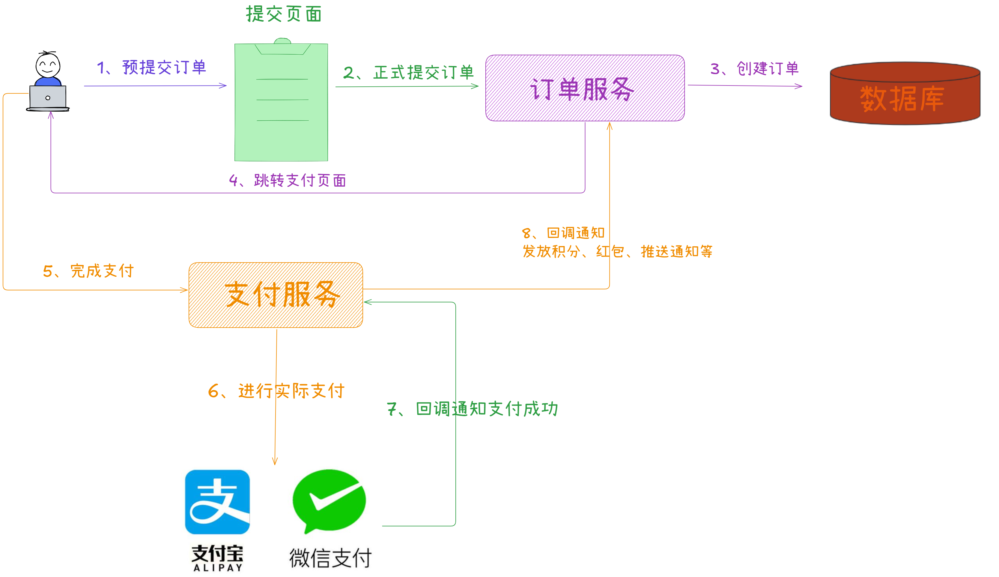

## **2.2 订单服务非核心业务流程**

在订单服务整个处理过程中还会涉及到跟「**营销服务**」、「**购物车服务**」、「**商品服务**」、「**配送服务**」等进行复杂交互。

下面就来梳理下整个订单服务运行时的一些非核心业务流程：

1.  「**生单模块**」主要是用于创建订单，「**异步处理模块**」主要是在支付成功后「**发放积分**」、「**发送红包**」和「**推送通知**」、「**通知发货**」，「**查询模块**」主要是提供订单查询的功能。
2.  当订单服务完成「**核心的生单业务流程**」后，用户通常会查询自己的订单，那么订单服务就需要提供对应的「**订单查询功能**」。当用户查询到订单列表后，有时会因为各种原因想要退货，因此订单服务还需要「**退货模块**」提供退货功能。
3.  除了要提供上述功能模块外，还需要跟「**第三方系统**」进行对接。比如要查看订单配送状态，就需要「**订单服务**」从第三方物流公司的系统中进行查询。比如运营团队需要根据订单数据进行业务分析，就需要「**订单服务**」提供订单数据给大数据团队进行报表生成。
4.  另外如果双11、秒杀等大促场景下，可能海量用户会等待一些秒杀价的商品开卖后进行疯狂抢购，此时可能会对「**订单服务**」产生一个流量洪峰，甚至影响正常的一些下单功能。因此「**订单服务**」往往需要提供一个专门用来抗双11、秒杀等活动的「**大促模块**」，专门用来处理特殊活动下的高并发下单请求，这块会在下一个版本中进行迭代。

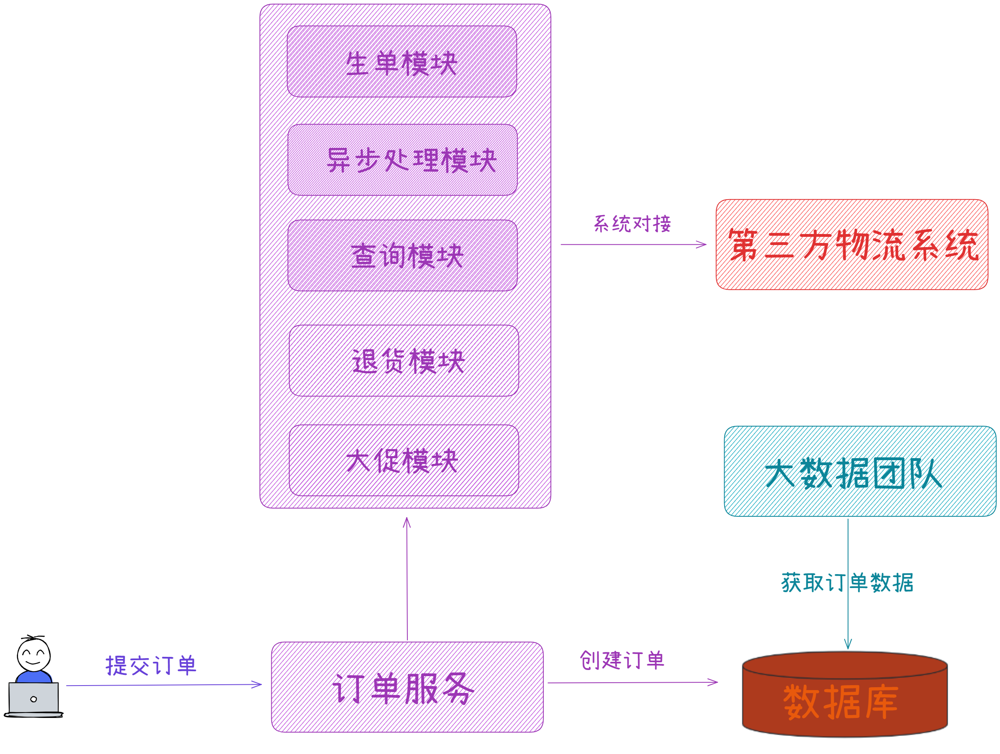

##   
**2.3 订单服务生产环境真实负载分析**

首先，我们整个社区电商系统 APP 的目标是需要支撑用户量是千万级的（小红书真实的用户量是3-4亿），对于注册的用户并不是都会天天来逛 APP，大部分用户每隔几天会来逛一逛APP。

根据统计来看，**每天活跃用户量大概在百万级**，**每天新增订单数量是十万~几十万**。随着业务的发展，日常情况下的订单数量可能很快就会变成**每天百万级**。当然在双11、618大促活动的情况下，订单数量就已经能达到**每天百万**的级别了。如下：

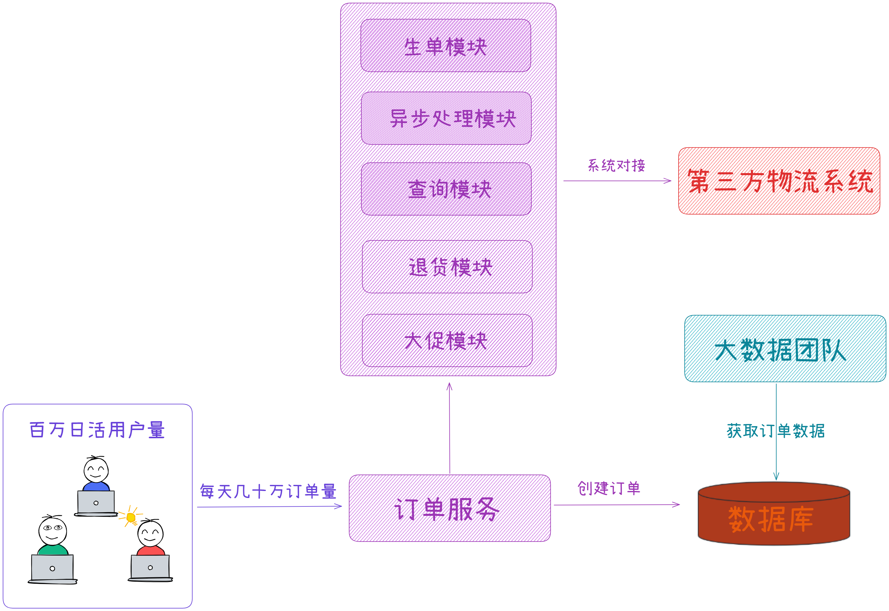

看完订单量之后，我们来看下「**订单服务**」的 QPS。QPS 即系统每秒的查询数量，该指标指「**订单服务**」所有核心以及非核心功能模块加起来，每秒有多少请求量。对我们整个社区电商系统 APP 来说，在日常每天高峰期，大概最多会达到「**每秒 2000+ 请求量**」，不算太大。但是限时秒杀活动商品来说，可能就会达到「**每秒 10000+ 请求量**」。如下：

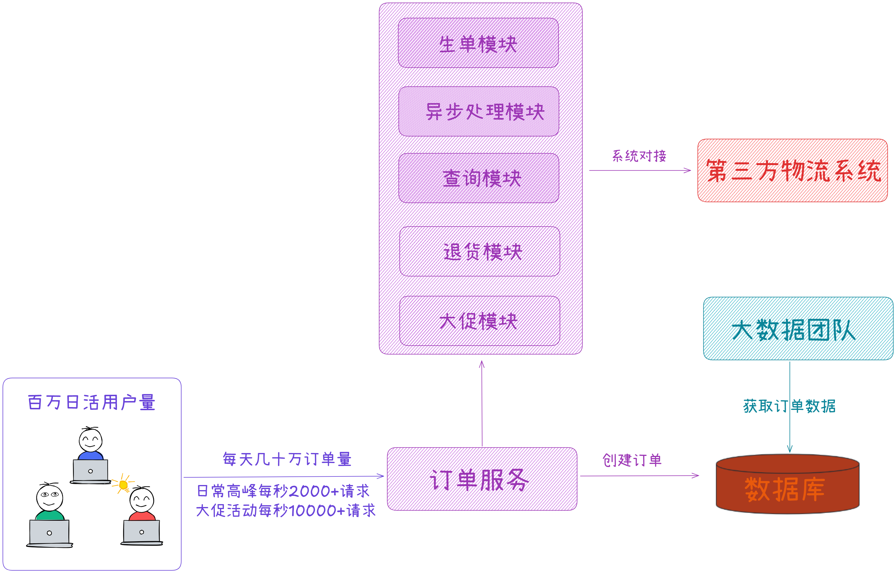

综上就是「**订单服务**」的整体压力，可以看到压力主要在两方面：

1.  订单系统日益增长的数据量。
2.  大促活动时每秒上万的请求量。

##   
**03 订单服务面临的技术挑战**

## **3.1 生单同时还要扣减库存、锁优惠券、发积分、红包、推送等导致性能差**

通过前面 **2.2 节**中的分析，「**订单服务**」会涉及跟多个上下游服务进行复杂交互，假设当前整个社区电商 APP 的整体负载为：「**千万级注册用户**」、「**百万日活**」、「**几十万日订单量**」、「**日高峰访问QPS每秒2000+**」。

通过线上的统计数据可以知道：80% 的用户都习惯在午休十二点到两点，晚下班七点到十一点这几个小时使用该APP，这个时间段刚好是大部分人的休闲时间。所以可以认为有 100 万左右的用户会使用系统。

用户首先会浏览商品、搜索商品，然后才会提交订单和支付订单，所以用户一般会对社区电商系统 APP 执行几十次到上百次点击。但大部分点击都是在和商品系统、评论系统进行交互，比如查看商品、查看评价。因此对订单系统而言，访问主要来自提交订单、对订单进行查询和退款等操作。

每天有「**几十万日订单量**」，也就对应了「**百万下单操作和订单查询操作**」。百万次针对「**订单服务**」的请求看起来似乎很多，但如果平均到这几个小时中，**每秒是不是只有几十次请求而已呢？**。如果按照这么计算，就大错特错了，因为社区电商系统 APP 有两个特点：

1.  真实的系统访问负载应该是曲线形，比如从晚上7点开始访问量开始增加，一直到晚上九十点达到顶点，然后访问量慢慢开始下落，到晚上十一点就变为最低，因此整个系统访问压力，**不能按照平均值来计算**。
2.  APP 每天都会有一些限时限量秒杀商品。在限时的那段时间里，会有海量用户在**等待实际到来然后点击购买下单**，此时订单服务的压力往往是最大的。

综上来看购物最活跃时，订单系统每秒会有超过 2000 + 的请求。即：订单服务的最高负载，其他时候都比这个负载低。

如果社区电商系统 APP 用户量越来越大、并发量越来越大、数据量越来越大，这个「**订单服务**」会有什么问题？

那么会遇到最明显的一个问题，也是最影响用户体验的一个问题，就是订单系统除了「**发放积分**」、「**发送红包**」和「**推送通知**」用户外，还要做很多事情。比如卖掉一个商品后，要「**预扣减商品库存**」、「**锁定优惠券**」、「**清理购物车**」，一旦用户成功支付了还得「**更新订单状态**」。现在根据线上系统的统计，**2.1 订单服务核心业务流程** 中的多个子步骤全部执行完毕，加起来大概需要1~2秒的时间。对于高峰期，可能会出现需要几秒钟才能完成上述几个步骤。

如果需要等待几秒才能提示「**支付成功**」，对用户来说是不能容忍的，这就是要「**亟待解决**」的第一个问题。

##   
**3.2 订单退款时流程太长导致无法退款完成**

既然「**生单流程**」会涉及很多上下游服务的复杂交互，那么「**反向操作**」也就是说订单退款也需要做相应的处理：「**增加库存**」、「**更新订单状态为已完成**」、「**回收用户积分/红包/优惠券**」、「**发送推送通知用户退款**」、「**反向操作通知仓储服务取消发货**」等。

最重要的是，需要通过第三方支付系统把钱重新退还给用户。而且如果电商平台都已经给用户发货了，用户才申请退款，那么用户还得把收到的商品寄回给平台，等平台收到商品再把钱退还给用户。如下：

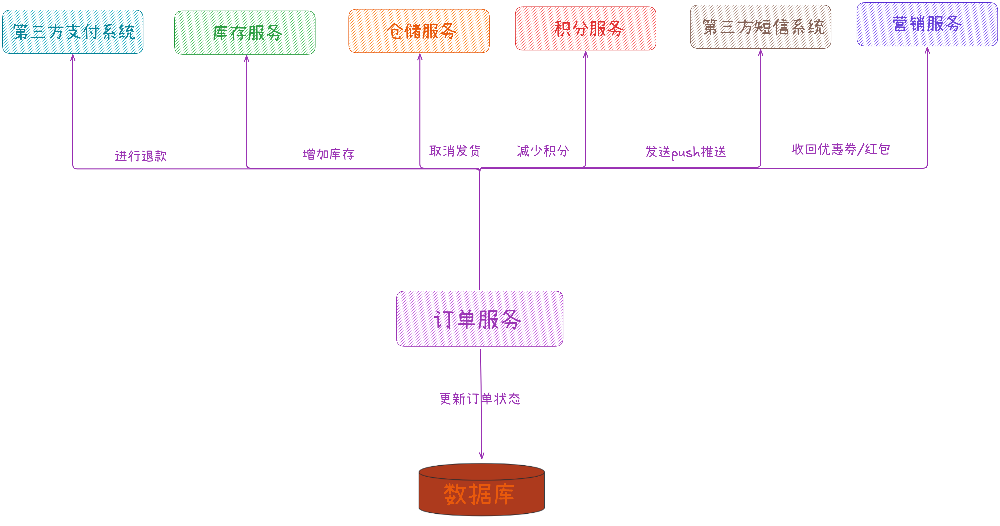

## **3.3 订单与三方系统耦合太高导致问题频繁**

前面已介绍「**订单服务**」的整体情况，也指出了「**订单服务**」目前面临的一些问题：包括订单在「**支付前**」、「**支付过程中**」以及「**支付完成后退款**」时面临的一些技术隐患。

在「**订单支付**」时，大部分「**操作步骤**」都是内部服务完成的，但是最关键的「**商品出库发货**」这个环节呢？

通常公司内部都会有自己的「**仓储服务**」，管理各种仓库和商品的发货。在发货时还需要调用「**三方物流公司系统**」，通知「**三方物流公司系统**」去仓库里取货发货。「**三方物流公司系统**」的物流系统收到货运通知后会通知自己的快递员或运输队到对方仓库里取货，然后派发货物给用户。

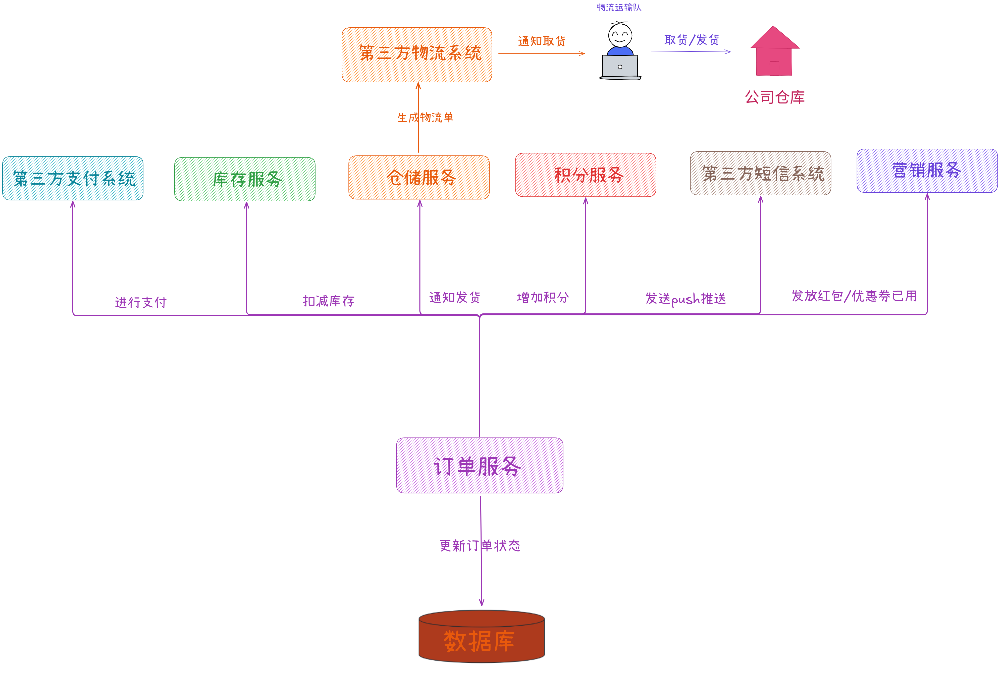

在上图中，「**订单服务**」跟「**仓储服务**」耦合，而「**仓储服务**」又跟「**三方物流公司系统**」耦合，即：「**订单服务**」间接耦合了「**三方物流公司系统**」。「**订单服务**」要调用「**仓储服务**」的接口去发货，「**仓储服务**」在接到「**订单服务**」的调用后，要同时去调用「**三方物流公司系统**」生成物流单，通知物流取货。

因此，「**仓储服务**」必须等「**三方物流公司系统**」返回确认信息后才能返回结果，「**订单服务**」才能结束对「**仓储服务**」的调用。在这个情况下，「**订单服务**」就跟「**仓储服务**」、「**三方物流公司系统**」全部耦合在一起了。

通常来说，跟「**三方系统**」的交互往往是最麻烦的。因为对于内部系统，即使有问题都可以进行推动优化。但对于「**三方系统**」的调用，就不是那么回事了。比如调用它的接口，有时候速度很快只要 100 ms，有时候速度很慢要1000 ms，有时候调用很正常，有时候偶尔会调用失败几次，该怎么办？

所以，不能完全信任「**三方系统**」，它随时有可能出现性能变差、接口失败的问题。即：「**内部服务**」跟「**三方系统**」耦合在一起的痛苦：对方不可控，导致自己系统的性能和稳定性也不可控。如果「**三方系统**」性能突然降低，那么 「**订单服务**」性能就会降低，另外还需要考虑「**失败重试机制**」。

##   
**3.4 订单与大数据团队如何对接**

每家公司都有自己的大数据团队，或大或小，大家都知道大数据团队每天要负责的事情，就是尽可能搜集用户在社区电商 APP 上的各种行为数据。比如用户搜索了什么、点击了什么、评论了什么，以及搜集用户在 APP 里的交易数据，比如最核心的订单数据，它能直观代表用户在 APP 里的所有交易。

当大数据团队搜集好大量数据后，就可以用这些数据计算出很多结果。最常见的就是数据报表，比如「**用户行为报表**」，「**订单分析报表**」等，这些数据报表会提供给运营看，来更好地运营平台。

  
如果大数据团队刚刚成立，各种基础组件都没搭建好。但是运营需要的一些数据实在太着急，所以大数据团队只能通过如下方式跑出交易报表：

比如目前订单数据库是直接对外暴露的，大数据团队可以直接访问订单数据库。他们有一个数据报表系统，运营每次查看交易报表时，会直接用一个几百行的大 SQL，从订单数据库里查数据。

由于订单数据往往是很大的，对于「**几十万日订单量**」，那么每个月就会新增「**千万级订单量**」。当运营每次要看交易报表时，都要在「**千万级数据量**」的数据库表中运行一个几百行的大 SQL，这种级别的 SQL 在这种量级下，快则三五秒，慢则几十秒。执行几百行的大 SQL 是非常消耗 CPU 和磁盘 I/O 的。一旦订单数据库负载很高，那么就会导致订单系统执行的一些增删改查操作的性能大幅下降。

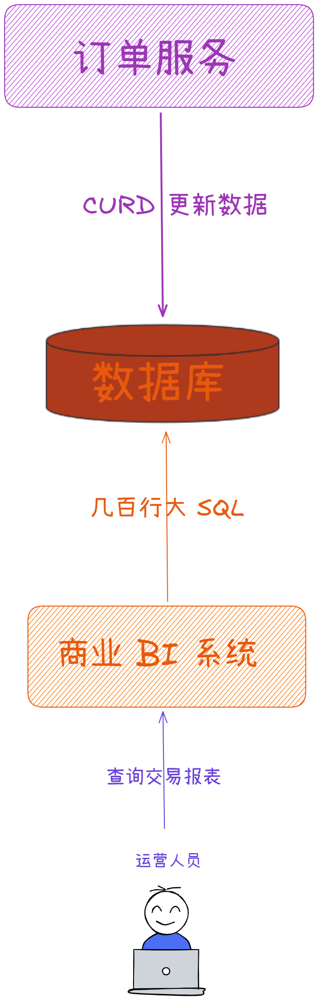

## **3.5 日常高峰期和大促活动场景下系统及数据库压力**

根据前面章节的分析，在平时午休/晚上的高峰使用期，订单系统大概会有「**每秒 2000+ 请求压力**」。

如果用户「**每秒发起 2000+ 请求**」到「**订单服务**」的各接口，包括「**下单接口**」、「**退款接口**」、「**订单查询接口**」等，那么「**订单服务**」每秒在订单数据库上执行的 SQL 数量一般可以采用如下方法进行估算：

假如「**订单服务**」平均每个接口平均执行 2~3 次的数据库操作 ，那么在最高峰时大概会有每秒 4000 ~ 6000 的请求压力。

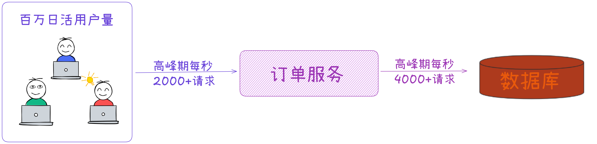

接下来看下，大促活动场景下「**订单服务**」的压力。

  
在双 11/618 当天，假设社区电商 APP 会在零点后开启一个折扣优惠特别大的活动，比如全场 5 折大甩卖。于是很多用户都会在双 11/618 前几天将大量商品加入到购物车里，然后在双 11/618 那天零点来临前盯着手机等待，接着等零点一过活动开始时就进行下单抢购商品。

当社区电商 APP 的日活用户数达到「**百万日活**」时，在这种大促场景下，「**订单服务**」的 QPS 会达到「**每秒 10000+ 请求压力**」，数据库的 QPS 会达到「**每秒 20000+ 请求压力**」。这个量级数据库是难以扛得住的，短时间内CPU、磁盘、I/O的负载都会飙升到最高。

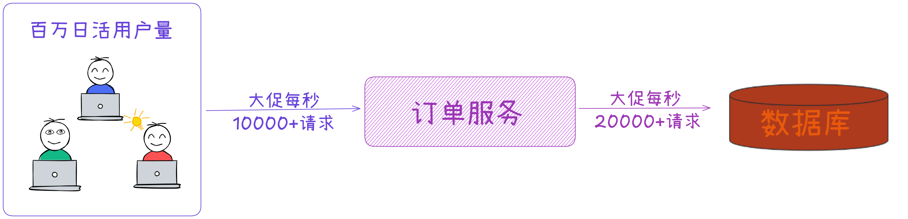

## **04 基于 RocketMQ 重构订单服务**

## **4.1 基于 RocketMQ 的生产级部署架构方案**

假如我们已经部署了一套「**3 台 NameServer**」 + 「**6 台 Broker**」的生产集群，而且对集群的生产参数都进行了适当优化，足以抗下每秒十多万的消息请求。

> 这里可以直接购买阿里云的服务，稳定性、性能都远比开源版本要好很多。

RocketMQ 的生产部署架构图如下：

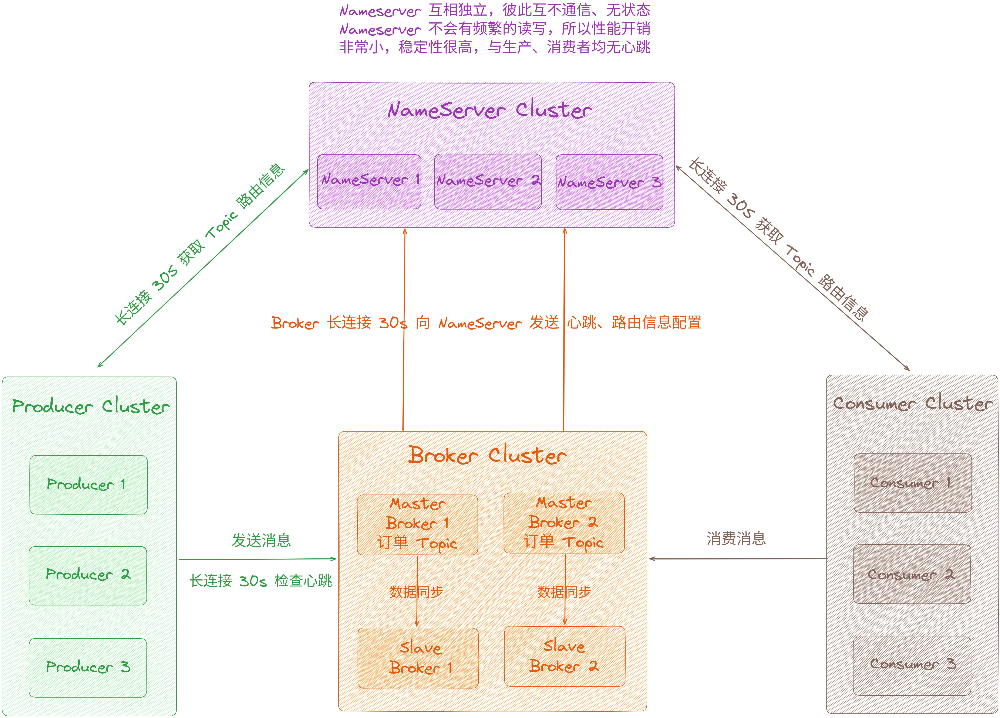

对 RocketMQ 不熟悉的可以直接在星球专栏中进行学习，星球专栏地址：[https://wx.zsxq.com/columns/51122554151214](https://wx.zsxq.com/columns/51122554151214)

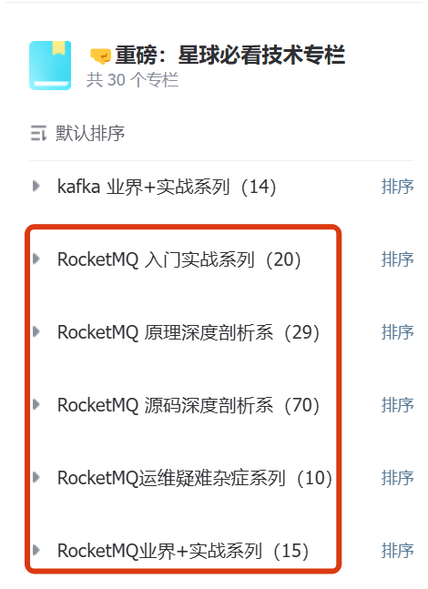

第三章节，我们深度剖析了「**订单服务**」面临的技术挑战，在上面这几个问题中，目前最为严重的是：「**下单流程性能较差，严重影响用户体验**」、「**大数据团队直连订单数据库**」。

  
下面我们开始基于 RocketMQ 进行重构和改造「**订单服务**」的架构，从「**下单核心流程**」开始，在「**订单服务**」的各个环节引入 RocketMQ 进行改造，逐步解决：「**订单退款失败问题**」、「**跟三方物流系统耦合导致的性能抖动问题**」、「**数据团队直连订单库问题**」、「**订单服务大促场景下订单库压力过大问题**」，进而全面优化「**订单服务**」的各项指标。

## **4.2 生单流程 MQ 异步改造**

原生单流程都是同步如下：

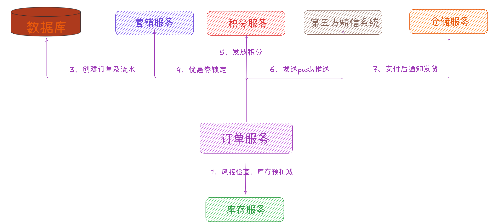

「**订单服务**」每次生成一个订单后，都会执行一系列动作，包括：「**创建订单及流水**」、「**预扣减库存**」、「**锁定优惠券**」、「**增加积分**」、「**发放红包**」、「**发送 push 推送**」、「**支付后通知发货**」等等。

这一系列的动作会导致一次「**核心链路**」执行时间过长，可能长达好几秒种，从而导致用户等待时间较长，用户体验不好。

其实只需要执行最核心的「**创建订单**」和 「**写入订单流水**」即可，以此来保证处理速度足够快。然后诸如「**预扣减库存**」、「**锁定优惠券**」、「**增加积分**」、「**发放红包**」、「**发送 push 推送**」、「**支付后通知发货**」等操作，都可以通过 MQ 来进行异步化执行。

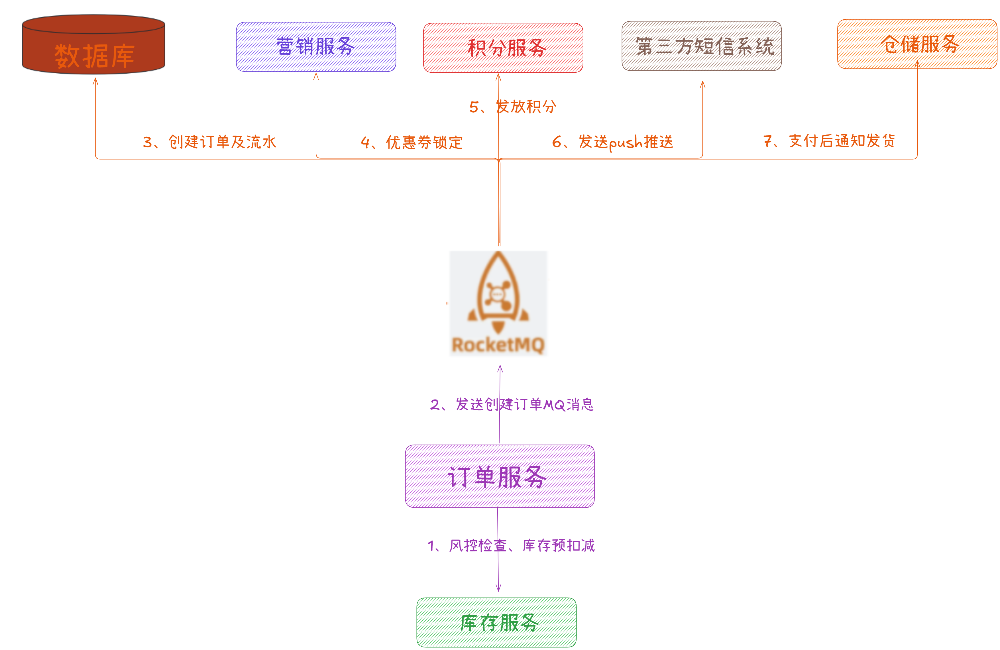

经过上述改造后，一旦用户下单成功，实际上只需要总共 100ms 左右即可：库存预扣减(90ms) + 发送订单消息到RocketMQ(10ms)，这样可以大幅提升性能。

## **4.3 与三方系统耦合 MQ 异步改造**

完成「**订单服务**」核心流程的异步化改造后，核心流程的性能便提升了10倍以上：从原来需要 1 秒甚至几秒才能执行完成的多个步骤，变成现在只需要 100 ms 左右就能执行完成的「**库存预扣减**」及「**发送订单消息到 RocketMQ**」的两个步骤。

接下来要解决「**订单服务**」跟 「**三方物流系统耦合导致的性能抖动问题**」。订单系统间接耦合的第三方系统有两个：

1.  第三方短信/推送系统，用来推送短信/ Push 推送给用户。
2.  第三方物流系统，用来生成物流单通知物流公司来收货和配送。

现在「**订单服务**」已经不需要直接调用「**推送服务**」和「**仓储服务**」的接口，只需要发送一条消息到 RocketMQ。这样「**订单服务**」跟「**三方物流系统耦合**」导致的性能抖动问题也可以直接解决了。

通过引入 MQ，「**订单服务**」已成功和「**推送服务**」及「**仓储服务**」解耦，最多就是「**仓储服务**」跟「**三方物流系统**」耦合，「**推送服务**」跟「**三方短信系统**」耦合。即使第三方系统出现严重的性能抖动，甚至是接口故障无法访问，也不会影响到「**订单服务**」。

## **4.4 基于 MQ 异步实现订单数据同步给大数据团队**

要解决这个问题，就必须要避免大数据团队直接查询订单数据库。「**订单服务**」可以将完整的订单数据推送到 MQ，然后大数据团队从 MQ 获取订单数据，接着将订单数据落地到大数据团队自己的存储中。

这就会用到我们前面讲过的 [【电商实战项目第四十五篇】华仔电商实战项目商品中心服务基于 Canal + RocketMQ 实现商品数据增量同步 ES](https://articles.zsxq.com/id_7z84tu1u1zst.html)，之前最终是同步到 ES 中，这里我们只通过到 RocketMQ 即可。

通过 Canal 监听 MySQL Binlog，然后直接发送到 RocketMQ 里。接着大数据团队的数据同步系统从 RocketMQ 中获取到 MySQL Binlog，也就获取到了订单数据库的增删改操作，最后把增删改操作还原到自己的数据库中。

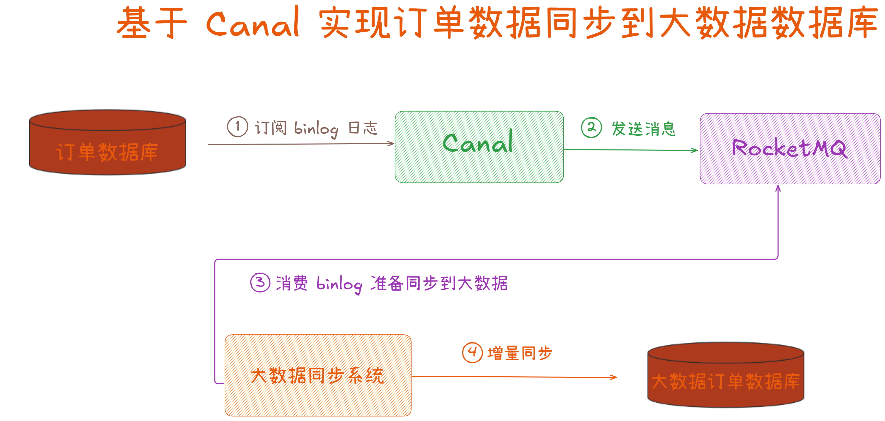