从今天之后的一段时间内，华仔会带着大家一起从零开始搭建并研发一套高并发的电商实战项目，这里会涉及到很多互联网大厂开发过程中所使用的核心技术和架构设计模式，希望大家学完之后可以用到自己的简历中。

这是第七十八篇，本篇我们来介绍整个电商实战项目中最重要的模块之一：「**订单服务核心链路超时关单流程**」的设计与功能实现。

文章汇总位置：[https://wx.zsxq.com/dweb2/index/columns/51122554151214](https://wx.zsxq.com/dweb2/index/columns/51122554151214)

源码授权与获取地址：[https://articles.zsxq.com/id\_1s85grnaae4p.html](https://articles.zsxq.com/id_1s85grnaae4p.html)

本章源码地址：[https://gitcode.net/u011359591/huazai-ecshop/-/tree/ecshop-chapter-78](https://gitcode.net/u011359591/huazai-ecshop/-/tree/ecshop-chapter-78)

## **01 前言**

通过前面 [【电商实战项目第七十三篇】华仔电商实战订单服务业务场景介绍与架构设计](https://articles.zsxq.com/id_7n1znf4mnd0b.html)，[【电商实战项目第七十五篇】华仔电商实战订单服务核心链路面临的技术挑战与解决方案](https://articles.zsxq.com/id_vn41o1wlhmgs.html)，我们把「**订单服务**」相关业务场景、技术架构、技术挑战、解决方案都介绍了一遍，在 [【电商实战项目第七十六篇】华仔电商实战订单服务核心链路生单流程基于 RocketMQ 事务消息架构设计与功能实现](https://articles.zsxq.com/id_euh6q0p89qu9.html) 、[【电商实战项目第七十七篇】华仔电商实战订单服务核心链路取消订单流程基于 RocketMQ 事务消息架构设计与功能实现](https://articles.zsxq.com/id_cn8e9rarxown.html) 我们来重点梳理下整个电商实战项目中「**订单服务核心链路生单与消单两个流程**」的设计与功能实现，今天我们来重点梳理下整个电商实战项目中「**订单服务核心链路超时关单流程**」的架构设计与功能实现。

##   
**02 超时关单流程设计与功能实现**

## **2.1 取消订单三种业务场景**

在分析「**超时关单**」前，这里我们来简单分析下「**取消订单**」的三种场景：

1.  场景一：用户生成订单后「**未支付取消订单**」。取消订单可能是「**用户手动取消订单**」 上篇已经分析完成，也可能是「**超时检查自动取消**」，也就是本篇要分析的重点，此时只需要「**释放锁定的优惠券**」和「**库存回退**」即可。
2.  场景二：用户生成订单后「**完成支付**」，还没出库，用户就「**取消订单**」。此时不仅需要「**释放锁定的优惠券**」和「**库存回退**」，还需「**取消履约**」以及「**退款**」。
3.  场景三：用户生成订单后「**完成支付**」，已出库，开始「**物流配送**」。此时用户想要「**取消订单**」，只能等收到货以后，发起「**售后退款申请**」。

  
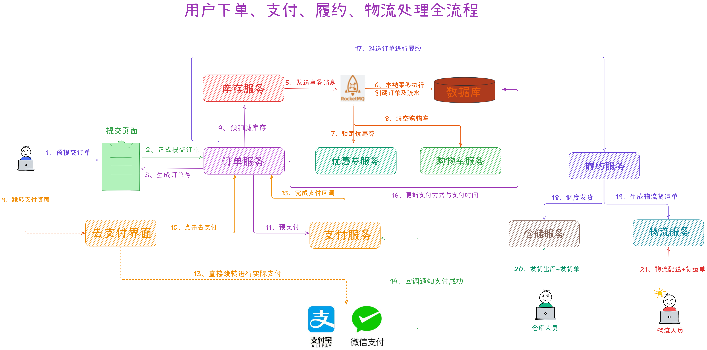

今天我们重点剖析场景一中的「**超时关单**」场景，后两个场景我们暂时不做，后续有时间再完善「**履约**」和 「**配送**」相关服务。

## **2.2 超时关单业务场景**

当用户提交到订单系统生成订单后，由于种种原因，用户并没有「**立即点击去支付**」或者「**完成支付**」。此时业界默认该订单会在「**生成 30 分钟**」后，自动进行「**支付检查**」。也就是如果「**生成订单后超过30分钟**」还「**未进行支付**」，就会「**自动进行超时关单**」。

流程图如下：

  
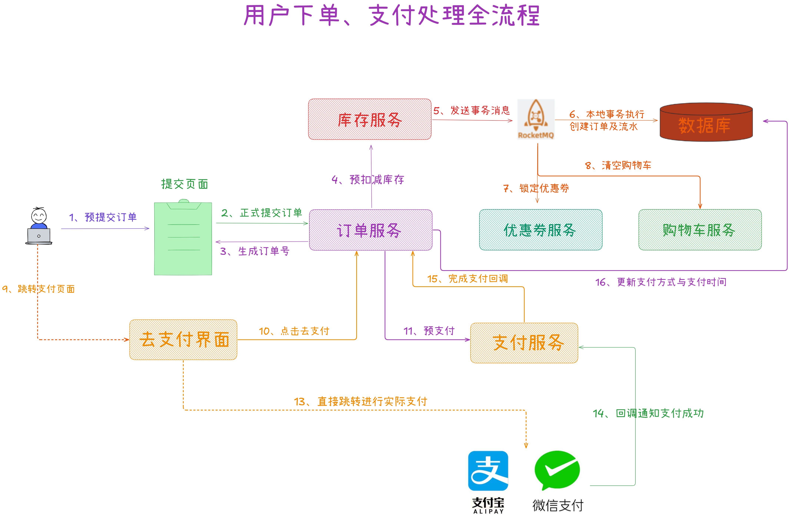

## **2.3 超时关单方案选型**

### **2.3.1 基于 RocketMQ 延时消息实现超时关单**

这里我们基于「**RocketMQ 延时消息**」来实现超时关单问题，发送需要延时消费的消息到 RocketMQ 某延时 Topic时，RocketMQ 会将该消息进行改写，投递到「**重试 Topic**」，而非指定的某 Topic。

RocketMQ 将该消息转发到「**重试 Topic**」对应的 [ConsumerQueue](http://consumerqueue/) 后，RocketMQ 会有一个内部的「**延时调度组件**」ScheduleService，该组件便会消费「**重试 Topic**」对应的 [ConsumerQueue](http://consumerqueue/) 里的消息，并判断里面的消息是否到达「**延时时间**」。如果到达延时时间，则会重新改写消息 Topic，投递到开始指定的某 Topic。

关于 RocketMQ 实现原理与源码： [【Broker端源码分析系列第三十篇】图解 RocketMQ 源码之 Broker 端延迟消息架构设计剖析](https://articles.zsxq.com/id_7ox9ujcnmshf.html)

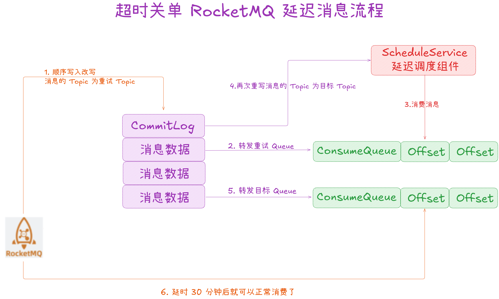

### **2.3.2 超时关单和支付并发问题**

当用户提交的订单在 30 分钟后才发起支付时，此时就有可能出现「**超时关单**」和「**支付**」会出现「**并发场景**」的问题。

那么如何解决这个问题呢？

对于「**并发场景**」问题，通常可以通过「**分布式锁**」来解决，在下面三种「**场景**」下加同一把「**分布式锁**」即可解决「**超时关单**」和「**支付**」的并发问题。

1.  订单服务处理「**预支付请求**」时添加分布式锁。
2.  订单服务处理「**支付回调请求**」时添加分布式锁。
3.  订单服务消费「**延时 30 分钟订单消息**」进行超时检查时添加分布式锁。

当处理「**预支付请求**」和「**消费延时 30 分钟订单消息进行超时检查**」时产生并发：

1.  如果处理「**预支付请求**」先获取锁，则「**超时检查**」会被阻塞，之后发现「**已支付不取消**」。
2.  如果「**超时检查**」先获取锁，则「**预支付请求**」被阻塞，之后「**预支付**」失败。

当处理「**支付回调请求**」和「**消费延时 30 分钟订单消息进行超时检查**」时产生并发：

1.  如果「**支付回调请求**」先获取锁，则「**超时检查**」会被阻塞，之后发现「**已支付不取消**」。
2.  如果「**超时检查**」先获取锁，则「**支付回调**」被阻塞，之后「**支付回调**」获取锁，发现订单已被「**超时检查**」取消，此时可能需要进行「**退款处理**」通知用户。

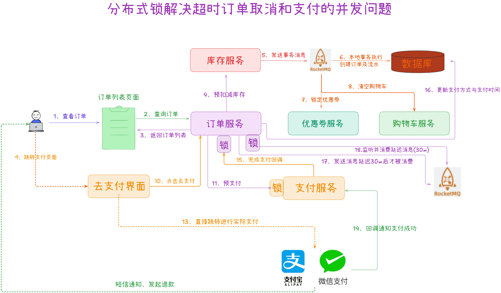

### **2.3.3 基于定时任务解决延时消费丢失问题**

如果发送到 RocketMQ 的延时 30 分钟消费的消息丢失了，此时会通过「**定时任务**」来处理。该「**定时任务**」会对MySQL 进行扫描，把「**订单创建时间超 30 分钟**」 +「**未支付**」的订单扫描出来，然后再对这些「**超时订单**」进行取消。

对于「**定时任务**」一般使用分布式调度框架 「**XXL-Job**」来实现。

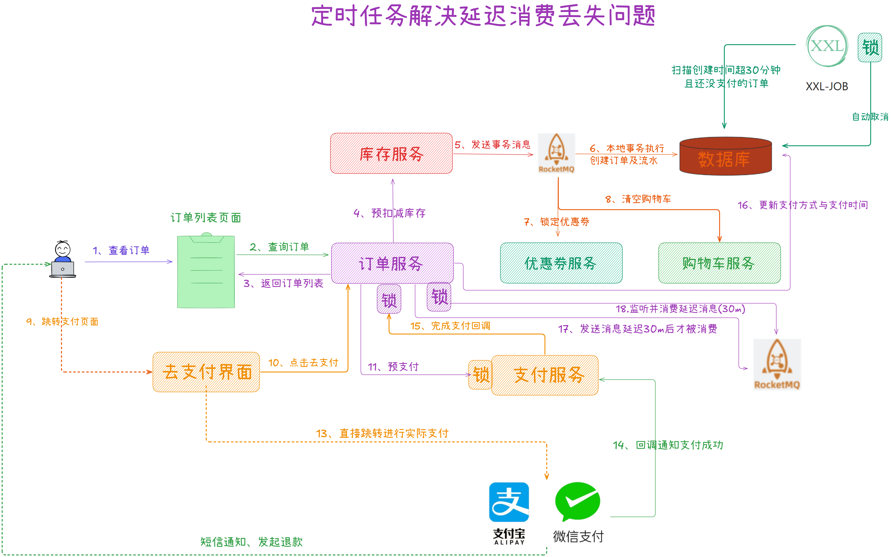

### **2.3.4 超时关单方案确定**

通过上述分析，我们最终确定「**超时关单**」的技术方案：「**RocketMQ 延时消息**」\+ 「**Redisson 分布式锁**」 + 「**XXL-JOB 分布式任务调度**」。

## **03 超时关单功能实现**

## **3.1 生单时发送延时消息**

我们只需在「**生单**」流程结束时，发送「**RocketMQ 延时消息**」进行 30 分钟后处理「**超时关单**」操作即可。

  
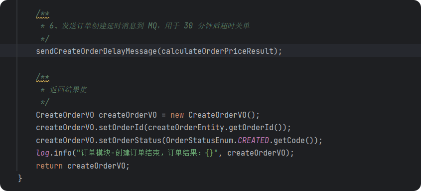

  
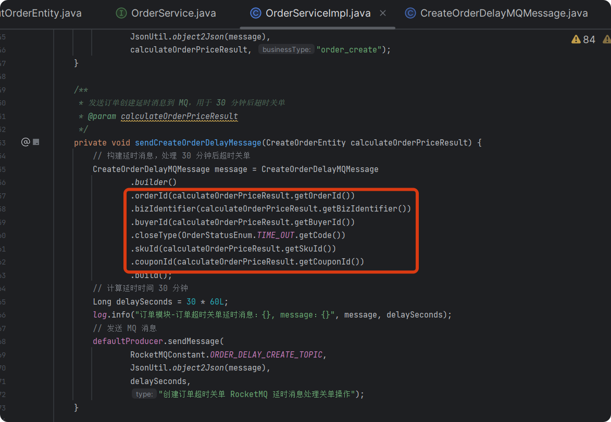

延迟消息 Topic 也同样，需要提前先在 RocketMQ dashboard 中生成，否则可能是未指定类型的消息 Topic：

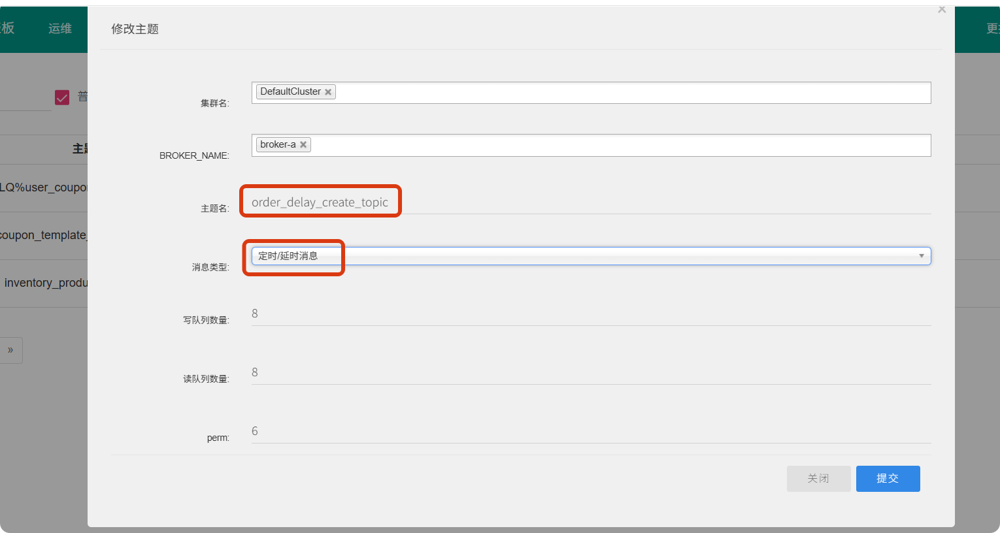

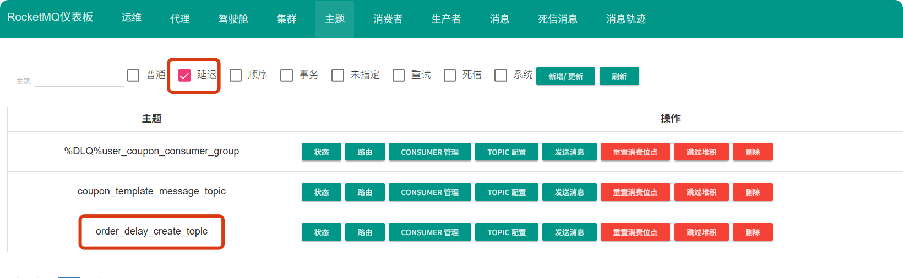

如果直接程序运行，就会出现下面这种现象，需要注意下：

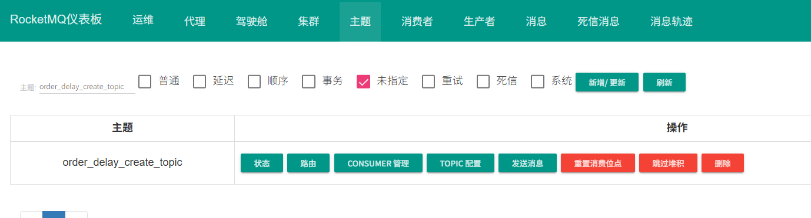

执行参数：

{

"buyerId": 0,

"couponConsumeRule": "",

"couponId": 32,

"couponName": "童装店铺满减优惠券",

"identifier": "",

"orderAmount": 10,

"sellerId": "0",

"skuCount": 1,

"skuId": 99463,

"skuMainUrl": "string",

"skuName": "string",

"skuPrice": 437,

"skuStock": 0,

"snapshotVersion": 0

}

执行日志，这里为了测试，延时时间改为 3 分钟：

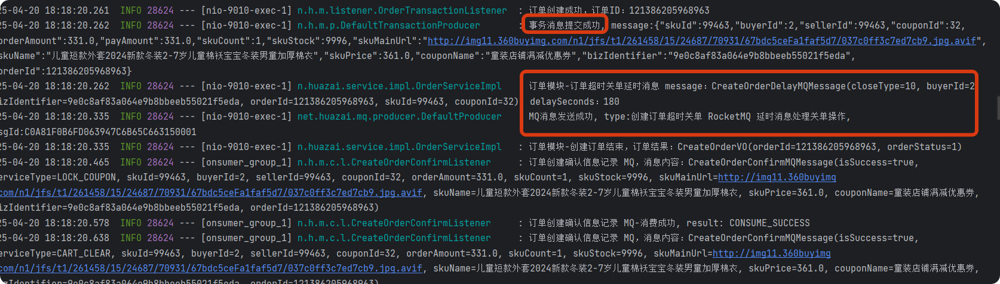

##   
**3.2 消费延时消息**

这块也比较简单，重要操作步骤在上篇都已经搞完了，比如「**模板抽象方法处理订单及流水**」，只需整合一下相关操作方法即可，重点代码如下：

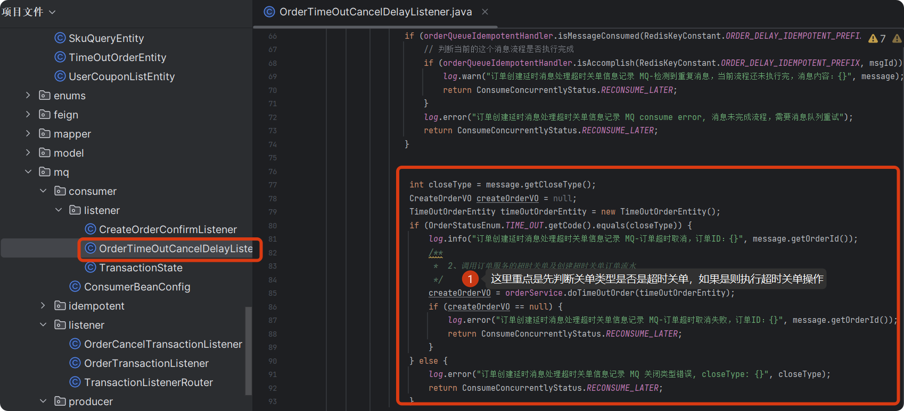

这里会在外层加一个「**分布式锁**」来进行互斥，即这三个场景中：「**预支付请求**」、「**支付回调请求**」、「**延时 30 分钟订单消息**」加同一把锁进行互斥。

  
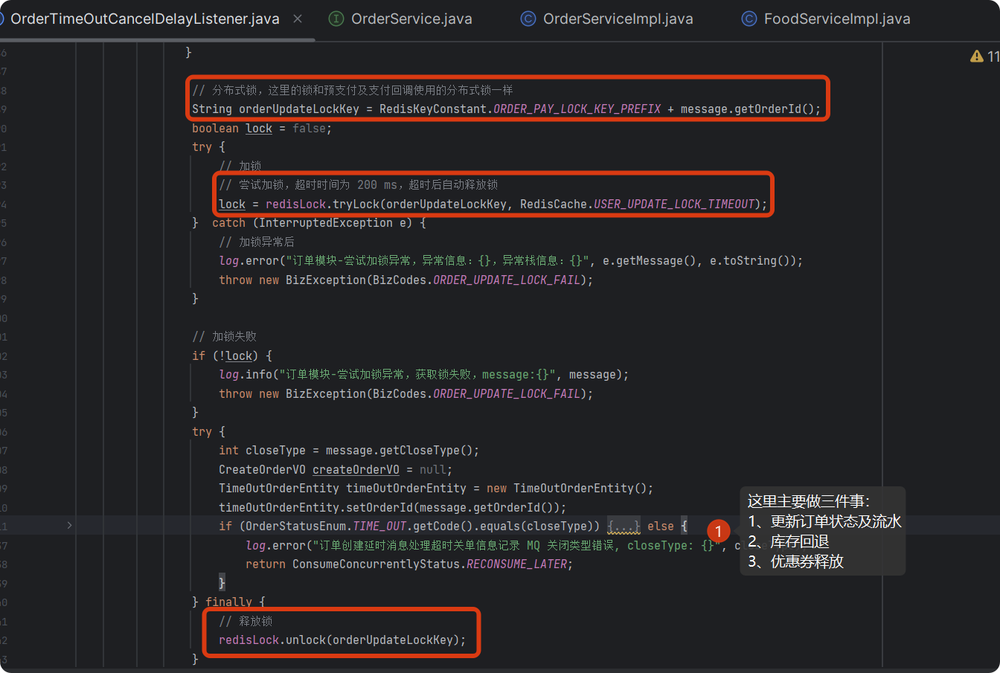

下面关于「**库存回退**」、「**优惠券释放**」这两个重要操作，这里通过「**同步方式**」来执行，如下：

  
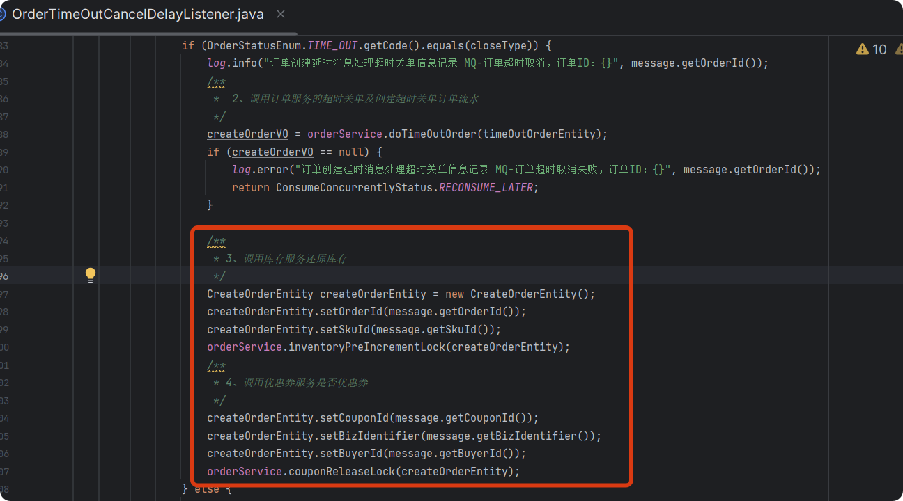

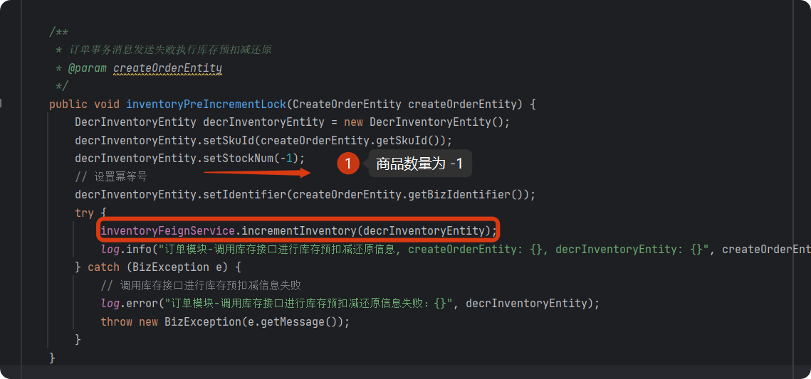

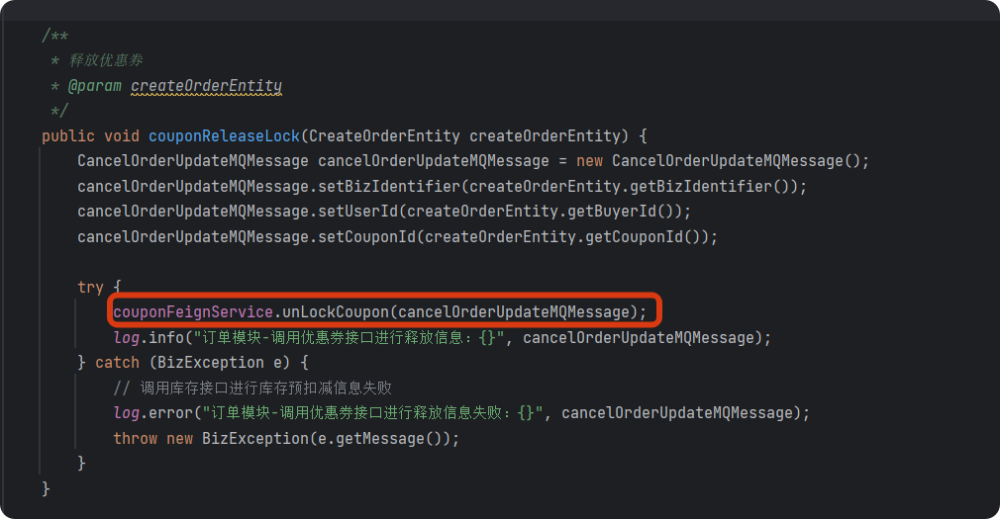

测试效果：

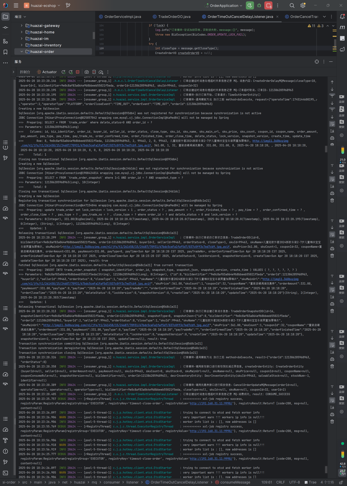

## **3.3 定时任务解决延时消息丢失的问题**

后续订单服务会做「**分库分表**」方案，这里先不做这块的处理，按单表进行处理，后续再进行修改和完善。

关于 XXL-Job 定时任务实战直接点击：[【电商实战项目第六十四篇】华仔电商实战后管服务安装部署分布式调度管理平台 XXL-Job 3.0 最新版](https://articles.zsxq.com/id_udbfdw6w1lwz.html)

关于 XXL-Job 定时任务接入直接点击：[【电商实战项目第六十五篇】华仔电商实战通过线程池+任务分片+分片消息合并优化千万级用户量优惠券推送任务](https://articles.zsxq.com/id_u2dl8rwcgb0h.html)

### **3.3.1 导入 XXL-Job 依赖**

这里导入最新版的 XXL-Job 依赖组件，需要注意版本号与 XXL-Job 版本需要一致，这里我配置的都是 3.0.0 版本。

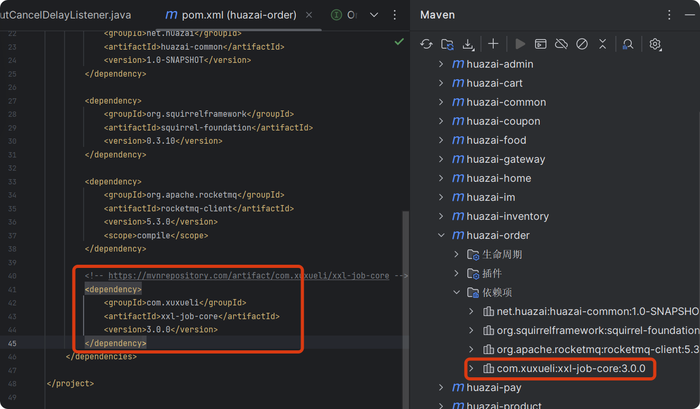

### **3.3.2 配置 application.yml 文件**

由于订单已经接入了「**Nacos 配置中心**」，将 XXL-Job 配置添加到 Nacos 后台中，如下：

  
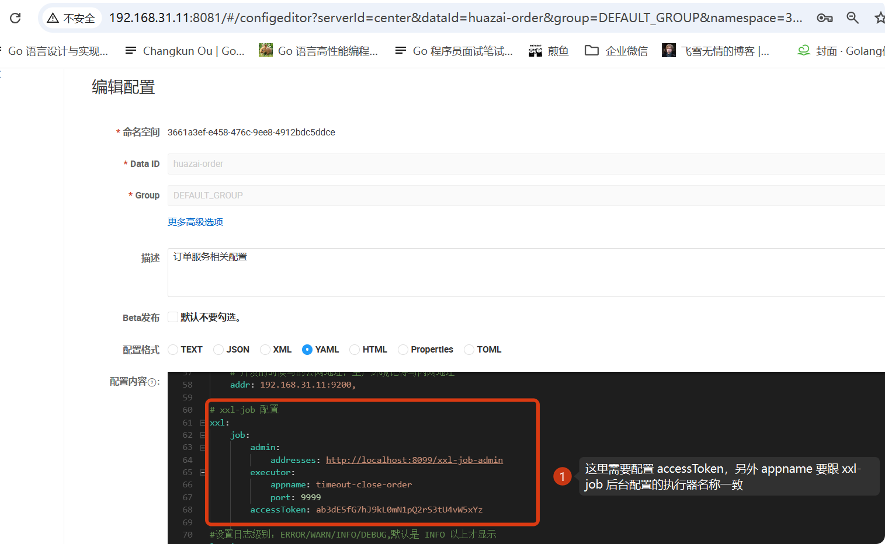

1.  [xxl.job.admin.addresses:](http://about:blank/) 用来指定调度中心的地址。
2.  [xxl.job.executor.appname](http://xxl.job.executor.appname/): 用来指定执行器的名称（需要与后续 **3.3.4** 配置执行器的名称一致）。
3.  [xxl.job.executor.port](http://xxl.job.executor.port/): 用来指定执行器的端口（执行器实际上是一个内嵌的 Server，默认端口为 9999，配置多个同一服务实例时需要指定不同的执行器端口，否则会端口冲突）。
4.  [xxl.job.accessToken](http://xxl.job.accesstoken/): 用来指定访问口令（也就是上篇搭建 xxl-job 中指定的）。
5.  其他属性只需要照着配置即可。

### **3.3.3 编写配置类**

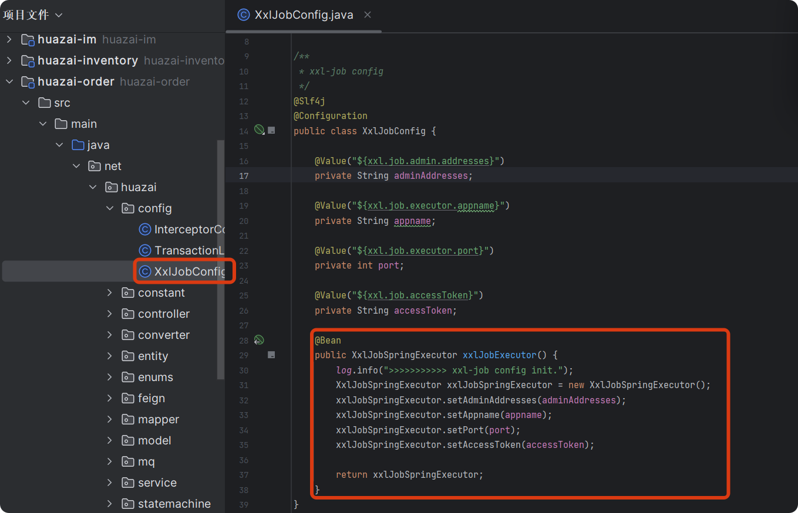

查看启动日志如下：

  
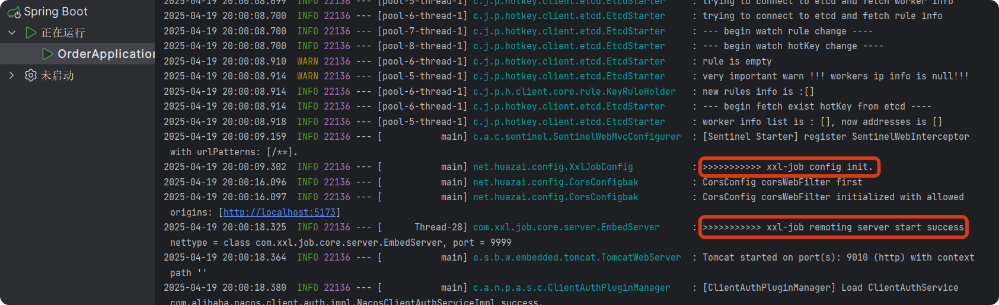

因为还未在 XXL-Job 后台添加对应的执行器并注册，所以这里只有「**初始化成功**」。

### **3.3.4 调度中心修改对应的执行器**

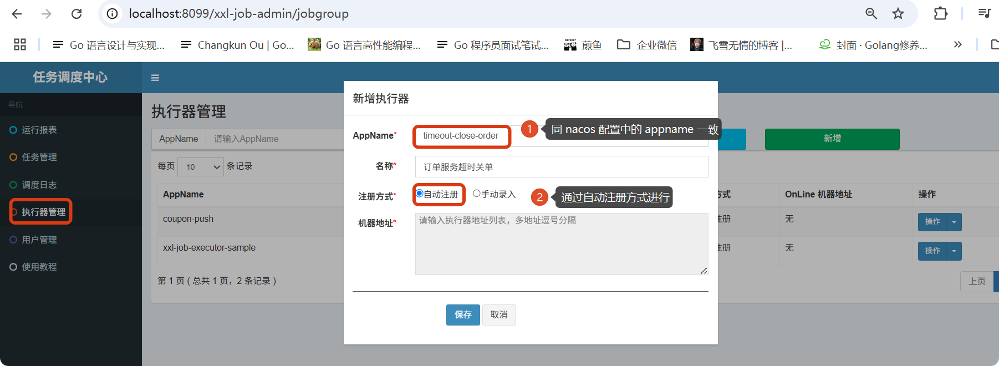

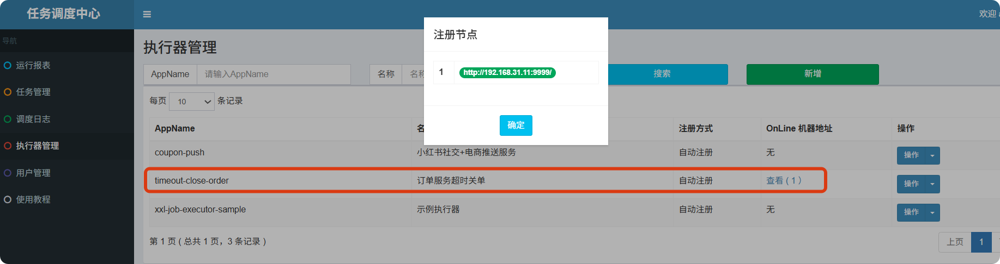

执行器的配置属性：

1.  AppName: 每个执行器集群的唯一标示 AppName，执行器会周期性以 AppName 为对象进行自动注册。可通过该配置自动发现注册成功的执行器，供任务调度时使用。
2.  名称: 执行器的名称（可以使用中文更好地体现该执行器是用来干嘛的）。
3.  注册方式：调度中心获取执行器地址的方式（一般为了方便可以选用自动注册即可）。
4.  自动注册：执行器自动进行执行器注册，调度中心通过底层注册表可以动态发现执行器机器地址。
5.  手动录入：人工手动录入执行器的地址信息，多地址逗号分隔，供调度中心使用。
6.  机器地址："注册方式"为"手动录入"时有效，支持人工维护执行器的地址信息。

再次重启订单服务，日志如下：

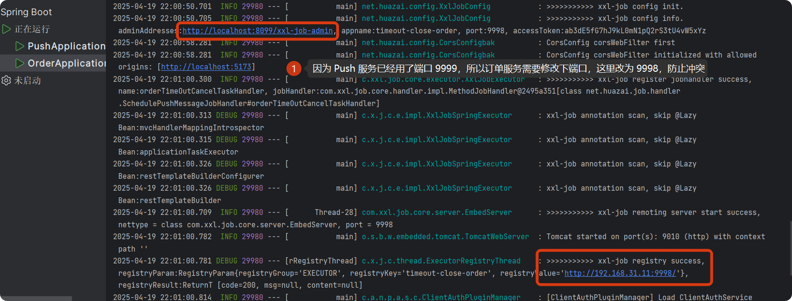

### **3.3.5 配置自定义任务**

配置自定义任务有许多种模式，如「**Bean 模式（基于方法）**」、「**Bean 模式（基于类）**」、「**GLUE 模式**」等等。这里介绍通过「**Bean 模式（基于方法）**」 是如何自定义任务的（对于其余的模式可以参考官方文档）。

「**Bean 模式（基于方法）**」也就是每个任务对应一个方法，通过添加 [@XxLJob(value="自定义JobHandler名称", init = "JobHandler初始化方法", destroy = "JobHandler销毁方法")](http://xn--xxljob\(value="jobhandler",%20init%20=%20"jobhandler",%20destroy%20=%20"jobhandler"\)%20-pi82lc10igdsl0t2o3j4z8a4z5p4a3977lfvva6a93893at9yfg6oq/) 注解即可完成定义。

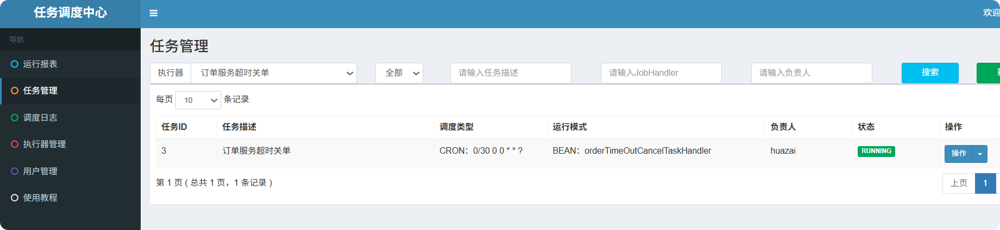

1.  通过注解也可以指定初始化方法和销毁方法，如果不填写可以直接写一个 自定义的 JobHandler 名称 用来后面在调度中心中配置任务时对应任务的 JobHandler 属性值。
2.  可以通过 [XxlJobHelper.log](http://xxljobhelper.log/) 来打印日志，通过调度中心可以查看执行日志的情况。
3.  可以通过 [XxlJobHelper.handleFail](http://xxljobhelper.handlefail/) 或 [XxlJobHelper.handleSuccess](http://xxljobhelper.handlesuccess/) 手动设置任务调度的结果（不设置时默认结果为成功状态，除非任务执行时出现异常）。

### **3.3.6 如何将任务均分给每台机器**

对于后续订单服务会进行「**分库分表**」，并且数据量会很大，单机任务扫表的性能可能无法满足需求，执行时间过长导致任务堆积，需要搭建集群服务来做到并行任务调度，从而减小 CPU 的开销，那么怎么均分任务呢？

为了解决这个问题，我们采用「**多线程扫表**」的方案，利用 XXL-Job 在集群部署时，配置路由策略中选择「**分片广播**」的方式，充分利用集群中的所有实例进行任务处理，可以使一次任务调度会广播触发集群中所有的执行器执行一次任务，并且可以向系统传递分片参数。

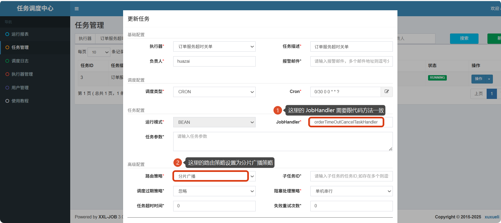

利用这一特性可以根据当前执行器的「**分片序号**」和 「**分片总数**」来获取对应的订单记录。

先来看看 Bean 模式下怎么获取分片序号和分片总数：

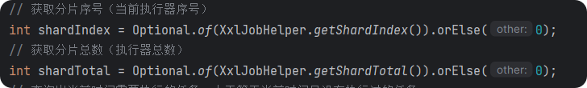

有了这两个属性，当执行器扫描数据库获取记录时，可以根据「**取模**」的方式获取属于当前执行器的任务，扫描订单表，根据任务 id 对分片总数「**取模**」来实现对所有分片的均分任务，通过判断是否是当前分片序号，如果是则执行相关任务操作，否则忽略。

  
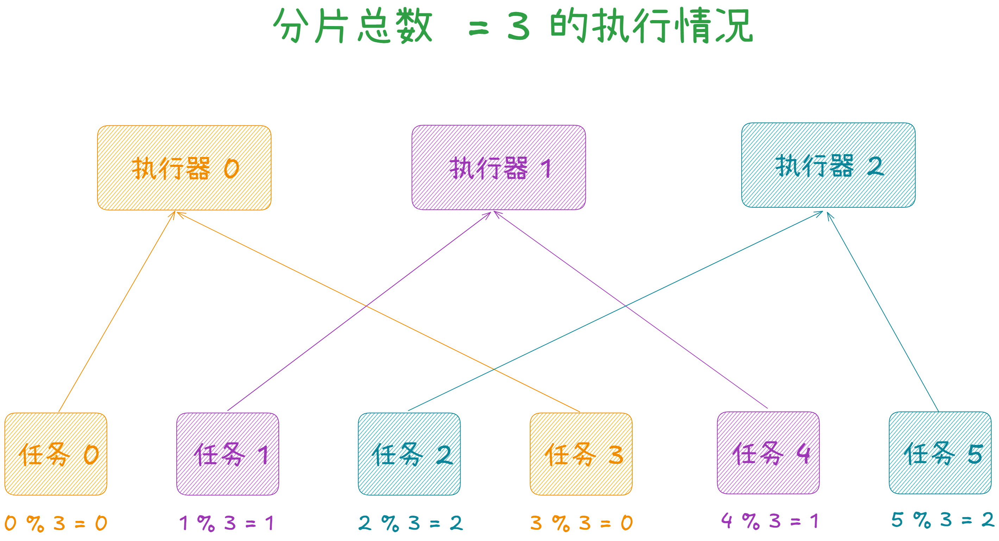

因此通过 XXL-Job 的「**分片广播**」＋「**取模**」的方式即可实现对集群服务均分任务的操作。

###   
**3.3.7 单任务如何高效并发执行**

这里为了提高「**单任务**」处理效率，我们在每个任务执行过程中，采用「**生产者、消费者模式**」，再通过「**线程池**」进行快速消费。

  
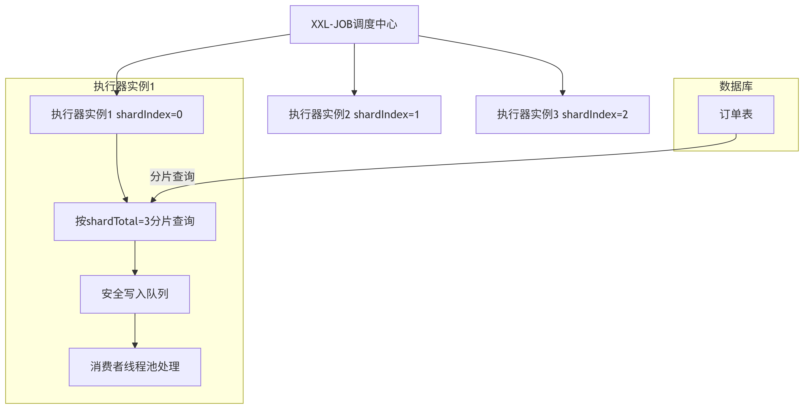

###   
**3.3.7.1 生产者消费者模式**

为了让执行消费速度更快，我们把从「**数据库读取数据动作**」和「**消费这些数据动作**」拆分开，分别是「**生产者**」和「**消费者**」。

「**生产者**」从数据库中分页取出数据，然后把他们放到一个「**阻塞队列**」中，「**消费者**」不断从「**阻塞队列**」中取出数据进行消费。

这里使用 [LinkedBlockingQueue](http://linkedblockingqueue/) 作为阻塞队列：当队列为空时，获取元素的线程会等待队列变为非空。 当队列满时，存储元素的线程会等待队列可用。 阻塞队列常用于「**生产者**」和「**消费者**」的场景，「**生产者**」是往队列里添加元素的线程，「**消费者**」是从队列里拿元素的线程。

  
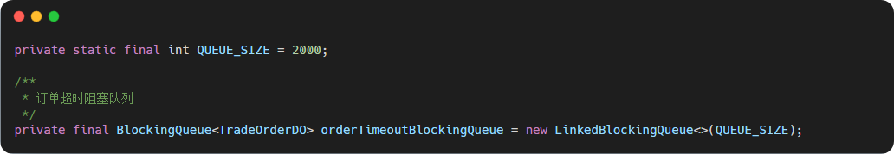

### **1、 生产者**

可以看到，生产时只要数据库中还有数据就会不断向队列中添加的：

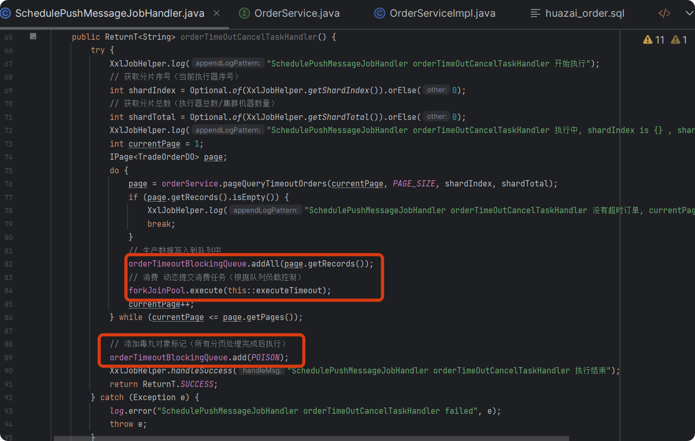

这里，在 while 外面添加了一个毒丸对象 POISON，它只是定义的一个空对象，用来标识生产结束的。

  
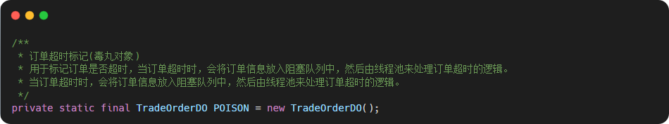

### **2、 消费者**

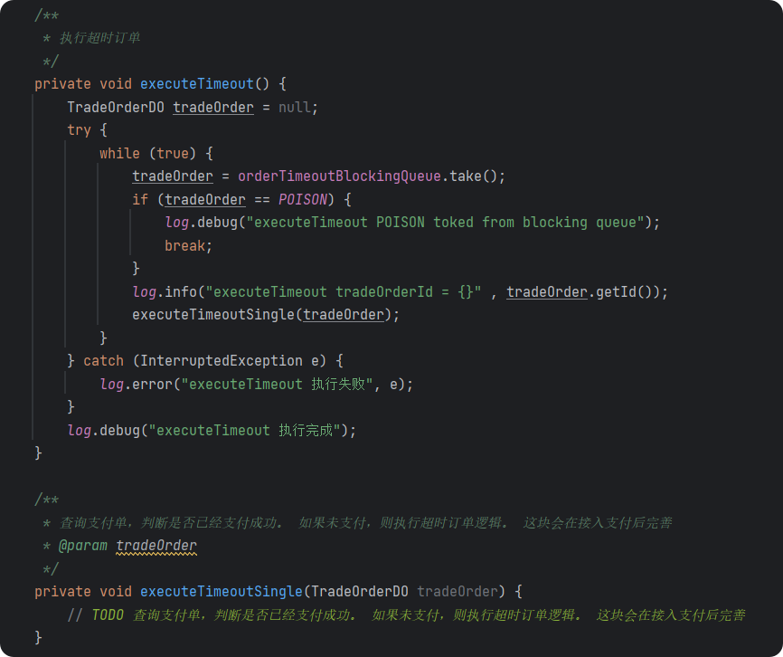

这里只需要判断从队列中取出来的对象是不是毒丸对象，如果是则跳出循环，任务结束，如果不是，则执行业务逻辑。

另外需要判断订单是否已支付，这块目前 TODO，等接入支付后再来完善。

### **3、 线程池**

为了提升消费的速度，通过多线程进行并发消费的，从 [orderTimeoutBlockingQueue](http://%20ordertimeoutblockingqueue/) 中不断的取出任务进行消费。这里用到了 [forkJoinPool](http://%20forkjoinpool/)，因为消费任务之间是互相独立的任务，[forkJoinPool](http://forkjoinpool%20/) 有偷窃算法，可以更加高效的处理这类任务。

  
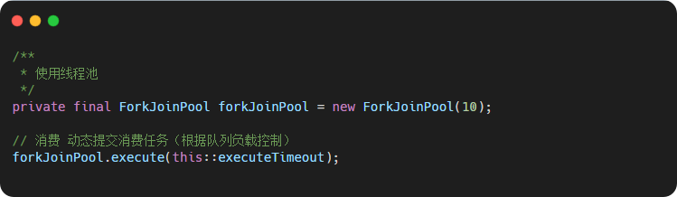

###   
**4、 测试结果**

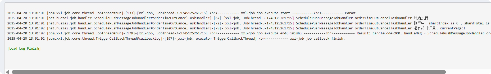

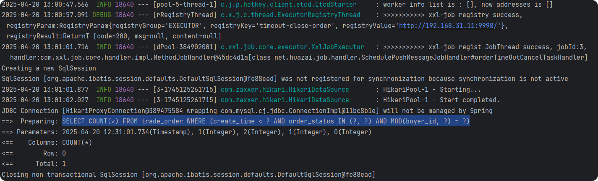