从今天之后的一段时间内，华仔会带着大家一起从零开始搭建并研发一套高并发的电商实战项目，这里会涉及到很多互联网大厂开发过程中所使用的核心技术和架构设计模式，希望大家学完之后可以用到自己的简历中。

这是第七十六篇，本篇我们来介绍整个电商实战项目中最重要的模块之一：「**订单服务核心链路生单流程**」的设计与功能实现。

文章汇总位置：[https://wx.zsxq.com/dweb2/index/columns/51122554151214](https://wx.zsxq.com/dweb2/index/columns/51122554151214)

源码授权与获取地址：[https://articles.zsxq.com/id\_1s85grnaae4p.html](https://articles.zsxq.com/id_1s85grnaae4p.html)

本章源码地址：[https://gitcode.net/u011359591/huazai-ecshop/-/tree/ecshop-chapter-76](https://gitcode.net/u011359591/huazai-ecshop/-/tree/ecshop-chapter-76)

## **01 前言**

通过前面 [【电商实战项目第七十三篇】华仔电商实战订单服务业务场景介绍与架构设计](https://articles.zsxq.com/id_7n1znf4mnd0b.html)，[【电商实战项目第七十五篇】华仔电商实战订单服务核心链路面临的技术挑战与解决方案](https://articles.zsxq.com/id_vn41o1wlhmgs.html)，我们把「**订单服务**」相关业务场景、技术架构、技术挑战、解决方案都介绍了一遍，今天我们来重点梳理下整个电商实战项目中「**订单服务核心链路生单流程**」的设计与功能实现。

##   
**02 生单流程设计与功能实现**

## **2.1 生单流程设计**

先来看下整个「**订单服务核心链路生单流程**」处理的时序图，如下：

  
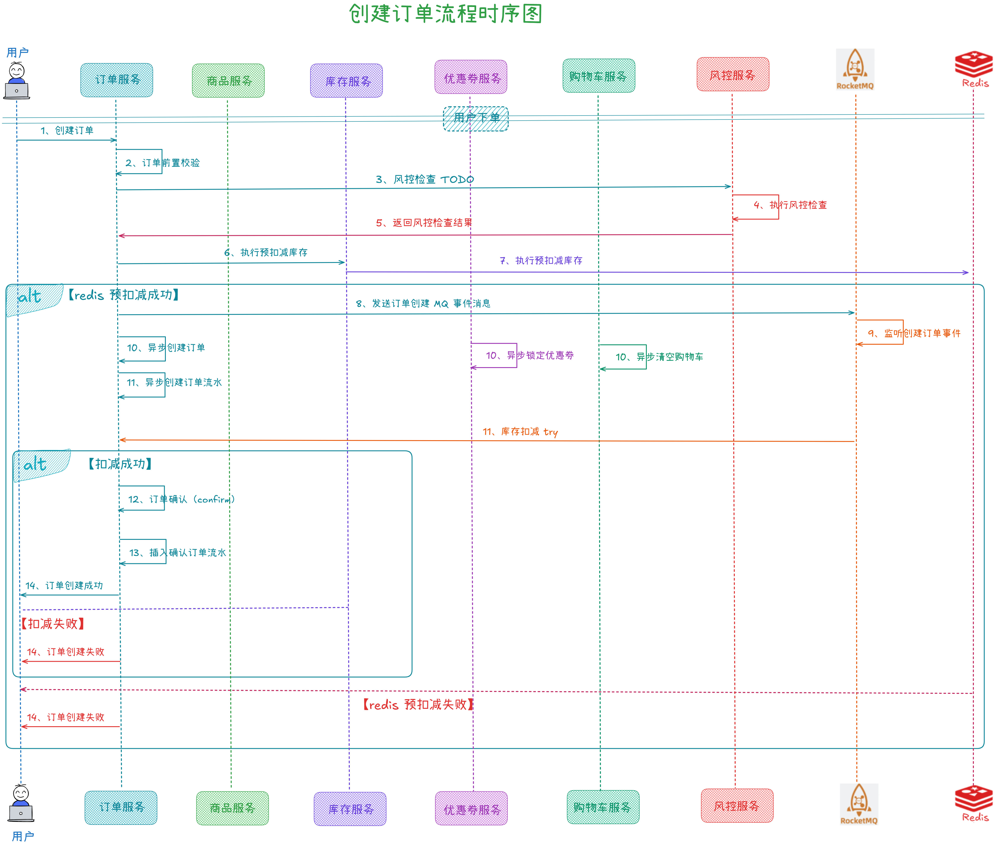

在这个过程中，会涉及到「**多个核心服务链路交互**」，其中「**风控系统检查**」这次先不做，留到下一个版本进行迭代。「**锁定优惠券**」是本次要做的功能，「**库存预扣减**」已经在「**库存服务**」剖析过了，忘记的可以点击：[【电商实战项目第七十二篇】华仔电商实战库存服务之库存缓存分桶预扣减方案功能实现](https://articles.zsxq.com/id_9sr5xwzox4px.html)。其余跟「**订单服务**」相关的都是本次要开发的功能。

整个链路还是比较复杂的，为了提升「**生单流程性能和数据一致性**」，我们采用 RocketMQ 事务消息来实现除「**库存预扣减**」外的后续链路交互。

##   
**2.2 订单前置检查**

此处主要是针对「**卖家信息**」、「**商品及卖家信息**」、「**优惠券信息**」、「**库存信息**」进行校验，这里会简单使用「**责任链**」进行校验。

###   
**2.2.1 责任链方式校验**

  
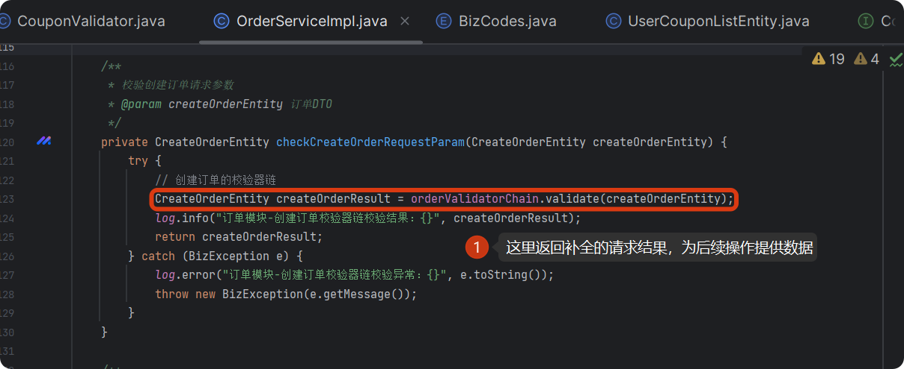

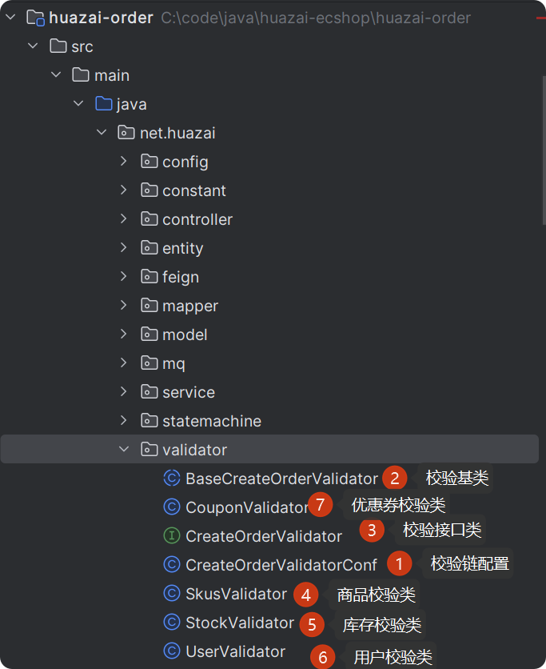  

  
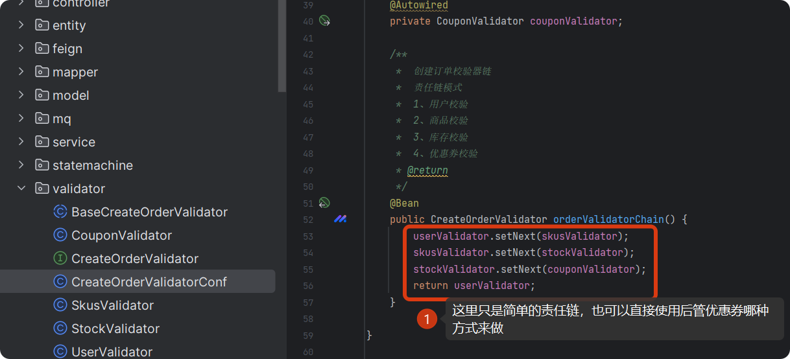

### **2.2.2 用户校验**

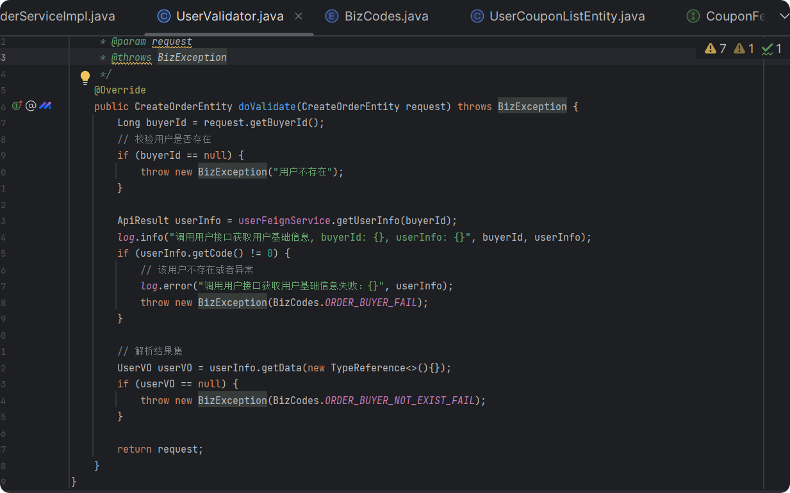

### **2.2.2 商品校验**

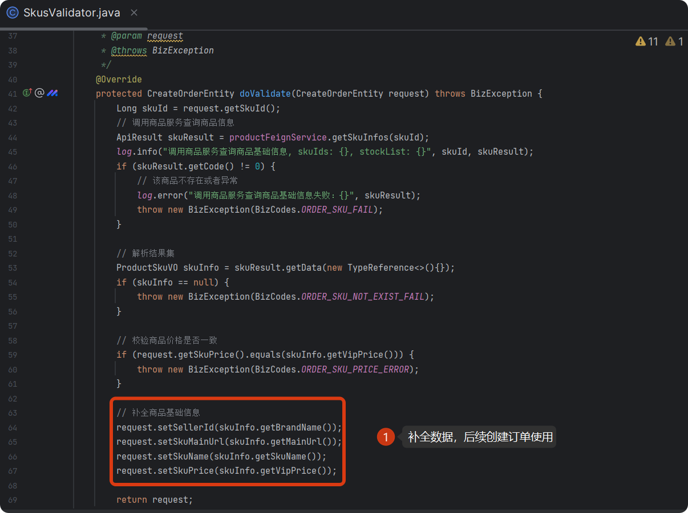

### **2.2.3 库存校验**

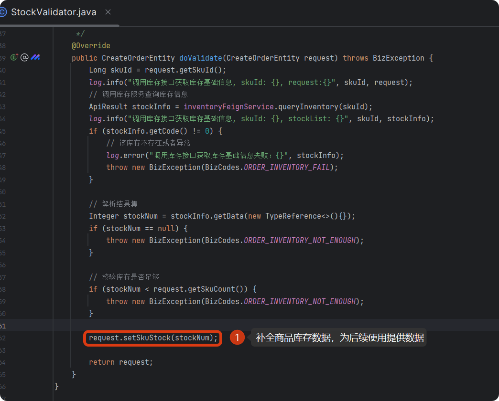

### **2.2.4 优惠券校验**

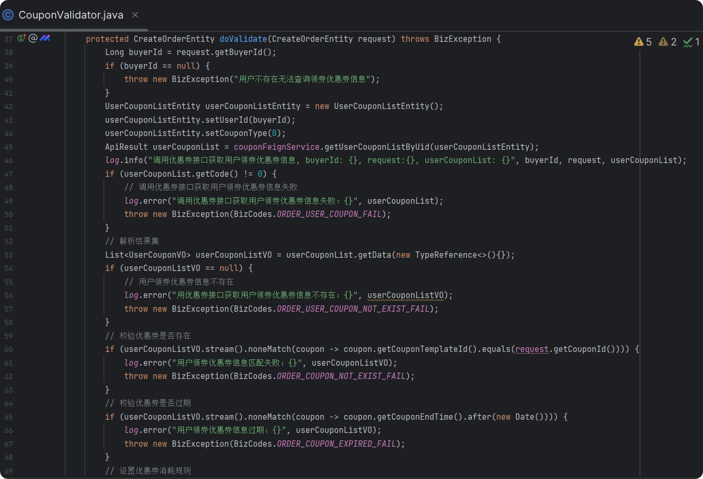

异常测试：

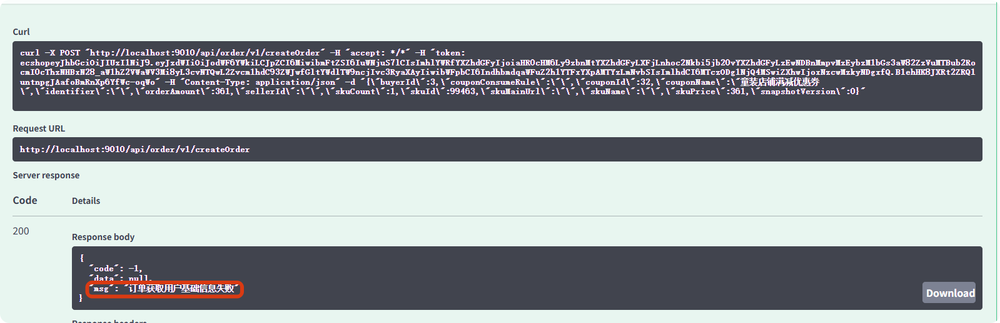

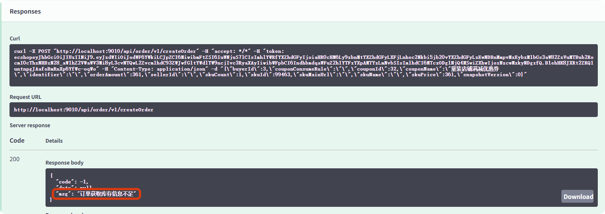

正确测试：

{

"buyerId": 0,

"couponConsumeRule": "",

"couponId": 32,

"couponName": "童装店铺满减优惠券",

"identifier": "",

"orderAmount": 10,

"sellerId": "0",

"skuCount": 1,

"skuId": 99463,

"skuMainUrl": "string",

"skuName": "string",

"skuPrice": 437,

"skuStock": 0,

"snapshotVersion": 0

}

当校验完毕后，会补全一些基础数据，如下：

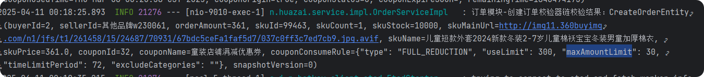

## **2.3 订单风控检查**

关于「**订单风控**」这里不会具体实现，后续版本进行迭代。

##   
**2.4 订单价格动态计算**

这块就比较简单了，会根据 **2.2 节的**检测结果，再根据「**优惠券规则**」进行动态计算。

/\*\*

\* 计算订单价格

\* @param createOrderEntity 订单DTO

\*/

private CreateOrderEntity calculateOrderPrice(CreateOrderEntity createOrderEntity) {

/\*\*

\* 如果优惠券规则不为空则解析优惠券规则

\* 1、判断优惠券类型

\* 2、计算订单价格

\* 3、更新订单价格

\* 4、返回订单价格

\* 5、如果优惠券规则为空则返回订单价格

\*/

if (createOrderEntity.getCouponConsumeRule() != null) {

// 解析优惠券的消耗规则 json

CouponConsumeRuleVO couponConsumeRuleVO \= JsonUtil.json2Object(createOrderEntity.getCouponConsumeRule(), CouponConsumeRuleVO.class);

// 如果正常解析

if (couponConsumeRuleVO != null) {

// 获取当前商品价格 原会员价

BigDecimal skuPrice \= createOrderEntity.getSkuPrice();

// 获取优惠券优惠规则类型

String couponType \= couponConsumeRuleVO.getType();

switch (couponType) {

case "DIRECT\_REDUCTION": // 立减券

BigDecimal reductionThreshold \= couponConsumeRuleVO.getReductionAmountLimit();

if (skuPrice.compareTo(reductionThreshold) > 0) {

BigDecimal finalPrice \= skuPrice.subtract(couponConsumeRuleVO.getMaxAmountLimit());

createOrderEntity.setOrderAmount(finalPrice);

}

break;

case "DISCOUNT": // 折扣券

BigDecimal maxDiscountAmount \= couponConsumeRuleVO.getMaxAmountLimit();

BigDecimal discountRate \= couponConsumeRuleVO.getDiscountRateLimit();

// 计算折扣后价格

BigDecimal discountedPrice \= skuPrice.multiply(discountRate);

// 计算最大可减金额后的价格

BigDecimal priceAfterMaxReduction \= skuPrice.subtract(maxDiscountAmount);

// 取两者较小值

BigDecimal couponVipPrices \= discountedPrice.min(priceAfterMaxReduction);

createOrderEntity.setOrderAmount(couponVipPrices);

break;

case "FULL\_REDUCTION": // 满减券

BigDecimal fullReductionThreshold \= couponConsumeRuleVO.getUseLimit();

if (skuPrice.compareTo(fullReductionThreshold) > 0) {

BigDecimal finalPrice \= skuPrice.subtract(couponConsumeRuleVO.getMaxAmountLimit());

createOrderEntity.setOrderAmount(finalPrice);

}

break;

}

}

} else {

// 如果优惠券规则为空则返回订单价格

createOrderEntity.setOrderAmount(createOrderEntity.getSkuPrice());

}

log.info("订单模块-计算订单价格结束，订单价格：{}", createOrderEntity);

return createOrderEntity;

}

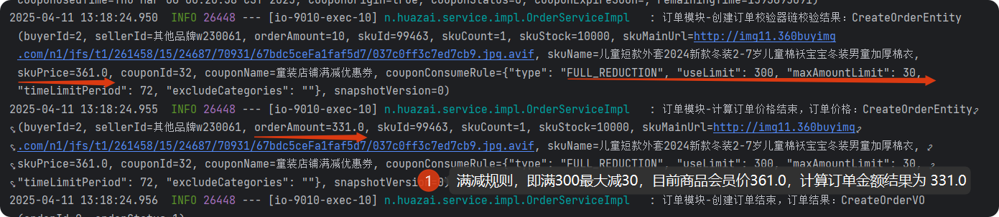

## **2.5 订单库存预扣减及 MQ 消息生成**

### **2.5.1 订单库存预扣减**

这里直接调用「**库存服务**」之前已经写好的「**库存预扣减**」，底层基于 「**Redis Lua**」进行「**库存缓存分桶 + 合并分桶库存**」扣减。

  
具体请点击：[【电商实战项目第七十二篇】华仔电商实战库存服务之库存缓存分桶预扣减方案功能实现](https://articles.zsxq.com/id_9sr5xwzox4px.html)

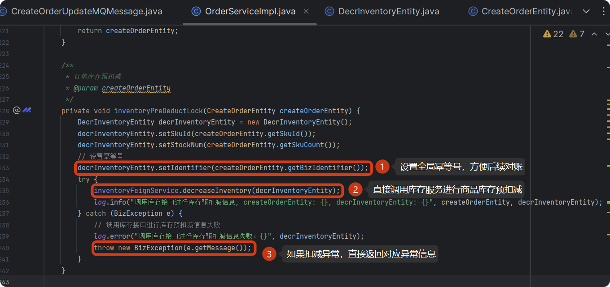

「**库存预扣减**」Redis 存储结构如下：

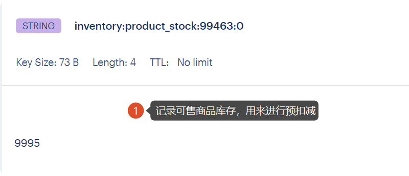

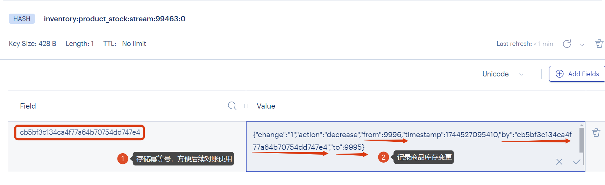

### **2.5.2 订单事务 MQ 消息**

这里先说明下为什么要使用 「**RocketMQ 事务消息**」，事务消息为消息队列 RocketMQ 中的高级特性消息，先来了解下什么是事务消息，其应用场景、实现原理是什么。

### **2.5.2.1 应用场景**

分布式系统调用的特点为一个「**核心业务逻辑**」的执行，同时需要调用「**多个下游业务**」进行处理。如何「**核心业务逻辑**」和「**多个下游业务**」的执行结果完全一致，是分布式事务需要解决的主要问题。

还是我们这里的业务场景，用户下订单这一核心操作的同时会涉及到下游「**优惠券锁定**」、「**订单创建**」、「**购物车清空**」等多个子系统的变更。

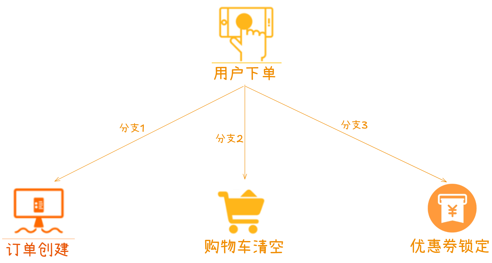

### **2.5.2.2 传统 XA 事务方案：性能不足**

为了保证上述三个分支的执行结果一致性，典型方案是基于「**XA 协议**」的分布式事务系统来实现。将三个调用分支封装成包含三个独立事务分支的大事务。基于「**XA 分布式事务**」的方案可以满足业务处理结果的正确性，但最大的缺点是多分支环境下资源锁定范围大，并发度低，随着下游分支的增加，系统性能会越来越差。

### **2.5.2.3 基于普通消息方案：一致性保障难**

将上述基于「**XA 分布式事务**」的方案进行简化，将订单系统变更作为「**本地事务**」，剩下的系统变更作为「**普通消息**」的下游来执行，事务分支简化成「**普通消息**」\+ 「**订单表事务**」，充分利用消息异步化的能力缩短链路，提高并发度。

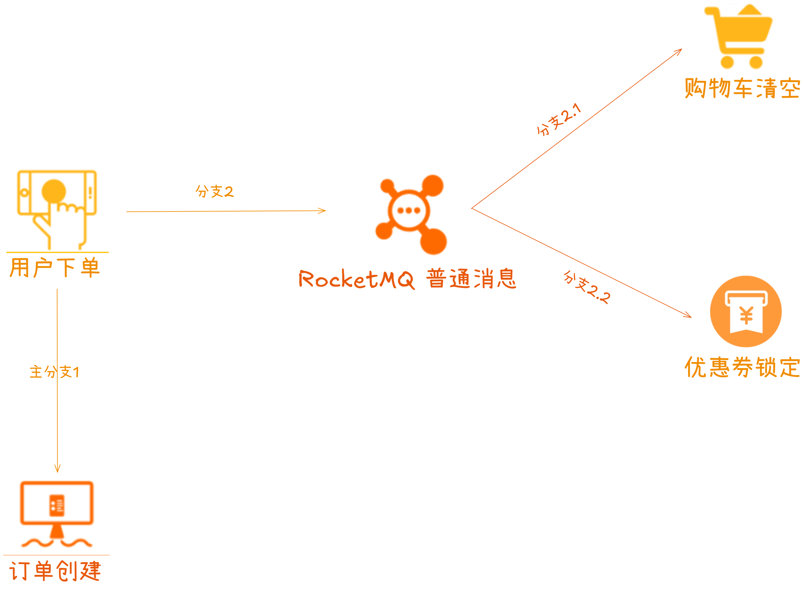

该方案中消息下游分支和订单系统变更的主分支很容易出现不一致的现象，例如：

1.  消息发送成功，创建订单没有执行成功，需要回滚整个事务。
2.  创建订单执行成功，消息没有发送成功，需要额外补偿才能发现不一致。
3.  消息发送超时未知，此时无法判断需要回滚订单还是提交订单变更。

### **2.5.2.4 基于事务消息方案：支持最终一致性**

上述普通消息方案中，「**普通消息**」\+ 「**订单事务**」无法保证一致的原因，本质上是由于「**普通消息**」无法像单机数据库事务一样，具备提交、回滚和统一协调的能力。

而基于 RocketMQ 「**事务消息**」功能，在「**普通消息**」基础上，支持二阶段的提交能力。将二阶段提交和本地事务绑定，实现全局提交结果的一致性。

关于事务消息原理和源码实现，可以查看：[【原理分析系列第十四篇】图解 RocketMQ 事务消息架构设计](https://articles.zsxq.com/id_rt6sfotg7xsl.html)、[【Broker端源码分析系列第二十九篇】图解 RocketMQ 源码之 Broker 端事务消息架构设计剖析](https://articles.zsxq.com/id_kotf3fj9vw42.html)

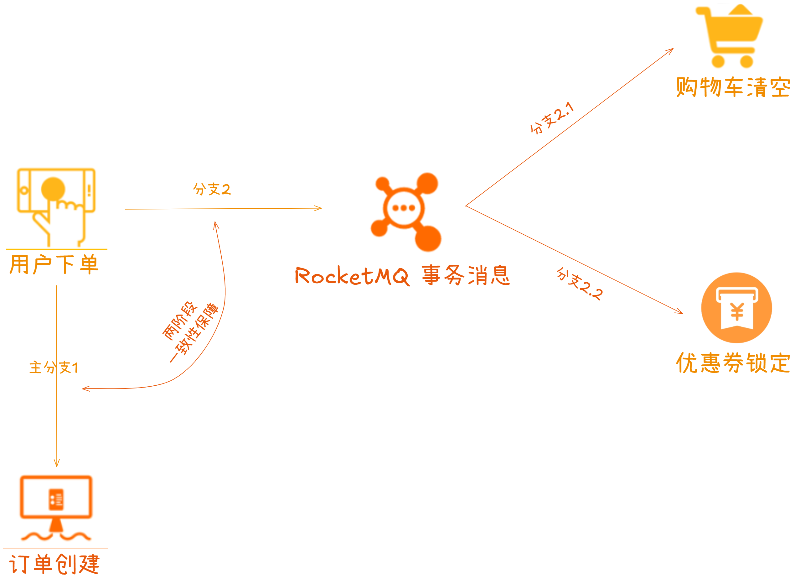

### **2.5.2.5 事务消息实现原理**

事务消息交互流程如下图所示：

1.  生产者将消息发送至消息队列 RocketMQ Broker 服务端。
2.  消息队列 RocketMQ Broker 服务端将消息持久化成功之后，向生产者返回 Ack 确认消息已经发送成功，此时消息被标记为“暂不能投递”，这种状态下的消息即为半事务消息。
3.  生产者开始执行本地事务逻辑。
4.  生产者根据本地事务执行结果向 Broker 服务端提交二次确认结果（Commit 或是 Rollback）， Broker 服务端收到确认结果后处理逻辑如下：
5.  二次确认结果为 Commit： Broker 服务端将半事务消息标记为可投递，并投递给消费者。
6.  二次确认结果为 Rollback： Broker 服务端将回滚事务，不会将半事务消息投递给消费者。
7.  在断网或者是生产者应用重启的特殊情况下，如果 Broker 服务端未收到发送者提交的二次确认结果，或 Broker 服务端收到的二次确认结果为 Unknown 未知状态，经过固定时间后， Broker 服务端将对消息生产者即生产者集群中任一生产者实例发起消息回查。
8.  生产者收到消息回查后，需要检查对应消息的本地事务执行的最终结果。
9.  生产者根据检查到的本地事务的最终状态再次提交二次确认， Broker 服务端仍按照步骤 4 对半事务消息进行处理。

### **2.5.2.6 事务消息生命周期**

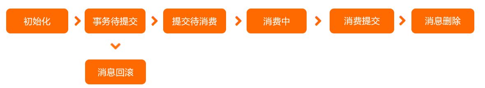

1.  初始化：半事务消息被生产者构建并完成初始化，待发送到服务端的状态。
2.  事务待提交：半事务消息被发送到服务端，和普通消息不同，并不会直接被服务端持久化，而是会被单独存储到事务存储系统中，等待第二阶段本地事务返回执行结果后再提交。此时消息对下游消费者不可见。
3.  消息回滚：第二阶段如果事务执行结果明确为回滚，服务端会将半事务消息回滚，该事务消息流程终止。
4.  提交待消费：第二阶段如果事务执行结果明确为提交，服务端会将半事务消息重新存储到普通存储系统中，此时消息对下游消费者可见，等待被消费者获取并消费。
5.  消费中：消息被消费者获取，并按照消费者本地的业务逻辑进行处理的过程。此时服务端会等待消费者完成消费并提交消费结果，如果一定时间后没有收到消费者的响应，RocketMQ 会对消息进行重试处理。
6.  消费提交：消费者完成消费处理，并向服务端提交消费结果，服务端标记当前消息已经被处理（包括消费成功和失败）。RocketMQ 默认支持保留所有消息，此时消息数据并不会立即被删除，只是逻辑标记已消费。消息在保存时间到期或存储空间不足被删除前，消费者仍然可以回溯消息重新消费。
7.  消息删除： RocketMQ 按照消息保存机制滚动清理最早的消息数据，将消息从物理文件中删除。

###   
**2.5.2.7 事务消息客户端**

  
事务消息相比普通消息发送时需要修改以下几点：

1.  发送事务消息前，需要开启事务并关联本地的事务执行。
2.  为保证事务一致性，在构建生产者时，必须设置事务检查器和预绑定事务消息发送的主题列表，客户端内置的事务检查器会对绑定的事务主题做异常状态恢复。

  
接下来我们来看下「**如何发送事务消息**」的，事务消息对应的生产者为 [TransactionMQProducer](http://transactionmqproducer/)，创建[TransactionMQProducer](http://transactionmqproducer/) 之后，设置自定义的事务监听器 [OrderTransactionListener](http://ordertransactionlistener/)，然后启动消费者，后续就可以调用 [sendMessageInTransaction](http://sendmessageintransaction/) 发送事务消息：

/\*\*

\* RocketMQ 事务消息生产者

\*/

@Slf4j

@Component

public class DefaultTransactionProducer {

/\*\*

\* 事务生产者客户端

\* @return

\*/

private final TransactionMQProducer producer;

@Autowired

public DefaultTransactionProducer(RocketMQProperties rocketMQProperties,

OrderTransactionListener transactionListener) {

// 初始化事务生产者客户端，设置对应的生产者组

producer = new TransactionMQProducer(RocketMQConstant.ORDER\_PRODUCER\_GROUP);

// 设置 nameserver

producer.setNamesrvAddr(rocketMQProperties.getNameServer());

// 设置事务监听器

producer.setTransactionListener(transactionListener);

// 配置事务线程池（必须）

ExecutorService executorService \= new ThreadPoolExecutor(

2, 5, 100, TimeUnit.SECONDS,

new ArrayBlockingQueue<>(2000),

r -> new Thread(r, "txn-executor")

);

// 设置线程池

producer.setExecutorService(executorService);

// 启动生产者服务

start();

}

/\*\*

\* 启动 rocketmq 生产者服务

\* 该对象在使用之前必须要调用一次，只能初始化一次

\*/

public void start() {

try {

this.producer.start();

} catch (MQClientException e) {

log.error("rocketmq producer start error", e);

}

}

/\*\*

\* 关闭 rocketmq 生产者

\*/

public void shutdown() {

this.producer.shutdown();

}

/\*\*

\* 发送单条消息

\* @param topic 主题

\* @param message 消息

\* @param arg 消息参数

\*/

public void sendMessage(String topic, String message, Object arg) {

sendTransactionMessage(topic, message, arg);

}

/\*\*

\* 发送事务消息

\* @param topic

\* @param message

\* @param arg

\*/

public void sendTransactionMessage(String topic, String message, Object arg) {

Message msg \= new Message(topic, message.getBytes(StandardCharsets.UTF\_8));

try {

TransactionSendResult sendResult \= producer.sendMessageInTransaction(msg, arg);

if (sendResult.getLocalTransactionState() == LocalTransactionState.COMMIT\_MESSAGE) {

log.info("事务消息提交成功, message:{}", message);

} else {

throw new BizException("事务消息提交失败: " + sendResult.getLocalTransactionState());

}

} catch (Exception e) {

log.error("事务消息发送失败", e);

throw new BizException("事务消息发送失败");

}

}

}

发送「**事务消息**」，在发送之前需要先获取一个「**幂等号**」，这里直接使用登录后的刷新 token 作为幂等号，它是在用户登录时进行生成的，因为是 ThreadLocal 中无法远程传递，所以需要放到请求中进行传递。

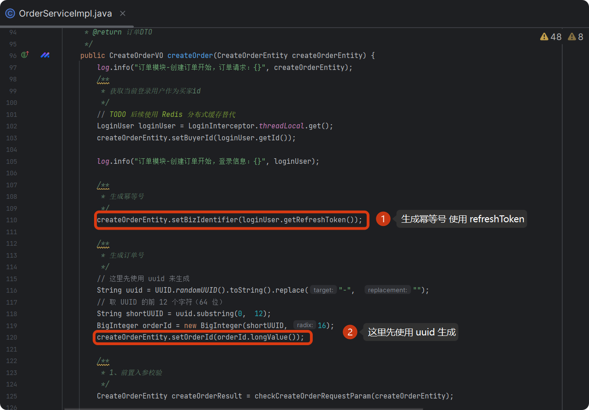

然后在 RocketMQ 控制台创建「**事务消息**」 Topic：

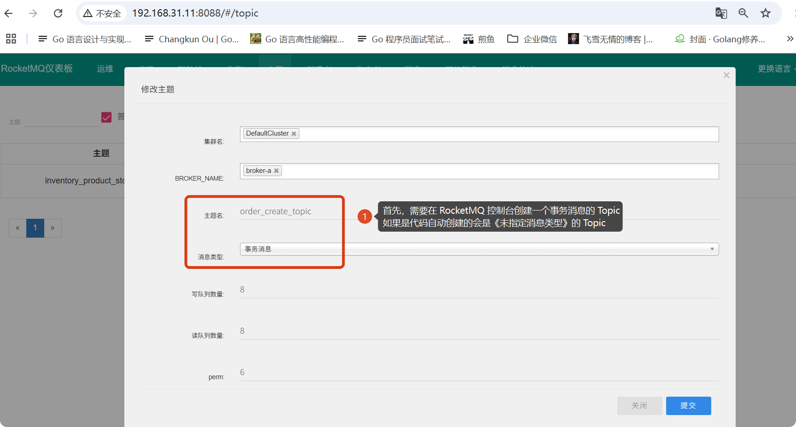

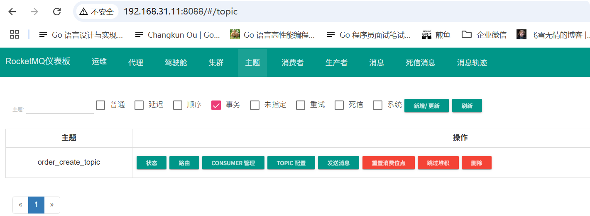

最后进行「**事务消息**」发送：

/\*\*

\* 发送订单创建消息到 MQ，通过 MQ 异步处理锁定优惠券、购物车清空、订单创建等逻辑

\* @param calculateOrderPriceResult

\*/

private void sendCreateOrderMessage(CreateOrderEntity calculateOrderPriceResult) {

// 异步 MQ 事务消息

CreateOrderUpdateMQMessage message \= CreateOrderUpdateMQMessage

.builder()

.buyerId(calculateOrderPriceResult.getBuyerId())

.skuId(calculateOrderPriceResult.getSkuId())

.sellerId(calculateOrderPriceResult.getSellerId())

.couponId(calculateOrderPriceResult.getCouponId())

.orderAmount(calculateOrderPriceResult.getOrderAmount())

.skuCount(calculateOrderPriceResult.getSkuCount())

.skuStock(calculateOrderPriceResult.getSkuStock())

.skuMainUrl(calculateOrderPriceResult.getSkuMainUrl())

.couponName(calculateOrderPriceResult.getCouponName())

.skuName(calculateOrderPriceResult.getSkuName())

.skuPrice(calculateOrderPriceResult.getSkuPrice())

.bizIdentifier(calculateOrderPriceResult.getBizIdentifier())

.orderId(calculateOrderPriceResult.getOrderId())

.build();

log.info("订单模块-订单待创建事务消息：{}, message：{}", calculateOrderPriceResult, message);

// 发送 MQ 消息

defaultTransactionProducer.sendMessage(

RocketMQConstant.ORDER\_CREATE\_TOPIC,

JsonUtil.object2Json(message),

calculateOrderPriceResult);

}

## **2.6 订单号生成及异步创建订单信息**

先来看下订单号生成的方式和规则。

### **2.6.1 基于分布式 ID 生成订单号**

TODO 这里暂时使用 uuid 来生成，后续等分库分表搞完后会补充对应的订单号。

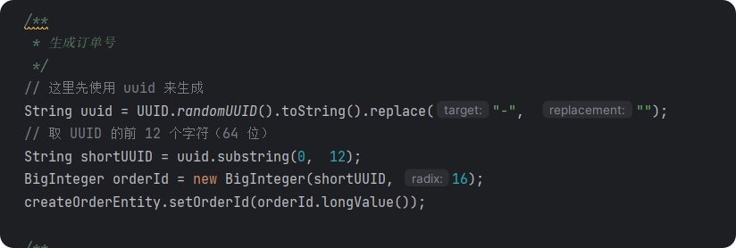

### **2.6.2 异步创建订单及订单流水**

创建订单及订单流水，需要在「**订单事务监听器**」中做「**执行本地事务**」和 「**事务回查**」，代码如下：

/\*\*

\* @className: OrderTransactionListener

\* @author: huazai，该项目是知识星球：华仔和他的朋友们 的内部项目

\* @date: 2025-04-11 20:56

\* @Version: 1.0

\* @description:

\*/

@Component

@Slf4j

public class OrderTransactionListener implements TransactionListener {

/\*\*

\* 注入订单服务

\*/

@Lazy // 添加延迟加载注解 防止循环引用

@Autowired

private OrderService orderService;

/\*\*

\* 执行本地事务

\*/

@Override

public LocalTransactionState executeLocalTransaction(Message msg, Object arg) {

try {

/\*\*

\* 1、解析消息体（arg 为发送消息时传入的 CreateOrderEntity）

\*/

CreateOrderEntity createOrderEntity \= (CreateOrderEntity) arg;

/\*\*

\* 2、调用订单服务的创建订单及订单流水

\*/

CreateOrderVO createOrderVO \= orderService.createOrderAndOrderSnapshot(createOrderEntity);

/\*\*

\* 3、返回本地事务状态

\* 本地事务状态：

\* COMMIT\_MESSAGE：提交事务

\* ROLLBACK\_MESSAGE：回滚事务

\* UNKNOW：未知状态，稍后通过回查确认状态

\*/

if (createOrderVO == null) {

log.error("订单创建失败，订单请求：{}", createOrderEntity);

// 还原库存

orderService.inventoryPreIncrementLock(createOrderEntity);

return LocalTransactionState.ROLLBACK\_MESSAGE;

} else {

log.info("订单创建成功，订单ID：{}", createOrderVO.getOrderId());

return LocalTransactionState.COMMIT\_MESSAGE;

}

// 如果业务成功，提交事务

// return LocalTransactionState.COMMIT\_MESSAGE;

// 如果业务失败，回滚事务

// return LocalTransactionState.ROLLBACK\_MESSAGE;

// 如果状态未知，稍后通过回查确认状态

// return LocalTransactionState.UNKNOW;

} catch (Exception e) {

log.error("本地事务执行失败", e);

// 还原库存

CreateOrderEntity createOrderEntity \= (CreateOrderEntity) arg;

orderService.inventoryPreIncrementLock(createOrderEntity);

return LocalTransactionState.ROLLBACK\_MESSAGE;

}

}

/\*\*

\* 事务回查

\*/

@Override

public LocalTransactionState checkLocalTransaction(MessageExt msg) {

// 检查本地事务状态并返回结果

// 从消息中获取业务标识（如 bizIdentifier）

CreateOrderUpdateMQMessage message \= parseMessage(msg);

String bizIdentifier \= message.getBizIdentifier();

if (bizIdentifier == null) {

log.error("订单回查失败，业务幂等号为空：{}，message：{}", msg, message);

return LocalTransactionState.ROLLBACK\_MESSAGE;

}

Long buyerId \= message.getBuyerId();

if (buyerId == null) {

log.error("订单回查失败，买家id为空：{}，message：{}", msg, message);

return LocalTransactionState.ROLLBACK\_MESSAGE;

}

Long orderId \= message.getOrderId();

if (orderId == null) {

log.error("订单回查失败，订单号为空：{}，message：{}", msg, message);

return LocalTransactionState.ROLLBACK\_MESSAGE;

}

// 检查订单是否存在（幂等性校验）

boolean isOrderExists \= orderService.isOrderExists(bizIdentifier, buyerId, orderId);

return isOrderExists ?

LocalTransactionState.COMMIT\_MESSAGE :

LocalTransactionState.ROLLBACK\_MESSAGE;

}

/\*\*

\* 从消息中解析业务标识（如 bizIdentifier）

\*/

private CreateOrderUpdateMQMessage parseMessage(MessageExt msg) {

String jsonBody \= new String(msg.getBody(), StandardCharsets.UTF\_8);

CreateOrderUpdateMQMessage message \= JsonUtil.json2Object(jsonBody, CreateOrderUpdateMQMessage.class);

return message;

}

}

创建订单及流水、事务回查方法：

/\*\*

\* 创建订单及订单流水

\* @param createOrderEntity

\* @return

\*/

@Transactional(rollbackFor = Exception.class)

@Override

public CreateOrderVO createOrderAndOrderSnapshot(CreateOrderEntity createOrderEntity) {

log.info("订单模块-创建订单开始，订单请求：{}", createOrderEntity);

/\*\*

\* 1、根据幂等号+用户id查询是否已经有订单存在

\*/

TradeOrderDO existOrder \= tradeOrderMapper.selectByBizIdentifierAndUserId(createOrderEntity.getBizIdentifier(), createOrderEntity.getBuyerId());

if (existOrder != null) {

log.error("订单模块-创建订单失败，订单已存在，订单ID：{}", existOrder.getOrderId());

throw new BizException(BizCodes.ORDER\_EXIST);

}

/\*\*

\* 2、创建订单

\*/

TradeOrderDO tradeOrderDO \= createTradeOrder(createOrderEntity);

/\*\*

\* 3、创建订单流水

\*/

if (tradeOrderDO.getId() != null) {

TradeOrderSnapshotDO tradeOrderSnapshotDO \= createTradeOrderSnapshot(tradeOrderDO);

if (tradeOrderSnapshotDO.getId() == null) {

log.error("订单模块-创建订单流水失败：{}", tradeOrderSnapshotDO);

throw new BizException(BizCodes.ORDER\_SNAPSHOT\_CREATE\_FAIL);

}

} else {

log.error("订单模块-创建订单失败：{}", tradeOrderDO);

throw new BizException(BizCodes.ORDER\_CREATE\_FAIL);

}

/\*\*

\* 4、返回结果集

\*/

CreateOrderVO createOrderVO \= new CreateOrderVO();

createOrderVO.setOrderId(tradeOrderDO.getOrderId());

createOrderVO.setOrderStatus(tradeOrderDO.getOrderStatus());

log.info("订单模块-创建订单结束，订单结果：{}", createOrderVO);

return createOrderVO;

}

/\*\*

\* 检查订单是否存在

\* @param bizIdentifier

\* @param buyerId

\* @param orderId

\* @return

\*/

@Override

public boolean isOrderExists(String bizIdentifier, Long buyerId, Long orderId) {

return tradeOrderMapper.selectByBizIdentifierAndUserIdAndOrderId(bizIdentifier, buyerId, orderId) != null;

}

/\*\*

\* 创建订单

\* @param createOrderEntity

\* @return

\*/

private TradeOrderDO createTradeOrder(CreateOrderEntity createOrderEntity) {

/\*\*

\* 1、创建订单

\*/

TradeOrderDO tradeOrderDO \= tradeOrderConverter.convertTradeOrderDO(createOrderEntity);

// TODO 后续使用分布式ID生成器

/\*\*

\* 2、获取订单号

\*/

tradeOrderDO.setOrderId(createOrderEntity.getOrderId());

/\*\*

\* 在创建订单时会先创建并初始化一个订单状态机，即设置其初始状态为null

\*/

OrderStateMachineFactory.OrderStateMachine orderStateMachine \= orderStateMachineFactory.getOrderStateMachine(OrderStatusEnum.NULL);

/\*\*

\* 调用订单状态机的fire()方法触发"订单已创建"事件，并传入 tradeOrderDO 对象作为订单状态机的上下文，执行相应的状态转换逻辑，

\* 并根据状态转换的结果，更新订单状态机的当前状态。

\* 具体来说，在订单状态机中，"订单已创建"事件会触发状态转换，

\* 并将订单状态机的当前状态从null转换为"订单已创建"状态。

\* 同时，fire()方法还会调用postStateChange()方法，

\* 该方法会根据订单状态机的当前状态，执行相应的后续操作，

\* 例如发送订单状态变更消息到MQ等。

\*/

orderStateMachine.fire(OrderStatusChangeEnum.ORDER\_CREATED, tradeOrderDO);

/\*\*

\* 从订单状态机中获取当前状态

\*/

tradeOrderDO.setOrderStatus(OrderStatusEnum.CREATED.getCode());

tradeOrderDO.setCreateTime(new Date());

int rows \= tradeOrderMapper.insert(tradeOrderDO);

log.info("订单模块-创建订单：{}, rows：{}", tradeOrderDO, rows);

return tradeOrderDO;

}

/\*\*

\* 创建订单流水

\* @param tradeOrderDO

\* @return

\*/

private TradeOrderSnapshotDO createTradeOrderSnapshot(TradeOrderDO tradeOrderDO) {

TradeOrderSnapshotDO tradeOrderSnapshotDO \= new TradeOrderSnapshotDO();

tradeOrderSnapshotDO.setOrderId(tradeOrderDO.getOrderId());

tradeOrderSnapshotDO.setSnapshotIdentifier(tradeOrderDO.getBizIdentifier());

tradeOrderSnapshotDO.setSnapshotType(1);

tradeOrderSnapshotDO.setSnapshotJson(JsonUtil.object2Json(tradeOrderDO));

tradeOrderSnapshotDO.setSnapshotVersion(1);

tradeOrderSnapshotDO.setCreateTime(new Date());

int rows \= tradeOrderSnapshotMapper.insert(tradeOrderSnapshotDO);

log.info("订单模块-创建订单流水信息：{}, rows：{}", tradeOrderSnapshotDO, rows);

return tradeOrderSnapshotDO;

}

## **2.7 异步锁定优惠券**

「**订单服务**」创建完订单和流水后，就可以继续在「**优惠券服务**」编写消费者来锁定优惠券了。

package net.huazai.mq.consumer.listener;

import lombok.extern.slf4j.Slf4j;

import net.huazai.constant.RedisKeyConstant;

import net.huazai.mq.CreateOrderUpdateMQMessage;

import net.huazai.mq.UserCouponRedeemMessage;

import net.huazai.mq.idempotent.UserCouponQueueIdempotentHandler;

import net.huazai.service.CouponService;

import net.huazai.utils.JsonUtil;

import org.apache.rocketmq.client.consumer.listener.ConsumeConcurrentlyContext;

import org.apache.rocketmq.client.consumer.listener.ConsumeConcurrentlyStatus;

import org.apache.rocketmq.client.consumer.listener.MessageListenerConcurrently;

import org.apache.rocketmq.common.message.MessageExt;

import org.springframework.beans.factory.annotation.Autowired;

import org.springframework.stereotype.Component;

import java.util.List;

/\*\*

\* 锁定优惠券更新监听器

\*/

@Slf4j

@Component

public class LockUserCouponUpdateListener implements MessageListenerConcurrently {

/\*\*

\* 注入幂等处理器

\*/

@Autowired

private UserCouponQueueIdempotentHandler couponQueueIdempotentHandler;

/\*\*

\* 注入 service

\*/

@Autowired

private CouponService couponService;

/\*\*

\* 并发消费

\* @param msgList

\* @param context

\* @return

\*/

@Override

public ConsumeConcurrentlyStatus consumeMessage(List<MessageExt> msgList, ConsumeConcurrentlyContext context) {

for (MessageExt messageExt : msgList) {

String msgId \= messageExt.getMsgId();

try {

String msg \= new String(messageExt.getBody());

// 解析订单创建消息

CreateOrderUpdateMQMessage message \= JsonUtil.json2Object(msg, CreateOrderUpdateMQMessage.class);

if (message == null) {

log.warn("订单创建锁定用户优惠券记录 MQ-消息为空结束，原始消息内容：{}", msg);

return ConsumeConcurrentlyStatus.RECONSUME\_LATER;

}

log.info("订单创建锁定用户优惠券记录 MQ，消息内容：{}", message);

// 2、幂等性校验

if (couponQueueIdempotentHandler.isMessageConsumed(RedisKeyConstant.LOCK\_USER\_COUPON\_IDEMPOTENT\_PREFIX, msgId)) {

// 判断当前的这个消息流程是否执行完成

if (couponQueueIdempotentHandler.isAccomplish(RedisKeyConstant.LOCK\_USER\_COUPON\_IDEMPOTENT\_PREFIX, msgId)) {

log.warn("订单创建锁定用户优惠券记录 MQ-检测到重复消息，当前流程还未执行完，消息内容：{}", message);

return ConsumeConcurrentlyStatus.RECONSUME\_LATER;

}

log.error("订单创建锁定用户优惠券记录 MQ consume error, 消息未完成流程，需要消息队列重试");

return ConsumeConcurrentlyStatus.RECONSUME\_LATER;

}

// 3、锁定优惠券

Boolean result \= couponService.lockCoupon(message);

if (result) {

log.info("订单创建锁定用户优惠券记录 MQ-锁定成功, result: {}", result);

// 设置消费完成标识

couponQueueIdempotentHandler.setAccomplish(RedisKeyConstant.LOCK\_USER\_COUPON\_IDEMPOTENT\_PREFIX, msgId);

} else {

log.error("订单创建锁定用户优惠券记录 MQ 扣减数据库库存和增加用户领券记录失败, result: {}", result);

return ConsumeConcurrentlyStatus.RECONSUME\_LATER;

}

} catch (Exception e) {

// 本次消费失败，下次重新消费

couponQueueIdempotentHandler.delMessageProcessed(RedisKeyConstant.LOCK\_USER\_COUPON\_IDEMPOTENT\_PREFIX, msgId);

log.error("订单创建锁定用户优惠券记录 MQ consume error", e);

return ConsumeConcurrentlyStatus.RECONSUME\_LATER;

}

}

log.info("订单创建锁定用户优惠券记录 MQ-消费成功, result: {}", ConsumeConcurrentlyStatus.CONSUME\_SUCCESS);

return ConsumeConcurrentlyStatus.CONSUME\_SUCCESS;

}

}

/\*\*

\* 锁定优惠券

\* 1、验证用户是否有领券的优惠券【按道理这里不会有问题，在订单创建前已经验证过】

\* 2、进行更新状态为已使用

\* @param message

\* @return

\*/

@Transactional(rollbackFor = Exception.class)

@Override

public Boolean lockCoupon(CreateOrderUpdateMQMessage message) {

// 1、验证用户是否有领券的优惠券

QueryWrapper<UserCouponDO> userCouponQueryWrapper = new QueryWrapper<>();

userCouponQueryWrapper.eq("user\_id", message.getBuyerId());

userCouponQueryWrapper.eq("coupon\_template\_id", message.getCouponId());

userCouponQueryWrapper.eq("coupon\_status", 0); // 未使用

UserCouponDO userCoupon \= userCouponMapper.selectOne(userCouponQueryWrapper);

if (userCoupon == null) {

log.warn("优惠券模块-用户没有领券的优惠券，userCouponQueryWrapper：{}", userCouponQueryWrapper);

return false;

}

// 2、进行更新状态为已使用

UserCouponDO updateUserCoupon \= new UserCouponDO();

updateUserCoupon.setId(userCoupon.getId());

updateUserCoupon.setCouponStatus(1); // 已锁定

updateUserCoupon.setBizIdentifier(message.getBizIdentifier()); // 订单幂等号 方便对账

int updateRows \= userCouponMapper.updateById(updateUserCoupon);

if (updateRows <= 0) {

log.warn("优惠券模块-更新用户优惠券状态失败，userCoupon：{}", userCoupon);

return false;

}

return true;

}

如果消费过程中出现异常，由于「**RocketMQ** 」底层内置「**重试机制** 」和「**死信队列**」，我们可以认为 Consumer最终一定会执行成功。

## **2.8 异步清空购物车**

「**订单服务**」创建完订单和流水后，就可以继续在 「**购物车服务**」编写消费者来清理购物车了。

package net.huazai.mq.consumer.listener;

import lombok.extern.slf4j.Slf4j;

import net.huazai.constant.RedisKeyConstant;

import net.huazai.mq.CreateOrderUpdateMQMessage;

import net.huazai.mq.idempotent.CartQueueIdempotentHandler;

import net.huazai.service.CartService;

import net.huazai.utils.JsonUtil;

import org.apache.rocketmq.client.consumer.listener.ConsumeConcurrentlyContext;

import org.apache.rocketmq.client.consumer.listener.ConsumeConcurrentlyStatus;

import org.apache.rocketmq.client.consumer.listener.MessageListenerConcurrently;

import org.apache.rocketmq.common.message.MessageExt;

import org.springframework.beans.factory.annotation.Autowired;

import org.springframework.stereotype.Component;

import java.util.List;

/\*\*

\* 购物车清理监听器

\*/

@Slf4j

@Component

public class UserClearCartUpdateListener implements MessageListenerConcurrently {

/\*\*

\* 注入购物车服务

\*/

@Autowired

private CartService cartService;

/\*\*

\* 注入幂等处理器

\*/

@Autowired

private CartQueueIdempotentHandler cartQueueIdempotentHandler;

/\*\*

\* 并发消费

\* @param msgList

\* @param context

\* @return

\*/

@Override

public ConsumeConcurrentlyStatus consumeMessage(List<MessageExt> msgList, ConsumeConcurrentlyContext context) {

for (MessageExt messageExt : msgList) {

String msgId \= messageExt.getMsgId();

try {

String msg \= new String(messageExt.getBody());

// 解析订单创建消息

CreateOrderUpdateMQMessage message \= JsonUtil.json2Object(msg, CreateOrderUpdateMQMessage.class);

if (message == null) {

log.warn("订单创建清理用户购物车记录 MQ-消息为空结束，原始消息内容：{}", msg);

return ConsumeConcurrentlyStatus.RECONSUME\_LATER;

}

log.info("订单创建清理用户购物车记录 MQ，消息内容：{}", message);

// 2、幂等性校验

if (cartQueueIdempotentHandler.isMessageConsumed(RedisKeyConstant.CLEAR\_CART\_IDEMPOTENT\_PREFIX, msgId)) {

// 判断当前的这个消息流程是否执行完成

if (cartQueueIdempotentHandler.isAccomplish(RedisKeyConstant.CLEAR\_CART\_IDEMPOTENT\_PREFIX, msgId)) {

log.warn("订单创建清理用户购物车记录 MQ-检测到重复消息，当前流程还未执行完，消息内容：{}", message);

return ConsumeConcurrentlyStatus.RECONSUME\_LATER;

}

log.error("订单创建清理用户购物车记录 MQ consume error, 消息未完成流程，需要消息队列重试");

return ConsumeConcurrentlyStatus.RECONSUME\_LATER;

}

// 3、锁定优惠券

Boolean result \= cartService.clearCartByUserIdAndSkuId(message);

if (result) {

log.info("订单创建清理用户购物车记录 MQ-锁定成功, result: {}", result);

// 设置消费完成标识

cartQueueIdempotentHandler.setAccomplish(RedisKeyConstant.CLEAR\_CART\_IDEMPOTENT\_PREFIX, msgId);

} else {

log.error("订单创建清理用户购物车记录 MQ 失败, result: {}", result);

return ConsumeConcurrentlyStatus.RECONSUME\_LATER;

}

} catch (Exception e) {

// 本次消费失败，下次重新消费

cartQueueIdempotentHandler.delMessageProcessed(RedisKeyConstant.CLEAR\_CART\_IDEMPOTENT\_PREFIX, msgId);

log.error("订单创建清理用户购物车记录 MQ consume error", e);

return ConsumeConcurrentlyStatus.RECONSUME\_LATER;

}

}

log.info("订单创建清理用户购物车记录 MQ-消费成功, result: {}", ConsumeConcurrentlyStatus.CONSUME\_SUCCESS);

return ConsumeConcurrentlyStatus.CONSUME\_SUCCESS;

}

} /\*\*

\* 清空用户相关购物车商品信息

\* @param message

\* @return

\*/

@Transactional(rollbackFor = Exception.class)

@Override

public Boolean clearCartByUserIdAndSkuId(CreateOrderUpdateMQMessage message) {

// 1、检查入参 可不加

if (ObjectUtils.isEmpty(message.getBuyerId())) {

throw new BizException(BizCodes.COMMON\_PARAM\_ERROR);

}

// 2、清空用户对应购物车缓存

clearAllCartCacheForSkuId(message.getBuyerId(), message.getBuyerId());

// 3、删除对应数据库数据

cartMapper.delete(new QueryWrapper<CartDO>().eq("user\_id", message.getBuyerId()).eq("sku\_id", message.getSkuId()));

return true;

}

/\*\*

\* 清空所有购物车缓存

\* @param userId

\* @param skuId

\*/

private void clearAllCartCacheForSkuId(Long userId, Long skuId) {

// 删除购物车 sku 数量缓存

redisCache.hDel(RedisKeyConstant.SHOPPING\_CART\_COUNT\_PREFIX + userId, skuId.toString());

// 删除购物车 sku 扩展信息缓存

redisCache.hDel(RedisKeyConstant.SHOPPING\_CART\_EXTRA\_PREFIX + userId, skuId.toString());

// 删除购物车 sku 操作时间缓存

redisCache.hDel(RedisKeyConstant.SHOPPING\_CART\_SORT\_PREFIX + userId, skuId.toString());

}

如果消费过程中出现异常，由于「**RocketMQ** 」底层内置「**重试机制** 」和「**死信队列**」，我们可以认为 Consumer最终一定会执行成功。

##   
**2.9 整个流程测试**

### **2.9.1 失败情况**

目前代码有一些问题，我们先来测试下失败情况：

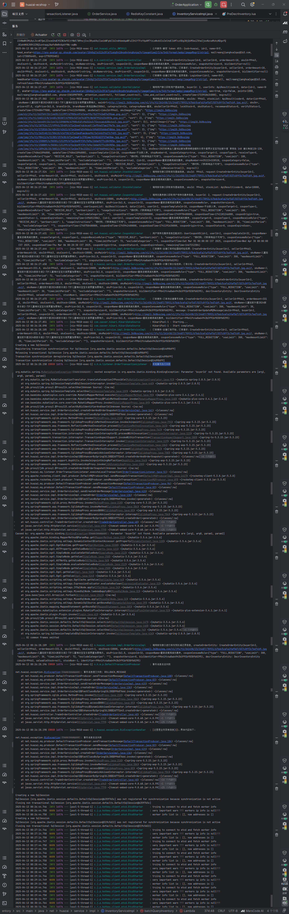

Registering transaction synchronization for SqlSession \[org.apache.ibatis.session.defaults.DefaultSqlSession@14d98df9\]

Releasing transactional SqlSession \[org.apache.ibatis.session.defaults.DefaultSqlSession@14d98df9\]

Transaction synchronization deregistering SqlSession \[org.apache.ibatis.session.defaults.DefaultSqlSession@14d98df9\]

Transaction synchronization closing SqlSession \[org.apache.ibatis.session.defaults.DefaultSqlSession@14d98df9\]

2025-04-13 00:26:28.158 ERROR 16576 --- \[nio-9010-exec-1\] n.h.m.listener.OrderTransactionListener : 本地事务执行失败

org.mybatis.spring.MyBatisSystemException: nested exception is org.apache.ibatis.binding.BindingException: Parameter 'buyerId' not found. Available parameters are \[arg1, arg0, param1, param2\]

at org.mybatis.spring.MyBatisExceptionTranslator.translateExceptionIfPossible(MyBatisExceptionTranslator.java:92) ~\[mybatis-spring-2.0.5.jar:2.0.5\]

at org.mybatis.spring.SqlSessionTemplate$SqlSessionInterceptor.invoke(SqlSessionTemplate.java:440) ~\[mybatis-spring-2.0.5.jar:2.0.5\]

at jdk.proxy2/jdk.proxy2.$Proxy114.selectOne(Unknown Source) ~\[na:na\]

at org.mybatis.spring.SqlSessionTemplate.selectOne(SqlSessionTemplate.java:159) ~\[mybatis-spring-2.0.5.jar:2.0.5\]

at com.baomidou.mybatisplus.core.override.MybatisMapperMethod.execute(MybatisMapperMethod.java:90) ~\[mybatis-plus-core-3.4.1.jar:3.4.1\]

at com.baomidou.mybatisplus.core.override.MybatisMapperProxy$PlainMethodInvoker.invoke(MybatisMapperProxy.java:148) ~\[mybatis-plus-core-3.4.1.jar:3.4.1\]

at com.baomidou.mybatisplus.core.override.MybatisMapperProxy.invoke(MybatisMapperProxy.java:89) ~\[mybatis-plus-core-3.4.1.jar:3.4.1\]

at jdk.proxy2/jdk.proxy2.$Proxy115.selectByBizIdentifierAndUserId(Unknown Source) ~\[na:na\]

at net.huazai.service.impl.OrderServiceImpl.createOrderAndOrderSnapshot(OrderServiceImpl.java:161) ~\[classes/:na\]

at net.huazai.service.impl.OrderServiceImpl$FastClassBySpringCGLIB$99b8766d.invoke(<generated>) ~\[classes/:na\]

at org.springframework.cglib.proxy.MethodProxy.invoke(MethodProxy.java:218) ~\[spring-core-5.3.23.jar:5.3.23\]

at org.springframework.aop.framework.CglibAopProxy$CglibMethodInvocation.invokeJoinpoint(CglibAopProxy.java:793) ~\[spring-aop-5.3.23.jar:5.3.23\]

at org.springframework.aop.framework.ReflectiveMethodInvocation.proceed(ReflectiveMethodInvocation.java:163) ~\[spring-aop-5.3.23.jar:5.3.23\]

at org.springframework.aop.framework.CglibAopProxy$CglibMethodInvocation.proceed(CglibAopProxy.java:763) ~\[spring-aop-5.3.23.jar:5.3.23\]

at org.springframework.transaction.interceptor.TransactionInterceptor$1.proceedWithInvocation(TransactionInterceptor.java:123) ~\[spring-tx-5.3.23.jar:5.3.23\]

at org.springframework.transaction.interceptor.TransactionAspectSupport.invokeWithinTransaction(TransactionAspectSupport.java:388) ~\[spring-tx-5.3.23.jar:5.3.23\]

at org.springframework.transaction.interceptor.TransactionInterceptor.invoke(TransactionInterceptor.java:119) ~\[spring-tx-5.3.23.jar:5.3.23\]

at org.springframework.aop.framework.ReflectiveMethodInvocation.proceed(ReflectiveMethodInvocation.java:186) ~\[spring-aop-5.3.23.jar:5.3.23\]

at org.springframework.aop.framework.CglibAopProxy$CglibMethodInvocation.proceed(CglibAopProxy.java:763) ~\[spring-aop-5.3.23.jar:5.3.23\]

at org.springframework.aop.framework.CglibAopProxy$DynamicAdvisedInterceptor.intercept(CglibAopProxy.java:708) ~\[spring-aop-5.3.23.jar:5.3.23\]

at net.huazai.service.impl.OrderServiceImpl$EnhancerBySpringCGLIB$2d771b43.createOrderAndOrderSnapshot(<generated>) ~\[classes/:na\]

at java.base/jdk.internal.reflect.NativeMethodAccessorImpl.invoke0(Native Method) ~\[na:na\]

at java.base/jdk.internal.reflect.NativeMethodAccessorImpl.invoke(NativeMethodAccessorImpl.java:77) ~\[na:na\]

at java.base/jdk.internal.reflect.DelegatingMethodAccessorImpl.invoke(DelegatingMethodAccessorImpl.java:43) ~\[na:na\]

at java.base/java.lang.reflect.Method.invoke(Method.java:568) ~\[na:na\]

at org.springframework.aop.support.AopUtils.invokeJoinpointUsingReflection(AopUtils.java:344) ~\[spring-aop-5.3.23.jar:5.3.23\]

at org.springframework.aop.framework.JdkDynamicAopProxy.invoke(JdkDynamicAopProxy.java:208) ~\[spring-aop-5.3.23.jar:5.3.23\]

at jdk.proxy2/jdk.proxy2.$Proxy133.createOrderAndOrderSnapshot(Unknown Source) ~\[na:na\]

at net.huazai.mq.listener.OrderTransactionListener.executeLocalTransaction(OrderTransactionListener.java:51) ~\[classes/:na\]

at org.apache.rocketmq.client.impl.producer.DefaultMQProducerImpl.sendMessageInTransaction(DefaultMQProducerImpl.java:1417) ~\[rocketmq-client-5.3.0.jar:5.3.0\]

at org.apache.rocketmq.client.producer.TransactionMQProducer.sendMessageInTransaction(TransactionMQProducer.java:89) ~\[rocketmq-client-5.3.0.jar:5.3.0\]

at net.huazai.mq.producer.DefaultTransactionProducer.sendTransactionMessage(DefaultTransactionProducer.java:96) ~\[classes/:na\]

at net.huazai.mq.producer.DefaultTransactionProducer.sendMessage(DefaultTransactionProducer.java:83) ~\[classes/:na\]

at net.huazai.service.impl.OrderServiceImpl.sendCreateOrderMessage(OrderServiceImpl.java:415) ~\[classes/:na\]

at net.huazai.service.impl.OrderServiceImpl.createOrder(OrderServiceImpl.java:136) ~\[classes/:na\]

at net.huazai.service.impl.OrderServiceImpl$FastClassBySpringCGLIB$99b8766d.invoke(<generated>) ~\[classes/:na\]

at org.springframework.cglib.proxy.MethodProxy.invoke(MethodProxy.java:218) ~\[spring-core-5.3.23.jar:5.3.23\]

at org.springframework.aop.framework.CglibAopProxy.invokeMethod(CglibAopProxy.java:386) ~\[spring-aop-5.3.23.jar:5.3.23\]

at org.springframework.aop.framework.CglibAopProxy.access$000(CglibAopProxy.java:85) ~\[spring-aop-5.3.23.jar:5.3.23\]

at org.springframework.aop.framework.CglibAopProxy$DynamicAdvisedInterceptor.intercept(CglibAopProxy.java:704) ~\[spring-aop-5.3.23.jar:5.3.23\]

at net.huazai.service.impl.OrderServiceImpl$EnhancerBySpringCGLIB$2d771b43.createOrder(<generated>) ~\[classes/:na\]

at net.huazai.controller.TradeOrderController.createOrder(TradeOrderController.java:48) ~\[classes/:na\]

at java.base/jdk.internal.reflect.NativeMethodAccessorImpl.invoke0(Native Method) ~\[na:na\]

at java.base/jdk.internal.reflect.NativeMethodAccessorImpl.invoke(NativeMethodAccessorImpl.java:77) ~\[na:na\]

at java.base/jdk.internal.reflect.DelegatingMethodAccessorImpl.invoke(DelegatingMethodAccessorImpl.java:43) ~\[na:na\]

at java.base/java.lang.reflect.Method.invoke(Method.java:568) ~\[na:na\]

at org.springframework.web.method.support.InvocableHandlerMethod.doInvoke(InvocableHandlerMethod.java:205) ~\[spring-web-5.3.23.jar:5.3.23\]

at org.springframework.web.method.support.InvocableHandlerMethod.invokeForRequest(InvocableHandlerMethod.java:150) ~\[spring-web-5.3.23.jar:5.3.23\]

at org.springframework.web.servlet.mvc.method.annotation.ServletInvocableHandlerMethod.invokeAndHandle(ServletInvocableHandlerMethod.java:117) ~\[spring-webmvc-5.3.23.jar:5.3.23\]

at org.springframework.web.servlet.mvc.method.annotation.RequestMappingHandlerAdapter.invokeHandlerMethod(RequestMappingHandlerAdapter.java:895) ~\[spring-webmvc-5.3.23.jar:5.3.23\]

at org.springframework.web.servlet.mvc.method.annotation.RequestMappingHandlerAdapter.handleInternal(RequestMappingHandlerAdapter.java:808) ~\[spring-webmvc-5.3.23.jar:5.3.23\]

at org.springframework.web.servlet.mvc.method.AbstractHandlerMethodAdapter.handle(AbstractHandlerMethodAdapter.java:87) ~\[spring-webmvc-5.3.23.jar:5.3.23\]

at org.springframework.web.servlet.DispatcherServlet.doDispatch(DispatcherServlet.java:1071) ~\[spring-webmvc-5.3.23.jar:5.3.23\]

at org.springframework.web.servlet.DispatcherServlet.doService(DispatcherServlet.java:964) ~\[spring-webmvc-5.3.23.jar:5.3.23\]

at org.springframework.web.servlet.FrameworkServlet.processRequest(FrameworkServlet.java:1006) ~\[spring-webmvc-5.3.23.jar:5.3.23\]

at org.springframework.web.servlet.FrameworkServlet.doPost(FrameworkServlet.java:909) ~\[spring-webmvc-5.3.23.jar:5.3.23\]

at javax.servlet.http.HttpServlet.service(HttpServlet.java:696) ~\[tomcat-embed-core-9.0.68.jar:4.0.FR\]

at org.springframework.web.servlet.FrameworkServlet.service(FrameworkServlet.java:883) ~\[spring-webmvc-5.3.23.jar:5.3.23\]

at javax.servlet.http.HttpServlet.service(HttpServlet.java:779) ~\[tomcat-embed-core-9.0.68.jar:4.0.FR\]

at org.apache.catalina.core.ApplicationFilterChain.internalDoFilter(ApplicationFilterChain.java:227) ~\[tomcat-embed-core-9.0.68.jar:9.0.68\]

at org.apache.catalina.core.ApplicationFilterChain.doFilter(ApplicationFilterChain.java:162) ~\[tomcat-embed-core-9.0.68.jar:9.0.68\]

at org.apache.tomcat.websocket.server.WsFilter.doFilter(WsFilter.java:53) ~\[tomcat-embed-websocket-9.0.68.jar:9.0.68\]

at org.apache.catalina.core.ApplicationFilterChain.internalDoFilter(ApplicationFilterChain.java:189) ~\[tomcat-embed-core-9.0.68.jar:9.0.68\]

at org.apache.catalina.core.ApplicationFilterChain.doFilter(ApplicationFilterChain.java:162) ~\[tomcat-embed-core-9.0.68.jar:9.0.68\]

at org.springframework.web.filter.CharacterEncodingFilter.doFilterInternal(CharacterEncodingFilter.java:201) ~\[spring-web-5.3.23.jar:5.3.23\]

at org.springframework.web.filter.OncePerRequestFilter.doFilter(OncePerRequestFilter.java:117) ~\[spring-web-5.3.23.jar:5.3.23\]

at org.apache.catalina.core.ApplicationFilterChain.internalDoFilter(ApplicationFilterChain.java:189) ~\[tomcat-embed-core-9.0.68.jar:9.0.68\]

at org.apache.catalina.core.ApplicationFilterChain.doFilter(ApplicationFilterChain.java:162) ~\[tomcat-embed-core-9.0.68.jar:9.0.68\]

at org.apache.catalina.core.StandardWrapperValve.invoke(StandardWrapperValve.java:197) ~\[tomcat-embed-core-9.0.68.jar:9.0.68\]

at org.apache.catalina.core.StandardContextValve.invoke(StandardContextValve.java:97) ~\[tomcat-embed-core-9.0.68.jar:9.0.68\]

at org.apache.catalina.authenticator.AuthenticatorBase.invoke(AuthenticatorBase.java:541) ~\[tomcat-embed-core-9.0.68.jar:9.0.68\]

at org.apache.catalina.core.StandardHostValve.invoke(StandardHostValve.java:135) ~\[tomcat-embed-core-9.0.68.jar:9.0.68\]

at org.apache.catalina.valves.ErrorReportValve.invoke(ErrorReportValve.java:92) ~\[tomcat-embed-core-9.0.68.jar:9.0.68\]

at org.apache.catalina.core.StandardEngineValve.invoke(StandardEngineValve.java:78) ~\[tomcat-embed-core-9.0.68.jar:9.0.68\]

at org.apache.catalina.connector.CoyoteAdapter.service(CoyoteAdapter.java:360) ~\[tomcat-embed-core-9.0.68.jar:9.0.68\]

at org.apache.coyote.http11.Http11Processor.service(Http11Processor.java:399) ~\[tomcat-embed-core-9.0.68.jar:9.0.68\]

at org.apache.coyote.AbstractProcessorLight.process(AbstractProcessorLight.java:65) ~\[tomcat-embed-core-9.0.68.jar:9.0.68\]

at org.apache.coyote.AbstractProtocol$ConnectionHandler.process(AbstractProtocol.java:893) ~\[tomcat-embed-core-9.0.68.jar:9.0.68\]

at org.apache.tomcat.util.net.NioEndpoint$SocketProcessor.doRun(NioEndpoint.java:1789) ~\[tomcat-embed-core-9.0.68.jar:9.0.68\]

at org.apache.tomcat.util.net.SocketProcessorBase.run(SocketProcessorBase.java:49) ~\[tomcat-embed-core-9.0.68.jar:9.0.68\]

at org.apache.tomcat.util.threads.ThreadPoolExecutor.runWorker(ThreadPoolExecutor.java:1191) ~\[tomcat-embed-core-9.0.68.jar:9.0.68\]

at org.apache.tomcat.util.threads.ThreadPoolExecutor$Worker.run(ThreadPoolExecutor.java:659) ~\[tomcat-embed-core-9.0.68.jar:9.0.68\]

at org.apache.tomcat.util.threads.TaskThread$WrappingRunnable.run(TaskThread.java:61) ~\[tomcat-embed-core-9.0.68.jar:9.0.68\]

at java.base/java.lang.Thread.run(Thread.java:842) ~\[na:na\]

Caused by: org.apache.ibatis.binding.BindingException: Parameter 'buyerId' not found. Available parameters are \[arg1, arg0, param1, param2\]

at org.apache.ibatis.binding.MapperMethod$ParamMap.get(MapperMethod.java:212) ~\[mybatis-3.5.6.jar:3.5.6\]

at org.apache.ibatis.scripting.xmltags.DynamicContext$ContextAccessor.getProperty(DynamicContext.java:120) ~\[mybatis-3.5.6.jar:3.5.6\]

at org.apache.ibatis.ognl.OgnlRuntime.getProperty(OgnlRuntime.java:3338) ~\[mybatis-3.5.6.jar:3.5.6\]

at org.apache.ibatis.ognl.ASTProperty.getValueBody(ASTProperty.java:121) ~\[mybatis-3.5.6.jar:3.5.6\]

at org.apache.ibatis.ognl.SimpleNode.evaluateGetValueBody(SimpleNode.java:212) ~\[mybatis-3.5.6.jar:3.5.6\]

at org.apache.ibatis.ognl.SimpleNode.getValue(SimpleNode.java:258) ~\[mybatis-3.5.6.jar:3.5.6\]

at org.apache.ibatis.ognl.ASTNotEq.getValueBody(ASTNotEq.java:50) ~\[mybatis-3.5.6.jar:3.5.6\]

at org.apache.ibatis.ognl.SimpleNode.evaluateGetValueBody(SimpleNode.java:212) ~\[mybatis-3.5.6.jar:3.5.6\]

at org.apache.ibatis.ognl.SimpleNode.getValue(SimpleNode.java:258) ~\[mybatis-3.5.6.jar:3.5.6\]

at org.apache.ibatis.ognl.Ognl.getValue(Ognl.java:560) ~\[mybatis-3.5.6.jar:3.5.6\]

at org.apache.ibatis.ognl.Ognl.getValue(Ognl.java:524) ~\[mybatis-3.5.6.jar:3.5.6\]

at org.apache.ibatis.scripting.xmltags.OgnlCache.getValue(OgnlCache.java:46) ~\[mybatis-3.5.6.jar:3.5.6\]

at org.apache.ibatis.scripting.xmltags.ExpressionEvaluator.evaluateBoolean(ExpressionEvaluator.java:32) ~\[mybatis-3.5.6.jar:3.5.6\]

at org.apache.ibatis.scripting.xmltags.IfSqlNode.apply(IfSqlNode.java:34) ~\[mybatis-3.5.6.jar:3.5.6\]

at org.apache.ibatis.scripting.xmltags.MixedSqlNode.lambda$apply$0(MixedSqlNode.java:32) ~\[mybatis-3.5.6.jar:3.5.6\]

at java.base/java.util.ArrayList.forEach(ArrayList.java:1511) ~\[na:na\]

at org.apache.ibatis.scripting.xmltags.MixedSqlNode.apply(MixedSqlNode.java:32) ~\[mybatis-3.5.6.jar:3.5.6\]

at org.apache.ibatis.scripting.xmltags.DynamicSqlSource.getBoundSql(DynamicSqlSource.java:39) ~\[mybatis-3.5.6.jar:3.5.6\]

at org.apache.ibatis.mapping.MappedStatement.getBoundSql(MappedStatement.java:305) ~\[mybatis-3.5.6.jar:3.5.6\]

at com.baomidou.mybatisplus.extension.plugins.MybatisPlusInterceptor.intercept(MybatisPlusInterceptor.java:53) ~\[mybatis-plus-extension-3.4.1.jar:3.4.1\]

at org.apache.ibatis.plugin.Plugin.invoke(Plugin.java:61) ~\[mybatis-3.5.6.jar:3.5.6\]

at jdk.proxy2/jdk.proxy2.$Proxy181.query(Unknown Source) ~\[na:na\]

at org.apache.ibatis.session.defaults.DefaultSqlSession.selectList(DefaultSqlSession.java:147) ~\[mybatis-3.5.6.jar:3.5.6\]

at org.apache.ibatis.session.defaults.DefaultSqlSession.selectList(DefaultSqlSession.java:140) ~\[mybatis-3.5.6.jar:3.5.6\]

at org.apache.ibatis.session.defaults.DefaultSqlSession.selectOne(DefaultSqlSession.java:76) ~\[mybatis-3.5.6.jar:3.5.6\]

at java.base/jdk.internal.reflect.NativeMethodAccessorImpl.invoke0(Native Method) ~\[na:na\]

at java.base/jdk.internal.reflect.NativeMethodAccessorImpl.invoke(NativeMethodAccessorImpl.java:77) ~\[na:na\]

at java.base/jdk.internal.reflect.DelegatingMethodAccessorImpl.invoke(DelegatingMethodAccessorImpl.java:43) ~\[na:na\]

at java.base/java.lang.reflect.Method.invoke(Method.java:568) ~\[na:na\]

at org.mybatis.spring.SqlSessionTemplate$SqlSessionInterceptor.invoke(SqlSessionTemplate.java:426) ~\[mybatis-spring-2.0.5.jar:2.0.5\]

... 82 common frames omitted

2025-04-13 00:26:28.189 INFO 16576 --- \[nio-9010-exec-1\] n.huazai.service.impl.OrderServiceImpl : 调用库存接口进行库存预扣减还原信息, createOrderEntity: CreateOrderEntity(buyerId=2, sellerId=99463, orderAmount=331.0, skuId=99463, skuCount=1, skuStock=10000, skuMainUrl=http://img11.360buyimg.com/n1/jfs/t1/261458/15/24687/70931/67bdc5ceFa1faf5d7/037c0ff3c7ed7cb9.jpg.avif, skuName=儿童短款外套2024新款冬装2-7岁儿童棉袄宝宝冬装男童加厚棉衣, skuPrice=361.0, couponId=32, couponName=童装店铺满减优惠券, couponConsumeRule={"type": "FULL\_REDUCTION", "useLimit": 300, "maxAmountLimit": 30, "timeLimitPeriod": 72, "excludeCategories": ""}, snapshotVersion=0, bizIdentifier=99b41fc4a8a64943b3f91bf838fb0295), decrInventoryEntity: DecrInventoryEntity(skuId=99463, saleableStock=null, stockNum=-1, identifier=99b41fc4a8a64943b3f91bf838fb0295)

2025-04-13 00:26:28.196 ERROR 16576 --- \[nio-9010-exec-1\] n.h.m.p.DefaultTransactionProducer : 事务消息发送失败

net.huazai.exception.BizException: 事务消息提交失败: ROLLBACK\_MESSAGE

at net.huazai.mq.producer.DefaultTransactionProducer.sendTransactionMessage(DefaultTransactionProducer.java:100) ~\[classes/:na\]

at net.huazai.mq.producer.DefaultTransactionProducer.sendMessage(DefaultTransactionProducer.java:83) ~\[classes/:na\]

at net.huazai.service.impl.OrderServiceImpl.sendCreateOrderMessage(OrderServiceImpl.java:415) ~\[classes/:na\]

at net.huazai.service.impl.OrderServiceImpl.createOrder(OrderServiceImpl.java:136) ~\[classes/:na\]

at net.huazai.service.impl.OrderServiceImpl$FastClassBySpringCGLIB$99b8766d.invoke(<generated>) ~\[classes/:na\]

at org.springframework.cglib.proxy.MethodProxy.invoke(MethodProxy.java:218) ~\[spring-core-5.3.23.jar:5.3.23\]

at org.springframework.aop.framework.CglibAopProxy.invokeMethod(CglibAopProxy.java:386) ~\[spring-aop-5.3.23.jar:5.3.23\]

at org.springframework.aop.framework.CglibAopProxy.access$000(CglibAopProxy.java:85) ~\[spring-aop-5.3.23.jar:5.3.23\]

at org.springframework.aop.framework.CglibAopProxy$DynamicAdvisedInterceptor.intercept(CglibAopProxy.java:704) ~\[spring-aop-5.3.23.jar:5.3.23\]

at net.huazai.service.impl.OrderServiceImpl$EnhancerBySpringCGLIB$2d771b43.createOrder(<generated>) ~\[classes/:na\]

at net.huazai.controller.TradeOrderController.createOrder(TradeOrderController.java:48) ~\[classes/:na\]

at java.base/jdk.internal.reflect.NativeMethodAccessorImpl.invoke0(Native Method) ~\[na:na\]

at java.base/jdk.internal.reflect.NativeMethodAccessorImpl.invoke(NativeMethodAccessorImpl.java:77) ~\[na:na\]

at java.base/jdk.internal.reflect.DelegatingMethodAccessorImpl.invoke(DelegatingMethodAccessorImpl.java:43) ~\[na:na\]

at java.base/java.lang.reflect.Method.invoke(Method.java:568) ~\[na:na\]

at org.springframework.web.method.support.InvocableHandlerMethod.doInvoke(InvocableHandlerMethod.java:205) ~\[spring-web-5.3.23.jar:5.3.23\]

at org.springframework.web.method.support.InvocableHandlerMethod.invokeForRequest(InvocableHandlerMethod.java:150) ~\[spring-web-5.3.23.jar:5.3.23\]

at org.springframework.web.servlet.mvc.method.annotation.ServletInvocableHandlerMethod.invokeAndHandle(ServletInvocableHandlerMethod.java:117) ~\[spring-webmvc-5.3.23.jar:5.3.23\]

at org.springframework.web.servlet.mvc.method.annotation.RequestMappingHandlerAdapter.invokeHandlerMethod(RequestMappingHandlerAdapter.java:895) ~\[spring-webmvc-5.3.23.jar:5.3.23\]

at org.springframework.web.servlet.mvc.method.annotation.RequestMappingHandlerAdapter.handleInternal(RequestMappingHandlerAdapter.java:808) ~\[spring-webmvc-5.3.23.jar:5.3.23\]

at org.springframework.web.servlet.mvc.method.AbstractHandlerMethodAdapter.handle(AbstractHandlerMethodAdapter.java:87) ~\[spring-webmvc-5.3.23.jar:5.3.23\]

at org.springframework.web.servlet.DispatcherServlet.doDispatch(DispatcherServlet.java:1071) ~\[spring-webmvc-5.3.23.jar:5.3.23\]

at org.springframework.web.servlet.DispatcherServlet.doService(DispatcherServlet.java:964) ~\[spring-webmvc-5.3.23.jar:5.3.23\]

at org.springframework.web.servlet.FrameworkServlet.processRequest(FrameworkServlet.java:1006) ~\[spring-webmvc-5.3.23.jar:5.3.23\]

at org.springframework.web.servlet.FrameworkServlet.doPost(FrameworkServlet.java:909) ~\[spring-webmvc-5.3.23.jar:5.3.23\]

at javax.servlet.http.HttpServlet.service(HttpServlet.java:696) ~\[tomcat-embed-core-9.0.68.jar:4.0.FR\]

at org.springframework.web.servlet.FrameworkServlet.service(FrameworkServlet.java:883) ~\[spring-webmvc-5.3.23.jar:5.3.23\]

at javax.servlet.http.HttpServlet.service(HttpServlet.java:779) ~\[tomcat-embed-core-9.0.68.jar:4.0.FR\]

at org.apache.catalina.core.ApplicationFilterChain.internalDoFilter(ApplicationFilterChain.java:227) ~\[tomcat-embed-core-9.0.68.jar:9.0.68\]

at org.apache.catalina.core.ApplicationFilterChain.doFilter(ApplicationFilterChain.java:162) ~\[tomcat-embed-core-9.0.68.jar:9.0.68\]

at org.apache.tomcat.websocket.server.WsFilter.doFilter(WsFilter.java:53) ~\[tomcat-embed-websocket-9.0.68.jar:9.0.68\]

at org.apache.catalina.core.ApplicationFilterChain.internalDoFilter(ApplicationFilterChain.java:189) ~\[tomcat-embed-core-9.0.68.jar:9.0.68\]

at org.apache.catalina.core.ApplicationFilterChain.doFilter(ApplicationFilterChain.java:162) ~\[tomcat-embed-core-9.0.68.jar:9.0.68\]

at org.springframework.web.filter.CharacterEncodingFilter.doFilterInternal(CharacterEncodingFilter.java:201) ~\[spring-web-5.3.23.jar:5.3.23\]

at org.springframework.web.filter.OncePerRequestFilter.doFilter(OncePerRequestFilter.java:117) ~\[spring-web-5.3.23.jar:5.3.23\]

at org.apache.catalina.core.ApplicationFilterChain.internalDoFilter(ApplicationFilterChain.java:189) ~\[tomcat-embed-core-9.0.68.jar:9.0.68\]

at org.apache.catalina.core.ApplicationFilterChain.doFilter(ApplicationFilterChain.java:162) ~\[tomcat-embed-core-9.0.68.jar:9.0.68\]

at org.apache.catalina.core.StandardWrapperValve.invoke(StandardWrapperValve.java:197) ~\[tomcat-embed-core-9.0.68.jar:9.0.68\]

at org.apache.catalina.core.StandardContextValve.invoke(StandardContextValve.java:97) ~\[tomcat-embed-core-9.0.68.jar:9.0.68\]

at org.apache.catalina.authenticator.AuthenticatorBase.invoke(AuthenticatorBase.java:541) ~\[tomcat-embed-core-9.0.68.jar:9.0.68\]

at org.apache.catalina.core.StandardHostValve.invoke(StandardHostValve.java:135) ~\[tomcat-embed-core-9.0.68.jar:9.0.68\]

at org.apache.catalina.valves.ErrorReportValve.invoke(ErrorReportValve.java:92) ~\[tomcat-embed-core-9.0.68.jar:9.0.68\]

at org.apache.catalina.core.StandardEngineValve.invoke(StandardEngineValve.java:78) ~\[tomcat-embed-core-9.0.68.jar:9.0.68\]

at org.apache.catalina.connector.CoyoteAdapter.service(CoyoteAdapter.java:360) ~\[tomcat-embed-core-9.0.68.jar:9.0.68\]

at org.apache.coyote.http11.Http11Processor.service(Http11Processor.java:399) ~\[tomcat-embed-core-9.0.68.jar:9.0.68\]

at org.apache.coyote.AbstractProcessorLight.process(AbstractProcessorLight.java:65) ~\[tomcat-embed-core-9.0.68.jar:9.0.68\]

at org.apache.coyote.AbstractProtocol$ConnectionHandler.process(AbstractProtocol.java:893) ~\[tomcat-embed-core-9.0.68.jar:9.0.68\]

at org.apache.tomcat.util.net.NioEndpoint$SocketProcessor.doRun(NioEndpoint.java:1789) ~\[tomcat-embed-core-9.0.68.jar:9.0.68\]

at org.apache.tomcat.util.net.SocketProcessorBase.run(SocketProcessorBase.java:49) ~\[tomcat-embed-core-9.0.68.jar:9.0.68\]

at org.apache.tomcat.util.threads.ThreadPoolExecutor.runWorker(ThreadPoolExecutor.java:1191) ~\[tomcat-embed-core-9.0.68.jar:9.0.68\]

at org.apache.tomcat.util.threads.ThreadPoolExecutor$Worker.run(ThreadPoolExecutor.java:659) ~\[tomcat-embed-core-9.0.68.jar:9.0.68\]

at org.apache.tomcat.util.threads.TaskThread$WrappingRunnable.run(TaskThread.java:61) ~\[tomcat-embed-core-9.0.68.jar:9.0.68\]

at java.base/java.lang.Thread.run(Thread.java:842) ~\[na:na\]

2025-04-13 00:26:28.198 ERROR 16576 --- \[nio-9010-exec-1\] n.huazai.exception.BizExceptionHandler : \[这里是业务异常信息\]{}，具体内容如下：

net.huazai.exception.BizException: 事务消息发送失败

at net.huazai.mq.producer.DefaultTransactionProducer.sendTransactionMessage(DefaultTransactionProducer.java:104) ~\[classes/:na\]

at net.huazai.mq.producer.DefaultTransactionProducer.sendMessage(DefaultTransactionProducer.java:83) ~\[classes/:na\]

at net.huazai.service.impl.OrderServiceImpl.sendCreateOrderMessage(OrderServiceImpl.java:415) ~\[classes/:na\]

at net.huazai.service.impl.OrderServiceImpl.createOrder(OrderServiceImpl.java:136) ~\[classes/:na\]

at net.huazai.service.impl.OrderServiceImpl$FastClassBySpringCGLIB$99b8766d.invoke(<generated>) ~\[classes/:na\]

at org.springframework.cglib.proxy.MethodProxy.invoke(MethodProxy.java:218) ~\[spring-core-5.3.23.jar:5.3.23\]

at org.springframework.aop.framework.CglibAopProxy.invokeMethod(CglibAopProxy.java:386) ~\[spring-aop-5.3.23.jar:5.3.23\]

at org.springframework.aop.framework.CglibAopProxy.access$000(CglibAopProxy.java:85) ~\[spring-aop-5.3.23.jar:5.3.23\]

at org.springframework.aop.framework.CglibAopProxy$DynamicAdvisedInterceptor.intercept(CglibAopProxy.java:704) ~\[spring-aop-5.3.23.jar:5.3.23\]

at net.huazai.service.impl.OrderServiceImpl$EnhancerBySpringCGLIB$2d771b43.createOrder(<generated>) ~\[classes/:na\]

at net.huazai.controller.TradeOrderController.createOrder(TradeOrderController.java:48) ~\[classes/:na\]

at java.base/jdk.internal.reflect.NativeMethodAccessorImpl.invoke0(Native Method) ~\[na:na\]

at java.base/jdk.internal.reflect.NativeMethodAccessorImpl.invoke(NativeMethodAccessorImpl.java:77) ~\[na:na\]

at java.base/jdk.internal.reflect.DelegatingMethodAccessorImpl.invoke(DelegatingMethodAccessorImpl.java:43) ~\[na:na\]

at java.base/java.lang.reflect.Method.invoke(Method.java:568) ~\[na:na\]

at org.springframework.web.method.support.InvocableHandlerMethod.doInvoke(InvocableHandlerMethod.java:205) ~\[spring-web-5.3.23.jar:5.3.23\]

at org.springframework.web.method.support.InvocableHandlerMethod.invokeForRequest(InvocableHandlerMethod.java:150) ~\[spring-web-5.3.23.jar:5.3.23\]

at org.springframework.web.servlet.mvc.method.annotation.ServletInvocableHandlerMethod.invokeAndHandle(ServletInvocableHandlerMethod.java:117) ~\[spring-webmvc-5.3.23.jar:5.3.23\]

at org.springframework.web.servlet.mvc.method.annotation.RequestMappingHandlerAdapter.invokeHandlerMethod(RequestMappingHandlerAdapter.java:895) ~\[spring-webmvc-5.3.23.jar:5.3.23\]

at org.springframework.web.servlet.mvc.method.annotation.RequestMappingHandlerAdapter.handleInternal(RequestMappingHandlerAdapter.java:808) ~\[spring-webmvc-5.3.23.jar:5.3.23\]

at org.springframework.web.servlet.mvc.method.AbstractHandlerMethodAdapter.handle(AbstractHandlerMethodAdapter.java:87) ~\[spring-webmvc-5.3.23.jar:5.3.23\]

at org.springframework.web.servlet.DispatcherServlet.doDispatch(DispatcherServlet.java:1071) ~\[spring-webmvc-5.3.23.jar:5.3.23\]

at org.springframework.web.servlet.DispatcherServlet.doService(DispatcherServlet.java:964) ~\[spring-webmvc-5.3.23.jar:5.3.23\]

at org.springframework.web.servlet.FrameworkServlet.processRequest(FrameworkServlet.java:1006) ~\[spring-webmvc-5.3.23.jar:5.3.23\]

at org.springframework.web.servlet.FrameworkServlet.doPost(FrameworkServlet.java:909) ~\[spring-webmvc-5.3.23.jar:5.3.23\]

at javax.servlet.http.HttpServlet.service(HttpServlet.java:696) ~\[tomcat-embed-core-9.0.68.jar:4.0.FR\]

at org.springframework.web.servlet.FrameworkServlet.service(FrameworkServlet.java:883) ~\[spring-webmvc-5.3.23.jar:5.3.23\]

at javax.servlet.http.HttpServlet.service(HttpServlet.java:779) ~\[tomcat-embed-core-9.0.68.jar:4.0.FR\]

at org.apache.catalina.core.ApplicationFilterChain.internalDoFilter(ApplicationFilterChain.java:227) ~\[tomcat-embed-core-9.0.68.jar:9.0.68\]

at org.apache.catalina.core.ApplicationFilterChain.doFilter(ApplicationFilterChain.java:162) ~\[tomcat-embed-core-9.0.68.jar:9.0.68\]

at org.apache.tomcat.websocket.server.WsFilter.doFilter(WsFilter.java:53) ~\[tomcat-embed-websocket-9.0.68.jar:9.0.68\]

at org.apache.catalina.core.ApplicationFilterChain.internalDoFilter(ApplicationFilterChain.java:189) ~\[tomcat-embed-core-9.0.68.jar:9.0.68\]

at org.apache.catalina.core.ApplicationFilterChain.doFilter(ApplicationFilterChain.java:162) ~\[tomcat-embed-core-9.0.68.jar:9.0.68\]

at org.springframework.web.filter.CharacterEncodingFilter.doFilterInternal(CharacterEncodingFilter.java:201) ~\[spring-web-5.3.23.jar:5.3.23\]

at org.springframework.web.filter.OncePerRequestFilter.doFilter(OncePerRequestFilter.java:117) ~\[spring-web-5.3.23.jar:5.3.23\]

at org.apache.catalina.core.ApplicationFilterChain.internalDoFilter(ApplicationFilterChain.java:189) ~\[tomcat-embed-core-9.0.68.jar:9.0.68\]

at org.apache.catalina.core.ApplicationFilterChain.doFilter(ApplicationFilterChain.java:162) ~\[tomcat-embed-core-9.0.68.jar:9.0.68\]

at org.apache.catalina.core.StandardWrapperValve.invoke(StandardWrapperValve.java:197) ~\[tomcat-embed-core-9.0.68.jar:9.0.68\]

at org.apache.catalina.core.StandardContextValve.invoke(StandardContextValve.java:97) ~\[tomcat-embed-core-9.0.68.jar:9.0.68\]

at org.apache.catalina.authenticator.AuthenticatorBase.invoke(AuthenticatorBase.java:541) ~\[tomcat-embed-core-9.0.68.jar:9.0.68\]

at org.apache.catalina.core.StandardHostValve.invoke(StandardHostValve.java:135) ~\[tomcat-embed-core-9.0.68.jar:9.0.68\]

at org.apache.catalina.valves.ErrorReportValve.invoke(ErrorReportValve.java:92) ~\[tomcat-embed-core-9.0.68.jar:9.0.68\]

at org.apache.catalina.core.StandardEngineValve.invoke(StandardEngineValve.java:78) ~\[tomcat-embed-core-9.0.68.jar:9.0.68\]

at org.apache.catalina.connector.CoyoteAdapter.service(CoyoteAdapter.java:360) ~\[tomcat-embed-core-9.0.68.jar:9.0.68\]

at org.apache.coyote.http11.Http11Processor.service(Http11Processor.java:399) ~\[tomcat-embed-core-9.0.68.jar:9.0.68\]

at org.apache.coyote.AbstractProcessorLight.process(AbstractProcessorLight.java:65) ~\[tomcat-embed-core-9.0.68.jar:9.0.68\]

at org.apache.coyote.AbstractProtocol$ConnectionHandler.process(AbstractProtocol.java:893) ~\[tomcat-embed-core-9.0.68.jar:9.0.68\]

at org.apache.tomcat.util.net.NioEndpoint$SocketProcessor.doRun(NioEndpoint.java:1789) ~\[tomcat-embed-core-9.0.68.jar:9.0.68\]

at org.apache.tomcat.util.net.SocketProcessorBase.run(SocketProcessorBase.java:49) ~\[tomcat-embed-core-9.0.68.jar:9.0.68\]

at org.apache.tomcat.util.threads.ThreadPoolExecutor.runWorker(ThreadPoolExecutor.java:1191) ~\[tomcat-embed-core-9.0.68.jar:9.0.68\]

at org.apache.tomcat.util.threads.ThreadPoolExecutor$Worker.run(ThreadPoolExecutor.java:659) ~\[tomcat-embed-core-9.0.68.jar:9.0.68\]

at org.apache.tomcat.util.threads.TaskThread$WrappingRunnable.run(TaskThread.java:61) ~\[tomcat-embed-core-9.0.68.jar:9.0.68\]

at java.base/java.lang.Thread.run(Thread.java:842) ~\[na:na\]

可以看到日志这里，在执行判断订单是否存在时，发现 Parameter 'buyerId' not found，如下：

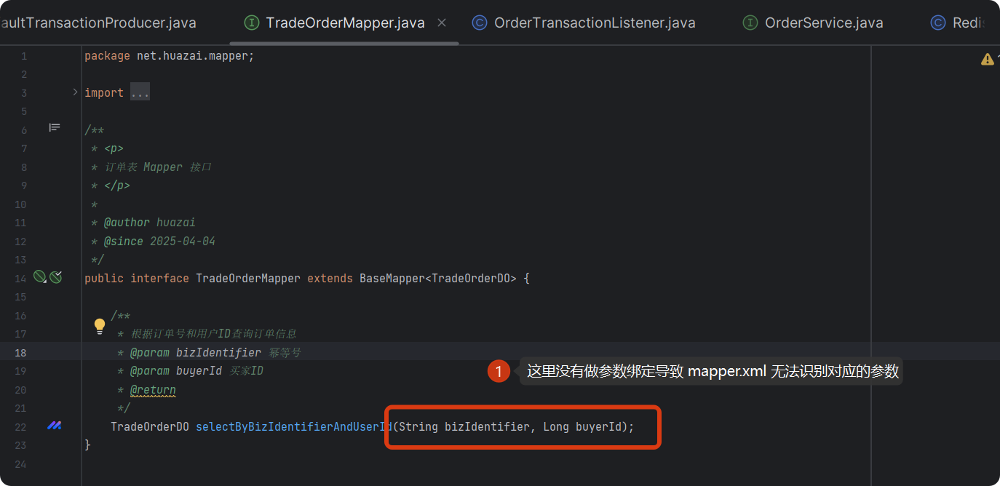

解决方案就是做下参数绑定：

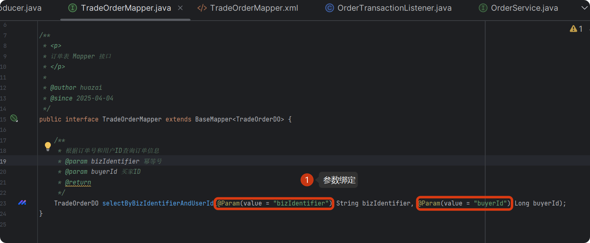

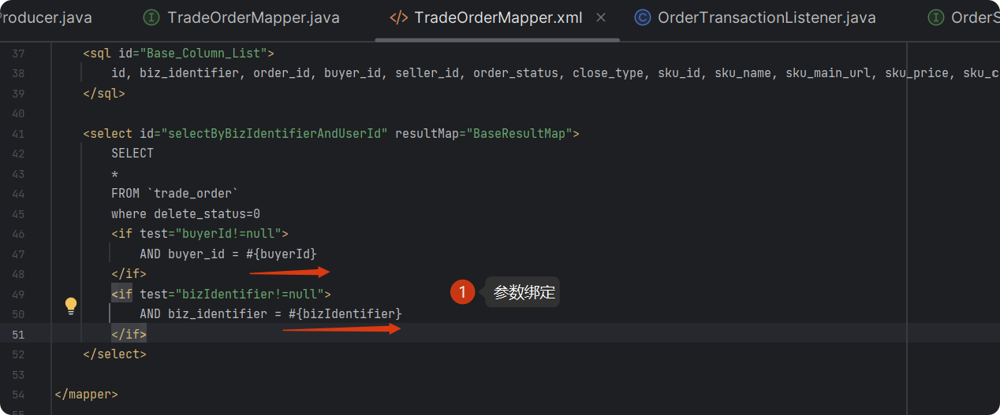

这里后续追加 order\_id 参数，如下：

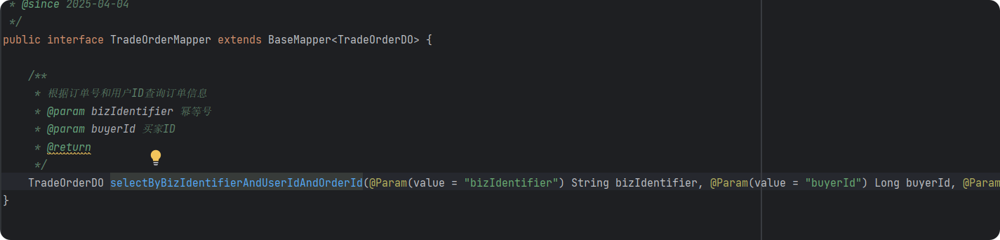

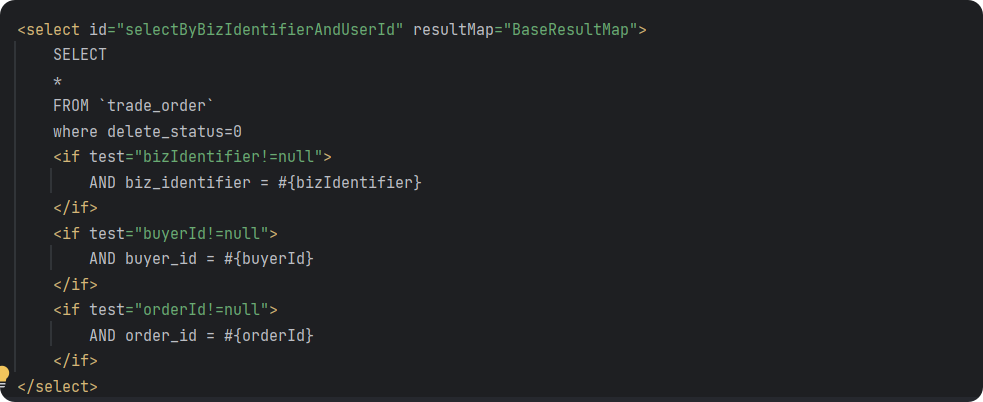

如果事务消息发送失败，则会进行「**库存预扣减还原**」，否则「**库存**」就被白白预扣减了。

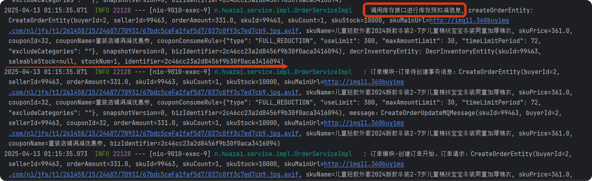

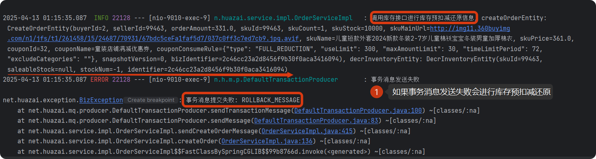

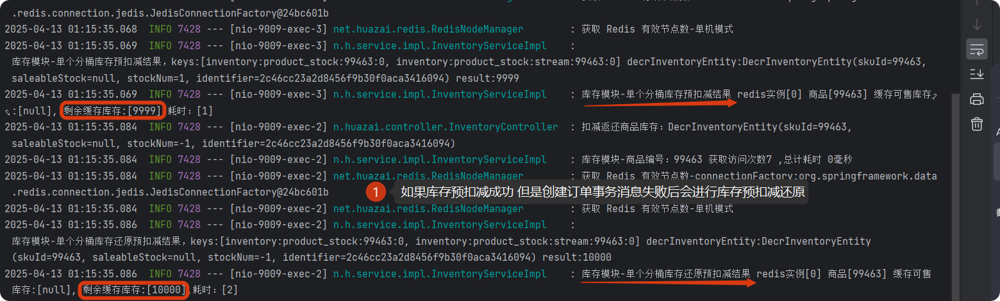

### **2.9.2 正常情况**

当问题都解决之后，重新执行可以看到订单创建成功。

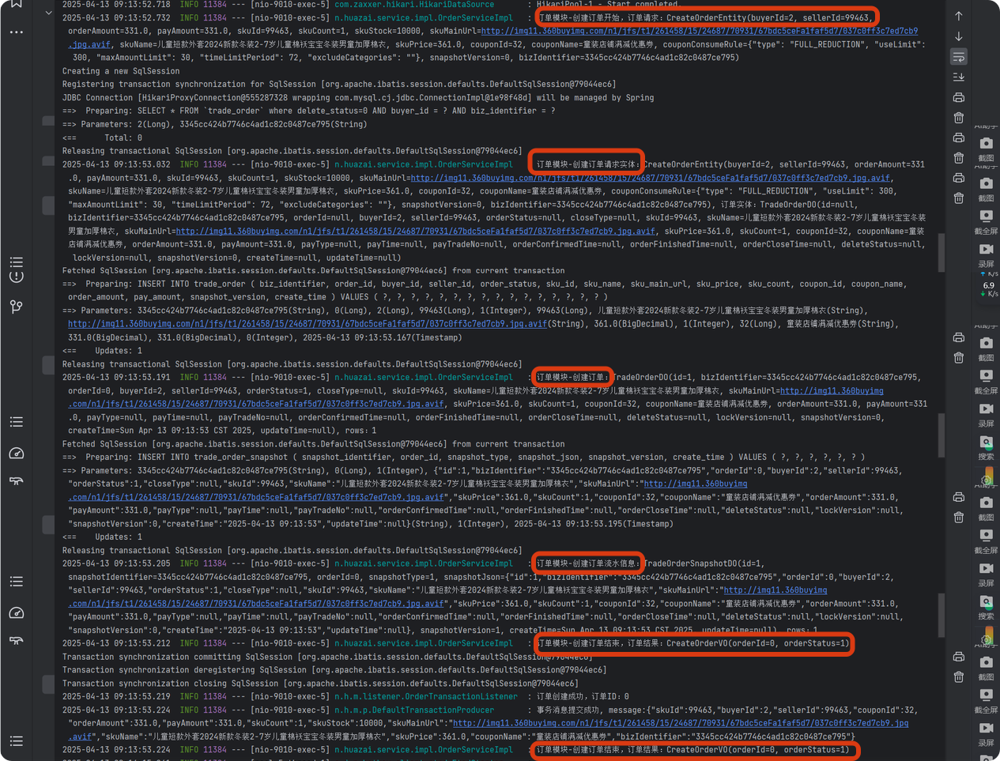

表示 RocketMQ 半消息发送成功，接下来可以看到「**优惠券服务锁定优惠券**」、「**购物车服务清理购物车**」成功。

  
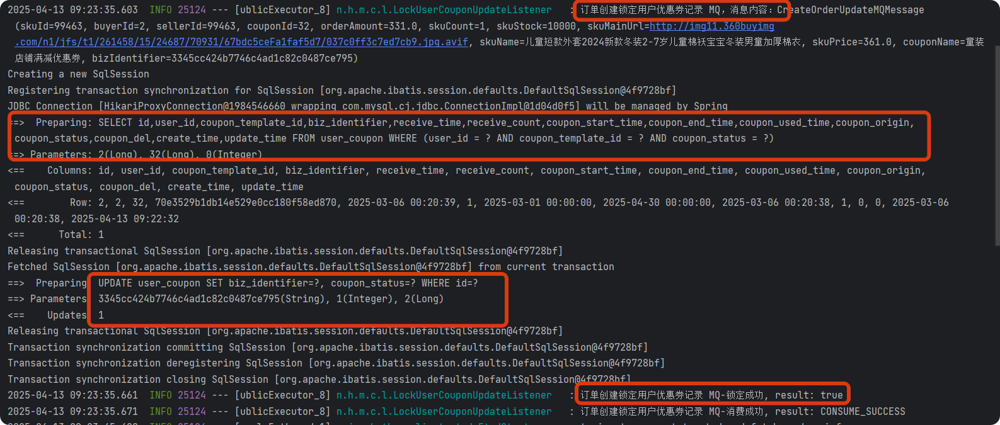

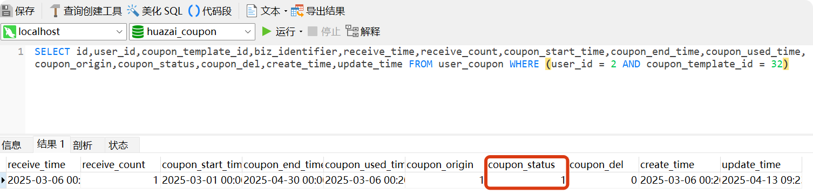

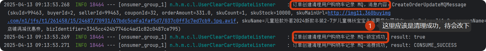

##   
**2.10 订单状态确认及确认流水**

目前上述功能实现并没有做消息确认，只是正常处理了「**优惠券服务锁定优惠券**」、「**购物车服务清理购物车**」。

此时需要在「**优惠券服务锁定优惠券**」、「**购物车服务清理购物车**」处理完成后发送一个「**确认消息**」，「**订单服务**」监听这个「**确认消息**」然后处理「**订单状态为已确认**」。

###   
**2.10.1 清理购物车发送确认消息**

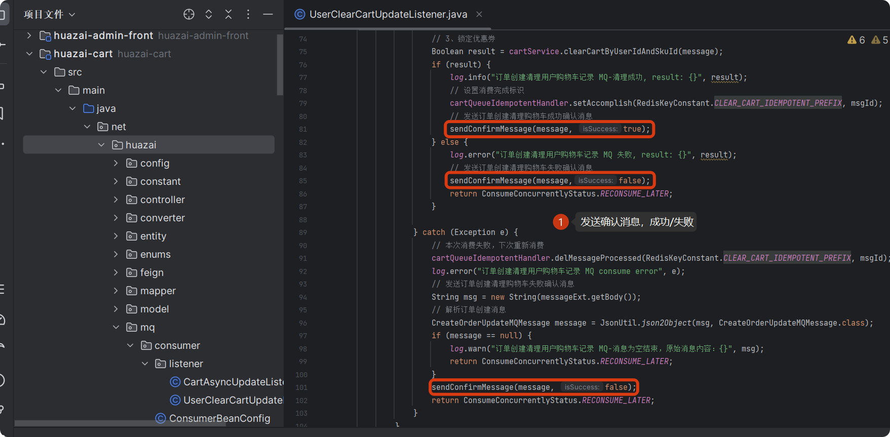

### **2.10.2 优惠券锁定发送确认消息**

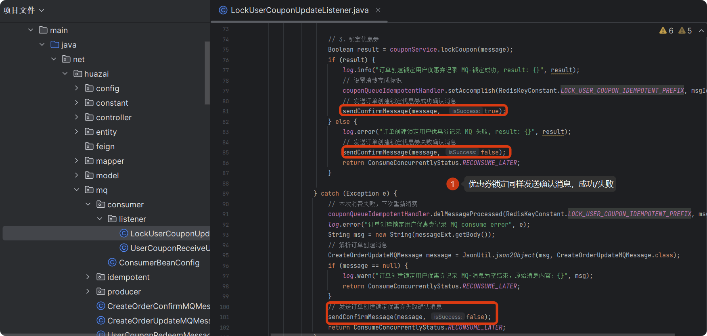

### **2.10.3 订单服务确认最终状态**

会在订单服务确认最终状态，在内存中进行存储和读取。

package net.huazai.mq.consumer.listener;

import java.util.Map;

import java.util.Set;

import java.util.concurrent.ConcurrentHashMap;

/\*\*

\* @className: TransactionState

\* @author: huazai，该项目是知识星球：华仔和他的朋友们 的内部项目

\* @date: 2025-04-13 12:55

\* @Version: 1.0

\* @description:

\*/

public class TransactionState {

/\*\*

\* 服务状态映射

\*/

private Map<String, Boolean> serviceStatus = new ConcurrentHashMap<>();

/\*\*

\* 必需服务列表，用于检查所有服务是否已完成

\*/

private Set<String> requiredServices = Set.of("LOCK\_COUPON", "CART\_CLEAR"); // 硬编码或从消息中解析

/\*\*

\* 更新服务状态

\* @param serviceType

\* @param success

\*/

public void updateServiceStatus(String serviceType, boolean success) {

serviceStatus.putIfAbsent(serviceType, success);

}

/\*\*

\* 检查所有服务是否已完成

\* @return

\*/

public boolean isAllServicesProcessed() {

return serviceStatus.keySet().containsAll(requiredServices);

}

/\*\*

\* 检查所有服务是否成功

\* @return

\*/

public boolean isAllSuccess() {

return serviceStatus.values().stream().allMatch(Boolean::valueOf);

}

/\*\*

\* 检查服务是否已处理

\* @param serviceType

\* @return

\*/

public boolean isServiceProcessed(String serviceType) {

return serviceStatus.containsKey(serviceType);

}

}

最终确认消费者代码如下：

package net.huazai.mq.consumer.listener;

import com.google.common.cache.Cache;

import com.google.common.cache.CacheBuilder;

import lombok.extern.slf4j.Slf4j;

import net.huazai.constant.RedisKeyConstant;

import net.huazai.mq.CreateOrderConfirmMQMessage;

import net.huazai.mq.idempotent.OrderQueueIdempotentHandler;

import net.huazai.service.OrderService;

import net.huazai.utils.JsonUtil;

import org.apache.rocketmq.client.consumer.listener.ConsumeConcurrentlyContext;

import org.apache.rocketmq.client.consumer.listener.ConsumeConcurrentlyStatus;

import org.apache.rocketmq.client.consumer.listener.MessageListenerConcurrently;

import org.apache.rocketmq.common.message.MessageExt;

import org.springframework.beans.factory.annotation.Autowired;

import org.springframework.stereotype.Component;

import java.util.List;

import java.util.concurrent.TimeUnit;

/\*\*

\* 订单服务确认最终状态监听器

\*/

@Slf4j

@Component

public class CreateOrderConfirmListener implements MessageListenerConcurrently {

/\*\*

\* 注入幂等处理器

\*/

@Autowired

private OrderQueueIdempotentHandler orderQueueIdempotentHandler;

/\*\*

\* 注入 service

\*/

@Autowired

private OrderService orderService;

/\*\*

\* 使用内存缓存记录事务状态（Guava Cache）

\*/

private Cache<String, TransactionState> stateCache = CacheBuilder.newBuilder()

.expireAfterWrite(30, TimeUnit.MINUTES)

.build();

/\*\*

\* 并发消费

\* @param msgList

\* @param context

\* @return

\*/

@Override

public ConsumeConcurrentlyStatus consumeMessage(List<MessageExt> msgList, ConsumeConcurrentlyContext context) {

for (MessageExt messageExt : msgList) {

String msgId \= messageExt.getMsgId();

try {

String msg \= new String(messageExt.getBody());

// 解析订单创建消息

CreateOrderConfirmMQMessage message \= JsonUtil.json2Object(msg, CreateOrderConfirmMQMessage.class);

if (message == null) {

log.warn("订单创建确认信息记录 MQ-消息为空结束，原始消息内容：{}", msg);

return ConsumeConcurrentlyStatus.RECONSUME\_LATER;

}

log.info("订单创建确认信息记录 MQ，消息内容：{}", message);

// 2、幂等性校验

if (orderQueueIdempotentHandler.isMessageConsumed(RedisKeyConstant.ORDER\_IDEMPOTENT\_PREFIX, msgId)) {

// 判断当前的这个消息流程是否执行完成

if (orderQueueIdempotentHandler.isAccomplish(RedisKeyConstant.ORDER\_IDEMPOTENT\_PREFIX, msgId)) {

log.warn("订单创建确认信息记录 MQ-检测到重复消息，当前流程还未执行完，消息内容：{}", message);

return ConsumeConcurrentlyStatus.RECONSUME\_LATER;

}

log.error("订单创建确认信息记录 MQ consume error, 消息未完成流程，需要消息队列重试");

return ConsumeConcurrentlyStatus.RECONSUME\_LATER;

}

String bizIdentifier \= message.getBizIdentifier();

String serviceType \= message.getServiceType();

Boolean isSuccess \= message.getIsSuccess();

// 获取或初始化事务状态

TransactionState state \= stateCache.get(bizIdentifier, () -> new TransactionState());

// 更新服务状态（幂等性：每个服务类型仅处理一次）

if (!state.isServiceProcessed(serviceType)) {

state.updateServiceStatus(serviceType, isSuccess);

}

// 检查是否所有服务完成

if (state.isAllServicesProcessed()) {

if (state.isAllSuccess()) {

log.info("订单创建确认信息记录 MQ-确认成功, state: {}", state);

// 设置消费完成标识

orderQueueIdempotentHandler.setAccomplish(RedisKeyConstant.ORDER\_IDEMPOTENT\_PREFIX, msgId);

orderService.confirmOrder(message);

stateCache.invalidate(bizIdentifier); // 清理缓存

} else {

orderService.rollbackOrder(message);

stateCache.invalidate(bizIdentifier); // 清理缓存

log.error("订单创建确认信息记录 MQ 失败, state: {}", state);

return ConsumeConcurrentlyStatus.RECONSUME\_LATER;

}

}

} catch (Exception e) {

// 本次消费失败，下次重新消费

orderQueueIdempotentHandler.delMessageProcessed(RedisKeyConstant.ORDER\_IDEMPOTENT\_PREFIX, msgId);

log.error("订单创建确认信息记录 MQ consume error", e);

return ConsumeConcurrentlyStatus.RECONSUME\_LATER;

}

}

log.info("订单创建确认信息记录 MQ-消费成功, result: {}", ConsumeConcurrentlyStatus.CONSUME\_SUCCESS);

return ConsumeConcurrentlyStatus.CONSUME\_SUCCESS;

}

}

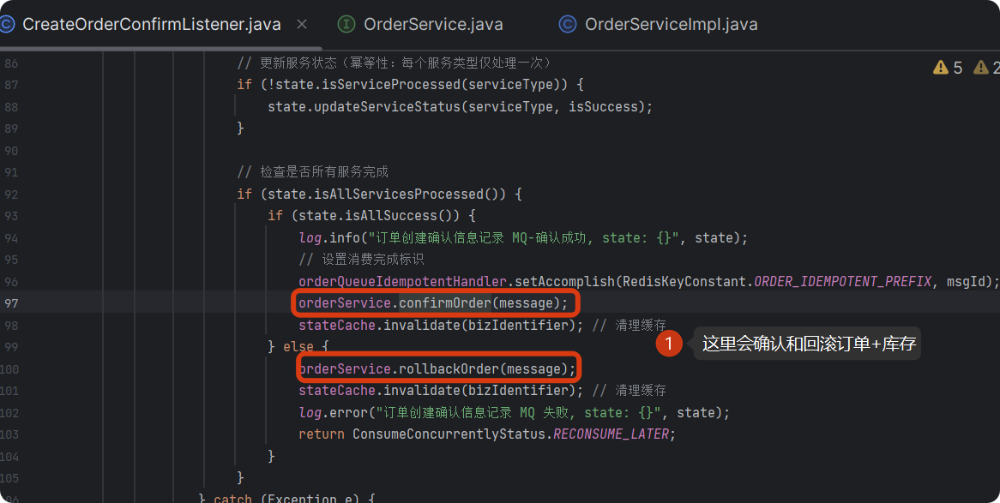

确认和回滚订单代码：

/\*\*

\* 确认订单

\* @param message

\*/

@Override

public void confirmOrder(CreateOrderConfirmMQMessage message) {

log.info("订单模块-确认订单开始，订单信息：{}", message);

/\*\*

\* 1、根据幂等号+用户id查询是否已经有订单存在

\*/

TradeOrderDO existOrder \= tradeOrderMapper.selectByBizIdentifierAndUserIdAndOrderId(message.getBizIdentifier(), message.getBuyerId(), message.getOrderId());

if (existOrder == null) {

log.error("订单模块-确认订单失败，订单不存在：{}", message);

throw new BizException(BizCodes.ORDER\_NOT\_EXIST);

}

/\*\*

\* 2、创建订单

\*/

TradeOrderDO tradeOrderDO \= new TradeOrderDO();

tradeOrderDO.setId(existOrder.getId());

/\*\*

\* 在创建订单时会先创建并初始化一个订单状态机，即设置其初始状态为null

\*/

OrderStateMachineFactory.OrderStateMachine orderStateMachine \= orderStateMachineFactory.getOrderStateMachine(OrderStatusEnum.NULL);

/\*\*

\* 调用订单状态机的fire()方法触发"订单已创建"事件，并传入 tradeOrderDO 对象作为订单状态机的上下文，执行相应的状态转换逻辑，

\* 并根据状态转换的结果，更新订单状态机的当前状态。

\* 具体来说，在订单状态机中，"订单已创建"事件会触发状态转换，

\* 并将订单状态机的当前状态从null转换为"订单已创建"状态。

\* 同时，fire()方法还会调用postStateChange()方法，

\* 该方法会根据订单状态机的当前状态，执行相应的后续操作，

\* 例如发送订单状态变更消息到MQ等。

\*/

CreateOrderEntity createOrderEntity \= new CreateOrderEntity();

BeanUtils.copyProperties(existOrder, createOrderEntity);

orderStateMachine.fire(OrderStatusChangeEnum.ORDER\_CREATED, createOrderEntity);

/\*\*

\* 从订单状态机中获取当前状态

\*/

tradeOrderDO.setOrderStatus(OrderStatusEnum.CONFIRM.getCode());

/\*\*

\* 3、更新订单状态为已确认

\*/

int rows \= tradeOrderMapper.updateById(tradeOrderDO);

if (rows > 0) {

log.info("订单模块-确认订单成功，订单ID：{}", existOrder.getOrderId());

existOrder.setOrderStatus(OrderStatusEnum.CONFIRM.getCode());

TradeOrderSnapshotDO tradeOrderSnapshotDO \= confirmTradeOrderSnapshot(existOrder);

if (tradeOrderSnapshotDO.getId() == null) {

log.error("订单模块-创建订单流水失败：{}", tradeOrderSnapshotDO);

throw new BizException(BizCodes.ORDER\_SNAPSHOT\_CREATE\_FAIL);

}

} else {

log.error("订单模块-确认订单失败，订单ID：{}", existOrder.getOrderId());

throw new BizException(BizCodes.ORDER\_CONFIRM\_FAIL);

}

}

/\*\*

\* 回滚订单

\* @param message

\*/

@Override

public void rollbackOrder(CreateOrderConfirmMQMessage message) {

log.info("订单模块-回滚订单开始，订单信息：{}", message);

/\*\*

\* 1、根据幂等号+用户id查询是否已经有订单存在

\*/

TradeOrderDO existOrder \= tradeOrderMapper.selectByBizIdentifierAndUserIdAndOrderId(message.getBizIdentifier(), message.getBuyerId(), message.getOrderId());

if (existOrder == null) {

log.error("订单模块-确认订单失败，订单不存在：{}", message);

throw new BizException(BizCodes.ORDER\_NOT\_EXIST);

}

/\*\*

\* 2、删除订单

\*/

tradeOrderMapper.delete(new QueryWrapper<TradeOrderDO>().eq("id", existOrder.getId()));

/\*\*

\* 3、删除订单快照

\*/

tradeOrderSnapshotMapper.delete(new QueryWrapper<TradeOrderSnapshotDO>().eq("order\_id", existOrder.getId()).eq("snapshot\_type", 2));

/\*\*

\* 4、调用库存接口进行库存预扣减还原信息

\*/

CreateOrderEntity createOrderEntity \= new CreateOrderEntity();

BeanUtils.copyProperties(existOrder, createOrderEntity);

inventoryPreIncrementLock(createOrderEntity);

}

### **2.10.4 测试**

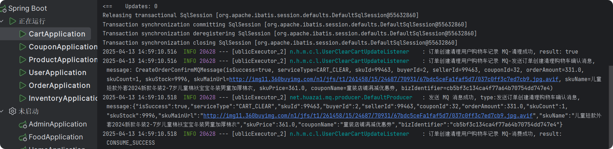

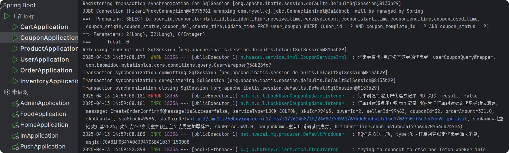

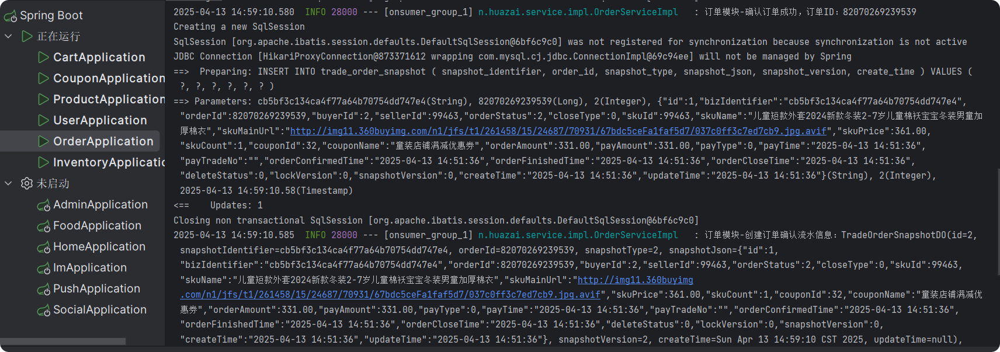