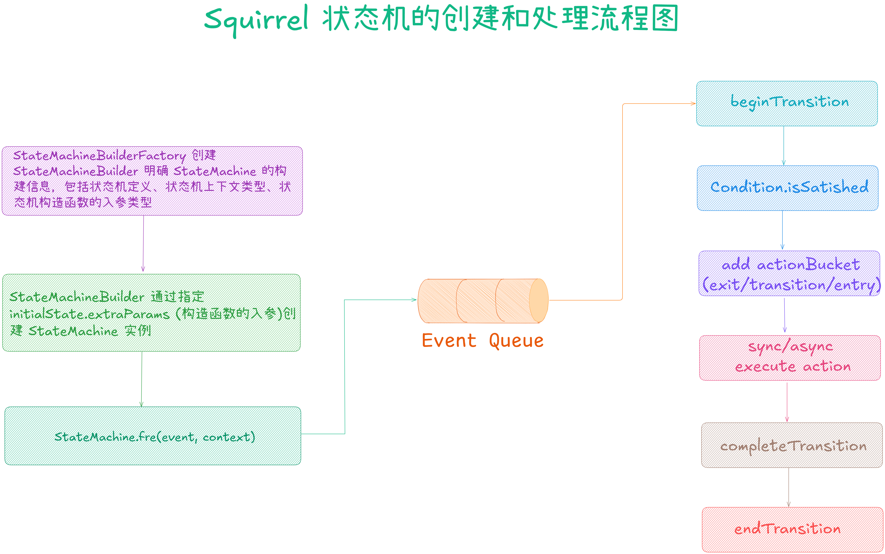
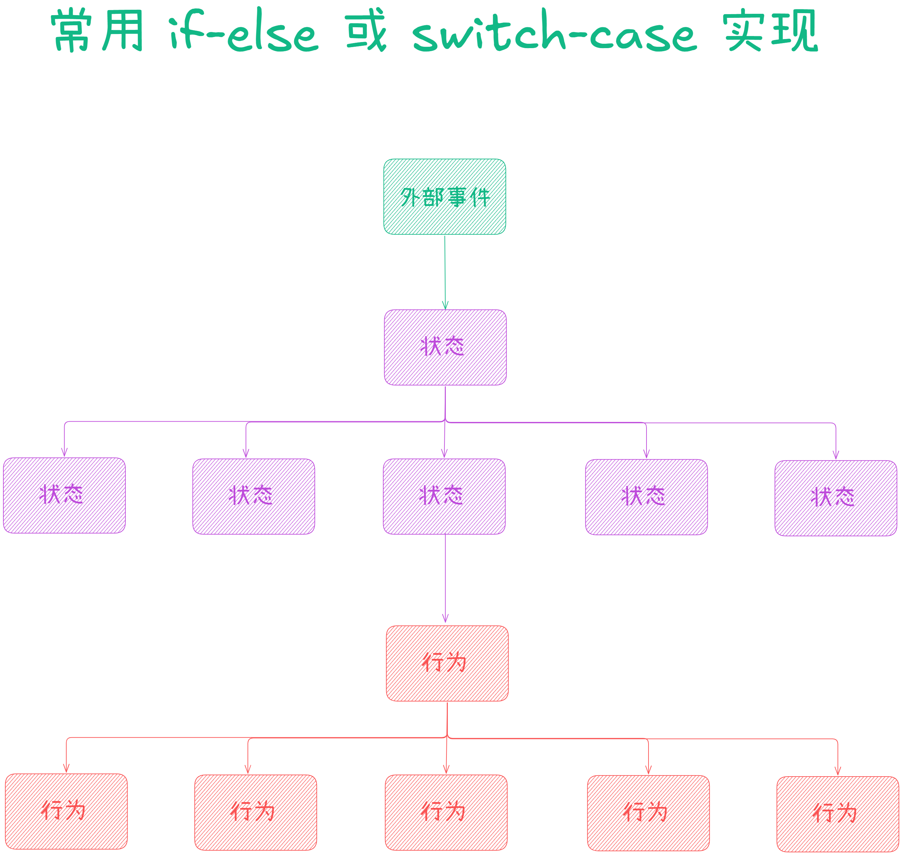
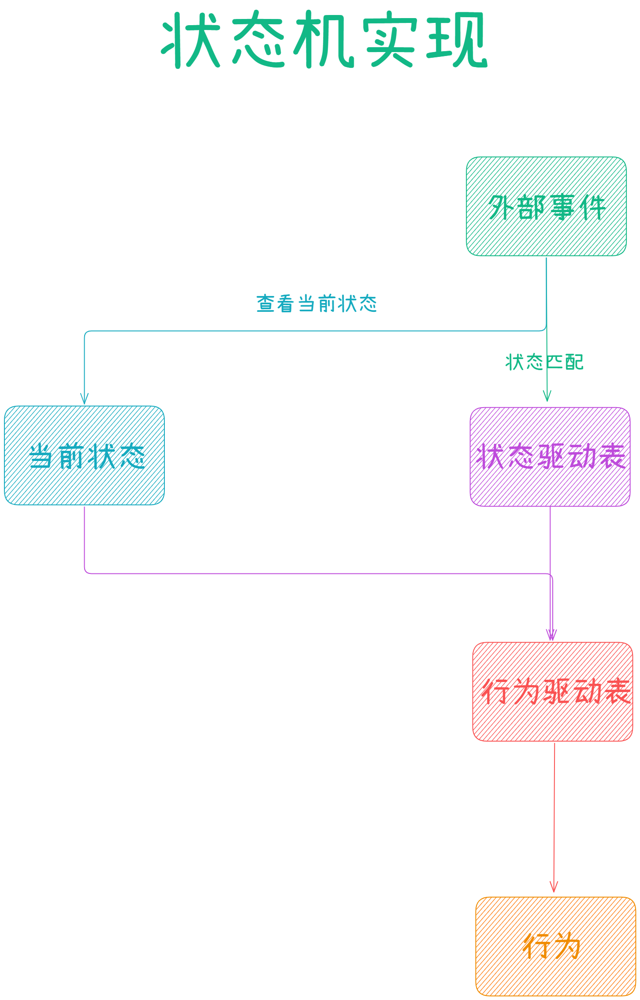
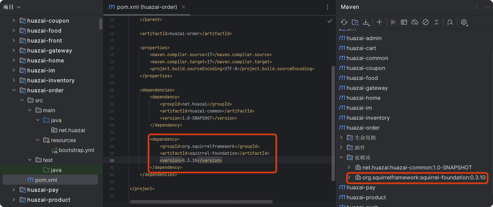
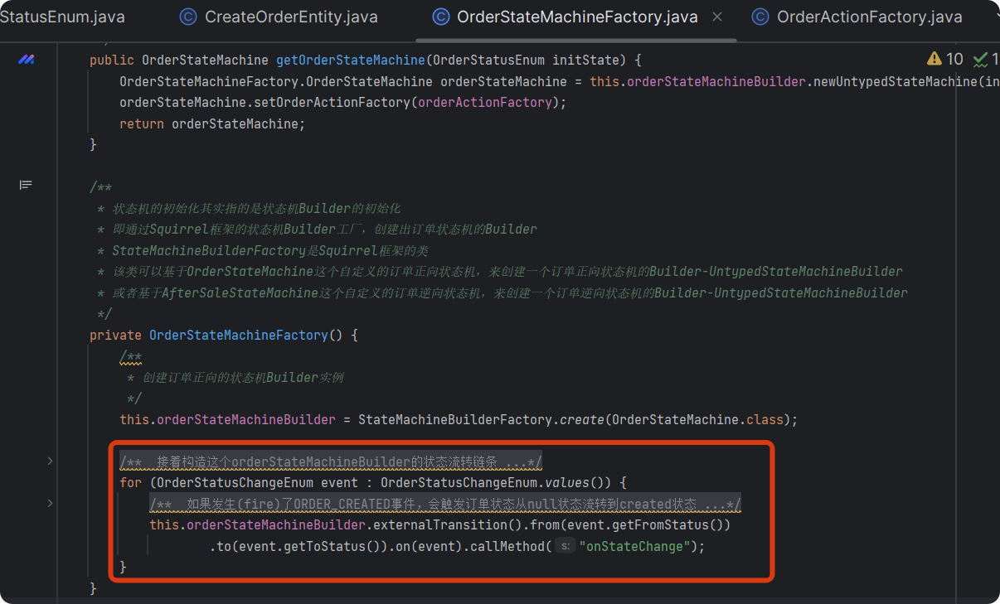

从今天之后的一段时间内，华仔会带着大家一起从零开始搭建并研发一套高并发的电商实战项目，这里会涉及到很多互联网大厂开发过程中所使用的核心技术和架构设计模式，希望大家学完之后可以用到自己的简历中。

这是第七十四篇，本篇我们来介绍整个电商实战项目中最重要的模块之一：「**订单服务核心链路状态机**」的设计与功能实现。

文章汇总位置：[https://wx.zsxq.com/dweb2/index/columns/51122554151214](https://wx.zsxq.com/dweb2/index/columns/51122554151214)

源码授权与获取地址：[https://articles.zsxq.com/id\_1s85grnaae4p.html](https://articles.zsxq.com/id_1s85grnaae4p.html)

本章源码地址：[https://gitcode.net/u011359591/huazai-ecshop/-/tree/ecshop-chapter-74](https://gitcode.net/u011359591/huazai-ecshop/-/tree/ecshop-chapter-74)

## **01 前言**

通过上篇 [【电商实战项目第七十三篇】华仔电商实战订单服务业务场景介绍与架构设计](https://articles.zsxq.com/id_7n1znf4mnd0b.html)，我们把「**订单服务**」相关业务场景、技术架构都介绍了一遍，今天我们来重点梳理下整个电商实战项目中「**订单服务核心链路状态机**」的设计与功能实现。

##   
**02 状态机**

## **2.1 状态机概念**

状态机是一种用来进行对象行为建模的工具，描述对象在生命周期内所经历的状态变化。

有限状态机是一种用来进行对象行为建模的工具，其作用主要是描述对象在它的生命周期内所经历的状态序列，以及如何响应来自外界的各种事件。

有限状态机可以用状态来描述对象，并且任一时刻，对象总是处于一种状态。对象拥有的状态总数是有限的。通过触发对象的某些行为，可以导致对象从一种状态过渡到另一种状态。对象的状态变化是有规则的，A 状态可以变换到 B，B 可以变换到 C，A 却不一定能变换到 C 同一种行为。可以将对象从多种状态变成同种状态，但是不能从同种状态变成多种状态。

## **2.2 状态机适用场景**

状态机适用于有一个「**明确生命周期的对象**」，并且对象在生命周期的状态变迁中，存在不同的触发条件以及达到某个状态需要执行的某个动作。

状态机会将所有的「**状态**」、「**事件**」、「**动作**」都抽离出来，对复杂的「**状态迁移逻辑**」进行统一管理，来取代冗长的 if else 判断。通过状态机，可以实现「**明确的状态条件**」、「**原子的响应动作**」、「**事件驱动迁移目标状态**」，可以使系统更加易于维护和管理。

在电商平台中的「**订单**」、「**物流**」、「**售后**」等场景都会大量使用「**状态机**」。

## **2.3 状态机要素**

状态机可归纳为 4 个要素，也就是「**现态**」、「**条件**」、「**动作**」、「**次态**」。现态和条件是因，动作和次态是果。

1.  现态指当前所处的状态。
2.  条件又称为事件：当一个条件被满足，将会触发一个动作，或者执行一次状态的迁移。
3.  动作指条件满足后执行的动作：动作执行完毕后，可以迁移到新的状态，也可以仍旧保持原状态。动作不是必需的，当条件满足后，可不执行任何动作，直接迁移到新状态。
4.  次态指条件满足后要迁往的新状态："次态"是相对于"现态"而言的，"次态"一旦被激活，就转变成新的"现态"。

## **2.4 状态机动作类型**

1.  进入动作：在进入状态时进行。
2.  退出动作：在退出状态时进行。
3.  输入动作：依赖于当前状态和输入条件进行。
4.  转移动作：在进行特定转移时进行。

## **2.5 状态机选型**

这里提供两种选型方案，通过对比最终会选其中一个作为我们订单状态机的最终方案。

### **1、Spring 官方提供的状态机**

spring-statemachine 是 Spring 官方提供的状态机。

开源地址如下：[https://github.com/spring-projects/spring-statemachine](https://github.com/spring-projects/spring-statemachine)。

官方文档如下：[https://projects.spring.io/spring-statemachine](https://projects.spring.io/spring-statemachine)。

其优缺点如下：

1.  优点：轻量级、可以快速接入 (已经接入 Spring 框架的应用)、内置 Redis 等持久化手段、可以通过对接 ZooKpeer 实现分布式状态管理模型、支持较为复杂的多层状态模型配置、支持使用注解、使用方便、支持基于 Spring AOP 上的扩展、由Spring 推出并进行持续迭代。
2.  缺点：对于一些没有接入 Spring 框架的应用，接入 Spring 的状态机会比较困难。相关使用文档等较少，模型较为复杂，接入学习成本相对较高。Spring 状态机的监听器、AOP 等组件模块都使用了 Spring 框架中的模块，在上面做改造较难。另外其状态创建比较重，生产上一般用工厂模式来创建状态机，这样每个请求都会创建一个 StateMachine 对象。于是在高并发场景下，会创建N个 StateMachine 对象，对内存压力就大了。比如测试 2 分钟内 60w 个并发请求，内存消耗大几百兆。

### **2、Squirrel 状态机**

Squirrel 是一个开源的轻量级的状态机实现。

开源地址如下：[https://github.com/hekailiang/squirrel](https://github.com/hekailiang/squirrel)。

官方文档如下：[http://hekailiang.github.io/squirrel](http://hekailiang.github.io/squirrel)。

其优缺点如下：

1.  优点：Squirrel 的实现更为轻量，设计思路也比较清晰，文档以及测试用例也很丰富。Squirrel 关注的人也比较多，贡献采坑问题和问题场景也比较丰富。不依赖于 Spring，没有接入 Spring 框架的应用也可以接入使用。支持使用注解，支持自定义切点，内部实现不依赖于 Spring，可以在在上面扩展改造。
2.  缺点：切点粒度比较粗，要使用细粒度的切点。需要自己实现模型，相比较 Spring 状态机较为简单，实现复杂的多层状态模型需要在此基础上开发实现。

### **3、订单状态机方案选择**

这里我们会使用 Squirrel 来作为我们订单的状态机实现方案，如果大家有更好的方案 也可以评论区留言，后续同步更新。

Squirrel 状态机是一种用来进行「**对象行为建模**」的工具，主要描述对象在其生命周期内所经历的状态，以及如何响应各种事件。比如一个订单会经历「**创建**」、「**库存扣减**」、「**支付/取消支付**」、「**发货**」、「**收货**」、「**售后**」等状态，状态间的转换、触发事件的监听，都可用其实现清晰的管理。

使用「**状态机来管理对象生命周期**」的好处是让代码更具「**维护性**」 +「**可测试性**」。「**明确的状态条件**」 + 「**原子的响应动作**」 + 「**事件驱动迁移目标状态**」，对于流程复杂易变的业务场景能大大减轻维护和测试的难度。

## **2.6 订单状态机流转**

整个订单的状态机流转如下，这里后续履约相关的状态流转暂时不更新，后续有时间再做。

## **2.7 基于 Squirrel 实现订单状态机**

### **2.7.1 Squirrel 状态机定义**

Squirrel 状态机是一种「**有限状态机（finite-state machine, FSM）**」，有限状态机是指对象有一个明确且复杂的生命流，并且状态变迁存在不同的触发条件以及处理行为。

简单来说，状态机可以描述核心业务规则、核心业务内容，即 A 实体，在 B 状态下，由 C 角色在满足 D 条件时，执行 E 操作成功后，迁移到 F 状态，并产生 G 事件。

### **2.7.2 Squirrel 状态机依赖组件**

### **2.7.2.1 StateMachine**

[StateMachine](http://statemachine%20/) 实例由 [StateMachineBuilder](http://statemachinebuilder%20/) 创建，不被共享。对于使用注解方式定义的 [StateMachine](http://statemachine/)，[StateMachine](http://statemachine%20/) 实例即根据此定义创建，相应的 [action](http://action%20/) 也由本实例执行。与 Spring 集成就是将 Spring 的 Bean 实例注入到由 [Builder](http://builder%20/) 创建的状态机实例中。

### **2.7.2.2 StateMachineBuilder**

其本质上是由 [StateMachineBuilderFactory](http://statemachinebuilderfactory%20/) 创建的动态代理，被代理的 [StateMachineBuilder](http://statemachinebuilder%20/) 默认实现为[StateMachineBuilderImpl](http://statemachinebuilderimpl/)。

它其内部描述了状态机实例创建细节，包括 [State](http://state/)、[Event](http://event/)、[Context](http://context/) 类型信息、[Constructor](http://constructor/)等。同时[StateMachineBuilder](http://statemachinebuilder/) 也包含了 [StateMachine](http://statemachine/) 的一些全局共享资源，包括[StateConverter](http://stateconverter/)、[EventConverter](http://eventconverter/)、[MvelScriptManager](http://mvelscriptmanager/) 等。它可被复用，使用中可被实现为 [Singleton](http://singleton/)单例。

### **2.7.2.3 StateMachineBuilderFactory**

Squirrel 状态机的事件处理过程：

> 状态正常迁移 TransitionBegin -- (exit -> transition -> entry) --> TransitionComplete --> TransitionEnd
> 
> 状态迁移异常 TransitionBegin -- (exit -> transition -> entry) --> TransitionException --> TransitionEnd
> 
> 状态迁移事件拒绝 TransitionBegin --> TransitionDeclined --> TransitionEnd

Squirrel 状态机的创建和处理流程图：

### **2.7.3 实现方案对比**

这里我们对比下普通 if-else/switch-case 与状态机实现的对比。

### **2.7.3.1 if-else/switch-case**

### **2.7.3.2 状态机实现**

通过引入「**状态机**」，可以去除大量 if-else 或者switch-case 分支结构。直接通过「**当前状态**」和「**状态驱动表**」查询「**行为驱动表**」，找到具体行为执行操作，有利于代码的维护和扩展。

「**状态机**」很好的帮我们处理了：「**对象状态流转**」、「**事件监听**」以及「**外界各种事件响应**」。从代码设计角度减少了大量 if-else/switch-case 逻辑判断，提高了代码的可维护性、扩展性，方便管理和测试。

### **2.7.4 Spring 如何集成 Squirrel 状态机**

从 [Squirrel](http://squirrel%20/) 状态机的创建和处理流程可以看到，[StateMachineBuilder](http://statemachinebuilder/) 可以以单例的方式由 Spring 容器管理，而[StateMachine](http://statemachine/) 的实例的生命周期会伴随着请求/业务。

从这两点出发，集成 Spring 需要完成两件事：

1.  通过 Spring 创建 [StateMachineBuilder](http://statemachinebuilder%20/) 实例。
2.  业务方法通过 [StateMachineBuilder](http://statemachinebuilder%20/) 实例创建 [StateMachine](http://statemachine%20/) 实例，并且向 [StateMachine](http://statemachine%20/) 实例暴露[SpringApplicationContext](http://springapplicationcontext/)。

### **2.7.4.1 添加 pom 文件依赖**

### **2.7.4.2 状态机状态枚举、状态变更枚举、操作类型枚举**

/\*\*

\* 订单状态枚举

\*

\* @author huazai，该项目是知识星球：华仔和他的朋友们 的内部项目

\* @since 2025-04-03 19:22

\* @Version: 1.0

\* @description:

\*/

public enum OrderStatusEnum {

NULL(0, "未知"),

CREATED(1, "已创建"),

CONFIRM(2, "已确认"),

PAID(3, "已支付"),

FULFILL(4, "已履约"),

OUT\_STOCK(5, "出库"),

DELIVERY(6, "配送中"),

SIGNED(7, "已签收"),

CANCELLED(8, "已取消"),

REFUSED(9, "已拒收"),

INVALID(127, "无效订单");

@Getter

private Integer code;

@Getter

private String msg;

private OrderStatusEnum(int code, String msg) {

this.code = code;

this.msg = msg;

}

}

/\*\*

\* 订单状态变更枚举

\*

\* @author huazai，该项目是知识星球：华仔和他的朋友们 的内部项目

\* @since 2025-04-03 19:22

\* @Version: 1.0

\* @description:

\*/

public enum OrderStatusChangeEnum {

/\*\*

\* 订单已创建

\*/

ORDER\_CREATED(OrderStatusEnum.NULL, OrderStatusEnum.CREATED, OrderOperateTypeEnum.NEW\_ORDER, "created"),

/\*\*

\* 订单已确认

\*/

ORDER\_PREPAY(OrderStatusEnum.CREATED, OrderStatusEnum.CONFIRM, OrderOperateTypeEnum.PRE\_PAY\_ORDER, "confirm"),

/\*\*

\* 订单已支付

\*/

ORDER\_PAID(OrderStatusEnum.CONFIRM, OrderStatusEnum.PAID, OrderOperateTypeEnum.PAID\_ORDER, "paid"),

/\*\*

\* 订单已履约

\*/

ORDER\_FULFILLED(OrderStatusEnum.PAID, OrderStatusEnum.FULFILL, OrderOperateTypeEnum.PUSH\_ORDER\_FULFILL, "fulfill"),

/\*\*

\* 订单已出库

\*/

ORDER\_OUT\_STOCKED(OrderStatusEnum.FULFILL, OrderStatusEnum.OUT\_STOCK, OrderOperateTypeEnum.ORDER\_OUT\_STOCK, "out\_stock"),

/\*\*

\* 订单已配送

\*/

ORDER\_DELIVERED(OrderStatusEnum.OUT\_STOCK, OrderStatusEnum.DELIVERY, OrderOperateTypeEnum.ORDER\_DELIVERED, "delivery"),

/\*\*

\* 订单已签收

\*/

ORDER\_SIGNED(OrderStatusEnum.DELIVERY, OrderStatusEnum.SIGNED, OrderOperateTypeEnum.ORDER\_SIGNED, "signed"),

/\*\*

\* 订单已取消

\*/

ORDER\_CANCEL(OrderStatusEnum.CANCELLED, OrderStatusEnum.CANCELLED, OrderOperateTypeEnum.ORDER\_CANCEL, "cancel"),

/\*\*

\* 订单已拒收

\*/

ORDER\_REFUSED(OrderStatusEnum.CREATED, OrderStatusEnum.REFUSED, OrderOperateTypeEnum.ORDER\_REFUSED, "refused"),

;

/\*\*

\* 原状态

\*/

@Getter

private OrderStatusEnum fromStatus;

/\*\*

\* 目标状态

\*/

@Getter

private OrderStatusEnum toStatus;

/\*\*

\* 操作类型

\*/

@Getter

private OrderOperateTypeEnum operateType;

/\*\*

\* 标签

\*/

@Getter

private String tags;

/\*\*

\* 是否发送事件

\*/

@Getter

private boolean sendEvent;

/\*\*

\* 构造函数

\* @param orderStatusEnum

\* @param orderStatusEnum1

\* @param orderOperateTypeEnum

\* @param created

\*/

private OrderStatusChangeEnum(OrderStatusEnum orderStatusEnum, OrderStatusEnum orderStatusEnum1, OrderOperateTypeEnum orderOperateTypeEnum, String created) {

this.fromStatus = orderStatusEnum;

this.toStatus = orderStatusEnum1;

this.operateType = orderOperateTypeEnum;

this.tags = created;

}

}

/\*\*

\* 订单操作类型枚举

\*

\* @author huazai，该项目是知识星球：华仔和他的朋友们 的内部项目

\* @since 2025-04-03 19:22

\* @Version: 1.0

\* @description:

\*/

public enum OrderOperateTypeEnum {

NEW\_ORDER(1, "订单已创建"),

PRE\_PAY\_ORDER(2, "订单已确认"),

PAID\_ORDER(3, "订单已支付"),

PUSH\_ORDER\_FULFILL(4, "订单已履约"),

ORDER\_OUT\_STOCK(5, "订单已出库"),

ORDER\_DELIVERED(6, "订单已配送"),

ORDER\_SIGNED(9, "订单已签收"),

ORDER\_CANCEL(8, "订单已取消"),

ORDER\_REFUSED(9, "订单已拒收");

@Getter

private Integer code;

@Getter

private String msg;

private OrderOperateTypeEnum(int code, String msg) {

this.code = code;

this.msg = msg;

}

}

### **2.7.4.3 Squirrel 状态机实现订单状态流转**

这里引入「**状态机设计模式**」把「**生成订单**」改造成一个「**状态机**」。

在整个「**生成订单流程**」中，订单状态会从一个状态流转变更为另外一个状态。而且订单在不同的状态变更下，都会有对应的处理操作。比如订单状态从「**null**」流转到「**created**」，就会执行「**created**」状态下的处理操作。

这样，第一版订单系统可以基于「**状态机**」 \+ 「**RocketMQ 事务消息**」来保证「**生成订单链路**」的数据最终一致性，如果在执行「**生成订单流程**」中出现问题，就进行回滚和补偿。

后续有时间再进行迭代升级。

### **2.7.4.3.1 初始化订单状态机**

创建订单时，首先会「**创建并初始化订单状态机**」，即设置其「**初始状态为 Null**」。 其中 [OrderStateMachineFactory#getOrderStateMachine()](http://orderstatemachinefactory/#getOrderStateMachine\(\)) 方法便会基于 Squirrel 状态机框架，通过「**订单状态机 orderStateMachineBuilder**」来创建「**订单状态机**」。

接着「**调用订单状态机 fire() 方法**」触发订单状态进行流转，也就是把触发订单从「**null**」状态流转到「**created**」状态。此外，订单的每个状态 「**state**」都会对应一个「**action**」操作。比如「**订单状态机**」在进行状态流转时，首先会触发订单状态流转到 「**created**」状态，执行对应的「**action**」动作。

订单状态机的 fire() 方法会调用 Squirrel 框架的 fire() 方法来触发事件。触发事件后，会调用订单状态机的[onStateChange()](http://onstatechange\(\)/) 方法。在 [onStateChange()](http://onstatechange\(\)%20/) 方法中继续调用 [onStateChangeInternal()](http://xn--onstatechangeinternal\(\)-uy12c9z5g/) 方法，通过 「**action 工厂**」 +「**事件类型**」获取处理订单状态流转的具体 action，最后执行 [action#onStateChange()](http://action/#onStateChange\(\)) 方法，完成订单状态的流转处理。

[OrderStateMachineFactory](http://orderstatemachinefactory/#getOrderStateMachine\(\)) 是状态机工厂类，是用来创建订单状态机的。它底层基于 Squirrel 框架，可对订单状态机 OrderStateMachine 定义。比如发生事件a时，会导致状态A流转到状态B，并触发调用对应的方法C。

创建订单时的状态机代码如下：

/\*\*

\* 

\* 订单服务类

\* 

\*

\* @author huazai

\* @since 2025-04-01

\*/

@Service

@Slf4j

public class OrderServiceImpl implements OrderService {

/\*\*

\* 创建状态机的状态机工厂

\*/

@Autowired

private OrderStateMachineFactory orderStateMachineFactory;

/\*\*

\* 创建订单

\* @param createOrderEntity 订单DTO

\* @return 订单DTO

\*/

public CreateOrderVO createOrder(CreateOrderEntity createOrderEntity) {

log.info("订单模块-创建订单开始，订单请求：{}", createOrderEntity);

/\*\*

\* 在创建订单时会先创建并初始化一个订单状态机，即设置其初始状态为null

\*/

OrderStateMachineFactory.OrderStateMachine orderStateMachine \= orderStateMachineFactory.getOrderStateMachine(OrderStatusEnum.NULL);

/\*\*

\* 调用订单状态机的fire()方法触发"订单已创建"事件，并传入 createOrderEntity 对象作为订单状态机的上下文，执行相应的状态转换逻辑，

\* 并根据状态转换的结果，更新订单状态机的当前状态。

\* 具体来说，在订单状态机中，"订单已创建"事件会触发状态转换，

\* 并将订单状态机的当前状态从null转换为"订单已创建"状态。

\* 同时，fire()方法还会调用postStateChange()方法，

\* 该方法会根据订单状态机的当前状态，执行相应的后续操作，

\* 例如发送订单状态变更消息到MQ等。

\*/

orderStateMachine.fire(OrderStatusChangeEnum.ORDER\_CREATED, createOrderEntity);

/\*\*

\* 返回结果集 TODO

\*/

CreateOrderVO createOrderVO \= new CreateOrderVO();

createOrderVO.setOrderId(0L);

createOrderVO.setOrderStatus(OrderStatusEnum.CREATED.getCode());

log.info("订单模块-创建订单结束，订单结果：{}", createOrderVO);

return createOrderVO;

}

}

### **2.7.4.3.2 订单状态机 Builder 流转链路构建**

### **1、订单状态机 Builder 初始化**

其实「**状态机的初始化**」就是指「**状态机 Builder 的初始化**」，即通过 Squirrel 框架的状态机 Builder 工厂，创建出状态机的 Builder。

其中「**状态机 Builder 是可复用的**」，是状态机工厂单例里的一个 final 属性。而 「**状态机是不可复用的**」，每次处理请求时都会由状态机 Builder 创建一个出来，[StateMachineBuilderFactory](http://statemachinebuilderfactory/) 是 Squirrel 框架提供的「**状态机 Builder 工厂**」。

代码如下：

/\*\*

\* @className: OrderStateMachineFactory

\* @author: huazai，该项目是知识星球：华仔和他的朋友们 的内部项目

\* @date: 2025-04-03 19:22

\* @Version: 1.0

\* @description:

\*/

@Component

@Slf4j

public class OrderStateMachineFactory {

/\*\*

\* 订单状态机的Builder实例

\* 该 Builder 实例用于创建订单状态机的实例

\* 即通过 Squirrel 框架的状态机Builder工厂，创建出订单状态机的 Builder

\*/

private final UntypedStateMachineBuilder orderStateMachineBuilder;

/\*\*

\* 订单处理器工厂

\* 该工厂用于创建订单处理器的实例

\* 即通过 Squirrel 框架的状态机Builder工厂，创建出订单处理器的 Builder

\* 订单处理器的Builder用于创建订单处理器的实例

\* 订单处理器的实例用于处理订单状态的流转

\* 订单处理器的实例会在订单状态机的状态流转时被调用

\* 订单处理器的实例会根据订单状态的流转，触发订单状态的流转

\*/

@Resource

private OrderActionFactory orderActionFactory;

/\*\*

\* 获取订单状态机

\* @param initState 订单初始状态

\* @return 订单状态机实例

\*/

public OrderStateMachine getOrderStateMachine(OrderStatusEnum initState) {

OrderStateMachineFactory.OrderStateMachine orderStateMachine \= this.orderStateMachineBuilder.newUntypedStateMachine(initState);

orderStateMachine.setOrderActionFactory(orderActionFactory);

return orderStateMachine;

}

/\*\*

\* 状态机的初始化其实指的是状态机Builder的初始化

\* 即通过Squirrel框架的状态机Builder工厂，创建出订单状态机的Builder

\* StateMachineBuilderFactory是Squirrel框架的类

\* 该类可以基于OrderStateMachine这个自定义的订单正向状态机，来创建一个订单正向状态机的Builder-UntypedStateMachineBuilder

\* 或者基于AfterSaleStateMachine这个自定义的订单逆向状态机，来创建一个订单逆向状态机的Builder-UntypedStateMachineBuilder

\*/

private OrderStateMachineFactory() {

/\*\*

\* 创建订单正向的状态机Builder实例

\*/

this.orderStateMachineBuilder = StateMachineBuilderFactory.create(OrderStateMachine.class);

/\*\*

\* 接着构造这个orderStateMachineBuilder的状态流转链条

\* 也就是设置每次状态流转时：

\* 会从哪个状态流转到哪个状态、流转的过程中会触发哪个事件、触发事件后由哪个action(状态机的哪个方法)来处理

\* 遍历OrderStatusChangeEnum来对orderStateMachineBuilder进行设置

\* OrderStatusChangeEnum包含了订单正向状态流转的所有事件，每个事件都会触发对应的订单正向状态流转

\* 例如：

\* 订单创建事件：ORDER\_CREATED，会触发订单状态从null状态流转到created状态

\* 订单支付事件：ORDER\_PAYED，会触发订单状态从created状态流转到payed状态

\* 订单发货事件：ORDER\_DELIVERED，会触发订单状态从payed状态流转到delivered状态

\* 订单签收事件：ORDER\_SIGNED，会触发订单状态从delivered状态流转到signed状态

\* 订单取消事件：ORDER\_CANCELED，会触发订单状态从created状态流转到canceled状态

\* 订单拒收事件：ORDER\_REFUSED，会触发订单状态从payed状态流转到refused状态

\* 订单退款事件：ORDER\_REFUNDED，会触发订单状态从delivered状态流转到refunded状态

\* 订单完成事件：ORDER\_COMPLETED，会触发订单状态从signed状态流转到completed状态

\* 订单关闭事件：ORDER\_CLOSED，会触发订单状态从canceled状态流转到closed状态

\* 订单关闭事件：ORDER\_CLOSED，会触发订单状态从refused状态流转到closed状态

\* 订单关闭事件：ORDER\_CLOSED，会触发订单状态从refunded状态流转到closed状态

\* 订单关闭事件：ORDER\_CLOSED，会触发订单状态从completed状态流转到closed状态

\* 订单关闭事件：ORDER\_CLOSED，会触发订单状态从closed状态流转到closed状态

\* 即订单关闭事件会触发订单状态从任何状态流转到closed状态

\*/

for (OrderStatusChangeEnum event : OrderStatusChangeEnum.values()) {

/\*\*

\* 如果发生(fire)了ORDER\_CREATED事件，会触发订单状态从null状态流转到created状态

\* 而具体的状态流转处理，则是通过调用状态机里的onStateChange()方法来实现的

\* 这里的fromStatus()和toStatus()都是OrderStatusChangeEnum的方法

\* 即获取订单状态的fromStatus和toStatus

\* 例如：

\* 订单创建事件：ORDER\_CREATED，会触发订单状态从null状态流转到created状态

\* 订单支付事件：ORDER\_PAYED，会触发订单状态从created状态流转到payed状态

\* 订单发货事件：ORDER\_DELIVERED，会触发订单状态从payed状态流转到delivered状态

\* 订单签收事件：ORDER\_SIGNED，会触发订单状态从delivered状态流转到signed状态

\* 订单取消事件：ORDER\_CANCELED，会触发订单状态从created状态流转到canceled状态

\* ......

\* 订单关闭事件：ORDER\_CLOSED，会触发订单状态从closed状态流转到closed状态

\* 即订单关闭事件会触发订单状态从任何状态流转到closed状态

\*/

this.orderStateMachineBuilder.externalTransition().from(event.getFromStatus())

.to(event.getToStatus()).on(event).callMethod("onStateChange");

}

}

....

}

### **2、订单状态机 OrderStateMachine**

自定义的状态机需要继承自定义的基类 [BaseStateMachine](http://basestatemachine/)，且使用 Squirrel 框架提供的注解[@StateMachineParameters](http://statemachineparameters/) 来修饰。

/\*\*

\* @className: OrderStateMachineFactory

\* @author: huazai，该项目是知识星球：华仔和他的朋友们 的内部项目

\* @date: 2025-04-03 19:22

\* @Version: 1.0

\* @description:

\*/

@Component

@Slf4j

public class OrderStateMachineFactory {

....

/\*\*

\* 状态机的基类

\* 自定义状态机如OrderStateMachine，需要继承自定义的基类BaseStateMachine

\* 该自定义的基类继承自Squirrel框架提供的基类AbstractUntypedStateMachine

\* 该自定义的基类BaseStateMachine包含了一些通用的功能和方法

\* @param <S>

\* @param <E>

\*/

public static abstract class BaseStateMachine<S, E> extends AbstractUntypedStateMachine {

/\*\*

\* 线程局部变量，用于保存异常

\* 该变量用于保存状态机处理状态流转时抛出的异常

\* 该变量是线程局部变量，即每个线程都有自己的副本，不会被其他线程共享

\* 这样就可以实现我们所希望的结果：

\* 在SpringBoot中调用了状态机的fire()方法开始处理状态流转；

\* 接着却得到一个TransitionException异常，显然这个异常并不是我们想要得到的异常；

\* 我们希望onStateChange方法抛出的如果是业务异常，则fire方法抛出的也是业务异常；

\* 所以在onStateChange方法中使用ThreadLocal将异常保存起来；

\* 此时fire方法就无法检测到实际业务代码是否抛出了异常；

\* 此时等fire方法返回时，再判断ThreadLocal中是否有异常；

\* 如果有异常就直接抛出，这样就可以实现我们所希望的结果；

\* 即：

\* 状态机处理状态流转时抛出的异常，会被状态机捕获并保存到ThreadLocal中；

\*/

private final ThreadLocal<Exception> exceptionThreadLocal = new ThreadLocal<>();

/\*\*

\* 状态机处理状态流转的核心逻辑

\* 该方法会在状态机触发一个事件后被调用

\* 该方法会调用onStateChangeInternal()方法，处理状态从from到to的流转

\* 该方法会捕获onStateChangeInternal()方法抛出的异常并将异常保存到exceptionThreadLocal中

\* 这样就可以实现我们所希望的结果：

\* 在SpringBoot中调用了状态机的fire()方法开始处理状态流转；

\* 接着却得到一个TransitionException异常，显然这个异常并不是我们想要得到的异常；

\* 我们希望onStateChange方法抛出的如果是业务异常，则fire方法抛出的也是业务异常；

\* 所以在onStateChange方法中使用ThreadLocal将异常保存起来；

\* 此时fire方法就无法检测到实际业务代码是否抛出了异常；

\* 此时等fire方法返回时，再判断ThreadLocal中是否有异常；

\* 如果有异常就直接抛出，这样就可以实现我们所希望的结果；

\* @param fromStatus 状态机的当前状态

\* @param toState 状态机的目标状态

\* @param event 状态机的事件

\* @param context 状态机的上下文信息

\* @throws Exception 状态机处理状态流转时抛出的异常

\*/

public void onStateChange(S fromStatus, S toState, E event, Object context) {

try {

/\*\*

\* 此时状态机已经触发了一个事件

\* 事件被触发后，就会调用onStateChangeInternal()方法，处理状态从from到to的流转

\*/

onStateChangeInternal(fromStatus, toState, event, context);

} catch (Exception e) {

exceptionThreadLocal.set(e);

}

}

/\*\*

\* 正常情况下调用状态机的fire(event, context)方法，会触发调用状态机的onStateChange()方法

\* 假如onStateChange()方法抛出业务异常，那么异常会被状态机接管；

\* 也就是使用一个Squirrel内部的异常TransitionException对业务异常进行包装；

\* 从而抛出的是一个TransitionException异常；

\* 我们一般使用状态机的情景是：

\* 在SpringBoot中调用了状态机的fire()方法开始处理状态流转；

\* 接着却得到一个TransitionException异常，显然这个异常并不是我们想要得到的异常；

\* 我们希望onStateChange方法抛出的如果是业务异常，则fire方法抛出的也是业务异常；

\* 所以在onStateChange方法中使用ThreadLocal将异常保存起来；

\* 此时fire方法就无法检测到实际业务代码是否抛出了异常；

\* 此时等fire方法返回时，再判断ThreadLocal中是否有异常；

\* 如果有异常就直接抛出，这样就可以实现我们所希望的结果；

\*

\* @param event 状态机的事件

\* @param context 状态机的上下文信息

\*/

@Override

public void fire(Object event, Object context) {

// 通过父类的fire()方法来触发调用状态机的onStateChange方法

super.fire(event, context);

Exception exception \= exceptionThreadLocal.get();

if (exception != null) {

exceptionThreadLocal.remove();

if (exception instanceof BizException) {

throw (BizException) exception;

} else {

throw new RuntimeException(exception);

}

}

}

/\*\*

\* 状态机处理状态流转的核心逻辑

\* 该方法会在状态机触发一个事件后被调用

\* 该方法会调用orderActionFactory.getAction(event)方法，获取一个action

\* 然后通过调用action的onStateChange()方法，来执行状态流转时要处理的具体业务逻辑

\* 即调用action的onStateChange()方法，来执行状态流转时要处理的具体业务逻辑

\* 该方法是一个抽象方法，具体的实现由子类来实现

\* 子类可以根据自己的业务需求来实现该方法

\* 比如子类可以根据订单状态流转事件来获取一个action

\* 然后通过调用action的onStateChange()方法，来执行状态流转时要处理的具体业务逻辑

\* 即调用action的onStateChange()方法，来执行状态流转时要处理的具体业务逻辑

\* @param fromStatus 状态机的当前状态

\* @param toState 状态机的目标状态

\* @param event 状态机的事件

\* @param context 状态机的上下文信息

\*/

protected abstract void onStateChangeInternal(S fromStatus, S toState, E event, Object context);

}

....

}

### **3、@StateMachineParameters 注解**

该注解可以用来描述订单正向状态机，即对状态机进行一些基础性的定义，比如通过该注解定义状态流转中的：

1.  **状态类型 stateType：**定义一个状态机，必须先定义状态机里的状态是什么类型，比如这里的状态类型是[OrderStatusEnum](http://orderstatusenum/)。
2.  **事件类型 eventType：**发生状态流转的事件时，会触发状态流转。需要定义事件是什么类型的，比如这里的事件类型是 [OrderStatusChange](http://orderstatuschange/)。
3.  **上下文类型 contextType：**处理状态流转时，需要一个上下文对象来传递数据。

/\*\*

\* @className: OrderStateMachineFactory

\* @author: huazai，该项目是知识星球：华仔和他的朋友们 的内部项目

\* @date: 2025-04-03 19:22

\* @Version: 1.0

\* @description:

\*/

@Component

@Slf4j

public class OrderStateMachineFactory {

....

/\*\*

\* 订单正向状态机

\* 该自定义的订单正向状态机继承自BaseStateMachine

\* 该自定义的订单正向状态机包含了一些通用的功能和方法

\* 其中注解 @StateMachineParameters是Squirrel框架提供的，用来描述订单正向状态机，即对状态机进行一些基础性的定义；

\* 比如定义状态流转中的：

\* 1、状态类型stateType 定义一个状态机，必须先定义状态机里的状态是什么类型，比如这里的状态类型是 OrderStatusEnum

\* 2、事件类型eventType 发生状态流转的事件时，会触发状态流转 需要定义这些事件是什么类型的，比如这里的事件类型是OrderStatusChange

\* 3、上下文类型contextType 在处理状态流转时，需要一个上下文对象来传递数据

\*/

@StateMachineParameters(stateType = OrderStatusEnum.class, eventType = OrderStatusChangeEnum.class, contextType = Object.class)

public static class OrderStateMachine extends BaseStateMachine<OrderStatusEnum, OrderStatusChangeEnum> {

/\*\*

\* 订单正向状态在流转时，流转到不同的状态会触发不同的action

\* OrderActionFactory就是一个可以根据订单状态流转事件获取对应action的action工厂

\* 比如订单状态从null流转到created时，就需要OrderCreateAction来执行状态流转的处理

\*/

private OrderActionFactory orderActionFactory;

/\*\*

\* 设置订单正向状态在流转时，流转到不同的状态会触发不同的action

\* @param orderActionFactory 订单正向状态在流转时，流转到不同的状态会触发不同的action

\*/

public void setOrderActionFactory(OrderActionFactory orderActionFactory) {

this.orderActionFactory = orderActionFactory;

}

/\*\*

\* 状态机处理状态流转的核心逻辑

\* 该方法会在状态机触发一个事件后被调用

\* 该方法会调用onStateChangeInternal()方法，处理状态从from到to的流转

\* 该方法会调用orderActionFactory.getAction(event)方法，获取一个action

\* 然后通过调用action的onStateChange()方法，来执行状态流转时要处理的具体业务逻辑

\* 即调用action的onStateChange()方法，来执行状态流转时要处理的具体业务逻辑

\* @param fromStatus 状态机的当前状态

\* @param toState 状态机的目标状态

\* @param event 状态机的事件

\* @param context 状态机的上下文信息

\*/

@Override

public void onStateChange(OrderStatusEnum fromStatus, OrderStatusEnum toState, OrderStatusChangeEnum event, Object context) {

super.onStateChange(fromStatus, toState, event, context);

}

/\*\*

\* 状态机处理状态流转的核心逻辑

\* 该方法会在状态机触发一个事件后被调用

\* 该方法会调用orderActionFactory.getAction(event)方法，获取一个action

\* 然后通过调用action的onStateChange()方法，来执行状态流转时要处理的具体业务逻辑

\* 即调用action的onStateChange()方法，来执行状态流转时要处理的具体业务逻辑

\* @param fromStatus 状态机的当前状态

\* @param toState 状态机的目标状态

\* @param event 状态机的事件

\* @param context 状态机的上下文信息

\*/

@Override

public void onStateChangeInternal(OrderStatusEnum fromStatus, OrderStatusEnum toState, OrderStatusChangeEnum event, Object context) {

OrderStateAction<?> action = orderActionFactory.getAction(event);

if (action != null) {

action.onStateChange(event, context);

}

}

}

....

}

### **4、构建状态机 Builder 流转链路**

状态机工厂的构造方法在创建完订单状态机 Builder 实例 [orderStateMachineBuilder](http://orderstatemachinebuilder/) 后，接着会**构建 orderStateMachineBuilder 状态流转链条**。

也就是设置每次进行状态流转时：会从哪个状态流转到哪个状态、流转的过程中会触发哪个事件、触发事件后由状态机的哪个方法来处理。

**构建订单状态机 Builder 流转链条**其实就是：遍历枚举类 [OrderStatusChangeEnum](http://orderstatuschangeenum/) 来设置[orderStateMachineBuilder](http://orderstatemachinebuilder/)。比如设置如果**发生（fire）** 了 [ORDER\_CREATED](http://order_created/) 事件，就要触发订单状态从「**null**」状态流转到「**created**」状态，具体则是通过调用状态机的 [onStateChange()](http://onstatechange\(\)/) 方法，来实现状态流转处理。

[OrderStatusChangeEnum](http://orderstatuschangeenum/) 包含了订单状态流转的所有事件。每个「**事件发生**」时，都会由 Squirrel 框架触发对应的订单状态进行流转。

### **5、总结**

基于**状态机触发订单创建事件**后，会触发**执行 OrderCreateAction 的方法**。此时会启动「**状态机**」 将订单状态从「**null**」状态流转到「**created**」状态，最后会将订单状态变更消息推送到 RocketMQ。