从今天之后的一段时间内，华仔会带着大家一起从零开始搭建并研发一套高并发的电商实战项目，这里会涉及到很多互联网大厂开发过程中所使用的核心技术和架构设计模式，希望大家学完之后可以用到自己的简历中。

这是第七十篇，本篇我们来介绍整个电商实战项目中最重要的模块之一：「**库存服务**」的业务场景介绍和架构设计。

文章汇总位置：[https://wx.zsxq.com/dweb2/index/columns/51122554151214](https://wx.zsxq.com/dweb2/index/columns/51122554151214)

源码授权与获取地址：[https://articles.zsxq.com/id\_1s85grnaae4p.html](https://articles.zsxq.com/id_1s85grnaae4p.html)

本章源码地址：[https://gitcode.net/u011359591/huazai-ecshop/-/tree/ecshop-chapter-70](https://gitcode.net/u011359591/huazai-ecshop/-/tree/ecshop-chapter-70)

## **01 前言**

通过前面十几篇的「**优惠券业务介绍**」、「**优惠券架构设计**」、「**优惠券高并发场景功能实现**」等，优惠券服务相关功能已经接近尾声了，后续关于优惠券的「**锁定**」、「**核销**」、「**退还**」等功能会在「**订单服务**」时再进行补充。

今天我们来重点梳理下整个电商实战项目中「**库存服务**」的业务场景介绍和架构设计。

##   
**01 库存业务场景介绍**

对于电商平台来说，库存也是不可或缺的，「**库存服务**」是电商商品管理的核心系统，从其业务属性来看，库存又分为「**总库存**」、「**可售库存**」、「**预占库存**」等，但是「**库存**」并不会在前端直接展现。

这里我们主要还是以「**小红书**」为例，来看看其「**库存服务**」的使用场景，如下：

  
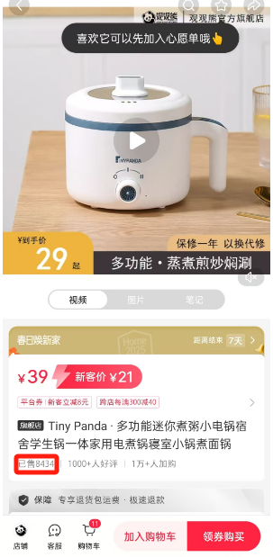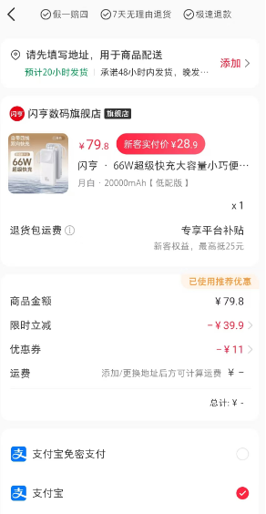

在「**小红书**」中，「**库存**」可能参与的有 「**商品列表**」、「**商品详情**」、「**结算页**」、「**支付**」等场景。在「**下单**」时会进行「**库存预扣减**」，当用户「**支付完成**」后会进行真正的「**库存扣减**」，当用户在规定时间内没支付，则把「**库存释放掉**」，让其他用户可以继续下单。

##   
**02 库存架构设计**

通过对「**库存场景**」的剖析，我梳理了如下「**库存服务**」的整个业务架构，以及要实现的相关功能，基本上包含了市面上各类电商平台「**库存服务**」的功能。

  
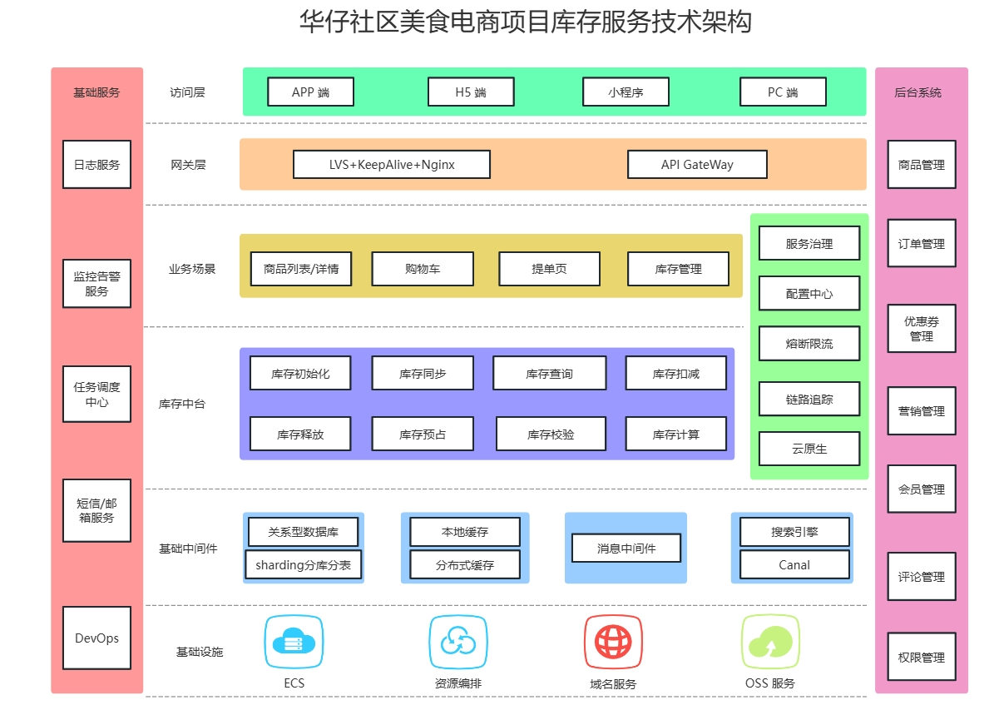

##   
**2.1 库存模块架构设计**

我们的目标是要设计一个能支撑「**高并发读写**」、「**缓存分桶**」的 「**库存服务**」，支持单库存分片不足扣减时的「**合并库存功能**」，库存入库时采用「**柔性同步方式**」写入缓存等功能实现。

在我们整个项目中，「**商品服务**」和 「**订单服务**」这两个系统会影响「**库存数据**」变更：

1.  首先商品服务会对商品库存进行「**初始化**」。
2.  接着订单系统会对商品库存进行「**购买时扣减**」和 「**退款时释放**」。

通常来说，「**库存数据**」都是要放到 Redis 的，后面进行高并发秒杀活动时往往会对「**库存数据**」进行「**高并发读写**」，所以「**库存数据**」是典型的「**读多写也多**」的高并发场景。

### **2.1.1 商品服务处理库存数据**

商品服务创建商品时会调用「**库存服务**」，这里会涉及 2 个表。

添加商品库存信息时，一般会涉及到3个表的数据：

1.  第⼀个表是保存库存数据，这块我们直接放到商品表中。
2.  第二个表是库存变更记录表，需要记录当次的库存变更记录。
3.  第三个表是库存变更明细表，需要记录当次的库存变更明细。

当「**库存初始化**」到「**库存缓存分桶**」的时候，需要采用「**柔性方式**」进行同步，这块下面再展开。比如，要将 1500 个商品分配到 5 个分桶中，则每个分桶中会分得 300 个商品库存，如下图所示：

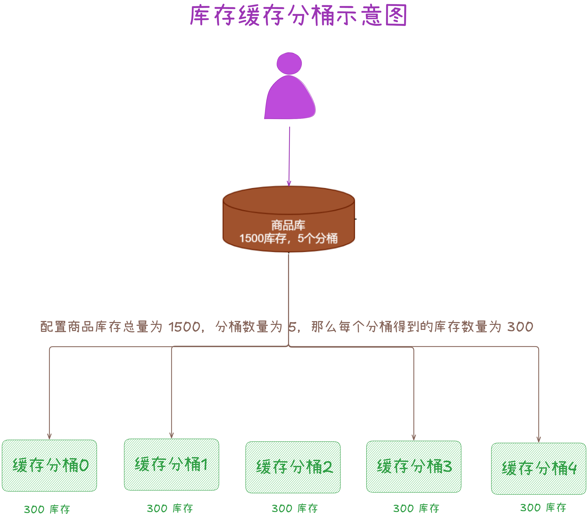

运营人员难免会调整热点商品的库存信息，比如原来的商品库存为1500，后来想调整成 1000 或者 2000，所以商品系统要支持运营人员动态的调整热门商品的库存。

以此对热门商品的库存进行实时调整，运营人员调整库存时，会涉及到三种情况，分别如下所示。

### **1、分桶数量不变**

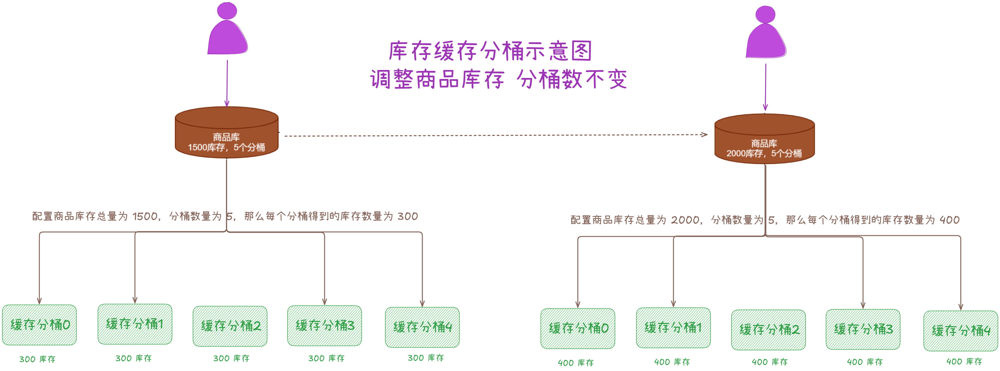

### **2、商品库存不变，调大/调小分桶数量**

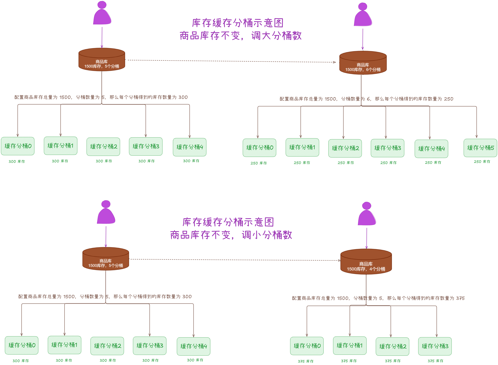

### **3、调整商品库存不变，调整分桶数量**

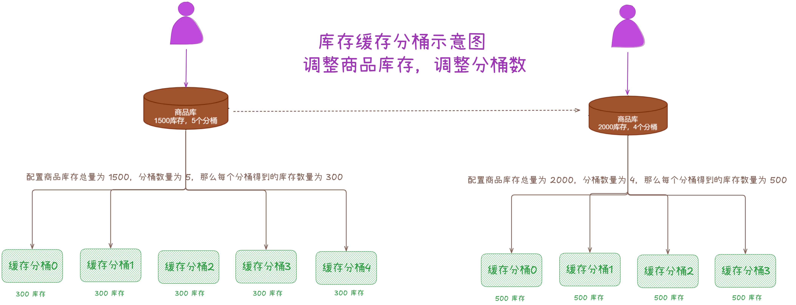

### **2.1.2 订单服务扣减/释放库存数据**

每个商品 SKU 都会维护⼀个 Redis 缓存 key，每次操作一个 SKU 库存时，这个 key 都会自增 +1。通过这个 key值对「**分桶机器数**」进行取模，就可以选择其中⼀台机器进行「**库存扣减**」了。

当被访问的「**分桶库存**」不能完成此次扣减，则继续「**下一个分桶**」继续尝试，直到「**所有分桶**」都不足以扣减此次库存以后则开始尝试「**合并库存扣减**」。

「**合并库存扣减**」首先会从「**每个分桶**」尝试扣减，默认扣减分桶的最大剩余库存。当「**分桶**」内的库存可购买数量小于用户需要购买数量时，就从 Lua 脚本中返还「**本次分桶**」的实际扣除数量，并记录起来。当全部扣除后还是失败或中途扣除过程发生异常时，就需要进行回滚了。

## **2.2 库存初始化及缓存分桶架构设计**

这里我们采用「**柔性方式**」进行「**库存缓存分桶**」初始化，需要考虑两个大的问题，下面一一展开。

###   
**2.2.1 库存缓存分桶方案要避免瞬时流量倾斜问题**

当库存数据写入单节点 Redis 缓存后，如果遇到秒杀活动，瞬时高并发去操作一个商品 SKU 的库存时，就会导致对 Redis 缓存集群里某个 Redis 节点造成过大压力，造成「**瞬时流量倾斜问题**」。

所以为了解决这个问题，往往采用「**缓存分桶**」。在上一节中我们已经通过图例说明过了，这里再说一下，假如商品 SKU 库存有 1500 个，这时可以把这 1500 个库存拆分为 5 个分桶。假如 Redis 集群有 5 个节点，此时分 5 个分桶，那么每个节点就有 1 个分桶。

通常情况下「**库存缓存分桶**」的数量设置成与 Redis 节点数量一样。这样出现库存的「**瞬时高并发**」操作时，就可以将「**库存扣减**」请求均匀负载到多个节点上，从而避免对单个节点写压力过高问题。

### **2.2.2 柔性同步方案要避免分桶节点库存不均匀问题**

在分配「**库存数据**」到「**缓存分桶**」时，采用「**柔性方式**」来进行分配。这里我们来说下为什么要采用「**柔性方式**」进行同步：

1.  如果是「**一次性**」同步，只需遍历一次节点，每个节点写 300 个库存。当遍历到某个节点却写入失败时，写入失败的库存数要重新遍历节点写入，这时候就会造成节点「**库存数据分配不均匀**」。
2.  如果是「**柔性方式**」同步，需要分多次遍历节点，就要做好某次遍历节点写入库存写入失败情况的准备了。比如每个节点写 300 个库存，那么就遍历节点5次，每次写 10 个库存，这样就可以尽量避免「**库存数据分配不均匀**」了。
3.  当同步过程中出现异常导致「**同步中断**」，此时就发送消息给 MQ 做补偿。在 MQ 补偿时会扣减掉「**已同步缓存**」的库存数量，只同步「**剩余库存数量**」。补偿消息要避免重复消费，默认收到就只处理⼀次，出现异常就再次进行补偿缓存。

下面通过一张图来展示下「**库存数据**」是如何入库及如何分配「**缓存分桶**」的：

  

## **2.3 库存扣减架构设计**

熟悉电商系统的都知道，「**库存扣减**」会在多个节点发生，比较典型的场景如下：

1.  下单时扣减库存。
2.  支付时扣减库存。

下面我们分别来看下这两个场景的优缺点。

### **2.3.1 下单时扣减库存方案**

当用户创建订单的时候就直接进行「**扣减库存**」，如下图所示：

  
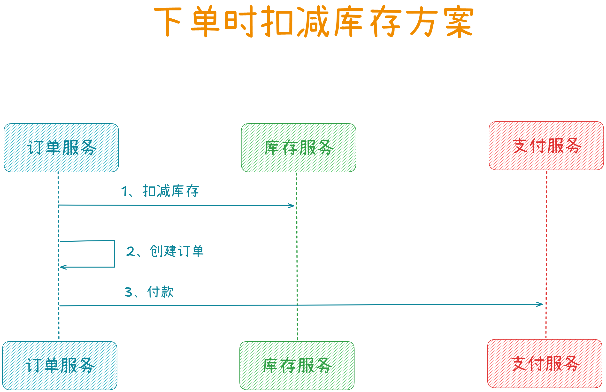

### **优点：**

1.  「**实时性较强**」： 在用户下单时库存就被扣减，确保了库存的及时更新。
2.  「**简单直接**」： 操作流程相对简单，便于实现和管理。
3.  「**避免超卖**」： 可以有效避免因多人同时并发下单而导致的超卖问题。

### **缺点：**

1.  「**取消订单库存释放问题**」： 如果用户取消订单或者超时未支付，需要额外处理库存释放的逻辑。
2.  「**支付失败影响问题**」： 如果用户不支付或者支付失败，可能需要额外处理库存释放，甚至可能会导致少卖。
3.  「**并发量高**」：下单时的并发量很大，在这个环节做库存扣减会存在明显的热点问题。

###   
**2.3.2 支付时扣减库存方案**

在用户创建订单的时候不进行「**扣减库存**」，当用户支付成功后再「**扣减库存**」，如下图所示：

  
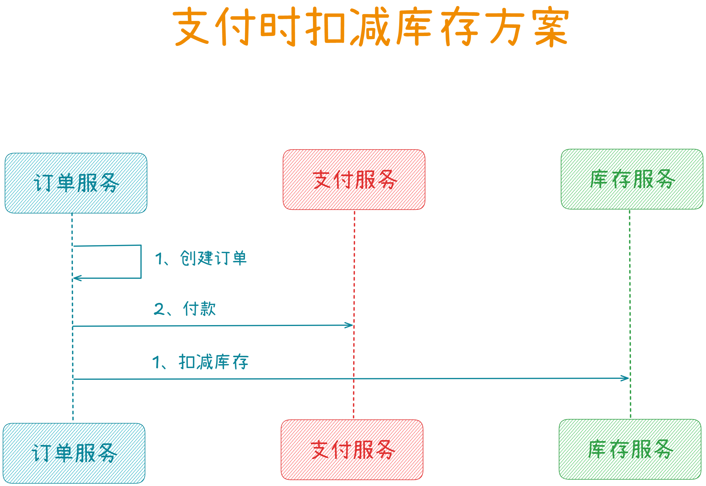

### **优点：**

1.  「**避免少卖问题**」： 只有在用户支付成功后才会真正扣减库存，确保了库存的准确性。
2.  「**避免取消订单问题**」： 用户取消订单或者超时未支付时，无需额外处理库存释放的操作。
3.  「**并发量相对较低**」：支付成功的并发量相对下单时要低很多，且是可以有异步重试的。

###   
**缺点：**

1.  「**超卖问题**」： 如果多人同时并发下单，支付成功后库存可能不足或者扣减失败，还可能会超卖影响体验。

### **2.3.3 最终扣减库存方案**

通过上面两个方案的对比，我们最终采用一种二者结合的方案，即下单「**预扣减库存**」，支付成功后「**真正扣减库存**」，如下图所示：

  
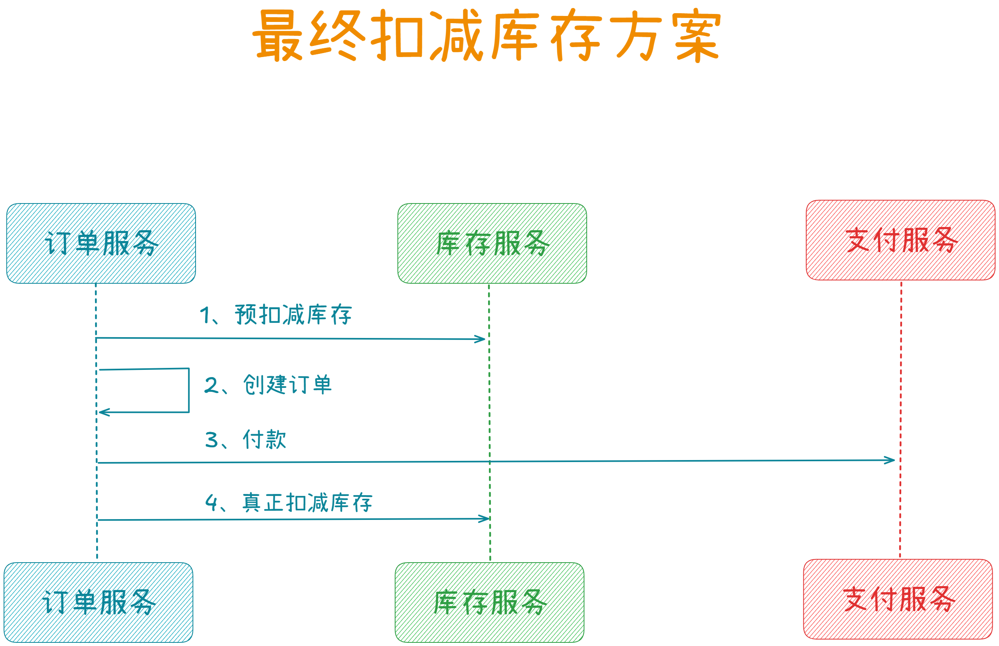

> 说明：此处的预扣减相当于给该用户锁定库存一小段时间，如果他在规定时间内没支付完成，则把库存释放掉，让其他用户可以继续下单。

综上，该方案能帮我们大大提升并发性能，对于电商系统来说，「**下单流量**」要比「**支付流量**」要大的多，二次「**真正扣减库存**」是在支付成功之后，这样并发量就低很多了。

### **2.3.4 基于缓存分桶的下单预扣减方案**

上面聊完了我们的「**扣减库存**」方案之后，我们来看下**基于缓存分桶的下单预扣减方案是如何设计和实现的**。

假设一个商品SKU有 10000 个库存，拆分为 5 个「**库存分桶**」，每个分桶 2000，这 5 个「**库存分桶**」会分散在多个 Redis 节点里。

那么当用户下单需要「**扣减库存**」时，需要考虑 3 个问题，分别来看下。

### **2.3.4.1 如何选择 Redis 节点**

这里有两种选择 Redis 节点的方案：

1.  通过「**随机方式**」选出一个 Redis 节点来进行「**扣减库存**」。
2.  通过「**轮询方式**」选出一个 Redis 节点来进行「**扣减库存**」。
3.  最终会通过「**轮询方式**」来选择 Redis 节点去进行「**扣减库存**」。

### **2.3.4.2 如何轮询选择 Redis 节点**

这里我们会通过下面步骤来轮询选择：  

1.  首先会在商品 SKU 中维护一个 Redis key，然后每次「**扣减库存**」时都对这个 Redis key 进行自增操作。
2.  接着根据 Redis key 自增值对「**库存分桶数量**」进行取模，通过取模确定一个「**库存分桶**」。
3.  然后再根据这个「**库存分桶**」，确定该分桶是在哪个 Redis 节点里的。

通过上面这样就可以将「**库存扣减**」请求发送到那个 Redis 节点里进行处理了。

### **2.3.4.3 如何处理库存分桶不足问题**

如果通过「**轮询方式**」的某个「**库存分桶**」没库存或者库存不够了，比如当前「**库存分桶**」还有 10 个库存，但这次用户请求需要扣减 30 个库存。

显然当前「**库存分桶**」不足以扣减，此时就可以尝试下一个「**库存分桶**」来进行扣减。如果下一个「**库存分桶**」也不足以扣减，那么继续寻找下一个「**库存分桶**」来进行扣减。

如果最后发现每个「**库存分桶**」都无法单独进行扣减，那就「**合并库存**」再进行扣减。「**合并库存**」进行扣减时，会对多个「**库存分桶**」里的库存逐一扣减。

最后通过一张图来展示下整个「**库存扣减**」过程的流程图，如下：

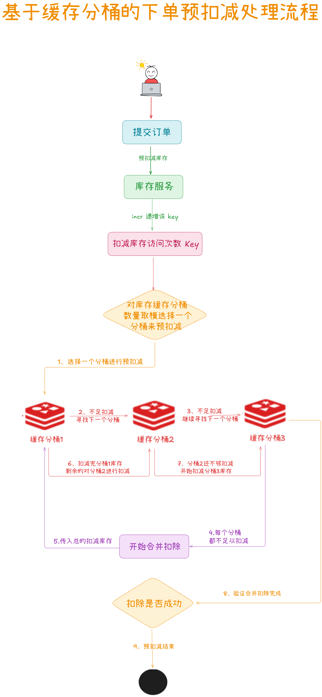

## **2.4 库存数据库设计**

最后，我们来聊下库存的数据库设计。

### **2.4.1 库存本身的设计**

这里就不单独设计库存的数据库了，直接在商品库中进行增加对应库存字段，我们通过 3 个字段来表示和库存有关的信息，分别是：

  
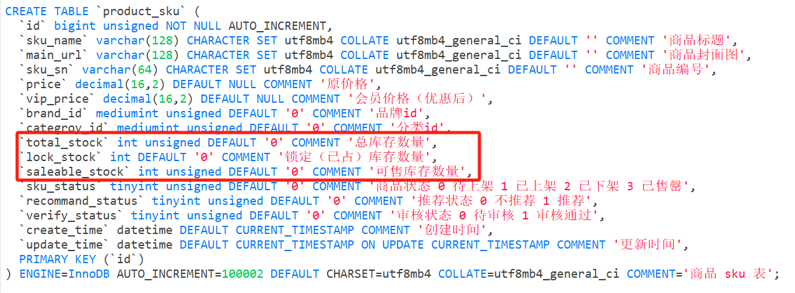

### **2.4.2 库存变更记录与明细表设计**

这两个表主要用于后续对账使用，比如在 Redis 中扣减成功了，但是在数据库中没扣减成功，需要进行对账。

CREATE TABLE \`product\_sku\_stock\` (

\`id\` bigint unsigned NOT NULL AUTO\_INCREMENT,

\`sku\_id\` bigint unsigned DEFAULT '0' COMMENT '商品 sku id',

\`total\_stock\` int unsigned DEFAULT '0' COMMENT '总库存数量',

\`lock\_stock\` int DEFAULT '0' COMMENT '锁定（已占）库存数量',

\`saleable\_stock\` int unsigned DEFAULT '0' COMMENT '可售库存数量',

\`identifier\` varchar(128) COLLATE utf8mb4\_general\_ci DEFAULT '' COMMENT '幂等号',

\`create\_time\` datetime DEFAULT CURRENT\_TIMESTAMP COMMENT '创建时间',

\`update\_time\` datetime DEFAULT CURRENT\_TIMESTAMP ON UPDATE CURRENT\_TIMESTAMP COMMENT '更新时间',

PRIMARY KEY (\`id\`),

UNIQUE KEY \`sku\_id\` (\`sku\_id\`)

) ENGINE\=InnoDB DEFAULT CHARSET\=utf8mb4 COLLATE=utf8mb4\_general\_ci COMMENT\='商品 sku 表库存变更记录表'; CREATE TABLE \`product\_sku\_stock\_detail\` (

\`id\` bigint unsigned NOT NULL AUTO\_INCREMENT,

\`sku\_stock\_id\` bigint unsigned DEFAULT '0' COMMENT '商品 sku 变更记录id',

\`stock\_change\_log\` text CHARACTER SET utf8mb4 COLLATE utf8mb4\_general\_ci COMMENT '库存变更明细 json 记录 change:变更数量 action:变更动作(increase/decrease) from:从多少库存数 to:变更到多少库存数 by:变更唯一键 time:变更时间',

\`create\_time\` datetime DEFAULT CURRENT\_TIMESTAMP COMMENT '创建时间',

\`update\_time\` datetime DEFAULT CURRENT\_TIMESTAMP ON UPDATE CURRENT\_TIMESTAMP COMMENT '更新时间',

PRIMARY KEY (\`id\`),

UNIQUE KEY \`sku\_stock\_id\` (\`sku\_stock\_id\`)

) ENGINE\=InnoDB DEFAULT CHARSET\=utf8mb4 COLLATE=utf8mb4\_general\_ci COMMENT\='商品 sku 表库存变更明细表';