大家好，我是**华仔**, 又跟大家见面了。

从今天之后的一段时间内，华仔会带着大家一起从零开始搭建并研发一套高并发的电商实战项目，这里会涉及到很多互联网大厂开发过程中所使用的核心技术和架构设计模式，希望大家学完之后可以用到自己的简历中。

这是第五篇，本篇我们进行电商实战项目用户微服务模块图形验证码开发。

文章汇总位置：[https://wx.zsxq.com/dweb2/index/columns/51122554151214](https://wx.zsxq.com/dweb2/index/columns/51122554151214)

源码授权与获取地址：[https://articles.zsxq.com/id\_1s85grnaae4p.html](https://articles.zsxq.com/id_1s85grnaae4p.html)

本章源码地址：[https://gitcode.net/u011359591/huazai-ecshop/-/tree/ecshop-chapter-7](https://gitcode.net/u011359591/huazai-ecshop/-/tree/ecshop-chapter-7)

## **01 前言**

终于要设计与研发电商项目代码了，今天我们要对用户微服务模块图形验证码进行开发。

这里需要注意下，我们整个项目目前是不提供前端的，这个后续有时间在搞，主要是进行后端接口以及微服务模块架构设计。

## **02 图形验证码**

这里我们介绍一款谷歌开源的一个可高度配置的实用验证码生成工具 [Kaptcha](http://kaptcha%20/) 框架。

1.  验证码的字体/大小/颜色。
2.  验证码内容的范围(数字，字母，中文汉字！)。
3.  验证码图片的大小，边框，边框粗细，边框颜色。
4.  验证码的干扰线。
5.  验证码的样式(鱼眼样式、3D、普通模糊)。

关于它的示例可以看这个：[https://blog.csdn.net/qq\_62982856/article/details/128796265](https://blog.csdn.net/qq_62982856/article/details/128796265)。

## **2.1 添加相关依赖**

先在最外层的聚合工程 pom 中，添加相关依赖。这里我们直接使用国内二次封装好的 [kaptcha-spring-boot-starter](http://kaptcha-spring-boot-starter/)。

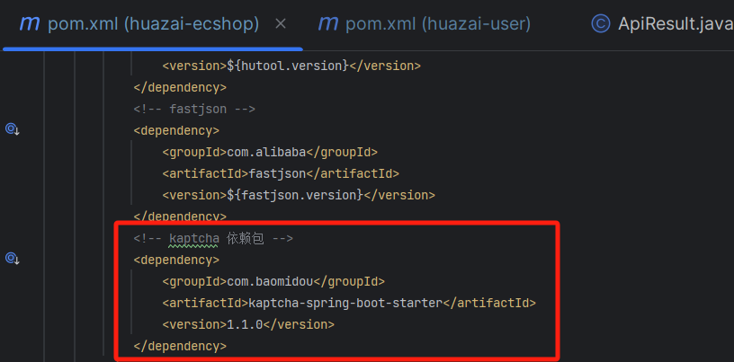

然后在用户微服务模块的 pom 文件添加，最后刷新 maven，如下：

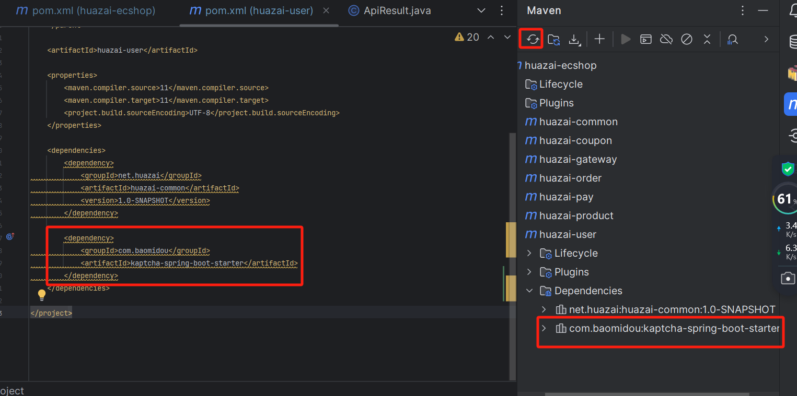

## **2.2 添加验证码配置**

在 user 微服务中添加对应配置：

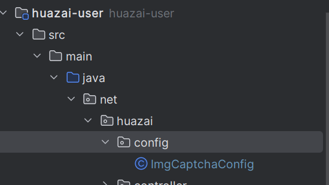

package net.huazai.config;

import com.google.code.kaptcha.Constants;

import com.google.code.kaptcha.impl.DefaultKaptcha;

import com.google.code.kaptcha.util.Config;

import org.springframework.beans.factory.annotation.Qualifier;

import org.springframework.context.annotation.Bean;

import org.springframework.context.annotation.Configuration;

import java.util.Properties;

/\*\*

\* @className: ImgCaptchaConfig

\* @author: huazai，该项目是知识星球：华仔和他的朋友们 的内部项目

\* @date: 2024-08-14 22:56

\* @Version: 1.0

\* @description: 图形验证码配置

\*/

@Configuration

public class ImgCaptchaConfig {

/\*\*

\* 谷歌提供的图片验证码 kaptcha

\* @return

\*/

@Bean

@Qualifier("imgCaptchaProducer")

public DefaultKaptcha imgKaptcha() {

DefaultKaptcha kaptcha \= new DefaultKaptcha();

Properties properties \= new Properties();

/\*

设置图片有边框并且为蓝色

properties.setProperty("kaptcha.border", "no");

properties.setProperty("kaptcha.border.color", "blue");

\*/

// 验证码个数

properties.setProperty(Constants.KAPTCHA\_TEXTPRODUCER\_CHAR\_LENGTH, "5");

// 字体间隔

properties.setProperty(Constants.KAPTCHA\_TEXTPRODUCER\_CHAR\_SPACE, "8");

// 背景颜色渐变开始，这里设置的是 rgb 值 156,156,156

properties.put(Constants.KAPTCHA\_BACKGROUND\_CLR\_FROM, "156,156,156");

// 背景颜色渐变结束，这里设置以白色结束

properties.put(Constants.KAPTCHA\_BACKGROUND\_CLR\_TO, "white");

// 字体颜色，这里设置为黑色

properties.put(Constants.KAPTCHA\_TEXTPRODUCER\_FONT\_COLOR, "black");

// 文字间隔，这里设置为10px

properties.put(Constants.KAPTCHA\_TEXTPRODUCER\_CHAR\_SPACE, "10");

// 干扰实现类

properties.setProperty(Constants.KAPTCHA\_NOISE\_IMPL, "com.google.code.kaptcha.impl.NoNoise");

// 图片样式

properties.setProperty(Constants.KAPTCHA\_OBSCURIFICATOR\_IMPL, "com.google.code.kaptcha.impl.WaterRipple");

// 文字来源

properties.setProperty(Constants.KAPTCHA\_TEXTPRODUCER\_CHAR\_STRING, "abcdefghigklmiopqrstuvwxyz0123456789");

// 设置配置

Config config \= new Config(properties);

kaptcha.setConfig(config);

return kaptcha;

}

}

## **2.3 添加验证码控制器**

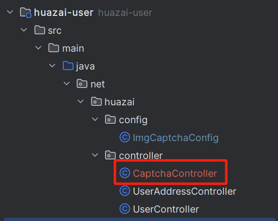

package net.huazai.controller;

import com.google.code.kaptcha.Producer;

import io.swagger.annotations.Api;

import io.swagger.annotations.ApiOperation;

import lombok.extern.slf4j.Slf4j;

import org.springframework.beans.factory.annotation.Autowired;

import org.springframework.web.bind.annotation.RequestMapping;

import org.springframework.web.bind.annotation.RestController;

import javax.imageio.ImageIO;

import javax.servlet.ServletOutputStream;

import javax.servlet.http.HttpServletRequest;

import javax.servlet.http.HttpServletResponse;

import java.awt.image.BufferedImage;

import java.io.IOException;

/\*\*

\* @className: CaptchaController

\* @author: huazai，该项目是知识星球：华仔和他的朋友们 的内部项目

\* @date: 2024-08-14 23:28

\* @Version: 1.0

\* @description: 验证码控制器，这里先这样 后续可能会进行改造

\*/

@Api(tags = "验证码模块")

@RestController

@RequestMapping("/api/captcha/v1")

@Slf4j

public class CaptchaController {

// 图形验证码配置类

@Autowired

private Producer imgCaptchaProducer;

/\*\*

\* 获取图形验证码

\* @param request

\* @param response

\*/

@ApiOperation("获取图形验证码")

@RequestMapping("getImgCaptcha")

public void getImgCaptcha(HttpServletRequest request, HttpServletResponse response){

// 1、先生成图形验证码文本

String captchaText \= imgCaptchaProducer.createText();

log.info("验证码模块-获取图形验证码文本:{}", captchaText);

// 2、根据验证码文本生成图形验证码图片

BufferedImage bufferedImage \= imgCaptchaProducer.createImage(captchaText);

ServletOutputStream outputStream \= null;

try {

outputStream = response.getOutputStream();

ImageIO.write(bufferedImage, "jpg", outputStream);

outputStream.flush();

outputStream.close();

} catch (IOException e) {

log.error("验证码模块-获取图形验证码异常:{}", e);

}

}

}

## **2.4 启动并验证**

启动服务后，可以看到对应日志以及效果：

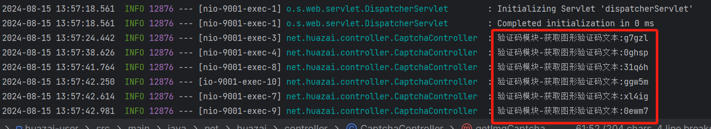

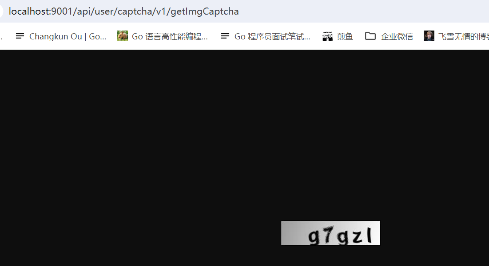

最后我们将接口放到 postman 保存一下。

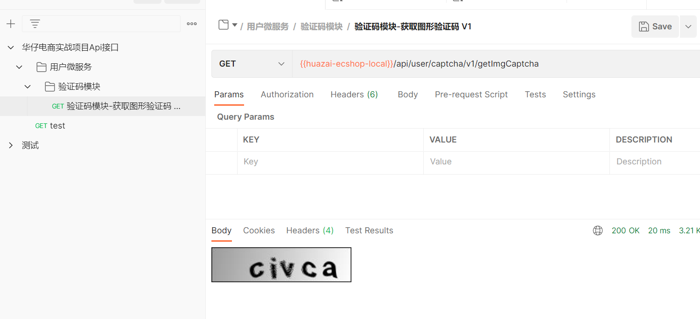

至此一个简单的图形验证码就开发完成了，但是这样还有问题，验证码并没有存储起来，那么如何进行验证呢？

## **03 接入 Redis 缓存**

关于 Redis 的安装这里就不介绍了，可以点击查看：[https://blog.csdn.net/qq\_41941900/article/details/138712993](https://blog.csdn.net/qq_41941900/article/details/138712993)。 redis 官网改的都不认识了，找了半天才找到对应的下载位置，找不到的可以查看这个文档。

## **3.1 Redis 连接池**

使用连接池的好处与缺点如下：

1.  以空间换时间，使用连接池可以避免每次都执行三次握手、每次都关闭 Jedis。
2.  相对于直连来说使用相对比较麻烦，在资源管理上需要很多参数来保证，规划不合理也会出现问题。
3.  如果 pool 已经分配了 [maxActive](http://maxactive%20/) 个 jedis 实例，则此时 pool 的状态就成 [exhausted](http://exhausted%20/) 了。

## **3.2 Redis 集群隔离与 key 设计规范**

### **3.2.1 Redis 集群隔离**

首先，在生产环境下一定要对 Redis 集群进行 「**隔离**」，可以按照 「**核心集群**」（如登录、下单、支付等）、 「**非核心集群**」 来隔离，也可以按照 「**高并发集群**」、 「**非高并发集群**」来隔离。

那么隔离集群的好处：

1.  资源进行隔离，互不干涉。
2.  数据进行保护，互不影响。
3.  提高性能。

### **3.2.2 Redis key 设计规范**

这里我们要求：按照 「**业务模块**」进行划分，中间用 「**冒号**」进行隔离。

比如用户微服务下的验证码：[huazai-user:captcha:xxxx](http://about:blank)，但有个要求：不能太长了。

## **3.3 添加 Redis 连接池依赖**

在 common 项目中添加相关依赖：

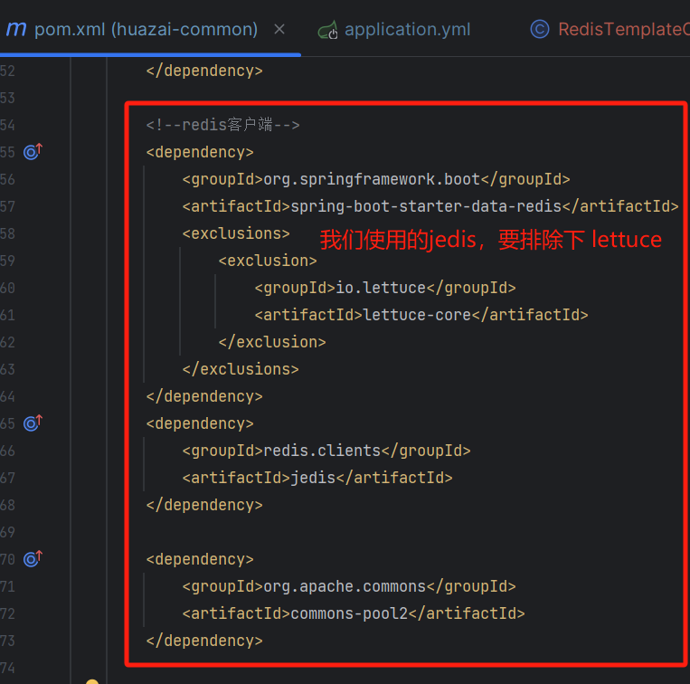

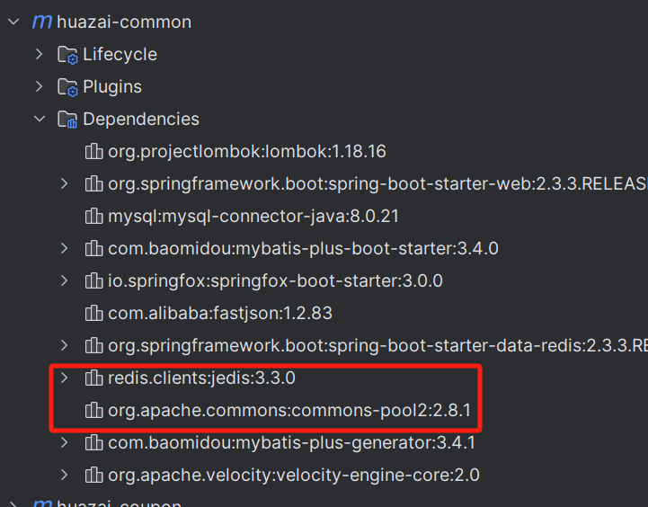

## **3.4 配置 Redis 连接池 yml**

redis:

client-type: jedis

host: 127.0.0.1

password: 123456

port: 6379

jedis:

pool:

\# 连接池最大连接数(使用负值表示没有限制)

max-active: 100

\# 连接池中的最大空闲连接

max-idle: 100

#连接池中的最小空闲连接

min-idle: 100

\# 连接池最大阻塞等待时间(使用负值表示没有限制)

max-wait: 60000

检查格式是否正确，按住 Ctrl 是否有如下弹层：

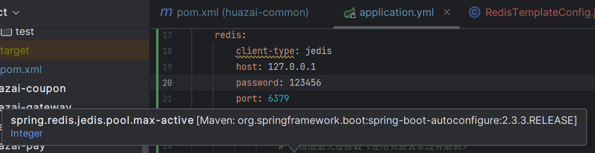

看是否可以启动成功：

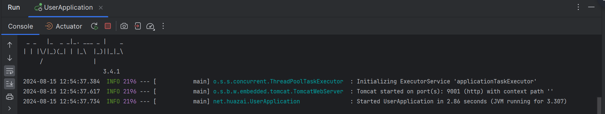

## **3.5 配置 Redis 序列化**

接着在 user 项目中创建 [config/RedisTemplateConfig.java](http://config/RedisTemplateConfig.java)，我们这里使用 [Jackson2JsonRedisSerializer](http://jackson2jsonredisserializer%20/) 来序列化 value，如下：

package net.huazai.config;

import com.fasterxml.jackson.annotation.JsonAutoDetect;

import com.fasterxml.jackson.annotation.PropertyAccessor;

import com.fasterxml.jackson.databind.ObjectMapper;

import org.springframework.context.annotation.Bean;

import org.springframework.context.annotation.Configuration;

import org.springframework.data.redis.connection.RedisConnectionFactory;

import org.springframework.data.redis.core.RedisTemplate;

import org.springframework.data.redis.serializer.Jackson2JsonRedisSerializer;

import org.springframework.data.redis.serializer.StringRedisSerializer;

/\*\*

\* @className: RedisTemplateConfig

\* @author: huazai，该项目是知识星球：华仔和他的朋友们 的内部项目

\* @date: 2024-08-15 9:20

\* @Version: 1.0

\* @description: redis 模板配置

\*/

@Configuration

public class RedisTemplateConfig {

@Bean

public RedisTemplate<Object, Object> redisTemplate(RedisConnectionFactory redisConnectionFactory){

// 实例化 RedisTemplate

RedisTemplate<Object, Object> redisTemplate = new RedisTemplate<>();

// 设置连接

redisTemplate.setConnectionFactory(redisConnectionFactory);

// 配置 Redis 序列化规则

Jackson2JsonRedisSerializer jackson2JsonRedisSerializer \= new Jackson2JsonRedisSerializer(Object.class);

ObjectMapper objectMapper \= new ObjectMapper();

objectMapper.setVisibility(PropertyAccessor.ALL, JsonAutoDetect.Visibility.ANY);

jackson2JsonRedisSerializer.setObjectMapper(objectMapper);

// 设置 key-value 序列化规则

redisTemplate.setKeySerializer(new StringRedisSerializer());

redisTemplate.setValueSerializer(jackson2JsonRedisSerializer);

// 设置 hash-value 序列化规则

redisTemplate.setHashKeySerializer(new StringRedisSerializer());

redisTemplate.setHashValueSerializer(jackson2JsonRedisSerializer);

return redisTemplate;

}

}

## **3.6 完善验证码控制器**

这里我们来完善下 **2.3 节** 中的代码，如下：

package net.huazai.controller;

import com.google.code.kaptcha.Producer;

import io.swagger.annotations.Api;

import io.swagger.annotations.ApiOperation;

import lombok.extern.slf4j.Slf4j;

import net.huazai.utils.CommonUtil;

import org.springframework.beans.factory.annotation.Autowired;

import org.springframework.data.redis.core.StringRedisTemplate;

import org.springframework.web.bind.annotation.RequestMapping;

import org.springframework.web.bind.annotation.RestController;

import javax.imageio.ImageIO;

import javax.servlet.ServletOutputStream;

import javax.servlet.http.HttpServletRequest;

import javax.servlet.http.HttpServletResponse;

import java.awt.image.BufferedImage;

import java.io.IOException;

import java.util.concurrent.TimeUnit;

/\*\*

\* @className: CaptchaController

\* @author: huazai，该项目是知识星球：华仔和他的朋友们 的内部项目

\* @date: 2024-08-14 23:28

\* @Version: 1.0

\* @description: 验证码控制器，这里先这样 后续可能会进行改造

\*/

@Api(tags = "验证码模块")

@RestController

@RequestMapping("/api/user/captcha/v1")

@Slf4j

public class CaptchaController {

// 图形验证码配置类

@Autowired

private Producer imgCaptchaProducer;

// 定义验证码过期时间，10 分钟有效期

private static final long CAPTCHA\_EXPIRED \= 1000 \* 10 \* 60;

// 定义验证码 Redis key 前缀

private static final String CAPTCHA\_REDIS\_KEY\_PREFIX \= "huazai-user:captcha:";

// 目前验证码为 key-value 形式，直接使用 StringRedisTemplate 即可

@Autowired

private StringRedisTemplate redisTemplate;

/\*\*

\* 获取图形验证码

\* @param request

\* @param response

\*/

@ApiOperation("获取图形验证码")

@RequestMapping("getImgCaptcha")

public void getImgCaptcha(HttpServletRequest request, HttpServletResponse response){

// 1、先生成图形验证码文本

String captchaText \= imgCaptchaProducer.createText();

log.info("验证码模块-获取图形验证码文本:{}", captchaText);

// 2、存储 Redis，配置过期时间

redisTemplate.opsForValue().set(

getCaptchaKey(request), // 验证码 key

captchaText, // 验证码内容

CAPTCHA\_EXPIRED, // 验证码过期时间

TimeUnit.MILLISECONDS); // 时间单位毫秒

// 3、根据验证码文本生成图形验证码图片

BufferedImage bufferedImage \= imgCaptchaProducer.createImage(captchaText);

/\*\*

\* 这里改下写法

\* 实现了 AutoCloseable 接⼝的类，在 try() ⾥声明该类实例的时候，在 try 结束后⾃动调⽤的 close ⽅法，这个动作会早于

\* finally ⾥调⽤的⽅法，不管是否出现异常，try() ⾥的实例都会被调⽤ close ⽅法

\* 在 try ⾥⾯可以声明多个⾃动关闭的对象，越早声明的对象，会越晚被 close 掉

\*/

try (ServletOutputStream outputStream \= response.getOutputStream()){

ImageIO.write(bufferedImage, "jpg", outputStream);

outputStream.flush();

} catch (IOException e) {

log.error("验证码模块-获取图形验证码异常:{}", e);

}

}

/\*\*

\* 这里需要对用户进行唯一识别，方式就是获取用户的 IP + 浏览器的 User-Agent 属性

\* @param request

\* @return

\*/

private String getCaptchaKey(HttpServletRequest request){

// 获取客户端用户的 IP 地址

String ip \= CommonUtil.getRemoteIpAddr(request);

// 获取请求头中的 User-Agent 属性值

String userAgent \= request.getHeader("User-Agent");

// 根据 ip + userAgent 生成对应的 key

String keyGen \= CAPTCHA\_REDIS\_KEY\_PREFIX + CommonUtil.MD5(ip + userAgent);

log.info("验证码模块-验证码 key:{}", keyGen);

return keyGen;

}

}

改动点如下：

1.  增加 Redis 缓存，使用 jedis 连接池进行连接 Redis。
2.  另外这里需要对用户进行唯一识别否则无法对验证码进行验证，方式就是获取用户的 IP + 浏览器的 User-Agent 属性，通过 MD5 加密。
3.  改写了文件输出流的写法。

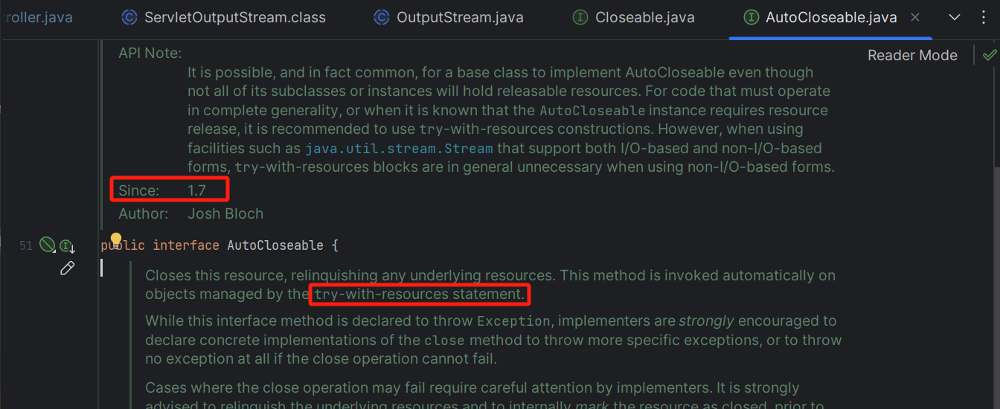

## **3.7 启动服务并验证**

启动服务后，可以看到对应日志以及效果：

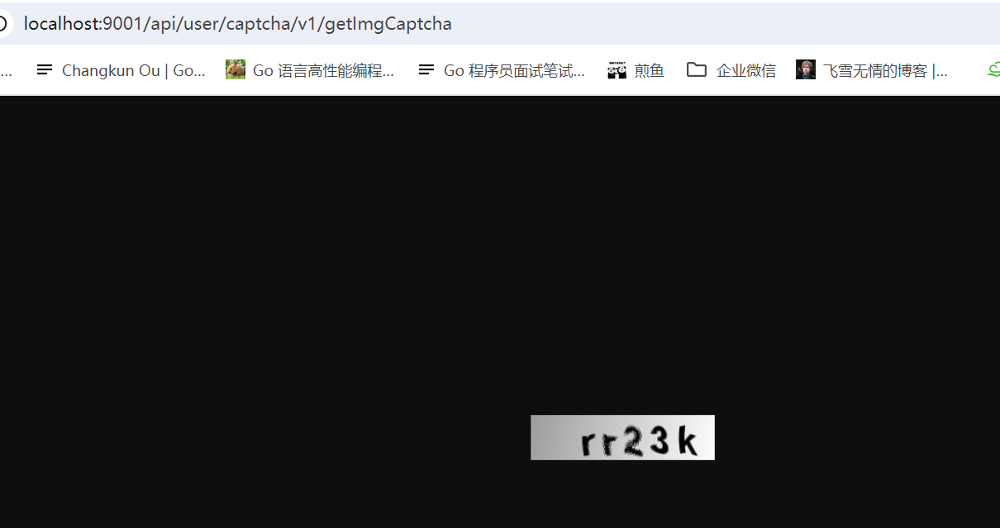

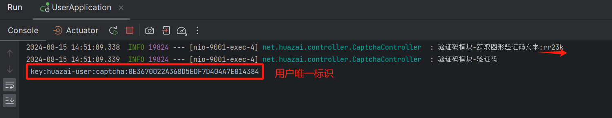

这里我们的 Redis 客户端工具是使用的官网的 Redis Insight，下载地址： [https://redis.io/insight/#insight-form](https://redis.io/insight/#insight-form)。

> 这是一款免费的官方免费的客户端，功能非常全面，支持监控分析，rdb 的分析，可查询的图表，时间序列，全文本查询，批量操作，命令补全提示，文档解释，以及 stream 数据类型。
> 
> RedisInsight 允许您在功能齐全的桌面 GUI 客户端中进行基于 GUI 和 CLI 的交互。

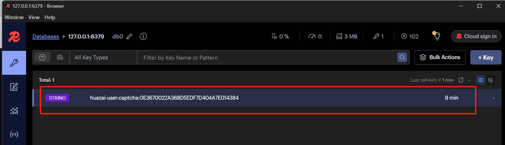

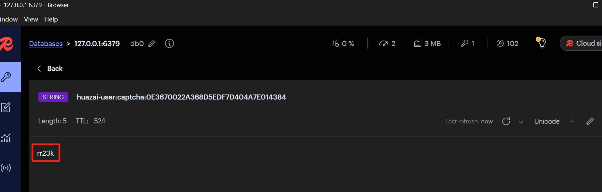

至此我们的图形验证码就暂时开发到这里。