从今天之后的一段时间内，华仔会带着大家一起从零开始搭建并研发一套高并发的电商实战项目，这里会涉及到很多互联网大厂开发过程中所使用的核心技术和架构设计模式，希望大家学完之后可以用到自己的简历中。

接下来我们会重点架构设计和开发一下「**社交系统**」中的重要服务：「**关注服务**」、「**计数服务**」、「**评论服务**」。

这是第三十一篇，本篇我们继续进行电商实战项目设计与开发，本篇对「**评论服务**」中评论列表基于时间排序与热度排序架构设计与实现。

文章汇总位置：[https://wx.zsxq.com/dweb2/index/columns/51122554151214](https://wx.zsxq.com/dweb2/index/columns/51122554151214)

源码授权与获取地址：[https://articles.zsxq.com/id\_1s85grnaae4p.html](https://articles.zsxq.com/id_1s85grnaae4p.html)

本章源码地址：[https://gitcode.net/u011359591/huazai-ecshop/-/tree/ecshop-chapter-31](https://gitcode.net/u011359591/huazai-ecshop/-/tree/ecshop-chapter-31)

## **01 前言**

终于要设计与研发电商项目代码了，今天我们主要对「**评论服务**」中评论列表场景介绍与架构设计。

这里需要注意下，我们整个项目目前是不提供前端的，这个后续有时间在搞，主要是进行后端接口以及微服务模块架构设计。

## **02 评论列表架构设计**

[【电商实战项目第二十九篇】华仔电商实战项目评论服务基于RocketMQ顺序消息+Redis Zset架构设计与功能实现](https://articles.zsxq.com/id_8gdm2cxz8r80.html) 在这篇中，我们深度剖析了整个评论服务的架构设计实现。

今天我们就来看下「**评论列表**」的架构设计与实现，对于业界亿级流量的社交/电商产品来说，「**评论列表**」是个非常关键且重要的场景，而且支持「**时间排序**」和「**热度排序**」两种排序方式。

接下来，我们就来深度剖析下这两种场景的架构设计与功能实现。

##   
**2.1 按时间排序的评论列表**

按「**时间排序**」简单的话可以基于数据库实现，这里分两种情况：「**按时间由远及近排序**」和 「**按时间由近及远排序**」，先来看下。

当用户点击打开美食作品 1 的评论区时，需要按照评论发布时间「**由远及近**」和 「**由近及远**」展示 N 条一级评论，SQL 如下：

\# 由远及近

select id, food\_id, comment\_user\_id, level, reply\_count, like\_count, comment\_createtime from food\_comment where comment\_root\_id \= 1 and level \= 1 order by comment\_createtime limit 0, N

\# 由近及远

select id, food\_id, comment\_user\_id, level, reply\_count, like\_count, comment\_createtime from food\_comment where comment\_root\_id \= 1 and level \= 1 order by comment\_createtime desc limit 0, N

一级评论不仅要展示评论 ID，用户 ID，评论发布时间，而且要展示其二级评论区的长度和点赞数。当用户继续向上滑动获取下一页的评论列表时，其实就是换一下 limit 参数即可。

当用户点击一级评论 2 的二级评论区时，需要按照二级评论发布时间「**由远及近**」和 「**由近及远**」展示 N 条二级评论，SQL 如下：

\# 由远及近

select id, food\_id, comment\_user\_id, level, reply\_count, like\_count, comment\_createtime from food\_comment where comment\_root\_id \= 1 and level \= 1 order by comment\_createtime limit 0, N

\# 由近及远

select id, food\_id, comment\_user\_id, level, reply\_count, like\_count, comment\_createtime from food\_comment where comment\_root\_id \= 1 and level \= 1 order by comment\_createtime desc limit 0, N

这里为了 SQL 的高效执行，我们将之前的的联合索引改为如下：

ALTER TABLE \`huazai\_food\`.\`food\_comment\`

DROP INDEX \`idx\_comment\_list\`,

ADD INDEX \`idx\_comment\_list\`(\`comment\_root\_id\`, \`level\`, \`comment\_createtime\`) USING BTREE;

explain 执行效果如下：

## 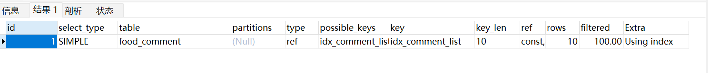

上面是基于数据库的排序方案，但是对于亿级流量的互联网应用来说，避免不了存在「**高并发**」问题，所以我们需要构建基于「**本地缓存**」、「**分布式缓存**」、「**数据库**」这样的三层架构。

这里的读评论主要指拉取「**热门内容**」的评论列表，对于绝大部分用户来说，其拉取的评论列表主要是位于评论区前几页的那些评论数据，所以我们需要为评论列表中的「**前 N 条**」评论数据进行「**构建 Redis 缓存**」。

不过需要注意的是：在前面讨论过，评论列表有两种方式：「**按时间由远及近排序**」和 「**按时间由近及远排序**」。

1.  如果评论列表是「**按时间由远及近排序**」的，那么「**前 N 条**」评论数据是「**相对固定**」的，缓存极少需要更新的。
2.  如果评论列表是「**按时间由近及远排序**」的，那么「**前 N 条**」评论数据「**随时都可能发生动态变化**」，且内容越热门，「**前 N 条**」评论数据变化的越快。对于这种情况来说，可以将 Redis 作为数据库的伪从库，即每当将一条评论插入数据库时，即将此评论插入 Redis Zset 对象中。

这里我们考虑到「**高并发**」读取评论列表对 Redis 造成的请求压力，可以进一步构建「**本地缓存**」，评论服务将从 Redis ZSET 对象中获取到的评论列表缓存到「**本地缓存**」中，并设置过期时间 5s。

对于「**按时间由近及远排序**」的评论列表来说，「**本地缓存**」导致用户拉取到最多 5s 前的评论，而非最新的「**前 N 条**」评论。好在用户并非在意一定要看到最新的评论，只要评论数据相对比较新即可。所以我们可以使用「**本地缓存**」进一步应对高并发读取评论列表的请求，只是不要将「**本地缓存**」的过期时间设置得很大就好。

在 [【电商实战项目第二十九篇】华仔电商实战项目评论服务基于RocketMQ顺序消息+Redis Zset架构设计与功能实现](https://articles.zsxq.com/id_8gdm2cxz8r80.html) 这篇中，我们讨论了缓存设计，如下：

综上：

1.  对于访问「**时间排序**」评论列表，缓存可以基于 Redis ZSET 对象来存储每条内容「**前 N 条**」评论的发布时间最近的「**一级评论 ID**」，其中 Key 为 [food\_comment:{food\_id}:0](http://food_comment_cache:%7Bfood_id%7D:0)，Member 为评论 ID，Score 为评论发布时间。
2.  对于希望批量获取评论内容，缓存选择使用 String 对象来存储每条评论内容信息，每条评论的元信息都被以 JSON 形式存储到 Value 中，并将 [food\_comment\_content\_{food\_id}\_{comment\_id}](http://food_comment_content__{food_id}_{comment_id}/) 作为 Key，然后执行 [MGET](http://mget%20/) 命令就可以批量获取评论内容信息。
3.  另外，在 Redis 集群中执行 [MGET](http://mget/) 命令获取的 Key 只在访问一个「**Redis 分片**」时性能最佳，所以需要为前缀 [food\_comment\_content\_{food\_id}](http://food_comment_content__{food_id}_{comment_id}/) 打上 [hashtag](http://hashtag/) 标签，这样 Redis 集群就可以保证同一条美食作品下的评论被存储到同一个 Redis 分片中。

最终基于缓存的架构图如下：

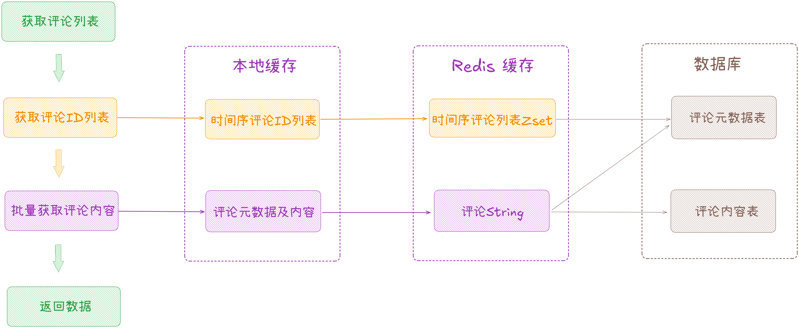

流程如下：

1.  当用户访问某页的 10 条评论时，评论服务先获取评论 ID 列表。
2.  先访问时间序评论列表的本地缓存，如果命中「**本地缓存**」，则从「**本地缓存**」获取时间序评论 ID 列表。
3.  如果未命中「**本地缓存**」，则从 「**Redis 缓存**」中获取时间序评论 ID 列表。
4.  如果未命中「**Redis 缓存**」，则从 「**数据库**」中获取时间序评论 ID 列表。
5.  完成第一步流程后，如果评论服务获取到若干评论 ID 列表后，开始批量获取评论元信息及内容。
6.  同第一步类似，先从「**本地缓存**」批量获取评论元信息及内容。
7.  如果未命中「**本地缓存**」则从「**Redis 缓存**」中批量获取评论元信息及内容。
8.  如果未命中「**Redis 缓存**」，则从 「**数据库**」中批量获取评论元信息及内容。
9.  最后将时间序评论 ID 列表和评论元信息及内容写入「**本地缓存**」和 「**Redis 缓存**」。

## **2.2 按热度排序的评论列表**

上面剖析完基于评论发布时间的评论列表排序后，我们再来深度讨论下非常流行的按照「**热度排序规则**」的架构设计。

对于很多互联网应用来说都会选择在评论区优先展示一些「**热度较高**」的一级评论。把他们优先展示出来可以使评论区变得更有吸引力，从而增加用户粘性。

既然是按照「**热度排序**」那么就需要先度量一条评论有多热门。不同应用规则不同标准，大部分的标准如下：

1.  按照点赞数：评论被点赞的次数越多，评论就越热门。
2.  按照回复数：评论被回复的次数越多，评论就越热门，即其二级评论列表的长度越长，评论就越热门。
3.  按照点赞数和回复数加权：点赞数和回复数一起来反映一条评论的互动性，热度可以是两者做比重加权，比如：点赞数 \* 0.4 + 回复数 \* 0.6 作为热度值，比例可自行调整。

这里有些规则需要说明下：

1.  按照热度排序，并不意味着一个评论区中的所有评论都按照此规则。当我们打开评论区时，比如：首先展示的是热度排名前 500 的评论，在评论区中刷完这 500 条评论后，后面的都是按照评论发布时间「**由近及远**」排序。
2.  如果一条评论没有任何点赞和回复，即热度值为 0，则不属于热门评论因此不参与热度排名。
3.  在刷完热门评论后，按照评论发布时间排序的评论列表中依然可能会包含「**热门评论**」，即用户会刷到重复的评论。

经过剖析，我们会通过 Redis 来维护热门评论，并使用 Zset 数据类型来存储一个作品评论区中按照「**热度排序**」的评论 ID 列表集合，如下图：

  

其中 key 为 [food\_comment:{food\_id}:1](http://%20food_comment:%7Bfood_id%7D:1) ，Member 为评论 ID，Score 为评论的热度值，流程如下：

1.  首先，构建实时的「**热门评论 ID 列表**」。以「**点赞数**」与「**回复数**」的「**加权度量方式**」为例，由于一级评论在收到「**点赞**」、「**回复**」时，此评论的热度也会发生相应的变化，所以需要「**监听评论**」的「**点赞事件**」与「**回复事件**」。
2.  当「**点赞事件**」与「**回复事件**」发生后，根据此评论的最新「**点赞数**」与「**回复数**」重新计算「**热度值**」并写人 Zset 集合中，以达到评论热度排名实时更新的目的。如果一条评论被删除了，那么在「**热门评论列表**」中应该同时删除此评论，所以也需要「**监听评论被删除**」的事件。
3.  创建消费者服务 [foodHotCommentEventTriggerListener](http://foodhotcommenteventtriggerlistener/)，通过 MQ 监听评论的「**点赞事件**」、「**回复事件**」、「**删除事件**」，负责热门评论的实时构建工作。假设在作品 1 的评论区中一级评论 2 的当前点赞数是 10，回复数是 8 ，其热度值= [10 x 0.4 + 8 x 0.6 = 8.8](http://10%20x%200.4%20+%208%20x%200.6%20=%208.8)。
4.  那么此评论依次收到「**点赞**」、「**回复**」以及「**删除**」时，消费者服务 [foodHotCommentEventTriggerListener](http://foodhotcommenteventtriggerlistener/) 需要做:
5.  1）、评论 2 收到一个点赞，即当前点赞数变为 11。
6.  2）、消费者服务收到评论 2 的点赞事件，从评论元信息的 [food\_comment](http://food_comment/) 数据表中获取其最新的「**点赞数**」与「**回复数**」得到 11 和 8。
7.  3）、消费者服务重新计算评论 2 的热度值为 11 x 0.4 + 8 x 0.6 = 9.2。
8.  4）、消费者服务对作品 1 的「**热门评论列表**」更新评论 2 的热度，向 Redis ZSET 数据类型中发起请求 [ZADD food\_comment:1:1 9.2 2](http://ZADD%20food_comment:1:1%209.2%202)。
9.  5）、当评论 2 又被回复一次，即当前回复数变为 9。
10.  6）、消费者服务收到评论 2 的「**回复事件**」，接着从 [food\_comment](http://food_comment/) 数据表中得到它的最新点赞数为 11，回复数为 9。
11.  7）、消费者服务重新计算评论 2 的热度值为 [11 x 0.4 + 9 x 0.6 = 9.8](http://11%20x%200.4%20+%209%20x%200.6%20=%209.8)。
12.  8）、消费者服务接着对作品 1 的「**热门评论列表**」更新评论 2 的热度，向 Redis ZSET 数据类型中发起请求 [ZADD food\_comment:1:1 9.8 2](http://ZADD%20food_comment:1:1%209.8%202)。
13.  9）、当评论 2 被删除，消费者服务收到此事件后从 Redis ZSET 数据类型中删除此评论 [ZREM food\_comment:1:1](http://ZREM%20food_comment:1:1%202) [2](http://ZREM%20food_comment:1:1%202)。
14.  其次，在前面也说过，在按照「**热度排序**」的评论区中，并不是全部评论都是此规则，而是先展示最多 500 条按照「**热度排序**」的评论，再展示按照「**评论发布时间由远及近排序**」的评论。当用户的一次刷评论请求只读取某一页的评论、比如 10 条评论，假设目前在作品 1 的评论区中有 15 条「**热门评论**」，那么第 1 页的评论全部来自「**热度排序评论列表**」，第 2 页的评论来自「**热度排序评论列表**」和「**时间排序评论列表**」组合，第 3 页到最后一页的评论全部来自「**时间排序评论列表**」。

整个消费者处理流程图如下：

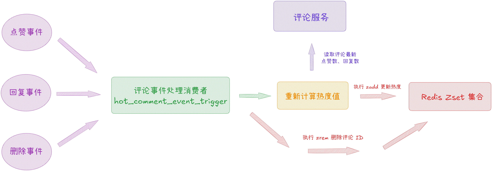

当用户分页读取评论列表时，评论服务需要区分出是从「**热度排序评论列表**」中获取数据还是从「**时间排序评论列表**」中获取数据，或是组合获取。参数：「**作品 ID**」、「**当前已读评论数的偏移量 offset**」，我们来具体分析一下读取前 3 页评论列表的流程：

1.  首先打开评论区读取第 1 页的评论，此时请求「**热度排序评论列表**」，希望读取 10 条评论。作品 1 有 15 条热门评论，热度排名前 10 的评论被返回。
2.  当用户读取第 2 页的评论，仍然希望读取 10 条评论。但是作品 1 只剩 5 条热门评论，此时还需要从「**时间排序评论列表**」中拉取前 5 条评论组合起来返回给用户，并返回评论来源。
3.  当用户读取第 3 页的评论，由于上一页已经开始展示「**时间排序评论列表**」中的评论了，所以此时需要拉取「**时间排序评论列表**」中的第 6~15 条评论返回给用户，这里需要将已读评论数的偏移量进行重置计算。

因此，在读取评论列表时，除了返回评论数据外，还要返回最后一条评论的来源。接下来我们来看下前端是如何处理的。首先客户端也需要引入来源参数：from\_where，值有两个：hot 「**热度排序评论列表**」/ time 「**时间排序评论列表**」，这里我们来具体分析一下前端读取前 3 页评论列表的流程，基本同上：

1.  首先前端发起读取评论区第 1 页的评论，请求参数为：[{"food\_id":1,"offset":0,"from\_where":"hot"}](http://%7B%22food_id%22:1,%22offset%22:0,%22from_where%22:%22hot%22%7D)，评论服务收到请求后，会按照 from\_where 参数值访问 Redis Zset 数据类型中获取前 10 条热门评论：[ZREVRANGE food\_comment:1:1 0 9](http://ZREVRANGE%20food_comment:1:1%200%209)，返回 10 条评论的评论 ID、from\_where 为 hot， offset 为 10。
2.  接着前端发起读取评论区第 2 页的评论，请求参数为：[{"food\_id":1,"offset":10,"from\_where":"hot"}](http://%7B%22food_id%22:1,%22offset%22:10,%22from_where%22:%22hot%22%7D)，评论服务收到请求后，会按照 from\_where 参数值访问 Redis Zset 数据类型中获取 11 ~ 20 条热门评论：[ZREVRANGE food\_comment:1:1 10 19](http://ZREVRANGE%20food_comment:1:1%2010%2019)，由于此时热门评论一共只有 15 条，所以此次只获取到 5 条热门评论，此时评论服务会从「**时间排序评论列表**」中获取前 5 条评论，最后组合返回 10 条评论的评论 ID、from\_where 为 time， offset 为 5。
3.  再接着前端发起读取评论区第 3 页的评论，请求参数为：[{"food\_id":1,"offset":4,"from\_where":"time"}](http://%7B%22food_id%22:1,%22offset%22:4,%22from_where%22:%22time%22%7D)，评论服务收到请求后，会按照 from\_where 参数值访问 「**时间排序评论列表**」获取 5 ~ 16 条热门评论，最后返回 10 条评论的评论 ID、from\_where 为 time， offset 为 15。

以此类推，就可以完成整个评论列表的读取，并可以无缝衔接从「**热度排序评论列表**」切换到「**时间排序评论列表**」。

最后，我们需要控制下「**热门评论**」的总数，在一个作品的评论区中，热门的评论总数可能会超过 500 条，我们没必要都存储到 Redis Zset 集合中，只需要截取热度排名前 500 条评论就好。这样，一方面可以节约 Redis 的内存空间，另一方面可以保证 Redis Zset 数据类型不会成为大 Key。

我们可以通过脚本周期性地执行截取即可，流程如下：

1.  执行 [ZCARD food\_comment:{food\_id}:1](http://ZCARD%20food_comment:%7Bfood_id%7D:1) 命令，得到 ZSET 数据类型的长度 N。
2.  如果大于500，则执行 [ZREMRANGEBYRANK food\_comment:{food\_id}:1 0 N-500-1](http://ZREMRANGEBYRANK%20food_comment:%7Bfood_id%7D:1%200%20N-500-1) 命令删除前 N - 500 个成员，ZSET 按照 Score 值从小到大排列，集合地前 N - 500 个成员之后的成员才是热度 Top 500，因此删除前 N-500 个成员。

  
最终基于缓存的架构图如下：

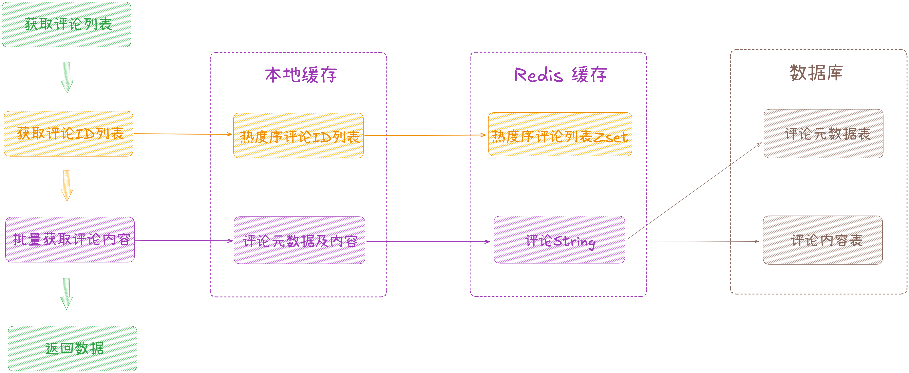

至此，整个基于「**时间排序评论列表**」、「**热度排序评论列表**」的架构设计就剖析到这里，接下来我们来具体代码实现下其功能。  

##   
**03 评论列表基于时间及热度排序实现**

## **3.1 基于时间排序**

先来看下如何写入缓存。

### **3.1.1 基于时间排序写入缓存**

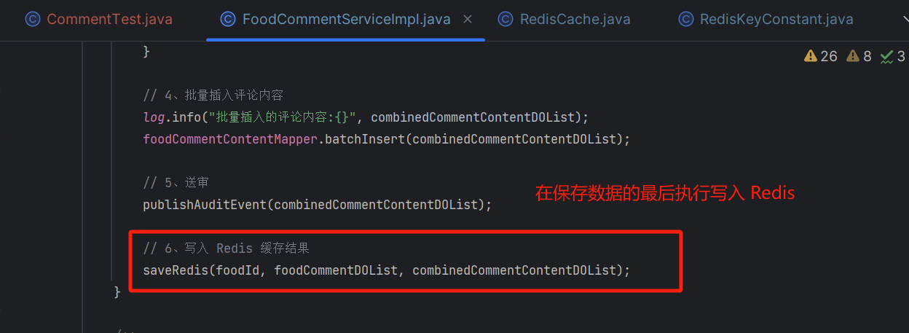

/\*\*

\* 写入 redis 缓存结果

\* 这里只处理按时间由远及近排序 Redis Zset

\* @param foodId

\* @param foodCommentDOList

\* @param combinedCommentContentDOList

\*/

private void saveRedis(Long foodId, List<FoodCommentDO> foodCommentDOList, List<FoodCommentContentDO> combinedCommentContentDOList) {

// 1、写入 Redis Zset 评论 ID 列表集合

// TODO 这里可以根据情况改成批量写入，也可以写成 lua 脚本， 另外需要脚本来定期截取 保证集合元素保持在 500 条左右，自行实现

String cacheZsetKey \= String.format(RedisKeyConstant.FOOD\_COMMENT\_ORDERLY\_PREFIX, foodId, 0);

for (FoodCommentDO foodCommentDO : foodCommentDOList) {

redisCache.zadd(cacheZsetKey, foodCommentDO.getId().toString(), foodCommentDO.getCommentCreatetime().getTime());

// 1 天有效期 这里会随机生成

redisCache.expire(cacheZsetKey, RedisCache.generateOneDayCacheExpire());

}

// 2、写入 Redis String 评论元数据及详情

String cacheHashTag \= RedisKeyConstant.FOOD\_COMMENT\_PREFIX + "\_" + foodId;

for (int i \= 0; i < foodCommentDOList.size(); i++) {

FoodCommentEntity foodCommentEntity \= new FoodCommentEntity();

foodCommentEntity.setFoodId(foodId);

// 获取评论元数据对象

FoodCommentDO foodCommentDO \= foodCommentDOList.get(i);

foodCommentEntity.setCommentId(foodCommentDO.getId());

foodCommentEntity.setLevel(foodCommentDO.getLevel());

foodCommentEntity.setCommentRootId(foodCommentDO.getCommentRootId());

foodCommentEntity.setCommentUserId(foodCommentDO.getCommentUserId());

foodCommentEntity.setReplyCommentId(foodCommentDO.getReplyCommentId());

foodCommentEntity.setReplyUserId(foodCommentDO.getReplyUserId());

// 根据索引获取对应的评论内容对象

FoodCommentContentDO foodCommentContentDO \= combinedCommentContentDOList.get(i);

foodCommentEntity.setCommentContext(foodCommentContentDO.getCommentContext());

// 设置 hashtag

String cacheKey \= "{" + cacheHashTag + "}" + "\_" + foodCommentDO.getId();

// 2 天有效期 这里会随机生成

redisCache.setCache(cacheKey, foodCommentEntity, RedisCache.generateCacheExpire());

}

}

这里元数据及详情使用 Redis HashTag，这样 Redis 集群就可以保证同一条美食作品下的评论被存储到同一个 Redis 分片中。

测试写入与读取：

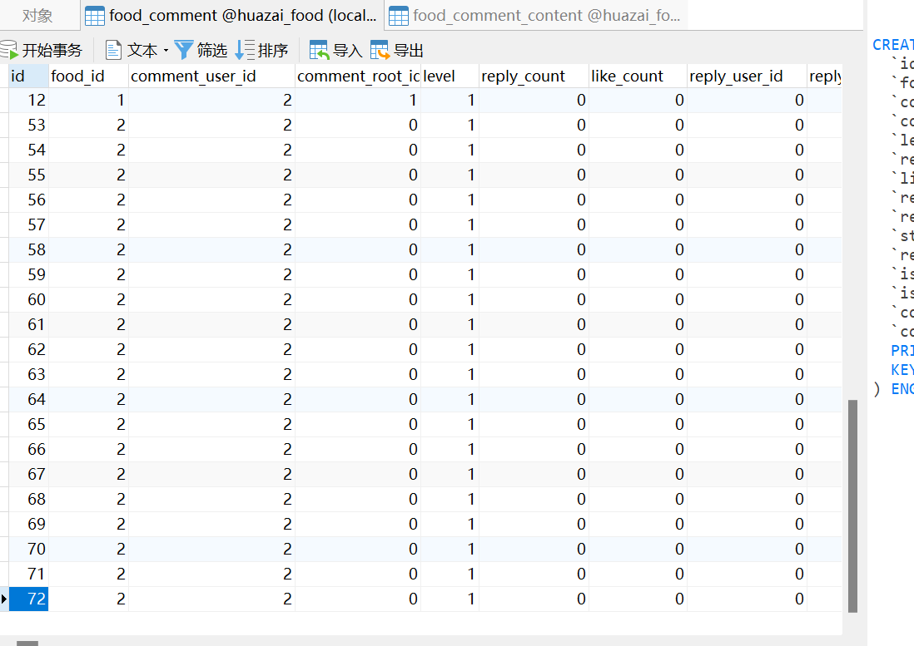

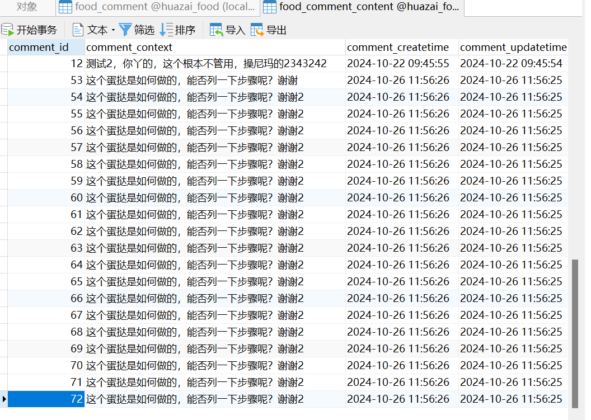

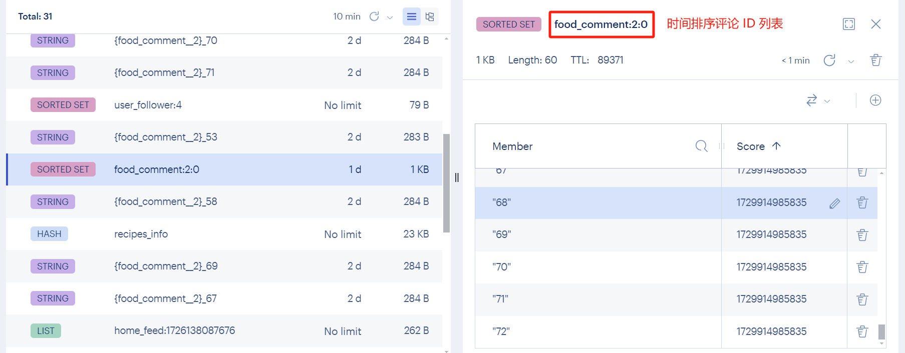

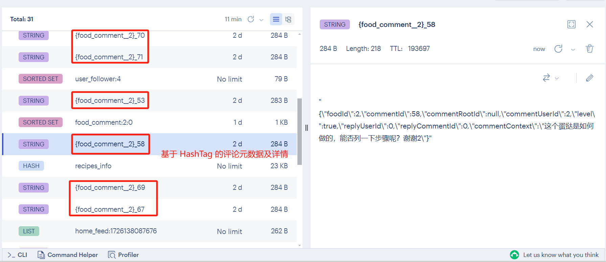

最后测试读取结果如下：

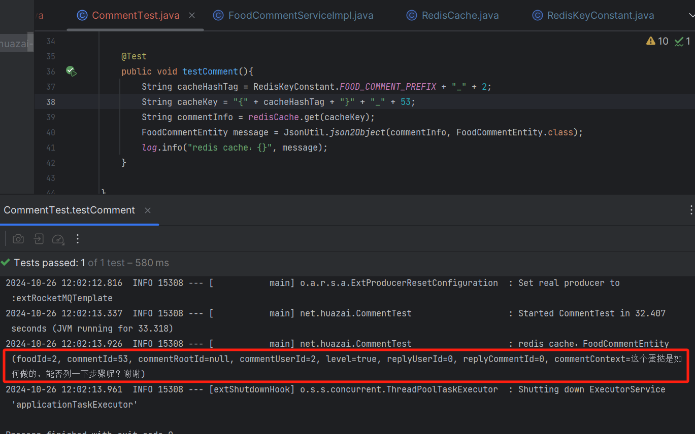

### **3.1.2 基于时间排序列表读取**

/\*\*

\* 时间序评论列表

\* @param foodCommentRequestEntity

\* @return

\*/

@Override

public Map<String, Object> getTimeCommentListByPage(FoodCommentRequestEntity foodCommentRequestEntity) {

// 获取用户信息

// TODO 后续使用 Redis 分布式缓存替代

LoginUser loginUser \= LoginInterceptor.threadLocal.get();

log.info("美食模块-获取时间序评论列表，page:{}，size:{}，uid:{}", foodCommentRequestEntity.getPage(), foodCommentRequestEntity.getPageSize(), loginUser.getId());

// 先从缓存分页读取

Map<String, Object> pageCache = getTimeCommentListFromCache(foodCommentRequestEntity, loginUser);

if (pageCache != null) {

return pageCache;

}

// 缓存没命中的话 从数据库查询

return getTimeCommentListFromDB(foodCommentRequestEntity, loginUser);

}

/\*\*

\* 从缓存中分页获取时间序评论列表

\* 这里为了测试就不用本地缓存了 感兴趣的可以自行实现

\* @param foodCommentRequestEntity

\* @param loginUser

\* @return

\*/

private Map<String, Object> getTimeCommentListFromCache(FoodCommentRequestEntity foodCommentRequestEntity, LoginUser loginUser) {

// 1、先从 Redis Zset 集合中获取时间序评论 ID 列表

String cacheZsetKey \= String.format(RedisKeyConstant.FOOD\_COMMENT\_ORDERLY\_PREFIX, foodCommentRequestEntity.getFoodId(), 0);

Set range \= redisCache.reverseRange(cacheZsetKey, foodCommentRequestEntity.getPage().longValue(), foodCommentRequestEntity.getPageSize().longValue());

Long size \= redisCache.zcard(cacheZsetKey);

// 判断缓存是否为空

if (range != null && !"".equals(range)) {

List<String> zsetList = new ArrayList<>(range);// 将有序集合转换为有序列表

Collections.reverse(zsetList); // 反转有序列表

log.info("从 Redis Zset 集合中获取时间序评论 ID 列表:{}", zsetList);

// 2、批量从 Redis String 获取详情

String cacheHashTag \= RedisKeyConstant.FOOD\_COMMENT\_PREFIX + "\_" + foodCommentRequestEntity.getFoodId();

List<String> keyList = new ArrayList<>();

for (String commentId : zsetList) {

String cacheKey \= "{" + cacheHashTag + "}" + "\_" + commentId;

keyList.add(cacheKey);

}

List list \= redisCache.mget(keyList);

log.info("从 Redis Zset 集合中获取时间序评论 ID 列表:{}，详情:{}", zsetList, list);

List<FoodCommentVO> foodCommentVOList = JsonUtil.StringtoList(list.toString(), FoodCommentVO.class);

// 处理分页返回数据

Map<String,Object> pageMap = new HashMap<>(5);

// 总条数

pageMap.put("total", size);

int totalPages \= (int) Math.ceil((double) size / foodCommentRequestEntity.getPageSize());// 计算总页数

// 总分页数

pageMap.put("pages", totalPages);

// 当前页

pageMap.put("curr\_page", foodCommentRequestEntity.getPage());

// 每页条数

pageMap.put("curr\_page\_size", foodCommentRequestEntity.getPageSize());

// 列表信息

pageMap.put("list", foodCommentVOList);

return pageMap;

}

return null;

}

/\*\*

\* 从数据库中分页时间序评论列表

\* @param foodCommentRequestEntity

\* @param loginUser

\* @return

\*/

private Map<String, Object> getTimeCommentListFromDB(FoodCommentRequestEntity foodCommentRequestEntity, LoginUser loginUser) {

// 分页信息

Page<FoodCommentDO> pageInfo = new Page<>(foodCommentRequestEntity.getPage(), foodCommentRequestEntity.getPageSize());

IPage<FoodCommentDO> foodCommentDOPage = null;

// 查询我的未删除美食列表

foodCommentDOPage = foodCommentMapper.selectPage(pageInfo, new QueryWrapper<FoodCommentDO>()

.eq("comment\_root\_id", foodCommentRequestEntity.getCommentRootId())

.eq("level", foodCommentRequestEntity.getLevel())

.eq("status", 1));

List<FoodCommentDO> foodCommentDOList = foodCommentDOPage.getRecords();

log.info("美食模块-从数据库获取时间序美食评论列表，page:{}，total:{}，size：{}", foodCommentDOPage.getPages(), foodCommentDOPage.getTotal(), foodCommentDOPage.getSize());

// 批量获取评论详情

List<Long> idList = foodCommentDOList.stream()

.map(FoodCommentDO::getId) // 将FoodCommentDO对象映射为id

.collect(Collectors.toList());// 将映射后的id收集到列表中

List<FoodCommentContentDO> foodCommentContentDOList = foodCommentContentMapper.selectBatchByCommentIds(idList);

log.info("美食模块-从数据库获取时间序美食评论详情，idList:{}, list:{}", idList, foodCommentContentDOList);

// 对象流式转换处理美食列表结果信息

List<FoodCommentVO> foodCommentVOList = foodCommentDOList.stream().map(obj -> {

FoodCommentVO foodCommentVO \= new FoodCommentVO();

if (obj.getFoodId() != null) {

// 设置美食 ID

foodCommentVO.setFoodId(obj.getFoodId());

}

if (obj.getId() != null) {

// 设置美食评论 ID

foodCommentVO.setCommentId(obj.getId());

}

if (obj.getCommentRootId() != null) {

// 设置根评论 ID

foodCommentVO.setCommentRootId(obj.getCommentRootId());

}

if (obj.getCommentUserId() != null) {

// 设置评论发布者 uid

foodCommentVO.setCommentUserId(obj.getCommentUserId());

}

if (obj.getLevel() != null) {

// 设置美食评论等级

foodCommentVO.setLevel(obj.getLevel());

}

if (obj.getReplyCommentId() != null) {

// 设置回复美食评论 ID

foodCommentVO.setReplyCommentId(obj.getReplyCommentId());

}

if (obj.getReplyUserId() != null) {

// 设置回复美食评论uid

foodCommentVO.setReplyUserId(obj.getReplyUserId());

}

// 在这里获取该评论的对应信息

Optional<FoodCommentContentDO> contentDO = foodCommentContentDOList.stream()

.filter(content -> Objects.equals(content.getCommentId(), obj.getId()))

.findFirst();

// 将 content 设置到 foodCommentVO

contentDO.ifPresent(content -> foodCommentVO.setCommentContext(content.getCommentContext()));

BeanUtils.copyProperties(obj, foodCommentVO);

return foodCommentVO;

}).collect(Collectors.toList());

// 写入 Redis 缓存结果

saveRedis(foodCommentRequestEntity.getFoodId(), foodCommentDOList, foodCommentContentDOList);

Map<String, Object> pageMap = new HashMap<>(5);

// 总条数

pageMap.put("total", foodCommentDOPage.getTotal());

// 总分页数

pageMap.put("pages", foodCommentDOPage.getPages());

// 当前页

pageMap.put("curr\_page", foodCommentRequestEntity.getPage());

// 每页条数

pageMap.put("curr\_page\_size", foodCommentRequestEntity.getPageSize());

// 列表信息

pageMap.put("list", foodCommentVOList);

return pageMap;

}

这里没有加本地缓存，感兴趣自行实现即可，执行效果如下：

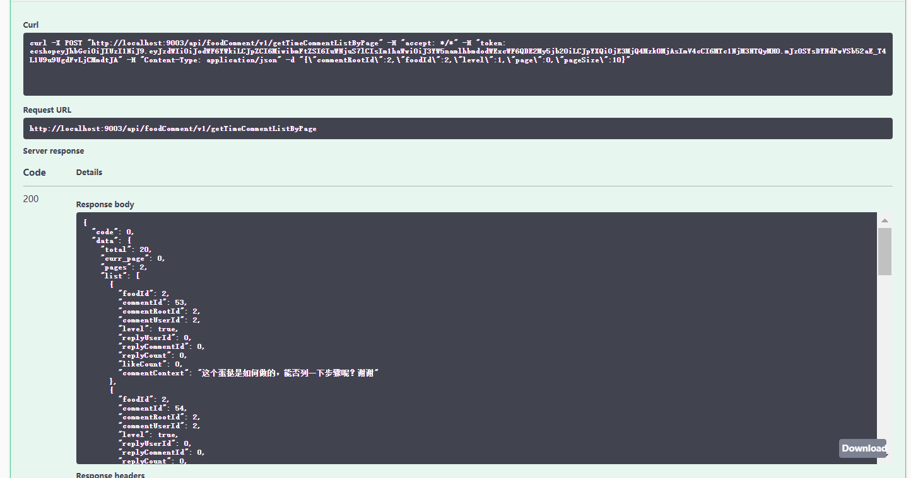

## **3.2 基于热度排序**

### **3.2.1 热度值计算**

这里先建一个顺序 topic，用来专门处理评论「**点赞**」、「**回复**」、「**删除**」事件。

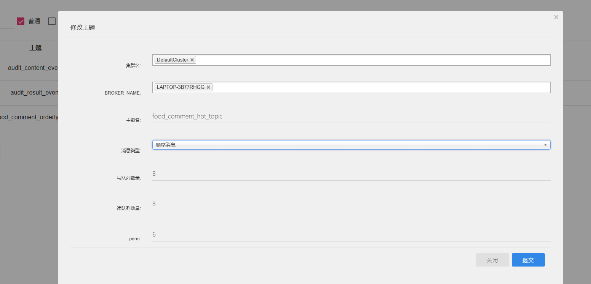

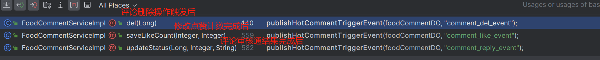

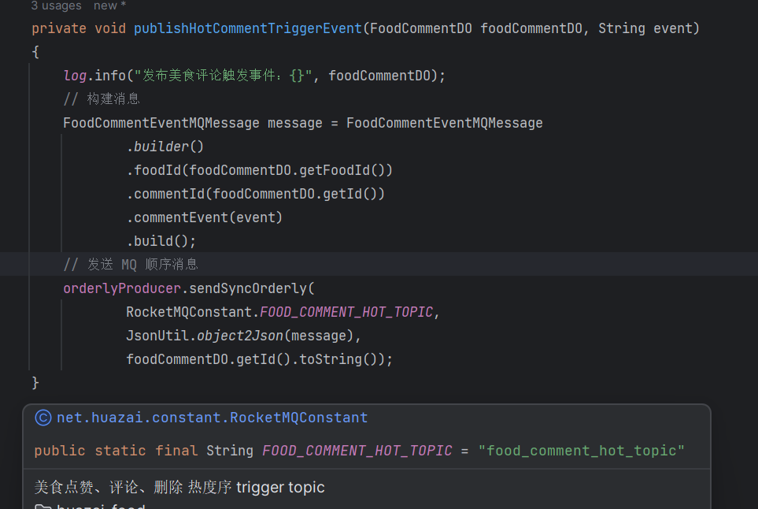

消费者处理逻辑如下：

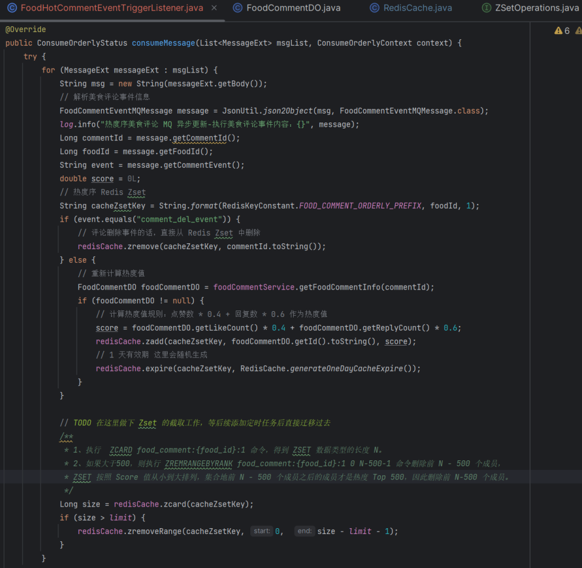

相对也比较简单，主要是看「**事件处理时机**」，我这里都是在「**事件完成后**」统一处理。

###   
**3.2.2 基于热度排序列表读取**

/\*\*

\* 热度序评论列表

\* @param foodHotCommentRequestEntity

\* @return

\*/

@Override

public Map<String, Object> getHotCommentListByPage(FoodHotCommentRequestEntity foodHotCommentRequestEntity) {

// 获取用户信息

// TODO 后续使用 Redis 分布式缓存替代

LoginUser loginUser \= LoginInterceptor.threadLocal.get();

log.info("美食模块-获取热度序评论列表，page:{}，size:{}，uid:{}", foodHotCommentRequestEntity.getOffset(), foodHotCommentRequestEntity.getSize(), loginUser.getId());

// 先从缓存分页读取

Map<String, Object> pageCache = getHotCommentListFromCache(foodHotCommentRequestEntity, loginUser);

if (pageCache != null) {

Object total \= pageCache.get("total");

log.info("美食模块-获取热度序评论列表，total:{}", total);

if (total instanceof Long) {

Long totalValue \= (Long) total;

// 现在您可以安全地使用 totalValue 作为 Long 类型的值

// 如果值是 Integer 类型，也可以尝试转换为 Long

log.info("美食模块-获取热度序评论列表，total\_size:{}", totalValue);

if (totalValue < 10) {

// TODO 如果不够需要从时间序中补齐

// 先从缓存分页读取

Map<String, Object> pageCacheTime = getHotCommentListFromTimeCache(foodHotCommentRequestEntity, loginUser);

if (pageCacheTime != null) {

pageCache.putAll(pageCacheTime);

return pageCache;

}

// 缓存没命中的话 从数据库查询

Map<String, Object> pageCacheTimeDB = getHotCommentListFromTimeDB(foodHotCommentRequestEntity, loginUser);

pageCache.putAll(pageCacheTimeDB);

return pageCache;

}

}

}

return null;

}

/\*\*

\* 从缓存中分页获取时间序评论列表

\* 这里为了测试就不用本地缓存了 感兴趣的可以自行实现

\* @param foodHotCommentRequestEntity

\* @param loginUser

\* @return

\*/

private Map<String, Object> getHotCommentListFromCache(FoodHotCommentRequestEntity foodHotCommentRequestEntity, LoginUser loginUser) {

// 1、先从 Redis Zset 集合中获取时间序评论 ID 列表

String cacheZsetKey \= String.format(RedisKeyConstant.FOOD\_COMMENT\_ORDERLY\_PREFIX, foodHotCommentRequestEntity.getFoodId(), 1);

Set range \= redisCache.reverseRange(cacheZsetKey, foodHotCommentRequestEntity.getOffset().longValue(), foodHotCommentRequestEntity.getSize().longValue());

Long size \= redisCache.zcard(cacheZsetKey);

// 判断缓存是否为空

if (range != null && !"".equals(range)) {

List<String> zsetList = new ArrayList<>(range);// 将有序集合转换为有序列表

Collections.reverse(zsetList); // 反转有序列表

log.info("从 Redis Zset 集合中获取时间序评论 ID 列表:{}", zsetList);

// 2、批量从 Redis String 获取详情

String cacheHashTag \= RedisKeyConstant.FOOD\_COMMENT\_PREFIX + "\_" + foodHotCommentRequestEntity.getFoodId();

List<String> keyList = new ArrayList<>();

for (String commentId : zsetList) {

String cacheKey \= "{" + cacheHashTag + "}" + "\_" + commentId;

keyList.add(cacheKey);

}

List list \= redisCache.mget(keyList);

log.info("从 Redis Zset 集合中获取热度序评论 ID 列表:{}，详情:{}", zsetList, list);

List<FoodCommentVO> foodCommentVOList = JsonUtil.StringtoList(list.toString(), FoodCommentVO.class);

// 处理分页返回数据

Map<String,Object> pageMap = new HashMap<>(7);

// 总条数

pageMap.put("total", size);

int totalPages \= (int) Math.ceil((double) size / foodHotCommentRequestEntity.getSize());// 计算总页数

// 总分页数

pageMap.put("pages", totalPages);

// 当前页

pageMap.put("curr\_page", foodHotCommentRequestEntity.getOffset());

// 每页条数

pageMap.put("curr\_page\_size", foodHotCommentRequestEntity.getSize());

// 列表信息

pageMap.put("list", foodCommentVOList);

pageMap.put("from\_where", "hot");

if (size < 10) {

pageMap.put("offset", foodHotCommentRequestEntity.getOffset() + size);

} else {

pageMap.put("offset", foodHotCommentRequestEntity.getOffset() + 10);

}

return pageMap;

}

return null;

}

/\*\*

\* 从缓存中分页获取时间序评论列表

\* 这里为了测试就不用本地缓存了 感兴趣的可以自行实现

\* @param foodHotCommentRequestEntity

\* @param loginUser

\* @return

\*/

private Map<String, Object> getHotCommentListFromTimeCache(FoodHotCommentRequestEntity foodHotCommentRequestEntity, LoginUser loginUser) {

// 1、先从 Redis Zset 集合中获取时间序评论 ID 列表

String cacheZsetKey \= String.format(RedisKeyConstant.FOOD\_COMMENT\_ORDERLY\_PREFIX, foodHotCommentRequestEntity.getFoodId(), 0);

Set range \= redisCache.reverseRange(cacheZsetKey, foodHotCommentRequestEntity.getOffset().longValue(), foodHotCommentRequestEntity.getSize().longValue());

Long size \= redisCache.zcard(cacheZsetKey);

// 判断缓存是否为空

if (range != null && !"".equals(range)) {

List<String> zsetList = new ArrayList<>(range);// 将有序集合转换为有序列表

Collections.reverse(zsetList); // 反转有序列表

log.info("从 Redis Zset 集合中获取时间序评论 ID 列表补充热度序评论 ID 列表:{}", zsetList);

// 2、批量从 Redis String 获取详情

String cacheHashTag \= RedisKeyConstant.FOOD\_COMMENT\_PREFIX + "\_" + foodHotCommentRequestEntity.getFoodId();

List<String> keyList = new ArrayList<>();

for (String commentId : zsetList) {

String cacheKey \= "{" + cacheHashTag + "}" + "\_" + commentId;

keyList.add(cacheKey);

}

List list \= redisCache.mget(keyList);

log.info("从 Redis Zset 集合中获取时间序评论 ID 列表补充热度序评论 ID 列表:{}，详情:{}", zsetList, list);

List<FoodCommentVO> foodCommentVOList = JsonUtil.StringtoList(list.toString(), FoodCommentVO.class);

// 处理分页返回数据

Map<String,Object> pageMap = new HashMap<>(6);

// 总条数

pageMap.put("total", size);

int totalPages \= (int) Math.ceil((double) size / foodHotCommentRequestEntity.getSize());// 计算总页数

// 总分页数

pageMap.put("pages", totalPages);

// 当前页

pageMap.put("curr\_page", foodHotCommentRequestEntity.getOffset());

// 每页条数

pageMap.put("curr\_page\_size", foodHotCommentRequestEntity.getSize());

// 列表信息

pageMap.put("list", foodCommentVOList);

pageMap.put("from\_where", "time");

if (size < 10) {

pageMap.put("offset", foodHotCommentRequestEntity.getOffset() + size);

} else {

pageMap.put("offset", foodHotCommentRequestEntity.getOffset() + 10);

}

return pageMap;

}

return null;

}

/\*\*

\* 从数据库中分页时间序评论列表

\* @param foodHotCommentRequestEntity

\* @param loginUser

\* @return

\*/

private Map<String, Object> getHotCommentListFromTimeDB(FoodHotCommentRequestEntity foodHotCommentRequestEntity, LoginUser loginUser) {

// 分页信息

Page<FoodCommentDO> pageInfo = new Page<>(foodHotCommentRequestEntity.getOffset(), foodHotCommentRequestEntity.getSize());

IPage<FoodCommentDO> foodCommentDOPage = null;

// 查询我的未删除美食列表

foodCommentDOPage = foodCommentMapper.selectPage(pageInfo, new QueryWrapper<FoodCommentDO>()

.eq("comment\_root\_id", foodHotCommentRequestEntity.getCommentRootId())

.eq("level", foodHotCommentRequestEntity.getLevel())

.eq("status", 1));

List<FoodCommentDO> foodCommentDOList = foodCommentDOPage.getRecords();

log.info("美食模块-从数据库获取时间序美食评论列表，page:{}，total:{}，size：{}", foodCommentDOPage.getPages(), foodCommentDOPage.getTotal(), foodCommentDOPage.getSize());

// 批量获取评论详情

List<Long> idList = foodCommentDOList.stream()

.map(FoodCommentDO::getId) // 将FoodCommentDO对象映射为id

.collect(Collectors.toList());// 将映射后的id收集到列表中

List<FoodCommentContentDO> foodCommentContentDOList = foodCommentContentMapper.selectBatchByCommentIds(idList);

log.info("美食模块-从数据库获取时间序美食评论详情，idList:{}, list:{}", idList, foodCommentContentDOList);

// 对象流式转换处理美食列表结果信息

List<FoodCommentVO> foodCommentVOList = foodCommentDOList.stream().map(obj -> {

FoodCommentVO foodCommentVO \= new FoodCommentVO();

if (obj.getFoodId() != null) {

// 设置美食 ID

foodCommentVO.setFoodId(obj.getFoodId());

}

if (obj.getId() != null) {

// 设置美食评论 ID

foodCommentVO.setCommentId(obj.getId());

}

if (obj.getCommentRootId() != null) {

// 设置根评论 ID

foodCommentVO.setCommentRootId(obj.getCommentRootId());

}

if (obj.getCommentUserId() != null) {

// 设置评论发布者 uid

foodCommentVO.setCommentUserId(obj.getCommentUserId());

}

if (obj.getLevel() != null) {

// 设置美食评论等级

foodCommentVO.setLevel(obj.getLevel());

}

if (obj.getReplyCommentId() != null) {

// 设置回复美食评论 ID

foodCommentVO.setReplyCommentId(obj.getReplyCommentId());

}

if (obj.getReplyUserId() != null) {

// 设置回复美食评论uid

foodCommentVO.setReplyUserId(obj.getReplyUserId());

}

// 在这里获取该评论的对应信息

Optional<FoodCommentContentDO> contentDO = foodCommentContentDOList.stream()

.filter(content -> Objects.equals(content.getCommentId(), obj.getId()))

.findFirst();

// 将 content 设置到 foodCommentVO

contentDO.ifPresent(content -> foodCommentVO.setCommentContext(content.getCommentContext()));

BeanUtils.copyProperties(obj, foodCommentVO);

return foodCommentVO;

}).collect(Collectors.toList());

// 写入 Redis 缓存结果

saveRedis(foodHotCommentRequestEntity.getFoodId(), foodCommentDOList, foodCommentContentDOList);

Map<String, Object> pageMap = new HashMap<>(5);

// 总条数

pageMap.put("total", foodCommentDOPage.getTotal());

// 总分页数

pageMap.put("pages", foodCommentDOPage.getPages());

// 当前页

pageMap.put("curr\_page", foodHotCommentRequestEntity.getOffset());

// 每页条数

pageMap.put("curr\_page\_size", foodHotCommentRequestEntity.getSize());

// 列表信息

pageMap.put("list", foodCommentVOList);

pageMap.put("from\_where", "time");

pageMap.put("offset", foodHotCommentRequestEntity.getOffset() + 10);

return pageMap;

}

基于「**热度序评论列表**」相对比较复杂些，需要先从「**热度序评论 ID 列表**」获取，不够的再从「**时间序评论 ID 列表**」补充，效果如下：

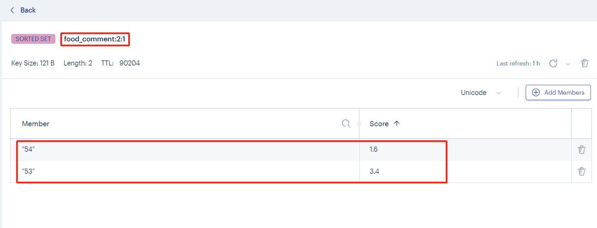

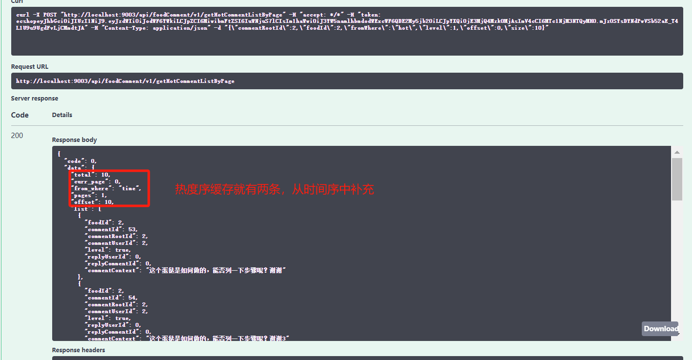

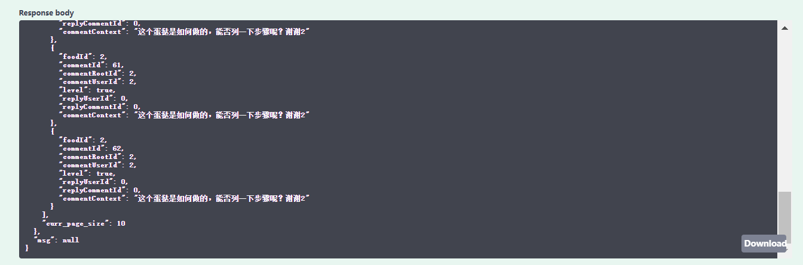