从今天之后的一段时间内，华仔会带着大家一起从零开始搭建并研发一套高并发的电商实战项目，这里会涉及到很多互联网大厂开发过程中所使用的核心技术和架构设计模式，希望大家学完之后可以用到自己的简历中。

接下来我们会重点架构设计和开发一下我们高并发电商实战项目中的「**商品中心服务**」。

这是第三十九篇，本篇我们继续进行电商实战项目设计与开发，本篇将进行「**商品中心服务**」手把手安装 ElasticSearch 8.5.2 版本。

文章汇总位置：[https://wx.zsxq.com/dweb2/index/columns/51122554151214](https://wx.zsxq.com/dweb2/index/columns/51122554151214)

源码授权与获取地址：[https://articles.zsxq.com/id\_1s85grnaae4p.html](https://articles.zsxq.com/id_1s85grnaae4p.html)

本章源码地址：[https://gitcode.net/u011359591/huazai-ecshop/-/tree/ecshop-chapter-3](https://gitcode.net/u011359591/huazai-ecshop/-/tree/ecshop-chapter-39)9

## **01 前言**

终于要设计与研发电商项目代码了，今天我们主要对「**商品中心服务**」安装 ES 和 IK 中文分词器。

这里需要注意下，我们整个项目目前是不提供前端的，这个后续有时间在搞，主要是进行后端接口以及微服务模块架构设计。

## **02 商品中心安装 ElasticSearch 8.5.2**

今天我们来手把手安装最新 ElasticSearch 8.5.2 版本，先不废话，马上开始。

## **2.1 官方下载地址**

官方下载地址：[https://www.elastic.co/cn/downloads/elasticsearch](https://www.elastic.co/cn/downloads/elasticsearch)

这里我们选用 Linux x86\_64，如下图：

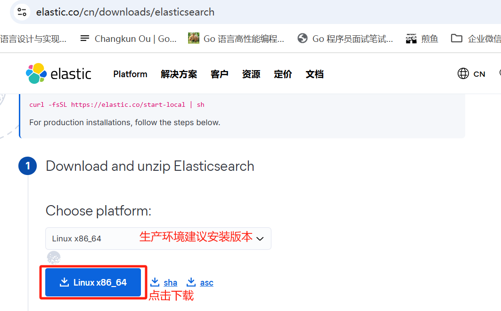

默认上图是最新版 8.16.1，我们选择稍微低点的版本：[https://www.elastic.co/downloads/past-releases/elasticsearch-8-5-2](https://www.elastic.co/downloads/past-releases/elasticsearch-8-5-2)

选好之后，点击下载，或者使用 wget 命令在服务器上直接下载。

wget https://artifacts.elastic.co/downloads/elasticsearch/elasticsearch-8.5.2-linux-x86\_64.tar.gz

服务器存放路径如下，自己可以根据本地情况存放即可，建议使用 Centos 或者 Ubuntu：

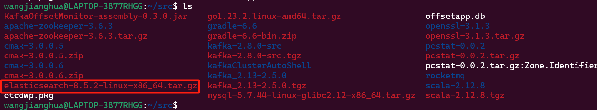

## **2.2 解压**

tar xf elasticsearch-8.5.2-linux-x86\_64.tar.gz

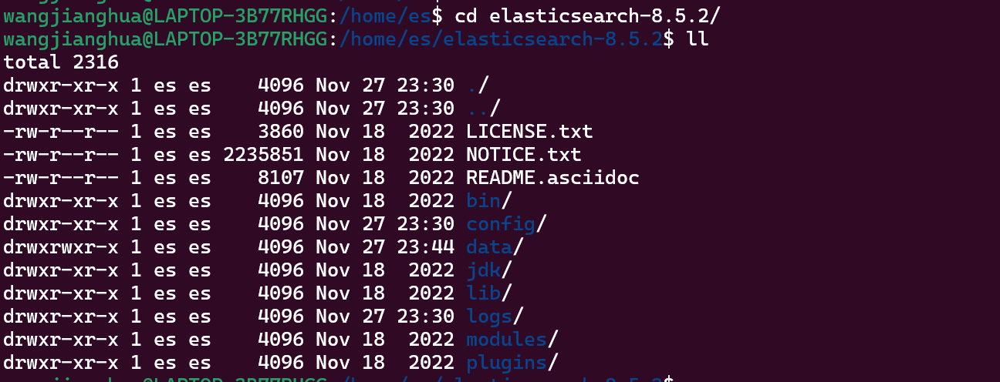

## **2.3 安装目录详解**

这里来简单看下每个目录的含义：

1.  bin：存放启动脚本、常用工具脚本。
2.  config：存放配置文件。
3.  jdk：自动 jdk，可选用。
4.  lib/modules：程序包。
5.  plugins：插件包。
6.  logs：日志目录。
7.  data：数据目录。

### **2.3.1 启动脚本命令**

wins 系统：[elasticsearch.bat](http://elasticsearch.bat/)。

linux 系统：[./elasticsearch](http://./elasticsearch) 或者后台启动命令 [./elasticsearch -d](http://./elasticsearch%20-d)。

### **2.3.2 配置文件**

1.  elasticsearch.yml：核心配置文件，节点实例属性参数。
2.  jvm.options：配置 jvm 堆栈参数。
3.  log4j2.properties：日志常规配置，默认就可以。
4.  role\_mapping.yml、roles.yml、users、 users\_roles：这几个暂时没用，反正我没用过。

### **2.3.2.1 elasticsearch.yml 配置文件**

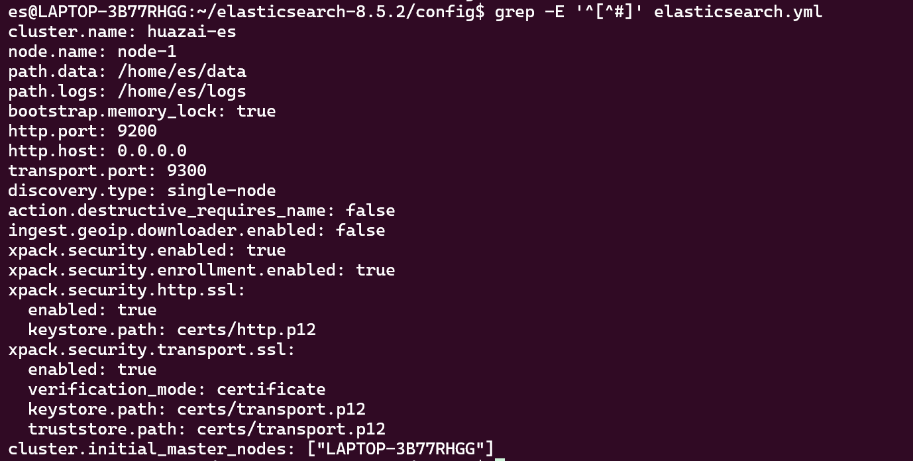

上述配置是集群下使用的，这里我们使用原始默认配置，不做修改。

### **2.3.2.2 jvm.options 配置文件**

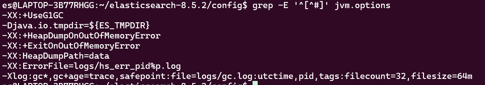

1.  JDK 选择：自主配置或者自带。
2.  GC 选择：JDK14 以上采用 G1，以下采用 CMS。
3.  堆栈大小：
4.  默认 4 GB。
5.  不超过 1/2 系统内存。
6.  空余 1/2 闲置内存。
7.  内存上线不超过 32G，且不能等于 32G。
8.  GC 路径：gc.log 路径配置。
9.  TMP 文件：临时文件路径设置。

## **2.4 手把手安装 ES**

这里我们将 es 安装包放到根目录的 /home/es 目录下。

我们先尝试执行下，看有什么报错。

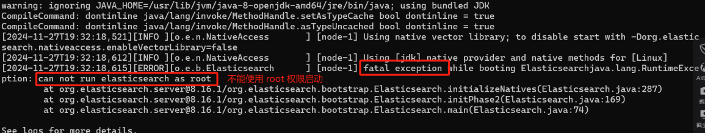

可以看到无法使用 root 权限去启动，我们需要创建一个 es 用户，用该权限来启动 es。

sudo adduser es

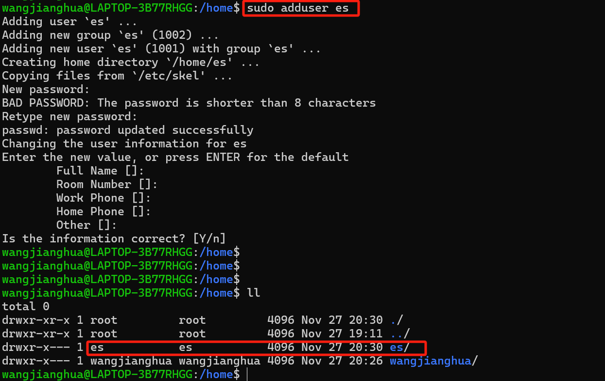

sudo chown -R es:es elasticsearch-8.5.2/

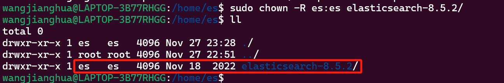

切换到 es 用户下。

先来尝试启动一下，看看会出现什么问题，可以看到生成密码了，可以正常启动。

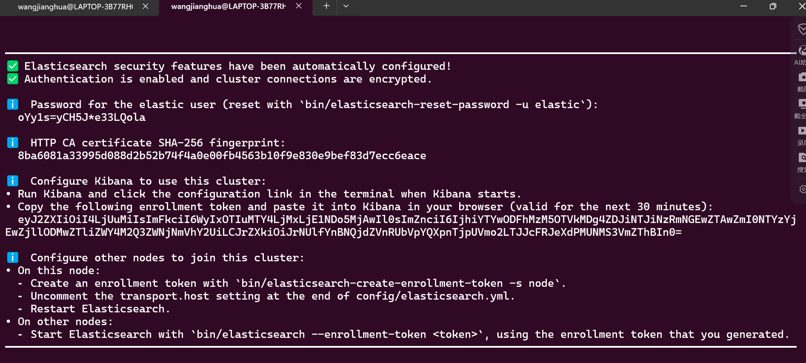

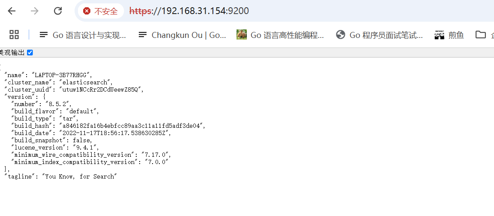

至此，elasticsearch 安装完成，下一节进行 IK 中文分词器的改造和安装。

## **2.5 IK 源码改造及安装 IK 中文分词器**

IK 源码官方地址：[https://github.com/infinilabs/analysis-ik](https://github.com/infinilabs/analysis-ik)

我们下载跟 elasticsearch 同版本的 [ik](https://codeload.github.com/infinilabs/analysis-ik/zip/refs/tags/v8.5.2)，解压后，用 IDEA 打开。

tag 包地址：[https://codeload.github.com/infinilabs/analysis-ik/zip/refs/tags/v8.5.2.zip](https://codeload.github.com/infinilabs/analysis-ik/zip/refs/tags/v8.5.2.zip)

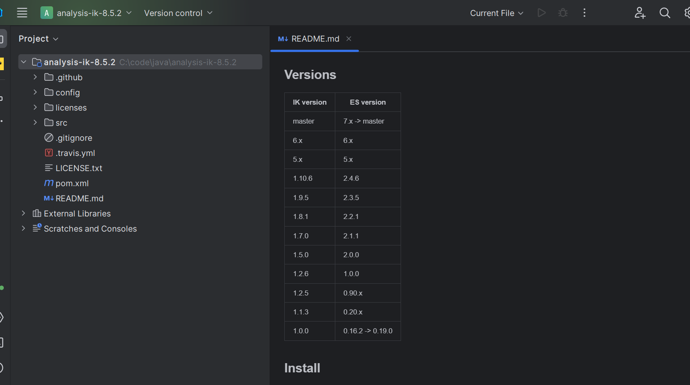

### **2.5.1 IK 中文分词器源码改造**

原生开源的 IK 中文分词器不太好用，通常我们都需要进行一些二次开发和改造，来看看都需要做些什么。

首先 IK 需要支持从自定义的数据库加载词库，开启一个后台线程，定时从数据库「**热刷新**」和「**热加载**」最新的词库。

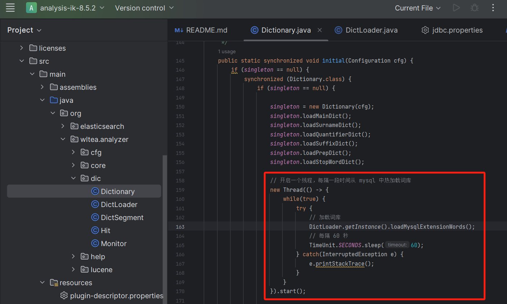

具体的实现自行下载代码后查看，简单来说就是自己构造一个从 mysql 查询数据的方法，并将结果集添加到 IK 分词器的内存中。

接下来需要修改下顶层的 pom 文件，将 es 的版本从 [8.4.1](http://8.4.0.1/) 改成 [8.5.2](http://8.5.0.2/)。

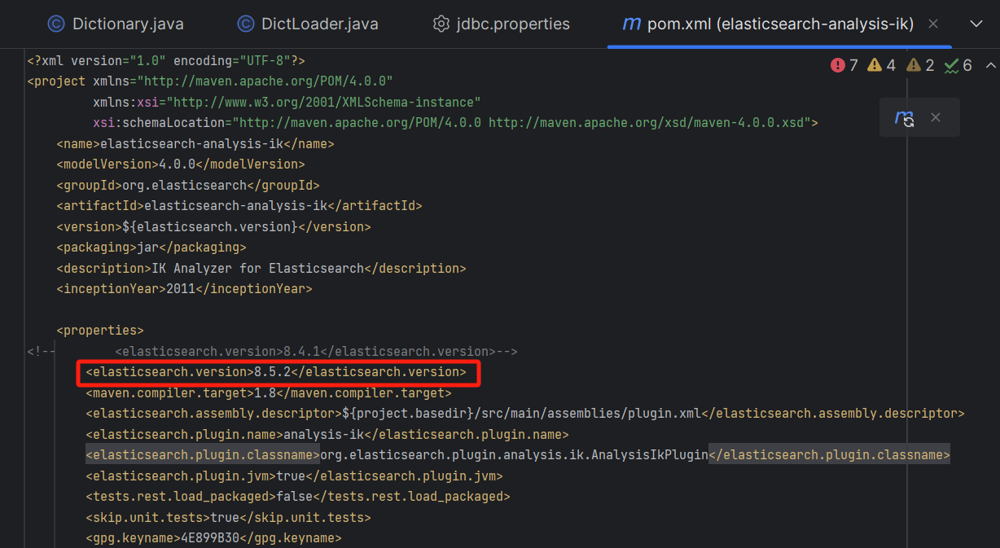

执行 mvn clean package，得到修改后的 elasticsearch-analysis-ik-8.5.2.jar jar 包，后面会用这个 jar 包替换原先的 ik 发行版本中的 jar 包。

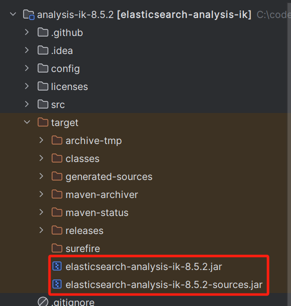

CREATE TABLE \`extension\_word\` (

\`id\` bigint NOT NULL AUTO\_INCREMENT,

\`word\` varchar(64) COLLATE utf8mb4\_general\_ci NOT NULL DEFAULT '' COMMENT '分词',

\`createtime\` datetime DEFAULT CURRENT\_TIMESTAMP COMMENT '创建时间',

\`updatetime\` datetime DEFAULT CURRENT\_TIMESTAMP ON UPDATE CURRENT\_TIMESTAMP COMMENT '更新时间',

PRIMARY KEY (\`id\`)

) ENGINE\=InnoDB DEFAULT CHARSET\=utf8mb4 COLLATE=utf8mb4\_general\_ci COMMENT\='中文分词词库';

### **2.5.2 IK 中文分词器安装**

先下载官方发行版：[https://github.com/infinilabs/analysis-ik/releases/download/elasticsearchanalysis-ik-8.5.2.zip](https://github.com/infinilabs/analysis-ik/releases/download/elasticsearchanalysis-ik-8.5.2.zip)

接着在 elasticsearch 安装目录的 plugins 目录下创建一个 ik 目录用来存放解压后的 ik 包。

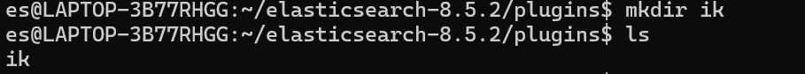

解压刚刚上传或者 wget 下来的 ik 包到当前 ik 目录下。

sudo unzip /home/wangjianghua/src/elasticsearch-analysis-ik-8.5.2.zip

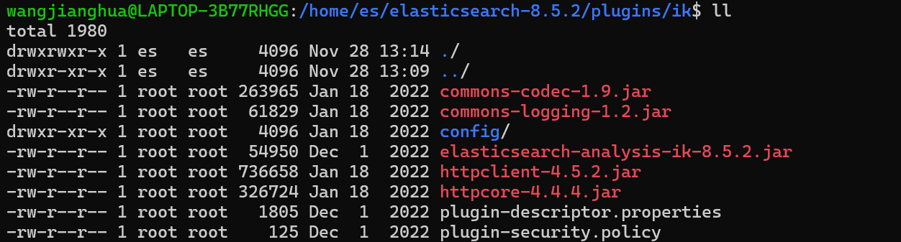

接着用我们改造打包好的 elasticsearch-analysis-ik-8.5.2.jar 替换目录下的 elasticsearch-analysis-ik-8.5.2.jar，并上传 mysql 连接 jar 包。

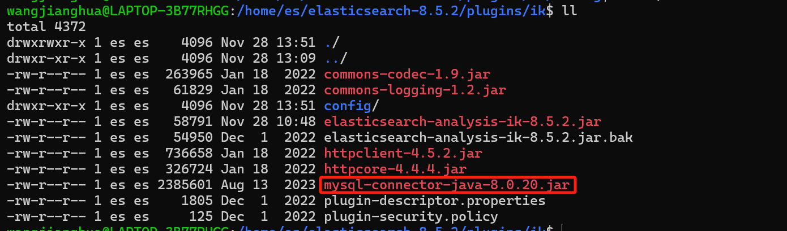

最后在 ik/config 目录下添加 jdbc.properties 文件用来连接 mysql，然后启动 ES。

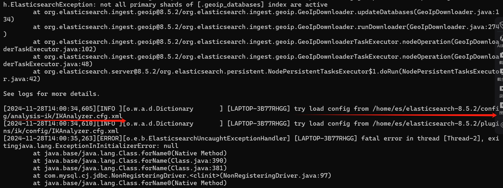

我们需要将 ik 中 config 下的配置文件拷贝到上面报错位置，重新启动。

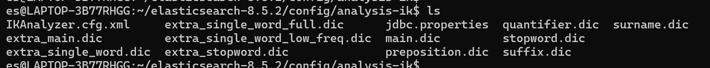

接着再次启动 ES 就可以成功了。

## **2.6 拼音分词器安装**

源码官方地址：[https://github.com/infinilabs/analysis-pinyin](https://github.com/infinilabs/analysis-pinyin)

release 下载地址：[https://github.com/medcl/elasticsearch-analysis-pinyin/releases/download/v8.5.2/elasticsearch-analysis-pinyin-8.5.2.zip](https://github.com/medcl/elasticsearch-analysis-pinyin/releases/download/v8.5.2/elasticsearch-analysis-pinyin-8.5.2.zip)

> 注意：ik 分词器跟拼音分词器的版本最好跟 es 主版本一致，避免引起错误。

安装基本跟 ik 分词器一致，首先需要在 elasticsearch 安装目录的 plugins 目录下创建一个 pinyin 目录用来存放解压后的 pinyin 包。

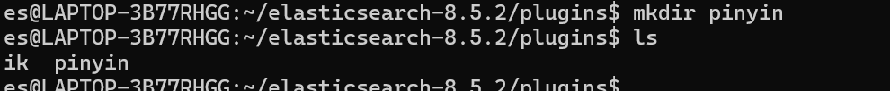

解压刚刚上传或者 wget 下来的 pinyin 包到当前 pinyin 目录下。

sudo unzip /home/wangjianghua/src/elasticsearch-analysis-pinyin-8.5.2.zip

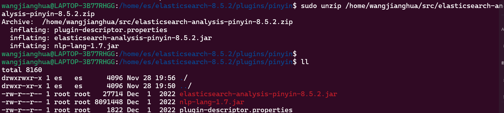

然后就可以重启 ES 了。

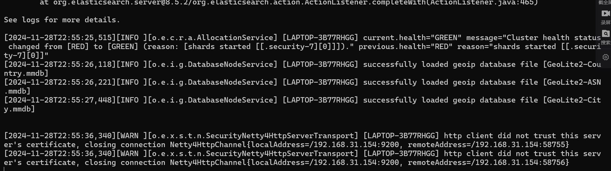

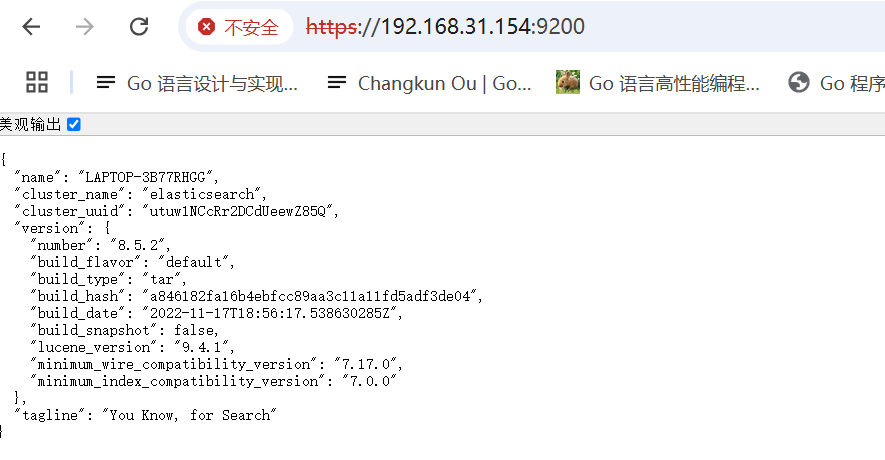

## **2.7 手把手安装 kibana**

最后我们来安装下 kibana，后续操作 ES 都会通过 kibana 来进行。

### **2.7.1 官方下载地址**

官方下载地址：[https://www.elastic.co/downloads/past-releases/kibana-8-5-2](https://www.elastic.co/downloads/past-releases/kibana-8-5-2)

选好之后，点击下载，或者使用 wget 命令在服务器上直接下载。

\# 下载

wget https://artifacts.elastic.co/downloads/kibana/kibana-8.5.2-linux-x86\_64.tar.gz

\# 解压到 /home/es 目录下

tar xf elasticsearch-8.5.2-linux-x86\_64.tar.gz

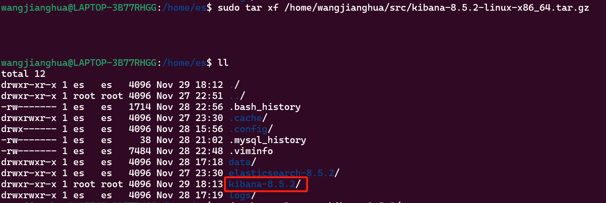

### **2.7.2 修改用户组权限及切换账户**

修改用户组权限。

sudo chown -R es:es kibana-8.5.2/

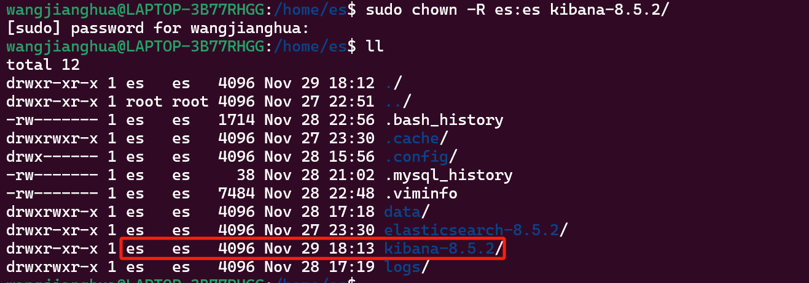

切换到 es 用户下。

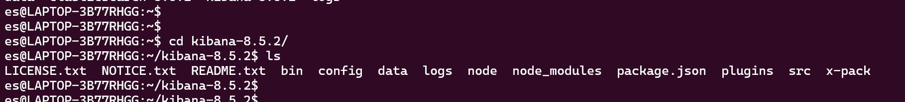

### **2.7.3 安全启动连接 es**

接下来使用 kibana 来连接 es，有两种方式。这里我们使用 **es 启动时生成的 token 连接。**

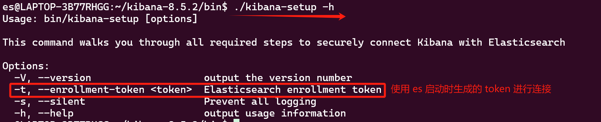

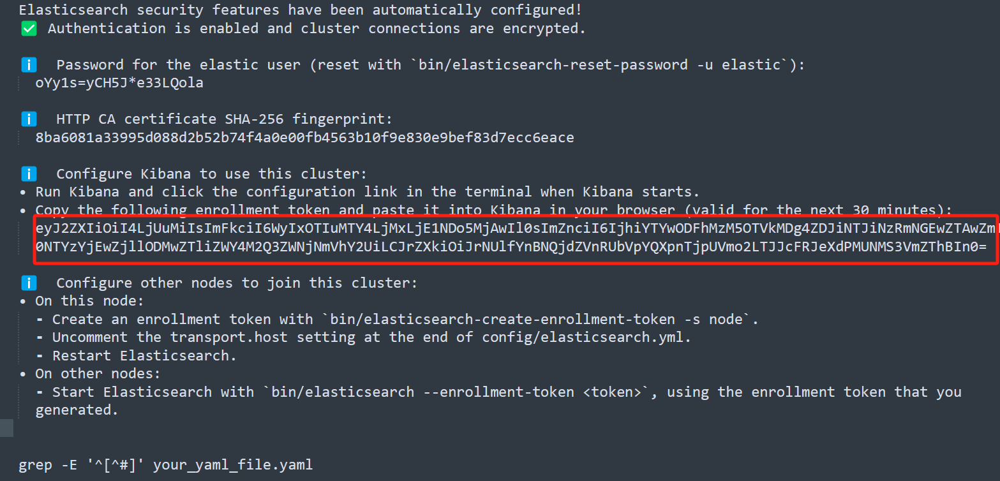

直接执行如下命令：

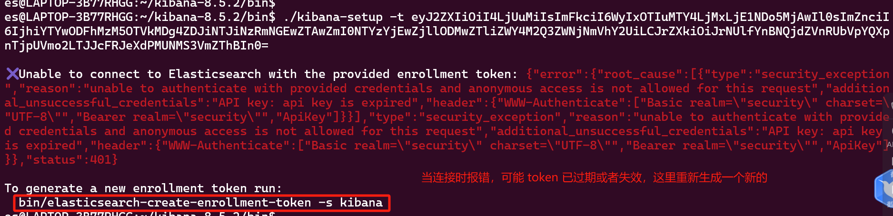

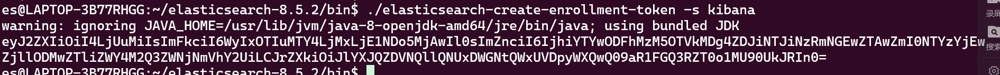

使用新的 token 再次进行连接。

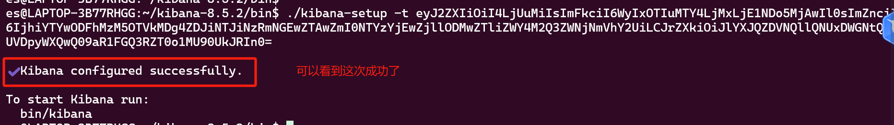

执行完该命令后，它会生成一个认证文件，修改一个配置文件，如下：

1.  data 目录下会生成 crt 安全认证文件。
2.  会修改 config 目录下的 kibana.yml 配置文件，下面是对比。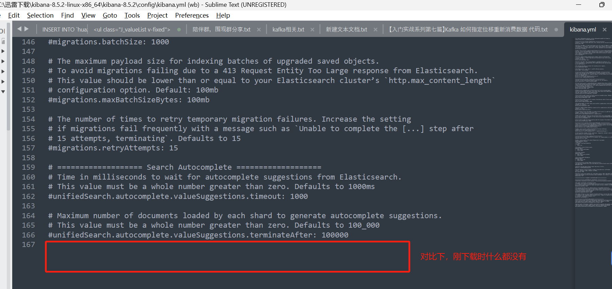

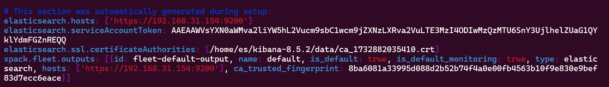

最后，需要修改下外部连接配置，这样本机或者远程都可以访问了。

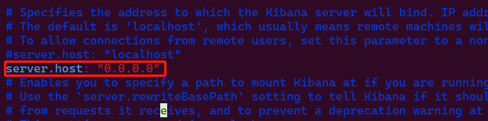

执行启动：[./kibana-8.5.2/bin/kibana](http://./kibana-8.5.2/bin/kibana)

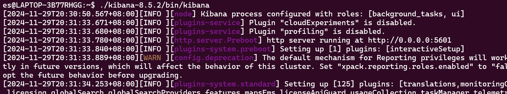

可以看到如下说明已经启动成功了。

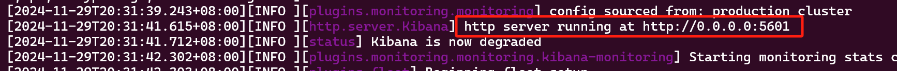

至此，我们就可以通过浏览器进行访问 kibana 了，地址如下：

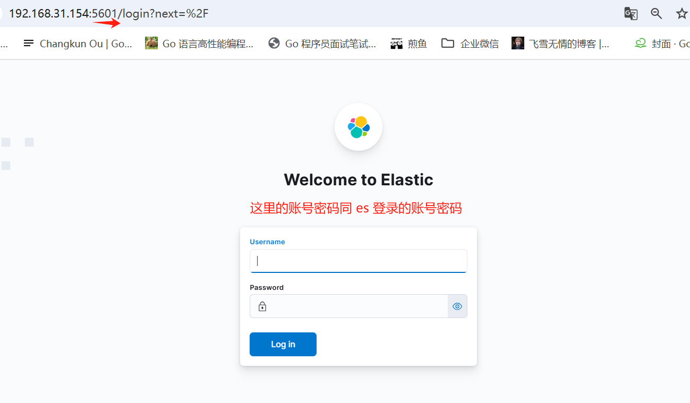

进入之后，作为开发、运维，我们经常会用到以下几个功能，如下图所示：

### **2.7.3.1 Stack Monitoring**

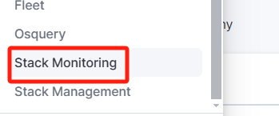

点击进去可以看到如下监控：

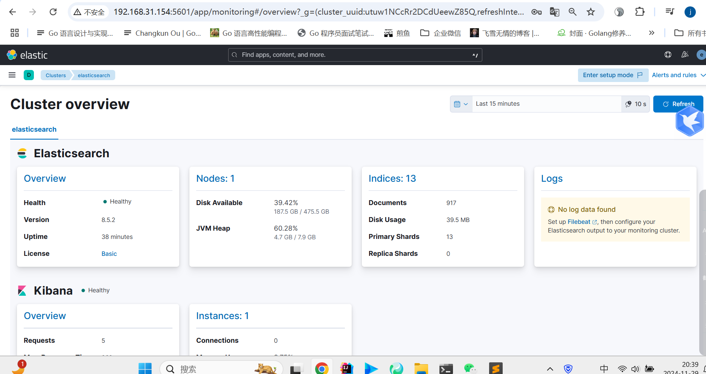

### **2.7.3.2 Dev Tool**

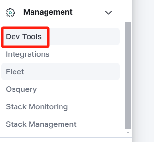

后续我们经常会使用该工具来设置和查询 es 相关索引数据或者监控数据。

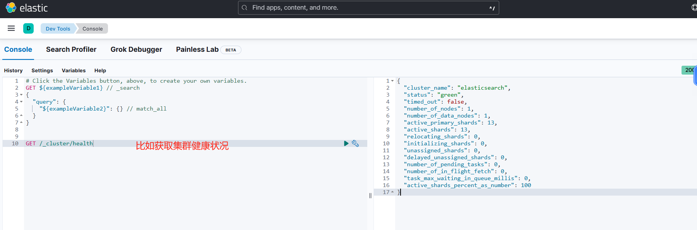

另外大家也可以通过 head 插件进行查询，这里就不安装了，自行从扩展中安装即可，关于使用请点击：[https://blog.csdn.net/qq\_50854662/article/details/135967448](https://blog.csdn.net/qq_50854662/article/details/135967448)

## **2.7 手把手安装 elasticvue**

这里再给大家推荐一款**轻量级且强大**的 Elasticsearch GUI ：**elasticvue，**这是一款桌面程序。

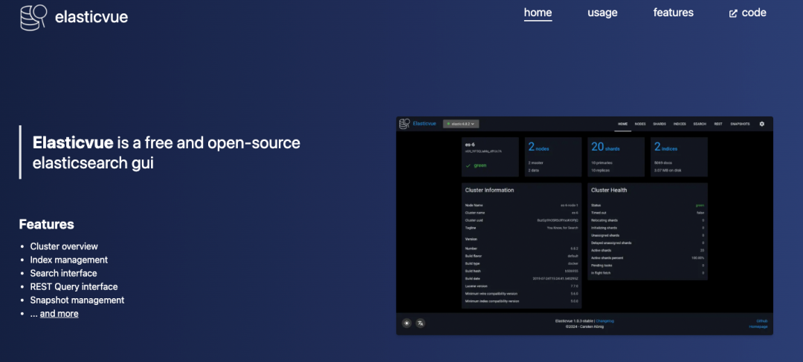

### **2.7.1 下载安装**

官方地址：[https://github.com/cars10/elasticvue/releases/](https://github.com/cars10/elasticvue/releases/)

进入下载界面：

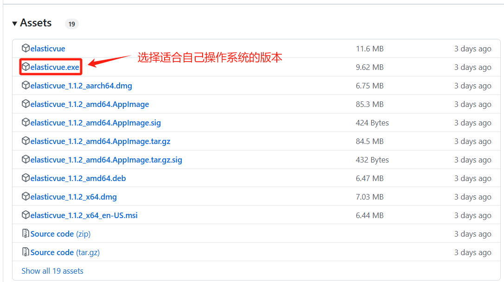

我本地是 windows，自行选择，安装完成之后，点击图标，显示如下：

### **2.7.2 集群配置**

点击 「**添加ELASTICSEARCH集群**」按钮 ，选择不同的验证方式（无需验证、用户名和密码、API key）。

点击「**测试连接**」，弹出成功提示后，连接即可。

如图，集群首页显示集群的节点信息、集群健康状况等。

首页第一栏目有很多的操作选项：「**节点**」**、**「**分片**」**、**「**索引**」**、**「**搜索**」**、**「**REST**」 **、**「**快照**」**、**「**配置**」。

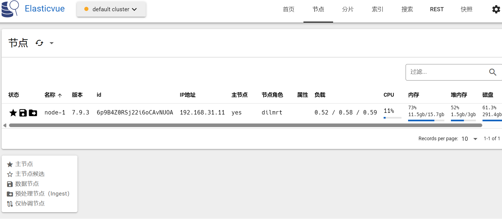

这个搜索功能不错，可以测试下。

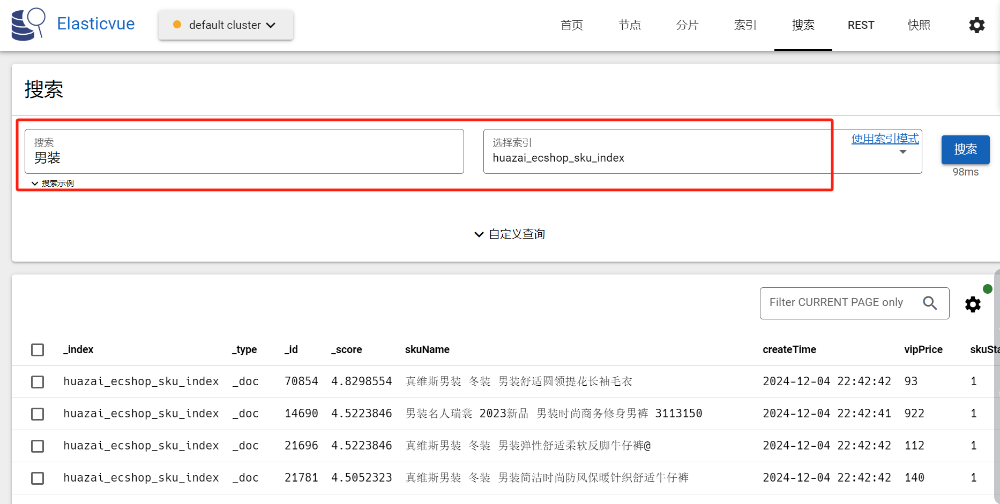

### **2.7.3 创建索引**

在 Elasticsearch 中创建索引是一个相对简单的过程，可以通过发送 HTTP PUT 请求来完成。创建索引时，你可以定义索引的设置（settings）和映射（mappings）。

具体示例步骤如下：

### **1、准备工作**

确保你已经安装并运行了 Elasticsearch，并且可以通过命令行工具（如 curl）、编程语言客户端，或者通过 Kibana 的 Dev Tools 控制台与之交互。

这里介绍 elasticvue 如何通过 GUI 界面与 ES 交互创建索引。

### **2、索引示例**

这里使用我们商品 sku 信息作为示例：

PUT /huazai\_ecshop\_sku\_index\_test

{

"settings":{

"number\_of\_shards" : 1,

"number\_of\_replicas":1

},

"mappings":{

"properties":{

"skuId": {

"type" :"integer"

},

"skuName" : {

"type" : "text",

"analyzer": "ik\_max\_word",

"search\_analyzer":"ik\_smart"

},

"category":{

"type" :"keyword"

},

"brand":{

"type" :"keyword"

},

"price":{

"type":"integer"

},

"vipPrice":{

"type":"integer"

},

"mainUrl" :{

"type":"keyword",

"index": false

},

"skuStatus" : {

"type":"integer"

},

"createTime":{

"type": "date",

"format": "yyyy-MM-dd HH:mm:ss"

},

"updateTime":{

"type": "date",

"format": "yyyy-MM-dd HH:mm:ss"

}

}

}

}

在 ES 中，PUT 方法用于创建或更新索引、文档或设置 ，请求体包含了一个 mappings 部分，这用来定义索引中文档的结构和字段的数据类型。

映射是索引内文档结构的蓝图，它告诉 Elasticsearch 如何处理和存储数据。

### **3、创建索引**

点击 REST 按钮，将例子索引拷贝左侧文本框，点击发起请求后，右侧文本框会返回响应结果。

### **4、添加数据**

我们可以使用 POST 命令添加索引数据，格式如下：

### **5、查看索引**

点击索引栏目，进入示例索引，可以查看所有的索引数据，点击最右侧操作按钮，查看数据详情。

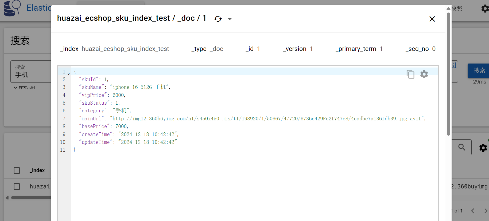