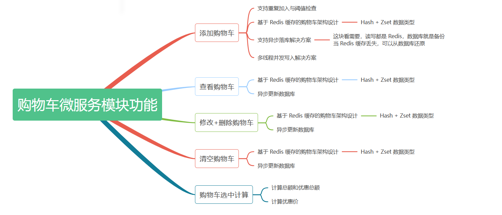
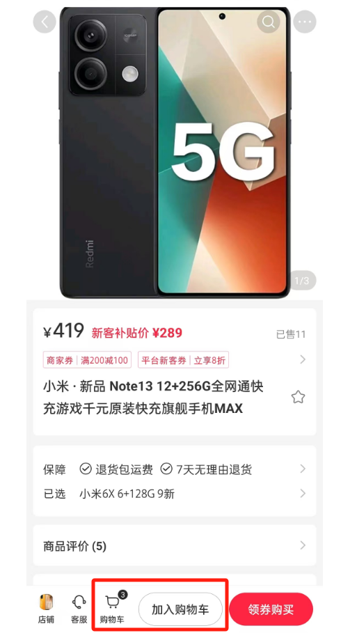
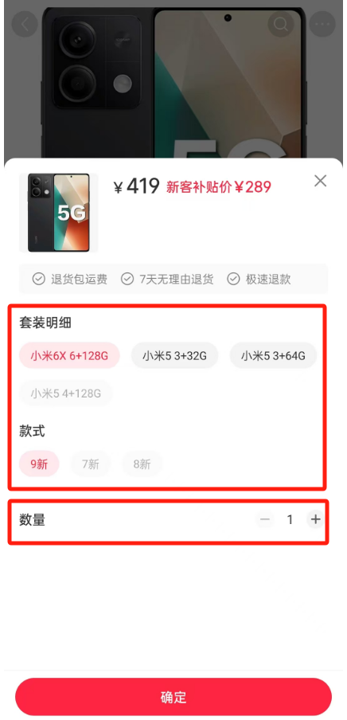
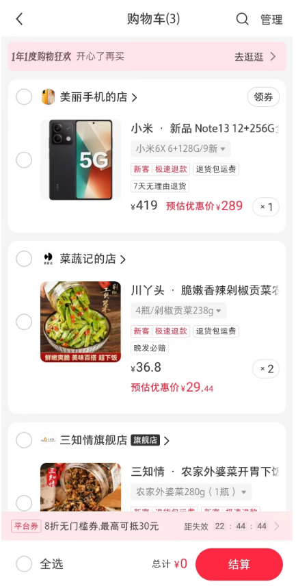
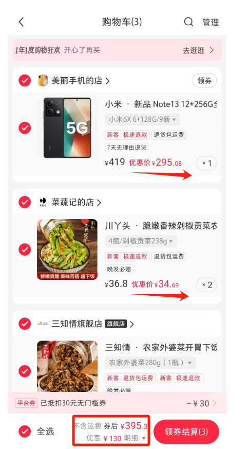
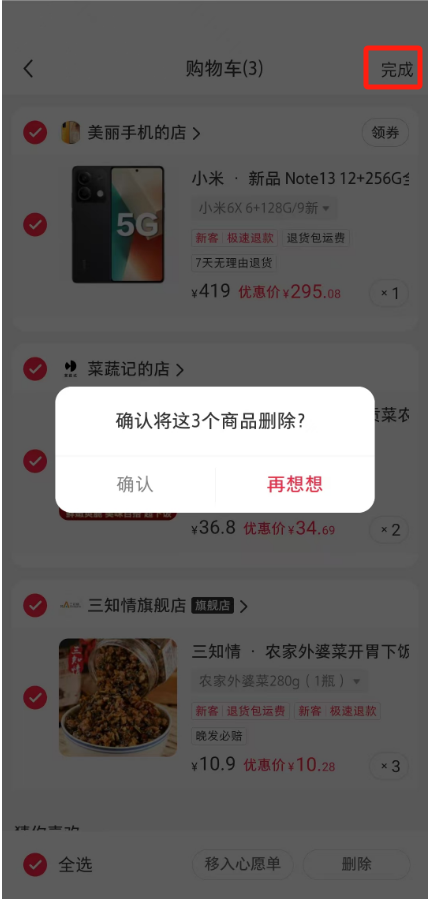
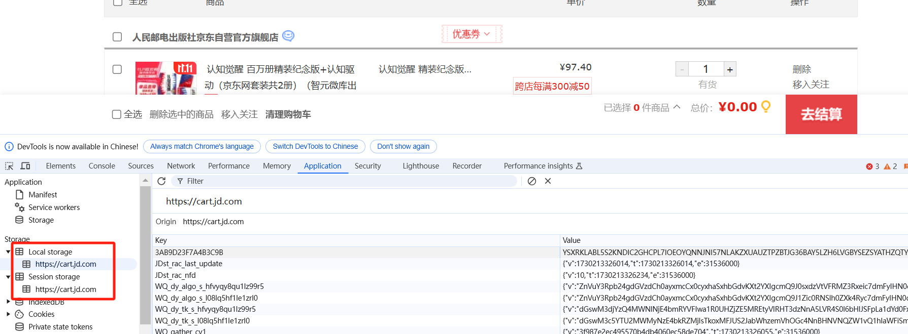
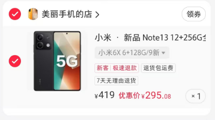
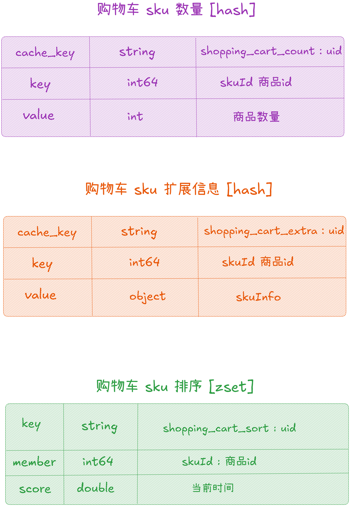

从今天之后的一段时间内，华仔会带着大家一起从零开始搭建并研发一套高并发的电商实战项目，这里会涉及到很多互联网大厂开发过程中所使用的核心技术和架构设计模式，希望大家学完之后可以用到自己的简历中。

接下来我们会重点架构设计和开发一下我们高并发电商实战项目中的「**购物车服务**」。

这是第三十二篇，本篇我们继续进行电商实战项目设计与开发，本篇对「**购物车服务**」中业务场景进行介绍以及架构选型设计。

文章汇总位置：[https://wx.zsxq.com/dweb2/index/columns/51122554151214](https://wx.zsxq.com/dweb2/index/columns/51122554151214)

源码授权与获取地址：[https://articles.zsxq.com/id\_1s85grnaae4p.html](https://articles.zsxq.com/id_1s85grnaae4p.html)

本章源码地址：[https://gitcode.net/u011359591/huazai-ecshop/-/tree/ecshop-chapter-32](https://gitcode.net/u011359591/huazai-ecshop/-/tree/ecshop-chapter-32)

## **01 前言**

终于要设计与研发电商项目代码了，今天我们主要对「**购物车服务**」业务场景介绍。

这里需要注意下，我们整个项目目前是不提供前端的，这个后续有时间在搞，主要是进行后端接口以及微服务模块架构设计。

## **02 购物车服务场景介绍及架构设计**

这里我们主要是以「**小红书**」为例，来看看其「**购物车服务**」都有哪些功能。

##   
**2.1 购物车服务功能梳理**

### **2.1.1 商品浏览加购**

首先需要进入到商品详情页，然后准备加购操作，如下图所示：

然后点击「**加入购物车**」操作，需要选择对应的「**商品 SKU**」和 「**商品数量**」，如下图所示：

  

### **2.1.2 查看购物车**

添加完购物车后，就可以查看购物车了，如下图所示：

然后可以对购物车里面的商品进行修改，可以更换「**商品 SKU**」和 「**商品数量**」。

###   
**2.1.3 选中计算**

这里主要计算「**优惠价**」及「**券后总额**」，如下图所示：

### **2.1.4 删除和清空购物车**

点击右上角「**管理**」按钮，就可以删除购物车商品了，可以删除单个也可以全选删除，如下图所示：

## **2.2 购物车服务实现方案选型**

先来看下实现方案。

### **2.2.1 直接存储数据库**

方案一：直接将购物车数据存储到数据库中，虽然功能是可以实现，但是对于我们要「**支撑千万级用户量高并发电商系统**」来说，这种实现方案性能堪忧，甚至直接打挂数据库。

###   
**2.2.2 前端本地存储**

方案二：直接前端本地存储，基于 [localStorage](https://blog.csdn.net/weixin_63490470/article/details/141230920) 和 [sessionStorage](https://www.jb51.net/javascript/3231489kc.htm) 技术实现。

1.  [localStorage](https://blog.csdn.net/weixin_63490470/article/details/141230920) 在浏览器中存储 kv 对，没有过期时间（推荐使用）。
2.  [sessionStorage](https://www.jb51.net/javascript/3231489kc.htm) 在浏览器中存储 kv 对，在关闭会话窗口后将删除该数据。

  

比如京东以前就是这样实现，在用户「**没有登录**」的情况下会添加到 [localStorage](https://blog.csdn.net/weixin_63490470/article/details/141230920) 中，当用户点「**结算时**」会提示让登录，但是现在大部分都是「**登录**」后才能「**操作购物车**」。

该方案优缺点：

1.  优点：可以支撑高并发操作，用户只需要在自己的浏览器中操作即可，都是在本地操作。
2.  缺点：需要做同步，比如在当前浏览器操作，换一个浏览器就看不到购物车信息了。

### **2.2.3 直接 Redis 存储**

操作购物车的读写操作都基于「**Redis 操作**」，既可以解决「**高并发性能问题**」，又可以解决 「**数据持久化问题**」，开启 「**AOF 持久化防止重启丢失方案**」。

###   
**2.2.4 直接 Redis + 异步写数据库**

操作购物车的读写操作都基于「**Redis 操作**」，然后「**异步写数据库**」。这里数据库就是作为一个备份角色。

对于「**购物车业务**」来说，并没有「**Redis**」与「**数据库**」数据不一致情况发生，因为都是基于「**用户唯一标识**」来操作的。

当「**Redis 集群**」全面崩溃后，如果基于「**方案三**」的话，可能购物车的主数据都丢失了，此时我们还可以基于「**数据库**」进行「**降级**」，降级提供购物车读写操作，等「**Redis 集群**」恢复之后，可以基于「**数据库**」进行购物车数据预热。

###   
**2.2.5 总结**

综上得出，我们最终选用「**方案四**」来实现我们购物车的业务。

##   
**2.3 购物车服务架构设计**

先来看下数据库设计，比较简单，后续可以基于「**用户 ID**」进行分库分表。

### **2.3.1 购物车数据库设计**

CREATE TABLE \`cart\` (

\`id\` bigint NOT NULL AUTO\_INCREMENT,

\`user\_id\` bigint NOT NULL DEFAULT '0' COMMENT '用户id',

\`sku\_id\` bigint NOT NULL DEFAULT '0' COMMENT '商品 id',

\`sku\_count\` int NOT NULL DEFAULT '0' COMMENT '商品加购数量',

\`sku\_price\` int NOT NULL DEFAULT '0' COMMENT '商品加购金额',

\`sku\_sale\_price\` int NOT NULL DEFAULT '0' COMMENT '商品优惠价',

\`status\` tinyint(1) DEFAULT '0' COMMENT '购物车状态 0 正常 1 删除',

\`createtime\` datetime DEFAULT CURRENT\_TIMESTAMP COMMENT '创建时间',

\`createuser\` bigint NOT NULL DEFAULT '0' COMMENT '创建用户id',

\`updatetime\` datetime DEFAULT CURRENT\_TIMESTAMP ON UPDATE CURRENT\_TIMESTAMP COMMENT '更新时间',

\`updateuser\` bigint DEFAULT '0' COMMENT '更新用户id',

PRIMARY KEY (\`id\`)

) ENGINE\=InnoDB DEFAULT CHARSET\=utf8mb4 COLLATE=utf8mb4\_general\_ci COMMENT\='购物车表';

### **2.3.2 购物车缓存设计**

对于「**购物车业务**」来说，读写操作主存储都是基于「**Redis**」来实现的，所以我们来重点分析下「**购物车业务**」需要存储什么样的数据到 「**Redis**」，并剖析使用哪些数据类型类进行存储。

这里我们以图例来剖析，如下图所示：

  

从这张图中我们可以得出：

1.  商品基础信息：商品编号、商品名称、商品图片、商品价格、商品数量等。
2.  商品 SKU 信息：款式、口味、明细等。
3.  优惠券信息：优惠券名称、优惠券价格等。

从这些信息中我们可以总结 Redis 存储结构：

1.  购物车数量信息：skuId --> 数量，使用 Redis Hash 数据类型存储。
2.  购物车 sku 扩展信息：skuId --> skuInfo，使用 Redis Hash 数据类型存储。
3.  购物车 sku 排序：skuId -> score(当前时间)，使用 Redis Zset 数据类型存储，天然支持排序+去重。

  
