从今天之后的一段时间内，华仔会带着大家一起从零开始搭建并研发一套高并发的电商实战项目，这里会涉及到很多互联网大厂开发过程中所使用的核心技术和架构设计模式，希望大家学完之后可以用到自己的简历中。

接下来我们会重点架构设计和开发一下我们高并发电商实战项目中的「**商品中心服务**」。

这是第三十五篇，本篇我们继续进行电商实战项目设计与开发，本篇对「**商品中心服务**」中业务场景进行介绍。

文章汇总位置：[https://wx.zsxq.com/dweb2/index/columns/51122554151214](https://wx.zsxq.com/dweb2/index/columns/51122554151214)

源码授权与获取地址：[https://articles.zsxq.com/id\_1s85grnaae4p.html](https://articles.zsxq.com/id_1s85grnaae4p.html)

本章源码地址：[https://gitcode.net/u011359591/huazai-ecshop/-/tree/ecshop-chapter-35](https://gitcode.net/u011359591/huazai-ecshop/-/tree/ecshop-chapter-35)

## **01 前言**

终于要设计与研发电商项目代码了，今天我们主要对「**商品中心服务**」业务场景介绍。

这里需要注意下，我们整个项目目前是不提供前端的，这个后续有时间在搞，主要是进行后端接口以及微服务模块架构设计。

## **02 商品中心服务场景介绍**

这里我们主要还是以「**小红书**」为例，来看看其「**商品中心服务**」都有哪些功能。

  

上图是小红书的商品详情页，从上图我们知道商品系统是最底层、最核心的系统，没有商品，其他系统都无法运转，接下来我们来深度剖析下「**商品中心服务**」的详细设计和方案。

## **2.1 商品中心服务概述**

商品服务是负责管理与商品有关的数据和能力的系统，可以用以下三句话概括：

1.  负责创建和管理商品的系统服务。
2.  负责创建和管理分类、品牌、属性以及其他所有与商品相关的数据的系统服务。
3.  负责对前台商品展示以及相关上下游系统提供商品能力的系统服务。

在整个电商体系中，「**商品中心服务**」是其他所有相关服务系统的基础：从「**商品采购**」到「**库存管理**」，从「**商品创建**」、「**商品上下架**」管理到「**商品定价**」以及前台展示，从「**促销活动**」到「**下单支付**」，从「**订单生成**」到「**履约配送**」，电商中的每个流程都与商品相关。

而在这些所有上下游系统之间，商品数据必须是统一的、通用的、标准化的，比如「**采购系统**」中的商品 A 和「**订单系统**」中的商品 A 必须是同一个 A，所以「**商品系统**」在很大程度上必须具备中心化服务的能力，因此「**商品系统**」也是所有系统中最优先需要设计成中心化服务的系统。

## **2.2 商品中心服务功能**

下面通过一张图来说明：

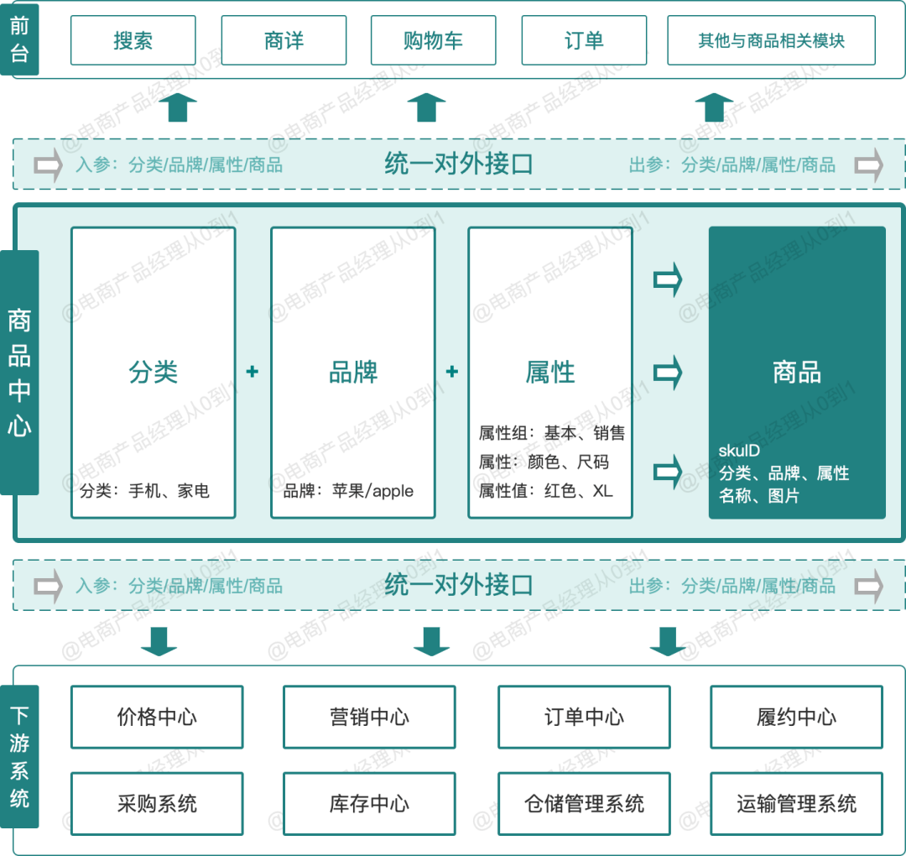

（图片来自网络）

上图中间的部分就是「**商品中心服务**」，「**商品中心服务**」的核心模块可以抽象成4个，分别是：

1.  商品分类：用于创建分类、管理分类，为商品以及其他系统提供分类能力。
2.  商品品牌：用于创建品牌、管理品牌，为商品以及其他系统提供品牌能力。
3.  商品属性：用于创建属性、管理属性，为商品以及其他系统提供属性能力。
4.  商品：用于创建商品、管理商品，为其他系统提供商品能力。

  
「**商品中心服务**」最基本的职能是向上支撑前台各个环节的「**商品查询**」**、**「**商品展示**」功能，同时向下为「**价格中心服务**」、「**营销中心服务**」、「**订单中心服务**」、「**履约中心服务**」、「**采购系统服务**」、「**库存中心服务**」、仓储以及运输等下游系统**提供商品能力和服务**，保证电商体系下所有系统对于商品数据的输入和输出的统一。

  
下面，我们就「**商品中心服务**」的 4 个核心模块的通用设计方案分别展开介绍。

## **2.3 分类管理**

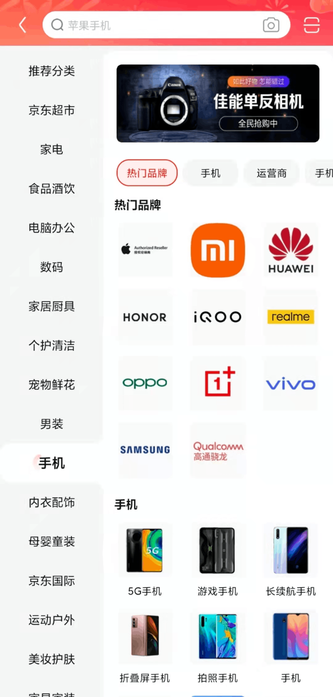

（京东 APP分类页）

1.  对于用户端来说：搜索和分类导航是消费者寻找商品时使用的最多的两个途径（随着推荐技术应用程度的加深，搜索和分类的权重有一定程度的下降），分类导航可以帮助用户快速定位到目标商品，分类导航功能的实现依赖的就是商品的分类管理。
2.  对于运营端来说：海量的商品管理对于平台和商家而言也有很大的成本，运营要快速定位到某一个商品除了搜索关键词外，分类管理也是重要的手段，分类可以提高管理商品的效率。

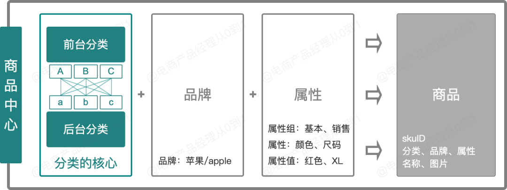

（图片来自网络）

分类管理的核心设计思想是：「**前后台分离、多对多映射**」。

1.  前后台分离：指前台分类和后台分类设计成两套分类体系。
2.  「**后台分类**」主要面向平台管理，其主要逻辑是结构化的管理逻辑（iPhone13∈手机分类，卫裤∈服装分类）；
3.  「**前台分类**」主要面向用户端使用，为运营提供运营空间，为用户购物提供便捷，其主要逻辑是运营和用户体验（如卫裤在前台的分类可以是”冬季新品“，主要考虑的是运营效果以及用户是否更好的找到商品）。
4.  多对多映射：
5.  「**前台分类**」必须以「**后台分类**」作为分类基础，在创建「**前台分类**」时，必须要先选择「**后台分类**」。
6.  「**前台分类**」和「**后台分类**」之间是多对多的映射关系，即一个「**前台分类**」可选多个「**后台分类**」，不同「**前台分类**」可选同一个「**后台分类**」。

###   
**2.3.1 后台分类管理设计思想**

一般情况下，平台建设初期就已经确定了商品分类模型了，后期只是根据业务的发展进行升级优化，「**后台分类**」创建后，一般不能轻易修改或者删除。「**后台分类**」才是真实的商品分类。

  
从后台界面的角度讲，后台分类管理主要包含两部分功能：「**分类创建**」和「**分类管理**」。

###   
**2.2.1.1 分类创建**

创建一个新的分类，需填写两个主要字段：「**分类级别**」和「**分类名称**」。「**后台分类**」的分类名称一般填写实物商品的行业类别（如手机），便于维护管理，分类的名称必须唯一。「**分类级别**」一般设计为 3 级树状结构，一二三级分类层层递进（具体设计级别多少需根据平台的品类复杂程度等因素综合考虑）。

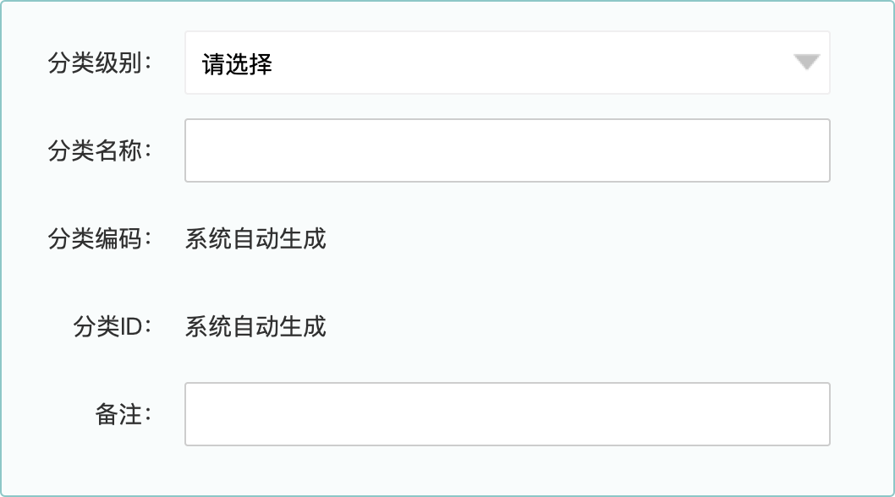

（图片来自网络）

当创建一个新分类的级别为二级分类或者三级分类时，则需要选择父级分类。

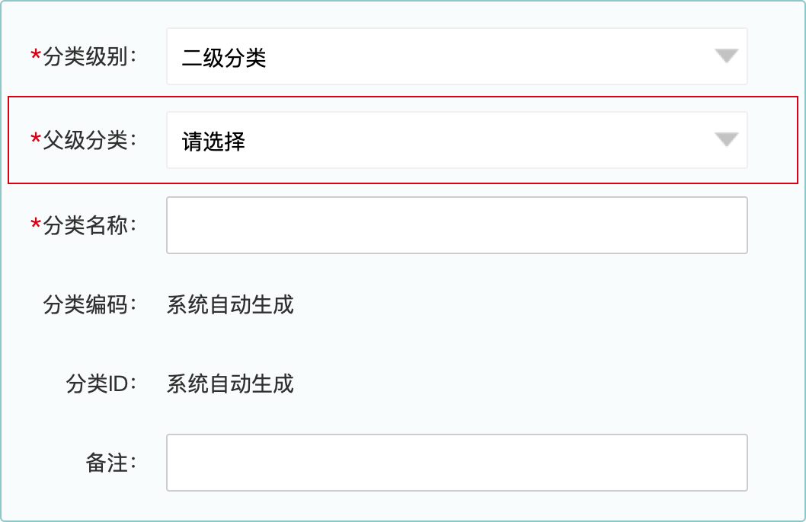

（图片来自网络）

「**分类编码**」和「**分类 ID**」都可以设计成根据一定的规则自生成（如分类名称拼音+时间戳拼成分类编码），分类「**分类编码**」和「**分类 ID**」必须唯一，分类被其他系统中调用传参时，可以通过分类编码或者分类ID来实现。

### **2.3.1.2 分类管理**

「**分类管理**」主要提供分类自身的查询、排序、修改等功能，同时可设计绑定/解绑分类对应的属性或品牌的功能。

（图片来自网络）

  
对于分类的删除或修改，前文提过一般不建议修改（包括修改级别，修改所属父级分类），修改时需要校验分类下是否有关联数据，无关联数据时可在一定程度上进行修改；而删除功能则需要更加谨慎设计，一般情况下，分类下只要有关联数据（如有关联商品、关联前台分类等）则不能删除，需要分类下没有任何关联数据时，才可以操作删除（建议前期不设计删除功能，或者设计成需要高级权限才可执行删除操作）。

### **2.3.2 前台分类管理设计思想**

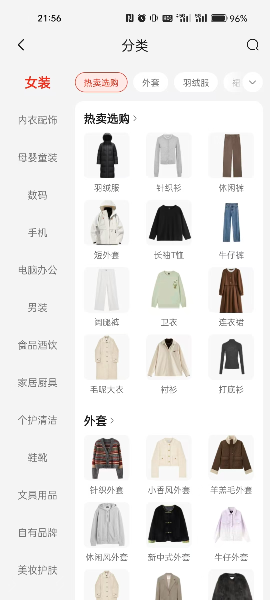

（京东APP端商品分类）

  
「**前台分类**」在职责边界划分上，属于「**网站/APP运营配置**」的功能范畴，不是真正意义上的分类功能，在维护「**前台分类**」时，需要挂在一个或多个「**后台分类**」上，用户在前端点选分类查找商品时，系统通过「**后台分类**」——「**后台分类**」——「**商品**」三级映射关系查询前台分类下应该展示哪些商品。

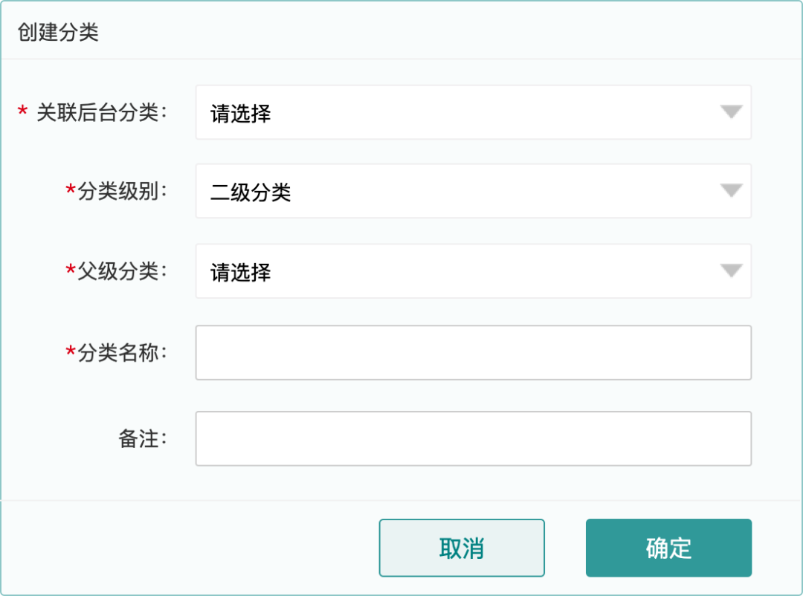

（图片来自网络）

前后台分类多对多映射的设计逻辑主要考虑的「**运营需求**」和「**用户**」对于商品的认知差异，由于分类导航的流量非常大，运营往往会配置一些「**运营分类**」，如「**推荐分类**」、「**常用分类**」等，对于推荐/常用这样的分类本质上和商品属性没有直接关系，「**前台分类**」可以关联多个不同的「**后台分类**」（如很多电商网站中，后台分类中的手机分类和手机配件分类在前台对应的分类都是手机）。

## **2.4 品牌管理**

在大型电商平台中的系统架构中，「**品牌管理**」与「**分类管理**」一样，是一块独立的、完整的功能。很多人刚接触商品系统时，可能见过创建商品时直接简单地填写一下商品的品牌的设计方式，那为什么大型平台要有单独的品牌管理呢？

在大型电商平台中，「**品牌**」也是用户查询筛选商品的重要手段，标准化程度越高的品类，通过「**品牌**」筛选查询商品的使用场景越大（如京东平台购买手机或者家电时，消费者往往会先选定品牌）。

而「**品牌**」数据如果不是结构化的，任由运营或者商家创建商品随意填写，则可能会出现同一个「**品牌**」的商品被不同业务或者不同的商家填写成不同的「**品牌**」，如商家 A 把小米填写成字母“xiaomi”，商家 B 把小米填写成中文“小米”，商家 C 甚至填写成“showmi”等各种错误数据，当底层数据无法统一时，则前台筛选或者其他系统需要使用品牌数据时，就无法正常使用了。

### **2.4.1 品牌管理设计思想**

「**品牌管理**」主要包含两部分功能，即「**品牌创建**」和「**品牌管理**」。

### **2.4.1.1 品牌创建**

品牌的创建场景主要有两种：

1.  一种是平台侧主动创建，初期一般是按照各个品类直接初始化到系统中去。
2.  另一种平台型电商比较常见的申请方式，即由入驻到平台的三方商家申请品牌（如阿里京东平台中，如果新入驻的商家是自有新品牌或者未被平台收录，则都需要先走品牌申请流程，如早期的淘品牌韩都衣舍等），平台审核通过后落入品牌库。

（图片来自网络）

  
品牌创建一般有几个核心关键要素：

1.  品牌中文名
2.  品牌英文名：建议格式要求大写
3.  品牌别名：品牌有官方名称和民间名称，有时候民间名称比官方更知名
4.  品牌注册人
5.  品牌注册号
6.  品牌LOGO：一定要限制图片尺寸和大小，便于系统展示规范
7.  品牌注册地区
8.  其他字段根据平台特性或行业资质要求自定

### **2.4.1.2 品牌管理**

品牌管理就是品牌自身的查询、修改、停用等功能，即基础的增查改，需要注意的是品牌在修改或者停用时，也要校验品牌下没有关联的数据（商品、分类等），否则不能操作修改或者停用（部分信息的修改如果不影响其他数据的展示，则可以修改）。另外就是可设计品牌与商品分类的映射关系的功能，当发品时选择了分类后，会自动检索该分类下应该出现的品牌（也可不设计，不设计的逻辑就是当选择分类后，选择品牌时检索的是全量品牌，两种方案有利有弊）。

## **2.5 属性管理**

属性指商品所特有的性质，如颜色属性、尺码属性、规格属性等。属性也是将商品进行分类和聚合的必要且重要的方法，类目和品牌只能在一定程度上将海量的商品进行分类，比如用户在京东购买“家电”，可以通过类目（如：电视、空调、冰洗···）、品牌（如：格力、小米···）来查询想要的产品（如：小米电视），但是当用户想进一步快速定位到最准确的意向结果（如小米电视55寸4K版），类目和品牌就显得不够用了，因此如果想实现更细颗粒度的划分，只能通过属性的方式来实现。一个商品所拥有的所有性质，都是这个商品的属性，如：屏幕尺寸、分辨率、能效等级等。

而不同类目下的商品，其拥有的属性又不一样（比如服装没有屏幕尺寸等属性，手机没有尺码属性），且随着品类的丰富，属性的数据也随之变得非常庞大，为了更好地管理不同类型的商品的属性，使其在前台应用时可以有清晰简单的逻辑，属性管理的意义就显得非常重要了。

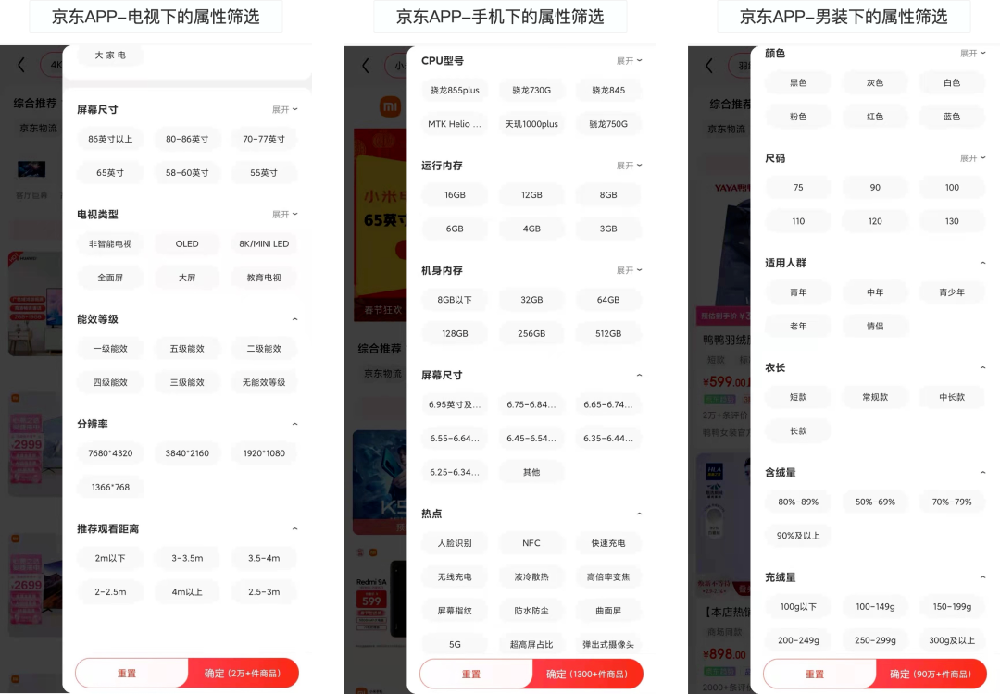

### **2.5.1 属性管理设计思想**

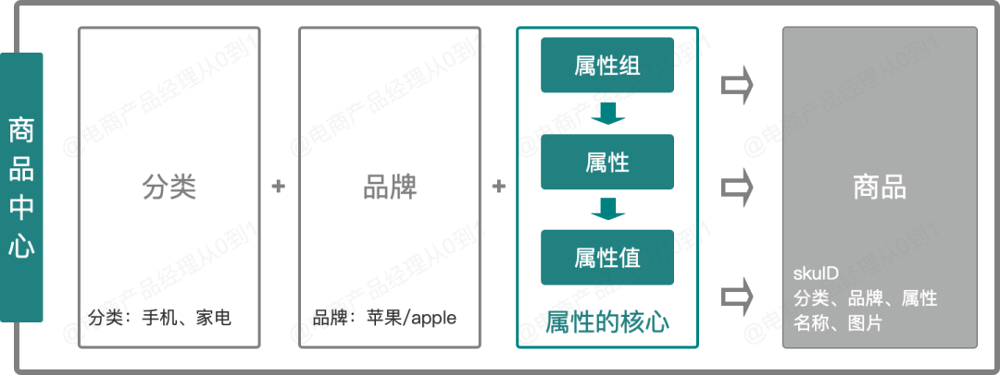

(图片来自网络)

属性从结构上可拆分成3块，分别是：属性组>属性>属性值

1.  属性组：将大量属性分类，便于管理，如手机的“外观属性”、“性能属性”等 ；
2.  属性：即属性名，指具体的属性，如颜色、版本、运行内存 ；
3.  属性值：指属性的具体值，如颜色属性的属性值有：红色、黄色、绿

以上3个模块就组成了属性管理，有时候为了在业务层面沟通方便或者口径统一，又或者其他的应用场景，还会引入属性分类的设计，在属性组之上将属性在进行分类（相对抽象的分类），一般分为基础属性、销售属性、仓储属性、物流属性、扩展属性（关于属性分类，没有标准设计，结合自身的平台特性划分即可，也可不设计属性分类）。

下面将属性分类结合3个核心模块，以手机品类举例，通过一张表格解释一下属性的各个概念：

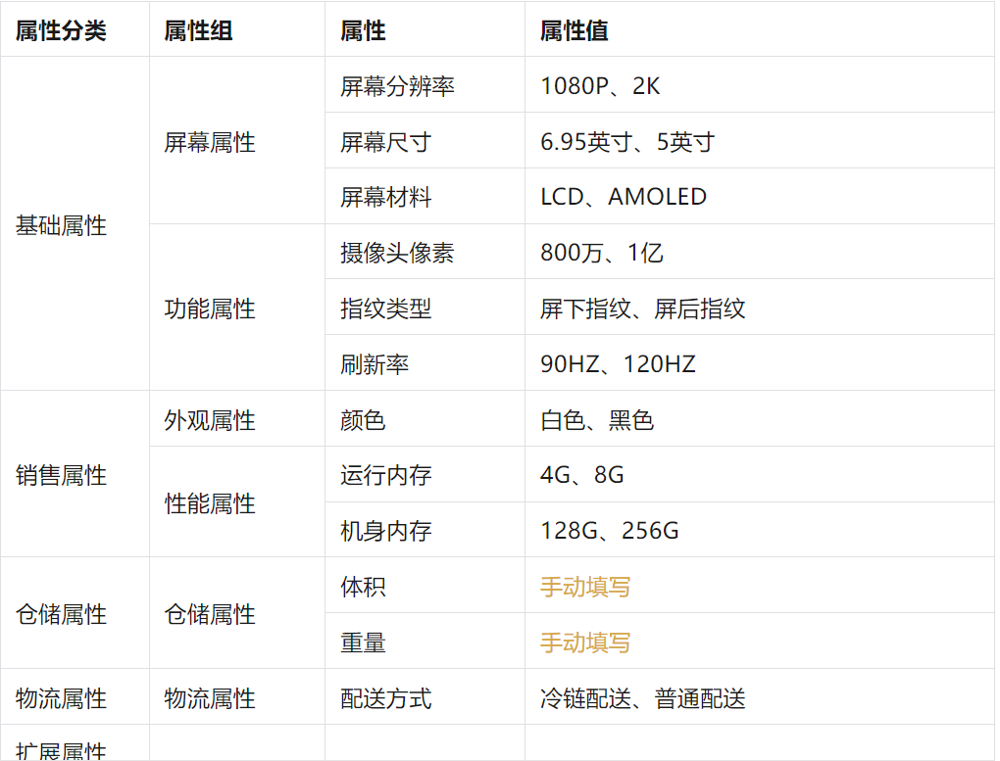

下图是京东平台-iPhone13 的商品详情页截图，在京东前台，这些信息是结构化的字段（并非图文），其数据就来自于创建商品时填写的属性：

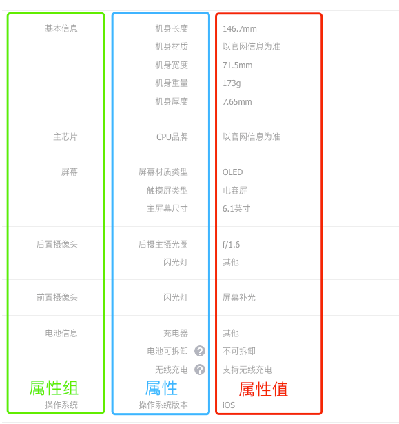

### **2.5.2 属性管理设计方案**

1.  属性组的核心功能：创建和管理（查询、修改、绑定属性）
2.  属性的核心功能：创建和管理（查询、修改、绑定属性组、绑定分类）
3.  属性值：依托于属性功能

### **2.5.2.1 属性组创建**

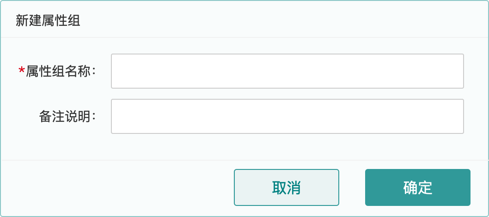

(图片来自网络)

### **2.5.2.2 属性组管理(列表)**

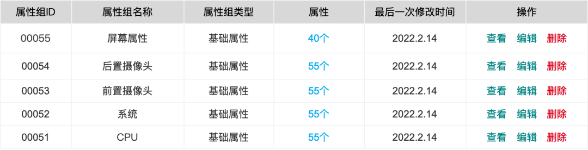

(图片来自网络)

### **2.5.2.3 属性组管理(详情)**

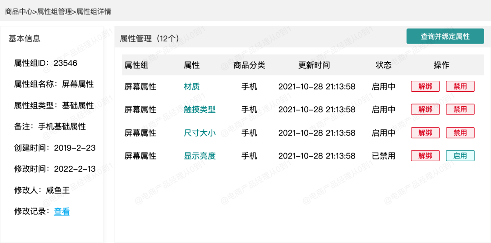

(图片来自网络)

  
主要功能是支持绑定属性和解绑属性以及对属性组的启用/停用控制，对于停用操作，需要校验属性组下没有任何关联数据（属性等）。

### **2.5.2.4 属性及属性值创建**

属性和属性值的创建也有两种场景：一种是平台侧主动创建，另一种平台型电商比较常见的申请方式，即三方商家创建商品时，如果属性库中的属性不够用，则可以在创建商品的界面直接添加属性。

平台侧创建属性：

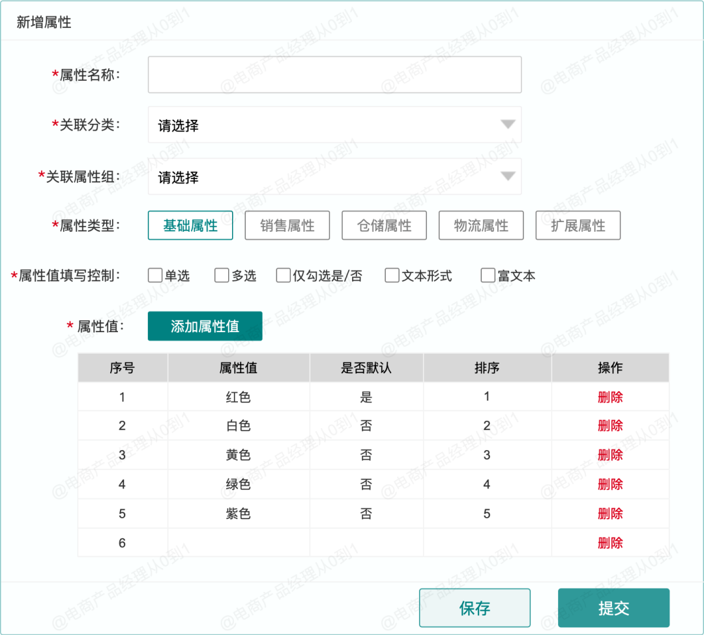

(图片来自网络)

  
这里重点说明一下关联分类：属性必须要关联分类，当创建新商品时，第一步就是选择分类，当后面选择属性时，系统就能根据所选分类查询对应的属性了（如手机类目下，不会展示服装尺码等属性）。

以上就是属性管理相关功能模块的设计介绍，属性管理（绑定分类、绑定属性组）的界面与属性组类似。属性的删除、解绑等操作与属性组一样，也需要校验是否有关联数据。

## **2.6 商品管理**

最后我们来看下商品管理，商品管理模块主要负责「**创建商品**」、「**管理商品**」，为其他系统提供商品能力，是「**商品中心服务**」最核心的模块，同时「**商品管理**」也依赖「**分类**」、「**品牌**」、「**属性**」三个模块。

以「**创建商品**」为例，「**创建商品**」时需要填写的字段中，最重要的就是选择「**分类**」、「**品牌**」、「**属性**」，可以说商品是建立在「**分类**」、「**品牌**」、「**属性**」之上的模块。

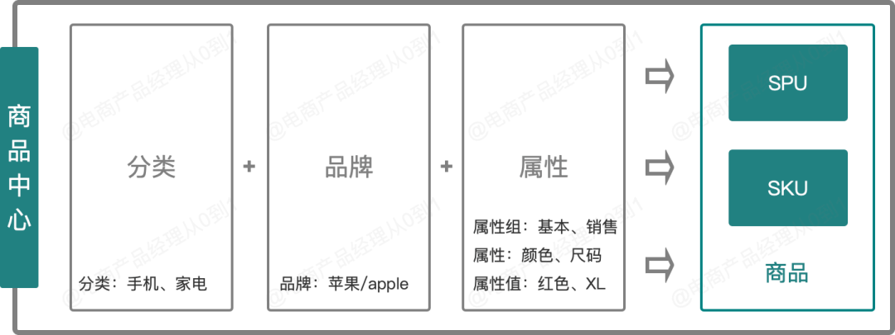

(图片来自网络)

先来了解两个概念。

### **2.6.1 SPU & SKU**

在具体说明商品模块之前，有必要先说明两个名词「**SPU**」和「**SKU**」，不止电商平台，大部分涉及交易的系统都可能涉及「**SPU**」和「**SKU**」，相信大部分人都接触过这两个名称。

以下是百度百科对「**SPU**」和「**SKU**」的解释：

1.  SPU(Standard Product Unit)——标准化产品单元。是商品信息聚合的最小单位，是一组可复用、易检索的标准化信息的集合，该集合描述了一个产品的特性。通俗点讲，属性值、特性相同的商品就可以称为一个SPU
2.  SKU(stock keeping unit)——SKU即库存进出计量的单位， 可以是以件、盒、托盘等为单位；SKU是一个可以售卖的商品。

  
通俗地讲，「**SPU**」 定位一个产品，「**SKU**」定位为商品。例如手机这个类目下，iPhone 13 就是一个「**SPU**」，iPhone 13 256G 黑色就是一个 「**SKU**」。

  
一般情况下，基础属性可以看成是「**SPU**」的属性，如手机的屏幕尺寸、CPU型号、像素等基础属性；销售属性以及仓储物流属性存储在「**SKU**」上，如颜色、版本等销售属性。

### **2.6.2 创建商品**

创建商品功能从界面上看比较简单，就是填写一堆字段，然而根据平台的大小、复杂程度、垂直专业程度等因素的不同，可以抽象成两种设计方案：

1.  方案1：同时创建多个sku，同步生成关联spu，整体方案是直接创建sku，维护多个不同的属性即意味着生产维护多个sku；该方案适用于大部分2C类综合型电商平台（如淘宝和京东POP创建商品就是这种方式）。
2.  方案2：先创建spu，基于spu创建sku，整体方案是由平台的主数据团队负责维护spu，由商家（包括自营和POP）运营（或采销）基于spu维护sku，创建sku时，先选择spu（spu中的基础属性已经由数据团队维护完毕），在spu基础上维护销售属性、物流属性等，然后生成sku；该方案适用于专业性非常强的垂直B2B行业，如汽车、医药等。

产生两种方向的原因是：垂直 B2B 平台的商家（行业传统，商家老板年纪较大）运营能力有限，维护商品属性的错误率远高于 2C 平台的商家，而平台对于商品结构化的管控要求较高，为了避免同一个商品被不同的商家维护成多个不同的属性（如汽车轮胎的胎面宽、尺寸等属性），平台往往选择由专门的数据团队维护商品的基础属性，即维护「**SPU**」。且 B2B 垂直电商的品类少、「**SKU**」量级相对较小，品类标准化程度高，由平台统一维护的可行性高。而综合电商成千上万个品类，靠平台的数据团队统一维护不太现实，或者像服装这样的非标品类，对于商品的结构化管理诉求低，因此综合平台（京东、淘宝）与垂直平台的设计方向就出现了差异。

实际情况下，即使是综合平台（如京东），不同的品类也会出现不同的设计方法，有的品类垂直纵深，也是采用的平台维护「**SPU**」，商家创建「**SKU**」的方式。

### **2.6.2.1 方案1**

这种方法比较常见，见过淘宝、京东等主流电商后台的同学应该有一定的印象，逻辑就是直接创建「**SKU**」，生成「**SKU**」的同时，生成相应的「**SPU**」，如下图的淘宝商家后台：

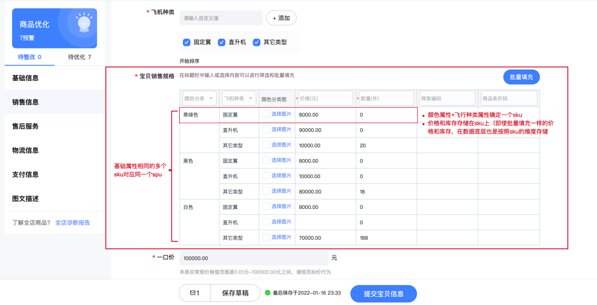

（淘宝三方后台创建商品-填写销售信息截图）

  
从图中可以看出，基础属性相同的多个「**SKU**」对应同一个spu，颜色属性+飞行种类属性确定一个「**SKU**」，价格和库存存储在「**SKU**」上（即使批量填充一样的价格和库存，在数据底层也是按照「**SKU**」的维度存储；

而在前台则以「**SPU**」的维度展示（体验更好），切换销售属性即是在同一个「**SPU**」维度下，切换不同的「**SKU**」：

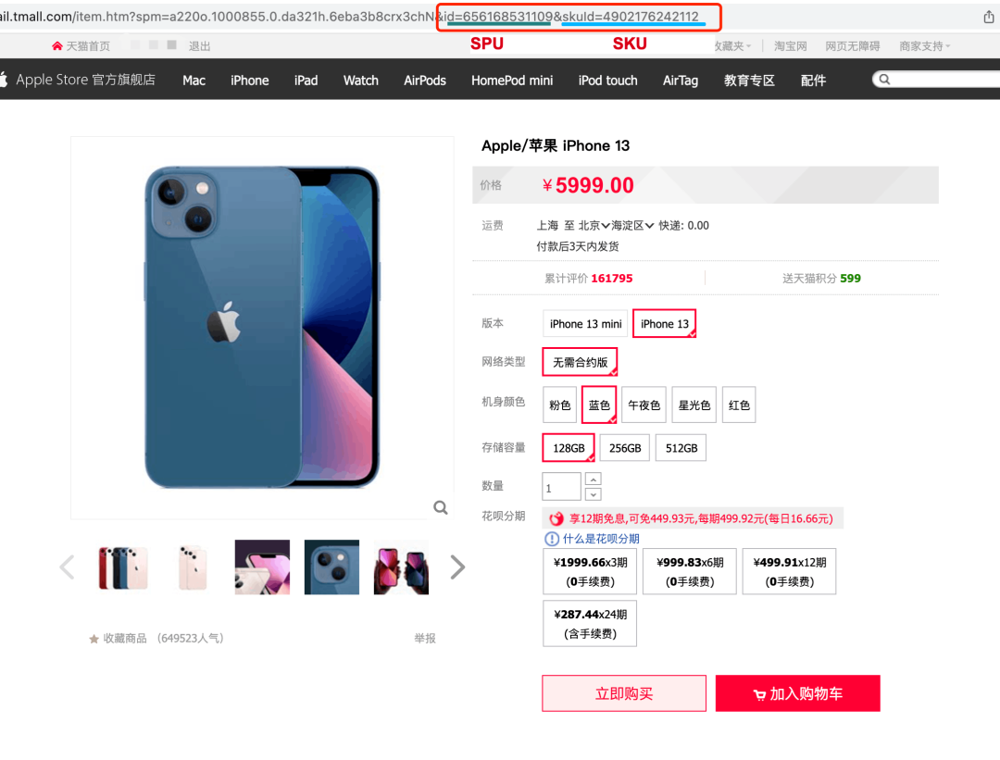

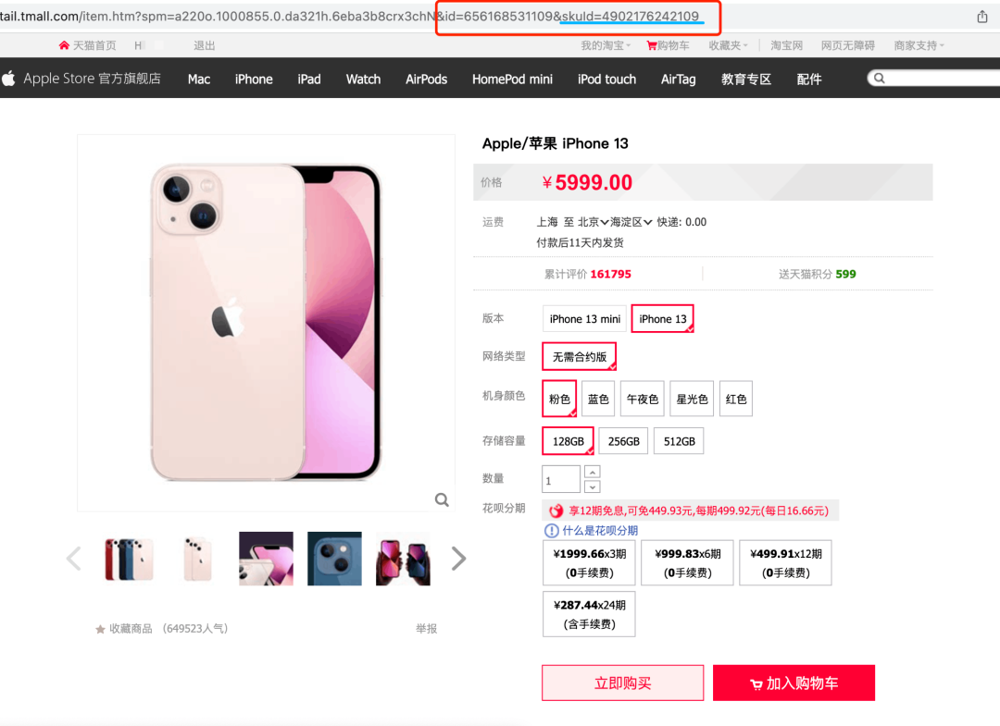

以上为天猫 PC 端-iPhone13 的商品详情页，可以看出，iPhone13+黑色+128G 和 iPhone13+粉色+128G是两个独立的 「**SKU**」（skuid不同），两个「**SKU**」对应的「**SPU**」是同一个（spuid相同）。即创建商品的时候，维护不同的销售属性就是维护了多个不同的sku，但最终同步生成了同一个「**SPU**」。

  
了解了设计逻辑以后，对于功能设计就非常简单了，不论是自营后台还是三方 pop 后台，创建商品的界面大同小异，可按照流程大约分为 7 个步骤：

