从今天之后的一段时间内，华仔会带着大家一起从零开始搭建并研发一套高并发的电商实战项目，这里会涉及到很多互联网大厂开发过程中所使用的核心技术和架构设计模式，希望大家学完之后可以用到自己的简历中。

接下来我们会重点架构设计和开发一下我们高并发电商实战项目中的「**商品中心服务**」。

这是第三十六篇，本篇我们继续进行电商实战项目设计与开发，本篇对「**商品中心服务**」中业务场景进行数据库设计以及架构设计。

文章汇总位置：[https://wx.zsxq.com/dweb2/index/columns/51122554151214](https://wx.zsxq.com/dweb2/index/columns/51122554151214)

源码授权与获取地址：[https://articles.zsxq.com/id\_1s85grnaae4p.html](https://articles.zsxq.com/id_1s85grnaae4p.html)

本章源码地址：[https://gitcode.net/u011359591/huazai-ecshop/-/tree/ecshop-chapter-36](https://gitcode.net/u011359591/huazai-ecshop/-/tree/ecshop-chapter-36)

## **01 前言**

终于要设计与研发电商项目代码了，今天我们主要对「**商品中心服务**」业务场景进行数据库设计以及架构设计。

这里需要注意下，我们整个项目目前是不提供前端的，这个后续有时间在搞，主要是进行后端接口以及微服务模块架构设计。

## **02 商品中心服务数据库设计**

在 [【电商实战项目第三十五篇】华仔电商实战项目商品中心服务业务场景介绍](https://articles.zsxq.com/id_4oqq5qcld73u.html) 上篇中，我们介绍了整个电商体系中，「**商品中心服务**」的功能介绍及设计方案。

##   
**2.1 数据库 ER 图**

今天我们先从宏观上看下整个「**商品中心服务**」的 ER 图，如下：

  
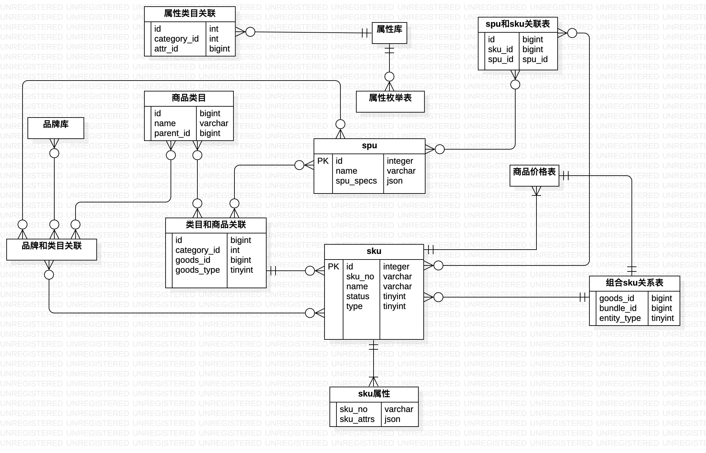

## **2.2 分类表设计**

在上篇中，我们知道分类分为「**前台分类**」和「**后台分类**」，如下图：

  
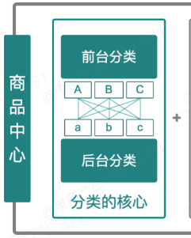

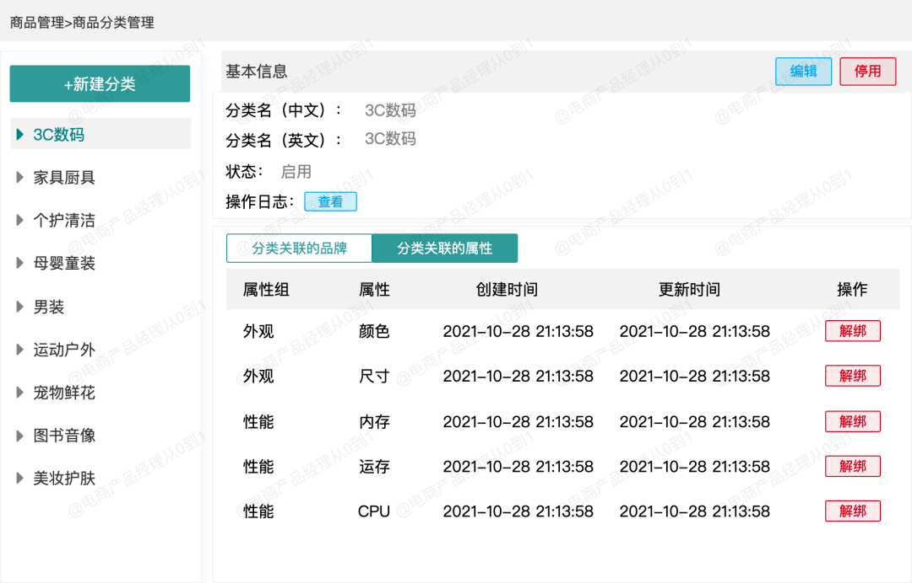

（后台分类管理）

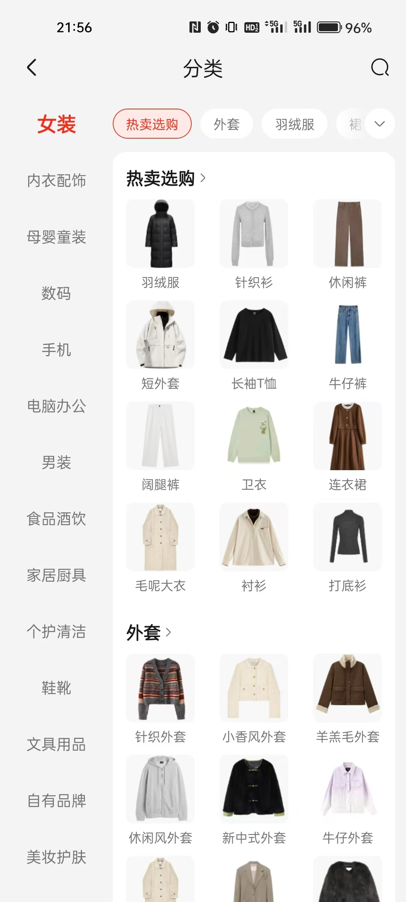

（前台分类管理）

CREATE TABLE \`product\_category\` (

\`id\` mediumint unsigned NOT NULL AUTO\_INCREMENT COMMENT '分类id',

\`parent\_id\` mediumint unsigned DEFAULT '0' COMMENT '父类id 上级分类的编号：0 表示一级分类',

\`name\` varchar(32) CHARACTER SET utf8mb4 COLLATE utf8mb4\_general\_ci DEFAULT '' COMMENT '分类名称',

\`alias\` varchar(32) CHARACTER SET utf8mb4 COLLATE utf8mb4\_general\_ci NOT NULL DEFAULT '' COMMENT '分类别名',

\`is\_enable\` tinyint unsigned NOT NULL DEFAULT '0' COMMENT '是否启用：1 启用 2 禁用',

\`level\` mediumint unsigned NOT NULL DEFAULT '0' COMMENT '分类层级',

\`is\_deleted\` tinyint unsigned NOT NULL DEFAULT '0' COMMENT '分类状态：0 未删除 1 已删除',

\`create\_time\` datetime DEFAULT CURRENT\_TIMESTAMP COMMENT '创建时间',

\`update\_time\` datetime DEFAULT CURRENT\_TIMESTAMP ON UPDATE CURRENT\_TIMESTAMP COMMENT '更新时间',

PRIMARY KEY (\`id\`) USING BTREE,

KEY \`parent\_id\` (\`parent\_id\`) USING BTREE

) ENGINE\=InnoDB DEFAULT CHARSET\=utf8mb4 COLLATE=utf8mb4\_general\_ci ROW\_FORMAT\=COMPACT COMMENT\='商品分类';

## **2.3 品牌表设计**

在大型电商平台中，「**品牌**」也是用户查询筛选商品的重要手段，标准化程度越高的品类，通过「**品牌**」筛选查询商品的使用场景越大，如下图：

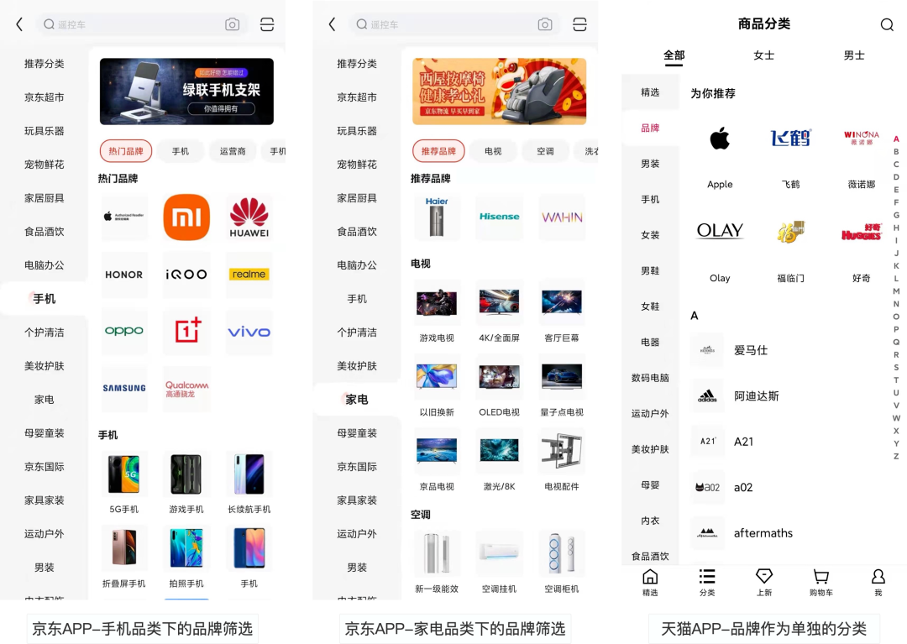

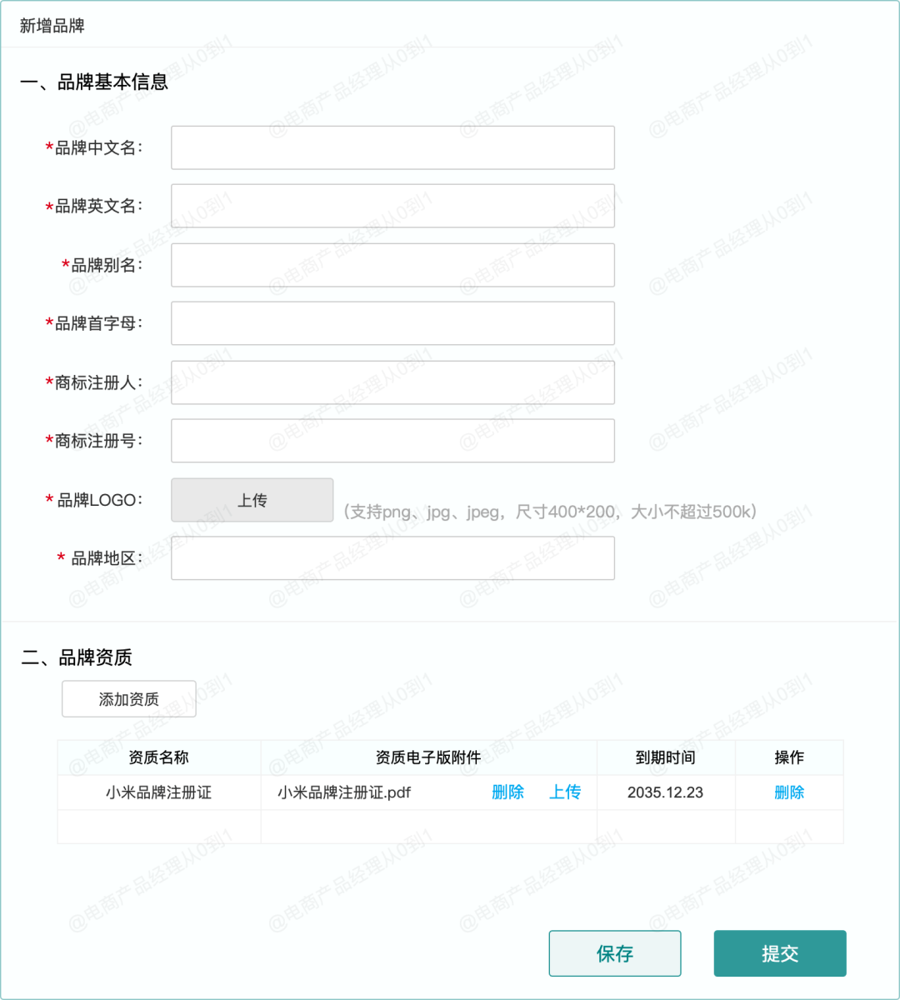

CREATE TABLE \`product\_brand\` (

\`brand\_id\` mediumint unsigned NOT NULL AUTO\_INCREMENT COMMENT '品牌编号',

\`brand\_name\` varchar(60) CHARACTER SET utf8mb4 COLLATE utf8mb4\_general\_ci NOT NULL DEFAULT '' COMMENT '品牌名称',

\`brand\_alias\_name\` varchar(60) CHARACTER SET utf8mb4 COLLATE utf8mb4\_general\_ci NOT NULL DEFAULT '' COMMENT '品牌名称',

\`brand\_code\` varchar(255) CHARACTER SET utf8mb4 COLLATE utf8mb4\_general\_ci NOT NULL DEFAULT '' COMMENT '品牌英文名',

\`brand\_initial\` varchar(2) CHARACTER SET utf8mb4 COLLATE utf8mb4\_general\_ci NOT NULL DEFAULT '' COMMENT '首字母',

\`brand\_desc\` varchar(255) CHARACTER SET utf8mb4 COLLATE utf8mb4\_general\_ci NOT NULL DEFAULT '' COMMENT '品牌描述',

\`category\_id\` mediumint unsigned NOT NULL DEFAULT '0' COMMENT '所属分类:一级分类即可',

\`brand\_image\` varchar(255) CHARACTER SET utf8mb4 COLLATE utf8mb4\_general\_ci NOT NULL DEFAULT '' COMMENT '品牌LOGO',

\`brand\_enable\` tinyint unsigned NOT NULL DEFAULT '0' COMMENT '是否启用: 1 启用 2 禁用',

\`brand\_sort\` smallint unsigned NOT NULL DEFAULT '1' COMMENT '排序',

\`create\_time\` datetime DEFAULT CURRENT\_TIMESTAMP COMMENT '创建时间',

\`update\_time\` datetime DEFAULT CURRENT\_TIMESTAMP ON UPDATE CURRENT\_TIMESTAMP COMMENT '更新时间',

PRIMARY KEY (\`brand\_id\`) USING BTREE,

KEY \`category\_id\` (\`category\_id\`,\`brand\_enable\`) USING BTREE

) ENGINE\=InnoDB DEFAULT CHARSET\=utf8mb4 COLLATE=utf8mb4\_general\_ci ROW\_FORMAT\=COMPACT COMMENT\='品牌表';

## **2.4 属性表设计**

为了方便商品管理，我们需要在系统中建立一套属性库。在定义一个属性时，需要挂载在类目下，区分属性分类（基础属性、销售属性、仓储属性、物流属性、扩展属性），并确定属性值、显示类型（单选、多选、可自定义）、是否必填等。

  

CREATE TABLE \`product\_attribute\_group\` (

\`id\` tinyint unsigned NOT NULL AUTO\_INCREMENT COMMENT '属性组id',

\`name\` varchar(64) CHARACTER SET utf8mb4 COLLATE utf8mb4\_general\_ci DEFAULT '' COMMENT '属性组名称',

\`attr\_type\` tinyint unsigned NOT NULL DEFAULT '0' COMMENT '属性类别：1 基础属性 2 销售属性 3 仓储属性 4 物流属性 5 扩展属性',

\`is\_deleted\` tinyint unsigned NOT NULL DEFAULT '0' COMMENT '删除状态：0 未删除 1 已删除',

\`create\_time\` datetime DEFAULT CURRENT\_TIMESTAMP COMMENT '创建时间',

\`update\_time\` datetime DEFAULT CURRENT\_TIMESTAMP ON UPDATE CURRENT\_TIMESTAMP COMMENT '更新时间',

PRIMARY KEY (\`id\`) USING BTREE

) ENGINE\=InnoDB DEFAULT CHARSET\=utf8mb4 COLLATE=utf8mb4\_general\_ci ROW\_FORMAT\=COMPACT COMMENT\='商品属性组';

CREATE TABLE \`product\_attribute\` (

\`id\` mediumint unsigned NOT NULL AUTO\_INCREMENT COMMENT '属性id',

\`group\_id\` tinyint unsigned DEFAULT '0' COMMENT '属性组id',

\`categroy\_id\` mediumint unsigned NOT NULL DEFAULT '0' COMMENT '分类id',

\`name\` varchar(64) CHARACTER SET utf8mb4 COLLATE utf8mb4\_general\_ci DEFAULT '' COMMENT '属性名称',

\`value\` varchar(128) CHARACTER SET utf8mb4 COLLATE utf8mb4\_general\_ci NOT NULL DEFAULT '' COMMENT '属性值',

\`fill\_type\` tinyint NOT NULL COMMENT '填写类型:1 填写型（字符）,2 填写型（仅整数数字）,3 选择型（单选值,非id）4 选择型（多选值,非id）,5 多输入框展示型',

\`is\_filter\` tinyint(4) unsigned NOT NULL COMMENT '是否支持前台筛选:0否 1是',

\`sort\` mediumint unsigned NOT NULL DEFAULT '0' COMMENT '排序',

\`is\_deleted\` tinyint unsigned NOT NULL DEFAULT '0' COMMENT '删除状态：0 未删除 1 已删除',

\`create\_time\` datetime DEFAULT CURRENT\_TIMESTAMP COMMENT '创建时间',

\`update\_time\` datetime DEFAULT CURRENT\_TIMESTAMP ON UPDATE CURRENT\_TIMESTAMP COMMENT '更新时间',

PRIMARY KEY (\`id\`) USING BTREE

) ENGINE\=InnoDB DEFAULT CHARSET\=utf8mb4 COLLATE=utf8mb4\_general\_ci ROW\_FORMAT\=COMPACT COMMENT\='商品属性';

## **2.5 SPU & SKU 表设计**

首先，「**SPU**」是标准化产品单元，而 「**SKU**」是电商中最基础的概念，它是最小库存单元。「**SPU**」与「**SKU**」的关系有许多种，可以一对多、一对一， 绝大部分「**SPU**」与「**SKU**」都是一对一，多规格的「**SPU**」与「**SKU**」之间是通过规格属性来连接的。「**SPU**」的库存是由其对应的「**SKU**」库存共同决定的。

以 iPhone 13「**SPU**」为例，这个「**SPU**」的规格有多种（颜色包含粉色、蓝色、午夜色、星光色、红色 等 5 种；内存包含 128G、256G、512G 等 3 种），对应15（即3×5）种 「**SKU**」。比如“iPhone 13 粉色 128G”、“iPhone 13 红色 256G”这两个「**SKU**」都能具化到实物。

仓库系统、采购系统、库存系统等系统都是主要管理「**SKU**」，在日常运营中也很常见一个「**SKU**」对应多个 「**SPU**」。

  

### **2.5.1 SPU 表设计**

CREATE TABLE \`product\_spu\` (

\`id\` bigint unsigned NOT NULL AUTO\_INCREMENT COMMENT 'id',

\`spu\_name\` varchar(64) CHARACTER SET utf8mb4 COLLATE utf8mb4\_general\_ci DEFAULT '' COMMENT 'spu 名称',

\`spu\_detail\` varchar(256) CHARACTER SET utf8mb4 COLLATE utf8mb4\_general\_ci DEFAULT '' COMMENT 'spu 商品介绍',

\`spu\_status\` tinyint unsigned DEFAULT '0' COMMENT '状态 0 待上架 1 已上架 2 已下架 3 已售罄',

\`spu\_specs\` json NOT NULL COMMENT '商品规格信息',

\`create\_userid\` bigint unsigned DEFAULT '0' COMMENT '创建者',

\`is\_deleted\` tinyint unsigned DEFAULT '0' COMMENT '是否删除，0 未删除 1 已删除',

\`create\_time\` datetime DEFAULT CURRENT\_TIMESTAMP COMMENT '创建时间',

\`update\_time\` datetime DEFAULT CURRENT\_TIMESTAMP ON UPDATE CURRENT\_TIMESTAMP COMMENT '更新时间',

PRIMARY KEY (\`id\`) USING BTREE

) ENGINE\=InnoDB DEFAULT CHARSET\=utf8mb4 COLLATE=utf8mb4\_general\_ci COMMENT\='商品 SPU 表';

CREATE TABLE \`product\_spu\_to\_sku\` (

\`id\` bigint unsigned NOT NULL AUTO\_INCREMENT COMMENT 'id',

\`sku\_id\` bigint unsigned NOT NULL COMMENT 'spu\_id',

\`spu\_no\` bigint unsigned NOT NULL COMMENT 'sku\_id',

\`is\_deleted\` tinyint DEFAULT '0' COMMENT '是否删除，0:未删除 1:已删除',

\`create\_time\` datetime DEFAULT CURRENT\_TIMESTAMP COMMENT '创建时间',

\`update\_time\` datetime DEFAULT CURRENT\_TIMESTAMP ON UPDATE CURRENT\_TIMESTAMP COMMENT '更新时间',

PRIMARY KEY (\`id\`) USING BTREE,

KEY \`idx\_spu\_to\_sku\` (\`spu\_id\`,\`sku\_id\`) USING BTREE

) ENGINE\=InnoDB DEFAULT CHARSET\=utf8mb4 COLLATE=utf8mb4\_general\_ci COMMENT\='spu sku 商品关联表';

### **2.5.2 SKU 表设计**

CREATE TABLE \`product\_sku\` (

\`id\` bigint unsigned NOT NULL AUTO\_INCREMENT,

\`sku\_name\` varchar(128) CHARACTER SET utf8mb4 COLLATE utf8mb4\_general\_ci DEFAULT '' COMMENT '商品标题',

\`main\_url\` varchar(128) CHARACTER SET utf8mb4 COLLATE utf8mb4\_general\_ci DEFAULT '' COMMENT '商品封面图',

\`sku\_sn\` varchar(64) CHARACTER SET utf8mb4 COLLATE utf8mb4\_general\_ci DEFAULT '' COMMENT '商品编号',

\`price\` decimal(16,2) DEFAULT NULL COMMENT '原价格',

\`vip\_price\` decimal(16,2) DEFAULT NULL COMMENT '会员价格（优惠后）',

\`attribute\_id\` mediumint unsigned DEFAULT '0' COMMENT '属性id',

\`brand\_id\` mediumint unsigned DEFAULT '0' COMMENT '品牌id',

\`categroy\_id\` mediumint unsigned DEFAULT '0' COMMENT '分类id',

\`lock\_stock\` int DEFAULT '0' COMMENT '锁定库存',

\`sku\_status\` tinyint unsigned DEFAULT '0' COMMENT '商品状态 0 待上架 1 已上架 2 已下架 3 已售罄',

\`recommand\_status\` tinyint unsigned DEFAULT '0' COMMENT '推荐状态 0 不推荐 1 推荐',

\`verify\_status\` tinyint unsigned DEFAULT '0' COMMENT '审核状态 0 待审核 1 审核通过',

\`create\_time\` datetime DEFAULT CURRENT\_TIMESTAMP COMMENT '创建时间',

\`update\_time\` datetime DEFAULT CURRENT\_TIMESTAMP ON UPDATE CURRENT\_TIMESTAMP COMMENT '更新时间',

PRIMARY KEY (\`id\`)

) ENGINE\=InnoDB DEFAULT CHARSET\=utf8mb4 COLLATE=utf8mb4\_general\_ci COMMENT\='商品 sku 表';

CREATE TABLE \`product\_sku\_detail\` (

\`sku\_id\` bigint unsigned NOT NULL COMMENT '商品id',

\`sku\_name\` varchar(128) CHARACTER SET utf8mb4 COLLATE utf8mb4\_0900\_ai\_ci DEFAULT '' COMMENT '商品标题',

\`sku\_image\` json NOT NULL COMMENT '商品轮播图 \[{"sort":1, "img": "url"}\]',

\`detail\_image\` json NOT NULL COMMENT '商品详情图 \[{"sort":1, "img": "url"}\]',

\`sku\_desc\` text CHARACTER SET utf8mb4 COLLATE utf8mb4\_general\_ci COMMENT '商品描述',

\`create\_time\` datetime DEFAULT CURRENT\_TIMESTAMP COMMENT '创建时间',

\`update\_time\` datetime DEFAULT CURRENT\_TIMESTAMP ON UPDATE CURRENT\_TIMESTAMP COMMENT '更新时间',

KEY \`sku\_id\` (\`sku\_id\`) USING BTREE

) ENGINE\=InnoDB DEFAULT CHARSET\=utf8mb4 COLLATE=utf8mb4\_general\_ci COMMENT\='商品 sku 详情表';

##   
**03 商品中心服务架构设计**

先来看下整个商品中心服务的架构图：

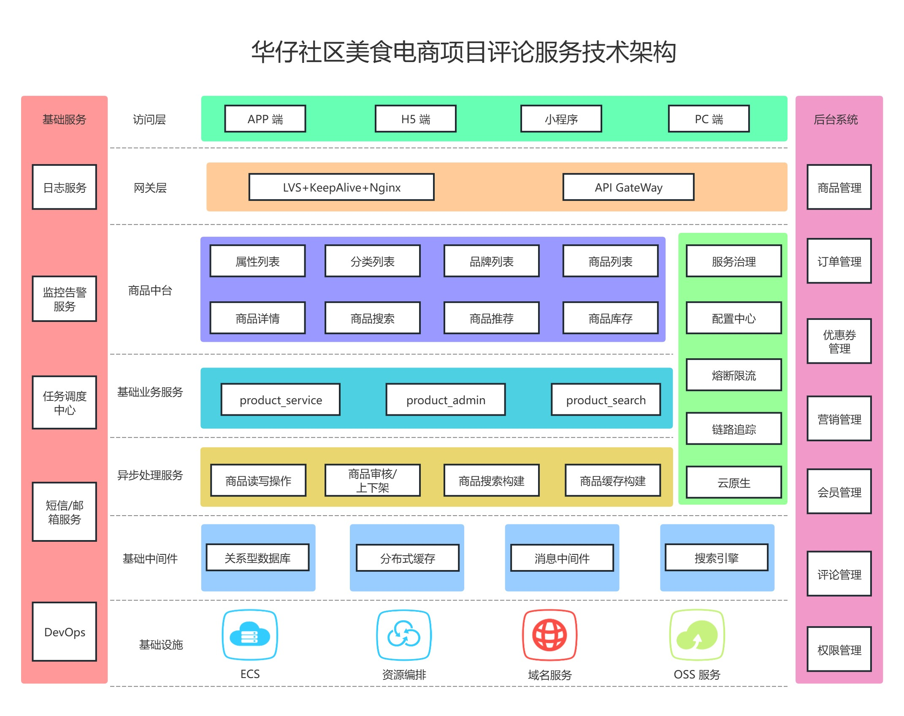

这里的重点服务是： 「**商品搜索架构设计**」、「**商品详情页架构设计**」、「**商品缓存构建架构设计**」、「**商品推荐架构设计**」。另外关于「**商品库存的架构设计**」会放到下单时进行剖析。

##   
**3.1 商品搜索架构设计**

关于「**商品搜索**」，这里我们选用「**ElasticSearch**」作为底层搜索引擎，通过「**Canel**」同步组件监听 「**binlog**」来实现数据库到 ES 的商品数据同步，另外我也会带大家从零到一进行「**百万商品搜索 ES 构建及性能优化**」的全过程。

这里先来看一下整个搜索业务的流程图，如下：

  
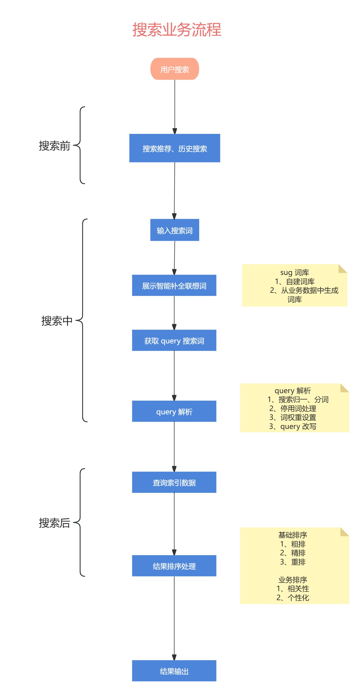

「**索引构建**」主要是把「**原始商品信息**」变成一个「**倒排索引**」的过程，整个过程最关键包括：需要索引什么数据、数据分词、构建倒排索引。 因为底层使用的是 ES，所以最后构建倒排索引这个环节我们忽略，基本 ES 把整个环节过程解决了。

整个数据进入 ES 索引库中，总体的数据索引构建的架构图如下：

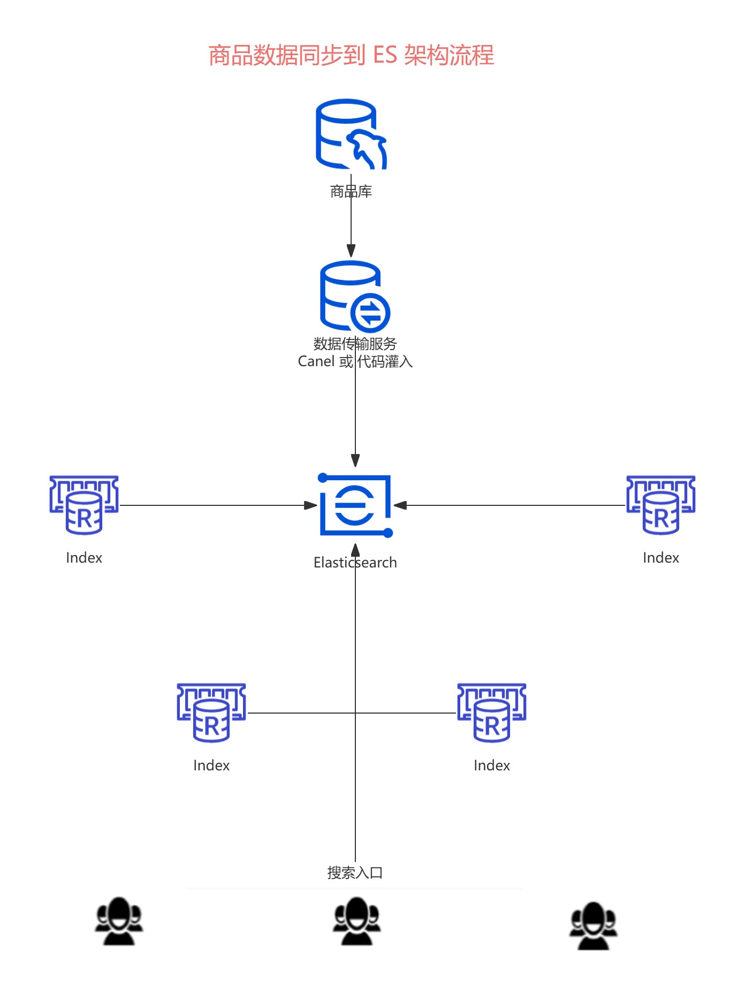

## **3.2 商品详情页架构设计**

这里「**商品详情页架构设计**」会参考京东亿级流量商品详情页架构设计方案来实现类似的架构解决方案。

先来看下京东的商品详情页是什么？

「**商品详情页**」是展示商品详细信息的一个页面，承载在网站的大部分流量和订单的入口。京东商城目前有通用版、全球购、闪购、易车、惠买车、服装、拼购、今日抄底等许多套模板。各套模板的元数据是一样的，只是展示方式不一样。目前商品详情页个性化需求非常多，数据来源也是非常多的，而且许多基础服务做不了的都放我们这，因此我们需要一种架构能快速响应和优雅的解决这些需求问题。

因此我们重新设计了「**商品详情页架构**」，主要包括三部分：「**商品详情页系统**」、「**商品详情页统一服务系统**」和「**商品详情页动态服务系统**」。

1.  商品详情页系统负责静态页面的部分。
2.  统一服务负责动态变更的部分。
3.  动态服务负责给内网其他系统提供一些数据服务。

### **3.2.1 商品详情页前端结构**

先来看下前端结构，如下图所示：

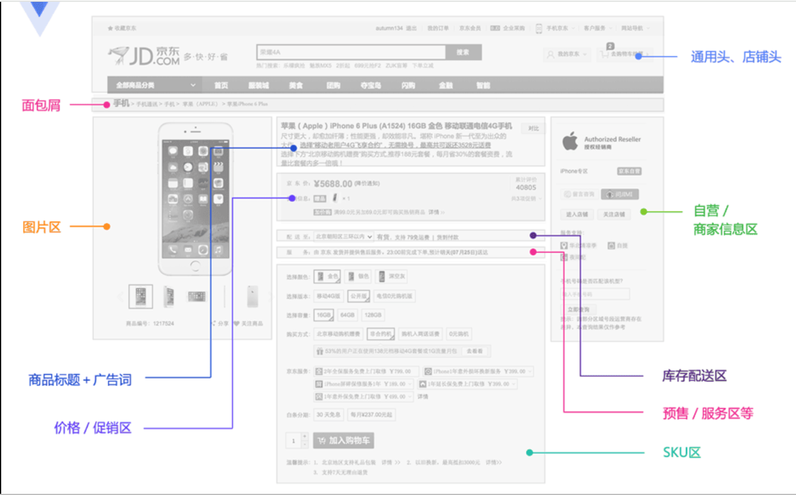

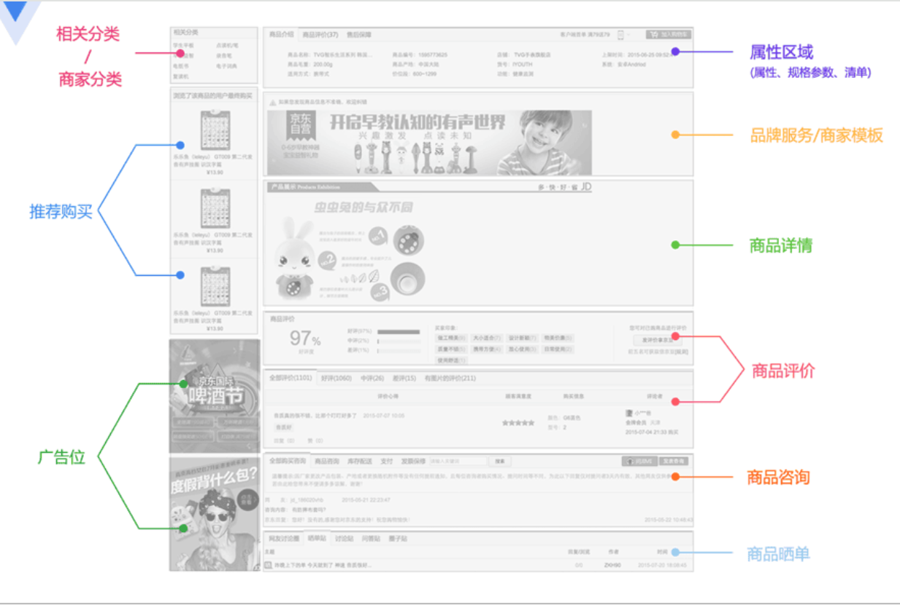

京东商城还有一些特殊维度数据：比如套装、手机合约机等，这些数据是主商品数据外挂的。

###   
**3.2.2 京东商品详情页架构 3.0**

这里我们直接参考其架构的 3.0 版本，来看看要解决的问题：

1.  能迅速响瞬变的需求，和各种变态需求；
2.  支持各种垂直化页面改版；
3.  页面模块化；
4.  AB测试；
5.  高性能、水平扩容；
6.  多机房多活、异地多活。

  
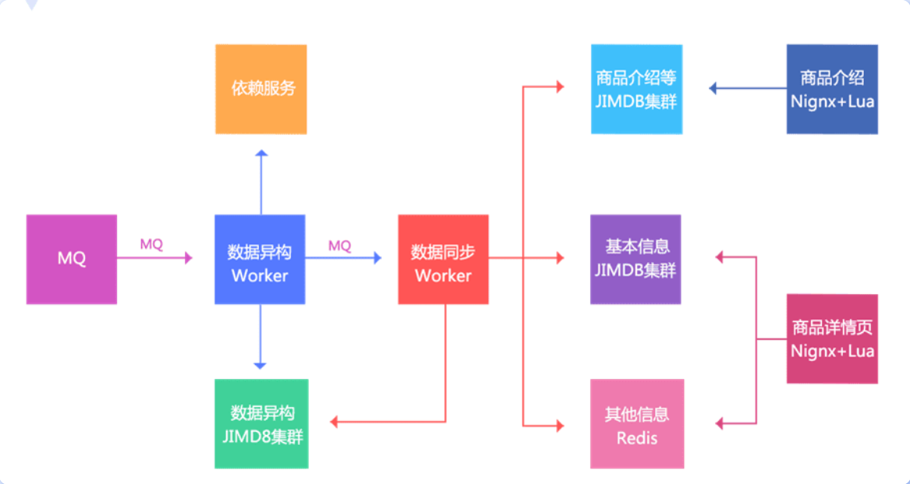

主要实现思路：

1.  数据变更还是通过 MQ 通知。
2.  数据异构 Worker 得到通知，然后按照一些维度进行数据存储，存储到数据异构 JIMDB 集群（JIMDB：Redis+持久化引擎），存储的数据都是未加工的原子化数据，如商品基本信息、商品扩展属性、商品其他一些相关信息、商品规格参数、分类、商家信息等。
3.  数据异构 Worker 存储成功后，会发送一个 MQ 给数据同步 Worker，数据同步 Worker 也可以叫做数据聚合 Worker，按照相应的维度聚合数据存储到相应的 JIMDB 集群；三个维度：基本信息（基本信息+扩展属性等的一个聚合）、商品介绍（PC版、移动版）、其他信息（分类、商家等维度，数据量小，直接 Redis 存储）。
4.  前端展示分为两个：商品详情页和商品介绍，使用 Nginx+Lua 技术获取数据并渲染模板输出。

另外我们目前架构的目标不仅仅是为商品详情页提供数据，只要是 Key-Value 获取的而非关系的我们都可以提供服务，我们叫做「**动态服务系统**」。

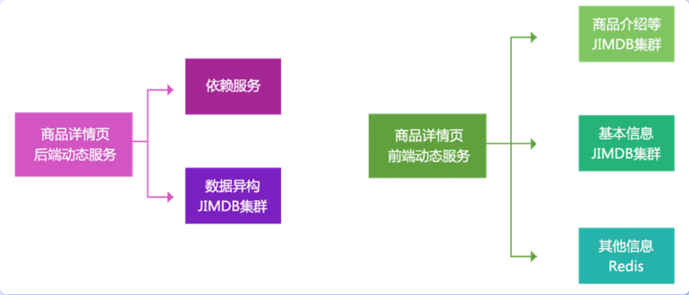

该动态服务分为前端和后端，即公网还是内网，如目前该动态服务为列表页、商品对比、微信单品页、总代等提供相应的数据来满足和支持其业务。

###   
**3.2.3 商品详情页架构设计原则**

1.  数据闭环
2.  拆分系统
3.  Worker无状态化+任务化
4.  异步化+并发化
5.  多级缓存化
6.  动态化
7.  弹性化
8.  降级开关
9.  多机房多活

### **3.2.3.1 数据闭环**

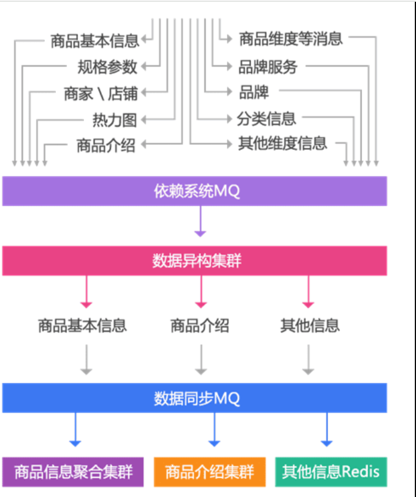

1.  数据闭环即数据的自我管理，或者说是数据都在自己系统里维护，不依赖于任何其他系统，去依赖化；这样得到的好处就是别人抖动跟我没关系。
2.  数据异构，是数据闭环的第一步，将各个依赖系统的数据拿过来，按照自己的要求存储起来；
3.  数据原子化，数据异构的数据是原子化数据，这样未来我们可以对这些数据再加工再处理而响应变化的需求；
4.  数据聚合，将多个原子数据聚合为一个大 JSON 数据，这样前端展示只需要一次get，当然要考虑系统架构，比如我们使用的Redis改造，Redis又是单线程系统，我们需要部署更多的 Redis 来支持更高的并发，另外存储的值要尽可能的小；
5.  数据存储，我们使用 JIMDB，Redis 加持久化存储引擎，可以存储超过内存N倍的数据量，我们目前一些系统是Redis+LMDB 引擎的存储，目前是配合 SSD 进行存储；另外我们使用 Hash Tag 机制把相关的数据哈希到同一个分片，这样mget 时不需要跨分片合并。

我们目前的异构数据时键值结构的，用于按照商品维度查询，还有一套异构时关系结构的用于关系查询使用。

详情页架构设计原则 / 数据维度化

对于数据应该按照维度和作用进行维度化，这样可以分离存储，进行更有效的存储和使用。我们数据的维度比较简单：

1.  商品基本信息，标题、扩展属性、特殊属性、图片、颜色尺码、规格参数等；
2.  商品介绍信息，商品维度商家模板、商品介绍等；
3.  非商品维度其他信息，分类信息、商家信息、店铺信息、店铺头、品牌信息等；
4.  商品维度其他信息（异步加载），价格、促销、配送至、广告词、推荐配件、最佳组合等。

### **3.2.3.2 拆分系统**

将系统拆分为多个子系统虽然增加了复杂性，但是可以得到更多的好处，比如「**数据异构系统**」存储的数据是「**原子化数据**」，这样可以按照一些维度对外提供服务；而数据同步系统存储的是聚合数据，可以为前端展示提供高性能的读取。而前端展示系统分离为商品详情页和商品介绍，可以减少相互影响；目前商品介绍系统还提供其他的一些服务，比如全站异步页脚服务。

  
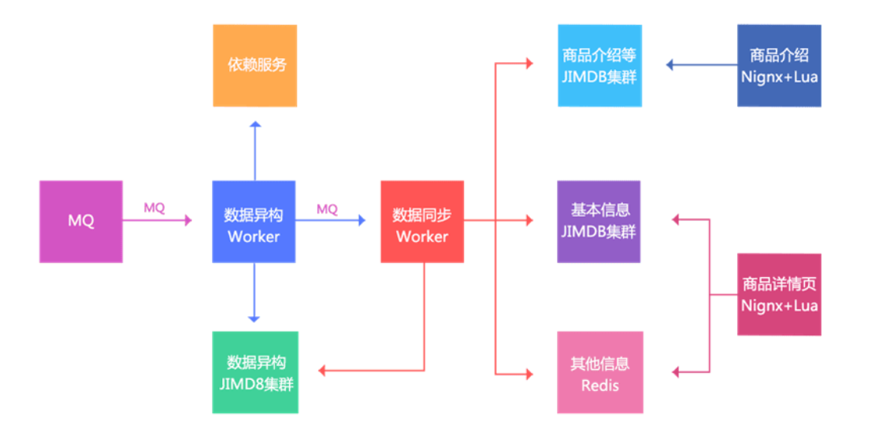

### **3.2.3.3 Work 无状态化 + 任务化**

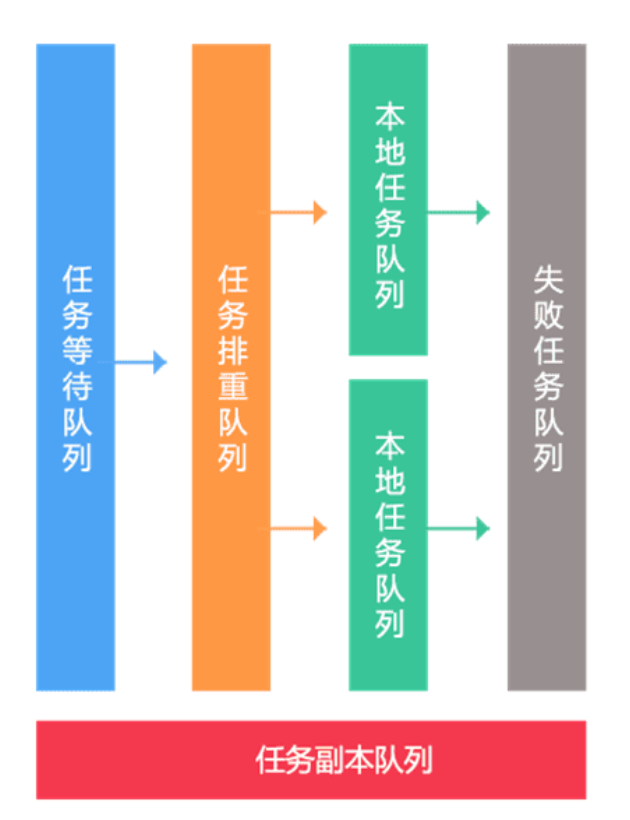

1.  数据异构和数据同步Worker无状态化设计，这样可以水平扩展；
2.  应用虽然是无状态化的，但是配置文件还是有状态的，每个机房一套配置，这样每个机房只读取当前机房数据；
3.  任务多队列化，等待队列、排重队列、本地执行队列、失败队列；
4.  队列优先级化，分为：普通队列、刷数据队列、高优先级队列；例如一些秒杀商品会走高优先级队列保证快速执行；
5.  副本队列，当上线后业务出现问题时，修正逻辑可以回放，从而修复数据；可以按照比如固定大小队列或者小时队列设计；
6.  在设计消息时，按照维度更新，比如商品信息变更和商品上下架分离，减少每次变更接口的调用量，通过聚合Worker去做聚合。

###   
**3.2.3.4 异步化 + 并发化**

我们系统大量使用异步化，通过异步化机制提升并发能力。

首先我们使用了「**消息异步化**」进行系统解耦合，通过消息通知变更，然后我再调用相应接口获取相关数据；之前老系统使用同步推送机制，这种方式系统是紧耦合的，出问题需要联系各个负责人重新推送还要考虑失败重试机制。

数据更新异步化 ，更新缓存时，同步调用服务，然后异步更新缓存。可「**并行任务**」并发化， 商品数据系统来源有多处，但是可以并发调用聚合，这样本来串行需要 1s 的经过这种方式我们提升到 300ms 之内。「**异步请求合并**」，异步请求做合并，然后一次请求调用就能拿到所有数据。前端服务异步化/聚合，实时价格、实时库存异步化， 使用如线程或协程机制将多个可并发的服务聚合。

异步化还一个好处就是可以对异步请求做合并，原来N次调用可以合并为一次，还可以做请求的排重。

###   
**3.2.3.5 多级缓存**

1.  浏览器缓存，当页面之间来回跳转时走 local cache，或者打开页面时拿着 Last-Modified 去 CDN 验证是否过期，减少来回传输的数据量。
2.  CDN 缓存，用户去离自己最近的 CDN 节点拿数据，而不是都回源到北京机房获取数据，提升访问性能。
3.  服务端应用本地缓存，我们使用 Nginx+Lua 架构，使用 HttpLuaModule 模块的 shared dict 做本地缓存（ reload不丢失）或内存级 Proxy Cache，从而减少带宽。
4.  另外我们还使用使用一致性哈希（如商品编号/分类）做负载均衡内部对URL重写提升命中率。
5.  我们对 mget 做了优化，如去商品其他维度数据，分类、面包屑、商家等差不多8个维度数据，如果每次mget获取性能差而且数据量很大，30KB以上；而这些数据缓存半小时也是没有问题的，因此我们设计为先读 local cache，然后把不命中的再回源到 remote cache 获取，这个优化减少了一半以上的 remote cache 流量。
6.  服务端分布式缓存，我们使用内存+SSD+JIMDB持久化存储。

### **3.2.3.6 动态化**

数据获取动态化，商品详情页：按维度获取数据，商品基本数据、其他数据（分类、商家信息等）；而且可以根据数据属性，按需做逻辑，比如虚拟商品需要自己定制的详情页，那么我们就可以跳转走，比如全球购的需要走jd.hk域名，那么也是没有问题的。

模板渲染实时化，支持随时变更模板需求。

重启应用秒级化，使用Nginx+Lua架构，重启速度快，重启不丢共享字典缓存数据。

需求上线速度化，因为我们使用了Nginx+Lua架构，可以快速上线和重启应用，不会产生抖动；另外Lua本身是一种脚本语言，我们也在尝试把代码如何版本化存储，直接内部驱动Lua代码更新上线而不需要重启Nginx。

### **3.2.3.7 弹性化**

我们所有应用业务都接入了 Docker容器，存储还是物理机；我们会制作一些基础镜像，把需要的软件打成镜像，这样不用每次去运维那安装部署软件了；未来可以支持自动扩容，比如按照CPU或带宽自动扩容机器，目前京东一些业务支持一分钟自动扩容。

###   
**3.2.3.8 降级开关**

推送服务器推送降级开关，开关集中化维护，然后通过推送机制推送到各个服务器；

可降级的多级读服务，前端数据集群--->数据异构集群--->动态服务(调用依赖系统)；这样可以保证服务质量，假设前端数据集群坏了一个 磁盘，还可以回源到数据异构集群获取数据；

开关前置化，如Nginx--àTomcat，在Nginx上做开关，请求就到不了后端，减少后端压力；

我们可以把处理过程分解为一个个的事件。通过这种将请求划分为事件方式我们可以进行更多的控制。如，我们可以为不同的业务再建立不同的线程池进行控制：即我们只依赖tomcat线程池进行请求的解析，对于请求的处理我们交给我们自己的线程池去完成；这样tomcat线程池就不是我们的瓶颈，造成现在无法优化的状况。通过使用这种异步化事件模型，我们可以提高整体的吞吐量，不让慢速的A业务处理影响到其他业务处理。慢的还是慢，但是不影响其他的业务。我们通过这种机制还可以把tomcat线程池的监控拿出来，出问题时可以直接清空业务线程池，另外还可以自定义任务队列来支持一些特殊的业务。

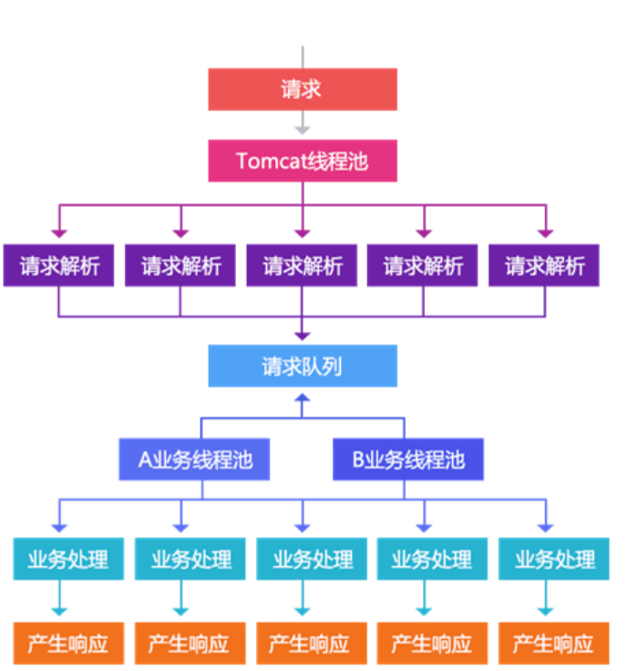

### **3.2.3.9 多机房多活**

应用无状态，通过在配置文件中配置各自机房的数据集群来完成数据读取。

  
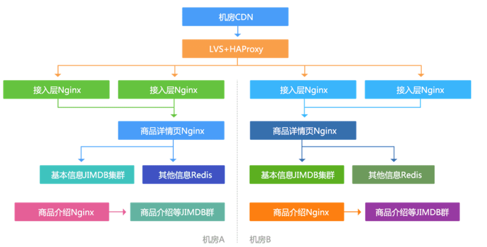

数据集群采用一主三从结构，防止当一个机房挂了，另一个机房压力大产生抖动。

  
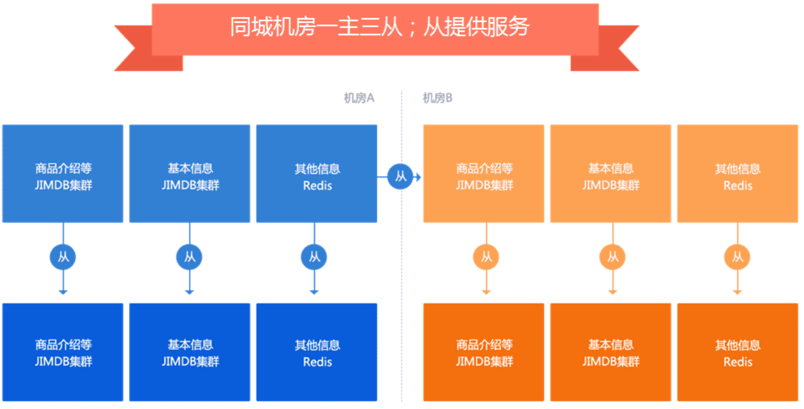

以上就是「**京东亿级流量商品详情页的架构设计方案**」，在后面我们会基于它的这个方案开发一套类似的架构方案。

## **3.3 商品缓存构建架构设计**  

这里的「**商品缓存**」主要包括「**商品列表**」及 「**商品详情页**」的缓存构建架构设计。

我们主要采用「**多级缓存**」架构方案来实现「**商品列表**」及 「**商品详情页**」的缓存构建，具体等后续篇章进行深度拆解，此处就不展开了。

##   
**3.4 商品推荐架构设计**

推荐系统本质上还是解决信息过载的问题，帮助用户找到他们感兴趣的物品，深度挖掘用户潜在的兴趣。

其实推荐系统的核心流程只有 「**召回**」、「**排序**」、 「**重排**」，其架构图如下：

  
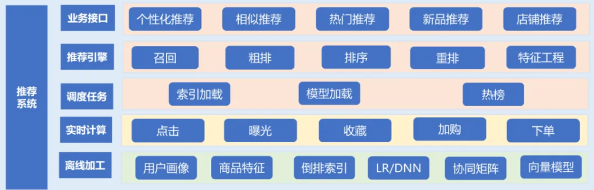

其请求流程如下：

1.  当一个用户打开页面，这时前端会携带用户信息（uuid等）去请求后台接口。
2.  当后台收到请求后一般会先根据用户标识进行分流获取相关策略配置（ab策略），这些策略去决定接下来会调用召回模块、排序模块以及重排模块的哪个接口。
3.  一般召回模块分多路召回，每路召回负责召回多个商品，排序和重排负责调整这些商品的顺序。
4.  最后挑选出合适的商品并进行价格、图片等相关信息补充展现给用户。
5.  用户会根据自己是否感兴趣选择点击或者不点击，这些涉及用户的行为会通过日志上报到数据平台，为之后效果分析和利用用户行为推荐商品奠定基础。

  
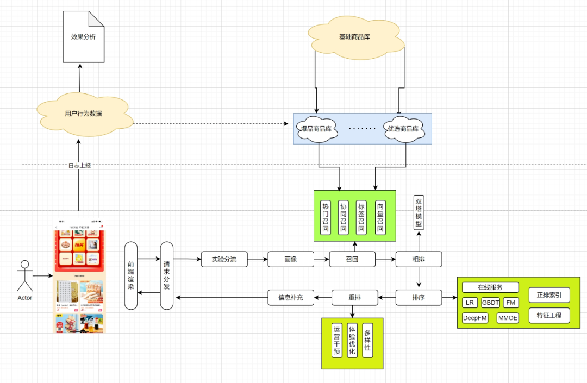

（图片来自网络）

###   
**3.4.1 漏斗分层架构**

为什么要采取召回、排序、重排这种漏斗分层架构？

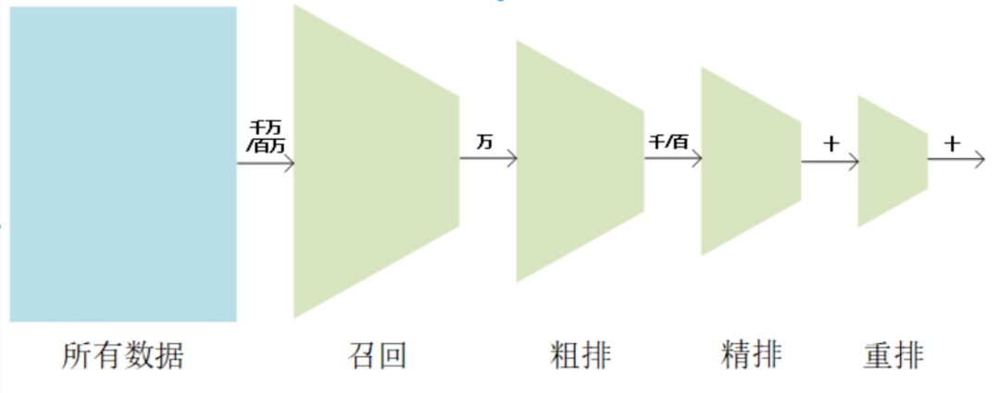

### **3.4.1.1 性能方面**

目标是从百万级的商品库筛选出用户感兴趣的个位数级别的商品。复杂的排序模型线上推断耗时严重，需要严格控制进入排序模型的商品数量。  

###   
**3.4.1.2 目标方面**

召回模块：召回模块的任务是快速从大量的物品中筛选出一部分候选物品，目的是不要漏掉用户可能会喜欢的物品。召回模块通常采用多路召回，使用一些简化的特征或模型。

排序模块：排序模块的任务是精准排序，根据用户的历史行为、兴趣、偏好等信息，对召回模块筛选出的候选物品进行排序。排序模块通常使用一些复杂的模型。

重排模块：重排模块的任务是对排序模块的结果进行二次排序或调整，以进一步提高推荐的准确性和个性化程度。重排模块通常使用一些简单而有效的算法。

关于「**推荐系统**」的算法细节这里就不展开了，后续我们会通过「**mahout 推荐引擎**」实现一个简单的商品推荐服务。