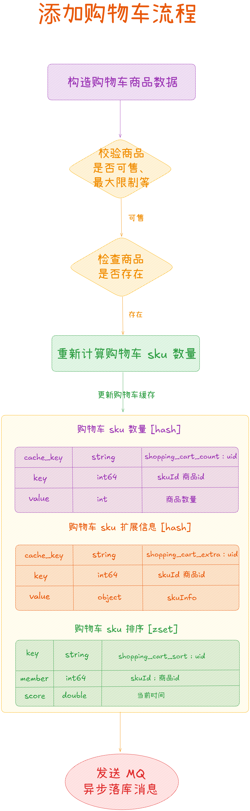
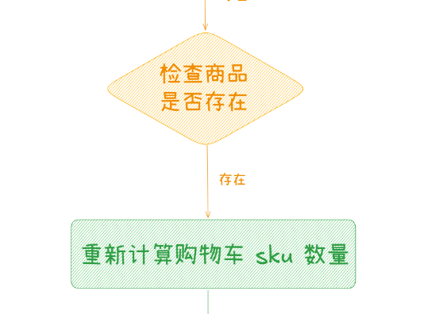
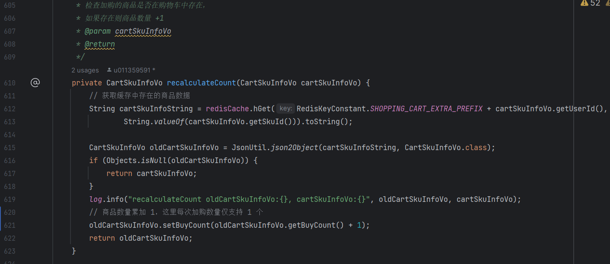
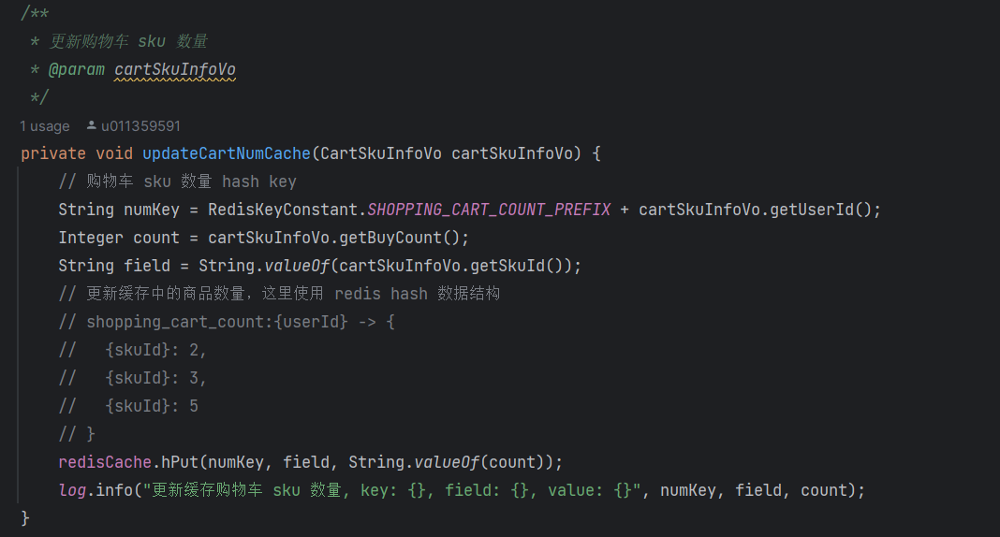
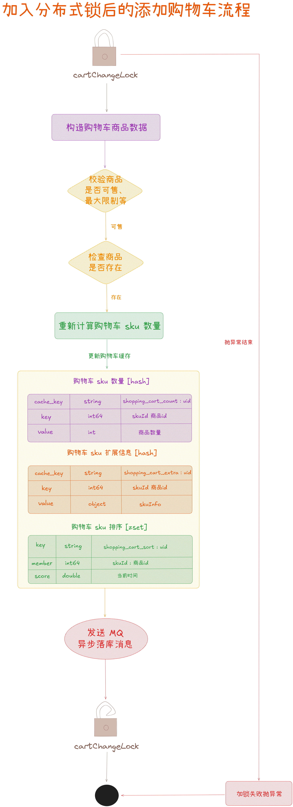
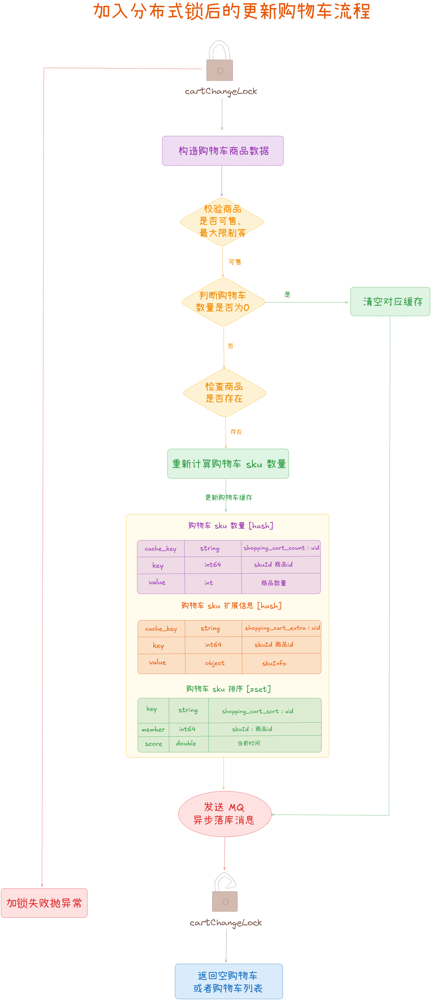

从今天之后的一段时间内，华仔会带着大家一起从零开始搭建并研发一套高并发的电商实战项目，这里会涉及到很多互联网大厂开发过程中所使用的核心技术和架构设计模式，希望大家学完之后可以用到自己的简历中。

接下来我们会重点架构设计和开发一下我们高并发电商实战项目中的「**购物车服务**」。

这是第三十四篇，本篇我们继续进行电商实战项目设计与开发，本篇对「**购物车服务**」中并发场景下加购问题解决。

文章汇总位置：[https://wx.zsxq.com/dweb2/index/columns/51122554151214](https://wx.zsxq.com/dweb2/index/columns/51122554151214)

源码授权与获取地址：[https://articles.zsxq.com/id\_1s85grnaae4p.html](https://articles.zsxq.com/id_1s85grnaae4p.html)

本章源码地址：[https://gitcode.net/u011359591/huazai-ecshop/-/tree/ecshop-chapter-33](https://gitcode.net/u011359591/huazai-ecshop/-/tree/ecshop-chapter-33)

## **01 前言**

终于要设计与研发电商项目代码了，今天我们主要对「**购物车服务**」并发场景下加购问题解决。

这里需要注意下，我们整个项目目前是不提供前端的，这个后续有时间在搞，主要是进行后端接口以及微服务模块架构设计。

## **02 并发加购问题梳理**

在 [【电商实战项目第三十三篇】华仔电商实战项目购物车服务基于 RocketMQ + Redis 基础功能架构设计与实现](https://articles.zsxq.com/id_dl6vs5gjl80e.html) 上篇中，我已经对「**购物车服务**」的基础功能进行了架构设计与功能实现。

今天我们来梳理下，在「**高并发场景**」下，「**加入购物车**」及 「**更新购物车**」时是否会有问题。

这里以「**加入购物车**」为例，再来回顾下整个加购处理逻辑，流程图如下：

  

从上图得知，对于「**第一次加入购物车**」是没有问题的，直接更新缓存以及发送 MQ 异步落库即可。但是对于「**后续加购**」操作，如果「**并发场景下**」，某用户哐哐哐使劲点的话，就会在下面这步中进行计算。

  

对应代码如下：

这里最容易出现问题的就是在「**第 621 行代码**」，举例：

假如一个用户「**同时连续点击**」了 3 次要加入同一个商品， 此时会有「**3 个线程**」同时并发操作，这「**3 个线程**」会同时把当前用户的这个商品的「**缓存数据**」读取出来，此时「**缓存**」中的购买数量都是 1。这「**3 个线程**」同时执行到 「**第 621 行代码**」时，就会进行「**购买数量 + 1**」操作，就会造成同一个结果：「**购买数量 = 2**」，正常情况下应该 「**购买数量 = 4**」才对。

所以最终写入 Redis 缓存购物车数量为：「**购买数量 = 2**」，并不是预期的效果。

  

## **03 高并发加购解决方案**

既然有这样的问题，我们该如何解决呢？

想必大家看到这里，心里已经有答案了，bingo，就是「**分布式锁**」，关于它的实战在前面已经剖析过多次：

  
[【电商实战项目第十四篇】华仔电商实战项目用户微服务模块高并发场景下用户缓存架构演进设计与开发](https://articles.zsxq.com/id_h24gcw75o028.html)

[【电商实战项目第十七篇】华仔电商实战项目美食微服务模块高并发场景下美食缓存架构演进设计与开发](https://articles.zsxq.com/id_w8tdll3cj1kb.html)

这里就不过多分析了，对于「**并发场景下加购操作/改购操作**」，这里我们将「**锁粒度**」进行细化，使其更加轻量级。

##   
**3.1 添加购物车**

基于分布式锁后的处理流程如下图所示：

/\*\*

\* 购物车数据变更分布式锁

\*/

public static final String CART\_CHANGE\_LOCK\_KEY \= "CART\_CHANGE\_LOCK\_KEY:";

/\*\*

\* 添加购物车

\* @param cartEntity

\*/

@Transactional(rollbackFor = Exception.class)

@Override

public void addCart(CartEntity cartEntity) {

// 对当前用户加购的某个 sku 商品进行加锁，即同一个商品只能并发操作一次

String cartChangeLockKey \= RedisKeyConstant.CART\_CHANGE\_LOCK\_KEY + cartEntity.getUserId() + ":" + cartEntity.getSkuId();

// 这里使用阻塞加锁方式防止多次并发点击

boolean locked \= redisLock.blockedLock(cartChangeLockKey);

if (!locked) {

// 加购失败，请不要频繁操作哦

throw new BizException(BizCodes.CART\_SKU\_CHANGE\_LOCK\_FAIL);

}

try {

// 1、构造购物车商品数据

CartSkuInfoVo cartSkuInfoVo \= buildCartSkuInfo(cartEntity);

// 2、校验商品是否可售: 库存、上下架状态 TODO 等商品服务构建后完善

// 购物车是否达到最大限制等

checkSellable(cartSkuInfoVo);

// 3、检查商品是否已经存在

if (checkCartSkuExist(cartSkuInfoVo)) {

// 重新计算购物车 sku 数量

cartSkuInfoVo = recalculateCount(cartSkuInfoVo);

}

// 4、更新购物车 Redis 缓存

updateCartCache(cartSkuInfoVo);

// 5、发送更新消息到 MQ

sendAsyncUpdateMessage(cartSkuInfoVo);

} finally {

redisLock.unlock(cartChangeLockKey);

}

}

## **3.2 修改购物车**

同样，基于分布式锁后的处理流程如下图所示：

/\*\*

\* 购物车数据变更分布式锁

\*/

public static final String CART\_CHANGE\_LOCK\_KEY \= "CART\_CHANGE\_LOCK\_KEY:";

/\*\*

\* 更新购物车

\* @param cartEntity

\* @return

\*/

@Override

public CartListVo updateCart(CartEntity cartEntity) {

// 对当前用户加购的某个 sku 商品进行加锁，即同一个商品只能并发操作一次

String cartChangeLockKey \= RedisKeyConstant.CART\_CHANGE\_LOCK\_KEY + cartEntity.getUserId() + ":" + cartEntity.getSkuId();

boolean locked \= redisLock.blockedLock(cartChangeLockKey);

if (!locked) {

// 加购失败，请不要频繁操作哦

throw new BizException(BizCodes.CART\_SKU\_CHANGE\_LOCK\_FAIL);

}

try {

// 1、构造购物车商品数据

CartSkuInfoVo cartSkuInfoVo \= buildCartSkuInfo(cartEntity);

// 2、校验商品是否可售: 库存、上下架状态 TODO 等商品服务构建后完善

// 购物车是否达到最大限制等

checkSellable(cartSkuInfoVo);

// 如果购物车加购数量为 0 需要清理缓存 + 数据库

if (cartEntity.getBuyCount() == 0) {

// 删除商品缓存

clearCartCache(cartSkuInfoVo);

// 发送更新消息到 MQ

sendAsyncUpdateMessage(cartSkuInfoVo);

// 返回空数据

return CartListVo.builder().build();

}

// 3、检查商品是否已经存在

if (checkCartSkuExist(cartSkuInfoVo)) {

// 重新计算购物车 sku 数量

cartSkuInfoVo = recalculateCount(cartSkuInfoVo);

}

// 4、更新购物车 Redis 缓存

updateCartCache(cartSkuInfoVo);

// 5、发送更新消息到 MQ

sendAsyncUpdateMessage(cartSkuInfoVo);

} finally {

redisLock.unlock(cartChangeLockKey);

}

// 6、返回购物车列表

return queryCart();

}