从今天之后的一段时间内，华仔会带着大家一起从零开始搭建并研发一套高并发的电商实战项目，这里会涉及到很多互联网大厂开发过程中所使用的核心技术和架构设计模式，希望大家学完之后可以用到自己的简历中。

接下来我们会重点架构设计和开发一下「**社交系统**」中的重要服务：「**关注服务**」、「**计数服务**」、「**评论服务**」。

这是第三十篇，本篇我们继续进行电商实战项目设计与开发，本篇对「**评论服务**」基于 RocketMQ 顺序消息 + Redis Zset 功能实现。

文章汇总位置：[https://wx.zsxq.com/dweb2/index/columns/51122554151214](https://wx.zsxq.com/dweb2/index/columns/51122554151214)

源码授权与获取地址：[https://articles.zsxq.com/id\_1s85grnaae4p.html](https://articles.zsxq.com/id_1s85grnaae4p.html)

本章源码地址：[https://gitcode.net/u011359591/huazai-ecshop/-/tree/ecshop-chapter-30](https://gitcode.net/u011359591/huazai-ecshop/-/tree/ecshop-chapter-30)

## **01 前言**

终于要设计与研发电商项目代码了，今天我们主要对「**评论服务**」场景介绍与架构设计。

这里需要注意下，我们整个项目目前是不提供前端的，这个后续有时间在搞，主要是进行后端接口以及微服务模块架构设计。

## **02 评论服务审核架构设计**

[【电商实战项目第二十九篇】华仔电商实战项目评论服务基于RocketMQ顺序消息+Redis Zset架构设计与功能实现](https://articles.zsxq.com/id_8gdm2cxz8r80.html) 在这篇中，我们深度剖析了整个评论服务的架构设计，评论发布、点赞、计数等功能实现。

今天我们就来看下发布评论审核架构设计，评论从本质上来说是一种用户输出的内容，评论的意图和情感色彩注定其非常主观，所以评论也是一个需要「**审核介入**」的重要场景。

评论审核需要对涉及不合规的评论进行删除毛病对评论发布者进行封号处罚，这里我们来深度剖析下如何进行「**审核评论**」涉及。

##   
**2.1 评论审核方案**

这里我们讨论两种设计方案。

### **2.1.1 方案一: 机器审核**

对于评论机审来说，其主要手段是使用自然语言处理技术对评论文本内容进行「**关键词**」分析，然后使用机器学习技术对评论进行类别判断，将识别出的不合规的评论进行删除。

机器审核的话一般都会「**关键词**」进行敏感过滤，比如说 cnm，sb 等等词汇。

  

这里我们主要会开发「**敏感词匹配**」功能，该功能依托于「**模式匹配**」算法。「**敏感词匹配**」功能可以迅速地匹配文本中的敏感词汇，算法平均耗时为 50~100 ms，因其简单、快速、直接、灵活的特点，成为了审核人员对抗垃圾文本的利器。然而身处信息爆炸时代的网民们非常“优秀”，他们源源不断的发明各种新词、谐音词来绕过敏感词检测。

例如某些用户会使用“啋票”、“采漂”等词汇来规避敏感词“彩票”，其中“啋票”不仅是谐音词，还包含多音字，常规的模式匹配算法很难保证完全命中。这不仅给运营规则带来挑战，也对匹配算法的精准度、漏杀率提出了要求。

模式匹配的定义是，给定⼀个子串，在某个字符串中找出与该子串相同的所有子串。其中给定的子串被称为「**模式串**」，被匹配的字符串被称为「**目标串**」。基于多个模式串进行匹配的算法被称为「**多模式匹配**」算法，目前成熟的多模式匹配算法有「**AC 自动机**」和「**WM**」。

### **多模式匹配算法对比**

  
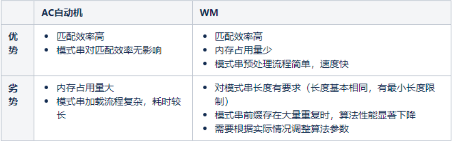

WM 算法对模式串的长度和前缀存在一定的要求，可能会影响业务的使用。虽然 AC 自动机加载耗时长，内存占用大，但敏感词加载并不频繁，且服务器内存资源充足，所以这里我们会选用 AC 自动机作为底层算法来剖析。

### **2.1.2 方案二: 人工审核**

人工审核就很直接了，就是由审核人员进行评论阅读，主观判断是否要删除评论。但是考虑到互联网应用的「**海量用户**」每天会产生千万级的评论数据，审核人员要处理这么多数据必然是不现实的。

所以人工审核是需要时机的，大概如下：

1.  粉丝量超过 1万的热门用户在发布评论时，由于其自带与i顶的传播力、影响力。所以需要先送审再发布。
2.  关键词召回：审核人员可以在运营后台根据关键词搜索出相关的评论数据，然后进行审核。比如一些平台限制的敏感词等。
3.  热门召回：如果某条评论的「**曝光量**」、「**点赞量**」、「**收藏量**」、「**评论量**」等达到一定量级，比如 300~1000次，说明此时评论已经对较多用户产生了影响，所以需要送审的。
4.  比如：客户端可以定期上报每条评论被曝光的次数，然后服务端来做流式数据汇总，当某条评论的曝光量达到预设的阈值时，然后将其放入人工审核队列中，流程图如下：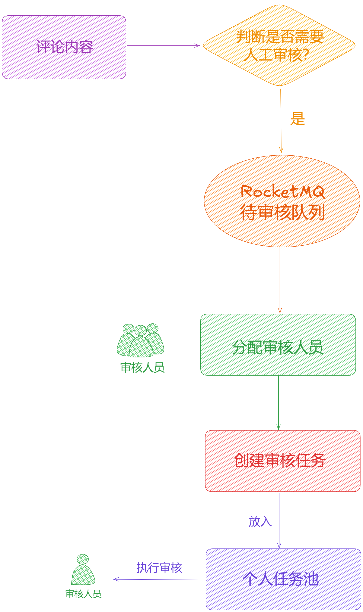
5.  举报召回：被举报的评论很大可能时不合规的评论，比如最近一段时间被举报超过100次，最近发布的评论被审核拒绝过10次的内容，会被人工审核。服务端需要监听评论举报事件，将对应的评论同样放入人工审核队列中。

所以，如果机审无法得到高置信度的结果，则需要人工介入进行二次审核并得出最终结论。

## **2.2 评论审核架构设计与处理流程**

接下来，我们来看下「**审核中心**」的交互流程。

评论发布服务需要将评论内容发送到「**审核中心**」,「**审核中心**」需要将内容的审核结果返回给评论发布服务，服务之间通过「**消息队列**」异步化来解耦处理。

整个处理流程如下：

1.  产生的新评论内容事件对应的消息队列主题命名为：[audit\_content\_event](http://audit_content_event/)，此时「**评论服务**」为生产者，「**审核中心**」为消费者。当评论内容满足审核条件时（比如：评论的播放量或者互动量达到阈值，热门用户发布、评论内容被举报投诉等），「**评论服务**」向 [audit\_content\_event](http://audit_content_event/) 消息队列发送消息，消息内容为 [comment\_id](http://comment_id%20/) 和 [comment\_context](http://comment_content/)、[version](http://version/)，用来告知「**审核中心**」需要审核某评论内容的某版本。
2.  「**审核中心**」在收到 [audit\_content\_event](http://audit_content_event/) 消息队列中的新消息后，根据 [comment\_id](http://comment_id/) 获取评论内容，排队等待审核。
3.  当人工审核或者机器审核评论完成后，会通过事件发送到 [audit\_result\_event](http://audit_result_event%20/) 消息队列中。此时「**审核中心**」为生产者，「**评论服务**」为消费者。消息内容为 [comment\_id](http://comment_id/) 和 [version](http://version/)、[audit\_result](http://audit_result/)、[reason](http://reason/)。
4.  「**评论服务**」收到 [audit\_result\_event](http://audit_result_event/) 消息队列中的消息后，然后根据审核结果进行后续逻辑处理。

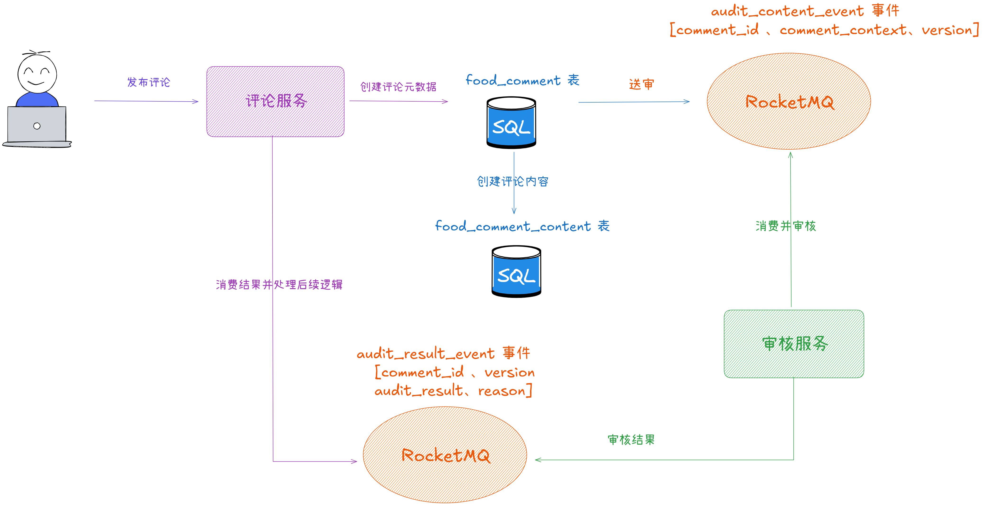

这两个 Topic 我们依然按照顺序消息的方式进行创建，如下：

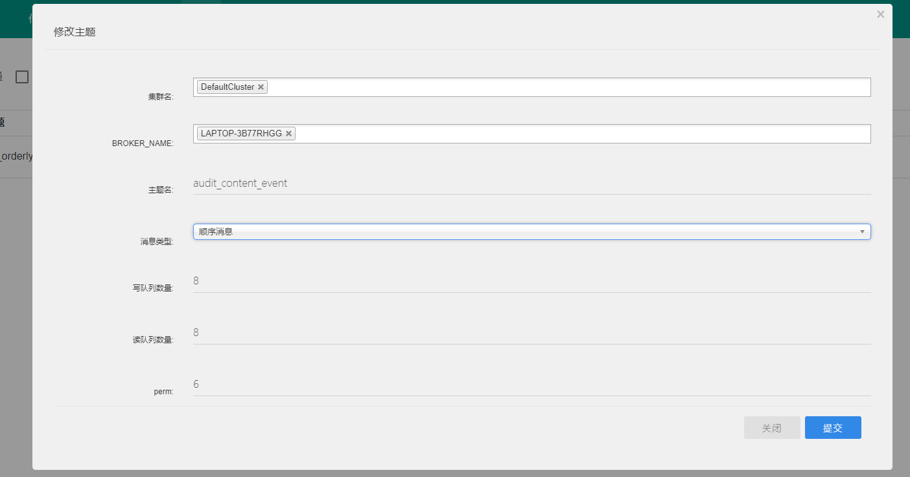

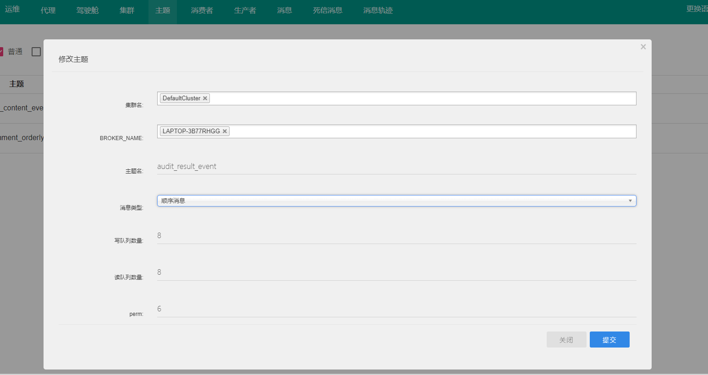

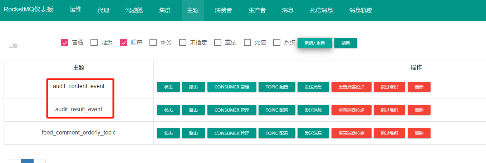

## **03 评论服务审核功能实现**

本文我们主要讨论「**机器审核**」中的「**敏感词匹配**」功能的算法选型以及实现。

##   
**3.1 敏感词匹配**

AC自动机算法（[Aho–Corasick](http://xn--ahocorasick-og3f/) 算法）是一种字符串搜索算法，主要依靠构造一个「**有限状态机**」（类似于在一个trie树中添加失配指针）来实现。可以同时将目标串与所有模式串进行匹配，算法均摊情况下具有近似于线性的时间复杂度。这些额外的失配指针允许在查找字符串失败时进行回退（例如 Trie 树的单词 cat 匹配失败，但是在Trie树中存在另一个单词 cart，失配指针就会指向前缀 ca），转向某前缀的其他分支，免于重复匹配前缀，提高算法效率。

AC自动机的匹配原理有两个核心概念：[Trie字典树](http://xn--trie-jv8fx63cw5u/)、[Fail 指针](http://xn--fail-o76hs84w/)。AC自动机算法启动时，需要将所有的模式串加载到内存中，构建成一个Trie字典树。

例如下图是以模式串集合 [{“she”, “he”, “shers”, “his”, “era”}](http://xn--{she,%20he,%20shers,%20his,%20era}-bh5uhagjhkhkii/) 构建的字典树，树中每个节点代表一个字符，从根节点到某一个节点的路径，即可表示一个模式串，且红色节点表示一个字符串的终结，例如图中最右边子树上的三个节点，可代表模式串“[era](http://era/)”。

从字典树的根节点出发，可以快速的查找到某个模式串。此外，拥有相同前缀的模式串会合并到同一个子树中，例如中间子树表示模式串“[he](http://he/)”、 “[his](http://his/)”，这两个字符串分别是“[h](http://h/)”节点的一个分支。「**AC 自动机**」在搜索这类字符串时，可以节省匹配的次数。

### **3.1.1 Tries 树构建**

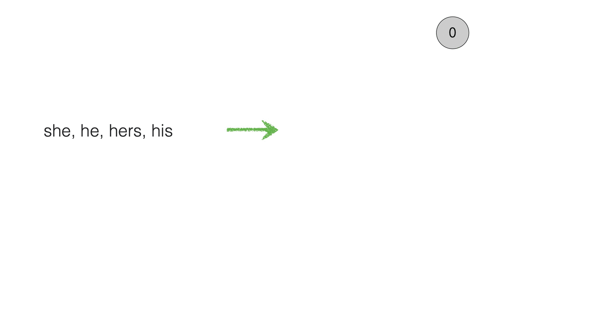

### **3.1.2 失配指针 fail**

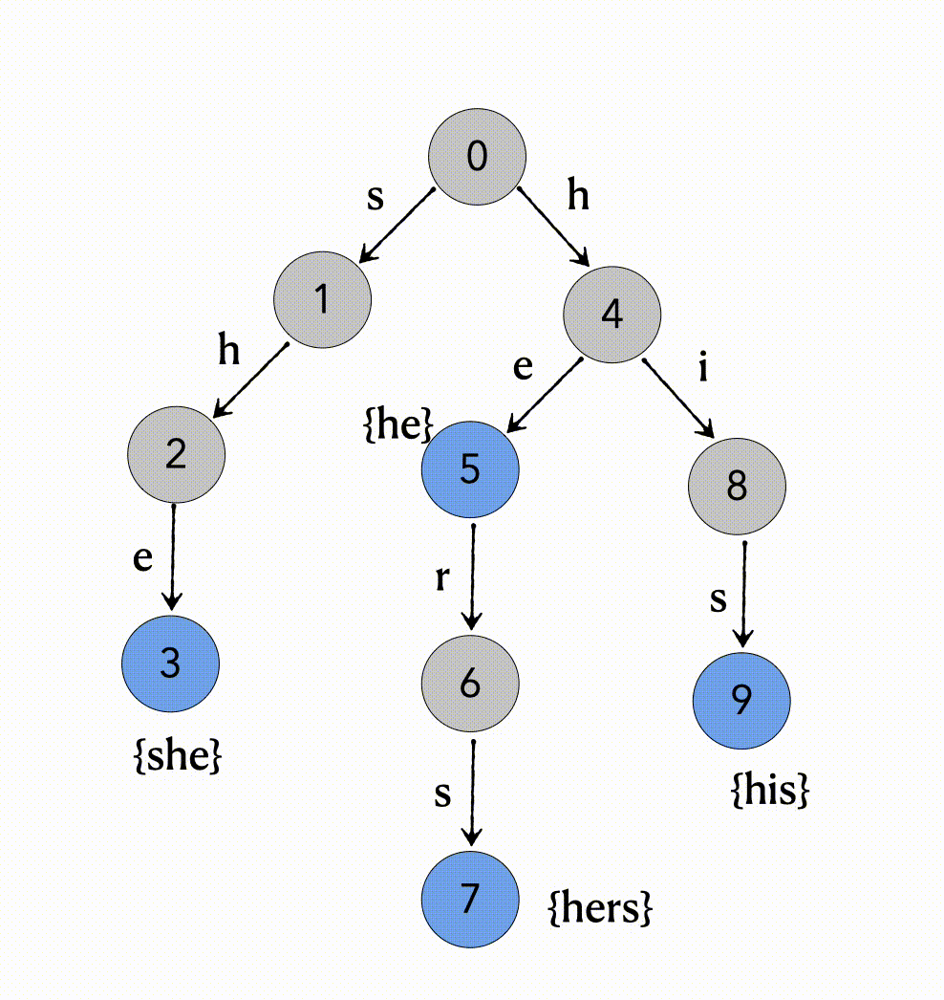

### **3.1.3 匹配过程**

AC自动机在 [Trie 树](http://xn--trie%20-lf7o/) 的基础上，为每个节点加入了 [Fail 指针](http://xn--fail-o76hs84w/)，上图使用虚线画出了部分节点的 [Fail指针](http://xn--fail-o76hs84w/)，未画出虚线的节点，其 [Fail指针](http://xn--fail-o76hs84w/) 指向根节点。算法在某个节点匹配失败时，可以通过该指针转移到其他包含相同前缀的分支上继续匹配。

例如匹配目标串“[shis](http://shis/)”时，对于前两个字符“[sh](http://sh/)”，[Trie 字典树](http://xn--trie%20-bn9kt74e582a/)匹配到左边字数的“[h](http://h/)”节点上，由于该节点的子节点是字符“[e](http://e/)”，与目标串的下一个字符“[i](http://i/)”不匹配，因此算法通过Fail指针转移到中间子树的“[h](http://h/)”节点上继续匹配，最终命中字符串“[his](http://his/)”。

上述的 [Trie字典树](http://xn--trie-jv8fx63cw5u/) 与 [Fail指针](http://xn--fail-o76hs84w/) 组成了「**AC 自动机**」的数据模型。AC自动机匹配目标串时，会按顺序从目标串中取出字符，从 [Trie 字典树](http://xn--trie%20-bn9kt74e582a/) 的根节点出发，在子结点中寻找与该字符匹配的结点，如果能找到则转移到该节点，否则转移到 [Fail 指针](http://xn--fail-o76hs84w/) 指向的节点。

当状态转移到图中的红色节点时，就是命中了一个模式串。下图展示了 AC 自动机对目标串“[ushers](http://ushers/)”进行匹配的过程。

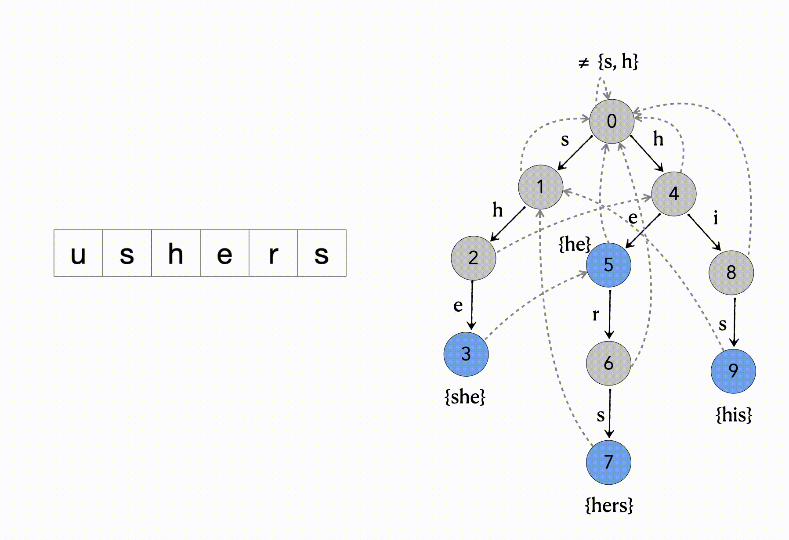

以模式串 [{she，he，hers，his}](http://{she,he,hers,his}/)，文本“[ushers](http://ushers/)”来简单的对匹配过程借助上图进行说明：

1.  输入字符 u 不等于{s，h}，则root结点不进行状态转移。
2.  输入字符 s，从root结点转移到状态1结点。
3.  输入字符 h，从状态 1 转移到状态 2。
4.  输入字符 e，从状态 2 转移到状态 3, 3 号结点是关键字结束结点，则匹配到模式串she。
5.  输入字符 r，状态 3 无法正常穿衣，则根据 fail 指针转移到状态 5,5 号结点是关键字结束结点，则匹配到模式串 he
6.  5 号结点处理输入的 r 之后，转移到状态 6 结点。
7.  输入字符 s，从状态 6 转移到状态 7,7 号节点是关键字结束结点，则匹配到模式串hers。
8.  文本输入结束，最终匹配到 she、he、hers。

## **3.2 案例介绍**

下面来介绍一下 vivo 公司开发的基于「**AC 自动机**」算法构建了一套敏感词匹配服务。

它时将敏感词作为模式串，文本内容作为目标串，可以实现常用的中、英文敏感词匹配。但是实际的业务有很多细分的场景，普通的 AC 自动机算法已不能满足业务使用需求，他们探索了「**组合敏感词匹配**」和「**拼音敏感词匹配**」两种匹配方式，下面分别介绍。

### **3.2.1 组合敏感词**

常规的敏感词匹配算法通常匹配单个词或者短句，但某些词单独出现时并不违规，只有在与几个特定的词同时出现时，才能判定为违规。例如“[澳门](http://xn--mix082f/)”、“[博彩](http://xn--9kro4z/)”、“[网站](http://xn--5tzm5g/)”，这几个词，单独出现都是没问题的，但是在这句话中：“[欢迎登录澳门XX博彩官方网站](http://xn--xx-c75cq62avyesdu50cn0kwkk75qvklh6msh6c53r/)”，就是违规的赌博广告。针对这样的场景，我们实现了“组合敏感词”匹配方案，运营人员可以将这几个词配置成一个组合“[澳门+博彩+网站](http://xn--++-b75cj17bwztnjp1lhyz2c/)”，只有这三个词同时出现时，敏感词服务才会判定这个组合命中。

组合敏感词的匹配算法依然基于「**AC 自动机**」算法。由于「**AC 自动机**」只能判断单个词的命中情况，因此我们将「**组合敏感词**」分割成「**单个敏感词**」，并维护各敏感词与组合间的映射关系，在「**AC 自动机**」算法运行结束后，只有某个组合对应的敏感词全部命中时，才能判断该组合敏感词命中。为此我们需要给「**AC 自动机**」添加一些前置和后置的处理步骤，具体步骤如下：

1.  将组合敏感词分割为单个敏感词，并记录敏感词与组合的映射关系。
2.  将分割后的组合敏感词添加到 AC 自动机的 Tire 树中。
3.  运行AC自动机，匹配文本。
4.  遍历匹配结果，将匹配的结果根据映射关系映射到相应的组合上。
5.  记录组合的命中情况，得到最终匹配结果。

  

假设目前存在组合敏感词“[澳门+博彩+网站](http://xn--++-b75cj17bwztnjp1lhyz2c/)”、“[博彩+广告](http://xn--+-9v8av2av21an7a/)”、“[华人圈+赌博](http://xn--+-my6a99lpbu70as32h/)”、“[赌博+广告](http://xn--+-9v8av2av21ar32d/)”，以及普通敏感词“[暴政](http://xn--5bv65a/)”，则在步骤1中，我们将组合敏感词分割为单个敏感词：“[澳门](http://xn--mix082f/)”、“[网站](http://xn--5tzm5g/)”、“[博彩](http://xn--9kro4z/)”、“[广告](http://xn--4rr70v/)”、“[赌博](http://xn--9kr716k/)”、“[华人圈](http://xn--gmq74i2vd/)”、“[暴政](http://xn--5bv65a/)”，并建立图中所示的映射关系。

将这些词添加到「**AC 自动机**」后，对文本“[欢迎登录澳门XX博彩官方网站](http://xn--xx-c75cq62avyesdu50cn0kwkk75qvklh6msh6c53r/)”进行匹配时，会命中单个敏感词“[澳门](http://xn--mix082f/)”、“[网站](http://xn--5tzm5g/)”、“[博彩](http://xn--9kro4z/)”。在步骤 4 中，算法将匹配的词映射到组合中，并标记对应的词命中。

例如根据“[博彩](http://xn--9kro4z/)”，可取到组合“[澳门+博彩+网站](http://xn--++-b75cj17bwztnjp1lhyz2c/)”、“[博彩+广告](http://xn--+-9v8av2av21an7a/)”，则分别标记这两个组合中的“[博彩](http://xn--9kro4z/)”已命中。步骤 5 会根据各组合中单词的命中情况，来判断该组合是否命中，由于在步骤 4 中组合敏感词“[澳门+博彩+网站](http://xn--++-b75cj17bwztnjp1lhyz2c/)”的三个词均被标记为命中，因此可判断该组合命中。

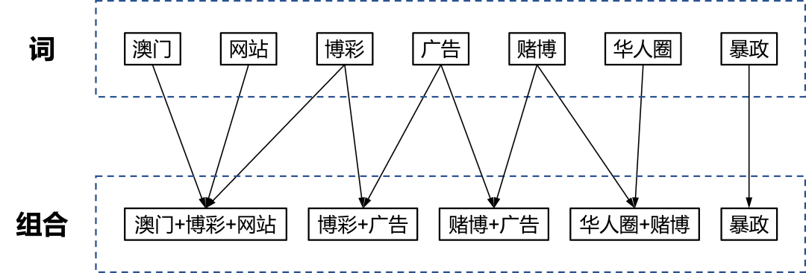

### **3.2.2 拼音敏感词**

在评论、弹幕等创作自由度很高的场景中，某些用户为了规避机器审核，会使用一些多音字、同音字来表达敏感词汇，例如用“[啋票](http://xn--hzr635f/)”来代表“[彩票](http://xn--h3tq29c/)”等。由于多音字、同音字变化较多，将一个词的所有谐音词都穷举出来是很困难的。因此我们实现了拼音敏感词的匹配方案，将中文文本转换为拼音再匹配，通过读音匹配敏感词，即可保证命中所有的同音字，运营直接配置敏感词的拼音，例如“[CAI PIAO](http://cai%20piao/)”，即可命中“[啋票](http://xn--hzr635f/)”、“[彩票](http://xn--h3tq29c/)”、“[采漂](http://xn--kdxr55e/)”等词汇。

### **3.2.2.1 匹配流程**

常规的「**AC 自动机**」算法是逐字符匹配的，因此 Trie 树上每个节点存储一个字符，但拼音敏感词需要按照音节匹配，因此我们将 Trie 树的节点数据类型由 char 改为 String，示例：

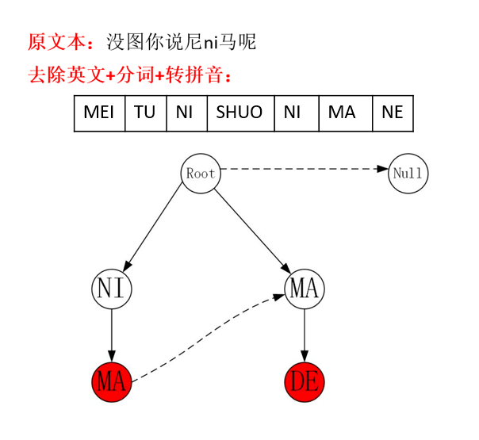

拼音敏感词的匹配关键在于将汉字准确的转换为拼音，这一点在多音字的场景下尤为重要。由于多音字的读音是受语境影响的，现有的技术条件很难确保能将多音字准确的转换为拼音，而上文提到同音词“啋票”是用户自行造的词，算法无法准确的识别语境，可能转换得到“[CAI PIAO](http://cai%20piao/)”、“[XIAO PIAO](http://xiao%20piao/)”两种不同的结果。如果拼音转换不精准，则拼音敏感词也无法准确命中。

因此我们不依赖算法识别多音字的读音，而是将文本内容的所有读音都列出来匹配一遍，就可以避免避免拼音转换不精准的问题。

下图展示了文本内容与拼音的对应关系，由于存在多音字，因此存储拼音的数组从一维扩展到了二维，更像是“图”的数据结构，下文将其称为拼音图。拼音图的起始节点和终止节点之间存在多条路径，这些路径对应了多音字的所有排列组合情况，为了避免漏杀，我们需要使用「**AC 自动机**」将这些路径都匹配一遍。

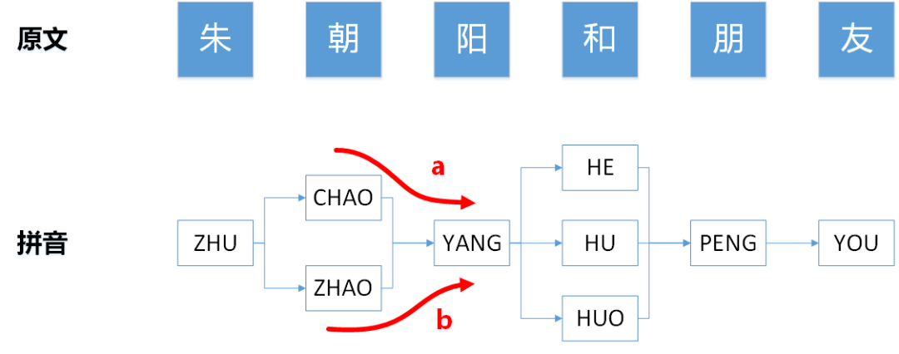

从第二节的匹配流程可以看出，目标串是一维数组，因此「**AC 自动机**」在匹配文本时，通常采用顺序遍历的方式。而在拼音敏感词中，由于目标串采用二维数组存储，是一种类似于“图”的数据结构，不再适合使用顺序遍历的方式，因此需要采用图的遍历算法。

图的遍历算法中，最常用的就是深度优先遍历（[DFS](http://dfs/)）和广度优先遍历（[BFS](http://bfs/)）。由于词语是前后关联的，为了使算法更符合人类思考习惯，我们选择了 [DFS](http://dfs/)。[DFS](http://dfs%20/) 算法使用栈存储节点信息，在当前分支遍历完成后，通过栈中的信息回溯到上一个分支处继续遍历。由于 [Trie 树](http://xn--trie-yh2i/) 的状态位与拼音图的节点是相关的，在 [DFS](http://dfs/) 回溯时，[Trie 树](http://xn--trie-yh2i/) 也需要同步回溯，因此需要将 [Trie 树](http://xn--trie%20-lf7o/)状态位与拼音图的节点信息一起保存到 [DFS 栈](http://xn--dfs%20-8p5m/)中。下图展示了拼音敏感词的匹配流程。

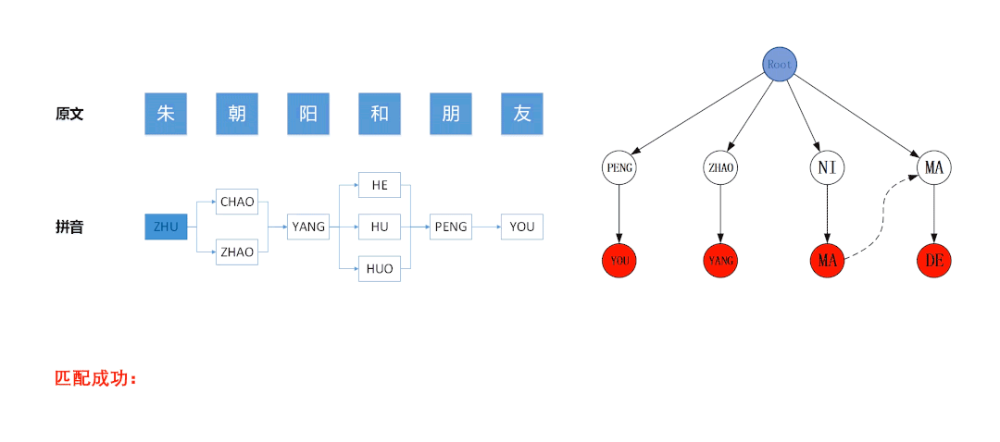

### **3.2.2.2 终止条件与剪枝策略**

[DFS](http://dfs/) 的终止条件是当所有节点都被遍历过，且算法会确保每个节点只会被遍历一次。但是 [DFS](http://dfs/) 遍历时会在分支处回溯，所以往往终止的节点并不是待匹配文本的终点，很有可能「**AC 自动机**」的匹配并未完成。

例如在下图所示的匹配流程中，左图是基于待匹配文本“朱朝阳和朋友”构建的拼音图，右图是基于拼音敏感词“[PENG YOU](http://peng%20you/)”、“[ZHAO YANG](http://zhao%20yang/)”、“[NI MA](http://ni%20ma/)”、“[MA DE](http://ma%20de/)”构建的 [Trie 树](http://xn--trie%20-lf7o/)。左图的拼音图采用 [DFS](http://dfs%20/) 算法遍历，算法最后访问的节点是蓝色节点“[ZHAO](http://zhao/)”，此时拼音图中所有节点均被遍历了一次，已经达到了 [DFS](http://dfs/) 的终止条件。但右图中 [Trie 树](http://xn--trie-yh2i/) 上的状态位处于蓝色节点“[ZHAO](http://zhao/)”的位置，并没有达到终止状态，若此时停止匹配，则会导致无法命中敏感词“[ZHAO YANG](http://zhao%20yang/)”，故算法应继续运行，直到AC自动机匹配失败为止。

因此合适的终止条件是：「**拼音图所有节点均被遍历**」且「**AC 自动机匹配失效**」。

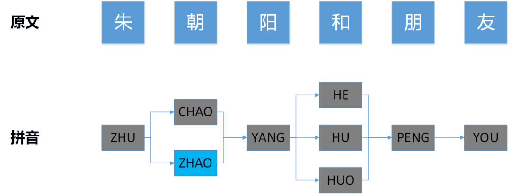

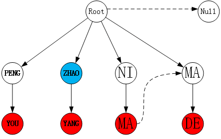

由于算法需要结合 [DFS](http://dfs/) 和「**AC 自动机**」的状态来判断终止条件，因此会出现拼音图中一个节点和路径被遍历多次的情况，当待匹配文本中「**多音字**」数量增多时，[DFS](http://dfs/) 遍历的路径数量会以笛卡尔积的形式增加。

而这些路径中会存在一部分重复的情况，因此在遍历的过程中需要采取合适的剪枝策略，避免搜索一些重复的路径。例如下面左图所示的遍历情况，路径 ② 上“[PENG](http://peng/)”、“ [YOU](http://you/)”两个节点已被路径 ① 遍历过，且对应的「**AC 自动机**」状态位（参考右图）前缀并不包含当前遍历节点“[HU](http://hu/)”，所以“[PENG](http://peng/)”对应的敏感词与路径 ② 无关，不必再搜索一次。

我们可以针对这种场景设计了「**剪枝策略**」，需要剪枝的路径需要满足两个条件：

1.  首先当前节点的下一节点已被遍历过；
2.  下一节点对应的AC自动机状态与当前节点无关。

我们为拼音图中的每个节点标记一个分支路径长度B，表示当前节点与上一个最近的分支节点间的路径长度，例如节点“[PENG](http://peng/)”对应的分支路径长度为 [B = 2](http://b%20=%202/)（ [从“HU”到“PENG”](http://xn--hupeng-oi0ccif7852kbri/)），节点“[YOU](http://you/)”的分支路径长度为 [B = 3](http://b%20=%203/)（[“HU”、“PENG”、“YOU”](http://xn--hupengyou-9b0ecehfe1916dga/)）。

在「**AC 自动机**」的状态机中，记录 [Trie 树](http://xn--trie-yh2i/) 上每个节点的深度 D。例如状态机中“[PENG](http://peng/)”节点的深度 [D=1](http://d=1/)，“[YOU](http://you/)”节点的深度 [D=2](http://d=2/)。从 [Trie 树](http://xn--trie-yh2i/) 根节点到某一个节点的路径上经过的字符连接起来，为该节点对应的模式串，因此节点的深度 D 即为模式串的长度。当 [D < B](http://d%20%20b/) 时，表明当前正在匹配的模式串长度短于拼音图中当前节点的分支路径长度，所以当前的模式串与当前的路径无关。

总结一下，剪枝所需的条件为：

1.  拼音图中下一节点已被遍历；
2.  拼音图的分支路径长度 B > Trie 树节点的深度 D。

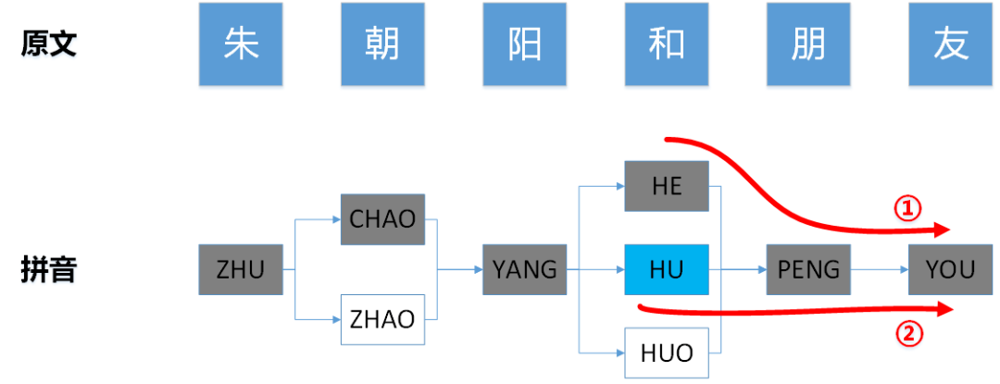

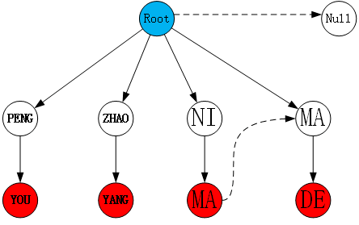

## **3.2 敏感词匹配功能实现**

这里我们来自己实现一个 AC 自动机匹配敏感词功能，代码如下：

package net.huazai.ahocorasick;

import java.util.ArrayList;

import java.util.HashMap;

import java.util.List;

import java.util.Map;

import java.util.Collection;

import java.util.Set;

import java.util.Collections;

import java.util.Queue;

import java.util.LinkedList;

/\*\*

\* @className: ACTrie AC 自动机实现

\* @author: huazai，该项目是知识星球：华仔和他的朋友们 的内部项目

\* @date: 2024-10-21 9:59

\* @Version: 1.0

\* @description:

\*/

public class ACTrie {

// 是否建立了 failure 表

private Boolean failureStatesConstructed \= false;

// 根结点

private Node root;

public ACTrie() {

// 初始化根节点

this.root = new Node(true);

}

/\*\*

\* Trie 树根节点

\*/

private static class Node {

// 用来放这个 Node 的所有子节点，储存形式是：Map(char, Node)

private Map<Character, Node> map;

// 该节点处包含的所有 pattern string

private List<String> PattenStrings;

// fail 指针指向的 node

private Node failure;

// 是否为根结点

private Boolean isRoot \= false;

public Node() {

map = new HashMap<>();

PattenStrings = new ArrayList<>();

}

public Node(Boolean isRoot) {

this();

this.isRoot = isRoot;

}

/\*\*

\* 用于 build trie，如果一个字符 character 存在于子节点中，不做任何操作，返回这个节点的 node

\* 否则，建一个 node，并将 map(char,node) 添加到当前节点的子节点里，并返回这个 node

\* @param character

\* @return

\*/

public Node insert(Character character) {

// 获取根节点

Node node \= this.map.get(character);

if (node == null) {

// 为空构建根节点

node = new Node();

map.put(character, node);

}

return node;

}

/\*\*

\* 添加匹配模式字符串

\* @param keyword

\*/

public void addPattenString(String keyword) {

PattenStrings.add(keyword);

}

/\*\*

\* 批量添加匹配模式字符串

\* @param keywords

\*/

public void addPattenString(Collection<String> keywords) {

PattenStrings.addAll(keywords);

}

/\*\*

\* 查找根节点

\* @param character

\* @return

\*/

public Node find(Character character) {

return map.get(character);

}

/\*\*

\* 利用父节点 fail node来寻找子节点的 fail node

\* or parseText 时找下一个匹配的 node

\*/

private Node nextState(Character transition) {

// 用来构建 fail node 时，这里的 this 是父节点的 fail node

// 首先从父节点的 fail node 的子节点里找有没有值和当前失败节点的 char 值相同的

Node state \= this.find(transition);

// 如果找到了这样的节点，那么该节点就是当前失败位置节点的 fail node

if (state != null) {

return state;

}

// 如果没有找到这样的节点，而父节点的 fail node 又是 root，那么返回 root 作为当前失败位置节点的 fail node

if (this.isRoot) {

return this;

}

// 如果上述两种情况都不满足，那么就对父节点的 fail node 的 fail node 再重复上述过程，直到找到为止

// 这个地方借鉴了 KMP 算法里面求解 next 列表的思想

return this.failure.nextState(transition);

}

/\*\*

\* 子节点

\* @return

\*/

public Collection<Node> children() {

return this.map.values();

}

/\*\*

\* 设置 fail 指针

\* @param node

\*/

public void setFailure(Node node) {

failure = node;

}

/\*\*

\* 获取 fail 指针

\* @return

\*/

public Node getFailure() {

return failure;

}

/\*\*

\* 返回一个 Node 的所有子节点的键值，也就是这个子节点上储存的 char

\*/

public Set<Character> getTransitions() {

return map.keySet();

}

/\*\*

\* 匹配模式字符串

\* @return

\*/

public Collection<String> PattenString() {

return this.PattenStrings == null ? Collections.<String>emptyList() : this.PattenStrings;

}

}

/\*\*

\* 匹配模式字符串

\*/

private static class PattenString {

// 匹配到的模式串

private final String keyword;

// 起点

private final int start;

// 终点

private final int end;

public PattenString(final int start, final int end, final String keyword) {

this.start = start;

this.end = end;

this.keyword = keyword;

}

/\*\*

\* 获取关键词

\* @return

\*/

public String getKeyword() {

return this.keyword;

}

@Override

public String toString() {

return super.toString() + "=" + this.keyword;

}

}

/\*\*

\* 添加一个模式串(内部使用字典树构建)

\*/

public void addKeyword(String keyword) {

if (keyword == null || keyword.length() == 0) {

return;

}

Node currentState \= this.root;

for (Character character : keyword.toCharArray()) {

// 如果 char 已经在子节点里，返回这个节点的 node；否则建一个 node，并将 map(char,node) 加到子节点里去

currentState = currentState.insert(character);

}

// 在每一个尾节点处，将从 root 到尾节点的整个 string 添加到这个叶节点的 PattenString 里

currentState.addPattenString(keyword);

}

/\*\*

\* 用 AC 自动机做匹配，返回 text 里包含的 pattern 及其在 text 里的起始位置

\*/

public Collection<PattenString> parseText(String text) {

// 首先构建 fail 表，如已构建则跳过

checkForConstructedFailureStates();

Node currentState \= this.root;

List<PattenString> collectedPattenStrings = new ArrayList<>();

for (int position \= 0; position < text.length(); position++) {

Character character \= text.charAt(position);

// 依次从子节点里找 char，如果子节点没找到，就到子节点的 fail node 找，并返回最后找到的 node；如果找不到就会返回 root

// 这一步同时也在更新 currentState，如果找到了就更新 currentState 为找到的 node，没找到 currentState 就更新为 root，

// 相当于又从头开始找

currentState = currentState.nextState(character);

Collection<String> PattenStrings = currentState.PattenString();

if (PattenStrings == null || PattenStrings.isEmpty()) {

continue;

}

// 如果找到的 node 的 PattenString 非空，说明有 pattern 被匹配到了

for (String PattenString : PattenStrings) {

collectedPattenStrings.add(new PattenString(position - PattenString.length() + 1, position, PattenString));

}

}

// 返回匹配到的所有 pattern

return collectedPattenStrings;

}

/\*\*

\* 建立 Fail 表(核心实现 BFS 遍历)

\*/

private void constructFailureStates() {

Queue<Node> queue = new LinkedList<>();

// 首先从把 root 的子节点的 fail node 全设为 root，然后将 root 的所有子节点加到 queue 里面

for (Node depthOneState : this.root.children()) {

depthOneState.setFailure(this.root);

queue.add(depthOneState);

}

this.failureStatesConstructed = true;

while (!queue.isEmpty()) {

Node parentNode \= queue.poll();

// 下面给 parentNode 的所有子节点找 fail node，transition 是父节点的子节点的 char

for (Character transition : parentNode.getTransitions()) {

// childNode 是子节点中对应上面 char 值的节点的 Node 值

Node childNode \= parentNode.find(transition);

// 将这个 parentNode 的所有子节点加入 queue，在 parentNode 的所有兄弟节点都过了一遍之后，就会过这些再下一层的节点

queue.add(childNode);

// 利用父节点的 fail node 来构建子节点的 fail node

Node failNode \= parentNode.getFailure().nextState(transition);

childNode.setFailure(failNode);

// 每个节点处的 PattenString 要加上它的 fail node 处的 PattenString

// 因为能匹配到这个位置的话，那么 fail node 处的 PattenString 一定是匹配的 pattern

childNode.addPattenString(failNode.PattenString());

}

}

}

/\*\*

\* 检查是否建立了 Fail表，如果没建立则建立

\*/

private void checkForConstructedFailureStates() {

if (!this.failureStatesConstructed) {

constructFailureStates();

}

}

/\*\*

\* 测试

\* @param args

\*/

public static void main(String\[\] args) {

ACTrie trie = new ACTrie();

trie.addKeyword("没");

trie.addKeyword("图");

trie.addKeyword("你");

trie.addKeyword("说");

trie.addKeyword("操");

trie.addKeyword("尼");

trie.addKeyword("妈");

//匹配 text，并返回匹配到的 pattern

Collection<PattenString> pattenStrings = trie.parseText("操尼妈");

for (PattenString pattenString : pattenStrings) {

System.out.println(pattenString.start + " " + pattenString.end + "\\t" + pattenString.getKeyword());

}

}

}

执行结果如下：

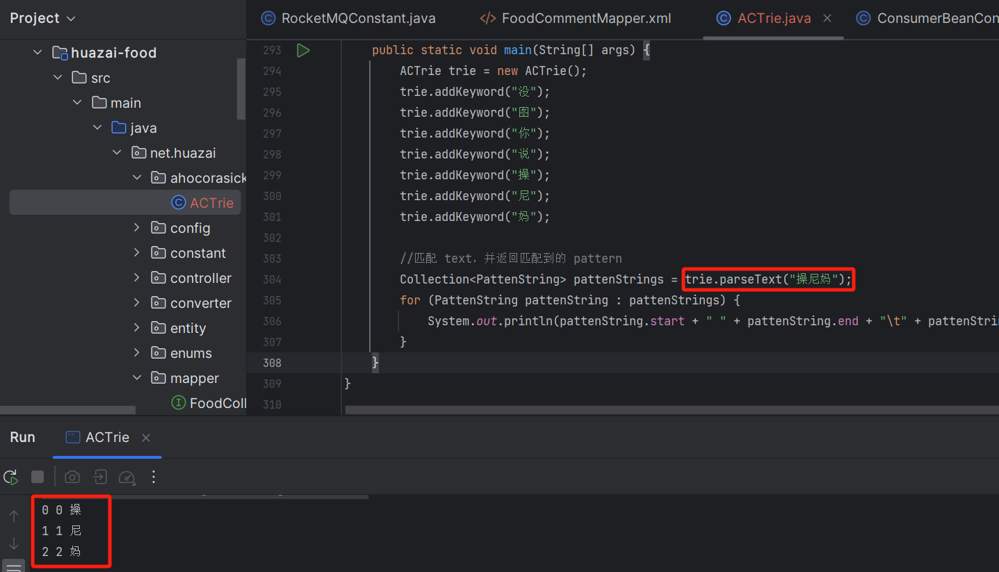

可以看到这里可以解析出来「**敏感词**」，但是这里我是手动分词的，且我们手写的找个库敏感词只能支持一个不太适合。接下来在实现审核功能的时候会通过「**分词器**」来自动分词并识别「**敏感词**」，这样就完美了。

##   
**3.3 引入结巴分词**

目前就美食服务用到，这里我们放到 [huazai-food](http://huazai-food/) 工程中。

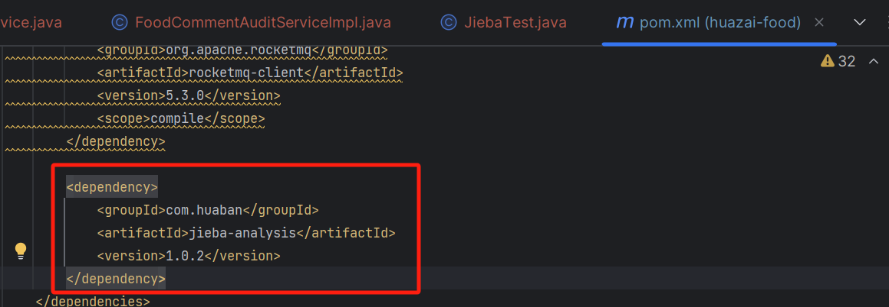

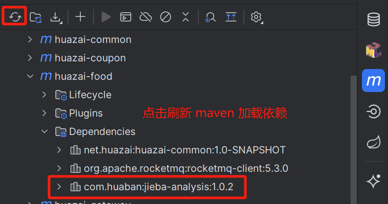

测试分词效果，如下：

### **3.3.1 使用 Index 模式**

该模式用来对索引文档分词，这里使用字符串数组

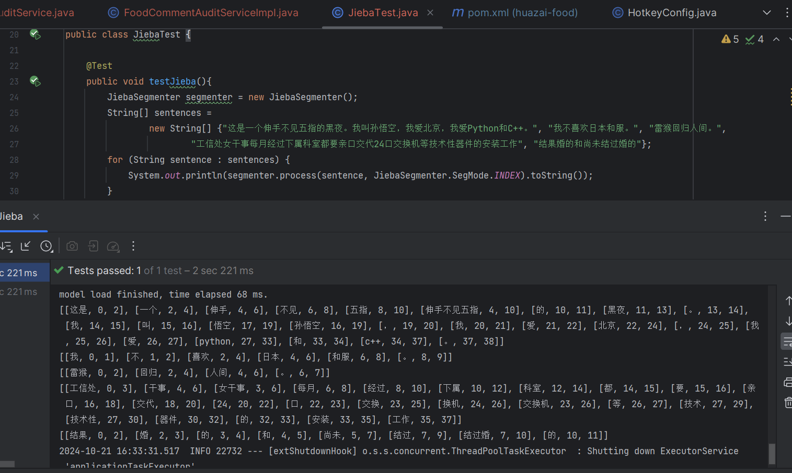

### **3.3.2 使用 Search 模式**

该模式用来对用户查询词分词，这里使用字符串数组

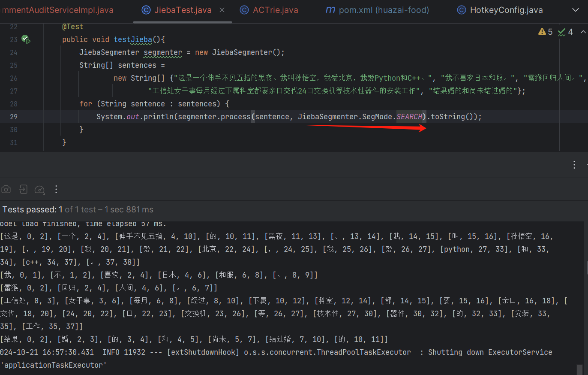

### **3.3.3 直接文本测试**

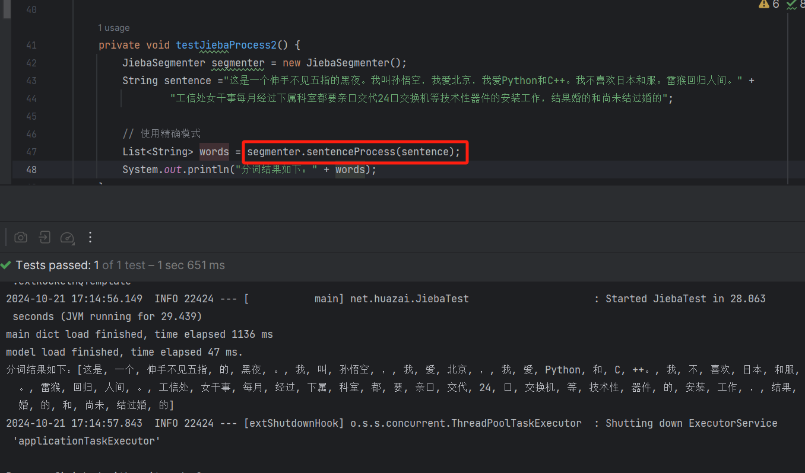

## **3.4 引入敏感词工具 toolGood**

上面我们只是通过「**AC 自动机**」实现了一个简化版的「**敏感词**」识别工具，这里我们引入一个「**高性能敏感词**」检测工具，它自带一个敏感词库，就不用自己搞了，从网上找了好久才找到，看介绍还不错，开箱即用。

工具 github 地址：[https://github.com/toolgood/ToolGood.Words/tree/master](http://%20https//github.com/toolgood/ToolGood.Words/tree/master)

### **3.4.1 引入依赖**

<dependency>

<groupId>io.github.toolgood</groupId>

<artifactId>toolgood-words</artifactId>

<version>3.1.0.1</version>

</dependency>

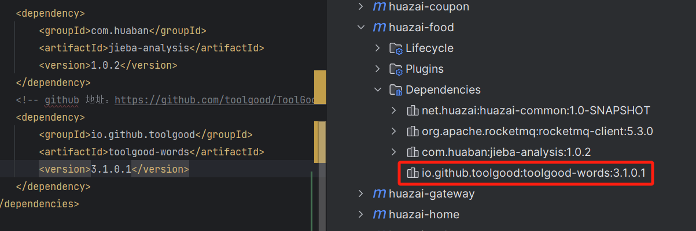

### **3.4.2 添加敏感词库**

直接从源码中的 java 包中下载自带的「**敏感词库**」，放到本地的 [huazai-food](http://huazai-food/) 工程下的 resources 目录下，如下：

  
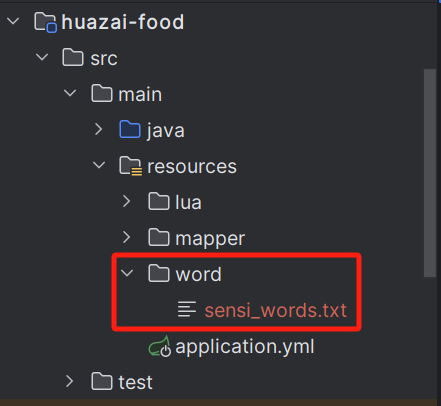

### **3.4.3 编写敏感词搜索配置并启动服务**

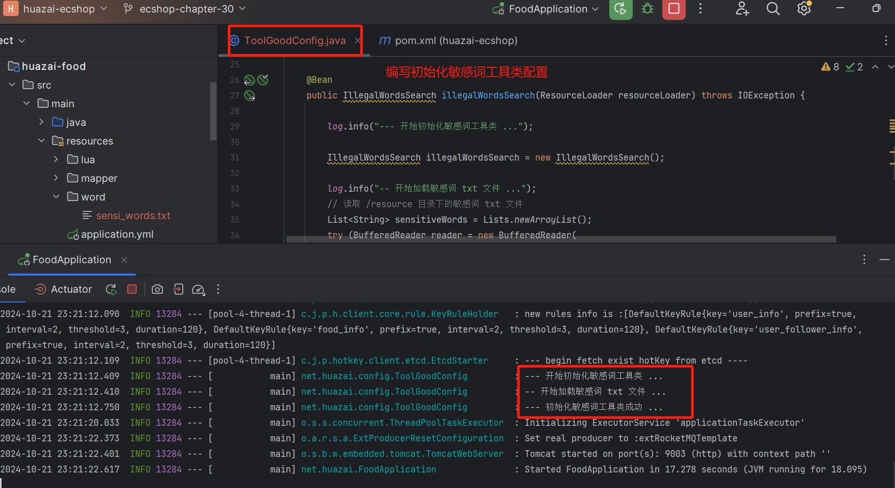

### **3.4.4 测试效果**

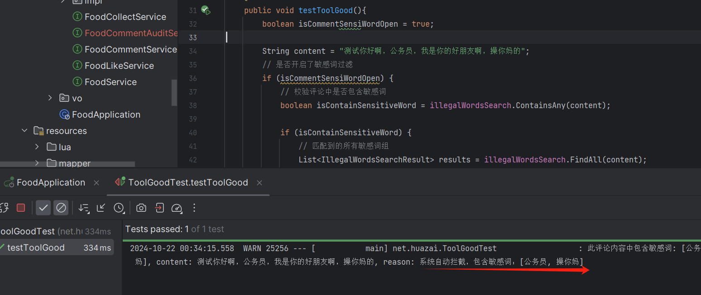

这个工具就不用进行「**分词器**」了，直接检测。

## **3.5 评论审核功能实现**

这里为了方便就放到同一个工程里，当然你也可以单独搞一个「**审核服务**」，创建 2 个消费者线程池，分别处理「**评论审核**」和「**评论审核结果**」信息，且都使用 「**顺序消息**」。

另外同「**评论发布**」一样使用了「**聚合**」操作，这个可以根据需求自行修改，也可以「**博主是否热门**」进行直接匹配还是通过 MQ 方式处理。

来看下关键代码：

  
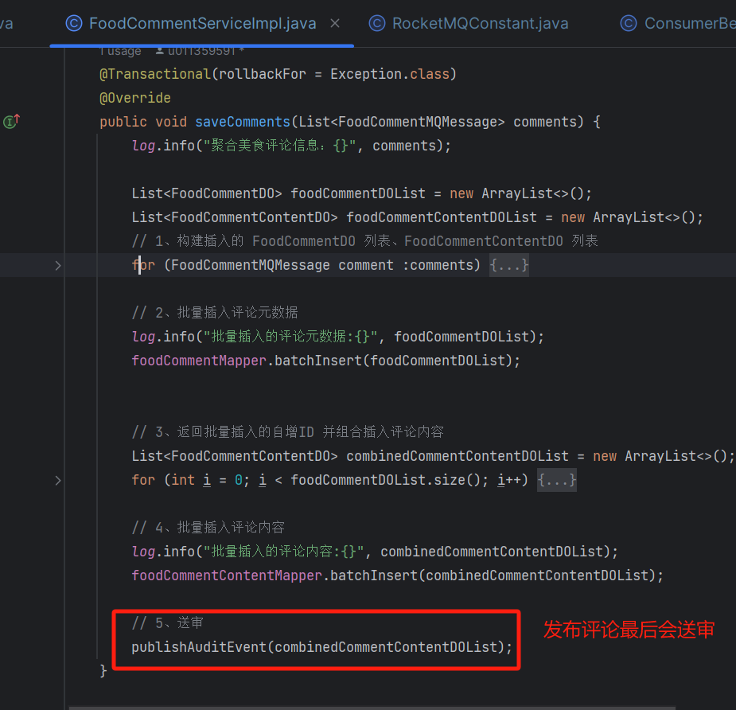  

  
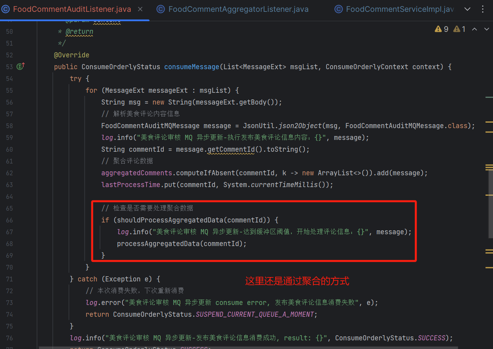

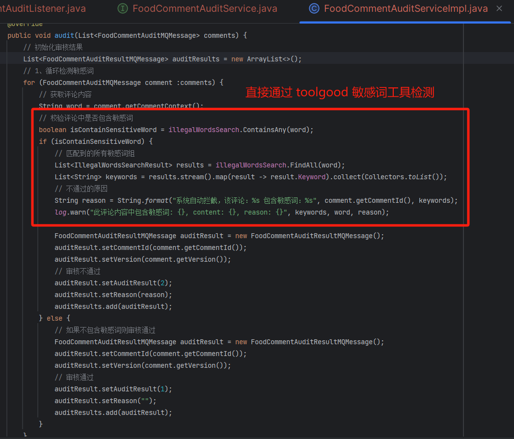

  
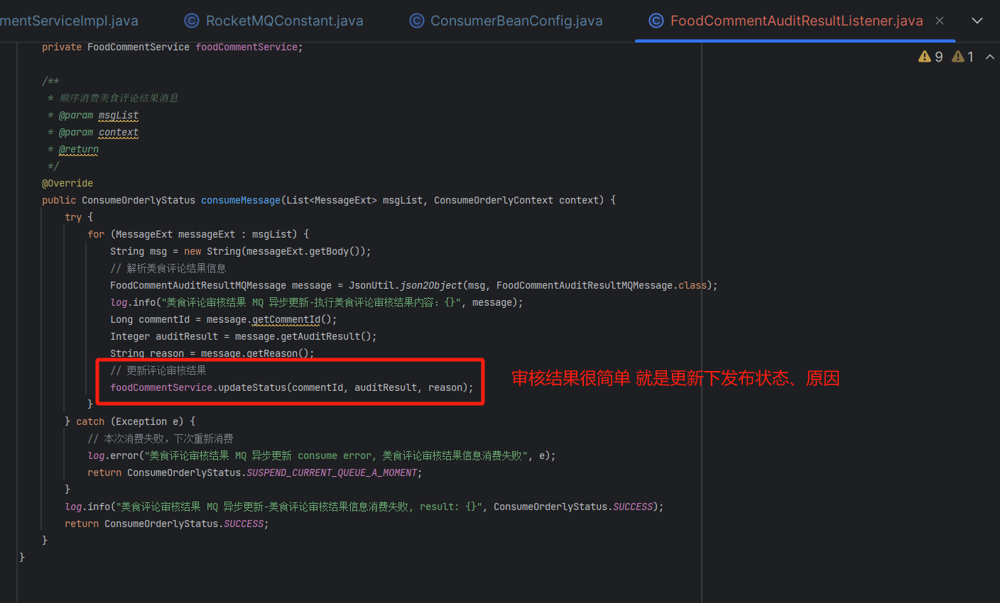

执行结果：

  
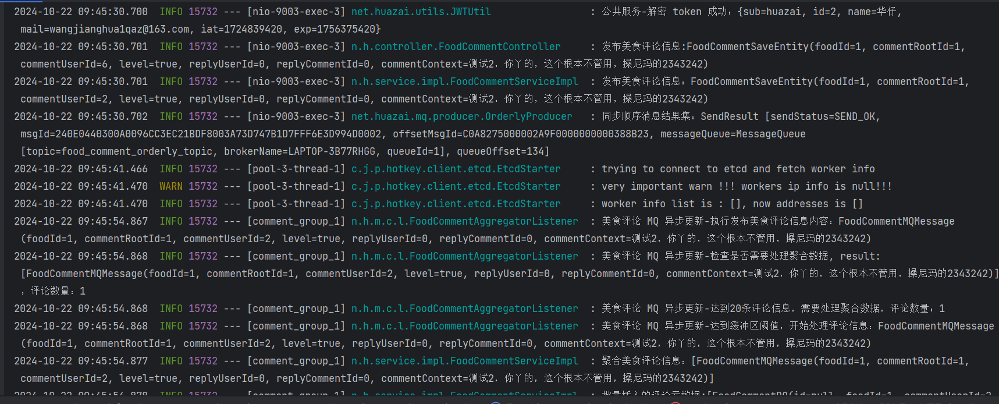

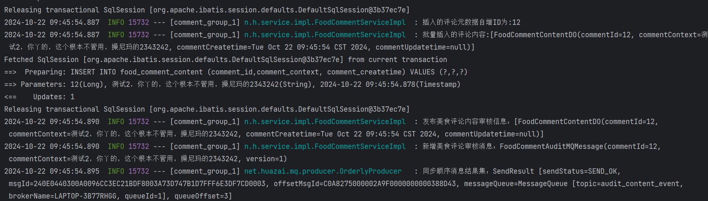

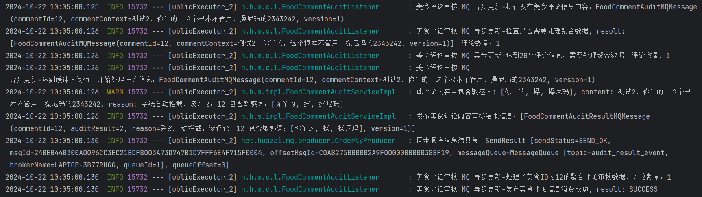

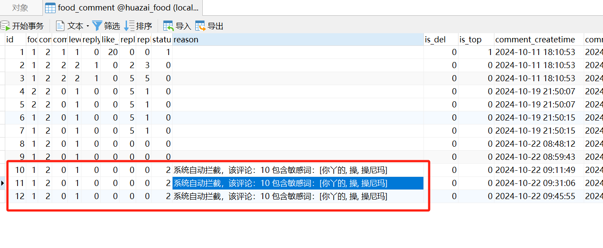