从今天之后的一段时间内，华仔会带着大家一起从零开始搭建并研发一套高并发的电商实战项目，这里会涉及到很多互联网大厂开发过程中所使用的核心技术和架构设计模式，希望大家学完之后可以用到自己的简历中。

通过整整8个月时间，小红书社交+电商高并发实战项目即将收官，接下来，我会最后一个重要的模块「**小红书社交+电商业务性能压测**」。

这是第九十七篇，本篇我们先来对常见的压力测试工具进行对比， 然后介绍 Jmeter 5.x 工具。

文章汇总位置：[https://wx.zsxq.com/dweb2/index/columns/51122554151214](https://wx.zsxq.com/dweb2/index/columns/51122554151214)

源码授权与获取地址：[https://articles.zsxq.com/id\_1s85grnaae4p.html](https://articles.zsxq.com/id_1s85grnaae4p.html)

本章源码地址：[https://gitcode.net/u011359591/huazai-ecshop/-/tree/ecshop-chapter-9](https://gitcode.net/u011359591/huazai-ecshop/-/tree/ecshop-chapter-95)7

##   
**01 前言**

前两篇对整个「**小红书社交+电商项目**」进行了项目总结与简历编写：

[【电商实战项目第九十五篇】华仔电商实战项目全景透视、各模块架构设计及亮点与难点总结](https://articles.zsxq.com/id_lp87dcfu360a.html)

[【电商实战项目第九十六篇】华仔电商实战项目如何写入简历中](https://articles.zsxq.com/id_6ndx97m77dva.html)

从今天开始，我们就来进行最后一个模块的介绍，进行先来第一篇，对接口常见压力测试工具进行对比，最后对 Jmeter 5.x 进行详细介绍。

##   
**02 常见压力测试工具介绍**

在进行压力测试之前，我们先来介绍下常见的压力测试工具。

## **2.1 LoadRunner**

LoadRunner 是一款由 Micro Focus（以前是Hewlett-Packard或HP公司）开发的性能测试工具。它用于测试和分析系统在负载下的行为和性能。具体来说，LoadRunner 可以模拟数千名用户同时访问应用程序，以测量和评估系统的性能表现，从而帮助识别性能瓶颈和系统容量。

该软件性能稳定，压测结果及细粒度⼤，可以⾃定义脚本进⾏压测，但是太过于重⼤，功能⽐较繁多。

关于它的使用，可以参考这篇：[https://blog.csdn.net/m0\_73292466/article/details/139608709](https://blog.csdn.net/m0_73292466/article/details/139608709)

## **2.2 Apache AB**

Apache Benchmark (简称ab) 是 Apache 安装包中自带的压力测试工具 ，简单易用。 使用起来非常的简单和方便， 不仅仅是可以 apache 服务器进行网站访问压力测试，还可以对其他类型的服务器进行压力测试。 比如nginx, tomcat, IIS等。

它能模拟多线程并发请求,ab命令对发出负载的计算机要求很低，既不会占⽤很多CPU，也不会占⽤太多的内存，但却会给⽬标服务器造成巨⼤的负载, 简单 DDOS 攻击等。

官网地址：[https://httpd.apache.org/](https://httpd.apache.org/)

关于它的使用，可以参考这篇：[https://www.cnblogs.com/fanf/p/17772372.html](https://www.cnblogs.com/fanf/p/17772372.html)

## **2.3 Webbench**

WebBench 是一款用于评估 Web 服务器性能和稳定性的轻量级开源测试工具。它采用 C 语言编写，能够在 Linux 环境下运行，并通过模拟并发用户请求来测试服务器在高负载下的响应速度与处理能力。

该工具提供两种测试模式：固定请求数量和固定时间模式，并能够报告吞吐量、响应时间和并发用户数等关键性能指标。

WebBench 易于安装和使用，但可能不适用于包含复杂定制需求的场景，此时可以与其他系统监控工具结合使用，以进行全面的性能分析和容量规划。

webbench ⾸先 fork 出多个⼦进程，每个⼦进程都循环做 web访问测试。⼦进程把访问的结果通过 pipe 告诉⽗进程，⽗进程做最终的统计结果。

官网地址：[http://home.tiscali.cz/~cz210552/webbench.html](http://home.tiscali.cz/~cz210552/webbench.html)

github 地址：[https://github.com/EZLippi/WebBench](https://github.com/EZLippi/WebBench)

关于它的使用，可以参考这篇：[https://blog.csdn.net/weixin\_42515340/article/details/146228499](https://blog.csdn.net/weixin_42515340/article/details/146228499)

## **2.4 Jmeter**

Apache JMeter 是 Apache 组织基于 Java 开发的压力测试工具，用于对软件做压力测试。

JMeter 最初被设计用于 Web 应用测试，但后来扩展到了其他测试领域，可用于测试静态和动态资源，如静态文件、Java 小服务程序、CGI 脚本、Java 对象、数据库和 FTP 服务器等等。JMeter 可对服务器、网络或对象模拟巨大的负载，在不同压力类别下测试它们的强度和分析整体性能。另外，JMeter 能够对应用程序做功能/回归测试，通过创建带有断言的脚本来验证程序是否返回了期望结果。为了最大限度的灵活性，JMeter 允许使用正则表达式创建断言。

其开源免费，功能强⼤，在互联⽹公司普遍使⽤。

压测不同的协议和应⽤：

1.  Web - HTTP, HTTPS (Java, NodeJS, PHP, ASP.NET, …)
2.  SOAP / REST Webservices
3.  FTP
4.  Database via JDBC
5.  LDAP 轻量⽬录访问协议
6.  Message-oriented middleware (MOM) via JMS
7.  Mail - SMTP(S), POP3(S) and IMAP(S)
8.  TCP等等

使⽤场景及优点：

1.  功能测试
2.  压⼒测试
3.  分布式压⼒测试
4.  纯 java 开发
5.  上⼿容易，⾼性能
6.  提供测试数据分析
7.  各种报表数据图形展示

官网地址：[https://jmeter.apache.org/](https://jmeter.apache.org/)

关于它的使用，可以参考这篇：[https://blog.csdn.net/cool\_tao6/article/details/142441207](https://blog.csdn.net/cool_tao6/article/details/142441207)

## **03 Jmeter 5.x 工具介绍**

## **3.1 本地安装 Jmeter 5.x**

注意事项：需要安装JDK8 以上，另外建议安装JDK环境，虽然JRE也可以，但是压测 https 需要 JDK ⾥⾯的 keytool ⼯具。

快速下载：[https://jmeter.apache.org/download\_jmeter.cgi](https://jmeter.apache.org/download_jmeter.cgi)

⽂档地址：[http://jmeter.apache.org/usermanual/get-started.html](http://jmeter.apache.org/usermanual/get-started.html)

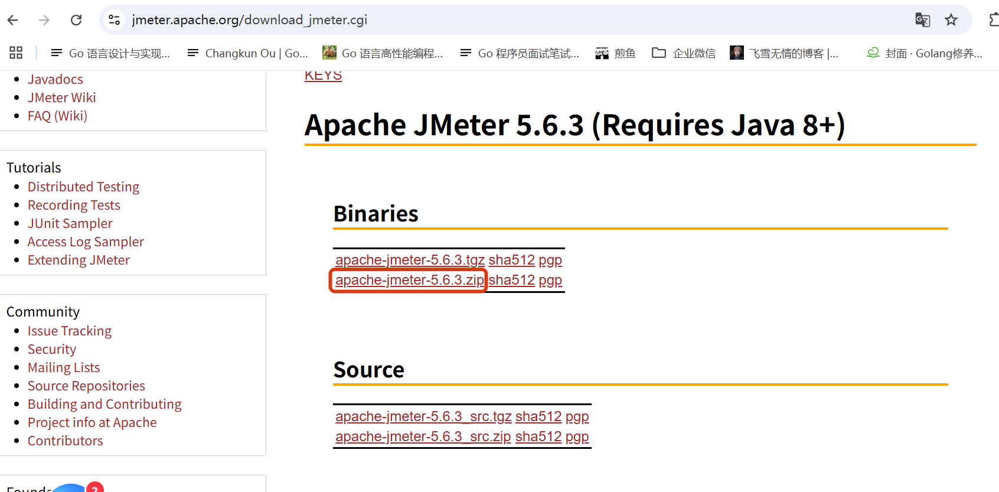

下载完成后，我们来介绍下相关目录结构：

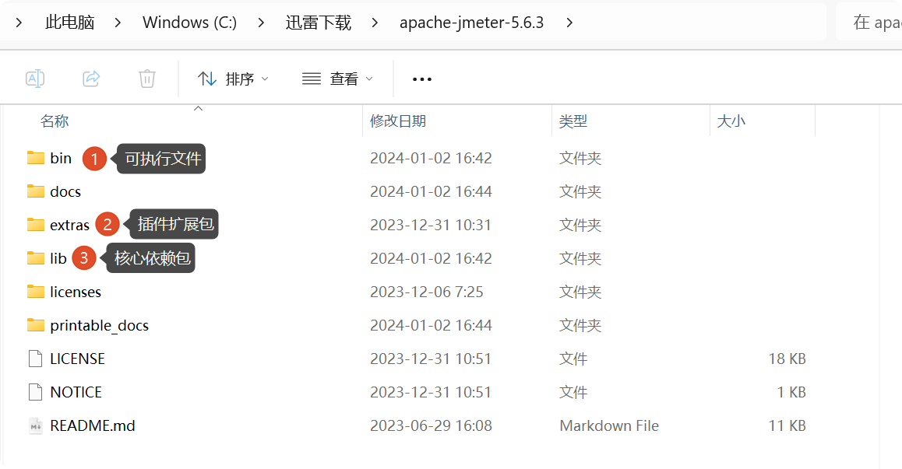

其中 bin 目录下包含的配置和执行文件：

1.  jmeter.bat: windows启动⽂件(window系统⼀定要配置显示⽂件拓展名)。
2.  jmeter: mac 或者 linux 启动⽂件。
3.  jmeter-server: mac 或者 Liunx 分布式压测使⽤的启动⽂件。
4.  jmeter-server.bat: window 分布式压测使⽤的启动⽂件。
5.  jmeter.properties: 核⼼配置⽂件。

这里需要先修改一个配置，将英文改为中文的。 位置：bin/jmeter.properties:

#language=en

language=zh\_CN

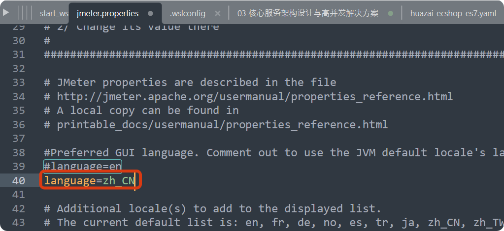

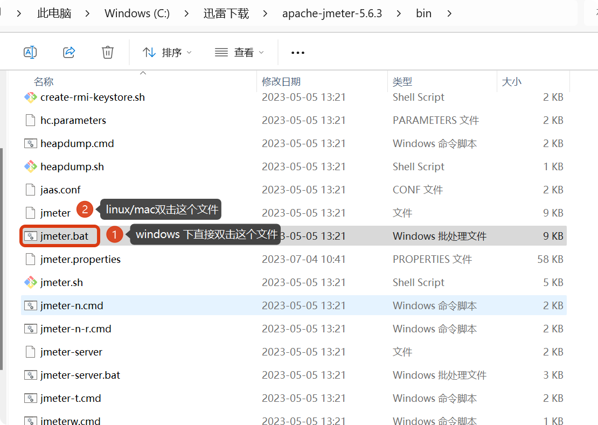

双击后就会启动 Jmeter 5.x 版本：

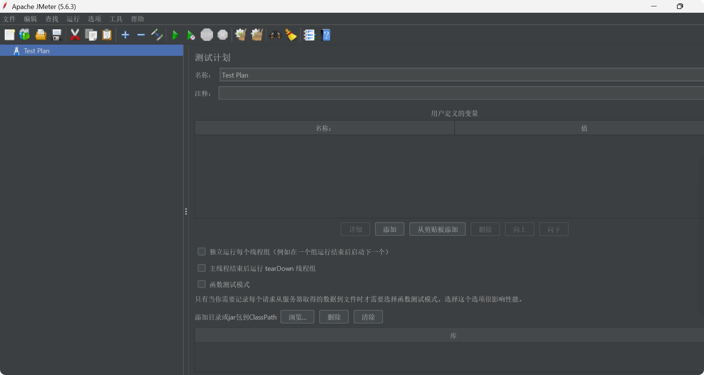

当启动出现闪退时需要检查下 JDK 是否安装正确

## **3.2 Jmeter 5.x 基础功能组件介绍**

这里我们拿首页服务 Feed 流接口作为讲解入口。

### **3.2.1 添加线程组**

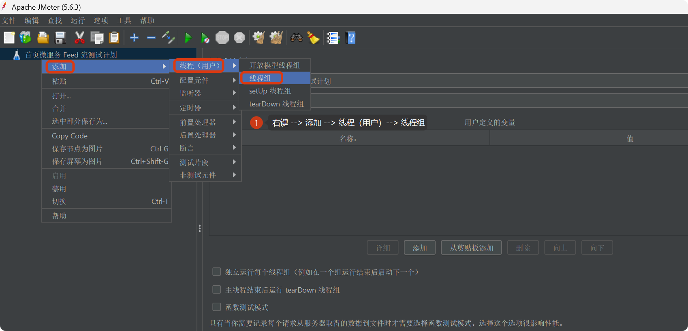

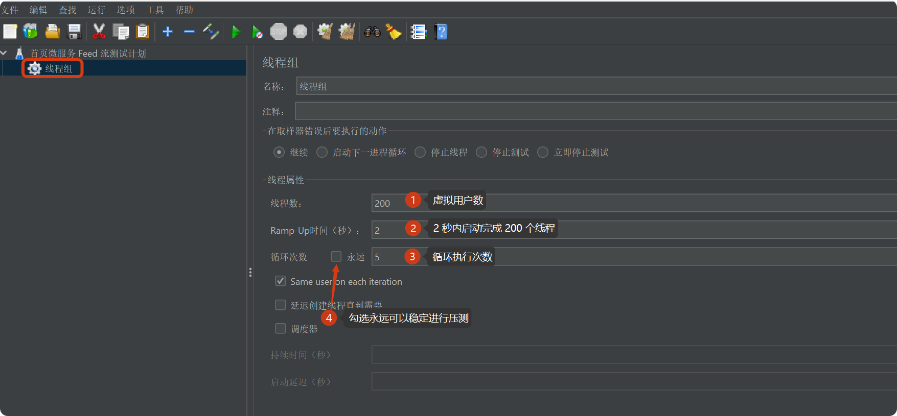

1.  线程数：虚拟⽤户数，⼀个虚拟⽤户占⽤⼀个进程或线程。
2.  准备时⻓（Ramp-Up Period(in seconds)）：全部线程启动的时⻓，⽐如 200 个线程，2 秒，则表示 2 秒内 200 个线程都要启动完成，每秒启动 100 个线程。
3.  循环次数：每个线程发送的次数，假如值为 5，200个线程，则会发送 1000 次请求，勾选永远循环可以进行稳定压测。

### **3.2.2 添加线程组 --> HTTP 采样器**

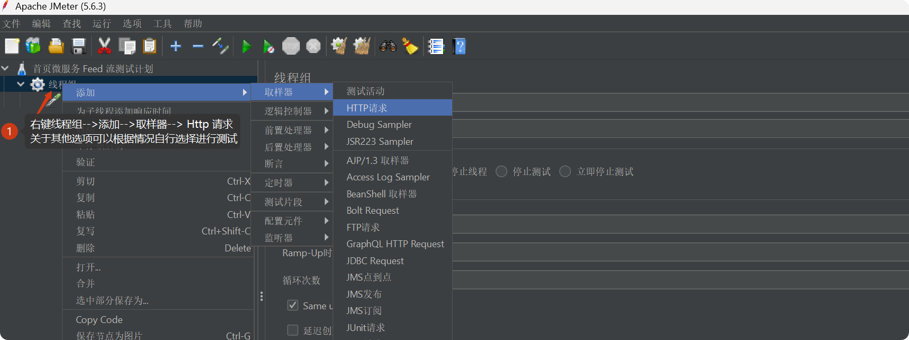

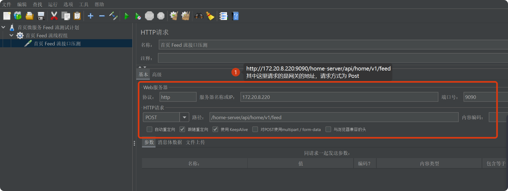

只是这样还不行，还需要设置一个请求头：

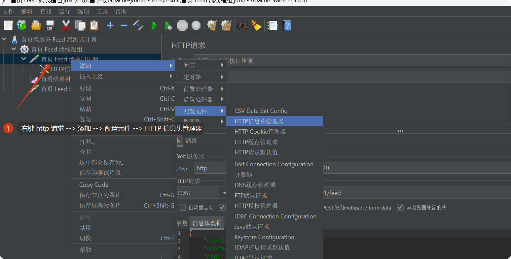

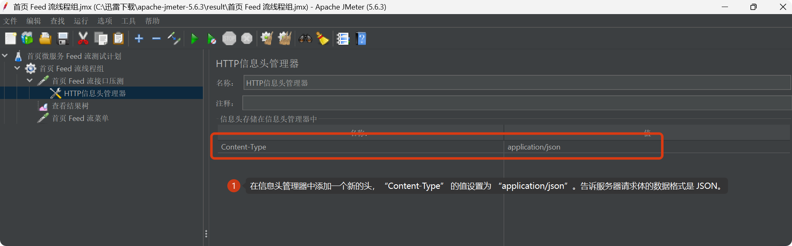

另外如果需要传递 token 也可以在此处添加即可。然后在「**HTTP 请求**」的「**消息体数据**」区域中，输入要传递的 JSON 数据内容。

  
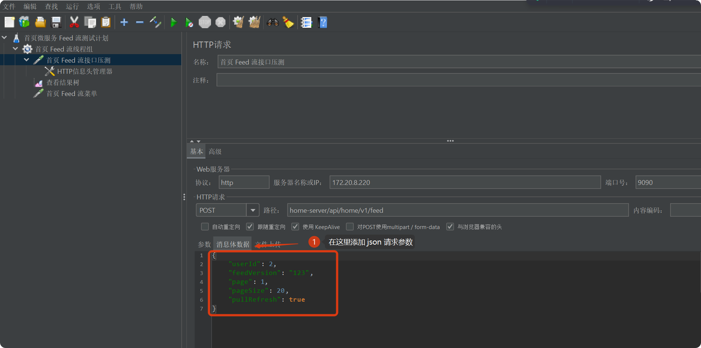

添加必需的配置：

1.  名称：采样器名称
2.  注释：对这个采样器的描述
3.  web 服务器：
4.  默认协议是 http
5.  默认端⼝是 80，这里填写网关的端口
6.  服务器名称或IP ：请求的⽬标服务器名称或IP地址，这里填写网关的IP。
7.  路径：服务器URL，这里填写网关接入后 Feed 流接口的地址。
8.  内容编码：默认为 ISO 国际标准，但对中文支持不友好，可以使用 utf-8。
9.  参数：
10.  参数可以拼在路径里，也可以写在参数中。
11.  POST参数要放到消息数据中 {wd:test}。

### **3.2.3 查看测试结果**

### **3.2.3.1 查看结果树**

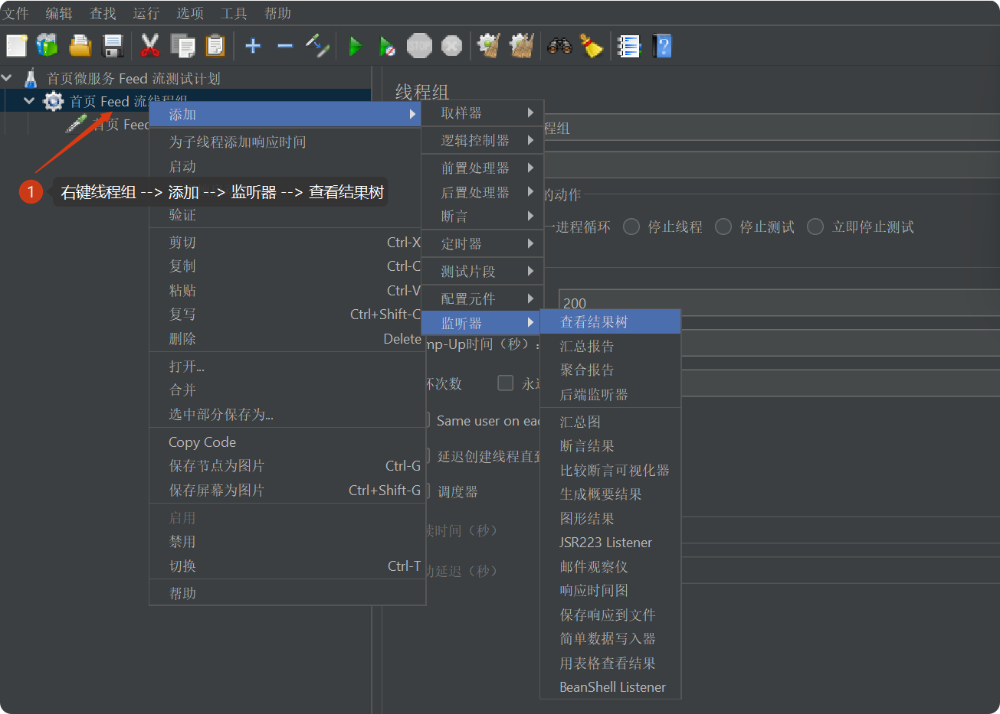

### **3.2.3.2 聚合报告**

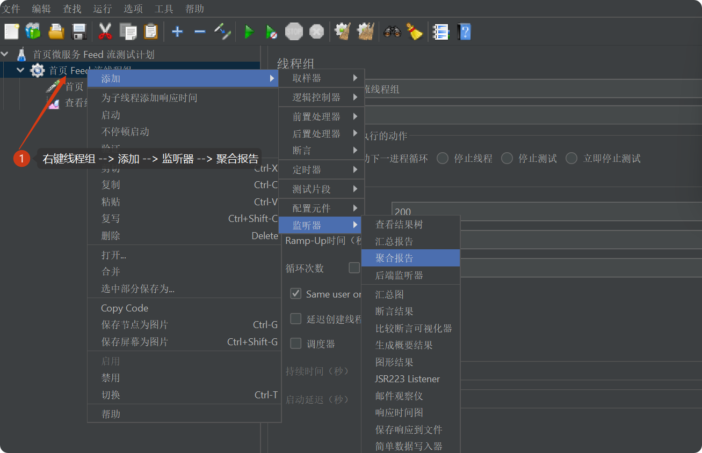

### **3.2.3.3 测试结果**

这里先来测一下结果，再进行压测。

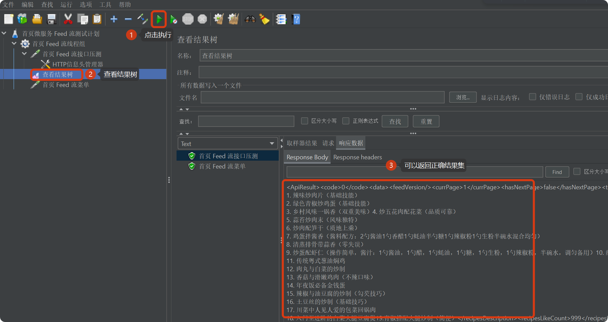

### **3.2.4 常规压测流程**

1.  切记一定要使用「**内网环境**」。
2.  ⾮ GUI 下压测。
3.  停⽌其他⽆关资源进程。
4.  「**压测机器**」和「**被压测机器**」进行隔离。

## **3.3 Jmeter 5.x 单接口性能压测示例**

### **3.3.1 压测关键指标**

### **3.3.3.1 什么是 QPS**

QPS 表示系统每秒能够处理的请求数量，可以理解为系统在一秒内处理了多少个查询（或请求）。常用于描述 接口 或 API 请求 的处理能力，通常与 Web 服务、数据库查询等相关。

### **3.3.3.2 什么是 TPS**

TPS 表示系统每秒处理的事务数量。事务通常是一组操作的集合，需要保证整个操作集的原子性（全部成功或全部失败）。常用于描述涉及数据库操作或复杂业务场景的系统，如下单、支付等需要数据一致性的场景。在分布式系统中，TPS 是一个更严谨的指标，因为它强调 事务完整性和一致性，而不仅仅是处理请求的数量。

### **3.3.3.3 压测环境说明**

在系统架构中，系统设计是一部分，基础设施是另外一部分。

系统设计一般就是看我们的代码和架构是如何运作的，比如代码中运行了先查询缓存 Redis 再查询数据库 MySQL，防止缓存击穿和穿透等设计。

基础设施指的是部署的规格，比如 Redis 什么配置、MySQL 什么配置、部署了几台微服务以及每台部署机器的配置是多少。

在和面试官说时，一定要先明确自己的部署配置，比如：

1.  在我本地电脑上进行的测试，电脑配置 windows 4C8G。
2.  启动了一个首页 Feed 流服务。
3.  通过 Jmeter 配置了 200 个线程循环 500 次压测，最终吞吐量 xxxx。

### **3.3.3 Jmeter 5.x 首页 Feed 流接口压测**

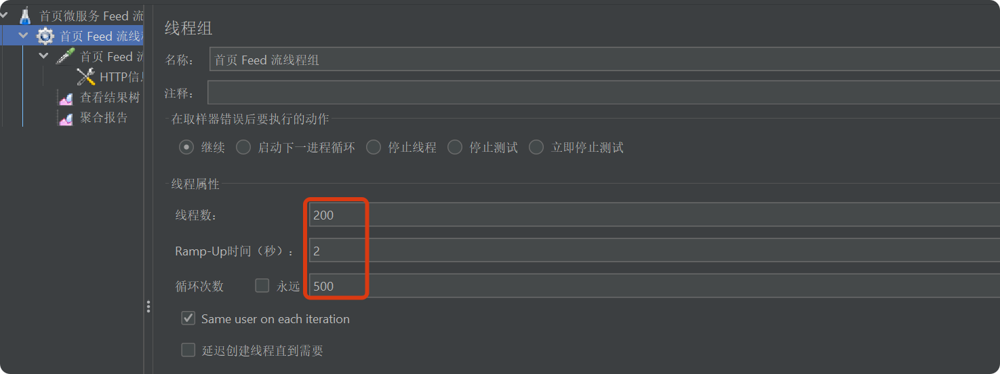

测试结果达到 1100 QPS / 秒：

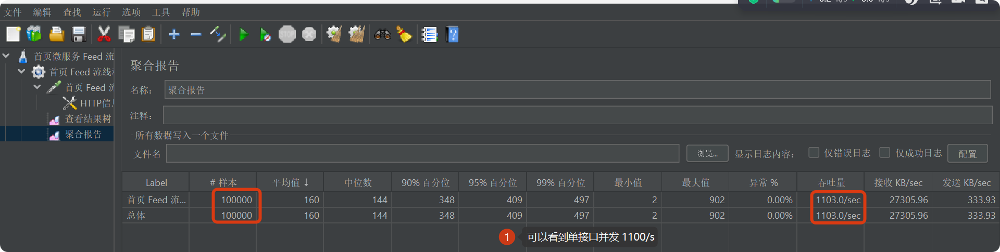

我们将线程增大到 500，再次测试：

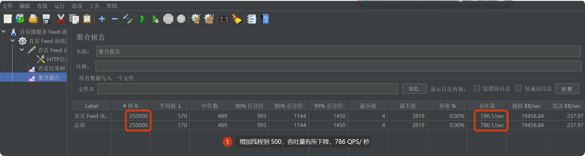

再次将线程增大到 1000 测试会出现少量报错：

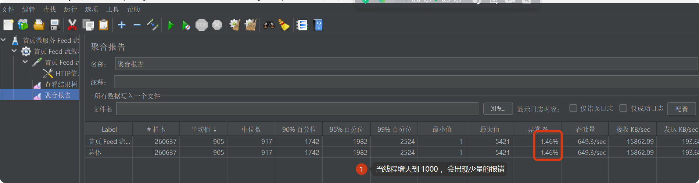

错误：Caused by: java.io.IOException: Broken pipe：

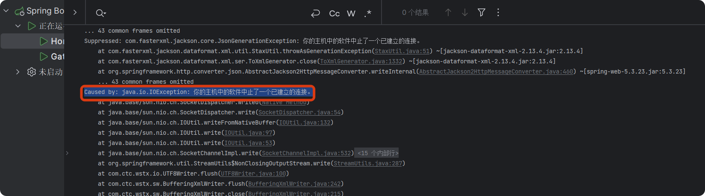

这个问题的根本原因是：网络连接已经被中断了，但程序还在尝试进行通信。通常发生在使用 Java 进行网络通信（如 HTTP 请求、Socket 通信）时，一方主动关闭了连接，而另一方仍试图写入数据，就会抛出类似下面的异常：

1.  Windows 下通常是: java.io.IOException: 你的主机中的软件中止了一个已建立的连接。
2.  Linux/macOS 下则表现为: java.io.IOException: Broken pipe。

服务端向前端socket连接管道写返回数据时 链接（pipe）却断开了：

1.  从应⽤⻆度分析，这是因为客户端等待返回超时了，主动断开了与服务端链接。
2.  连接数设置太⼩，并发量增加后，造成⼤量请求排队等待。
3.  ⽹络延迟，是否有丢包。
4.  内存是否⾜够多⽀持对应的并发量。

这接口性能不是很达标（主要是项目和压测都在同机器，会抢占内存和CPU， 正常情况下会有单独压测机器来进行压测），其他的接口大概率也是，不过没关系，今天我们暂不进行优化，后续找时间单独进行整个项目的性能优化（可能会等 AI 项目更完之后再来更新）。