从今天之后的一段时间内，华仔会带着大家一起从零开始搭建并研发一套高并发的电商实战项目，这里会涉及到很多互联网大厂开发过程中所使用的核心技术和架构设计模式，希望大家学完之后可以用到自己的简历中。

通过整整8个月时间，小红书社交+电商高并发实战项目即将收官，接下来，我会两个重要的模块「**实战项目总结及如何将亮点、难点写入简历**」、「**小红书社交+电商业务性能压测**」。

这是第九十五篇，本篇我们来对整个「**实战项目总结**」。

文章汇总位置：[https://wx.zsxq.com/dweb2/index/columns/51122554151214](https://wx.zsxq.com/dweb2/index/columns/51122554151214)

源码授权与获取地址：[https://articles.zsxq.com/id\_1s85grnaae4p.html](https://articles.zsxq.com/id_1s85grnaae4p.html)

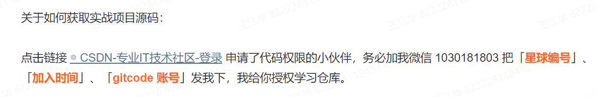

本章源码地址：[https://gitcode.net/u011359591/huazai-ecshop/-/tree/ecshop-chapter-95](https://gitcode.net/u011359591/huazai-ecshop/-/tree/ecshop-chapter-95)

## **01 前言**

上篇，通过前面 5 篇，我们通过「**Rancher 2.5.16 部署小红书社交+电商微服务+业务中间件实战**」， 今天我们重点来对整个「**小红书社交+电商项目**」进行总结 。

## **02 项目全景透视**

## **2.1 业务目标与蓝图**

### **2.1.1 业务核心目标**

核心目标：深度模仿小红书，构建一个融合社交互动「**Feed 流**」、「**关注**」、「**评论**」、「**点赞**」、「**收藏**」、「**IM**」与核心电商交易「**商品**」、「**购物车**」、「**优惠券**」、「**库存**」、「**订单**」、「**支付**」的千万级流量平台。

### **2.1.2 业务蓝图**

明确 「**社交+电商**」双引擎驱动：内容社区（美食笔记/达人种草） → 用户互动（点赞/评论/关注） → 商品转化（加购/下单）。

### **1、关键创新点**

1.  社交裂变​：通过优惠券分享刺激熟人传播（如“拼团”社交化变体）
2.  ​内容导购​：Feed流中美食笔记直接嵌入商品购买链接
3.  ​达人经济​：KOL直播间/测评笔记引导商品信任背书

### **2、数据联动价值**

用数据说明社交行为对电商的拉动：

1.  “用户评论互动率 >15% 的商品，下单转化率提升 3 倍”。
2.  “关注美食达人的用户，客单价较普通用户高 40%”。

### **3、技术支撑点**

技术如何赋能业务创新：

1.  ​动态 Feed 流​：实时混合内容（笔记+商品）提升曝光。
2.  ​精准推荐​：基于社交关系链的商品推荐（如“好友在买”）。
3.  ​IM 即时沟通​：买家与卖家/达人直接咨询促成交易。

## **2.2 核心业务场景与用户旅程**

### **2.2.1 四大核心业务场景**

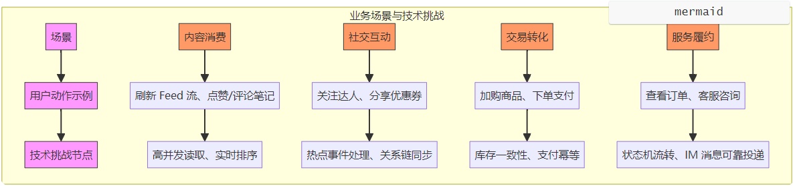

### **2.2.2 关键用户旅程映射**

1.  路径1：新用户转化​
2.  注册 → 浏览美食 Feed → 点赞笔记 → 领取新人券 → 下单（依赖技术点：JWT 鉴权、Feed 流加载速度、优惠券防超发）
3.  ​路径2：热点事件参与​
4.  收到大V直播通知 → 进入直播间 → 抢购限量商品（依赖技术点：千万级推送、瞬时库存扣减、排队熔断）

## **2.3 技术挑战：千万级用户、十万级 QPS、海量数据应对**

### **2.3.1 挑战1：流量洪峰**

1.  典型场景​：大V直播带货、双11抢购、 热点事件（如大V发布、秒杀）、优惠券领取、下单支付等。
2.  ​数字量化​：
3.  瞬时 QPS：支付接口 > 1万，Feed 流刷新 > 10万
4.  热点 Key：顶流直播间库存 Key 访问量 20万+/秒

### **2.3.2 挑战2：海量数据**

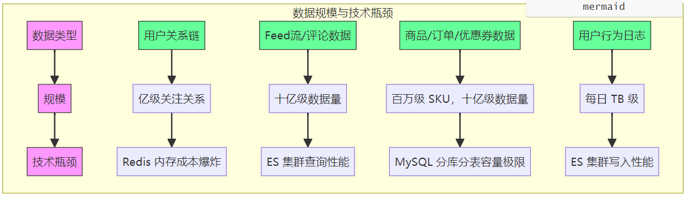

### **2.3.3 其他挑战**

1.  低延迟要求： Feed流加载、商品搜索、详情页渲染、IM消息、核心交易链路（下单、支付）。
2.  数据强一致性： 库存扣减、订单状态、支付状态、优惠券发放与核销。
3.  系统高可用与容灾： 7x24小时服务，应对机器故障、网络抖动、依赖服务不稳定。
4.  复杂业务逻辑： 状态机（订单）、分布式事务（下单/支付/库存）、异步编排、审核流程（评论）、分片任务（优惠券推送）。
5.  成本优化： 缓存资源（尤其 Redis）、数据库资源、消息队列资源的高效利用。

## **2.4 技术全景图：微服务生态与基础设施矩阵**

这是一套**非常完整且重磅级的企业级实战项目**，我们先来梳理下整个社区美食电商项目的业务架构图，如下：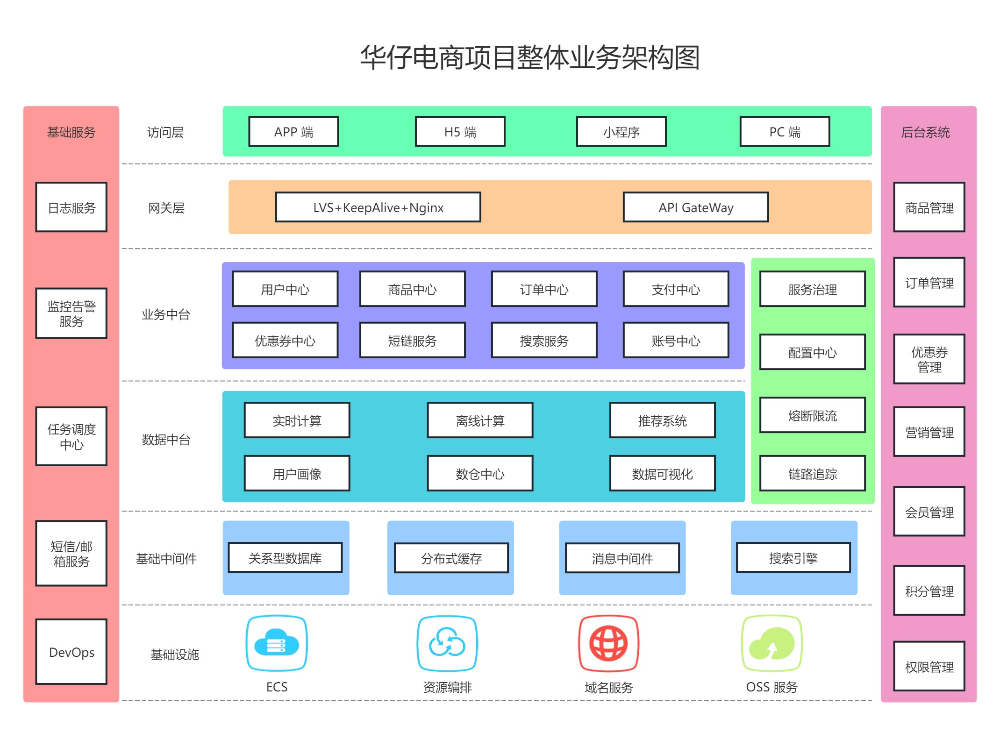

我们先来看下整个社交电商最重要的微服务模块都有哪些：

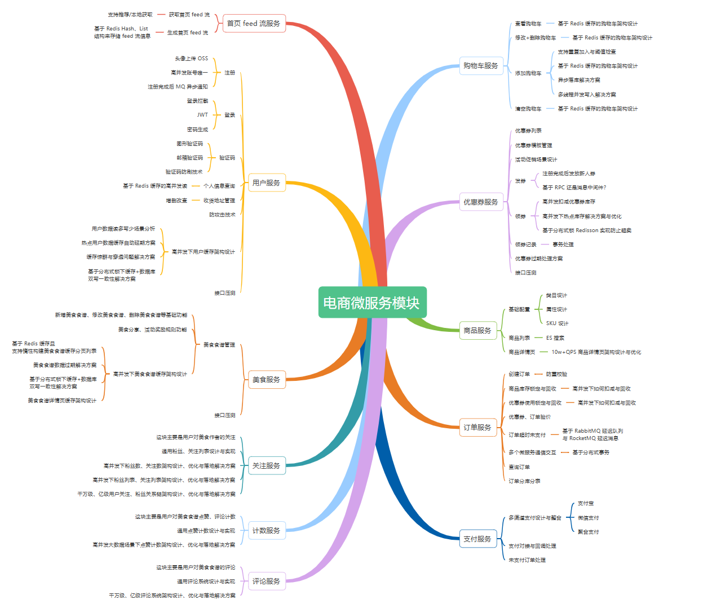

目前这个项目使用业界中 Java 体系的主流技术，基于 **SpringCloudAlibaba + JDK17 进行底层建设（早期基于 JDK11），**同时组件库的版本大多也是最新的。

如果用一张图来概括整个电商项目的技术架构，其展现形态如下图所示。

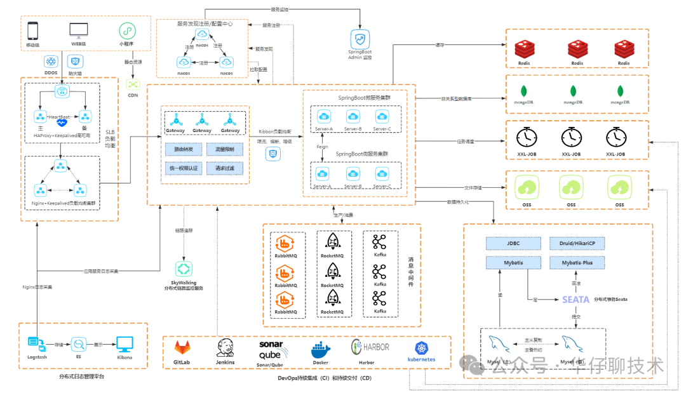

技术架构涵盖了 SpringBoot 2.6、SpringCloudAlibaba、Nacos 3.0、Sentinel、Skywalking、RocketMQ 5.x、ElasticSearch 7.9.x、Redis 7.x、MySQL 8.x、XXL-Job、Redisson 等技术：

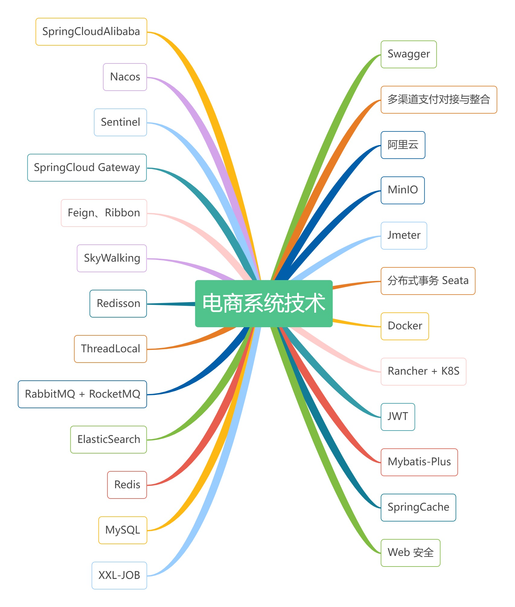

在这个项目的开发过程中，你会学到**很多实战经验**以及**高并发处理经验**，这里新增了 **redis 热 key 检测、大 Value 处理方案、redis 内存不足监控告警、集群故障自动检测，高并发分布式锁处理方案**。

整个项目技术亮点如下：

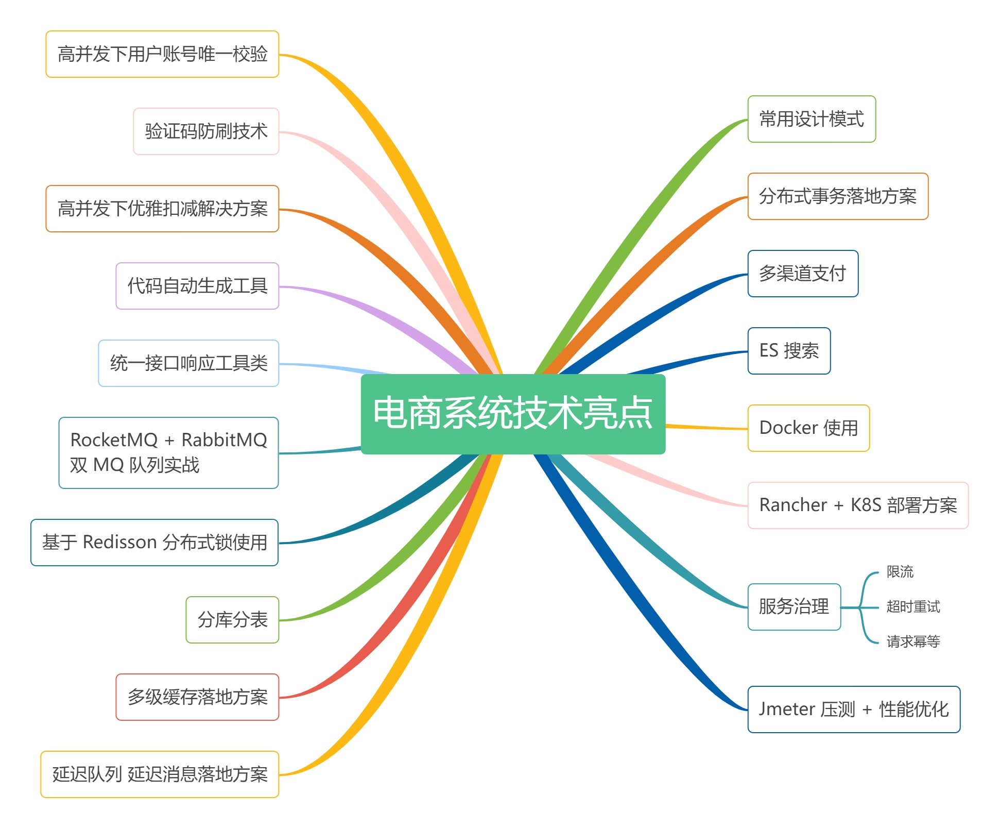

## **2.5 核心业务性能与稳定性目标**

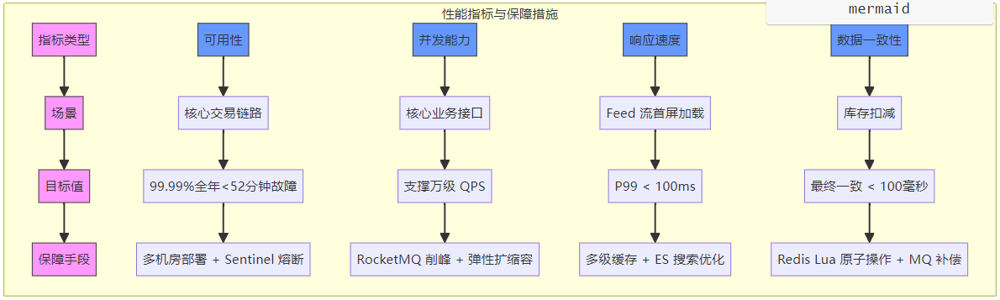

## **03 核心服务架构设计与高并发解决方案**

这里我会按照「**服务模块**」来分别梳理整个实战项目的架构设计与高并发解决方案。

## **3.1 首页服务架构设计**

### **3.1.1 核心挑战**

1.  双源数据融合​：同时处理推荐系统数据（动态）和本地缓存数据（静态），要求 200ms 内完成混合决策。
2.  ​缓存一致性​：实现千万级美食信息的版本化缓存管理，保障客户端新旧版本平滑过渡。
3.  ​流量削峰​：应对首页 Feed 流 10万+ QPS 的瞬时请求，P99 响应时间 < 100ms。

### **3.1.2 架构设计与技术实现**

[【电商实战项目第十五篇】华仔电商实战项目首页 feed 流架构设计与开发](https://articles.zsxq.com/id_77o5mc9z6giq.html)

### **1、双轨 Feed 流决策引擎**

根据用户信息来判断是走「**推荐系统**」还是 「**本地缓存**」。

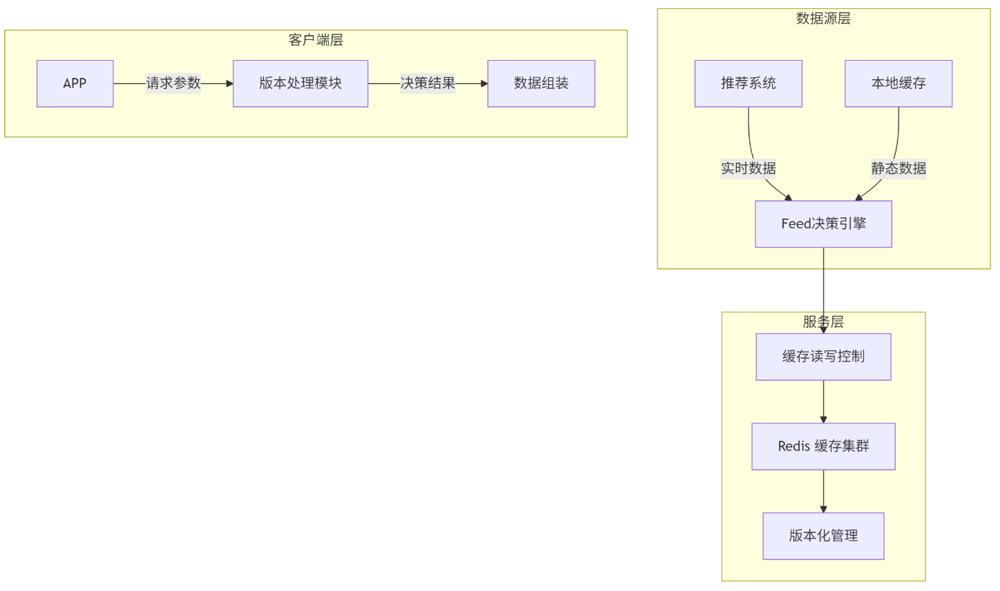

未来优化点​：

1.  ​推荐系统预检缓存​：用户推荐状态缓存 5 分钟（Guava Cache）。
2.  ​超时熔断机制​：推荐系统调用超时 100ms 自动降级。
3.  ​异常隔离​：推荐系统错误率 > 5% 触发熔断器。

### **2、版本化缓存管理体系**

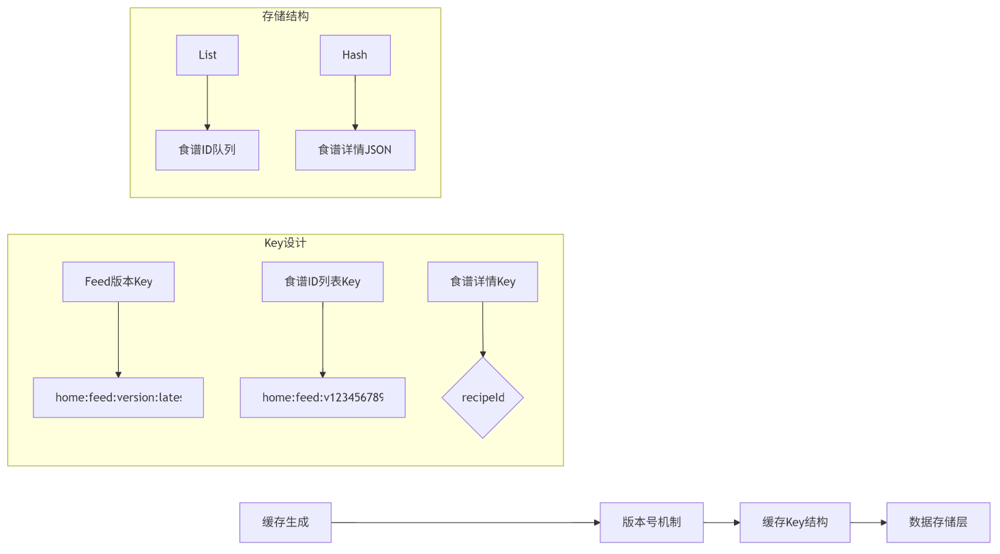

缓存特性​：

1.  ​版本滚动更新​：每次更新生成新版缓存，保留旧版 24 小时
2.  ​读写分离设计​：
3.  写操作：批量 pipeline 写入
4.  读操作：mget 批量获取食谱详情
5.  ​分页优化​：

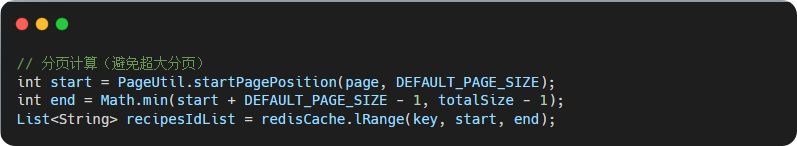

### **3、三级流量控制体系**

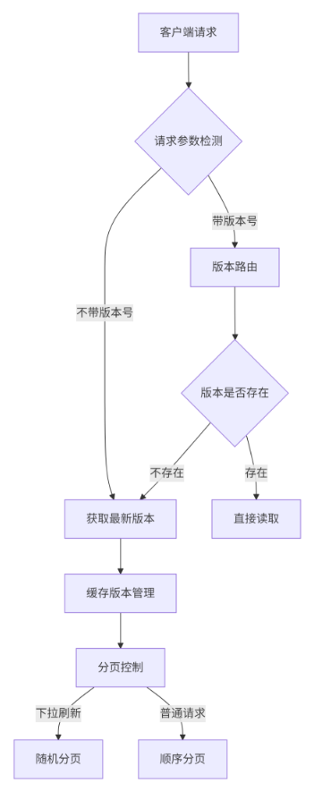

关键降级策略​：

1.  版本回退机制​：判断客户端版本是否已经缓存过，如果不存在则获取最新的版本号，否则使用当前版本号。
2.  异常页保护：当缓存数据不存在，返回兜底数据/空数据。

数据一致性保障：

### **4、性能优化效果**

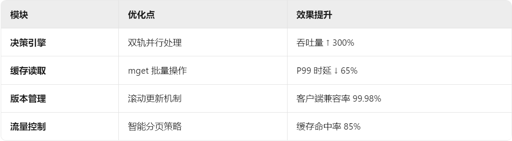

## **3.2 用户服务架构设计**

### **3.2.1 核心挑战**

1.  千万级用户高并发访问​：支撑千万级注册/登录请求（峰值10万QPS）。
2.  ​账号安全防护​：防御撞库攻击、机器注册等安全威胁（日均拦截1.2万次恶意请求）。
3.  ​分布式会话管理​：实现千万级用户状态的无状态化身份认证。
4.  ​热点数据治理​：用户基础信息（如头像、地址）毫秒级访问（P99 < 100ms）。
5.  ​数据强一致性​：保障高并发下账号唯一性（重复注册率 < 0.001%）。

### **3.2.2 架构设计与技术实现**

[【电商实战项目第六篇】华仔电商实战项目用户微服务模块功能梳理](https://articles.zsxq.com/id_rk1hzi7lrkwh.html)

[【电商实战项目第七篇】华仔电商实战项目用户微服务模块图形验证码开发](https://articles.zsxq.com/id_ldwqbz03duff.html)

[【电商实战项目第八篇】华仔电商实战项目用户微服务模块邮箱验证码开发](https://articles.zsxq.com/id_qf1n6fhz1mw3.html)

[【电商实战项目第九篇】华仔电商实战项目用户微服务模块用户头像上传功能开发](https://articles.zsxq.com/id_xbivfwmoshev.html)

[【电商实战项目第十篇】华仔电商实战项目用户微服务模块用户注册功能开发以及高并发下账号唯一性、安全性解决方案](https://articles.zsxq.com/id_sxbs98w62fwx.html)

[【电商实战项目第十一篇】华仔电商实战项目用户微服务模块用户登录功能开发以及JWT解决方案](https://articles.zsxq.com/id_tdv8twopw84s.html)

[【电商实战项目第十二篇】华仔电商实战项目用户微服务模块用户登录拦截器解决方案](https://articles.zsxq.com/id_hxvost6cc9lh.html)

[【电商实战项目第十三篇】华仔电商实战项目用户微服务模块用户收货地址模块开发](https://articles.zsxq.com/id_0wfz854u614t.html)

[【电商实战项目第十四篇】华仔电商实战项目用户微服务模块高并发场景下用户缓存架构演进设计与开发](https://articles.zsxq.com/id_h24gcw75o028.html)

### **1、验证码安全防护**

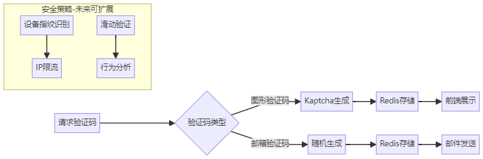

这里未来可扩展：

1.  机器注册防御：通过行为验证+设备指纹，实现拦截率 99%。
2.  撞库攻击防护：通过错误次数限制+IP封禁，实现攻击成功率 < 0.01%。

### **2、用户注册**

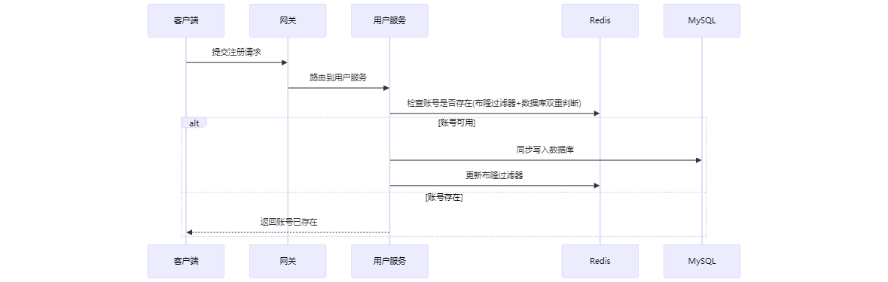

这里通过「**布隆过滤器**」+ 「**MySQL 唯一索引**」来实现查重机制， 这个分支增加了「**布隆过滤器**」 处理。

### **3、JWT 认证设计**

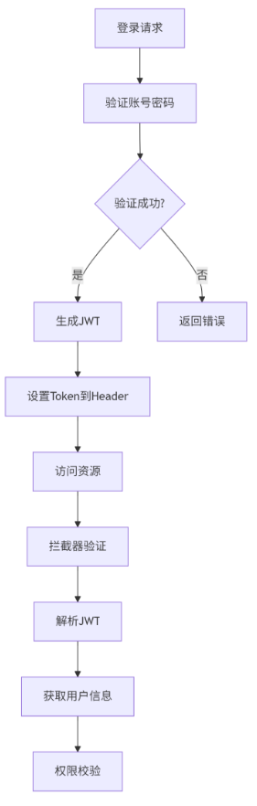

这里通过「**AccessToken(7天有效期)**」+ 「**RefreshToken(30天有效期)**」来实现用户会话管理，并通过「**登录拦截器**」实现用户信息校验，此处后续可以改为通过「**Redis**」来实现用户信息传递，目前还是「**ThreadLocal**」方式处理。

### **4、高并发用户缓存架构演进**

首先用户相关的数据，在整个美食社区电商系统场景下几乎每个微服务都会被用到，从「**登录**」、「**首页 Feed 流**」、「**美食详情页**」、「**美食分享**」、「**美食下单**」、「**美食支付**」、「**查询美食订单**」、「**个人中心**」等等。

相对于「**高并发读场景**」来说，写场景相对少一些，基本就是「**注册**」场景。相对于其他读场景，「**注册**」基本上一次性搞定。所以此时非常适合做「**缓存**」。

以「**修改用户信息**」为例， 通过分布式锁，防止重复灌入数据，写完数据库+ Redis 后释放锁。当成功写入数据库后写 Redis 缓存，过期时间为 2 天 + 随机数：

### **4.1、热点用户数据缓存自动延期方案**

我们分析了用户这种读多写少的场景，对于用户数据在写入的时候做一下缓存，在其他场景下读取用户数据就可以直接从缓存中进行读取了。

任何系统都可以通过「**二八定律**」来处理，对于大部分用户信息来说都是「**冷数据**」，很少有人访问的，所以到时间过期即可，只有少部分用户的数据是「**热数据**」，到时候访问会自动续期的，我们只保留这种「**热数据**」在缓存即可，既可以减少缓存空间，又可以在读取的时候达到高并发的效果。

因此这里我们做了一个机制：「**缓存自动延期机制**」。

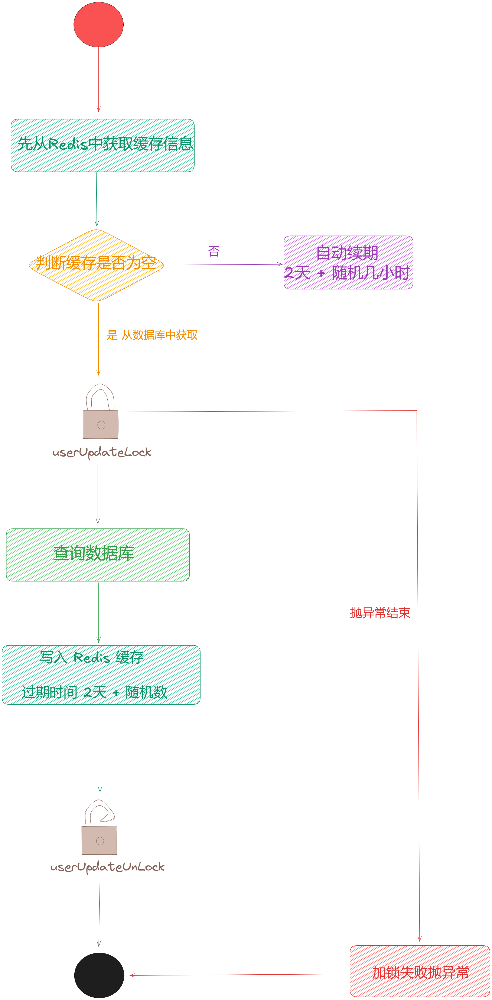

### **4.2、多级缓存方案**

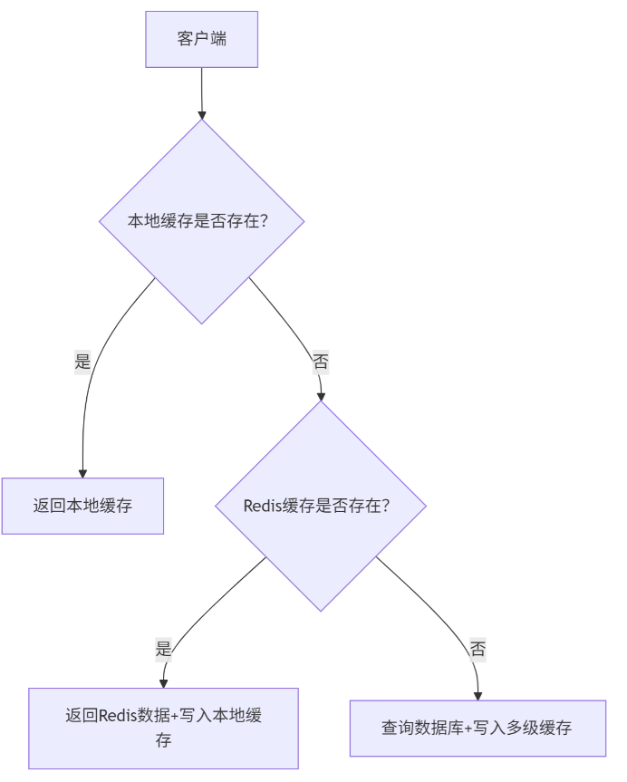

关键实现：

1.  热点探测​：JD-Hotkey 实时识别热点用户（如 大V 用户）。
2.  ​本地缓存​：热点用户数据推送数据到 JVM缓存。

### **4.3、分布式锁保护防缓存穿透方案**

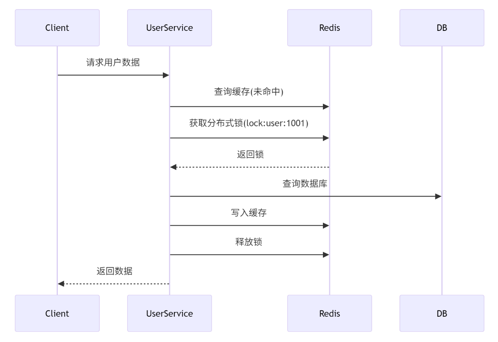

锁优化​：

1.  锁超时时间：200毫秒（避免死锁）。
2.  锁粒度：用户ID级别（细粒度锁）。

### **4.4、基于分布式锁下缓存与数据库双写一致性解决方案**

在高并发场景下，读写操作交叉执行会导致：

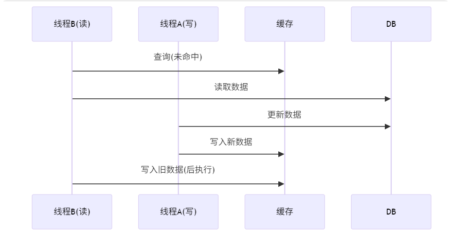

以上就是典型的在高并发极端场景下「**数据库**」和 「**缓存**」双写不一致的问题，缓存被旧数据覆盖，数据库新数据与缓存旧数据不一致，那么针对这个问题，如何才能更好解决呢？

### **解决方案：读写锁互斥**

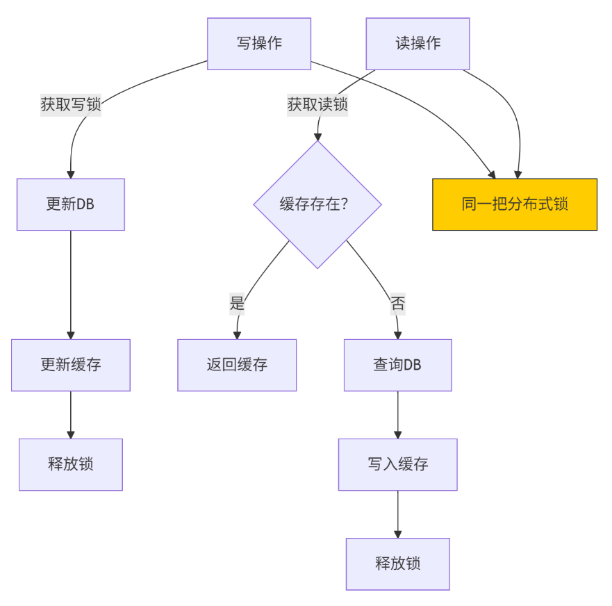

此时我们需要换一下锁，将「**两把锁**」改成「**同一把锁**」，使「**读操作**」和 「**写操作**」进行互斥。

对于用户数据来说，大概只有 1% 的情况下是「**写操作**」，剩下的 99% 的情况下「**读操作**」。即「**用户注册**」和「**用户信息更新**」操作是极少的，大部分情况下都是对「**用户数据**」进行查询，比如我们社区美食的商品详情页或者 首页 Feed 流页面需要查询用户信息，比如姓名、头像等。

### **4.5、极端场景解决方案**

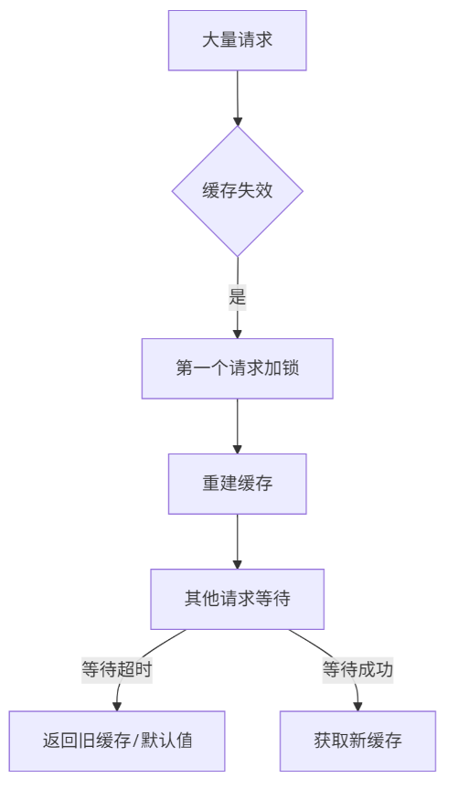

如图：可能某个用户的信息平时很少有人访问，「**缓存**」中数据早就过期了，突然之间该用户火了，一瞬间涌入了大量的请求来查询该用户的信息，即高并发的「**读操作**」都穿透了「**缓存**」到了「**读数据库**」+ 「**更新缓存**」[getUserInfoFromDB](http://getuserinfofromdb/) 方法中 ，通过代码得知，我们在该方法的入口处加了「**分布式锁**」，此时就会有大量的线程在「**排队等待**」获取「**分布式锁**」，此时就会导致非常严重的「**锁竞争**」问题，就会导致线程排队串行化。

那么我们就需要对此处进行优化，如何进行优化呢？

其实也简单，就是我们只要保证有「**一个线程**」能够拿到「**分布式锁**」，进行「**读数据库**」+ 「**更新缓存**」的操作即可，其他线程就不要等待锁了，此时「**数据库**」和「**缓存**」都是最新的数据了，只需要从「**缓存**」中高并发读即可，即：「**串行**」转 「**并发**」。

总结：通过「**分布式锁**」实现读写互斥，写操作直接更新缓存，读操作按需重建缓存保证最终一致，另外通过「**锁超时机制防止阻塞**」、「**Double Check 减少 DB 访问**」、「**零值缓存防止穿透**」。

## **3.3 美食服务架构设计**

### **3.3.1 核心挑战**

1.  高并发查询压力​：美食详情页日均访问量超百万（峰值QPS 5万+）。
2.  ​数据一致性要求​：美食信息变更需实时更新（作者修改、状态变更）。
3.  ​热点数据治理​：头部博主美食列表访问占比超80%。
4.  ​分页缓存难题​：美食列表需支持瀑布流分页（无法预建全量缓存）。

### **3.3.2 架构设计与技术实现**

[【电商实战项目第十六篇】华仔电商实战项目美食服务基础功能开发](https://articles.zsxq.com/id_s0f883lm17z1.html)

[【电商实战项目第十七篇】华仔电商实战项目美食微服务模块高并发场景下美食缓存架构演进设计与开发](https://articles.zsxq.com/id_w8tdll3cj1kb.html)

这里我们主要来看下「**美食列表**」、「**美食详情**」的缓存架构设计。

### **1、美食详情缓存架构**

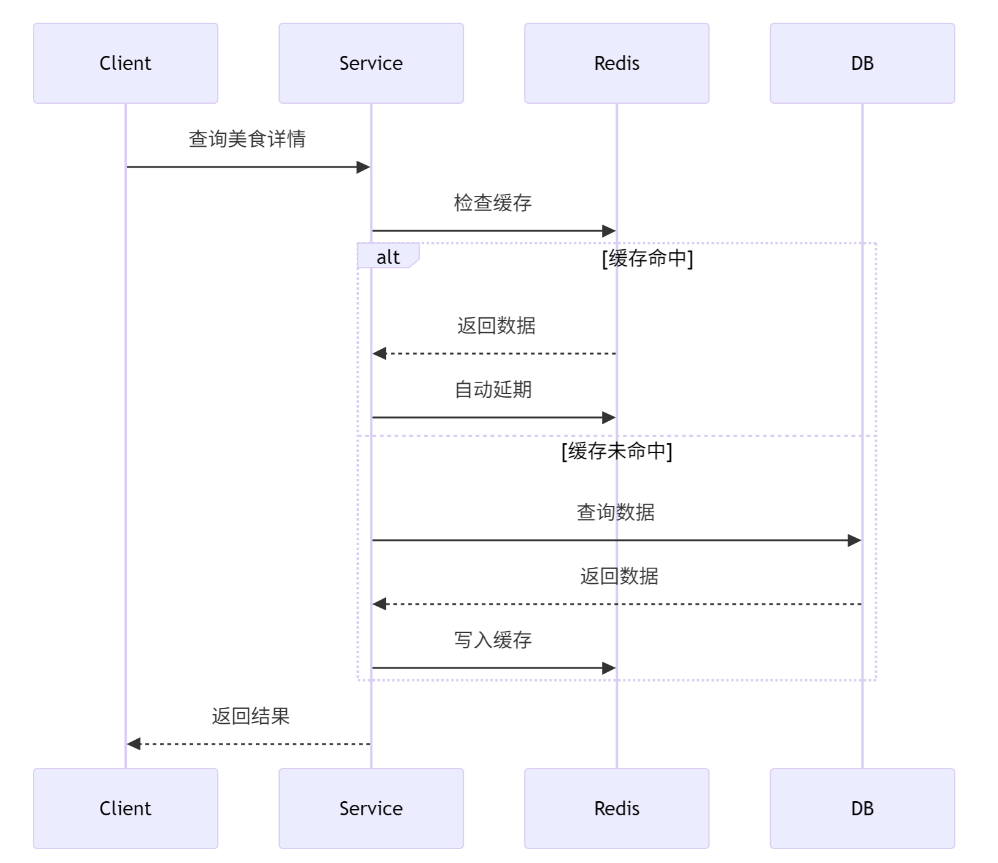

关键优化​：

1.  ​分布式锁​：解决缓存击穿问题。
2.  ​空值缓存​：设置短时间空值（30-100秒）防止穿透。
3.  ​自动延期​：访问时延长热点数据生命周期。

### **2、新增/更新美食信息**

这里依旧会添加一个分布式锁，防止重复灌入数据，写完数据库+ Redis 后释放锁。当成功写入数据库后写 Redis 缓存，过期时间为 2 天 + 随机数：

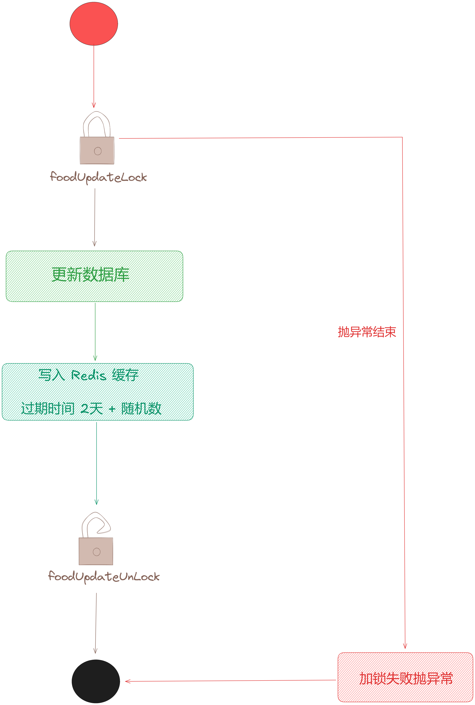

### **3、美食列表惰性分页缓存架构**

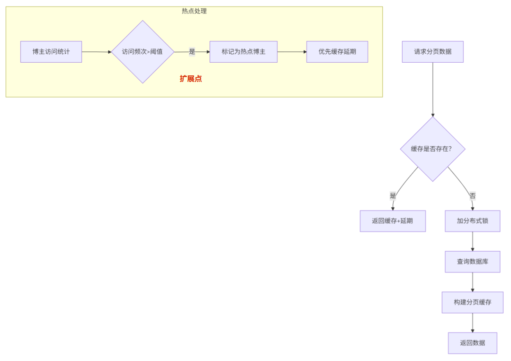

创新设计​：

1.  ​按需构建​：仅缓存被访问的分页。
2.  ​总量分离​：独立存储总条数（避免全量缓存）。
3.  ​热点识别​：自动标记高频访问博主（未来可扩展点）。

### **4、基于 RocketMQ 异步更新美食信息**

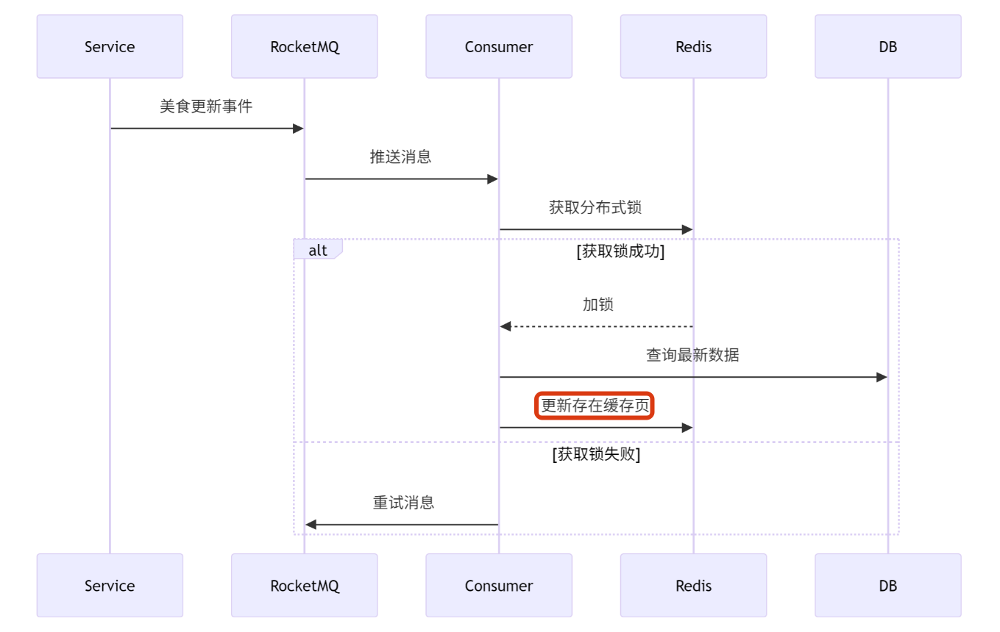

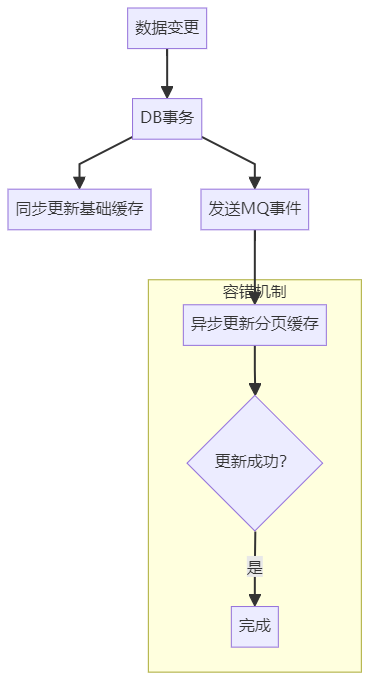

关键优势​：

1.  ​精准更新​：只刷新已存在的分页缓存（同上一节）。
2.  ​读写分离​：DB 操作与缓存更新解耦。
3.  ​流量削峰​：MQ 积压能力应对突发流量。

### **5、多级缓存架构保障极致访问性能**

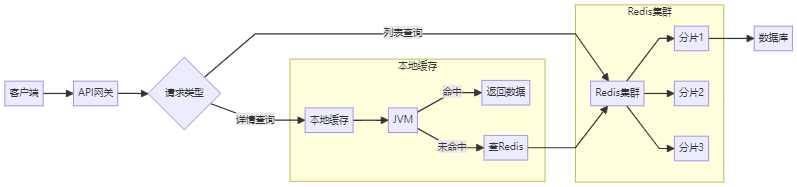

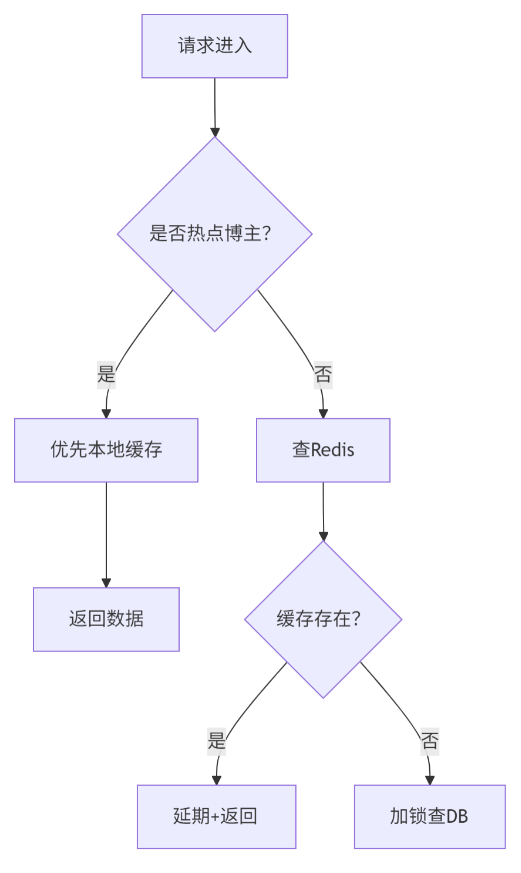

## **3.4 社交服务架构设计**

### **3.4.1 核心挑战**

### **3.4.1.1 关注服务核心挑战**

1.  亿级关系链存储：用户关注关系数据量巨大（用户量×平均关注数）。
2.  热点大V突发事件：大V 发布动态引发瞬时海量关注。
3.  双向关系一致性: 关注/取关需同时更新关注列表和粉丝列表。

### **3.4.1.2 计数服务核心挑战**

1.  高频写放大：热门内容瞬时百万点赞、关注、收藏、评论，需要高效计数。
2.  计数场景区分：根据不同的场景采用不同的计数方式来处理。对于「**社交热门内容**」场景，这里采用「**模糊计数**」方式在「**本地缓存 Caffeine**」中进行缓冲，达到「**阈值**」后再进行更新。

### **3.4.1.3 评论服务核心挑战**

1.  树形评论存储：二级评论模式高效存储检索。
2.  审核实时性：对于百万级评论，需要保障内容审核的实时性。
3.  高频写放大：热门内容瞬时百万评论。

### **3.4.2 架构设计与技术实现**

[【电商实战项目第十八篇】华仔电商实战项目关注服务通用基础功能基于 Redis List 和 RocketMQ 设计与开发](https://articles.zsxq.com/id_rk4je6vvs398.html)

[【电商实战项目第十九篇】华仔电商实战项目关注服务通用基础功能基于 Redis Zset 和 RocketMQ 进行重构](https://articles.zsxq.com/id_wpvd2uejj8ku.html)

[【电商实战项目第二十篇】华仔电商实战项目关注服务千万级流量下 Redis 缓存成本优化](https://articles.zsxq.com/id_qch8wwg1pmhc.html)

[【电商实战项目第二十一篇】华仔电商实战项目关注服务发生热点事件的解决方案](https://articles.zsxq.com/id_k0o5xtnjx6hh.html)

[【电商实战项目第二十二篇】华仔电商实战项目多级缓存方案对比](https://articles.zsxq.com/id_qivutr7lk8hr.html)

[【电商实战项目第二十三篇】华仔电商实战项目引入热点数据探测器 JD-hotkey 以及多级缓存代码落地方案](https://articles.zsxq.com/id_94vbbvp458wl.html)

[【电商实战项目第二十四篇】华仔电商实战项目关注服务高并发写场景优化解决方案](https://articles.zsxq.com/id_uab3xr6sbbne.html)

[【电商实战项目第二十五篇】华仔电商实战项目计数服务场景介绍与架构设计](https://articles.zsxq.com/id_6canxpdlnkwx.html)

[【电商实战项目第二十六篇】华仔电商实战项目计数服务基于 RocketMQ + Redis 基础功能开发和完善](https://articles.zsxq.com/id_xm9h2claxcs9.html)

[【电商实战项目第二十七篇】华仔电商实战项目计数服务高并发大数据量场景点赞+收藏优化](https://articles.zsxq.com/id_7d8nebca7xmw.html)

[【电商实战项目第二十八篇】华仔电商实战项目评论系统服务场景介绍与架构设计](https://articles.zsxq.com/id_7a8b1q2um4gw.html)

[【电商实战项目第二十九篇】华仔电商实战项目评论服务基于RocketMQ顺序消息+Redis Zset架构设计与功能实现](https://articles.zsxq.com/id_8gdm2cxz8r80.html)

[【电商实战项目第三十篇】华仔电商实战项目评论服务之评论审核架构设计与功能实现](https://articles.zsxq.com/id_zbugsqjp16kt.html)

[【电商实战项目第三十一篇】华仔电商实战项目评论列表基于时间排序与热度排序架构设计与实现](https://articles.zsxq.com/id_aww9msrgvwxn.html)

这里我们按照「**关注/收藏**」、「**计数**」、「**评论**」来分别看下其架构设计与性能优化。

### **3.4.2.1 关注/收藏架构设计**

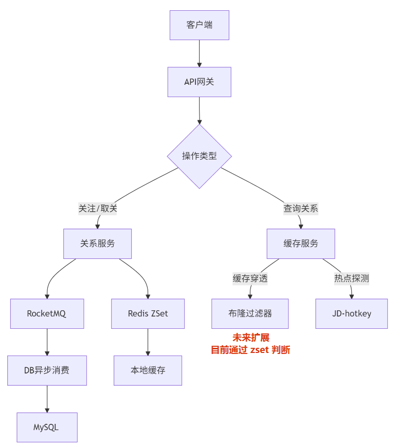

1.  数据存储​：
2.  ​Redis​：使用 ZSet 存储用户的关注列表（博主视角）和粉丝列表（粉丝视角），以时间戳为score实现按时间排序。
3.  ​MySQL​：持久化存储关注关系（user\_attention表）和粉丝关系（user\_follower表），以及计数信息（user\_counter表）。
4.  ​消息中间件​：
5.  ​RocketMQ​：用于异步消费+ Redis Lua 来处理关注/取关事件，实现最终一致性。
6.  ​缓存更新策略​：
7.  用户执行关注/取关操作时，发送MQ消息异步更新。
8.  通过消费者监听MQ消息，执行数据库更新和计数更新。
9.  ​布隆过滤器​（未来扩展点）：
10.  用于快速判断用户是否关注过某博主，减少不必要的数据库查询。

### **3.4.2.2 关注/收藏事件高并发读写**

### **1、写场景**

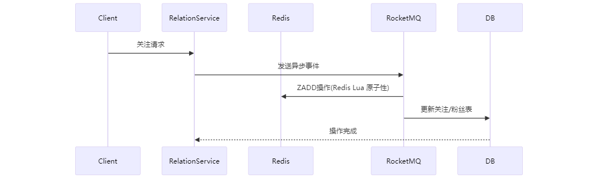

关键优化点：​​

1.  ​异步解耦​：DB + Redis 操作通过 RocketMQ 异步执行。
2.  ​Lua 脚本原子操作：基于 Redis Lua 脚本原子执行关注/收藏事件。​

### **2、读场景**

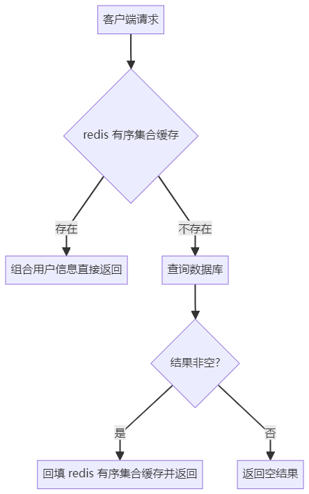

具体时序图：

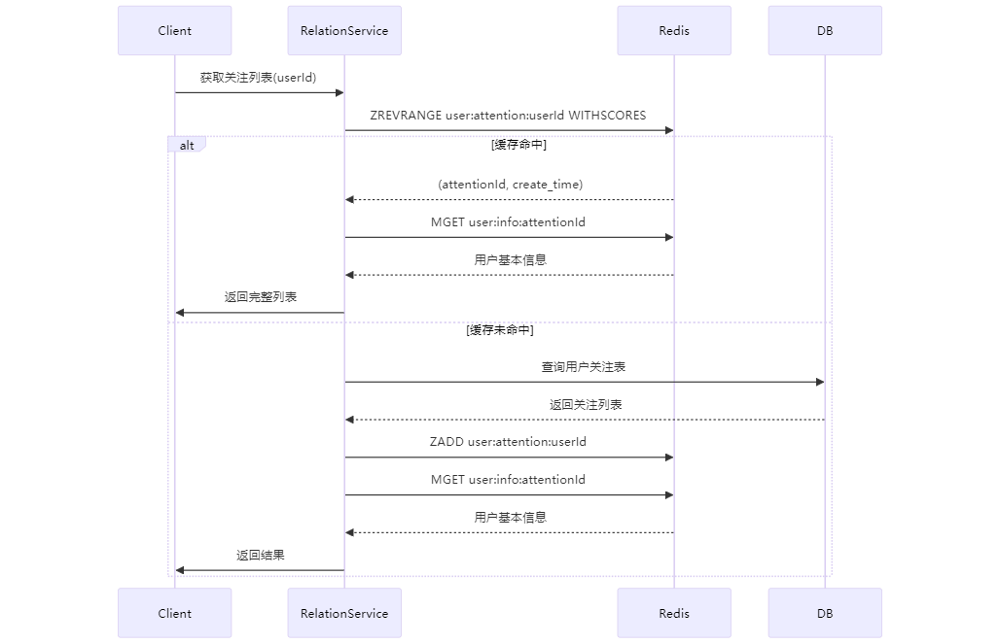

未来改进，增加本地缓存处理，目前本地缓存只做 String 类型的：

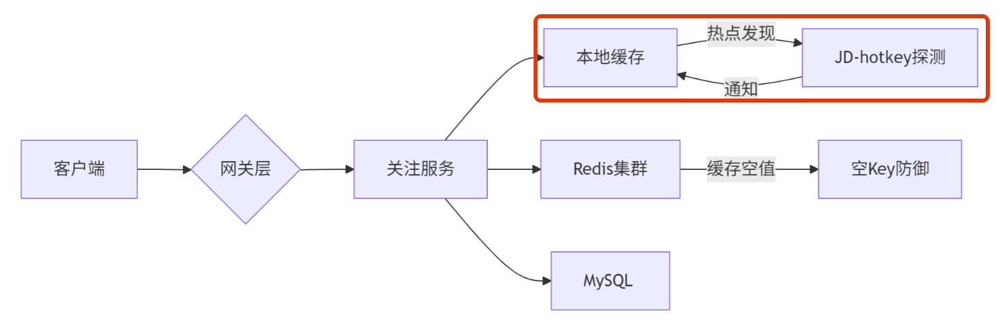

### **3.4.2.3 计数架构设计**

计数服务采用了一种混合策略，结合了Redis 缓存、本地缓冲区（Caffeine）和数据库（MySQL）来存储计数数据。

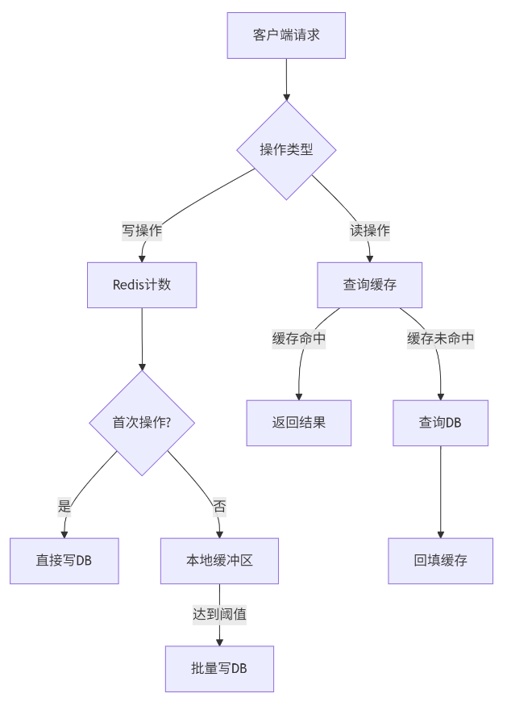

### **1、写操作流程**

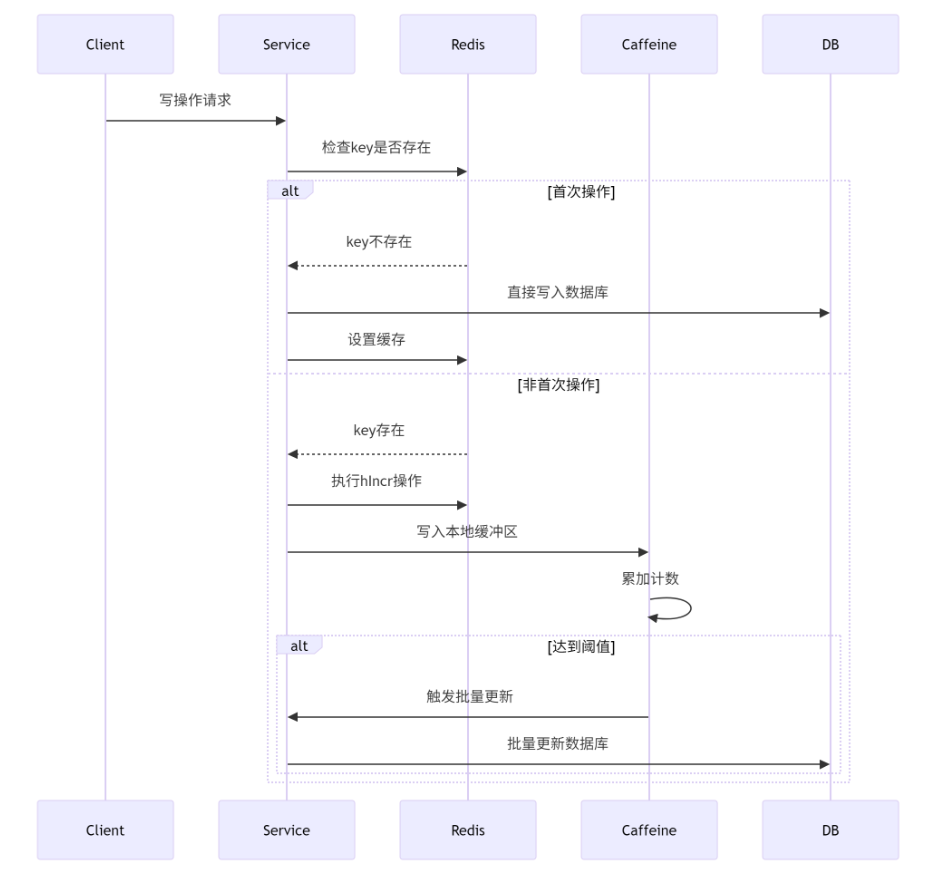

### **2、读操作流程**

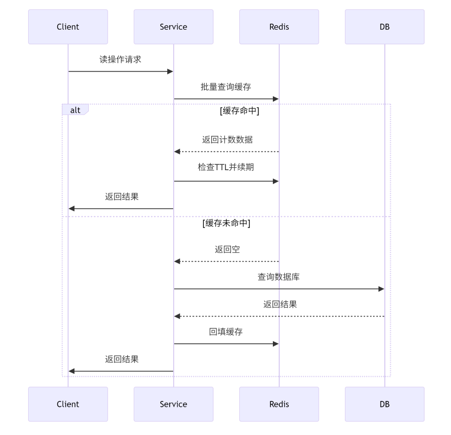

### **3、基于 Caffeine 本地缓冲区设计**

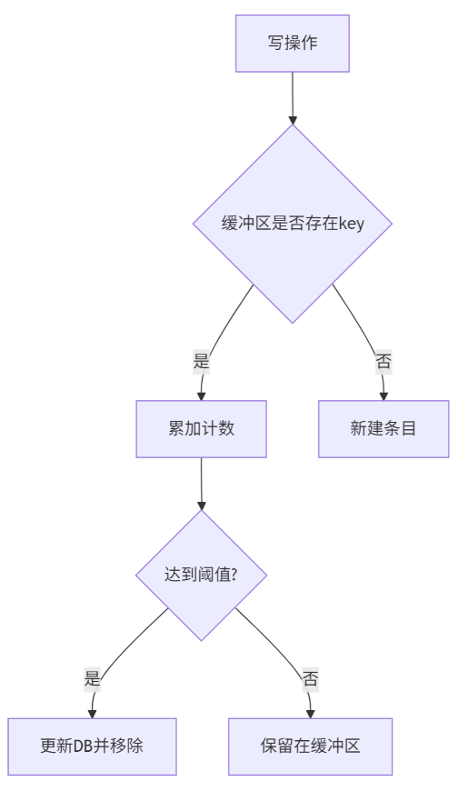

### **4、读写分离优化**

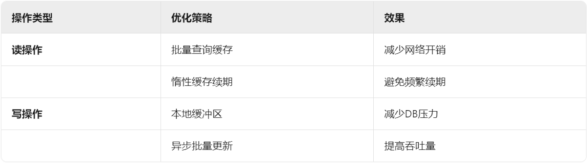

综上，通过三级缓存「**本地缓冲区**」、「**Redis 缓存**」、「**数据库**」来实现了高性能计数服务， 在保证数据最终一致性的前提下，大幅提升了系统的吞吐量和响应速度，特别适合高并发计数场景：

1.  ​写操作优化​：
2.  首次操作直接写DB。
3.  后续操作通过本地缓冲区合并写操作。
4.  达到阈值后批量更新DB。
5.  ​读操作优化​：
6.  批量查询缓存。
7.  惰性缓存续期机制。
8.  缓存未命中时回填。
9.  ​异步处理​：
10.  RocketMQ 解耦核心业务。
11.  消费者批量处理计数更新。

### **3.4.2.4 评论架构设计**

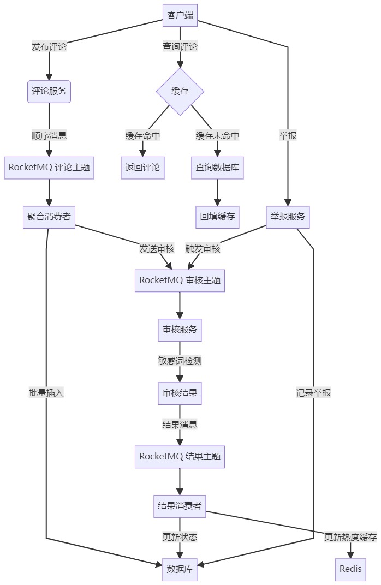

先来总结下整个流程的优点和可优化点：

1.  优点​：
2.  通过消息队列解耦，提高系统吞吐量。
3.  聚合写入减少数据库压力。
4.  多级缓存设计（Zset+String）优化查询性能。
5.  顺序消息保证同一美食评论的顺序性。
6.  ​可优化点​：
7.  缓存结构可考虑使用Hash存储评论详情，减少Key数量。
8.  分页查询在缓存未命中时，可考虑使用布隆过滤器避免缓存穿透。
9.  审核流程可扩展人工审核环节。

### **1、缓存设计(双维度存储)**

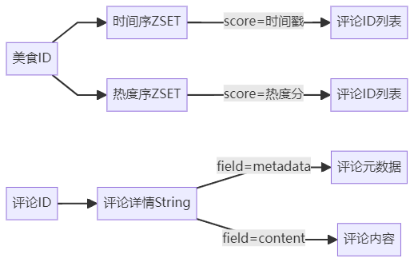

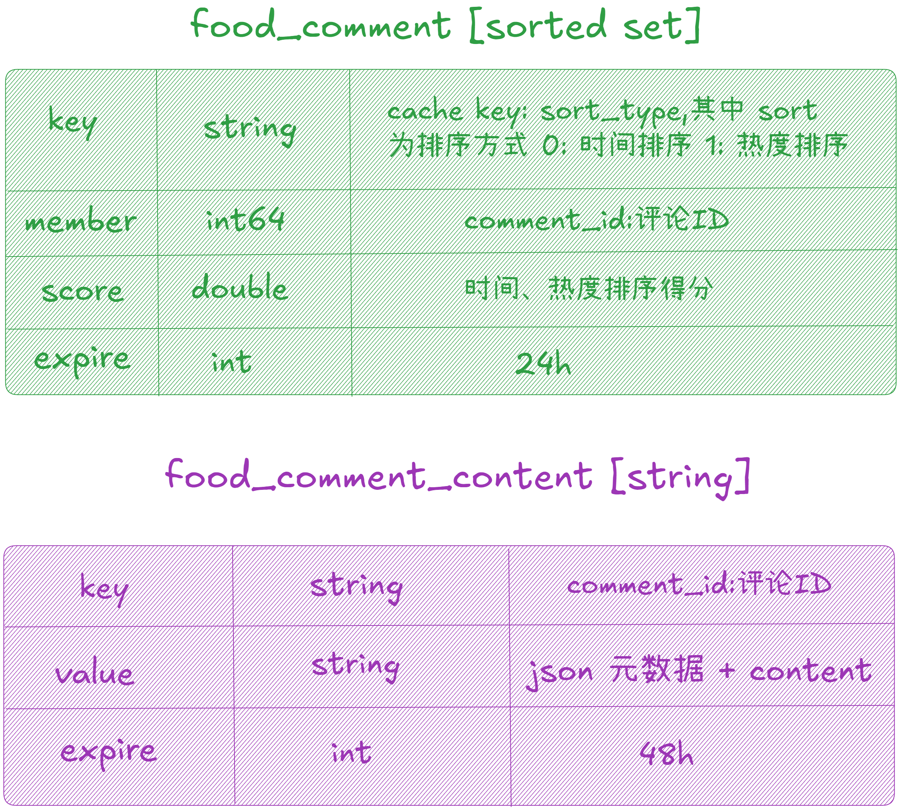

1.  Zset（有序集合）​​：存储两种排序的评论ID。
2.  时间序：food\_comment\_orderly\_{foodId}\_0，分数为评论创建时间戳。
3.  热度序：food\_comment\_orderly\_{foodId}\_1，分数为热度值（由点赞数、回复数等计算）。
4.  ​String​​：存储评论详情，key为{food\_comment\_{foodId}}\_commentId，value为序列化的评论对象（FoodCommentEntity）。

### **2、评论读写高并发设计**

#### 写场景高并发设计：

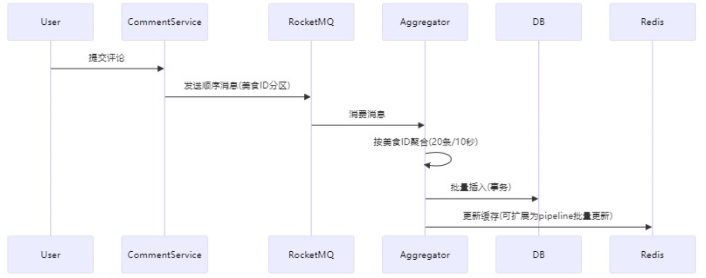

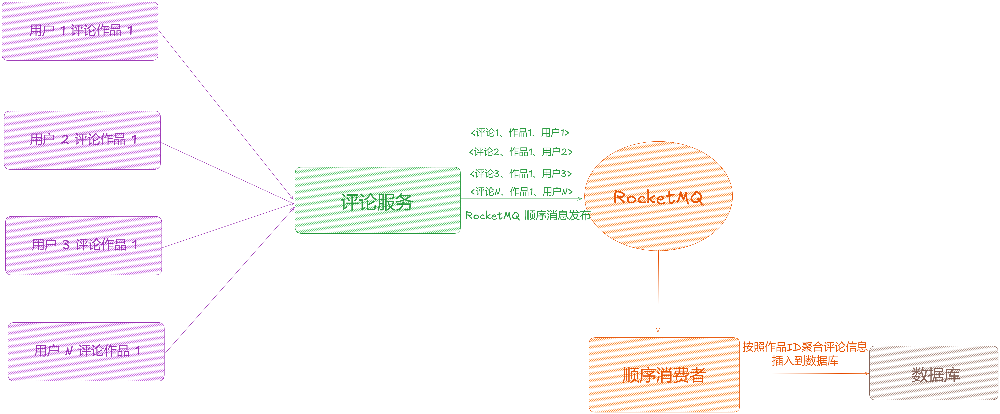

其关键优化点​：

1.  ​消息分区​：通过 RocketMQ 顺序消息（按美食ID分区）保证同一美食的评论顺序，避免乱序。
2.  ​动态聚合​：基于时间和数量双重阈值， 后续可以根据系统负载动态调整聚合阈值扩展。
3.  ​批量操作​：聚合后批量写入数据库，减少数据库压力。

读场景高并发设计：

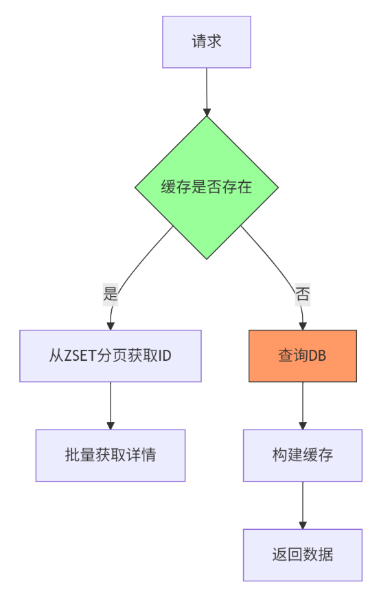

### **3、评论审核设计**

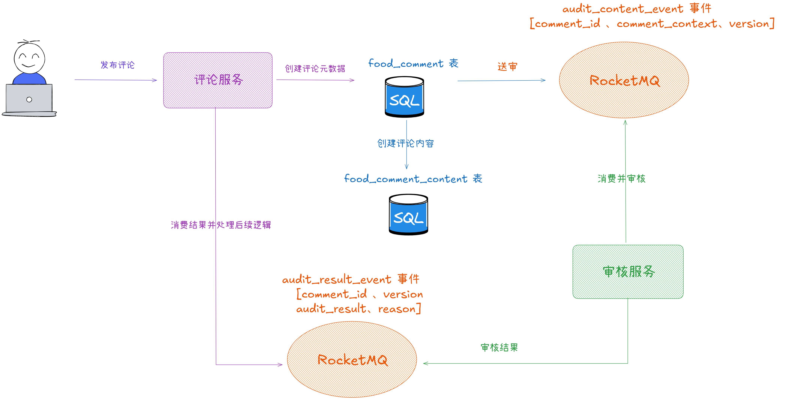

我们通过引入「**高性能敏感词**」检测工具和敏感词库来进行「**评论内容审核**」，自动标记违规评论。审核结果通过MQ顺序消息通知，更新评论状态。

整个流程也比较简单：

1.  评论发布后，内容发送到审核队列。
2.  审核服务消费消息，进行敏感词检测。
3.  审核结果（通过/拒绝）发送到结果队列。
4.  结果消费者更新评论状态，并触发缓存更新。

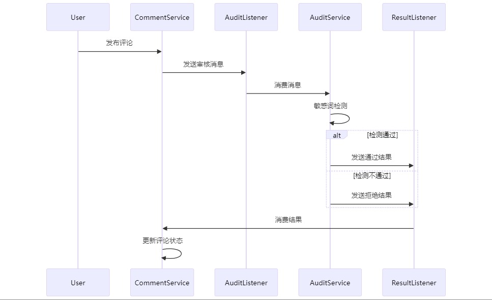

后续可增加「**人工审核**」流程：

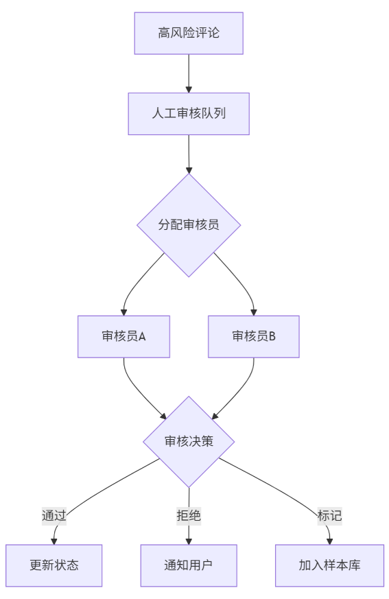

### **4、时间序与热度序评论列表设计**

对于业界亿级流量的社交/电商产品来说，「**评论列表**」是个非常关键且重要的场景，而且支持「**时间排序**」和「**热度排序**」两种排序方式。

### **时间序评论列表**

按「**时间排序**」简单的话可以基于数据库实现，这里分两种情况：「**按时间由远及近排序**」和 「**按时间由近及远排序**」，先来看下。

1.  如果评论列表是「**按时间由远及近排序**」的，那么「**前 N 条**」评论数据是「**相对固定**」的，缓存极少需要更新的。
2.  如果评论列表是「**按时间由近及远排序**」的，那么「**前 N 条**」评论数据「**随时都可能发生动态变化**」，且内容越热门，「**前 N 条**」评论数据变化的越快。对于这种情况来说，可以将 Redis 作为数据库的伪从库，即每当将一条评论插入数据库时，即将此评论插入 Redis Zset 对象中。

这里我们考虑到「**高并发**」读取评论列表对 Redis 造成的请求压力，可以进一步构建「**本地缓存**」，评论服务将从 Redis ZSET 对象中获取到的评论列表缓存到「**本地缓存**」中，并设置过期时间 5s。

对于「**按时间由近及远排序**」的评论列表来说，「**本地缓存**」导致用户拉取到最多 5s 前的评论，而非最新的「**前 N 条**」评论。好在用户并非在意一定要看到最新的评论，只要评论数据相对比较新即可。所以我们可以使用「**本地缓存**」进一步应对高并发读取评论列表的请求，只是不要将「**本地缓存**」的过期时间设置得很大就好。

最终基于缓存的架构图如下：

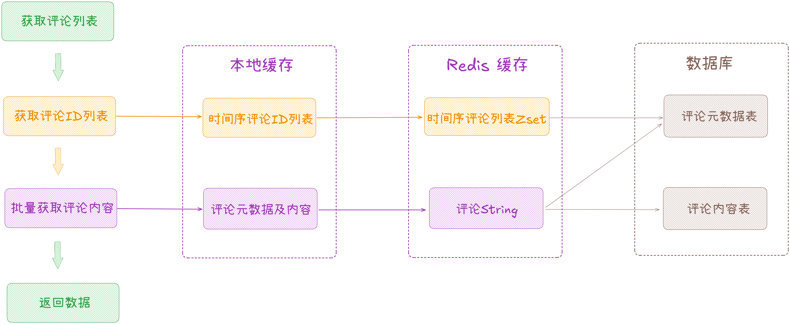

流程如下：

1.  当用户访问某页的 10 条评论时，评论服务先获取评论 ID 列表。
2.  先访问时间序评论列表的本地缓存，如果命中「**本地缓存**」，则从「**本地缓存**」获取时间序评论 ID 列表。
3.  如果未命中「**本地缓存**」，则从 「**Redis 缓存**」中获取时间序评论 ID 列表。
4.  如果未命中「**Redis 缓存**」，则从 「**数据库**」中获取时间序评论 ID 列表。
5.  完成第一步流程后，如果评论服务获取到若干评论 ID 列表后，开始批量获取评论元信息及内容。
6.  同第一步类似，先从「**本地缓存**」批量获取评论元信息及内容。
7.  如果未命中「**本地缓存**」则从「**Redis 缓存**」中批量获取评论元信息及内容。
8.  如果未命中「**Redis 缓存**」，则从 「**数据库**」中批量获取评论元信息及内容。
9.  最后将时间序评论 ID 列表和评论元信息及内容写入「**本地缓存**」和 「**Redis 缓存**」。

### **热度序评论列表**

对于很多互联网应用来说都会选择在评论区优先展示一些「**热度较高**」的一级评论。把他们优先展示出来可以使评论区变得更有吸引力，从而增加用户粘性。

既然是按照「**热度排序**」那么就需要先度量一条评论有多热门。不同应用规则不同标准，大部分的标准如下：

1.  按照点赞数：评论被点赞的次数越多，评论就越热门。
2.  按照回复数：评论被回复的次数越多，评论就越热门，即其二级评论列表的长度越长，评论就越热门。
3.  按照点赞数和回复数加权：点赞数和回复数一起来反映一条评论的互动性，热度可以是两者做比重加权，比如：点赞数 \* 0.4 + 回复数 \* 0.6 作为热度值，比例可自行调整。

这里有些规则需要说明下：

1.  按照热度排序，并不意味着一个评论区中的所有评论都按照此规则。当我们打开评论区时，比如：首先展示的是热度排名前 500 的评论，在评论区中刷完这 500 条评论后，后面的都是按照评论发布时间「**由近及远**」排序。
2.  如果一条评论没有任何点赞和回复，即热度值为 0，则不属于热门评论因此不参与热度排名。
3.  在刷完热门评论后，按照评论发布时间排序的评论列表中依然可能会包含「**热门评论**」，即用户会刷到重复的评论。

热度序列表读取流程如下：

1.  首先，构建实时的「**热门评论 ID 列表**」。以「**点赞数**」与「**回复数**」的「**加权度量方式**」为例，由于一级评论在收到「**点赞**」、「**回复**」时，此评论的热度也会发生相应的变化，所以需要「**监听评论**」的「**点赞事件**」与「**回复事件**」。
2.  当「**点赞事件**」与「**回复事件**」发生后，根据此评论的最新「**点赞数**」与「**回复数**」重新计算「**热度值**」并写人 Zset 集合中，以达到评论热度排名实时更新的目的。如果一条评论被删除了，那么在「**热门评论列表**」中应该同时删除此评论，所以也需要「**监听评论被删除**」的事件。
3.  创建消费者服务 [foodHotCommentEventTriggerListener](http://foodhotcommenteventtriggerlistener/)，通过 MQ 监听评论的「**点赞事件**」、「**回复事件**」、「**删除事件**」，负责热门评论的实时构建工作。假设在作品 1 的评论区中一级评论 2 的当前点赞数是 10，回复数是 8 ，其热度值= [10 x 0.4 + 8 x 0.6 = 8.8](http://10%20x%200.4%20+%208%20x%200.6%20=%208.8/)。
4.  那么此评论依次收到「**点赞**」、「**回复**」以及「**删除**」时，消费者服务 [foodHotCommentEventTriggerListener](http://foodhotcommenteventtriggerlistener/) 需要做:
5.  1）、评论 2 收到一个点赞，即当前点赞数变为 11。
6.  2）、消费者服务收到评论 2 的点赞事件，从评论元信息的 [food\_comment](http://food_comment/) 数据表中获取其最新的「**点赞数**」与「**回复数**」得到 11 和 8。
7.  3）、消费者服务重新计算评论 2 的热度值为 11 x 0.4 + 8 x 0.6 = 9.2。
8.  4）、消费者服务对作品 1 的「**热门评论列表**」更新评论 2 的热度，向 Redis ZSET 数据类型中发起请求 [ZADD food\_comment:1:1 9.2 2](http://zadd%20food_comment:1:1%209.2%202/)。
9.  5）、当评论 2 又被回复一次，即当前回复数变为 9。
10.  6）、消费者服务收到评论 2 的「**回复事件**」，接着从 [food\_comment](http://food_comment/) 数据表中得到它的最新点赞数为 11，回复数为 9。
11.  7）、消费者服务重新计算评论 2 的热度值为 [11 x 0.4 + 9 x 0.6 = 9.8](http://11%20x%200.4%20+%209%20x%200.6%20=%209.8/)。
12.  8）、消费者服务接着对作品 1 的「**热门评论列表**」更新评论 2 的热度，向 Redis ZSET 数据类型中发起请求 [ZADD food\_comment:1:1 9.8 2](http://zadd%20food_comment:1:1%209.8%202/)。
13.  9）、当评论 2 被删除，消费者服务收到此事件后从 Redis ZSET 数据类型中删除此评论 [ZREM food\_comment:1:1](http://zrem%20food_comment:1:1%202/) [2](http://zrem%20food_comment:1:1%202/)。
14.  其次，在前面也说过，在按照「**热度排序**」的评论区中，并不是全部评论都是此规则，而是先展示最多 500 条按照「**热度排序**」的评论，再展示按照「**评论发布时间由远及近排序**」的评论。当用户的一次刷评论请求只读取某一页的评论、比如 10 条评论，假设目前在作品 1 的评论区中有 15 条「**热门评论**」，那么第 1 页的评论全部来自「**热度排序评论列表**」，第 2 页的评论来自「**热度排序评论列表**」和「**时间排序评论列表**」组合，第 3 页到最后一页的评论全部来自「**时间排序评论列表**」。

整个消费者处理流程图如下：

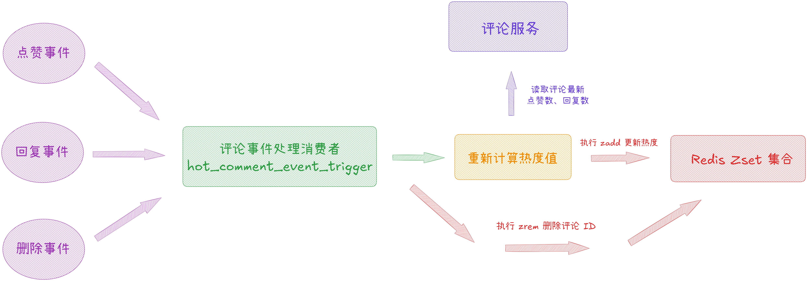

最终基于缓存的架构图如下：

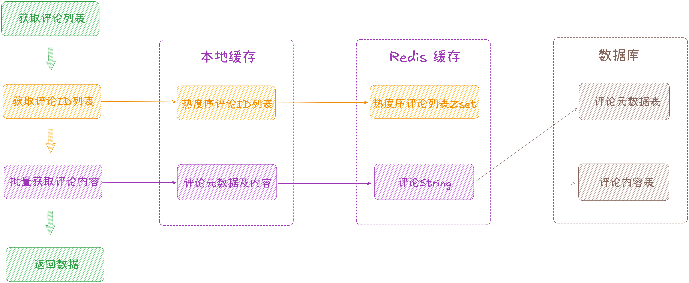

## **3.5 购物车服务架构设计**

### **3.5.1 核心挑战**

购物车系统在电商平台中扮演着核心角色，其设计面临多重挑战：

1.  高并发读写挑战：秒杀活动期间瞬间涌入大量用户操作购物车（加购/删除/修改）
2.  数据一致性挑战: 缓存与数据库、多客户端同时修改购物车导致数据不一致。
3.  业务多维数据聚合：购物车需实时聚合商品价格、库存、优惠券等信息。
4.  商品价格动态计算：优惠券、会员价、满减活动需实时重算。
5.  资源成本挑战：海量用户购物车数据占用大量 Redis 内存。

### **3.5.2 架构设计与技术实现**

[【电商实战项目第三十二篇】华仔电商实战项目购物车服务业务场景介绍及架构设计](https://articles.zsxq.com/id_bnpiarv1ds21.html)

[【电商实战项目第三十三篇】华仔电商实战项目购物车服务基于 RocketMQ + Redis 基础功能架构设计与实现](https://articles.zsxq.com/id_dl6vs5gjl80e.html)

[【电商实战项目第三十四篇】华仔电商实战项目购物车服务并发场景下加购问题解决](https://articles.zsxq.com/id_bpk6d7qxuzt6.html)

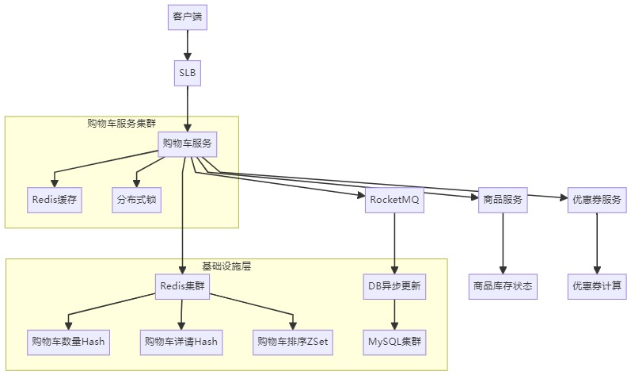

#### 核心流程控制

1.  ​写入流程​：客户端 → 业务逻辑 → 分布式锁 → 缓存更新 → 发送 MQ → DB异步落地。
2.  ​读取流程​：客户端 → 查询缓存 → 缓存失效时降级DB → 缓存重建。

### **3.5.2.1 精细化缓存设计**

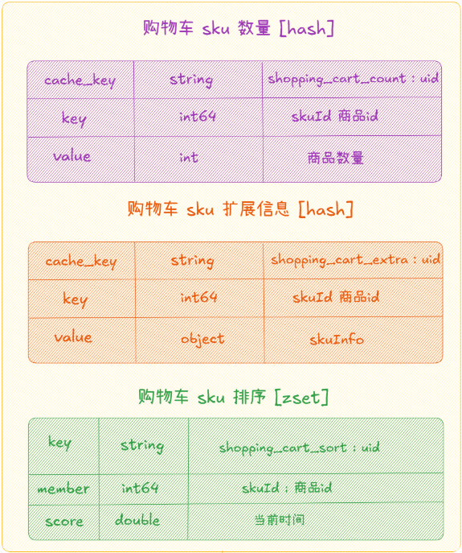

### **1 、缓存结构**

使用三种数据结构存储购物车信息：

1.  ​Hash结构（数量信息）​​：shopping\_cart\_count:{userId} -> <skuId, count>
2.  ​Hash结构（扩展信息）​​：shopping\_cart\_extra:{userId} -> <skuId, CartSkuInfoVo的JSON>
3.  ​ZSet结构（排序）​​：shopping\_cart\_sort:{userId} -> <skuId, 操作时间戳>

### **2、空缓存容错处理**

当用户购物车为空时，设置空缓存标识（带随机过期时间）防止穿透：

1.  Key: shopping\_cart\_empty:{userId}
2.  Value: EMPTY\_CACHE\_IDENTIFY
3.  TTL: 30~100秒随机

### **3、缓存更新/淘汰策略**

1.  写操作​（添加/更新/删除）：
2.  先更新 Redis 三部分缓存（数量Hash、扩展信息Hash、排序ZSet）。
3.  再发送 MQ 异步更新数据库。
4.  ​读操作​：
5.  优先读缓存，若缓存无数据则读 DB 并重建缓存。
6.  如果 DB 中无数据，设置空缓存。

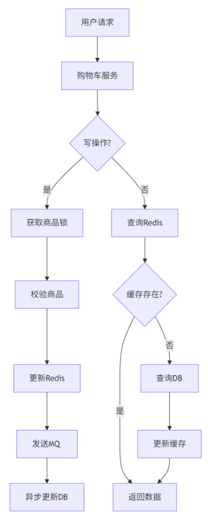

下图是缓存更新/淘汰策略：

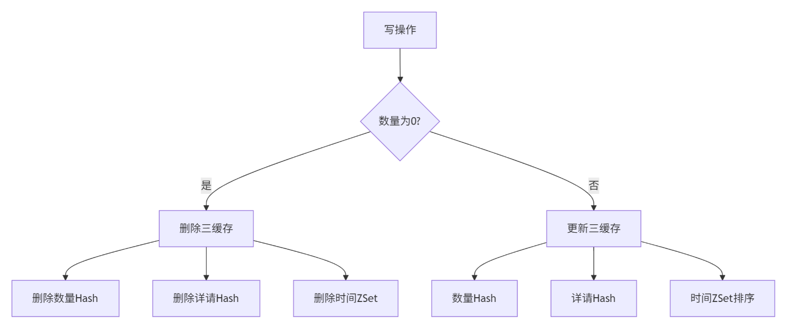

### **3.5.2.2 高并发读写设计**

### **1、并发写控制**

​商品级分布式锁​：对同一用户同一商品加锁（Key: cart\_change\_lock\_key:{userId}:{skuId}），确保同一时间只有一个线程操作该商品。

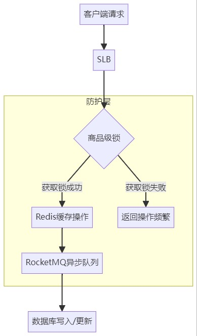

### **2、异步更新数据**

1.  购物车数据变更后，通过 RocketMQ 异步更新数据库，峰值使承载流量，可以大大减轻数据库压力。
2.  监听器 CartAsyncUpdateListener 批量消费消息更新 DB。

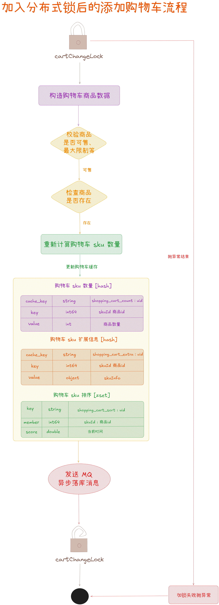

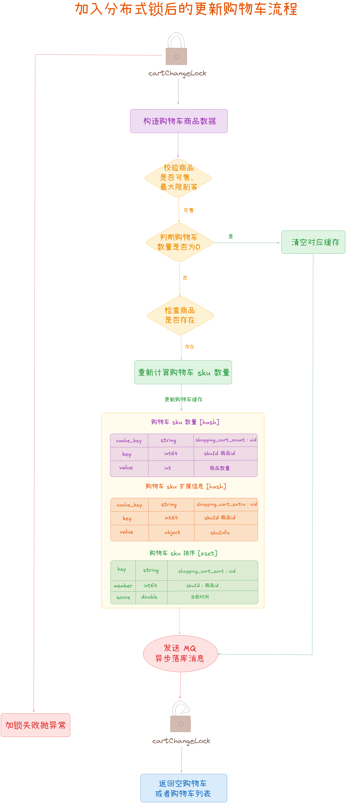

### **3、缓存与数据库一致性**

1.  ​先更缓存，再异步更DB​：用户操作后立即更新缓存，保证前端及时感知，再通过MQ异步持久化到DB。
2.  ​最终一致​：允许短暂不一致，通过 MQ 重试保证最终一致。

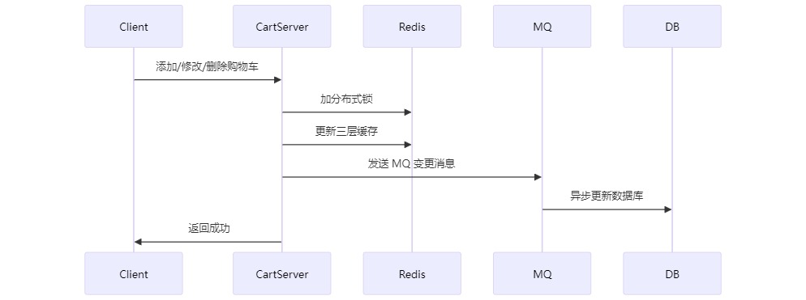

### **4、热点商品处理**

1.  商品操作锁确保单个商品更新串行化。
2.  通过消息队列削峰填谷，避免瞬时高并发冲击 DB。

### **5、读性能优化**

1.  ​多层缓存结构​：ZSet 用于排序，Hash 用于快速获取详情，支持高效分页和排序。
2.  ​缓存重建​：当缓存不完整（如部分被淘汰）时，通过 DB 重建。

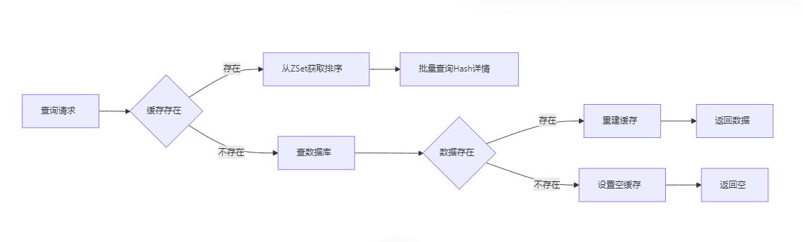

### **3.5.2.3 架构亮点总结**

1.  高效缓存结构​：
2.  三层结构分离（数量、详情、排序）缓存满足不同查询需求。
3.  按时间排序 ZSet 支持最近操作优先展示。
4.  ​安全设计​：
5.  商品状态实时校验（库存、上架状态、优惠计算）。
6.  购物车单个商品数量上限（100 个）。
7.  ​容错机制​：
8.  空缓存标识防止穿透。
9.  MQ消费失败重试机制。
10.  缓存部分失效时降级查DB重建缓存。
11.  ​异步化​：
12.  非实时要求操作（如DB更新）通过MQ异步执行，提升响应速度。

总结购物车服务设计特点：

1.  ​高性能​：通过Redis缓存提供高速读写。
2.  ​高并发​：商品级锁+异步更新支撑高并发写。
3.  ​最终一致​：通过 MQ 异步保证缓存与DB最终一致。
4.  ​可扩展​：缓存和 MQ 均可水平扩展。

## **3.6 商品服务架构设计**

### **3.6.1 核心挑战**

商品系统在电商平台中扮演着核心角色，其设计面临多重挑战：

1.  海量商品数据存储与检索​：商品数据量达到千万甚至亿级，传统数据库难以支撑高效查询。
2.  ​高性能搜索需求​：用户需要快速、准确的搜索体验，特别是模糊搜索、关键词建议等。
3.  ​高并发访问​：商品详情页、搜索页面等面临高并发读请求，特别是在大促期间。
4.  ​数据一致性问题​：商品数据在多个存储之间（MySQL、ES、Redis等）需要保持一致性。
5.  ​热点商品访问​：某些热门商品可能面临极高的并发读取压力（例如秒杀商品）。
6.  ​实时索引构建​：商品数据变更后需要及时同步到搜索引擎（ES）中。
7.  ​服务稳定性​：商品服务作为核心服务，需要保证高可用、可扩展和容错性。
8.  ​系统复杂度高​：引入多个中间件（ES、Canal、RocketMQ、Redis等），系统维护和问题排查难度大。

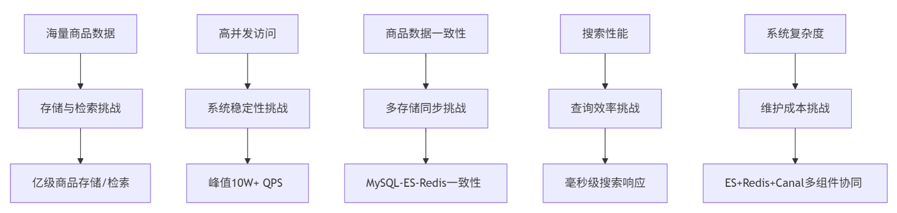

### **3.6.2 架构设计与技术实现**

[【电商实战项目第三十五篇】华仔电商实战项目商品中心服务业务场景介绍](https://articles.zsxq.com/id_4oqq5qcld73u.html)

[【电商实战项目第三十六篇】华仔电商实战项目商品中心服务数据库设计及架构设计](https://articles.zsxq.com/id_8libh7xvbehu.html)

[【电商实战项目第三十七篇】华仔电商实战项目商品中心服务基于 Redis + HotKey 基础功能开发](https://articles.zsxq.com/id_0tt4v90mw71w.html)

[【电商实战项目第三十八篇】华仔电商实战项目商品中心服务引入 ElasticSearch 后的搜索架构设计](https://articles.zsxq.com/id_j90pkrt1vqj3.html)

[【电商实战项目第三十九篇】华仔电商实战项目商品中心服务手把手安装 ElasticSearch 8.5.2 版本及分词器](https://articles.zsxq.com/id_68an3a0r8lw2.html)

[【电商实战项目第三十九篇】华仔电商实战项目商品中心服务手把手安装 ElasticSearch 7.9.3 版本及分词器](https://articles.zsxq.com/id_wp5i9us9k7d4.html)

[【电商实战项目第四十篇】华仔电商实战项目商品中心服务 Elasticsearch 索引设计](https://articles.zsxq.com/id_luh8dwse3hn6.html)

[【电商实战项目第四十一篇】华仔电商实战项目商品中心服务 Elasticsearch 写入10W商品数据基础功能接口开发](https://articles.zsxq.com/id_gz67j9sbworq.html)

[【电商实战项目第四十二篇】华仔电商实战项目商品中心服务 Elasticsearch 10W商品数据接口优化与双索引写入](https://articles.zsxq.com/id_ws9nsh460mbt.html)

[【电商实战项目第四十三篇】华仔电商实战项目商品中心服务 Elasticsearch 10W商品 suggest 索引优化](https://articles.zsxq.com/id_6dh27mzwcap4.html)

[【电商实战项目第四十四篇】华仔电商实战项目商品中心服务Elasticsearch 10W商品搜索及suggest接口开发](https://articles.zsxq.com/id_76xgx3mkx3z4.html)

[【电商实战项目第四十五篇】华仔电商实战项目商品中心服务基于 Canal + RocketMQ 实现商品数据增量同步 ES](https://articles.zsxq.com/id_7z84tu1u1zst.html)

[【电商实战项目第四十六篇】华仔电商实战项目商品中心服务千万级商品数据全量同步 ES 性能优化](https://articles.zsxq.com/id_47pxha425h4u.html)

[【电商实战项目第四十七篇】华仔电商实战项目接入微服务全家桶之注册中心与配置中心 Nacos 3.0 及 feign 依赖](https://articles.zsxq.com/id_72j8opdvxzge.html)

[【电商实战项目第四十八篇】华仔电商实战项目接入微服务全家桶之服务治理利器 Sentinel](https://articles.zsxq.com/id_zel04oa1imkn.html)

[【电商实战项目第四十九篇】华仔电商实战项目接入微服务全家桶之应用监控与链路跟踪 SkyWalking](https://articles.zsxq.com/id_mjeiahr5c0o9.html)

[【电商实战项目第五十篇】华仔电商实战项目之亿级流量大型商品中心服务详情页整体架构设计](https://articles.zsxq.com/id_8wkf76qwrd16.html)

[【电商实战项目第五十一篇】华仔电商实战项目之亿级流量大型商品中心详情页动态渲染服务架构设计与机房部署规划](https://articles.zsxq.com/id_l538ht1nvb76.html)

[【电商实战项目第五十二篇】华仔电商实战项目之亿级流量大型商品中心详情页动态渲染服务部署](https://articles.zsxq.com/id_kf8t1tw7xh8a.html)

[【电商实战项目第五十三篇】华仔电商实战项目之亿级流量大型商品中心详情页动态渲染服务功能开发](https://articles.zsxq.com/id_hn7g2tn14v7n.html)

[【电商实战项目第五十四篇】华仔电商实战项目之亿级流量大型商品中心详情页统一处理服务架构设计与功能开发](https://articles.zsxq.com/id_9tf82105ol31.html)

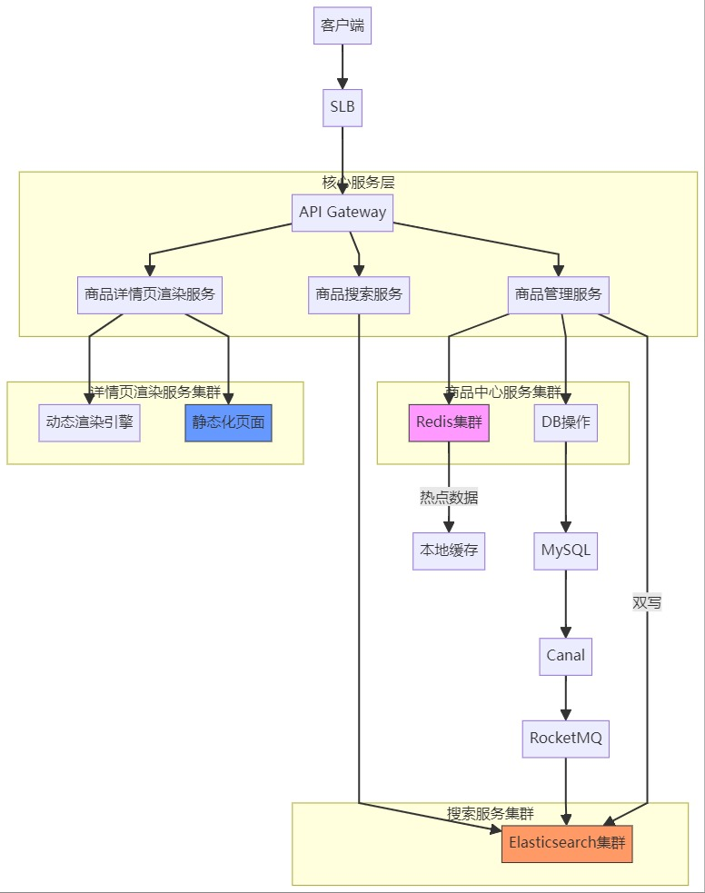

### **3.6.2.1 缓存设计**

1.  多级缓存架构​：
2.  一级缓存：本地缓存（如 Hotkey）缓存热点商品数据，应对瞬时高峰。
3.  二级缓存：Redis 集群缓存商品基础信息、详情页聚合数据等。
4.  三级缓存：Elasticsearch 存储商品全文索引，支持复杂查询。
5.  ​缓存数据结构​：
6.  ​商品基础信息​：使用 Redis String 结构，product\_dim\_info:{skuId} 存储商品字段。
7.  ​热点商品​：利用 Redis 分片 + 本地缓存（Hotkey）应对超高并发。
8.  ​缓存更新策略​：
9.  ​被动更新​：缓存失效后从数据库加载，加空缓存避免缓存穿透。
10.  ​缓存穿透/雪崩​：
11.  ​穿透​：缓存空对象（设置短过期时间）。
12.  ​雪崩​：缓存失效时间随机化，避免同时失效。

### **3.6.2.2 高并发读写设计**

### **1、商品搜索服务**

引入 「**ElasticSearch 搜索引擎**」后的架构图，如下：

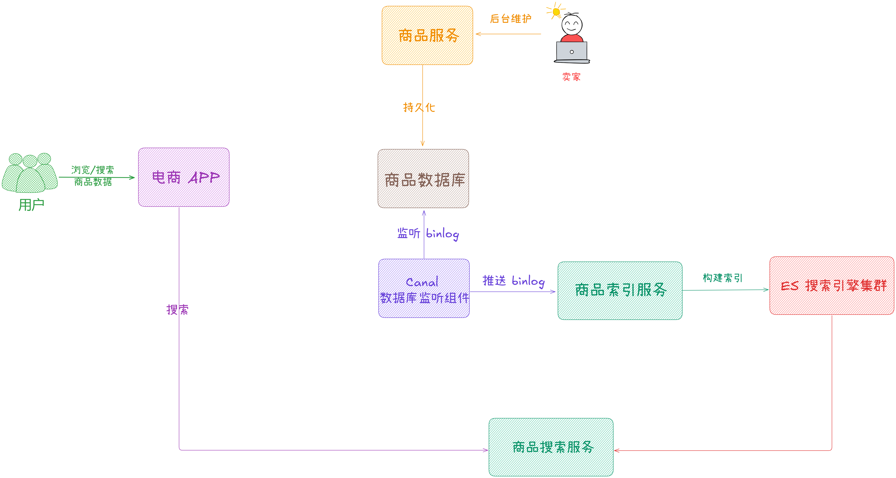

我们来梳理下上面这张图的流程：

1.  首先，卖家需要在「**运营后台**」维护商品相关数据。
2.  「**商品服务**」会将卖家维护的商品数据写入到「**商品数据库**」中。
3.  接着，启动「**Canal 监听组件服务**」，会监听此时写入数据库的 binlog，然后推送 binlog 给「**商品索引服务**」。
4.  「**商品索引服务**」会调用 ES 相关 API 进行构建 ES 索引。
5.  当上述都完成后，用户就可以通过「**商品搜索服务**」进行搜索相关商品了。

整个搜索业务流程如下：

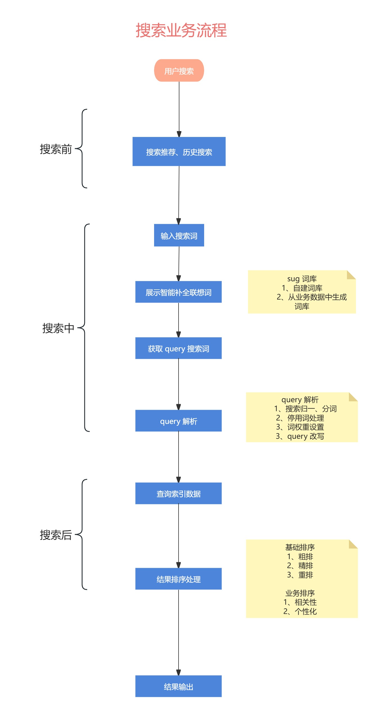

「**索引构建**」主要是把「**原始商品信息**」变成一个「**倒排索引**」的过程，整个过程最关键包括：需要索引什么数据、数据分词、构建倒排索引。 因为底层使用的是 ES，所以最后构建倒排索引这个环节我们忽略，基本 ES 把整个环节过程解决了。

整个数据进入 ES 索引库中，总体的数据索引构建的架构图如下：

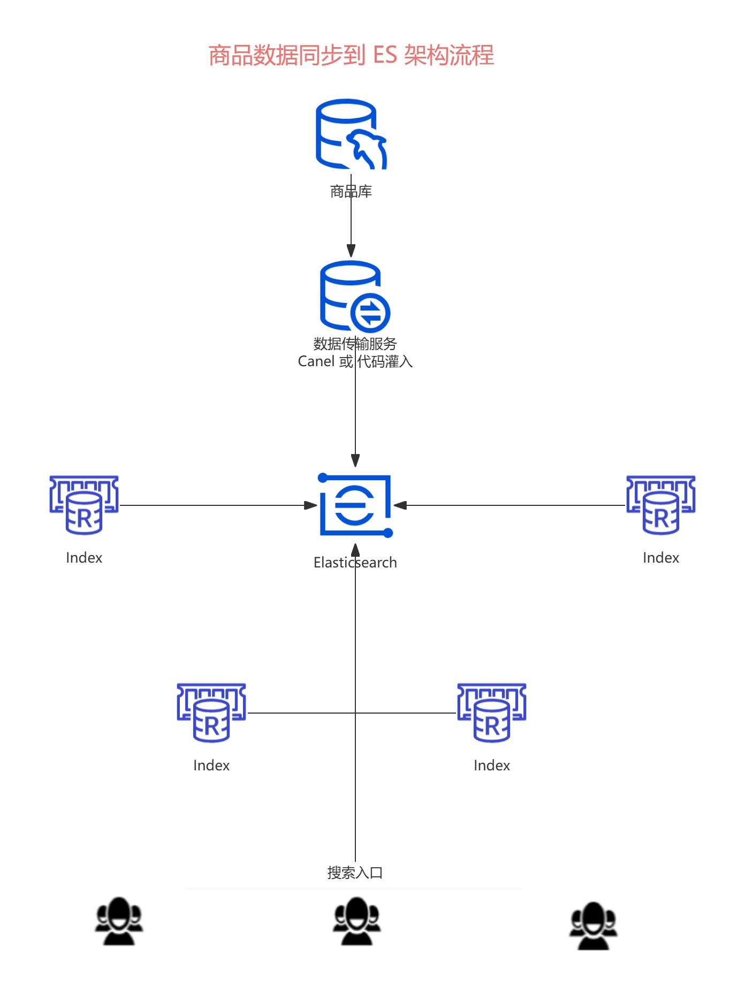

### **2、多线程并发全量同步到 ES**

这里我们设计了一个高性能、可扩展的全量数据同步架构，并实现10万到千万级数据同步方案。

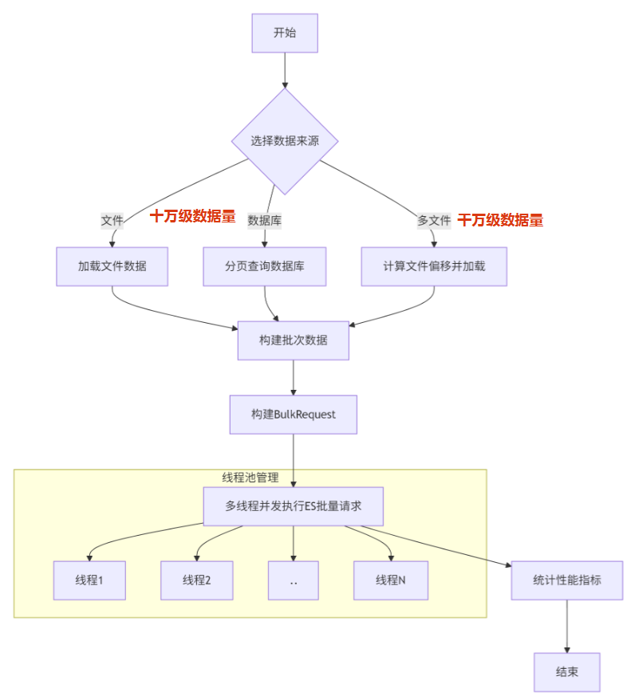

同时使用了「**并发编程**」的相关技术，主要有：[CountDownLatch](http://countdownlatch/)、[Semaphore](http://semaphore/)、[ThreadPoolExecutor](http://threadpoolexecutor/)、[SynchronousQueue](http://synchronousqueue/)。

1.  并发控制​：
2.  Semaphore：确保同时运行的线程数不超过 threadCount。每个线程获取信号量后执行，执行完毕释放信号量。
3.  ​任务同步​：
4.  CountDownLatch：初始化为批次次数，每个任务完成时递减，主线程等待直到所有任务完成。
5.  ​线程池​：
6.  使用 ThreadPoolExecutor，核心线程数 threadCount，最大线程数 threadCount \* 2，等待队列为 SynchronousQueue（直接提交策略，即没有队列缓冲，直接创建新线程直到最大线程数）。
7.  空闲线程 60 秒后回收。

整个处理流程图如下：

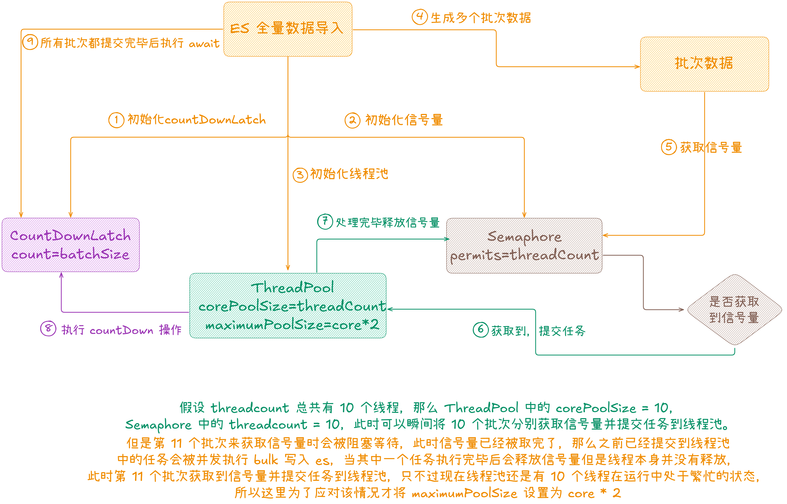

整个同步流程时序图如下：

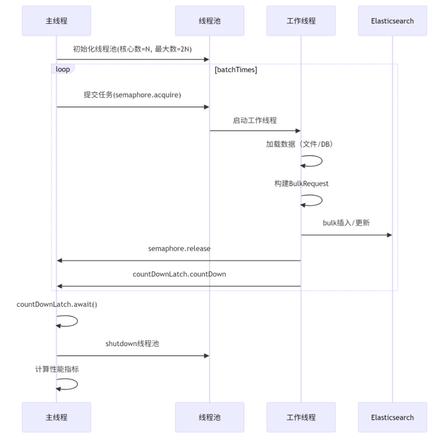

另外针对千万级数据量做了以下性能优化：

1.  双缓冲队列设计: 使用SynchronousQueue作为工作队列, 核心线程数 = 并发控制数, 最大线程数 = 2 \* 核心数（应对突发流量）。
2.  ​智能文件分片策略​：避免一次性加载所有数据到内存，通过计算文件分片来按需加载。
3.  批处理大小​：通过 batchSize 参数调整每次批量请求的文档数，减少网络请求次数。
4.  ​多线程并发​：充分利用多核 CPU，并行执行多个批量请求。
5.  ​文件内存映射​：对于大文件，使用 MappedByteBuffer 提高读取效率。
6.  ​ES的bulk API​：使用批量操作减少请求开销。

通过四大核心创新解决海量数据同步问题：

1.  三级并行架构​：文件分片 ➜ 数据批次 ➜ ES批量。
2.  ​智能内存管理​：内存映射 + 缓冲区复用。
3.  ​弹性资源分配​：动态线程池 + 背压流量控制。
4.  ​多模式适配器​：统一接口支持文件/DB数据源。

### **3、Canal + RocketMQ 增量同步到 ES**

通过 Canal 监控 MySQL binlog，发布变更消息到 RocketMQ，ES 消费消息增量更新。binlog 同步保障数据一致性的架构：

### **4、商品详情页动态渲染架构**

该服务主要将详情页面中「**静态**」的数据，直接在「**变更**」的时候推送到「**缓存**」系统中，然后每次请求页面「**动态渲染**」新数据。

### **4.1、 商品详情页动态渲染服务架构图**

整个架构图如下：

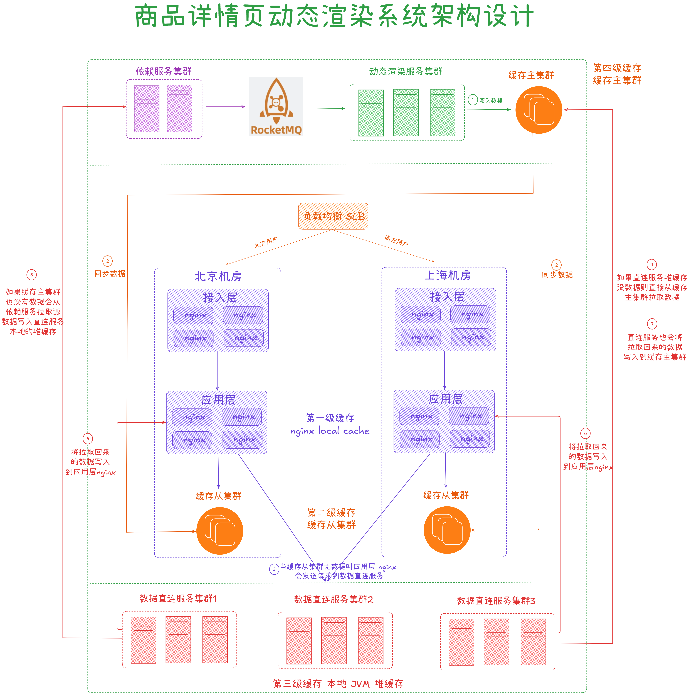

从上图得出，总共分为三部分。

1.  负载均衡 + 多机房模板动态渲染 + 一二级缓存：当自己本地缓存失效时，请求「**数据直连服务**」进行拉取。
2.  数据直连服务 + 三级缓存：「**数据直连服务**」会检查本地堆缓存，不存在时从「**缓存主集群**」获取信息， 如果「**缓存主集群**」也没有，则直接从「**依赖服务**」获取源信息，并重建「**缓存主集群**」缓存， 返回应用层 nginx。
3.  动态渲染服务 + 主集群：通过 MQ 接收「**依赖服务**」的各种事件，把变更信息缓存到「**缓存主集群**」中去， 而「**缓存主集群**」与「**缓存从集群**」进行数据同步。

### **4.2、 商品详情页动态渲染设计思想**

### **4.2.1、 数据闭环**

所谓「**数据闭环**」，就是数据的自我管理，所有数据同步后会进行后续的数据加工并展示。当数据形成闭环之后，「**依赖服务**」出现抖动或者维护，都不会影响到整个商品详情页服务的稳定运行。

数据异构，是数据闭环的第一步，将各个依赖系统的数据拿过来，按照自己的要求存储起来，数据闭环架构如下：

1.  「**依赖服务**」：主要包括商品基本信息，规格参数，商家/店铺，商品介绍，商品维度信息、品牌，分类，商品评价等。
2.  「**依赖服务 MQ**」：依赖服务将变更消息数据发送到「**依赖服务 MQ**」中。
3.  「**数据异构 Worker 服务**」：监听 「**依赖服务 MQ**」，将原子数据存储到 Redis，发送消息到「**数据同步 MQ**」。
4.  「**数据聚合 Worker 服务**」：监听「**数据同步 MQ**」，将原子数据按维度聚合为一个大 JSON 数据后存储到 Redis，主要是三个维度（商品基本信息、商品介绍、其他信息）。

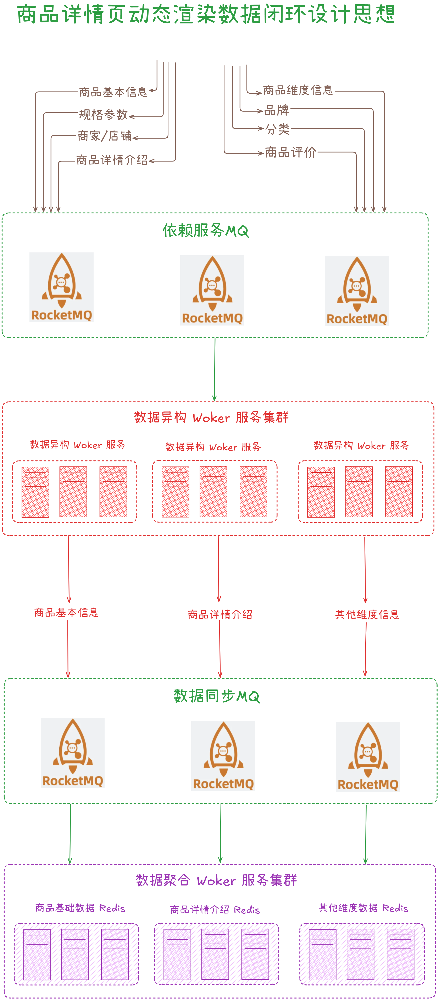

### **4.2.2、 数据维度化**

通过分析，数据维度可以分为以下几大类：

1.  商品基本信息：标题、扩展属性、特殊属性、图片、颜色尺码、规格参数
2.  商品详情介绍信息。
3.  非商品维度其他信息：分类、商家、店铺、品牌
4.  商品维度其他信息：采用 ajax 异步加载，如：价格、促销、配送至、广告、推荐、最佳组合，等等。

一个完整的数据，拆分成多个维度，每个维度独立存储，就避免了一个维度的数据变更就要全量更新所有数据的问题。不同维度的数据，因为数据量的不一样，可以采取不同的存储策略。

存储策略：

1.  ssdb: 这种基于磁盘的大容量/高性能的 kv 存储，保存商品维度信息、商品详情介绍维度信息，数据量大。
2.  redis：纯内存的 kv 存储，保存少量的数据，比如非商品维度的其他数据：商家数据、分类数据、品牌数据。

这里为了方便，我们都存储到 Redis 服务中。

### **4.2.3、 系统拆分**

将系统拆分为多个子系统虽然增加了复杂性，但是可以得到更多的好处，比如「**数据异构系统**」存储的数据是「**原子化数据**」，这样可以按照一些维度对外提供服务；而数据同步系统存储的是聚合数据，可以为前端展示提供高性能的读取。而前端展示系统分离为商品详情页和商品介绍，可以减少相互影响。

1.  数据异构 Worker 的原子数据，基于原子数据提供的服务更加灵活。
2.  数据聚合 Worker 将数据聚合后，减少 redis 读取次数，提升性能。

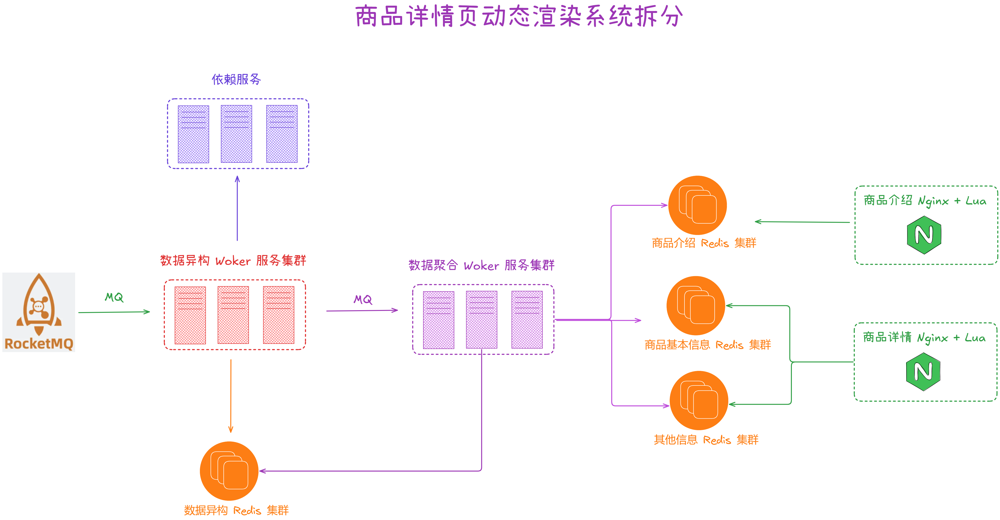

### **4.2.4、 异步化**

这里会大量使用异步化，通过异步化机制提升并发能力。

1.  首先我们使用了「**消息异步化**」进行系统解耦合，通过消息通知变更，然后再调用相应接口获取相关数据。
2.  数据更新异步化 ，更新缓存时，同步调用服务，然后异步更新缓存。可「**并行任务**」并发化， 商品数据系统来源有多处，并发调用并聚合，这样本来串行需要 1s 的经过这种方式我们提升到 300ms 之内。
3.  「**异步请求合并**」，然后一次请求调用就能拿到所有数据。前端服务异步化/聚合，实时价格、实时库存异步化， 使用如线程或协程机制将多个可并发的服务聚合。

异步化还一个好处就是可以对异步请求做合并，原来N次调用可以合并为一次，还可以做请求的排重。

### **4.2.5、 数据动态化**

1.  数据获取动态化：nginx+lua 获取商品详情页数据的时候，按照维度获取，比如商品基本数据、其他数据（分类、商家）
2.  模板渲染实时化：支持模板页面随时变化，因为采用的是每次从 nginx+redis+ehcache 缓存获取数据，渲染到模板的方式， 因此模板变更不用重新静态化 HTML。
3.  重启应用秒级化：nginx+lua 架构，重启在秒级。
4.  需求上线快速化：使用 nginx+lua 架构开发商品详情页的业务逻辑，非常快速。

### **4.2.6、 多机房多活架构**

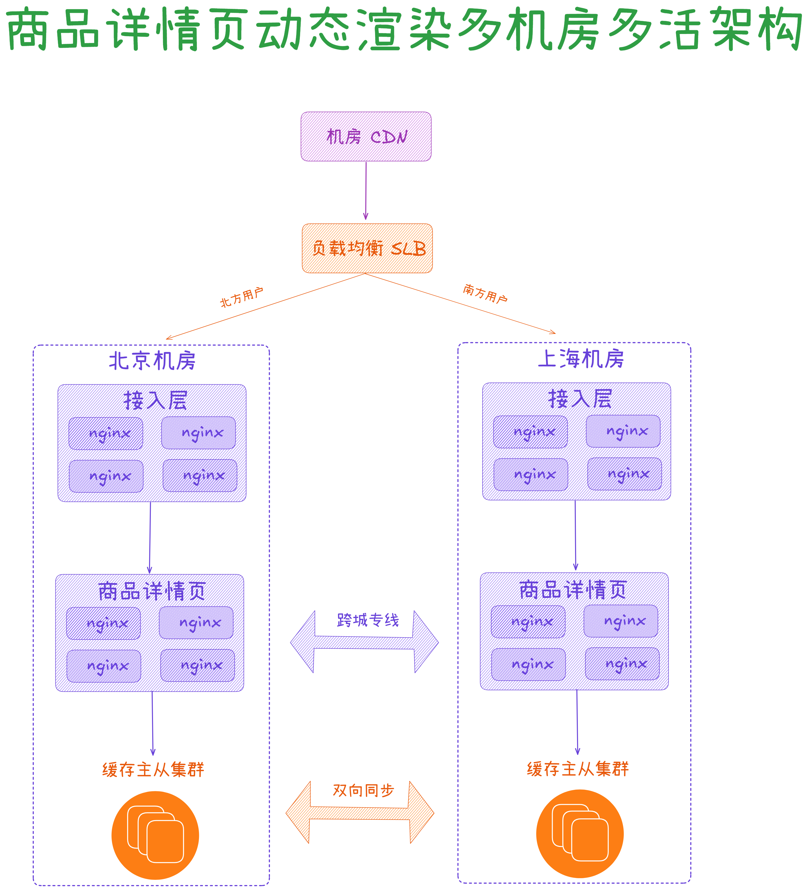

从上图得知：

1.  部署统一的 CDN 以及负载均衡设备。
2.  应用无状态部署：各自的机房采取不同机房的配置，来读取各自机房内部部署的数据集群（redis、mysql等）。
3.  将数据异构 Worker 和数据聚合 Worker 设计为无状态化，可以任意水平扩展。
4.  Worker 无状态化，但是配置文件是有状态的，不同的机房有一套自己的配置文件，只读取自己机房的 redis、ssdb、mysql 等数据。
5.  每个机房配置全链路接入 nginx：商品详情页 nginx + 商品信息 redis 集群。

### **4.3、 商品详情页统一处理服务**

该服务相对「**商品详情页动态渲染服务**」来说就比较简单了，它主要统一对外提供数据接口，动态调用后端各种依赖服务的接口产生数据并且返回响应，打造服务闭环。

整个架构图如下：

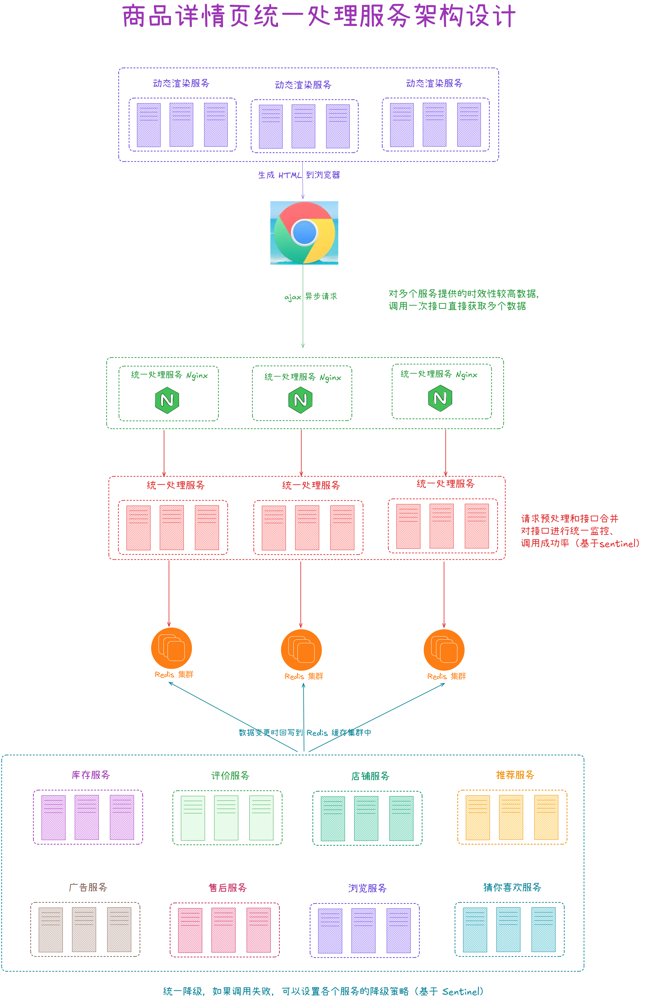

其主要功能如下：

1.  商品详情页依赖的服务达到十几个，需要给一个统一的入口，打造数据服务闭环。
2.  请求预处理。
3.  合并接口调用，减少 ajax 异步加载次数。
4.  统一监控、降级处理。

## **3.7 优惠券服务架构设计**

### **3.7.1 核心挑战**

1.  ​高并发请求​：支撑千万级日活用户，瞬时峰值10万+QPS领券压力。
2.  ​库存强一致性​：在分布式场景下保证库存扣减的准确性和一致性，避免超卖。
3.  ​系统高可用​：保障系统在高并发场景下的稳定性，可用性要求达99.99%。
4.  ​精准过期控制​：确保优惠券按时失效，避免无效发放和使用。
5.  ​数据存储与查询性能​：亿级领券记录的存储与高效查询。

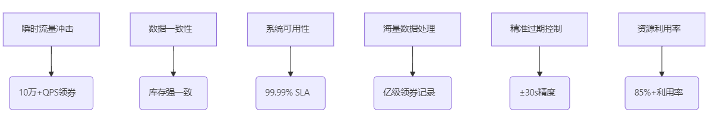

### **3.7.2 架构设计与技术实现**

[【电商实战项目第五十七篇】华仔电商实战支撑千万级优惠券服务业务场景介绍](https://articles.zsxq.com/id_2com984wpl4v.html)

[【电商实战项目第五十八篇】华仔电商实战支撑千万级优惠券服务数据库设计及架构设计](https://articles.zsxq.com/id_5xzd7dh5ewmu.html)

[【电商实战项目第五十九篇】华仔电商实战正式接入后台管理 Web 项目](https://articles.zsxq.com/id_bu5tmwihhcpu.html)

[【电商实战项目第六十篇】华仔电商实战用户、商品、美食笔记正式接入后台管理 Web 项目](https://articles.zsxq.com/id_s2jha8q9e873.html)

[【电商实战项目第六十一篇】华仔电商实战后管服务基于责任链设计模式创建优惠模板功能开发](https://articles.zsxq.com/id_zu63tnsld1v1.html)

[【电商实战项目第六十二篇】华仔电商实战后管服务基于 RocketMQ 5.x 延时消息处理优惠券模板结束状态及缓存预热](https://articles.zsxq.com/id_574ss4q6g43s.html)

[【电商实战项目第六十三篇】华仔电商实战优惠券后管服务之营销推送业务架构设计](https://articles.zsxq.com/id_6t8vu16ww2mb.html)

[【电商实战项目第六十四篇】华仔电商实战后管服务安装部署分布式调度管理平台 XXL-Job 3.0 最新版](https://articles.zsxq.com/id_udbfdw6w1lwz.html)

[【电商实战项目第六十五篇】华仔电商实战通过线程池+任务分片+分片消息合并优化千万级用户量优惠券推送任务](https://articles.zsxq.com/id_u2dl8rwcgb0h.html)

[【电商实战项目第六十六篇】华仔电商实战千万级用户量优惠券推送任务之库存扣减/用户领券/推送任务失败记录后续功能完善](https://articles.zsxq.com/id_ukhxikrv59xf.html)

[【电商实战项目第六十七篇】华仔电商实战商品、购物车、卡券相关服务正式接入前端 Web 项目](https://articles.zsxq.com/id_92ams2taclq9.html)

[【电商实战项目第六十八篇】华仔电商实战高并发场景下领取优惠券之缓存 + MQ 异步架构设计与功能实现](https://articles.zsxq.com/id_lgqol1oinofu.html)

[【电商实战项目第六十九篇】华仔电商实战基于 ShardingSphere 5.5.2 最新版本实战优惠券服务分库分表功能](https://articles.zsxq.com/id_d71i9nfclp5d.html)

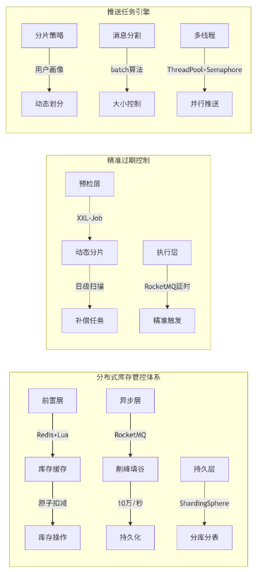

### **3.7.2.1 分布式库存管控体系**

设计三级库存防护架构:

1.  前置层: 基于 Redis 实现模板级库存热点缓存，采用 Lua 脚本扣减库存原子操作，规避超卖风险。
2.  异步层: 通过 RocketMQ 5.x 实现库存扣减与领券记录持久化的最终一致性，削峰能力达 10 万消息/秒。
3.  持久层: 基于 ShardingSphere5.x 分库分表(32分片)，采用用户ID分片键，解决亿级领券记录存储与查询性能瓶颈。
4.  优化成果: 库存操作平均响应时间 < 50 ms，系统可用性达 99.99%。

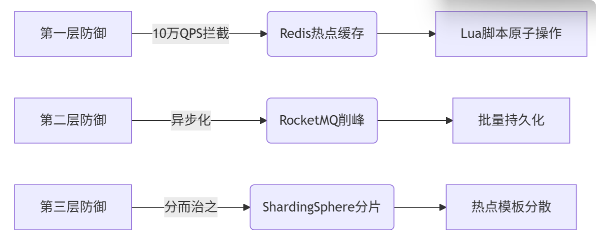

关于「**库存扣减**」会放到 「**库存服务**」进行展开。

### **3.7.2.2 精准过期控制机制**

构建双层过期检测体系:

1.  预检层: 基于 XXL-Job 3.0 动态分片能力，每日扫描待过期模板生成预补偿任务。
2.  网执行层: 通过 RocketMQ 5.x任意延时消息（精度±30s）触发结束状态处理。
3.  优化成果:无效数据库更新降低 60%模板结束状态成功率提升至 99.95%。

关于 RocketMQ 5.x 任意延时消息处理优惠券模板结束状态流程图：

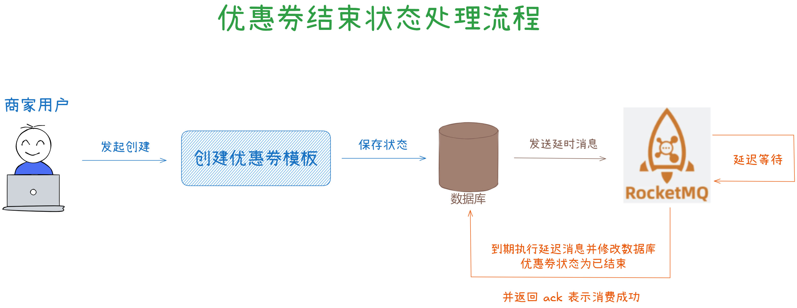

整个优惠券模板创建及状态处理的时序图如下：

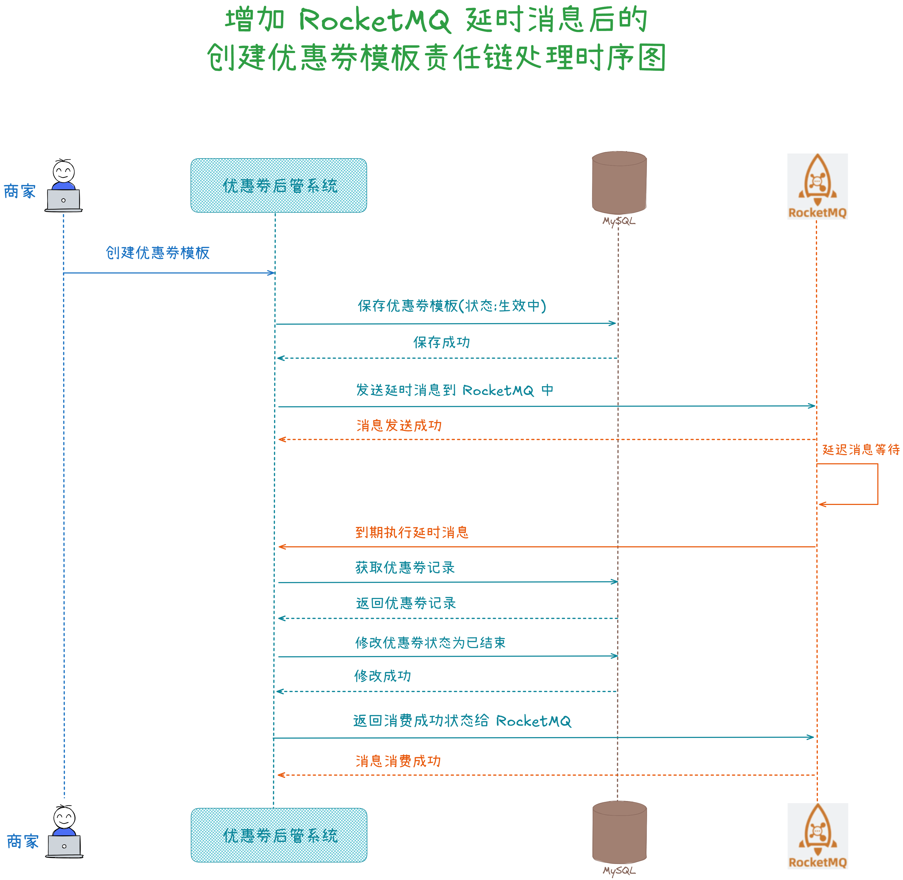

### **3.7.2.3 千万级推送任务引擎**

研发分布式任务调度框架:

1.  分片策略: 基于用户画像数据动态划分任务分片，每个分片负责 1000 个用户推送。
2.  batch 消息分割: 设计批量消息分割算法，保证消息不超过 RocketMQ 批次限制。
3.  多线程推送: 采用 ThreadPoolExecutor + Semaphore 实现共享线程池进行多线程推送任务。
4.  成果: 全量用户营销推送任务执行效率提升5倍，资源利用率达85%。

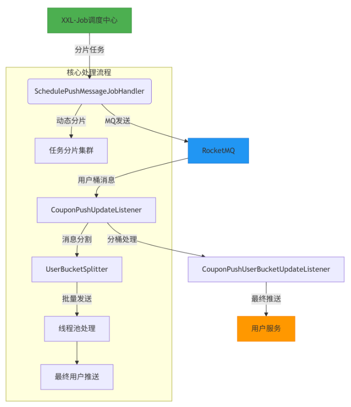

### **1、分层架构设计**

1.  「**xxl-job 调度层**」: 基于任务ID的哈希取模分片算法，确保任务均匀分布。
2.  「**消息解耦层**」：这里设计了双 Topic，削峰填谷，解耦任务处理。
3.  [COUPON\_PUSH\_MESSAGE\_TOPIC](http://coupon_push_message_topic/)：主任务消息。
4.  [COUPON\_PUSH\_USER\_BUCKET\_MESSAGE\_TOPIC](http://coupon_push_user_bucket_message_topic/)：用户桶消息。
5.  「**用户分桶处理层**」：通过跳跃式ID范围分桶（避免连续ID热点）。其分桶策略​​：
6.  每个桶包含1000个用户（USER\_BUCKET\_SIZE）
7.  根据最大用户ID动态计算总桶数。
8.  「**并行执行层**」：通过线程池并行执行。

### **2、动态分片策略算法设计**

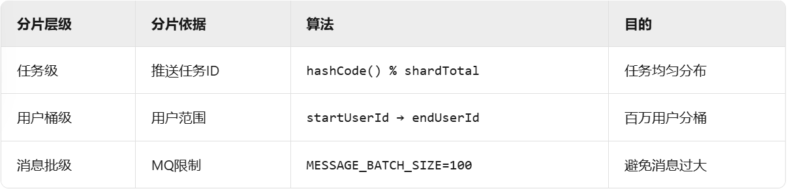

### **3、Batch 消息分割算法设计**

其流程图如下：

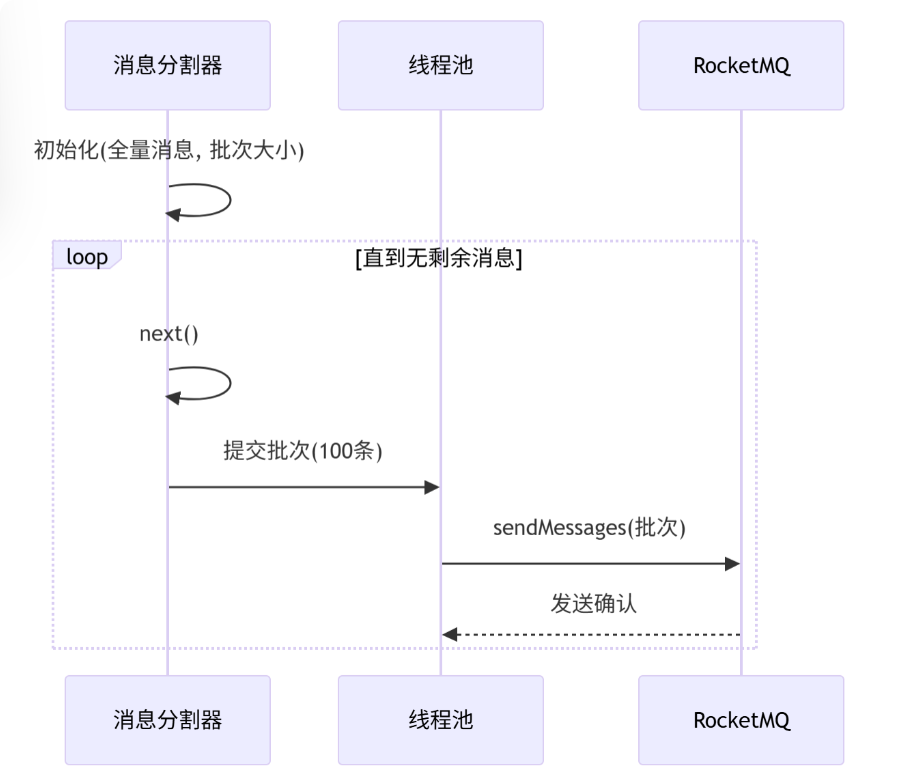

1.  动态分割​​：不依赖固定分片数，自动适配消息总量。
2.  ​​资源控制​​：批次大小严格匹配MQ限制（100条/批）。

### **4、多线程推送架构设计**

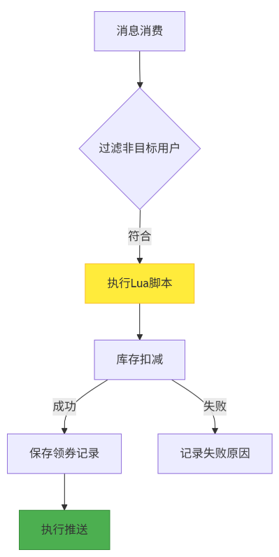

#### 关键创新点：

1.  ​​三级缓冲机制​​：
2.  线程池队列：1000 任务缓冲。
3.  MQ堆积能力：百万级消息堆积。
4.  Redis预检：Lua 脚本前置检查。
5.  ​​弹性容量规划​​：

\# 容量计算公式

总用户数 = 10,000,000

单桶用户数 = 1,000

总桶数 = 总用户数 / 单桶用户数 = 10,000

线程数 = min(总桶数/10, 100) \# 动态调整

1.  ​​故障隔离设计​​：
2.  单用户失败不影响整体。
3.  失败记录单独存储（coupon\_push\_cron\_fail表）。

### **3.7.2.4 亿级数据分库分表方案**

1.  分片策略设计: 采用 ShardingSphere5.x 标准分片+强制路由方案，按(user\_id)%32生成分片键，使单用户领券记录集中存储(便于查询)，同时分散模板热点压力。
2.  动态扩容方案: 预置 20%空分片(预留2库16表和32表)，后续可通过 ShardingSphere 影子库+ onlineDDL 工具实现业务无感扩容
3.  查询优化: 领券记录查询:通过分片键精准路由，98%查询命中单分片，对于热点模板查询: 建立 template\_id 一> 分片映射表二级路由，避免全分片扫描。

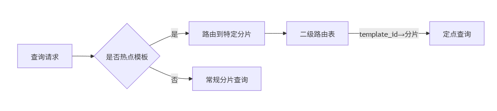

这里重点来梳理下「**高并发领券架构设计**」， 其整体架构如下：

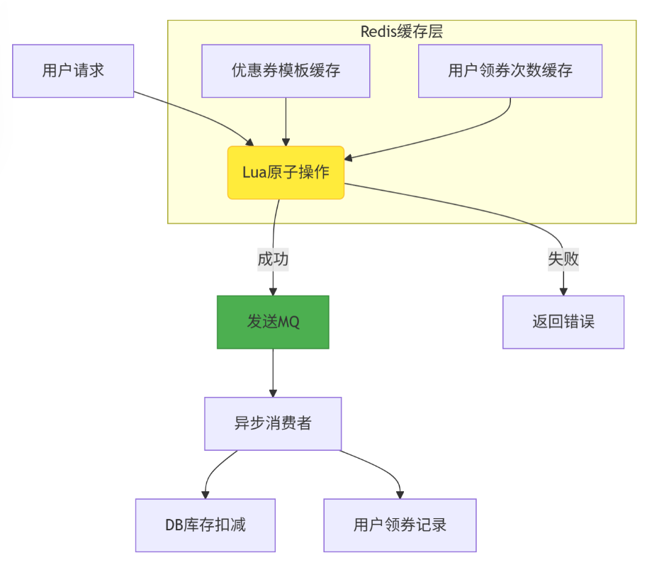

### **1、用户领券流程设计**

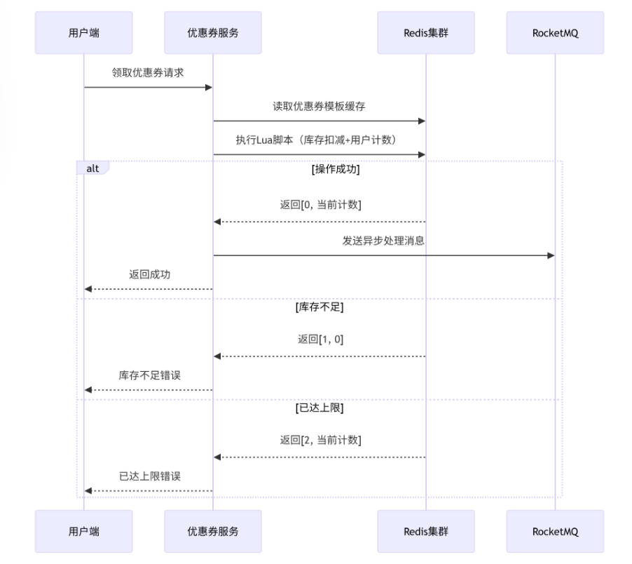

### **2、RocketMQ 异步处理领券流程设计**

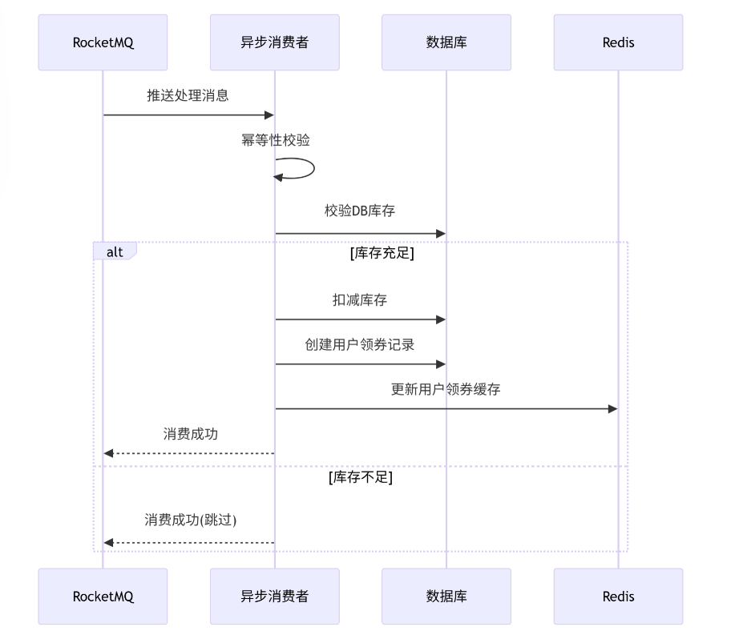

### **3、Lua 脚本处理领券流程设计**

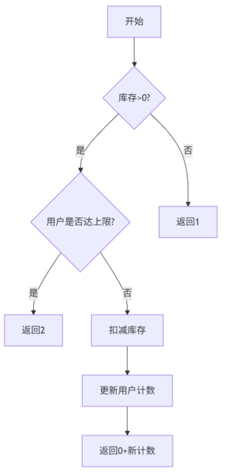

1.  复合操作原子化​​：库存扣减 + 计数更新。
2.  ​​智能TTL设置​​：自动设置用户计数缓存有效期。
3.  ​​压缩状态返回​​：使用1个int值返回状态+计数。

### **4、异常处理设计**

前置校验失败场景:

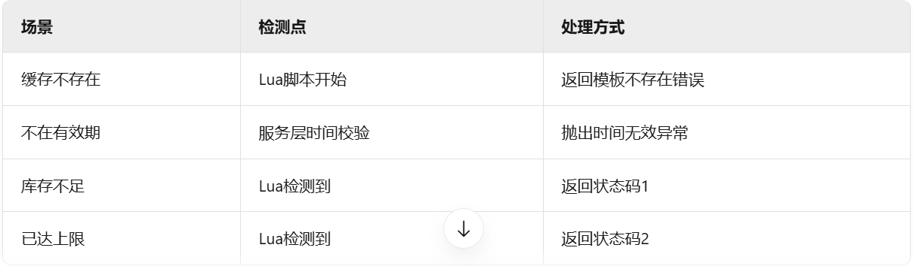

#### 后置处理容错:

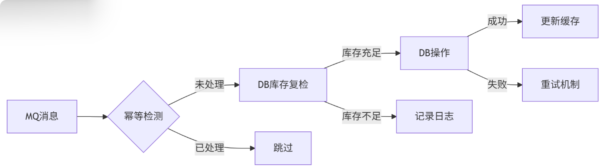

## **3.8 库存服务架构设计**

### **3.8.1 核心挑战**

1.  高并发库存扣减​​：支持瞬时高并发（如秒杀场景）下的库存准确扣减，避免超卖。
2.  ​​高可用与高性能​​：在高并发场景下，保证库存服务的高可用和低延迟。
3.  ​​分布式环境下的数据一致性​​：在分布式部署的环境下，保证缓存和数据库之间的数据最终一致。
4.  ​​库存热点问题​​：对于热门商品，如何避免单点瓶颈。
5.  ​​幂等性与补偿机制​​：确保在消息重发或操作重试时，库存操作不会重复扣减或增加。

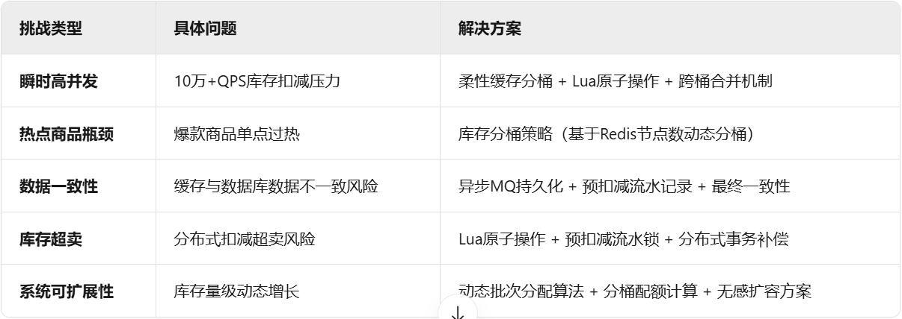

### **3.8.2 架构设计与技术实现**

[【电商实战项目第七十篇】华仔电商实战库存服务业务场景介绍与架构设计](https://articles.zsxq.com/id_atv7dupfg0fl.html)

[【电商实战项目第七十一篇】华仔电商实战库存服务之库存初始化及库存柔性式缓存分桶方案功能实现](https://articles.zsxq.com/id_ccko9bipxqh1.html)

[【电商实战项目第七十二篇】华仔电商实战库存服务之库存缓存分桶预扣减方案功能实现](https://articles.zsxq.com/id_9sr5xwzox4px.html)

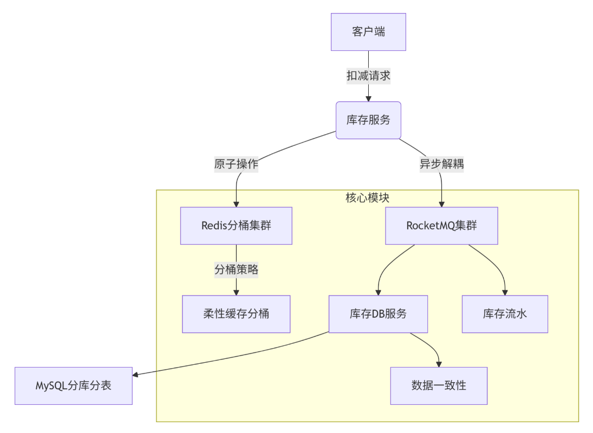

### **3.8.2.1 柔性分桶架构设计**

基于 Redis 节点数动态确定分桶数量，通过计算来智能配额。

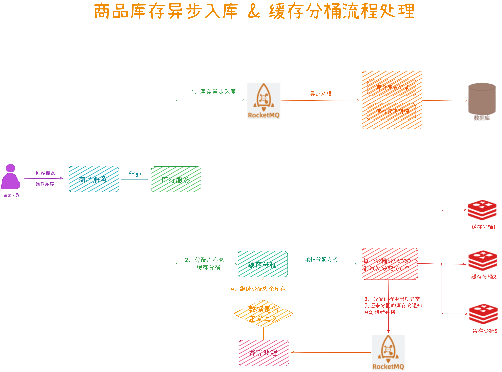

具体的配额：

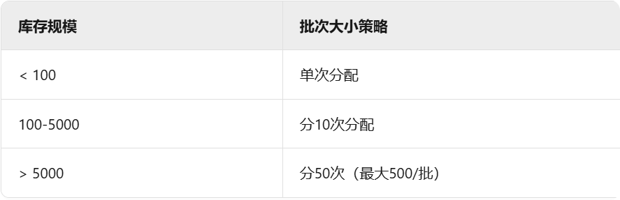

缓存分桶存储结构：

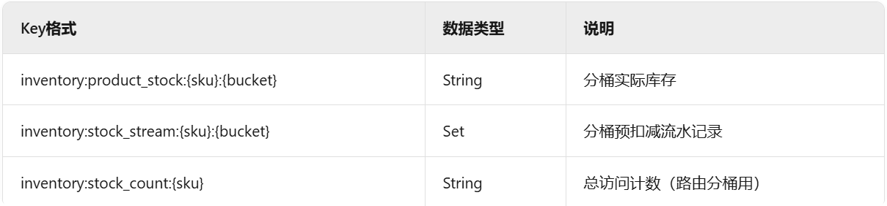

Lua 脚本矩阵：

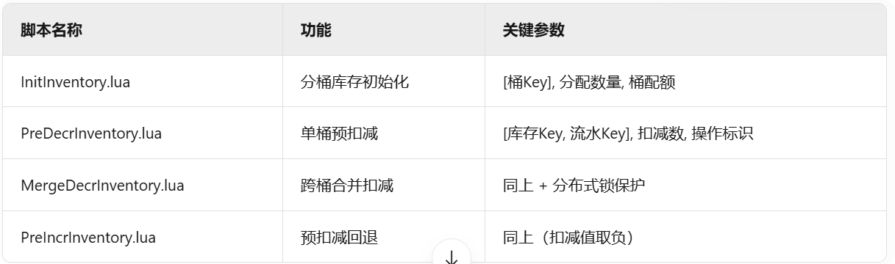

### **3.8.2.2 三级扣减体系设计**

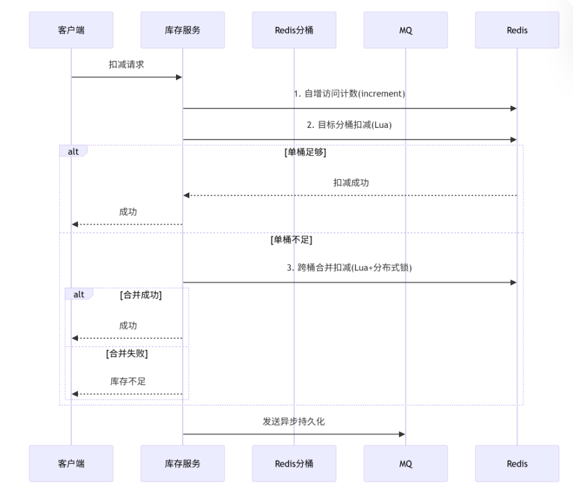

扣减流程​​：

1.  ​**​**访问计数路由​​：通过自增计数选择目标分桶。
2.  渐进式扣减​​：
3.  优先扣减目标分桶。
4.  不足时顺序遍历其他分桶。
5.  仍不足则触发合并扣减。
6.  ​​合并扣减兜底保护​​。

### **3.8.2.3 持久层最终一致性**

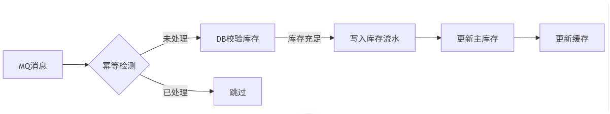

## **3.9 订单服务架构设计**

### **3.9.1 核心挑战**

1.  高并发下单：大促时瞬时高并发下单，如何保证系统稳定和性能。
2.  分布式事务：订单创建、取消、支付等涉及多个服务，如何保证数据一致性。
3.  订单状态流转：订单状态复杂，如何保证状态正确流转（状态机）。
4.  分库分表：订单量大，如何设计分库分表方案以支持海量数据存储和查询。
5.  实时搜索：订单数据分库分表后，如何支持多条件复杂查询（引入ES）。
6.  订单超时关单：海量订单的自动关闭如何高效准确。
7.  缓存设计：如何利用缓存提高订单详情的查询性能。

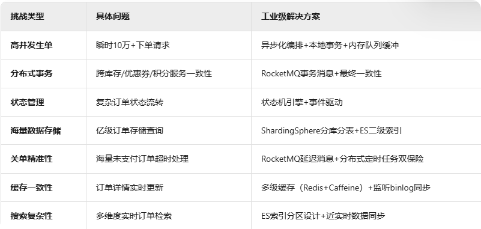

### **3.9.2 架构设计与技术实现**

[【电商实战项目第七十三篇】华仔电商实战订单服务业务场景介绍与架构设计](https://articles.zsxq.com/id_7n1znf4mnd0b.html)

[【电商实战项目第七十四篇】华仔电商实战订单服务核心链路状态机设计与功能实现](https://articles.zsxq.com/id_fzcjo8ib47j7.html)

[【电商实战项目第七十五篇】华仔电商实战订单服务核心链路面临的技术挑战与解决方案](https://articles.zsxq.com/id_vn41o1wlhmgs.html)

[【电商实战项目第七十六篇】华仔电商实战订单服务核心链路生单流程基于 RocketMQ 事务消息架构设计与功能实现](https://articles.zsxq.com/id_euh6q0p89qu9.html)

[【电商实战项目第七十七篇】华仔电商实战订单服务核心链路取消订单流程基于 RocketMQ 事务消息架构设计与功能实现](https://articles.zsxq.com/id_cn8e9rarxown.html)

[【电商实战项目第七十八篇】华仔电商实战订单服务核心链路超时关单基于RocketMQ延迟消息与定时任务架构设计与功能实现](https://articles.zsxq.com/id_0r2a8c5lv2pj.html)

[【电商实战项目第七十九篇】华仔电商实战订单服务核心链路基于 ShardingSphere 5.5.2 实战分库分表功能](https://articles.zsxq.com/id_w3mjdhdjb9d9.html)

[【电商实战项目第八十篇】华仔电商实战项目订单服务引入 ElasticSearch 后的订单列表搜索架构及索引设计](https://articles.zsxq.com/id_r06jt1pw0le3.html)

[【电商实战项目第八十一篇】华仔电商实战项目订单服务基于Canal + RocketMQ实现订单分库分表数据增量同步 ES](https://articles.zsxq.com/id_9pg39bc9q8po.html)

[【电商实战项目第八十二篇】华仔电商实战订单服务正式接入前端项目及下单异步并发编排、订单ES查询、订单详情缓存设计与实现](https://articles.zsxq.com/id_8wt62lftx4kz.html)

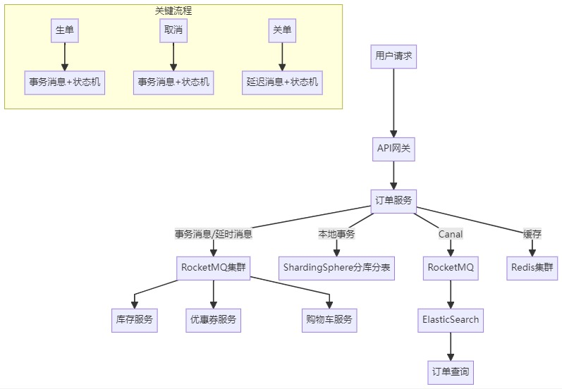

### **3.9.2.1 订单核心流程设计**

### **1、订单创建流程时序图**

创建订单业务比较复杂，整个处理流程时序图如下：

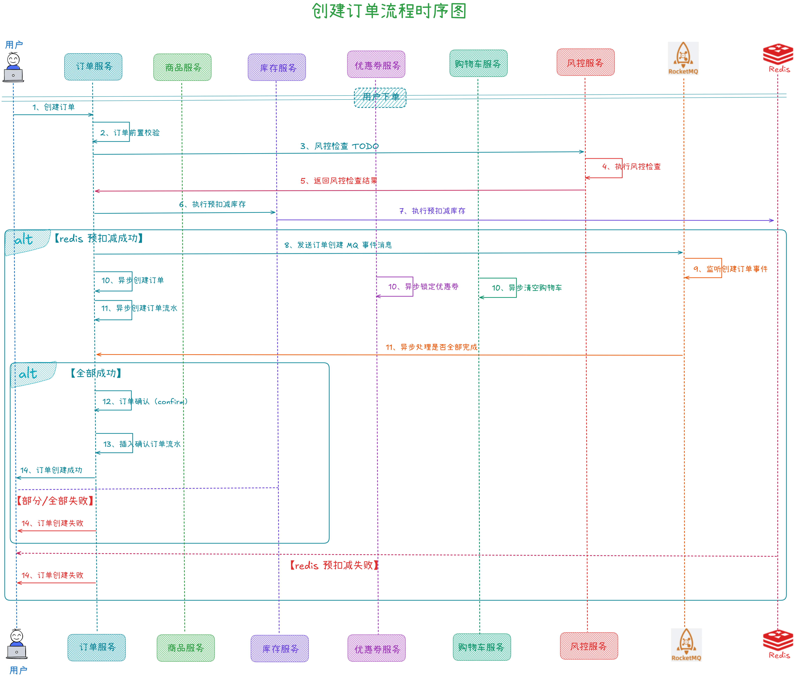

当「**库存预扣减**」完成后，会进行「**创建订单**」+ 「**库存真正扣减**」，在订单扣减的时候，通过 RocketMQ 事务消息来进行「**库存真正扣减**」+ 「**创建订单**」。当这部分成功之后，订单状态会变成 「**CONFIRM**」，此时订单就可以支付了。

### **2、 订单支付流程时序图**

接下来，看下订单支付的处理流程，如下：

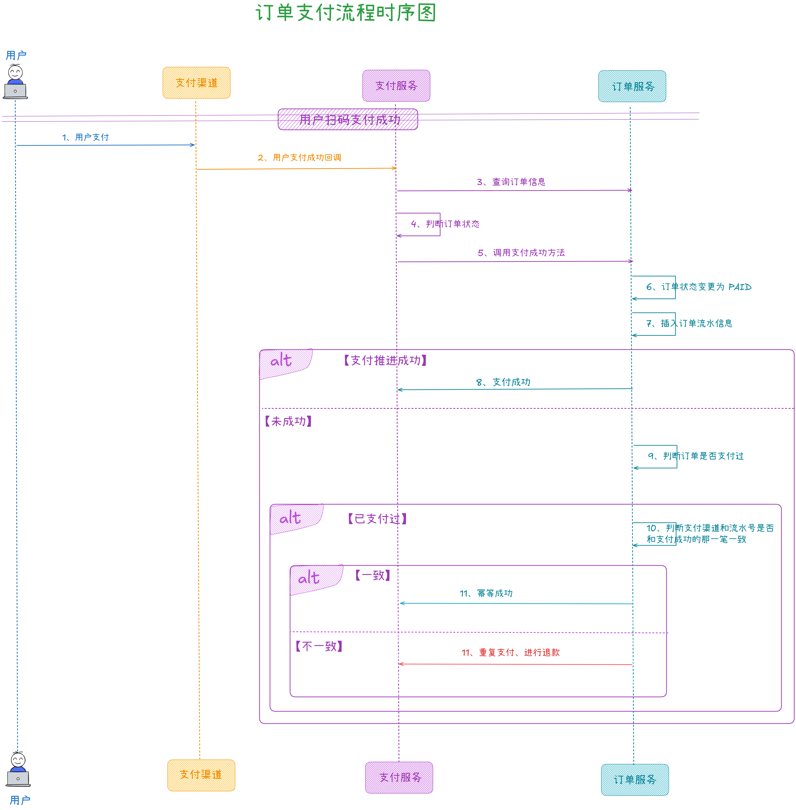

这里除了要做「**订单状态推进**」，还要做 「**单笔订单幂等性处理**」，即单笔订单只能支付成功一次，避免用户出现多付，如果出现多付，则需要进行退款。

当支付成功后，订单状态会变成「**PAID**」。

### **3、订单取消流程时序图**

接下来，来看下订单取消的处理流程，如下：

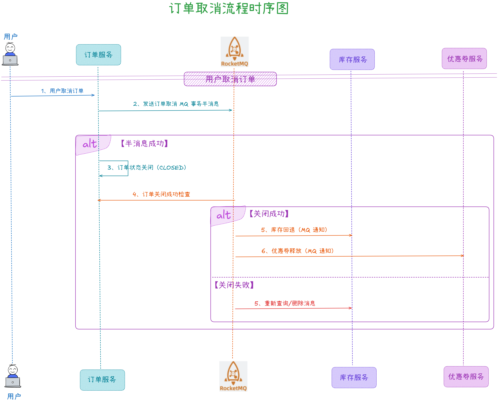

这里为了保证「**订单取消**」和「**库存回退/优惠券释放**」的数据一致性，使用 RocketMQ 事务消息来处理。

当订单取消后，订单状态会变成「**CLOSED**」。closeType 为「**CANCEL**」。

### **4、订单超时关单方案选型**

除了用户主动取消订单之外，还会有「**超时关单**」的情况。「**超时关单**」的逻辑和「**用户主动取消订单**」的逻辑其实是一样的，只不过入口不一样。

这里会有几种实现：

1.  被动关单：当用户访问订单详情/用户支付时会进行被动关单。
2.  MQ 延迟消息：这里会使用 RocketMQ 延迟消息来进行超时关单。
3.  定时任务：实现方案有这么几种：XXL-Job、时间轮、Redis Zset、Redisson 延迟队列、DelayQueue。
4.  这里我们会使用 XXL-Job 分片任务来进行分库分表后的扫表，从采用 ForkJoinPool 线程池进行并发处理来实现超时关单。

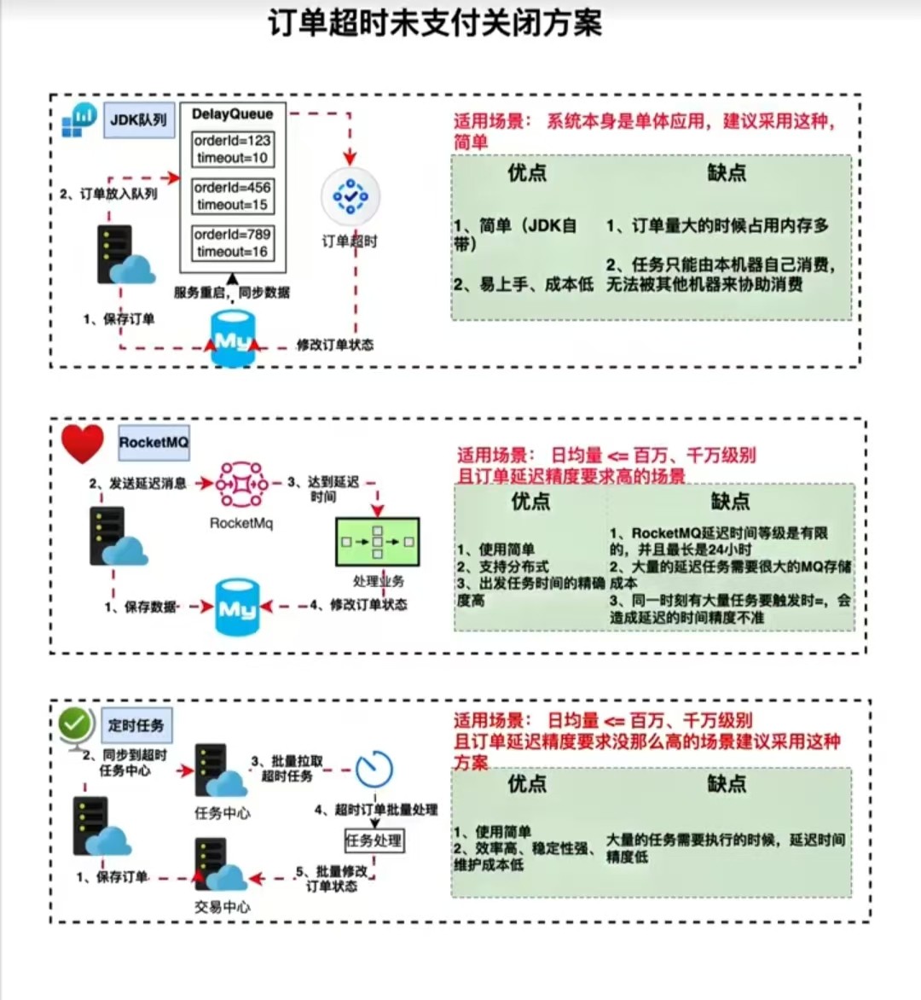

### **3.9.2.2 订单状态机设计**

整个订单的状态机流转如下：

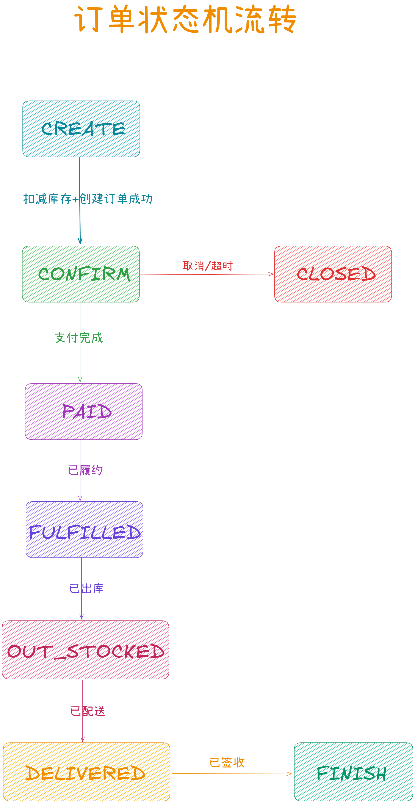

### **3.9.2.3 高并发读写设计**

### **1、订单搜索服务**

引入 「**ElasticSearch 搜索引擎**」后的架构图，如下：

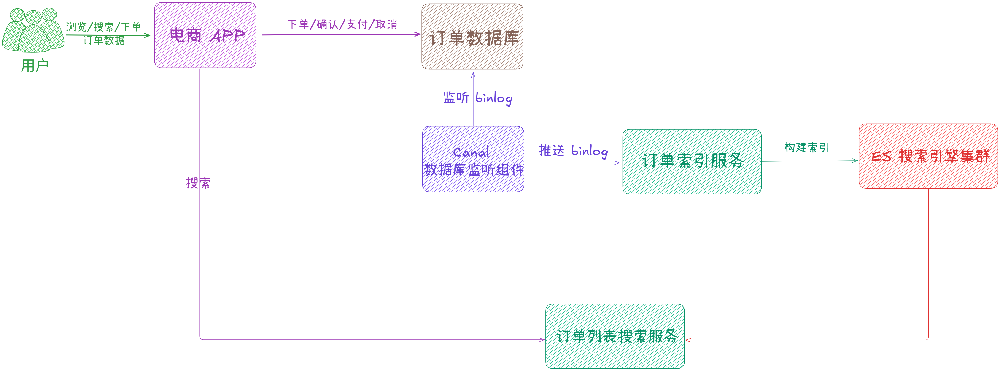

我们来梳理下上面这张图的流程：

1.  首先，买家通过「**APP/网页**」搜索商品、进行下单维护订单相关数据。
2.  「**订单服务**」会将买家购买的订单数据写入到「**订单数据库**」中。
3.  接着，启动「**Canal 监听组件服务**」，会监听此时写入数据库的 binlog，然后推送 binlog 给「**订单索引服务**」。
4.  「**订单索引服务**」会调用 ES 相关 API 进行构建 ES 索引。
5.  当上述都完成后，买家就可以通过「**订单搜索服务**」进行搜索相关订单了。

### **2、Canal + RocketMQ 增量同步到 ES**

通过 Canal 监控 MySQL binlog，发布变更消息到 RocketMQ，ES 消费消息增量更新。binlog 同步保障数据一致性的架构：

### **3、下单前异步并发编排**

使用 [CompletableFuture](http://completablefuture/) 来改造订单下单入口的功能实现，实现异步并行获取「**用户收货地址信息**」、「**商品信息**」、「**优惠券信息**」。

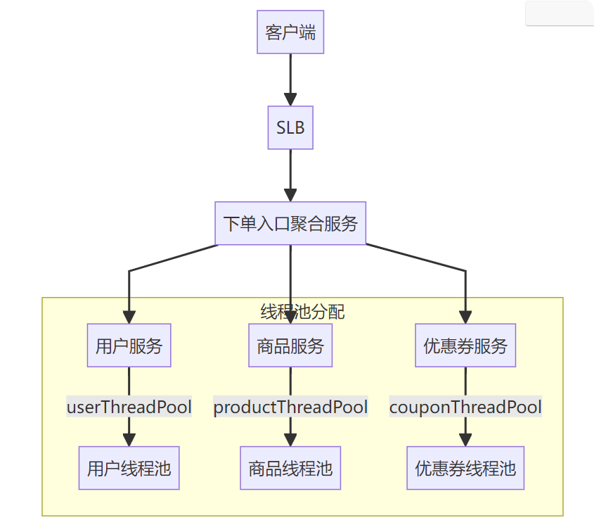

## **3.10 支付服务架构设计**

### **3.10.1 核心挑战**

1.  多渠道支付集成​​：需要支持支付宝、微信支付等多种支付渠道，各渠道接口和流程有所不同。
2.  ​​安全攻防​​：支付涉及资金，安全是重中之重，需要防止数据篡改、重放攻击、信息泄露等。
3.  ​​高并发支付​​：在促销活动时，支付服务需要处理大量并发支付请求。
4.  ​​支付结果通知​​：需要处理支付平台的异步通知（回调），并确保可靠投递。

### **3.10.2 架构设计与技术实现**

[【电商实战项目第八十三篇】华仔电商实战支付服务业务介绍与支付宝、微信支付申请、接入](https://articles.zsxq.com/id_zi7dpq1wn0nl.html)

[【电商实战项目第八十四篇】华仔电商实战支付服务之安全攻防相关知识梳理](https://articles.zsxq.com/id_2nr02me3l6us.html)

[【电商实战项目第八十五篇】华仔电商实战支付服务基于策略+工厂模式开发支付宝下单|退款|查询|支付回调|内网穿透工具介绍](https://articles.zsxq.com/id_av14xeqa092i.html)

[【电商实战项目第八十六篇】华仔电商实战支付服务基于策略+工厂模式开发微信下单|退款|查询|支付回调|内网穿透工具介绍](https://articles.zsxq.com/id_bnbwcj1rogwt.html)

### **3.10.2.1 核心支付流程**

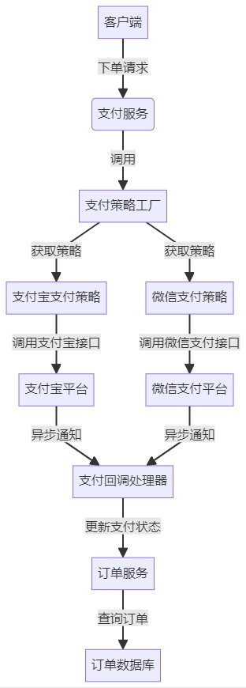

### **3.10.2.2 支付回调流程**

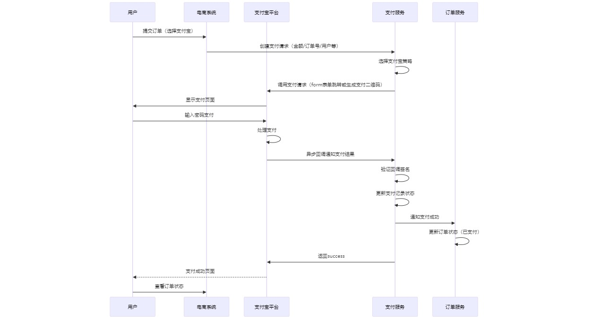

### **3.10.2.3 支付内网穿透工具**

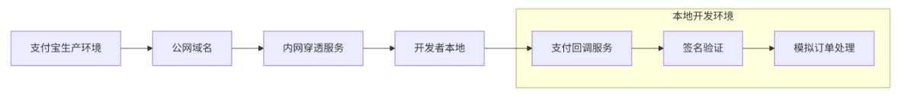