从今天之后的一段时间内，华仔会带着大家一起从零开始搭建并研发一套高并发的电商实战项目，这里会涉及到很多互联网大厂开发过程中所使用的核心技术和架构设计模式，希望大家学完之后可以用到自己的简历中。

通过整整8个月时间，小红书社交+电商高并发实战项目即将收官，接下来，我会最后一个重要的模块「**小红书社交+电商业务性能压测**」。

这是第九十八篇，本篇我们先来看下 Jmeter 单接口性能压测问题、介绍大厂如何做海量请求性能压测。

文章汇总位置：[https://wx.zsxq.com/dweb2/index/columns/51122554151214](https://wx.zsxq.com/dweb2/index/columns/51122554151214)

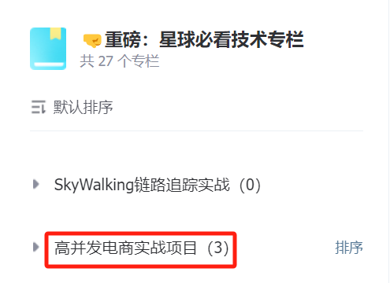

源码授权与获取地址：[https://articles.zsxq.com/id\_1s85grnaae4p.html](https://articles.zsxq.com/id_1s85grnaae4p.html)

本章源码地址：[https://gitcode.net/u011359591/huazai-ecshop/-/tree/ecshop-chapter-98](https://gitcode.net/u011359591/huazai-ecshop/-/tree/ecshop-chapter-98)

## **01 前言**

前篇对整个「**小红书社交+电商项目**」进行了 Jmeter 单接口性能压测介绍及示例说明：

[【电商实战项目第九十七篇】华仔电商实战项目接口常见压力测试工具对比、Jmeter 5.x 工具介绍、单接口性能压测示例](https://articles.zsxq.com/id_en19w2444mob.html)

从今天开始，我们就来进行最后一个模块的介绍，看下 Jmeter 单接口性能压测问题、介绍大厂如何做海量请求性能压测。

## **02 大厂如何做海量请求性能压测**

在展开大厂如何做海量请求性能压测之前，我们先来看下 Jmeter 单接口性能压测的问题。

## **2.1 Jmeter 5.x 单接口性能压测问题**

通过上篇的介绍，通过 Jmeter 压测⼯具进⾏单接⼝压测是没问题的，可以得出基于某个机器配置下接⼝的吞吐量。但是实际生产环境中的业务，不可能只访问某个单接口。更多的是多个接口业务联动，有可能某个接口出现瓶颈就会导致其他接口出现问题，比如：修改用户收货地址、 支付接口等。

某一天，我们小红书项目突然火了，每天几百万用户访问，最高时每秒有 5000 用户进行访问，后端服务却撑不住挂了。。。。

为什么会这样？

其实也不难理解，虽然单接口支撑没问题，但是却忽略了某些低 QPS 的接口。由于这些接口性能不足，最终导致系统 CPU、内存、链接被耗尽了，从⽽连锁反应导致其他接⼝「**RT 响应超时**」、「**GC 频繁**」、「**线程池耗尽**」。

## **2.2 流量漏斗模型**

互联⽹产品其本身就是⼀个虚拟的漏⽃，⽤户的⾏为路径有很多，举个淘宝、JD、小红书电商例⼦：

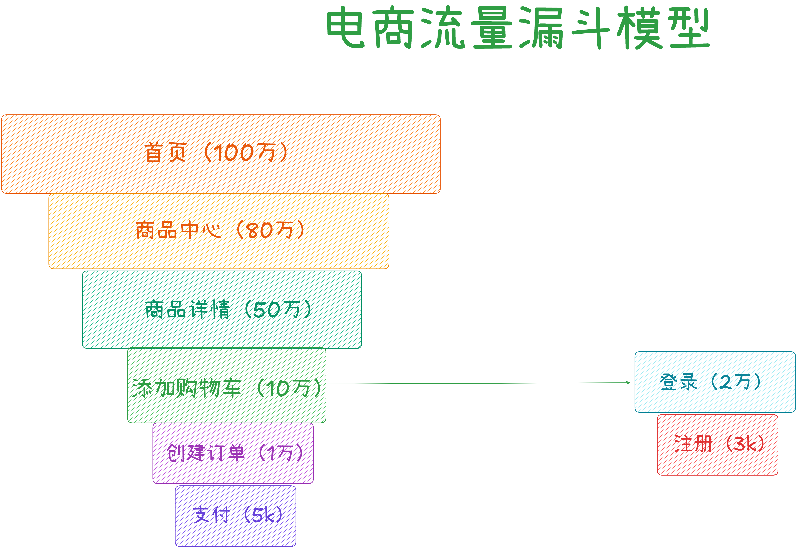

根据这个流量漏斗模型，我们需要推测出常规用户的访问流量模型，比如 100 万用户进来：

1.  有多少是新⽤户会进⾏注册。
2.  有多少是新⽤户会进⼊商品详情⻚。
3.  有多少⽤户是会加⼊购物⻋。
4.  有多少⽤户是会下单且支付。

## **2.3 流量录制/重放技术**

针对这个流量漏斗模型，那么我们该如何记录用户的访问链路呢？

比如当流量激增后，怎么记录用户访问链路后各个指标变化的情况：「**CPU 使用率**」、「**RT 响应时间**」、「**GC 次数**」、「**内存使用率**」、「**带宽使用率**」等，后续我们会使用 Skywalking 来作为我们应用的监控工具。  

先来看下整个实战项目的系统架构流程图：

  
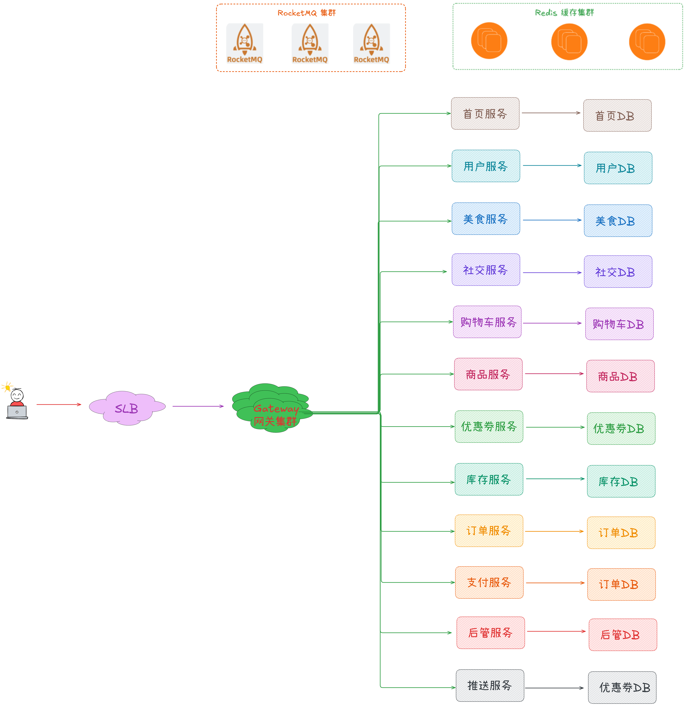

这里有几个要点需要大家注意下：

1.  需要真实的⽤户访问的流量模型分布数据。
2.  ⽀持成倍的扩⼤/缩放相关流量数据。
3.  敏感数据脱敏处理，压测脏数据隔离（保证不影响正式环境的流量数据）：
4.  隔离数据包括不限，⽇志、Redis、MQ、数据库等。
5.  敏感信息脱敏：⼿机号、token信息、姓名、年龄、性别等。

因此，如果要把用户访问链路的流量漏斗模型推测处理，就需要用到「**流量录制/重放技术**」，它是全链路压测的基础。

下面我们就先来了解下什么是「**流量录制/重放技术**」。

###   
**2.3.1 什么是流量录制/重放技术**

流量录制/重放是通过「**复制线上环境真实流量（录制）**」然后在「**测试环境进行模拟请求（重放）**」验证代码逻辑正确性。

通过采集线上流量在测试环境回放逐一对比每个子调用差异和入口调用结果来发现接口代码是否存在问题。

利用这种机制进行回归测试具备许多优势：

1.  首先，通过录制流量取代测试用例简单高效，易于形成丰富的测试用例；
2.  其次，回放线上流量能完美模拟用户真实行为，避免人工编写存在的差异性；
3.  另外通过对录制数据和回放数据采用对象对比方式能更深入、细微验证系统逻辑；
4.  最后录制的流量无需维护，随取随用，非常方便。

### **2.3.2 流量重放技术原理**

1.  数据捕获：首先会在生产环境中捕获真实用户的请求和响应数据。这些数据通常包括 HTTP请求、响应头、请求体等
2.  数据存储：捕获的数据被存储在一个可重用的格式中，以便后续使用。
3.  数据重放：在测试环境中将存储的请求数据重新发送到应用程序中，模拟用户的操作。应用程序的响应可以与原始响应进行比较，以检测任何不一致或错误。

### **2.3.3 流量重放使用场景**

主要有以下场景：

1.  问题重现：有时在生产环境中出现的问题难以在测试环境中重现。通过流量回放，可以在测试环境中精确地重现生产环境中的问题。
2.  性能测试：流量回放可以用于模拟高负载条件下的系统行为，帮助识别性能瓶颈。
3.  回归测试：在系统更新或修改后，流量回放可以帮助验证系统的行为是否仍然正确。
4.  安全测试：流量回放可以用来测试系统的安全性，通过重放包含潜在攻击模式的流量，验证系统的防御机制是否有效。
5.  新员工培训：新加入团队的开发人员和测试人员可以通过流量回放来更好地理解系统的工作原理和用户行为模式。
6.  持续集成/持续部署（CI/CD）：在CI/CD流程中，流量回放可以作为一个步骤，确保每次代码提交或部署都不会破坏现有的功能。
7.  容灾演练：通过回放历史故障期间的流量，可以测试和验证系统的容灾和恢复能力。

### **2.3.4 流量重放准确性和完整性**

1.  精确的流量过滤：使用流量过滤技术确保只捕获相关的请求数据。可以通过指定特定的源、目的IP地址、端口号或协议类型来过滤流量。
2.  全面的流量捕获：确保捕获所有相关的请求和响应数据，包括头部、正文和cookies等。这通常需要在网络层面进行捕获，以避免遗漏任何关键信息。
3.  数据去重：在流量回放前，对捕获的数据进行去重处理，以避免重复数据影响回放结果。
4.  数据完整性校验：对捕获的数据进行完整性校验，如检查数据包的序列号和校验和，确保数据在传输过程中未被篡改或损坏。
5.  时间同步：确保捕获的流量数据有时间戳，并在回放时保持时间同步，以保证回放的准确性。
6.  流量标记和追踪：对捕获的流量进行标记，以便在回放过程中能够追踪和识别特定的请求和响应。
7.  避免数据污染：在回放过程中，使用Mock技术或隔离环境来避免对生产数据的污染。
8.  使用专业的流量捕获工具：使用专业的流量捕获和分析工具，如Wireshark、tcpdump等，这些工具能够提供更精确和全面的流量捕获功能。
9.  数据预处理：在回放前对数据进行预处理，包括数据清洗、格式转换和数据增强，以提高回放的准确性和效率。
10.  监控和日志记录：在流量捕获和回放过程中，实施监控和日志记录，以便在出现问题时能够快速定位和解决。

### **2.3.5 流量重放确保时间同步**

在流量回放过程中，确保时间同步的准确性是一个关键挑战。时间同步问题可能会导致各种与时间相关的错误，如订单支付超时判断错误等。

为了解决这一问题，可以采取以下几种策略：

1.  记录和模拟时间：在录制流量时，同时记录下当时的当前时间，并在回放过程中通过Mock与当前时间相关的类（如Date、Calendar、LocalTime、joda.time等），使得回放时使用的当前时间实际上是录制时记录的时间。这样可以保证在回放过程中，与时间相关的逻辑判断能够与录制时保持一致，从而确保测试结果的准确性和可靠性。
2.  使用时间同步协议：在分布式系统中，可以使用时间同步协议如NTP（Network Time Protocol）或PTP（Precision Time Protocol）来确保不同节点之间的时间一致性。这些协议能够提供毫秒级甚至微秒级的同步精度，从而减少因时间偏差导致的问题。
3.  流量预处理：在回放流量之前，对流量数据进行预处理，确保所有时间相关的字段都已根据录制时的时间进行了调整。这包括对时间戳、超时设置等进行必要的转换和校正。
4.  时间同步工具：使用专业的时间和频率同步工具，如GPS时钟或原子钟，来提供精确的时间源。这些工具可以与时间同步协议结合使用，以确保整个测试环境中的时间准确性。
5.  监控和校正：在流量回放过程中实施实时监控，如果发现时间偏差，立即进行校正。这可以通过自动化脚本来实现，以便在发现问题时迅速响应。

##   
**2.4 流量录制/重放技术方案对比**

根据流量采集位置差异，主流方案可分为三类：　

### **2.4.1 Web 服务器层方案**　

实现方式：通过 Nginx 等 Web 服务器插件实现

优势：支持 HTTP/HTTPS 全量采集

局限：需修改服务配置，存在性能风险

典型工具：Nginx mirror 模块　

这个主要是用 ngx\_http\_mirror\_module 来实现:

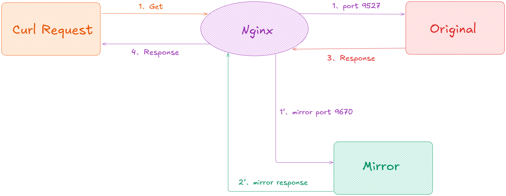

server {

listen 80;

location / {

mirror /mirror; \# 流量镜像配置

proxy\_pass http://backend;

}

location = /mirror {

internal;

proxy\_pass http://test\_backend$request\_uri;

}

}

优点：　

1.  原生支持HTTP/HTTPS协议，在nginx 1.13.4版本后内置该模块。
2.  支持配置多份镜像放大流量。
3.  配置比较简单，nginx-server将流量复制到mirror后无交集，达到对真实流量无影响目的。

缺点：　

1.  修改配置需reload服务（1.13.4+支持动态配置），线上环境不建议这么做。
2.  无法过滤指定URI路径。
3.  只支持录制 http 流量。
4.  mirror 为子请求，当 mirror 未结束时，主请求的内存无法释放，可导致 nginx 性能下降甚至阻塞。

### **2.4.2 应用层方案**　

实现方式：基于 AOP 或中间件实现业务拦截

优势：支持业务逻辑级录制

局限：存在代码侵入风险

典型工具：JVM-Sandbox

项目地址：[https://github.com/alibaba/jvm-sandbox-repeater](https://github.com/alibaba/jvm-sandbox-repeater)　

关于它的安装和部署可以参考：

[https://www.cnblogs.com/hong-fithing/p/16221706.html](https://www.cnblogs.com/hong-fithing/p/16221706.html)

[https://www.cnblogs.com/hong-fithing/p/16222644.html](https://www.cnblogs.com/hong-fithing/p/16222644.html)

关于实现原理可以参考：[https://blog.csdn.net/weixin\_39599176/article/details/147124609](https://blog.csdn.net/weixin_39599176/article/details/147124609)

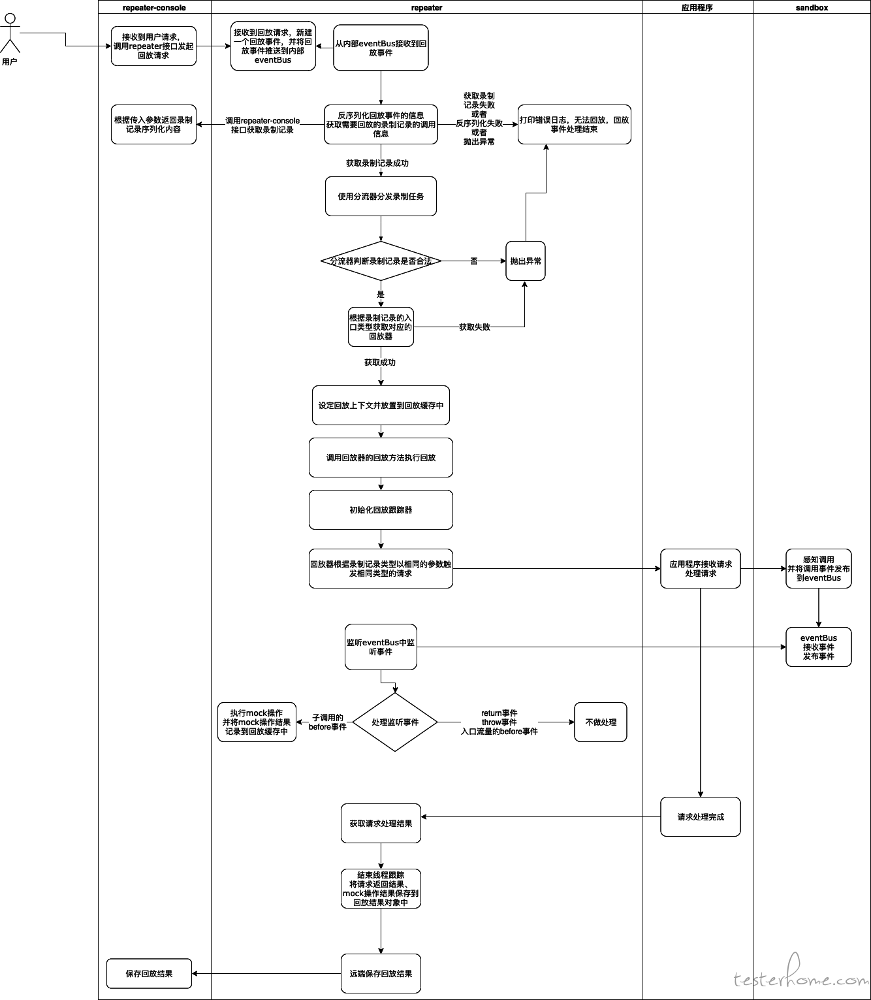

使用 jvm-sandbox 沙箱技术，通过Java agent 或者 attach 方式挂载到 Java 应用上。repeater 模块根据配置的规则录制或回放数据，console 模块主要负责触发和数据交互。　

// 配置录制规则

RepeaterConfig config = new RepeaterConfig()

.includeSubInvoke(true)

.recordPredicate((ctx) -> ctx.getCost() > 100);

优点：

1.  通过字节码增强的方式可以直接录制Java方法、子调用。
2.  对业务代码0侵入。
3.  模块功能丰富。

缺点：

1.  对服务运行环境有一定侵入。
2.  在挂载瞬间会占用较多的机器资源，当业务量大时可能会导致服务夯住。
3.  当前功能不完善，需要代码开发能力。

### **2.4.3 网络层方案**

实现方式：通过网卡抓包实现协议解析

优势：支持多协议透明传输

局限：需要处理协议解码

典型工具：GoReplay、TcpCopy　

### **2.4.3.1 TcpCopy**

项目地址：[https://github.com/session-replay-tools/tcpcopy](https://github.com/session-replay-tools/tcpcopy)　

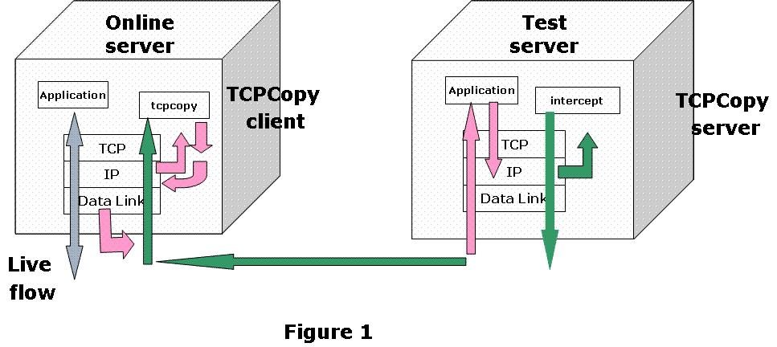

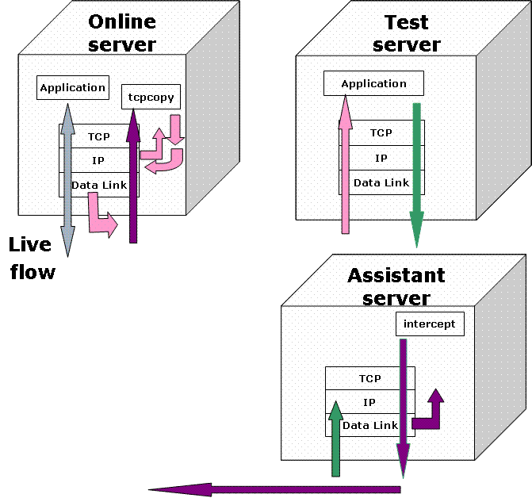

流量示意图：

  
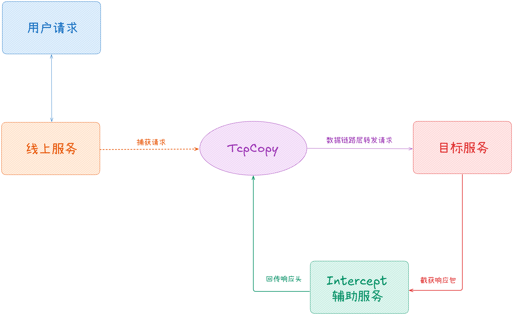

核心特性：

1.  基于raw socket实现网络层转发。
2.  支持TCP协议全栈流量复制。
3.  流量放大率可达10倍以上。

技术优势：　

1.  支持四层TCP全协议流量复制。
2.  流量放大率最高可达20倍。
3.  对线上服务影响小于3% CPU消耗。
4.  支持跨机房流量复制。

实施难点：　

1.  需部署 intercept 辅助服务器。
2.  异常流量可能穿透到目标环境。
3.  不支持应用层协议解析。

### **2.4.3.2 GoReplay**

项目地址：[https://github.com/buger/goreplay](https://github.com/buger/goreplay%E3%80%80)

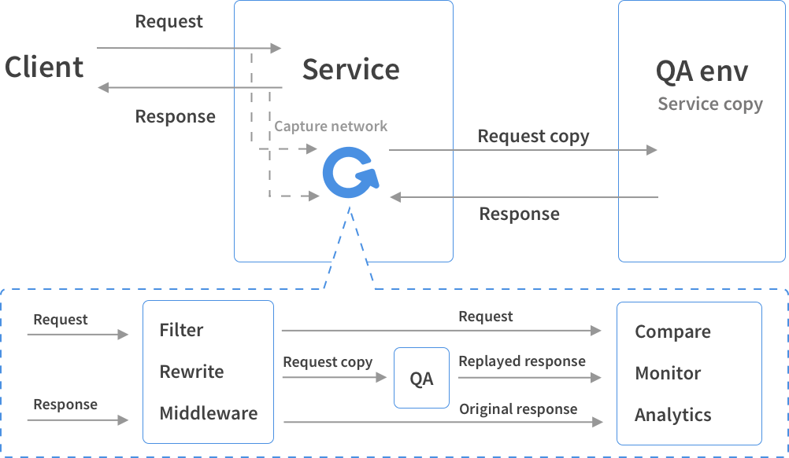

  
GoReplay 是基于 Go 语言实现与 Tcpdump 一样的一个 http 实时流量复制工具。功能强大，支持流量的放大、缩小、频率限制，还支持把请求记录到文件，方便回放和分析。

GoReplay 工具不是代理，而是在后台监听网络上的流量，不需要更改生产基础架构，而是在与服务相同的机器上运行 GoReplay 守护程序。

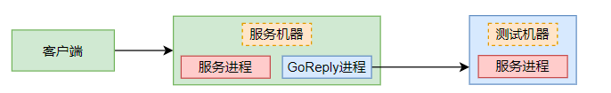

功能特性：

1.  轻量程序基本无需配置，环境准备简单。
2.  程序资源消耗少，无侵入应用运行环境。
3.  提供不限制语言的插件机制，方便拓展。
4.  支持HTTP流量录制/回放。
5.  提供流量过滤、重写中间件。
6.  支持限速与流量比例分配。

其重放特点：

1.  捕获⽹络指定端⼝流量，输出到控制台。
2.  捕获⽹络指定端⼝流量，将原始流量实时重放到其他环境中。
3.  捕获⽹络指定端⼝流量，并保存到⽂件中。
4.  捕获⽹络指定端⼝流量，请求过滤指定路径流量，并保存到⽂件中。

性能指标：单节点可处理 10Gbps 流量。

使用者：腾讯、京东、阿⾥等⼀线⼤⼚。

## **2.5 流量录制/重放技术方案总结**

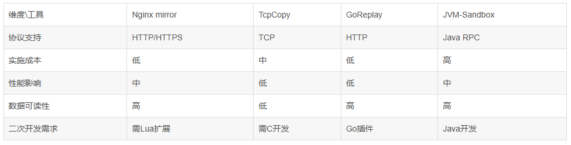

选型建议：

1.  全链路压测优先考虑 TcpCopy。
2.  HTTP接口回归推荐 GoReplay。
3.  业务逻辑验证建议 JVM-Sandbox-Repeater。
4.  简单场景可使用 Nginx mirror。

综上，这里我们主要使用 GoReplay 来进行流量录制/重放，后面进行具体的安装和实操。