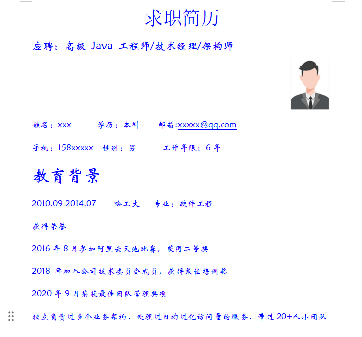
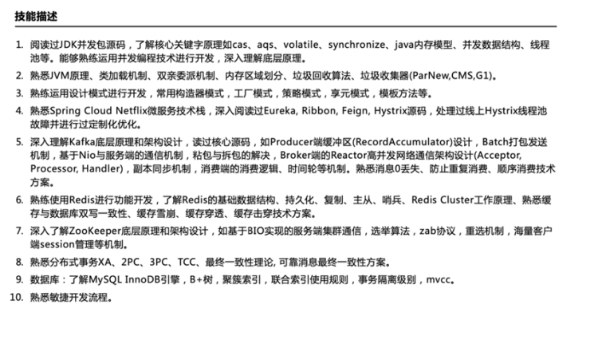

从今天之后的一段时间内，华仔会带着大家一起从零开始搭建并研发一套高并发的电商实战项目，这里会涉及到很多互联网大厂开发过程中所使用的核心技术和架构设计模式，希望大家学完之后可以用到自己的简历中。

通过整整8个月时间，小红书社交+电商高并发实战项目即将收官，接下来，我会两个重要的模块「**实战项目总结及如何将亮点、难点写入简历**」、「**小红书社交+电商业务性能压测**」。

这是第九十六篇，本篇我们来对整个「**实战项目**」进行简历编写。

文章汇总位置：[https://wx.zsxq.com/dweb2/index/columns/51122554151214](https://wx.zsxq.com/dweb2/index/columns/51122554151214)

源码授权与获取地址：[https://articles.zsxq.com/id\_1s85grnaae4p.html](https://articles.zsxq.com/id_1s85grnaae4p.html)

本章源码地址：[https://gitcode.net/u011359591/huazai-ecshop/-/tree/ecshop-chapter-9](https://gitcode.net/u011359591/huazai-ecshop/-/tree/ecshop-chapter-95)6

## **01 前言**

上篇对整个「**小红书社交+电商项目**」进行总结，[【电商实战项目第九十五篇】华仔电商实战项目全景透视、各模块架构设计及亮点与难点总结](https://articles.zsxq.com/id_lp87dcfu360a.html) 今天我们就来将其正式写入简历中。

##   
**02 如何写个人经历、技术栈、项目核心成果**

通过前段时间，星球很多老铁找我进行简历指导，通过批阅和指导大家的简历，这里给大家梳理下如何去写这两部分内容。

本星球的成员，应该在这几个阶段：

1.  刚毕业或者刚培训出来
2.  可能再⼩公司⼯作，刚开始搬砖，对⾃⼰的职业发展不清晰
3.  遇到复杂需求或者业务不会写，或者网上看视频会了但是真到⾃⼰写就不会
4.  ⼯作1~3年
5.  初中级⼯程师，传统IT企业，或者⼩型互联⽹公司，
6.  写过⼏个项⽬，有上线的也有没上线的
7.  ⼯作3~6年
8.  中⾼级⼯程师，带过⼩团队也取得过成就，但技术栈得不到更新或者业务没啥亮点
9.  ⼯作6~8年
10.  技术leader 或 CTO、经过N个公司和项⽬，但是技术栈偏传统或者业务没啥亮点
11.  处在外包公司中
12.  赶紧跳槽-找个正职

这里我们先来看下面试目标：

1.  社招：Java ⾼级⼯程师/架构师
2.  ⼀线城市 25~35k ⽉薪， 架构师 40~50k左右，互联⽹⾏业，对标阿⾥ P6-P7。
3.  总包：40到60万年薪。
4.  校招：Java 开发⼯程师
5.  ⼀线城市 10~20k ⽉薪，互联⽹⾏业，对标阿⾥P5
6.  总包：20到30万年薪

## **2.1 如何写教育经历**

这块比较重要，HR或面试官会比较看重，下面这些问题大家注意下：

1.  问题一：非科班出身的建议先不写专业。
2.  问题二：大专学历怎么办？写本科，拿到面试机会，技术面后和hr说是自考的快拿到证书。
3.  问题三：不要堆砌没用的经历和技术栈，换位思考-你认为你这个能吸引面试官不?
4.  问题四：如果是垃圾培训机构建议再好好学习，然后包装简历一个小型公司的经历
5.  培训并不是见不得人的事情，不培训或者不自学的才容易被鄙视。
6.  比如一个工作了3年的后端工程师，花半月去培训了大数据的知识，获取去培训机器学习/AI知识的，这类会更加受欢迎。
7.  问题五: 岗位和工作年限要对应，薪资是可以面谈（取决公司的其他福利-年终奖等）。

## **2.2 如何写技术栈**

根据自己情况，编写技术栈，不懂的一定不要写; 不要被面试官挖坑跳入，学会引导面试官问自己会的框架; 如果你是初中级工程师，就可以适当删减些技术栈；必须要有几个框架很懂的，包括原理和业界同类解决方案对比

高级工程师基本就不是说会几个框架那么简单：

1.  技术栈要丰富，有横有纵。
2.  部分框架会用，部分框架懂原理、甚至源码。
3.  框架设计思想、优缺点必须知道。

另外切记：不要写精通、不要写精通、不要写精通！！！

下面给一个示例，大家可以参考写自己的：

## **2.2 如何写项目核心成果**

项⽬没亮点基本也就没⾯试机会了，所以简历⼀定要项⽬亮点，且多⼏个好项⽬能带来更多⾯试机会。简历上写的项⽬，细节⾃⼰⼀定要掌握或实操过！！！

编写项目经验-你需要注意的事情，面试官会关注以下内容：

1.  项目背景介绍。
2.  项目核心成果有哪些？可以支撑多少并发？
3.  项目亮难点、业务复杂度、如何解决这些的问题？
4.  业界有没类似的方案，这个是否最优？如果让你改进，还有哪些可以做的更好。

建议：项目适当包装会让你脱颖而出。关于大厂 内部晋升机制，懂的人都懂，都有适当包装，前提是自己要做到心中有数。

## **03 项目简历编写**

这里我们按照一个一个模块的形式来进行简历梳理和编写。

2017.12 - 至今 小红书 | 社交电商项目组 高级架构师

综合描述：负责日均千万级访问量的小红书社交+电商双引擎的架构设计，主导 C 端核心业务：首页 Feed 流服务、用户服务、美食服务、社交服务、购物车服务、商品服务、优惠券服务、库存服务、订单服务、支付服务。整个系统架构采用阿里 P8 带队，经过多个版本迭代，用户量超千万，团队组成基本都是大厂出身。

## **3.1 首页服务**

### **高并发首页 Feed 流设计**

核心目标：设计千万级美食信息处理的首页推荐系统，保障 200ms SLA 下动态兴趣与静态热点数据融合，目标支撑 10 万+QPS 流量峰值的个性化访问。

### **核心工作与成果**

1.  智能路由决策引擎：根据「**用户画像信息**」动态路由请求，实时「**推荐系统**」（30%流量）与「**版本化缓存**」（70%流量）分流，降低推荐系统负载40%。
2.  版本化缓存管理体系：每次「**全量更新**」生成新版本缓存，旧版本可以控制保留24小时（兼容历史请求）。
3.  三级流量控制体系：
4.  客户端：版本号校验（无版本号强制拉新版，有版本号直读缓存）。
5.  服务端：请求分级（下拉刷新走随机分页，普通请求用时序分页）。
6.  兜底策略：空数据返回保护 + 版本自动回退机制。

## **3.2 用户服务**

### **高并发用户服务架构设计**

核心目标：设计支撑千万级MAU用户高并发访问及身份认证状态体系，并保障高并发下账号唯一性。

### **核心工作与成果**

1.  负责用户服务注册、登录模块开发，支持「**多渠道验证码发送**」，具有防刷、防恶意注册设计等。
2.  对于新用户拉新福利，采用 「**RocketMQ 消息**」进行解耦，保障数据最终一致性和可靠性投递。
3.  分布式唯一性保障：通过「**布隆过滤器前置拦截**」+ 「**MySQL 唯一索引**」双重校验来实现用户信息查重机制，保障高并发下账号唯一性。
4.  无状态会话管理：通过 JWT 双 Token 动态刷新方案「**AccessToken(7天有效期)**」+ 「**RefreshToken(30天有效期)**」实现用户会话管理，并通过「**登录拦截器**」实现用户信息校验。
5.  缓存、数据库一致性治理：通过「**JD-Hotkey + Redis 多级缓存**」、「**Redission 分布式锁**」、「**锁超时机制防止阻塞**」、「**Double Check 减少 DB 访问**」、「**零值缓存防止穿透**」、「**缓存自动延期机制**」来保障高并发场景下用户读写， 并解决缓存与数据库双写一致性问题。

## **3.3 美食服务**

### **高并发美食服务架构设计**

核心目标：设计支撑千万级美食信息发布与访问， 并保障峰值 QPS 5 万+的热门美食列表、详情页高效读取。

### **核心工作与成果**

1.  创新惰性分页缓存：「**按需构建分页**」\+ 「**总量分离存储**」，热点博主自动标记机制。
2.  精准缓存更新机制：基于 RocketMQ 异步增量刷新已缓存分页，避免全量重建。
3.  实施五级容错防护体系：「**分布式锁防击穿**」\+ 「**空值缓存防穿透**」\+ 「**缓存自动延期机制**」+「**版本回退**」\+ 「**异常页兜底数据**」来保障高并发场景下美食读写， 并解决缓存与数据库双写一致性问题。

## **3.4 社交服务**

### **高并发社交服务架构设计**

核心目标：设计支撑亿级关系链存储， 并保障峰值 QPS 5万+的热门内容点赞、关注、收藏、评论等关键场景的高效计数与高并发读写。

### **核心工作与成果**

1.  亿级关系链优化：采用「**Redis Zset**」存储双向关系链（关注与粉丝列表），「**RocketMQ**」异步消费 + 「**Redis Lua**」原子处理关系事件，并通过「**布隆过滤器**」前置拦截来加速状态查询。
2.  构建高性能三级计数缓冲：通过「**Caffeine 本地 缓冲区聚合写**」、「**Redis Incr 计数**」、「**批量同步数据库**」来实现了高性能计数服务， 在保证数据最终一致性的前提下，大幅提升了系统的吞吐量和响应速度。
3.  构建高并发评论及审核服务：
4.  设计双维度缓存存储（ZSet 维护时间序/热度序评论 ID 列表 + String 评论详情）。
5.  设计基于「**时间窗 10s**」和「**数量 20条**」双重阈值「**动态聚合**」、「**批量更新数据库**」减少数据库压力。
6.  引入「**高性能敏感词**」检测工具和敏感词库来进行「**评论内容审核**」，自动标记违规评论。审核结果通过MQ顺序消息通知，更新评论状态。
7.  设计动态热度权重算法（点赞权重 0.4 + 回复权重 0.6 - 举报惩罚），实时更新前 500 热评。

## **3.5 购物车服务**

### **高并发购物车服务架构设计**

核心目标：设计支撑亿级购物车信息， 并保障峰值 QPS 5万+的秒杀场景下的加购、删除、修改、列表及缓存与数据库一致性。

### **核心工作与成果**

1.  设计精细化缓存模型：「**Redis Hash 存储数量信息**」 + 「**Redis Hash 存储扩展信息**」 + 「**Redis Zset 维护排序信息**」来高效缓存购物车信息。
2.  设计三级容错机制：「**空缓存标识防止缓存穿透**」、「**缓存部分失效时降级查 DB 重建缓存**」、「**MQ 消费失败重试机制**」。
3.  设计数据一致性机制：「**商品级分布式锁**」、「**RocketMQ 异步更新**」来保障缓存与数据库的最终一致性。

## **3.6 商品服务**

### **高性能商品服务架构设计**

核心目标：设计支撑亿级商品信息， 并保障峰值 QPS 5万+的商品详情访问， 亿级商品高效搜索与同步。

### **核心工作与成果**

1.  近实时搜索体系：引入 ElasticSearch 搜索引擎和分片策略来保障商品数据的高效查询。
2.  全量/增量同步方案：
3.  设计千万级同步 ES 方案：基于「**并发编程**」、「**智能文件分片**」、「**批处理**」、「**文件映射**」、「**ES Bulk API**」等技术实现高性能、可扩展的全量数据同步架构。
4.  设计近实时同步 ES 方案：通过 Canal 监控 MySQL binlog，发布变更消息到 RocketMQ，ES 消费消息增量更新。
5.  设计亿级详情页「**动态渲染服务**」和「**详情页统一处理服务**」来保障大促期间商详的稳定性。

## **3.7 优惠券服务**

### **高并发优惠券服务架构设计**

核心目标：设计支撑千万级月活用户的优惠券服务体系，需解决瞬时峰值 5万+QPS 的领券压力同时保障分布式场景下库存强一致性与系统高可用。

### **核心工作与成果**

1.  负责优惠券服务架构设计, 基于「**责任链模式**」实现优惠券创建，支持多种「**优惠券规则配置**」立减券、折扣券、满减券，限领张数等配置。
2.  设计三级库存管控防护体系:
3.  前置层:基于 Redis 实现「**模板级库存热度缓存**」，采用 Lua 脚本「**扣减库存原子操作**」，规避超卖风险。
4.  异步层:通过 RocketMQ 5.x 实现「**库存扣减**」与「**领券记录持久化**」的最终一致性，削峰能力达 10 万消息/秒。
5.  持久层:基于 ShardingSphere5.x 分库分表(32分片)，采用「**用户 ID 分片键**」，解决亿级领券记录存储与查询性能瓶颈。
6.  构建双层精准过期检测机制：
7.  预检层: 基于 XXL-Job 3.0 「**动态分片能力**」，每日扫描待过期模板生成「**预补偿任务**」。
8.  执行层: 通过 RocketMQ 5.x 任意延时消息(精度±30s)触发「**结束状态处理**」。
9.  研发千万级分布式任务推送引擎：
10.  分片策略: 基于「**用户画像**」数据动态划分任务分片，每个分片负责1000个用户推送。
11.  batch 消息分割:设计「**批量消息分割算法**」，保证消息不超过 RocketMQ 批次限制。
12.  多线程推送:采用 ThreadPoolExecutor+Semaphore 实现「**共享线程池**」进行多线程推送任务。
13.  亿级数据分库分表方案：
14.  分片策略设计:采用 ShardingSphere 5.x 标准分片+强制路由方案，按(user\_id)%32生成分片键，使单用户领券记录集中存储(便于查询)，同时分散模板热点压力。
15.  动态扩容方案:预置 20%空分片 (预留2库16表和32表)，后续可通过ShardingSphere 影子库+ onlineDDL 工具实现业务无感扩容。
16.  查询优化:领券记录查询:通过「**分片键精准路由**」，98%查询命中单分片，对于热点模板查询: 建立template\_id一>分片映射表二级路由，避免全分片扫描。

## **3.8 库存服务**

### **高并发库存服务架构设计**

核心目标：设计支撑千万级月活用户的库存服务体系，需解决瞬时峰值 5万+QPS 的领券压力同时保障分布式场景下库存强一致性与系统高可用。

### **核心工作与成果**

1.  设计柔性分桶算法:
2.  基于 Redis 节点数「**动态分桶**」，通过计算来智能配额， 避免数据倾斜。
3.  构建「**总访问计数**」、「**分桶预扣减流水记录**」、「**分桶实际库存**」三级缓存结构。
4.  设计三级扣减体系：
5.  路由选择：通过自增计数选择「**目标分桶**」。
6.  渐进扣减：优先扣减「**目标分桶**」，不足时顺序「**遍历其他分桶**」，仍不足则触发「**合并扣减**」。
7.  跨分桶合并扣减进行最后兜底。

## **3.9 订单服务**

### **高性能订单服务架构设计**

核心目标：设计支撑千万级月活用户的订单服务体系，需解决瞬时峰值 1万+QPS 的订单查询同时保障分布式场景下库存强一致性与系统高可用。

### **核心工作与成果**

1.  高并发订单创建/取消：
2.  通过 CompletableFuture 「**异步编排**」并行获取用户/商品/优惠券数据来生成下单前数据。
3.  通过 RocketMQ 事务消息「**解耦**」订单创建/取消与库存扣减、优惠券锁定/释放、购物车清理。
4.  通过「**雪花算法生成订单号**」+「**登录信息生成幂等号**」并通过其防止订单重复操作。
5.  订单状态精准流转：
6.  通过「**订单状态机**」来实现订单状态闭环控制。
7.  可靠的超时关单方案：
8.  通过 RocketMQ 延时消息（30分钟精准触发） 超时关单。
9.  通过 XXL-Job 分片任务来扫描兜底（每30分钟全量巡检） 超时关单。
10.  海量数据实时查询​：
11.  基于 ShardingSphere 分片策略（用户ID%32分片) 实现订单分库分表。  
    

## **3.10 支付服务**

### **高性能支付服务架构设计**

核心目标：设计支撑千万级月活用户的支付服务体系，需解决瞬时峰值 2000+ QPS 的订单支付，保障资金安全。

### **核心工作与成果**

1.  支付通道策略工厂：策略模式封装支付宝/微信SDK，支持动态路由（失败率>5%自动切换）。
2.  异步补偿机制：失败订单自动重试（≤3次） + 人工核对。
3.  幂等控制：用户id + 订单号唯一索引。
4.  资金对账体系：定时对账任务（每10分钟）\+ 差异自动修复（T+1） (未来可做)。