## 【电商实战项目第九篇】华仔电商实战项目用户微服务模块用户头像上传功能开发

大家好，我是**华仔**, 又跟大家见面了。

从今天之后的一段时间内，华仔会带着大家一起从零开始搭建并研发一套高并发的电商实战项目，这里会涉及到很多互联网大厂开发过程中所使用的核心技术和架构设计模式，希望大家学完之后可以用到自己的简历中。

这是第九篇，本篇我们进行电商实战项目用户微服务模块用户头像上传功能开发。

文章汇总位置：[https://wx.zsxq.com/dweb2/index/columns/51122554151214](https://wx.zsxq.com/dweb2/index/columns/51122554151214)

源码授权与获取地址：[https://articles.zsxq.com/id\_1s85grnaae4p.html](https://articles.zsxq.com/id_1s85grnaae4p.html)

本章源码地址：[https://gitcode.net/u011359591/huazai-ecshop/-/tree/ecshop-chapter-9](https://gitcode.net/u011359591/huazai-ecshop/-/tree/ecshop-chapter-9)

## **01 前言**

终于要设计与研发电商项目代码了，今天我们要对用户微服务模块用户头像上传功能开发。

这里需要注意下，我们整个项目目前是不提供前端的，这个后续有时间在搞，主要是进行后端接口以及微服务模块架构设计。

## **02 用户上传功能**

首先这里，我们需要考虑上传文件的管理与扩容问题，所以中大厂公司都会选择阿里云 OSS 来存储对应的文件，另外访问时还支持 CDN 方式读取。

## **2.1 OSS 介绍**

阿里云对象存储服务（[Object Storage Service，简称 OSS](http://xn--object%20storage%20service,oss-4z00fyxt/)），是阿里云对外提供的海量、安全、低成本、高可靠的云存储服务。您可以通过本文档提供的简单的 REST 接口，在任何时间、任何地点、任何互联网设备上进行上传和下载数据。基于 [OSS](http://oss/)，您可以搭建出各种多媒体分享网站、网盘、个人和企业数据备份等基于大规模数据的服务。

具体介绍可点击：[https://www.alibabacloud.com/help/zh/oss/developer-reference/description](https://www.alibabacloud.com/help/zh/oss/developer-reference/description)

开通阿里云OSS

1.  阿里云账号、实名认证
2.  OSS介绍：[https://www.aliyun.com/product/oss](https://www.aliyun.com/product/oss)
3.  OSS控制台：[https://oss.console.aliyun.com/bucket](https://oss.console.aliyun.com/bucket)
4.  帮助文档：[https://help.aliyun.com/learn/learningpath/oss.html](https://help.aliyun.com/learn/learningpath/oss.html)

开通后的操作：

1.  创建好 Bucket。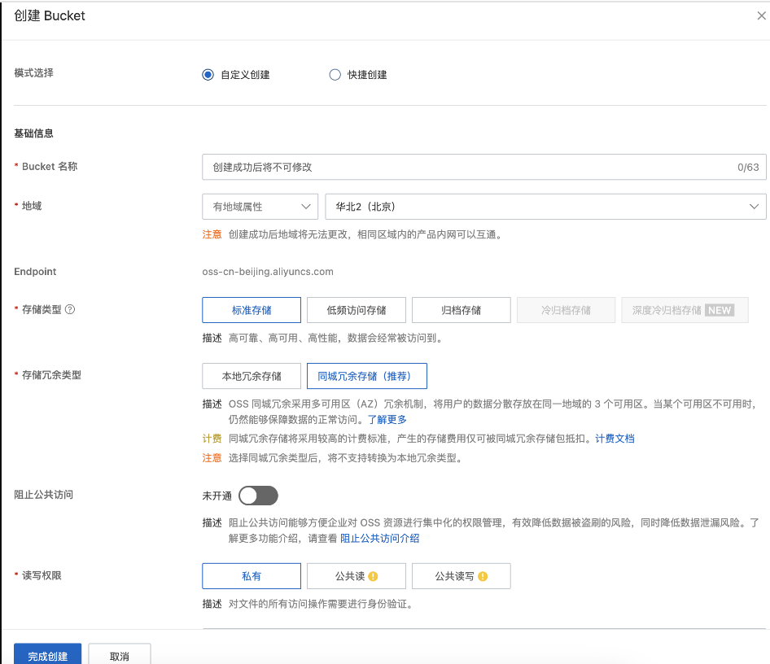
2.  阿里云设置 AccessKey。创建 AccessKey，记得保存好 AccessKeyId 和 AccessKeySecret，后面会使用。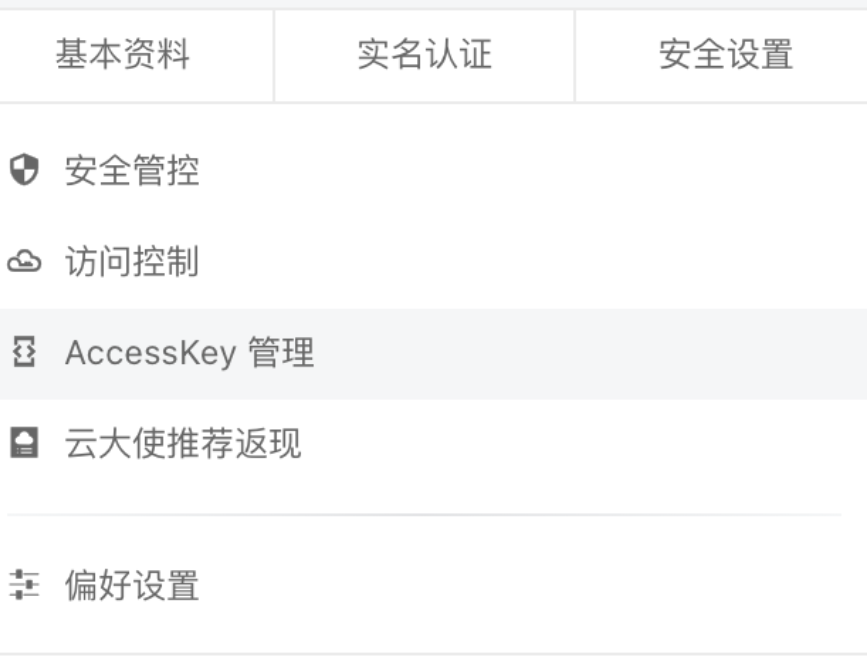
3.  上传文件。
4.  访问文件。

这里需要注意下 RAM 权限相关知识。

1.  阿里云用于各个产品的权限，基于 RBAC 模型，进行简单管理账号、统一分配权限、集中管控资源，从而建立安全、完善的资源控制体系。
2.  众多产品，一般采用子账号进行分配权限，防止越权攻击。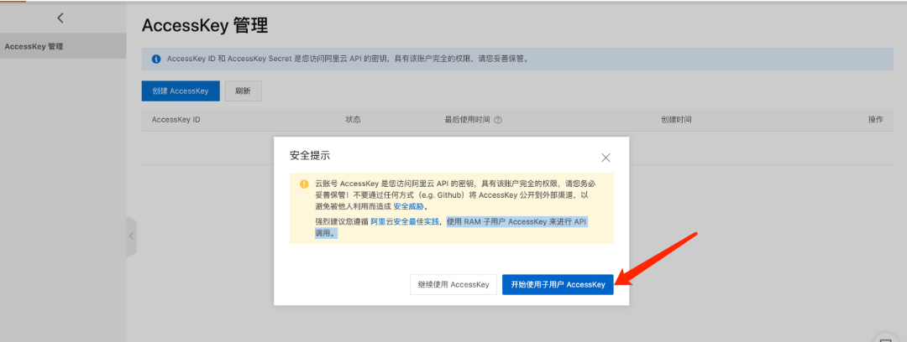
3.  建立用户，勾选编程访问（保存 accessKey 和 accessSecret，只出现一次）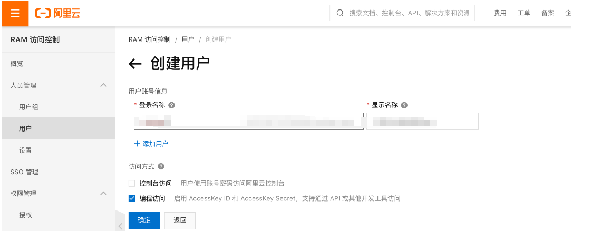
4.  为新建用户授权 OSS 全部权限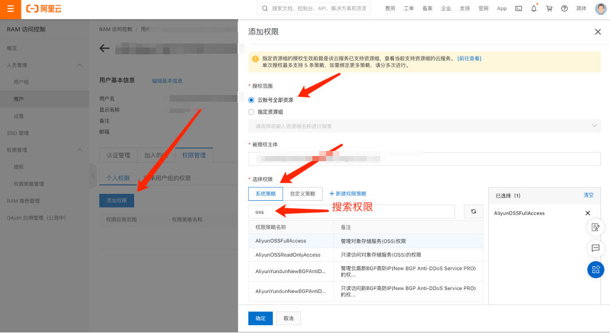

## **2.2 项目整合 OSS**

关于 OSS SDK 的介绍：[https://help.aliyun.com/zh/oss/developer-reference/preface-1](https://help.aliyun.com/zh/oss/developer-reference/preface-1)。

### **2.2.1 添加依赖**

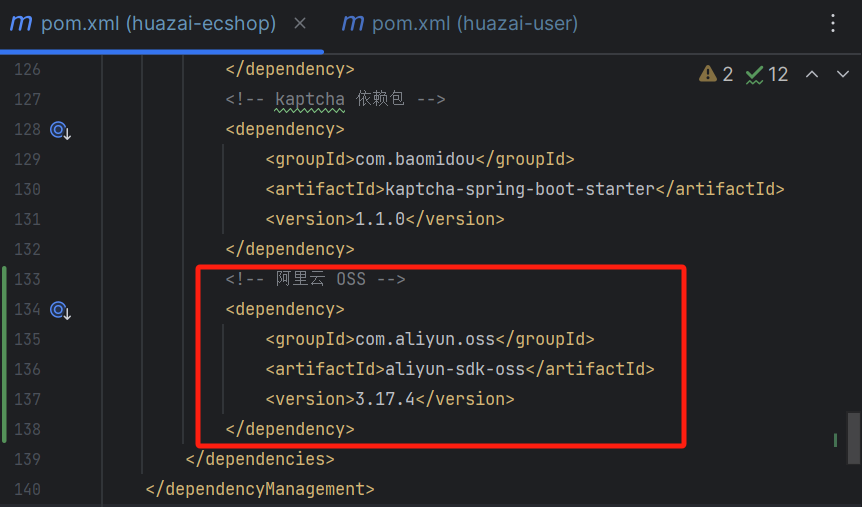

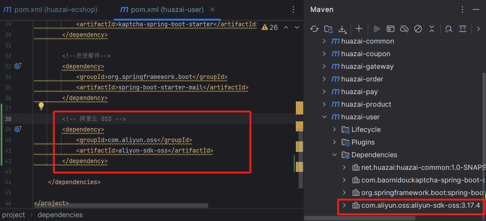

### **2.2.2 添加 OSS 配置**

在 user 项目中的 [resource/application.yml](http://resource/application.yml%20) 中添加对应 OSS 配置。

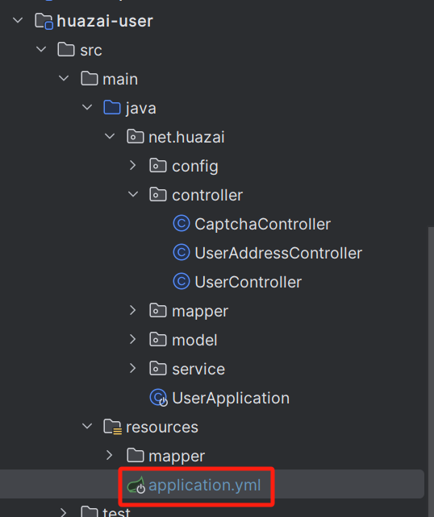

#阿里云 OSS 配置

aliyun:

oss:

endpoint: oss-cn-beijing.aliyuncs.com

access-key-id: xxxxxxxxxxxxxxx

access-key-secret: xxxxxxxxxxxxxxxxxxxxxxx

bucketname: huazai-user

新建 OSS 配置类：

package net.huazai.config;

import lombok.Data;

import org.springframework.boot.context.properties.ConfigurationProperties;

import org.springframework.context.annotation.Configuration;

/\*\*

\* @className: OSSConfig

\* @author: huazai，该项目是知识星球：华仔和他的朋友们 的内部项目

\* @date: 2024-08-17 0:30

\* @Version: 1.0

\* @description:

\*/

@ConfigurationProperties(prefix = "aliyun.oss")

@Configuration

@Data

public class OSSConfig {

/\*\*

\* 访问域名

\*/

private String endPoint;

/\*\*

\* 访问密钥 AccessKeyId 用于标识用户

\*/

private String accessKeyId;

/\*\*

\* 访问密钥，用户用来加密签名字符串和 OSS 用来验证签名字符串的密钥

\*/

private String accessKeySecret;

/\*\*

\* 存储空间名称

\*/

private String bucketname;

}

### **2.2.3 封装 OSS 服务**

先来封装 OSS 上传服务，如下：

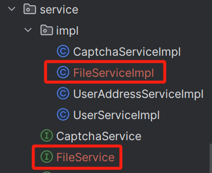

package net.huazai.service.impl;

import com.aliyun.oss.OSS;

import com.aliyun.oss.OSSClientBuilder;

import com.aliyun.oss.model.PutObjectResult;

import lombok.extern.slf4j.Slf4j;

import net.huazai.config.OSSConfig;

import net.huazai.service.FileService;

import net.huazai.utils.CommonUtil;

import org.springframework.beans.factory.annotation.Autowired;

import org.springframework.stereotype.Service;

import org.springframework.web.multipart.MultipartFile;

import java.io.IOException;

import java.time.LocalDateTime;

import java.time.format.DateTimeFormatter;

/\*\*

\* @className: FileServiceImpl

\* @author: huazai，该项目是知识星球：华仔和他的朋友们 的内部项目

\* @date: 2024-08-17 9:23

\* @Version: 1.0

\* @description: 文件上传服务

\*/

@Service

@Slf4j

public class FileServiceImpl implements FileService {

/\*\*

\* 注入 OSS 配置文件

\*/

@Autowired

private OSSConfig ossConfig;

/\*\*

\* 上传用户头像

\* @param file

\* @return

\*/

@Override

public String uploadUserAvatar(MultipartFile file) {

/\*\*

\* 1、获取 OSS 相关配置

\*/

String endPoint \= ossConfig.getEndPoint();

String accessKeyId \= ossConfig.getAccessKeyId();

String accessKeySecret \= ossConfig.getAccessKeySecret();

String bucketname \= ossConfig.getBucketname();

/\*\*

\* 创建 OSS 对象

\*/

OSS ossClient \= new OSSClientBuilder().build(endPoint, accessKeyId, accessKeySecret);

/\*\*

\* 获取原始文件名

\*/

String OriginalFilename \= file.getOriginalFilename();

/\*\*

\* 获取日期格式，上传时目录名使用

\*/

LocalDateTime localDateTime \= LocalDateTime.now();

DateTimeFormatter dateTimeFormatter \= DateTimeFormatter.ofPattern("yyyy/MM/dd");

/\*\*

\* OSS 上传存储路径：user/2024/08/17/xxxxxxx.jpg/png

\*/

String floder \= dateTimeFormatter.format(localDateTime);

// 获取扩展名

String extension \= OriginalFilename.substring(OriginalFilename.lastIndexOf("."));

// 新文件名，通过 uuid 生成文件名，

String fileName \= "user/" + floder + "/" + CommonUtil.generateUUID() + extension;

try {

// 写入 OSS

PutObjectResult putObjectResult \= ossClient.putObject(bucketname, fileName, file.getInputStream());

// 返回图片路径

if(putObjectResult != null){

String imgUrl \= "https://" + bucketname + "." + endPoint + "/" + fileName;

return imgUrl;

}

} catch (IOException e) {

log.error("用户微服务-上传模块-文件上传失败：{}", e);

throw new RuntimeException(e);

} finally {

// oss 关闭客户端服务，不然会造成 OOM

ossClient.shutdown();

}

return null;

}

}

### **2.2.4 开发上传接口**

最后再来开发上传接口，直接在 [user](http://user%20/) 控制器添加对应接口，如下：

/\*\*

\* 上传用户头像

\* 默认文件大小 1M，超过报错

\* @param file

\* @return

\*/

@ApiOperation("用户头像上传")

@PostMapping("/upload")

public ApiResult uploadUserAvatar(

@ApiParam(value = "文件上传", required = true)

@RequestPart("file") MultipartFile file){

String result \= fileService.uploadUserAvatar(file);

return result != null ? ApiResult.doSuccess(result) : ApiResult.doResult(BizCodes.USER\_AVATAR\_FILE\_UPLOAD\_ERROR);

}

启动后测试结果如下：

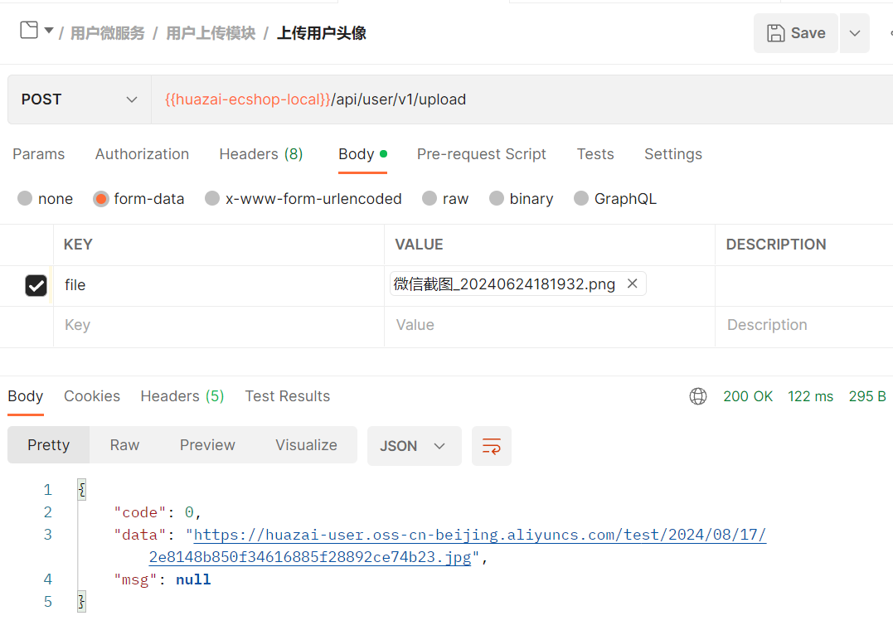

再来测试一个超过 1M 的文件，如下：

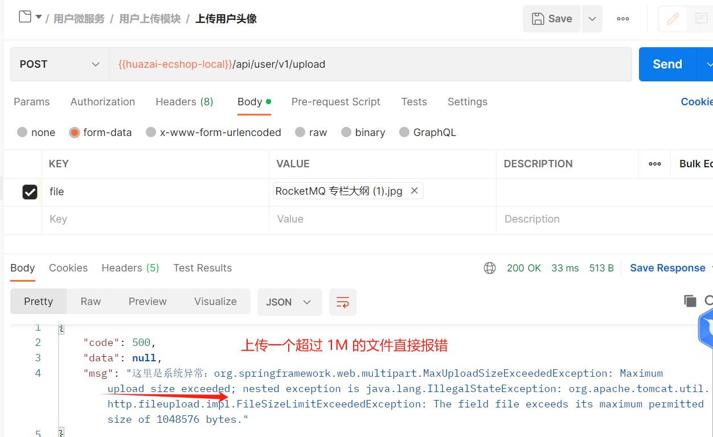

![](data:image/png;base64,iVBORw0KGgoAAAANSUhEUgAAAQAAAAEACAYAAABccqhmAAAQAElEQVR4AeydjZLkNg6D97v3f+dctH2+sUi4zZHtbv8gFcUmDYIUlELVqGaT//zjv6yAFXisAv/547+sgBV4rAI2gMcevTduBf78sQH43wIr8FAF2rZtAE0FLyvwUAVsAA89eG/bCjQFbABNBS8r8FAFbAAPPXhv+9kKTLu3AUxK+GkFHqiADeCBh+4tW4FJgbIBAH/g+2safI8n5P0oXuhxFQz0NfCKt9TCiwNeT8V1dA5eveH9c885IPfak7/KBf0cqg56DHwnVrOpXNkAVLFzVsAKXE+B+cQ2gLkafrcCD1PABvCwA/d2rcBcARvAXA2/W4GHKbDJAP75558/R66jz0LNfnTPPfkhXzApfqjhVG3MVTWD3BPWc7Ffi1VPGOOC9TrQmDbLyFLz75n7zUwRu8kAIpljK2AFrqWADeBa5+VprcCuCtgAdpXTZFbgWgrYAK51Xp7WCgwroAp3NwDQFyjwPq+GG83B+17w+l7ljxc28KqHn6fiinUthp8aeL2r2tEcvDjh59n6xgU/36H+ruaK3CpWdSoHtVlUj5iDzKV6xroWK9yeOcizwXpuzxka1+4G0Ei9rIAVuIYCNoBrnJOntAKHKGADOERWk1qBcymwNM0tDaD9DFdZsP4zF2RMhbthlOgtv9eq8itczFVngqxH5Gox9DjF33BxKZzKQc8PRKrd4zjH7g2+QHhLA/iCjm5pBS6pgA3gksfmoa3APgrYAPbR0SxW4LQKvBvMBvBOHX+zAjdX4BYGAAz958qqZxsvf2CsH9TrqrNFHNR6jNZFLVocuVrc8vPVcqML8p7m3NM79LgpP39WZ5jXTO/V2ivhbmEAVxLcs1qBMylgAzjTaXgWK7CzAmt0NoA1hfzdCtxYARvAjQ/XW7MCawrsbgDThclvn2uDvvv+214TXnFO3+ZPWL9cmuPfvaueKgd9T8ix6qO4FK6SU1wqB3m2iIN1TKz5bRz3BLWeUMP9dp53+DhrNX7HOfJtdwMYGcI1VsAK7K9AhdEGUFHJGCtwUwVsADc9WG/LClQUsAFUVDLGCtxUgU0GAPnyBPbLVTWHvqeqgx4DyP+nAazjIGO29FS18VJIYbbkoN/DFq7R2rjHFkM/F9TPqTJH6xFXpa5hoJ+t5SoL+jrYN1YzVHObDKDaxDgrYAXOqYAN4Jzn4qmswEcUsAF8RGY3sQLnVMAGcM5z8VRWYFiB3xSWDSBenHwrrmwO8iVLpa5h1L5afmQpLqjNBj1O9YceAyiYzMXZJEgkgfRHrwWslIIaF4zh4h5bXBpsA6j1OMOqbqFsAFVC46yAFbiOAjaA65yVJ7UCuytgA9hdUhNage8p8NvONoDfKma8FbiRArsbAOQLG+hzVf2grwMdV/kiDjQf9PlYtyVWF0SKT+FiTtWpHPT7gVqsuI7OxT1uidWskPeucCoXZ4HMBTmnuKCGU7V75nY3gD2HM5cVsALHKmADOFZfs1uBjykw0sgGMKKaa6zATRT4igFA/vkHci7+zLUUj56F4hvlgjy/4oIaLtZCrqvOX8XFnt+IIe9zdA6ocZ1ZH+j3MKrFUt1XDGBpGOetgBX4rAI2gM/q7W5W4BAFRkltAKPKuc4K3EABG8ANDtFbsAKjCpQNAPrLCGC0p/xPcSkyIP3JM8g5VRtz6qIH9uNS/HGGb8Wwvs/q/FVcZa9buGBsT9WekPmhzykulYO+DvR/5kxpFvkUZkuubABbmrjWCliB4xTYwmwD2KKea63AxRWwAVz8AD2+FdiigA1gi3qutQIXV2CTAUDtcqNykRExS3FFb1ULtVkVP+RaGMup2VQOen6FUbOqXKUW+n5Qv6hSPaHnq2AABZMXwWpPgMTC+7xsKpKxp4CUU5BnUsXQ4yKmxdBjgJYurU0GUOpgkBWwAqdVwAZw2qPxYFbgeAVsAMdr7A5W4LQK2ABOezQezAq8V2CPr5sMIF6KtBjoLmLUkNBjoB63HnGpHpUc5L6Ru8UVroarLMUF63NU66q40VkVv8qN8lfqGqbSs4JZ4lK10J+TwlRzrW9c1dqIizwtjpileJMBLJE6bwWswDUUsAFc45w8pRU4RAEbwCGymtQKHKvAXuw2gL2UNI8VuKACZQNoFwtxQX8pAgxLELmXYqC7ZIT8G2uwjmn8o8O22rgg94RaTs0Bfa3CqFycq8UKB+v80GMARSX/eDfQnZMs3DkJfc+297igx4COY52Kdx5f0sW+CgR5DwqncmUDUMXOWQErcG0FbADXPj9P/0AF9tyyDWBPNc1lBS6mQNkAIP+cEX8+UfEWPaDWM/ZQc8AYV+OOfFDjinVLcesxshTfCE+rgdqeGjYuWK+NNS2uzg+Zv9WPLNVT5Ua4Ww3kWRU/ZFyrX1uQ6xT/Gs/0vWwAU4GfVsAK3EcBG8B9ztI7eYACe2/RBrC3ouazAhdSwAZwocPyqFZgbwXKBqAuGiBfSFQGVFyqTuEg94Q+V+VSOOi5IMeq7iw5yPMqHSvzQuaCnFNckHGwnlNcan7IXBGnuKo5yPywnqvyKxxkfoWLORirazxlA2hgLytgBb6nwBGdbQBHqGpOK3ARBWwAFzkoj2kFjlDABnCEqua0AhdRoGwAULtogIyDPqe0gR4DOo4XPS1WfEfmWs+4QM8L63k1a+RXGMjcsa7FUMM17HypnvPv795j7Tvs/BvkWSPXUgx9rcJBjwEdq9pKbr6X6R1yjwpXw8CrFl7PiXPt2Worq2wAFTJjrIAVuJYCNoBrnZentQK7KmAD2FVOk1mBaylgA7jWeXnaBypw5JbLBrB26TB9j8NO+fkTXhca8POMdS2e10zv8FMDr/fp2/RstXHBCwvvn7GuGk+9509VO//+7l3Vxpyqh7y/WFeNFb+qhWN7QuZXs8WcmlXlYt1SHGsVLmJavAUXayFrATnX+lZW2QAqZMZYAStwLQVsANc6L09rBXZVwAawq5wmswL7KnA0mw3gaIXNbwVOrMAmA4D1ywdYxyzpA2O1kOviZcpSvDTLPA+Zf/59elc9pm/zJ2Q+6HNz/PQOPQby/yOhzTDh50/ItTCWaz3imvdq75C5W/7IBbWeUMPFPUKtTu0xcrUYxvlUj0pukwFUGhhjBazAeRWwAZz3bDzZwxX4xPZtAJ9Q2T2swEkVsAGc9GA8lhX4hAKbDKBdXKwttQlVswUXa6v88PlLF6j1jHuAXBcxLYYaLmqm4sZXWbDeU/FDroOcG61VdSqn9gi1ORRfzMF+XJG7xWr+lq+sTQZQaWCMFbACv1fgUxU2gE8p7T5W4IQK2ABOeCgeyQp8SoGyAcB+P8dAjQvGcZBroc99SuR5H/XzmsrNa5beod8PIKHAH+iXBIYk9DWg41C2KVRaVHOxcbUO8r4il4oV/xacqo051RPG5m/cZQNoYC8rYAWOV+CTHWwAn1TbvazAyRSwAZzsQDyOFfikAjaAT6rtXlbgZArsbgDQX0ioS4uqBqpW5Sp8o3WKu8oFvRaAoksXdKBxsjgkq7OFMhkqrmpOEhaSQNKjUPYXEmf7myz8I9YtxZEK8qyQc7HuXTzyTc1b5dndAKqNjbMCVuD7CtgAvn8GnsAKfE0BG8DXpHdjK/B9BWwA3z8DT2AF/irwjX8cbgAwfikCuRZyLgq35VIkclVjWJ+rccEYTu1J5aDG32ZZW7Afl5q1moM8B6zn1vb37jvsxw/rXMC7cQ77drgBHDa5ia2AFdisgA1gs4QmsALXVcAGcN2z8+Q3UuBbW7EBfEt597UCJ1BgdwOoXOyofVfqljCRDxj+bbLIpWLI/Go2VTuKU1zVnOpZySl+yHtXuKNzlfmhNitknOKPe1KYai5ytVjVQj9bw+25djeAPYczlxWwAscqYAM4Vl+zW4FVBb4JsAF8U333tgJfVsAG8OUDcHsr8E0FygZQuaCA/sICdFzdMOT6am3EQeZSe1K5yKViyPx746DvofirOTiOC3puoDqWxKkzAdJFL/Q5RQY9Bur/Q1XFF3OQ+SNmKYaxWhira3OUDaCBvayAFdhXgW+z2QC+fQLubwW+qIAN4Iviu7UV+LYCZQOAsZ8z1M9v1U2P1qo6lYO8J8i5WHv0/FX+Lbgz7Amy1lDLxfmrsdIMck+Fq+TUHJW6JUzkW8KN5ssGMNrAdVbACmgFzpC1AZzhFDyDFfiSAjaALwnvtlbgDArYAM5wCp7BCnxJgbIBxMuIalzdF+SLGKjlKj0gc6k6tS+FizlVB7mnwqncKH+sazHkOWA912rjglyn5o85yHWRu8WxrsUtX1nQ91A1jS8uhYOeC0gwYPWXkUBjEtmGRNxPi6t0ZQOoEhpnBazAdRSwAVznrDypFdhdARvA7pKa0ApcRwEbwHXOypPeRIEzbWOTAYC+4ICf/JbNtsuMuBRfBaPqqjn42Q8gy4B0IRTnajFknCJs2PmqYBpe4VSuYeergml4hYO8J+hzqk7loK+D7/xpvbbXuNS8MRdrWhwxLW75ymrYI9cmAzhyMHNbAStwvAI2gOM1dgcrcFoFbACnPRoPdkcFzrYnG8DZTsTzWIEPKlA2ANjvckZdfqg9Q+6pcDEHtbrqHAoXc3GG38SwPi9kDORcnGsphr5W4aDHAHJbqjbmVGHEtFjhgHTBqnCtfr4qmDl+/q5qY26On96hNmvkajHkWljPtdrRVTaA0QauswJW4LwK2ADOezae7GYKnHE7NoAznopnsgIfUsAG8CGh3cYKnFGBTQYA+YJiugyZnls2PXHMn1v4Yi3k+SNGxZDr5jNO76pW5Sb8/Al9D1WnctDXgY5VbSU3n3F6V3XQ952w86eqm3+f3hUOen6oxYpL5SDzTfNMT8gYxbUlN/V694TxOTYZwJaNudYKPEmBs+7VBnDWk/FcVuADCtgAPiCyW1iBsypQNoB3P4PMv0H+eQT6nBJjzjG9Q18H+k+GQY+r8k995k9VG3Nz/PQO/Qyg4wk/f0LGzr8vvce5WqywLR9XxEFthsjTYlivhYxptZUVZ21xpa6KgfHZqj0quLavuCDPBn2uwr2EKRvAEoHzVsAKvFfgzF9tAGc+Hc9mBQ5WwAZwsMCmtwJnVsAGcObT8WxW4GAFDjeAeKnRYugvMQC5zYaNSwErGFWnckD6k2ewnosztFjxV3Mw1hNyXZslLuhx8XuLoceAjhs2Luix8XuLlRbQ1wEKJnONc74UCEjnO6+Z3iu1ChNzSzHkOSDnpnl++1zqG/OHG0Bs6NgKWIHzKGADOM9ZeBIr8HEFbAAfl9wNrcB5FLABnOcsPMnNFLjCdjYZAORLi7hpWMe0Gsg4qOVa/dqCGtdvL1smPGR+NRPUcBPvuyfUuCDjIq+atZqDzF+tPRIX97gUQ55/CbuWV/tRNaM4yLNCzil+ldtkAIrQOStgBa6jgA3gOmflSa3A7grYAHaX1IRW4M+fq2hgA7jKSXlOK3CAAmUDgHzRoC43Ym7LzJFrKYZ+NtVTOUL5WgAACDBJREFU1SqcykHPDzlW/Ftyao5KTvVUddDvQWGqXBUc9P0A1bKcUz2B9Ft+sJ5TXGoQ6LkURnFBXwf6j7UrPuhrFb/KKS6VKxuAKnbOCliBaytgA7j2+Xn6EypwpZFsAFc6Lc9qBXZWwAaws6CmswJXUmCTAUB/QQE5roqhLjIg80HOxdq9e0a+2K/FEdNiyLPCWK7xVRZk/kpdFdP2GhfknhGjYqjVQcZBzsU9qJ4RsxRD5o98S7Wjecg9R7mqdZsMoNrEOCvwFAWutk8bwNVOzPNagR0VsAHsKKaprMDVFLABXO3EPK8V2FGB3Q1gz4uSyLUUj+oB+dJF9Rjlr3JVcUfPEfkh6wM5p+aHHhe5W1ypAxq0tCIfkH4zMGJaDBmnGkKPi5gWQ4+B+m/9tfq1BZkfcm6NZ/q+uwFMxH5aAStwfgVsAOc/I09oBQ5TwAZwmLQmtgLnV2CTAbSfn+KKW47fWxwxSzHkn21gPdd6xAW5LmJaDOu4pXljHjJXxHwihvU5IGOaHnFV592rLvK8i6Hfg5oVegygYKUc8P87Bni9q/kUGbzw8PNUuEqu2lNxbTIAReicFbAC11HABnCds/KkVmB3BWwAu0tqQitwHQVsANc5K096UgWuPNYmA4CfCwx4vUcx4JWHn2f10kLhKjn46QWvd1UXZ22xwsGLA17PhosLXt/g5xkxLa7wQ/7lkVa751JzxBz87AVe72oGeH2D5edoHaBKZS7Or2JZKJKVWoUB0sUg5JxoKVOxhwLBOP8mA1DDOGcFrMB1FLABXOesPKkV2F0BG8DukprwSQpcfa82gKufoOe3AhsUKBtAvIxocaVvw8Wl6iBfZMBYTvGrHGR+havMHzEtVlzVHPSzqbrWY3RFPuj7Qb6IbL1iXTWGzK9qW4+4oFYb+WCsrvFArq3MFTG/iVvfuKCfI35vserR8pVVNoAKmTFWwApcSwEbwLXOy9OeSIE7jGIDuMMpeg9WYFABG8CgcC6zAndQYHcDgP7SAnKshFMXGdVc5FN1EdPiKg76PbTauKDHABGyGKs5Yg4o/YYZjOHUcJC54lwtVrUx13CVBbln5FqKoa+t9PsNJvZVtRGzFEM/KyChsYcCAenfDYVTud0NQDVxzgrcTYG77McGcJeT9D6swIACNoAB0VxiBe6igA3gLifpfViBAQXKBgBjFw3xEqPF1Tkh94Sci3ywjmk1kHGQcw07X5AxbV9xzWumd8i107f5E3rc/NsV3vfUorrfSs8ql8LB60xg+1Pxqxz0vRRmS65sAFuauNYKWIFzKmADOOe5eCor8BEFbAAfkdlNrMA5FSgbQPz5qhpv2fZoD1VXnaNSW8G0flVcw8YVa+P3FkdMi1s+rpYfWZHnNzGM/exanRN6fsixmhe24eac1VkVbs7zzfeyAXxzSPe2AlbgGAVsAMfoalYrcAkFbACXOCYPaQWOUcAGcIyuZr2hAnfcUtkAIF+ewOdzlUOAPFelroqBzA+13FkuhKCfd8veVW3cp8JsyUX+Fkc+6PcIRMjfGEh/mq7xxfUXvPIPyFwrJW8/j8zwljB8LBtAqHNoBazADRSwAdzgEL0FKzCqgA1gVDnXPUqBu27WBnDXk/W+rEBBgU0GEC8o9o4L8/+FxL5/k+EfkC9nYl2LYR0XqBfDxhcXZH7IuUgaeVocMb+JW/18/aY2Yuc80zvkPUGfm7DzZ+ReiqHngvz/MViqjfl5/+k9YqrxVD9/VmsruDnv9F6pW8JsMoAlUuetgBW4hgI2gGuck6f8ogJ3bm0DuPPpem9WYEUBG8CKQP5sBe6swO4GAPlyBtZze4o8XY6sPVVPVQP9/AqjuKCvg3xR1bgqtQpTzUGeA9ZzW/jbvtYW5BmqPRU39HwKo3LQ1wGlMYD0G4RQy5UaFEFqT8XSP7sbQLWxcVbgCgrcfUYbwN1P2PuzAm8UsAG8EcefrMDdFbAB3P2EvT8r8EaBWxgA9Bcvb/bbfYK+DnQcL1kg4yJmKYax2m7wN4Hq+wb+60+KX+Wg36dqpOoUbs8c9HPB8sXsSF+1J5VT3AoHeV5Yzyl+lbuFAaiNOWcFrMC6AjaAdY2MsAK3VcAGcNuj9caswLoCNoB1jYx4oAJP2bIN4MCThnxZo9rBOg4yBnJO8avLpUpOcakc5DkiP2RMlQtyLeRc7Kn4t+Qiv4ohz7WlZ6xVPVUu1i3FNoAlZZy3Ag9QwAbwgEP2Fq3AkgI2gCVlnH+sAk/a+O4GoH4eqeS2iB75YfznsMjVYuj5Wi4u6DGA3FKsW4qB7k+aSTKRhL4OdBxLIePUbLFuKYaeT3FBjwGW6IbyQKch1H/pB3ItrOfUPqvDQ+av1o7idjeA0UFcZwWswOcVsAF8XnN3tAKnUcAGcJqj8CBnUOBpM9gAnnbi3q8VmCmwyQAgX1rAfrnZnL96rV7EKBzk+SPuV8MEMGR+yLlQVg7jrC1WxdD3VBiVg74O9MVa6ztfkOsU/7xmelc4lYO+RwUDfQ28YlU7zTM9Faaamzjmz0otvOaD988KV8NsMoBG4GUFrMB1FbABXPfsPPnOCjyRzgbwxFP3nq3A/xSwAfxPCD+swBMVKBvA/LLim+9HH5LaW6WnqvtGTs06OkeVS+FirjpDrGtxtfZoXJtlvlS/+fffviu+0Vy1d9kAqoTGWYErKvDUmW0ATz1579sK/KuADeBfEfy3FXiqAjaAp568920F/lXABvCvCP772Qo8efc2gCefvvf+eAVsAI//V8ACPFkBG8CTT997f7wCNoDH/yvwbAGevvv/AgAA//8/4GJgAAAABklEQVQDANVxrTtYeQsiAAAAAElFTkSuQmCC)

扫码加入星球

查看更多优质内容

https://wx.zsxq.com/mweb/views/joingroup/join\_group.html?group\_id=51122554151214