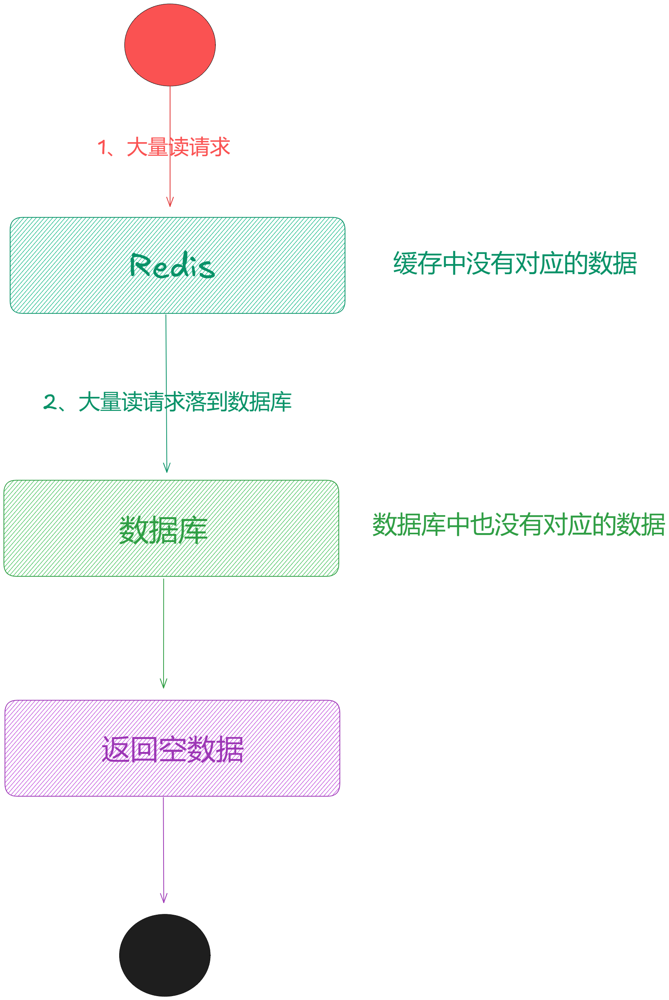
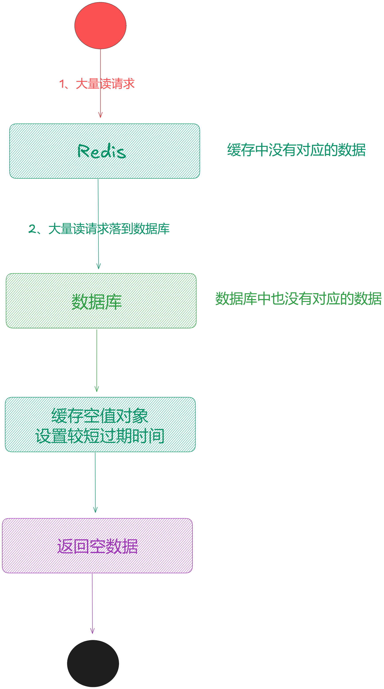
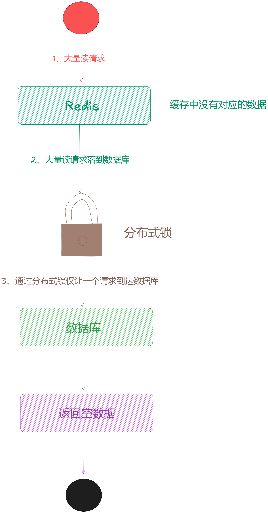
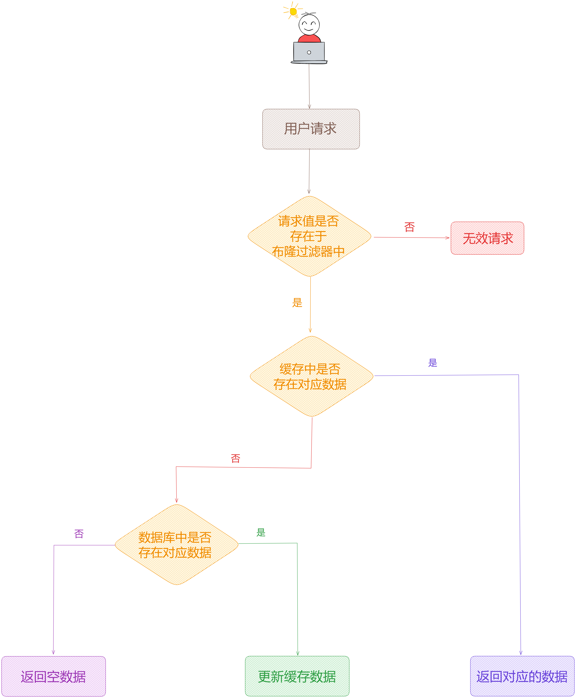
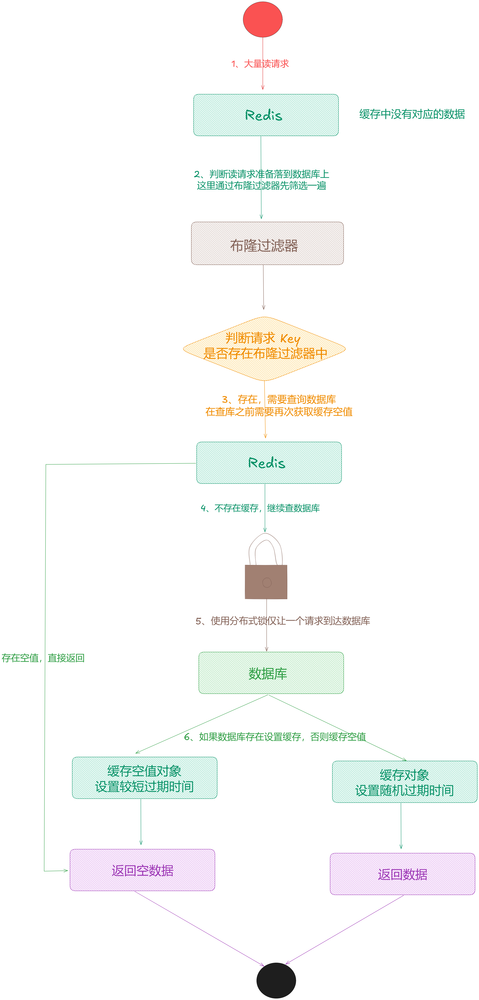
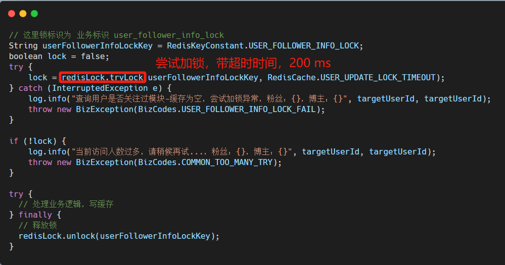
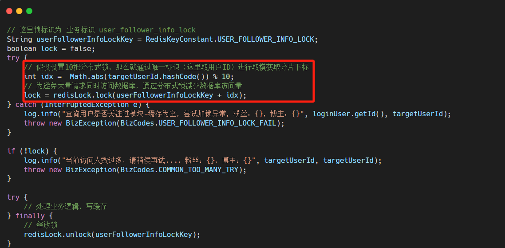

大家好，我是**华仔**, 又跟大家见面了。

从今天之后的一段时间内，华仔会带着大家一起从零开始搭建并研发一套高并发的电商实战项目，这里会涉及到很多互联网大厂开发过程中所使用的核心技术和架构设计模式，希望大家学完之后可以用到自己的简历中。

接下来我们会重点架构设计和开发一下「**社交系统**」中的重要服务：「**关注服务**」、「**计数服务**」、「**评论服务**」。

这是第二十一篇，本篇我们继续进行电商实战项目社交微服务中「**关注服务**」通用基础功能设计与开发，本篇主要针对「**关注服务**」中热点事件发生后的解决方案。

文章汇总位置：[https://wx.zsxq.com/dweb2/index/columns/51122554151214](https://wx.zsxq.com/dweb2/index/columns/51122554151214)

源码授权与获取地址：[https://articles.zsxq.com/id\_1s85grnaae4p.html](https://articles.zsxq.com/id_1s85grnaae4p.html)

本章源码地址：[https://gitcode.net/u011359591/huazai-ecshop/-/tree/ecshop-chapter-21](https://gitcode.net/u011359591/huazai-ecshop/-/tree/ecshop-chapter-21)

## **01 前言**

终于要设计与研发电商项目代码了，今天我们要对社交微服务中关注服务热点事件高并发解决方案。

这里需要注意下，我们整个项目目前是不提供前端的，这个后续有时间在搞，主要是进行后端接口以及微服务模块架构设计。

## **02 关注服务热点事件解决方案**

下面我们来深度剖析下关于遇到「**热点事件**」该如何解决。

比如「**明星事件**」、「**社会事件**」、「**直播事件**」等热点发生时，瞬间涨粉几百万，造成 「**缓存穿透**」、「**缓存击穿**」、「**缓存雪崩**」后该如何处理呢？

[【电商实战项目第十九篇】华仔电商实战项目关注服务通用基础功能基于 Redis Zset 和 RocketMQ 进行重构](https://articles.zsxq.com/id_wpvd2uejj8ku.html)

[【电商实战项目第十八篇】华仔电商实战项目关注服务通用基础功能基于 Redis List 和 RocketMQ 设计与开发](https://articles.zsxq.com/id_rk4je6vvs398.html)

前两篇，我们通过 Redis + RocketMQ 来实现高并发下的高效处理，但是这里还是有一些问题的需要我们解决的。

在「**用户服务**」就剖析过这几个问题，这里我们再来深度剖析下，加深下印象。

## **2.1 缓存穿透**

缓存穿透说简单点就是大量请求的 key 是不合理的，**根本不存在于缓存中，也不存在于数据库中** 。就导致这些请求直接落到了数据库上，根本没有经过缓存这一层，对数据库造成了巨大的压力，可能直接就被这么多请求干宕机了。

示意图如下：

  

缓存穿透一般有几种解决方案：

###   
**2.1.1 空对象值缓存**

**当查询的结果为空时也将其进行缓存，但是要设置一个较短的过期时间**。

这样在接下来的一段时间内，如果再次请求相同的数据，就可以直接从「**缓存**」中获取，而不再访问数据库，可以一定程度上解决「**缓存穿透**」问题。

这是比较简单的一种实现方案，会存在一些弊端。那就是当「**短时间海量恶意请求发生时**」，会存在大量的内存占用。如果要彻底解决这种海量恶意请求带来的内存占用问题，需要对用户请求缓存不存在数据进行统计，进而达到次数后封禁用户。

这样整体就较为复杂，这里不推荐使用。

/\*\*

\* 查询粉丝用户是否关注过某博主 1:关注过 0:位关注

\* 这里为缓存 + DB 为空，缓存空值并返回

\* @param targetUserId

\* @return

\*/

@Override

public ApiResult isFollower(Long targetUserId) {

LoginUser loginUser \= LoginInterceptor.threadLocal.get();

log.info("粉丝用户是否关注过，粉丝：{}，博主：{}", loginUser.getId(), targetUserId);

// 1、自己不能关注自己

if (loginUser.getId() == targetUserId) {

return ApiResult.doResult(BizCodes.USER\_FOLLOWER\_NOT\_SELF);

}

// 2、判断是否已经关注过

String followerKey \= RedisKeyConstant.USER\_FOLLOWER\_INFO\_PREFIX + targetUserId + ":" + loginUser.getId();

String followerInfo \= redisCache.get(followerKey);

// 缓存为空

if (StringUtils.isBlank(followerInfo)) {

log.info("缓存不存在，粉丝 uid ：" + loginUser.getId() + " : " + targetUserId);

// 这里先判断空缓存是否存在，如果存在直接返回，否则查数据库（防止缓存穿透）

if (Objects.equals(redisCache.EMPTY\_CACHE, followerInfo)) {

return ApiResult.doSuccess(0);

}

// 假设此时海量恶意请求执行到这里，缓存也不存在第一次就会都打到 DB 上

UserFollowerEntity userFollowerEntity \= userFollowerMapper.getFollower((int)loginUser.getId(), targetUserId.intValue());

// 此时数据库为空

if (Objects.isNull(userFollowerEntity)) {

// 设置一个空数据到缓存，过期时间为穿透的过期时间，30~100秒

redisCache.set(followerKey, redisCache.EMPTY\_CACHE, RedisCache.generateCachePenetrationExpire());

return ApiResult.doSuccess(0);

}

}

log.info("缓存存在，粉丝 uid：" + loginUser.getId() + ", 博主 uid：" + targetUserId);

return ApiResult.doSuccess(followerInfo != null ? 1 : 0);

}

### **2.1.2 分布式锁**

当请求发现缓存不存在时，可以**使用分布式锁来避免多个相同请求同时访问数据库**，只会让其中一个请求去加载数据，其他请求只能等待解锁后再次获取。

  

这种方式可以解决数据库压力过大问题，如果会出现“误杀”情况，即如果缓存中不存在但是数据库存在这种情况，也会等待获取锁，用户等待时间会过长。

/\*\*

\* 查询粉丝用户是否关注过某博主 1:关注过 0:位关注

\* 这里通过分布式锁仅让其中一个请求到达 DB

\* @param targetUserId

\* @return

\*/

public ApiResult isFollowerLock(Long targetUserId) {

LoginUser loginUser \= LoginInterceptor.threadLocal.get();

log.info("粉丝用户是否关注过，粉丝：{}，博主：{}", loginUser.getId(), targetUserId);

// 1、自己不能关注自己

if (loginUser.getId() == targetUserId) {

return ApiResult.doResult(BizCodes.USER\_FOLLOWER\_NOT\_SELF);

}

// 2、判断是否已经关注过

String followerKey \= RedisKeyConstant.USER\_FOLLOWER\_INFO\_LOCK + targetUserId + ":" + loginUser.getId();

String followerInfo \= redisCache.get(followerKey);

// 缓存为空

if (StringUtils.isBlank(followerInfo)) {

// 这里锁标识为 业务标识 user\_follower\_info\_lock

String userFollowerInfoLockKey \= RedisKeyConstant.USER\_FOLLOWER\_INFO\_LOCK;

boolean lock \= false;

try {

lock = redisLock.tryLock(userFollowerInfoLockKey, RedisCache.USER\_UPDATE\_LOCK\_TIMEOUT);

} catch (InterruptedException e) {

log.info("查询用户是否关注过模块-缓存为空，尝试加锁异常，粉丝：{}，博主：{}", loginUser.getId(), targetUserId);

throw new BizException(BizCodes.USER\_FOLLOWER\_INFO\_LOCK\_FAIL);

}

if (!lock) {

log.info("当前访问人数过多，请稍候再试...，粉丝：{}，博主：{}", loginUser.getId(), targetUserId);

throw new BizException(BizCodes.COMMON\_TOO\_MANY\_TRY);

}

try {

// 拿到锁之后进行双重判定，如果缓存已经存在则直接返回即可

followerInfo = redisCache.get(followerKey);

// 缓存为空

if (StringUtils.isBlank(followerInfo)) {

// 这里海量恶意请求只有其中一个请求会执行到这里并打到 DB 上

UserFollowerEntity userFollowerEntity \= userFollowerMapper.getFollower((int)loginUser.getId(), targetUserId.intValue());

// 此时数据库不为空

if (Objects.nonNull(userFollowerEntity)) {

// 设置数据到缓存

redisCache.set(followerKey, "1", RedisCache.generateCacheExpire());

return ApiResult.doSuccess(1);

}

}

} finally {

// 释放锁

redisLock.unlock(userFollowerInfoLockKey);

}

}

log.info("缓存存在，粉丝 uid：" + loginUser.getId() + ", 博主 uid：" + targetUserId);

return ApiResult.doSuccess(followerInfo != null ? 1 : 0);

}

**使这里为什么分布式锁标识要使用“业务标识”，而不是具体的 uid 呢？**

> 主要因为，如果使用大量不重复且不存在的 uid 进行攻击，那么如果说根据 uid 来加锁，相当于每个请求都能获取到分布式锁，这个锁也就相当于不存在。所以这里只能锁业务标识，比如锁的 Key 是 user\_follower\_info\_lock，代表了用户粉丝关系信息查看业务。

另外锁机制会带来额外的性能开销，算是针对安全问题的一种妥协，一般不建议在生产中单独使用。

### **2.1.3 布隆过滤器**

布隆过滤器是一个非常神奇的数据结构，通过它我们可以非常方便地判断一个给定数据是否存在于海量数据中。

> 我们可以把它看作由二进制向量（或者说位数组）和一系列随机映射函数（哈希函数）两部分组成的数据结构。相比于我们平时常用的 List、Map、Set 等数据结构，它占用空间更少并且效率更高，但是缺点是其返回的结果是概率性的，而不是非常准确的。理论情况下添加到集合中的元素越多，误报的可能性就越大。并且存放在布隆过滤器的数据不容易删除。

它可以在很大程度上减轻缓存穿透问题，因为它可以快速判断一个数据是否可能存在于缓存中。这种方式较为推荐，可以将所有存量数据全部放入布隆过滤器，然后如果缓存中不存在数据，紧接着判断布隆过滤器是否存在，如果存在访问数据库请求数据，如果不存在直接返回错误响应即可。

但是还是会有一些小概率问题，如果使用一种**小概率误判的缓存进行攻击**，依然会对数据库造成比较大的压力。

简单示意图如下：

  

### **2.1.3.1 布隆过滤器实例**

假设我们布隆过滤器场景用来防止检查用户是否关注时查询数据库，创建示例如下所示：

package net.huazai.config;

import org.redisson.api.RBloomFilter;

import org.redisson.api.RedissonClient;

import org.springframework.context.annotation.Bean;

import org.springframework.context.annotation.Configuration;

/\*\*

\* @className: RBloomFilterConfig

\* @author: huazai，该项目是知识星球：华仔和他的朋友们 的内部项目

\* @date: 2024-09-17 9:22

\* @Version: 1.0

\* @description: 布隆过滤器配置

\*/

@Configuration

public class RBloomFilterConfig {

/\*\*

\* 防止检查用户是否关注时查询数据库的布隆过滤器

\*/

@Bean

public RBloomFilter<String> userFollowerCachePenetrationBloomFilter(RedissonClient redissonClient) {

RBloomFilter<String> cachePenetrationBloomFilter = redissonClient.getBloomFilter("userFollowerCachePenetrationBloomFilter");

cachePenetrationBloomFilter.tryInit(100000000L, 0.001);

return cachePenetrationBloomFilter;

}

}

可以看到创建布隆过滤器时有两个核心参数，一个是布隆过滤器的容量，另一个是误判率。

### **1.布隆过滤器容量参数**

**布隆过滤器的容量取决于系统数量需求，**以下面是否关注举例，我们需要把已经关注的两个用户id组合放到布隆过滤器中，这样就可以直接通过布隆过滤器来判断是否存在，而不需要和数据库交互。

在这种场景下，布隆过滤器的容量就取决于系统的用户关注数量，**需要产品去评估系统用户数量以及未来的增长空间**，得出一个经验值，然后设置为布隆过滤器的容量。

建议可以适当设置大一些，不然的话，当用户数量接近布隆过滤器容量时，会出现较大可能性误判问题。**当然也不能设置太大，会造成一定空间的浪费**，需要在误判和空间之间做一个取舍。

### **2.布隆过滤器误判率参数**

误判率参数意味着布隆过滤器判断某个元素存在时的错误概率。误判率越低，通常需要更大的位数组容量以及新增和查询元素时性能的降低。

布隆过滤器增加和查询元素的时间复杂为 O(N)，N 取自于布隆过滤器的 Hash 函数数量，误判率越低，就需要更多复杂的 Hash 函数，那新增和查询操作时自然就会变慢。

  
如果初始化一个 1 亿元素误判率在千分之一的布隆过滤器，大概占据内存 171M 左右。另外在对布隆过滤器进行初始化的时候，会一次性申请对应的内存，这个需要额外注意下，避免初始化超大容量布隆过滤器时内存不足问题。

### **2.1.3.2 如何使用布隆过滤器**

因为已经把布隆过滤器声明成 Spring 的 Bean 对象了，所以我们可以通过依赖注入的方式将 Bean 引入到我们的业务类中即可。

/\*\*

\* 注入布隆过滤器

\*/

@Autowired

private RBloomFilter<String> bloomFilter;

/\*\*

\* 查询粉丝用户是否关注过某博主 1:关注过 0:位关注

\* 这里通过布隆过滤器处理

\* @param targetUserId

\* @return

\*/

public ApiResult isFollowerBloom(Long targetUserId) {

LoginUser loginUser \= LoginInterceptor.threadLocal.get();

log.info("粉丝用户是否关注过，粉丝：{}，博主：{}", loginUser.getId(), targetUserId);

// 1、自己不能关注自己

if (loginUser.getId() == targetUserId) {

return ApiResult.doResult(BizCodes.USER\_FOLLOWER\_NOT\_SELF);

}

// 2、判断是否已经关注过

String followerKey \= RedisKeyConstant.USER\_FOLLOWER\_INFO\_LOCK + targetUserId + ":" + loginUser.getId();

String followerInfo \= redisCache.get(followerKey);

// 缓存为空

if (StringUtils.isBlank(followerInfo)) {

// 3、判断 key 是否存在于布隆过滤器中，存在继续 不存在直接返回

if (bloomFilter.contains("filter:" + targetUserId + ":" + loginUser.getId())) {

// 这里海量恶意请求只有其中一个请求会执行到这里并打到 DB 上

UserFollowerEntity userFollowerEntity \= userFollowerMapper.getFollower((int) loginUser.getId(), targetUserId.intValue());

// 此时数据库不为空

if (Objects.nonNull(userFollowerEntity)) {

// 设置数据到缓存

redisCache.set(followerKey, "1", RedisCache.generateCacheExpire());

return ApiResult.doSuccess(1);

}

} else {

return ApiResult.doSuccess(0);

}

}

log.info("缓存存在，粉丝 uid：" + loginUser.getId() + ", 博主 uid：" + targetUserId);

return ApiResult.doSuccess(followerInfo != null ? 1 : 0);

}

### **2.1.4 空对象 + 分布式锁+ 布隆过滤器**

如果缓存不存在，那么就通过布隆过滤器进行筛选，然后**判断是否存在缓存空值，如果存在直接返回失败**。如果不存在缓存空值，使用分布式锁机制避免多个相同请求同时访问数据库。最后如果请求数据库为空，那么将空对象值缓存并返回。

/\*\*

\* 查询粉丝用户是否关注过某博主 1:关注过 0:位关注

\* 这里通过布隆过滤器 + 分布式锁 + 缓存空值处理

\* @param targetUserId

\* @return

\*/

public ApiResult isFollowerBloomAndLockAndEmpty(Long targetUserId) {

LoginUser loginUser \= LoginInterceptor.threadLocal.get();

log.info("粉丝用户是否关注过，粉丝：{}，博主：{}", loginUser.getId(), targetUserId);

// 1、自己不能关注自己

if (loginUser.getId() == targetUserId) {

return ApiResult.doResult(BizCodes.USER\_FOLLOWER\_NOT\_SELF);

}

// 2、判断是否已经关注过

String followerKey \= RedisKeyConstant.USER\_FOLLOWER\_INFO\_LOCK + targetUserId + ":" + loginUser.getId();

String followerInfo \= redisCache.get(followerKey);

// 缓存为空

if (StringUtils.isBlank(followerInfo)) {

// 3、判断 key 是否存在于布隆过滤器中，存在继续 不存在直接返回

if (bloomFilter.contains("filter:" + targetUserId + ":" + loginUser.getId())) {

// 这里锁标识为 业务标识 user\_follower\_info\_lock

String userFollowerInfoLockKey \= RedisKeyConstant.USER\_FOLLOWER\_INFO\_LOCK;

boolean lock \= false;

try {

// 4、 尝试加锁

lock = redisLock.tryLock(userFollowerInfoLockKey, RedisCache.USER\_UPDATE\_LOCK\_TIMEOUT);

} catch (InterruptedException e) {

log.info("查询用户是否关注过模块-缓存为空，尝试加锁异常，粉丝：{}，博主：{}", loginUser.getId(), targetUserId);

throw new BizException(BizCodes.USER\_FOLLOWER\_INFO\_LOCK\_FAIL);

}

if (!lock) {

log.info("当前访问人数过多，请稍候再试...，粉丝：{}，博主：{}", loginUser.getId(), targetUserId);

throw new BizException(BizCodes.COMMON\_TOO\_MANY\_TRY);

}

try {

// 5、拿到锁之后进行双重判定，如果缓存已经存在则直接返回即可

followerInfo = redisCache.get(followerKey);

// 缓存不为空

if (StringUtils.isNotBlank(followerInfo)) {

return ApiResult.doSuccess(1);

}

// 6、这里先判断空缓存是否存在，如果存在直接返回，否则查数据库（防止缓存穿透）

if (Objects.equals(redisCache.EMPTY\_CACHE, followerInfo)) {

return ApiResult.doSuccess(0);

}

// 7、这里海量恶意请求只有其中一个请求会执行到这里并打到 DB 上

UserFollowerEntity userFollowerEntity \= userFollowerMapper.getFollower((int)loginUser.getId(), targetUserId.intValue());

// 此时数据库不为空

if (Objects.nonNull(userFollowerEntity)) {

// 设置数据到缓存

redisCache.set(followerKey, "1", RedisCache.generateCacheExpire());

return ApiResult.doSuccess(1);

} else {

// 8、设置一个空数据到缓存，过期时间为穿透的过期时间，30~100秒

redisCache.set(followerKey, redisCache.EMPTY\_CACHE, RedisCache.generateCachePenetrationExpire());

return ApiResult.doSuccess(0);

}

} finally {

// 释放锁

redisLock.unlock(userFollowerInfoLockKey);

}

} else {

// 不存在于布隆过滤器，直接返回

return ApiResult.doSuccess(0);

}

}

log.info("缓存存在，粉丝 uid：" + loginUser.getId() + ", 博主 uid：" + targetUserId);

return ApiResult.doSuccess(followerInfo != null ? 1 : 0);

}

至此，缓存穿透解决方案完美结束。

上面写得缓存穿透代码思路，只要不出现极端场景，大概率能涵盖 90% 工作当中的业务场景。

## **2.2 缓存击穿**

缓存击穿指在「**高并发**」系统中，当某个「**热点数据**」在缓存中过期时，如果此时有大量「**并发请求**」同时访问这个数据，由于缓存中不存在，所有请求都会直接访问数据库，导致数据库负载急剧增加。

一般来说，解决缓存击穿的主要方法分为三种：

1.  热点数据永不过期。
2.  热点数据预加载。
3.  加分布式锁处理。

###   
**2.2.1 热点数据永不过期**

热点数据永不过期，指的是可以预知的热点数据，在活动开始前，设置过期时间为 -1。这样的话就不会有「**缓存击穿**」的风险。

这个可以搭配「**热点数据预加载**」一起来完成，等对应热点缓存的活动结束后，访问量没那么大了就可以对指定缓存设置过期时间，这样可以有效降低 Redis 存储压力。

### **2.2.2 热点数据预加载**

热点数据预加载，指的是在活动开始前，**针对已知热点数据从数据库中加载到缓存中**，这样可以避免海量请求第一次访问热点数据需要从数据库读取的流程。可以极大减少请求响应时间，有效避免「**缓存击穿**」。

### **2.2.3 加分布式锁处理**

  
分布式锁的解决方案就是保证**只有一个请求可以访问数据库，其他请求等待结果**。这样可以避免大量的请求同时访问数据库。

  

下面我们从「**分布式锁**」角度来分析下如何通过「**互斥锁**」来解决「**缓存击穿**」场景问题。

###   
**2.2.3.1 缓存不存在打到 DB**

查询数据缓存是否存在，不存在的话请求数据库，数据库存在则把当前数据回写到缓存。

问题也很明显，**如果缓存过期或者被删除，大量请求就会打到数据库**，导致数据库压力暴涨。

代码也比较简单，这里就不列举了，不懂的看「**缓存穿透**」部分。

### **2.2.3.2 使用分布式锁避免数据库频繁访问**

在获取数据时，使用 Redis 的分布式锁来控制同时「**只有一个请求**」可以去数据库获取数据，其他请求需要等待锁释放。这样可以防止多个请求同时穿透到数据库。

这部分代码在「**缓存穿透**」已经给出，这里不再赘述。

###   
**2.2.3.3 高并发极端场景情况**

这里重点剖析下，「**高并发极端场景**」下的发生的情况。

  
这里举例：「**有 1 万请求同时访问触发了缓存击穿**」，如果不用 [tryLock](http://trylock%20/) 方式而是使用 [lock.lock](http://lock.lock/)，逻辑是这样的：

1.  第一个请求加锁、查询缓存是否存在、查询数据库、放入缓存、解锁，假设总共用了 50 毫秒。
2.  第二个请求拿到锁查询缓存、解锁用了 1 毫秒。
3.  最后一个请求需要等待 10049 毫秒后才能返回，用户等待时间过长，极端情况下可能会触发应用的内存溢出。

### **2.2.3.3.1 尝试使用 tryLock**

像上面这种场景，我们要做的就是不让用户请求在服务端「**阻塞过长时间**」，可以使用尝试获取锁 tryLock 方式，它的意思就是「**如果拿锁失败直接返回，而不是阻塞等待直到获取锁**」。

  

通过这种方式可以快速失败，告诉用户网络异常请稍后再试，等用户再尝试刷新的时候，其实获取锁的线程已经把数据放到了缓存。

因为这种方案对用户操作体验不友好，所以也只是适用于部分场景。在实际开发中，需要灵活变更。

###   
**2.2.3.3.2 分布式锁分片**

还有一种比较优雅的解决方案是通过「**分布式锁分片**」的方式，让并行的线程更多一些。因为同一时间有多个线程能同时操作，理论上设置分片量的多少也就是性能提升了近多少倍。

  

## **2.3 缓存雪崩**

「**缓存雪崩**」是指在某个时间点上，缓存中的大部分数据「**同时失效**」，导致大量的请求直接访问底层数据库或后端服务，从而造成数据库负载剧增，甚至导致数据库崩溃的情况。

通常情况下，缓存中的数据会设置不同的过期时间，以避免同时失效的情况。然而如果某个不可控的热点事件导致了大量缓存同时失效，就会出现缓存雪崩。

需要从以下几个方面去解决缓存雪崩问题：

### **2.3.1 使用分布式锁避免数据库频繁访问**

可以使用「**分布式锁**」机制来避免多个相同的请求同时访问数据库，只让一个或少量请求去加载数据，其他请求等待。

具体看：**2.1.2 节、2.2.3 节内容**

### **2.3.2 缓存预热**

「**缓存预热**」是在系统启动时或者活动开始前，通过「**定时任务**」将「**热点数据**」预先加载到缓存中，从而提升系统的响应速度，避免在「**高并发访问**」时出现数据不存在缓存中，还需要去数据库加载问题。

预热数据会根据业务实际情况，来判断是否需要设置过期时间，建议缓存预热的数据「**设置永不过期**」，避免「**内存淘汰**」或者「**过期**」造成击穿或雪崩等场景。

在执行预热时，可以将需要「**预热的数据放入 MQ**」，然后通过消费者线程执行相应的数据读取流程最终存储到 Redis 中。这样可以利用「**MQ 分布式特性**」可以分散到多个消费者线程中进行处理，从而显著「**提高预热并发处理能力**」。

###   
**2.3.2.1 项目启动时缓存预热有问题吗？**

如果在项目启动时预热 Redis 数据，可能会启动多个节点，就会涉及到「**加载多次缓存**」造成资源浪费。这种情况下如果项目中使用了 [XXL-Job](http://xxl-job/) 等分布式定时任务框架，可以直接使用定时任务解决缓存预热。

### **2.3.2.2 如何确认缓存预热数据？**

需要预热的数据都有一个特点：已知这些数据会被大量访问。

比如：秒杀、抢购场景下，这些商品不用想都要直接加入缓存的。

注意：「**缓存预热**」是一种常见的优化方法，但「**不一定适合所有场景**」。在某些情况下，**缓存预热可能会占用过多的 Redis 内存资源**，从而对其他业务操作产生影响。所以需要根据具体情况进行合理的权衡和配置。

##   
**03 热点探测服务**

热 Key 可能会引发多种问题，包括占用大量的 CPU 资源从而影响 Redis 的吞吐量，或者在集群中可能导致流量不均衡，形成「**读写热点问题**」等。

##   
**3.1 如何发现热 Key**

发现缓存中的热 Key 有以下几种途径：

###   
**3.1.1 根据经验评估**

对于特定业务场景，可以预先评估哪些数据可能成为热点数据，比如「**秒杀商品**」、「**热门商品**」、「**大 V 动态**」等等。

该方案优点：实施成本较低，但是可能结果与实际情况有所偏差。

### **3.1.2 使用 Redis hotkey 命令**

Redis 从版本 4.0 开始引入了 hotkey 命令，通过客户端的 [redis-cli --hotkeys](http://redis-cli%20--hotkeys/) 命令扫描库中的所有热点 Key。

该方案优点：无需引入其他配置或组件，但缺点是性能较差，尤其在处理大量数据时可能会非常耗时。  

###   
**3.1.3 使用 Redis monitor 命令**

当通过 [MONITOR](http://monitor%20/) 命令开启监视器后，Redis 将在执行命令后输出一些相关的信息。结合日志和相关分析工具（如 [redis-faina](https://blog.csdn.net/gitblog_00052/article/details/136799164)）就可以对其进行统计。

该方案的缺点：开启监控会显著降低 Redis 性能（单实例大概降低差不多 50% 的性能），非必要时不要启动。

具体参见：[Redis 官网监控](https://redis.io/docs/latest/commands/monitor/)

### **3.1.4 使用 Jedis/Lettue 客户端监控**

我们可以使用客户端如 [Jedis](http://jedis%20/) 或 [Lettuce](http://lettuce%20/) 来与 [Redis](http://redis%20/) 进行通信。「**添加代理**」或「**字节码插桩**」的方式，可以在程序请求 Redis 之前上报请求内容，然后通过第三方组件或平台进行分析，以确定哪些 Key 是热 Key。

目前市场上客户端一站式开源解决方案，比如京东的 [hotkey](http://hotkey/)，也很好地解决了热 Key 问题。

### **3.1.5 使用代理层监控**

对于大规模的 Redis 集群，比如各大云商提供的 Redis 服务的请求通常会经过「**代理层**」或「**网关层**」进行转发。

如果代理层可以收集请求信息并上报，那就可以通过分析相关请求信息来确认热 Key。这种方法与客户端监控类似，但适用范围更广，缺点是引入额外的代理层会增加运维成本，而不是所有集群都支持这种方式。

## **3.2 如何解决热 Key 问题**

这里有三种解决方案，我们分别来看下：

### **3.2.1 进行读写分离**

啥意思呢，就是当热 Key 如果是来自读请求时，可以考虑通过「**读写分离**」，并且增加更多的「**从节点**」来降低对单个实例的读请求压力。

缺点就是：不适合所有场景，且集群架构运维复杂度很高。

### **3.2.2 进行热 key 备份**

可以将热 Key 复制到多个 Redis 实例，并在请求时随机选择一个备份实例来分散请求压力。

比如，假如现有热 Key "food"，我们将其复制到五个分片中，分别叫做 food\_1、food\_2、food\_3、food\_4、food\_5，当请求 "food" 时，我们为其随机添加一个后缀，从而实现分散请求压力的效果：

// 生成1到5的随机数

int randomValue \= new Random().nextInt(5) + 1;

// 将随机数作为后缀拼接到key上

String updatedKey \= key + "\_" + randomValue;

// 将key作为Redis中的键，随机值作为值存入Redis

redisTemplate.opsForValue().get(updatedKey);

该方案可以减轻对单个 Redis 实例的负载，但需要考虑数据一致性问题。

###   
**3.2.2 多级缓存**

对于一些热 Key，我们可以考虑使用一些本地缓存工具（比如 [Guava](http://guava%20/) 或 [Caffeine](http://caffeine/)） 直接将其缓存到 JVM 内存中，从根本上避免对 Redis 造成压力。

不过，这种方案下缓存会占用额外的运行时内存，因此需要有选择进行缓存，以避免占用过多内存资源。并且当与 Redis 缓存构成多级缓存时，也要考虑数据一致性问题。