大家好，我是**华仔**, 又跟大家见面了。

从今天之后的一段时间内，华仔会带着大家一起从零开始搭建并研发一套高并发的电商实战项目，这里会涉及到很多互联网大厂开发过程中所使用的核心技术和架构设计模式，希望大家学完之后可以用到自己的简历中。

接下来我们会重点架构设计和开发一下「**社交系统**」中的重要服务：「**关注服务**」、「**计数服务**」、「**评论服务**」。

这是第二十七篇，本篇我们继续进行电商实战项目设计与开发，本篇对「**计数服务**」进行大数据场景优化。

文章汇总位置：[https://wx.zsxq.com/dweb2/index/columns/51122554151214](https://wx.zsxq.com/dweb2/index/columns/51122554151214)

源码授权与获取地址：[https://articles.zsxq.com/id\_1s85grnaae4p.html](https://articles.zsxq.com/id_1s85grnaae4p.html)

本章源码地址：[https://gitcode.net/u011359591/huazai-ecshop/-/tree/ecshop-chapter-27](https://gitcode.net/u011359591/huazai-ecshop/-/tree/ecshop-chapter-27)

## **01 前言**

终于要设计与研发电商项目代码了，今天我们主要对「**计数服务**」基础功能开发和完善。

这里需要注意下，我们整个项目目前是不提供前端的，这个后续有时间在搞，主要是进行后端接口以及微服务模块架构设计。

## **02 计数服务业务本身处理**

在上篇中 [【电商实战项目第二十六篇】华仔电商实战项目计数服务基于 RocketMQ + Redis 基础功能开发和完善](https://articles.zsxq.com/id_xm9h2claxcs9.html) 我们开发了「**计数服务**」的基础功能，但也只开发了「**计数写入**」功能，今天我们会补充「**计数读取**」以及「**业务本身**」处理。

先来看下业务本身的处理，比较简单。

##   
**2.1 数据库设计**

CREATE TABLE \`food\_like\` (

\`id\` bigint NOT NULL AUTO\_INCREMENT,

\`food\_id\` bigint NOT NULL COMMENT '美食id',

\`user\_id\` bigint NOT NULL COMMENT '用户id，即谁点赞',

\`status\` tinyint(1) DEFAULT '0' COMMENT '是否点赞 0 点赞 1 取消点赞',

\`food\_createtime\` datetime DEFAULT CURRENT\_TIMESTAMP COMMENT '创建时间',

\`food\_updatetime\` datetime DEFAULT CURRENT\_TIMESTAMP ON UPDATE CURRENT\_TIMESTAMP COMMENT '更新时间',

PRIMARY KEY (\`id\`),

UNIQUE KEY \`uid\` (\`food\_id\`,\`user\_id\`) USING BTREE

) ENGINE\=InnoDB AUTO\_INCREMENT\=12 DEFAULT CHARSET\=utf8mb4 COLLATE=utf8mb4\_general\_ci COMMENT\='美食点赞详情表';

CREATE TABLE \`food\_collect\` (

\`id\` bigint NOT NULL AUTO\_INCREMENT,

\`food\_id\` bigint NOT NULL COMMENT '美食id',

\`user\_id\` bigint NOT NULL COMMENT '用户id，即谁收藏',

\`status\` tinyint(1) DEFAULT '0' COMMENT '是否收藏 0 收藏 1 取消收藏',

\`food\_createtime\` datetime DEFAULT CURRENT\_TIMESTAMP COMMENT '创建时间',

\`food\_updatetime\` datetime DEFAULT CURRENT\_TIMESTAMP ON UPDATE CURRENT\_TIMESTAMP COMMENT '更新时间',

PRIMARY KEY (\`id\`),

UNIQUE KEY \`uid\` (\`food\_id\`,\`user\_id\`) USING BTREE

) ENGINE\=InnoDB AUTO\_INCREMENT\=3 DEFAULT CHARSET\=utf8mb4 COLLATE=utf8mb4\_general\_ci COMMENT\='美食收藏详情表';

##   
**2.2 业务消费者点赞处理**

上篇我们是通过 RocketMQ 来解耦的，这里我们也是通过消费者来处理业务的，消费者比较简单，如下：

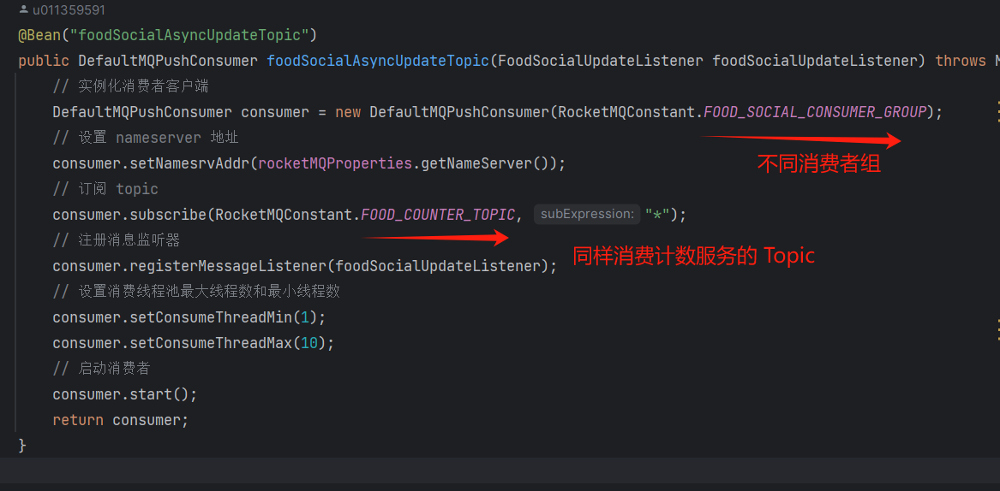

整个处理流程如下：

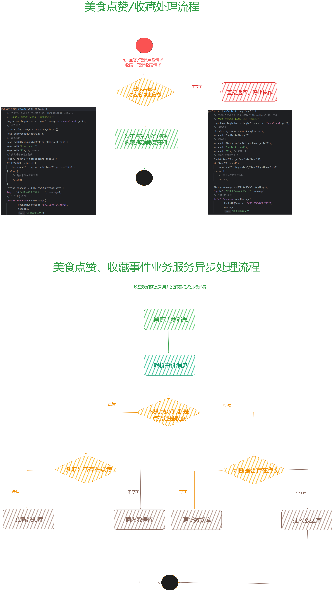

package net.huazai.mq.consumer.listener;

import com.alibaba.fastjson.JSON;

import lombok.extern.slf4j.Slf4j;

import net.huazai.entity.FoodCollectSaveOrUpdateEntity;

import net.huazai.entity.FoodLikeSaveOrUpdateEntity;

import net.huazai.service.FoodCollectService;

import net.huazai.service.FoodLikeService;

import org.apache.rocketmq.client.consumer.listener.ConsumeConcurrentlyContext;

import org.apache.rocketmq.client.consumer.listener.ConsumeConcurrentlyStatus;

import org.apache.rocketmq.client.consumer.listener.MessageListenerConcurrently;

import org.apache.rocketmq.common.message.MessageExt;

import org.springframework.beans.factory.annotation.Autowired;

import org.springframework.stereotype.Component;

import java.util.Date;

import java.util.List;

/\*\*

\* 美食点赞、收藏、评论监听器

\*/

@Slf4j

@Component

public class FoodSocialUpdateListener implements MessageListenerConcurrently {

/\*\*

\* 注入美食点赞服务

\*/

@Autowired

private FoodLikeService foodLikeService;

/\*\*

\* 注入美食收藏服务

\*/

@Autowired

private FoodCollectService foodCollectService;

/\*\*

\* 并发消费美食社交消息 点赞、收藏、评论等

\* @param msgList

\* @param context

\* @return

\*/

@Override

public ConsumeConcurrentlyStatus consumeMessage(List<MessageExt> msgList, ConsumeConcurrentlyContext context) {

try {

for (MessageExt messageExt : msgList) {

String msg \= new String(messageExt.getBody());

// 解析美食计数信息，点赞、收藏、评论

List<String> message = JSON.parseArray(msg, String.class);

// 美食 id

Integer foodId \= Integer.parseInt(message.get(0));

// 操作人 谁进行的点赞、取消点赞、收藏、取消收藏

Integer userId \= Integer.parseInt(message.get(1));

// 计数类型：点赞、评论、收藏

String field \= message.get(2);

// 计数 +1 还是 -1

Integer value \= Integer.parseInt(message.get(3));

if (field.equals("like\_count")) {

FoodLikeSaveOrUpdateEntity foodLikeSaveOrUpdateEntity \= new FoodLikeSaveOrUpdateEntity();

foodLikeSaveOrUpdateEntity.setFoodId(foodId.longValue());

foodLikeSaveOrUpdateEntity.setUserId(userId.longValue());

foodLikeSaveOrUpdateEntity.setStatus(value == -1 ? 1 : 0);

foodLikeSaveOrUpdateEntity.setFoodCreatetime(new Date());

log.info("美食点赞 MQ 异步更新-执行数据异步更新，消息内容：{}，实体对象：{}", message, foodLikeSaveOrUpdateEntity);

foodLikeService.saveOrUpdate(foodLikeSaveOrUpdateEntity);

} else if (field.equals("collect\_count")) {

FoodCollectSaveOrUpdateEntity foodCollectSaveOrUpdateEntity \= new FoodCollectSaveOrUpdateEntity();

foodCollectSaveOrUpdateEntity.setFoodId(foodId.longValue());

foodCollectSaveOrUpdateEntity.setUserId(userId.longValue());

foodCollectSaveOrUpdateEntity.setStatus(value == -1 ? 1 : 0);

foodCollectSaveOrUpdateEntity.setFoodCreatetime(new Date());

log.info("美食收藏 MQ 异步更新-执行数据异步更新，消息内容：{}，实体对象：{}", message, foodCollectSaveOrUpdateEntity);

foodCollectService.saveOrUpdate(foodCollectSaveOrUpdateEntity);

}

}

} catch (Exception e) {

// 本次消费失败，下次重新消费

log.error("美食计数 MQ 异步更新 consume error, 更新数据消费失败", e);

return ConsumeConcurrentlyStatus.RECONSUME\_LATER;

}

log.info("美食计数 MQ 异步更新-数据消费成功, result: {}", ConsumeConcurrentlyStatus.CONSUME\_SUCCESS);

return ConsumeConcurrentlyStatus.CONSUME\_SUCCESS;

}

}

获取参数数据后，进行匹配判断，是「**点赞**」还是「**收藏**」。

## **2.3 业务点赞详情处理**

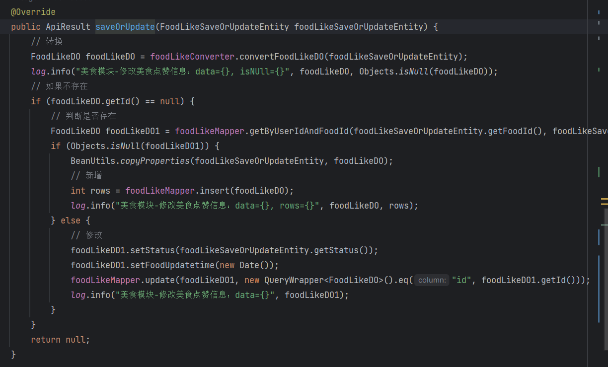

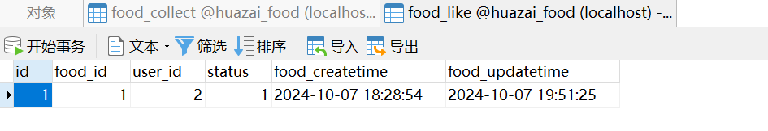

## **2.4 业务收藏详情处理**

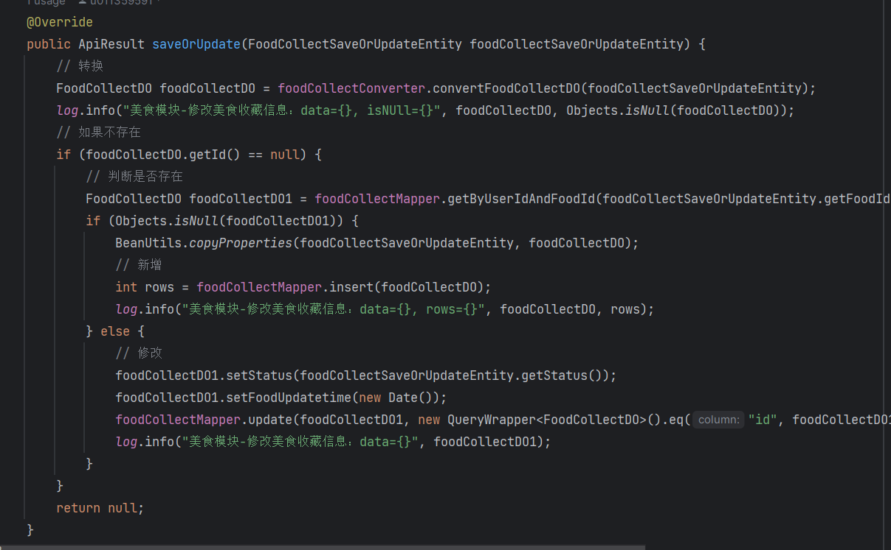

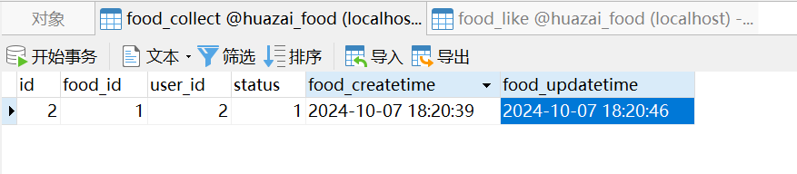

## **03 计数服务高并发大数据场景处理**

接下来，我们来看下「**高并发**」、「**大数据**」场景下如何优化是否「**点赞**」、「**收藏**」等操作。

对于我们「**小红书**」这种「**千万级**」、「**亿级**」社区电商实战来说，都从「**数据库**」读取是不现实的，效率也是非常低下的，很容易数据库就被打挂了。

  
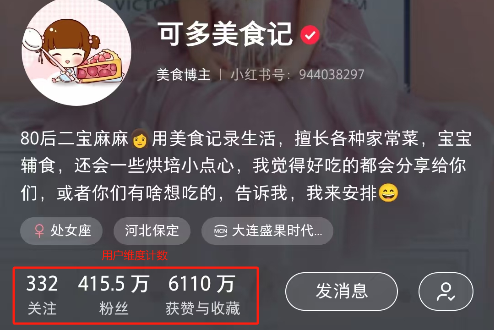

上图是小红书中某美食排行榜第一名的博主个人详情以及她的某个作品的「**点赞**」、「**收藏**」，可以看到数据量还是比较大的，那么我们如何高效实现 是否已经「**点赞**」、「**收藏**」过了呢？

我们来看几种方案。

##   
**3.1 BitMap 方案是否可行**

想节省空间，通用的实现可以使用 Redis 的 BitMap 0 or 1，其占用内存是非常低的。

比如我们实现用户id = 100 对美食作品 id= 10000 进行了「**点赞**」、「**收藏**」，可以这么写：

#1、setbit key offset value 即：bitmap key为10000的 bit 数组的第 100 位上存储⼀个 1

setbit 10000 100 1

#2、获取 id 为 100 的⽤户对作品id 为 10000 是否点赞、收藏

getbit 1000 100

\# 返回结果为 1

### **局限性：**

当用户量很大的时候，比如千万级用户量的时候，最坏的情况下：一个点赞 bitmap 需要消耗的内存为 10000000/8/1024/1024=1.19MB

**综上：一个点赞 1.19 MB，如果千万级、亿级用户量，每个用户平均每天发一条视频，是不是内存占用就很大啊，显然这么设计是不可行的。**

## **3.2 BloomFilter 方案是否可行**

既然 BitMap 不可行，那么 BloomFilter 是否可行，我们来分析下。

布隆过滤器是一个非常神奇的数据结构，通过它我们可以非常方便地判断一个给定数据是否存在于海量数据中。我们可以把它看作由二进制向量（或者说位数组）和一系列随机映射函数（哈希函数）两部分组成的数据结构。相比于我们平时常用的 List、Map、Set 等数据结构，它占用空间更少并且效率更高，但是缺点是其返回的结果是概率性的，而不是非常准确的。理论情况下添加到集合中的元素越多，误报的可能性就越大。并且，存放在布隆过滤器的数据不容易删除。

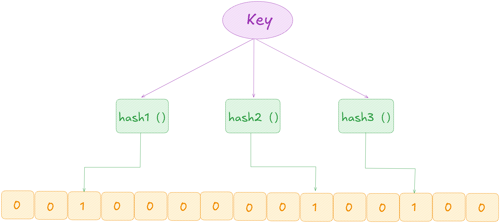

Bloom Filter 的简单原理示意图

[Bloom Filter](http://bloom%20filter/) 会使用一个较大的 bit 数组来保存所有的数据，数组中的每个元素都只占用 1 bit ，并且每个元素只能是 0 或者 1（代表 false 或者 true），这也是 [Bloom Filter](http://bloom%20filter/) 节省内存的核心所在。

这样来算的话，申请一个 [100w](http://100w/) 个元素的位数组只占用 [1000000Bit / 8 = 125000 Byte = 125000/1024 KB ≈ 122KB](http://1000000bit%20/%208%20=%20125000%20Byte%20=%20125000/1024%20KB%20%E2%89%88%20122KB) 的空间。

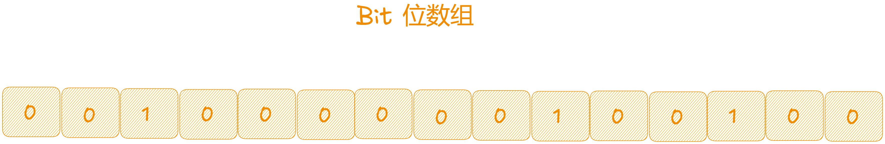

具体是这样做的：

1.  把所有可能存在的请求的值都存放在布隆过滤器中。
2.  当用户请求过来，先判断用户发来的请求的值是否存在于布隆过滤器中。
3.  不存在的话，直接返回请求参数错误信息给客户端，
4.  存在的话才会走下面的流程。

加入布隆过滤器之后的缓存处理流程图如下：

比如用户id，经过 3 次 Hash 运算后，都为 1 表示已经「**点赞**」、「**收藏**」了。如果有一个为 0 则表示没有「**点赞**」、「**收藏**」。

但是 BloomFilter 有一定的误判率：

假设 E 表示错误率，n 表示要插入的元素个数，m 表示 bit 数组的⻓度，k 表示 hash 函数的个数。

1.  当 hash 函数个数 [k = (ln2) \* (m/n)](http://k%20=%20\(ln2\)%20%2A%20\(m/n\)) 时，错误率 E 最小（此时bit数组中有⼀半的值为0）。
2.  在错误率不⼤于E的情况下，bit 数组的⻓度m需要满⾜的条件为：[m ≥ n \* lg(1/E)](http://xn--m%20%20n%20%2A%20lg\(1-i39m/E\))。
3.  结合上面两个公式，在 hash 函数个数k取到最优时，要求错误率不大于 E，这时我们对 bit 数组长度 m 的要求是：[m>=nlg(1/E) \* lg(e)](http://m=nlg\(1/E\)%20*%20lg\(e\)%20) ，也就是 [m ≥ 1.44n\*lg(1/E)](http://xn--m%20%201-m07d.44n%2Alg\(1/E\))（lg表示以2为底的对数）。

  
**综上：对于点赞、收藏是可以使用的，如果取消点赞、取消收藏就无法实现了，所以它还是无法实现的。**

## **3.3 Redis 集合方案是否可行**

点赞业务整体的高性能我们还是基于 Redis+MySQL 架构。MySQL 来做数据存储和查询支持，Redis 来撑起业务的高性能响应。

集合的特性保证集合中的用户 ID 不会出现重复，可以准确维护了动态/作品列表下的点赞总数，通过查看用户是否在集合中，可以高效判断用户是否点赞内容。

Redis 集合支持直接通过 [SISMEMBER](http://sismember/) 和 [SCARD](http://scard/) 接口判断是否「**点赞**」和计算「**点赞**」数，从而提升了整个模块的响应速度和服务负载。

在缓存维护上，每次当有新增「**点赞**」时，主动向集合中「**添加用户 ID**」并「**更新缓存过期时间**」。每次查询时，也同样会「**查询缓存剩余过期时间**」，如果小于 1/3 ，就会「**重新更新缓存过期时间**」，这样避免了热门动态/热门作品有大量新增「**点赞**」动作时，出现「**缓存击穿**」的情况。

  
Redis 缓存结构如下：

foodId => \[uId1,uId2,uId3...\]

流程图如下：

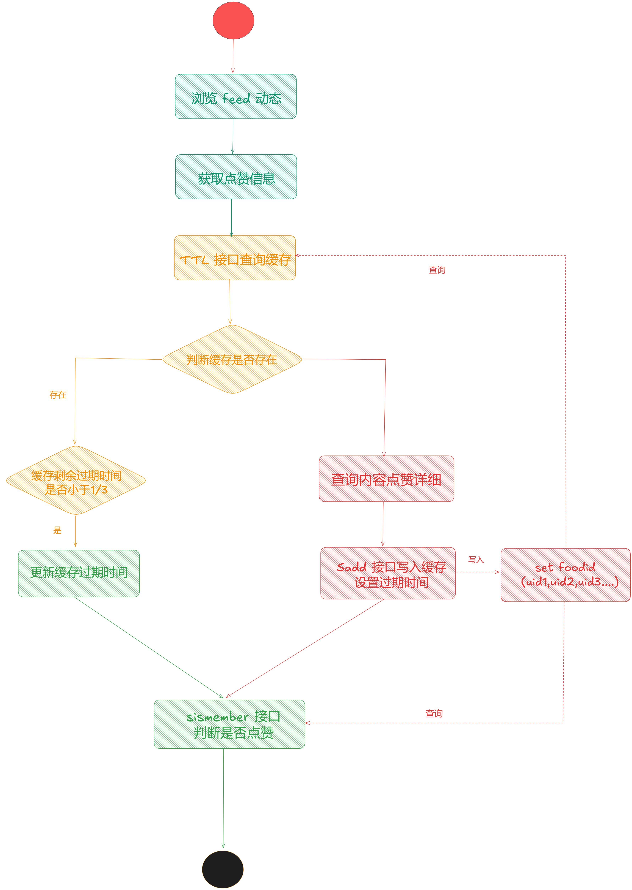

### **该方案有什么问题**

这个方案中，会将动态下全部的「**点赞记录**」全部查出，放入一个集合中，当动态是一个「**热门动态**」时，点赞用户量会非常大，此时集合变成了一个「**大 Key**」，而「**大 Key**」的清理对 Redis 的稳定性有比较大的影响，随时可能会因为缓存过期，而引起 Redis 的抖动，进而引起服务的抖动。

而且每次查询出全部的点赞用户，容易产生慢SQL，对网络带宽也比较有压力。

##   
**3.4 Redis 集合分片方案是否可行**

这个版本我们要解决两个主要问题：

1.  解决上个版本中缓存大 Key 风险。
2.  优化缓存重建时查询作品全部点赞用户产生的慢 SQL 场景。

如何解决呢？

在这个版本中，针对「**大 Key**」进行了「**分散处理**」，对同一个动态下的点赞用户，进行「**分片处理**」再维护到缓存，每次操作缓存时先根据「**用户ID**」计算「**分片值**」，这样每个分片都具有更小的体积和更快的维护和响应速度。

而点赞总数的获取可以通过「**计数服务**」，单独维护作品/用户的「**点赞总数**」可以节省 scard 接口的消耗。

缓存结构如下：

foodId\_slice1 => \[uId1,uId2,uId3...\] foodId\_slice2 => \[uId1,uId2,uId3...\] foodId\_slice3 => \[uId1,uId2,uId3...\] ...

流程图如下：

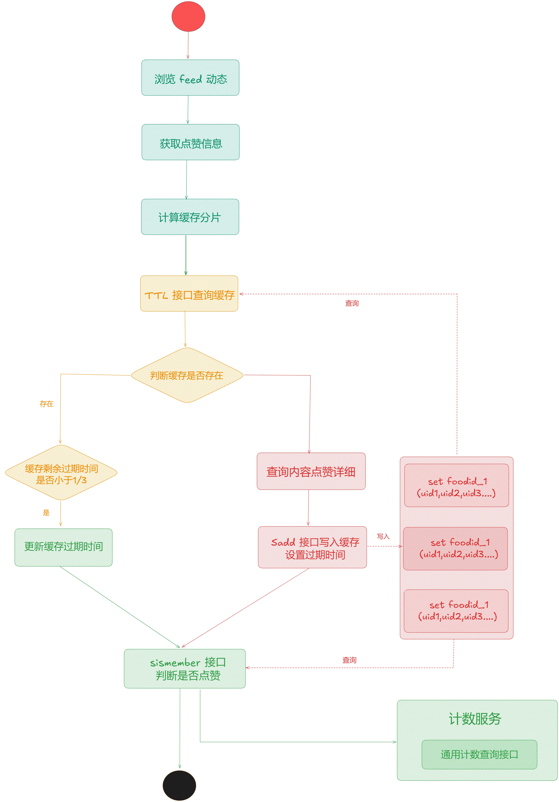

### **该方案有什么问题**

该方案在一定时间内正常支撑我们社区电商点赞业务的高性能响应，但是当前方案如果从「**业务角度**」和「**全局观念**」去考虑，该方案仍然存在需要的优化点。

例如：「**缓存分片**」中仍然维护了被浏览动态下「**全部点赞用户数据**」消耗了非常大的 Redis 资源，也增加了缓存维护难度。缓存数据的有效使用率很低，在「**推荐流场景**」下，用户浏览过的动态，几乎不会再次浏览到。

所以当前方案只适合于「**单个作品**」进行设计的，在「**feed 流场景**」下，查询任务在「**点赞服务**」里其实放大了数十倍，这种放大会对服务器、Redis 以及 DB 都产生一定的资源消耗浪费。

一些点赞量特别多的「**历史动态**」，如果有人访问时也会「**重建缓存**」，重建成本高，但使用率却很低。「**缓存集合分片**」的设计维护了较多「**无用数据**」，也产生了大量的 Key 在 Redis 中同样是占用内存空间的。

**综上：该方案会出现较高的服务器负载、Redis/DB 请求量也非常大、消耗非常大的 Redis 资源（几十 GB）**。

## **3.5 Redis 哈希方案是否可行**

结合实际业务场景，大部分场景中都是「**批量判断是否点赞**」，我们社区电商的动态本身也存在一定的「**冷热数据**」。

所以对新缓存的要求是：

1.  能解决 Feed 流场景下批量查询流量放大现象。
2.  缓存要区分冷热数据，减少无效存储。需要在作品和点赞用户两种角度区分冷热数据。
3.  缓存结构要简单易维护。

### **3.5.1 实现方案**

1.  批量查询任务放大现象是因为之前的缓存是以「**作品维度设计**」，新版本方案要以「**用户维度设计**」。
2.  上一个版本方案中访问「**作品点赞数据**」会重建缓存，对于老旧作品重建缓存性价比很低，且作品下的点赞用户并不是一直活跃和重新访问内容，新版本方案要「**区分冷热数据**」，冷数据直接访问 DB。
3.  上一个版本方案在「**维护缓存过期时间**」和「**延长过期时间**」设计中，每次操作缓存都会进行「**ttl 接口查询操作**」，QPS 直接翻倍。新版本方案要避免「**ttl 接口查询操作**」，但同时可以「**维护缓存过期时间**」。
4.  缓存操作和维护要简单，希望通过一个 Redis 接口操作就能达到目的。

所以新版本方案 Redis 数据结构的选择中能判断「**是否点赞**」、「**是否冷热数据**」、「**是否需要延长过期时间**」前面的集合版本无法满足了，所以这次选择 Hash 数据结构。

用户 ID 为 Key，foodId 为 field，考虑到社区作品 ID 是趋势递增的，一定程度上 foodId 能代表「**数据是否冷热**」，在缓存中只维护一定时间和一定数量的 foodId，并且增加 minfoodId 用来「**区分冷热数据**」，为了减少 「**ttl 接口调用**」需要「**增加 ttl 字段**」判断缓存有效期和延长缓存过期时间。

最终缓存结构如下：

{

"userId":{

"ttl":1653532653, // 缓存新建或更新时时间戳

"foodId1":1, // 用户近一段时间点赞过的动态作品id

"foodId2":2, // 用户近一段时间点赞过的动态作品id

"foodIdn":n, // 用户近一段时间点赞过的动态作品id

"minFoodId":2345, // 缓存中最小的动态作品id，用以区分冷热，

}

}

最终流程图如下：

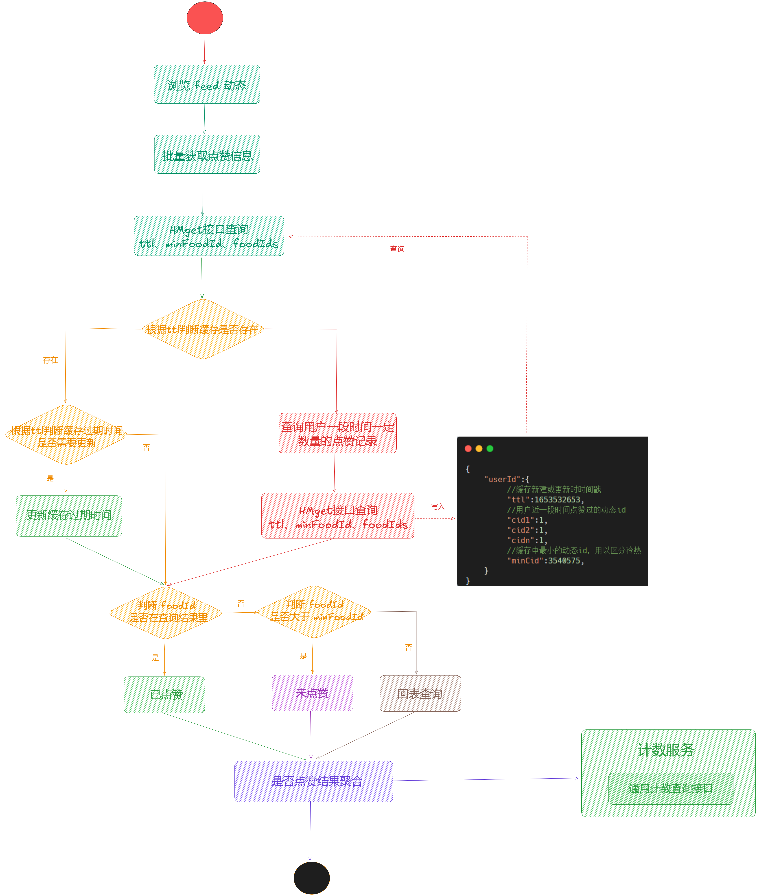

通过流程图，我们可以清晰看到 Feed 流一次批量查询请求最优情况下，只有一次 Redis 操作，业务实现也非常简单明了。

代码实现如下：

/\*\*

\* 查看点赞详情

\* @param foodIds

\* @param uId

\* @return

\*/

@Override

public HashMap<Long, Integer> getLikes(List<String> foodIds, Long uId) {

HashMap<Long , Integer> returnMap = new HashMap<>();

// 假设这里一次批量查询多条动态

foodIds.add("ttl");

foodIds.add("minFoodId");

// redis key

String key \= RedisKeyConstant.USER\_LIKE\_PREFIX + uId;

// 使用 hmget 查看数据

List<Integer> likes = redisCache.multiGetInt(key, foodIds);

log.info("美食模块-从 Redis 获取点赞哈希缓存：{}", likes);

boolean isNull \= true;

for(Integer like : likes) {

if(like != null) {

isNull = false;

break;

}

}

//判断缓存是否存在

if (!isNull) {

// 说明缓存存在

// 判断缓存 ttl 是否需要更新

Long ttl \= likes.get(likes.size() - 2).longValue();

// 获取当前时间戳

Long now \= System.currentTimeMillis() / 1000;

log.info("美食模块-从 Redis 获取点赞哈希缓存ttl：{}, now:{}, ttl2:{}", ttl, now, (ttl - now)/ 3 );

// 这里假设我们设置的是 48 小时，小于 48 小时三分之一就是小于 16 小时

if ((ttl - now)/ 3 < 3600 \* 16){

// 更新时间

redisCache.expire(key, 3600 \* 48, TimeUnit.HOURS);

ttl = ttl - (ttl-now) + 3600 \* 48;

// 更新 hash 中 ttl 的过期时间戳

redisCache.hPut(key, "ttl", ttl);

}

// 循环判断 foodIds 是否都在结果集当中，-2 是因为 ttl 和 minFoodId 不需要进行判断

for (int i \= 0 ; i < likes.size() - 2 ; i++) {

if (likes.get(i) == null) {

// 没点赞过

returnMap.put(Long.parseLong(foodIds.get(i)), 0);

} else if (Integer.parseInt(likes.get(i).toString()) != 1) { // 如果不等于 1 就判断是否小于 minFoodIds

// 其中 minFoodIds = likes.size - 1，如果大于说明没点赞过

if (Long.parseLong(foodIds.get(i)) > Long.parseLong(likes.get(likes.size() - 1).toString())) {

// 没点赞过

returnMap.put(Long.parseLong(foodIds.get(i)), 0);

} else {

// 如果小于 minFoodIds，就说明是非常老的数据了需要到数据库中进行查询

FoodLikeDO foodLikeDO \= foodLikeMapper.getByUserIdAndFoodId(Long.parseLong(foodIds.get(i)), uId);

// 如果存在则说明是历史点赞过的数据

if (foodLikeDO != null && foodLikeDO.getStatus().equals("0")) {

returnMap.put(Long.parseLong(foodIds.get(i)), 1);

} else {

// 说明没点赞过

returnMap.put(Long.parseLong(foodIds.get(i)), 0);

}

}

} else {

// 说明点过赞

returnMap.put(Long.parseLong(foodIds.get(i)), 1);

}

}

} else {

// 如果缓存不存在，需要查询一定时间一定数量的点赞用户信息

// 根据一定规则，这里查询最近 1000 条点赞数据

List<String> listLikes = foodLikeMapper.listByUserId(uId);

log.info("美食模块-从数据库获取点赞数据：{}", listLikes);

listLikes.add("ttl");

listLikes.add("minFoodId");

// 获取当前时间戳

Long now \= System.currentTimeMillis() / 1000;

Map<String , Integer> setMap = new HashMap<>();

// 遍历点赞列表信息

for (String str : listLikes) {

setMap.put(str , 1);

// 匹配 ttl

if (str.equals("ttl")){

// 48 小时后过期

setMap.put(str , now.intValue() + 3600 \* 48);

}

// 匹配 minFoodId

if (str.equals("minFoodId")){

// 列表第一个就是最小的 foodId

setMap.put(str , Integer.parseInt(listLikes.get(0)));

}

}

log.info("美食模块-点赞哈希集合数据：{}，点赞 key：{}", setMap, key);

// 注意 这块可以用 lua 原子操作

//redisCache.hPutAllInt(key, setMap);

//redisCache.expire(key, now.intValue() + 3600 \* 48);

insLikeDetails(key, setMap);

}

return returnMap;

}

/\*\*

\* 保存点赞信息

\* @param key

\* @param fields

\*/

private void insLikeDetails(String key, Map<String, Integer> fields) {

List<String> keys = Arrays.asList(key);

log.info("美食模块-准备执行 Lua 点赞脚本：{}，点赞 key：{}", fields, key);

redisCache.executeMapArgs(script, keys, fields);

}

Lua 脚本如下：

\-- 在脚本开头调用 redis.replicate\_commands() 切换为单个命令的复制模式

redis.replicate\_commands()

local key \= KEYS\[1\] -- Redis key

\-- 这里需要先解析 json 才能拿到正确结果

local fields \= cjson.decode(ARGV\[1\])

local ttl \= fields.ttl -- 过期时间，以秒为单位。其中 #ARGV 表示参数长度，将 ARGV 数组的最后一个元素赋值给 ttl 变量

redis.log(redis.LOG\_DEBUG, "Fields: " .. cjson.encode(fields))

redis.log(redis.LOG\_DEBUG, "ttl: " .. cjson.encode(fields.ttl))

redis.log(redis.LOG\_DEBUG, "minFoodId: " .. cjson.encode(fields.minFoodId))

\-- 使用 HSET 设置

for k,v in pairs(fields) do

redis.call('HSET', key, k, v)

end

\-- 检查 ttl 是否为整数

if not tonumber(ttl) then

return redis.error\_reply("TTL must be an integer, ttl: " .. tostring(ttl))

end

\-- 检查 ttl 是否在合理范围内

if ttl < 0 or ttl > 2147483647 then -- 假设最大值是 2147483647，实际上这个值可能根据 Redis 的不同而有所变化

return redis.error\_reply("TTL is out of range, ttl: ".. tostring(ttl))

end

\-- 如果提供了 TTL，则设置键的过期时间

redis.call('EXPIRE', key, ttl) -- 设置过期时间

redis.log 打印日志如下：

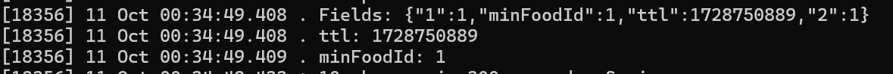

测试效果：

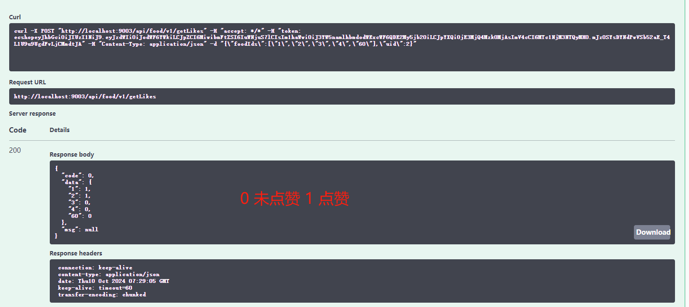

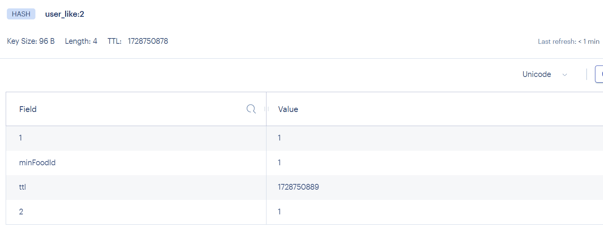