从今天之后的一段时间内，华仔会带着大家一起从零开始搭建并研发一套高并发的电商实战项目，这里会涉及到很多互联网大厂开发过程中所使用的核心技术和架构设计模式，希望大家学完之后可以用到自己的简历中。

接下来我们会重点架构设计和开发一下「**社交系统**」中的重要服务：「**关注服务**」、「**计数服务**」、「**评论服务**」。

这是第二十八篇，本篇我们继续进行电商实战项目设计与开发，本篇对「**评论服务**」基于 RocketMQ 顺序消息 + Redis Zset 功能实现。

文章汇总位置：[https://wx.zsxq.com/dweb2/index/columns/51122554151214](https://wx.zsxq.com/dweb2/index/columns/51122554151214)

源码授权与获取地址：[https://articles.zsxq.com/id\_1s85grnaae4p.html](https://articles.zsxq.com/id_1s85grnaae4p.html)

本章源码地址：[https://gitcode.net/u011359591/huazai-ecshop/-/tree/ecshop-chapter-29](https://gitcode.net/u011359591/huazai-ecshop/-/tree/ecshop-chapter-29)

## **01 前言**

终于要设计与研发电商项目代码了，今天我们主要对「**评论服务**」场景介绍与架构设计。

这里需要注意下，我们整个项目目前是不提供前端的，这个后续有时间在搞，主要是进行后端接口以及微服务模块架构设计。

## **02 评论服务架构设计细节**

在 [【电商实战项目第二十八篇】华仔电商实战项目评论系统服务场景介绍与架构设计](https://articles.zsxq.com/id_7a8b1q2um4gw.html) 这篇中，我们确定了最终的架构设计方案，今天我们再来深度细节拆解一下。

## **2.1 架构设计--概览**

评论服务一般会作为一个独立系统拆分设计，我们先来看下整个评论服务的架构设计，如下：

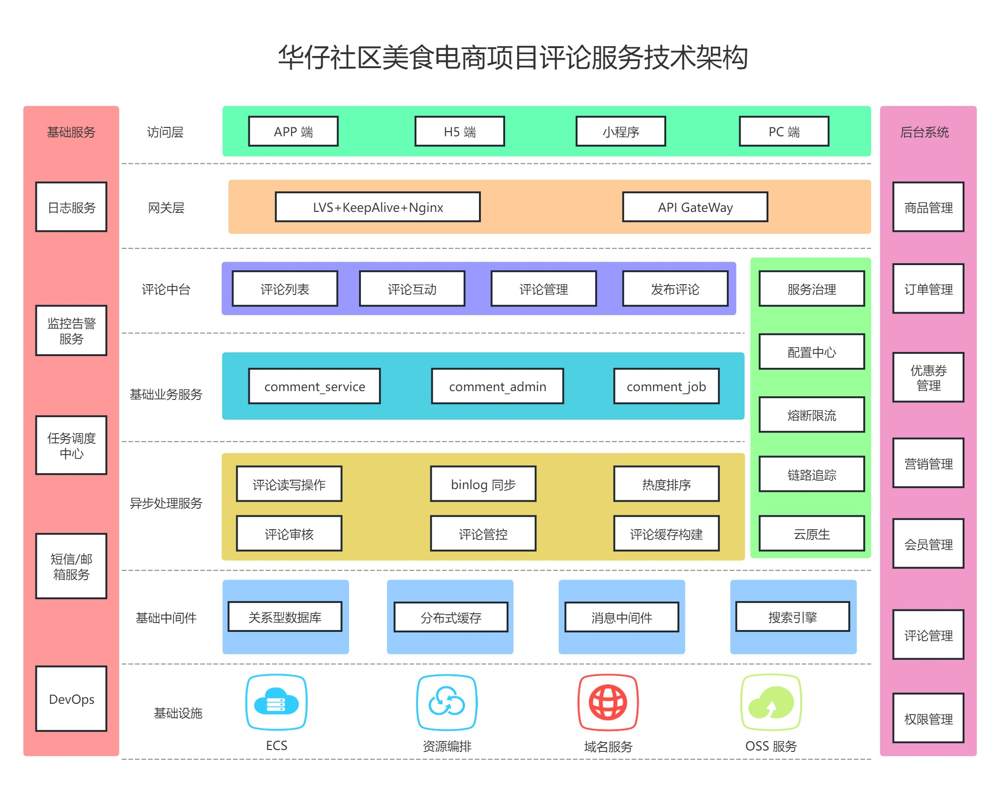

## **2.2 架构设计--comment\_admin**

这个服务主要是运营后台管理的，这里先了解下，后续待我们开发后台功能时再详细介绍。

后台一般都是运营人员进行管理操作，其数据查询有：

1.  各种组合、关联查询条件比较复杂。
2.  关键词检索能力。
3.  写后读实时性要求。

针对这类查询， ES 几乎是不二选择，由于业务数据量比较大，需要为不同业务场景建立不同的索引分片，且数据更新实时性要求不高，这里我们可以基于 ES 做一层封装，提供统一检索功能，并结合在线数据库刷新部分实时性要求较高的字段。

当我们写入数据到 MySQL 中，binlog 中的数据被 [canal](http://canal/)/[MaxWell](http://maxwell/) 中间件流式消费，获取到业务的原始 CRUD 操作，需要回放录入到 es 中，但是 es 中的数据最终是面向「**运营体系**」提供服务能力，需要检索的数据维度比较多，在入 es 前需要做一个异构的 [joiner](http://joiner/)，把单表变宽预处理好 join 逻辑，然后导入到 es 中。

es 一般会存储检索、展示、primary key 等数据，当我们操作编辑的时候，找到记录的 primary key，最后交由 [comment\_admin](http://comment_admin%20/) 进行运营侧的 CRUD 操作，内部运营体系基本都是基于 es 来完成的。

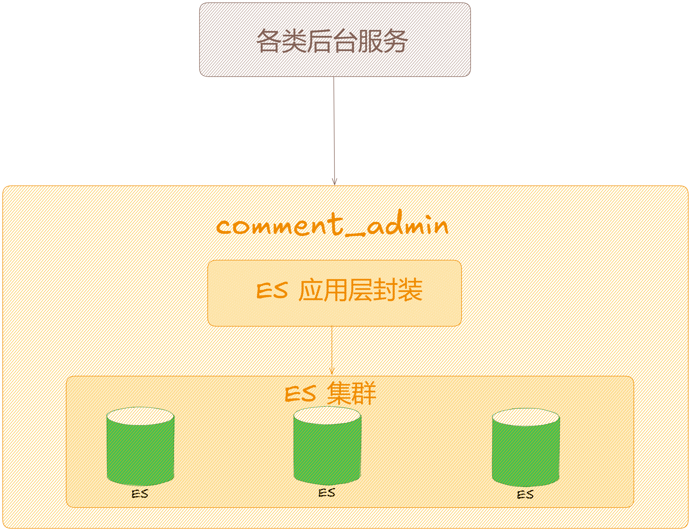

## **2.3 架构设计--comment\_service**

评论基础服务层主要专注于「**评论功能**」的「**原子化**」实现，例如「**查询评论列表**」、「**发布评论**」、「**删除评论**」等。

一般来说，这一层需要提供「**高可用性**」与「**高性能**」。因此，[comment\_service](http://comment_service/) 内部集成了「**多级缓存**」、「**布隆过滤器**」、「**热点探测**」、「**超时控制**」等性能优化手段。

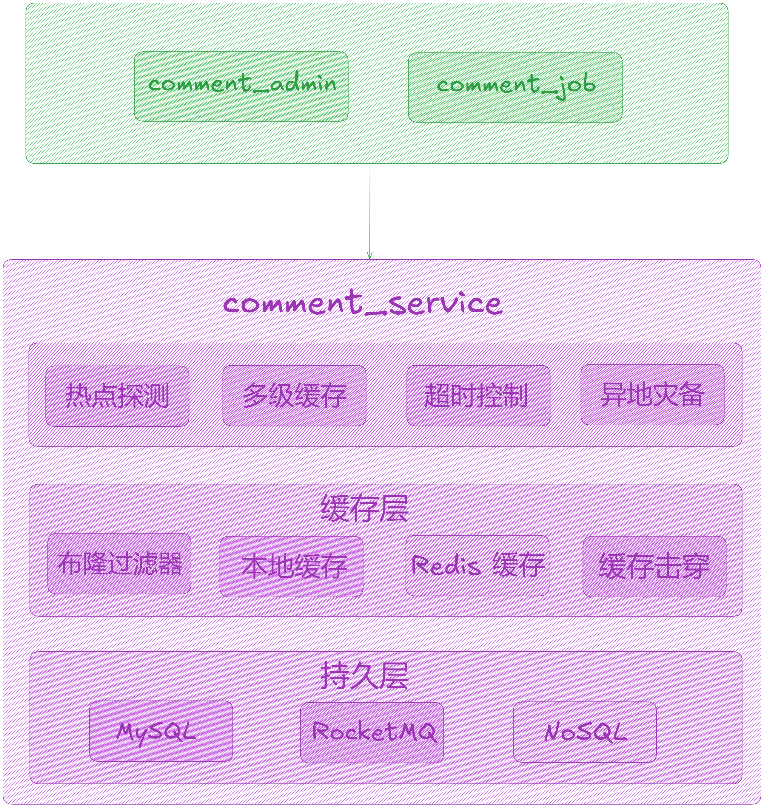

## **2.4 架构设计--comment\_job**

评论异步处理层，主要职责如下：

### **2.4.1 耗时请求异步化/削峰处理**

比如「**发布评论**」等操作，基于「**安全考量**」，会有非常重的「**前置处理逻辑**」。

对于用户来说这个长耗时几乎是不可接受的，同时对于「**时事热点**」来说更容易造成发评论的「**瞬间峰值流量**」。因此「**评论接口层**」在处理完一些必要校验逻辑之后，会通过「**消息队列**」发送 [comment\_job](http://comment_job%20/) 去异步处理，包括「**送审**」、「**写 DB**」、「**发通知**」等。

同时也利用了「**消息队列**」的「**有序性**」，将「**单个评论区**」内的发评信息「**串行处理**」，避免了「**并行处理**」导致的一些数据错乱风险。

如果异步处理后用户交互体验是如何保证的呢？

1.  首先 C 端的发布评论接口会返回展示新评论所需的数据内容。
2.  客户端根据据此数据展示新评论，完成一次用户交互。
3.  如果用户重新刷新页面，发评异步处理端到端延迟基本在 2s 以内，此时所有数据已准备好，不会影响用户体验。

### **2.4.2 异步化缓存构建原子化实现**

这部分最典型的就是「**缓存更新**」。一般这种情况通常采用 [Cache Aside](http://cache%20aside/) 模式，即先读缓存，再读 DB。

另外「**缓存重建**」就是读请求未命中缓存穿透到 DB，从 DB 读取到评论内容之后重新刷写缓存。这套流程对外提供了「**原子化**」数据读取功能。但由于「**部分缓存数据项**」的「**重建代价较高**」，比如评论列表的缓存构建「**由于列表是分页的重建时会启用预加载**」，如果短时间内多个服务节点的大量请求「**缓存未命中**」，容易造成 DB 抖动。

其解决方案是「**利用消息队列**」，实现「**单个评论列表，只重建一次缓存**」。综上，一方面「**用单线程解决分布式无状态服务的共性问题**」。另一方面 [comment\_job](http://comment_job/) 可以作为数据库 [binlog](http://binlog/) 的消费者，执行缓存的更新操作。

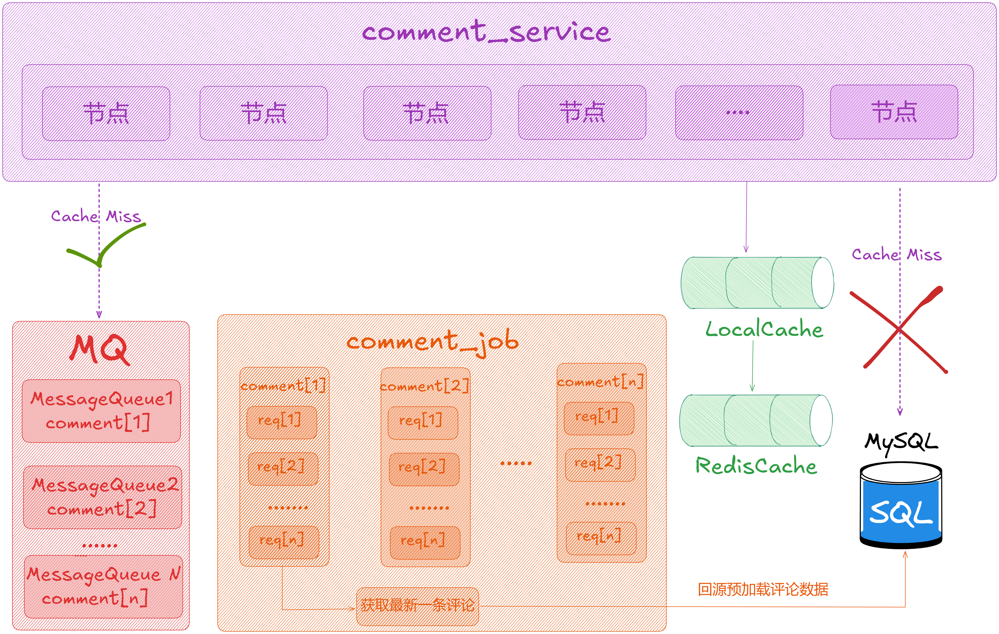

## **03 评论服务存储架构设计**

在 [【电商实战项目第二十八篇】华仔电商实战项目评论系统服务场景介绍与架构设计](https://articles.zsxq.com/id_7a8b1q2um4gw.html) 这篇中，我们确定了最终的数据库设计和缓存设计方案，今天我们再来深度细节拆解一下。

## **3.1 数据库表调整**

首先这里先对上篇中的数据库设计做一下调整：

CREATE TABLE \`food\_comment\` (

\`id\` bigint NOT NULL AUTO\_INCREMENT,

\`food\_id\` bigint NOT NULL DEFAULT '0' COMMENT '美食id',

\`comment\_user\_id\` bigint NOT NULL DEFAULT '0' COMMENT '评论发布者uid',

\`comment\_root\_id\` bigint NOT NULL DEFAULT '0' COMMENT '如果是对美食作品的评论则为美食id，如果是一级评论下的评论，则为一级评论id',

\`level\` tinyint(1) DEFAULT '0' COMMENT '一级评论(值为1)还是二级评论(值为2)',

\`reply\_count\` bigint NOT NULL DEFAULT '0' COMMENT '此评论被回复的次数，只有一级评论才记录',

\`like\_count\` bigint NOT NULL DEFAULT '0' COMMENT '此评论被点赞的总次数',

\`reply\_user\_id\` bigint NOT NULL DEFAULT '0' COMMENT '如果评论是对美食作品的评论则为 0，如果评论是对某条一级评论的回复则为一级评论的用户id，如果评论是对某条二级评论的回复则为二级评论的用户id',

\`reply\_comment\_id\` bigint NOT NULL DEFAULT '0' COMMENT '如果评论是对美食作品的评论则为 0，如果评论是对某条一级评论的回复则为一级评论 id，如果评论是对某条二级评论的回复则为二级评论 id',

\`status\` tinyint(1) DEFAULT '0' COMMENT '评论状态 0 审核中 1 审核通过 2 审核不通过',

\`reason\` varchar(255) COLLATE utf8mb4\_general\_ci DEFAULT '' COMMENT '评论审核不通过原因',

\`is\_del\` tinyint(1) DEFAULT '0' COMMENT '是否删除 0 正常 1 删除评论',

\`is\_top\` tinyint(1) DEFAULT '0' COMMENT '是否置顶 0 默认 1 置顶评论',

\`comment\_createtime\` datetime DEFAULT CURRENT\_TIMESTAMP COMMENT '创建时间',

\`comment\_updatetime\` datetime DEFAULT CURRENT\_TIMESTAMP ON UPDATE CURRENT\_TIMESTAMP COMMENT '更新时间',

PRIMARY KEY (\`id\`),

KEY \`idx\_comment\_list\` (\`food\_id\`,\`comment\_createtime\`) USING BTREE

) ENGINE\=InnoDB AUTO\_INCREMENT\=1 DEFAULT CHARSET\=utf8mb4 COLLATE=utf8mb4\_general\_ci COMMENT\='美食二级模式评论元数据表';

CREATE TABLE \`food\_comment\_content\` (

\`comment\_id\` bigint NOT NULL COMMENT '这里直接使用 comment 表主键',

\`comment\_context\` text CHARACTER SET utf8mb4 COLLATE utf8mb4\_general\_ci NOT NULL COMMENT '评论内容',

\`comment\_createtime\` datetime DEFAULT CURRENT\_TIMESTAMP COMMENT '创建时间',

\`comment\_updatetime\` datetime DEFAULT CURRENT\_TIMESTAMP ON UPDATE CURRENT\_TIMESTAMP COMMENT '更新时间'

) ENGINE\=InnoDB DEFAULT CHARSET\=utf8mb4 COLLATE=utf8mb4\_general\_ci COMMENT\='美食二级模式评论内容数据表';

CREATE TABLE \`food\_comment\_report\` (

\`id\` bigint NOT NULL AUTO\_INCREMENT,

\`comment\_id\` bigint NOT NULL DEFAULT '0' COMMENT '美食id',

\`comment\_report\_type\` tinyint NOT NULL DEFAULT '0' COMMENT '举报类型：1、站外导流 2、违法违规 3、色情低俗 4、低差广告 5、虚假不实 6、不友善、引战 7、时政不实信息 8、诱导关注点赞 9、涉未成年人 10、网络暴力 11、疑似自残自杀 12、笔记不相关 13、其他',

\`comment\_report\_satisfy\` tinyint NOT NULL DEFAULT '0' COMMENT '举报结果体验满意度： 1、非常不满意 2、不满意 3、一般 4、满意 5、非常满意',

\`comment\_report\_nosatisfy\_type\` tinyint(1) DEFAULT '0' COMMENT '举报结果体验不满意类型：1、入口不好找 2、举报理由不好懂 3、处理速度慢 4、流程不顺畅 5、处理结果不满意 6、处理结果不明确',

\`comment\_report\_nosatisfy\_suggest\` tinytext COLLATE utf8mb4\_general\_ci NOT NULL COMMENT '建议（选填）',

\`comment\_createtime\` datetime DEFAULT CURRENT\_TIMESTAMP COMMENT '创建时间',

\`comment\_updatetime\` datetime DEFAULT CURRENT\_TIMESTAMP ON UPDATE CURRENT\_TIMESTAMP COMMENT '更新时间',

PRIMARY KEY (\`id\`),

KEY \`idx\_comment\` (\`comment\_id\`) USING BTREE

) ENGINE\=InnoDB DEFAULT CHARSET\=utf8mb4 COLLATE=utf8mb4\_general\_ci COMMENT\='美食评论举报表';

首先这里评论我们分为两张表，主要调整如下：

1.  评论元数据表：这张表主要存储评论相关的元数据信息，后续分库分表会扩展到100~200张表，使用自增 id 做主键，主键 id 就是评论 id。 **这里去除了 comment\_id 字段，原先 food\_comment\_content 表主键**。
2.  评论内容表：这张表主要存储评论实际内容，后续分库分表会扩展到100~200张表，**这里改为直接使用 comment\_id （对应 food\_comment 表的主键 id） 作为主键**。
3.  表都有主键，即 cluster index，是物理组织形式存放的，而 [food\_comment\_content](http://food_comment_content/) 没有 id 是为了减少一次「**二级索引查找**」，直接基于主键检索，同时 comment\_id 在写入要尽可能的顺序自增。
4.  从 [food\_comment](http://food_comment/) 表里捞出来一堆 [comment\_id](http://comment_id/) ，那就可以直接通过这些 [comment\_id](http://comment_id/) 作为主键去查询 [food\_comment\_content](http://food_comment_content/) 表了。如果 content 表还有自己的自增主键的话，那么通过 [comment\_id](http://comment_id/) 去查必然需要先查到自己的主键 id ，然后再通过 id 去查到这一行数据，多了一步操作。
5.  索引、内容分离，方便 mysql data page 缓存更多的 row，如果和 content 耦合，会导致更大的 I/O。

这种设计算是一种「**索引内容分离**」的设计思想。

## **3.2 缓存设计**

我们基于数据库设计进行缓存设计，选用 Redis 作为分布式缓存，主要有 2 项缓存：

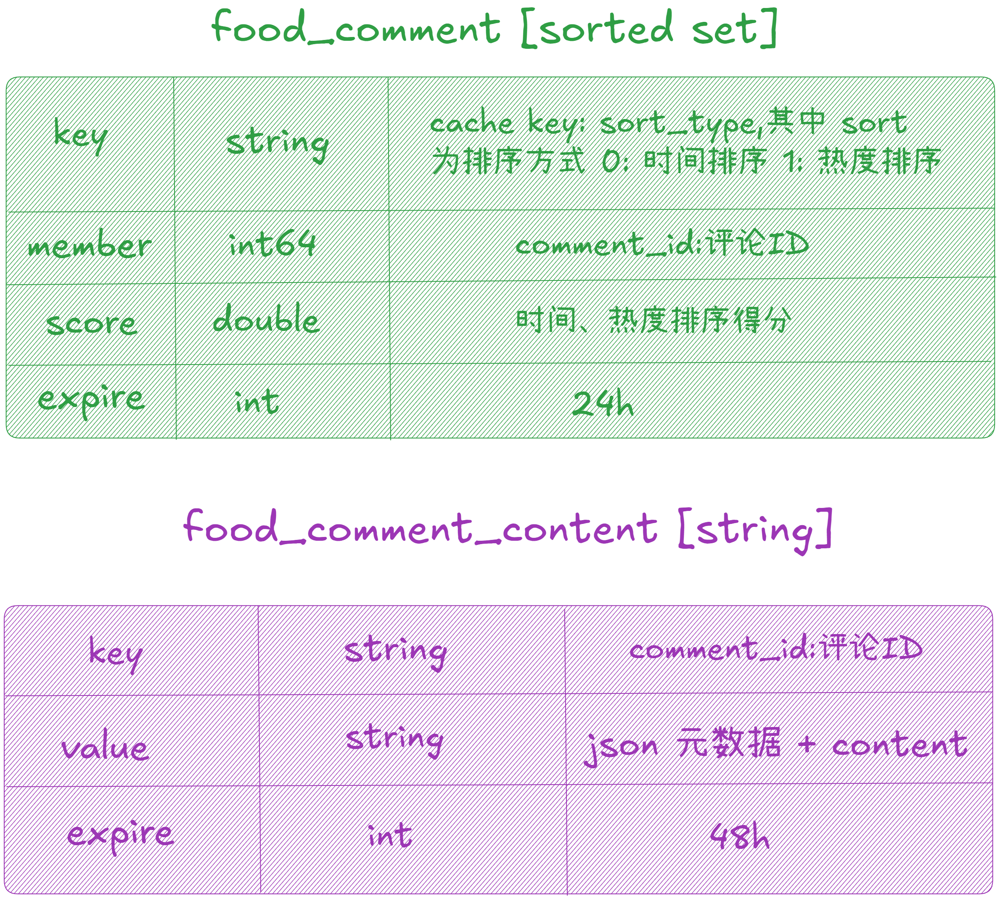

### **3.2.1 food\_comment**

对应查询评论列表，使用的是 Redis 的 [Sorted Set](http://sorted%20set/) 数据类型进行索引的缓存。其中，key 是美食 id + 排序方式， member 就是评论 id，score 就是根据各种要素排序的得分。

这样就可以根据某个主题查询，得到排序过后的评论 id 列表。然后就可以通过评论 id 列表去批量查询评论内容了。

> 索引即数据的组织顺序，而非数据内容。参考过百度贴吧，他们使用自己研发的拉链存储来组织索引，我认为 mysql 作为主力存储，利用 redis 来做加速完全足够，因为 cache miss 的构建，我们前面讲过使用 rocketmq 的消费者中处理，预加载少量数据，通过增量加载的方式逐渐预热填充缓存，而 redis sortedset skiplist 的实现，可以做到 O(logN) + O(M) 的时间复杂度，效率很高。

由于这里使用的是 [Sorted Set](http://sorted%20set/)，为了保证数据完整性，必须要「**判断 key 存在**」才能增量追加。由于「**存在判断**」和「**增量追加**」不是原子性的，「**判断 key 存在之后**」、「**增量追加之前**」可能会出现「**缓存过期**」的情况，因此可以使用 Redis 的 [EXPIRE](http://expire/) 命令来「**判断 key 是否存在**」，避免此类极端情况导致的数据缺失。

此外，缓存的一致性可以依赖 [binlog](http://binlog%20/) 刷新，主要有几个关键细节：

1.  binlog 投递到消息队列，分片 key 选择的是「**评论区**」，保证「**单个评论区**」和「**单个评论**」的更新操作是串行的，消费者顺序执行，保证对同一个 member 的 zadd 和 zrem 操作不会顺序错乱。
2.  数据库更新后，程序主动写缓存和 binlog 刷缓存，都采用「**删除缓存**」而非「**直接更新**」的方式，避免并发写操作时，特别是诸如「**binlog 延迟**」、「**网络抖动**」等异常场景下的数据错乱。
3.  另外如果大量写操作后读操作缓存命中率低的问题如何解决呢？这里可以使用我们之前讲的防止缓存击穿、穿透解决方案。

### **3.2.2 food\_comment\_content**

对应查询评论基础信息，使用 [protobuf/Json](http://protobuf/Json) 序列化的方式存入，存储内容包括评论 id 对应的 food\_comment 表和 food\_comment\_content 表的两部分字段。

缓存使用「**增量加载**」 + 「**Lazy 加载**」模式，也就是在「**查询第一页**」的时候会将后几页评论数据也一起加载进缓存，可以使用「**RocketMQ**」进行缓存的异步构建。

## **04 评论服务基础功能开发**

讨论完架构设计之后，我们就来正式开发一下评论服务的相关功能，如下：

1.  发布评论（**本篇开发**）。
2.  拉取评论列表：这里默认先按时间排序，由于篇幅问题，后续篇章会单独介绍热度排序实现。
3.  评论列表缓存构建：这里会使用 RocketMQ 配合 comment\_job 任务来异步构建，由于篇幅问题，单独篇章介绍。
4.  运营评论：置顶评论、举报评论、举报满意度体验反馈（**本篇开发**）。
5.  删除评论（**本篇开发**）。
6.  评论点赞/取消点赞（**本篇开发**）。
7.  评论计数（**本篇开发**）。

## **4.1 RocketMQ 顺序消息接入**

由于我们要支撑小红书千万级甚至亿级洪峰流量，所以我们将基于 RocketMQ 来异步削峰实现，通过上面剖析，我们写入的时候会按「**评论区**」即按「**food\_id**」分片进行顺序消息发送，并基于顺序消费者来顺序消费评论，这样可以保证保证「**单个评论区**」和「**单个评论**」的更新操作是串行的，消费者顺序执行，保证对同一个 member 的 zadd 和 zrem 操作不会顺序错乱。

所以「**发布评论**」的架构流程图如下：

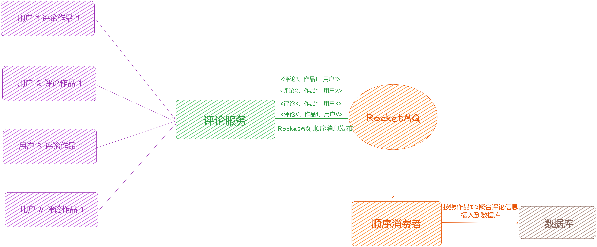

顺序消息 RocketMQ 官方文档：[https://rocketmq.apache.org/zh/docs/featureBehavior/03fifomessage/](https://rocketmq.apache.org/zh/docs/featureBehavior/03fifomessage/)

我之前在 RocketMQ 专栏中也剖析过，可以点击学习：[【入门实战系列第十四篇】RocketMQ 顺序消息发送讲解](https://articles.zsxq.com/id_0995gbhthseo.html)、[【原理分析系列第二十篇】图解 RocketMQ 中顺序消息的实现原理](https://articles.zsxq.com/id_cueiej03t2hh.html)

### **4.1.1 创建顺序消息 TOPIC 以及消费者组**

这里我们主要按照官方文档来创建和接入，如下图：

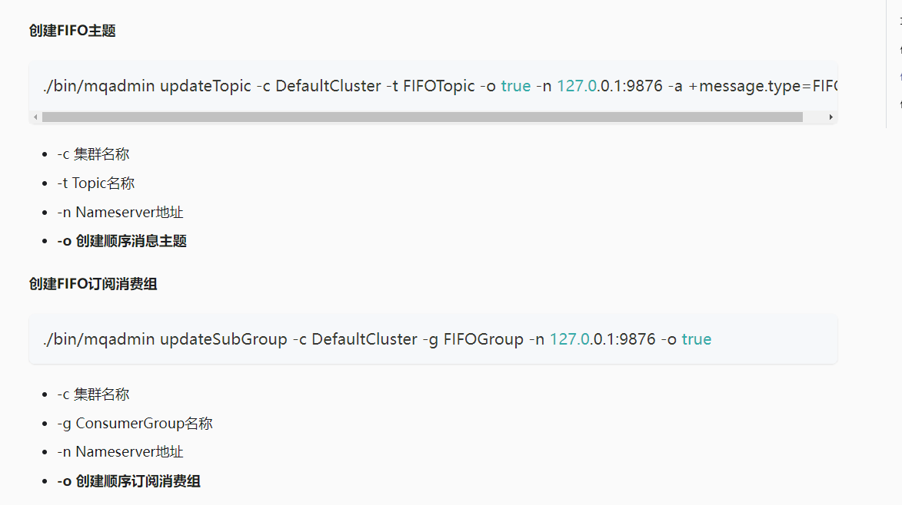

对应 5.x 版本之后，我们需要创建「**FIFO**」主题以及「**FIFO**」订阅消费组，如下：

  
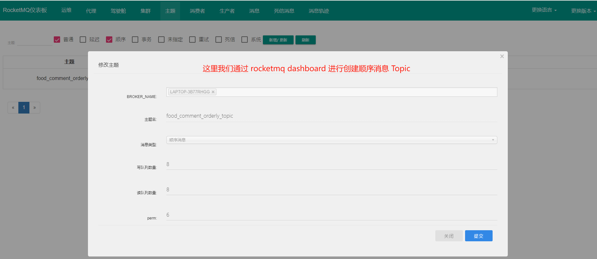

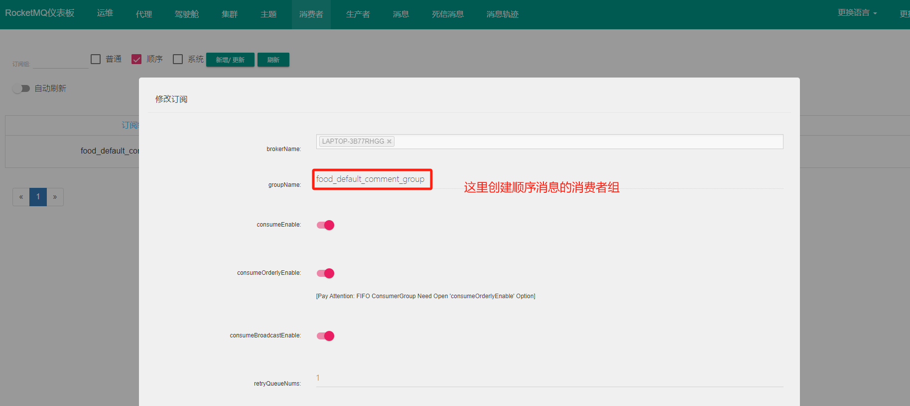  

如果不懂 RocketMQ 安装以及 RocketMQ dashboard 安装的可以点击学习：[【核心运维系列第一篇】RocketMQ 运维控制台使用详解](https://articles.zsxq.com/id_ck4dqpg8pcuz.html)，这里就不再赘述。

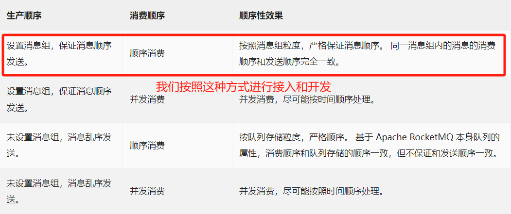

### **4.1.2 RocketMQ-Spring 客户端升级**

下面我们来看下项目中如何接入，之前我们已经集成了 RocketMQ，但是之前客户端是 RocketMQ 4.x 版本的，这里我们将升级到 RocketMQ 5.x 版本，5.x 客户端版本对于「**顺序消息**」发送比较简单。

首先我们需要升级下 RocketMQ 客户端版本。

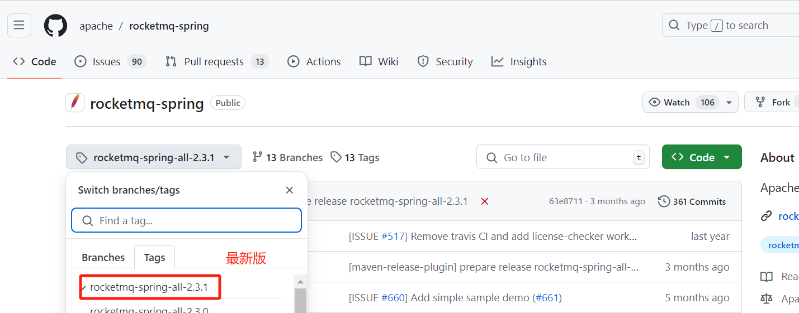

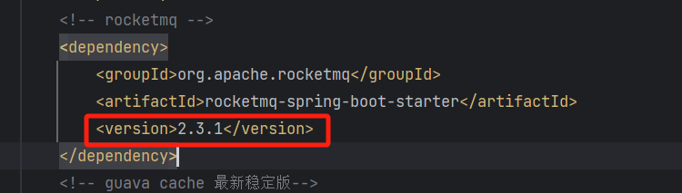

刷新 Maven 之后，查看 common 包下面的依赖，可以看到已经从原来的 2.1.1 版本升级到 2.3.1 版本了。

### **4.1.3 RocketMQ 顺序消息项目接入**

阿里云官方给出的 5.x 顺序代码消息示例：[https://help.aliyun.com/zh/apsaramq-for-rocketmq/cloud-message-queue-rocketmq-5-x-series/developer-reference/sample-code?spm=a2c4g.11186623.0.0.72fe1448PePn4p](https://help.aliyun.com/zh/apsaramq-for-rocketmq/cloud-message-queue-rocketmq-5-x-series/developer-reference/sample-code?spm=a2c4g.11186623.0.0.72fe1448PePn4p)

### **4.1.3.1 完善启动配置**

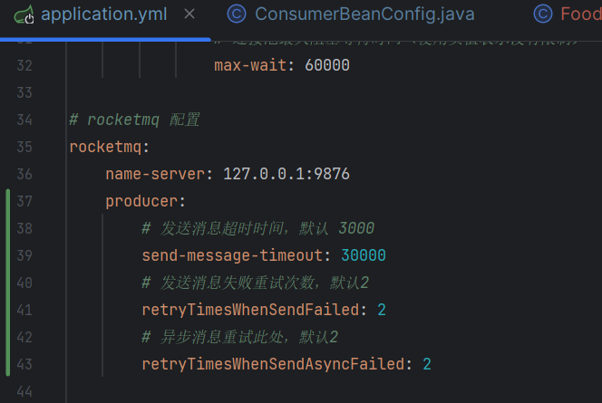

### **4.1.3.2 创建 RocketMQTemplate**

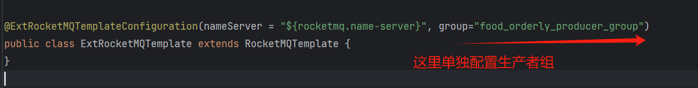

### **4.1.3.3 编写顺序消息生产者**

package net.huazai.mq.producer;

import lombok.extern.slf4j.Slf4j;

import net.huazai.mq.templete.ExtRocketMQTemplate;

import org.apache.rocketmq.client.producer.SendCallback;

import org.apache.rocketmq.client.producer.SendResult;

import org.springframework.beans.factory.annotation.Autowired;

import org.springframework.messaging.Message;

import org.springframework.messaging.support.MessageBuilder;

import org.springframework.stereotype.Component;

/\*\*

\* RocketMQ 顺序消息生产者

\*/

@Slf4j

@Component

public class OrderlyProducer {

@Autowired

private ExtRocketMQTemplate extRocketMQTemplate;

/\*\*

\* oneWay 模式顺序发送

\* @param topic

\* @param message

\* @param orderlyKeyId

\*/

public void sendOneWayOrderly(String topic, String message, String orderlyKeyId)

{

Message<String> msgs = MessageBuilder.withPayload(message)

//设置消息KEYS,一般是数据的唯一ID,主要用于在仪表盘中方便搜索

.setHeader("KEYS", orderlyKeyId)

.build();

//顺序消息比普通消息多一个参数，第三个参数只要唯一就行，比如ID

extRocketMQTemplate.sendOneWayOrderly(topic, msgs, orderlyKeyId);

}

/\*\*

\* 同步模式下发送顺序消息，这里推荐使用同步顺序消息

\* @param topic

\* @param message

\* @param orderlyKeyId

\*/

public void sendSyncOrderly(String topic, String message, String orderlyKeyId)

{

Message<String> msgs = MessageBuilder.withPayload(message)

//设置消息KEYS,一般是数据的唯一ID,主要用于在仪表盘中方便搜索

.setHeader("KEYS", orderlyKeyId)

.build();

//顺序消息比普通消息多一个参数，第三个参数只要唯一就行，比如ID

SendResult sendResult \= extRocketMQTemplate.syncSendOrderly(topic, msgs, orderlyKeyId);

log.info("同步顺序消息结果集：{}", sendResult.toString());

}

/\*\*

\* 异步模式下发送顺序消息

\* 异步发送只是多了一个 SendCallback 参数。

\* 注意：异步发送顺序消息并不能严格保证消息的顺序

\* @param topic

\* @param message

\* @param orderlyKeyId

\*/

public void sendAsyncOrderly(String topic, String message, String orderlyKeyId)

{

Message<String> msgs = MessageBuilder.withPayload(message)

//设置消息KEYS,一般是数据的唯一ID,主要用于在仪表盘中方便搜索

.setHeader("KEYS", orderlyKeyId)

.build();

//顺序消息比普通消息多一个参数，第三个参数只要唯一就行，比如ID

extRocketMQTemplate.asyncSendOrderly(topic, msgs, orderlyKeyId, new SendCallback() {

@Override

public void onSuccess(SendResult sendResult) {

log.info("异步顺序消息成功结果集：{}", sendResult.toString());

}

@Override

public void onException(Throwable e) {

log.info("异步顺序消息失败异常信息：{}, e:{}", e.getMessage(), e);

}

});

}

}

这里我们主要使用「**同步方式**」发送顺序消息，这样可以保证发送结果，也能保证顺序。

###   
**4.1.3.4 编写顺序消息消费者**

/\*\*

\* 美食评论消费者

\* @param foodCommentUpdateListener

\* @return

\* @throws MQClientException

\*/

@Bean("foodCommentAsyncUpdateTopic")

public DefaultMQPushConsumer foodCommentAsyncUpdateTopic(FoodCommentUpdateListener foodCommentUpdateListener) throws MQClientException {

// 实例化消费者客户端

DefaultMQPushConsumer consumer \= new DefaultMQPushConsumer(RocketMQConstant.FOOD\_COMMENT\_CONSUMER\_GROUP);

// 设置 nameserver 地址

consumer.setNamesrvAddr(rocketMQProperties.getNameServer());

// 订阅评论顺序 topic

consumer.subscribe(RocketMQConstant.FOOD\_COMMENT\_ORDERLY\_TOPIC, "\*");

// 注册消息监听器

consumer.registerMessageListener(foodCommentUpdateListener);

// 设置消费线程池最大线程数和最小线程数

consumer.setConsumeThreadMin(1);

consumer.setConsumeThreadMax(10);

// 启动消费者

consumer.start();

return consumer;

}

package net.huazai.mq.consumer.listener;

import lombok.extern.slf4j.Slf4j;

import net.huazai.mq.FoodCommentMQMessage;

import net.huazai.utils.JsonUtil;

import org.apache.rocketmq.client.consumer.listener.\*;

import org.apache.rocketmq.common.message.MessageExt;

import org.springframework.stereotype.Component;

import java.util.List;

/\*\*

\* 美食信息变更监听器

\*/

@Slf4j

@Component

public class FoodCommentUpdateListener implements MessageListenerOrderly {

/\*\*

\* 顺序消费美食评论消息

\* @param msgList

\* @param context

\* @return

\*/

@Override

public ConsumeOrderlyStatus consumeMessage(List<MessageExt> msgList, ConsumeOrderlyContext context) {

try {

for (MessageExt messageExt : msgList) {

String msg \= new String(messageExt.getBody());

// 解析美食评论信息

FoodCommentMQMessage message \= JsonUtil.json2Object(msg, FoodCommentMQMessage.class);

log.info("美食评论 MQ 异步更新-执行发布美食评论信息内容：{}", message);

}

} catch (Exception e) {

// 本次消费失败，下次重新消费

log.error("美食评论 MQ 异步更新 consume error, 发布美食评论信息消费失败", e);

return ConsumeOrderlyStatus.SUSPEND\_CURRENT\_QUEUE\_A\_MOMENT;

}

log.info("美食 MQ 异步更新-发布美食评论信息消费成功, result: {}", ConsumeOrderlyStatus.SUCCESS);

return ConsumeOrderlyStatus.SUCCESS;

}

}

这里消费者只是简单接收，还没做业务处理，测试下是否可以正常收发消息。

### **4.1.3.5 测试效果**

/\*\*

\* 组织并发送 MQ 顺序消息异步处理

\* @param foodCommentSaveEntity

\*/

@Override

public void save(FoodCommentSaveEntity foodCommentSaveEntity) {

// 获取用户登录信息 这里还是通过 ThreadLocal 进行获取

// TODO 后续使用 Redis 分布式缓存替代

LoginUser loginUser \= LoginInterceptor.threadLocal.get();

publishFoodOrderlyEvent(foodCommentSaveEntity);

}

/\*\*

\* 发布美食顺序消息事件

\* @param foodCommentSaveEntity

\*/

private void publishFoodOrderlyEvent(FoodCommentSaveEntity foodCommentSaveEntity) {

log.info("发布美食评论信息：{}", foodCommentSaveEntity);

// 构建消息

FoodCommentMQMessage message \= FoodCommentMQMessage

.builder()

.foodId(foodCommentSaveEntity.getFoodId())

.commentContext(foodCommentSaveEntity.getCommentContext())

.commentRootId(foodCommentSaveEntity.getCommentRootId())

.level(foodCommentSaveEntity.getLevel())

.replyUserId(foodCommentSaveEntity.getReplyUserId())

.replyCommentId(foodCommentSaveEntity.getReplyCommentId())

.build();

// 发送 MQ 顺序消息

orderlyProducer.sendSyncOrderly(

RocketMQConstant.FOOD\_COMMENT\_ORDERLY\_TOPIC,

JsonUtil.object2Json(message),

foodCommentSaveEntity.getFoodId().toString());

}

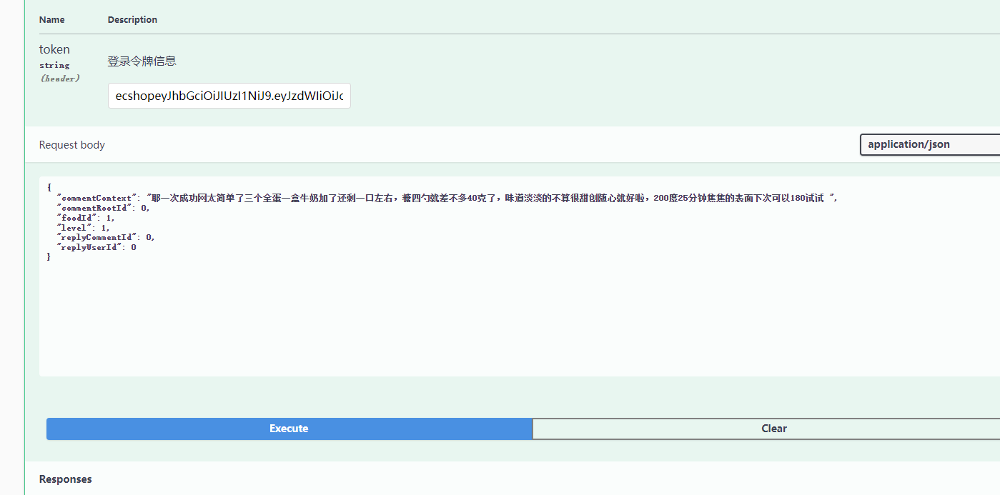

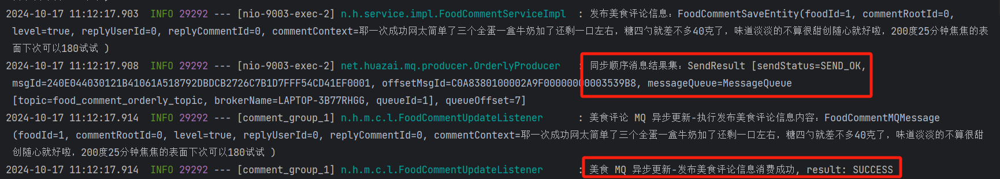

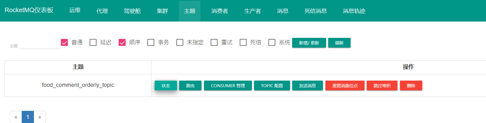

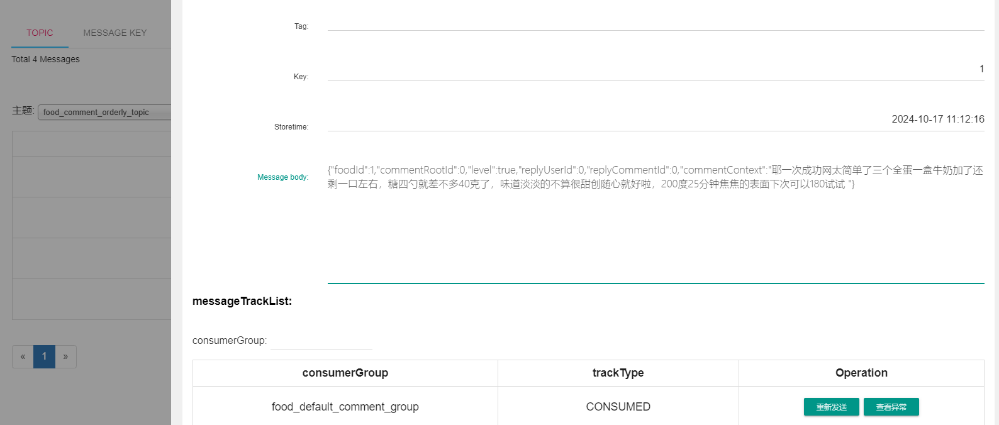

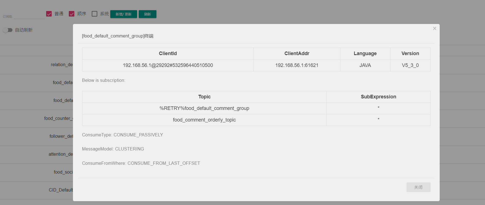

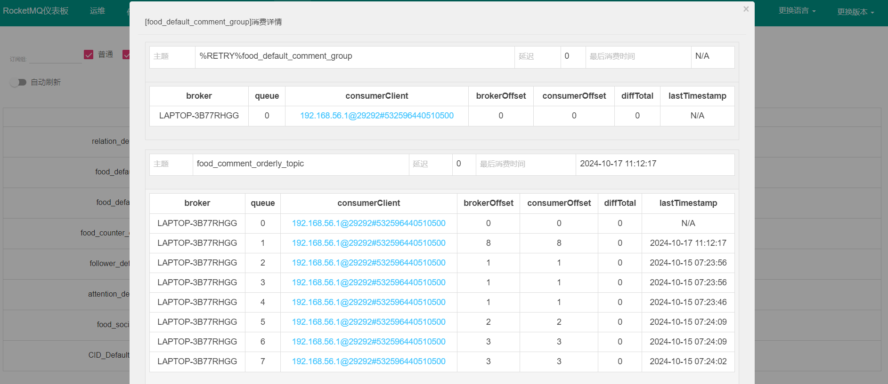

测试没问题之后，接下来就是业务正式开发了。

## **4.2 发布评论**

在上面已经剖析过这个「**发布评论**」的架构流程图，这里再来回顾下：

从图上可以看到「**发布评论**」会以「**顺序消息**」的方式发布到「**RocketMQ**」中，然后启动「**顺序消费者**」来顺序消费并进行「**聚合操作**」，然后批量插入「**评论元数据**」和 「**评论内容数据**」。

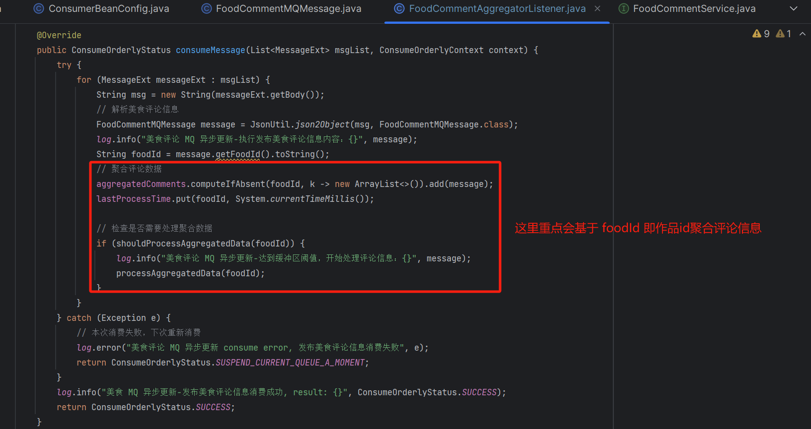

具体聚合代码可以下载代码后自行研究，这里篇幅问题就不展开了，最后来看下执行批量写数据库操作。

/\*\*

\* 批量插入聚合的评论信息

\* @param comments

\*/

@Transactional(rollbackFor = Exception.class)

@Override

public void saveComments(List<FoodCommentMQMessage> comments) {

log.info("聚合美食评论信息：{}", comments);

List<FoodCommentDO> foodCommentDOList = new ArrayList<>();

List<FoodCommentContentDO> foodCommentContentDOList = new ArrayList<>();

// 1、构建插入的 FoodCommentDO 列表、FoodCommentContentDO 列表

for (FoodCommentMQMessage comment :comments) {

// 1.1、构建插入的 FoodCommentDO 列表

FoodCommentDO foodCommentDO \= new FoodCommentDO();

foodCommentDO.setFoodId(comment.getFoodId());

foodCommentDO.setCommentUserId(comment.getCommentUserId());

foodCommentDO.setLevel(comment.getLevel());

foodCommentDO.setReplyUserId(comment.getReplyUserId());

foodCommentDO.setReplyCommentId(comment.getReplyCommentId());

foodCommentDO.setCommentCreatetime(new Date());

// 1.2、构建插入的 FoodCommentContentDO 列表

FoodCommentContentDO foodCommentContentDO \= new FoodCommentContentDO();

foodCommentContentDO.setCommentContext(comment.getCommentContext());

foodCommentContentDO.setCommentCreatetime(new Date());

// 1.3、将评论元数据和评论内容放入对应的列表中

foodCommentDOList.add(foodCommentDO);

foodCommentContentDOList.add(foodCommentContentDO);

}

// 2、批量插入评论元数据

log.info("批量插入的评论元数据:{}", foodCommentDOList);

foodCommentMapper.batchInsert(foodCommentDOList);

// 3、返回批量插入的自增ID 并组合插入评论内容

List<FoodCommentContentDO> combinedCommentContentDOList = new ArrayList<>();

for (int i \= 0; i < foodCommentDOList.size(); i++) {

// 获取评论元数据对象

FoodCommentDO commentDO \= foodCommentDOList.get(i);

log.info("插入的评论元数据自增ID为:{}", commentDO.getId());

// 根据索引获取对应的评论内容对象

FoodCommentContentDO foodCommentContentDO \= foodCommentContentDOList.get(i);

// 将评论元数据的自增ID赋值给评论内容对象

foodCommentContentDO.setCommentId(commentDO.getId());

combinedCommentContentDOList.add(foodCommentContentDO); // 将组合后的评论内容对象加入列表

}

// 4、批量插入评论内容

log.info("批量插入的评论内容:{}", combinedCommentContentDOList);

foodCommentContentMapper.batchInsert(combinedCommentContentDOList);

}

这里基于不同的 foodId 来聚合操作，执行结果如下：

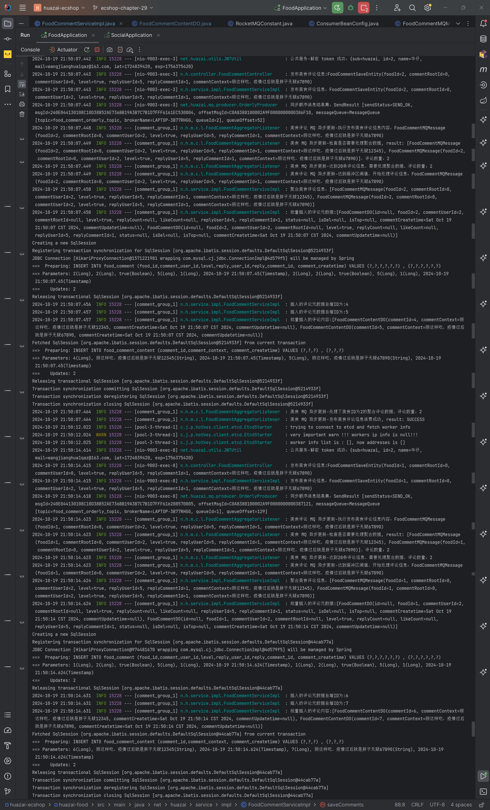

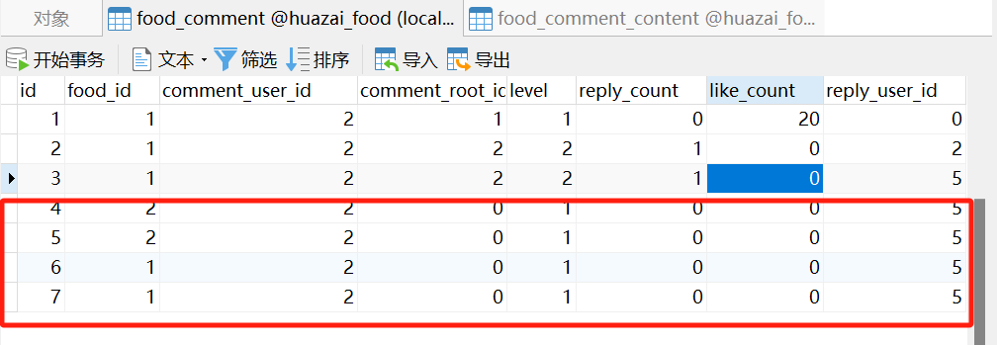

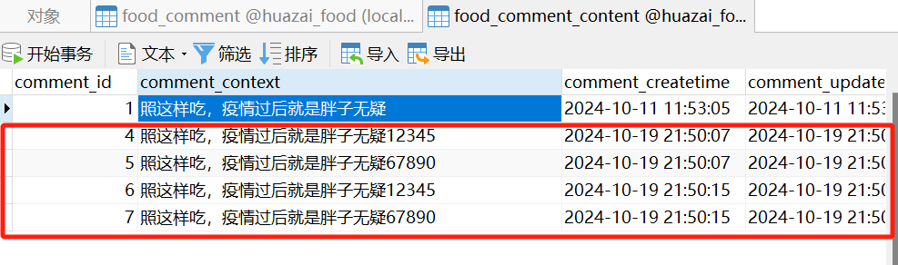

### **4.2.1 发布评论总结**

这里我们通过「**RocketMQ 异步写**」+ 「**写聚合**」的方式来处理「**高并发**」问题。

1.  RocketMQ 异步写：在评论服务与数据库之间使用「**RocketMQ 异步写**」, Topic 为：[food\_comment\_orderly\_topic](http://food_comment_orderly_topic/) 建立通道，评论服务将所收到的写评论请求发送到 Topic 为 [food\_comment\_orderly\_topic](http://food_comment_orderly_topic/) 中就响应成功; 接着创建一个「**发布评论消费者**」来消费 Topic 为 [food\_comment\_orderly\_topic](http://food_comment_orderly_topic/) 中的评论消息，逐步将评论元信息以及内容数据写入到数据库中。这样一来，高并发的写评论请求就被削峰为数据库可以从容处理的平滑流量。
2.  写聚合：「**发布评论消费者**」可以「**聚合 XX 条**」或者「**每隔 xx 秒**」就将所收到的写评论请求按照「**美食ID**」做一次聚合，将指向同一个「**美食ID**」的写评论请求聚合为一条 SQL 语句批量插入数据库中。比如：在 10 秒内，「**发布评论消费者**」收到了 20 条对「**美食ID**」的写评论请求，此时就可以把对应的 20 条 SQL 改为 1 条 SQL，然后插入数据库。这样一来，提高了「**发布评论消费者**」的处理速度，缓解了数据库的访问压力。

## **4.3 运营评论**

先来看运营评论都有哪些功能？

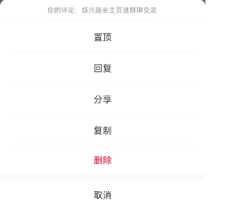

这里主要开发「**置顶**」和 「**删除**」评论，比较简单，如下：

/\*\*

\* 置顶评论 只能置顶自己的

\* @param commentId

\*/

@Override

public ApiResult top(Long commentId) {

// 获取用户登录信息 这里还是通过 ThreadLocal 进行获取

// TODO 后续使用 Redis 分布式缓存替代

LoginUser loginUser \= LoginInterceptor.threadLocal.get();

FoodCommentDO foodCommentDO \= foodCommentMapper.selectById(commentId);

if (foodCommentDO == null) {

ApiResult.doResult(BizCodes.FOOD\_COMMENT\_NOT\_EXISTS);

}

if (foodCommentDO.getCommentUserId() != loginUser.getId()) {

ApiResult.doResult(BizCodes.FOOD\_COMMENT\_NOT\_TOP);

}

FoodCommentDO foodCommentDO1 \= new FoodCommentDO();

foodCommentDO1.setIsTop(true);

foodCommentMapper.update(foodCommentDO1, new QueryWrapper<FoodCommentDO>().eq("id", commentId));

log.info("美食模块-置顶美食评论信息：data={}", foodCommentDO1);

return ApiResult.doSuccess();

}

/\*\*

\* 删除评论 只能删除自己的

\* @param commentId

\* @return

\*/

@Override

public ApiResult del(Long commentId) {

// 获取用户登录信息 这里还是通过 ThreadLocal 进行获取

// TODO 后续使用 Redis 分布式缓存替代

LoginUser loginUser \= LoginInterceptor.threadLocal.get();

FoodCommentDO foodCommentDO \= foodCommentMapper.selectById(commentId);

if (foodCommentDO == null) {

ApiResult.doResult(BizCodes.FOOD\_COMMENT\_NOT\_EXISTS);

}

if (foodCommentDO.getCommentUserId() != loginUser.getId()) {

ApiResult.doResult(BizCodes.FOOD\_COMMENT\_NOT\_DEL);

}

FoodCommentDO foodCommentDO1 \= new FoodCommentDO();

foodCommentDO1.setStatus(true);

foodCommentMapper.update(foodCommentDO1, new QueryWrapper<FoodCommentDO>().eq("id", commentId));

log.info("美食模块-删除美食评论信息：data={}", foodCommentDO1);

return ApiResult.doSuccess();

}

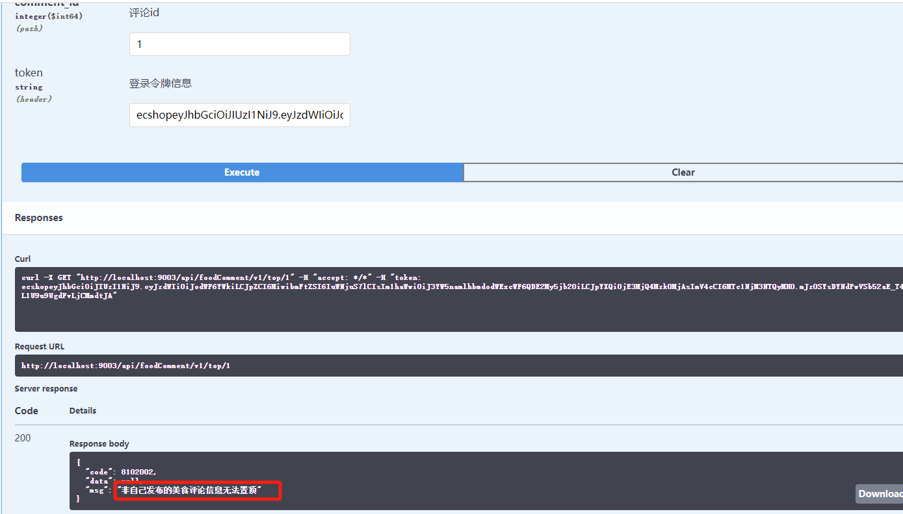

这里改下发布用户 id：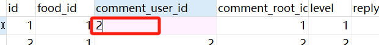

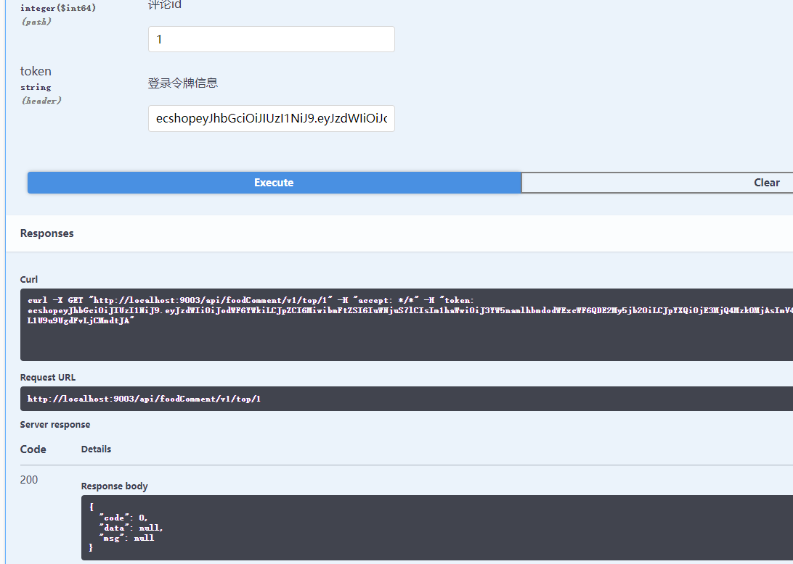

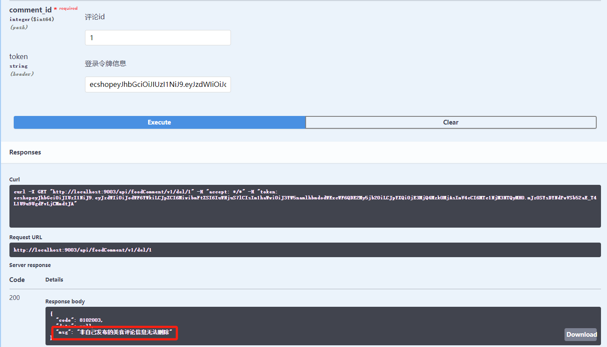

再次修改发布用户 id：

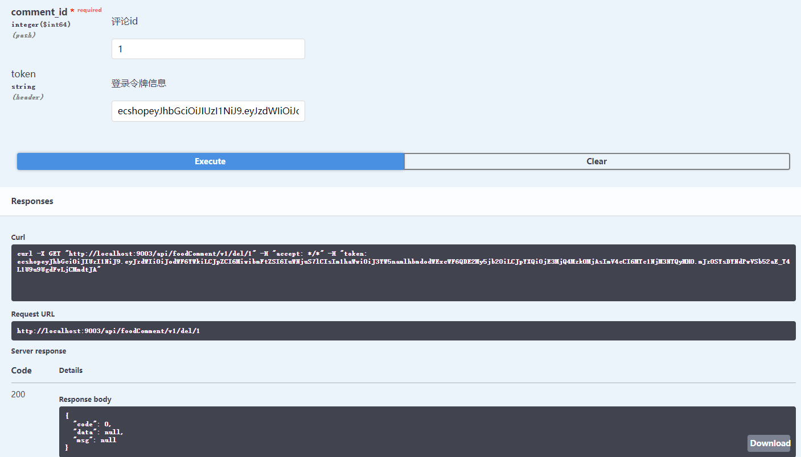

## **4.4 评论点赞/取消点赞/评论计数**

这里「**评论点赞/取消点赞**」以及「**计数**」都是采用 「**RocketMQ**」异步处理的，只不过「**评论点赞/取消点赞**」业务处理并没有做「**缓冲区**」，而「**评论计数**」直接使用之前已经写好的「**计数服务**」来计算即可。

###   
**4.4.1 评论点赞/取消点赞服务**

/\*\*

\* 新增评论点赞

\* @param commentId

\*/

@Override

public ApiResult doLike(Long commentId) {

// 获取用户登录信息 这里还是通过 ThreadLocal 进行获取

// TODO 后续使用 Redis 分布式缓存替代

LoginUser loginUser \= LoginInterceptor.threadLocal.get();

// 构建消息

List<String> keys = new ArrayList<>();

// 美食对应的博主是谁

FoodCommentDO foodCommentDO \= getFoodCommentInfo(commentId);

if (foodCommentDO != null) {

// 美食id

keys.add(foodCommentDO.getFoodId().toString());

} else {

// 美食评论不存在直接返回

return ApiResult.doResult(BizCodes.FOOD\_COMMENT\_NOT\_EXISTS);

}

// 谁点赞的

keys.add(String.valueOf(loginUser.getId()));

// 评论点赞 field

keys.add("comment\_like\_count");

keys.add("1"); // 评论点赞 +1

if (foodCommentDO != null) {

keys.add(String.valueOf(foodCommentDO.getCommentUserId()));

} else {

// 美食评论不存在直接返回

return ApiResult.doResult(BizCodes.FOOD\_COMMENT\_NOT\_EXISTS);

}

keys.add(commentId.toString());

String message \= JSON.toJSONString(keys);

log.info("新增美食评论点赞消息：{}", message);

// 发送 MQ 消息

defaultProducer.sendMessage(

RocketMQConstant.FOOD\_COUNTER\_TOPIC,

message,

"新增美食评论点赞");

return ApiResult.doSuccess();

}

/\*\*

\* 取消评论点赞

\* @param commentId

\*/

@Override

public ApiResult unLike(Long commentId) {

// 获取用户登录信息 这里还是通过 ThreadLocal 进行获取

// TODO 后续使用 Redis 分布式缓存替代

LoginUser loginUser \= LoginInterceptor.threadLocal.get();

// 构建消息

List<String> keys = new ArrayList<>();

// 美食对应的博主是谁

FoodCommentDO foodCommentDO \= getFoodCommentInfo(commentId);

if (foodCommentDO != null) {

// 美食id

keys.add(foodCommentDO.getFoodId().toString());

} else {

// 美食评论不存在直接返回

return ApiResult.doResult(BizCodes.FOOD\_COMMENT\_NOT\_EXISTS);

}

// 谁取消的点赞

keys.add(String.valueOf(loginUser.getId()));

keys.add("comment\_like\_count");

keys.add("-1"); // 点赞 -1

if (foodCommentDO != null) {

keys.add(String.valueOf(foodCommentDO.getCommentUserId()));

} else {

// 美食评论不存在直接返回

return ApiResult.doResult(BizCodes.FOOD\_COMMENT\_NOT\_EXISTS);

}

keys.add(commentId.toString());

String message \= JSON.toJSONString(keys);

log.info("取消美食评论点赞消息：{}", message);

// 发送 MQ 消息

defaultProducer.sendMessage(

RocketMQConstant.FOOD\_COUNTER\_TOPIC,

message,

"取消美食评论点赞");

return ApiResult.doSuccess();

}

只不过这里多加了一个字段：「**评论id**」，可以方便更新评论基础信息。

### **4.4.2 业务消费者**

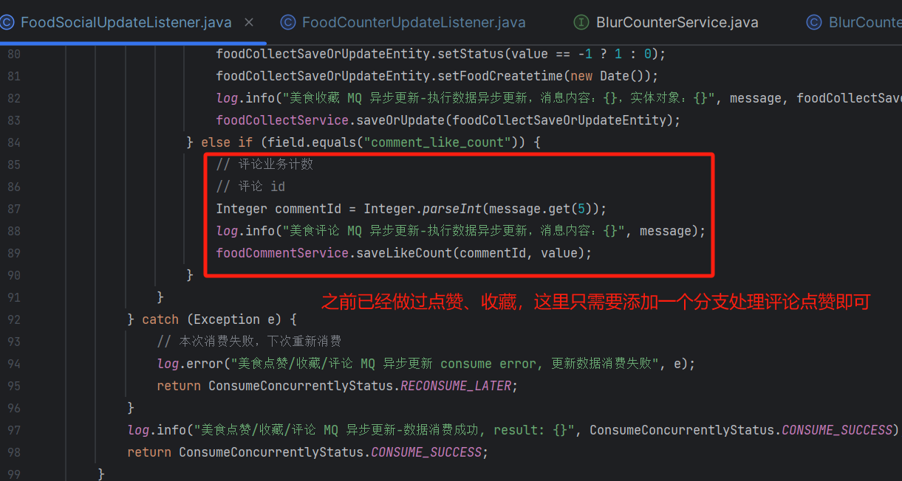

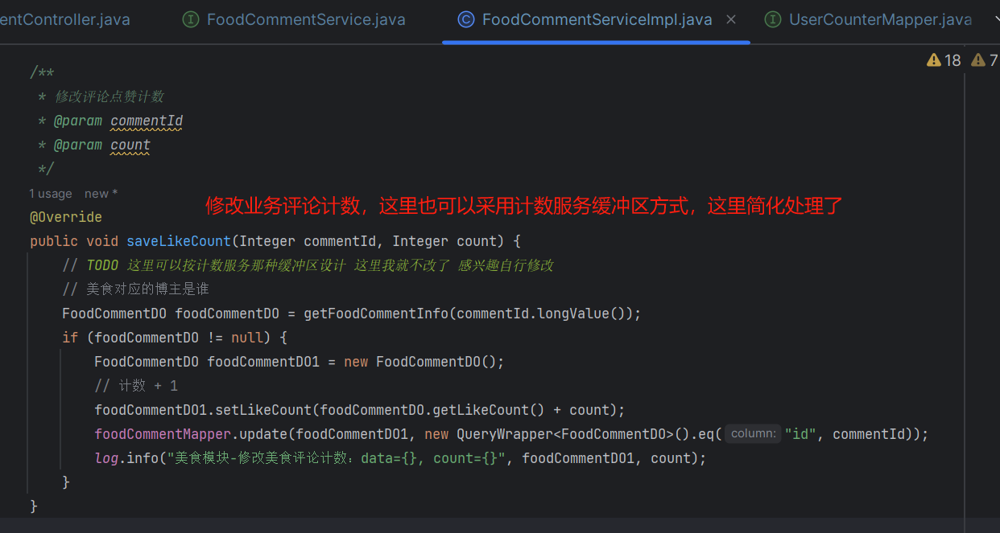

### **4.4.3 计数服务消费者**

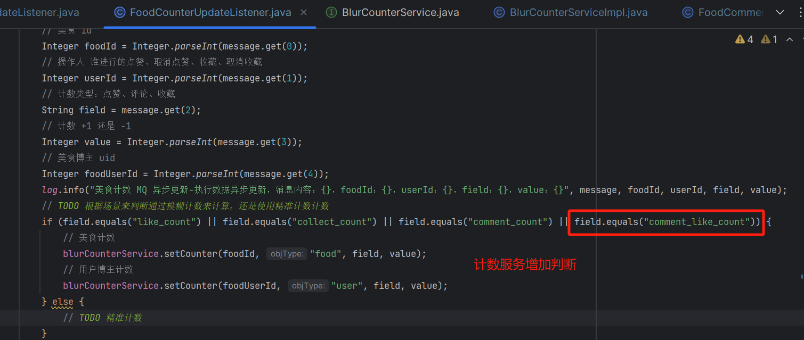

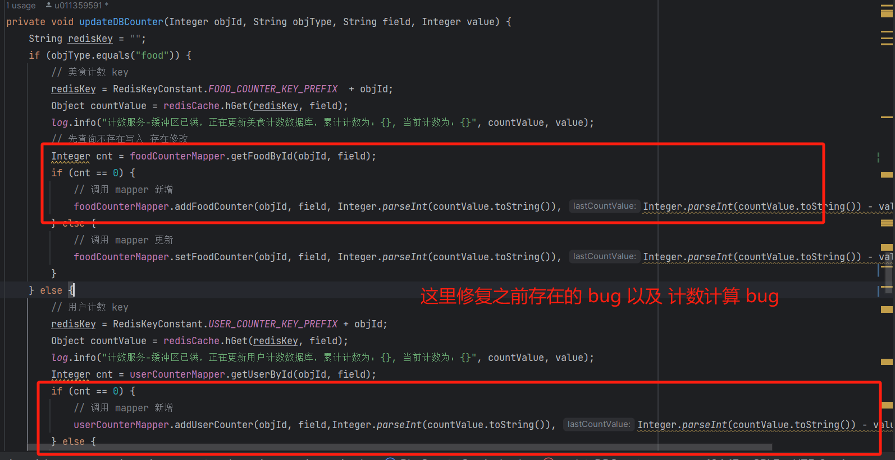

### **4.4.4 执行结果**

先来看下「**新增评论点赞**」，日志如下：

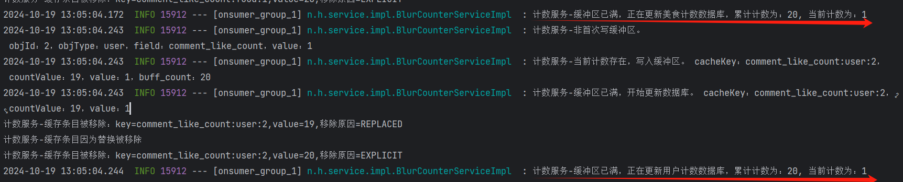

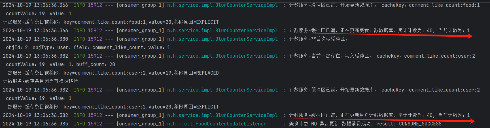

数据库执行结果如下：

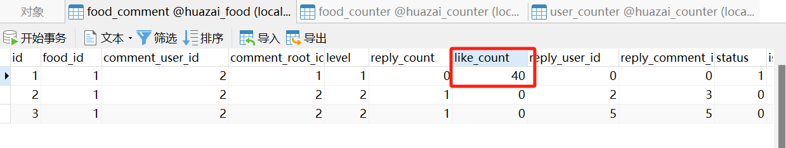

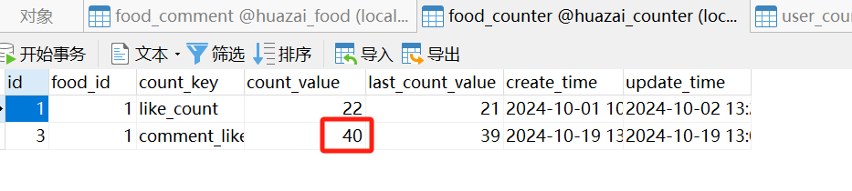

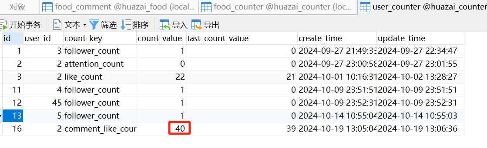

Redis 执行结果如下：

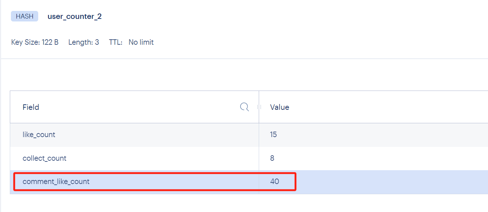

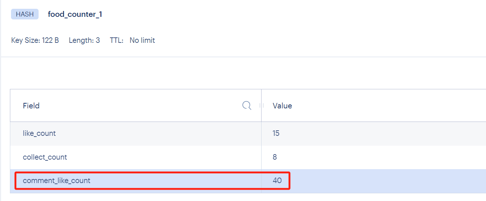

接着来看下「**取消评论点赞**」，日志如下：

  
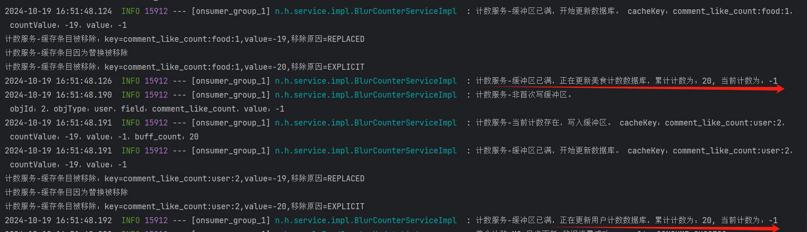

数据库执行结果如下：

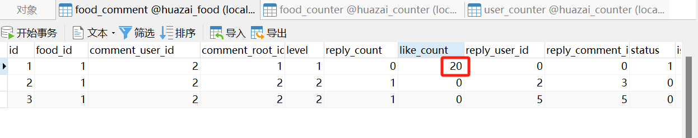

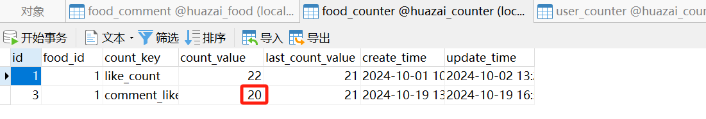

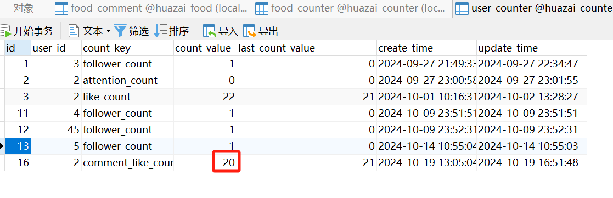

Redis 执行结果如下：

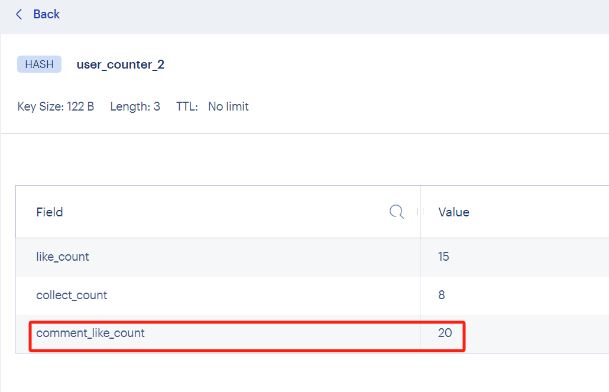

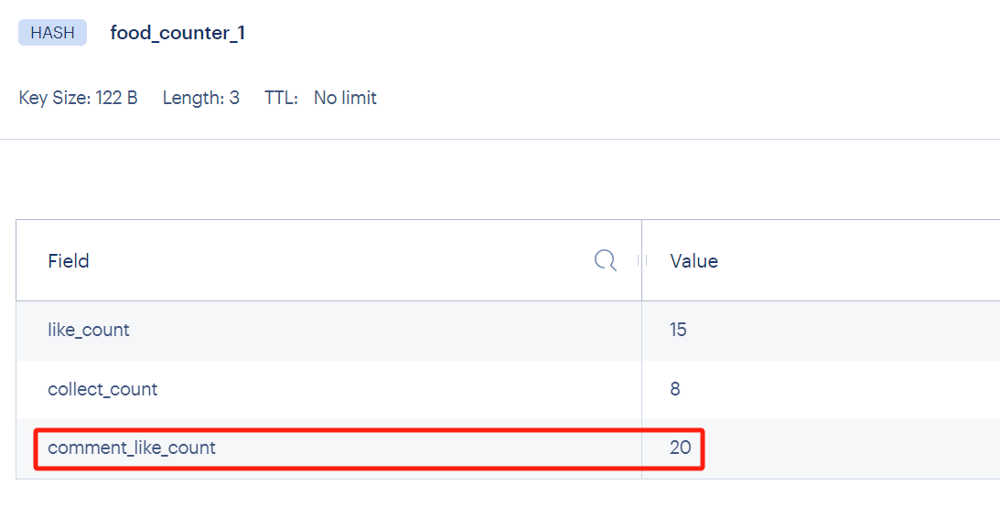