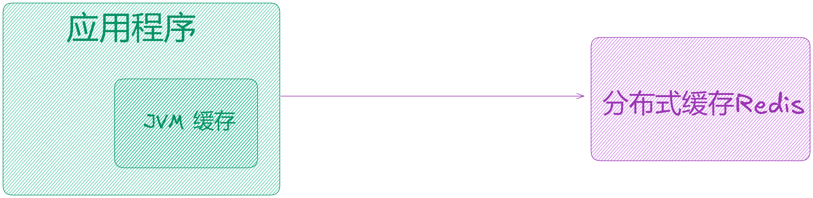
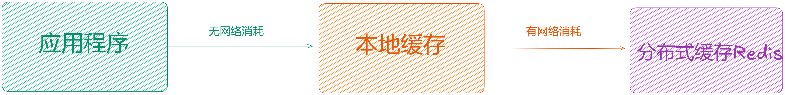
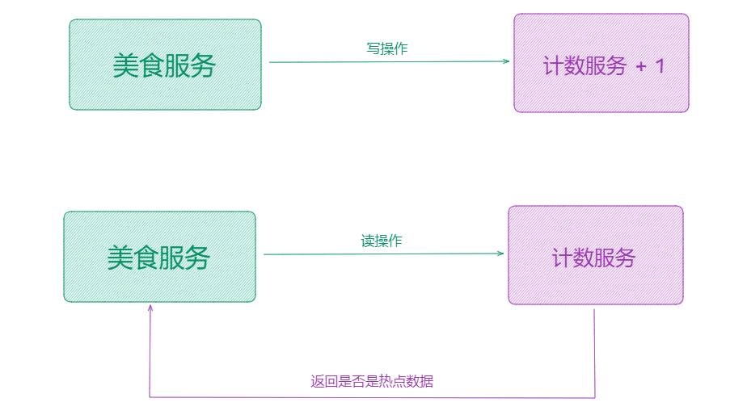
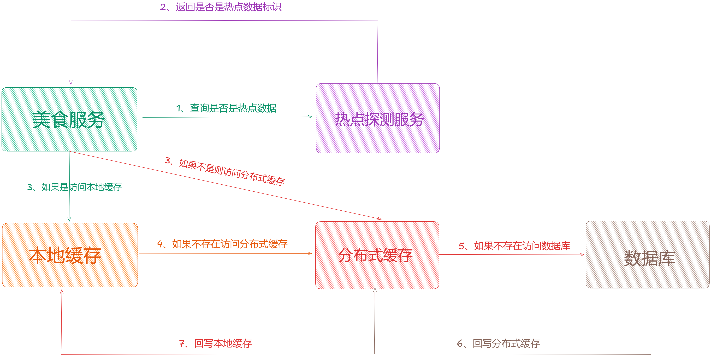
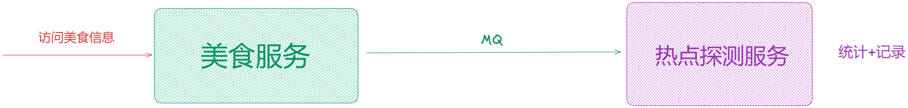
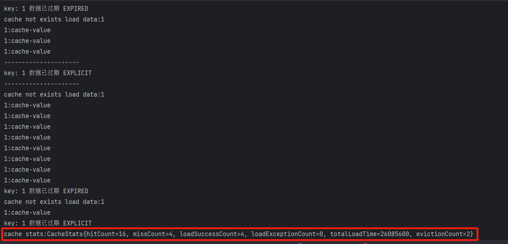
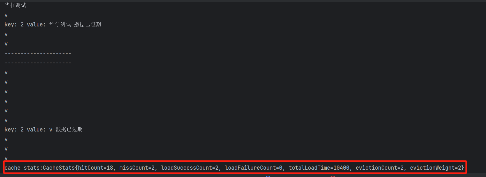
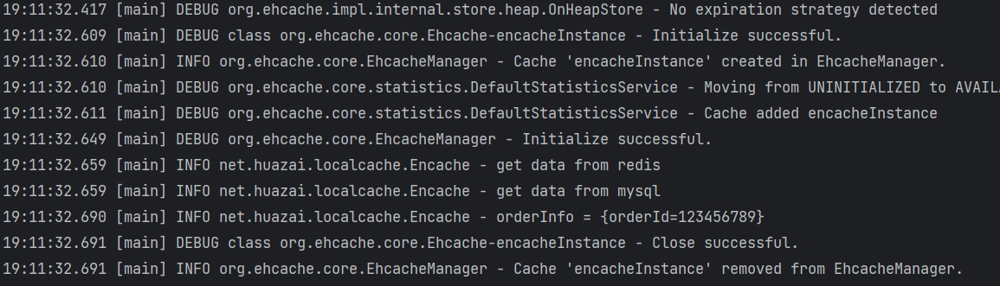
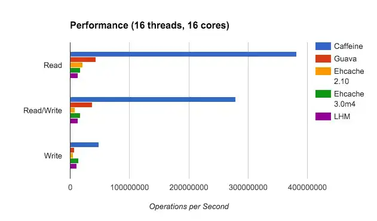

大家好，我是**华仔**, 又跟大家见面了。

从今天之后的一段时间内，华仔会带着大家一起从零开始搭建并研发一套高并发的电商实战项目，这里会涉及到很多互联网大厂开发过程中所使用的核心技术和架构设计模式，希望大家学完之后可以用到自己的简历中。

接下来我们会重点架构设计和开发一下「**社交系统**」中的重要服务：「**关注服务**」、「**计数服务**」、「**评论服务**」。

这是第二十二篇，本篇我们继续进行电商实战项目设计与开发，本篇主要对「**电商项目**」引入多级缓存解决方案。

文章汇总位置：[https://wx.zsxq.com/dweb2/index/columns/51122554151214](https://wx.zsxq.com/dweb2/index/columns/51122554151214)

源码授权与获取地址：[https://articles.zsxq.com/id\_1s85grnaae4p.html](https://articles.zsxq.com/id_1s85grnaae4p.html)

本章源码地址：[https://gitcode.net/u011359591/huazai-ecshop/-/tree/ecshop-chapter-22](https://gitcode.net/u011359591/huazai-ecshop/-/tree/ecshop-chapter-22)

## **01 前言**

终于要设计与研发电商项目代码了，今天我们要对「**电商项目**」引入多级缓存解决方案。

这里需要注意下，我们整个项目目前是不提供前端的，这个后续有时间在搞，主要是进行后端接口以及微服务模块架构设计。

## **02 多级缓存实战**

在实际业务开发当中，大部分都会选择使用 Redis 当「**分布式缓存**」，当然对于大型项目当中，我们还会使用「**本地缓存**」来做一个「**两级缓存**」架构。

##   
**2.1 为什么需要两级缓存**

正常情况下，如果不使用「**本地缓存**」，需要直接调用「**分布式缓存**」，调用链路如下：

调用 Redis 就会涉及到「**网络调用**」，这样就会出现「**性能损耗**」，虽然可以使用「**批量获取**」或者 「**Pipeline**」方式。

所以一般在「**大型分布式项目**」中需要使用「**本地缓存**」，所以此时的调用链路如下：

### **2.1.1 使用本地缓存优点**

1.  无网络请求调用，可以提高性能。
2.  在分布式系统中，天然的分布式缓存。
3.  减少远程缓存 Redis 的读压力。

### **2.1.2 使用本地缓存缺点**

1.  进程空间大小有限，无法支持大数据量存储。
2.  重启程序丢失数据。
3.  分布式场景下，跟分布式 Redis 缓存数据可能会存在不一致。

###   
**2.1.3 针对以上问题解决方案**

### **问题一：进程空间大小有限，无法支持大数据量存储**

一般在项目开发中，我们只需要把「**最热的数据**」存储在「**本地缓存**」中，这样就可以有效的解决「**本地缓存**」大小受限的问题。

### **问题二：重启程序丢失数据**

这个问题无法解决，不过我们可以在重启项目的时候，从「**分布式缓存**」| 「**数据库**」中重新把「**最热的数据**」缓存在「**本地缓存**」中。

### **问题三：本地缓存与分布式缓存数据不一致**

如果要解决这个问题，我们只需要保证其「**最终一致性**」即可。

比如：本地缓存可以把「**过期时间**」过期时间设置的短一些，比如设置「**几秒过期时间**」，过期之后再访问「**分布式缓存**」| 「**数据库**」重新保存到「**本地缓存**」当中，达到数据的「**最终一致性**」。

##   
**2.2 如何判断哪些数据是热点数据**

通常我们可以使用「**计数**」的方式来判断一个数据是否是「**热点数据**」，如果自己实现一套简单的可以采用。

这里我们拿「**美食服务**」举例：

如上图所示：可以用单独的「**计数服务**」来统计数据，比如一个美食笔记访问到了一定数量了就判断它是「**热点数据**」，此时当再读取这个美食笔记的时候，我们先读取「**计数服务**」来判断这个数据是否是「**热点数据**」，如果是就返回是，否则返回否，如果是「**热点数据**」，先读取「**本地缓存**」，如果「**本地缓存**」中没有，就读取「**分布式缓存**」，然后回写到「**本地缓存**」中。

伪代码如下：

int exist \= 0

if(判断该数据是否是热点数据){

// 如果是读取本地缓存

if(本地缓存存在){

return 数据;

}

//如果不存在，修改参数

exist = 1;

}

//该数据不是热点数据，则查询分布式缓存

redis.get();

if(redis.get() == null){

// 查询数据库

// 保存在本地缓存中

}

if(exist == 1){

// 保存在本地缓存中，设置过期时间

}

return 数据;

目前主流的做法是：通过「**滑动窗口**」算法来解决，包括开源的「**热点探测框架**」[JD-hotkey](http://jd-hotkey/) 也是使用「**滑动窗口**」来进行判断的，下篇我们来深度介绍这个工具。

此时我们读操作流程图如下：

此时我们写操作流程图如下：

## **2.3 本地缓存如何选择与使用**

对于 Java 来说，本地缓存常用的分为三种：

1.  Guava Cache。
2.  Caffeine。
3.  Encache。

我们分别来介绍下。

### **2.3.1 Guava Cache**

[Guava Cache](https://github.com/google/guava) 是 Google 团队开源的一款 Java 核心增强库，包含「**集合**」、「**并发原语**」、「**缓存**」、「**I/O**」、「**反射**」等工具箱，性能和稳定性上都有保障，应用十分广泛。

[Guava Cache](https://github.com/google/guava) 支持很多特性：

1.  支持最大容量限制。
2.  支持两种过期删除策略（插入时间和访问时间）。
3.  支持简单的统计功能。
4.  基于 LRU 算法实现。

[Guava Cache](https://github.com/google/guava) 的使用非常简单，首先需要引入 maven 依赖包：

<!-- guava cache 最新稳定版-->

<dependency>

<groupId>com.google.guava</groupId>

<artifactId>guava</artifactId>

<version>29.0\-jre</version>

</dependency>

示例代码：

package net.huazai.localcache;

import com.google.common.cache.\*;

import java.util.ArrayList;

import java.util.concurrent.ExecutionException;

import java.util.concurrent.TimeUnit;

/\*\*

\* @className: GuavaCache

\* @author: huazai，该项目是知识星球：华仔和他的朋友们 的内部项目

\* @date: 2024-09-18 15:56

\* @Version: 1.0

\* @description: GuavaCache 本地缓存

\*/

public class GuavaCache {

public static void main(String\[\] args) throws ExecutionException, InterruptedException {

LoadingCache<Integer, String> cache = CacheBuilder.newBuilder()

// 设置并发级别为 8，并发级别是指可以同时写缓存的线程数

.concurrencyLevel(8)

// 设置缓存的初始容量为 10

.initialCapacity(10)

// 设置缓存最大容量为 100，超过 100 之后就会按照 LRU 最近最少使用算法来移除缓存

.maximumSize(100)

// 设置写缓存后 8 秒钟过期

.expireAfterWrite(8, TimeUnit.SECONDS)

// 设置要统计的缓存命中率

.recordStats()

// 设置缓存移除通知，当缓存过期后会调用该方法进行打印

.removalListener(new RemovalListener<Object, Object>() {

public void onRemoval(RemovalNotification<Object, Object> notification) {

// 打印日志

System.out.println("key: " + notification.getKey() + " 数据已过期 " + notification.getCause());

}

})

// build 方法可以指定 CacheLoader，在缓存不存在时通过 CacheLoader 的实现自动加载缓存

.build(

new CacheLoader<Integer, String>() {

@Override

public String load(Integer s) throws Exception {

// 打印日志

System.out.println("cache not exists load data:"\+ s);

String str \= s + ":cache-value";

return str;

}

}

);

// 循环打印

for (int i \= 0; i < 20; i++){

// 获取缓存

String str \= cache.get(1);

// 挨个打印

System.out.println(str);

// 休眠一秒

TimeUnit.SECONDS.sleep(1);

if (i == 10) {

System.out.println("---------------------");

// 调用主动删除，将某个 key 的缓存直接删除，会调用 removalListener

cache.invalidate(1);

System.out.println("---------------------");

}

}

cache.put(2, "华仔测试");

// 将某个 key 的缓存直接删除，会调用 removalListener

cache.invalidate(1);

// 将一批 key 的缓存直接删除，会调用 removalListener

cache.invalidateAll(new ArrayList<>());

// 删除所有缓存数据

cache.invalidateAll();

// 打印缓存的命中率情况

System.out.println("cache stats:" + cache.stats().toString());

}

}

测试结果如下：

总体来说，[Guava Cache](http://guava%20cache/) 是一款十分优异的缓存工具，功能丰富、线程安全、足以满足工程化使用，实际上 [springboot](http://springboot%20/) 对 [guava](http://guava%20/) 也有支持，利用配置文件或者注解可以轻松集成到代码中。

### **2.3.2 Caffeine Cache**

[Caffeine](https://github.com/ben-manes/caffeine) 是基于 JDK8 实现的新一代本地缓存工具，缓存性能接近理论最优，提供了几乎完美的命中率。

它有点类似 JDK 中的 [ConcurrentMap](http://concurrentmap/)，实际上，[Caffeine](http://caffeine/) 中的 [LocalCache](http://localcache/) 接口就是实现了 JDK 中的[ConcurrentMap](http://concurrentmap/) 接口，但两者并不完全一样。最根本的区别就是，[ConcurrentMap](http://concurrentmap/) 保存所有添加的元素，除非显示删除之（比如调用 remove 方法）。而本地缓存一般会配置自动剔除策略，为了保护应用程序，限制内存占用情况，防止内存溢出。

可以看作是 [Guava Cache](http://guava%20cache/) 的增强版，功能上两者类似，不同的是 [Caffeine](http://caffeine/) 采用了一种结合 [LRU](http://lru/)、[LFU](http://lfu/) 优点的算法：[W-TinyLFU](http://w-tinylfu/)，在性能上有明显的优越性。

[Caffeine](https://github.com/ben-manes/caffeine) 的使用非常简单，首先需要引入 maven 依赖包：

<!-- caffeine cache 最新稳定版-->

<dependency>

<groupId>com.github.ben-manes.caffeine</groupId>

<artifactId>caffeine</artifactId>

</dependency>

示例代码：

package net.huazai.localcache;

import com.github.benmanes.caffeine.cache.\*;

import java.util.ArrayList;

import java.util.concurrent.TimeUnit;

import java.util.function.Function;

/\*\*

\* @className: CaffeineCache

\* @author: huazai，该项目是知识星球：华仔和他的朋友们 的内部项目

\* @date: 2024-09-18 16:14

\* @Version: 1.0

\* @description: CaffeineCache 本地缓存

\*/

public class CaffeineCache {

public static void main(String\[\] args) throws InterruptedException {

Cache<Integer, String> cache = Caffeine.newBuilder()

// 设置缓存的初始容量为 10

.initialCapacity(10)

// 设置缓存最大容量为 100，超过 100 之后就会按照LRU最近最少使用算法来移除缓存

.maximumSize(100)

// 设置写缓存后 8 秒钟过期

.expireAfterWrite(8, TimeUnit.SECONDS)

// 设置要统计的缓存命中率

.recordStats()

// 设置缓存移除通知

.removalListener((Integer key, String value, RemovalCause cause) -> {

// 打印日志

System.out.println("key: " + key + " value: " + value + " 数据已过期");

})

// build 方法可以指定 CacheLoader，在缓存不存在时通过 CacheLoader 的实现自动加载缓存

.build(k -> setValue(1).apply(1));

Integer key \= 2;

cache.put(2 , "华仔测试");

// 循环打印

for (int i \= 0; i < 20; i++) {

// 获取缓存

// String str = cache.getIfPresent(1);

String str \= cache.get(key, CaffeineCache::getValueFromDB);

// 挨个打印

System.out.println(str);

// 休眠一秒

TimeUnit.SECONDS.sleep(1);

if (i == 10) {

System.out.println("---------------------");

// 调用主动删除，将某个 key 的缓存直接删除，会调用 removalListener

cache.invalidate(1);

System.out.println("---------------------");

}

}

// 将某个 key 的缓存直接删除，会调用 removalListener

cache.invalidate(1);

// 将一批 key 的缓存直接删除，会调用 removalListener

cache.invalidateAll(new ArrayList<>());

// 删除所有缓存数据

cache.invalidateAll();

// 打印缓存的命中率情况

System.out.println("cache stats:" + cache.stats().toString());

}

public static Function<Integer, String> setValue(Integer key){

return t -> key + "value";

}

private static String getValueFromDB(Integer key) {

return "v";

}

}

测试效果：

相比 [Guava Cache](http://guava%20cache/) 来说，[Caffeine](http://caffeine/) 无论从功能上和性能上都有明显优势。同时两者的 API 类似，使用 [Guava Cache](http://guava%20cache/) 的代码很容易可以切换到 [Caffeine](http://caffeine/)，节省迁移成本。

需要注意的是，[SpringFramework5.0（SpringBoot2.0）](http://springframework5.0\(springboot2.0\)/)同样放弃了 [Guava Cache](http://guava%20cache/) 的本地缓存方案，转而使用[Caffeine](http://caffeine/)。

### **2.3.3 Encache**

[Encache](http://encache/) 是一个纯 Java 的进程内缓存框架，具有快速、精干等特点，是 [Hibernate](http://hibernate/) 中默认的 [CacheProvider](http://cacheprovider/)。同[Caffeine](http://caffeine/) 和 [Guava Cache](http://guava%20cache/) 相比，[Encache](http://encache/) 的功能更加丰富，扩展性更强：

1.  支持多种缓存淘汰算法，包括 LRU、LFU 和 FIFO。
2.  缓存支持堆内存储、堆外存储、磁盘存储（支持持久化）三种。
3.  支持多种集群方案，解决数据共享问题。

[Encache](http://encache/) 的使用非常简单，首先需要引入 maven 依赖包：

<dependency>

<groupId>org.ehcache</groupId>

<artifactId>ehcache</artifactId>

<version>3.8.0</version>

</dependency>

示例代码：

package net.huazai.localcache;

import lombok.extern.slf4j.Slf4j;

import org.apache.commons.lang3.StringUtils;

import org.ehcache.Cache;

import org.ehcache.CacheManager;

import org.ehcache.config.builders.CacheConfigurationBuilder;

import org.ehcache.config.builders.CacheManagerBuilder;

import org.ehcache.config.builders.ResourcePoolsBuilder;

/\*\*

\* @className: Encache

\* @author: huazai，该项目是知识星球：华仔和他的朋友们 的内部项目

\* @date: 2024-09-18 18:46

\* @Version: 1.0

\* @description: Encache 本地缓存

\*/

@Slf4j

public class Encache {

public static void main(String\[\] args) throws Exception {

// 声明一个cacheBuilder

CacheManager cacheManager \= CacheManagerBuilder.newCacheManagerBuilder()

.withCache("encacheInstance", CacheConfigurationBuilder

// 声明一个容量为 20 的堆内缓存

.newCacheConfigurationBuilder(String.class,String.class, ResourcePoolsBuilder.heap(20)))

.build(true);

// 获取 Cache 实例

Cache<String,String> myCache = cacheManager.getCache("encacheInstance", String.class, String.class);

String orderId \= String.valueOf(123456789);

String orderInfo \= myCache.get(orderId);

if (StringUtils.isBlank(orderInfo)) {

orderInfo = getInfo(orderId);

myCache.put(orderId, orderInfo);

}

log.info("orderInfo = {}", orderInfo);

cacheManager.close();

}

private static String getInfo(String orderId) {

String info \= "";

// 先查询redis缓存

log.info("get data from redis");

// 当redis缓存不存在查db

log.info("get data from mysql");

info = String.format("{orderId=%s}", orderId);

return info;

}

}

测试结果：

### **2.3.4 对比**

1.  从易用性角度，[Guava Cache](http://guava%20cache/)、[Caffeine](http://caffeine%20/) 和 [Encache](http://encache%20/) 都有十分成熟的接入方案，使用简单。
2.  从功能性角度，[Guava Cache](http://guava%20cache/) 和 [Caffeine](http://caffeine%20/) 功能类似，都是只支持堆内缓存，Encache 相比功能更为丰富。
3.  从性能上进行比较，[Caffeine](http://caffeine%20/) 最优、[GuavaCache](http://guavacache/) 次之，[Encache](http://encache%20/) 最差 (下图是三者的性能对比结果）。

总体来说，对于本地缓存的方案中，个人比较推荐 [Caffeine](http://caffeine/)，性能上遥遥领先。

真实的业务工程中，建议使用 [Caffeine](http://caffeine/) 作为本地缓存，另外使用 [Redis](http://redis/) 作为分布式缓存，构造「**多级缓存**」体系，保证性能和可靠性。