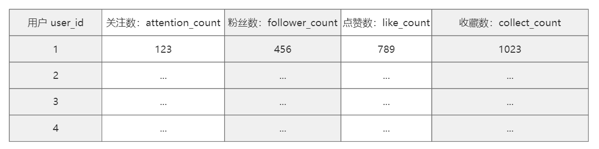
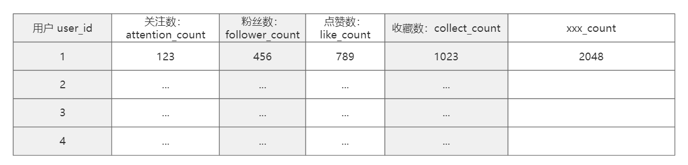
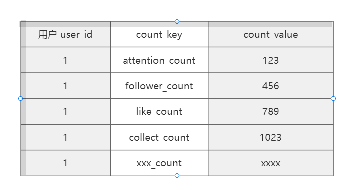
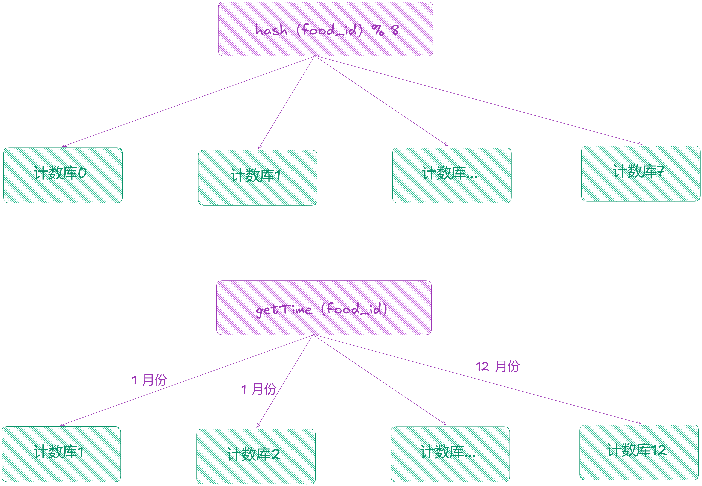
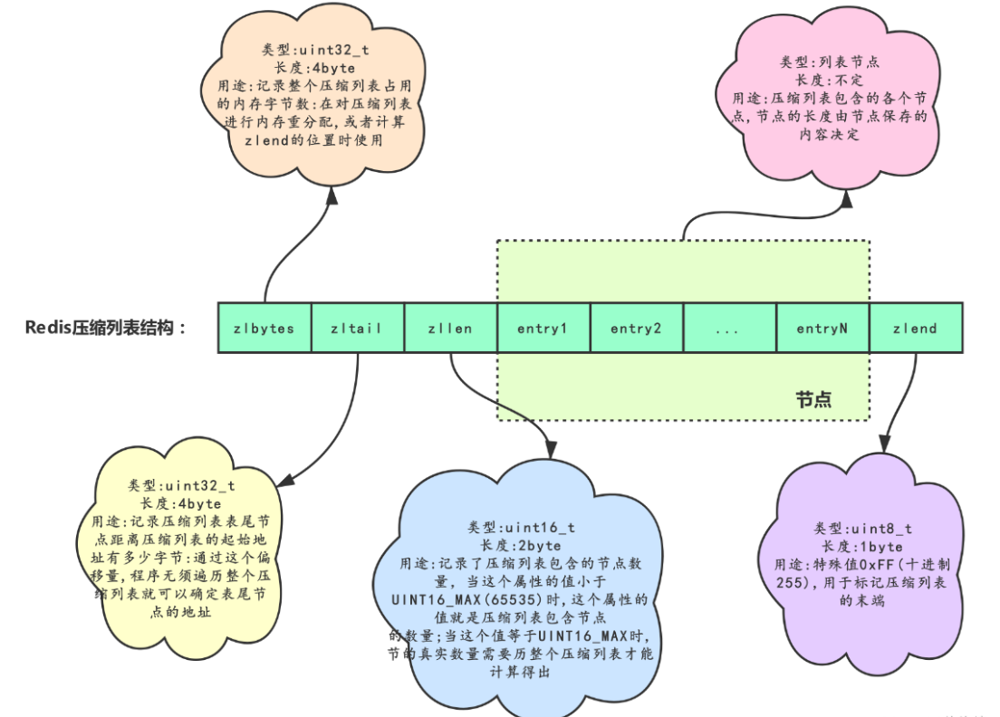

大家好，我是**华仔**, 又跟大家见面了。

从今天之后的一段时间内，华仔会带着大家一起从零开始搭建并研发一套高并发的电商实战项目，这里会涉及到很多互联网大厂开发过程中所使用的核心技术和架构设计模式，希望大家学完之后可以用到自己的简历中。

接下来我们会重点架构设计和开发一下「**社交系统**」中的重要服务：「**关注服务**」、「**计数服务**」、「**评论服务**」。

这是第二十五篇，本篇我们继续进行电商实战项目设计与开发，本篇对「**计数服务**」场景介绍与架构设计。

文章汇总位置：[https://wx.zsxq.com/dweb2/index/columns/51122554151214](https://wx.zsxq.com/dweb2/index/columns/51122554151214)

源码授权与获取地址：[https://articles.zsxq.com/id\_1s85grnaae4p.html](https://articles.zsxq.com/id_1s85grnaae4p.html)

本章源码地址：[https://gitcode.net/u011359591/huazai-ecshop/-/tree/ecshop-chapter-25](https://gitcode.net/u011359591/huazai-ecshop/-/tree/ecshop-chapter-25)

## **01 前言**

终于要设计与研发电商项目代码了，今天我们主要对「**计数服务**」计数服务场景介绍与架构设计。

这里需要注意下，我们整个项目目前是不提供前端的，这个后续有时间在搞，主要是进行后端接口以及微服务模块架构设计。

## **02 计数服务社交场景介绍**

这里我们主要是以「**小红书**」为例，来看看其「**计数服务**」都有哪些功能。

## **2.1 计数服务功能梳理**

下图是小红书中某美食博主的主页计数展示如下：

### **2.1.1 用户维度的计数展示**

  

### **2.1.2 作品维度的计数展示**

### **2.1.3 作品评论列表维度的计数展示**

综上得出主要功能有：

1.  用户主页：有「**关注数**」、「**粉丝数**」、「**获赞与收藏数**」等。
2.  用户发布的每个作品：有「**点赞数**」、「**收藏数**」、「**评论数**」等。
3.  作品评论列表中的每条评论：有「**点赞数**」等。

其中 2、3 属于「**作品维度**」的计数，评论也可以认为是一种作品，在某种程度上反映了一个作品的受欢迎程度。而 1 属于「**用户维度**」的计数，可以直观的展示用户的活跃度与影响力。

## **2.2 计数服务业务特点**

1.  读请求量巨大：无论是「**作品维度**」的计数，还是「**用户维度**」的计数，都有较大的访问量。对于性能的要求高，小红书日活用户超过 1 亿，月活用户接近 3 亿，核心服务比如「**首页 Feed 流**」访问量级到达每秒十几万次，「**计数系统**」的访问量级也超过了每秒几十万级别，而且在性能方面，计数的展示需要支持高并发读取且要求毫秒级别返回结果。
2.  写请求量巨大：对于「**点赞**」、「**评论**」、「**转发**」、「**收藏**」等这些场景，由于用户触发动作的成本很低，各类计数会以较高的「**并发量**」增加，所以对计数的增加需要支持「**高并发**」写入。
3.  数据量巨大：小红书系统中「**作品条目**」的数量至少百亿甚至千亿级别，仅仅计算笔记的「**点赞**」、「**评论**」、「**转发**」、「**收藏**」等核心计数，其数据量级就已经在几千亿的级别。因此「**作品维度**」上的计数量级差不多已经过了万亿级别。除此之外，小红书的月活用户量级已经 3 亿，「**用户维度**」的计数量级相比「**作品维度**」来说虽然相差很大，但是也达到了百亿级别。所以如何存储这些数字，是一个很大的挑战。
4.  对数据的精准性要求高：一般来说，用户对于各类计数的统计是非常敏感的，比如你直播或者发布笔记都好几个月了，才涨粉 1000。突然有一天粉丝少了几百个，你是不是就炸锅了。
5.  另外对数据的精准性要求会随着计数的增加成反比：例如，当「**点赞数**」少于一定的数量时，用户会非常在意「**点赞数**」并查看有哪些人为他点赞了。但是当「**点赞数**」已经达到或万级别时，用户对「**点赞数**」的关注会变得没那么在意，不会再关注「**点赞数**」个位数的增加情况，而是更关注「**点赞数**」的级别跃迁，如「**点赞数**」从 1000 个增加到 5000 个。因此大部分用户产品也是按照这样的数据规律来做设计的，在计数达到一定的级别后会改为「**模糊化计数**」，也就是计数越大，对数据的精确性要求会越低。

综上：这是⼀个典型的社交类系统，其特性主要有：「**大数据量**」、「**高访问量**」、「**非均匀性**」。

##   
**03 计数服务架构设计**

针对上面我们分析的关于「**计数服务**」的业务特点，我们来设计下「**计数服务**」。

##   
**3.1 数据库设计演进**

首先来看下「**计数服务**」的数据库设计，在「**计数服务**」之前，我们统计计数都是在其他各个服务中，现在我们要抽离并实现一个通用的「**计数服务**」，该如何设计？

1.  用户 uid 维度的计数：用户的「**关注数**」、「**粉丝数**」、「**获赞与收藏数**」等计数。
2.  作品 food 维度的计数：作品的「**点赞数**」、「**收藏数**」、「**评论数**」等的计数。

### **3.1.1 数据库初版**

这里抽象出两个表，针对这两个维度来进行计数的存储，如下：

CREATE TABLE \`user\_counter\` (

\`id\` int NOT NULL AUTO\_INCREMENT COMMENT '主键id',

\`user\_id\` bigint NOT NULL DEFAULT '0' COMMENT '用户id',

\`attention\_count\` int NOT NULL DEFAULT '0' COMMENT '关注数',

\`follower\_count\` int NOT NULL DEFAULT '0' COMMENT '粉丝数',

\`like\_count\` int NOT NULL DEFAULT '0' COMMENT '点赞数',

\`collect\_count\` int NOT NULL DEFAULT '0' COMMENT '收藏数',

PRIMARY KEY (\`id\`),

UNIQUE KEY \`uid\` (\`user\_id\`) USING BTREE

) ENGINE\=InnoDB AUTO\_INCREMENT\=1 DEFAULT CHARSET\=utf8mb4 COLLATE=utf8mb4\_general\_ci COMMENT\='用户维度计数表';

CREATE TABLE \`food\_counter\` (

\`id\` int NOT NULL AUTO\_INCREMENT COMMENT '主键',

\`food\_id\` bigint NOT NULL COMMENT '美食笔记id',

\`like\_count\` int NOT NULL COMMENT '点赞数',

\`comment\_count\` int NOT NULL COMMENT '评论数',

\`collect\_count\` int NOT NULL COMMENT '收藏数',

PRIMARY KEY (\`id\`),

UNIQUE KEY \`fid\` (\`food\_id\`) USING BTREE

) ENGINE\=InnoDB DEFAULT CHARSET\=utf8mb4 COLLATE=utf8mb4\_general\_ci COMMENT\='作品维度的计数表';

当然也可以抽象为一张表搞定所有的计数，即通过 type 来判断，id 究竟是 uid 还是 food\_id，但并不建议这么做。

### **3.1.2 数据库扩展设计与优化**

考虑完查询效率外，架构设计上还需要考虑「**扩展性**」，除了上面的计数外，如果后续随着业务的不断变化，新增一个计数，该怎么办呢？

之前的数据库结构如下：

  

这种设计是通过列来进行计数的存储，如果增加一个 XX 计数，数据库的表结构要变更为：

这种设计有什么弊端呢？就是在数据量很大的情况下，「**频繁变更数据库 schema 的结构显然是不可取的**」，有没有扩展性更好的方式呢？

其实除了「**扩展列**」之外还可以通过「**扩展行**」来扩展属性，那么我们可以设置成如下，如果需要新增一个计数XXX\_count，只需要增加一行即可，而不需要变更表结构：

### **3.1.3 数据库终版**

CREATE TABLE \`user\_counter\` (

\`id\` int NOT NULL AUTO\_INCREMENT COMMENT '主键id',

\`user\_id\` bigint NOT NULL DEFAULT '0' COMMENT '用户id',

\`count\_key\` varchar(32) COLLATE utf8mb4\_general\_ci NOT NULL DEFAULT '0' COMMENT '关注数：attention\_count，粉丝数：follower\_count，点赞数：like\_count，收藏数：collect\_count',

\`count\_value\` int NOT NULL DEFAULT '0' COMMENT '对应 count\_key 计数',

PRIMARY KEY (\`id\`),

UNIQUE KEY \`uid\` (\`user\_id\`) USING BTREE

) ENGINE\=InnoDB DEFAULT CHARSET\=utf8mb4 COLLATE=utf8mb4\_general\_ci COMMENT\='用户维度计数表';

CREATE TABLE \`food\_counter\` (

\`id\` int NOT NULL AUTO\_INCREMENT COMMENT '主键',

\`food\_id\` bigint NOT NULL COMMENT '美食笔记id',

\`count\_key\` varchar(32) COLLATE utf8mb4\_general\_ci NOT NULL COMMENT '点赞数：like\_count，评论数：comment\_count，收藏数：collect\_count',

\`count\_value\` int NOT NULL COMMENT '对应 count\_key 计数',

PRIMARY KEY (\`id\`),

UNIQUE KEY \`fid\` (\`food\_id\`) USING BTREE

) ENGINE=InnoDB DEFAULT CHARSET=utf8mb4 COLLATE\=utf8mb4\_general\_ci COMMENT='作品维度的计数表';

### **3.1.4 分库分表方案**

后面随着小红书的不断壮大，之前的计数系统面临了很多的问题和挑战。

比如小红书的用户量和发布的笔记量增长迅猛，计数存储数据量级也飞速增长，而 MySQL 数据库单表的存储量级达到几千万的时候，性能上就会有损耗。所以后面我们会考虑使用「**分库分表**」的方式分散数据量，提升读取计数的性能。

拿「**作品维度**」计数来说，我们可以用“food\_id”作为分区键，在选择「**分库分表**」的方式时，考虑了下面两种：

1.  选择一种哈希算法对 food\_id 计算哈希值，然后依据这个哈希值计算出需要存储到哪一个库哪一张表中。
2.  按照 food\_id 生成的时间来做分库分表，ID 的生成最好带有业务意义的字段，比如生成 ID 的时间戳。所以在分库分表的时候，可以先依据发号器的算法反解出时间戳，然后按照时间戳来做分库分表，比如，一天一张表或者一个月一张表等等。

因为越是最近发布的笔记，计数数据的访问量就越大，虽然考虑了两种方案，但是按照「**时间**」来「**分库分表**」会造成数据访问的不均匀，最后还是采用「**哈希**」的方式来做「**分库分表**」。

  

后续待实战项目正式引入「**分库分表**」，我们再来详细设计，这里只是给出方案。

## **3.2 缓存设计演进**

我们都知道，在 Redis 中支持 5 种数据类型，分别是：String、List、Set、Hash、ZSet。

从直观来看，我们可以使用 String 类型来存储。

### **3.2.1 String 类型存储**

Redis String 对象支持保存「**整数**」、「**浮点数**」、「**字符串**」。如果使用「**整数**」存储的话，Redis 底层是以「**整数**」编码的形式来存储的，且支持「**INCRBY**」命令和 「**DECRBY**」命令来自增或者自减。

这里我们拿「**作品维度**」计数举例，我们可以使用 3 个 String 对象来保存一个作品的计数。

1.  点赞数：[{food\_id}\_like\_counter](http://{food_id}_like_counter/)
2.  评论数：[{food\_id}\_comment\_counter](http://{food_id}_comment_counter/)
3.  收藏数：[{food\_id}\_collect\_counter](http://{food_id}_collect_counter/)

比如点赞/取消点赞时，计数服务会想 Redis 执行 [INCRBY {food\_id}\_like\_counter 1](http://incrby%20{food_id}_like_counter%201/) 、[DECRBY {food\_id}\_like\_counter -1](http://decrby%20{food_id}_like_counter%20-1/)。当读取作品计数时，可以发送批量获取命令 [MGET {food\_id}\_like\_counter {food\_id}\_comment\_counter {food\_id}\_collect\_counter](http://mget%20{food_id}_like_counter%20{food_id}_comment_counter%20{food_id}_collect_counter/)。

是不是很清晰明了，但是这样的设计在「**性能**」和「**资源**」使用上存在比较严重的问题，主要有两点：

1.  在互联网系统中，大部分的 Redis 系统是以「**集群**」方式对外提供服务的，在使用 MGET 命令获取 N 个 key，会启动最多 N 个线程从 Redis 节点上获取数据。当作品有大量的读请求时，Redis 集群会有较大的线程资源开销压力，而且在 N 个线程中只要有一个线程获取数据失败，就会使 MGET 命令整体失败，计数服务的可用性大打折扣。
2.  一个作品需要使用 3 个 Redis String 对象，而对于一个亿级用户应用来说，动辄上百亿的作品，Redis 作为扛并发的利器资源消耗非常大。

###   
**3.2.2 使用 Hash 类型存储**

针对上面剖析的问题，我们可以改为使用 Redis Hash 对象来进行存储计数数据。

首先 Hash 对象可以方便地将某场景下的全部计数数据以 [Hash Field](http://hash%20field/) 的形式汇聚到同一个 Hash Key 下。这里还是以「**作品维度**」的计数为例，Redis Hash Key 为 counter\_{food\_id} ，[Hash Field](http://hash%20field/) 分别被命名为 [comment](http://comment/)、[like](http://like/)、[collect](http://collect/)，它们分别表示「**评论**」、「**点赞**」、「**收藏**」，Value 依次为「**评论数**」、「**点赞数**」、「**收藏数**」。

另外 Hash 对象在 [Key-Value](http://key-value/) 数据量较少的时候更加「**节省内存**」。了解 Redis 底层实现的都知道，当 Hash 对象在存储少于 [512](http://512%20/) 个 [Key-Value](http://key-value/) 对，且 [Key-Value](http://key-value/) 对的总大小不超过 [64](http://0.0.0.64/) 字节时，Redis 底层会采用「**压缩列表**」的编码格式来实现 Hash 对象。

「**压缩列表**」是为 Redis 节约内存而开发的数据结构，通过较为复杂的编码将全部数据压缩到同一段内存中，其本身的冗余空间很少，尽最大可能做到了内存压缩。对于「**作品维度计数**」、「**用户维度计数**」等这种多计数组合的场景，Hash 对象的 Field 也远远不会达到 [512](http://0.0.2.0/) 个，而且计数值 Value 都是 [int64](http://int64/) 类型的，所以恰好会被 Redis 底层编码为压缩列表，大大节约了内存资源。

关于「**压缩列表**」：压缩列表 (Ziplist) 是 Redis 内部用于优化小规模数据存储的一种紧凑数据结构。它设计用于高效地存储包含少量元素的列表、哈希表或有序集合，以减少内存占用和提高性能。

压缩列表是一种连续的内存块，包含多个数据项 (entries)。每个数据项可以是整数或字节数组。整个列表的布局分为以下几个部分：

1.  zlbytes：用 4 个字节存储整个压缩列表占用的字节数。这便于在内存中复制或重新分配时知道需要处理的数据长度。
2.  zltail：用 4 个字节存储列表中最后一个数据项距离列表起始位置的字节偏移量。这使得从列表尾部向前遍历时更为高效。
3.  zllen：用 2 个字节存储列表中的数据项数目。当数据项数目超过 65535 时，zllen 不再准确，仅作为参考。
4.  entries：实际的数据项列表，每个数据项按顺序存储在这里。
5.  zlend：一个特殊的字节 (0xFF) 标志着压缩列表的结束。

具体的实现细节，我们会在 Redis 专栏进行单独剖析，这里了解下即可。

### **3.2.3 定制化 Redis 数据类型**

虽然 Hash 对象底层的「**压缩列表**」已经在内存优化上做到了比较极致的设计，但是在计数服务场景下还是有很大的优化空间的。

具体可以查看：[https://mp.weixin.qq.com/s/ttgDOCdIDxRZ\_LobeRIpUQ](https://mp.weixin.qq.com/s/ttgDOCdIDxRZ_LobeRIpUQ)

## **04 总结**

本篇主要对「**计数服务**」进行了功能介绍和架构设计方案的讨论和优化，下篇我们会来实现基础版的「**计数服务**」功能开发。