从今天之后的一段时间内，华仔会带着大家一起从零开始搭建并研发一套高并发的电商实战项目，这里会涉及到很多互联网大厂开发过程中所使用的核心技术和架构设计模式，希望大家学完之后可以用到自己的简历中。

接下来我们会重点架构设计和开发一下「**社交系统**」中的重要服务：「**关注服务**」、「**计数服务**」、「**评论服务**」。

这是第二十八篇，本篇我们继续进行电商实战项目设计与开发，本篇对「**评论服务**」场景介绍与架构设计。

文章汇总位置：[https://wx.zsxq.com/dweb2/index/columns/51122554151214](https://wx.zsxq.com/dweb2/index/columns/51122554151214)

源码授权与获取地址：[https://articles.zsxq.com/id\_1s85grnaae4p.html](https://articles.zsxq.com/id_1s85grnaae4p.html)

本章源码地址：[https://gitcode.net/u011359591/huazai-ecshop/-/tree/ecshop-chapter-28](https://gitcode.net/u011359591/huazai-ecshop/-/tree/ecshop-chapter-28)

## **01 前言**

终于要设计与研发电商项目代码了，今天我们主要对「**评论服务**」场景介绍与架构设计。

这里需要注意下，我们整个项目目前是不提供前端的，这个后续有时间在搞，主要是进行后端接口以及微服务模块架构设计。

## **02 评论服务社交场景介绍**

这里我们主要是以「**小红书**」为例，来看看其「**评论服务**」都有哪些功能。

## **2.1 评论服务功能梳理**

下图是小红书中某美食博主的作品列表评论计数展示如下：

###   
**2.1.1 作品维度的评论计数展示**

### **2.1.2 作品维度的评论列表展示**

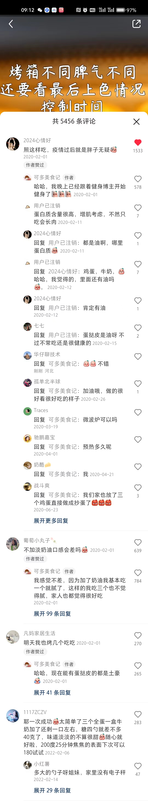

### **2.1.3 作品维度的评论操作**

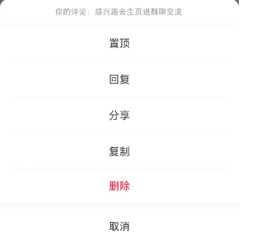

评论功能对于互联网应用是不可或缺的，其重要性在于它可以促进社交互动、用户参与、内容生成，同时还提高了社交产品的流量和活跃度。

另外评论功能是一种通用的功能，主要功能如下：

1.  用户发布的每个作品：有「**点赞数**」、「**收藏数**」、「**评论数**」等计数功能。
2.  作品评论列表：用户点击打开某作品的评论区，可以获取到有限长度为 N 的评论列表，有些产品可能需要评论列表支持多种排序功能，比如：按照热度排序、按照评论时间排序等。
3.  发布评论：用户可以在某作品的评论区发布新评论，也可以对某个评论进行回复。
4.  删除评论：用户可以删除自己在某作品下发布的评论，作者也可以删除评论区中不友好的评论。
5.  点赞、取消点赞评论：用户可以对任何人的评论进行点赞或者取消点赞。
6.  运营评论：作者可以选择将某条评论进行置顶、回复、复制、分享、删除、举报等。审核人员可以根据关键词搜索评论和强行删除评论。

综上得出，评论服务是一个「**读多写多**」的场景，所以我们在架构和设计其功能时需要综合考虑这两点，要做到能支撑「**高并发读**」，也要能支撑「**高并发写**」。

##   
**2.2 评论服务模式梳理**

评论列表功能是整个「**评论服务**」中最重要的场景，其模式直接决定该如何设计「**评论服务**」，这节我们就来讨论一下当下主流的两种评论列表模式。

###   
**2.2.1 二级评论模式**

所谓二级评论模式，就是其评论内容分为两级，将所有对内容的评论都归为「**一级评论**」，而对某一级评论的回复都归为「**二级评论**」。

目前小红书就是这种模式，也是我们「**评论服务**」后续要重点架构和剖析的模式。

  

在这种模式下，可以对内容本身进行评论，也可以对某条评论进行回复。用户在查看「**评论列表**」时，可以相当清晰明了的获取到感兴趣的信息，也能直观的看到其他用户对内容的评论，在阅读到某条有趣的评论时也嫩刚看到其他用户对这条评论的反应。

### **2.2.2 盖楼评论模式**

盖楼模式时由网易创新设计的，在 2004 年就已经退出了盖楼评论功能，该模式可以让阅读评论的用户清楚地了解其他用户在你某个话题下地讨论，方便追踪对方地观点和回复，具有上下文地进模型。

在这种模式下，用户可以快速地找到互动地最新评论并有针对性地回复，互动性非常强。假设 「**用户1**」发布了某评论，然后「**用户2**」回复了「**用户1**」,「**用户3**」回复了 「**用户2**」，「**用户4**」回复了 「**用户3**」，「**用户5**」回复了 「**用户4**」，那么对于 「**用户5**」的回复来说，可以完整的展示评论的上下文。

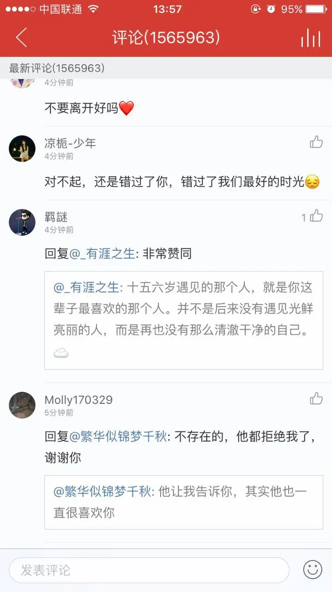

这两种模式分属与不同的业务场景，需要不同的数据建模，下面我们重点来剖析下这两种模式的架构设计。

## **03 评论服务模式架构设计**

由于后续我们重点剖析「**二级评论模式**」，这里我们先来看下「**盖楼评论模式**」服务设计。

##   
**3.1 盖楼评论模式服务设计**

这种模式最大的特点就是可以完整的展示每条评论的完整楼层，评论楼层分为「**初始评论**」和 「**评论回复**」。假设 「**用户1**」发布了某评论，然后「**用户2**」回复了「**用户1**」,「**用户3**」回复了 「**用户2**」，....「**用户100**」回复了 「**用户99**」，那么对于 「**用户100**」的回复来说，「**用户1~用户100**」的评论就组成了一个楼层为 100 的评论列表，可以完整的展示这 100 个用户的评论上下文链路。

###   
**3.1.1 盖楼评论模式数据库设计**

首先，一条评论数据至少要包含：「**评论文本**」、「**发布者**」、「**发布时间**」、「**评论对象**」（对内容的评论、对其他评论的回复）、「**回复了哪个用户**」、「**评论点赞信息**」等。

其中「**评论文本**」表示用户评论了什么，其他信息属于「**评论元数据**」，所谓「**评论元数据**」就是说明评论是谁写的，评论目标是谁、评论间的互动等。

CREATE TABLE \`food\_comment\_floor\_conent\` (

\`id\` bigint NOT NULL AUTO\_INCREMENT,

\`comment\_context\` text COLLATE utf8mb4\_general\_ci NOT NULL COMMENT '评论内容',

\`comment\_createtime\` datetime DEFAULT CURRENT\_TIMESTAMP COMMENT '创建时间',

\`comment\_updatetime\` datetime DEFAULT CURRENT\_TIMESTAMP ON UPDATE CURRENT\_TIMESTAMP COMMENT '更新时间',

PRIMARY KEY (\`id\`)

) ENGINE\=InnoDB DEFAULT CHARSET\=utf8mb4 COLLATE=utf8mb4\_general\_ci COMMENT\='美食盖楼模式评论内容数据表';

CREATE TABLE \`food\_comment\_floor\` (

\`id\` bigint NOT NULL AUTO\_INCREMENT,

\`food\_id\` bigint NOT NULL DEFAULT '0' COMMENT '美食id',

\`comment\_id\` bigint NOT NULL DEFAULT '0' COMMENT '评论id',

\`comment\_user\_id\` bigint NOT NULL DEFAULT '0' COMMENT '评论发布者uid',

\`reply\_user\_id\` bigint NOT NULL DEFAULT '0' COMMENT '如果评论是回复，则给出被回复的用户uid,默认为0',

\`reply\_comment\_id\` bigint NOT NULL DEFAULT '0' COMMENT '如果评论是回复，则给出被回复的评论id,默认为0',

\`status\` tinyint(1) DEFAULT '0' COMMENT '是否删除 0 默认 1 删除评论',

\`is\_top\` tinyint(1) DEFAULT '0' COMMENT '是否置顶 0 默认 1 置顶评论',

\`comment\_createtime\` datetime DEFAULT CURRENT\_TIMESTAMP COMMENT '创建时间',

\`comment\_updatetime\` datetime DEFAULT CURRENT\_TIMESTAMP ON UPDATE CURRENT\_TIMESTAMP COMMENT '更新时间',

PRIMARY KEY (\`id\`),

KEY \`idx\_comment\_list\` (\`food\_id\`,\`comment\_createtime\`) USING BTREE

) ENGINE\=InnoDB AUTO\_INCREMENT\=1 DEFAULT CHARSET\=utf8mb4 COLLATE=utf8mb4\_general\_ci COMMENT\='美食盖楼模式评论元数据表';

###   
**3.1.2 盖楼评论模式数据库读写、索引设计**

先来看下简单模式下的数据库读写情况，假设「**用户 uid 2**」在「**作品 id 1**」的评论中对作品本身发布了「**评论 id 1**」，首先将评论文本以 「**评论 id 1**」为 id 存储到 [food\_comment\_floor\_conent](http://food_comment_floor_conent%20/) 表中，然后执行如下 SQL 语句保存评论文本以及元信息。

// 评论文本内容

INSERT INTO \`huazai\_food\`.\`food\_comment\_floor\_conent\`(\`id\`, \`comment\_context\`, \`comment\_createtime\`, \`comment\_updatetime\`) VALUES (1, '照这样吃，疫情过后就是胖子无疑', '2024-10-11 11:53:05', '2024-10-11 11:53:05');

// 评论元数据信息

INSERT INTO \`huazai\_food\`.\`food\_comment\_floor\`(\`id\`, \`food\_id\`, \`comment\_id\`, \`comment\_user\_id\`, \`reply\_user\_id\`, \`reply\_comment\_id\`, \`status\`, \`is\_top\`, \`comment\_createtime\`, \`comment\_updatetime\`) VALUES (1, 1, 1, 2, 0, 0, 0, 0, '2024-10-11 11:54:17', '2024-10-11 11:54:17');

如果此时「**用户 uid 2**」发布的「**评论 id 2**」是在「**作品 id 1**」的评论区中对「**用户 uid 3**」的「**评论 id 3**」的回复，执行 SQL 如下：

INSERT INTO \`huazai\_food\`.\`food\_comment\_floor\_conent\`(\`id\`, \`comment\_context\`, \`comment\_createtime\`, \`comment\_updatetime\`) VALUES (2, '蛋白质含量很高，增肌考虑，不然只吃会长肉', '2024-10-11 12:16:45', '2024-10-11 12:16:45');

INSERT INTO \`huazai\_food\`.\`food\_comment\_floor\_conent\`(\`id\`, \`comment\_context\`, \`comment\_createtime\`, \`comment\_updatetime\`) VALUES (3, '里面都是油啊，哪里蛋白质', '2024-10-11 12:17:38', '2024-10-11 12:17:38');

INSERT INTO \`huazai\_food\`.\`food\_comment\_floor\`(\`id\`, \`food\_id\`, \`comment\_id\`, \`comment\_user\_id\`, \`reply\_user\_id\`, \`reply\_comment\_id\`, \`status\`, \`is\_top\`, \`comment\_createtime\`, \`comment\_updatetime\`) VALUES (2, 1, 2, 2, 3, 3, 0, 0, '2024-10-11 12:19:11', '2024-10-11 12:19:11');

在「**作品 id 1**」的评论区中，评论列表是按照评论发布时间的顺序展示的，且不是一次性展示所有评论，而是分页查询的。

当用户打开「**作品 id 1**」的评论区时，在次评论区中应该展示第一页的 N 条评论，即评论发布时间最早的 N 条评论，执行 SQL 如下：

select comment\_user\_id, comment\_id, food\_id, reply\_user\_id, reply\_comment\_id from food\_comment\_floor WHERE food\_id\=1 ORDER BY comment\_createtime LIMIT 0,N

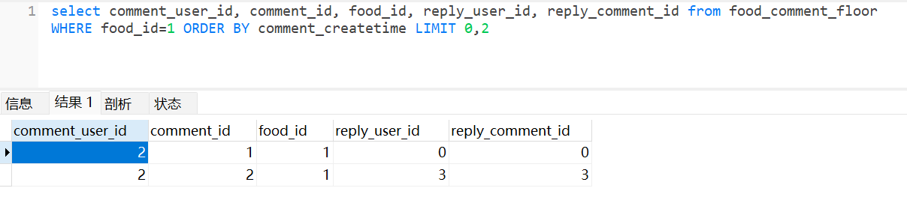

当读取第 M 页的评论列表时，使用 limit (M - 1) \* N，其中 N来限制取数。这里我们以 [comment\_id](http://comment_id%20/) 和 [comment\_createtime](http://comment_createtime%20/) 两个字段作为联合索引，这样根据「**作品 id**」就可以快速定位到此作品相关的所有评论，且按照发布时间排序，可以提高 SQL 执行效率。

  

当有用户删除「**评论 id 2**」时，其实可以直接使用这个联合索引，因为在删除评论的时候是知道「**作品 id**」和「**评论发布时间**」的，执行 SQL 如下：

delete from food\_comment\_floor where food\_id \= 2 and comment\_createtime \= "2024-10-11 12:19:11" and comment\_id \= 2

因为同一时间评论的条数不是很多，所以扫描的效率不低，如下：

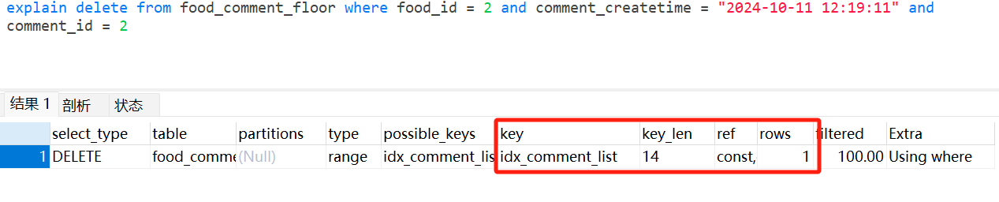

### **3.1.3 盖楼评论模式递归查询**

聊完简单模式后，我们再来看下盖楼模式的 SQL 查询。想要展示一条评论的盖楼情况，就需要从该评论开始，根据[reply\_comment\_id](http://reply_comment_id%20/) 字段不断「**递归查询**」上一层的评论记录，直到遍历到 [reply\_comment\_id](http://reply_comment_id/) 字段为 0 为止，此时表示查询到最顶层评论。

在「**递归查询**」过程中，查询到的每条评论自底向上组成楼层，示意图如下：

  
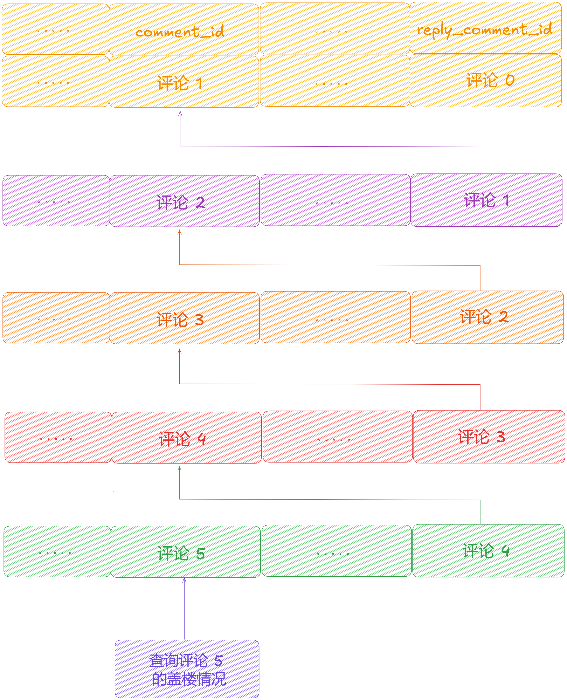

数据库通常情况下都支持「**递归查询**」，不过需要创建自定义函数，编写复杂的变量 SQL 语句或者使用高版本支持的 [WITH RECURSIVE](http://with%20recursive/) 语句来实现「**递归查询**」。

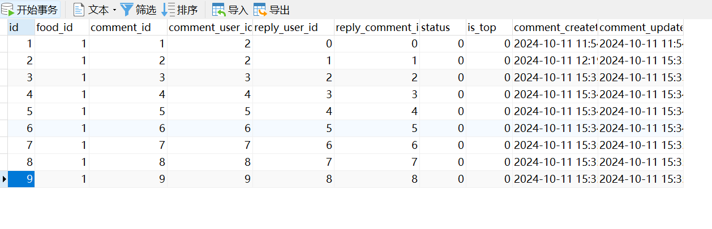

可以看到，「**评论 id 9**」是一个层级为 9 的楼层评论回复。

如果要展示完整的楼层，可以使用「**自定义函数**」执行 SQL 如下：

SELECT ID.level, DATA.\* FROM (SELECT

@comment\_id as comment\_id,

(SELECT @comment\_id :\= reply\_comment\_id FROM food\_comment\_floor WHERE comment\_id \= @comment\_id) as \_pid,

@1 :\= @1 + 1 as level FROM food\_comment\_floor, (SELECT @comment\_id :\= 9, @1 :\= 0) b WHERE @comment\_id \> 0

) ID, food\_comment\_floor DATA

WHERE ID.comment\_id \= DATA.comment\_id

ORDER BY level;

通过 explain 查询效果如下：

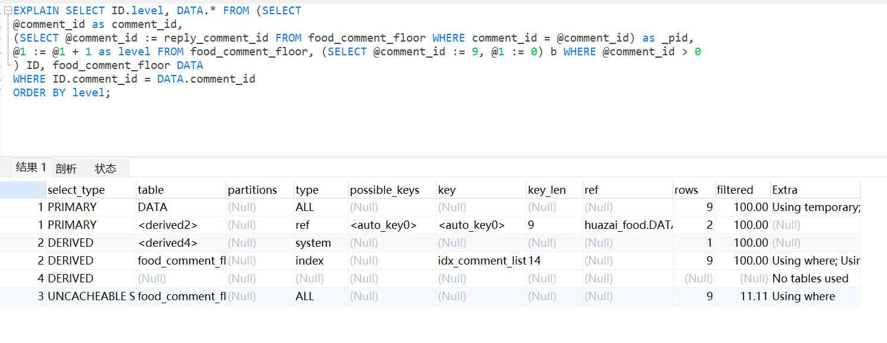

SQL 执行结果如下：

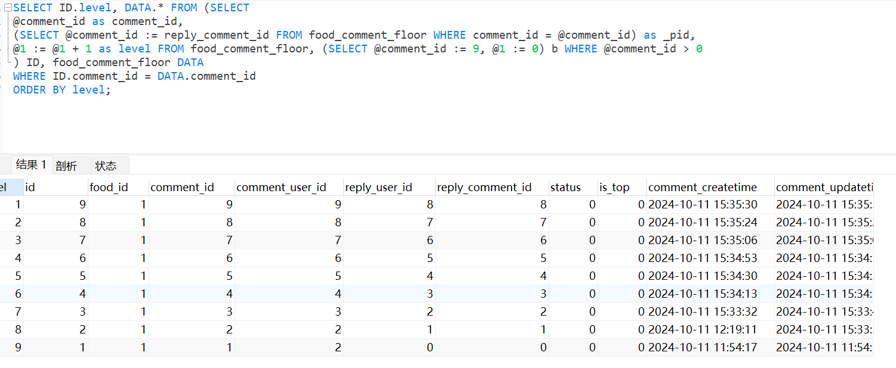

另外一种方式是使用 [WITH RECURSIVE](http://with%20recursive/) 语句，它是 [MYSQL 8.0](http://MYSQL%208.0) 引入的新功能，它是一个面向树形结构的递归查询语句，对于传统 SQL 查询语句来说，它能够帮助用户查询具有层级依存关系的数据结构，在一定程度上提高了数据查询效率。

WITH RECURSIVE food\_comment\_floor\_temp AS (

SELECT p.\* from food\_comment\_floor p WHERE comment\_id \= 9

UNION ALL

SELECT q.\* from food\_comment\_floor q INNER JOIN food\_comment\_floor\_temp ON food\_comment\_floor\_temp.reply\_comment\_id \= q.comment\_id

)

SELECT \* FROM food\_comment\_floor\_temp;

通过 explain 查询效果如下：

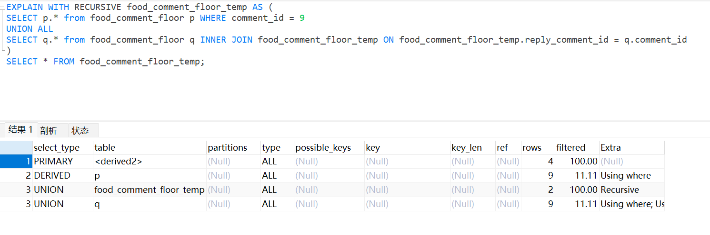

SQL 执行结果如下：

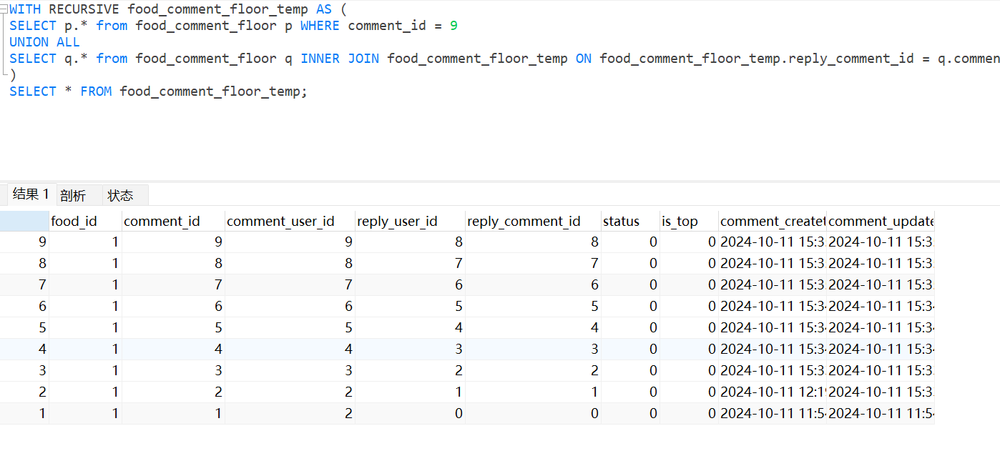

虽然 [WITH RECURSIVE](http://with%20recursive/) 性能还行，但是如果楼层过高，需要循环查询的次数就更多了，相对时间和内存开销也会增加，查询效率也会越来越低。

### **3.1.4 盖楼评论模式单字段存储完整楼层**

如果不想「**递归查询**」完整链路的话，可以在 [food\_comment\_floor](http://food_comment_floor/) 表增加 [floor](http://floor%20/) 字段，可以设置为 [BLOB](http://blob/) 类型，主要存储各楼层的评论 ID 列表。

还以上面的「**评论 id 9**」的评论楼层，需要先读取「**评论 id 8**」的 [floor](http://floor/) 字段，解压缩、反序列化得到盖楼评论 ID 列表，然后把 「**评论 id 8**」加入列表中，并将此列表作为「**评论 id 9**」的各楼层评论 ID 列表，即[\[1,2,3,4,5,6,7,8\]](http://%5B1,2,3,4,5,6,7,8%5D)。最后将其存储到「**评论 id 9**」的 [floor](http://floor/) 字段中，这样只需要 「**访问一条数据记录**」就能获取评论完整楼层，可以避免「**递归查询**」。

##   
**3.2 二级评论模式服务设计**

在互联网应用中，大部分都是采用「**二级评论模式**」，比如 「**微博**」、「**抖音**」、「**小红书**」、「**B 站**」等亿级用户应用。

接下来我们重点剖析「**二级评论模式**」服务设计，在该模式下，对作品的评论统一为「**一级评论**」，每一条评论的回复以及对回复的回复统一为「**二级评论**」。

在「**二级评论**」区中，对「**一级评论**」的回复以及对回复的回复一般按照「**评论发布时间**」由远及近进行排序。对于「**一级评论**」来说，可以按照「**评论发布时间**」排序，也可以按照「**评论热度**」排序。所谓「**热度**」可以根据「**点赞数**」、「**回复数**」、「**发布时间**」来进行评估。

###   
**3.2.1 二级评论数据库设计**

同盖楼模式类似，这里也分两个表。

首先，一条评论数据至少要包含：「**评论文本**」、「**发布者**」、「**发布时间**」、「**评论对象**」（对内容的评论、对其他评论的回复）、「**回复了哪个用户**」、「**评论点赞信息**」等。

其中「**评论文本**」表示用户评论了什么，其他信息属于「**评论元数据**」，所谓「**评论元数据**」就是说明评论是谁写的，评论目标是谁、评论间的互动等。

CREATE TABLE \`food\_comment\` (

\`id\` bigint NOT NULL AUTO\_INCREMENT,

\`food\_id\` bigint NOT NULL DEFAULT '0' COMMENT '美食id',

\`comment\_id\` bigint NOT NULL DEFAULT '0' COMMENT '评论id',

\`comment\_user\_id\` bigint NOT NULL DEFAULT '0' COMMENT '评论发布者uid',

\`comment\_root\_id\` bigint NOT NULL DEFAULT '0' COMMENT '如果是对美食作品的评论则为美食id，如果是一级评论下的评论，则为一级评论id',

\`level\` tinyint(1) DEFAULT '0' COMMENT '一级评论(值为1)还是二级评论(值为2)',

\`reply\_count\` bigint NOT NULL DEFAULT '0' COMMENT '此评论被回复的次数，只有一级评论才记录',

\`like\_count\` bigint NOT NULL DEFAULT '0' COMMENT '此评论被点赞的总次数',

\`reply\_user\_id\` bigint NOT NULL DEFAULT '0' COMMENT '如果评论是对美食作品的评论则为 0，如果评论是对某条一级评论的回复则为一级评论的用户id，如果评论是对某条二级评论的回复则为二级评论的用户id',

\`reply\_comment\_id\` bigint NOT NULL DEFAULT '0' COMMENT '如果评论是对美食作品的评论则为 0，如果评论是对某条一级评论的回复则为一级评论 id，如果评论是对某条二级评论的回复则为二级评论 id',

\`status\` tinyint(1) DEFAULT '0' COMMENT '是否删除 0 默认 1 删除评论',

\`is\_top\` tinyint(1) DEFAULT '0' COMMENT '是否置顶 0 默认 1 置顶评论',

\`comment\_createtime\` datetime DEFAULT CURRENT\_TIMESTAMP COMMENT '创建时间',

\`comment\_updatetime\` datetime DEFAULT CURRENT\_TIMESTAMP ON UPDATE CURRENT\_TIMESTAMP COMMENT '更新时间',

PRIMARY KEY (\`id\`),

KEY \`idx\_comment\_list\` (\`food\_id\`,\`comment\_createtime\`) USING BTREE

) ENGINE\=InnoDB AUTO\_INCREMENT\=1 DEFAULT CHARSET\=utf8mb4 COLLATE=utf8mb4\_general\_ci COMMENT\='美食二级模式评论元数据表';

CREATE TABLE \`food\_comment\_conent\` (

\`id\` bigint NOT NULL AUTO\_INCREMENT,

\`comment\_context\` text COLLATE utf8mb4\_general\_ci NOT NULL COMMENT '评论内容',

\`comment\_createtime\` datetime DEFAULT CURRENT\_TIMESTAMP COMMENT '创建时间',

\`comment\_updatetime\` datetime DEFAULT CURRENT\_TIMESTAMP ON UPDATE CURRENT\_TIMESTAMP COMMENT '更新时间',

PRIMARY KEY (\`id\`)

) ENGINE\=InnoDB AUTO\_INCREMENT\=4 DEFAULT CHARSET\=utf8mb4 COLLATE=utf8mb4\_general\_ci COMMENT\='美食二级模式评论内容数据表';

### **3.2.2 二级评论模式数据库读写、索引设计**

假设「**用户 uid 2**」在「**作品 id 1**」的评论中对作品本身发布了「**评论 id 1**」，首先将评论文本以 「**评论 id 1**」为 id 存储到 [food\_comment\_conent](http://%20food_comment_conent/) 表中，然后执行如下 SQL 语句保存评论文本以及元信息。

// 评论文本内容

INSERT INTO \`huazai\_food\`.\`food\_comment\_conent\`(\`id\`, \`comment\_context\`, \`comment\_createtime\`, \`comment\_updatetime\`) VALUES (1, '照这样吃，疫情过后就是胖子无疑', '2024-10-11 11:53:05', '2024-10-11 11:53:05');

// 评论元数据信息

INSERT INTO \`huazai\_food\`.\`food\_comment\`(\`id\`, \`food\_id\`, \`comment\_id\`, \`comment\_user\_id\`, \`comment\_root\_id\`, \`level\`, \`reply\_count\`, \`like\_count\`, \`reply\_user\_id\`, \`reply\_comment\_id\`, \`status\`, \`is\_top\`, \`comment\_createtime\`, \`comment\_updatetime\`) VALUES (1, 1, 1, 1, 1, 1, 0, 0, 0, 0, 0, 0, '2024-10-11 18:10:53', '2024-10-11 18:10:53');

如果此时「**用户 uid 2**」对「**作品 id 1**」的「**一级评论 id 2**」, 评论发布者「**用户 uid 3**」发布「**回复评论 id 4**」，执行 SQL 如下：

INSERT INTO \`huazai\_food\`.\`food\_comment\`(\`id\`, \`food\_id\`, \`comment\_id\`, \`comment\_user\_id\`, \`comment\_root\_id\`, \`level\`, \`reply\_count\`, \`like\_count\`, \`reply\_user\_id\`, \`reply\_comment\_id\`, \`status\`, \`is\_top\`, \`comment\_createtime\`, \`comment\_updatetime\`) VALUES (2, 1, 4, 2, 2, 2, 1, 0, 2, 3, 0, 0, '2024-10-11 18:10:53', '2024-10-11 19:13:12');

如果此时「**用户 uid 2**」对「**作品 id 1**」的「**一级评论 id 2**」下的二级评论区的「**评论 id 5**」， 评论发布者「**用户 uid 5**」发布「**回复评论 id 6**」，执行 SQL 如下：

INSERT INTO \`huazai\_food\`.\`food\_comment\`(\`id\`, \`food\_id\`, \`comment\_id\`, \`comment\_user\_id\`, \`comment\_root\_id\`, \`level\`, \`reply\_count\`, \`like\_count\`, \`reply\_user\_id\`, \`reply\_comment\_id\`, \`status\`, \`is\_top\`, \`comment\_createtime\`, \`comment\_updatetime\`) VALUES (3, 1, 6, 2, 2, 2, 1, 0, 5, 5, 0, 0, '2024-10-11 18:10:53', '2024-10-11 18:10:53');

当用户打开「**作品 id 1**」的评论区时，在次评论区中应该展示第一页的 N 条评论，即评论发布时间最早的 N 条评论，执行 SQL 如下：

select comment\_user\_id, comment\_id, food\_id, reply\_count, like\_count, comment\_createtime from food\_comment WHERE comment\_root\_id=1 and leven = 1 ORDER BY comment\_createtime LIMIT 0,N

当用户点开「**一级评论 id 2**」的二级评论时，需要按照「**二级评论**」的发布时间由远及近展示 N 条二级评论，执行 SQL 如下：

select comment\_user\_id, comment\_id, food\_id, like\_count, comment\_createtime from food\_comment WHERE comment\_root\_id\=2 and leven \= 2 ORDER BY comment\_createtime LIMIT 0,N

这里我们依然创建同样的联合索引：

### **3.2.3 二级评论模式高并发读写架构设计**

聊完数据库设计之后，我们来看下「**高并发读写架构设计**」。

通过前面的剖析，我们得出评论服务是一个「**读多写多**」的场景。如果某大V或者明星发布了热点作品，就会吸引大量的用户前来围观和评论。所以评论服务需要应对「**高并发读写**」两种场景。

###   
**3.2.3.1 高并发读**

所谓的「**读评论**」主要指拉取热门作品的评论列表。对于大部分用户来说，其拉取的是评论区前几页评论列表。所以，我们可以为评论列表中的前 N 条评论来构建 Redis 分布式缓存。

既然评论列表是按照评论「**发布时间**」排序的，这里可以使用 Redis ZSET 数据结构构建缓存，其中 Key 为作品ID，Member 为 评论 ID，Score 为评论的发布时间。

这里需要注意的是：是按照评论发布时间「**由远到近**」排序还是「**由近到远**」排序，这两种方式实现是不同的。

1.  如果评论列表是按照评论发布时间「**由远到近**」排序的，那么前 N 条评论数据是「**相对固定**」的，缓存极少需要更新。
2.  如果评论列表是按照评论发布时间「**由近到远**」排序的，那么前 N 条评论数据会「**时刻发生动态变化**」，如果作品内容越热门，前 N 条评论数据变化得越快。该方式最好的实现方式把 Redis 当作数据库的从库，每当将一条评论插入数据库时，同时将此评论也插入 Redis ZSET 集合中。

考虑到高并发读取评论列表对 Redis 造成的请求压力，这里还可以做「**本地缓存**」并设置短点的过期时间，比如 5 秒。

对于按照评论发布时间「**由近到远**」排序的评论列表来说，「**本地缓存**」导致用户拉取到最多 5s 前的评论，而非此时最新的 N 条评论。但是好在用户并不是非在意一定要看到此时的最新评论，只要评论数据相对比较新即可。所以，我们可以使用「**本地缓存**」进一步应对「**高并发读取**」评论列表的请求，只是不要将「**本地缓存**」的过期时间设置的太大就好。

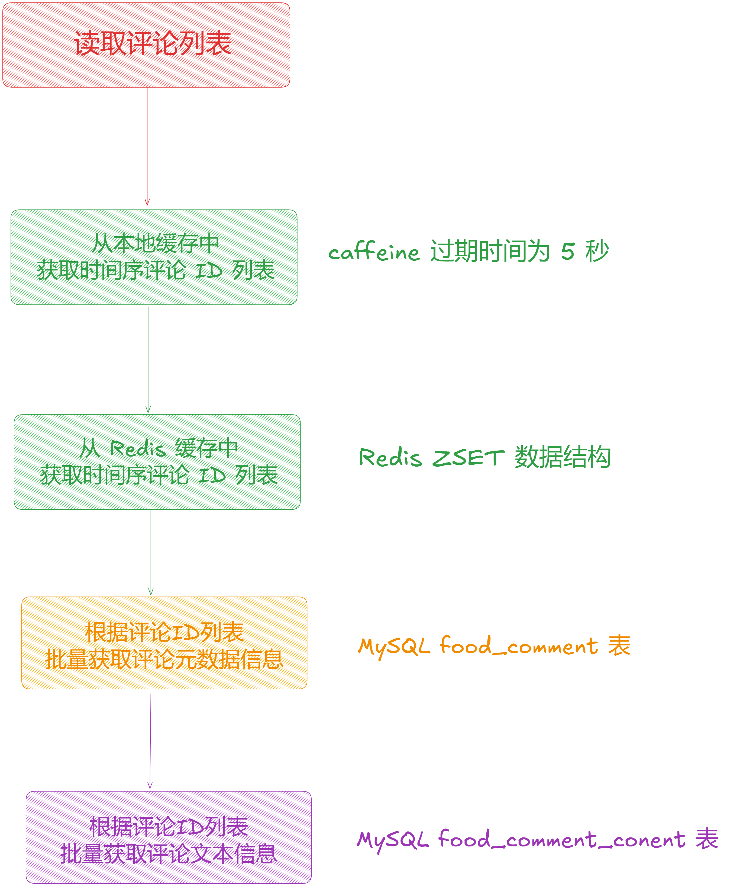

### **3.2.3.1 高并发写**

最后我们来看下「**高并发写**」场景，用户发布评论作为典型的写请求会直接操作「**数据库**」，虽然「**数据库**」可以通过「**分库分表**」来提高并行处理写请求的能力，但是如果我们将 [food\_comment](http://food_comment/) 表中的 [food\_id](http://food_id/) 作为「**分库分表**」的依据的话，对于「**热门作品**」来说，会有大量的写评论请求指向同一个「**作品 Id**」，即这些写评论会将路由到同一个评论子元数据表中，因此还是很容易被打挂。

这里我们要采用的方案是基于「**RocketMQ 异步写**」的方式来削峰，并在消费的过程中使用「**写聚合**」的方式来处理「**高并发写**」请求。

  
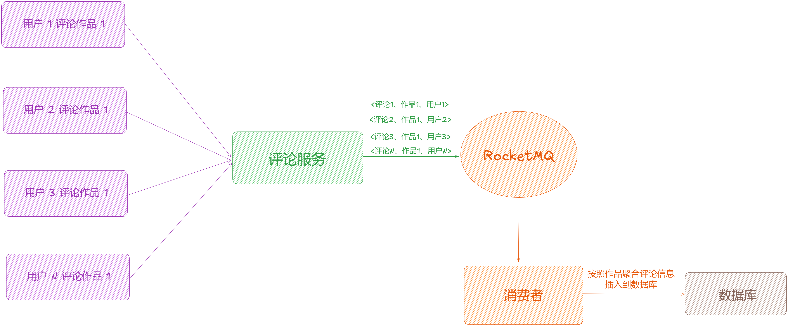

具体详情，我们会在后面几篇中详细拆解和功能开发，这里只是做下数据库设计以及架构设计。