大家好，我是**华仔**, 又跟大家见面了。

从今天之后的一段时间内，华仔会带着大家一起从零开始搭建并研发一套高并发的电商实战项目，这里会涉及到很多互联网大厂开发过程中所使用的核心技术和架构设计模式，希望大家学完之后可以用到自己的简历中。

接下来我们会重点架构设计和开发一下「**社交系统**」中的重要服务：「**关注服务**」、「**计数服务**」、「**评论服务**」。

这是第二十六篇，本篇我们继续进行电商实战项目设计与开发，本篇对「**计数服务**」基础功能开发和完善。

文章汇总位置：[https://wx.zsxq.com/dweb2/index/columns/51122554151214](https://wx.zsxq.com/dweb2/index/columns/51122554151214)

源码授权与获取地址：[https://articles.zsxq.com/id\_1s85grnaae4p.html](https://articles.zsxq.com/id_1s85grnaae4p.html)

本章源码地址：[https://gitcode.net/u011359591/huazai-ecshop/-/tree/ecshop-chapter-26](https://gitcode.net/u011359591/huazai-ecshop/-/tree/ecshop-chapter-26)

## **01 前言**

终于要设计与研发电商项目代码了，今天我们主要对「**计数服务**」基础功能开发和完善。

这里需要注意下，我们整个项目目前是不提供前端的，这个后续有时间在搞，主要是进行后端接口以及微服务模块架构设计。

## **02 计数服务基础功能开发**

在 [【电商实战项目第二十五篇】华仔电商实战项目计数服务场景介绍与架构设计](https://articles.zsxq.com/id_6canxpdlnkwx.html) 这篇中，我们确定了最终的数据库设计方案。

## **2.1 计数服务数据库设计**

这里我们将「**计数服务**」的数据库从 [huazai\_user](http://huazai_user/) 库迁移到 [huazai\_counter](http://huazai_counter/) 库，如下图：。

  
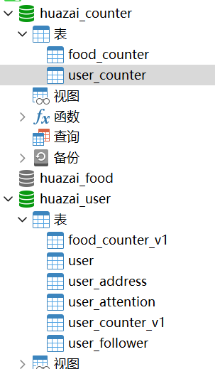

CREATE TABLE \`user\_counter\` (

\`id\` int NOT NULL AUTO\_INCREMENT COMMENT '主键id',

\`user\_id\` bigint NOT NULL DEFAULT '0' COMMENT '用户id',

\`count\_key\` varchar(32) CHARACTER SET utf8mb4 COLLATE utf8mb4\_general\_ci NOT NULL DEFAULT '0' COMMENT '关注数：attention\_count，粉丝数：follower\_count，点赞数：like\_count，收藏数：collect\_count',

\`count\_value\` int NOT NULL DEFAULT '0' COMMENT '对应 count\_key 计数',

\`last\_count\_value\` int NOT NULL DEFAULT '0' COMMENT '上一次更新的 value',

\`create\_time\` datetime DEFAULT CURRENT\_TIMESTAMP COMMENT '创建时间',

\`update\_time\` datetime DEFAULT CURRENT\_TIMESTAMP ON UPDATE CURRENT\_TIMESTAMP COMMENT '更新时间',

PRIMARY KEY (\`id\`),

UNIQUE KEY \`uid\` (\`user\_id\`) USING BTREE

) ENGINE\=InnoDB DEFAULT CHARSET\=utf8mb4 COLLATE=utf8mb4\_general\_ci COMMENT\='用户维度计数表';

CREATE TABLE \`food\_counter\` (

\`id\` int NOT NULL AUTO\_INCREMENT COMMENT '主键',

\`food\_id\` bigint NOT NULL COMMENT '美食笔记id',

\`count\_key\` varchar(32) CHARACTER SET utf8mb4 COLLATE utf8mb4\_general\_ci NOT NULL COMMENT '点赞数：like\_count，评论数：comment\_count，收藏数：collect\_count',

\`count\_value\` int NOT NULL COMMENT '对应 count\_key 计数',

\`last\_count\_value\` int NOT NULL DEFAULT '0' COMMENT '上一次更新的 value',

\`create\_time\` datetime DEFAULT CURRENT\_TIMESTAMP COMMENT '创建时间',

\`update\_time\` datetime DEFAULT CURRENT\_TIMESTAMP ON UPDATE CURRENT\_TIMESTAMP COMMENT '更新时间',

PRIMARY KEY (\`id\`),

UNIQUE KEY \`fid\` (\`food\_id\`) USING BTREE

) ENGINE\=InnoDB DEFAULT CHARSET\=utf8mb4 COLLATE=utf8mb4\_general\_ci COMMENT\='作品维度的计数表';

这里我们只是设计了「**计数服务**」的相关表设计，关于业务本身的详情还没有设计，后续会补上。

既然抽离了，那么我们代码就要支持多库操作。

##   
**2.2 计数服务多数据库**

在 SpringBoot 项目中，同时连接两个数据库，只需要更改对应的 [driver-class-name](http://driver-class-name/) 和 [jdbc-url](http://jdbc-url/) 等即可。

注意：连接什么数据库，要引入对应数据库的包。

这里我们都是 MySQL， 只不过是两个不同的库。

### **2.2.1 application.yaml 配置文件**

修改 [application.yml](http://application.yml/) 配置文件，我这里采用本地的，IP地址是一致的，实际开发中，是两台云服务，两台MySQL地址进行主从读写。

这里需要注意格式。

  
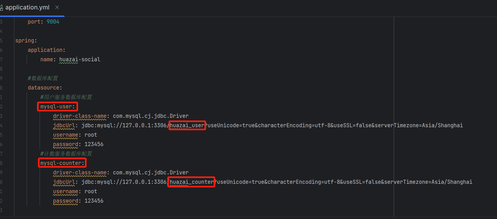

### **2.2.2 多数据库配置类**

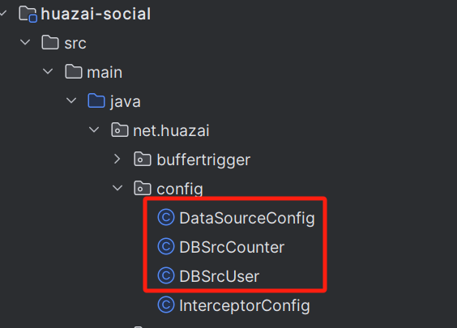

这里需要做适配，来处理多数据库。具体更新代码查看即可，这里就不展示了。

注意：连接两个以上的数据库，需要对 mapper 文件夹进行分包！

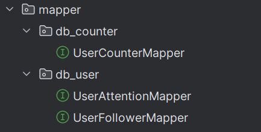

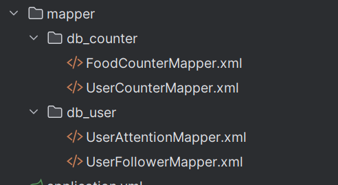

我们主要是对 [UserCounterMapper.xml](http://usercountermapper.xml/) 以及 [UserCounterMapper.java](http://usercountermapper.java/) 进行了修改，来适应最新的数据库设计。

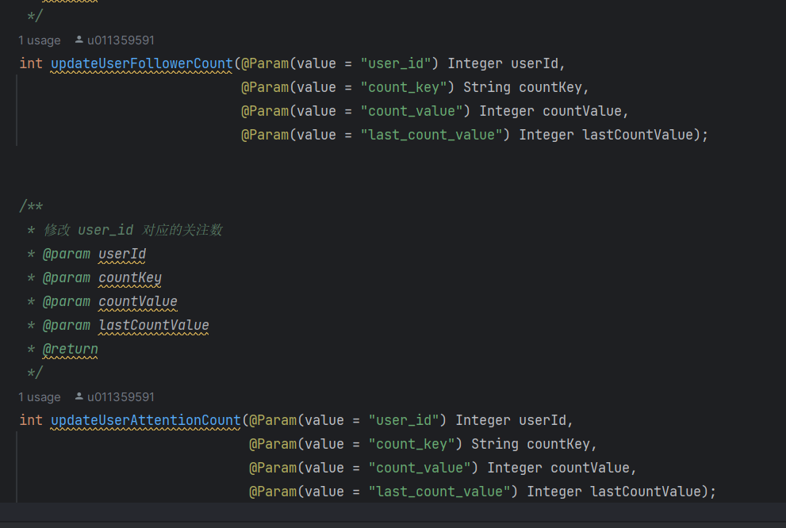

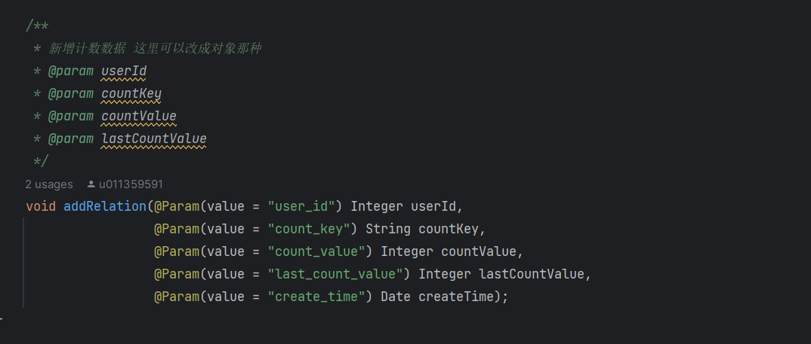

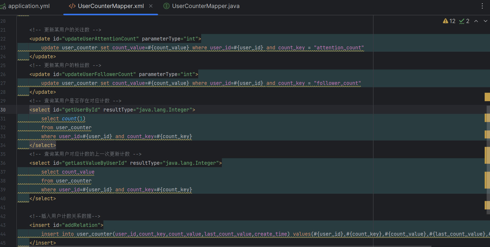

### **2.2.3 启动类注解**

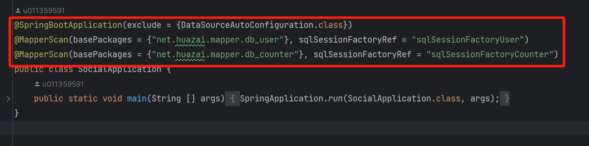

## **2.3 关注服务计数修改**

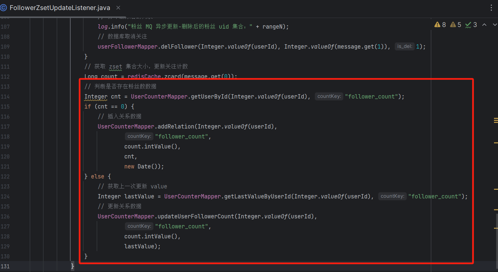

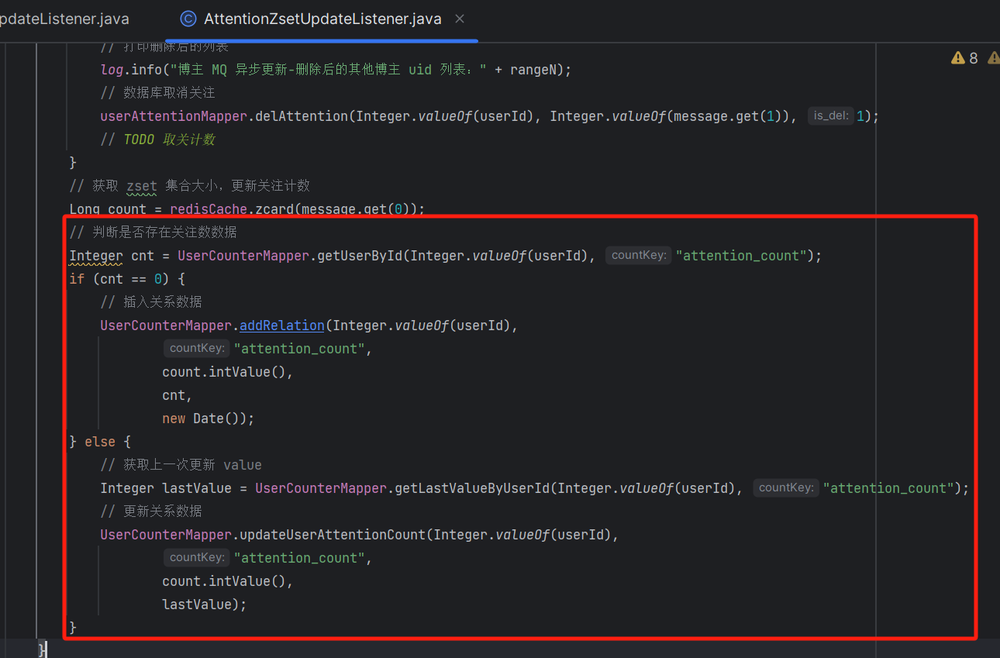

最后测试结果如下：

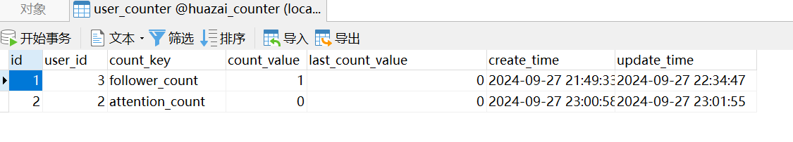

## **2.4 计数服务功能设计**

接下来，我们重点来设计「**计数服务**」的功能实现。

我们先来看下传统「**计数服务**」如何实现？

###   
**2.4.1 计数服务通用设计方案**

这里有两种方式：

1.  DB + Cache 方式。
2.  Cache + DB 方式。

那么这两种方式有什么区别呢？我们分别来看下。

### **2.4.1.1 DB + Cache 方式**

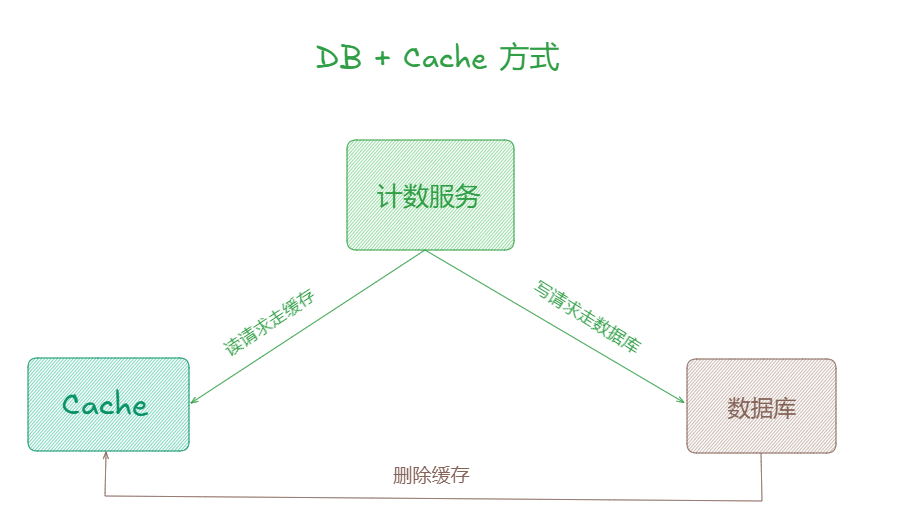

在该方案中，读请求是走的 Cache ，而写请求走 DB，然后写完 DB 后删除 Cache。

### **2.4.1.2 Cache + DB 方式**

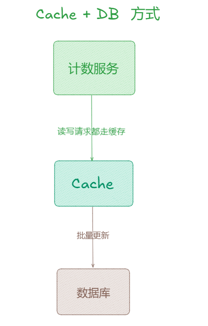

在该方案中，读写请求都是走的 Cache ，然后定期批量更新 DB 来完成数据的对齐。

这两种方案各有利弊，后面我们再来讨论该选用那种方案来设计我们的「**计数服务**」。

### **2.4.2 精准计数与模糊计数架构设计**

在设计「**计数服务**」的时候，我会通过两种方式来设计与实现，一种是：「**精准计数**」，一种是「**模糊计数**」。

那什么场景使用「**精准计数**」，什么场景使用 「**模糊计数**」呢？

###   
**2.4.2.1 精准计数**

这里的「**精准计数**」，就是事件发生一次就处理一次。

主要用于 「**读多写少**」的场景下使用，比如「**购物车计数**」、「**商品计数**」等场景。

### **2.4.2.2 模糊计数**  

  
这里的「**模糊计数**」，就就不是事件发生一次处理一次了，而是会引入「**缓冲区**」的概念。

通常情况下，「**模糊计数**」的计算量是非常大的，比如热点事件发生后，「**点赞**」、「**收藏**」、「**评论**」事件会激增，如果处理不好的话，服务系统很容易被打挂掉。

我们通过引入「**缓冲区**」的方式来缓解这种计算压力，即会在「**内存**」中积攒一批数据后再进行「**数据库**」的写入，尽量降低「**数据库**」操作的 QPS，防止「**数据库**」被打挂。

###   
**2.4.2.3 综合计数设计**

整体架构设计图如下：

  
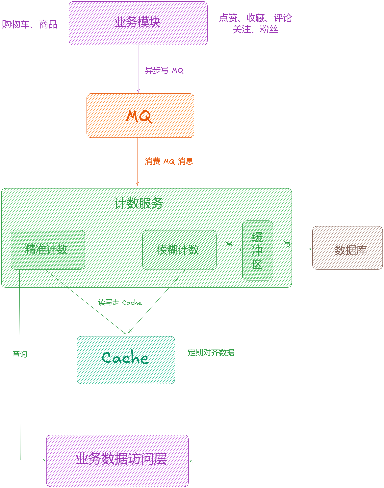

从上图可以看到，这里我们会引入「**RocketMQ**」来对超大流量进行削峰异步处理，然后计数服务会根据「**场景**」来选择使用「**精准计数**」还是「**模糊计数**」。

这里「**模糊计数**」会先写「**Redis**」和「**缓冲区**」，当「**缓冲区**」积攒到一定阈值后写一次「**数据库**」，然后会定期访问「**业务数据访问层**」来进行数据对齐。

本篇，我们主要来设计和开发「**模糊计数**」的实现，关于 「**精准计数**」后续会补齐。

###   
**2.4.3 模糊计数功能实现**

我们从「**美食服务**」开发，先看控制器方法，这里主要是 「**点赞**」、「**收藏**」、「**评论**」事件的接入。

###   
**2.4.3.1 美食服务控制器**

/\*\*

\* 新增美食点赞

\* @param foodId

\* @return

\*/

@ApiOperation("新增美食点赞")

@GetMapping("/doLike/{food\_id}")

public ApiResult doLike(@ApiParam(value = "美食 id", required = true)

@PathVariable("food\_id") Long foodId) {

foodService.doLike(foodId);

return ApiResult.doSuccess();

}

/\*\*

\* 取消美食点赞

\* @param foodId

\* @return

\*/

@ApiOperation("取消美食点赞")

@GetMapping("/unLike/{food\_id}")

public ApiResult unLike(@ApiParam(value = "美食 id", required = true)

@PathVariable("food\_id") Long foodId) {

foodService.unLike(foodId);

return ApiResult.doSuccess();

}

/\*\*

\* 新增美食收藏

\* @param foodId

\* @return

\*/

@ApiOperation("新增美食收藏")

@GetMapping("/doCollect/{food\_id}")

public ApiResult doCollect(@ApiParam(value = "美食 id", required = true)

@PathVariable("food\_id") Long foodId) {

foodService.doCollect(foodId);

return ApiResult.doSuccess();

}

/\*\*

\* 取消美食收藏

\* @param foodId

\* @return

\*/

@ApiOperation("取消美食收藏")

@GetMapping("/unCollect/{food\_id}")

public ApiResult unCollect(@ApiParam(value = "美食 id", required = true)

@PathVariable("food\_id") Long foodId) {

foodService.unCollect(foodId);

return ApiResult.doSuccess();

}

### **2.4.3.2 美食服务服务层**

这里我们通过「**RocketMQ**」来异步处理消息事件，而不是直接操作「**数据库**」。

/\*\*

\* 新增美食点赞

\* @param foodId

\*/

@Override

public void doLike(Long foodId) {

// 获取用户登录信息 这里还是通过 ThreadLocal 进行获取

// TODO 后续使用 Redis 分布式缓存替代

LoginUser loginUser \= LoginInterceptor.threadLocal.get();

// 构建消息

List<String> keys = new ArrayList<>();

keys.add(foodId.toString());

keys.add(String.valueOf(loginUser.getId()));

keys.add("like\_count");

keys.add("1"); // 点赞 +1

// 美食对应的博主是谁

FoodVO foodVO \= getFoodInfo(foodId);

if (foodVO != null) {

keys.add(String.valueOf(foodVO.getUserId()));

} else {

// 美食不存在直接返回

return;

}

String message \= JSON.toJSONString(keys);

log.info("新增美食点赞消息：{}", message);

// 发送 MQ 消息

defaultProducer.sendMessage(

RocketMQConstant.FOOD\_COUNTER\_TOPIC,

message,

"新增美食点赞");

}

/\*\*

\* 取消美食点赞

\* @param foodId

\*/

@Override

public void unLike(Long foodId) {

// 获取用户登录信息 这里还是通过 ThreadLocal 进行获取

// TODO 后续使用 Redis 分布式缓存替代

LoginUser loginUser \= LoginInterceptor.threadLocal.get();

// 构建消息

List<String> keys = new ArrayList<>();

keys.add(foodId.toString());

keys.add(String.valueOf(loginUser.getId()));

keys.add("like\_count");

keys.add("-1"); // 点赞 -1

// 美食对应的博主是谁

FoodVO foodVO \= getFoodInfo(foodId);

if (foodVO != null) {

keys.add(String.valueOf(foodVO.getUserId()));

} else {

// 美食不存在直接返回

return;

}

String message \= JSON.toJSONString(keys);

log.info("取消美食点赞消息：{}", message);

// 发送 MQ 消息

defaultProducer.sendMessage(

RocketMQConstant.FOOD\_COUNTER\_TOPIC,

message,

"取消美食点赞");

}

/\*\*

\* 新增美食收藏

\* @param foodId

\*/

@Override

public void doCollect(Long foodId) {

// 获取用户登录信息 这里还是通过 ThreadLocal 进行获取

// TODO 后续使用 Redis 分布式缓存替代

LoginUser loginUser \= LoginInterceptor.threadLocal.get();

// 构建消息

List<String> keys = new ArrayList<>();

keys.add(foodId.toString());

keys.add(String.valueOf(loginUser.getId()));

keys.add("collect\_count");

keys.add("1"); // 点赞 +1

// 美食对应的博主是谁

FoodVO foodVO \= getFoodInfo(foodId);

if (foodVO != null) {

keys.add(String.valueOf(foodVO.getUserId()));

} else {

// 美食不存在直接返回

return;

}

String message \= JSON.toJSONString(keys);

log.info("新增美食收藏消息：{}", message);

// 发送 MQ 消息

defaultProducer.sendMessage(

RocketMQConstant.FOOD\_COUNTER\_TOPIC,

message,

"新增美食收藏");

}

/\*\*

\* 取消美食收藏

\* @param foodId

\*/

@Override

public void unCollect(Long foodId) {

// 获取用户登录信息 这里还是通过 ThreadLocal 进行获取

// TODO 后续使用 Redis 分布式缓存替代

LoginUser loginUser \= LoginInterceptor.threadLocal.get();

// 构建消息

List<String> keys = new ArrayList<>();

keys.add(foodId.toString());

keys.add(String.valueOf(loginUser.getId()));

keys.add("collect\_count");

keys.add("-1"); // 点赞 +1

// 美食对应的博主是谁

FoodVO foodVO \= getFoodInfo(foodId);

if (foodVO != null) {

keys.add(String.valueOf(foodVO.getUserId()));

} else {

// 美食不存在直接返回

return;

}

String message \= JSON.toJSONString(keys);

log.info("取消美食收藏消息：{}", message);

// 发送 MQ 消息

defaultProducer.sendMessage(

RocketMQConstant.FOOD\_COUNTER\_TOPIC,

message,

"取消美食收藏");

}

这里先只有「**点赞**」和 「**收藏**」的事件处理，等后续做「**评论**」服务的时候再进行「**评论**」的计数。

  
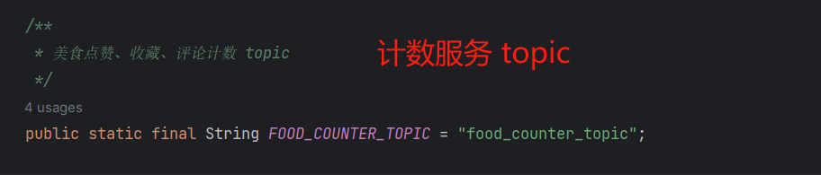

### **2.4.3.4 计数服务消费者**

这里我们采用「**并发多线程**」模式来消费，而没有采用「**顺序**」模式，对于「**计数服务**」来说，可以不用考虑「**顺序**」问题，先加先减都 ok 的。

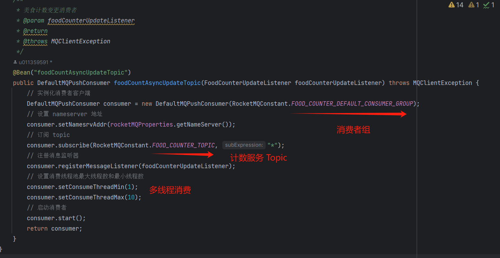

整个处理流程如下：

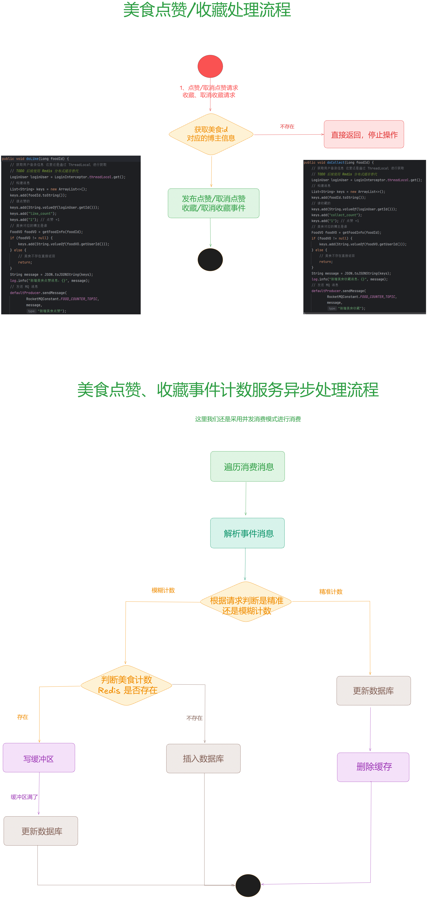

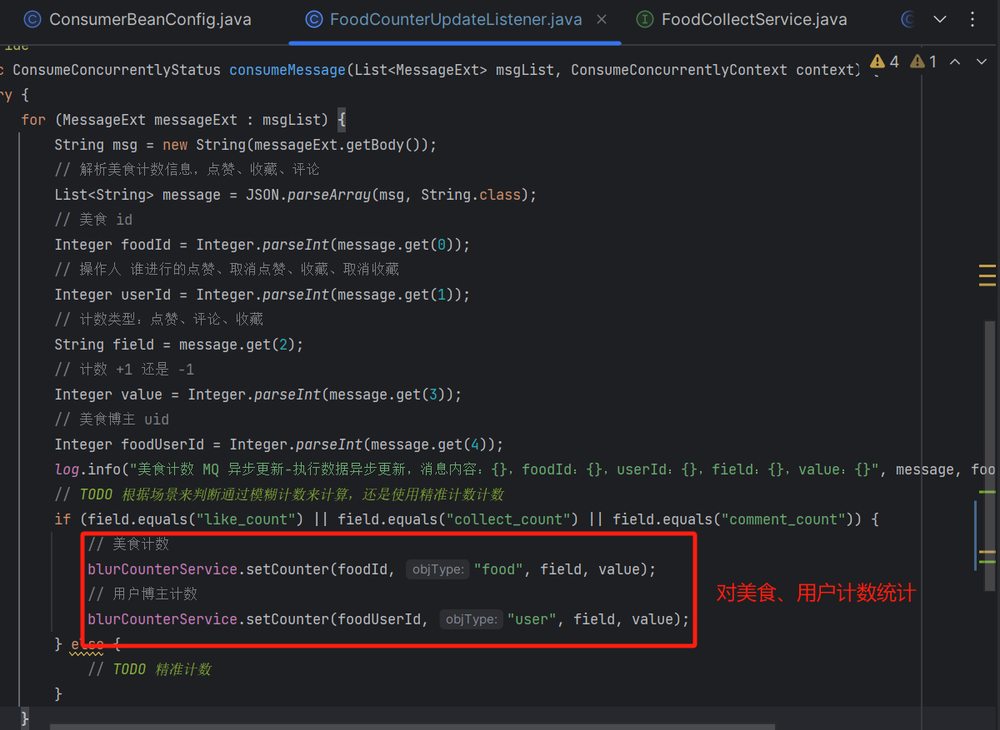

### **2.4.3.5 计数服务服务层**

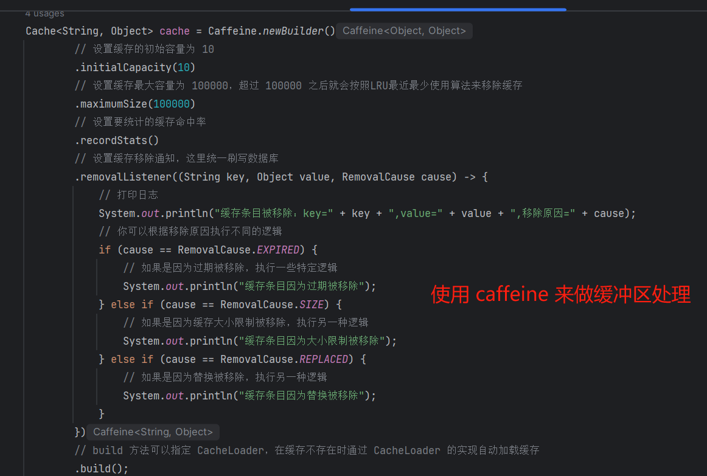

/\*\*

\* 写入单个计数

\* @param objId 用户id或者美食id

\* @param objType 类型：用户或者美食

\* @param field counter\_key

\* @param value counter\_value

\* @return

\*/

@Override

public ApiResult setCounter(Integer objId, String objType, String field, Integer value) {

// 这里我们使用 hash 结构来存储和判断

String redisKey \= objType.equals("food") ?

RedisKeyConstant.FOOD\_COUNTER\_KEY\_PREFIX + objId // 美食计数 key

: RedisKeyConstant.USER\_COUNTER\_KEY\_PREFIX + objId; // 用户计数 key

// 判断美食计数缓存是否存在

Boolean bool \= redisCache.hasKey(redisKey);

// 先计数自增 +1/自减 -1

if (value.equals(-1)) {

// 如果是自减 -1

Object countValue \= redisCache.hGet(redisKey, field);

// 如果已经减为0之后就不能再减了

if (0 < Integer.parseInt(countValue.toString())) {

redisCache.hIncr(redisKey, field, value);

}

} else {

redisCache.hIncr(redisKey, field, value);

}

if (bool) {

// 如果存在，这里需要缓冲区来批量更新到数据库

putBuffer(objId, objType, field, value);

} else {

// 说明是第一次，写入数据库

insertDbCounter(objId, objType, field, value);

}

return ApiResult.doSuccess();

}

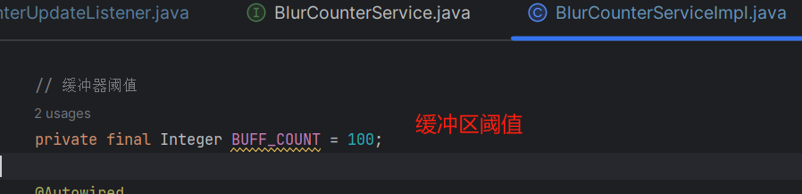

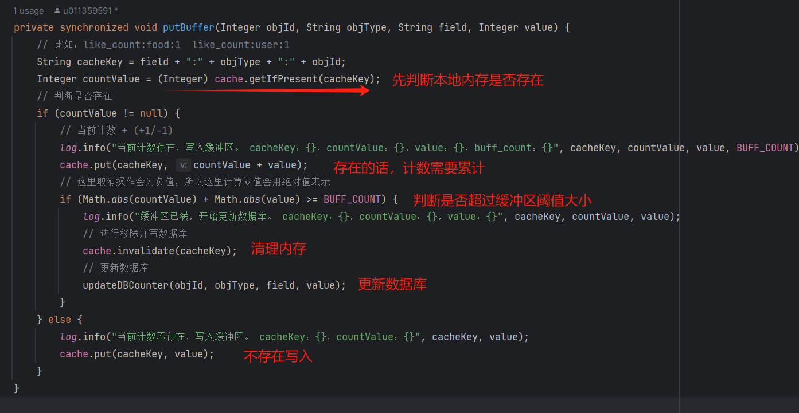

更新和新增数据库就比较简单了，这里就不展开了，自行查看代码即可。

### **2.4.3.6 测试效果**

这里为了测试，先将缓冲区阈值改为 20 个，这里以「**点赞**」事件为例。

  
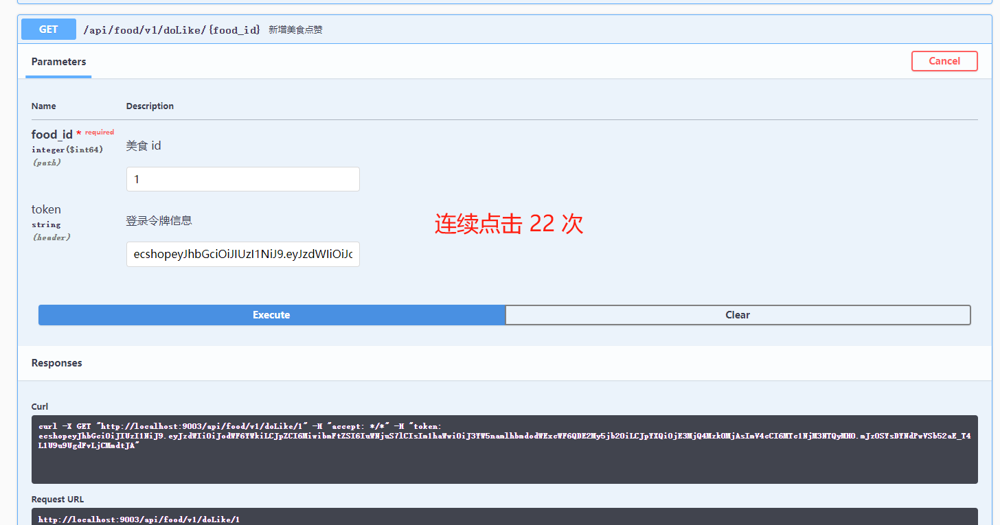

日志输出：

从图中可以看到超过 20 次之后，会输出缓冲区已满，开始i更新数据库。

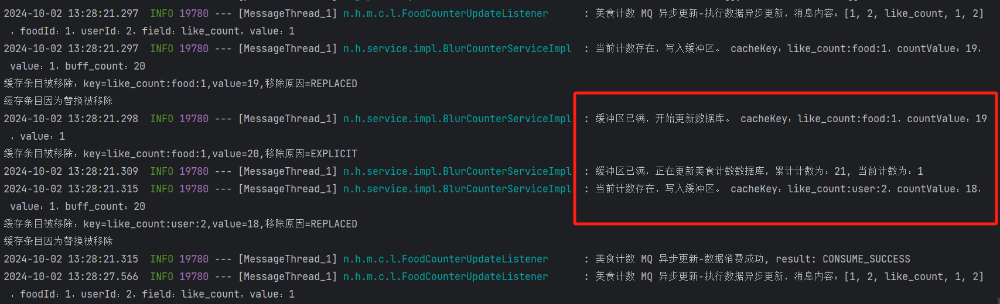

数据库：

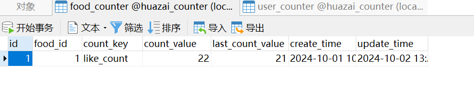

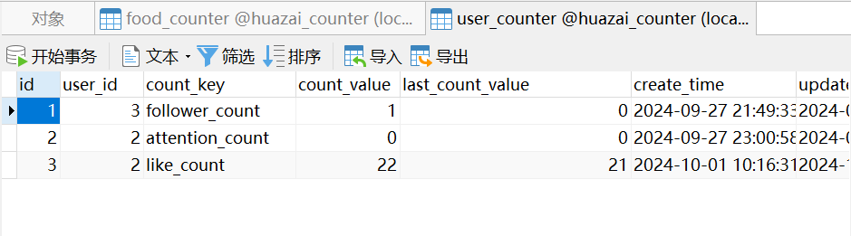

Redis Hash 结构体：

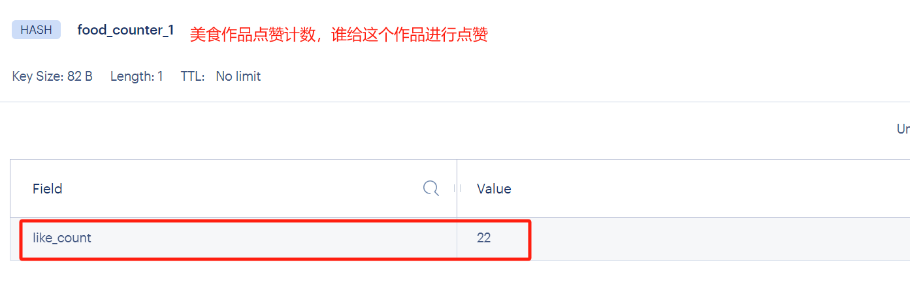

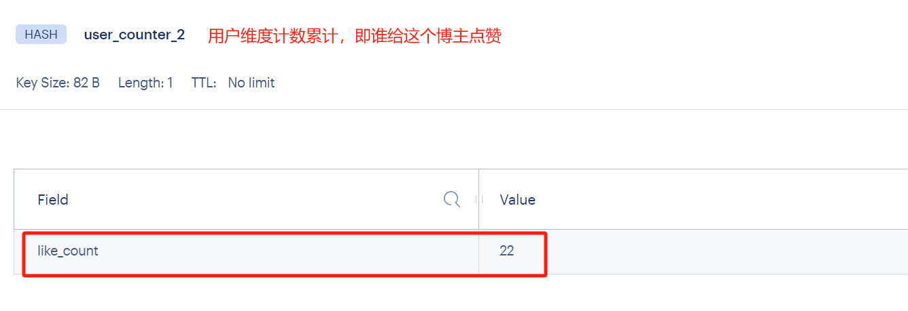

### **2.4.4 精准计数功能实现**

TODO 后续补充