大家好，我是**华仔**, 又跟大家见面了。

从今天之后的一段时间内，华仔会带着大家一起从零开始搭建并研发一套高并发的电商实战项目，这里会涉及到很多互联网大厂开发过程中所使用的核心技术和架构设计模式，希望大家学完之后可以用到自己的简历中。

接下来我们会重点架构设计和开发一下「**社交系统**」中的重要服务：「**关注服务**」、「**计数服务**」、「**评论服务**」。

这是第二十四篇，本篇我们继续进行电商实战项目设计与开发，本篇继续对「**关注服务**」在千万级流量下超高并发场景优化解决方案。

文章汇总位置：[https://wx.zsxq.com/dweb2/index/columns/51122554151214](https://wx.zsxq.com/dweb2/index/columns/51122554151214)

源码授权与获取地址：[https://articles.zsxq.com/id\_1s85grnaae4p.html](https://articles.zsxq.com/id_1s85grnaae4p.html)

本章源码地址：[https://gitcode.net/u011359591/huazai-ecshop/-/tree/ecshop-chapter-24](https://gitcode.net/u011359591/huazai-ecshop/-/tree/ecshop-chapter-24)

## **01 前言**

终于要设计与研发电商项目代码了，今天我们主要对「**关注服务**」在千万级流量下超高并发场景优化解决方案，本篇内容也非常重要，希望大家认真学习。

这里需要注意下，我们整个项目目前是不提供前端的，这个后续有时间在搞，主要是进行后端接口以及微服务模块架构设计。

## **02 关注服务高并发写场景**

接着 [【电商实战项目第二十一篇】华仔电商实战项目关注服务发生热点事件的解决方案](https://articles.zsxq.com/id_k0o5xtnjx6hh.html) 这篇，我们切入到今天的护主题。

有一天，咱们小红书项目中的某位不起眼的美食博主发布的笔记突然「**爆火**」了，关注量陡增，此时「**关注并发写操作**」太高了导致服务器扛不住了，怎么办？

大部分业务都是读操作流量（QPS）高，比如我们常用的淘宝、抖音等，大部分都是读场景，而写操作流量（QPS）相对读操作流量（QPS）整体要低很多。但是如果遇到做「**活动**」或者「**大促**」、「**直播**」时它的写操作流量（QPS）瞬间就上来了，如果做不好，你的服务器可能瞬间被干挂了。

**如果你作为架构师或者核心主程，该如何解决这种超高并发写问题呢？**

这里我给出两种解决方案。

1.  使⽤消息队列进⾏流量削峰来解决写 qps ⾼的问题应该是最常见的解决⽅案，将每次的请求丢到消息队列，后续由消费者慢慢处理即可，使用消息队列能够自己控制 qps 和线程数，所以就能够缓解下游的压力了。 在前面已经实战过：[【电商实战项目第十九篇】华仔电商实战项目关注服务通用基础功能基于 Redis Zset 和 RocketMQ 进行重构](https://articles.zsxq.com/id_wpvd2uejj8ku.html)，[【电商实战项目第十八篇】华仔电商实战项目关注服务通用基础功能基于 Redis List 和 RocketMQ 设计与开发](https://articles.zsxq.com/id_rk4je6vvs398.html)
2.  使用流量聚合组件来合并写请求统一处理。

> 首先消息队列是异步处理的，所以需要及时响应处理结果的业务可能就不太适合了。比如秒杀场景就返回一个成功，然后交给消息队列处理并且保证处理成功的范畴，不在考虑范围。
> 
> 另外 MQ 的消费速度要评估好，保证不能打垮下游服务；同时对于大量产生消息的业务，也不能让消费速度赶不上生产速度，导致消息不断堆积引爆队列，必要时要对下游进行适当的横向扩容。
> 
> 总之，要在性能和消费速度之间进行权衡，找到一个平衡点。

今天我们主要来了解下这个「**流量聚合**」组件是什么？适合什么场景？如何引入项目实战？

## **2.1 流量聚合 buffer-trigger**

### **2.1.1 什么是流量聚合**

所谓流量聚合，简单来说就是把「**多次请求**」整合为「**一次请求**」再进行批量处理。

###   
**2.1.2 流量聚合提供哪些功能**

1.  提供能存放数据的容器。
2.  当达到指定数量时输出容器中的数据。
3.  当达到指定时间时输出容器中的数据。

###   
**2.1.3 如何实现流量聚合**

这里要感谢快手大佬开源的一个工具类：[buffer-trigger](https://github.com/PhantomThief/buffer-trigger)，这玩意就可以用来做请求聚合。  

###   
**2.1.4 流量聚合使用场景**

1.  **高吞吐量消息处理**： 当系统需要处理大量快速产生的数据或消息时，如日志记录、事件追踪、实时交易数据等，单条消息的即时处理可能会导致过多的系统开销（如网络通信、数据库操作等）。通过使用 [BufferTrigger](http://buffertrigger/)，可以将这些消息暂时缓存在阻塞队列中，当累积到一定数量后一次性进行批量处理。这样既能减少系统调用次数，提升整体处理效率，又能降低对下游系统的瞬时压力。
2.  **延迟敏感但允许适度延后处理**： 在某些业务场景中，数据或消息的处理虽有一定的「**时效性要求**」，但并不严格到需要「**立即响应**」。例如，用户行为分析、运营统计报表生成等任务，可以在容忍的时间窗口内完成。[BufferTrigger](http://buffertrigger/) 通过设置批处理阈值和延迟等待时间，允许在满足一定积累量或等待时间后才触发消费，从而实现数据的「**准实时**」处理，兼顾了处理效率与延迟需求。
3.  **资源优化与成本控制**： 对于依赖付费服务，比如云存储、三方 API 调用或者计算资源有限的情况，批量处理能够显著减少对外部服务的调用量或内部计算资源的占用。例如，定期向云存储批量上传日志文件、批量发送电子邮件通知、批量查询外部API并聚合结果等。[BufferTrigger](http://buffertrigger/) 通过合并多个小任务为一个大任务，有助于降低单位数据处理的成本。
4.  **避免频繁 I/O 操作**： 如果消息的消费涉及大量的磁盘 I/O、网络 I/O 或其他昂贵的系统资源操作，如数据库写入、文件写入、跨网络的数据同步等，频繁的单个操作可能导致性能瓶颈。[BufferTrigger](http://buffertrigger/) 通过批量处理，能够减少这类操作的次数，从而提高系统整体性能。
5.  **微服务间解耦与流量控制**： 在分布式微服务架构中，不同服务之间可能存在强依赖关系。使用 [BufferTrigger](http://buffertrigger/) 可以在服务间引入一层缓冲，避免下游服务瞬时过载或临时不可用导致整个系统崩溃。同时，批量处理能平滑消费端的请求流量，减轻对上游服务的压力，增强系统的稳定性和容错能力。

###   
**2.1.5 如何接入流量聚合**

### **2.1.5.1 引入 maven 依赖**

<dependency>

<groupId>com.github.phantomthief</groupId>

<artifactId>buffer-trigger</artifactId>

<version>0.2.21</version>

</dependency>

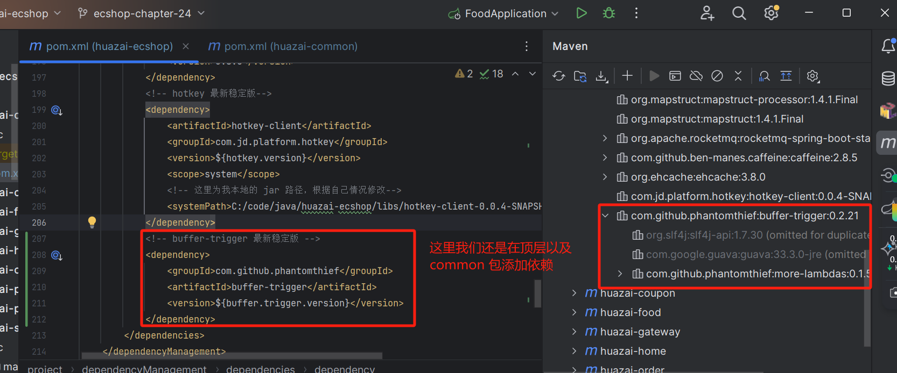

### **2.1.5.2 使用示例**

对于 buffer-trigger 来说，这里有两种使用方式，我们分别来看下。

### **使用 SimpleBufferTrigger**

package net.huazai;

import com.github.phantomthief.collection.BufferTrigger;

import lombok.extern.slf4j.Slf4j;

import org.junit.Test;

import org.junit.runner.RunWith;

import org.springframework.boot.test.context.SpringBootTest;

import org.springframework.test.context.junit4.SpringRunner;

import java.util.Map;

import java.util.concurrent.ConcurrentHashMap;

import java.util.concurrent.TimeUnit;

import java.util.concurrent.atomic.AtomicInteger;

/\*\*

\* @className: SimpleBufferTriggerTest

\* @author: huazai

\* @date: 2024-08-31 14:54

\* @Version: 1.0

\* @description:通用实现，适合大多数业务场景

\* 消费触发策略会考虑消费回调函数的执行时间，实际执行间隔 = 理论执行间隔 - 消费回调函数执行时间；

\* 如回调函数执行时间已超过理论执行间隔，将立即执行下一次消费任务

\*/

@RunWith(SpringRunner.class)

@SpringBootTest(classes = SocialApplication.class)

@Slf4j

public class SimpleBufferTriggerTest {

/\*\*

\* bufferTrigger 构建

\*/

BufferTrigger<Long> bufferTrigger = BufferTrigger.<Long, Map<Long, AtomicInteger>> simple()

// maxBuffeCount(long count):指定容器最大容量，比如 10，当在下次聚合前容器元素数量达到 10 就无法添加了，-1 表示无限制

.maxBufferCount(10)

// internal(longinterval, TimeUnit unit) :表示多久聚合一次，如果没达到时间那么 consumer是不会输出的，聚合后容器就空了。

.interval(4, TimeUnit.SECONDS)

// setContainer(Supplier<? extends C> factory, BiPredicate<? super C, ? super E> queueAdder): 第一个变量为factory，是个Supplier，获取容器用的，要求线程安全;第二个变量是缓存更新的方法BiPredicate<?super C, ?super E> queueAdder C为容器类型,E为元素类型

.setContainer(ConcurrentHashMap::new, (map, uid) -> {

map.computeIfAbsent(uid, key -> new AtomicInteger()).addAndGet(1);

return true;

})

// consumer(ThrowableConsumer<?super C, Throwable> consumer):表示如何消费聚合后的数据，标识我们如何去消费聚合后的数据

.consumer(this::consumer) // 消费者

.build(); // 构建

// 这里只是简单打印。

public void consumer(Map<Long, AtomicInteger> map) {

System.out.println("消费结果：" + map);

}

@Test

public void test() throws InterruptedException {

// 进程退出时手动消费一次

// manuallyDoTrigger：主动触发一次消费，通常在 java 进程关闭的时候调用

Runtime.getRuntime().addShutdownHook(new Thread(() -> bufferTrigger.manuallyDoTrigger()));

// 最大容量是 10，这里尝试添加 11 个元素 0-10

for (int i \= 0; i < 5; i ++) {

for (long j \= 0; j < 11; j ++) {

// enqueue(E element): 添加元素

bufferTrigger.enqueue(j);

}

}

Thread.sleep(7000);

}

}

执行结果如下：

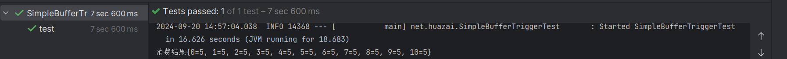

### **使用 BatchConsumeBlockingQueueTrigger**

package net.huazai;

import com.github.phantomthief.collection.BufferTrigger;

import lombok.extern.slf4j.Slf4j;

import org.junit.Test;

import org.junit.runner.RunWith;

import org.springframework.boot.test.context.SpringBootTest;

import org.springframework.test.context.junit4.SpringRunner;

import java.time.Duration;

import java.util.List;

/\*\*

\* @className: BatchConsumeBlockingQueueTriggerTest

\* @author: huazai

\* @date: 2024-08-31 14:54

\* @Version: 1.0

\* @description:该触发器适合生产者-消费者场景，缓存容器基于{@link LinkedBlockingQueue}队列实现

\* 触发策略类似 Kafka linger，批处理阈值与延迟等待时间满足其一即触发消费回调.

\*/

@RunWith(SpringRunner.class)

@SpringBootTest(classes = SocialApplication.class)

@Slf4j

public class BatchConsumeBlockingQueueTriggerTest {

/\*\*

\* bufferTrigger 构建

\*/

BufferTrigger<Long> bufferTrigger = BufferTrigger.<Long>batchBlocking() // batchBlocking():提供自带背压(back-pressure)的简单批量归并消费能力；

// bufferSize(intbufferSize):缓存队列的最大容量

.bufferSize(50)

// batchSize(int size): 批处理元素的数量阈值，达到这个数量后也会进行消费

.batchSize(10)

// linger(Duration duration): 多久消费一次

.linger(Duration.ofSeconds(1))

// setConsumerEx(ThrowableConsumer<?super List, Exception> consumer): 消费函数，注入的对象为缓存队列中尚存的所有元素，非逐个元素消费；

.setConsumerEx(this::consume)

.build(); // 构建

// 这里只是简单打印。

private void consume(List<Long> nums) {

System.out.println("消费结果：" + nums);

}

@Test

public void test() throws InterruptedException {

// 进程退出时手动消费一次

// manuallyDoTrigger：主动触发一次消费，通常在 java 进程关闭的时候调用

Runtime.getRuntime().addShutdownHook(new Thread(() -> bufferTrigger.manuallyDoTrigger()));

for (long j \= 0; j < 60; j ++) {

// enqueue(E element): 添加元素

bufferTrigger.enqueue(j);

}

Thread.sleep(7000);

}

}

### 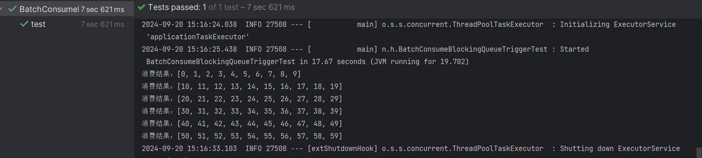

### **两者区别**

[BatchConsumeBlockingQueueTrigger](http://batchconsumeblockingqueuetrigger/) 每次会将元素原封不动保存下来，然后一次性消费一整个列表元素。而[SimpleBufferTrigger](http://simplebuffertrigger/) 则每次添加元素都会进行计算。

### **陷阱**

需要注意的是 [BufferTrigger](http://buffertrigger/) 是单线程消费的，这个是一个比较大的陷阱，尤其是在「**消费操作**」中涉及到「**大量 I/O 操作**」的场景，在流量很高的时候可能会出现「**消费速度**」跟不上「**生产速度**」，这很容易导致 [full gc](http://full%20gc/) 问题。所以有必要的话需要使用「**线程池**」线程池来提升「**消费速度**」。

### **2.1.6 项目实战**

这里通过两种方式来进行实战一下，[BufferTrigger](http://buffertrigger/) 可以根据情况来使用，提供一种解决方案。

我们以「**粉丝关注**」操作为例来展示整个 [BufferTrigger](http://buffertrigger/) 是如何使用和接入的。

### **2.1.6.1 启动配置**

需在 [application.yml](http://application.yml/) 指定 [BufferTrigger](http://buffertrigger%20/) 相关队列、定时器配置以及业务类别信息。

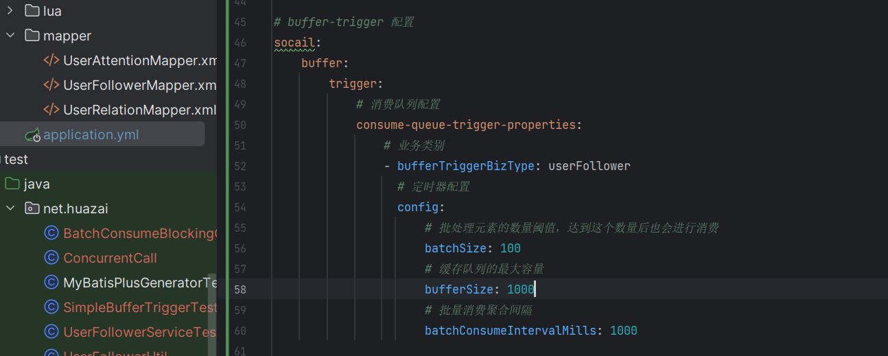

### **2.1.5.2 普通方式功能开发**

这部分的代码就不展示，自行下载代码后查看即可。

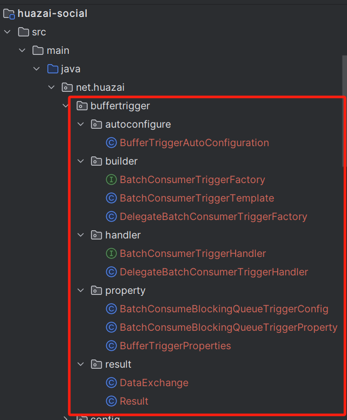

我们继续来看下 [UserRelationServiceImpl](http://userrelationserviceimpl%20/) 类的功能实现。

/\*\*

\* 普通方式

\* @param userFollowerEntity

\* @return

\*/

@Override

public Result<UserFollowerEntity> doFollowerEventCommon(UserFollowerEntity userFollowerEntity) {

count.increment();

System.out.println("执行次数：" + count.sum() + "，请求体：" + userFollowerEntity);

// 发布关注事件

publishFollowerEvent(userFollowerEntity);

return Result.success(userFollowerEntity);

}

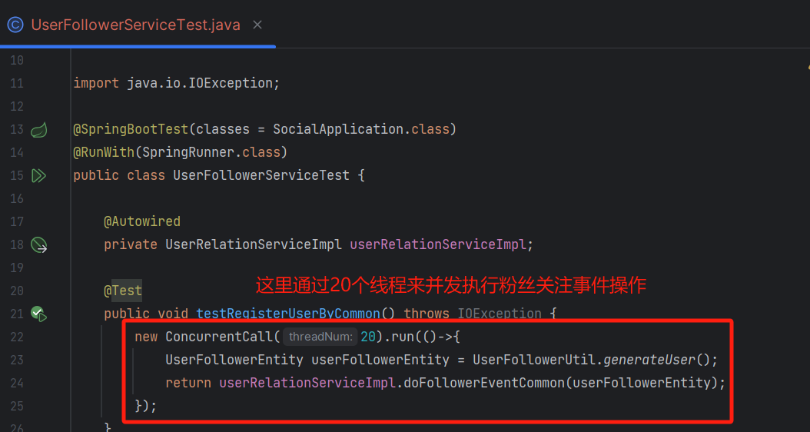

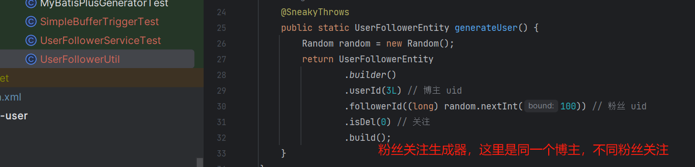

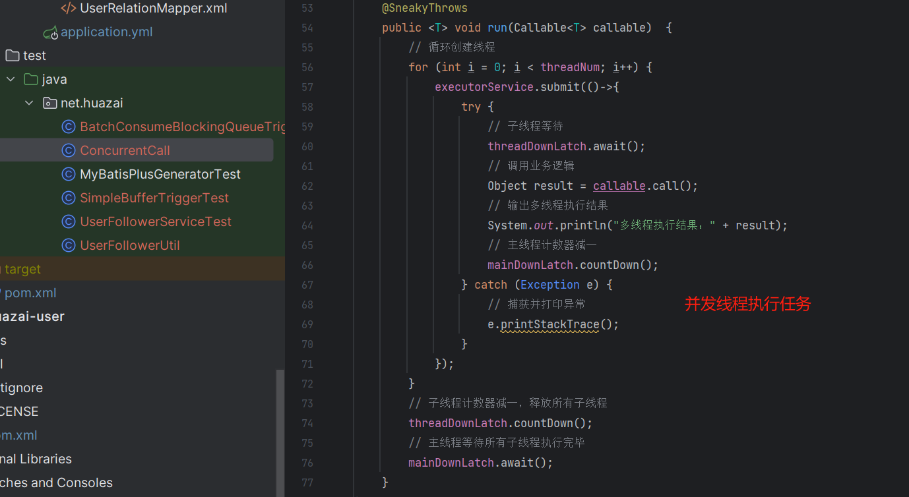

执行效果如下：

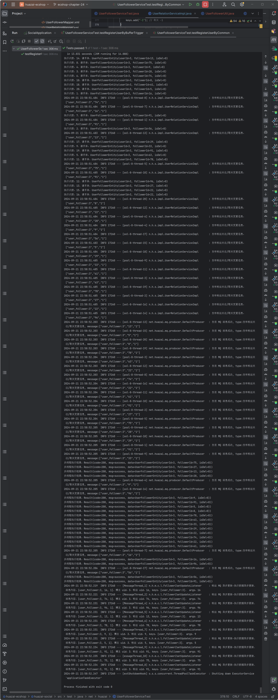

数据库：

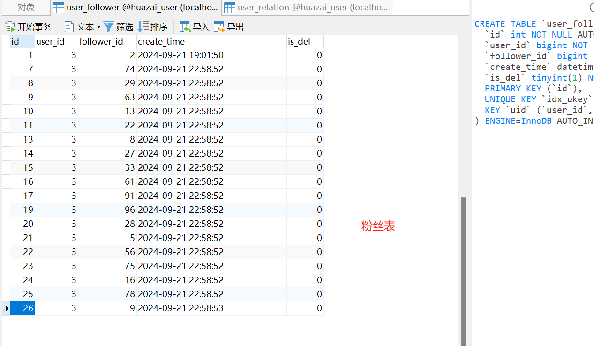

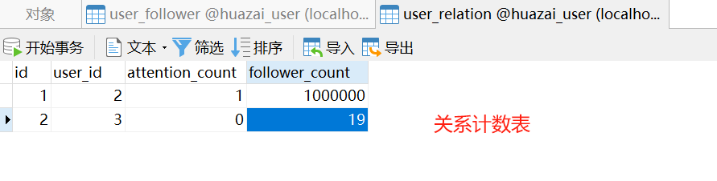

Redis Zset 结构体：

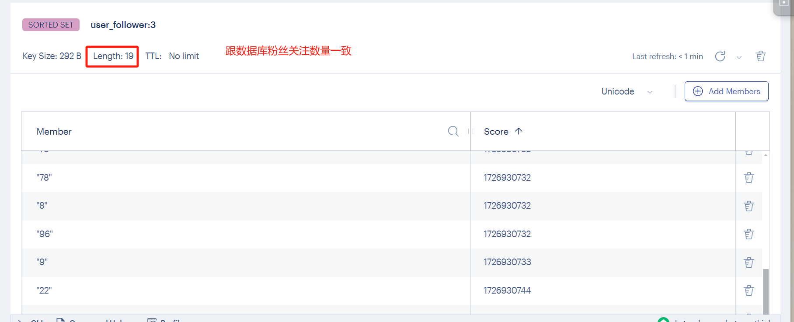

### **2.1.6.3 BufferTrigger 模式功能开发**

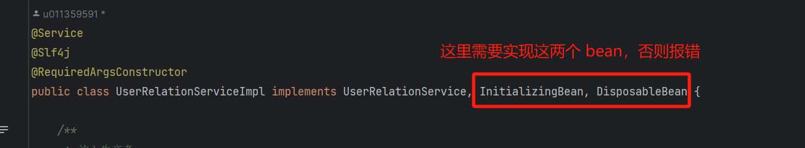

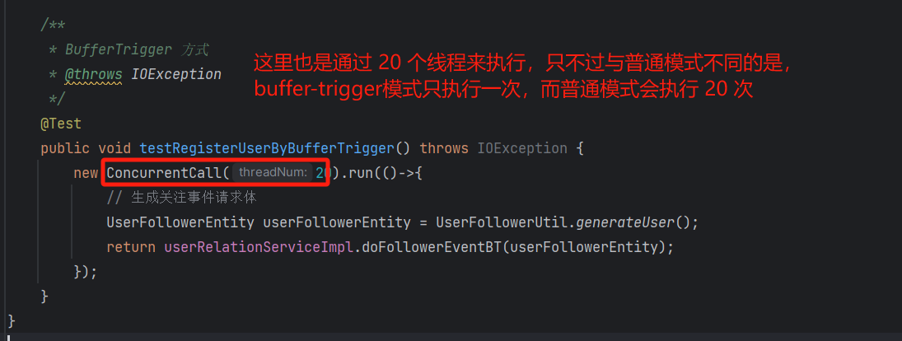

public static final String BUFFER\_TRIGGER\_BIZ\_TYPE \= "userFollower";

private final BatchConsumerTriggerFactory batchConsumerTriggerFactory;

private final LongAdder count \= new LongAdder();

private BatchConsumerTriggerHandler<UserFollowerEntity,UserFollowerDO> batchConsumerTriggerHandler;

/\*\*

\* 注入布隆过滤器

\*/

@Autowired

private RBloomFilter<String> bloomFilter;

@Override

public void afterPropertiesSet() throws Exception {

log.info("UserRelationServiceImpl afterPropertiesSet start");

try {

// key为业务属性唯一键，如果不存在业务属性唯一键，则可以取 bizNo 作为 key，示例以 FollowerId 作为唯一键

Map<String, CompletableFuture<Result<UserFollowerDO>>> completableFutureMap = new HashMap<>();

batchConsumerTriggerHandler = batchConsumerTriggerFactory.getTriggerHandler((ThrowableConsumer<List<DataExchange<UserFollowerEntity, UserFollowerDO>>, Exception>) dataExchanges -> {

List<UserFollowerEntity> userFollowerEntities = new ArrayList<>();

for (DataExchange<UserFollowerEntity, UserFollowerDO> dataExchange : dataExchanges) {

UserFollowerEntity userFollowerEntity \= dataExchange.getRequest();

// 以粉丝 FollowerId 为唯一键

completableFutureMap.put(userFollowerEntity.getFollowerId().toString() ,dataExchange.getResponse());

userFollowerEntities.add(userFollowerEntity);

}

count.increment();

System.out.println("UserRelationServiceImpl afterPropertiesSet 执行次数：" + count.sum() + "，请求体：" + userFollowerEntities);

List<UserFollowerDO> userFollowerDOS = batchPublishFollowerEvent(userFollowerEntities);

if (CollectionUtil.isNotEmpty(userFollowerDOS)) {

for (UserFollowerDO userFollowerDO : userFollowerDOS) {

CompletableFuture<Result<UserFollowerDO>> completableFuture = completableFutureMap.remove(userFollowerDO.getFollowerId());

if (completableFuture != null) {

completableFuture.complete(Result.success(userFollowerDO));

}

}

}

},BUFFER\_TRIGGER\_BIZ\_TYPE);

log.info("UserRelationServiceImpl afterPropertiesSet end");

} catch (Exception e) {

e.printStackTrace();

}

}

@Override

public void destroy() throws Exception {

log.info("UserRelationServiceImpl destroy start");

// 触发该事件，关闭BufferTrigger，并将未消费的数据消费

batchConsumerTriggerHandler.closeBufferTrigger();

log.info("UserRelationServiceImpl destroy end");

}

/\*\*

\* 批量发布关注/取关事件

\* @param userFollowerEntitys

\*/

private List<UserFollowerDO> batchPublishFollowerEvent(List<UserFollowerEntity> userFollowerEntitys) {

List<UserFollowerDO> userFollowerDOs = new ArrayList<>();

// 这里为了方便演示效果，消费者就不改成批量操作的话，感兴趣可以自行修改

for (UserFollowerEntity userFollowerEntity : userFollowerEntitys) {

// 发布关注事件

publishFollowerEvent(userFollowerEntity);

UserFollowerDO userFollowerDO \= new UserFollowerDO();

userFollowerDO.setFollowerId(userFollowerEntity.getFollowerId().intValue());

userFollowerDO.setUserId(userFollowerEntity.getUserId().intValue());

userFollowerDO.setIsDel(userFollowerEntity.getIsDel() == 1 ? false : true);

userFollowerDO.setCreateTime(new Date());

// 这里为了演示就不存数据库读取了，直接跟 followerId 一致

userFollowerDO.setId(userFollowerEntity.getFollowerId().intValue());

userFollowerDOs.add(userFollowerDO);

}

log.info("batchPublishFollowerEvent 响应结果:{}", userFollowerDOs);

return userFollowerDOs;

}

/\*\*

\* BufferTrigger 方式

\* @param userFollowerEntity

\* @return

\*/

@SneakyThrows

@Override

public Result<UserFollowerDO> doFollowerEventBT(UserFollowerEntity userFollowerEntity) {

log.info("doFollowerEventBT request:{}，bizNo：{}", userFollowerEntity, BUFFER\_TRIGGER\_BIZ\_TYPE + "-" + UUID.randomUUID());

return batchConsumerTriggerHandler.handle(userFollowerEntity,BUFFER\_TRIGGER\_BIZ\_TYPE + "-" + UUID.randomUUID());

}

执行效果如下：

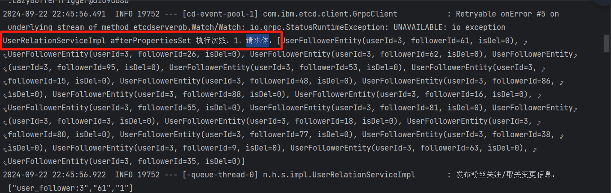

数据库：

这里是随机生成的，可能与上一次的有重复，只插入进去 16 条。

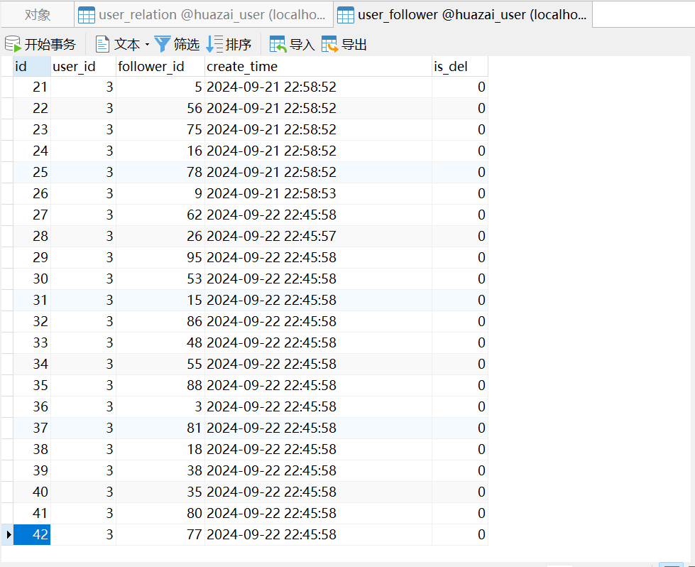

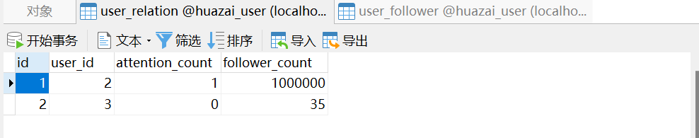

Redis Zset 结构体：

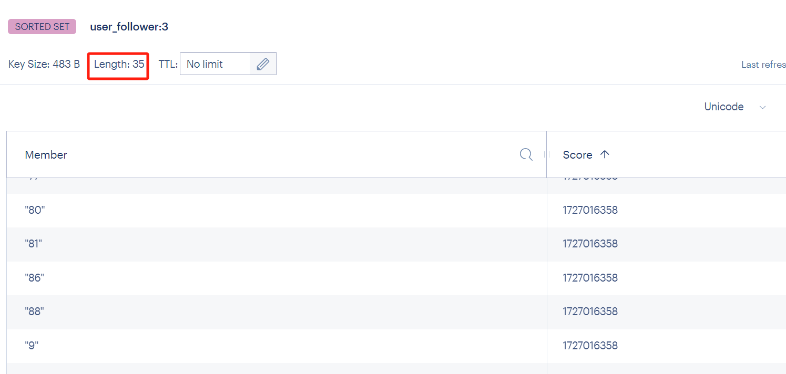

### **2.1.6.3 小结**

普通模式需要调用 20 次，将结果返回。而聚合方式仅需调用一次，就将结果返回。因此当我们在使用「**流量聚合**」时，相关的下游服务最好能提供「**批量接口**」来支持。

其次 [BufferTrigger](http://buffertrigger/) 是「**单线程消费**」，在「**并发很高**」的场景下可能会出现「**消费速度**」跟不上「**生产速度**」，这很容易导致 [full gc](http://full%20gc%20/) 问题，所以如果有必要的话需要使用「**线程池**」来提升消费速度。