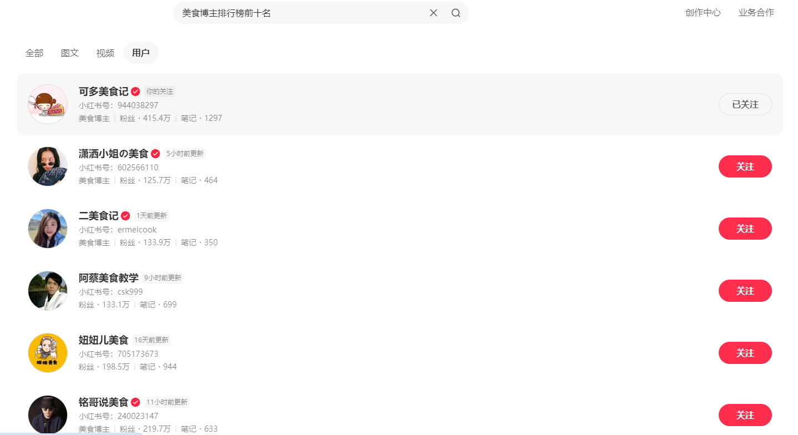
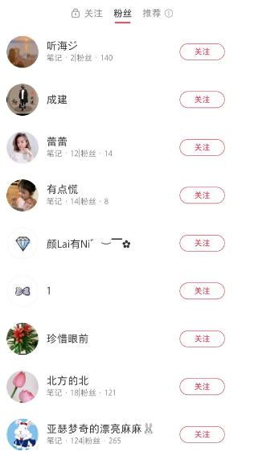
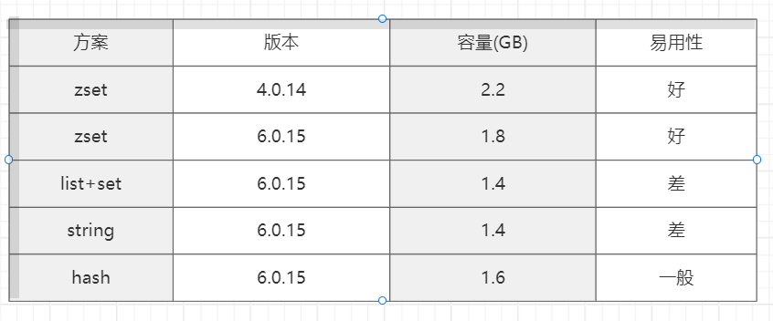
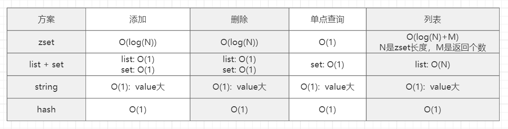

大家好，我是**华仔**, 又跟大家见面了。

从今天之后的一段时间内，华仔会带着大家一起从零开始搭建并研发一套高并发的电商实战项目，这里会涉及到很多互联网大厂开发过程中所使用的核心技术和架构设计模式，希望大家学完之后可以用到自己的简历中。

接下来我们会重点架构设计和开发一下「**社交系统**」中的重要服务：「**关注服务**」、「**计数服务**」、「**评论服务**」。

这是第二十篇，本篇我们继续进行电商实战项目社交微服务中「**关注服务**」通用基础功能设计与开发，本篇主要针对「**关注服务**」中 Redis 缓存进行成本优化分析。

文章汇总位置：[https://wx.zsxq.com/dweb2/index/columns/51122554151214](https://wx.zsxq.com/dweb2/index/columns/51122554151214)

源码授权与获取地址：[https://articles.zsxq.com/id\_1s85grnaae4p.html](https://articles.zsxq.com/id_1s85grnaae4p.html)

本章源码地址：[https://gitcode.net/u011359591/huazai-ecshop/-/tree/ecshop-chapter-](https://gitcode.net/u011359591/huazai-ecshop/-/tree/ecshop-chapter-19)20

## **01 前言**

终于要设计与研发电商项目代码了，今天我们要对社交微服务中关注服务 Redis 缓存成本优化。

这里需要注意下，我们整个项目目前是不提供前端的，这个后续有时间在搞，主要是进行后端接口以及微服务模块架构设计。

## **02 关注服务架构设计**

前面两篇我带大家已经实战了两种 Redis 数据结构实现方式，今天我们来深度剖析下千万级流量下的 Redis 缓存成本优化。

[【电商实战项目第十九篇】华仔电商实战项目关注服务通用基础功能基于 Redis Zset 和 RocketMQ 进行重构](https://articles.zsxq.com/id_wpvd2uejj8ku.html)

[【电商实战项目第十八篇】华仔电商实战项目关注服务通用基础功能基于 Redis List 和 RocketMQ 设计与开发](https://articles.zsxq.com/id_rk4je6vvs398.html)

再来回顾下「**关注服务**」的功能，这里我们还是以「**小红书**」为例：

##   
**2.1 关注服务功能**

### **2.1.1 写操作：关注/取关**

### **2.1.2 读操作：关注列表/粉丝列表**

## **2.2 关注服务数据架构**

如果不考虑使用「**图数据库**」场景外，比较常见的架构设计就是 [cache + DB](http://cache%20+%20db/)，也就是前两篇我们设计的那样，业务需要根据对「**性能**」、「**成本**」、「**稳定性**」多方面进行考虑：

1.  性能：cache 性能高。
2.  成本：cache 一般是内存型的，成本较高。
3.  稳定性：如果 cache 命中率不足，流量较大会击穿 DB。

所以用什么缓存、用多少需要和具体场景有关，都需要我们根据业务情况来具体分析。

## **2.3 关注服务基准数据与容量优化**

### **2.3.1 基准数据**

这里我们选择使用 Redis 来进行存储，测试数据如下：

1.  人数：100000+。
2.  每人关注数：1~2000+。
3.  每人粉丝数：1~100000+。

### **2.3.2 容量优化**

下面我们通过 Redis 不同版本以及不同数据结构来梳理下「**关注服务**」的使用容量：

### **2.3.2.1 Redis 4.0.14 版本**

这里我们使用 [Zset](http://zset%20/) 数据结构，其中 key、value、元素都是数字类型，占用空间大约 [2.2 G](http://2.2%20g/)。

### **关注操作：**

\# zadd userId ${timestamp} attentionID

zadd 1234567 1726359081 3456789

### **取关操作：**

\# zrem userId attentionID

zrem 1234567 3456789

### **关注列表：**

\# zrange|zrevrange userId ${start} ${end} withscores

zrange 1234567 0 -1 withscores

zrevrange 1234567 0 -1 withscores

### **是否关注默认：**

\# zscore userId attentionID

zscore 12345678 3456789

### **2.3.2.2 Redis 6.0.15 版本**

这里我们依旧使用 [Zset](http://zset/) 数据结构，其中 key、value、元素都是数字类型，占用空间大约 [1.8 G](http://1.8%20g/)。

### **关注操作：**

\# zadd userId ${timestamp} attentionID

zadd 1234567 1726359081 3456789

### **取关操作：**

\# zrem userId attentionID

zrem 1234567 3456789

### **关注列表：**

\# zrange|zrevrange userId ${start} ${end} withscores

zrange 1234567 0 -1 withscores

zrevrange 1234567 0 -1 withscores

### **是否关注默认：**

\# zscore userId attentionID

zscore 12345678 3456789

### **2.3.2.3 Redis 6.0.15 版本**

这里我们将 [Zset](http://zset/) 数据结构更换为 [List/Set](http://list/Set) 数据结构，其中 value、元素都是数字类型，占用空间大约 [1.4 G](http://1.4%20g/)。

### **关注操作：**

\# sadd userId attentionID

sadd 1234567 3456789

\# rpush userId attentionID

rpush 1234567 3456789

### **取关操作：**

\# srem userId attentionID

srem 1234567 3456789

\# lrem userId attentionID

lrem 1234567 3456789

### **关注列表：**

\# lrange userId ${start} ${end}

lrange 1234567 0 -1

### **是否关注默认：**

\# sismember userId attentionID

sismember 12345678 3456789

### **2.3.2.4 Redis 6.0.15 版本**

这里我们关注列表使用 String 存储，并使用 [ProtocolBuffer](http://protocolbuffer/) 进行序列化，占用空间大约 [1.4 G](http://1.4%20g/)。

### **关注操作：**

\# set userId attentionID

String userId = "12345678";

String attentionID = "3456789";

List<Following> followings = redis.get(userId);

followings.add(attentionID);

redis.set(userId , followings);

### **取关操作：**

\# del userId attentionID

String userId = "12345678";

String attentionID = "3456789";

List<Following> followings = redis.get(userId);

followings.remove(attentionID);

redis.set(userId , followings);

### **关注列表：**

\# get userId

String userId = "12345678";

List<Following> followings = redis.get(userId);

### **是否关注默认：**

\# sismember userId attentionID

String userId = "12345678";

String attentionID = "3456789";

List<Following> followings = redis.get(key);

return followings.contains(attentionID);

### **2.3.2.5 Redis 6.0.15 版本**

这里我们将 [Zset](http://zset/) 数据结构更换为 [Hash](http://hash/) 数据结构，占用空间大约 [1.6 G](http://1.6%20g/)。

### **关注操作：**

\# hmset userId 时间戳 attentionID

hmset 12345678 1726359081 3456789

### **取关操作：**

\# hdel userId attentionID

hdel 1234567 3456789

### **关注列表：**

\# hgetall userId 业务层排序

hgetall 1234567

### **是否关注默认：**

\# hexists userId attentionID

hexists 12345678 3456789

## **2.4 关注服务 5 种方案对比**

### **2.4.1 容量空间分析**

1.  从方案1到方案2：节省了大约 16% 的容量空间，主要是因为 [Redis 5.0.6](http://redis%205.0.6%20/) 开始，对数字类型的 [SDS](http://sds%20/) 做了优化。
2.  从方案2到方案3：节省了大约 24% 的容量空间，主要是因为数字类型的 [set](http://set%20/) 内部用的是 [intset](http://intset/)、[list](http://list%20/) 也会使用 [quicklist](http://quicklist/) 进行压缩，由于关注数大约是 1-2000+，zset 会大量使用 [skiplist + hashtable](http://skiplist%20+%20hashtable/) 实现，数据结构整体占用偏大。
3.  方案 4：因为使用了 [ProtocolBuffer](http://protocolbuffer%20/) 序列化，所以整体容量空间也偏低。
4.  方案 5：单个 [hashtable](http://hashtable/) 比 [zset](http://zset%20/) 会节省很多空间。

###   
**2.4.2 易用性分析**

1.  [zset](http://zset/)：这个方案比较适合、关注服务的几个场景都比较符合需求，同时支持 start -> end 查询。
2.  [list+set](http://list+set/)：这个方案比较麻烦，现在两种结构操作，QPS 多了一倍，还需要保证原子性操作。
3.  [string](http://string/)：这个方案比较麻烦，增删查操作都需要反序列化，尤其是元素个数较多可能对业务侧 cpu 开销比较大。
4.  [hash](http://hash/)：这个方案相对麻烦，增删操作还好，但业务 [hgetall](http://hgetall%20/) 后需要根据 value 进行排序还是有一定开销的。

###   
**2.4.3 时间复杂度分析**

综上得出，使用 Zset 数据结构，不论是从「**容量空间**」、「**易用性**」、「**时间复杂度**」几个方面综合都是最适合的，所以在实际业务场景中需要对上述综合考虑进行架构设计。