从今天之后的一段时间内，华仔会带着大家一起从零开始搭建并研发一套高并发的电商实战项目，这里会涉及到很多互联网大厂开发过程中所使用的核心技术和架构设计模式，希望大家学完之后可以用到自己的简历中。

这是第五十七篇，本篇我们来介绍整个电商实战项目中最重要的模块之一：「**支撑千万级惠券服务**」的业务场景介绍。

文章汇总位置：[https://wx.zsxq.com/dweb2/index/columns/51122554151214](https://wx.zsxq.com/dweb2/index/columns/51122554151214)

源码授权与获取地址：[https://articles.zsxq.com/id\_1s85grnaae4p.html](https://articles.zsxq.com/id_1s85grnaae4p.html)

本章源码地址：[https://gitcode.net/u011359591/huazai-ecshop/-/tree/ecshop-chapter-57](https://gitcode.net/u011359591/huazai-ecshop/-/tree/ecshop-chapter-57)

## **01 前言**

终于要设计与研发电商项目代码了，目前前端除「**购物车**」、「**商品**」之外其他的基本都对接了，在「**优惠券**」服务快结束之前会增加「**购物车**」、「**商品**」、「**优惠券**」前端页面。

今天我们来梳理下整个电商实战项目中「**支撑千万级惠券服务**」的业务场景介绍。

##   
**02 优惠券服务场景介绍**

这里我们要打造的是一个支撑「**千万级数据量**」的「**高性能**」优惠券服务，目标是能承受数万次查询和推送的能力。

整个电商实战项目旨在帮助校招和社招的同学掌握足够的亮点，为获得理想的 offer 助力。

##   
**2.1 优惠券业务场景**

对于电商平台来说，优惠券是不可或缺的，从其业务属性来看，优惠券又分为「**平台券**」和「**商家券**」，在此之上券类型分为「**折扣券**」、「**满减券**」、以及立减券。当然，优惠券的领取和使用同样具有限制。

这里我们主要还是以「**小红书**」为例，来看看其「**优惠券服务**」都有哪些功能，使用场景如下：

  
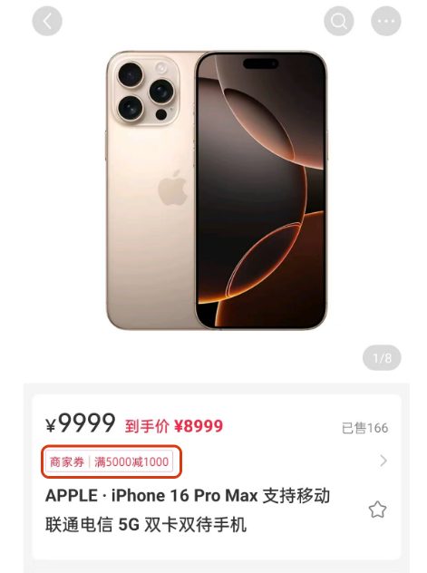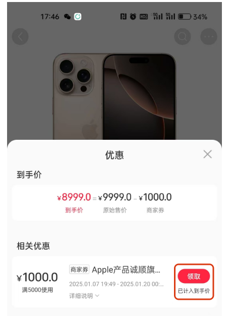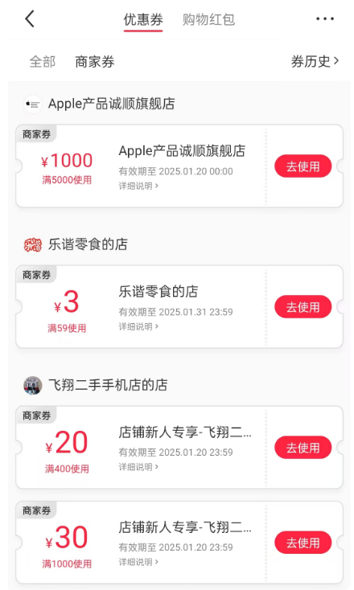

  
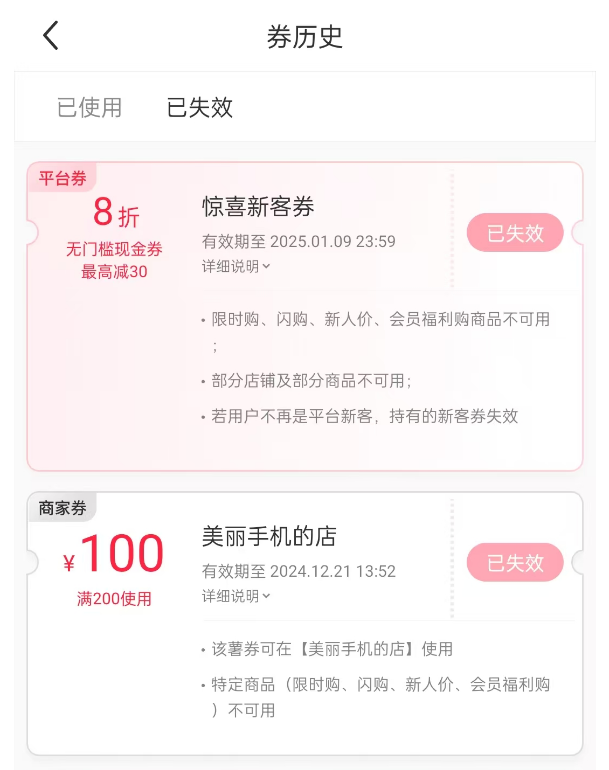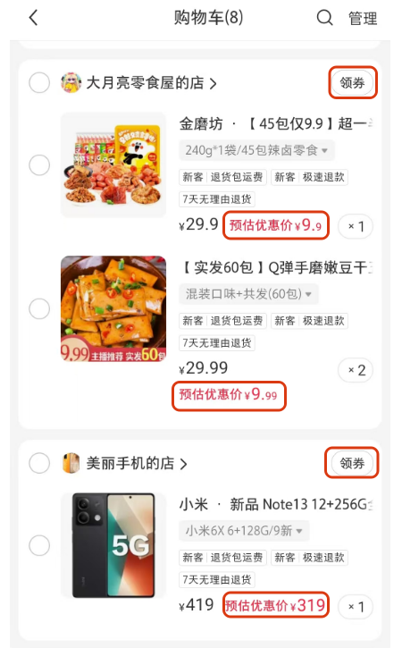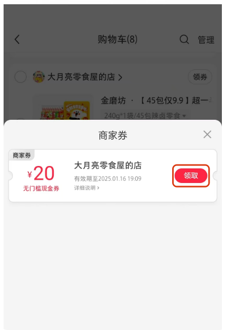

从小红书 APP 可以看出，优惠券主要用在「**购物车**」、「**商品详情页**」、「**推送提醒**」中进行领取，然后在个人中心可以查看之前领取的「**优惠券列表**」，对于使用过的优惠券可以在「**已使用**」标签页查看，过期的优惠券可以在 「**已失效**」标签页查看。

##   
**2.2 优惠券业务需求**

在电商平台中，「**发放优惠券**」是再常见不过的「**营销活动**」了，用户通过「**领取优惠券**」可以得到一定的金额减免，不同的位置、优惠券的类别、领取方式等都会影响到用户对优惠券的使用。

###   
**2.2.1 优惠券介绍**

按照不同的分类方式，优惠券可被分为不同类型，下面是优惠券的四种分类方式:

1.  按券的叠加方式划分。
2.  按券的领取方式划分。
3.  按券的领取位置划分。
4.  按券的使用功能划。

### **1、按优惠券的叠加方式划分**

按券的类型划分为「**可叠加券**」和「**不可叠加券**」。券的类型不同，在结算时叠加的方式有所不同，如下图所示：

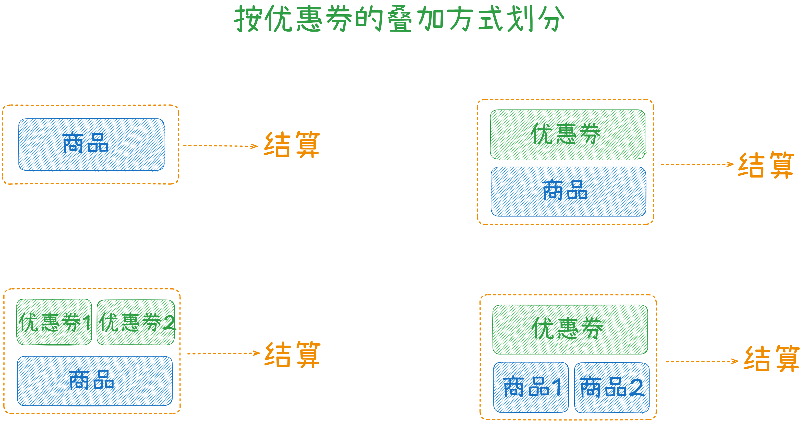

### **2、按优惠券的领取方式划分**

优惠券的领取方式可以分为「**主动领取**」、「**被动推送**」，其中主动领取是用户在展示位主动点击领取，被动推送是平台通过批量下发推送，如下图：

  
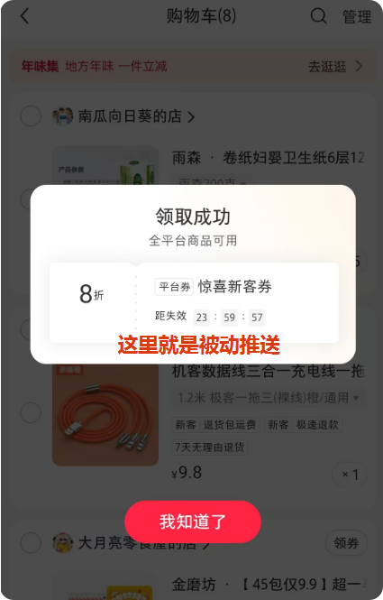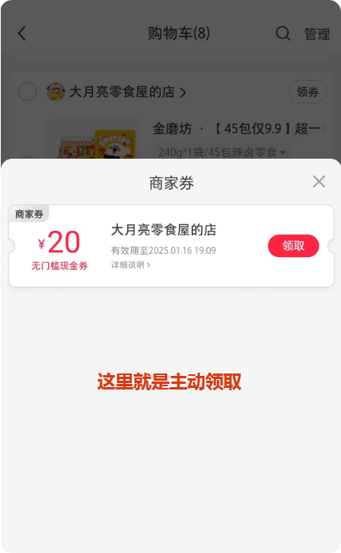

### **3、按优惠券的使用功能划分**

### **3.1、满减券**

优惠金额和限额要求为因定数值的优惠券，属于最常见的优惠券类型。规则结构为：满x元减y元，例如满100元减20元;其中，x为满限制，可为0; y为抵扣金额。满额限制为 0 时即为无满额要求的优惠券，通常称为立减券或者无门槛优惠券。

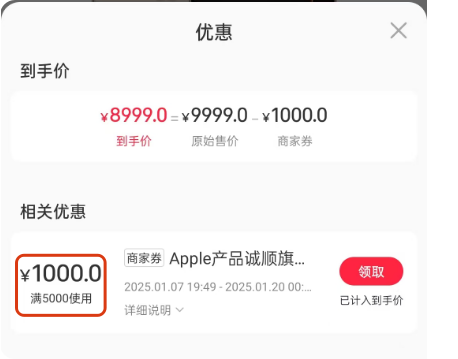

### **3.2、折扣券**

优惠金额为折扣模式的优惠券。规则结构为：满 x 元享 y %折和，最多抵扣 2 元；其中，x 为满额限制，可为 0:y为折扣，百分比格式: 2 为抵扣上限，可为不限。核心通过 y 进行打折，根据业务场景，通过 x 和 z 进行优惠券抵扣门槛和上限的控制。

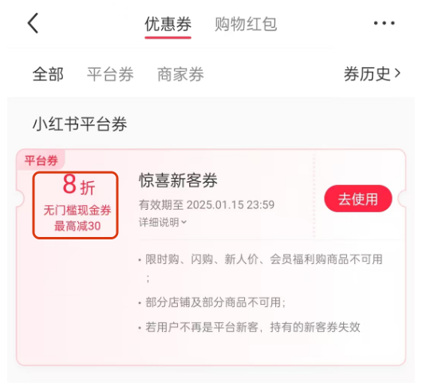

### **3.3、兑换券**

优惠金额和商品售价相关的优惠券。规则结构为：兑换 y 件商品(适用范围内)。兑换券主要用于拉新或活动奖励，供用户对若干价值相近的商品进行选择赠送。

兑换券相当于全额抵扣，所以大多数场最下，兑换券的运用商品数量会很有限，在这种情况下，可以使用满减券近似代替兑换券，达到活动效果，而不必专门支持兑换券的优惠券类型。

### **3.4、小结**

这里我们只支持前两种优惠券类型，最后一个兑换券就先不支持了。

### **2.2.2 优惠券适用范围**

1.  指定商品模式：优惠券模板和特定商品建立关联。仅指定的多个商品可使用优惠券。
2.  范围筛选模式：范围的维度和商品分类的维度有关，常用的范围为：类目和品牌，优惠券板不直援和商品建立管理，仅和商品类目残品牌建立关系。即:优惠券适用于指定类目下的商品。例如：双11的手机专场券，仅可在手机类目下使用。、
3.  无门槛模式：就是全平台的商品都可以用。

###   
**2.2.3 优惠券有效期**

优惠券的有效期一般有两种模式：一种是团定时间，一种是领取后x天有效。

1.  固定时间段有效的有效期模式。有效期为精确的时间点，例如:2024.11.11 00:00:00~23:59:59。此类优惠券无论何时发放残领取，用户收到的券的有效时间即为因定;此类券具有分批发放，配合大促类活动的特点。
2.  例如：双 11 的券是为了配合双 11 大促，在预拍阶段即分批对用户发放，有效期是固定的双 11 当天。
3.  领取后 X 天有效：有效期取决于发放时间的有效期模式。有效期为相对的天数，领取后 x 天内有效，例如:领取后 3 天内有效。此类券多用于日常活动，和具体发放的时间有关。例如:订单满 100 可获得 7 天内有效的满100 减 10 元券，用于促进下单用户的再次购买。
4.  有一个细节点在于：为了便于用户理解和使用，在 x 天的照制上，一般不会直接采用 x\*24 小时的方式，而是采用截止时间点在最后一天 23:59:59 的方式。例如：订单满 100 可获得 7 天内有效的满 100 减 10 元券，用户在 2025 年 01 月 01 日 20:00 确定收货，获得优惠券时，有效时间一般是 01 月 01 日 11:00:00-01月08日23:59:59，而非以 7\*24 模式计算截止时间。

## **2.3 优惠券业务架构**

通过对「**优惠券场景**」的剖析，我梳理了如下「**优惠券服务**」的整个业务架构，以及要实现的相关功能，基本上包含了市面上各类电商平台「**优惠券服务**」的功能。

这里拆分了「**优惠券中台服务**」、「**优惠券后台管理服务**」、以及需要「**异步处理**」的相关服务。

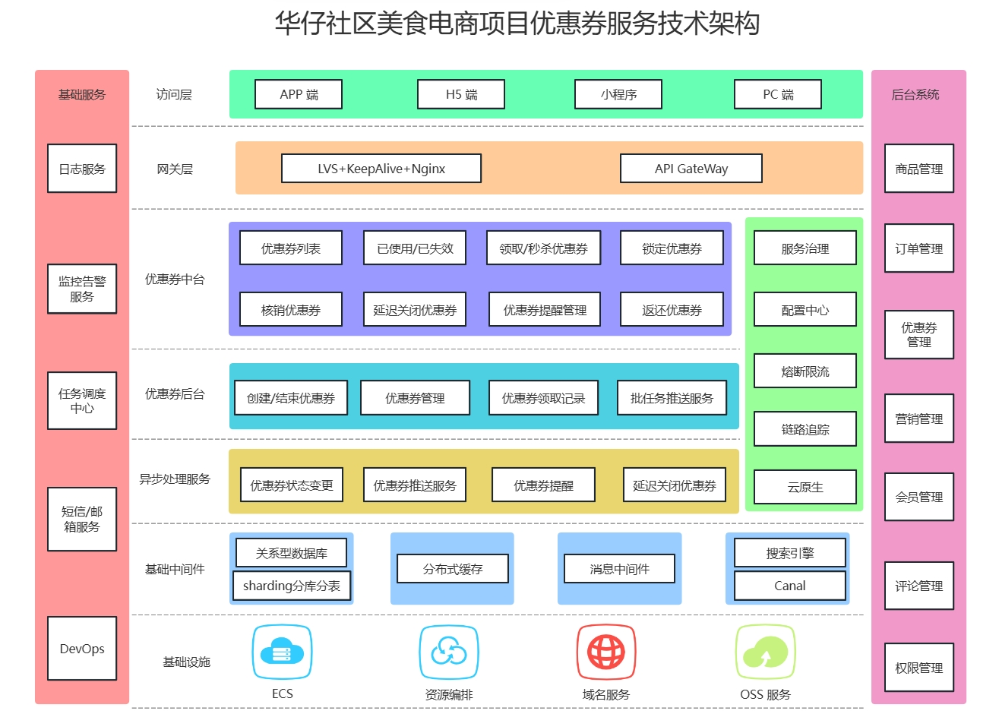

后面会按照这个架构图进行功能设计。

1.  前台服务：优惠券列表、已使用/已失效列表、优惠券推送提醒、优惠券领取与使用。
2.  后台服务：优惠券管理、领取记录管理、批次任务推送服务。
3.  前台界面：购物车、商品、优惠券推送、展示、领取、使用。