从今天之后的一段时间内，华仔会带着大家一起从零开始搭建并研发一套高并发的电商实战项目，这里会涉及到很多互联网大厂开发过程中所使用的核心技术和架构设计模式，希望大家学完之后可以用到自己的简历中。

接下来我们会重点进行「**商品中心服务详情页架构设计**」。这是第五十三篇，本篇我们继续进行电商实战项目设计与开发，本篇来梳理下「**亿级流量大型电商商品中心详情页动态渲染服务功能开发**」。

文章汇总位置：[https://wx.zsxq.com/dweb2/index/columns/51122554151214](https://wx.zsxq.com/dweb2/index/columns/51122554151214)

源码授权与获取地址：[https://articles.zsxq.com/id\_1s85grnaae4p.html](https://articles.zsxq.com/id_1s85grnaae4p.html)

本章源码地址：[https://gitcode.net/u011359591/huazai-ecshop/-/tree/ecshop-chapter-53](https://gitcode.net/u011359591/huazai-ecshop/-/tree/ecshop-chapter-53)

## **01 前言**

终于要设计与研发电商项目代码了，今天我们主要对实战项目进行「**亿级流量大型电商商品中心详情页动态渲染服务功能开发**」。

这里需要注意下，我们整个项目目前是不提供前端的，这个后续有时间在搞，主要是进行后端接口以及微服务模块架构设计。

## **02 亿级流量商品中心动态渲染服务功能开发**

这里就不挨个堆很多细节的功能进行开发，只是把主要的动态渲染服务相关的流程跑通即可。

本篇我们主要实现下图展示的功能。

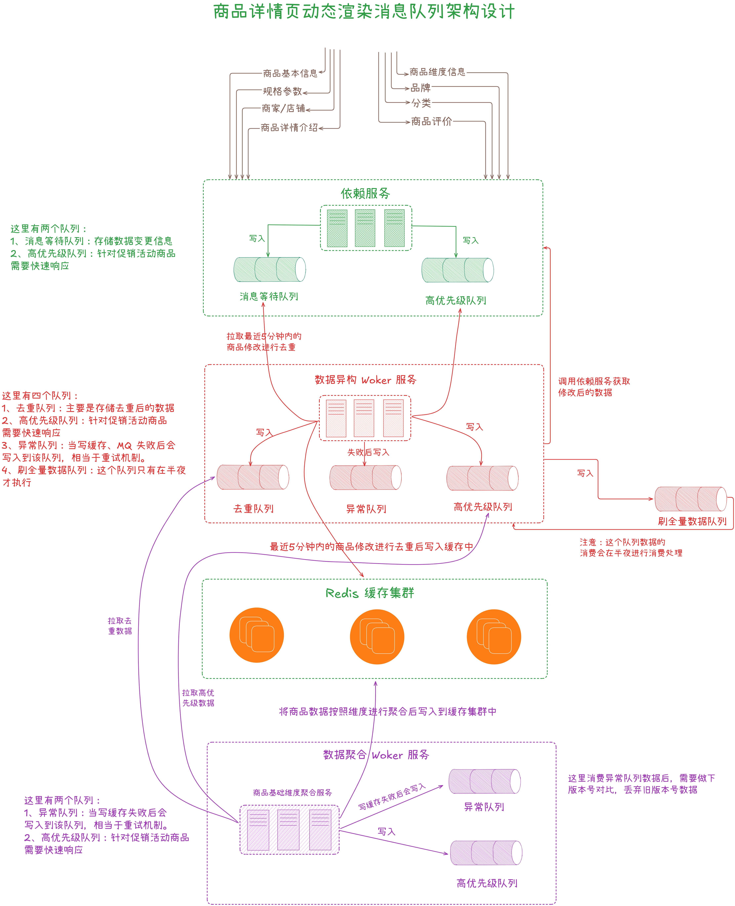

## **2.1 依赖服务变更消息通知**

这里以「**商品品牌**」为例来展示依赖服务变更消息通知，其实很简单，代码如下：

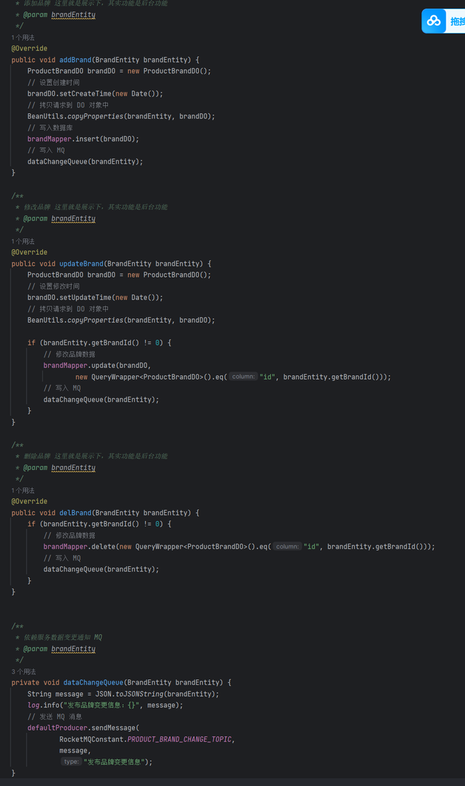

可以看到「**增删改操作内容**」会发送到 MQ 中，如果抽离一个「**单独服务**」的话，只需要发送「**增删改操作**」，然后「**数据异步 Woker 服务**」会通过 feign 来远程获取源数据，这里为了简化就不单独搞了，测试效果如下：

  
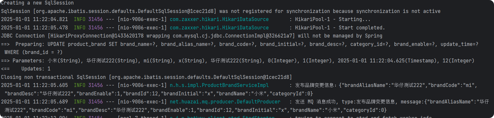

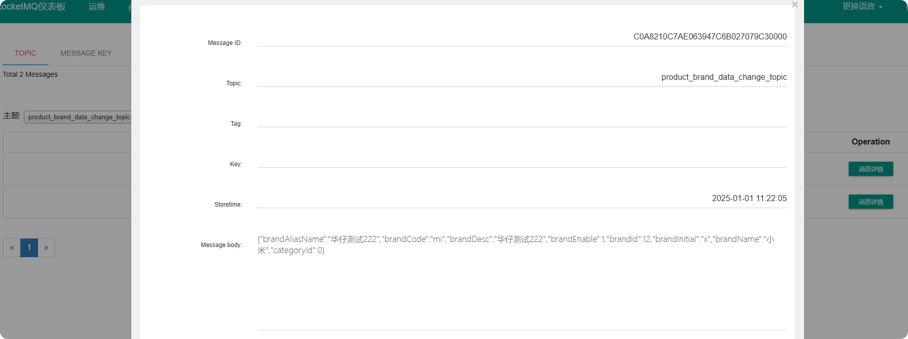

## **2.2 数据异构 Worker 服务**

这个服务用来做数据同步的，这里为了简化操作就不单独搞一个服务了，而是将其抽象成一个消费者。

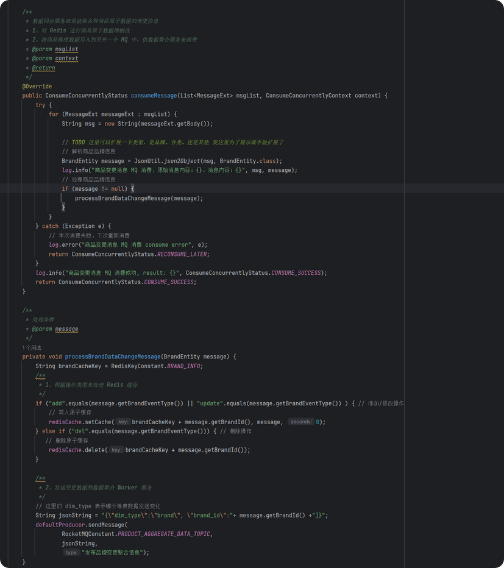

可以看到这里主要做两件事情：

1.  对原子数据进行 Redis 缓存变更操作。
2.  发送变更数据到数据聚合 Worker 服务。

测试效果如下：

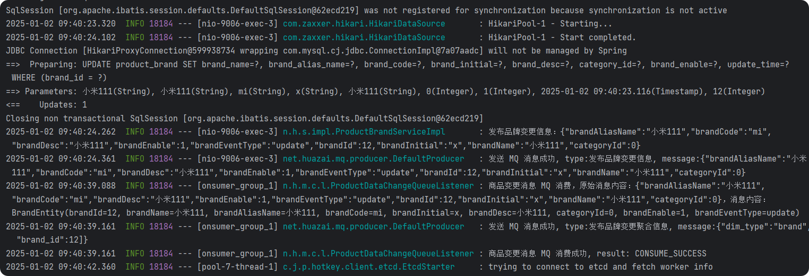

## **2.3 数据聚合 Worker 服务**

这个服务用来做数据聚合的，这里为了简化操作就不单独搞一个服务了，而是将其抽象成一个消费者。

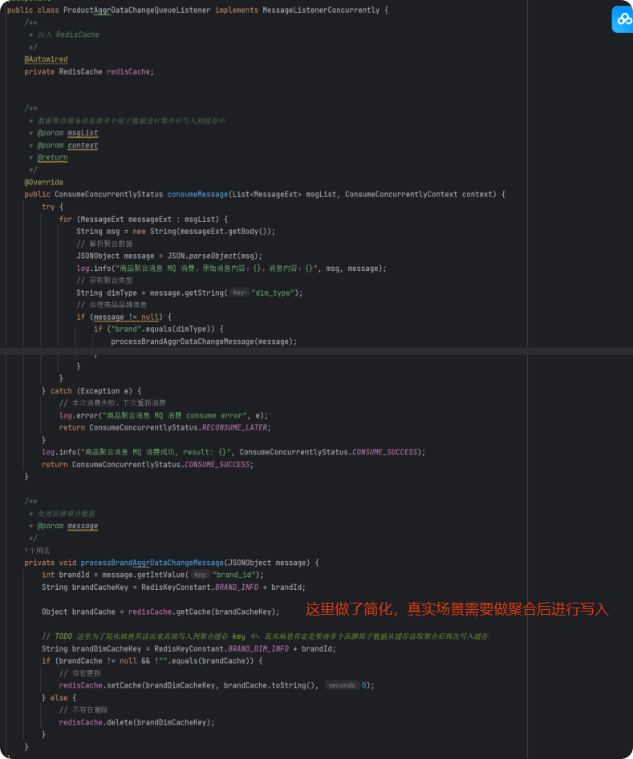

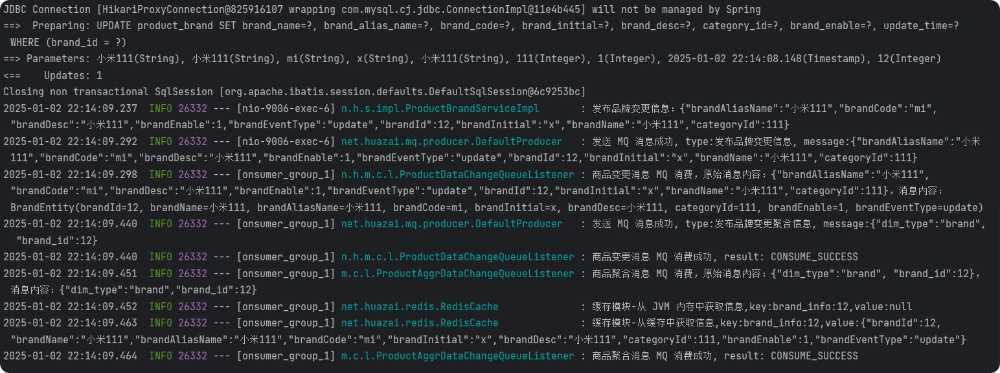

## **2.4 复杂消息队列架构设计**

### **2.4.1 去重队列**

前两节做了「**数据异构 Worker 服务**」和 「**数据聚合 Worker 服务**」，可以看的我们都是收到消息后立即写入 Redis 缓存了，其实没必要，针对重复的原子数据可能会执行多次，所以这里我们需要做下去重操作，降低 Redis 服务压力。

先来看下「**数据异构 Worker 服务**」，这里我会在内存中申请一个线程安全的 Set ，然后在内存中进行去重操作，最后定时检测并发送消息到「**数据聚合 Worker 服务**」，代码如下：

  
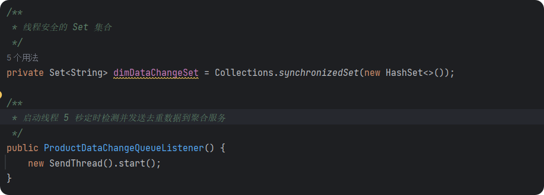

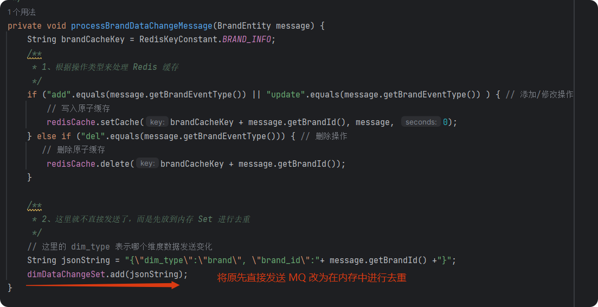

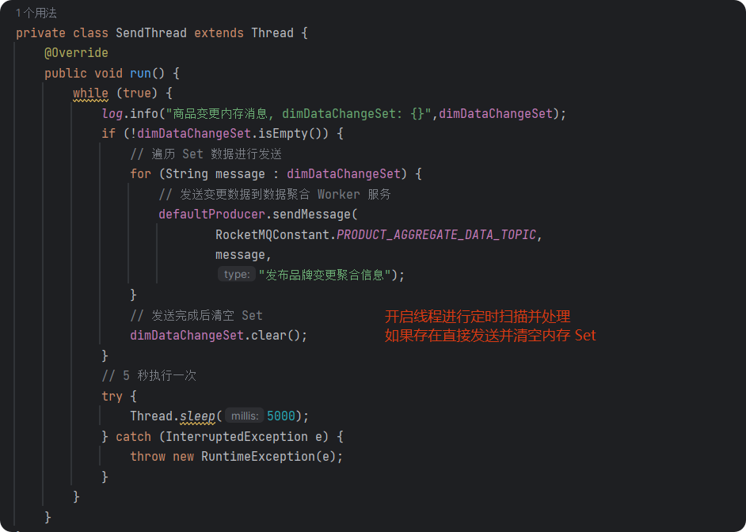

  
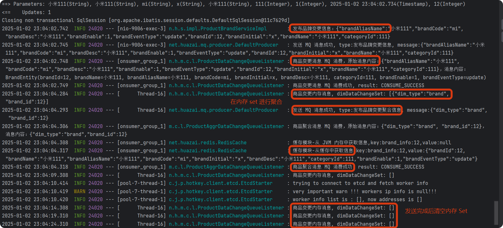

### **2.4.2 刷数据、高优先级队列**

对于一些特别紧急的活动数据，需要快速反应到前台页面中去，那么如何这些高优先级的数据跟其他普通消息混在一个队列中的话，势必需要等待其他普通消息处理完毕了，才能轮到自己。

所以这里我们会单独开一个「**高优先级队列**」独立处理，这个是系统架构设计中必须考虑的，否则很容易造成各种问题，影响公司运营流程。

由于这块不是本系列课程的重点，这里就暂不通过设计模式来实现了，就简单来展示一下，感兴趣的童鞋可以来抽象一下。

  
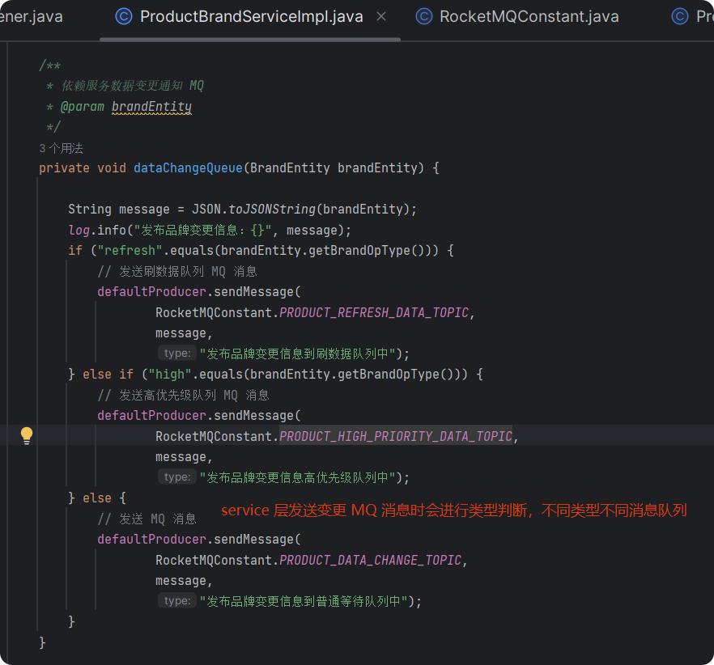

这样的话，我们会将「**数据异构 Worker 服务**」和 「**数据聚合 Worker 服务**」拆分为「**普通等待队列**」和 「**刷数据队列**」、「**高优先级数据队列**」。

  
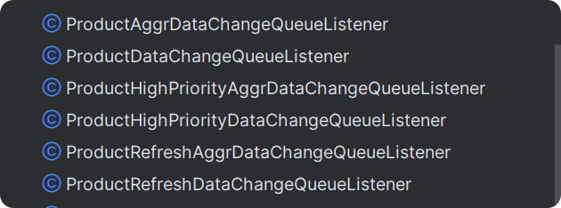

## **2.5 分发层、应用层 Nginx + Lua 开发**

这里需要对「**分发层 Nginx**」、「**应用层 Nginx**」进行 Lua 脚本的支持，并开发相关处理逻辑。

下面先来看下 「**分发层 Nginx**」，其 Nginx + Lua 工程化项目结构：

  
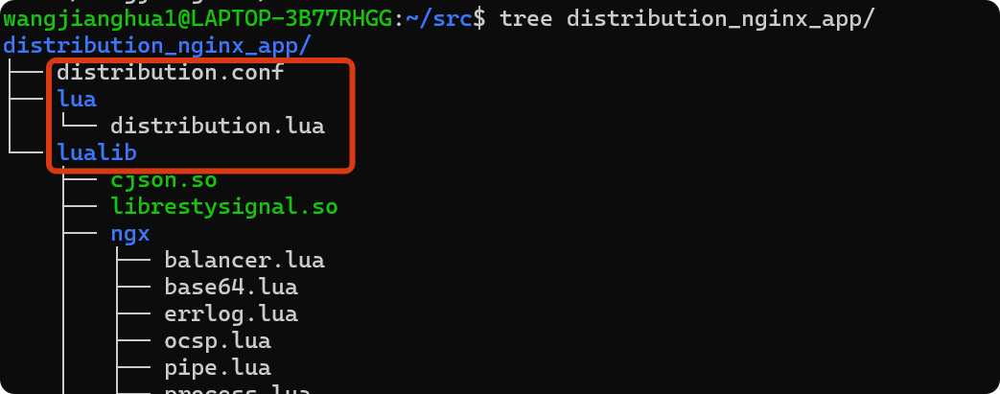

关于 [distribution.conf](http://distribution.conf/) 配置文件内容如下：

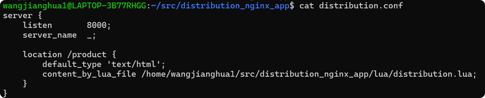

server {

listen 8000;

server\_name \_;

location /product {

default\_type 'text/html';

content\_by\_lua\_file /home/wangjianghua1/src/distribution\_nginx\_app/lua/distribution.lua;

}

}

关于 lualib 目录下的内容可以直接复制之前编译安装 Nginx 时 lualib 目录下的文件。

  
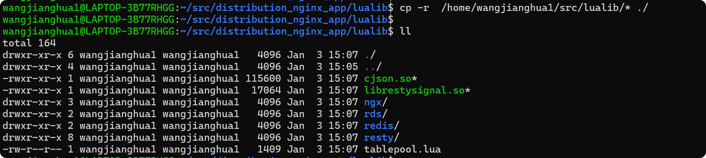

修改 nginx 配置文件，添加如下内容：

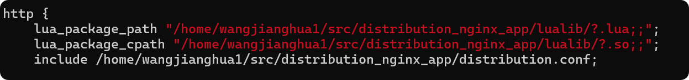

关于 [distribution.lua](http://%20distribution.lua/) 脚本内容如下：

local uri\_args = ngx.req.get\_uri\_args()

local productId = uri\_args\["productId"\]

local hosts = {"192.168.33.12:8000"}

local hash = ngx.crc32\_long(productId)

local index = (hash % 2) + 1

local backend = "http://"..hosts\[index\]

local requestPath = uri\_args\["requestPath"\]

requestPath = "/"..requestPath.."?sku\_id="..productId

local http = require("resty.http")

local httpc = http.new()

local resp, err = httpc:request\_uri(backend,{

method = "GET",

path = requestPath

})

if not resp then

ngx.say("request error: ", err)

return

end

ngx.say(resp.body)

httpc:close()

另外这里我们需要用到两个 http 模块。

cd /home/wangjianghua1/src/distribution\_nginx\_app/lualib/resty/

wget https://github.com/ledgetech/lua-resty-http/blob/master/lib/resty/http\_headers.lua

wget https://github.com/ledgetech/lua-resty-http/blob/master/lib/resty/http.lua

再来看下 「**应用层 Nginx**」，其 Nginx + Lua 工程化项目结构：

  
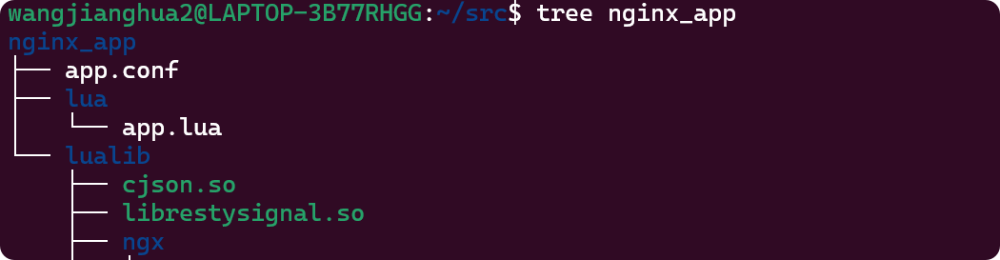

关于 [app.conf](http://app.conf/) 配置文件内容如下：

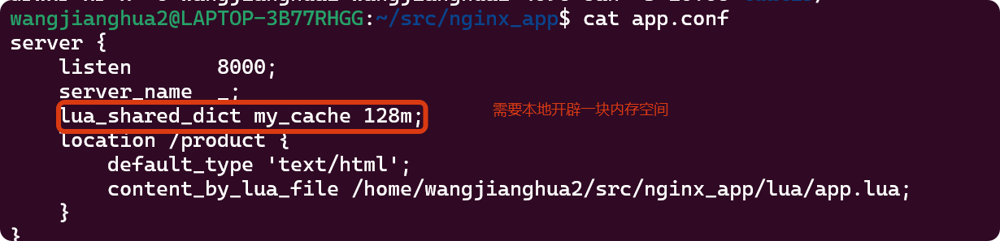

server {

listen 8000;

server\_name \_;

lua\_shared\_dict my\_cache 128m;

location /product {

default\_type 'text/html';

content\_by\_lua\_file /home/wangjianghua2/src/nginx\_app/lua/app.lua;

}

}

关于 lualib 目录下的内容可以直接复制之前编译安装 Nginx 时 lualib 目录下的文件。

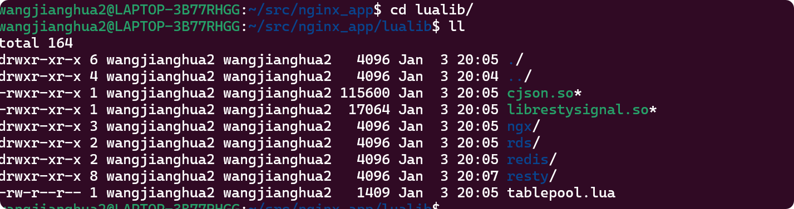  

  
关于 [app.lua](http://app.lua/) 脚本内容如下：

\-- 加载相关依赖包

local cjson = require("cjson")

local http = require("resty.http")

local redis = require("resty.redis")

\-- 关闭 Redis

local function close\_redis(redis)

if not redisthen

return

end

local pool\_max\_idle\_time = 10000

local pool\_size = 100

local ok, err = redis:set\_keepalive(pool\_max\_idle\_time, pool\_size)

if not ok then

ngx.say("set keepalive error : ", err)

end

end

\-- 读取参数

local uri\_args = ngx.req.get\_uri\_args()

\-- 解析商品id

local productId = uri\_args\["productId"\]

\-- 获取 nginx\_local\_cache

local cache\_ngx = ngx.shared.my\_cache

\-- local\_cache key

local productCacheKey = "product\_info:"..productId

\-- 读取 nginx\_local\_cache 商品缓存

local productCache = cache\_ngx:get(productCacheKey)

\-- nginx\_local\_cache 本地商品缓存为空则通过 Twemproxy 读取 Redis 缓存数据

if productCache == "" or productCache == nil then

local red = redis:new()

red:set\_timeout(1000)

\-- 本地从缓存连接 地址:端口 自行更换

local ip = "192.168.32.12"

local port = 1112

local ok, err = red:connect(ip, port)

if not ok then

ngx.say("connect to redis error : ", err)

return close\_redis(red)

end

local redisResp, redisErr = red:get("product\_dim\_info:"..productId)

\-- 如果 Redis 从缓存集群为空，则从数据直连服务读取

if redisResp == ngx.null then

local httpc = http.new()

\-- 地址:端口 自行更换

local resp, err = httpc:request\_uri("http://localhost:9006",{

method = "POST",

path = "/api/product/sku/v1/get\_sku\_Info?sku\_id="..productId

})

productCache = resp.body

end

productCache = redisResp

math.randomseed(tostring(os.time()):reverse():sub(1, 7))

local expireTime = math.random(600, 1200)

\-- 最终拿到商品数据后写入到 nginx\_local\_cache

cache\_ngx:set(productCacheKey, productCache, expireTime)

end

\-- 品牌、分类等其他维度信息都是上述流程，先从 nginx\_local\_cache 本地缓存查询，如果没有则去缓存从集群拉取，如果还没有需要从直连服务去拉取，最终返回写入到 nginx\_local\_cache

local context = {

productInfo = productCache,

}

local template = require("resty.template")

template.render("product.html", context)

另外这里需要两个模板解析。

cd /home/wangjianghua2/src/nginx\_app/lualib/resty/

wget https://github.com/bungle/lua-resty-template/blob/master/lib/resty/template.lua

\# 接着新建一个 html 目录，在 html 目录下下载

wget https://github.com/bungle/lua-resty-template/blob/master/lib/resty/template/html.lua

接着在 [app.conf](http://app.conf/) 中配置模板位置相关内容：

set $template\_location "/templates";

set $template\_root "/home/wangjianghua2/src/nginx\_app/templates";

  
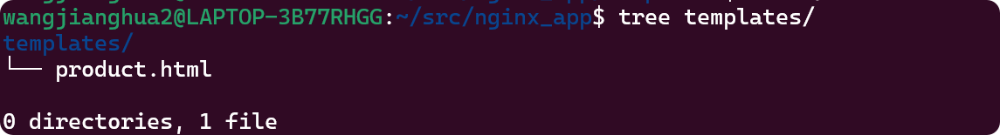

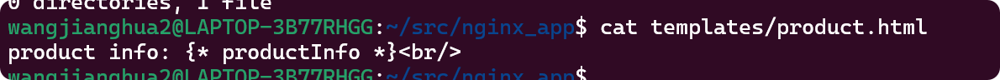

## **2.6 数据直连服务开发**

先从 nginx\_local\_cache 本地缓存查询，如果没有则去缓存从集群拉取，如果还没有需要从直连服务去拉取，最终返回写入到 nginx\_local\_cache。

这里也只是展示下，就不搞「**单独服务**」了，直接在商品接口中进行改造，这块比较简单，如下：

/\*\*

\* 获取商品 sku 基础信息

\* @param skuId

\* @return

\*/

@Override

public ProductSkuVO getSkuInfo(Long skuId) {

log.info("商品 sku 模块-从数据库获取商品信息，skuId:{}", skuId);

ProductSkuDO productSkuDO \= new ProductSkuDO();

// 先从缓存中获取商品信息

productSkuDO = getSkuInfoFromCache(skuId);

// 缓存为空

if (productSkuDO == null) {

// 从数据库中获取商品信息

productSkuDO = getSkuInfoFromDB(skuId);

// 如果为空，则返回空

if (productSkuDO == null) {

return null;

}

}

ProductSkuVO infoVO \= new ProductSkuVO();

BeanUtils.copyProperties(productSkuDO, infoVO);

log.info("商品 sku 模块-从数据库获取 sku 基础信息，detailVO：{}", infoVO);

return infoVO;

}

/\*\*

\* 从缓存中读取商品信息

\* @param skuId

\* @return

\*/

private ProductSkuDO getSkuInfoFromCache(Long skuId) {

String skuKey \= RedisKeyConstant.PRODUCT\_DIM\_INFO + skuId;

// 从缓存中获取数据

Object skuValue \= redisCache.getCache(skuKey);

// 判断是否是热 Key

if (JdHotKeyStore.isHotKey(skuKey)) {

// 是热 Key

log.info("商品 sku 模块-从 JVM 内存获取商品信息，Key:{}，Value:{}", skuKey, skuValue);

} else {

// 不是热 key

log.info("商品 sku 模块-从缓存获取商品信息，Key:{}，Value:{}", skuKey, skuValue);

}

// 当读到空数据时返回空，防止缓存穿透

if (Objects.equals(redisCache.EMPTY\_CACHE, skuValue)) {

return new ProductSkuDO();

} else if (skuValue instanceof ProductSkuDO) {

// 如果是对象，则是从内存中获取到的数据，直接返回

return (ProductSkuDO) skuValue;

} else if (skuValue instanceof String) {

// 如果是字符串，则是从缓存中获取到的数据，转换成对象之后返回

ProductSkuDO productSkuDO \= JsonUtil.json2Object((String) skuValue, ProductSkuDO.class);

log.info("商品 sku 模块-解析商品缓存信息，skuKey:{}，skuValue:{}", skuKey, skuValue);

return productSkuDO;

}

return null;

}

private ProductSkuDO getSkuInfoFromDB(Long skuId) {

// 极端情况下: 查数据库前再次尝试从缓存中获取，如果缓存存在直接返回

ProductSkuDO productSkuDO \= getSkuInfoFromCache(skuId);

if (productSkuDO != null) {

return productSkuDO;

}

log.info("商品 sku 模块-商品缓存详情为空，从数据库获取商品 sku 基础信息，skuId:{}", skuId);

// 从数据库中获取商品详情

ProductSkuDO skuInfo \= productSkuMapper.selectById(skuId);

// 如果为空，则返回空

if (skuInfo == null) {

return null;

}

// 商品详情缓存 key

String skuKey \= RedisKeyConstant.PRODUCT\_DIM\_INFO + skuId;

// 如果从数据库中读取为空数据

if (Objects.isNull(skuInfo)) {

// 设置一个空数据到缓存，过期时间为穿透的过期时间，30~100秒

redisCache.setCache(skuKey, redisCache.EMPTY\_CACHE, RedisCache.generateCachePenetrationExpire());

return null;

}

// 写入缓存

redisCache.setCache(skuKey, skuInfo, 0);

return skuInfo;

}

## **2.7 高可用架构读链路多级缓存降级**

整个链路架构图如下：

从整个架构图可以看出：

1.  本机房 Redis 从集群可能会挂掉，降级为直接连数据直连服务。
2.  数据直连服务也可能会挂掉：降级为跨机房直接连 Redis 主集群。

\-- 加载相关依赖包

local cjson = require("cjson")

local http = require("resty.http")

local redis = require("resty.redis")

\-- 关闭 Redis

local function close\_redis(redis)

if not redis then

return

end

local pool\_max\_idle\_time = 10000

local pool\_size = 100

local ok, err = red:set\_keepalive(pool\_max\_idle\_time, pool\_size)

if not ok then

ngx.say("set keepalive error : ", err)

end

end

\-- 读取参数

local uri\_args = ngx.req.get\_uri\_args()

\-- 解析商品id

local productId = uri\_args\["productId"\]

\-- 获取 nginx\_local\_cache

local cache\_ngx = ngx.shared.my\_cache

\-- local\_cache key

local productCacheKey = "product\_info:"..productId

\-- 读取 nginx\_local\_cache 商品缓存

local productCache = cache\_ngx:get(productCacheKey)

\-- nginx\_local\_cache 本地商品缓存为空则判断缓存从集群是否已经降级

if productCache == "" or productCache == nil then

\-- 获取从集群降级标志

local slaveRedisDegrade = cache\_ngx:get("slaveRedisDegrade")

\-- 如果从集群已经降级则降级读取数据直连服务降级标志

if slaveRedisDegrade == "true" then

local dataLinkDegrade = cache\_ngx:get("dataLinkDegrade")

\-- 如果数据直连服务已经降级，则降级连接跨机房直接连 Redis 主集群

if dataLinkDegrade == true then

local red = redis:new()

red:set\_timeout(1000)

local ip = "192.168.32.12"

local port = 1111

local ok, err = red:connect(ip, port)

local redisResp, redisErr = red:get("product\_dim\_info:"..productId)

\-- 获取 Redis 主集群结果

productCache = redisResp

local curTime = os.time()

local diffTime = os.difftime(curTime, cache\_ngx:get("startdataLinkDegradeTime"))

\-- 尝试连接，如果正常取消降级标志

if diffTime > 60 then

local httpc = http.new()

local resp, err = httpc:request\_uri("http://localhost:9006",{

method = "POST",

path = "/api/product/sku/v1/get\_sku\_Info?sku\_id="..productId

})

if resp then

\-- 正常返回则数据直连服务降级标志取消

cache\_ngx:set("dataLinkDegrade", "false")

end

end

\-- 检测数据直连服务失败次数，达到阈值后进行降级

else

local httpc = http.new()

local resp, err = httpc:request\_uri("http://localhost:9006",{

method = "POST",

path = "/api/product/sku/v1/get\_sku\_Info?sku\_id="..productId

})

if not resp then

ngx.say("request error :", err)

\-- 计算数据直连服务调用失败数

local dataLinkFailureCnt = cache\_ngx:get("dataLinkFailureCnt")

cache\_ngx:set("dataLinkFailureCnt", dataLinkFailureCnt + 1)

\-- 超过 10 次进行降级

if dataLinkFailureCnt > 10 then

cache\_ngx:set("dataLinkDegrade", "true")

cache\_ngx:set("startDataLinkDegradeTime", os.time())

end

end

productCache = resp.body

\-- 尝试连接 Redis 从集群

local curTime = os.time()

local diffTime = os.difftime(curTime, cache\_ngx:get("startSlaveRedisDegradeTime"))

if diffTime > 60 then

local red = redis:new()

red:set\_timeout(1000)

local ip = "192.168.33.12"

local port = 1112

local ok, err = red:connect(ip, port)

if ok then

\-- 如果正常缓存从集群降级标志取消

cache\_ngx:set("slaveRedisDegrade", "false")

end

end

end

else

\-- 尝试连接 Redis 从集群

local red = redis:new()

red:set\_timeout(1000)

local ip = "192.168.33.12"

local port = 1112

local ok, err = red:connect(ip, port)

if not ok then

ngx.say("connect to redis error : ", err)

\-- 计算从集群连接失败数

local slaveRedisFailureCnt = cache\_ngx:get("slaveRedisFailureCnt")

cache\_ngx:set("slaveRedisFailureCnt", slaveRedisFailureCnt + 1)

\-- 超过 10 次进行降级

if slaveRedisFailureCnt > 10 then

cache\_ngx:set("slaveRedisDegrade", "true")

cache\_ngx:set("startSlaveRedisDegradeTime", os.time())

end

\-- 关闭 redis

return close\_redis(red)

end

local redisResp, redisErr = red:get("product\_dim\_info:"..productId)

if redisResp == ngx.null or redisResp == "" or redisResp == nil then

local dataLinkDegrade = cache\_ngx:get("dataLinkDegrade")

\-- 如果数据直连服务已经降级，则降级连接跨机房直接连 Redis 主集群

if dataLinkDegrade == "true" then

local red = redis:new()

red:set\_timeout(1000)

local ip = "192.168.32.12"

local port = 1111

local ok, err = red:connect(ip, port)

local redisResp, redisErr = red:get("product\_dim\_info:"..productId)

productCache = redisResp

local curTime = os.time()

local diffTime = os.difftime(curTime, cache\_ngx:get("startdataLinkDegradeTime"))

if diffTime > 60 then

local httpc = http.new()

local resp, err = httpc:request\_uri("http://localhost:9006",{

method = "POST",

path = "/api/product/sku/v1/get\_sku\_Info?sku\_id="..productId

})

if resp then

cache\_ngx:set("dataLinkDegrade", "false")

end

end

else

\-- 直接连接数据直连服务

local httpc = http.new()

local resp, err = httpc:request\_uri("http://localhost:9006",{

method = "POST",

path = "/api/product/sku/v1/get\_sku\_Info?sku\_id="..productId

})

if not resp then

ngx.say("request error :", err)

\-- 计算数据直连失败次数

local dataLinkFailureCnt = cache\_ngx:get("dataLinkFailureCnt")

cache\_ngx:set("dataLinkFailureCnt", dataLinkFailureCnt + 1)

\-- 超过 10 次进行降级

if dataLinkFailureCnt > 10 then

cache\_ngx:set("dataLinkDegrade", "true")

cache\_ngx:set("startDataLinkDegradeTime", os.time())

end

end

productCache = resp.body

end

else

productCache = redisResp

end

end

math.randomseed(tostring(os.time()):reverse():sub(1, 7))

local expireTime = math.random(600, 1200)

\-- 最后写入 nginx\_local\_cache

cache\_ngx:set(productCacheKey, productCache, expireTime)

end

local context = {

productInfo = productCache,

}

local template = require("resty.template")

template.render("product.html", context)