从今天之后的一段时间内，华仔会带着大家一起从零开始搭建并研发一套高并发的电商实战项目，这里会涉及到很多互联网大厂开发过程中所使用的核心技术和架构设计模式，希望大家学完之后可以用到自己的简历中。

这是第五十九篇，本篇我们来接入下「**后台管理 Web 项目**」。

文章汇总位置：[https://wx.zsxq.com/dweb2/index/columns/51122554151214](https://wx.zsxq.com/dweb2/index/columns/51122554151214)

源码授权与获取地址：[https://articles.zsxq.com/id\_1s85grnaae4p.html](https://articles.zsxq.com/id_1s85grnaae4p.html)

本章源码地址：[https://gitcode.net/u011359591/huazai-ecshop/-/tree/ecshop-chapter-5](https://gitcode.net/u011359591/huazai-ecshop/-/tree/ecshop-chapter-55)9

## **01 前言**

终于要设计与研发电商项目代码了，之前说的暂不提供前端页面，上上周花了点时间进行了前端 Web 的实战，今天我们主要对实战项目进行「**正式接入后台管理 Web 项目**」。

目前还只是一个雏形，很多功能需要完善，这里先输出一版，后续功能升级会在本篇进行更新。

## **02 正式接入后台管理 Web**

在正式介绍后台管理前端项目之前，我们先来看下前端的一些基础。

首先，前端通常都是通过 NodeJs 来实现的，所以你需要在本地安装 NodeJS。

## **2.1 安装 NodeJS**

官方地址：[https://nodejs.cn/download/](https://nodejs.cn/download/)

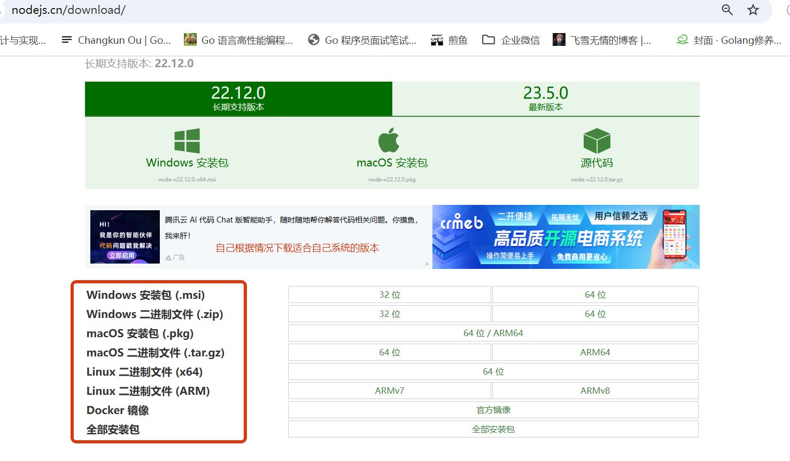

关于安装就不介绍了很简单，不会的请参考：[https://blog.csdn.net/thefg/article/details/132410794](https://blog.csdn.net/thefg/article/details/132410794)

目前后台管理依赖的 Node 版本需要是：[18.18](http://18.0.0.18/) 这个版本，这里我放下下载的链接：[https://nodejs.org/download/release/v18.18.0/node-v18.18.0-x64.msi](https://nodejs.org/download/release/v18.18.0/node-v18.18.0-x64.msi)， 如果不是 windows，可以从下面这个地址中自行下载适合自己系统的：[https://nodejs.org/download/release/v18.18.0/](https://nodejs.org/download/release/v18.18.0/)

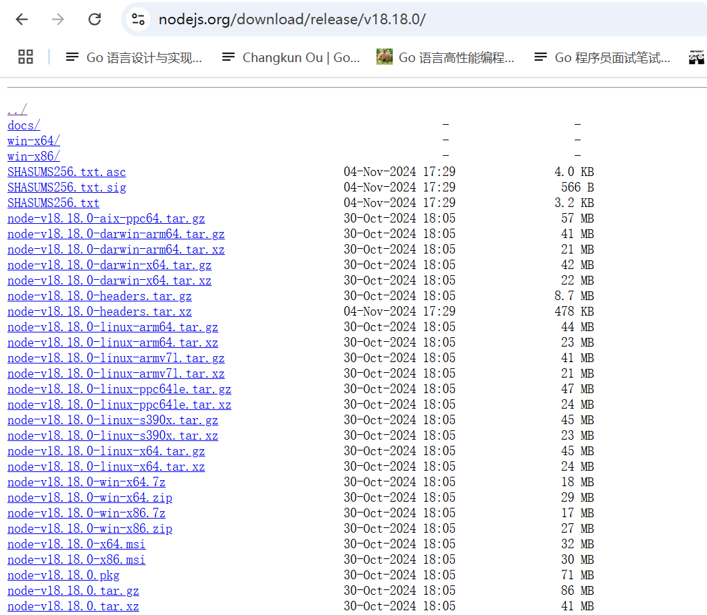

## **2.2 安装 Yarn**

安装 NodeJS 之后，我们来安装前端项目需要依赖的启动工具 Yarn。Yarn 是一款 JavaScript 的包管理工具（npm 的代替方案），是 Facebook, Google, Exponent 和 Tilde 开发的一款新的 JavaScript 包管理工具。

在 Yarn 的官网有着一句话：Safe, stable, reproducible projects 。正如 Yarn 官网的介绍，Yarn 的具有速度快 、安全 、可靠 的优点，在功能上相比于 npm 优化了许多功能等，例如网络性能优化，安装依赖的方式相同等功能。

你可以通过它使用全世界开发者的代码，或者分享自己的代码。代码通过包（package）（或者称为模块（module））的方式来共享。 一个包里包含所有需要共享的代码，以及描述包信息的文件，称为package.json。它的优点是更快、更安全、更可靠。它的主要特性有离线模式、确定性、网络性能、多注册、网络恢复能力、扁平模式以及 Emoji。

关于中文文档：[Yarn中文文档](https://www.yarnpkg.cn/) 感兴趣的可以自行去研究。

安装也比较简单，需要使用 npm 安装。

\# 安装 yarn

npm install -g yarn

#安装完成后检测版本

yarn --version

如果按照报错如下：

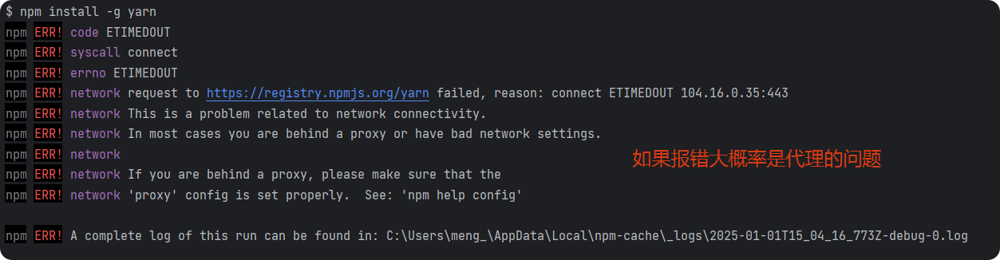

需要添加下代理后重新执行，如下：

npm config set registry https://registry.npmmirror.com

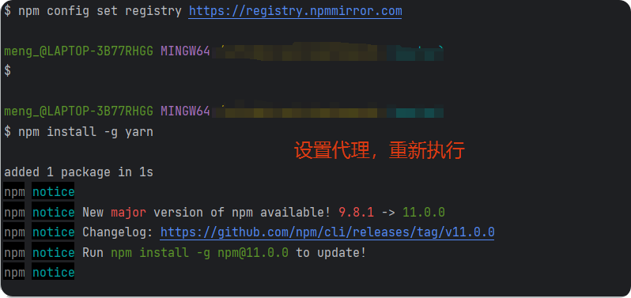

## **2.3 使用 Yarn 安装项目依赖**

到我们的后台管理前端项目目录下，执行安装依赖工具，会生成 node\_modules：

yarn install

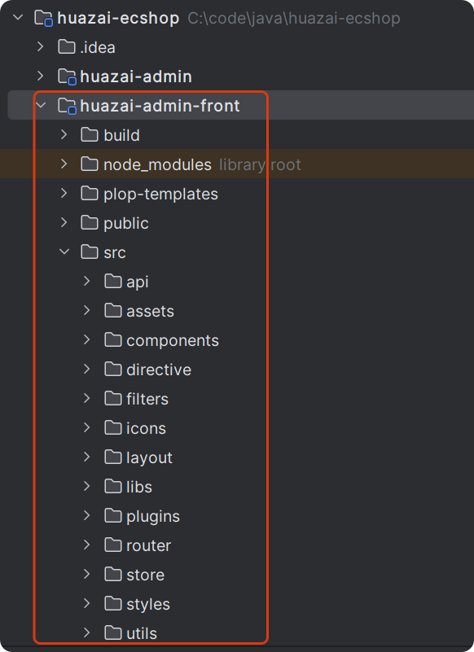

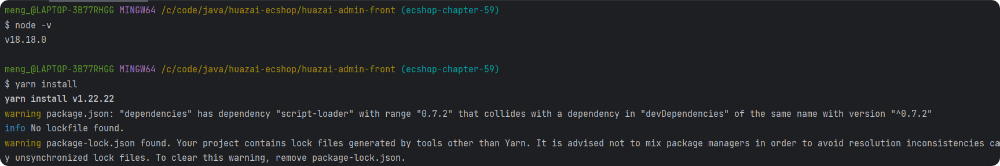

## **2.4 启动后台项目**

在后台管理的前端项目目录下，执行：

npm run dev

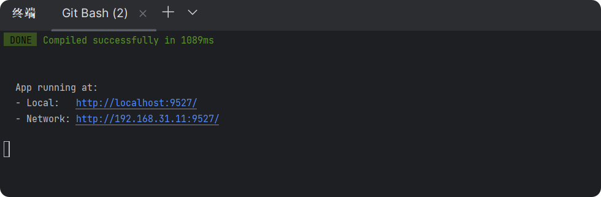

如果不好使可以执行：

npm outdated

npm update

\# 重写 run

npm run dev

## **2.5 项目目录介绍**

关于前端组件的内容可以查看 README.md 文件，后续开发相关模块就可以参考这个，如下：

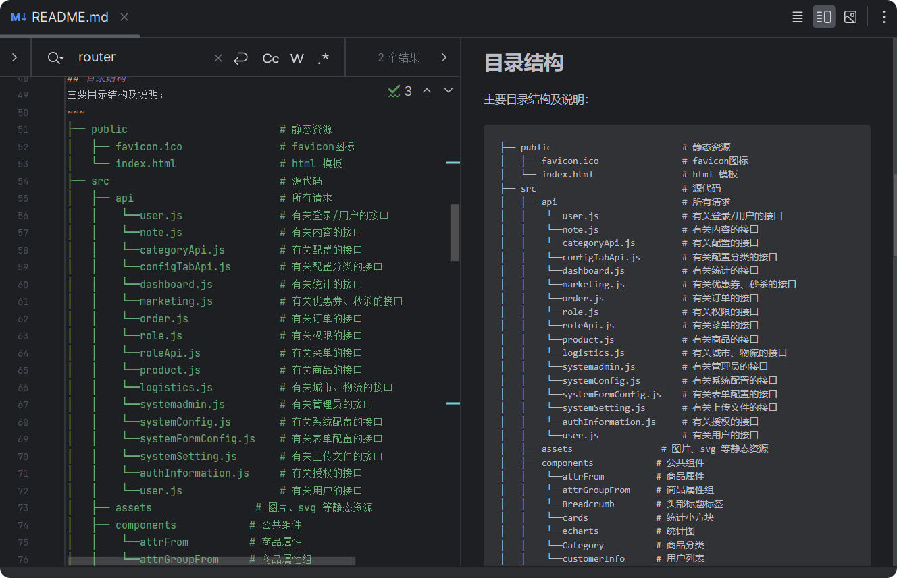

## **2.6 访问项目**

访问之前需要先导入 SQL，数据库名字可以根据自己需求来修改，SQL 已上传到 git 仓库：

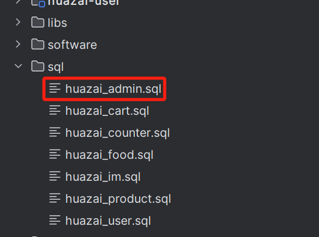

启动完成后，它会自动跳转到浏览器中，如图：

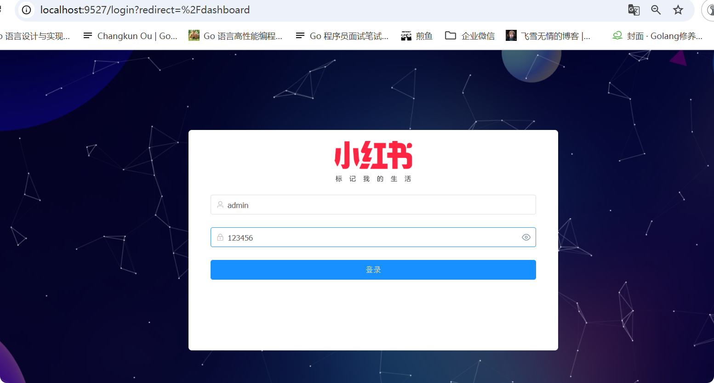

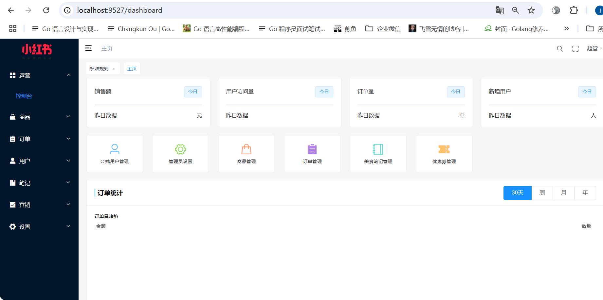

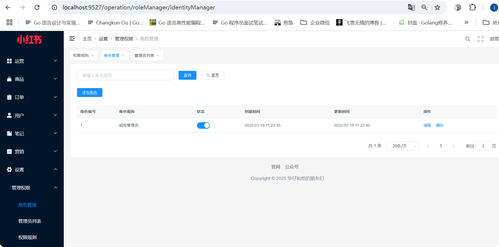

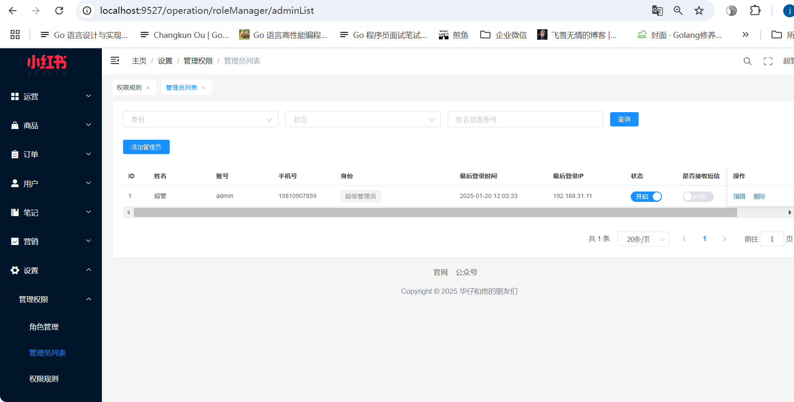

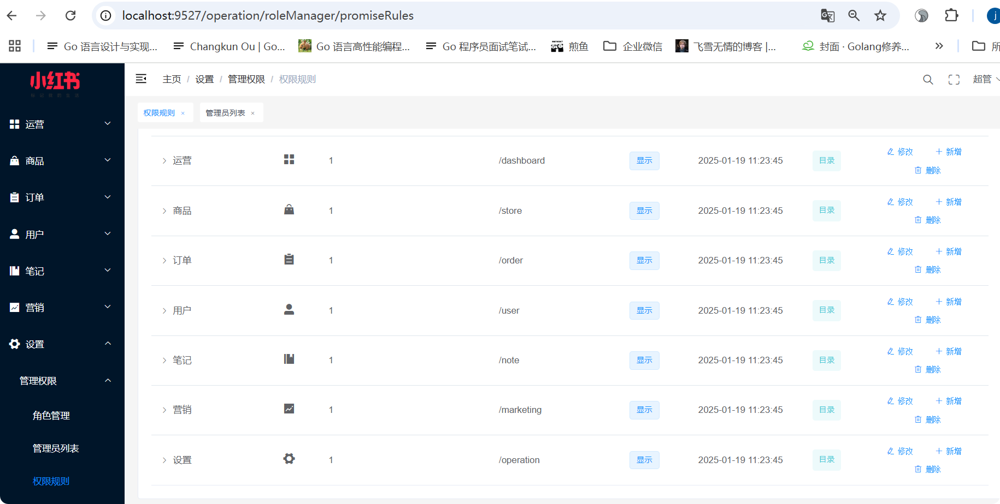

整个后台项目基于 「**SpringBoot + SpringSecurity**」实现后台权限管理，角色权限可以控制到按钮级别，权限层级管理有序。目前还只是把基础的功能搞了，接下来会对接「**商品**」、「**订单**」、「**用户**」、「**笔记**」、「**优惠券**」等模块。

##   
**03 多源数据库配置**

由于整个实战项目各个微服务都对应一个数据库，后台管理的话，打算通过「**多源数据库**」来进行对接，就不挨个写 Feign 客户端来对接了。

先来看下多源数据库配置：

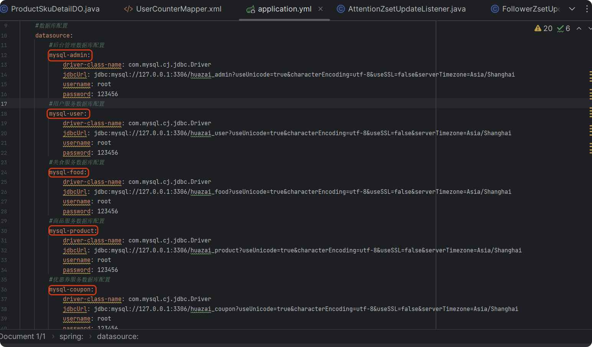

对应启动文件需要配置相关 MapperScan，如下：

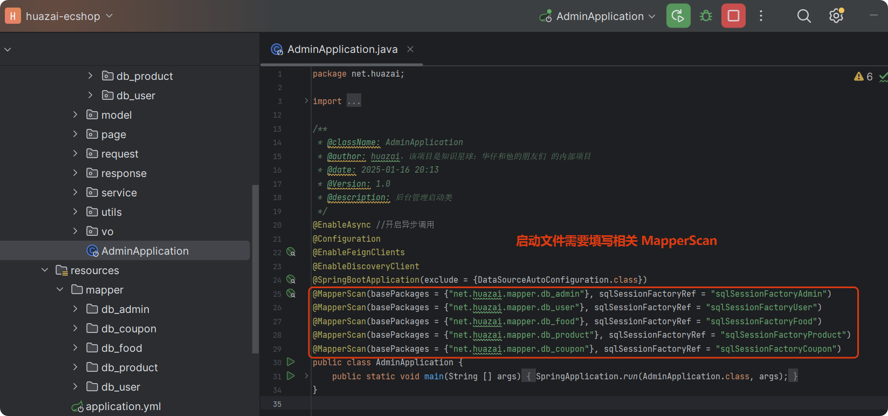

对应的 mapper 需要分目录存储，区分对应的服务，如下：

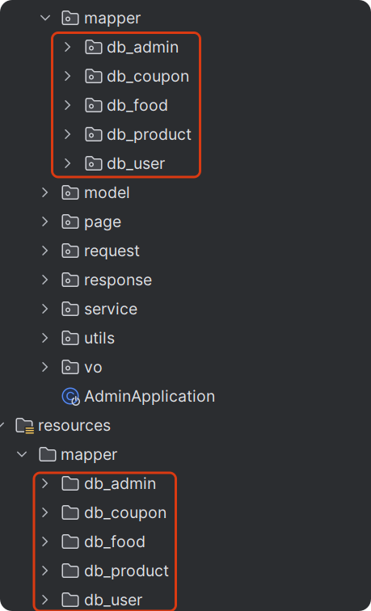

最后需要添加多源数据库相关配置，如下：

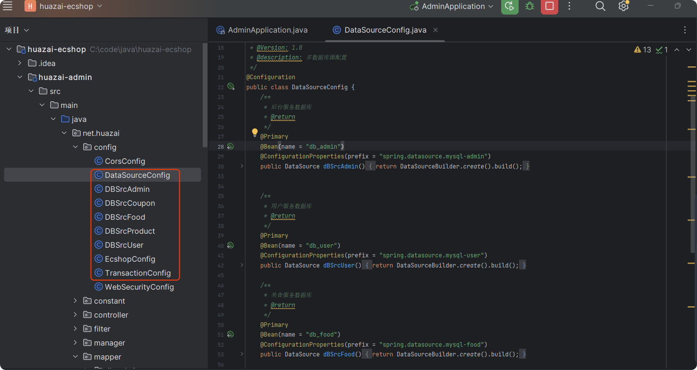

具体代码就不展示了，自行从分支代码中查看，上面配置完成后，就可以重启服务了，接下来就是各个服务对接的事情了。