从今天之后的一段时间内，华仔会带着大家一起从零开始搭建并研发一套高并发的电商实战项目，这里会涉及到很多互联网大厂开发过程中所使用的核心技术和架构设计模式，希望大家学完之后可以用到自己的简历中。

接下来我们会重点进行「**商品中心服务详情页架构设计**」。这是第五十二篇，本篇我们继续进行电商实战项目设计与开发，本篇来梳理下「**亿级流量大型电商商品中心详情页动态渲染服务部署**」。

文章汇总位置：[https://wx.zsxq.com/dweb2/index/columns/51122554151214](https://wx.zsxq.com/dweb2/index/columns/51122554151214)

源码授权与获取地址：[https://articles.zsxq.com/id\_1s85grnaae4p.html](https://articles.zsxq.com/id_1s85grnaae4p.html)

本章源码地址：[https://gitcode.net/u011359591/huazai-ecshop/-/tree/ecshop-chapter-50](https://gitcode.net/u011359591/huazai-ecshop/-/tree/ecshop-chapter-50)

## **01 前言**

终于要设计与研发电商项目代码了，今天我们主要对实战项目进行「**亿级流量大型电商商品中心详情页动态渲染服务部署**」。

这里需要注意下，我们整个项目目前是不提供前端的，这个后续有时间在搞，主要是进行后端接口以及微服务模块架构设计。

## **02 亿级流量商品中心动态渲染服务部署**

在 [【电商实战项目第五十一篇】华仔电商实战项目之亿级流量大型商品中心详情页动态渲染服务架构设计与机房部署规划](https://articles.zsxq.com/id_l538ht1nvb76.html) 这篇中，我带大家深度剖析了「**详情页动态渲染服务架构设计**」与「**详情页动态渲染服务机房部署规划**」。

今天我们来带大家进行多机房部署，主要针对下面架构图进行部署。

## **2.1 多机房接入层、应用层 Nginx 部署**

目前我本地有三台虚拟机，分别是：

1.  192.168.31.11: 其他资源，RocketMQ、MySQL。
2.  192.168.31.12: 部署接入层 nginx。
3.  192.168.31.13: 部署应用层 nginx + 缓存集群。

这里我打算使用 OpenResty 技术来部署 Nginx 服务，官方下载地址：[https://github.com/openresty/openresty/releases](https://github.com/openresty/openresty/releases)，直接使用最新版来部署：

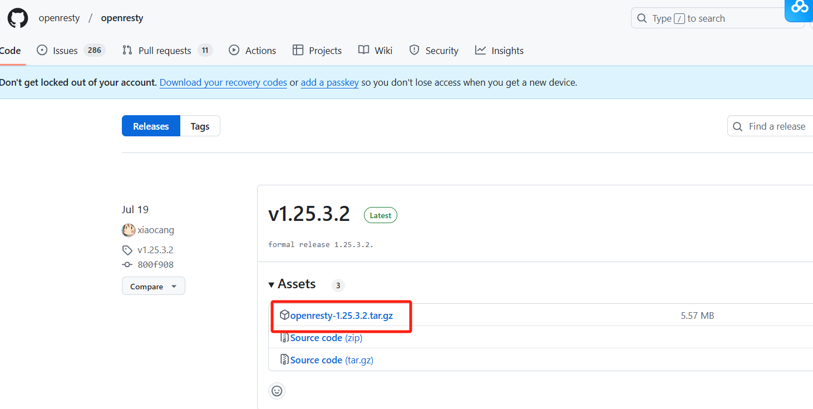

### **2.1.1 下载解压**

两台机器同时下载解压。

wget https://github.com/openresty/openresty/releases/download/v1.25.3.2/openresty-1.25.3.2.tar.gz

tar xf openresty-1.25.3.2.tar.gz

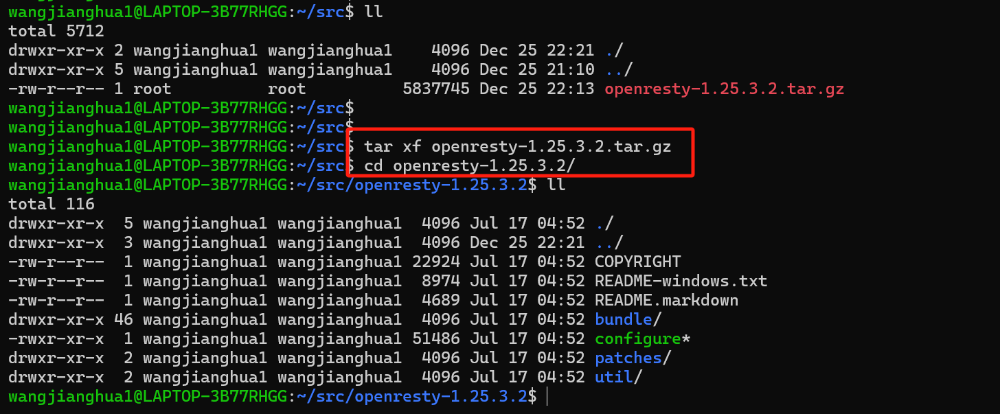

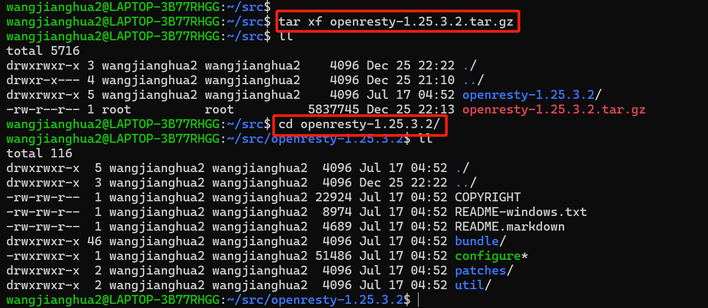

### **2.1.1 编译安装 LuaJIT**

进入 [bundle/LuaJIT-2.1-20231117.1/](http://bundle/LuaJIT-2.1-20231117.1/) 目录，执行如下命令：

\# 进入执行目录

cd bundle/LuaJIT-2.1-20231117.1/

\# 编译安装

sudo make clean && make && make install

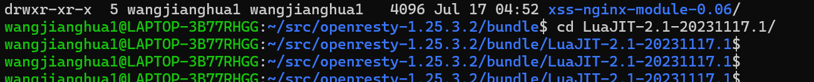

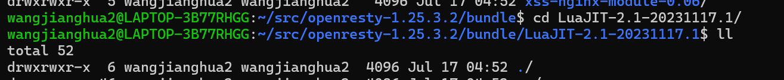

执行编译安装如果报如下错误，主要是缺少 gcc：

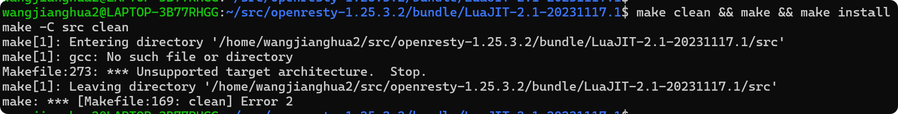

执行如下命令，完事重新执行编译命令：

\# 确保你的系统已经安装了 gcc 及其相关工具链，你可以使用包管理器来安装这些工具

\# 对于基于 Debian 的系统（如 Ubuntu）：

sudo apt install build-essential

\# 对于基于 Red Hat 的系统（如 CentOS）：

sudo yum groupinstall "Development Tools"

等待编译完成后，如果中间遇到权限问题的话，可以单独执行：

sudo make install

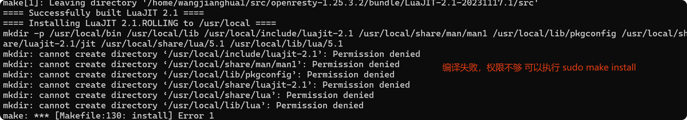

如果遇到基础软件没有安装：

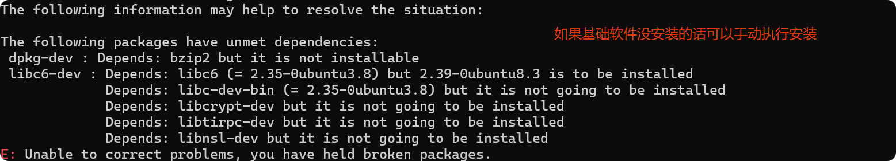

可以手动执行安装：

sudo apt install bzip2 libc6-dev libcrypt-dev libtirpc-dev libnsl-dev

如果还是不成功，如下报错：

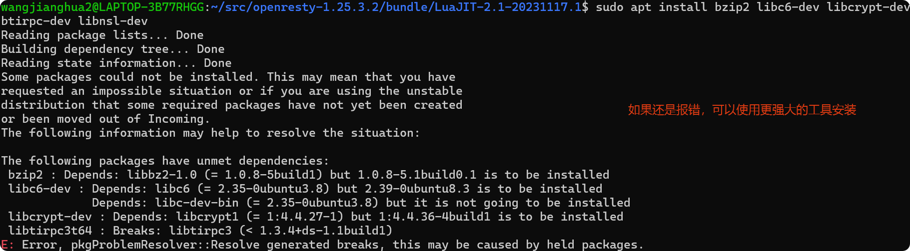

可以使用 [aptitude](http://aptitude%20/) 解决依赖问题， [aptitude](http://aptitude/) 是一个更强大的包管理工具，可以更好地处理复杂的依赖性问题。你可以尝试使用 [aptitude](http://aptitude%20/) 来安装 [build-essential](http://build-essential/)：

sudo apt install aptitude

sudo aptitude install build-essential

如果执行 make clean && make 报错：

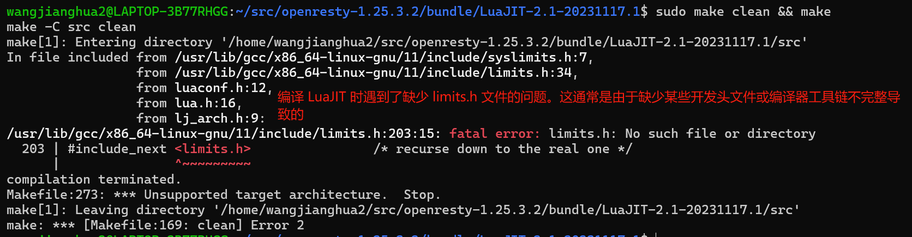

最后等待成功结果如下：

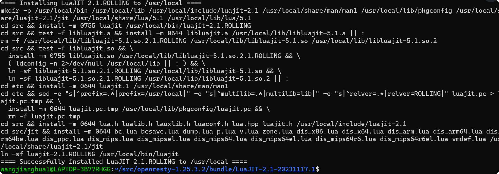

### **2.1.2 安装 ngx\_cache\_purge、ngx\_upstream\_check**

官方地址：[https://github.com/FRiCKLE/ngx\_cache\_purge/archive/refs/tags/2.3.tar.gz](https://github.com/FRiCKLE/ngx_cache_purge/archive/refs/tags/2.3.tar.gz)

\# 直接在 bundle 目录下下载

wget https://github.com/FRiCKLE/ngx\_cache\_purge/archive/refs/tags/2.3.tar.gz

\# 解压

tar xf 2.3.tar.gz

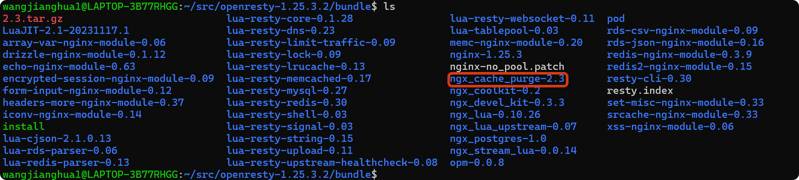

官方地址：[https://github.com/yaoweibin/nginx\_upstream\_check\_module](https://github.com/yaoweibin/nginx_upstream_check_module)

\# 直接在 bundle 目录下下载

wget https://github.com/yaoweibin/nginx\_upstream\_check\_module/archive/refs/tags/v0.4.0.tar.gz

\# 解压

tar xf v0.4.0.tar.gz

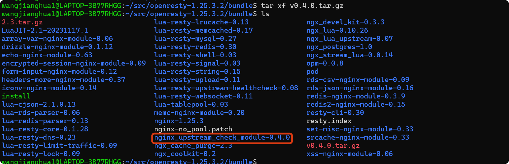

### **2.1.3 编译安装 Nginx**

回到 openresty 根目录，执行编译：

./configure --prefix=/home/wangjianghua1/src --with-http\_realip\_module --with-pcre --with-luajit --add-module=./bundle/nginx\_upstream\_check\_module-0.4.0/ -j2

make && make install

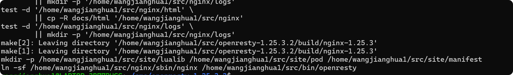

### **2.1.4 检查 Nginx 安装结果**

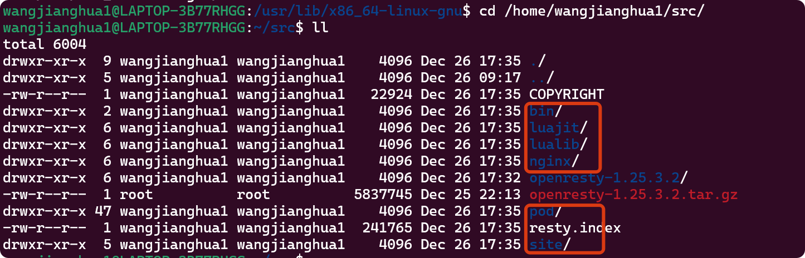

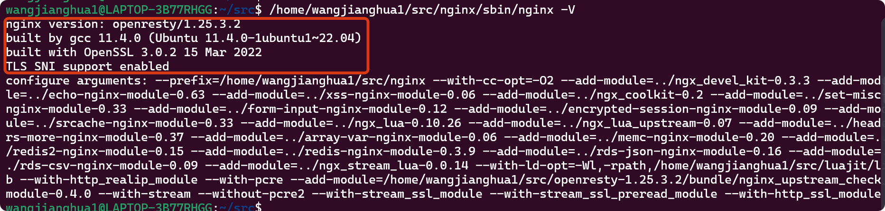

### **2.1.5 启动 Nginx**

\# 执行启动命令

/home/wangjianghua1/src/nginx/sbin/nginx

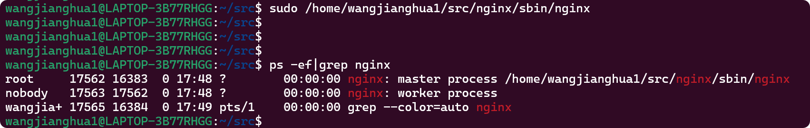

### **2.1.6 修改 Nginx 配置文件**

\# 在 http 部分添加：

lua\_package\_path "/home/wangjianghua2/src/lualib/?.lua;;";

lua\_package\_cpath "/home/wangjianghua2/src/lualib/?.so;;";

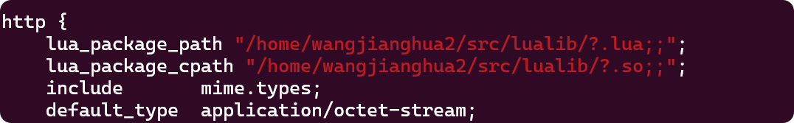

在 conf 目录下，创建一个 lua.conf。

server {

listen 80;

server\_name \_;

location /lua {

default\_type 'text/html';

content\_by\_lua 'ngx.say("hello world")';

}

}

然后在 nginx.conf 的 http 部分添加：

include lua.conf;

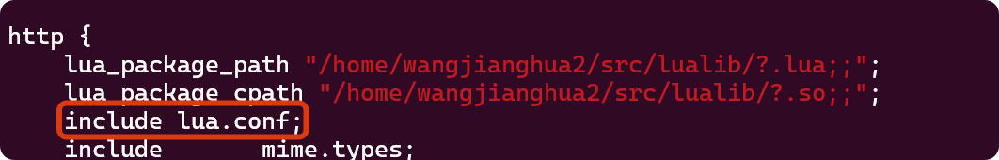

验证是否正确。

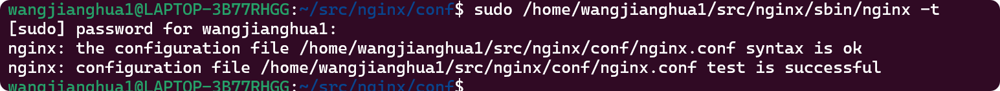

然后重启一下。

sudo ./nginx -s reload

测试两台 nginx 的效果：

## **2.2 Redis 集群架构选型**

多机房一主三从的架构，保证了北京机房彻底故障的时候，上海机房还有一套备用的集群，可以升级为一主一从。如果采取北京机房部署一主一从，上海机房一从，那么北京机房故障时，上海机房的一从需要承载所有读写压力，压力过大。

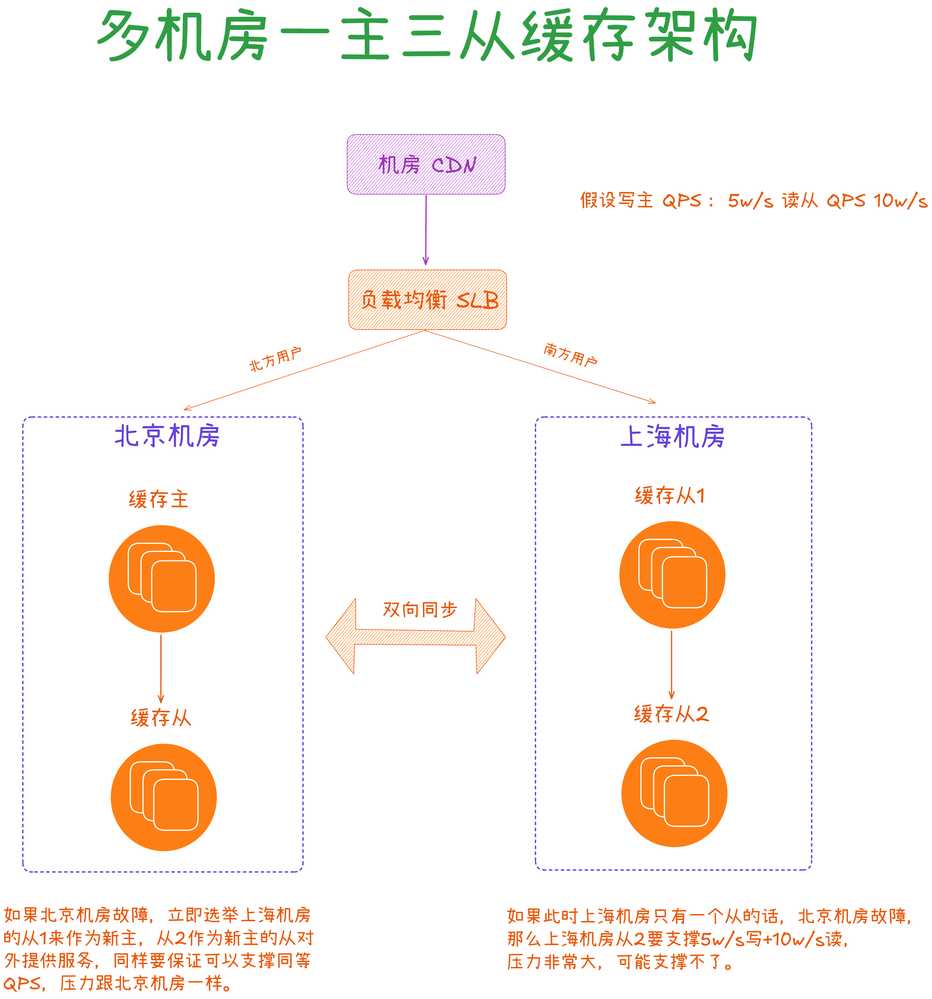

如图所示，我们要做这样的一套「**一主三从**」缓存架构，是基于 「**Redis Cluster 集群方式**」还是基于 「**twemproxy + redis 方式**」呢，该如何选择呢？

###   
**2.2.1 twemproxy 架构设计原理**

Twemproxy 是 Twitter 的一个开源架构，它是一个分片资源访问的代理组件。如下图所示，它可以封装资源池的分布及 hash 规则，解决后端部分节点异常后的探测和重连问题，让 client 访问尽可能简单，同时资源变更时，只要在 Twemproxy 变更即可，不用更新数以万计的 client，让资源变更更轻量。最后，Twemproxy 跟后端通过单个长连接访问，可以大大减少后端资源的连接压力。

官方源码地址：[https://github.com/twitter/twemproxy/](https://github.com/twitter/twemproxy/)

### **2.2.1.1 twemproxy 系统架构**

如下图所示， 在应用系统中，Twemproxy 是一个介于 client 端和资源端的中间层。它的后端，支持Memcached 资源池和 Redis 资源池的分片访问。Twemproxy 支持取模分布和一致性 hash 分布，还支持随机分布，不过使用场景较少。

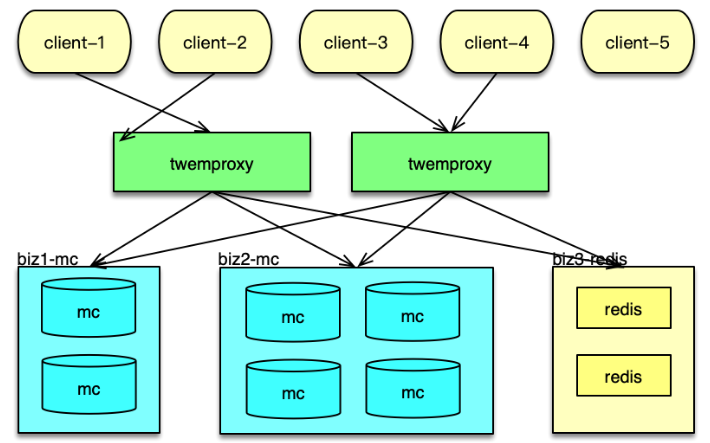

应用前端在请求缓存数据时，直接访问 Twemproxy 的对应端口，然后 Twemproxy 解析命令得到 key，通过 hash 计算后，按照分布策略，将 key 路由到后端资源的分片。在后端资源响应后，再将响应结果返回给对应的 client。

在系统运行中，Twemproxy 会自动维护后端资源服务的状态。如果后端资源服务异常，会自动进行剔除，并定期探测，在后端资源恢复后，再对缓存节点恢复正常使用。

### **2.2.1.2 twemproxy 组件架构**

Twemproxy 是基于 epoll 事件驱动模型开发的，架构如下图所示。它是一个单进程、单线程组件。核心进程处理所有的事件，包括网络 IO，协议解析，消息路由等。Twemproxy 可以监听多个端口，每个端口接受并处理一个业务的缓存请求。Twemproxy 支持 Redis、Memcached 协议，支持一致性 hash 分布、取模分布、随机分布三种分布方案。Twemproxy 通过 YAML 文件进行配置，简单清晰，且便于人肉读写。

Twemproxy 与后端资源通过单个长连接访问，在收到业务大量并发请求后，会通过 pipeline 的方式，将多个请求批量发到后端。在后端资源持续访问异常时，Twemproxy 会将其从正常列表中剔除，并不断探测，待其恢复后再进行请求的路由分发。

Twemproxy 运行中，会持续产生海量请求及响应的消息流，于是开发者精心设计了内存管理机制，尽可能的减少内存分配和复制，最大限度的提升系统性能。Twemproxy 内部，请求和响应都是一个消息，而这个消息结构体，以及消息存放数据的缓冲都是重复使用的，避免反复分配和回收的开销，提升消息处理的性能。为了解决短连接的问题，Twemproxy 的连接也是复用的，这样在面对 PHP client 等短连接访问时，也可以反复使用之前分配的 connection，提升连接性能。

另外，Twemproxy 对消息还采用了 zero copy（即零拷贝）方案。对于请求消息，只在client 接受时读取一次，后续的解析、处理、转发都不进行拷贝，全部共享最初的那个消息缓冲。对于后端的响应也采用类似方案，只在接受后端响应时，读取到消息缓冲，后续的解析、处理及回复 client 都不进行拷贝。通过共享消息体及消息缓冲，虽然 Twemproxy 是单进程/单线程处理，仍然可以达到 6~8w 以上的 QPS。

### **2.2.1.3 twemproxy 请求及响应**

接下来看一下 Twemproxy 是如何进行请求路由及响应的。

Twemproxy 监听端口，当有 client 连接进来时，则 accept 新连接，并构建初始化一个 client\_conn。当建连完毕，client 发送数据到来时，client\_conn 收到网络读事件，则从网卡读取数据，并记入请求消息的缓冲中。读取完毕，则开始按照配置的协议进行解析，解析成功后，就将请求 msg 放入到 client\_conn 的 out 队列中。接下来，就对解析的命令 key 进行 hash 计算，并根据分布算法，找到对应 server 分片的连接，即一个 server\_conn 结构体，如下图。

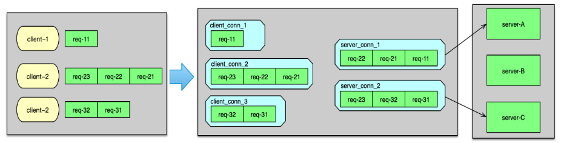

如果 server\_conn的 in 队列为空，首先对 server\_conn 触发一个写事件。然后将 req msg 存入到 server\_conn 的 in 队列。Server\_conn 在处理写事件时，会对 in 队列中的 req msg 进行聚合，按照 pipeline 的方式批量发送到后端资源。待发送完毕后，将该条请求 msg 从 server\_conn 的 in 队列删除，并插入到 out 队列中。 后端资源服务完成请求后，会将响应发送给 Twemproxy。当响应到 Twemproxy 后，对应的 server\_conn 会收到 epoll 读事件，则开始读取响应 msg。响应读取并解析后，会首先将server\_conn 中，out 队列的第一个 req msg 删除，并将这个 req msg 和最新收到的 rsp msg 进行配对。在 req 和 rsp 匹配后，触发 client\_conn 的写事件，如下图。

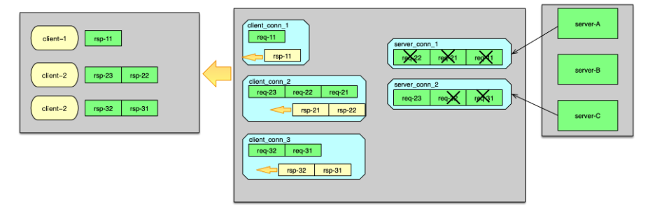

然后 client\_conn 在处理 epoll 写事件时，则按照请求顺序，批量将响应发送给 client 端。发送完毕后，将 req msg 从 client 的 out 队列删除。最后，再回收消息缓冲，以及消息结构体，供后续请求处理的时候复用。至此一个请求的处理彻底完成。

###   
**2.2.1.4 twemproxy 扩展**

### **1、多进程改造**

性能首当其冲。首先可以对 Twemproxy 的单进程/单线程动刀，改为并行处理模型。并行方案可以用多线程方案，也可以采用多进程方案。由于 Twemproxy 只是一个消息路由中间件，不需要额外共享数据，采用多进程方案会更简洁，更适合。

多进程改造中，可以分别构建一个 master 进程和多个 worker 进程来进行任务处理，如下图所示。每个进程维护自己独立的 epoll 事件驱动。其中 master 进程，主要用于监听端口，accept 新连接，并将连接调度给 worker 进程。

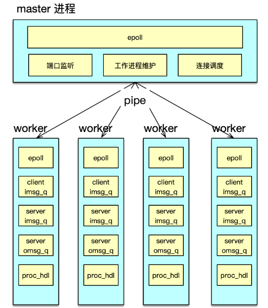

而 worker 进程，基于自己独立的 event\_base，管理从 master 调度给自己的所有 client 连接。在 client 发送网络请求到达时，进行命令读取、解析，并在进程内的 IO 队列流转，最后将请求打包，pipeline 给后端的 server。

在 server 处理完毕请求，发回响应时。对应 worker 进程，会读取并解析响应，然后批量回复给 client。

通过多进程改造，Twemproxy 的 QPS 可以从 8w 提升到 40w+。业务访问时，需要部署的Twemproxy 的实例数会大幅减少，运维会更加简洁。

### **2、增加负载均衡**

对于多个 Twemproxy 访问，如何进行负载均衡的问题。一般有三种方案。

第一种方案，是在 Twemproxy 和业务访问端之间，再增加一组 LVS，作为负载均衡层，通过 LVS 负载均衡层，你可以方便得增加或减少 Twemproxy 实例，由 LVS 负责负载均衡和请求分发，如下图。

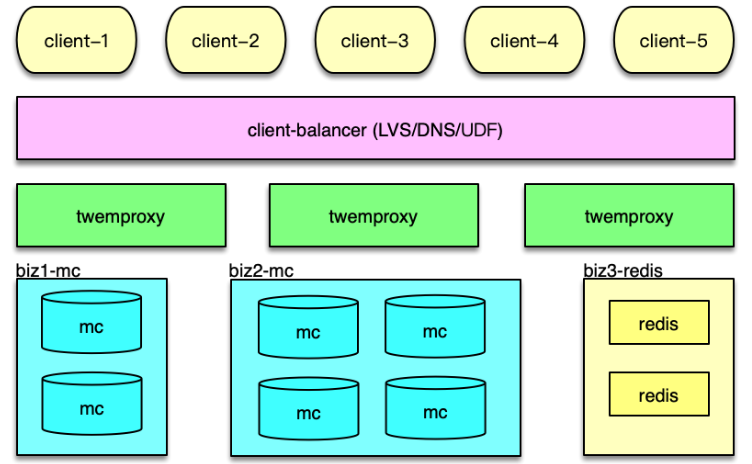

第二种方案，是将 Twemproxy 的 IP 列表加入 DNS。业务 client 通过域名来访问 Twemproxy，每次建连时，DNS 随机返回一个 IP，让连接尽可能均衡。

第三种方案，是业务 client 自定义均衡策略。业务 client 从配置中心或 DNS 获取所有的Twemproxy 的 IP 列表，然后对这些 Twemproxy 进行均衡访问，从而达到负载均衡。

> 方案一，可以通过成熟的 LVS 方案，高效稳定的支持负载均衡策略，但多了一层，成本和运维的复杂度会有所增加。
> 
> 方案二，只能做到连接均衡，访问请求是否均衡，无法保障。
> 
> 方案三，成本最低，性能也比前面 2 个方案更高效。
> 
> 推荐使用方案三，微博内部也是采用第三种方案。

### **3、增加配置中心**

对于 Twemproxy 配置的维护，可以通过增加一个配置中心服务来解决。将 YAML 配置文件中的所有配置信息，包括后端资源的部署信息、访问信息，以配置的方式存储到配置中心，如下图。

  
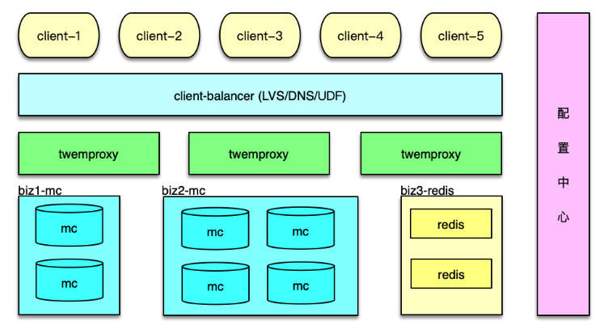

Twemproxy 启动时，首先到配置中心订阅并拉取配置，然后解析并正常启动。Twemproxy 将自己的 IP 和监听端口信息，也注册到配置中心。业务 client 从配置中心，获取Twemproxy 的部署信息，然后进行均衡访问。

在后端资源变更时，直接更新配置中心的配置。配置中心会通知所有 Twemproxy 实例，收到事件通知，Twemproxy 即可拉取最新配置，并调整后端资源的访问，实现在线变更。整个过程自动完成，更加高效和可靠。

### **4、支持 M-S-L1 访问**

前面提到，为了应对突发洪水流量，避免硬件局部故障的影响，对 Mc 访问采用了Master-Slave-L1 架构。可以将该缓存架构体系的访问策略，封装到 Twemproxy 内部。实现方案也比较简单。首先在 servers 配置中，增加 Master、Slave、L1 三层，如下图。

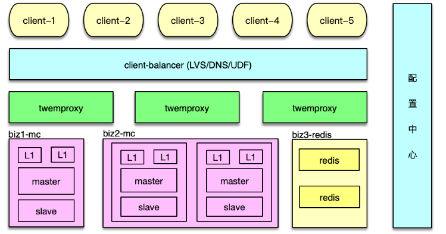

Twemproxy 启动时，每个 worker 进程预连所有的 Mc 后端，当收到 client 请求时，根据解析出来的指令，分别采用不同访问策略即可。

1.  对于 get 请求，首先随机选择一个 L1 来访问，如果 miss，继续访问 Master 和 Slave。中间在任何一层命中，则回写。
2.  对于 gets 请求，需要以 master 为准，从 master 读取。如果 master 获取失败，则从 slave获取，获取后回种到 master，然后再次从 master 获取，确保得到 cas unique id 来自 master。
3.  对于 add/cas 等请求，首先请求 master，成功后，再将 key/value 通过 set 指令，写到 slave 和所有 L1。
4.  对于 set 请求，最简单，直接 set 所有资源池即可。
5.  对于 stats 指令的响应，由 Twemproxy 自己统计，或者到后端 Mc 获取后聚合获得。

### **5、Redis 主从访问**

Redis 支持主从复制，为了支持更大并发访问量，同时减少主库的压力，一般会部署多个从库，写操作直接请求 Redis 主库，读操作随机选择一个 Redis 从库。这个逻辑同样可以封装在Twemproxy 中。

如下图所示，Redis 的主从配置信息，可以用域名的方式，也可以用 IP 端口的方式记录在配置中心，由 Twemproxy 订阅并实时更新，从而在 Redis 增减 slave、主从切换时，及时对后端进行访问变更。

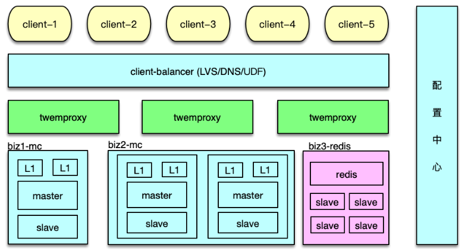

### **2.2.2 Redis Cluster 架构设计原理**

再来看下 Redis Cluster 的架构设计原理，如下图：

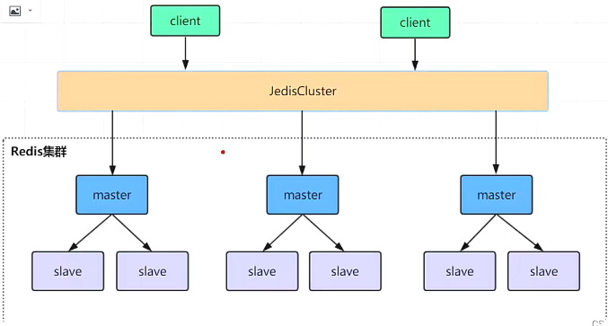

上述集群架构一个由多个「**主从节点**」群组成的分布式服务器，具有复制、高可用和分片的特性。Redis 集群不需要sentine哨兵也能完成节点移除和故障转移。

官方文档称可以扩展上万个节点，推荐不超过1000个；「**从节点**」只担任备份的角色，不承担读写操作。

###   
**2.2.2.1 集群原理**

Redis Cluster 将所有数据划分为 16384 个 slots (槽位），每个节点负责其中一部分槽位，槽位的信息存储在每个节点中；当 Redis Cluster 的客户端连接集群时，它也会得到一份集群的槽位配置信息缓存在本地，这样可以根据key 值定位到目标节点；槽位与服务端机器不一致问题需要纠正机制来实现槽位校验调整；

### **1、槽位算法**

HASH SLOT=CRC16(key) mod 16384

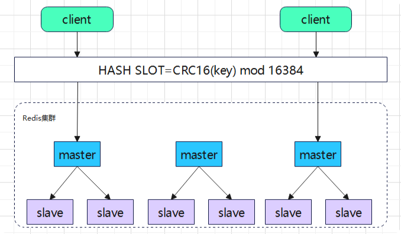

### **2、槽位纠正机制**

当客户端发出一个错误的节点指令到服务端，该节点会发现指令的key值的槽位并不归自己管理，这是它会向客户端发送一个跳转指令，携带目标节点地址，客户端收到指令后会跳转对应地址并纠正本地槽位映射缓存。

###   
**3、Redis 集群节点通信机制**

节点间采用 gossiop 协议进行通信；

维护集群元数据（集群节点信息，主从角色，节点数量，各节点共享数据等）有两种方式：集中式和 gossiop；

集中式：优点在于元数据更新和读取时效性好，元数据改变会立即更新到集中式的存储中，缺点是元数据更新集中在一个地方；

gossiop：

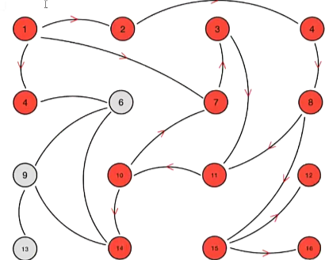

### **4、Redis Cluster 集群扩容**

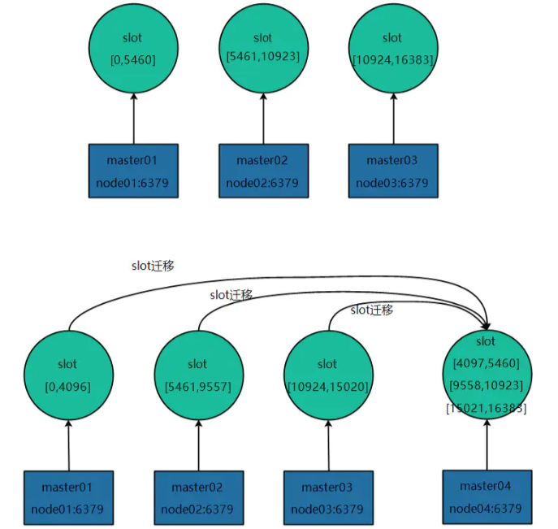

1.  redis cluster 可以实现对节点的灵活上下线控制。
2.  3 个主节点分别维护自己负责的槽和对应的数据，如果希望加入一个节点实现扩容，就需要把一部分槽和数据迁移和新节点。
3.  每个 master 把一部分槽和数据迁移到新的节点node04。

### **5、Redis Cluster 集群缩容**

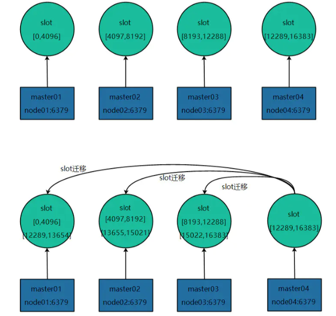

1.  如果下线的是 slave，那么通知其他节点忘记下线的节点。
2.  如果下线的是 master，那么将此 master 的 slot 迁移到其他 master 之后，通知其他节点忘记此 master 节点。
3.  其他节点都忘记了下线的节点之后，此节点就可以正常停止服务了。

### **2.2.3 小结**

### **Redis Cluster**

1.  优点：
2.  无中心架构：数据按照 slot 存储分布在多个节点，节点间数据共享，可动态调整数据分布。
3.  可扩展性：可线性扩展到 1000 多个节点，节点可动态添加或删除。
4.  高可用性：部分节点不可用时，集群仍可用。通过增加Slave做standby数据副本，能够实现故障自动failover。
5.  缺点：
6.  客户端实现复杂：驱动要求实现 Smart Client，缓存 slots mapping 信息并及时更新，提高了开发难度。
7.  数据通过异步复制，不保证数据的强一致性。
8.  多个业务使用同一套集群时，无法根据统计区分冷热数据，资源隔离性较差。
9.  **不好做树状集群结构，**比如 redis 主集群一主三从双机房架构。
10.  **写请求全部落到主节点上，如果要扩展写 QPS，只能扩展主实例**。

### **Redis Twemproxy**

1.  优点：
2.  **支持 Redis 集群、读写分离**。
3.  解耦合：twemproxy 是服务端分片，cluster 需要客户端分片，客户端分片提高了业务对于使用redis的复杂性。
4.  减少数据丢失的问题：由于网络分区或其他故障会导致 cluster 脑裂问题，如果客户端感知不到这种情况，在发生故障期间写入的数据在切换之后会丢失；而 twemproxy 在节点故障时，可以禁用节点或者返回错误，能够让客户端感知，防止出现业务逻辑 bug。
5.  减少 redis 直连：由于单线程模型，建立连接需要损耗性能，redis 能打开的文件个数是有限制的，而且redis连接数过多会影响性能；而 twemproxy 维持了到后端 master 的长链接，同时由于可以水平扩展，n 个 proxy 可以最多建立(n \* limit)个连接，极大的提高了连接数。
6.  通信开销小：针对大集群，cluster 内部通信开销巨大，稳定性和带宽都是一个巨大的问题；twemproxy 管理的主从对互相之间不感知，分片由 proxy 完成，通信开销极小。
7.  缺点：
8.  上线下线节点，有一些手工维护集群的成本。

综上，这里为了完成一主三从缓存架构，我们采用 Twemproxy 架构模式来搭建，关于 Redis Cluster 集群后续会在 Redis 专栏进行部署和讲解。

## **2.3 Twemproxy 缓存架构模式部署**

Twemproxy 官方下载地址：[https://github.com/twitter/twemproxy/releases/download/0.5.0/twemproxy-0.5.0.tar.gz](https://github.com/twitter/twemproxy/releases/download/0.5.0/twemproxy-0.5.0.tar.gz)

Redis 官方下载地址：[https://github.com/redis/redis/archive/refs/tags/7.0.0.tar.gz](https://github.com/redis/redis/archive/refs/tags/7.0.0.tar.gz)

Twemproxy 依赖组件：

1.  autoconf 官方下载地址：[http://ftp.gnu.org/gnu/autoconf/autoconf-2.72.tar.gz](http://ftp.gnu.org/gnu/autoconf/autoconf-2.72.tar.gz)
2.  automake 官方下载地址：[http://ftp.gnu.org/gnu/automake/automake-1.17.tar.gz](http://ftp.gnu.org/gnu/automake/automake-1.17.tar.gz)
3.  libtool 官方下载地址：[http://ftp.gnu.org/gnu/libtool/libtool-2.5.4.tar.gz](http://ftp.gnu.org/gnu/libtool/libtool-2.5.4.tar.gz)

这里我们会安装这些软件到 /usr/local 目录下面。

### **2.3.1 Redis 安装**

这个很简单，解压到 /usr/local 下面后，直接 make && make install 就行了。

如果遇到报错：

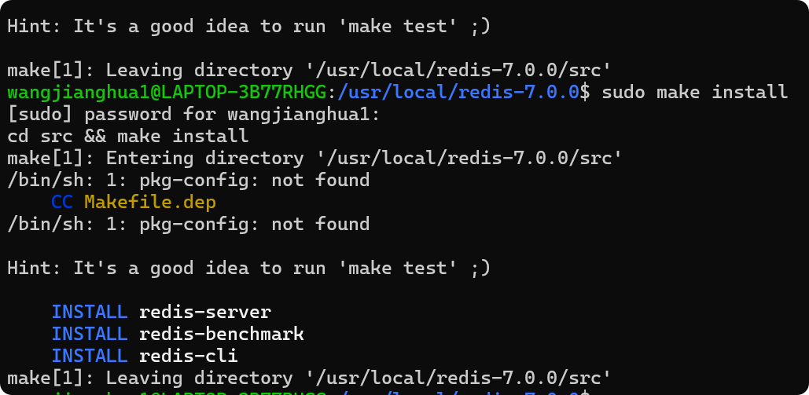

需要安装：

\# 安装 pkg-config

\# 根据你所使用的 Linux 发行版，使用相应的包管理器安装 pkg-config。

\# 对于 Debian/Ubuntu 系统：

sudo apt-get update

sudo apt-get install pkg-config

\# 对于 CentOS/RHEL/Fedora 系统：

sudo dnf install pkgconf-pkg-config

\# 或者对于较旧的系统：

sudo yum install pkgconfig

\# 对于 macOS（使用 Homebrew）：

brew install pkg-config

\# 安装完成后，可以通过以下命令验证 pkg-config 是否正确安装：

pkg-config --version

你应该会看到类似 0.29.2 或更高版本的输出

启动 Redis

nohup /usr/local/redis-7.0.0/src/redis-server /usr/local/redis-7.0.0/redis.conf &

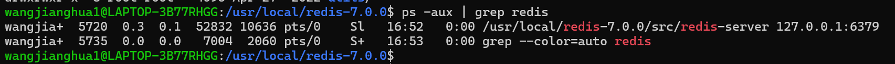

连接测试：

/usr/local/redis-7.0.0/src/redis-cli -p 6379

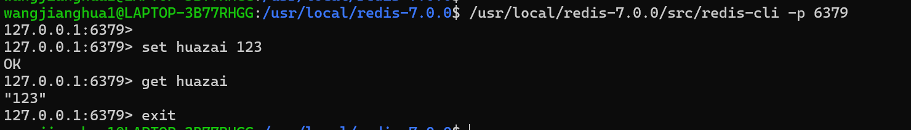

### **2.3.2 Twemproxy 安装**

安装之前需要先安装依赖。

cd /usr/local/autoconf-2.72

./configure --prefix=/usr/local/ && make && make install

cd /usr/local/automake-1.17

./configure --prefix=/usr/local/ && make && make install

cd /usr/local/libtool-2.5.4

./configure --prefix=/usr/local/ && make && make install

如果遇到如下报错，需要安装 m4。

sudo apt install m4

m4 --version

export M4\_PATH=/usr/local/bin/m4

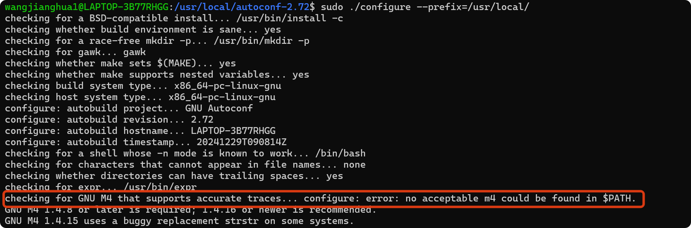

完成后，我们来部署下 twemproxy。

cd /usr/local/twemproxy-0.5.0

autoreconf -fvi

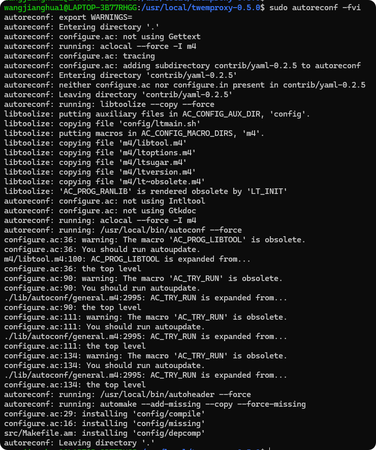

接下来修改其配置文件 [/usr/local/twemproxy-0.5.0/conf/nutcracker.yml](http://usr/local/twemproxy-0.5.0/conf/nutcracker.yml%20)，修改之前先备份一下，[cp conf/nutcracker.yml conf/nutcracker.bak.yml](http://cp%20conf/nutcracker.yml%20conf/nutcracker.bak.yml)。

server1: # redis 集群的逻辑名称

listen: 127.0.0.1:1111 # twemproxy 监听的端口号

hash: fnv1a\_64 # hash 散列算法

distribution: ketama # 分片算法，一致性hash，取模

timeout: 1000 # 跟 redis 连接的超时时长

redis: true # 是否是 redis，false 的话是 memcached

servers: # redis 实例列表，一定要加别名，否则默认使用ip:port:weight来计算分片，如果宕机后更换机器，那么分片就不一样了，因此加了别名后，可以确保分片一定是准确的

\- 127.0.0.1:6379:1

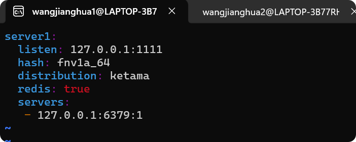

然后编译安装。

./configure && make && make install

后台启动 Twemproxy 服务。

/usr/local/twemproxy-0.5.0/src/nutcracker -d -c /usr/local/twemproxy-0.5.0/conf/nutcracker.yml

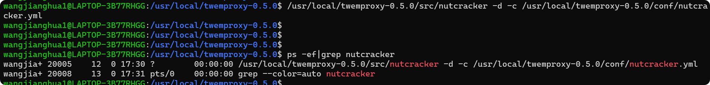

测试效果。

/usr/local/redis-7.0.0/src/redis-cli -p 1111

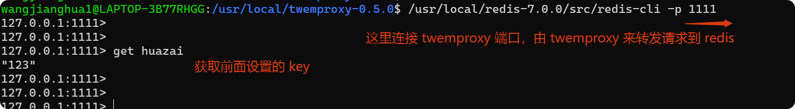

至此，说明已经可以通过 twemproxy 来连接 redis 了。

## **2.4 多机房两主六从 Redis 缓存集群架构**

上面把 Redis 和 twemproxy 都搭建了一下，接下来就真正来部署下我们双机房 Redis 缓存集群架构，拓扑架构如下：

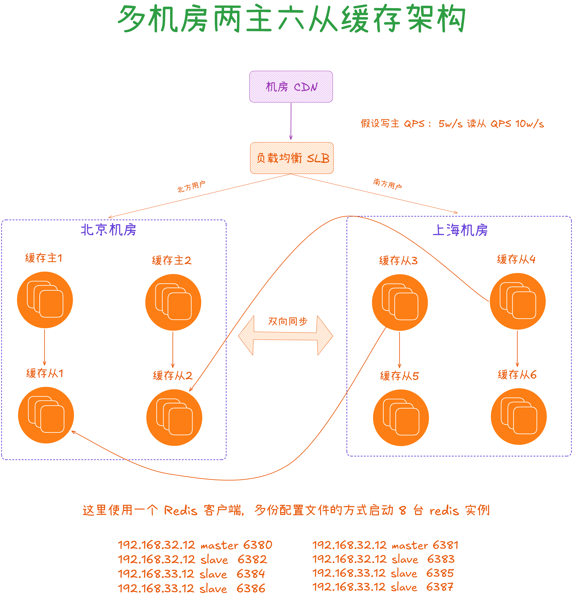

当「**北京机房**」挂掉之后，由于「**上海机房**」的 6380 是「**北京机房**」的 6380 的从， 所以「**上海机房**」 的 6380 会升级为 master，这样一来，在「**上海机房**」上还是存在一主一从的高可用 redis。

这里我们通过备份配置文件来部署集群。

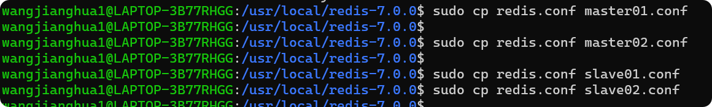

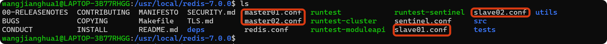

这里先修改「**机房1 192.168.32.12**」的配置文件端口：

1.  master01.conf 端口 6380。
2.  master02.conf 端口 6381。
3.  slave01.conf 端口 6382。
4.  slave02.conf 端口 6383。

然后分别启动这 4 个 Redis 实例。

nohup src/redis-server master01.conf &

nohup src/redis-server master02.conf &

nohup src/redis-server slave01.conf &

nohup src/redis-server slave02.conf &

  
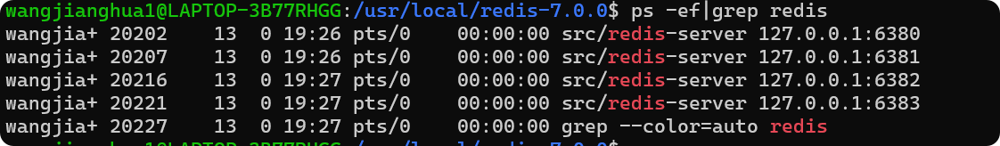

配置主从结构：

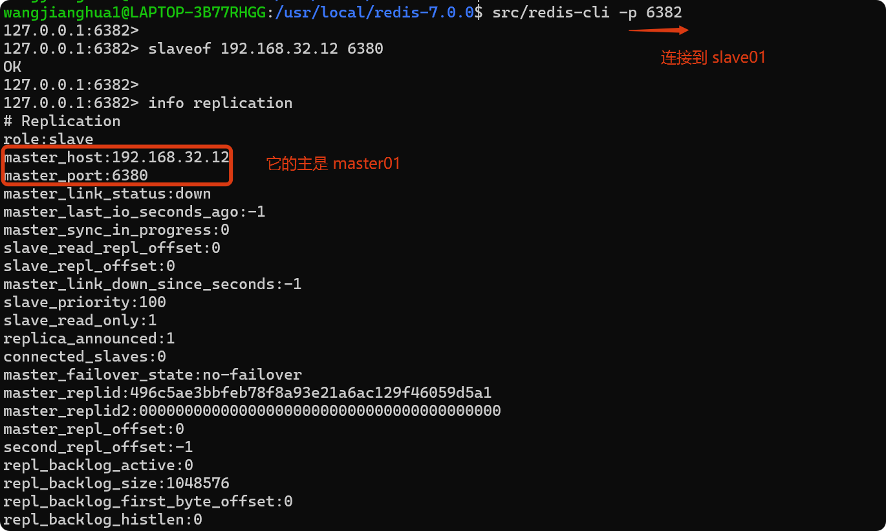

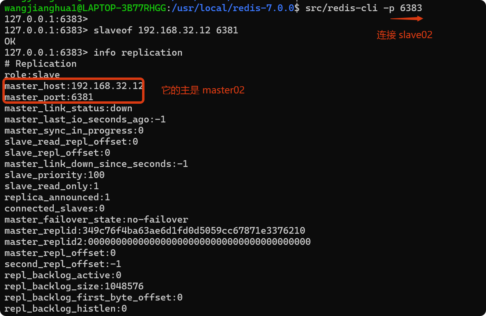

那么「**机房1 192.168.32.12**」的两主两从就搞定了，接下来我们来修改 「**机房2 192.168.33.12**」的配置文件端口，「**机房2**」都是 Redis 从节点。

  
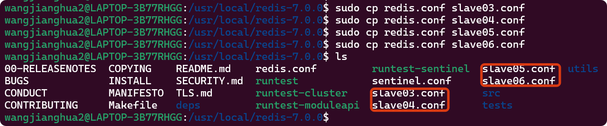

1.  slave03.conf 端口 6384。
2.  slave04.conf 端口 6385。
3.  slave05.conf 端口 6386。
4.  slave06.conf 端口 6387。

  
然后分别启动这 4 个 Redis 实例。

nohup src/redis-server slave03.conf &

nohup src/redis-server slave04.conf &

nohup src/redis-server slave05.conf &

nohup src/redis-server slave06.conf &

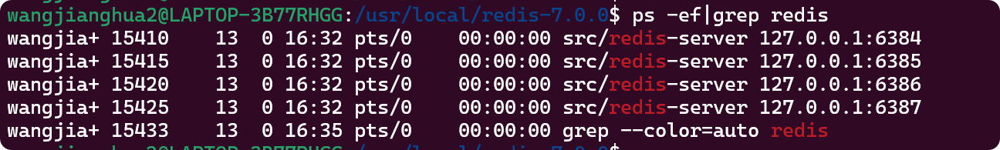

> 这里说明下：
> 
> 这台机器的 6384、6385 端口是 192.168.32.12 这台机器的 6382，6383 的从。
> 
> 这台机器的 6386、6387 端口是当前这台机器的 6384，6385 的从。

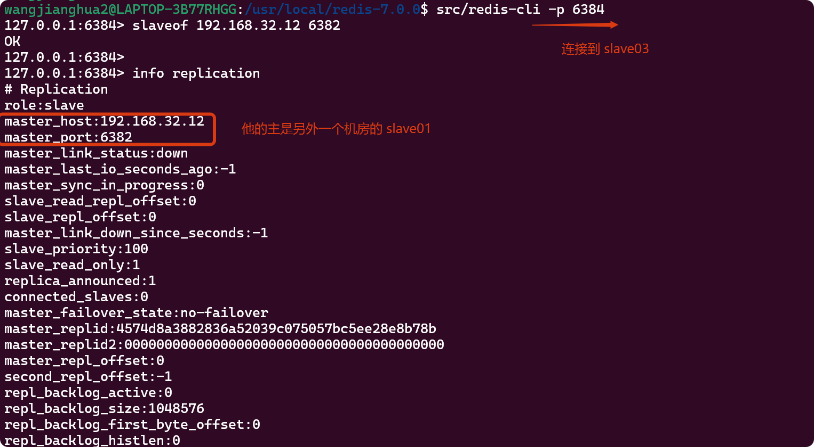

## 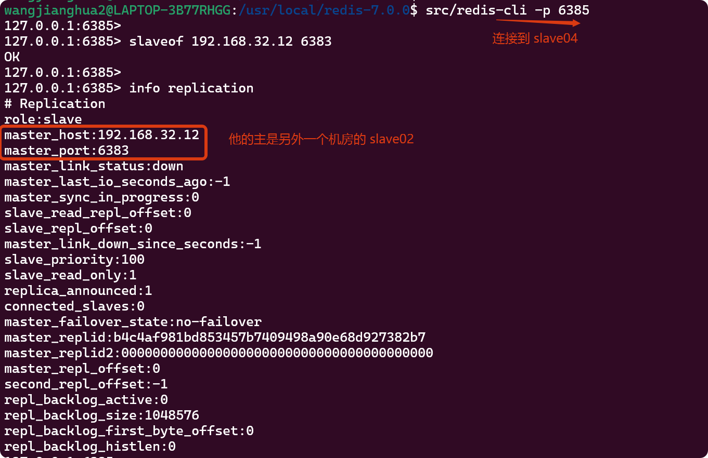

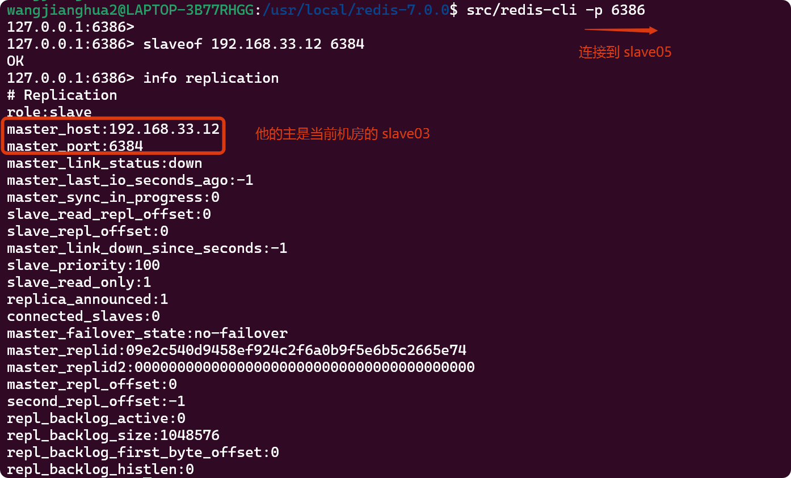

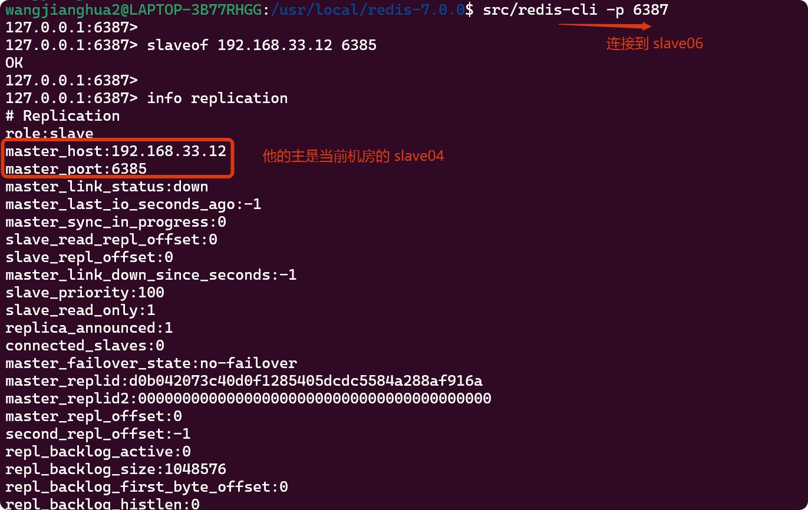

基于这个架构来说，那么两个机房的最终 Twemproxy 的配置文件如下：

\# 192.168.32.12

redis-master: # redis 集群的逻辑名称

listen: 192.168.32.12:1111 # twemproxy 监听的端口号

hash: fnv1a\_64 # hash 散列算法

distribution: ketama # 分片算法，一致性hash，取模

timeout: 1000 # 跟 redis 连接的超时时长

redis: true # 是否是 redis，false 的话是 memcached

servers: # redis 实例列表，一定要加别名，否则默认使用ip:port:weight来计算分片，如果宕机后更换机器，那么分片就不一样了，因此加了别名后，可以确保分片一定是准确的

\- 192.168.32.12:6380:1 redis01

\- 192.168.32.12:6381:1 redis02

\# 192.168.33.12

redis-slave: # redis 集群的逻辑名称

listen: 192.168.33.12:1111 # twemproxy 监听的端口号

hash: fnv1a\_64 # hash 散列算法

distribution: ketama # 分片算法，一致性hash，取模

timeout: 1000 # 跟 redis 连接的超时时长

redis: true # 是否是 redis，false 的话是 memcached

servers: # redis 实例列表，一定要加别名，否则默认使用ip:port:weight来计算分片，如果宕机后更换机器，那么分片就不一样了，因此加了别名后，可以确保分片一定是准确的

\- 192.168.32.12:6384:1 redis01

\- 192.168.32.12:6385:1 redis02

## **2.5 其他服务部署**

这些服务就部署在 192.168.31.11 这台机器上了，之前都部署过了，这里就列举下。

关于 RocketMQ 安装与整合：[【入门实战系列第三篇】RocketMQ 安装入门实战](https://articles.zsxq.com/id_o92x7jv3p0tu.html)，地址里面直接换成 5.3.x 就行。

关于 Nacos 安装与整合：[【电商实战项目第四十七篇】华仔电商实战项目接入微服务全家桶之注册中心与配置中心 Nacos 3.0 及 feign 依赖](https://articles.zsxq.com/id_72j8opdvxzge.html)

关于 Sentinel 安装与整合：[【电商实战项目第四十八篇】华仔电商实战项目接入微服务全家桶之服务治理利器 Sentinel](https://articles.zsxq.com/id_zel04oa1imkn.html)

关于 SkyWalking 安装与整合：[【电商实战项目第四十九篇】华仔电商实战项目接入微服务全家桶之应用监控与链路跟踪 SkyWalking](https://articles.zsxq.com/id_mjeiahr5c0o9.html)