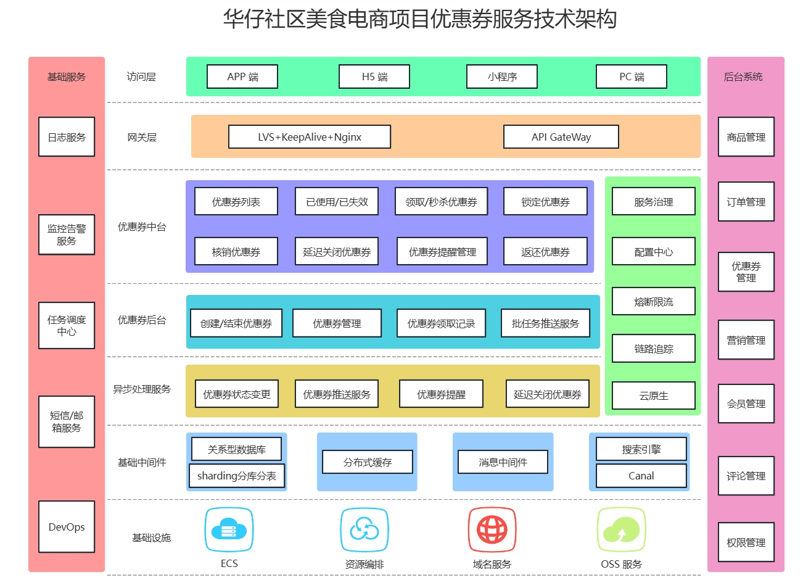
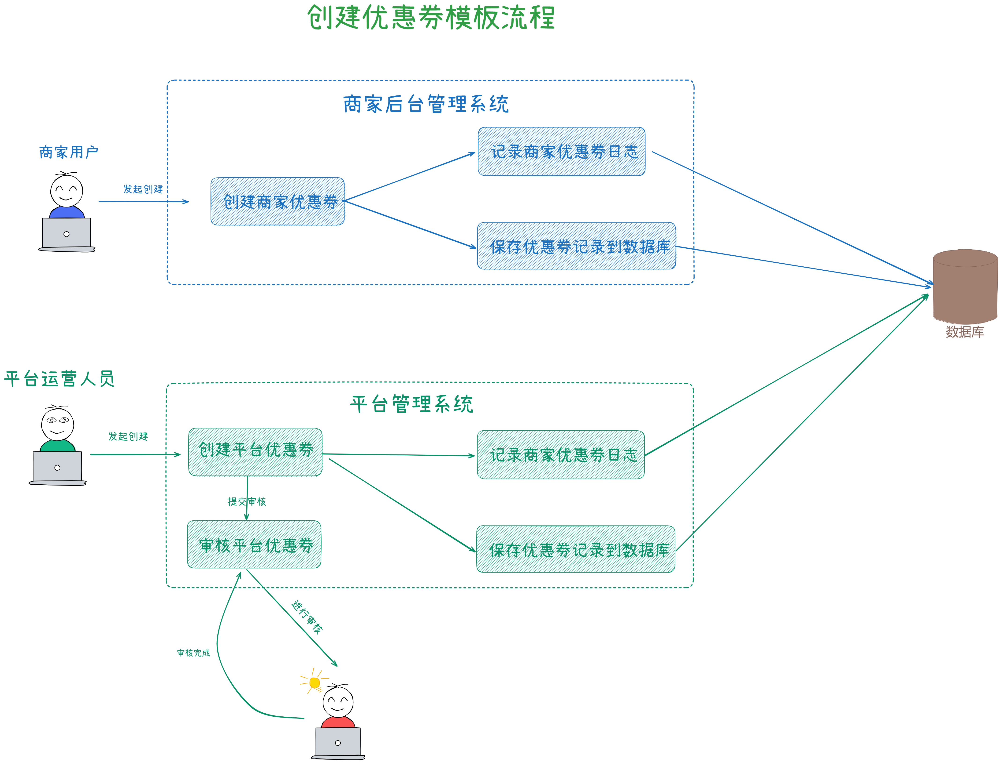
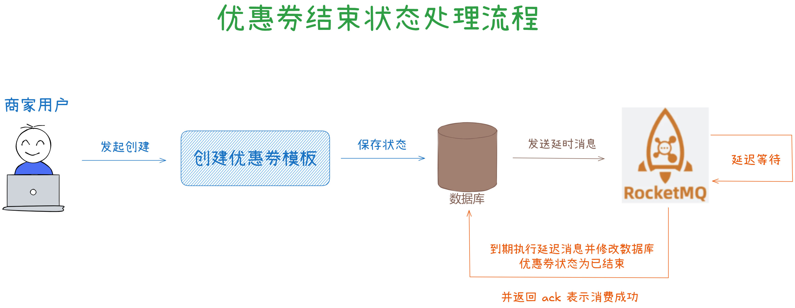
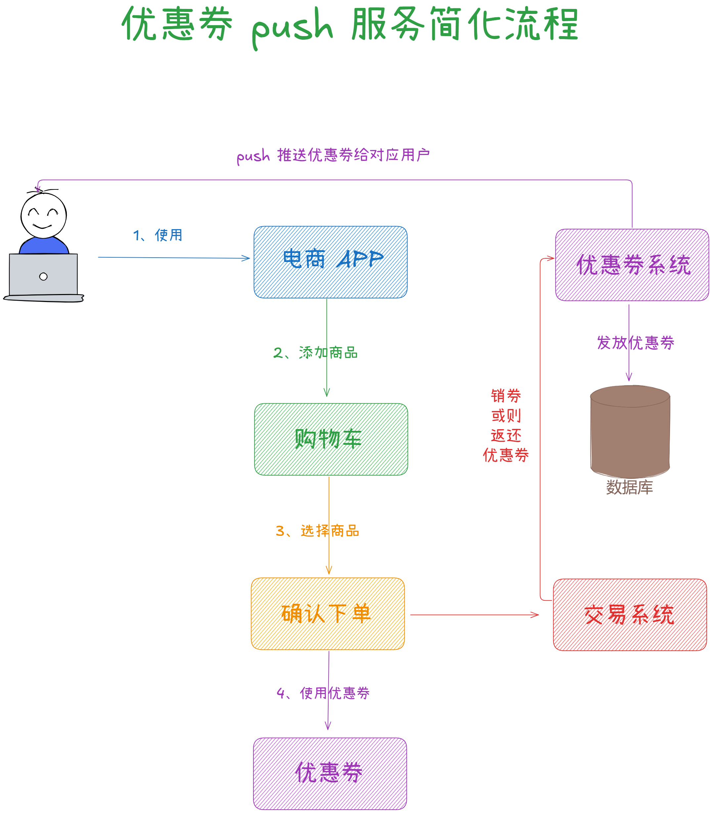
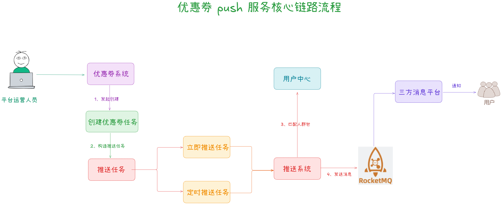
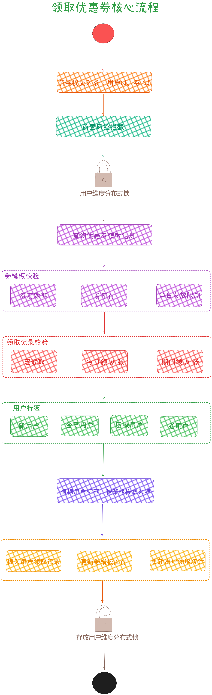
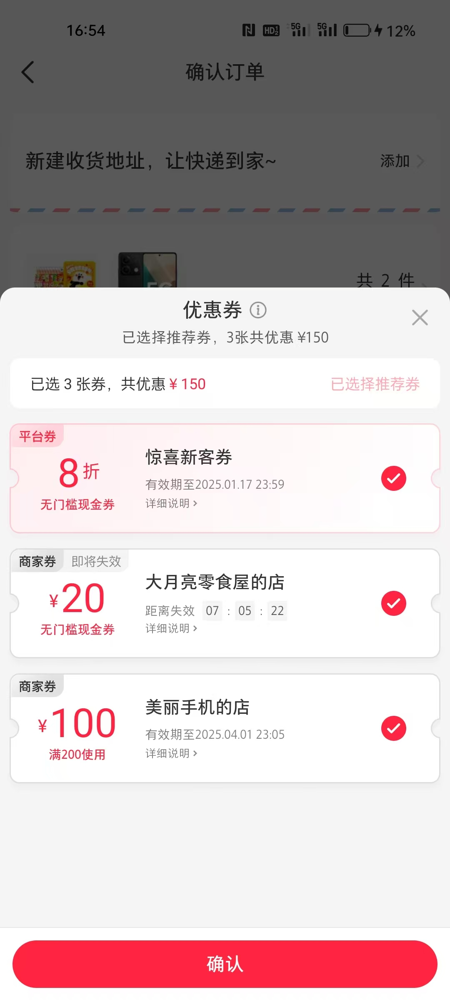
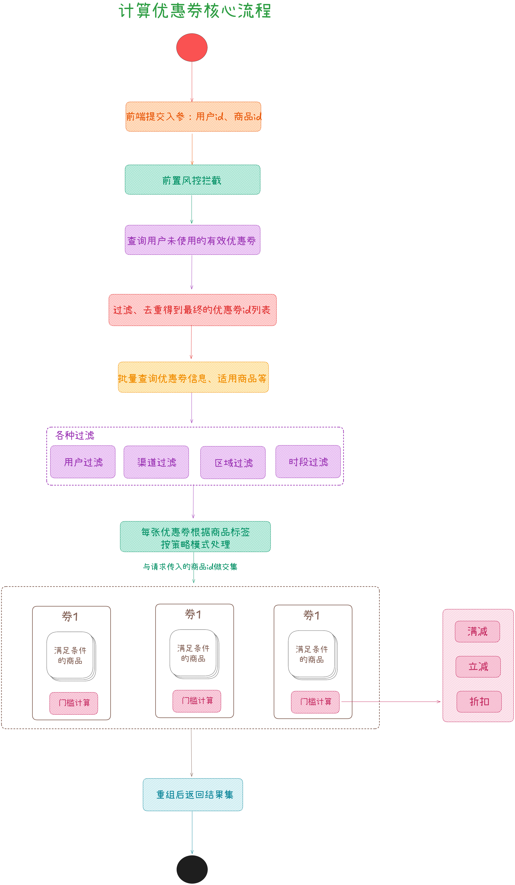
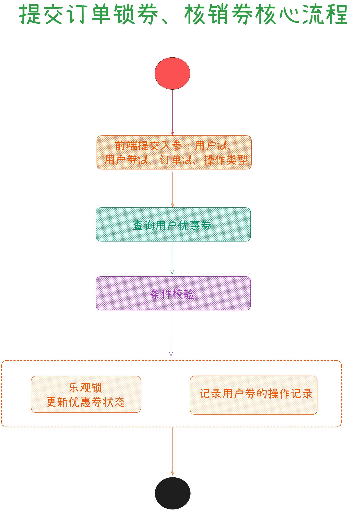

从今天之后的一段时间内，华仔会带着大家一起从零开始搭建并研发一套高并发的电商实战项目，这里会涉及到很多互联网大厂开发过程中所使用的核心技术和架构设计模式，希望大家学完之后可以用到自己的简历中。

接下来我们会重点架构设计和开发一下我们高并发电商实战项目中的「**支撑千万级用户量的优惠券服务**」。

这是第五十八篇，本篇我们继续进行电商实战项目设计与开发，本篇对「**优惠券服务**」中业务场景进行数据库设计以及架构设计。

文章汇总位置：[https://wx.zsxq.com/dweb2/index/columns/51122554151214](https://wx.zsxq.com/dweb2/index/columns/51122554151214)

源码授权与获取地址：[https://articles.zsxq.com/id\_1s85grnaae4p.html](https://articles.zsxq.com/id_1s85grnaae4p.html)

本章源码地址：[https://gitcode.net/u011359591/huazai-ecshop/-/tree/ecshop-chapter-58](https://gitcode.net/u011359591/huazai-ecshop/-/tree/ecshop-chapter-58)

## **01 前言**

终于要设计与研发电商项目代码了，今天我们主要对「**优惠券服务**」业务场景进行数据库设计以及架构设计。

在后续整个开发中，我会增加前端及后台管理相关功能，前台主要是「**购物车**」、「**商品**」、「**商品详情页**」，后台管理主要先把「**优惠券**」、「**商品**」搞完，后续在搞「**美食笔记**」、「**社交计数管理**」、「**评论管理**」、「**营销管理**」等。

## **02 优惠券服务数据库设计**

在 [【电商实战项目第五十七篇】华仔电商实战支撑千万级优惠券服务业务场景介绍](https://articles.zsxq.com/id_2com984wpl4v.html) 上篇中，我们介绍了整个电商体系中，「**优惠券服务**」的业务场景及功能介绍。

##   
**2.1 优惠券模板表(支持分库分表)**

我们先来设计下「**优惠券模板表**」数据结构，这张表主要是「**平台运营人员**」、「**商家**」在后台管理中进行「**优惠券模板**」创建和管理。在上篇中我们分析到，优惠券分为「**平台券**」和「**商家券**」，其中「**平台券**」由平台运营人员创建和管理员审批，C 端用户使用后成本一般来说由「**平台**」和「**商家**」共同承担；而「**商家券**」由商家在商家后台直接创建，无需审核，成本由「**商家**」独自承担。

CREATE TABLE \`coupon\_template\` (

\`id\` bigint NOT NULL AUTO\_INCREMENT COMMENT 'ID',

\`coupon\_name\` varchar(256) CHARACTER SET utf8mb4 COLLATE utf8mb4\_general\_ci DEFAULT NULL COMMENT '优惠券名称',

\`shop\_number\` bigint NOT NULL DEFAULT '0' COMMENT '店铺编号',

\`coupon\_category\` tinyint(1) NOT NULL DEFAULT '0' COMMENT '优惠券分类 0:商家券 1:平台券',

\`coupon\_target\` tinyint(1) NOT NULL DEFAULT '0' COMMENT '优惠对象 0:商品专属 1:全店通用 2:无门槛',

\`product\_id\` json NOT NULL COMMENT '优惠商品id，数组格式',

\`coupon\_type\` tinyint(1) NOT NULL DEFAULT '0' COMMENT '优惠券类型 0:立减券 1:满减券 2:折扣券',

\`coupon\_start\_time\` datetime DEFAULT CURRENT\_TIMESTAMP COMMENT '优惠券有效期开始时间',

\`coupon\_end\_time\` datetime DEFAULT CURRENT\_TIMESTAMP COMMENT '优惠券有效期结束时间',

\`coupon\_count\` int NOT NULL DEFAULT '0' COMMENT '优惠券发行数量',

\`coupon\_received\_count\` int NOT NULL DEFAULT '0' COMMENT '优惠券已经领取的数量',

\`coupon\_receive\_rule\` json DEFAULT NULL COMMENT '优惠券领取规则',

\`coupon\_consume\_rule\` json DEFAULT NULL COMMENT '优惠券消耗规则',

\`version\` int NOT NULL DEFAULT '0' COMMENT '版本号（乐观锁控制）',

\`coupon\_status\` tinyint(1) NOT NULL DEFAULT '0' COMMENT '优惠券状态 0:生效中 1:已结束',

\`coupon\_audit\_tatus\` tinyint(1) NOT NULL DEFAULT '0' COMMENT '优惠券审核状态 0:待审核 1:已通过 2:已驳回',

\`coupon\_del\` tinyint(1) NOT NULL DEFAULT '0' COMMENT '删除标识 0:未删除 1:已删除',

\`create\_time\` datetime DEFAULT CURRENT\_TIMESTAMP COMMENT '创建时间',

\`update\_time\` datetime DEFAULT CURRENT\_TIMESTAMP ON UPDATE CURRENT\_TIMESTAMP COMMENT '修改时间',

PRIMARY KEY (\`id\`),

KEY \`idx\_shop\_number\` (\`shop\_number\`) USING BTREE

) ENGINE\=InnoDB DEFAULT CHARSET\=utf8mb4 COLLATE=utf8mb4\_general\_ci COMMENT\='优惠券模板表';

##   
**2.2 优惠券模板操作日志表**

关于系统操作日志主要用来记录系统用户执行的各类操作的日志信息。这些日志通常包括操作的时间、操作的用户、具体操作内容、操作结果以及其他相关信息等。

通常有两种记录方式：

1.  通过一张表统一管理：比如 opreation\_log，权限操作、系统操作、优惠券操作等等。
2.  单独管理：比如：coupon\_template\_log 表只处理优惠券操作相关的日志。

如果你的系统非常大的话建议第二种，我们这里就采用第二种记录方式。

CREATE TABLE \`coupon\_template\_log\` (

\`id\` bigint NOT NULL AUTO\_INCREMENT COMMENT 'ID',

\`coupon\_template\_id\` bigint NOT NULL DEFAULT '0' COMMENT '优惠券模板ID',

\`operator\_uid\` bigint NOT NULL DEFAULT '0' COMMENT '操作人',

\`operation\_log\` text CHARACTER SET utf8mb4 COLLATE utf8mb4\_general\_ci COMMENT '操作日志',

\`operation\_original\_data\` varchar(1024) CHARACTER SET utf8mb4 COLLATE utf8mb4\_general\_ci DEFAULT NULL COMMENT '原始数据',

\`operation\_updated\_data\` varchar(1024) CHARACTER SET utf8mb4 COLLATE utf8mb4\_general\_ci DEFAULT NULL COMMENT '修改后数据',

\`create\_time\` datetime DEFAULT CURRENT\_TIMESTAMP COMMENT '创建时间',

PRIMARY KEY (\`id\`)

) ENGINE\=InnoDB DEFAULT CHARSET\=utf8mb4 COLLATE=utf8mb4\_general\_ci COMMENT\='优惠券模板操作日志表';

##   
**2.3 优惠券推送任务表**

关于后台优惠券的发放我们将采用「**推送任务**」的方式，底层基于「**RocketMQ**」进行「**全量用户**」、「**定量用户**」发放，这里需要一个任务表来记录下。

CREATE TABLE \`coupon\_push\_cron\` (

\`id\` bigint NOT NULL AUTO\_INCREMENT COMMENT 'ID',

\`coupon\_template\_id\` bigint NOT NULL DEFAULT '0' COMMENT '优惠券模板ID',

\`batch\_id\` bigint(20) DEFAULT NULL COMMENT '批次ID',

\`push\_name\` varchar(128) CHARACTER SET utf8mb4 COLLATE utf8mb4\_general\_ci DEFAULT NULL COMMENT '优惠券批次任务名称',

\`push\_coupon\_num\` int NOT NULL DEFAULT '0' COMMENT '优惠券发放数量',

\`notify\_type\` tinyint(1) NOT NULL DEFAULT '0' COMMENT '通知方式 0:app通知 1:弹框推送 2:邮箱 3:短信',

\`push\_type\` tinyint(1) NOT NULL DEFAULT '0' COMMENT '推送类型 0:立即推送 1:定时推送',

\`push\_time\` datetime DEFAULT NULL COMMENT '推送时间',

\`push\_status\` tinyint(1) NOT NULL DEFAULT '0' COMMENT '推送状态 0:待推送 1:推送中 2:推送失败 3:推送成功 4:任务取消',

\`push\_completion\_time\` datetime DEFAULT CURRENT\_TIMESTAMP COMMENT '推送完成时间',

\`operator\_uid\` bigint NOT NULL DEFAULT '0' COMMENT '操作人',

\`coupon\_push\_del\` tinyint(1) NOT NULL COMMENT '删除标识 0:未删除 1:已删除',

\`create\_time\` datetime DEFAULT CURRENT\_TIMESTAMP COMMENT '创建时间',

\`update\_time\` datetime DEFAULT CURRENT\_TIMESTAMP ON UPDATE CURRENT\_TIMESTAMP COMMENT '修改时间',

PRIMARY KEY (\`id\`),

KEY \`idx\_batch\_id\` (\`batch\_id\`) USING BTREE,

KEY \`idx\_coupon\_template\_id\` (\`coupon\_template\_id\`) USING BTREE

) ENGINE\=InnoDB DEFAULT CHARSET\=utf8mb4 COLLATE=utf8mb4\_general\_ci COMMENT\='优惠券模板推送任务表';

\-- 增加推送人群范围

ALTER TABLE \`huazai\_coupon\`.\`coupon\_push\_cron\`

ADD COLUMN \`push\_range\` tinyint(1) NOT NULL DEFAULT '0' COMMENT '推送人群范围 0:全部用户 1:新用户(注册3月内)2:老用户(注册超过3个月)3:会员用户4:女性用户 5:男性用户' AFTER \`push\_name\`;

另外由于各种原因比如：「**优惠券库存不足**」或者「**用户已领取**」导致任务推送失败，会有一个任务失败记录表。

CREATE TABLE \`coupon\_push\_cron\_fail\` (

\`id\` bigint(20) NOT NULL AUTO\_INCREMENT COMMENT 'ID',

\`coupon\_push\_cron\_id\` bigint(20) DEFAULT NULL COMMENT '推送任务ID',

\`fail\_json\` longtext COMMENT '失败内容',

PRIMARY KEY (\`id\`),

KEY \`idx\_cron\_id\` (\`coupon\_push\_cron\_id\`) USING BTREE

) ENGINE\=InnoDB DEFAULT CHARSET\=utf8mb4 COLLATE=utf8mb4\_general\_ci COMMENT\='优惠券模板发送任务失败记录表';

## **2.4 用户优惠券表(支持分库分表)**

当「**推送任务**」把优惠券都发放完毕后，用户可以在相关场景下进行「**领取优惠券**」，所以需要一个领取表来记录。

CREATE TABLE \`user\_coupon\` (

\`id\` bigint(20) NOT NULL AUTO\_INCREMENT COMMENT 'ID',

\`user\_id\` bigint(20) NOT NULL DEFAULT '0' COMMENT '用户ID',

\`coupon\_template\_id\` bigint(20) NOT NULL DEFAULT '0' COMMENT '优惠券模板ID',

\`coupon\_code\` varchar(64) CHARACTER SET utf8mb4 COLLATE utf8mb4\_general\_ci DEFAULT NULL COMMENT '优惠券码',

\`receive\_time\` datetime DEFAULT NULL COMMENT '优惠券领取时间',

\`receive\_count\` tinyint(1) NOT NULL DEFAULT '0' COMMENT '优惠券领取次数',

\`coupon\_start\_time\` datetime DEFAULT CURRENT\_TIMESTAMP COMMENT '优惠券有效期开始时间',

\`coupon\_end\_time\` datetime DEFAULT CURRENT\_TIMESTAMP COMMENT '优惠券有效期结束时间',

\`coupon\_used\_time\` datetime DEFAULT CURRENT\_TIMESTAMP COMMENT '优惠券使用时间',

\`coupon\_origin\` tinyint(1) NOT NULL DEFAULT '0' COMMENT '领券来源 0:平台发放 2:商家店铺领取',

\`coupon\_status\` tinyint(1) NOT NULL DEFAULT '0' COMMENT '使用状态 0:未使用 1:锁定 2:使用 3:已过期 4:已撤回',

\`coupon\_del\` tinyint(1) NOT NULL DEFAULT '0' COMMENT '删除标识 0:未删除 1:已删除',

\`create\_time\` datetime DEFAULT CURRENT\_TIMESTAMP COMMENT '创建时间',

\`update\_time\` datetime DEFAULT CURRENT\_TIMESTAMP ON UPDATE CURRENT\_TIMESTAMP COMMENT '修改时间',

PRIMARY KEY (\`id\`),

UNIQUE KEY \`idx\_user\_coupon\_receive\_count\` (\`user\_id\`,\`coupon\_template\_id\`,\`receive\_count\`) USING BTREE,

KEY \`idx\_user\_id\` (\`user\_id\`) USING BTREE

) ENGINE\=InnoDB AUTO\_INCREMENT\=0 DEFAULT CHARSET\=utf8mb4 COLLATE=utf8mb4\_general\_ci COMMENT\='用户优惠券领取记录表';

暂时就先准备这几张表，后续在开发的过程中可能会进行增加或者修改。

## **03 优惠券服务架构设计**

上篇中梳理一下整个优惠券架构设计，如下图：

下面我们就关键功能进行架构设计。

## **3.1 优惠券后管系统**

### **3.1.1 创建优惠券模板**

先来看下创建优惠券模板的流程图：

### **3.1.2 优惠券结束状态变更**

这里我们采用 「**RocketMQ 5.x 延时消息**」来实现优惠券结束状态的变更操作。

  

### **3.1.3 优惠券任务推送服务**

这块是优惠券服务的一个重点和亮点，当优惠券系统创建完优惠券模板后，需要按批次生成对应的优惠券，并对用户进行 Push 推送，通知用户可以领券或者用户已经获得一张优惠券了。所以无论是优惠券还是促销活动，都需要推送给用户，吸引用户购物和消费。

整个推送服务底层会基于「**XXL-job**」来管理，一个简化流程如下:

### **1、 优惠券任务推送技术挑战**

不论是发放优惠券活动，还是其他优惠活动，都会面临这样的难点和挑战：需要给「**海量用户**」进行推送，而且「**限制在一定时间内完成**」所有推送任务。比如中型电商平台每天需要进行推送的用户量是「**千万级用户**」的，一天下来需要推送的消息次数甚至到「**亿级**」。所以在量非常大的时候，需要系统支撑「**高并发**」，也就是需要使用RocketMQ 来削峰填谷，然后再由消费者慢慢消费，比如调用第三方平台的 SDK 完成消息推送或写入数据到数据库。

核心链路如下：

在这个过程中会遇到一些问题，我们来梳理下：

1.  如果直接查询千万级的全量用户，可能会直接把 MySQL 压垮，导致查不到数据。
2.  如果分页一批一批的查询全量用户，那么每一批要查多少数据不好确定。如果一批查1000条数据，千万级用户就要查1万次，每次查询耗费100ms，就需要总共查1000s。如果更大会消耗内存更多，甚至会触发 FullGC，导致系统频繁停顿。
3.  如果对千万级用户进行全量遍历，一个用户封装成一条 Push 消息发到 MQ 里，就会有 1000 万条 Push 消息。1000 万条 Push 消息会对 RocketMQ 发起 1000 万次请求，假如每次 Push 消息耗费 10 ms，总共就需要 10 万秒。因此会产生大量的网络通信开销和耗时过长。
4.  对每个用户发放优惠券的数据时，数据库会面临高并发写压力，影响系统运行的稳定性。

### **2、 优惠券任务推送技术调优**

针对这些问题，我们来看下如何进行调优。

这里给出几个优化的方向：

1.  创建完优惠券任务后发送一条「**优惠券任务已创建**」的消息到 RocketMQ 中，对推送任务做一些预处理。
2.  对推送任务进行任务分片：将整个推送任务拆分成1万个「**分片任务**」，每个任务处理 1000 个用户的推送。利用 RocketMQ 的 batch 「**批量写机制**」，将每 100 条任务消息合并成一条 batch 任务消息发送到 RocketMQ。
3.  「**多线程**」并发进行任务推送：如果采用单线程的话整个处理过程太慢了，所以这里会采用多线程进行推送，比如 4核8G 的机器，开启 30 个线程并发处理推送任务。

那么优化后的核心链路如下：

## **3.2 优惠券中心服务**

这部分的关键功能是「**高并发领优惠券**」、「**高并发计价优惠券**」、「**用户预约提醒**」、「**用户优惠券锁定、核销、返还**」等。

比如在大促期间，多个业务方都有发放优惠券的需求，且对发券的 QPS 量级有明确的需求。所以优惠券发放、核销、查询都需要一个高并发架构来支撑。

最终我们的目标是要开发一套能够支撑 10 万 QPS 的优惠券系统，整个过程中会有很多技术难点和技术亮点，这些细节会在后续篇章单独分析，这里就不展开了。

### **3.2.1 优惠券状态说明**

兑换优惠券之后，我们可以在下单时使用优惠券，这个时候优惠券状态就会变成锁定中；如果用户支付了订单，优惠券状态变更为已使用；如果订单退款，用户优惠券回退到用户账户里，优惠券状态回退到未使用状态。

1.  「**兑换优惠券（未使用）**」：优惠券被领取到用户账户中，初始状态为未使用。
2.  「**订单结算（锁定中）**」 ：当用户在订单中使用优惠券时，优惠券状态应变更为 锁定中。此时优惠券不可被其他订单再次使用，直到订单完成或取消。
3.  「**支付成功（已使用）**」 ：用户支付订单后，优惠券状态变更为已使用，表示优惠券使用成功，不可再被使用。
4.  「**订单退款（未使用）**」：如果订单取消或发生退款，优惠券状态回退至未使用，重新回到用户账户中，可被再次使用。

###   
**3.2.2 领取核心流程**

对于优惠券来说并不是每个人都可以领取的，在真实场景中会有很多限制条件，比如「**只有新人可以领**」、「**一天只能领一张**」、「**需要完成任务或者达到一定门槛才能领**」等等。

我们来简单看下优惠券领取的流程图，如下：

优惠券的领取，逻辑相对简单些，需要关注券模板、领取记录，用户标签等几个维度校验。

如果满足条件就可以给用户发放优惠券。

1.  券模板校验：
2.  优惠券模板本身设置领取时间，只有在区间时间内才有机会领取优惠券，当然是否能最终领取还取决于其他条件。
3.  券库存：跟商品一样，没有库存的商品是无法下单售卖
4.  当日发放限制：为了防止用户对券哄抢，同时为了延长活动的黏性效果，会限量每天发放优惠券数量。
5.  用户领取记录校验：
6.  根据券模板的领取条件限制，以及用户的领取记录，判断是否还可以领取。
7.  用户标签校验：
8.  有些券限制只有新人才可以领取，比如：新人专享活动。
9.  券也可以跟用户等级挂钩，只有达到设置的等级才可以领取。
10.  黑名单用户：用风控挂钩，识别风险刷券用户。
11.  自定义用户：可以给用户打一些特定标签。并针对该类型的用户发放。

### **3.2.3 计券核心流程**

用户对购物车批量商品下单，创建订单时会计算有哪些优惠券可以使用，如下图所示：

只显示可以当前可用且按优惠力度排序的优惠券，但如何计算出满足当前订单的优惠券，后台涉及哪些复杂业务逻辑，又会遇到哪些技术难点挑战，下面来我们来分析下。

  
整体的架构思想还是采用过滤机制，首先查出用户下所有的优惠券，然后根据优惠的各种标记位做相应的策略处理。

### **3.2.4 核销券核心流程**

这块会结合订单服务进行处理，在优惠券先列为 TODO，我们先来看下核销券的处理流程。

至此，相关架构设计及核销流程就到此了，具体的细节架构会在后续单独篇章展开，接下来会先开发一下后台管理的相关功能，然后再开发优惠券中台服务及前端相关功能。