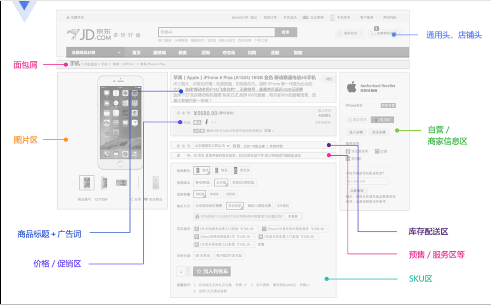
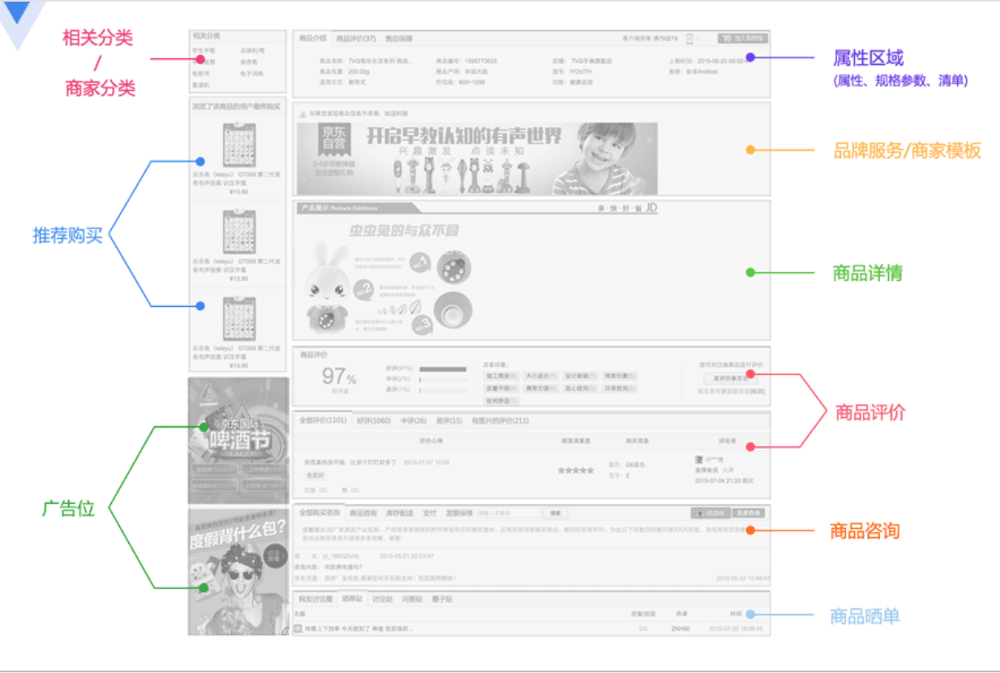
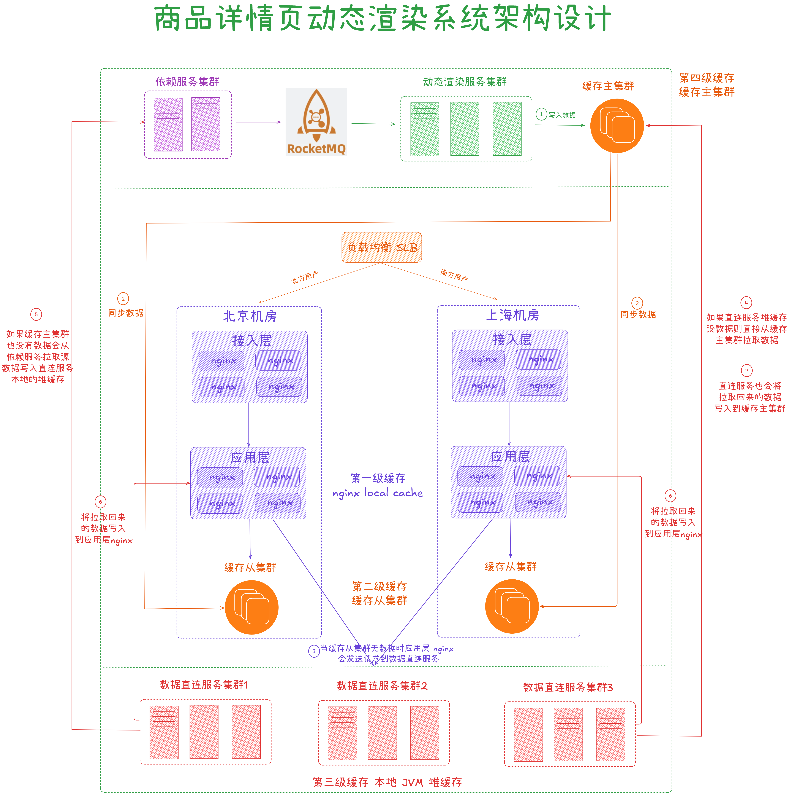
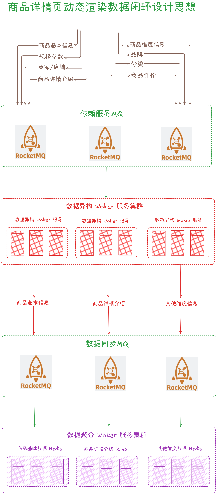
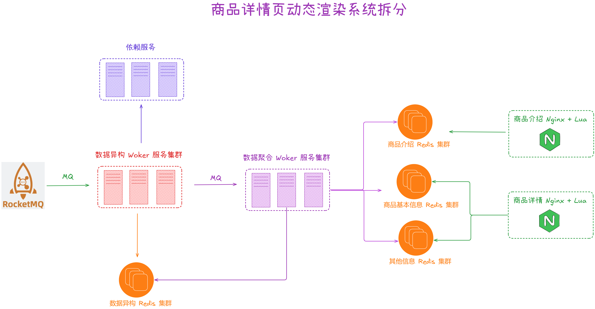
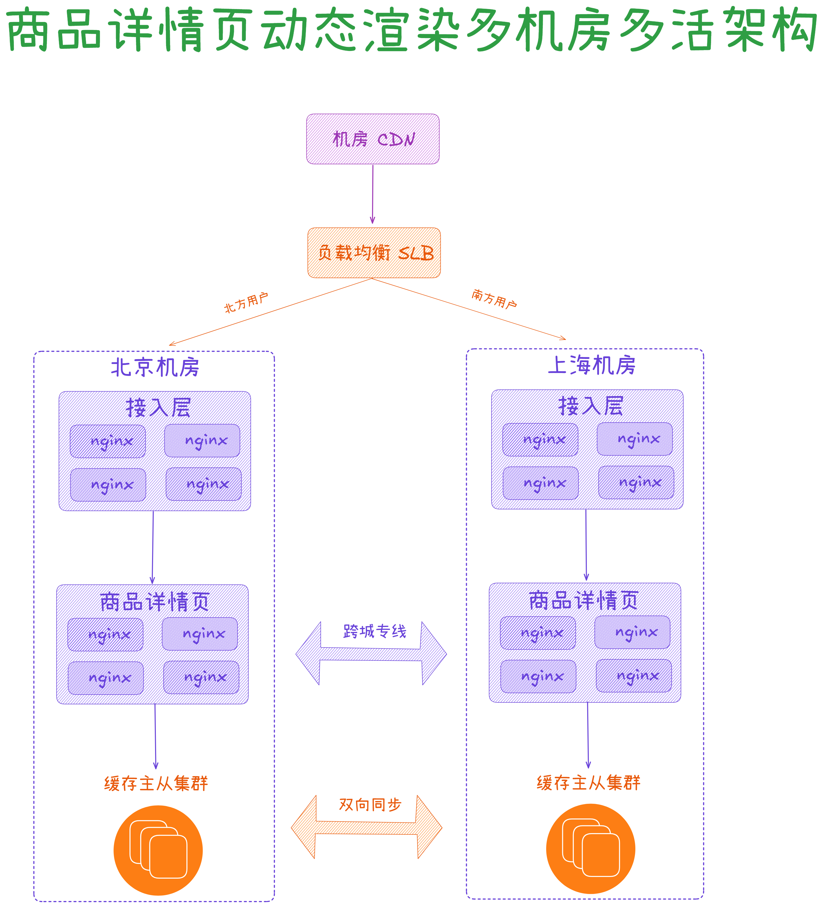
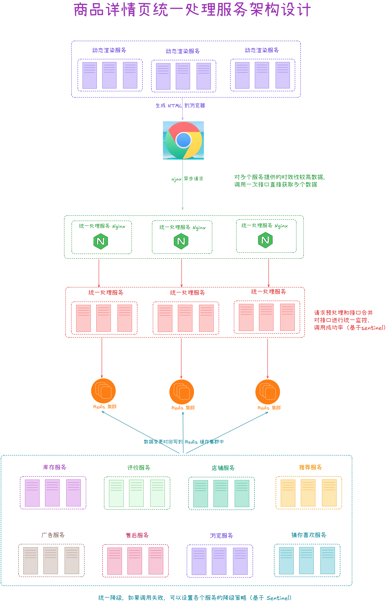

从今天之后的一段时间内，华仔会带着大家一起从零开始搭建并研发一套高并发的电商实战项目，这里会涉及到很多互联网大厂开发过程中所使用的核心技术和架构设计模式，希望大家学完之后可以用到自己的简历中。

接下来我们会重点进行「**商品中心服务详情页架构设计**」。这是第五十篇，本篇我们继续进行电商实战项目设计与开发，本篇来梳理下「**亿级流量大型电商商品中心服务详情页整体架构设计**」。

文章汇总位置：[https://wx.zsxq.com/dweb2/index/columns/51122554151214](https://wx.zsxq.com/dweb2/index/columns/51122554151214)

源码授权与获取地址：[https://articles.zsxq.com/id\_1s85grnaae4p.html](https://articles.zsxq.com/id_1s85grnaae4p.html)

本章源码地址：[https://gitcode.net/u011359591/huazai-ecshop/-/tree/ecshop-chapter-50](https://gitcode.net/u011359591/huazai-ecshop/-/tree/ecshop-chapter-50)

## **01 前言**

终于要设计与研发电商项目代码了，今天我们主要对实战项目进行「**亿级流量大型电商商品中心服务详情页整体架构设计**」。

这里需要注意下，我们整个项目目前是不提供前端的，这个后续有时间在搞，主要是进行后端接口以及微服务模块架构设计。

## **02 亿级流量商品中心整体架构设计**

在 [【电商实战项目第三十六篇】华仔电商实战项目商品中心服务数据库设计及架构设计](https://articles.zsxq.com/id_8libh7xvbehu.html) 这篇的文末，我们深度剖析了「**京东亿级流量商品中心服务详情页整体架构设计**」，今天我们会根据京东的架构来设计下我们电商实战项目的「**商品中心服务详情页整体架构设计**」。

先来看下京东的商品详情页是什么？

「**商品详情页**」是展示商品详细信息的一个页面，承载在网站的大部分流量和订单的入口。京东商城目前有通用版、全球购、闪购、易车、惠买车、服装、拼购、今日抄底等许多套模板。各套模板的元数据是一样的，只是展示方式不一样。目前商品详情页个性化需求非常多，数据来源也是非常多的，而且许多基础服务做不了的都放我们这，因此我们需要一种架构能快速响应和优雅的解决这些需求问题。

京东商品详情页前端结构如下图所示：

  
因此我们电商实战项目重新设计了「**商品详情页架构**」，主要包括两个部分：

1.  「**商品详情页动态渲染服务**」: 负责静态页面的部分。
2.  「**商品详情页统一处理服务**」: 负责动态变更且时效性要求比较高的部分。

下面分别来看下这两个系统的主要职责和功能。

##   
**2.1 商品详情页动态渲染服务**

  
该服务主要将详情页面中「**静态**」的数据，直接在「**变更**」的时候推送到「**缓存**」系统中，然后每次请求页面「**动态渲染**」新数据。

###   
**2.1.1 商品详情页动态渲染服务架构图**

整个架构图如下：

从上图得出，总共分为三部分。

1.  负载均衡 + 多机房模板动态渲染 + 一二级缓存：当自己本地缓存失效时，请求「**数据直连服务**」进行拉取。
2.  数据直连服务 + 三级缓存：「**数据直连服务**」会检查本地堆缓存，不存在时从「**缓存主集群**」获取信息， 如果「**缓存主集群**」也没有，则直接从「**依赖服务**」获取源信息，并重建「**缓存主集群**」缓存， 返回应用层 nginx。
3.  动态渲染服务 + 主集群：通过 MQ 接收「**依赖服务**」的各种事件，把变更信息缓存到「**缓存主集群**」中去， 而「**缓存主集群**」与「**缓存从集群**」进行数据同步。

###   
**2.1.2 商品详情页动态渲染设计思想**

### **2.1.2.1 数据闭环**

所谓「**数据闭环**」，就是数据的自我管理，所有数据同步后会进行后续的数据加工并展示。当数据形成闭环之后，「**依赖服务**」出现抖动或者维护，都不会影响到整个商品详情页服务的稳定运行。

数据异构，是数据闭环的第一步，将各个依赖系统的数据拿过来，按照自己的要求存储起来，数据闭环架构如下：

1.  「**依赖服务**」：主要包括商品基本信息，规格参数，商家/店铺，商品介绍，商品维度信息、品牌，分类，商品评价等。
2.  「**依赖服务 MQ**」：依赖服务将变更消息数据发送到「**依赖服务 MQ**」中。
3.  「**数据异构 Worker 服务**」：监听 「**依赖服务 MQ**」，将原子数据存储到 Redis，发送消息到「**数据同步 MQ**」。
4.  「**数据聚合 Worker 服务**」：监听「**数据同步 MQ**」，将原子数据按维度聚合为一个大 JSON 数据后存储到 Redis，主要是三个维度（商品基本信息、商品介绍、其他信息）。

  

### **2.1.2.2 数据维度化**

通过分析，数据维度可以分为以下几大类：

1.  商品基本信息：标题、扩展属性、特殊属性、图片、颜色尺码、规格参数
2.  商品详情介绍信息。
3.  非商品维度其他信息：分类、商家、店铺、品牌
4.  商品维度其他信息：采用 ajax 异步加载，如：价格、促销、配送至、广告、推荐、最佳组合，等等。

一个完整的数据，拆分成多个维度，每个维度独立存储，就避免了一个维度的数据变更就要全量更新所有数据的问题。不同维度的数据，因为数据量的不一样，可以采取不同的存储策略。

存储策略：

1.  ssdb: 这种基于磁盘的大容量/高性能的 kv 存储，保存商品维度信息、商品详情介绍维度信息，数据量大。
2.  redis：纯内存的 kv 存储，保存少量的数据，比如非商品维度的其他数据：商家数据、分类数据、品牌数据。

这里为了方便，我们都存储到 Redis 服务中。

###   
**2.1.2.3 系统拆分**

将系统拆分为多个子系统虽然增加了复杂性，但是可以得到更多的好处，比如「**数据异构系统**」存储的数据是「**原子化数据**」，这样可以按照一些维度对外提供服务；而数据同步系统存储的是聚合数据，可以为前端展示提供高性能的读取。而前端展示系统分离为商品详情页和商品介绍，可以减少相互影响。

1.  数据异构 Worker 的原子数据，基于原子数据提供的服务更加灵活。
2.  数据聚合 Worker 将数据聚合后，减少 redis 读取次数，提升性能。

  

### **2.1.2.4 异步化**

这里会大量使用异步化，通过异步化机制提升并发能力。

1.  首先我们使用了「**消息异步化**」进行系统解耦合，通过消息通知变更，然后再调用相应接口获取相关数据。
2.  数据更新异步化 ，更新缓存时，同步调用服务，然后异步更新缓存。可「**并行任务**」并发化， 商品数据系统来源有多处，并发调用并聚合，这样本来串行需要 1s 的经过这种方式我们提升到 300ms 之内。
3.  「**异步请求合并**」，然后一次请求调用就能拿到所有数据。前端服务异步化/聚合，实时价格、实时库存异步化， 使用如线程或协程机制将多个可并发的服务聚合。

异步化还一个好处就是可以对异步请求做合并，原来N次调用可以合并为一次，还可以做请求的排重。

### **2.1.2.5 数据动态化**

1.  数据获取动态化：nginx+lua 获取商品详情页数据的时候，按照维度获取，比如商品基本数据、其他数据（分类、商家）
2.  模板渲染实时化：支持模板页面随时变化，因为采用的是每次从 nginx+redis+ehcache 缓存获取数据，渲染到模板的方式， 因此模板变更不用重新静态化 HTML。
3.  重启应用秒级化：nginx+lua 架构，重启在秒级。
4.  需求上线快速化：使用 nginx+lua 架构开发商品详情页的业务逻辑，非常快速。

### **2.1.2.6 多机房多活架构**

从上图得知：

1.  部署统一的 CDN 以及负载均衡设备。
2.  应用无状态部署：各自的机房采取不同机房的配置，来读取各自机房内部部署的数据集群（redis、mysql等）。
3.  将数据异构 Worker 和数据聚合 Worker 设计为无状态化，可以任意水平扩展。
4.  Worker 无状态化，但是配置文件是有状态的，不同的机房有一套自己的配置文件，只读取自己机房的 redis、ssdb、mysql 等数据。
5.  每个机房配置全链路接入 nginx：商品详情页 nginx + 商品信息 redis 集群。

##   
**2.2 商品详情页统一处理服务**

该服务相对「**商品详情页动态渲染服务**」来说就比较简单了，它主要统一对外提供数据接口，动态调用后端各种依赖服务的接口产生数据并且返回响应，打造服务闭环。

整个架构图如下：

其主要功能如下：

1.  商品详情页依赖的服务达到十几个，需要给一个统一的入口，打造数据服务闭环。
2.  请求预处理。
3.  合并接口调用，减少 ajax 异步加载次数。
4.  统一监控、降级处理。