从今天之后的一段时间内，华仔会带着大家一起从零开始搭建并研发一套高并发的电商实战项目，这里会涉及到很多互联网大厂开发过程中所使用的核心技术和架构设计模式，希望大家学完之后可以用到自己的简历中。

接下来我们会重点架构设计和开发一下我们高并发电商实战项目中的「**订单中心服务**」。

这是第八十一篇，本篇我们继续进行电商实战项目设计与开发，本篇将进行「**订单中心服务**」基于 Canal + RocketMQ 实现订单数据增量同步 ES。

文章汇总位置：[https://wx.zsxq.com/dweb2/index/columns/51122554151214](https://wx.zsxq.com/dweb2/index/columns/51122554151214)

源码授权与获取地址：[https://articles.zsxq.com/id\_1s85grnaae4p.html](https://articles.zsxq.com/id_1s85grnaae4p.html)

本章源码地址：[https://gitcode.net/u011359591/huazai-ecshop/-/tree/ecshop-chapter-81](https://gitcode.net/u011359591/huazai-ecshop/-/tree/ecshop-chapter-81)

## **01 前言**

上篇 [【电商实战项目第八十篇】华仔电商实战项目订单服务引入 ElasticSearch 后的订单列表搜索架构及索引设计](https://articles.zsxq.com/id_r06jt1pw0le3.html)，我们剖析了「**订单中心服务**」引入 ElasticSearch 后的「**架构设计与索引设计**」，今天我们主要对「**订单中心服务**」 Elasticsearch基于 Canal + RocketMQ 实现订单数据增量同步 ES。

##   
**02 基于 Canal + RocketMQ 增量同步 ES 架构设计**

在「**商品中心服务**」中，我们手把手带搭建「**ElasticSearch**」以及「**相关索引构建**」。

本篇就来重点实现这个功能，这里我们采用 「**Canal**」 + 「**RocketMQ**」的方式来实现增量同步 ES。

##   
**2.1 Canal 介绍**

这里不赘述了，直接查看：[【电商实战项目第四十五篇】华仔电商实战项目商品中心服务基于 Canal + RocketMQ 实现商品数据增量同步 ES](https://articles.zsxq.com/id_7z84tu1u1zst.html)

## **2.2 Canal + RocketMQ 同步架构**

binlog 同步保障数据一致性的架构：

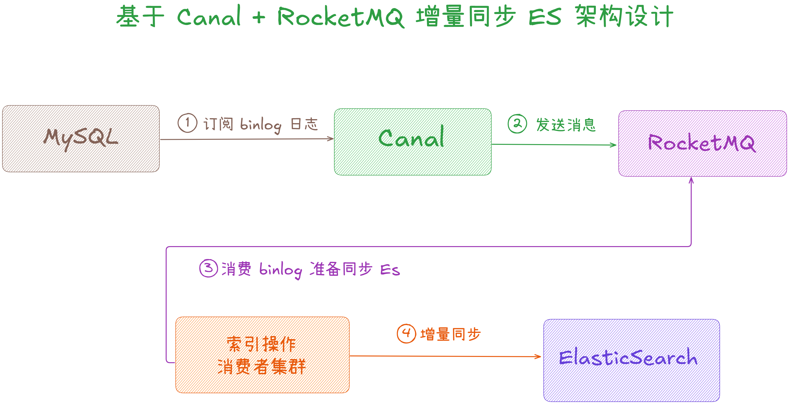

## **2.3 基于 Canal + RocketMQ 增量同步 ES 环境配置**

关于「**Canal**」介绍与安装，直接点击上面链接，这里只展开本篇相关的内容。

###   
**2.3.1 启动 Canal.admin**

进入 canal.admin 目录进行启动：

cd /home/wangjianghua/src/canal.admin && sh bin/startup.sh

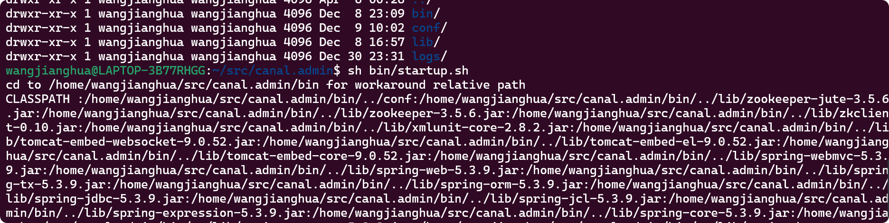

启动成功，使用浏览器输入 [http://ip:8089](http://ip:8089/) 会跳转到登录界面，如下：

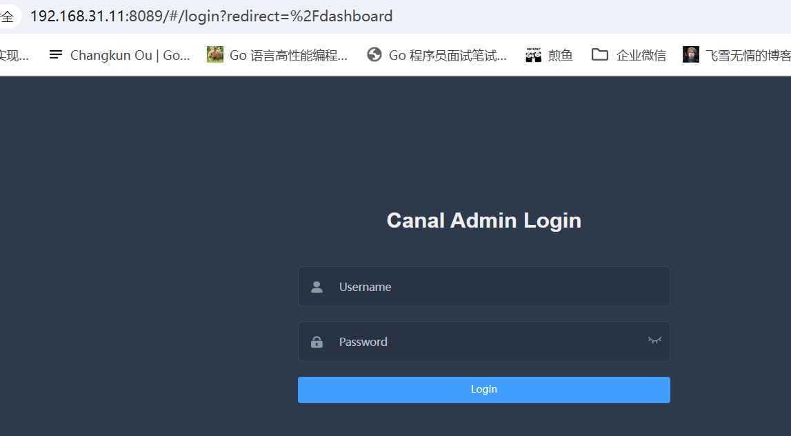

使用用户名：admin 密码为：123456 进行登录，登录成功，会自动跳转到如下界面。此时 [canal.admin](http://canal.admin/) 就搭建成功了。

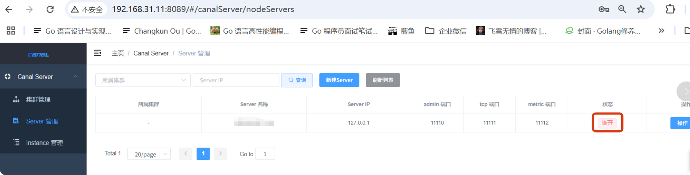

### **2.3.2 Canal.deployer 启动**

使用如下命令启动 canal server。

cd /home/wangjianghua/src/canal.deployer && sh bin/startup.sh local

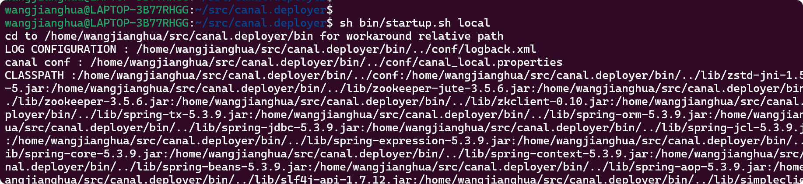

启动成功。同时我们在 canal.admin web ui 中刷新 server 管理，可以到 canal server 已经启动成功。

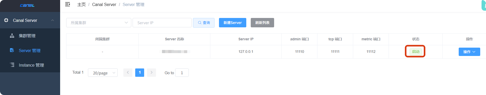

### **2.3.3 新增 order Instance**

新建 Instance，路径： 选择 Instance 管理->新建 Instance，填写 Instance 名称：huazai\_order.

大概的步骤:

1.  选择所属主机集群
2.  选择载入模板
3.  修改默认信息

#################################################

\## mysql serverId , v1.0.26+ will autoGen

\# canal.instance.mysql.slaveId=0

\# enable gtid use true/false

canal.instance.gtidon=false

\# position info 需要改成自己的数据库信息

canal.instance.master.address=127.0.0.1:3306

canal.instance.master.journal.name=

canal.instance.master.position=

canal.instance.master.timestamp=

canal.instance.master.gtid=

\# rds oss binlog

canal.instance.rds.accesskey=

canal.instance.rds.secretkey=

canal.instance.rds.instanceId=

\# table meta tsdb info

canal.instance.tsdb.enable=true

canal.instance.tsdb.url=jdbc:mysql://127.0.0.1:3306/canal\_tsdb?useUnicode=true&characterEncoding=UTF-8

canal.instance.tsdb.dbUsername=canal

canal.instance.tsdb.dbPassword=canal

#canal.instance.standby.address =

#canal.instance.standby.journal.name =

#canal.instance.standby.position =

#canal.instance.standby.timestamp =

#canal.instance.standby.gtid=

\# username/password 需要改成自己的数据库信息

canal.instance.dbUsername=root

canal.instance.dbPassword=123456

canal.instance.connectionCharset = UTF-8

\# enable druid Decrypt database password

canal.instance.enableDruid=false

#canal.instance.pwdPublicKey=MFwwDQYJKoZIhvcNAQEBBQADSwAwSAJBALK4BUxdDltRRE5/zXpVEVPUgunvscYFtEip3pmLlhrWpacX7y7GCMo2/JM6LeHmiiNdH1FWgGCpUfircSwlWKUCAwEAAQ==

#canal.instance.defaultDatabaseName=huazai\_product

#canal.instance.connectionCharset=UTF-8

\# table regex

#canal.instance.filter.regex=.\*\\\\..\*

#################################################

\## 分库分表 Binlog 过滤规则（精准匹配 2 库 × 32 表） 白名单

#################################################

canal.instance.filter.regex=huazai\_buyer\_order\_\[0-1\]\\\\.trade\_order\_(\[0-9\]|1\[0-9\]|2\[0-9\]|3\[0-1\])

\# table black regex

canal.instance.filter.black.regex=huazai\_coupon\_\\\\..\*

\# table field filter(format: schema1.tableName1:field1/field2,schema2.tableName2:field1/field2)

#canal.instance.filter.field=test1.t\_product:id/subject/keywords,test2.t\_company:id/name/contact/ch

\# table field black filter(format: schema1.tableName1:field1/field2,schema2.tableName2:field1/field2)

#canal.instance.filter.black.field=test1.t\_product:subject/product\_image,test2.t\_company:id/name/contact/ch

\# mq config MQ 配置日志数据会发送到 order\_to\_es 这个 topic 上

canal.mq.topic=order\_to\_es

\# dynamic topic route by schema or table regex

#canal.mq.dynamicTopic=mytest1.user,mytest2\\\\..\*,.\*\\\\..\*

#单分区处理消息

#canal.mq.partition=0

\# hash partition config

#canal.mq.partitionsNum=3

#canal.mq.partitionHash=test.table:id^name,.\*\\\\..\*

\# 按 buyer\_id 哈希分区（保证同一分片数据顺序性）

canal.mq.partitionsNum=32

canal.mq.partitionHash=.\*:buyer\_id

#################################################

这里主要配置了如下几点：

1.  订单分库分表，白名单：  
    canal.instance.filter.regex=huazai\_buyer\_order\_\[0-1\]\\\\.trade\_order\_(\[0-9\]|1\[0-9\]|2\[0-9\]|3\[0-1\])
2.  过滤掉优惠券配置：canal.instance.filter.black.regex=huazai\_coupon\_\\\\..\*
3.  订单写入到 ES 的 RocketMQ Topic ：canal.mq.topic=order\_to\_es。
4.  MQ 分区配置：canal.mq.partitionsNum=32 canal.mq.partitionHash=.\*:buyer\_id

配置好之后，需要点击保存。此时在 Instances 管理中就可以看到此时的实例信息，说明 Instance 也已经启动成功了。

  
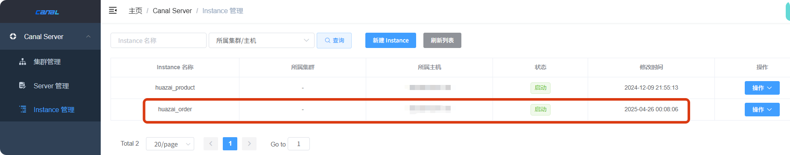

查看日志如下：

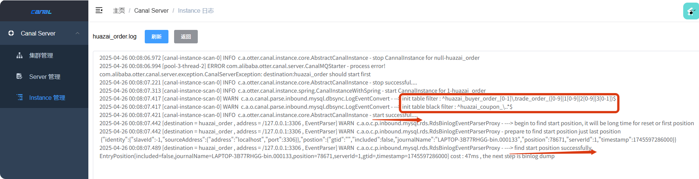

查看消费日志如下：

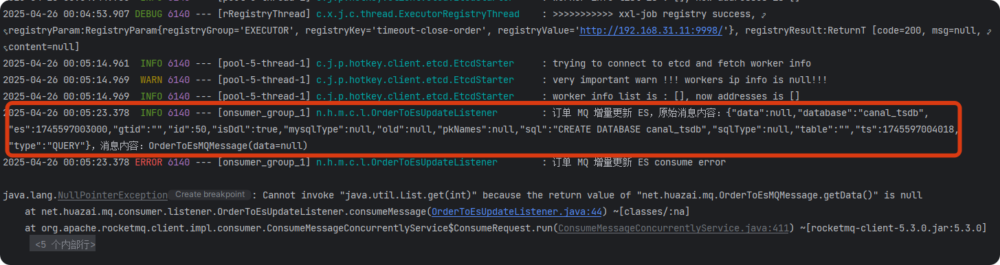

由于我们在配置中启动了 canal\_tsdb，所以会推送这个表的变更记录，但是不是我们需要的数据所以消费失败，这里可以忽略。

### **2.3.4 修改 Canal Server 配置文件，使用 MQ 处理 binlog**

自 Canal 1.1.1 版本之后，默认支持将 Canal Server接收到的 binlog 数据直接投递到 MQ，目前默认支持的 MQ 系统有:

1.  kafka: [https://github.com/apache/kafka](https://github.com/apache/kafka)
2.  RocketMQ : [https://github.com/apache/rocketmq](https://github.com/apache/rocketmq)

这里我们以 RocketMQ 为例，还是使用 web ui 界面操作。点击 server 管理 -> 点击配置：

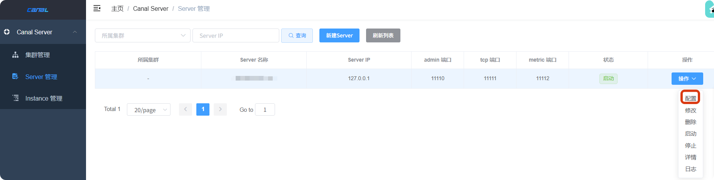

修改配置文件，修改好之后保存会自动重启。

  
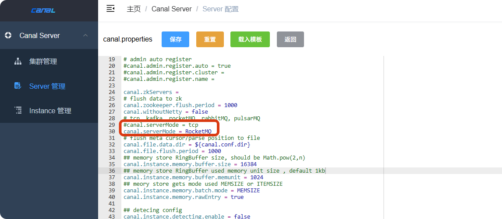

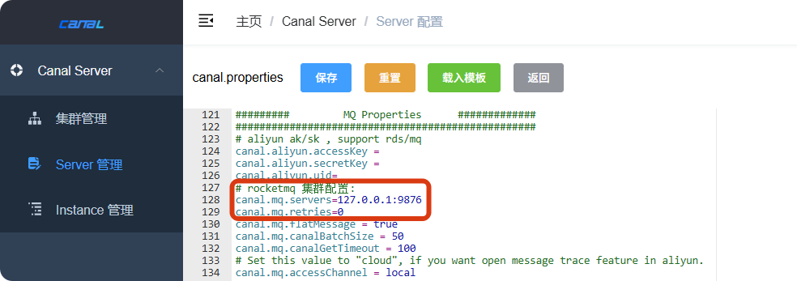

**注意：这里也有坑，修改后它会自动重启会报错，还原后也会报错，就是无法重新启动了，除非用命令重启才行：**

ps -ef|grep canal.deployer

kill -9 端口号

\# 删除 pid 和 lock 文件

rm -rf bin/canal.pid

rm -rf conf/huazai\_product/\*

\# 命令重启

sh bin/startup.sh local

**解决方案：**

**目前我测试的一个结果是：提前改好配置文件，然后重启 Canal.admin 和 Canal.deployer。**

\# ...

\# 可选项: tcp(默认), kafka, RocketMQ

canal.serverMode=RocketMQ

\# ...

\# rocketmq 集群配置:

canal.mq.servers=127.0.0.1:9876

canal.mq.retries=0

然后就成功了，如下：

  
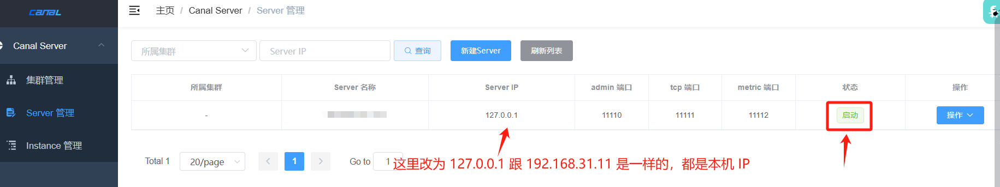

刷新 RocketMQ dashboard 后可以看到了我们填写的 Topic ：

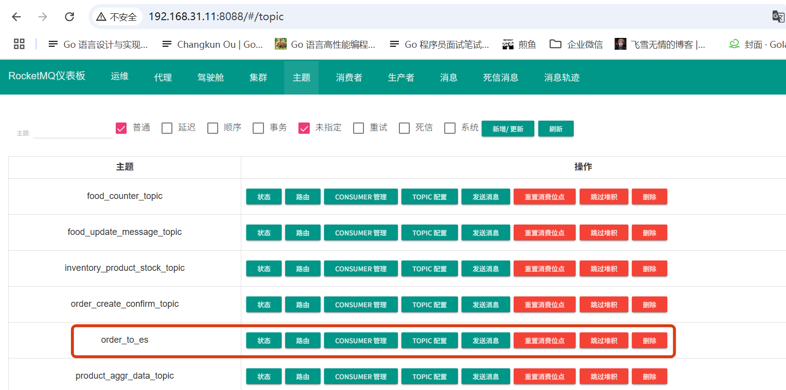

测试一下数据，插入一条订单数据到数据库：

  
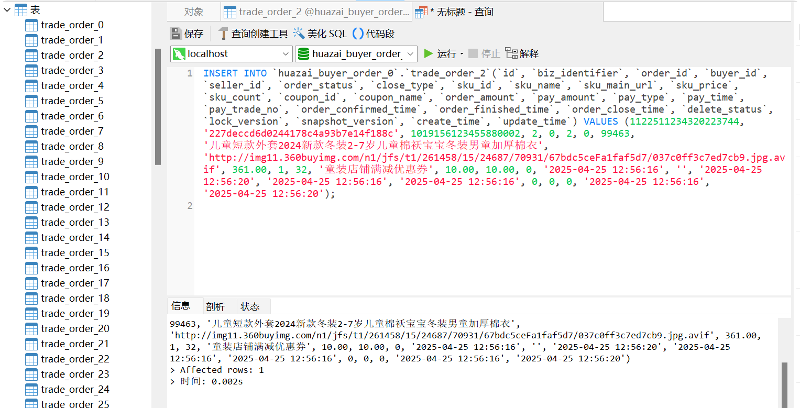

查看 RocketMQ Topic 监听到的数据：

  
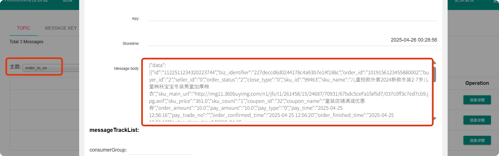

binlog 消息内容如下：

{"data":\[{"id":"1122511234320223744","biz\_identifier":"227deccd6d0244178c4a93b7e14f188c","order\_id":"1019156123455880002","buyer\_id":"2","seller\_id":"0","order\_status":"2","close\_type":"0","sku\_id":"99463","sku\_name":"儿童短款外套2024新款冬装2-7岁儿童棉袄宝宝冬装男童加厚棉衣","sku\_main\_url":"http://img11.360buyimg.com/n1/jfs/t1/261458/15/24687/70931/67bdc5ceFa1faf5d7/037c0ff3c7ed7cb9.jpg.avif","sku\_price":"361.0","sku\_count":"1","coupon\_id":"32","coupon\_name":"童装店铺满减优惠券","order\_amount":"10.0","pay\_amount":"10.0","pay\_type":"0","pay\_time":"2025-04-25 12:56:16","pay\_trade\_no":"","order\_confirmed\_time":"2025-04-25 12:56:20","order\_finished\_time":"2025-04-25 12:56:16","order\_close\_time":"2025-04-25 12:56:16","delete\_status":"0","lock\_version":"0","snapshot\_version":"0","create\_time":"2025-04-25 12:56:16","update\_time":"2025-04-25 12:56:20"}\],"database":"huazai\_buyer\_order\_0","es":1745598536000,"gtid":"","id":85,"isDdl":false,"mysqlType":{"id":"bigint","biz\_identifier":"varchar(128)","order\_id":"bigint unsigned","buyer\_id":"bigint unsigned","seller\_id":"bigint unsigned","order\_status":"tinyint unsigned","close\_type":"tinyint unsigned","sku\_id":"bigint unsigned","sku\_name":"varchar(128)","sku\_main\_url":"varchar(128)","sku\_price":"decimal(16,2)","sku\_count":"smallint unsigned","coupon\_id":"bigint unsigned","coupon\_name":"varchar(255)","order\_amount":"decimal(16,2)","pay\_amount":"decimal(16,2)","pay\_type":"tinyint unsigned","pay\_time":"datetime","pay\_trade\_no":"varchar(128)","order\_confirmed\_time":"datetime","order\_finished\_time":"datetime","order\_close\_time":"datetime","delete\_status":"tinyint unsigned","lock\_version":"int unsigned","snapshot\_version":"int unsigned","create\_time":"datetime","update\_time":"datetime"},"old":null,"pkNames":\["id"\],"sql":"","sqlType":{"id":-5,"biz\_identifier":12,"order\_id":-5,"buyer\_id":-5,"seller\_id":-5,"order\_status":-6,"close\_type":-6,"sku\_id":-5,"sku\_name":12,"sku\_main\_url":12,"sku\_price":3,"sku\_count":5,"coupon\_id":-5,"coupon\_name":12,"order\_amount":3,"pay\_amount":3,"pay\_type":-6,"pay\_time":93,"pay\_trade\_no":12,"order\_confirmed\_time":93,"order\_finished\_time":93,"order\_close\_time":93,"delete\_status":-6,"lock\_version":4,"snapshot\_version":4,"create\_time":93,"update\_time":93},"table":"trade\_order\_2","ts":1745598536959,"type":"INSERT"}

至此，我们服务方面就搭建好了，接下来就是接入到项目中。

##   
**03 订单数据增量同步 ES**

上面小节，已经将 MySQL 中的增量数据通过 Canal 组件同步到 RocketMQ 中，接下来，就是需要写一个 RocketMQ 消费者来同步数据到 ES 就行了。

代码也比较简单，我们直接复刻并修改一下「**商品服务**」写好的同步 ES 的方法。

  
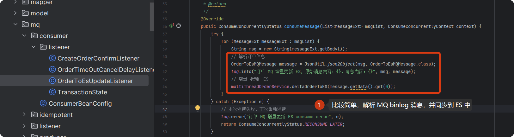

这里主要前面监听到 Topic 中的 data 结构内的数据，其解析消息结构体如下：

/\*\*

\* 订单 MQ 消息结构

\*/

@Data

@NoArgsConstructor

@AllArgsConstructor

public class OrderToEsMQMessage implements Serializable {

/\*\*

\* 订单数据 List

\*/

private List<OrderInfo> data;

/\*\*

\* 订单数据

\*/

@Data

public static class OrderInfo implements Serializable{

private Long id;

/\*\*

\* 订单号

\*/

private Long order\_id;

/\*\*

\* 买家id

\*/

private Long buyer\_id;

/\*\*

\* 订单状态 1:已创建, 2:已确认, 3:已支付 4:已履约 5:出库中, 6:配送中, 7:已签收, 8:已取消, 9:已拒收, 127:无效订单

\*/

private Integer order\_status;

/\*\*

\* 关单类型 1:超时关单 2:用户主动关闭/取消

\*/

private Integer close\_type;

/\*\*

\* 商品id

\*/

private Long sku\_id;

/\*\*

\* 商品标题

\*/

private String sku\_name;

/\*\*

\* 商品封面图

\*/

private String sku\_main\_url;

/\*\*

\* 商品单价

\*/

private BigDecimal sku\_price;

/\*\*

\* 商品数量

\*/

private Integer sku\_count;

/\*\*

\* 订单金额

\*/

private BigDecimal order\_amount;

/\*\*

\* 交易支付金额

\*/

private BigDecimal pay\_amount;

/\*\*

\* 删除状态 0:未删除 1:已删除

\*/

private Integer delete\_status;

/\*\*

\* 订单创建时间

\*/

private Date create\_time;

/\*\*

\* 订单更新时间

\*/

private Date update\_time;

}

}

这里为了简化就没有重新写方法处理了，直接组装并调用 ES bulk 生成请求并写入 ES 了。

/\*\*

\* 增量同步到 ES

\* @param orderInfo

\* @return

\*/

@Override

public void deltaOrderToES(OrderToEsMQMessage.OrderInfo orderInfo) throws IOException{

// TODO 实现增量同步到 ES

log.info("订单 MQ 增量更新 ES，原始消息内容：{}", orderInfo);

// 初始化订单结果集

List<Map<String, Object>> orderList = new ArrayList<>();

Map<String, Object> order = new HashMap<>();

order.put("id", orderInfo.getId());

order.put("orderId", orderInfo.getOrder\_id());

order.put("buyerId", orderInfo.getBuyer\_id());

order.put("orderStatus", orderInfo.getOrder\_status());

order.put("closeType", orderInfo.getClose\_type());

order.put("skuId", orderInfo.getSku\_id());

order.put("skuName", orderInfo.getSku\_name());

order.put("skuMainUrl", orderInfo.getSku\_main\_url());

order.put("skuPrice", orderInfo.getSku\_price());

order.put("skuCount", orderInfo.getSku\_count());

order.put("orderAmount", orderInfo.getOrder\_amount());

order.put("payAmount", orderInfo.getPay\_amount());

order.put("deleteStatus", orderInfo.getDelete\_status());

// 创建一个 SimpleDateFormat 对象并指定转换格式

SimpleDateFormat sdf \= new SimpleDateFormat("yyyy-MM-dd HH:mm:ss");

// 使用 SimpleDateFormat 对象的 format() 方法将 Date 对象转换为指定格式的字符串

String createTime \= sdf.format(orderInfo.getCreate\_time());

String updateTime \= sdf.format(orderInfo.getUpdate\_time());

order.put("createTime", createTime);

order.put("updateTime", updateTime);

orderList.add(order);

log.info("订单 MQ 增量更新 ES, order 请求\[{}\]", orderList);

// 构建 bulk 批次请求

BulkRequest bulkRequest \= buildOrderEsBulkRequest("huazai\_ecshop\_buyer\_order\_index", 0, 1, orderList);

// 发送 bulk 导入请求

BulkResponse responses \= restHighLevelClient.bulk(bulkRequest, RequestOptions.DEFAULT);

log.info("订单 MQ 增量更新 ES 导入\[{}\]条订单数据,请求\[{}\],响应结果\[{}\]", 1, bulkRequest, responses);

if (responses.hasFailures()) {

for (BulkItemResponse itemResponse : responses) {

if (itemResponse.isFailed()) {

BulkItemResponse.Failure failure \= itemResponse.getFailure();

System.err.println(failure.getMessage());

log.error("订单 MQ 增量更新 ES 导入出现异常\[{}\]", failure.getMessage());

}

}

}

}

测试效果如下：

  
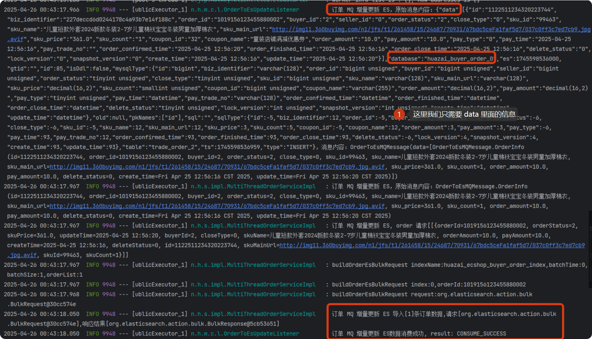

查看 ES 结果：

  
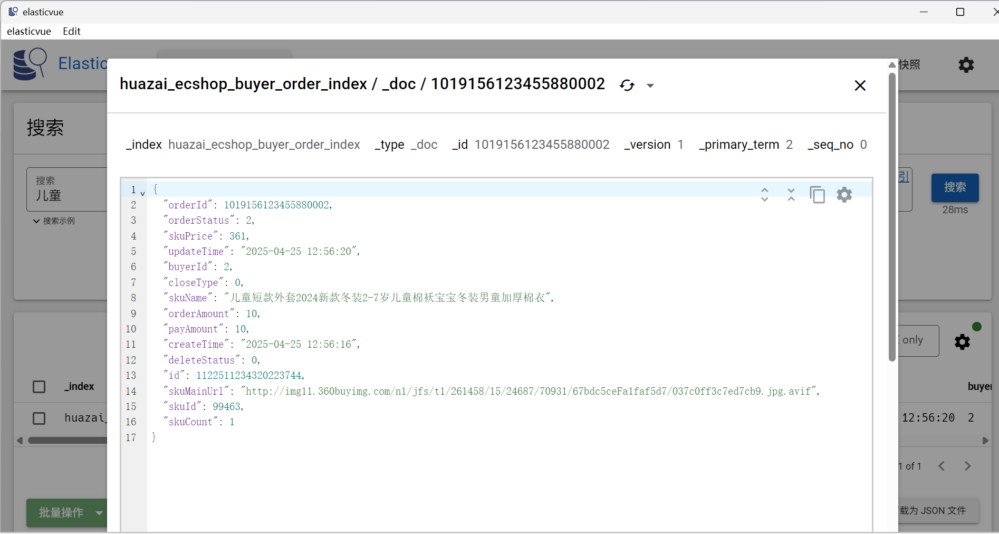

当更新订单数据时自动支持数据变更：

  
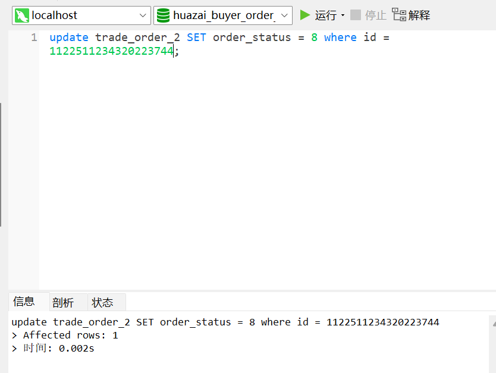

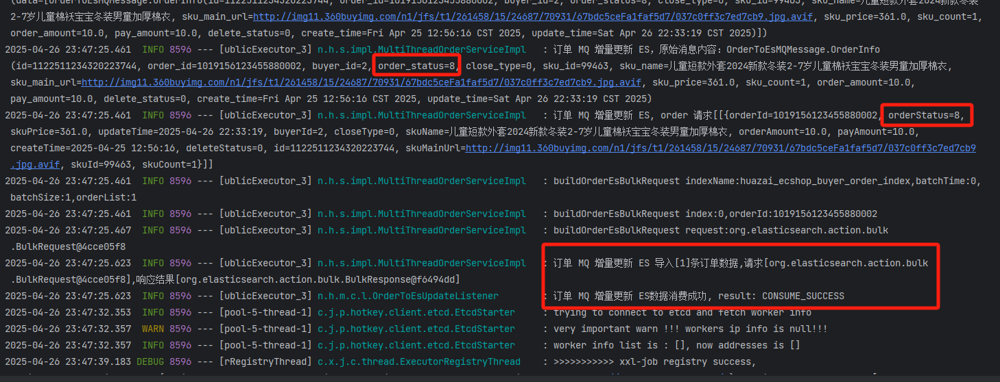

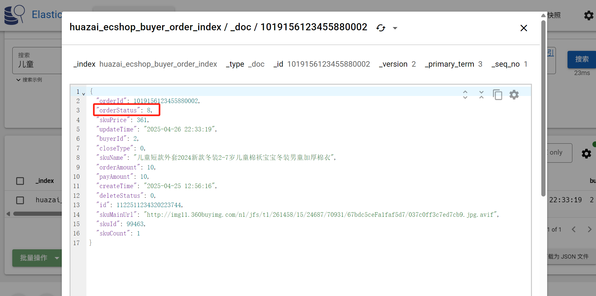

至此，基于 Canal + RocketMQ 实现订单数据增量同步 ES 的整个流程就已经跑通了，后续只需要启动服务自动监听即可。