从今天之后的一段时间内，华仔会带着大家一起从零开始搭建并研发一套高并发的电商实战项目，这里会涉及到很多互联网大厂开发过程中所使用的核心技术和架构设计模式，希望大家学完之后可以用到自己的简历中。

接下来我们会重点架构设计和开发一下我们高并发电商实战前端 Web 项目的相关功能 。

这是第八十九篇，本篇我们继续进行电商实战项目设计与开发，本篇我们来实战下「**Redis 内存不足监控告警、集群故障自动检测处理方案**」。

文章汇总位置：[https://wx.zsxq.com/dweb2/index/columns/51122554151214](https://wx.zsxq.com/dweb2/index/columns/51122554151214)

源码授权与获取地址：[https://articles.zsxq.com/id\_1s85grnaae4p.html](https://articles.zsxq.com/id_1s85grnaae4p.html)

本章源码地址：[https://gitcode.net/u011359591/huazai-ecshop/-/tree/ecshop-chapter-89](https://gitcode.net/u011359591/huazai-ecshop/-/tree/ecshop-chapter-89)

## **01 前言**

上篇，我们重点剖析了之前遗留的一个重要模块：「**Redis 分布式缓存大 Key 监控与切分处理方案**」： [【电商实战项目第八十八篇】华仔电商实战项目 Redis 分布式缓存大 Key 监控与治理处理方案](https://articles.zsxq.com/id_cddntw8h80so.html)。

今天我们来重点剖析下另外一个重要模块：「**Redis 内存不足监控告警、集群故障自动检测处理方案**」。

##   
**02 Redis 内存不足监控告警**

## **2.1 背景**

当 Redis 内存中的数据达到 [maxmemory](http://maxmemory/) 指定的数值时，将会触发 Redis 的回收策略 (Evictionpolicies)。

如果具体执行的回收策略对 key 进行了回收(Eviction)，那么被回收的 key，应该要通知到业务端，让业务端自行去判断处理。

## **2.2 设计方案**

通过 Redis 的发布订阅机制(pub/sub)与键空间通知 (keyspace notification) 特性，完成当 Key 被回收时的触发。

> 键空间通知 (keyspace notification)
> 
> Every time a key with a time to live associated is removed from the data set because itexpired, an expired event is generated.Every time a key is evicted from the data set in order to free memory as a result of themaxmemory policy, an evicted event is generated.
> 
> 每当从数据集中删除一个具有一定生存时间的键时(因为它过期了)，就会生成一个过期事件每次为了释放maxmemory策略的内存而从数据集中回收一个键时，都会生成一个回收事件。

通过订阅 Redis 的回收事件去捕捉被回收的 key 的信息，然后通知到业务端。

## **2.3 通知方式**

这里有两种方式：

1.  中间层去订阅 Redis 的回收事件，订阅方收到消息后发消息给 MQ，不同的业务端只和 MQ 对接，通过过滤 tag 消费消息，自行处理对回收 key 的逻辑;
2.  不具有中间层，由业务端自行去订阅 Redis 的淘汰 key，然后去处理。

我们选择第一种方式来实现。

## **2.4 环境配置**

因为开启键空间通知功能需要消耗一些 CPU，所以在默认配置下，该功能处于关闭状态

可以通过修改 [redis.conf](http://redis.conf/) 文件，然后重启Redis服务;或者直接使用 [CONFIG SET](http://config%20set/) 命令来开启或关闭键空间通知功能:

1.  通过 [CONFIG GET notify-keyspace-events](http://config%20get%20notify-keyspace-events/) 查看 [notify-keyspace-events](http://notify-keyspace-events/) 属性。
2.  当 [notify-keyspace-events](http://notify-keyspace-events/) 选项的参数为空字符串时，表示功能关闭。当参数不是空字符串时，功能开启。

[notify-keyspace-events](http://notify-keyspace-events/) 的参数可以是以下字符的任意组合，它指定了服务器该发送哪些类型的通知:

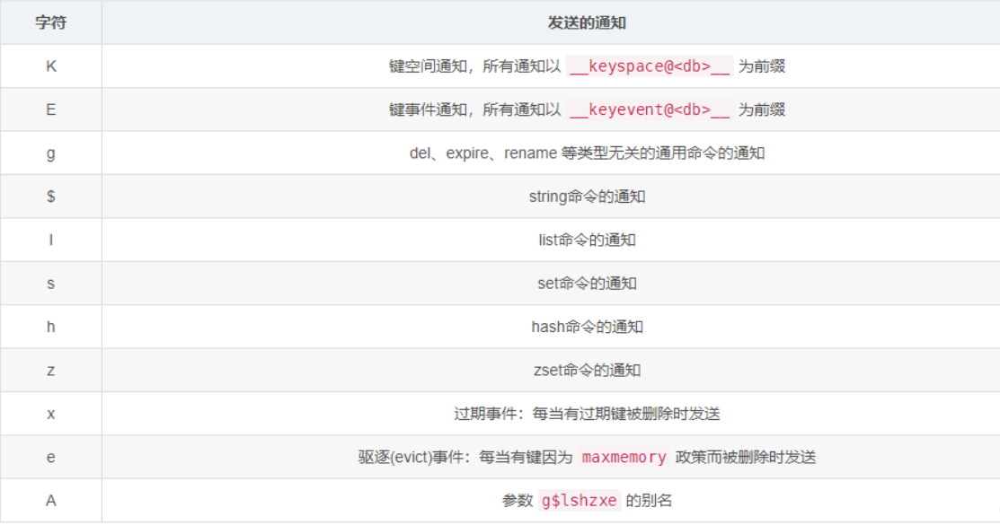

输入的参数中至少要有一个 K 或者 E，否则的话，不管其余的参数是什么，都不会有任何通知被分发。

举个例子，如果只想订阅键空间中和列表相关的通知，那么参数就应该设为 K，诸如此类。

我们现在要开启键空间通知，通知回收事件，可以通过 [CONFIG Set notify-keyspace-events Ee](http://config%20set%20notify-keyspace-events%20ee/) 开启。

然后通过查看 [CONFIG GET notify-keyspace-events](http://config%20get%20notify-keyspace-events/) :

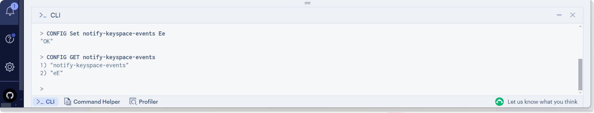

## **2.5 Redis 回收功能开发**

这里会新增一个「**监控服务**」来处理：

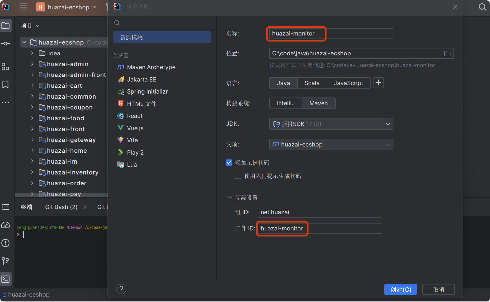

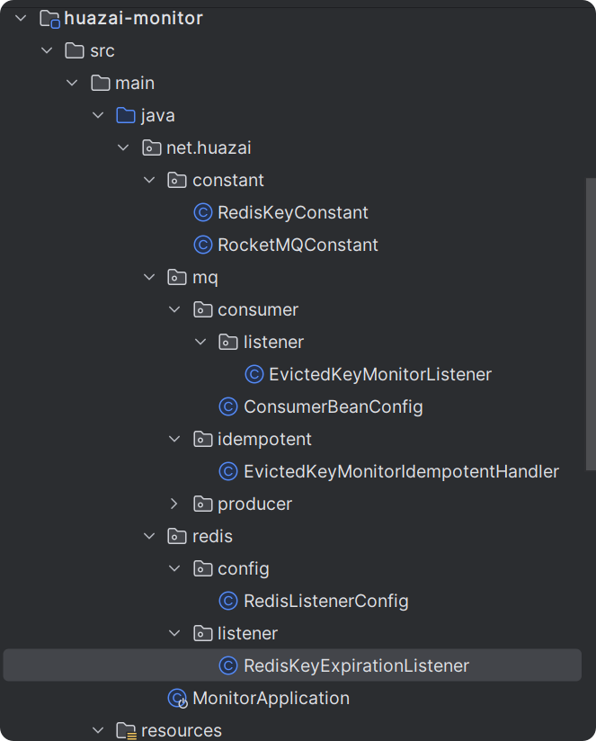

### **2.5.1 Redis 回收事件订阅者配置**

主要订阅 Redis 所有数据库的回收事件。

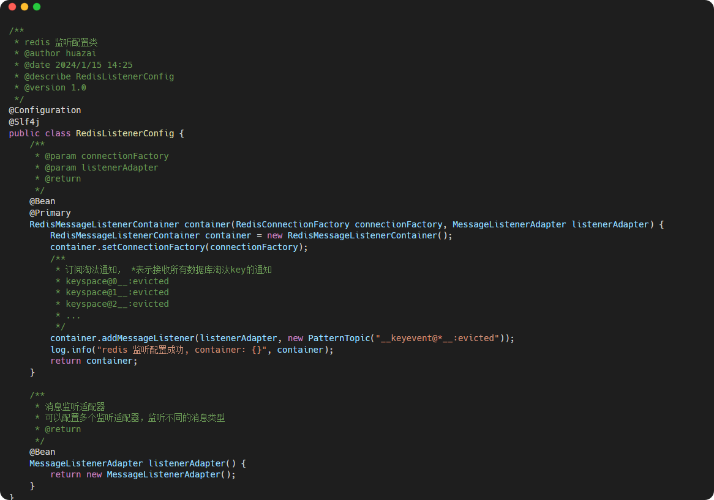

### **2.5.2 Redis 回收事件订阅者实现**

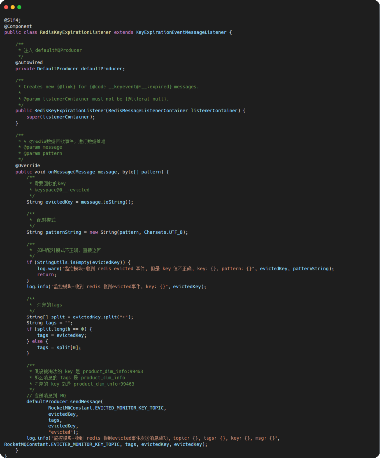

### **2.5.3 Redis 回收事件消费者**

这里模拟商品服务中，消费 tags 中包含 product\_dim\_info 的消息的消费者。

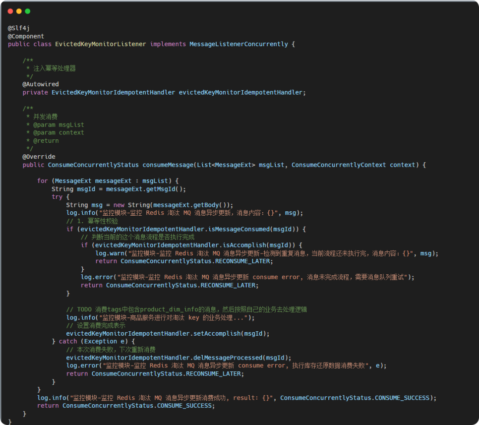

### **2.5.4 启动加载配置**

启动时会自动加载配置，后续会监听 evicted 事件：

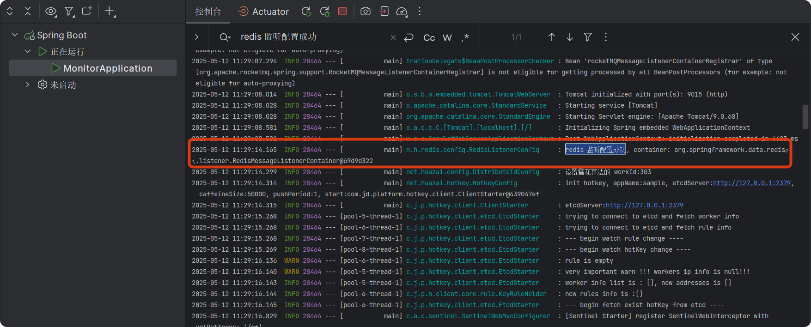

## **03 集群缓存雪崩自动探测+限流降级处理方案**

先来了解下常见的限流算法。

## **3.1 常见的限流算法**

### **3.1.1 计数器算法**

限流算法中最简单粗暴的一种算法，例如，某一个接口1分钟内的请求不超过60次，我们可以在开始时设置一个计数器，每次请求时，这个计数器的值加1，如果这个这个计数器的值大于60并且与第一次请求的时间间隔在1分钟之内，那么说明请求过多；如果该请求与第一次请求的时间间隔大于1分钟，并且该计数器的值还在限流范围内，那么重置该计数器。

使用计数器还可以用来限制一定时间内的总并发数，比如「**数据库连接池**」、「**线程池**」、「**秒杀的并发数**」；计数器限流只要一定时间内的总请求数超过设定的阀值则进行限流，是一种简单粗暴的总数量限流，而不是平均速A ,VCW率限流。

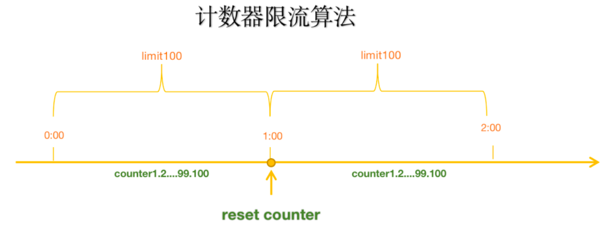

这个方法有一个致命问题：临界问题——当遇到恶意请求，在1:59时，瞬间请求1000次，并且在2:00请求1000次，那么这个用户在1秒内请求了2000次，用户可以在重置节点突发请求，而瞬间超过我们设置的速率限制，用户可能通过算法漏洞击垮我们的应用。

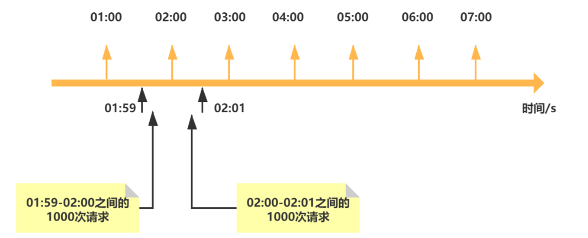

这个问题我们可以使用「**滑动窗口算法**」来解决。

### **3.1.2 滑动窗口算法**

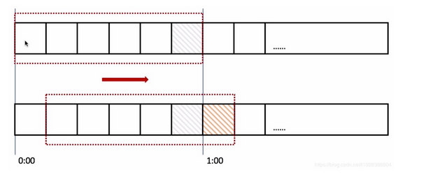

在上图中，整个红色矩形框是一个时间窗口，在我们的例子中，一个时间窗口就是1分钟，然后我们将时间窗口进行划分，如上图我们把滑动窗口划分为6格，所以每一格代表10秒，每超过10秒，我们的时间窗口就会向右滑动一格，每一格都有自己独立的计数器。

例如：一个请求在0:35到达， 那么0:30到0:39的计数器会+1，那么滑动窗口是怎么解决临界点的问题呢？如上图，0:59到达的100个请求会在灰色区域格子中，而1：00到达的请求会在红色格子中，窗口会向右滑动一格，那么此时间窗口内的总请求数共200个，超过了限定的100，所以此时能够检测出来触发了限流。

回头看看计数器算法，会发现，其实计数器算法就是窗口滑动算法，只不过计数器算法没有对时间窗口进行划分，所以是一格。

由此可见，当滑动窗口的格子划分越多，限流的统计就会越精确。

### **3.1.3 漏桶算法**

算法的思路就是水（请求）先进入到漏桶里面，漏桶以恒定的速度流出，当水流的速度过大就会直接溢出，可以看出漏桶算法能强行限制数据的传输速率。如下图所示。

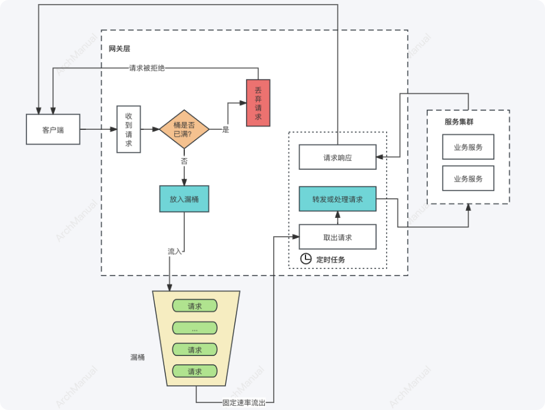

从上图得知，漏桶算法是不支持突发流量的。

### **3.1.4 令牌桶算法**

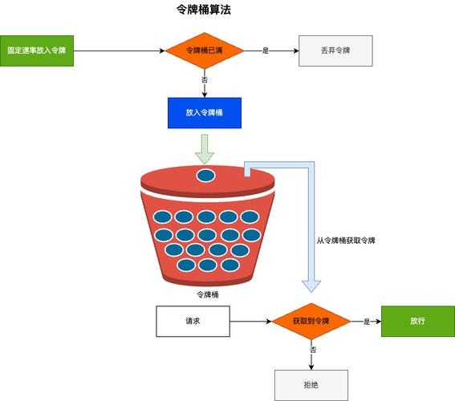

从上图中可以看出，令牌算法有点复杂，桶里存放着令牌 token。桶一开始是空的，token 以固定的速率r往桶里面填充，直到达到桶的容量，多余的 token 会被丢弃。每当一个请求过来时，就会尝试着移除一个 token，如果没有token，请求无法通过。

## **3.2 限流降级背景**

如果线上⽣产环境 Redis 集群崩溃了，只有数据库可以访问。此时所有的请求都会打到数据库，这样会导致整个系统都崩溃。

所以系统需要「**自动识别缓存是否崩溃**」：如果缓存崩溃了，则应该马上进行「**限流操作**」，对数据库进⾏保护和防护，让数据不要崩溃掉。同时「**启动接口层降级机制**」，让少部分⽤户还能够继续使用系统服务。

「**降级操作**」就是大量的请求没法请求到 MySQL，只能「**通过 JVM 本地缓存**」提供有限的一些数据缓存默认值。

### **3.3 HotKey 实现自动探测缓存雪崩**

为了防⽌ Redis 崩溃后，系统⽆法正常运转，所以需要做降级处理。

### **3.3.1 通过 AOP 切面统计 Redis 连接异常情况**

在我们整个电商系统中， Redis 的所有⽅法都是通过「**RedisCache**」和「**RedisLock**」来处理的，其中 「**RedisCache**」提供对 Redis 缓存 key 的操作，而「**RedisLock**」提供分布式锁操作。所以可以「**通过 AOP 切面**」的⽅式，对这两个类中的所有⽅法做⼀个切⾯。

当这两个类的方法在执⾏ Redis 操作时，发现 Redis 挂了就会抛出异常。所以「**在切面处理方法上**」，如果捕捉到异常就进行记录一下。

### **3.3.2 通过 JD-HotKey 实现自动识别 Redis 缓存故障**

如果「**捕捉到 Redis 连接失败后**」，那么就先不抛出异常，而是返回一个空值，继续用数据库提供服务，避免出现整个服务异常。

如果一分钟之内或者30秒之内「**出现几次 Redis 连接失败**」，此时再「**设置一个 hotkey 表示 Redis 连不上了**」，并「**指定过期时间为 1 分钟左右**」。那么下次获取缓存时，就可以「**先根据 hotkey 来判断 Redis 是否异常**」。hotkey在1分钟之后会删除key，下次有请求过来会去看Redis能否连接，这样就可以简单实现Redis挂掉后直接查数据库的降级机制了。

这里有两个问题需要解决。

### **3.3.2.1 如何判断 Redis 挂掉了还是暂时网络波动？**

可以在 hotkey 中配置规则，如「**30 秒出现了 3 次 Redis 连接失败后**」，那么就认为 Redis 挂掉了，在本地缓存中设置一个 hotkey。

### **3.3.2.2 如何自动恢复呢？**

可以「**设置 hotkey 过期时间为 60 秒**」，缓存过期会重新尝试去操作 Redis。如果此时 Redis 恢复了，那么由于hotkey 已经失效了，所以就可以正常使⽤回 Redis 功能。如果 Redis 还是没有恢复，那么继续往本地缓存中的hotkey 设置数据。

以上就实现了⾃动识别缓存故障。当识别出缓存故障后，需要再操作Redis时，就可以直接返回null或者返回false。从而实现在缓存故障时，绕过缓存，继续⽤数据库提供服务。

### **3.3.2.3 切面代码实现**

/\*\*

\* Redis 切面

\*

\* @author huazai

\* @date 2024/11/18 11:13

\* @describe RedisAspect

\* @version 1.0

\*/

@Aspect

@Slf4j

@Component

public class RedisAspect {

/\*\*

\* 切入点，RedisCache 的所有方法

\*/

@Pointcut("execution(\* net.huazai.redis.RedisCache.\*(..))")

public void redisCachePointcut() {

}

/\*\*

\* 切入点，RedisLock的所有方法

\*/

@Pointcut("execution(\* net.huazai.redis.RedisLock.\*(..))")

public void redisLockPointcut() {

}

/\*\*

\* 环绕通知，在方法执行前后

\*

\* @param point 切入点

\* @return 结果

\* @throws Throwable

\*/

@Around("redisCachePointcut() || redisLockPointcut()")

public Object around(ProceedingJoinPoint point) throws Throwable {

/\*\*

\* 签名信息

\*/

Signature signature = point.getSignature();

/\*\*

\* 强转为方法信息

\*/

MethodSignature methodSignature = (MethodSignature) signature;

/\*\*

\* 获取参数名称

\* 注意：需要在编译时添加参数名称，否则会获取到null

\*/

String\[\] parameterNames = methodSignature.getParameterNames();

/\*\*

\* 获取执行的对象

\* 注意：如果是静态方法，这里获取到的是类对象，不是实例对象

\* 静态方法可以直接调用，不需要实例对象，所以这里可以直接获取到类对象

\* 非静态方法需要实例对象，所以这里获取到的是实例对象，需要通过实例对象来调用方法

\*/

Object target = point.getTarget();

log.info("Redis切面-处理方法:{}.{}", target.getClass().getName() , methodSignature.getMethod().getName());

Object\[\] parameterValues = point.getArgs();

/\*\*

\* 查看入参

\*/

log.info("Redis切面-参数名:{}，参数值:{}", JSONObject.toJSONString(parameterNames), JSONObject.toJSONString(parameterValues));

Class returnType = methodSignature.getReturnType();

/\*\*

\* 返回类型是否布尔类型

\* boolean.class.equals(returnType) 表示返回类型是 boolean

\* Boolean.class.equals(returnType) 表示返回类型是 Boolean

\* 注意：Boolean是boolean的包装类，不是基本类型，所以不能用 == 来判断

\*/

boolean booleanType = boolean.class.equals(returnType) || Boolean.class.equals(returnType);

try {

if (Objects.nonNull(JdHotKeyStore.get(REDIS\_CONNECTION\_FAILED))) {

/\*\*

\* 1. 这里可以简单的实现redis挂掉之后直接走数据库的降级

\* 2. 但是这里需要注意，redis挂掉之后，需要设置一个key，告诉hotkey，redis连接不上了，指定1分钟左右的过期时间

\* 3. 下次获取缓存的时候，先根据hotkey来判断，redis是否异常了

\* 4. hotkey在1分钟之后，会删除key，下次再有redis请求过来，重新去看redis能否连接

\* 5. 这样可以简单的实现redis挂掉之后直接走数据库的降级

\* 6. 但是这里需要注意，redis挂掉之后，需要设置一个key，告诉hotkey，redis连接不上了，指定1分钟左右的过期时间

\* 7. 下次获取缓存的时候，先根据hotkey来判断，redis是否异常了

\* 8. hotkey在1分钟之后，会删除key，下次再有redis请求过来，重新去看redis能否连接

\* 9. 这样可以简单的实现redis挂掉之后直接走数据库的降级

\*/

log.error("Redis切面-获取缓存失败，redis连接失败，直接返回 false 或者 null");

return getFallbackResult(booleanType);

}

return point.proceed();

} catch (Throwable throwable) {

log.error("Redis切面-执行方法:{}失败，异常信息:{}", methodSignature.getMethod().getName(), throwable.toString());

/\*\*

\* redis连接失败，不抛异常，返回空值，

\* 继续用数据库提供服务，避免整个服务异常

\* 一分钟之内或者30秒之内出现了几次redis连接失败

\* 此时可以设置一个key，告诉hotkey，redis连接不上了，指定1分钟左右的过期时间

\* 下次获取缓存的时候，先根据hotkey来判断，redis是否异常了

\* hotkey在1分钟之后，会删除key，下次再有redis请求过来，重新去看redis能否连接

\* 这样可以简单的实现redis挂掉之后直接走数据库的降级

\*/

if (JdHotKeyStore.isHotKey(REDIS\_CONNECTION\_FAILED)) {

JdHotKeyStore.smartSet(REDIS\_CONNECTION\_FAILED, 1);

} else {

JdHotKeyStore.forceSet(REDIS\_CONNECTION\_FAILED, 1);

}

// 添加重试逻辑检测

if (shouldRetry(throwable)) {

log.info("检测到临时性故障，尝试重试...");

return point.proceed();

}

log.error("缓存操作失败，直接返回降级结果:{}", JdHotKeyStore.get(REDIS\_CONNECTION\_FAILED));

return getFallbackResult(booleanType);

}

}

/\*\*

\* 判断是否需要重试

\* @param t

\* @return

\*/

private boolean shouldRetry(Throwable t) {

return t instanceof RedisConnectionFailureException

|| t instanceof RedisTimeoutException;

}

/\*\*

\* 统一降级结果处理

\* @param booleanType

\* @return

\*/

private Object getFallbackResult(boolean booleanType) {

if (booleanType) {

return false;

}

return null;

}

}

### **3.3.2.4 hotkey 配置**

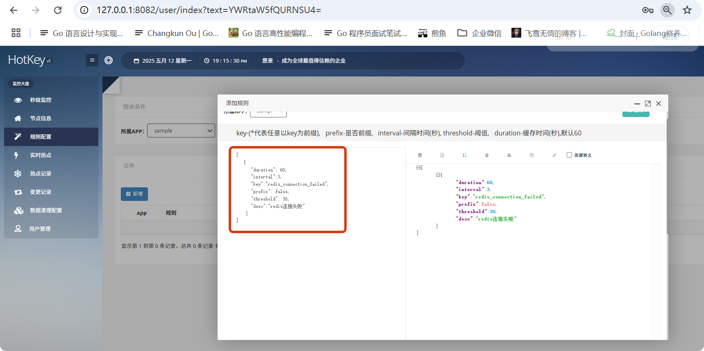

### **3.4 缓存雪崩后的限流降级方案**

**RateLimiter 是 Guava 的一个限流组件**，它是基于令牌桶算法的，API⾮常简单。

系统限流分为两种⽅式：

1.  Redis 正常情况下各个接⼝的限流。
2.  Redis 异常情况下各个接口的限流。

这⾥我们在「**拦截器**」中进行实现。

### **3.4.1 对接口添加拦截器**

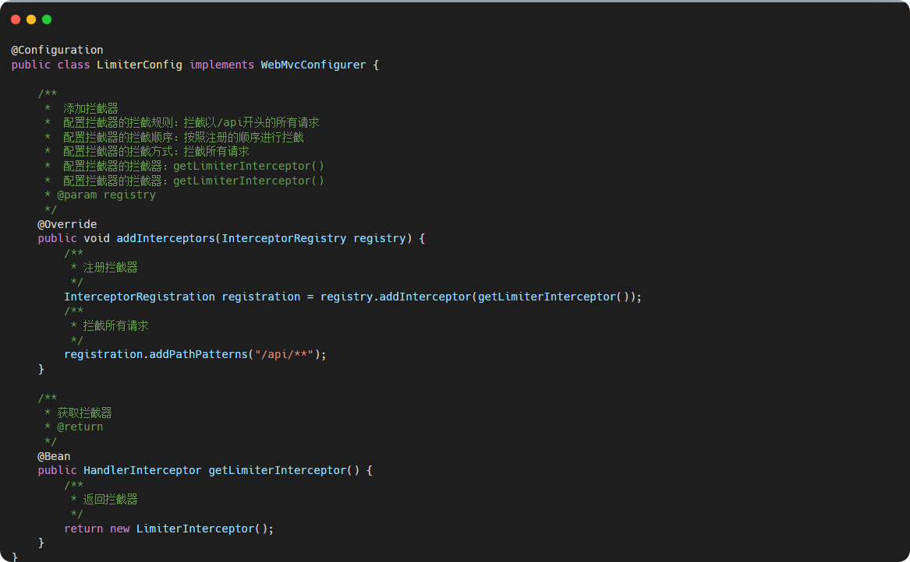

### **3.4.2 创建 LimiterProperties 配置类**

@Slf4j

@Data

@Component

public class LimiterProperties {

/\*\*

\* 如果需要替换配置文件信息，将配置文件放在这里就可以

\*/

@Value("${limiter.propertiesPath}")

private String limiterPropertiesPath;

/\*\*

\* 初始化时候使用的配置信息

\*/

@Value(value = "classpath:/limiter.properties")

private Resource limiterProperties;

/\*\*

\* 默认的redis宕机之后的限流器

\*/

@Value("${limiter.noRedisLimiter}")

private Double noRedisLimiter;

/\*\*

\* 默认的限流器

\*/

@Value("${limiter.defaultLimiter}")

private Double defaultLimiter;

/\*\*

\* 限流器配置信息

\*/

private Properties properties;

/\*\*

\* 各个接口的限流，每个接口限流都可以单独配置

\*/

private Map<String, RateLimiter> apiRateLimiterMap = null;

/\*\*

\* redis挂掉之后限流

\*/

private RateLimiter noRedisRateLimiter \= null;

/\*\*

\* 初始化限流器配置信息

\* 可以通过定时任务来触发，也可以通过接口来触发

\*/

@PostConstruct

private void initLimiter() {

properties = new Properties();

try {

/\*\*

\* 读取配置文件信息

\*/

properties.load(limiterProperties.getInputStream());

} catch (IOException e) {

log.error("限流配置-读取配置文件失败", e);

}

this.reloadLimiter();

}

/\*\*

\* 重新加载限流器配置信息

\*/

private void reloadLimiter() {

/\*\*

\* 加载没有redis时候的限流器

\* 优先读取限流配置文件中的配置，如果没有，则使用项目配置文件中的配置

\*/

String noRedisLimiterProperty \= properties.getProperty(CoreConstant.NO\_REDIS\_LIMITER);

noRedisRateLimiter = RateLimiter.create(

StringUtils.isEmpty(noRedisLimiterProperty) ? noRedisLimiter : Double.valueOf(noRedisLimiterProperty));

/\*\*

\* 加载配置文件中配置的接口对应的限流器

\*/

apiRateLimiterMap = new HashMap<>(16);

/\*\*

\* 优先从配置文件中读取默认配置信息

\*/

String defaultLimiterProperty \= properties.getProperty(CoreConstant.DEFAULT\_LIMITER);

// 默认限流QPS

Double defaultProperty;

/\*\*

\* 如果没有配置默认的限流信息，则使用项目配置文件中的配置信息

\* 如果配置了默认的限流信息，则使用配置文件中的配置信息

\*/

if (StringUtils.isEmpty(defaultLimiterProperty)) {

defaultProperty = defaultLimiter;

}else {

defaultProperty = Double.valueOf(defaultLimiterProperty);

}

Set<String> propertyNames = properties.stringPropertyNames();

/\*\*

\* 遍历配置文件中的配置信息，加载到内存中

\*/

for (String propertyName : propertyNames) {

String property \= properties.getProperty(propertyName);

/\*\*

\* 如果配置文件中没有配置限流信息，则使用默认的限流信息

\* 如果配置文件中有配置限流信息，则使用配置文件中的配置信息

\*/

apiRateLimiterMap.put(propertyName,

RateLimiter.create(StringUtils.isEmpty(property) ? defaultProperty : Double.valueOf(property)));

}

}

/\*\*

\* 用于配置文件变更之后，配置信息重新生效

\* 可以通过定时任务来触发，也可以通过接口来触发

\*/

public void reloadLimiterProperty() {

/\*\*

\* 保存旧的配置信息，如果重新加载配置文件失败，可以用来还原

\*/

Properties newProperties \= new Properties();

try {

Resource resource \= new PathResource(limiterPropertiesPath);

/\*\*

\* 读取配置文件信息

\*/

newProperties.load(resource.getInputStream());

/\*\*

\* 重新加载配置文件信息成功之后，生效配置信息

\*/

properties = newProperties;

this.reloadLimiter();

} catch (IOException e) {

log.error("限流配置-读取配置文件失败", e);

}

}

}

整体流程如下：

1.  项⽬启动时，会执⾏ initLimiter() ⽅法先读取 limiter.properties 中的配置。如果该配置⽂件中有单独配置某个接⼝的限流，则使⽤单独配置的。如果没有，则使⽤ defaultLimiter 默认的配置。如果没有读取到配置⽂件，则使⽤ application.yml 中的配置。
2.  项⽬运⾏时，如果需要动态配置，就将配置⽂件放在 application.yml 中配置的 limiter.propertiesPath 路径下，接口调⽤limiter 配置类的 reloadLimiterProperty() ⽅法重新加载配置文件。

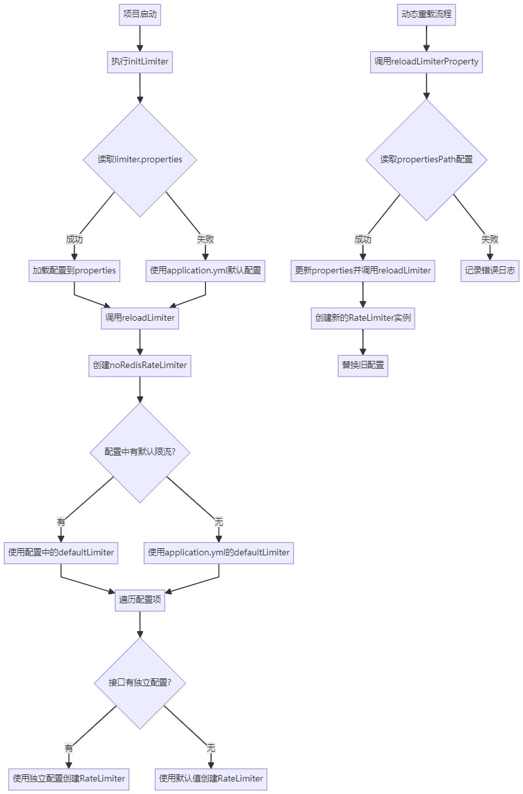

### **3.4.3 拦截器判断 Redis 连接是否异常**

1.  如果Redis连接失败，则通过 [limiterProperties#getNoRedisRateLimiter()](http://limiterproperties/#getNoRedisRateLimiter\(\)%20) 方法的 tryAcquire() 方法去尝试获取令牌。如果获取不到令牌，那么就返回系统繁忙的提示。
2.  如果Redis连接正常，则先获取到当前请求对应的 [requestMapping](http://requestmapping/)，通过 [limiterProperties#getApiRateLimiterMap()](http://limiterproperties/#getApiRateLimiterMap\(\)) 方法的 get() 方法获取对应接⼝限流器。如果不存在，则创建该接⼝的限流器，并 put 到 map 中。

@Slf4j

public class LimiterInterceptor implements HandlerInterceptor {

@Autowired

private LimiterProperties limiterProperties;

/\*\*

\* 限流拦截器

\* @param request

\* @param response

\* @param handler

\* @return

\*/

@Override

public boolean preHandle(HttpServletRequest request, HttpServletResponse response, Object handler) {

/\*\*

\* 如果redis连接失败，使用全局限流

\*/

if (Objects.nonNull(JdHotKeyStore.get(REDIS\_CONNECTION\_FAILED))) {

/\*\*

\* TODO 这里需要考虑一下，如果redis连接失败，但是redis连接恢复了，那么这里的限流器就会失效

\*/

if (!limiterProperties.getNoRedisRateLimiter().tryAcquire()) {

log.warn("限流处理-redis 连接失败，全局限流");

ServletUtil.writeJsonMessage(response, ApiResult.doResult(BizCodes.COMMON\_SERVER\_BUSY\_ERROR));

return false;

}

} else {

/\*\*

\* 获取请求的requestMapping

\* 1. 从缓存中获取，如果缓存中没有，就从配置文件中获取

\* 2. 如果配置文件中也没有，就使用默认的限流器

\*/

String requestMapping \= getRequestMapping((HandlerMethod) handler);

RateLimiter rateLimiter \= limiterProperties.getApiRateLimiterMap().get(requestMapping);

if (rateLimiter == null) {

String property \= limiterProperties.getProperties().getProperty(requestMapping);

rateLimiter = RateLimiter.create(StringUtils.isEmpty(property) ? limiterProperties.getDefaultLimiter() : Double.valueOf(property));

limiterProperties.getApiRateLimiterMap().put(requestMapping, rateLimiter);

}

if (!rateLimiter.tryAcquire()) {

log.warn("限流处理-全局限流");

ServletUtil.writeJsonMessage(response, ApiResult.doResult(BizCodes.COMMON\_SERVER\_BUSY\_ERROR));

return false;

}

}

return true;

}

/\*\*

\* 拼接处理方法对应的类的RequestMapping中的路径和方法中的RequestMapping中的路径

\*

\* @param handler

\* @return

\*/

private String getRequestMapping(HandlerMethod handler) {

/\*\*

\* 请求处理类的RequestMapping注解

\*/

RequestMapping annotation \= handler.getBean().getClass().getAnnotation(RequestMapping.class);

String\[\] classMapping;

if (annotation == null) {

classMapping = new String\[0\];

} else {

classMapping = annotation.value();

}

/\*\*

\* 请求处理方法的RequestMapping注解

\*/

RequestMapping methodAnnotation \= handler.getMethodAnnotation(RequestMapping.class);

String\[\] methodMapping;

if (methodAnnotation == null) {

methodMapping = new String\[0\];

} else {

methodMapping = methodAnnotation.value();

}

/\*\*

\* TODO 如果RequestMapping注解中配置了多个路径，那这里返回的路径可能就会与配置文件中的不一致

\* 这里我们只是简单的认为RequestMapping注解里面的路径只有一个

\* 其实也简单，把RequestMapping中的路径做一个排列组合，然后与请求的URI做一个比较，得出实际请求的路径

\* 那这样会有另外一个问题，

\* 就是限流配置文件中，设置的是路径 a,但是实际上调用的是路径 b,最终处理请求的是同一个方法，

\* 那么这个方法就会对应多个限流器。所以这里还能优化成，排列组合出来的结果中有一个与配置文件中相同，就返回这个结果。

\* 确保同一个处理请求的方法，对应的限流器只有一个

\*/

String requestMapping \= (classMapping.length == 0 ? "" : classMapping\[0\])

\+ (methodMapping.length == 0 ? "" : methodMapping\[0\]);

return requestMapping;

}

}

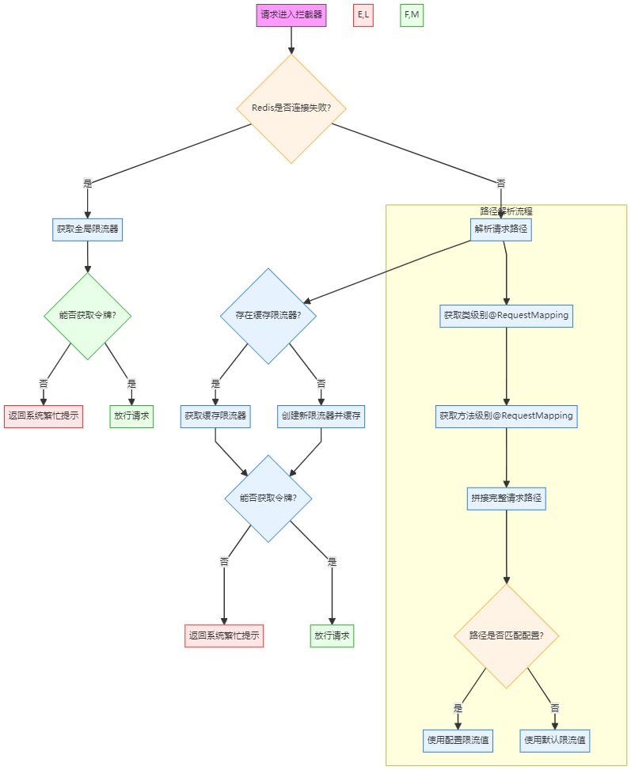

### **3.4.4 限流降级后通过本地缓存降级**

以美食详情接⼝为例：⾸先通过 [redisCache.getCache()](http://rediscache.getcache\(\)%20/) 来查询「**hotkey 内存数据**」和「**Redis 缓存数据**」。由于Redis 连接失败时会返回 null，于是就会从数据库中获取数据。

接下来看 [getFoodInfoFromDB](http://getfoodinfofromdb/) ⽅法的上半部分的降级处理部分：此时会判断[JdHotKeyStore.get(REDIS\_CONNECTION\_FAILED)](http://jdhotkeystore.get\(redis_connection_failed\)/) 是否存在。如果「**存在则表示 Redis 连接失败**」，需要做「**降级处理**」。

降级处理时会通过 [caffeineCache.getIfPresent()](http://caffeinecache.getifpresent\(\)/) 「**获取降级后的本地缓存数据**」，如果「**缓存中没有数据**」，那么就通过「**获取锁去查询数据库**」，然后将数据库的「**查询结果放到 CaffeineCache 中**」。

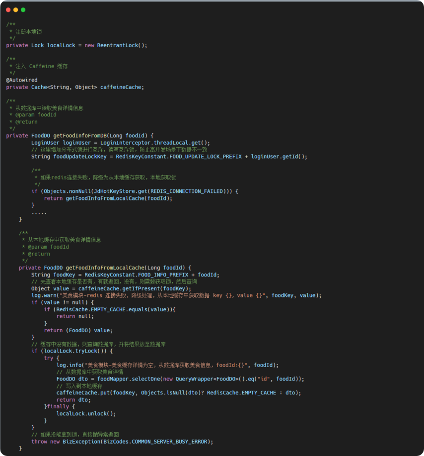

### **3.4.5 配置与测试**

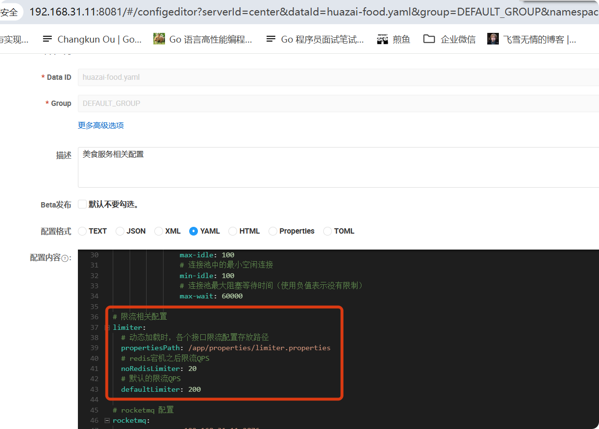

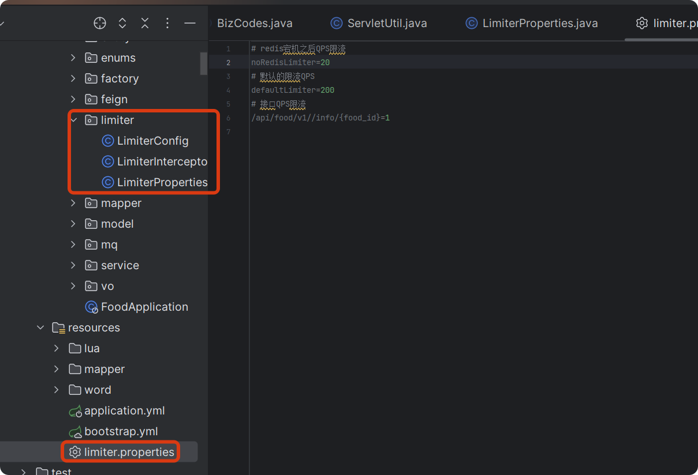

正常测试:

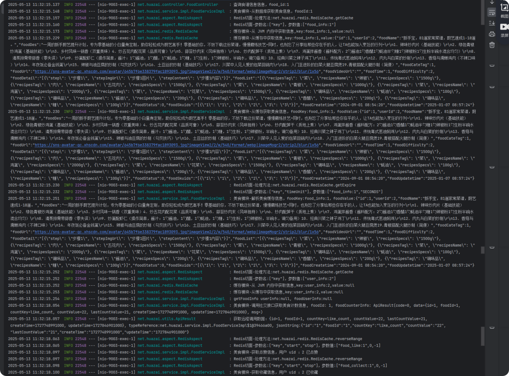

异步测试,当 Redis 连接失败后,会从本地缓存读取:

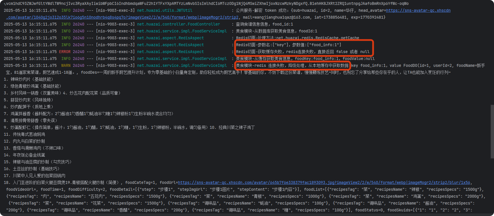

### **3.4.6 缓存雪崩方案总结**

1.  首先通过AOP切面 + JdHotKey实现自动化探测Redis故障，也就是判断出Redis是否故障，并设置hotkey标记Redis已经故障。
2.  根据hotkey + RateLimiter令牌桶，可以对接口进行故障时的限流。
3.  限流降级后操作数据库时也需要通过CaffeineCache本地缓存进行降级。

  
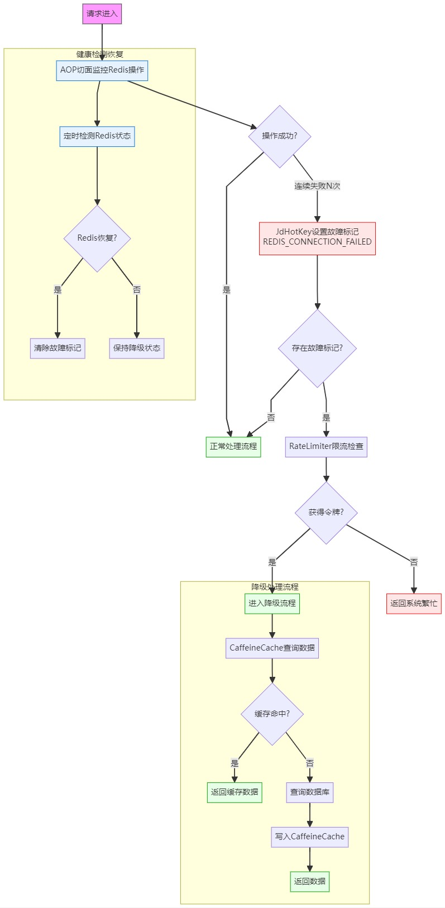