从今天之后的一段时间内，华仔会带着大家一起从零开始搭建并研发一套高并发的电商实战项目，这里会涉及到很多互联网大厂开发过程中所使用的核心技术和架构设计模式，希望大家学完之后可以用到自己的简历中。

接下来我们会重点架构设计和开发一下我们高并发电商实战前端 Web 项目的相关功能 。

这是第八十二篇，本篇我们继续进行电商实战项目设计与开发，本篇我们正式接入前端 Web 项目中的「**订单**」相关功能。

文章汇总位置：[https://wx.zsxq.com/dweb2/index/columns/51122554151214](https://wx.zsxq.com/dweb2/index/columns/51122554151214)

源码授权与获取地址：[https://articles.zsxq.com/id\_1s85grnaae4p.html](https://articles.zsxq.com/id_1s85grnaae4p.html)

本章源码地址：[https://gitcode.net/u011359591/huazai-ecshop/-/tree/ecshop-chapter-82](https://gitcode.net/u011359591/huazai-ecshop/-/tree/ecshop-chapter-82)

## **01 前言**

前面几篇中，我们已经将「**订单服务**」相关的「**业务需求**」、「**架构设计**」、「**核心链路功能实现**」铺垫的差不多了，接下来我们正式接入前端 Web 项目中的「**订单**」相关功能。 关于「**订单支付**」、「**订单退款**」、「**订单完成**」等功能会在「**支付服务**」进行介入，这里暂不展开。

  
[【电商实战项目第七十三篇】华仔电商实战订单服务业务场景介绍与架构设计](https://articles.zsxq.com/id_7n1znf4mnd0b.html)

[【电商实战项目第七十四篇】华仔电商实战订单服务核心链路状态机设计与功能实现](https://articles.zsxq.com/id_fzcjo8ib47j7.html)

[【电商实战项目第七十五篇】华仔电商实战订单服务核心链路面临的技术挑战与解决方案](https://articles.zsxq.com/id_vn41o1wlhmgs.html)

[【电商实战项目第七十六篇】华仔电商实战订单服务核心链路生单流程基于 RocketMQ 事务消息架构设计与功能实现](https://articles.zsxq.com/id_euh6q0p89qu9.html)

[【电商实战项目第七十七篇】华仔电商实战订单服务核心链路取消订单流程基于 RocketMQ 事务消息架构设计与功能实现](https://articles.zsxq.com/id_cn8e9rarxown.html)

[【电商实战项目第七十八篇】华仔电商实战订单服务核心链路超时关单基于RocketMQ延迟消息与定时任务架构设计与功能实现](https://articles.zsxq.com/id_0r2a8c5lv2pj.html)

[【电商实战项目第七十九篇】华仔电商实战订单服务核心链路基于 ShardingSphere 5.5.2 实战分库分表功能](https://articles.zsxq.com/id_w3mjdhdjb9d9.html)

[【电商实战项目第八十篇】华仔电商实战项目订单服务引入 ElasticSearch 后的订单列表搜索架构及索引设计](https://articles.zsxq.com/id_r06jt1pw0le3.html)

[【电商实战项目第八十一篇】华仔电商实战项目订单服务基于Canal + RocketMQ实现订单分库分表数据增量同步 ES](https://articles.zsxq.com/id_9pg39bc9q8po.html)

前端比较耗时，先占位，后更新。

## **02 订单服务接入**

## **2.1 下单入口**

这块服务端会涉及到「**用户收货地址信息**」、「**商品信息**」、「**优惠券信息**」、「**计算商品最新优惠价格**」等多个业务数据整合，我们打算通过 CompletableFuture 进行多任务并行编排。

###   
**2.1.1 并行技术选型**

多线程并行优化有多种实现方式，例如通过线程池结合 [Future](http://future/) 或使用 [CompletableFuture](http://completablefuture/) 等。在本场景中，我们选择使用 [CompletableFuture](http://completablefuture/) 来实现多线程并行处理。

如果大家想深入了解 [CompletableFuture](http://completablefuture/) 的机制和使用场景，推荐阅读以下文章：[美团技术团队：CompletableFuture 原理与实践 - 外卖商家端 API 的异步化](https://tech.meituan.com/2022/05/12/principles-and-practices-of-completablefuture.html)：详细解析 [CompletableFuture](http://completablefuture/) 在实际业务场景中的应用和性能提升效果。

通过阅读这篇文章，可以更好地理解 [CompletableFuture](http://completablefuture%20/) 的作用及其在提升系统性能中的实际应用。

### **2.1.2 并行代码改造**  

在使用线程池结合 [CompletableFuture](http://completablefuture/) 进行并行改造时，涉及到多个并发编程的细节和优化点。比如，如何合理设置线程池参数、处理多线程环境下集合的并发安全问题、以及如何在所有并发任务完成后再进行后续处理等。

### **2.1.3 CompletableFuture 介绍**

在开始进行「**订单下单入口**」改造之前，我们先来了解下 [CompletableFuture](http://completablefuture/) 的机制和使用场景。

  
实际项目中，一个接口可能需要同时获取多种不同的数据，然后再汇总返回，这种场景还是挺常见的。举个例子：用户请求下单，可能需要同时获取「**用户收货地址信息**」、「**商品信息**」、「**优惠券信息**」等数据。

如果是串行（按顺序依次执行每个任务）执行的话，接口的响应速度会非常慢。考虑到这些任务之间有大部分都是 「**无前后顺序关联**」的，可以「**并行执行**」，就比如说调用获取「**商品信息**」的时候，可以同时调用获取「**优惠券信息**」、「**用户收货地址信息**」。通过并行执行多个任务的方式，接口的响应速度会得到大幅优化。

如图：

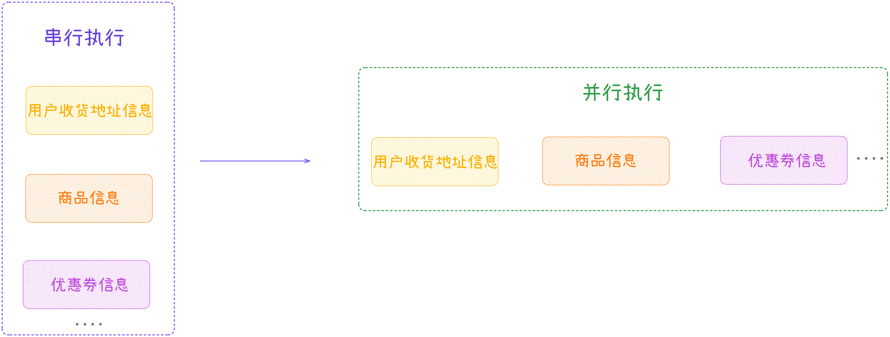

### **2.1.3.1 什么是 Future**

Future 类是异步思想的典型运用，主要用在一些需要执行耗时任务的场景，避免程序一直原地等待耗时任务执行完成，执行效率太低。具体来说是这样的：当我们执行某一耗时的任务时，可以将这个耗时任务交给一个子线程去异步执行，同时我们可以干点其他事情，不用傻傻等待耗时任务执行完成。等我们的事情干完后，我们再通过 Future 类获取到耗时任务的执行结果。这样一来，程序的执行效率就明显提高了。

这其实就是多线程中经典的 「**Future 模式**」，你可以将其看作是一种设计模式，核心思想是异步调用，主要用在多线程领域，并非 Java 语言独有。

在 Java 中，[Future](http://future/) 类只是一个泛型接口，位于 [java.util.concurrent](http://java.util.concurrent/) 包下，其中定义了 5 个方法，主要包括下面这 4 个功能：

1.  取消任务；
2.  判断任务是否被取消;
3.  判断任务是否已经执行完成;
4.  获取任务执行结果。

  
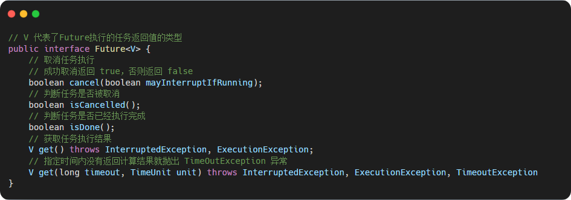

简单理解就是：我有一个任务，提交给了 Future 来处理。任务执行期间我自己可以去做任何想做的事情。并且，在这期间我还可以取消任务以及获取任务的执行状态。一段时间之后，我就可以 Future 那里直接取出任务执行结果。

### **2.1.3.2 什么是 CompletableFuture**

Future 在实际使用过程中存在一些局限性，比如不支持异步任务的编排组合、获取计算结果的 get() 方法为阻塞调用。

对于 Java 程序来说，Java 8 才被引入的 [CompletableFuture](http://completablefuture/) 可以帮助我们来做多个任务的编排，功能非常强大。

引入 [CompletableFuture](http://completablefuture/) 类可以解决 Future 的这些缺陷。 [CompletableFuture](http://completablefuture/) 除了提供了更为好用和强大的 Future 特性之外，还提供了函数式编程、异步任务编排组合（可以将多个异步任务串联起来，组成一个完整的链式调用）等能力。

下面我们来简单看看 [CompletableFuture](http://completablefuture%20/) 类的定义。

  
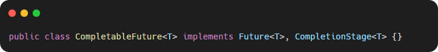

可以看到，[CompletableFuture](http://completablefuture/) 同时实现了 [Future](http://future%20/) 和 [CompletionStage](http://completionstage%20/) 接口。

  
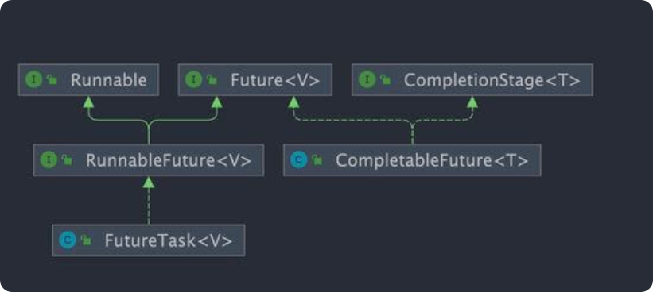

[CompletionStage](http://completionstage/) 接口描述了一个异步计算的阶段。很多计算可以分成多个阶段或步骤，此时可以通过它将所有步骤组合起来，形成异步计算的流水线。

[CompletableFuture](http://completablefuture/) 除了提供了更为好用和强大的 [Future](http://future/) 特性之外，还提供了函数式编程的能力。

如上图，Future 接口有 5 个方法：

1.  boolean cancel(boolean mayInterruptIfRunning)：尝试取消执行任务。
2.  boolean isCancelled()：判断任务是否被取消。
3.  boolean isDone()：判断任务是否已经被执行完成。
4.  get()：等待任务执行完成并获取运算结果。
5.  get(long timeout, TimeUnit unit)：多了一个超时时间。

[CompletionStage](http://completionstage%20/) 接口中的方法比较多，[CompletableFuture](http://completablefuture%20/) 的函数式能力就是这个接口赋予的。从这个接口的方法参数你就可以发现其大量使用了 Java 8 引入的函数式编程。

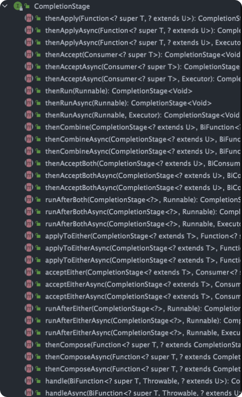

由于方法众多，所以这里不能一一讲解，下文中我会介绍大部分常见方法的使用。

###   
**2.1.3.3 CompletableFuture 常见操作**

### **1、创建 CompletableFuture**

常见的创建 CompletableFuture 对象的方法如下：

1.  通过 new 关键字。
2.  基于 CompletableFuture 自带的静态工厂方法：runAsync()、supplyAsync() 。

### **2、new 关键字**

通过 new 关键字创建 CompletableFuture 对象这种使用方式可以看作是将 CompletableFuture 当做 Future 来使用。

下面咱们来看一个简单的案例，我们通过创建了一个结果值类型为 [RpcResponse<Object>](http://rpcresponseobject/) 的 [CompletableFuture](http://completablefuture/)，你可以把 resultFuture 看作是异步运算结果的载体。

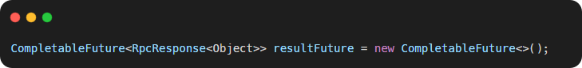

假设在未来的某个时刻，我们得到了最终的结果。这时，我们可以调用 [complete()](http://complete\(\)/) 方法为其传入结果，这表示 [resultFuture](http://resultfuture/) 已经被完成了。

  

你可以通过 isDone() 方法来检查是否已经完成。

  

获取异步计算的结果也非常简单，直接调用 get() 方法即可。调用 get() 方法的线程会阻塞直到 [CompletableFuture](http://completablefuture/) 完成运算。

  

如果你已经知道计算的结果的话，可以使用静态方法 [completedFuture()](http://completedfuture\(\)/) 来创建 [CompletableFuture](http://completablefuture%20/) 。

  
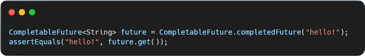

[completedFuture()](http://completedfuture\(\)/) 方法底层调用的是带参数的 new 方法，只不过，这个方法不对外暴露。

  
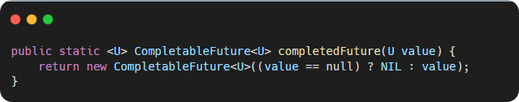

### **3、静态工厂方法**

这两个方法可以帮助我们封装计算逻辑。

  
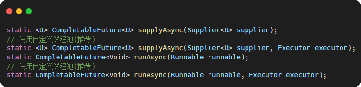

[runAsync()](http://runasync\(\)/) 方法接受的参数是 [Runnable](http://runnable%20/) ，这是一个函数式接口，不允许返回值。当你需要异步操作且不关心返回结果的时候可以使用 [runAsync()](http://runasync\(\)/) 方法。

  

[supplyAsync()](http://supplyasync\(\)/) 方法接受的参数是 [Supplier<U>](http://supplieru/) ，这也是一个函数式接口，U 是返回结果值的类型。

  
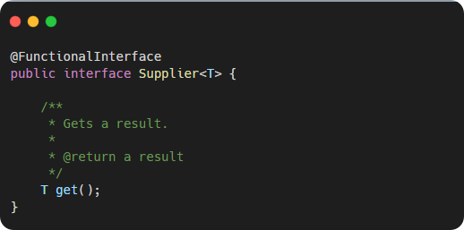

当你需要异步操作且关心返回结果的时候,可以使用 supplyAsync() 方法。

  
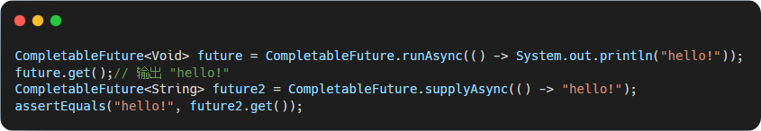

### **4、处理异步结算的结果**

当我们获取到异步计算的结果之后，还可以对其进行进一步的处理，比较常用的方法有下面几个：

1.  thenApply()
2.  thenAccept()
3.  thenRun()
4.  whenComplete()

[thenApply()](http://thenapply\(\)/) 方法接受一个 Function 实例，用它来处理结果。

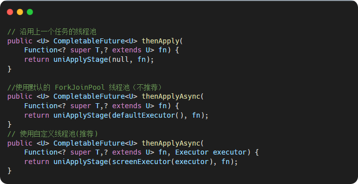

[thenApply()](http://thenapply\(\)/) 方法使用示例如下：

  
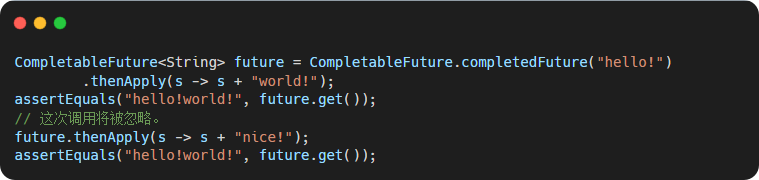

你还可以进行流式调用：

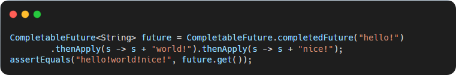

如果你不需要从回调函数中获取返回结果，可以使用 [thenAccept()](http://thenaccept\(\)/) 或者 [thenRun()](http://thenrun\(\)/)。这两个方法的区别在于 [thenRun()](http://thenrun\(\)/) 不能访问异步计算的结果。

[thenAccept()](http://thenaccept\(\)/) 方法的参数是 Consumer<? super T> 。

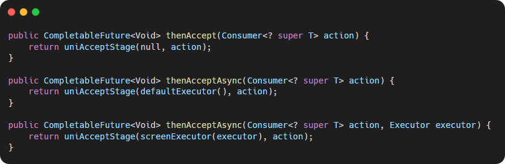

顾名思义，Consumer 属于消费型接口，它可以接收 1 个输入对象然后进行“消费”。

  
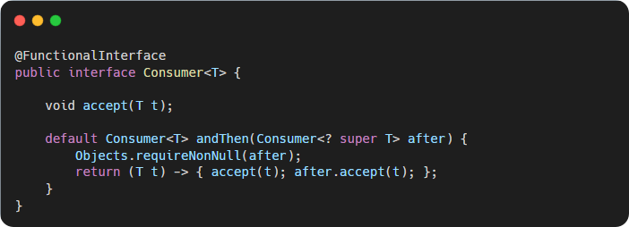

[thenRun()](http://thenrun\(\)/) 的方法是的参数是 Runnable 。

  
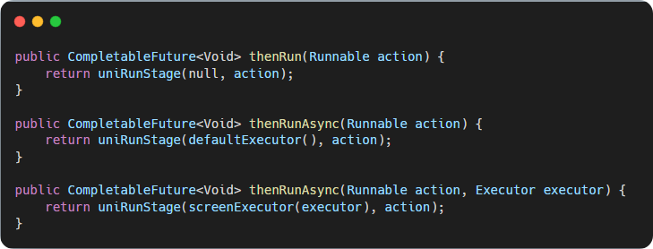

[thenAccept()](http://thenaccept\(\)/) 和 [thenRun()](http://thenrun\(\)/) 使用示例如下：

  
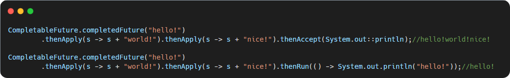

[whenComplete()](http://whencomplete\(\)/) 的方法的参数是 BiConsumer<? super T, ? super Throwable> 。

  
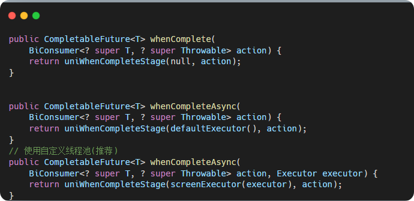

相对于 [Consumer](http://consumer%20/) ， [BiConsumer](http://biconsumer%20/) 可以接收 2 个输入对象然后进行“消费”。

  
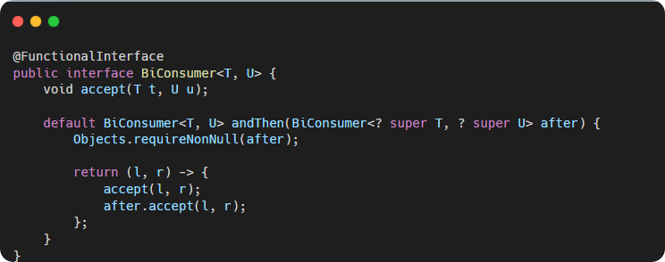

[whenComplete()](http://whencomplete\(\)/) 使用示例如下：

  
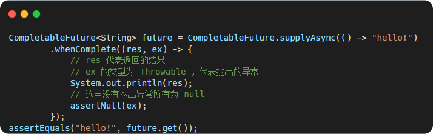

### **5、异常处理**

你可以通过 handle() 方法来处理任务执行过程中可能出现的抛出异常的情况。

  
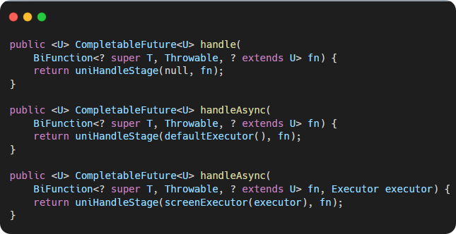

示例代码如下：

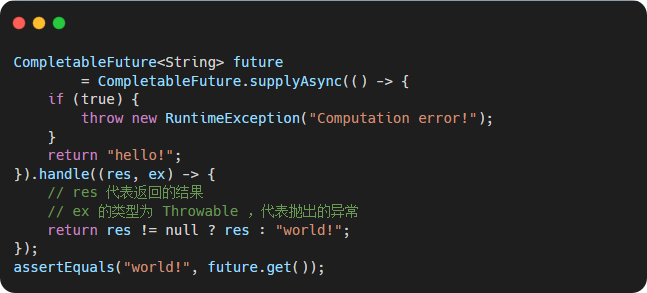

你还可以通过 [exceptionally()](http://exceptionally\(\)/) 方法来处理异常情况。

  
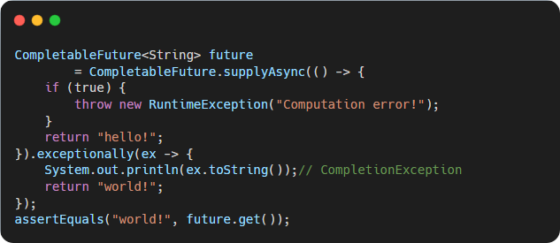

如果你想让 [CompletableFuture](http://completablefuture/) 的结果就是异常的话，可以使用 [completeExceptionally()](http://completeexceptionally\(\)/) 方法为其赋值。

  
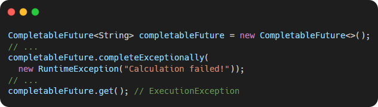

### **6、组合 CompletableFuture**

你可以使用 [thenCompose()](http://thencompose\(\)/) 按顺序链接两个 [CompletableFuture](http://completablefuture/) 对象，实现异步的任务链。它的作用是将前一个任务的返回结果作为下一个任务的输入参数，从而形成一个依赖关系。

  
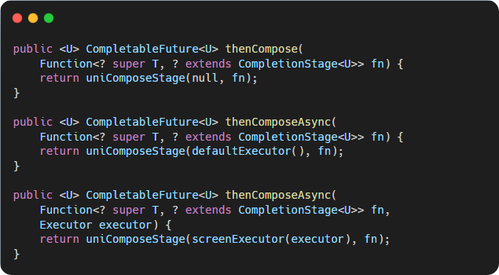

[thenCompose()](http://thencompose\(\)/) 方法会使用示例如下：

  
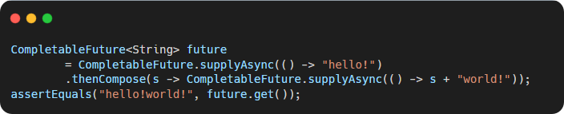

在实际开发中，这个方法还是非常有用的。比如说，task1 和 task2 都是异步执行的，但 task1 必须执行完成后才能开始执行 task2（task2 依赖 task1 的执行结果）。

和 [thenCompose()](http://thencompose\(\)/) 方法类似的还有 [thenCombine()](http://thencombine\(\)/) 方法， 它同样可以组合两个 [CompletableFuture](http://completablefuture/) 对象。

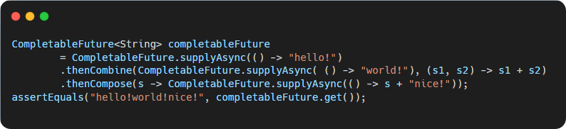

那 [thenCompose()](http://thencompose\(\)/) 和 [thenCombine()](http://thencombine\(\)/) 有什么区别呢？

1.  thenCompose() 可以链接两个 CompletableFuture 对象，并将前一个任务的返回结果作为下一个任务的参数，它们之间存在着先后顺序。
2.  thenCombine() 会在两个任务都执行完成后，把两个任务的结果合并。两个任务是并行执行的，它们之间并没有先后依赖顺序。

除了 [thenCompose()](http://thencompose\(\)/) 和 [thenCombine()](http://thencombine\(\)/) 之外， 还有一些其他的组合 [CompletableFuture](http://completablefuture/) 的方法用于实现不同的效果，满足不同的业务需求。

例如，如果我们想要实现 task1 和 task2 中的任意一个任务执行完后就执行 task3 的话，可以使用 [acceptEither()](http://accepteither\(\)/)。

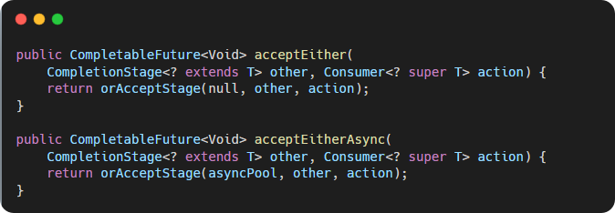

简单举一个例子：

  
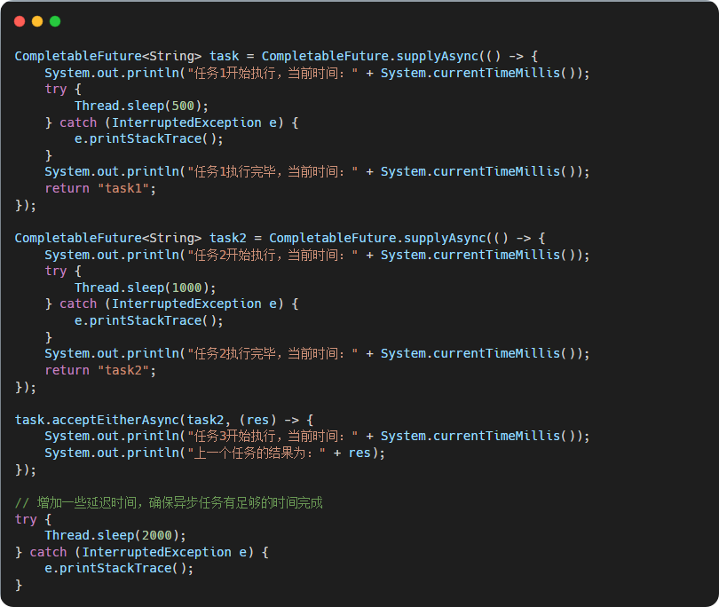

输出结果：

任务1开始执行，当前时间：1695088058520

任务2开始执行，当前时间：1695088058521

任务1执行完毕，当前时间：1695088059023

任务3开始执行，当前时间：1695088059023

上一个任务的结果为：task1

任务2执行完毕，当前时间：1695088059523

任务组合操作 [acceptEitherAsync()](http://accepteitherasync\(\)/) 会在异步任务 1 和异步任务 2 中的任意一个完成时触发执行任务 3，但是需要注意，这个触发时机是不确定的。如果任务 1 和任务 2 都还未完成，那么任务 3 就不能被执行。

### **7、并行运行多个 CompletableFuture**

你可以通过 [CompletableFuture#allOf()](http://completablefuture/#allOf\(\)) 这个静态方法来并行运行多个 [CompletableFuture](http://completablefuture%20/) 。

实际项目中，我们经常需要并行运行多个互不相关的任务，这些任务之间没有依赖关系，可以互相独立地运行。

比说我们要读取处理 6 个文件，这 6 个任务都是没有执行顺序依赖的任务，但是我们需要返回给用户的时候将这几个文件的处理的结果进行统计整理。像这种情况我们就可以使用并行运行多个 [CompletableFuture](http://completablefuture%20/) 来处理。

示例代码如下:

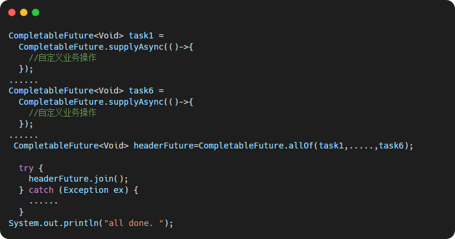

经常和 [allOf()](http://allof\(\)%20/) 方法拿来对比的是 [anyOf()](http://anyof\(\)/) 方法。[allOf()](http://allof\(\)/) 方法会等到所有的 [CompletableFuture](http://completablefuture%20/) 都运行完成之后再返回。

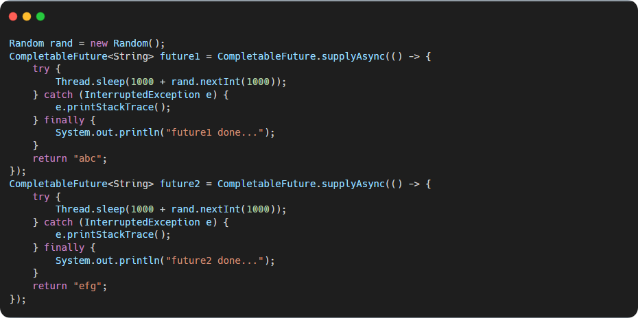

调用 join() 可以让程序等future1 和 future2 都运行完了之后再继续执行。

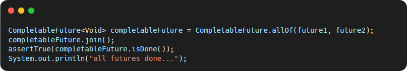

输出结果：

future1 done...

future2 done...

all futures done...

[anyOf()](http://anyof\(\)/) 方法不会等待所有的 [CompletableFuture](http://completablefuture/) 都运行完成之后再返回，只要有一个执行完成即可！

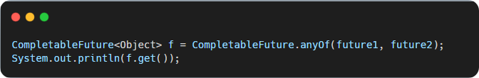

输出结果可能是：

future2 done...

efg

也可能是：

future1 done...

abc

### **8、CompletableFuture 使用建议**

### **8.1、建议使用自定义线程池**

我们上面的代码示例中，为了方便，都没有选择自定义线程池。实际项目中，这是不可取的。

[CompletableFuture](http://completablefuture/) 默认使用全局共享的 [ForkJoinPool.commonPool()](http://forkjoinpool.commonpool\(\)/) 作为执行器，所有未指定执行器的异步任务都会使用该线程池。这意味着应用程序、多个库或框架（如 Spring、第三方库）若都依赖 [CompletableFuture](http://completablefuture/)，默认情况下它们都会共享同一个线程池。

虽然 [ForkJoinPool](http://forkjoinpool/) 效率很高，但当同时提交大量任务时，可能会导致资源竞争和线程饥饿，进而影响系统性能。

为避免这些问题，建议为 [CompletableFuture](http://completablefuture/) 提供自定义线程池，带来以下优势：

1.  **隔离性**：为不同任务分配独立的线程池，避免全局线程池资源争夺。
2.  **资源控制**：根据任务特性调整线程池大小和队列类型，优化性能表现。
3.  **异常处理**：通过自定义 ThreadFactory 更好地处理线程中的异常情况。

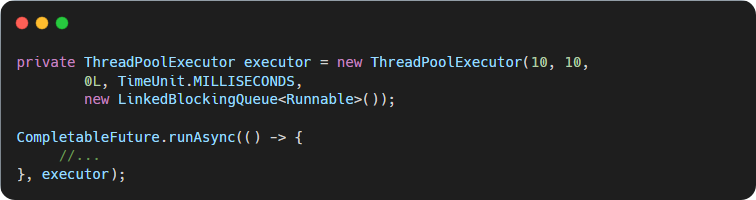

### **8.2、尽量避免使用 get()**

[CompletableFuture#get()](http://completablefuture/#get\(\)) 方法是阻塞的，尽量避免使用。如果必须要使用的话，需要添加超时时间，否则可能会导致主线程一直等待，无法执行其他任务。

  
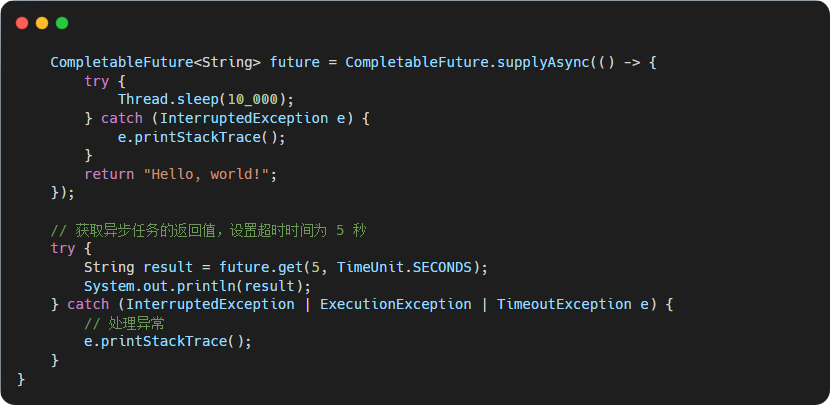

上面这段代码在调用 get() 时抛出了 [TimeoutException](http://timeoutexception/) 异常。这样我们就可以在异常处理中进行相应的操作，比如取消任务、重试任务、记录日志等。

###   
**8.3、正确进行异常处理**

使用 [CompletableFuture](http://completablefuture/) 的时候一定要以正确的方式进行异常处理，避免异常丢失或者出现不可控问题。

下面是一些建议：

1.  使用 whenComplete 方法可以在任务完成时触发回调函数，并正确地处理异常，而不是让异常被吞噬或丢失。
2.  使用 exceptionally 方法可以处理异常并重新抛出，以便异常能够传播到后续阶段，而不是让异常被忽略或终止。
3.  使用 handle 方法可以处理正常的返回结果和异常，并返回一个新的结果，而不是让异常影响正常的业务逻辑。
4.  使用 CompletableFuture.allOf 方法可以组合多个 CompletableFuture，并统一处理所有任务的异常，而不是让异常处理过于冗长或重复。
5.  ……

###   
**2.1.3.4 使用 CompletableFuture 改造订单下单入口**

了解完 [CompletableFuture](http://completablefuture/) 使用场景和常见操作，接下来我们使用 [CompletableFuture](http://completablefuture/) 来改造订单下单入口的功能实现。

### **2.1.3.4.1 线程池配置**

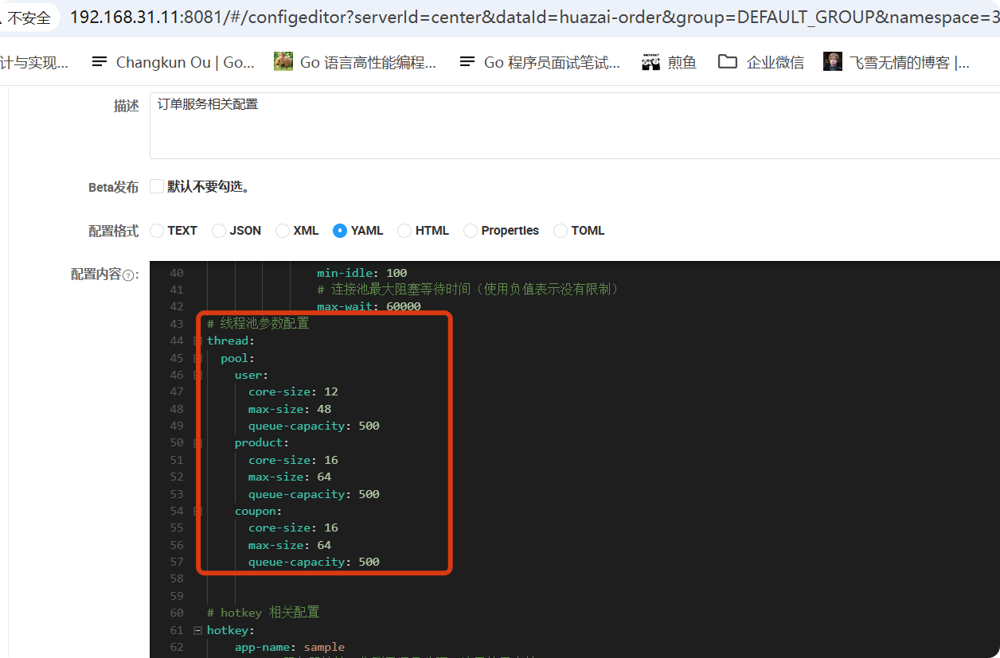

@Configuration

public class ThreadPoolConfig {

private final ThreadPoolProperties properties;

// 通过构造器注入

public ThreadPoolConfig(ThreadPoolProperties properties) {

this.properties = properties;

}

/\*\*

\* 用户服务线程池

\* 建议配置参数放入 nacos 配置中

\*/

@Bean("userThreadPool")

public ExecutorService userThreadPool() {

ThreadPoolProperties.PoolConfig config \= properties.getUser();

return new ThreadPoolExecutor(

config.getCoreSize(),

config.getMaxSize(),

60L, TimeUnit.SECONDS,

new LinkedBlockingQueue<>(config.getQueueCapacity()),

new NamedThreadFactory("user-pool-", true),

new ThreadPoolExecutor.CallerRunsPolicy()

);

}

/\*\*

\* 商品服务线程池

\* 建议配置参数放入 nacos 配置中

\*/

@Bean("productThreadPool")

public ExecutorService productThreadPool() {

ThreadPoolProperties.PoolConfig config \= properties.getProduct();

return new ThreadPoolExecutor(

config.getCoreSize(),

config.getMaxSize(),

0L, TimeUnit.MILLISECONDS,

new LinkedBlockingQueue<>(config.getQueueCapacity()),

new NamedThreadFactory("product-pool-", true),

new ThreadPoolExecutor.DiscardOldestPolicy()

);

}

/\*\*

\* 优惠券服务线程池

\* 建议配置参数放入 nacos 配置中

\*/

@Bean("couponThreadPool")

public ExecutorService couponThreadPool() {

ThreadPoolProperties.PoolConfig config \= properties.getCoupon();

return new ThreadPoolExecutor(

config.getCoreSize(),

config.getMaxSize(),

0L, TimeUnit.MILLISECONDS,

new LinkedBlockingQueue<>(config.getQueueCapacity()),

new NamedThreadFactory("coupon-pool-", true),

new ThreadPoolExecutor.DiscardOldestPolicy()

);

}

}

@ConfigurationProperties(prefix = "thread.pool")

@Data

public class ThreadPoolProperties {

/\*\*

\* 用户线程池配置

\*/

private PoolConfig user;

/\*\*

\* 商品线程池配置

\*/

private PoolConfig product;

/\*\*

\* 优惠券线程池配置

\*/

private PoolConfig coupon;

/\*\*

\* 线程池配置

\*/

@Data

public static class PoolConfig {

private int coreSize;

private int maxSize;

private int queueCapacity;

}

}

### **2.1.3.4.2 下单入口异步获取相关信息**

使用 [CompletableFuture](http://completablefuture/) 来改造订单下单入口的功能实现，实现异步并行获取「**用户收货地址信息**」、「**商品信息**」、「**优惠券信息**」。

/\*\*

\* 下单入口

\* @param preOrderEntity

\* @return

\*/

@Override

public TradePreOrderVO preOrder(PreOrderEntity preOrderEntity) {

/\*\*

\* 获取当前登录用户作为买家id

\*/

// TODO 后续使用 Redis 分布式缓存替代

LoginUser loginUser \= LoginInterceptor.threadLocal.get();

Long buyerId \= loginUser.getId();

log.info("订单模块-下单入口 buyerId:{}", buyerId);

// 1. 并行发起所有请求

CompletableFuture<List<UserAddressVO>> addressFuture = CompletableFuture

.supplyAsync(() -> getUserAddress(buyerId), userThreadPool)

.orTimeout(500, TimeUnit.MILLISECONDS) // 用户非核心快速失败

.exceptionally(ex -> {

// 降级逻辑

log.warn("订单模块-下单入口获取地址失败，使用默认地址", ex);

return createDefaultAddress(); // 返回默认地址

});

CompletableFuture<ProductSkuVO> skuFuture = CompletableFuture

.supplyAsync(() -> getSkuInfo(preOrderEntity.getSkuId()), productThreadPool)

.orTimeout(500, TimeUnit.MILLISECONDS) // 商品非核心快速失败

.exceptionally(ex -> {

// 降级逻辑

log.warn("获取商品信息失败", ex);

return fallbackSkuInfo(); // 返回默认商品信息

});

CompletableFuture<List<UserCouponVO>> couponFuture = CompletableFuture

.supplyAsync(() -> getUserCouponList(buyerId), couponThreadPool)

.orTimeout(500, TimeUnit.MILLISECONDS) // 优惠券非核心快速失败

.exceptionally(ex -> {

// 降级逻辑

log.warn("获取商品信息失败", ex);

return fallbackCouponInfo(); // 返回默认优惠券信息

});

// 2. 合并所有结果（带优先级控制）

return CompletableFuture.allOf(addressFuture, skuFuture, couponFuture)

.thenApplyAsync(v -> {

TradePreOrderVO orderVO \= new TradePreOrderVO();

try {

// 处理用户收货地址核心数据

orderVO.setUserAddress(addressFuture.get());

// 处理商品核心数据

orderVO.setProductSku(skuFuture.get());

// 处理优惠券信息

List<UserCouponVO> coupons = couponFuture.get();

orderVO.setUserAvailableCoupons(coupons);

} catch (Exception e) {

log.error("订单详情组合异常", e);

}

return orderVO;

}, userThreadPool).join();

}

整个异步并行处理流程如下：

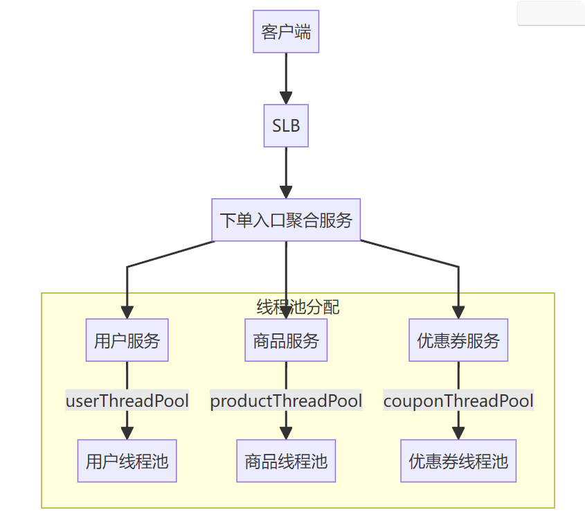

前端页面效果，我们目前没有「**店铺**」数据，所以这里就是死数据：

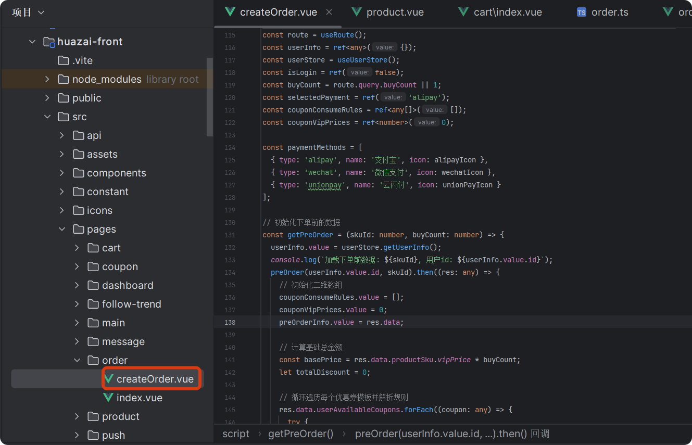

## **2.2 订单列表**

这块服务端基于「**ES**」和 「**数据库**」两个方式进行查询。通过配置进行「**ES**」和 「**数据库**」方式切换，当 spring.elasticsearch.enable = false 直接从「**数据库**」查询，当 spring.elasticsearch.enable = true 直接从「**ES**」查询。

不过这样有一个问题，除「**订单列表**」外其他方法也得搞一套「**ES**」的实现，这里就是做下示例，项目中如何做「**ES**」和 「**数据库**」方式切换。 但是这里我们就不做除「**订单列表**」外其他关于「**ES**」的实现。

###   
**2.2.1 订单查询配置切换**

配置如下：

  
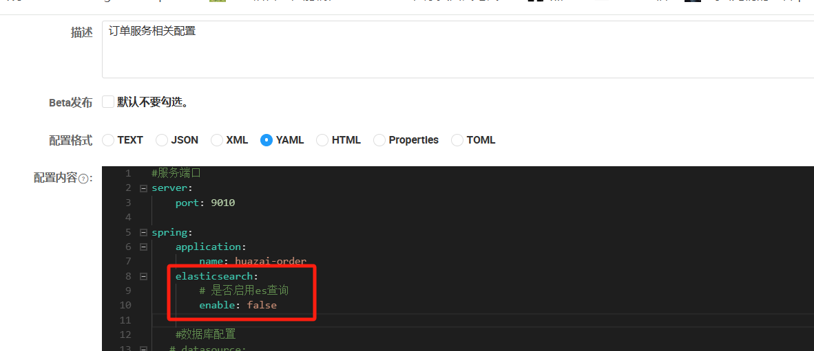

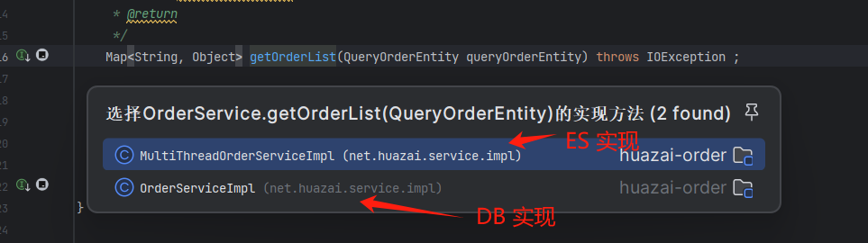

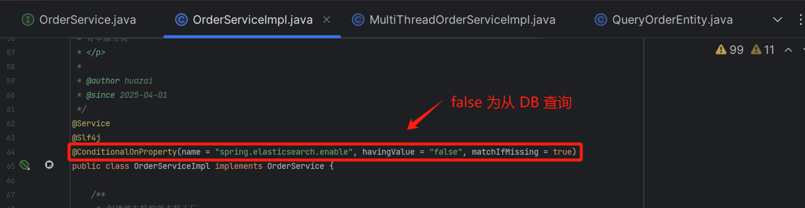

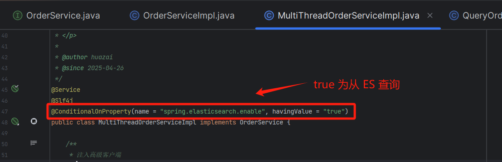

### **2.2.2 DB 查询**

请求参数：

{

"bizIdentifier": "227deccd6d0244178c4a93b7e14f188c",

"buyerId": 2,

"closeType": 0,

"orderId": 0,

"orderStatus": 8,

"page": 1,

"pageSize": 20

}

功能实现：

/\*\*

\* 分页查询订单列表

\* @param queryOrderEntity

\* @return

\*/

@Override

public Map<String, Object> getOrderList(QueryOrderEntity queryOrderEntity) throws IOException {

log.info("订单模块-从数据库获取订单列表参数信息，queryOrderEntity:{}", queryOrderEntity);

// 分页信息

Page<TradeOrderDO> pageInfo = new Page<>(queryOrderEntity.getPage(), queryOrderEntity.getPageSize());

IPage<TradeOrderDO> orderDOPage = null;

// 查询 spu 列表

orderDOPage = tradeOrderMapper.selectPage(pageInfo, new QueryWrapper<TradeOrderDO>()

.eq("buyer\_id", queryOrderEntity.getBuyerId())

.eq("biz\_identifier", queryOrderEntity.getBizIdentifier())

.eq("order\_status", queryOrderEntity.getOrderStatus())); // 已创建

List<TradeOrderDO> orderDOList = orderDOPage.getRecords();

log.info("订单模块-从数据库获取订单列表，page:{}，total:{}，size：{}", orderDOPage.getPages(), orderDOPage.getTotal(), orderDOPage.getSize());

// 对象流式转换处理订单列表结果信息

List<TradeOrderVO> orderVOList = orderDOList.stream().map(obj -> {

TradeOrderVO orderVO \= new TradeOrderVO();

BeanUtils.copyProperties(obj, orderVO);

return orderVO;

}).collect(Collectors.toList());

Map<String, Object> pageMap = new HashMap<>(5);

// 总条数

pageMap.put("total", orderDOPage.getTotal());

// 总分页数

pageMap.put("pages", orderDOPage.getPages());

// 当前页

pageMap.put("curr\_page", queryOrderEntity.getPage());

// 每页条数

pageMap.put("curr\_page\_size", queryOrderEntity.getPageSize());

// 列表信息

pageMap.put("list", orderVOList);

return pageMap;

}

查询效果：

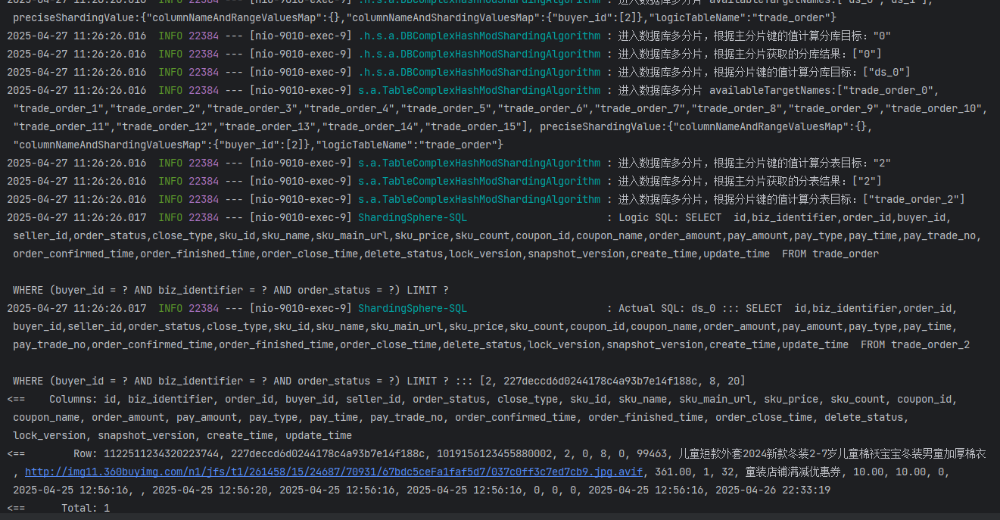

### **2.2.3 ES 查询**

请求参数：

{

"page": 1,

"pageSize": 20,

"queryDsl":{

"query":{

"bool":{

"must":\[

{

"term":{

"skuName":{

"value":"儿童"

}

}

}

\]

}

},

"sort":\[

{

"id":{

"order":"desc"

}

}

\]

}

}

功能实现：

/\*\*

\* 从 ES 分页查询订单列表

\* 1、解析 queryDSL

\* 2、设置搜索分页参数

\* 3、封装搜索请求

\* 4、真正发送 es search 请求

\* 5、返回结果集

\* @param queryOrderEntity

\* @return

\*/

@Override

public Map<String, Object> getOrderList(QueryOrderEntity queryOrderEntity) throws IOException {

SearchSourceBuilder searchSourceBuilder \= new SearchSourceBuilder();

searchSourceBuilder.trackTotalHits(true);

/\*\*

\* 1、解析 queryDSL

\*/

String queryDsl \= JSON.toJSONString(queryOrderEntity.getQueryDsl());

SearchModule searchModule \= new SearchModule(Settings.EMPTY, false, Collections.emptyList());

NamedXContentRegistry namedXContentRegistry \= new NamedXContentRegistry(searchModule.getNamedXContents());

XContent xContent \= XContentFactory.xContent(XContentType.JSON);

XContentParser xContentParser \= xContent.createParser(namedXContentRegistry, LoggingDeprecationHandler.INSTANCE, queryDsl);

searchSourceBuilder.parseXContent(xContentParser);

/\*\*

\* 2、设置搜索分页参数

\*/

int from \= (queryOrderEntity.getPage() - 1) \* queryOrderEntity.getPageSize();

searchSourceBuilder.from(from);

searchSourceBuilder.size(queryOrderEntity.getPageSize());

/\*\*

\* 3、封装搜索请求

\*/

String indexName \= "huazai\_ecshop\_buyer\_order\_index";

SearchRequest searchRequest \= new SearchRequest(indexName);

searchRequest.source(searchSourceBuilder);

/\*\*

\* 4、真正发送 es search 请求

\*/

SearchResponse searchResponse \= restHighLevelClient.search(searchRequest, RequestOptions.DEFAULT);

log.info("structuredSearch searchResponse:{}", searchResponse);

/\*\*

\* 5、返回结果集

\*/

Map<String, Object> resultMap = new HashMap<>();

SearchHit\[\] searchHits = searchResponse.getHits().getHits();

long totalCount \= searchResponse.getHits().getTotalHits().value;

resultMap.put("searchHits", searchHits);

resultMap.put("totalCount", totalCount);

resultMap.put("page", queryOrderEntity.getPage());

resultMap.put("pageSize", queryOrderEntity.getPageSize());

return resultMap;

}

查询效果：

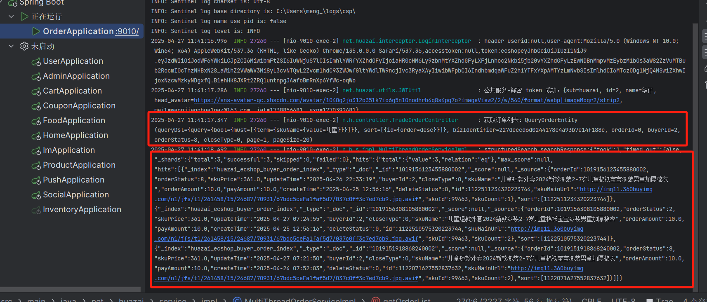

### **2.2.4 前端接入**

### **2.2.4.1 前端改动位置**

这里先说下，前端要改动的位置：

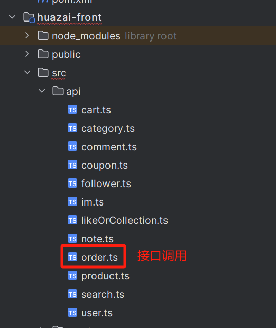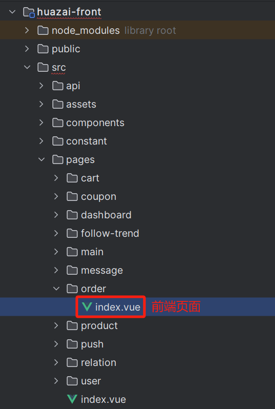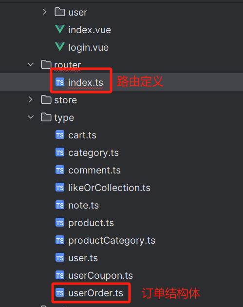

### **2.2.4.2 订单列表前端页面**

订单列表页面效果：

订单超时倒计时：

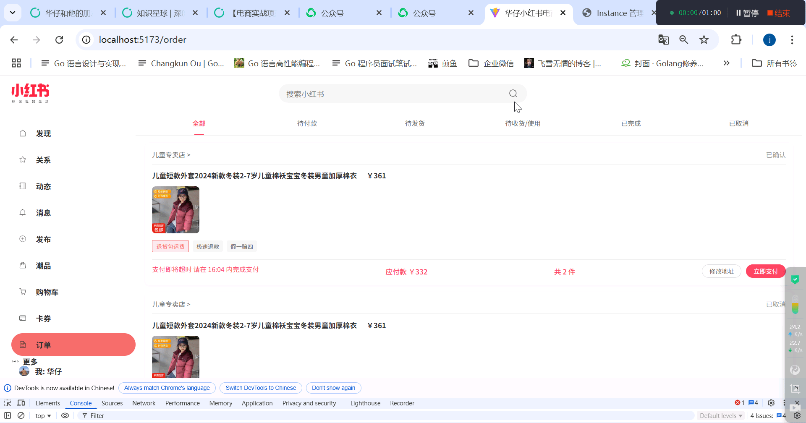

### **2.2.4.3 订单列表数据库实现**

数据库搜索实现：

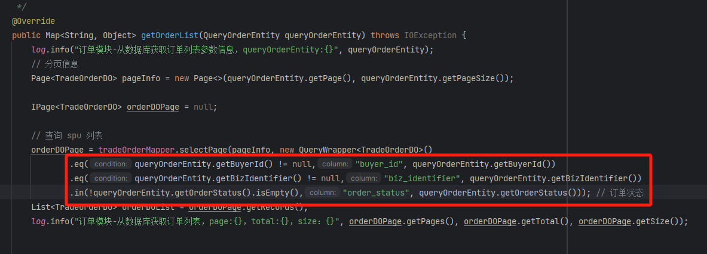

### **2.2.4.4 订单列表ES实现**

ES 实现，这里需要重新调整下「**queryDsl**」，原先是需要前端传递的，此处需要改为通过后端拼装：

/\*\*

\* Query DSL：ES 查询语法，是按照 JSON 来组织

\* 构造 queryDSL

\* "queryDsl":{

\* "query":{

\* "bool":{

\* "must":\[

\* {

\* "term":{

\* "skuName":{

\* "value":"儿童"

\* }

\* }

\* }

\* \]

\* }

\* },

\* "sort":\[

\* {

\* "id":{

\* "order":"desc"

\* }

\* }

\* \]

\*/

// 初始化查询条件

Map<String, Object> boolMap = new HashMap<>();

List<Map<String, Object>> mustClauses = new ArrayList<>();

// 1. 买家ID精确匹配

if (queryOrderEntity.getBuyerId() != null) {

mustClauses.add(Map.of(

"term", Map.of("buyerId", queryOrderEntity.getBuyerId())

));

}

// 2. 订单状态多值匹配

if (queryOrderEntity.getOrderStatus() != null && !queryOrderEntity.getOrderStatus().isEmpty()) {

mustClauses.add(Map.of(

"terms", Map.of("orderStatus", queryOrderEntity.getOrderStatus())

));

}

// 3. SKU名称模糊匹配

if (StringUtils.isNotBlank(queryOrderEntity.getSkuName())) {

mustClauses.add(Map.of(

"match", Map.of("skuName", Map.of(

"query", queryOrderEntity.getSkuName(),

"operator", "AND"

))

));

}

// 构建bool查询

if (!mustClauses.isEmpty()) {

boolMap.put("bool", Map.of("must", mustClauses));

}

// 构建完整queryDSL

Map<String, Object> queryDslMap = new HashMap<>();

queryDslMap.put("query", boolMap);

// 添加排序条件（示例按创建时间倒序）

List<Map<String, Map<String, String>>> sortList = new ArrayList<>();

String sortOrder \= "desc";

// 验证排序字段的有效性（示例字段白名单）

Set<String> validSortFields = Set.of("createTime", "updateTime", "id");

String sortField \= "id";

if (validSortFields.contains(sortField)) {

sortList.add(Map.of(

sortField, Map.of("order", sortOrder)

));

queryDslMap.put("sort", sortList);

} else {

log.warn("无效的排序字段: {}", sortField);

}

由于返回值跟数据库返回的有些区别，所以这里也做了统一处理：

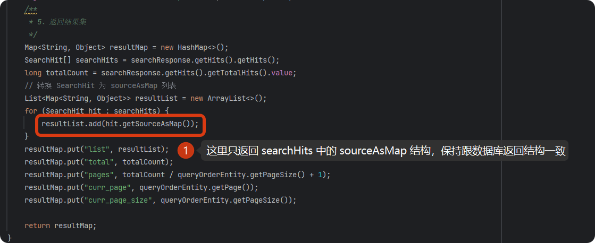

## **2.3 订单详情**

这块服务端基于「**缓存**」和 「**数据库**」进行查询，这里打算放到「**支付服务**」接入后进行开发和完善。

已经在这篇中完善了，[【电商实战项目第八十五篇】华仔电商实战支付服务基于策略+工厂模式开发支付宝下单|退款|查询|支付回调|内网穿透工具介绍](https://articles.zsxq.com/id_mujsqum4vrpw.html)

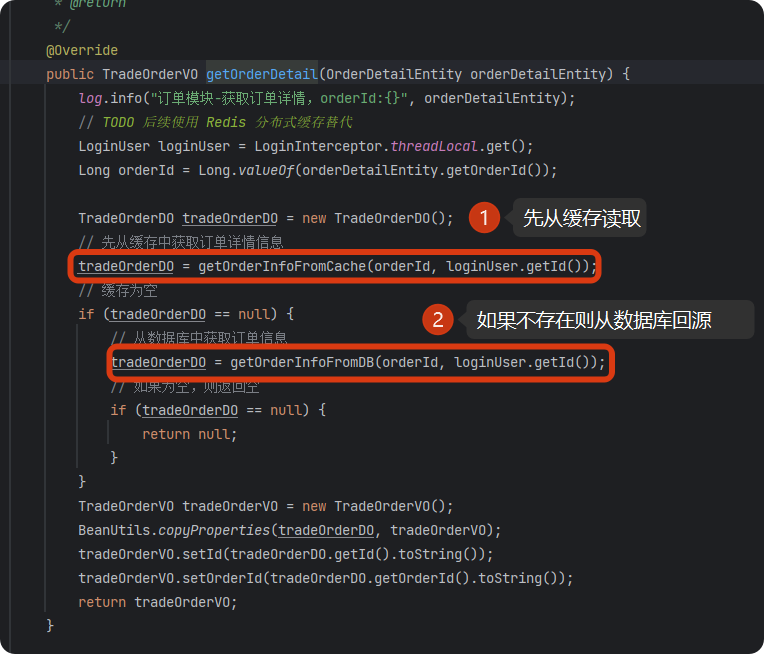

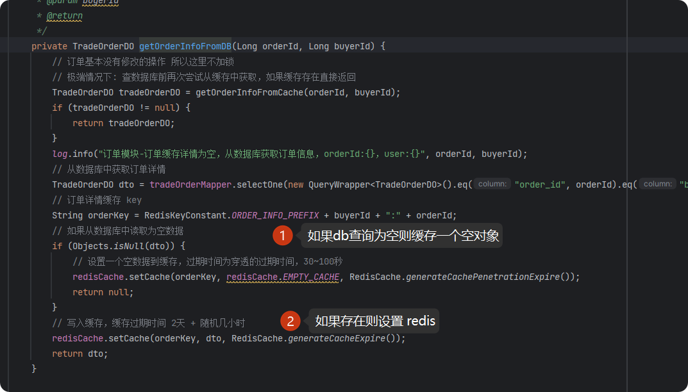

## **2.4 订单取消**

订单取消功能之前已经搞完了，这里只需前端接入下即可：

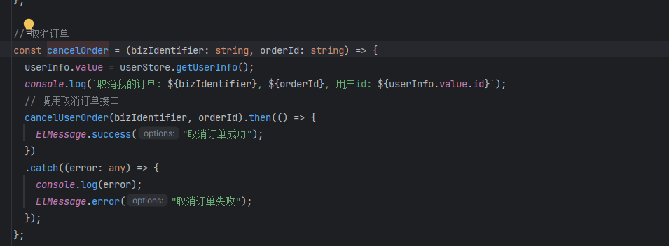

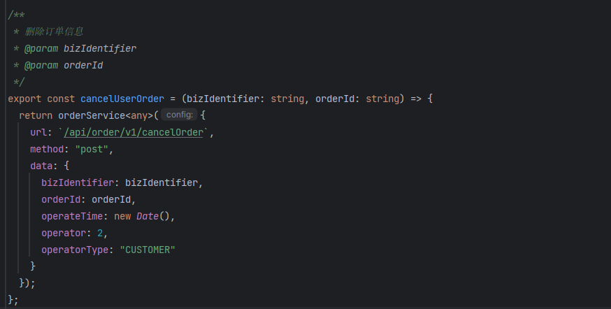

操作效果如下：

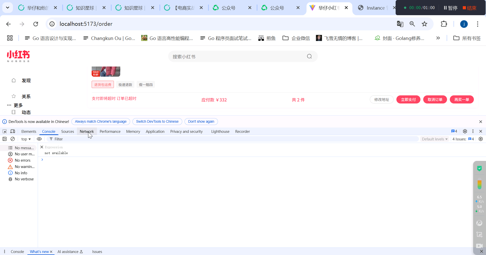

## **2.5 订单删除**

订单删除很简单，只需要传递主键 ID 即可，这样需要注意的是，列表需要返回字符串的 ID，否则会出现精度问题，导致订单删除失败。

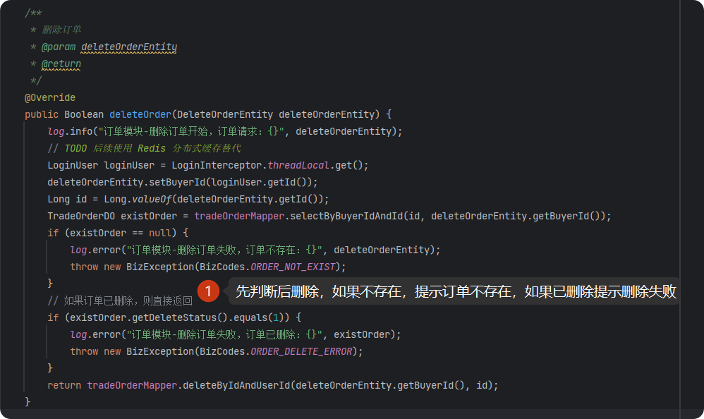

因为刚启动，所以需要处理分库分表，比较慢。下一次就很快了。

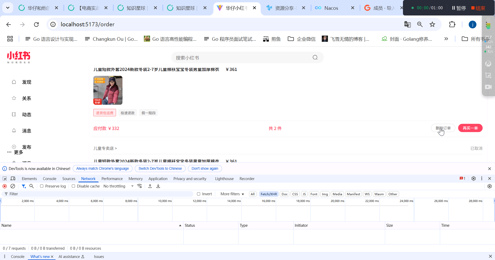

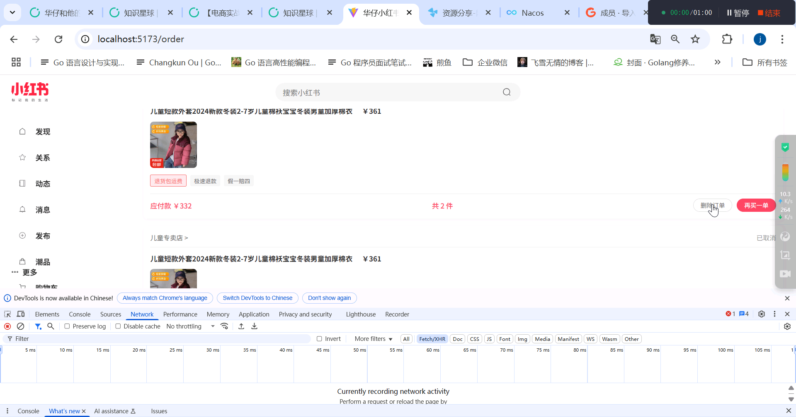

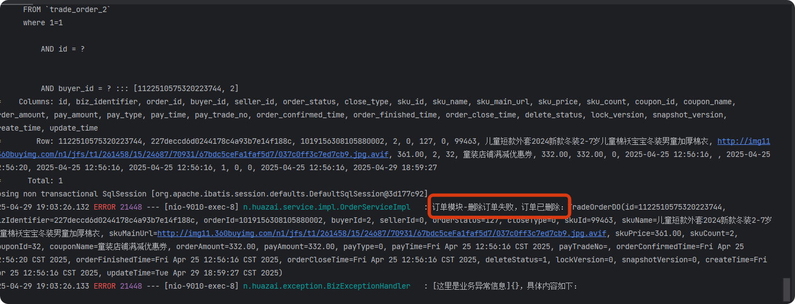